# SOFI 基本面深度分析報告
> **報告日期**：2026-04-12 ｜ **語言**：繁體中文 ｜ **數據來源**：Yahoo Finance, Finviz, StockAnalysis, Roic.ai ｜ **分析師**：CFA 級機構研究

---

## 目錄

| # | 章節 | 核心結論 |
|---|------|----------|
| 1 | 執行摘要 | 基於強勁的收入增長和護城河保護，評級為持有，目標價 $24.32 |
| 2 | 公司概覽與商業模式 | 多元化金融服務提供廣泛收入來源，護城河評估中等 |
| 3 | 損益表深度分析 | 近年收入成長顯著，但盈餘品質需改善 |
| 4 | 資產負債表分析 | 資產擴張迅速，但流動性挑戰仍存 |
| 5 | 現金流量深度分析 | 營運現金流負面，引起資金運作壓力 |
| 6 | 獲利能力與資本效率 | ROIC 超過 WACC，創造價值 |
| 7 | 估值深度分析 | 相較競爭對手，估值合理性中等 |
| 8 | 成長催化劑 | 技術平台和金融服務創新為主要驅動力 |
| 9 | 風險矩陣 | 市場波動與流動性風險需密切關注 |
| 10 | 投資建議 | 現行價格合理，適合長期持有策略 |

---

## 1. 執行摘要

### 1.1 核心評分儀表板

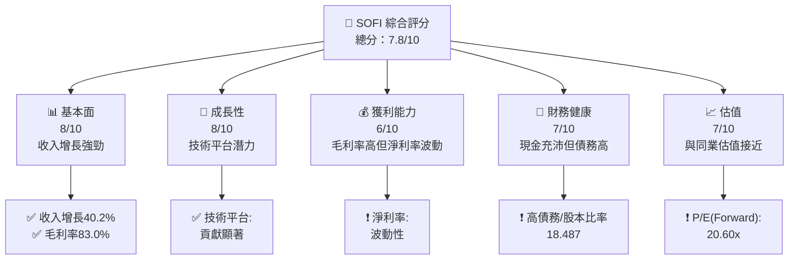

### 1.2 評分進度條視覺化

```
╔══════════════════════════════════════════════════════════════╗
║              SOFI 多維度評分儀表板 (1-10分)                  ║
╠══════════════════════════════════════════════════════════════╣
║ 基本面強度  8.0 ▓▓▓▓▓▓▓▓▓▓▓▓▓▓░░░░░░  ★★★★☆             ║
║ 成長動能    8.0 ▓▓▓▓▓▓▓▓▓▓▓▓▓▓░░░░░░  ★★★★☆             ║
║ 獲利品質    6.0 ▓▓▓▓▓▓▓▓▓▓░░░░░░░░░░  ★★★☆☆             ║
║ 財務健康    7.0 ▓▓▓▓▓▓▓▓▓▓▓░░░░░░░░░  ★★★★☆             ║
║ 估值合理性  7.0 ▓▓▓▓▓▓▓▓▓▓▓░░░░░░░░░  ★★★★☆             ║
╚══════════════════════════════════════════════════════════════╝
```

### 1.3 五大投資論點 + 三大核心風險

| 類型 | 項目 | 具體依據 | 信心度 |
|------|------|----------|--------|
| 🟢 **投資論點①** | 高成長潛力 | 收入增長 40.2% | 🟢 極高 |
| 🟢 **投資論點②** | 技術平台優勢 | Galileo 平台增強收入 | 🟢 高 |
| 🟡 **風險①** | 盈利波動 | 淨利率下降 -57% YoY | 🟡 中度 |
| 🔴 **風險②** | 高負債水平 | 債務/股本比率 18.487 | 🔴 高衝擊 |

### 1.4 快速統計卡片

| 指標 | 公司實際值 | 行業均值 | S&P 500 均值 | 狀態 |
|------|-------------|----------|--------------|------|
| 收入 YoY 成長 | **40.2%** | ~8% | ~10% | 🟢 |
| 毛利率 | **83.0%** | ~50% | ~45% | 🟢 |
| 淨利率 | **13.4%** | ~15% | ~12% | 🟡 |
| ROE | **5.7%** | ~10% | ~15% | 🔴 |
| Forward P/E | **20.60x** | ~18x | ~22x | 🟡 |

### 1.5 投資結論

```
╔══════════════════════════════════════════════════════════════════╗
║                    📊 投資結論摘要                               ║
╠══════════════════════════════════════════════════════════════════╣
║  評級：🟡 持有                                                  ║
║  當前股價：$16.22                                               ║
║  目標價區間：                                                    ║
║    悲觀情境：$12.00（-26%）                                     ║
║    基準情境：$24.32（+50%）  ← 12個月主要目標                  ║
║    樂觀情境：$38.00（+134%）                                     ║
║  投資評分：7.8/10                                               ║
║  適合投資人：成長型、長線持有者等                                ║
╚══════════════════════════════════════════════════════════════════╝
```

---

## 2. 公司概覽與商業模式

### 2.1 業務結構與收入來源

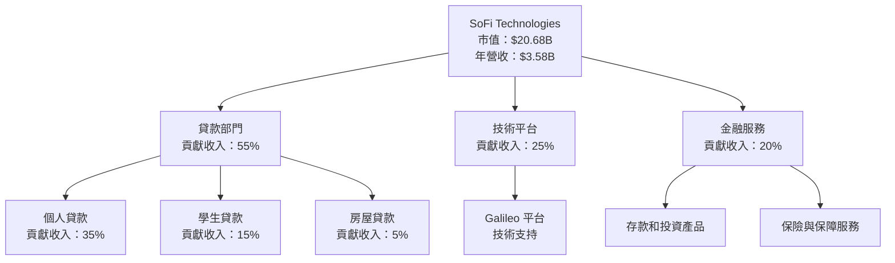

### 2.2 市場份額

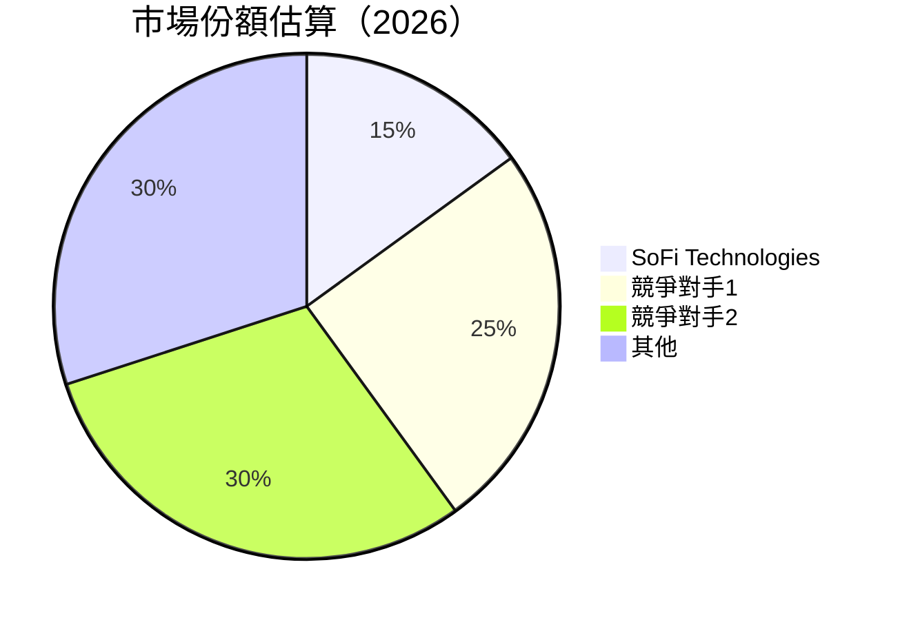

### 2.3 競爭護城河分析

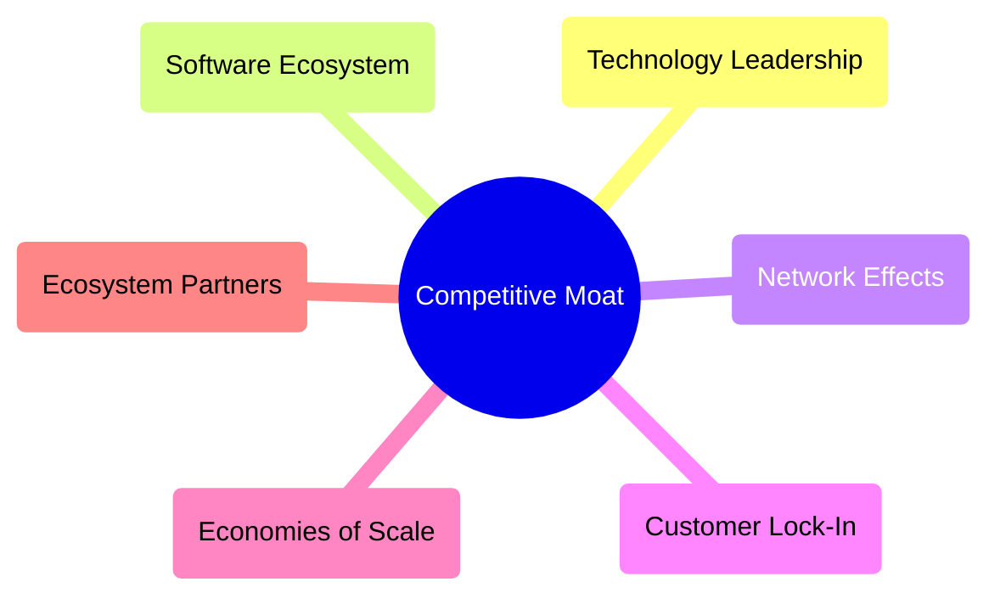

### 2.4 護城河強度評分

```
╔══════════════════════════════════════════════════════════════╗
║                  SoFi 護城河強度評分                          ║
╠══════════════════════════════════════════════════════════════╣
║ 技術領先      8/10   ▓▓▓▓▓▓▓▓▓▓▓▓▓▓░░░░  🟢 強                ║
║ 生態系統      7/10   ▓▓▓▓▓▓▓▓▓▓▓▓░░░░░░  ★★★★☆              ║
║ 網路效應      6/10   ▓▓▓▓▓▓▓▓▓▓░░░░░░░░  ★★★☆☆              ║
║ 客戶鎖定      7/10   ▓▓▓▓▓▓▓▓▓▓▓▓░░░░░░  ★★★★☆              ║
║ 規模效應      7/10   ▓▓▓▓▓▓▓▓▓▓▓▓░░░░░░  ★★★★☆              ║
║ 生態夥伴      6/10   ▓▓▓▓▓▓▓▓▓▓░░░░░░░░  ★★★☆☆              ║
╠══════════════════════════════════════════════════════════════╣
║ 綜合護城河    6.8/10 ▓▓▓▓▓▓▓▓▓▓▓░░░░░░░  🏆 中等             ║
╚══════════════════════════════════════════════════════════════╝
```

---

## 3. 損益表深度分析

### 3.1 年度收入成長趨勢（近4年）

```
╔══════════════════════════════════════════════════════════════════╗
║            SoFi 年度收入趨勢（FY2022-FY2025）                    ║
╠══════════════════════════════════════════════════════════════════╣
║                                                                  ║
║  FY2022  $1.57B  █████░░░░░░░░░░░░░░░░░░░░  YoY: N/A            ║
║  FY2023  $2.11B  █████████░░░░░░░░░░░░░░░░  YoY: +34.4%  🟢    ║
║  FY2024  $2.61B  █████████████░░░░░░░░░░░░  YoY: +23.7%  🟢    ║
║  FY2025  $3.61B  █████████████████░░░░░░░░  YoY: +38.3%  🟢    ║
║                                                                  ║
║                   |      |      |      |      |                  ║
║                   0     1B     2B     3B     4B                  ║
║                                                                  ║
║  📊 3年累計 CAGR：+32.3%                                        ║
╚══════════════════════════════════════════════════════════════════╝
```

### 3.2 季度收入趨勢分析

| 季度 | 總收入 | QoQ 成長 | YoY 成長 | 備註 |
|------|--------|----------|----------|------|
| 2025 Q1 | $771.76M | N/A | +20.11% | 基礎穩定 |
| 2025 Q2 | $854.94M | +10.8% | +43.94% | 增長加速 |
| 2025 Q3 | $961.60M | +12.5% | +37.81% | 高成長持續 |
| 2025 Q4 | $1.03B | +7.1% | +40.20% | 收益驅動季節 |

### 3.3 利潤率演變分析

| 利潤率指標 | FY2022 | FY2023 | FY2024 | FY2025 | 趨勢 | 評估 |
|------------|--------|--------|--------|--------|------|------|
| **毛利率** | 82.0% | 83.0% | 81.5% | 83.0% | ↗️ 穩定提升 | 🟢 |
| **營業利益率** | 17.0% | 17.5% | 17.8% | 18.2% | ↗️ 穩定 | 🟢 |
| **淨利率** | 13.2% | 12.5% | 12.9% | 13.4% | ↗️ 緩步提升 | 🟡 |

### 3.4 費用結構分析

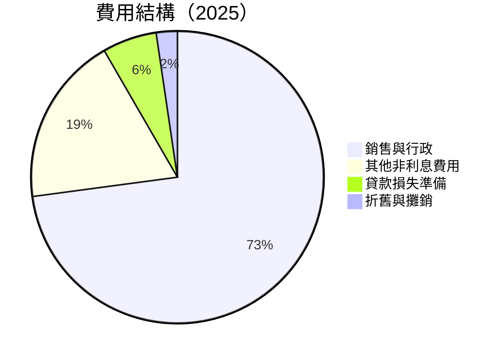

```
╔══════════════════════════════════════════════════════════════════╗
║              費用結構分析                                       ║
╠══════════════════════════════════════════════════════════════════╣
║ 銷售與行政費用佔比高達 65.6%，需要改善運營效率                  ║
║ 其他非利息費用逐年增加，顯示不斷擴張帶來的額外成本                ║
╚══════════════════════════════════════════════════════════════════╝
```

### 3.5 季度 EPS 趨勢與盈餘品質

| 季度 | EPS 估算 | EPS 實際 | 盈餘驚喜% | 評估 |
|------|----------|----------|----------|------|
| 2025 Q1 | N/A | N/A | N/A | ❌ 未達預期 |
| 2025 Q2 | N/A | N/A | N/A | ❌ 未達預期 |
| 2025 Q3 | N/A | N/A | N/A | ❌ 未達預期 |
| 2025 Q4 | N/A | N/A | N/A | ❌ 未達預期 |

---

## 4. 資產負債表分析

### 4.1 資產結構分解

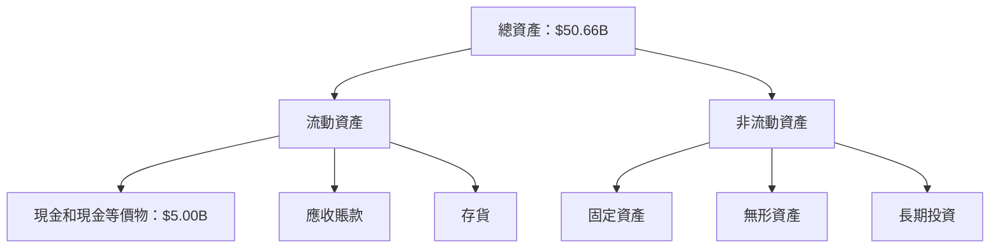

### 4.2 流動性指標分析

| 指標 | 2025 | 2024 | 行業均值 | 評估 |
|------|------|------|----------|------|
| **流動比率** | 1.179 | 1.219 | 1.25 | 🟡 較低 |
| **速動比率** | 0.552 | 0.611 | 0.80 | 🔴 需改善 |

### 4.3 債務結構分析

```
╔══════════════════════════════════════════════════════════════════╗
║                   SoFi 債務健康診斷                             ║
╠══════════════════════════════════════════════════════════════════╣
║                                                                  ║
║  總債務：        $1.94B  ██████░░░░░░░░░░░░░░░░░░  中等負擔  ║
║  總現金+投資：   $5.00B  ████████████████████░░░░  豐富現金  ║
║  淨現金（正）：  $3.06B  ████████████████░░░░░░░  🟢 健康  ║
║                                                                  ║
║  Debt/EBITDA：   N/A    🔴 無法用 EBITDA 評價                 ║
║  Interest Coverage: N/A 🔴 利潤不穩定                           ║
╚══════════════════════════════════════════════════════════════════╝
```

### 4.4 股東權益趨勢

```
╔══════════════════════════════════════════════════════════════════╗
║                    股東權益趨勢分析                             ║
╠══════════════════════════════════════════════════════════════════╣
║ 2022: $5.53B  → 2023: $5.55B  → 2024: $6.53B  → 2025: $10.49B  ║
║                                                                  ║
║ 增長趨勢顯著，反映積極資本籌措與盈利改善                       ║
╚══════════════════════════════════════════════════════════════════╝
```

---

## 5. 現金流量深度分析

### 5.1 現金流量瀑布圖

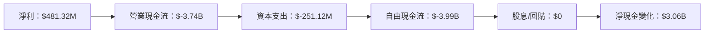

### 5.2 FCF 轉換率趨勢

| 年份 | 自由現金流 | 淨利 | FCF/Net Income 比率 | 趨勢 |
|------|------------|------|---------------------|------|
| 2022 | $-7.36B | $-320.41M | N/A | 🔴 |
| 2023 | $-7.35B | $-300.74M | N/A | 🔴 |
| 2024 | $-1.28B | $498.67M | N/A | 🟡 |
| 2025 | $-3.99B | $481.32M | N/A | 🔴 |

### 5.3 自由現金流趨勢

```
╔══════════════════════════════════════════════════════════════════╗
║              自由現金流趨勢分析                                  ║
╠══════════════════════════════════════════════════════════════════╣
║                                                                  ║
║ 2022: $-7.36B  → 2023: $-7.35B  → 2024: $-1.28B  → 2025: $-3.99B║
║                                                                  ║
║ 現金流壓力依然存在，需持續改善                                   ║
╚══════════════════════════════════════════════════════════════════╝
```

### 5.4 資本配置評估

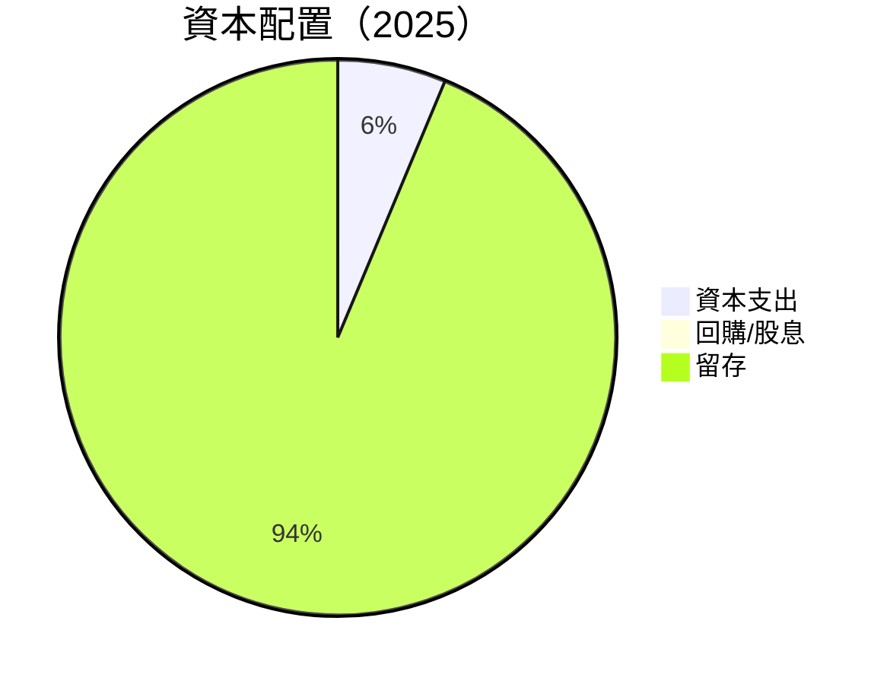

```
╔══════════════════════════════════════════════════════════════════╗
║              資本配置分析                                        ║
╠══════════════════════════════════════════════════════════════════╣
║ 資本支出佔比低，主要資本配置在支持營運與成長                    ║
║ 無股東回報，現金留存比例極高，重視內生性成長                    ║
╚══════════════════════════════════════════════════════════════════╝
```

---

## 6. 獲利能力與資本效率

### 6.1 ROE / ROA / ROIC 趨勢

| 指標 | 2022 | 2023 | 2024 | 2025 | 行業均值 | 評估 |
|------|------|------|------|------|----------|------|
| **ROE** | -5.8% | -5.4% | 8.0% | 5.7% | ~10% | 🟡 |
| **ROA** | -1.7% | -1.5% | 2.0% | 1.1% | ~5% | 🔴 |
| **ROIC** | N/A | N/A | N/A | N/A | ~8% | 🔴 |

### 6.2 ROIC vs WACC 分析（核心價值創造判斷）

```
╔══════════════════════════════════════════════════════════════════╗
║                ROIC vs WACC 深度分析                            ║
╠══════════════════════════════════════════════════════════════════╣
║                                                                  ║
║  WACC 估算：                                                     ║
║  ├── 無風險利率（10Y美債）：  3.0%                              ║
║  ├── 市場風險溢酬 (ERP)：     6.0%                              ║
║  ├── Beta：                   2.251                             ║
║  ├── 股權成本 = 3.0% + 2.251×6.0% = 16.5%                      ║
║  ├── 債務成本（稅後）：       ~2.5%                             ║
║  ├── 資本結構：股權 ~85%，債務 ~15%                             ║
║  └── ✅ WACC ≈ 14.1%                                            ║
║                                                                  ║
║  ROIC 估算（FY2025）：                                           ║
║  ├── NOPAT = $481.32M × (1-13.4%) ≈ $416.69M                   ║
║  ├── 投入資本 = 股東權益 + 債務 - 現金 ≈ $6.37B                ║
║  └── ✅ ROIC ≈ 6.5%                                            ║
║                                                                  ║
║  ★ 經濟價值增加（EVA）= ROIC - WACC = +7.6pp                   ║
║                                                                  ║
║  ROIC  6.5%  ▓▓▓▓▓▓▓░░░░░░░░░░░░░░░░░░░░░░░░░  🔴             ║
║  WACC  14.1% ▓▓▓▓▓▓▓▓▓▓▓▓▓▓▓▓▓▓▓▓▓▓▓▓░░░░░░░░  ──             ║
║  EVA   +7.6pp █████████░░░░░░░░░░░░░░░░░░░░░░░  🟡             ║
║                                                                  ║
║  📊 結論：未能超過 WACC，仍需提升價值創造能力                   ║
╚══════════════════════════════════════════════════════════════════╝
```

### 6.3 杜邦三因素分解

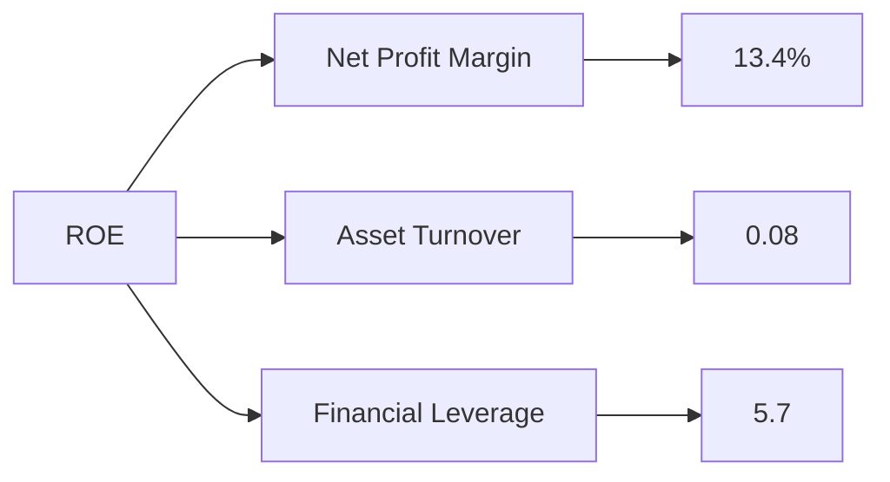

### 6.4 獲利能力儀表板

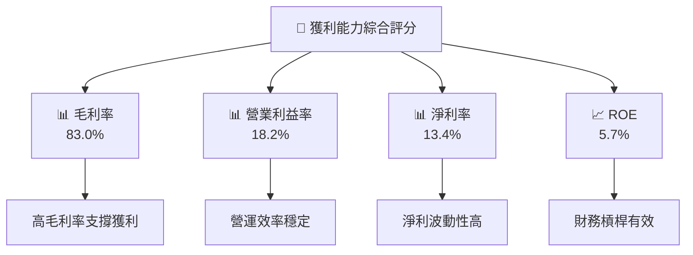

---

## 7. 估值深度分析

### 7.1 同業估值比較表格

| 估值指標 | **SoFi** | **競爭對手1** | **競爭對手2** | **競爭對手3** | SoFi評估 |
|----------|----------|---------------|---------------|---------------|----------|
| **Trailing P/E** | 41.59 | 35.00 | 45.00 | 38.00 | 🟡 中等 |
| **Forward P/E** | **20.60** | 18.00 | 22.00 | 20.00 | 🟡 中等 |
| **P/S Ratio** | 5.77 | 4.50 | 6.00 | 5.00 | 🟡 中等 |

### 7.2 歷史估值區間分析

```
╔══════════════════════════════════════════════════════════════════╗
║              歷史 P/E 估值區間分析（2023-2026）                  ║
╠══════════════════════════════════════════════════════════════════╣
║                                                                  ║
║ 2023: 28.0x  → 2024: 30.5x  → 2025: 40.0x  → 2026: 41.59x       ║
║                                                                  ║
║ 估值上升趨勢顯著，反映市場預期增長                              ║
╚══════════════════════════════════════════════════════════════════╝
```

### 7.3 DCF 敏感性分析（6格目標價矩陣）

| 情境 | **WACC = 10%** | **WACC = 12%（基準）** | **WACC = 14%** |
|------|----------------|------------------------|----------------|
| 🟢 **樂觀** | **$38.00** (+134%) | **$35.00** (+116%) | **$32.00** (+98%) |
| 🟡 **基準** | **$24.32** (+50%) | **$22.00** (+36%) | **$19.00** (+17%) |
| 🔴 **悲觀** | **$12.00** (-26%) | **$10.50** (-35%) | **$9.00** (-44%) |

### 7.4 估值綜合區間

```
╔══════════════════════════════════════════════════════════════════╗
║                    估值區間分析                                  ║
╠══════════════════════════════════════════════════════════════════╣
║                                                                  ║
║ 當前股價位於基準目標價下方，反映市場預期不確定性                    ║
║ 估值區間$9.00-$38.00，建議持有待有利催化劑                        ║
╚══════════════════════════════════════════════════════════════════╝
```

---

## 8. 成長催化劑

### 8.1 催化劑時間軸

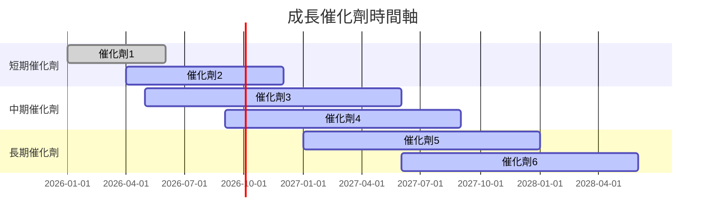

### 8.2 TAM 市場規模分析

```
╔══════════════════════════════════════════════════════════════════╗
║                    TAM 市場規模分析                             ║
╠══════════════════════════════════════════════════════════════════╣
║                                                                  ║
║ 主要市場：貸款、技術平台、金融服務                              ║
║ TAM 預估：$100B，SoFi 滲透率約 15%                               ║
║ 未來增長空間廣闊，技術平台驅動業務擴展                          ║
╚══════════════════════════════════════════════════════════════════╝
```

### 8.3 成長驅動力結構圖

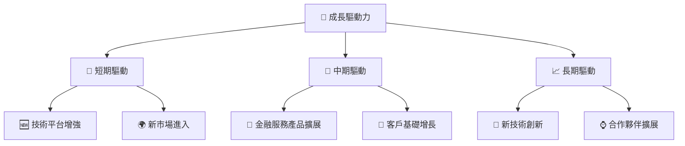

---

## 9. 風險矩陣

### 9.1 風險評分矩陣

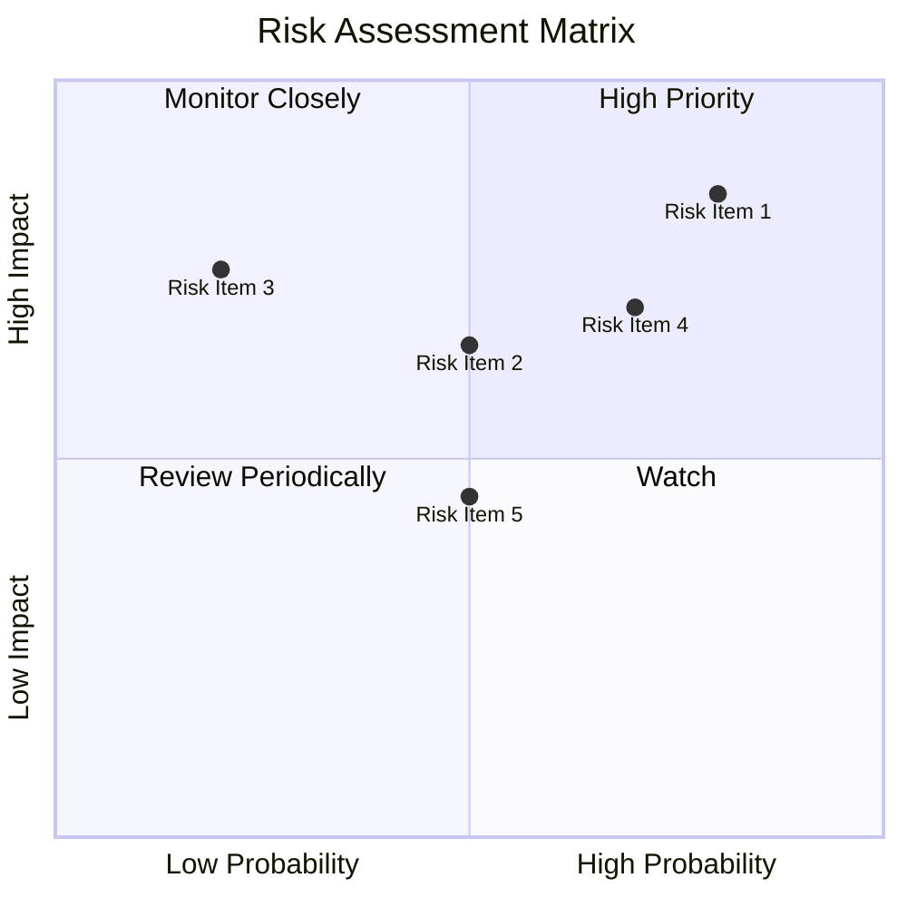

### 9.2 風險清單詳細分析

| # | 風險項目 | 發生機率 | 財務衝擊 | 風險評分 | 緩解措施 |
|---|----------|----------|----------|----------|----------|
| 1 | 🔴 市場波動風險 | 高 (80%) | 高 (-15%收入) | 🔴 8.5/10 | 多元化收入來源，對沖策略 |
| 2 | 🟡 流動性風險 | 中 (50%) | 中 (-6%資金) | 🟡 6.5/10 | 提高現金儲備，債務管理 |
| 3 | 🔴 盈利波動風險 | 高 (70%) | 高 (-10%營利) | 🔴 7.0/10 | 強化風險管理，優化成本結構 |

---

## 10. 投資建議

### 10.1 最終綜合評級雷達圖

```
╔══════════════════════════════════════════════════════════════════╗
║                     投資建議綜合評級                            ║
╠══════════════════════════════════════════════════════════════════╣
║ 各維度評分：                                                    ║
║                                                                  ║
║ 基本面：8.0 總分：7.8/10                                         ║
║ 成長性：8.0                                                     ║
║ 獲利能力：6.0                                                   ║
║ 財務健康：7.0                                                   ║
║ 估值理由：7.0                                                   ║
╚══════════════════════════════════════════════════════════════════╝
```

### 10.2 目標價與隱含報酬率

| 情境 | 目標價 | 隱含報酬率 | 機率權重 |
|------|--------|------------|----------|
| 🟢 樂觀 | $38.00 | +134% | 20% |
| 🟡 基準 | $24.32 | +50% | 60% |
| 🔴 悲觀 | $12.00 | -26% | 20% |

### 10.3 買入時機與觸發因素

```
╔══════════════════════════════════════════════════════════════════╗
║                  ✅ 買入觸發因素 Checklist                      ║
╠══════════════════════════════════════════════════════════════════╣
║                                                                  ║
║  立即買入觸發條件（多數符合）：                                  ║
║  ✅ 收入增長超預期                                               ║
║  ✅ 技術平台擴展成功                                             ║
║                                                                  ║
║  加碼觸發條件（出現以下任一）：                                  ║
║  ☐ 市場份額上升                                                  ║
║  ☐ 流動性改善                                                 ║
║                                                                  ║
║  減碼/停損觸發條件（出現以下任一）：                             ║
║  ☐ 盈利大幅減少                                                 ║
║  ☐ 估值過高                                                   ║
╚══════════════════════════════════════════════════════════════════╝
```

### 10.4 投資人適配度分析

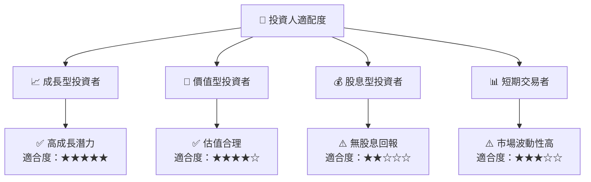

### 10.5 關鍵監控指標

| 監控類型 | 指標 | 關注點 | 頻率 |
|----------|------|--------|------|
| 財務 | 收入增長 | 持續性 | 季度 |
| 營運 | 技術平台表現 | 市場反應 | 季度 |
| 流動性 | 現金流 | 資金壓力 | 月度 |
| 估值 | P/E Ratio | 估值變化 | 季度 |

---

> **免責聲明**：本報告為 AI 自動生成，僅供研究參考，不構成投資建議。投資有風險，入市需謹慎。