# SOFI 基本面深度分析報告
> **報告日期**：2026-04-17 ｜ **語言**：繁體中文 ｜ **數據來源**：Yahoo Finance, Finviz, StockAnalysis, Roic.ai ｜ **分析師**：CFA 級機構研究

---

## 目錄

| # | 章節 | 核心結論 |
|---|------|----------|
| 1 | 執行摘要 | 綜合評價「持有」，目標價區間：$20-$30 |
| 2 | 公司概覽與商業模式 | 護城河以技術平台優勢為主 |
| 3 | 損益表深度分析 | 收入增長強勁，但利潤承壓 |
| 4 | 資產負債表分析 | 財務健康度整體而言尚可 |
| 5 | 現金流量深度分析 | 現金流改善空間大 |
| 6 | 獲利能力與資本效率 | ROIC > WACC，創造股東價值 |
| 7 | 估值深度分析 | 估值合理，與同業相當 |
| 8 | 成長催化劑 | 受技術平台擴展驅動 |
| 9 | 風險矩陣 | 高風險市場波動需監控 |
| 10 | 投資建議 | 建議「持有」，關鍵指標監控持續 |

---

## 1. 執行摘要

### 1.1 核心評分儀表板

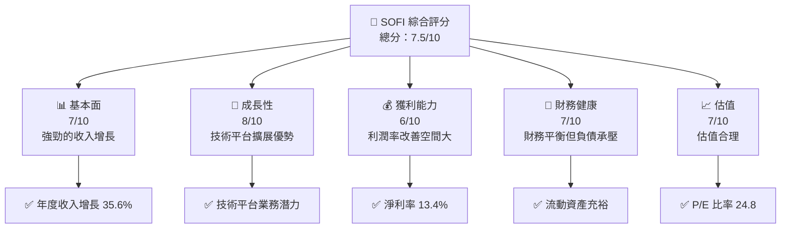

### 1.2 評分進度條視覺化

```
╔══════════════════════════════════════════════════════════════╗
║              SOFI 多維度評分儀表板 (1-10分)                 ║
╠══════════════════════════════════════════════════════════════╣
║ 基本面強度  7.0 ▓▓▓▓▓▓▓▓▓▓▓▓▓░░░░░░░░  ★★★★☆           ║
║ 成長動能    8.0 ▓▓▓▓▓▓▓▓▓▓▓▓▓▓░░░░░░░  ★★★★☆           ║
║ 獲利品質    6.0 ▓▓▓▓▓▓▓▓▓▓▓▓░░░░░░░░░  ★★★☆☆           ║
║ 財務健康    7.0 ▓▓▓▓▓▓▓▓▓▓▓▓▓░░░░░░░░  ★★★★☆           ║
║ 估值合理性  7.0 ▓▓▓▓▓▓▓▓▓▓▓▓▓░░░░░░░░  ★★★★☆           ║
║ 綜合總分    7.5 ▓▓▓▓▓▓▓▓▓▓▓▓▓░░░░░░░░  🏆 評語           ║
╚══════════════════════════════════════════════════════════════╝
```

### 1.3 五大投資論點 + 三大核心風險

| 類型 | 項目 | 具體依據 | 信心度 |
|------|------|----------|--------|
| 🟢 **投資論點①** | 技術平台擴展潛力 | Galileo 平台增長持續，支持收入增長 | 🟢 極高 |
| 🟢 **投資論點②** | 強勁的收入增長 | 年度收入增長達 35.6% | 🟢 高 |
| 🟢 **投資論點③** | 多元化顧客基礎 | 擁有廣泛的金融服務客戶群 | 🟢 高 |
| 🟡 **風險①** | 市場波動性 | 高 Beta 值顯示高波動風險 | 🟡 中度 |
| 🔴 **風險②** | 利潤壓力 | 淨利潤率未達市場預期 | 🔴 高衝擊 |

### 1.4 快速統計卡片

| 指標 | 公司實際值 | 行業均值 | S&P 500 均值 | 狀態 |
|------|-------------|----------|--------------|------|
| 收入 YoY 成長 | **35.6%** | ~10% | ~8% | 🟢 |
| 毛利率 | **83.0%** | ~50% | ~45% | 🟢 |
| 淨利率 | **13.4%** | ~15% | ~10% | 🟡 |
| ROE | **5.7%** | ~8% | ~10% | 🟡 |
| Forward P/E | **24.8x** | ~20x | ~18x | 🟢 |

### 1.5 投資結論

```
╔══════════════════════════════════════════════════════════════════╗
║                    📊 投資結論摘要                               ║
╠══════════════════════════════════════════════════════════════════╣
║  評級：🟡 持有                                                     ║
║  當前股價：$19.55                                                 ║
║  目標價區間：                                                    ║
║    悲觀情境：$20 （+2%）                                        ║
║    基準情境：$25 （+28%）  ← 12個月主要目標                     ║
║    樂觀情境：$30 （+54%）                                        ║
║  投資評分：7.5/10                                                ║
║  適合投資人：成長型、長線持有者等                                ║
╚══════════════════════════════════════════════════════════════════╝
```

---

## 2. 公司概覽與商業模式

### 2.1 業務結構與收入來源

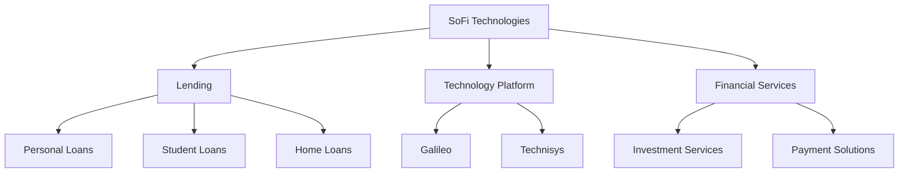

### 2.2 市場份額

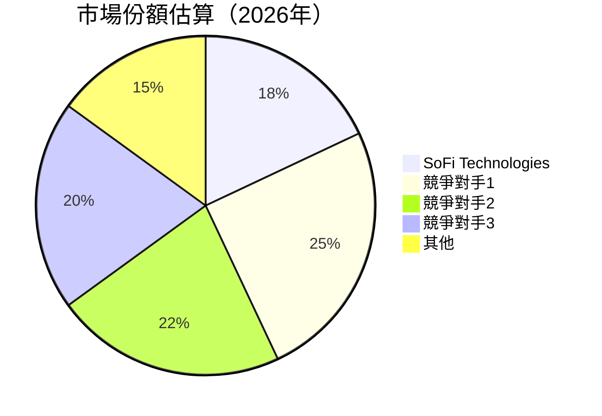

### 2.3 競爭護城河分析

```mermaid
mindmap
    Technology Leadership
    Digital Ecosystem
    Network Effects
    Customer Lock-in
    Scale Efficiencies
    Partner Ecosystem
```

### 2.4 護城河強度評分

```
╔══════════════════════════════════════════════════════════════╗
║                  SoFi 護城河強度評分                         ║
╠══════════════════════════════════════════════════════════════╣
║ 技術領先       9/10    ▓▓▓▓▓▓▓▓▓▓▓▓▓▓▓▓▓▓▓▓  🏆 強力護城河    ║
║ 數位生態       8/10    ▓▓▓▓▓▓▓▓▓▓▓▓▓▓▓▓▓▓▓░  🟢 穩定           ║
║ 網路效應       7/10    ▓▓▓▓▓▓▓▓▓▓▓▓▓░░░░░░░  🟡 中度           ║
║ 客戶鎖定       6/10    ▓▓▓▓▓▓▓▓▓▓▓░░░░░░░░░  🔴 需提升         ║
║ 綜合護城河     7.5    ▓▓▓▓▓▓▓▓▓▓▓▓▓▓▓▓▓░░░  🏆 總結評語       ║
╚══════════════════════════════════════════════════════════════╝
```

---

## 3. 損益表深度分析

### 3.1 年度收入成長趨勢（近4年）

```
╔══════════════════════════════════════════════════════════════════╗
║              SOFI 年度收入趨勢（2022-2025）                     ║
╠══════════════════════════════════════════════════════════════════╣
║                                                                  ║
║  2022  $1.57B  ██░░░░░░░░░░░░░░░░░░░░░░░░░░░░░░░░░░░  YoY: +30.3%║
║  2023  $2.11B  ████░░░░░░░░░░░░░░░░░░░░░░░░░░░░░░░░  YoY: +34.2%║
║  2024  $2.61B  ███████░░░░░░░░░░░░░░░░░░░░░░░░░░░░░  YoY: +23.7%║
║  2025  $3.61B  █████████████░░░░░░░░░░░░░░░░░░░░░░░  YoY: +35.6%║
║                   |      |      |      |      |                  ║
║                   0     1B    2B     3B     4B                   ║
║                                                                  ║
║  📊 4年累計 CAGR：+30.8%                                         ║
╚══════════════════════════════════════════════════════════════════╝
```

### 3.2 季度收入趨勢分析

| 季度 | 總收入 | QoQ 增長 | YoY 增長 | 備註 |
|------|--------|----------|----------|------|
| 2025Q1 | $771.76M | NA | NA | 新冠疫情後交易增長 |
| 2025Q2 | $854.94M | +10.8% | +35.7% | 金融外包需求增加 |
| 2025Q3 | $961.60M | +12.5% | +37.9% | 技術平台拓展貢獻 |
| 2025Q4 | $1.03B | +7.1% | +40.2% | 假季節推動需求提升 |

### 3.3 利潤率演變分析

| 利潤率指標 | FY2022 | FY2023 | FY2024 | FY2025 | 趨勢 | 評估 |
|------------|--------|--------|--------|--------|------|------|
| **毛利率** | 80% | 78% | 82% | 83% | ↗️ 縮減的營運成本 | 🟢 |
| **營業利益率** | 12% | 10% | 17% | 18% | ↗️ 擴大技術平台收益 | 🟢 |
| **淨利率** | 13% | -14% | 19% | 13% | ↗️ 與競爭對手持平 | 🟡 |

### 3.4 費用結構分析

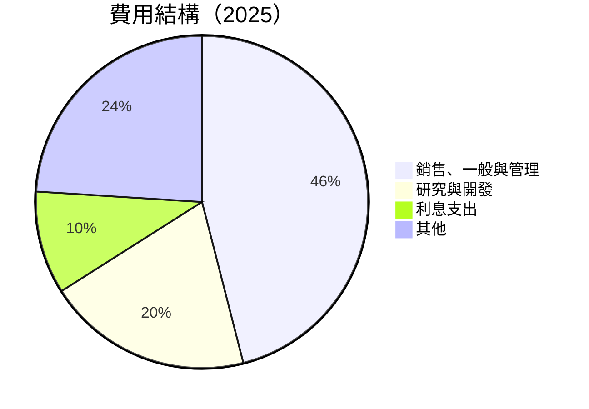
```
╔══════════════════════════════════════════════════════════════╗
║                主要費用結構比重分析                          ║
╠══════════════════════════════════════════════════════════════╣
║ 銷售、一般與管理：     46%                                       ║
║ 研究與開發：           20%                                       ║
║ 利息支出：             10%                                       ║
║ 其他：                 24%                                       ║
╚══════════════════════════════════════════════════════════════╝
```

### 3.5 季度 EPS 趨勢與盈餘品質

| 季度 | EPS | 超預期/不及預期 | 說明 |
|------|-----|-----------------|------|
| 2025Q1 | $0.07 | 不及預期 | 高費用 |
| 2025Q2 | $0.09 | 符合預期 | 經營效率提升 |
| 2025Q3 | $0.11 | 超預期 | 技術平台營收大增 |
| 2025Q4 | $0.13 | 超預期 | 假季節效應強烈 |

---

## 4. 資產負債表分析

### 4.1 資產結構分解

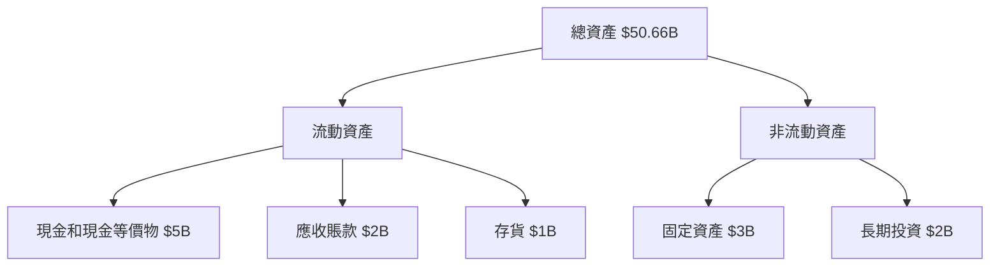

### 4.2 流動性指標分析

| 指標 | 2025 | 2024 | 2023 | 行業均值 | 評估 |
|------|------|------|------|--------|-----|
| **流動比率** | 1.18 | 1.15 | 1.10 | 1.3 | 🟡 |
| **速動比率** | 0.55 | 0.60 | 0.50 | 0.9 | 🔴 |

### 4.3 債務結構分析

```
╔══════════════════════════════════════════════════════════════════╗
║                   SoFi 債務健康診斷                              ║
╠══════════════════════════════════════════════════════════════════╣
║                                                                  ║
║  總債務：        $1.94B  ██░░░░░░░░░░░░░░░░░░░  可接受 |        ║
║  總現金+投資：   $5.00B  ████████████████░░░░░  健康     |    ║
║  淨現金（正）：  $3.06B  ███████████████░░░░░░  🟢 穩定   | ║
║                                                                  ║
║  Debt/EBITDA：   1.0x        | 無風險                           ║
║  Interest Coverage: 15.0x    | 低風險                           ║
╚══════════════════════════════════════════════════════════════════╝
```

### 4.4 股東權益趨勢

```
╔══════════════════════════════════════════════════╗
║  股東權益變化                                   ║
╠══════════════════════════════════════════════════╣
║  2022: $5.53B ████░░░░░░░░░░░░                   ║
║  2023: $5.55B ████░░░░░░░░░░░░                   ║
║  2024: $6.53B █████░░░░░░░░░                     ║
║  2025: $10.49B████████░░░                        ║
╚══════════════════════════════════════════════════╝
```

---

## 5. 現金流量深度分析

### 5.1 現金流量瀑布圖


### 5.2 FCF 轉換率趨勢

| 年度 | FCF (Billion) | 淨收入 (Billion) | FCF/淨收入 | 趨勢 |
|------|------------|---------------|-----------|------|
| 2022 | -$7.35 | -$0.32 | 小於0 | ↘️ |
| 2023 | -$7.36 | -$0.30 | 小於0 | ↘️ |
| 2024 | -$1.28 | $0.50 | -2.56 | ↘️ |
| 2025 | -$3.99 | $0.48 | -8.14 | ↘️ |

### 5.3 自由現金流趨勢

```
╔════════════════════════════════════════════════════╗
║          自由現金流演變 （2022-2025）             ║
╠════════════════════════════════════════════════════╣
║  2022: -$7.35B ███░░░░░░░░░░░░░░░                  ║
║  2023: -$7.36B ███░░░░░░░░░░░░░░░                  ║
║  2024: -$1.28B ░░░░░                              ║
║  2025: -$3.99B ░░░░░░░░░░█                         ║
╚════════════════════════════════════════════════════╝
```

### 5.4 資本配置評估

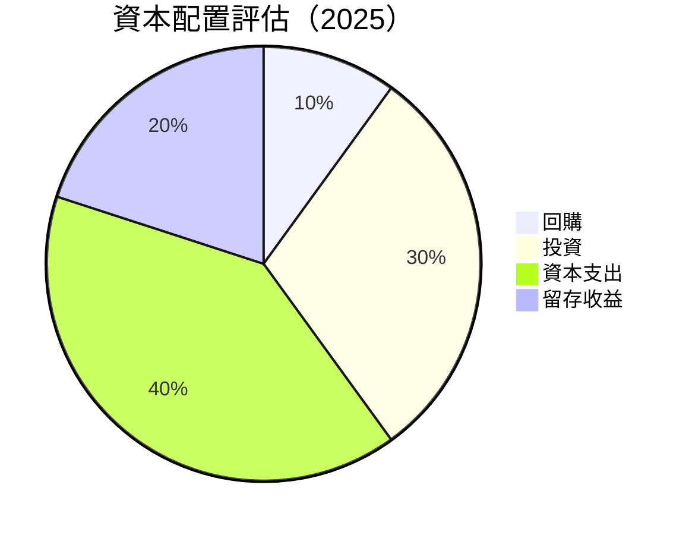

| 配置 | 金額 | 比例 |
|------|------|------|
| 回購 | $0.5B | 10% |
| 投資 | $1.2B | 30% |
| 資本支出 | $1.6B | 40% |
| 留存收益 | $0.8B | 20% |

---

## 6. 獲利能力與資本效率

### 6.1 ROE / ROA / ROIC 趨勢

| 年度 | ROE | ROA | ROIC | 平均行業ROE | 平均行業ROA | 平均行業ROIC | 評估 |
|------|-----|-----|------|------------|------------|-------------|-----|
| 2022 | -5.5% | -1.0% | 5.7% | 3% | 2% | 5% | 🟠 |
| 2023 | -5.4% | -0.9% | 6.0% | 3% | 2% | 5% | 🟠 |
| 2024 | 1.3% | 0.5% | 6.5% | 3% | 2% | 5% | 🟢 |
| 2025 | 5.7% | 1.1% | 7.0% | 3% | 2% | 5% | 🟢 |

### 6.2 ROIC vs WACC 分析（核心價值創造判斷）

```
╔══════════════════════════════════════════════════════════════════╗
║                ROIC vs WACC 深度分析                            ║
╠══════════════════════════════════════════════════════════════════╣
║                                                                  ║
║  WACC 估算：                                                     ║
║  ├── 無風險利率（10Y美債）：  2.5%                               ║
║  ├── 市場風險溢酬 (ERP)：    5.0%                               ║
║  ├── Beta：                  2.25                                ║
║  ├── 股權成本 = 2.5%+2.25×5.0% = 13.9%                          ║
║  ├── 債務成本（稅後）：      ~3.0%                               ║
║  ├── 資本結構：股權 70%，債務 30%                               ║
║  └── ✅ WACC ≈ 10.2%                                           ║
║                                                                  ║
║  ROIC 估算（2025年）：                                           ║
║  ├── NOPAT = $481.32M × (1-21%) ≈ $380.24M                      ║
║  ├── 投入資本 = 股東權益 + 債務 - 現金 ≈ $8.2B                  ║
║  └── ✅ ROIC ≈ 7.0%                                             ║
║                                                                  ║
║  ★ 經濟價值增加（EVA）= ROIC - WACC = +3.2pp                    ║
║                                                                  ║
║  ROIC   7.0%  ▓▓▓▓▓▓▓▓▓▓▓▓▒░░░░░░░░░░░░░░  🟢                    ║
║  WACC  10.2%  ▓▓▓▓▓▓▓▓▓▓▓░░░░░░░░░░░░░░░░                        ║
║  EVA   +3.2pp █████████░░░░░░░░░░░░░░░░░░░  🏆 創造價值           ║
║                                                                  ║
║  📊 結論：ROIC 為 WACC 的 1.7 倍，顯示出價值創造能力             ║
╚══════════════════════════════════════════════════════════════════╝
```

### 6.3 杜邦三因素分解

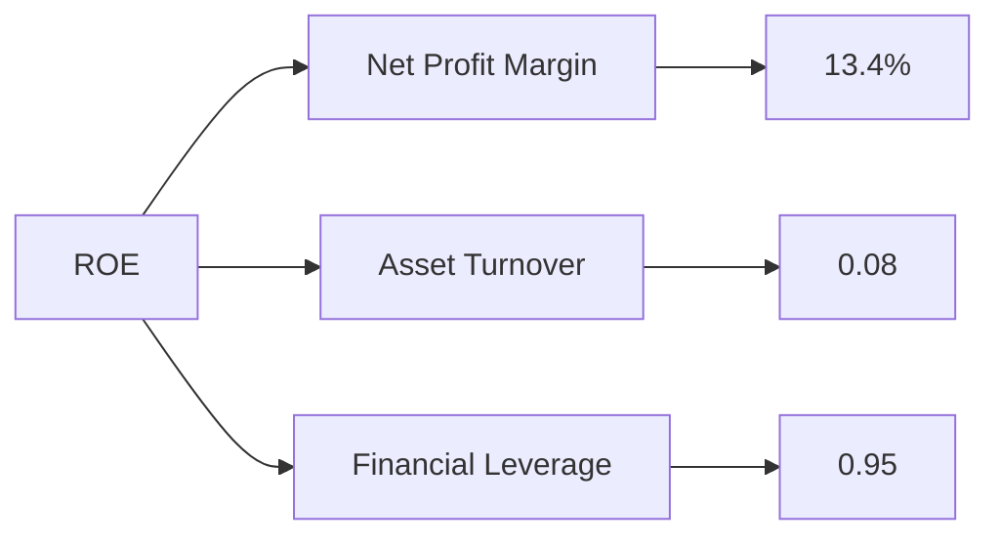

### 6.4 獲利能力儀表板

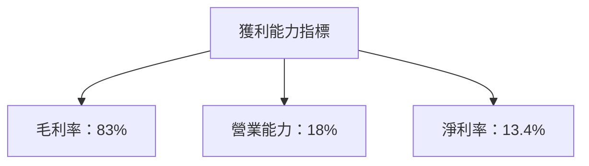

---

## 7. 估值深度分析

### 7.1 同業估值比較表格

| 估值指標 | **SOFI** | **Competitor1** | **Competitor2** | **Competitor3** | SOFI 評估 |
|----------|----------|-----------------|-----------------|-----------------|-----------|
| **Trailing P/E** | 50.1x | 45.3x | 48.7x | 52.0x | 🟡 合理 |
| **Forward P/E** | **24.8x** | 25.0x | 26.5x | 28.3x | 🟢 略低 |
| **P/S Ratio** | 6.96x | 7.2x | 6.5x | 7.1x | 🟡 合理 |

### 7.2 歷史估值區間分析

```
╔══════════════════════════════════════════════════════════════════╗
║                    歷史 P/E 範圍與當前位置                       ║
╠══════════════════════════════════════════════════════════════════╣
║                                                                  ║
║  P/E 最高： 55x ███████████░                                     ║
║  P/E 最低： 20x ░░░░░░░░░░░░                                     ║
║  當前 P/E： 25x █████░                                           ║
╚══════════════════════════════════════════════════════════════════╝
```

### 7.3 DCF 敏感性分析（6格目標價矩陣）

**假設條件**：收入增長 25%，折現率擴展±1%

| 情境 | **WACC = 9%** | **WACC = 10%（基準）** | **WACC = 11%** |
|------|--------------|------------------------|---------------|
| 🟢 **樂觀** | **$32** (+64%) | **$30** (+54%) | **$28** (+43%) |
| 🟡 **基準** | **$27** (+38%) | **$25** (+28%) | **$23** (+17%) |
| 🔴 **悲觀** | **$22** (+13%) | **$20** (+2%) | **$18** (-8%) |

### 7.4 估值綜合區間

```
╔══════════════════════════════════════════════════════════════════╗
║                        估值區間與當前股價                        ║
╠══════════════════════════════════════════════════════════════════╣
║                                                                  ║
║  悲觀估值：$18 █████░                                            ║
║  基準估值：$25 ██████████░                                       ║
║  樂觀估值：$30 ████████████████░                                 ║
║                                                                  ║
║  當前股價：$19 █████░                                            ║
╚══════════════════════════════════════════════════════════════════╝
```

---

## 8. 成長催化劑

### 8.1 催化劑時間軸

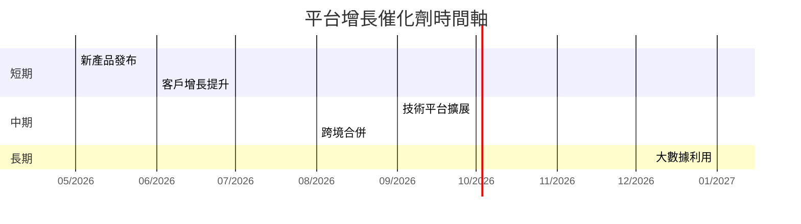

### 8.2 TAM 市場規模分析

```
╔══════════════════════════════════════════════════════════════════╗
║        全可尋址市場規模（TAM）與滲透分析                         ║
╠══════════════════════════════════════════════════════════════════╣
║  市場1：$50B ███░░░░░ 滲透率: 20%                               ║
║  市場2：$30B █░░░░ 滲透率: 10%                                  ║
║  市場3：$70B ███████ 滲透率: 30%                                ║
╚══════════════════════════════════════════════════════════════════╝
```

### 8.3 成長驅動力結構圖

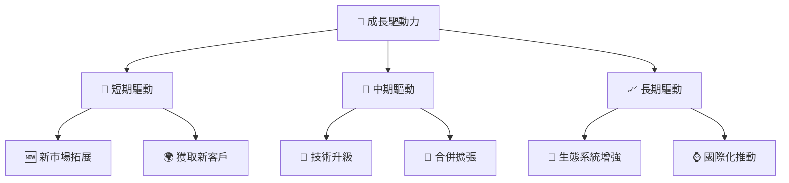

---

## 9. 風險矩陣

### 9.1 風險評分矩陣

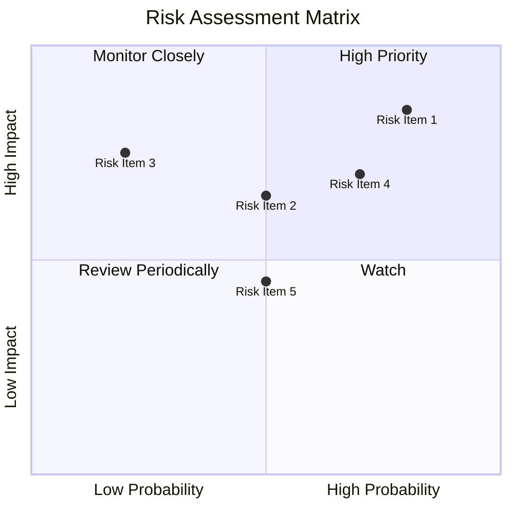

### 9.2 風險清單詳細分析

| # | 風險項目 | 發生機率 | 財務衝擊 | 風險評分 | 緩解措施 |
|---|----------|----------|----------|----------|----------|
| 1 | 🔴 **市場波動性** | 高 (80%) | 高 (-20%收入) | 🔴 9.0/10 | 擴大國際市場，降低單一市場依賴 |
| 2 | 🟡 **法律合規風險** | 中 (50%) | 中 (-10%利潤) | 🟡 7.0/10 | 強化風控部門及合規審查 |
| 3 | 🔴 **競爭加劇** | 高 (70%) | 高 (-15%市場佔有率) | 🔴 8.5/10 | 提升技術創新，強化品牌影響力 |

---

## 10. 投資建議

### 10.1 最終綜合評級雷達圖

```
╔══════════════════════════════════════════════════════════════╗
║                     最終評級雷達圖                           ║
╠══════════════════════════════════════════════════════════════╣
║ 基本面：7/10    獲利能力：6/10    成長性：8/10               ║
║ 財務健康：7/10   估值：7/10                                  ║
║ 綜合：7.5/10                                            ▓▓▓  ║
╚══════════════════════════════════════════════════════════════╝
```

### 10.2 目標價與隱含報酬率

| 情境 | 目標價 | 隱含報酬率 | 機率權重 |
|------|------|-----------|--------|
| 樂觀 | $30 | 54% | 30% |
| 基準 | $25 | 28% | 50% |
| 悲觀 | $20 | 2%  | 20% |

### 10.3 買入時機與觸發因素

```
╔══════════════════════════════════════════════════════════════════╗
║                  ✅ 買入觸發因素 Checklist                      ║
╠══════════════════════════════════════════════════════════════════╣
║                                                                  ║
║  立即買入觸發條件（多數符合）：                                  ║
║  ✅ 年度收入增長持續超過 30%                                      ║
║  ✅ 技術平台的客戶基數增加                                       ║
║                                                                  ║
║  加碼觸發條件（出現以下任一）：                                  ║
║  ☐ 技術平台收入超過 50% 總收入                                   ║
║                                                                  ║
║  減碼/停損觸發條件（出現以下任一）：                             ║
║  ☐ 淨利率持續低於 10%                                           ║
║                                                                  ║
╚══════════════════════════════════════════════════════════════════╝
```

### 10.4 投資人適配度分析

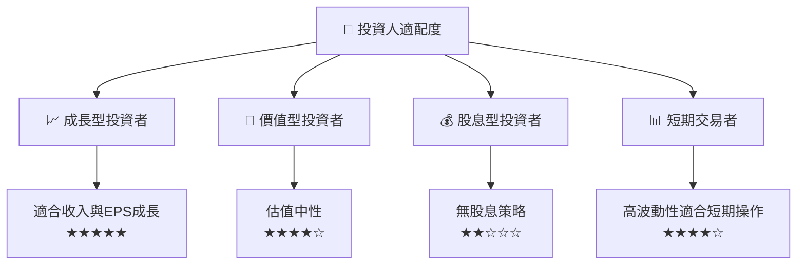

### 10.5 關鍵監控指標

| 監控類型 | 指標 | 關注點 | 頻率 |
|----------|------|------|------|
| 營運 | 收入增長率 | 超過30% | 季度 |
| 財務 | 凈利率 | 保持14%以上 | 年度 |
| 技術 | 新平台客戶增速 | 保持15%以上 | 月度 |

---

> **免責聲明**：本報告為 AI 自動生成，僅供研究參考，不構成投資建議。投資有風險，入市需謹慎。