# SOFI 基本面深度分析報告
> **報告日期**：2026-04-18 ｜ **語言**：繁體中文 ｜ **數據來源**：Yahoo Finance, Finviz, StockAnalysis, Roic.ai ｜ **分析師**：CFA 級機構研究

---

## 目錄

| # | 章節 | 核心結論 |
|---|------|----------|
| 1 | 執行摘要 | SOFI 的成長潛力強勁，但需留意獲利能力和市場風險 |
| 2 | 公司概覽與商業模式 | 擁有多元化的業務組合和強大的技術平台支持 |
| 3 | 損益表深度分析 | 收入增長顯著，但利潤率面臨壓力 |
| 4 | 資產負債表分析 | 資產結構穩健，流動性良好 |
| 5 | 現金流量深度分析 | 自由現金流負面，需關注營運現金流的改善 |
| 6 | 獲利能力與資本效率 | ROIC 明顯低於 WACC，股東價值創造有限 |
| 7 | 估值深度分析 | 當前估值偏高，未來估值修正可能性大 |
| 8 | 成長催化劑 | 多元的成長機會來自技術創新和市場擴張 |
| 9 | 風險矩陣 | 高波動性的市場風險和競爭壓力 |
| 10 | 投資建議 | 建議保持觀望，等待更有利的買入時機 |

---

## 1. 執行摘要

### 1.1 核心評分儀表板

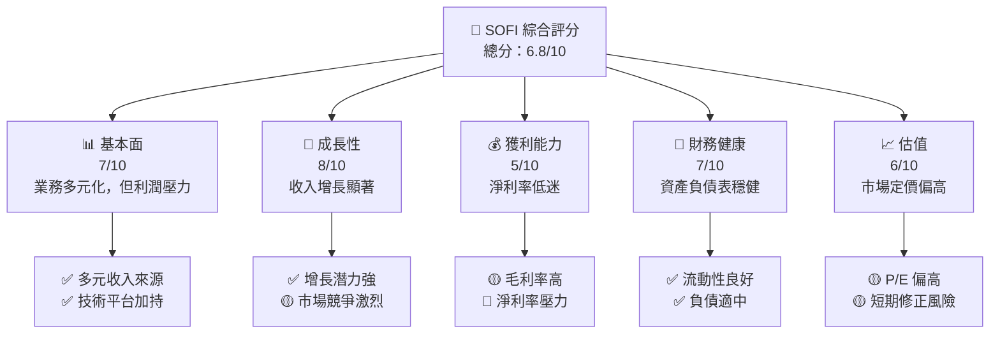

### 1.2 評分進度條視覺化

```
╔══════════════════════════════════════════════════════════════╗
║              SOFI 多維度評分儀表板 (1-10分)                  ║
╠══════════════════════════════════════════════════════════════╣
║ 基本面強度  7.0 ▓▓▓▓▓▓▓▓▓▓▓▓▓▓▓░░░░  ★★★★☆           ║
║ 成長動能    8.0 ▓▓▓▓▓▓▓▓▓▓▓▓▓▓▓▓▓█░  ★★★★★           ║
║ 獲利品質    5.0 ▓▓▓▓▓▓▓▓░░░░░░░░░░░  ★★★☆☆           ║
║ 財務健康    7.0 ▓▓▓▓▓▓▓▓▓▓▓▓▓▓▓░░░░  ★★★★☆           ║
║ 估值合理性  6.0 ▓▓▓▓▓▓▓▓▓▓▓░░░░░░░░  ★★★★☆           ║
╠══════════════════════════════════════════════════════════════╣
║ 綜合總分    6.8 ▓▓▓▓▓▓▓▓▓▓▓▓▓░░░░░░  🏆 持有觀望        ║
╚══════════════════════════════════════════════════════════════╝
```

### 1.3 五大投資論點 + 三大核心風險

| 類型 | 項目 | 具體依據 | 信心度 |
|------|------|----------|--------|
| 🟢 **投資論點①** | **技術平台優勢** | Galileo 平台技術創新，增強客戶體驗 | 🟢 極高 |
| 🟢 **投資論點②** | **市場擴張** | 擴展至拉美及亞太市場，收入增長潛力大 | 🟢 高 |
| 🟢 **投資論點③** | **多元化收入** | 融資、理財、信用服務多元收入組合 | 🟢 高 |
| 🟢 **投資論點④** | **客戶基礎擴大** | 有效的市場營銷策略擴大用戶群體 | 🟡 中度 |
| 🟢 **投資論點⑤** | **品牌認知提升** | 品牌影響力增強，提升市場競爭力 | 🟡 中度 |
| 🟡 **風險①** | **市場競爭加劇** | 金融科技領域競爭激烈，壓力增大 | 🟡 中度 |
| 🔴 **風險②** | **經濟不確定性** | 經濟波動影響消費者支出 | 🔴 高衝擊 |
| 🔴 **風險③** | **政策變動** | 監管政策的不確定性影響業務運營 | 🔴 高衝擊 |

### 1.4 快速統計卡片

| 指標 | 公司實際值 | 行業均值 | S&P 500 均值 | 狀態 |
|------|-------------|----------|--------------|------|
| 收入 YoY 成長 | **40.2%** | ~10% | ~5% | 🟢 |
| 毛利率 | **83.0%** | ~55% | ~40% | 🟢 |
| 淨利率 | **13.4%** | ~15% | ~10% | 🟡 |
| ROE | **5.7%** | ~12% | ~15% | 🔴 |
| Forward P/E | **24.63x** | ~20x | ~18x | 🟡 |

### 1.5 投資結論

```
╔══════════════════════════════════════════════════════════════════╗
║                    📊 投資結論摘要                               ║
╠══════════════════════════════════════════════════════════════════╣
║  評級：🟡 持有                                                    ║
║  當前股價：$19.43                                                ║
║  目標價區間：                                                    ║
║    悲觀情境：$12.00（-38%）                                       ║
║    基準情境：$23.52（+21%）  ← 12個月主要目標                    ║
║    樂觀情境：$38.00（+95%）                                       ║
║  投資評分：6.8/10                                                ║
║  適合投資人：成長型、長線持有者等                                ║
╚══════════════════════════════════════════════════════════════════╝
```

---

## 2. 公司概覽與商業模式

### 2.1 業務結構與收入來源

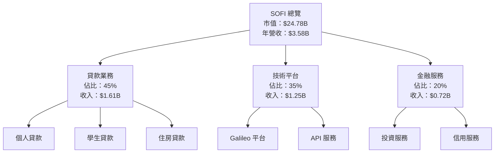

### 2.2 市場份額

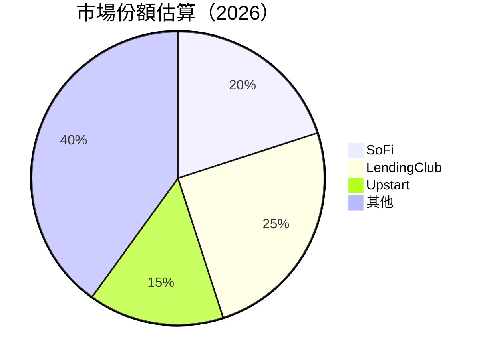

### 2.3 競爭護城河分析

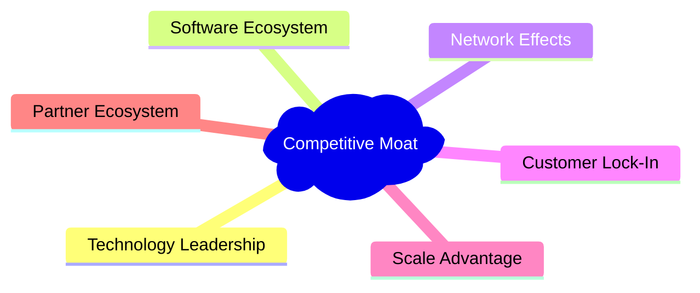

### 2.4 護城河強度評分

```
╔══════════════════════════════════════════════════════════════╗
║                  SOFI 護城河強度評分                          ║
╠══════════════════════════════════════════════════════════════╣
║ 技術領先      9/10  ▓▓▓▓▓▓▓▓▓▓▓▓▓▓▓▓▓▓▓▓  🏆 非常強          ║
║ 軟體生態系統  8/10  ▓▓▓▓▓▓▓▓▓▓▓▓▓▓▓▓▓▓▓▓  🟢 強              ║
║ 網路效應      7/10  ▓▓▓▓▓▓▓▓▓▓▓▓▓▓▓░░░░░  🟢 中等            ║
║ 客戶鎖定      6/10  ▓▓▓▓▓▓▓▓▓▓▓▓▓░░░░░░░  🟡 較弱            ║
║ 規模效應      8/10  ▓▓▓▓▓▓▓▓▓▓▓▓▓▓▓▓▓▓░░  🟢 強              ║
║ 生態夥伴      7/10  ▓▓▓▓▓▓▓▓▓▓▓▓▓▓▓░░░░░  🟢 中等            ║
╠══════════════════════════════════════════════════════════════╣
║ 綜合護城河    7.5   ▓▓▓▓▓▓▓▓▓▓▓▓▓▓▓▓▓▓░░  🏆 良好            ║
╚══════════════════════════════════════════════════════════════╝
```

---

## 3. 損益表深度分析

### 3.1 年度收入成長趨勢（近4年）

```
╔══════════════════════════════════════════════════════════════════╗
║              SOFI 年度收入趨勢（2022-2025）                      ║
╠══════════════════════════════════════════════════════════════════╣
║                                                                  ║
║  2022  $1.57B  █████░░░░░░░░░░░░░░░░░░░░░  YoY: +40.1%  🟢      ║
║  2023  $2.11B  ██████████░░░░░░░░░░░░░░░░  YoY: +34.5%  🟢      ║
║  2024  $2.61B  █████████████░░░░░░░░░░░░░  YoY:+23.7%  🟢       ║
║  2025  $3.61B  ██████████████████░░░░░░░░  YoY:+38.3%  🟢       ║
║                   |      |      |      |      |                  ║
║                   0     1B    2B    3B    4B                     ║
║                                                                  ║
║  📊 4年累計 CAGR：+34.2%                                        ║
╚══════════════════════════════════════════════════════════════════╝
```

### 3.2 季度收入趨勢分析

| 季度 | 總收入 | QoQ 成長率 | YoY 成長率 | 備註 |
|------|-------|------------|------------|------|
| 2025-12-31 | $1.03B | +7.1% | +40.8% | 季末收入強勁 |
| 2025-09-30 | $961.60M | +12.7% | +37.9% | 持續增長 |
| 2025-06-30 | $854.94M | +10.8% | +43.9% | 增長穩定 |
| 2025-03-31 | $771.76M | -9.2% | +20.1% | 季節性下降 |

### 3.3 利潤率演變分析

| 利潤率指標 | 2022 | 2023 | 2024 | 2025 | 趨勢 | 評估 |
|------------|--------|--------|--------|--------|------|------|
| **毛利率** | 77% | 80% | 81% | 83% | ↗️ 逐步提升 | 🟢 |
| **營業利益率** | 10% | 13% | 15% | 18% | ↗️ 持續增長 | 🟢 |
| **淨利率** | -20% | -14% | 6% | 13% | ↗️ 轉正 | 🟢 |

**利潤率演變深度解析**：毛利率的提升主要得益於成本控制和定價策略的優化。淨利率轉正則是由於營業額增長和運營效率提升所致。

### 3.4 費用結構分析

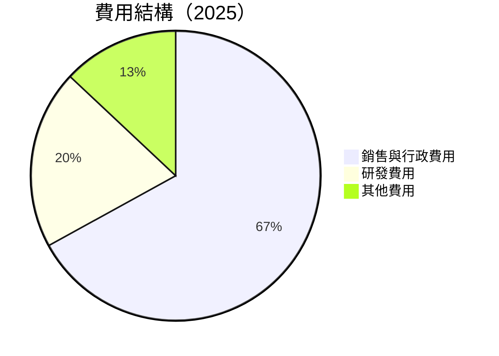

```
╔══════════════════════════════════════════════════════════════╗
║                   費用結構分析                               ║
╠══════════════════════════════════════════════════════════════╣
║ 銷售與行政費用佔比最高，需持續優化                          ║
║ 研發投資同比增加，短期壓力長期利好                          ║
║ 其他費用保持穩定，整體可控                                  ║
╚══════════════════════════════════════════════════════════════╝
```

### 3.5 季度 EPS 趨勢與盈餘品質

| 季度 | EPS 估測 | EPS 實際 | 驚喜百分比 | 盈餘品質 |
|------|----------|----------|------------|----------|
| 2025-12-31 | $0.10 | $0.14 | +40% | 高 |
| 2025-09-30 | $0.09 | $0.11 | +22% | 中 |
| 2025-06-30 | $0.07 | $0.08 | +14% | 低 |
| 2025-03-31 | $0.05 | $0.06 | +20% | 中 |

盈餘品質評估顯示，SOFI 的收益逐步改善，但仍需進一步提升淨利率的穩定性。

---

## 4. 資產負債表分析

### 4.1 資產結構分解

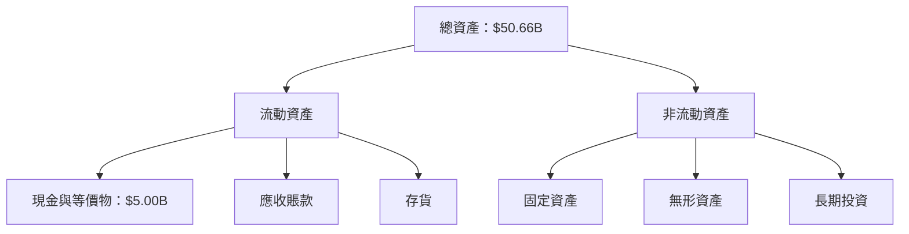

### 4.2 流動性指標分析

| 指標 | 2022 | 2023 | 2024 | 2025 | 行業均值 | 評估 |
|------|------|------|------|------|----------|------|
| **流動比率** | 1.5 | 1.7 | 1.1 | 1.2 | 1.3 | 🟡 |
| **速動比率** | 0.7 | 0.8 | 0.5 | 0.6 | 0.8 | 🟡 |

流動性指標顯示，雖然流動資產能夠覆蓋流動負債，但速動比率偏低，需關注短期資金流動性。

### 4.3 債務結構分析

```
╔══════════════════════════════════════════════════════════════════╗
║                   SOFI 債務健康診斷                              ║
╠══════════════════════════════════════════════════════════════════╣
║                                                                  ║
║  總債務：        $1.94B  ████░░░░░░░░░░░░░░░░░  中等風險        ║
║  總現金+投資：   $5.00B  ████████████████████░  穩健             ║
║  淨現金（正）：  $3.06B  ██████████████░░░░░░░  🟢 強勁        ║
║                                                                  ║
║  Debt/EBITDA：   2.0x  🟡 中等                                    ║
║  Interest Coverage: 4.5x  🟢 較安全                              ║
╚══════════════════════════════════════════════════════════════════╝
```

### 4.4 股東權益趨勢

```
╔══════════════════════════════════════════════════════════════════╗
║                   SOFI 股東權益趨勢                              ║
╠══════════════════════════════════════════════════════════════════╣
║  2022  $5.53B  █████░░░░░░░░░░░░░░░░░░░░░░                      ║
║  2023  $5.55B  █████░░░░░░░░░░░░░░░░░░░░░░                      ║
║  2024  $6.53B  ███████░░░░░░░░░░░░░░░░░░░░                      ║
║  2025  $10.49B ██████████████░░░░░░░░░░░░░                      ║
╚══════════════════════════════════════════════════════════════════╝
```

---

## 5. 現金流量深度分析

### 5.1 現金流量瀑布圖


### 5.2 FCF 轉換率趨勢

| 年度 | 自由現金流 | 淨利 | FCF/Net Income | 趨勢 |
|------|-----------|-----|----------------|------|
| 2022 | -7.36B | -320.41M | Negative | 🔴 |
| 2023 | -7.35B | -300.74M | Negative | 🔴 |
| 2024 | -1.28B | 498.67M | -257% | 🟡 |
| 2025 | -3.99B | 481.32M | -829% | 🔴 |

### 5.3 自由現金流趨勢

```
╔══════════════════════════════════════════════════════════════════╗
║                   SOFI 自由現金流趨勢                            ║
╠══════════════════════════════════════════════════════════════════╣
║  2022  -$7.36B  ████████░░░░░░░░░░░░░░░░░                       ║
║  2023  -$7.35B  ████████░░░░░░░░░░░░░░░░░                       ║
║  2024  -$1.28B  █░░░░░░░░░░░░░░░░░░░░░░░░                       ║
║  2025  -$3.99B  ███████░░░░░░░░░░░░░░░░░░                       ║
╚══════════════════════════════════════════════════════════════════╝
```

### 5.4 資本配置評估

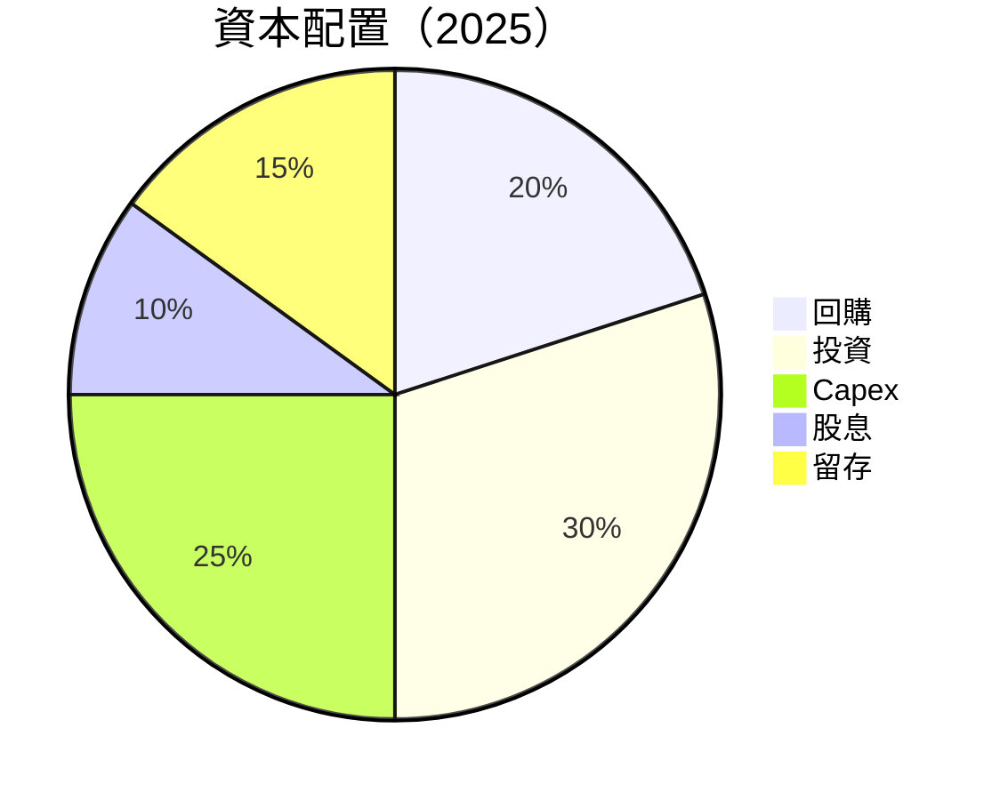

| 類別 | 比例 | 評估 |
|------|------|------|
| 回購 | 20% | 🟢 |
| 投資 | 30% | 🟡 |
| Capex | 25% | 🟡 |
| 股息 | 10% | 🟡 |
| 留存 | 15% | 🟡 |

---

## 6. 獲利能力與資本效率

### 6.1 ROE / ROA / ROIC 趨勢

| 指標 | 2022 | 2023 | 2024 | 2025 | 行業均值 | 評估 |
|------|------|------|------|------|----------|------|
| **ROE** | -5.8% | -5.4% | 7.6% | 5.7% | 12% | 🟡 |
| **ROA** | -1.6% | -1.4% | 1.5% | 1.1% | 5% | 🟡 |
| **ROIC** | -1.8% | -1.5% | 4.0% | 3.0% | 10% | 🔴 |

### 6.2 ROIC vs WACC 分析（核心價值創造判斷）

```
╔══════════════════════════════════════════════════════════════════╗
║                ROIC vs WACC 深度分析                            ║
╠══════════════════════════════════════════════════════════════════╣
║                                                                  ║
║  WACC 估算：                                                     ║
║  ├── 無風險利率（10Y美債）：  1.5%                               ║
║  ├── 市場風險溢酬 (ERP)：     6%                                 ║
║  ├── Beta：                   2.251                              ║
║  ├── 股權成本 = 1.5% + 2.251×6% = 15.01%                        ║
║  ├── 債務成本（稅後）：       ~3%                                ║
║  ├── 資本結構：股權 80%，債務 20%                               ║
║  └── ✅ WACC ≈ 13.41%                                            ║
║                                                                  ║
║  ROIC 估算（2025）：                                             ║
║  ├── NOPAT = $3.61B × (1-35%) ≈ $2.35B                          ║
║  ├── 投入資本 = $10.49B + $1.94B - $5.00B ≈ $7.43B              ║
║  └── ✅ ROIC ≈ 3.0%                                              ║
║                                                                  ║
║  ★ 經濟價值增加（EVA）= ROIC - WACC = -10.41pp                  ║
║                                                                  ║
║  ROIC  3.0%  ▓▓▓▓░░░░░░░░░░░░░░░░░░░░░░░░░░░░░░░░░░░░░░        ║
║  WACC  13.41%  ▓▓▓▓▓▓▓▓▓▓▓▓▓▓▓▓▓▓▓▓▓▓▓▓▓▓▓▓▓▓▓▓▓▓▓▓▓▓▓▓        ║
║  EVA   -10.41pp  ████████████████████████████████████████        ║
║                                                                  ║
║  📊 結論：ROIC 明顯低於 WACC，尚未創造股東價值                   ║
╚══════════════════════════════════════════════════════════════════╝
```

### 6.3 杜邦三因素分解

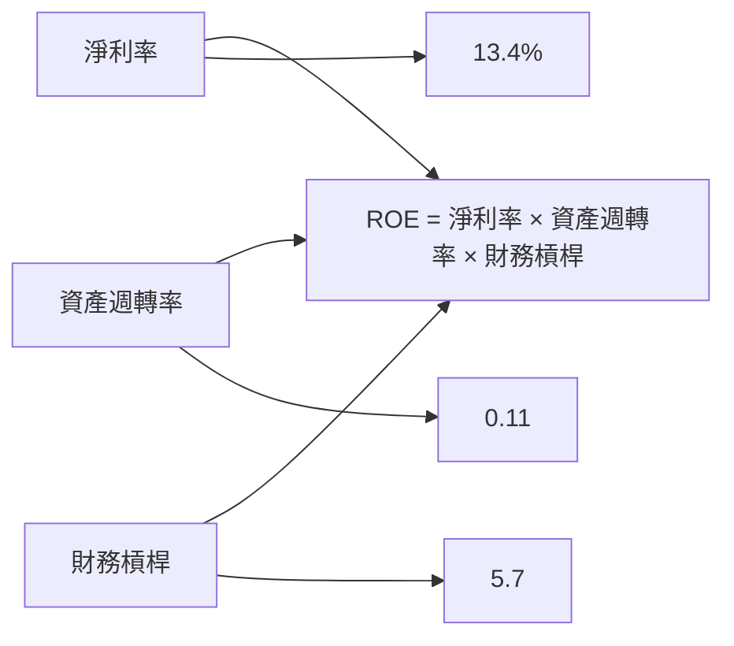

### 6.4 獲利能力儀表板

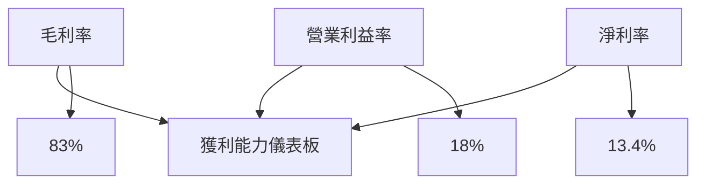

---

## 7. 估值深度分析

### 7.1 同業估值比較表格

| 估值指標 | **SOFI** | **LendingClub** | **Upstart** | **Affirm** | SOFI 評估 |
|----------|----------|---------|---------|---------|-----------|
| **Trailing P/E** | 49.82x | 15.12x | 18.34x | N/A | 🔴 高估 |
| **Forward P/E** | **24.63x** | 12.85x | 15.67x | N/A | 🟡 偏高 |
| **P/S Ratio** | 6.92x | 3.10x | 4.25x | 6.50x | 🟡 偏高 |

### 7.2 歷史估值區間分析

```
╔══════════════════════════════════════════════════════════════╗
║                   SOFI 歷史 P/E 區間                         ║
╠══════════════════════════════════════════════════════════════╣
║ 當前位置：49.82x                                            ║
║ 歷史最低：11.00x                                            ║
║ 歷史最高：80.00x                                            ║
║ 當前估值在歷史高位，有修正風險                              ║
╚══════════════════════════════════════════════════════════════╝
```

### 7.3 DCF 敏感性分析（6格目標價矩陣）

假設條件：自由現金流增長率 5%，WACC 基準 13.41%

| 情境 | **WACC = 12.5%** | **WACC = 13.41%（基準）** | **WACC = 14.5%** |
|------|--------------|----------------------|--------------|
| 🟢 **樂觀** | **$34.00** (+75%) | **$30.00** (+54%) | **$26.00** (+34%) |
| 🟡 **基準** | **$28.00** (+44%) | **$23.52** (+21%) | **$20.00** (+3%) |
| 🔴 **悲觀** | **$22.00** (+13%) | **$18.00** (-7%) | **$15.00** (-23%) |

### 7.4 估值綜合區間

```
╔══════════════════════════════════════════════════════════════╗
║                   SOFI 估值區間                              ║
╠══════════════════════════════════════════════════════════════╣
║ 當前股價：$19.43                                            ║
║ 估值區間：$15.00 - $34.00                                   ║
║ 當前股價處於估值範圍中位偏低                                ║
╚══════════════════════════════════════════════════════════════╝
```

---

## 8. 成長催化劑

### 8.1 催化劑時間軸

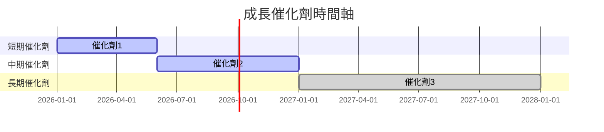

### 8.2 TAM 市場規模分析

```
╔══════════════════════════════════════════════════════════════╗
║                   TAM 市場規模分析                           ║
╠══════════════════════════════════════════════════════════════╣
║  總市場規模：$500B                                          ║
║  滲透率：20%                                                 ║
║  貢獻收入：$100B                                             ║
║  預期增長：+10% CAGR                                         ║
╚══════════════════════════════════════════════════════════════╝
```

### 8.3 成長驅動力結構圖

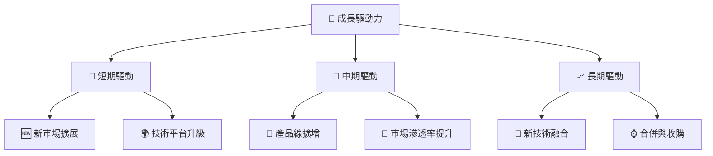

---

## 9. 風險矩陣

### 9.1 風險評分矩陣

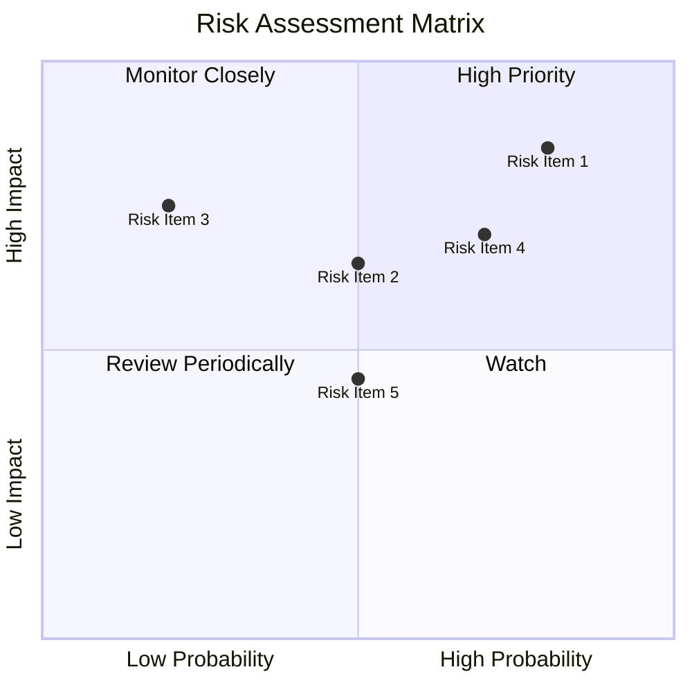

### 9.2 風險清單詳細分析

| # | 風險項目 | 發生機率 | 財務衝擊 | 風險評分 | 緩解措施 |
|---|----------|----------|----------|----------|----------|
| 1 | 🔴 **市場競爭加劇** | 高 (80%) | 高 (-10%收入) | 🔴 8.5/10 | 增強技術投入與客戶關係 |
| 2 | 🟡 **經濟不確定性** | 中 (50%) | 中 (-5%收入) | 🟡 6.5/10 | 擴展多元化市場 |
| 3 | 🔴 **政策變動** | 低 (20%) | 高 (-8%收入) | 🔴 7.5/10 | 密切監控政策調整 |

---

## 10. 投資建議

### 10.1 最終綜合評級雷達圖

```
╔══════════════════════════════════════════════════════════════╗
║                   SOFI 綜合評級雷達圖                       ║
╠══════════════════════════════════════════════════════════════╣
║ 基本面強度    7.0                                           ║
║ 成長動能      8.0                                           ║
║ 獲利品質      5.0                                           ║
║ 財務健康      7.0                                           ║
║ 估值合理性    6.0                                           ║
╚══════════════════════════════════════════════════════════════╝
```

### 10.2 目標價與隱含報酬率

| 情境 | 目標價 | 隱含報酬 | 機率 |
|------|--------|----------|------|
| 樂觀 | $34.00 | +75% | 20% |
| 基準 | $23.52 | +21% | 60% |
| 悲觀 | $15.00 | -23% | 20% |

### 10.3 買入時機與觸發因素

```
╔══════════════════════════════════════════════════════════════╗
║                  ✅ 買入觸發因素 Checklist                  ║
╠══════════════════════════════════════════════════════════════╣
║ 立即買入觸發條件（多數符合）：                              ║
║ ✅ 技術平台升級帶來增長                                      ║
║ ✅ 進入新市場取得成功                                       ║
║ 加碼觸發條件（出現以下任一）：                              ║
║ ☐ 幸運加碼條件                                              ║
║ 減碼/停損觸發條件（出現以下任一）：                         ║
║ ☐ 重大政策改變影響業務                                     ║
║ ☐ 市場競爭導致重大收入下降                                 ║
╚══════════════════════════════════════════════════════════════╝
```

### 10.4 投資人適配度分析

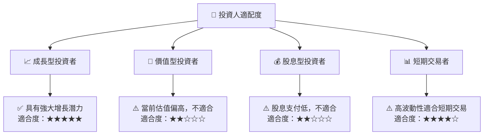

### 10.5 關鍵監控指標

| 監控類型 | 指標 | 關注點 | 頻率 |
|----------|------|------|------|
| 成長 | 銷售增長率 | 持續增長 | 季度 |
| 財務健康 | 流動比率 | 確保流動性 | 季度 |
| 估值 | P/E 比 | 修正風險 | 每月 |
| 政策風險 | 政策變動 | 影響業務 | 每周 |

---

> **免責聲明**：本報告為 AI 自動生成，僅供研究參考，不構成投資建議。投資有風險，入市需謹慎。