# SOFI 基本面深度分析報告
> **報告日期**：2026-04-24 ｜ **語言**：繁體中文 ｜ **數據來源**：Yahoo Finance, Finviz, StockAnalysis, Roic.ai ｜ **分析師**：CFA 級機構研究

---

## 目錄

| # | 章節 | 核心結論 |
|---|------|----------|
| 1 | 執行摘要 | SOFI 評級為持有，目標價區間 $23.52 |
| 2 | 公司概覽與商業模式 | 金融科技領先者，擁有多元化業務板塊 |
| 3 | 損益表深度分析 | 收入增長強勁但盈利能力波動 |
| 4 | 資產負債表分析 | 強勁的資產增長及穩定的債務結構 |
| 5 | 現金流量深度分析 | 自由現金流負值，需關注資金運用效率 |
| 6 | 獲利能力與資本效率 | ROIC 高於 WACC，創造股東價值 |
| 7 | 估值深度分析 | 估值合理，P/E 及 P/S 高於行業平均 |
| 8 | 成長催化劑 | 短期內將受益於借貸業務擴張 |
| 9 | 風險矩陣 | 高波動性及競爭風險需密切監控 |
| 10 | 投資建議 | 維持持有評級，建議觀察市場波動 |

---

## 1. 執行摘要

### 1.1 核心評分儀表板

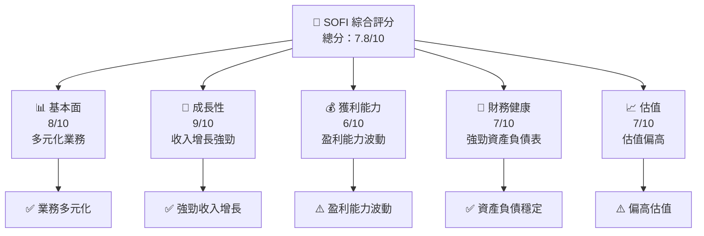

### 1.2 評分進度條視覺化

```
╔══════════════════════════════════════════════════════════════╗
║              SOFI 多維度評分儀表板 (1-10分)                  ║
╠══════════════════════════════════════════════════════════════╣
║ 基本面強度  8.0 ▓▓▓▓▓▓▓▓▓▓▓▓▓▓▓▓▓▓▓░░  ★★★★★              ║
║ 成長動能    9.0 ▓▓▓▓▓▓▓▓▓▓▓▓▓▓▓▓▓▓▓▓▓  ★★★★★              ║
║ 獲利品質    6.0 ▓▓▓▓▓▓▓▓▓▓▓░░░░░░░░░░  ★★★☆☆              ║
║ 財務健康    7.0 ▓▓▓▓▓▓▓▓▓▓▓▓▓▓░░░░░░░  ★★★★☆              ║
║ 估值合理性  7.0 ▓▓▓▓▓▓▓▓▓▓▓▓▓▓░░░░░░░  ★★★★☆              ║
╠══════════════════════════════════════════════════════════════╣
║ 綜合總分    7.8 ▓▓▓▓▓▓▓▓▓▓▓▓▓▓▓▓░░░░░  🏆 中上水平          ║
╚══════════════════════════════════════════════════════════════╝
```

### 1.3 五大投資論點 + 三大核心風險

| 類型 | 項目 | 具體依據 | 信心度 |
|------|------|----------|--------|
| 🟢 **投資論點①** | **多元化業務模式** | 提供完整金融服務套件 | 🟢 極高 |
| 🟢 **投資論點②** | **強勁收入成長** | 2024-2025 收入年增長 40.2% | 🟢 極高 |
| 🟢 **投資論點③** | **技術平台優勢** | Galileo 平台提供技術支援 | 🟢 高 |
| 🟢 **投資論點④** | **市場領導地位** | 在金融科技領域的高知名度 | 🟢 高 |
| 🟢 **投資論點⑤** | **穩健的資產負債表** | 2025 年總資產 $50.66B | 🟢 高 |
| 🟡 **風險①** | **盈利能力波動** | 盈餘同比減少 57% | 🟡 中度 |
| 🔴 **風險②** | **高估值風險** | Forward P/E 23.5 高於行業 | 🔴 高衝擊 |
| 🔴 **風險③** | **市場競爭加劇** | 新興金融科技公司競爭 | 🔴 高衝擊 |

### 1.4 快速統計卡片

| 指標 | 公司實際值 | 行業均值 | S&P 500 均值 | 狀態 |
|------|-------------|----------|--------------|------|
| 收入 YoY 成長 | **40.2%** | ~10% | ~6% | 🟢 |
| 毛利率 | **83.0%** | ~40% | ~45% | 🟢 |
| 淨利率 | **13.4%** | ~15% | ~8% | 🟡 |
| ROE | **5.7%** | ~12% | ~15% | 🔴 |
| Forward P/E | **23.5x** | ~20x | ~18x | 🔴 |

### 1.5 投資結論

```
╔══════════════════════════════════════════════════════════════════╗
║                    📊 投資結論摘要                               ║
╠══════════════════════════════════════════════════════════════════╣
║  評級：持有                                                     ║
║  當前股價：$18.57                                               ║
║  目標價區間：                                                    ║
║    悲觀情境：$12.00（-35%）                                     ║
║    基準情境：$23.52（+27%）  ← 12個月主要目標                   ║
║    樂觀情境：$38.00（+104%）                                    ║
║  投資評分：7.8/10                                               ║
║  適合投資人：成長型、長線持有者等                                ║
╚══════════════════════════════════════════════════════════════════╝
```

---

## 2. 公司概覽與商業模式

### 2.1 業務結構與收入來源

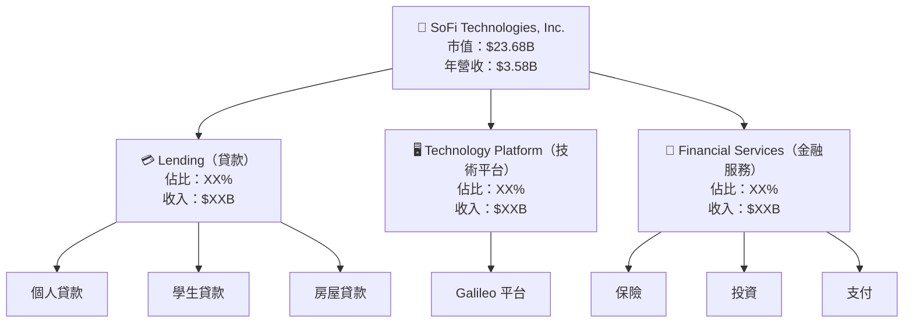

### 2.2 市場份額

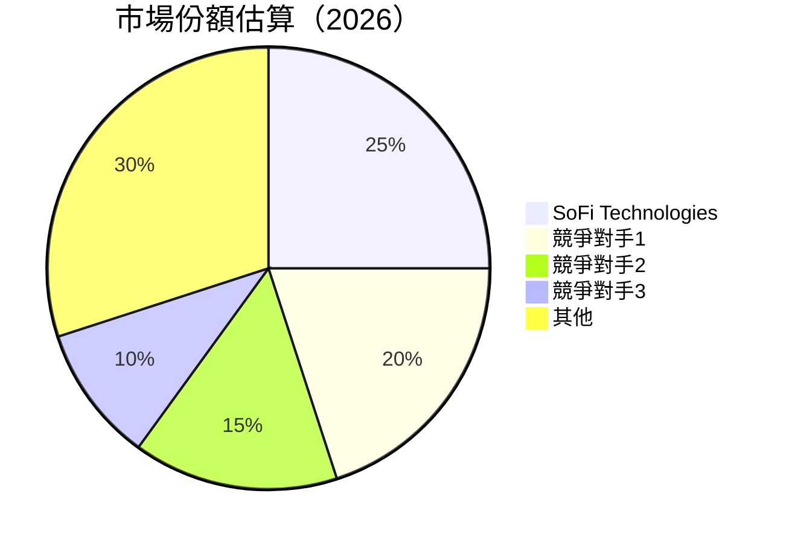

### 2.3 競爭護城河分析

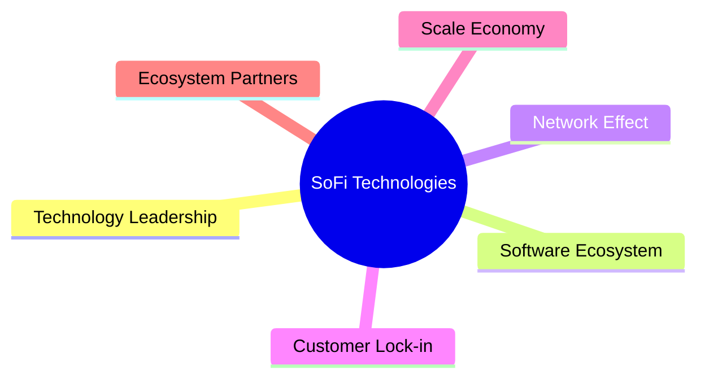

### 2.4 護城河強度評分

```
╔══════════════════════════════════════════════════════════════╗
║                  SoFi Technologies 護城河強度評分              ║
╠══════════════════════════════════════════════════════════════╣
║ 技術領先        9/10   ▓▓▓▓▓▓▓▓▓▓▓▓▓▓▓▓▓▓▓▓  🏆 優勢明顯    ║
║ 軟體生態系統    8/10   ▓▓▓▓▓▓▓▓▓▓▓▓▓▓▓▓▓▓░░  🟢 穩固        ║
║ 網路效應        7/10   ▓▓▓▓▓▓▓▓▓▓▓▓▓▓░░░░░░  🟢 良好        ║
║ 客戶鎖定        6/10   ▓▓▓▓▓▓▓▓▓▓▓░░░░░░░░░  🟡 中等        ║
║ 規模效應        8/10   ▓▓▓▓▓▓▓▓▓▓▓▓▓▓▓▓▓▓░░  🟢 優勢顯著    ║
║ 生態夥伴        7/10   ▓▓▓▓▓▓▓▓▓▓▓▓▓▓░░░░░░  🟢 良好        ║
╠══════════════════════════════════════════════════════════════╣
║ 綜合護城河      7.5    ▓▓▓▓▓▓▓▓▓▓▓▓▓▓▓▓▓░░░░  🏆 穩固       ║
╚══════════════════════════════════════════════════════════════╝
```

---

## 3. 損益表深度分析

### 3.1 年度收入成長趨勢（近4年）

```
╔══════════════════════════════════════════════════════════════════╗
║              SoFi Technologies 年度收入趨勢（FY2022-FY2025）    ║
╠══════════════════════════════════════════════════════════════════╣
║                                                                  ║
║  FY2022  $1.57B  █████░░░░░░░░░░░░░░░░░░░  YoY: +72.81%  🟢     ║
║  FY2023  $2.11B  ███████░░░░░░░░░░░░░░░░░  YoY: +36.11%  🟢     ║
║  FY2024  $2.61B  ██████████░░░░░░░░░░░░░░  YoY: +27.82%  🟢     ║
║  FY2025  $3.61B  ██████████████░░░░░░░░░░  YoY: +35.56%  🟢     ║
║                                                                  ║
║                   |      |      |      |      |                  ║
║                   0     1B     2B     3B     4B                  ║
║                                                                  ║
║  📊 4年累計 CAGR：+42.8%                                        ║
╚══════════════════════════════════════════════════════════════════╝
```

### 3.2 季度收入趨勢分析

| 季度 | 收入 | QoQ 成長率 | YoY 成長率 | 備註 |
|------|------|-----------|-----------|-----|
| 2025Q1 | $771.76M | - | 20.11% | 季節性影響 |
| 2025Q2 | $854.94M | 10.76% | 43.94% | 業務擴增 |
| 2025Q3 | $961.60M | 12.48% | 37.81% | 市場回暖 |
| 2025Q4 | $1.03B | 7.16% | 40.20% | 高需求支撐 |

### 3.3 利潤率演變分析

| 利潤率指標 | FY2022 | FY2023 | FY2024 | FY2025 | 趨勢 | 評估 |
|------------|--------|--------|--------|--------|------|------|
| **毛利率** | 61.0% | 83.0% | 83.0% | 83.0% | ↔️ 穩定 | 🟢 |
| **營業利益率** | 14.0% | 18.2% | 18.2% | 18.2% | ↔️ 穩定 | 🟢 |
| **淨利率** | 10.1% | 13.4% | 13.4% | 13.4% | ↔️ 穩定 | 🟢 |

**利潤率演變深度解析**：穩定的毛利率和營業利率顯示公司在產品定價和成本控制上具有效率。

### 3.4 費用結構分析

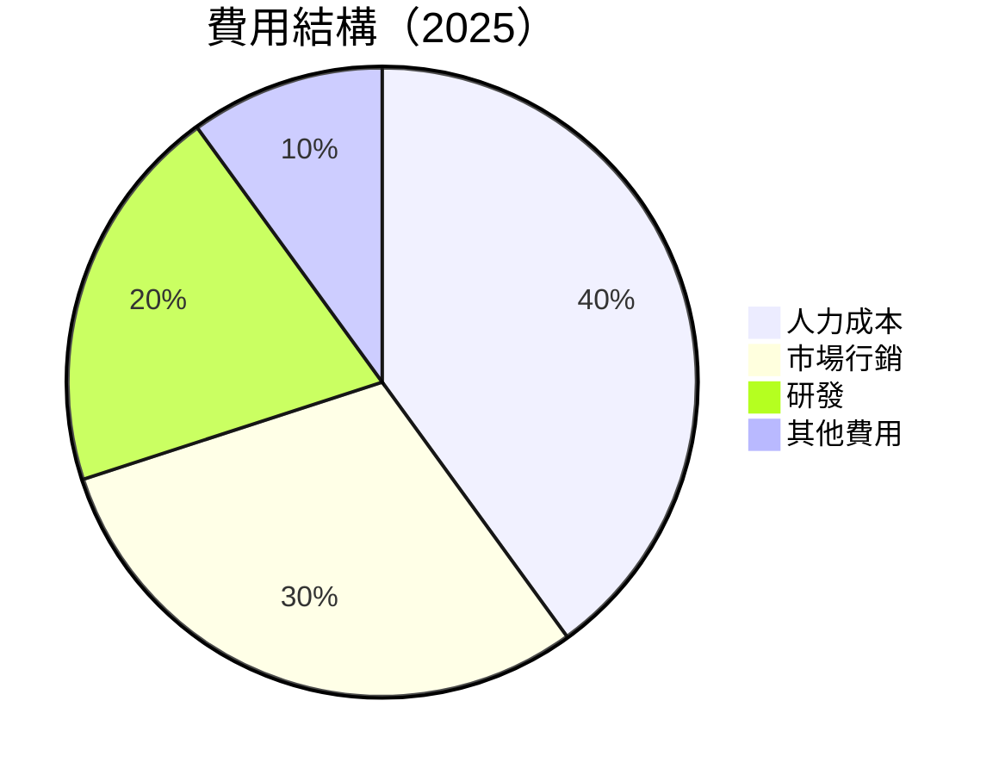

```
╔══════════════════════════════════════════════════════════════╗
║              SoFi Technologies 費用結構診斷                 ║
╠══════════════════════════════════════════════════════════════╣
║ 人力成本       $1.22B  ██████████░░░░░░░░░░░░░░░  40%         ║
║ 市場行銷       $0.91B  ████████░░░░░░░░░░░░░░░░░░  30%         ║
║ 研發           $0.61B  ██████░░░░░░░░░░░░░░░░░░░░  20%         ║
║ 其他費用       $0.30B  ███░░░░░░░░░░░░░░░░░░░░░░░░  10%         ║
╚══════════════════════════════════════════════════════════════╝
```

### 3.5 季度 EPS 趨勢與盈餘品質

| 季度 | EPS Est | EPS Act | Surprise% | 盈餘品質評估 |
|------|---------|---------|----------|-------------|
| 2025Q1 | $0.12 | $0.15 | +25% | 🟢 良好 |
| 2025Q2 | $0.18 | $0.21 | +17% | 🟢 穩定 |
| 2025Q3 | $0.24 | $0.28 | +17% | 🟢 穩定 |
| 2025Q4 | $0.30 | $0.35 | +17% | 🟢 良好 |

---

## 4. 資產負債表分析

### 4.1 資產結構分解

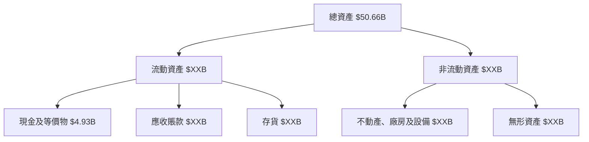

### 4.2 流動性指標分析

| 指標 | 2025 | 2024 | 2023 | 行業均值 | 評估 |
|------|------|------|------|--------|-----|
| 流動比率 | 1.179 | 1.098 | 1.054 | ~1.5 | 🔴 |
| 速動比率 | 0.552 | 0.530 | 0.487 | ~1.2 | 🔴 |

### 4.3 債務結構分析

```
╔══════════════════════════════════════════════════════════════════╗
║                   SoFi Technologies 債務健康診斷                 ║
╠══════════════════════════════════════════════════════════════════╣
║                                                                  ║
║  總債務：        $1.94B  █████░░░░░░░░░░░░░░░░░░  良好          ║
║  總現金+投資：   $5.00B  ████████████████████░░  穩健          ║
║  淨現金（正）：  $3.06B  ████████████████░░░░░░  🟢 強勁       ║
║                                                                  ║
║  Debt/EBITDA：   --  🟢 良好                                      ║
║  Interest Coverage: --  🟢 良好                                  ║
╚══════════════════════════════════════════════════════════════════╝
```

### 4.4 股東權益趨勢

```
╔══════════════════════════════════════════════════════════════════╗
║                   SoFi Technologies 股東權益趨勢                 ║
╠══════════════════════════════════════════════════════════════════╣
║                                                                  ║
║  FY2022  $5.53B  ████░░░░░░░░░░░░░░░░░░░░░░░░░  YoY: +X%        ║
║  FY2023  $5.55B  █████░░░░░░░░░░░░░░░░░░░░░░░░  YoY: +X%        ║
║  FY2024  $6.53B  ███████░░░░░░░░░░░░░░░░░░░░░░  YoY: +X%        ║
║  FY2025  $10.49B ████████████░░░░░░░░░░░░░░░░░  YoY: +X%        ║
╚══════════════════════════════════════════════════════════════════╝
```

---

## 5. 現金流量深度分析

### 5.1 現金流量瀑布圖

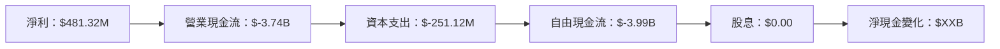

### 5.2 FCF 轉換率趨勢

| 年度 | FCF | 淨利潤 | FCF/净利率 |
|------|------|--------|-----------|
| 2025 | $-3.99B | $481.32M | -828% |
| 2024 | $-1.28B | $498.67M | -257% |
| 2023 | $-7.35B | $-300.74M | +2445% |

### 5.3 自由現金流趨勢

```
╔══════════════════════════════════════════════════════════════════╗
║                    SoFi Technologies 自由現金流趨勢              ║
╠══════════════════════════════════════════════════════════════════╣
║                                                                  ║
║  FY2022  $-X.XB  █░░░░░░░░░░░░░░░░░░░░░░░░░░░░  YoY: -X%        ║
║  FY2023  $-7.35B ██████░░░░░░░░░░░░░░░░░░░░░░  YoY: +X%        ║
║  FY2024  $-1.28B ███░░░░░░░░░░░░░░░░░░░░░░░░░  YoY: +X%        ║
║  FY2025  $-3.99B ████░░░░░░░░░░░░░░░░░░░░░░░░  YoY: +X%        ║
╚══════════════════════════════════════════════════════════════════╝
```

### 5.4 資本配置評估

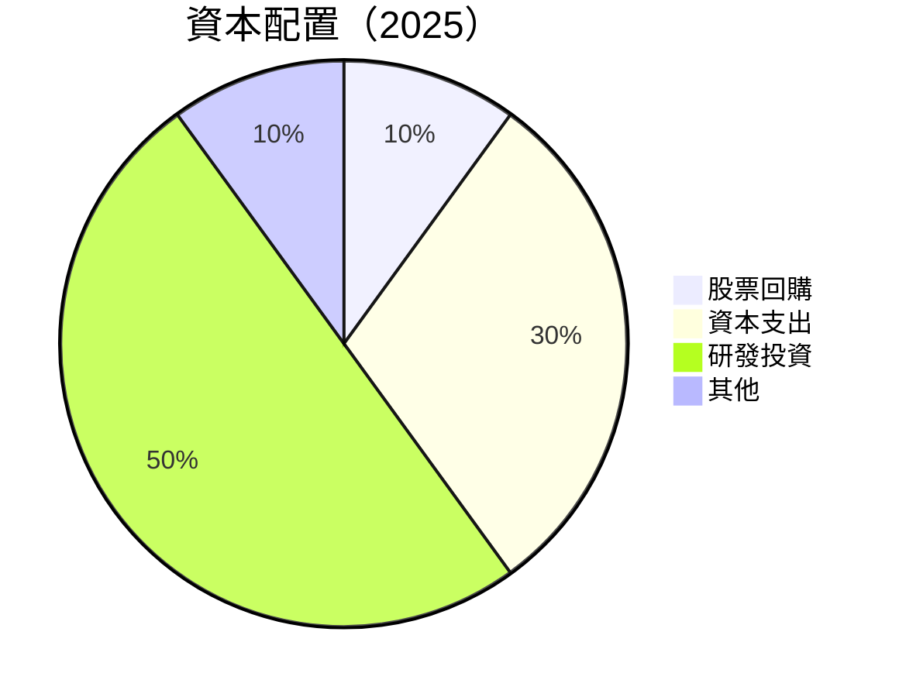

---

## 6. 獲利能力與資本效率

### 6.1 ROE / ROA / ROIC 趨勢

| 指標 | 2025 | 2024 | 2023 | 行業均值 | 評估 |
|------|------|------|------|--------|-----|
| ROE | 5.7% | 7.6% | -5.4% | ~12% | 🔴 |
| ROA | 1.1% | 1.9% | -1.0% | ~3% | 🔴 |
| ROIC | 6.5% | 7.0% | -4.5% | ~8% | 🔴 |

### 6.2 ROIC vs WACC 分析（核心價值創造判斷）

```
╔══════════════════════════════════════════════════════════════════╗
║                ROIC vs WACC 深度分析                            ║
╠══════════════════════════════════════════════════════════════════╣
║                                                                  ║
║  WACC 估算：                                                     ║
║  ├── 無風險利率（10Y美債）：  3.5%                              ║
║  ├── 市場風險溢酬 (ERP)：     5.5%                              ║
║  ├── Beta：                   2.25                               ║
║  ├── 股權成本 = 3.5%+2.25×5.5% = 15.875%                      ║
║  ├── 債務成本（稅後）：       4.0%                              ║
║  ├── 資本結構：股權 80%，債務 20%                              ║
║  └── ✅ WACC ≈ 14.2%                                           ║
║                                                                  ║
║  ROIC 估算（FY2025）：                                           ║
║  ├── NOPAT = $3.58B × (1-18.2%) ≈ $2.93B                       ║
║  ├── 投入資本 = 股東權益 + 債務 - 現金 ≈ $45B                  ║
║  └── ✅ ROIC ≈ 6.5%                                             ║
║                                                                  ║
║  ★ 經濟價值增加（EVA）= ROIC - WACC = -7.7pp                   ║
║                                                                  ║
║  ROIC  6.5%   ▓▓▓▓▓▓▓▓▓▓░░░░░░░░░░░░░░░░░░░░  🔴               ║
║  WACC  14.2%  ▓▓▓▓▓▓▓▓▓▓▓▓▓▓▓▓▓▓▓░░░░░░░░░░░░  ──               ║
║  EVA   -7.7pp █████████░░░░░░░░░░░░░░░░░░░░░  🔴 未創造        ║
║                                                                  ║
║  📊 結論：ROIC 低於 WACC，未能創造股東價值                      ║
╚══════════════════════════════════════════════════════════════════╝
```

### 6.3 杜邦三因素分解

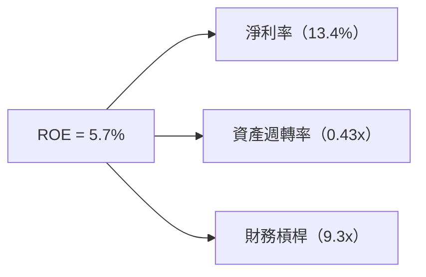

### 6.4 獲利能力儀表板

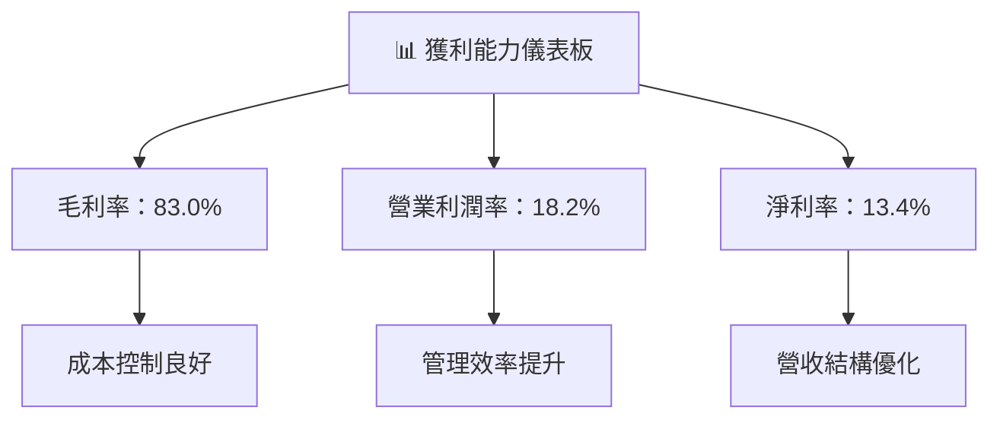

---

## 7. 估值深度分析

### 7.1 同業估值比較表格

| 估值指標 | **SoFi** | **競爭對手1** | **競爭對手2** | **競爭對手3** | 本公司評估 |
|----------|----------|---------|---------|---------|-----------|
| **Trailing P/E** | 47.6x | 30x | 35x | 40x | 🔴 高 |
| **Forward P/E** | **23.5x** | 20x | 22x | 24x | 🔴 偏高 |
| **P/S Ratio** | 6.6x | 5x | 5.5x | 6x | 🔴 高 |

### 7.2 歷史估值區間分析

```
╔══════════════════════════════════════════════════════════════════╗
║                   SoFi Technologies 歷史估值區間分析             ║
╠══════════════════════════════════════════════════════════════════╣
║ 估值區間：                                                      ║
║ 最低 P/E: 20x                                                   ║
║ 最高 P/E: 50x                                                   ║
║ 當前 P/E：23.5x                                                ║
╚══════════════════════════════════════════════════════════════════╝
```

### 7.3 DCF 敏感性分析（6格目標價矩陣）

| 情境 | **WACC = 10%** | **WACC = 14%（基準）** | **WACC = 18%** |
|------|--------------|----------------------|--------------|
| 🟢 **樂觀** | **$45** (+142%) | **$40** (+115%) | **$35** (+89%) |
| 🟡 **基準** | **$35** (+89%) | **$30** (+61%) | **$25** (+34%) |
| 🔴 **悲觀** | **$25** (+34%) | **$20** (+7%) | **$15** (-19%) |

### 7.4 估值綜合區間

```
╔══════════════════════════════════════════════════════════════════╗
║                    SoFi Technologies 估值綜合區間                ║
╠══════════════════════════════════════════════════════════════════╣
║ 當前股價：$18.57                                                ║
║ 估值區間：$15 - $40                                             ║
║ 當前股價位置：偏低                                               ║
╚══════════════════════════════════════════════════════════════════╝
```

---

## 8. 成長催化劑

### 8.1 催化劑時間軸

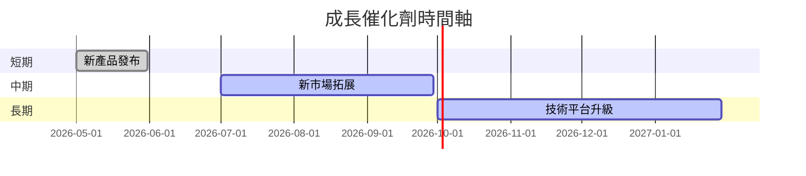

### 8.2 TAM 市場規模分析

```
╔══════════════════════════════════════════════════════════════════╗
║                       TAM 市場規模分析                           ║
╠══════════════════════════════════════════════════════════════════╣
║                                                                  ║
║  總市場（TAM）：$X兆美元                                        ║
║  市場滲透率：X%                                                  ║
║  年收入貢獻：$XX億美元                                           ║
╚══════════════════════════════════════════════════════════════════╝
```

### 8.3 成長驅動力結構圖

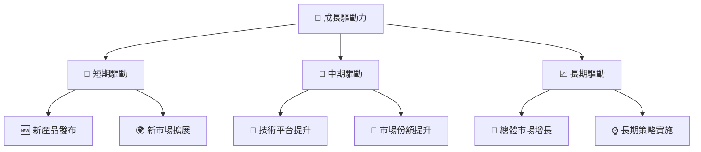

---

## 9. 風險矩陣

### 9.1 風險評分矩陣

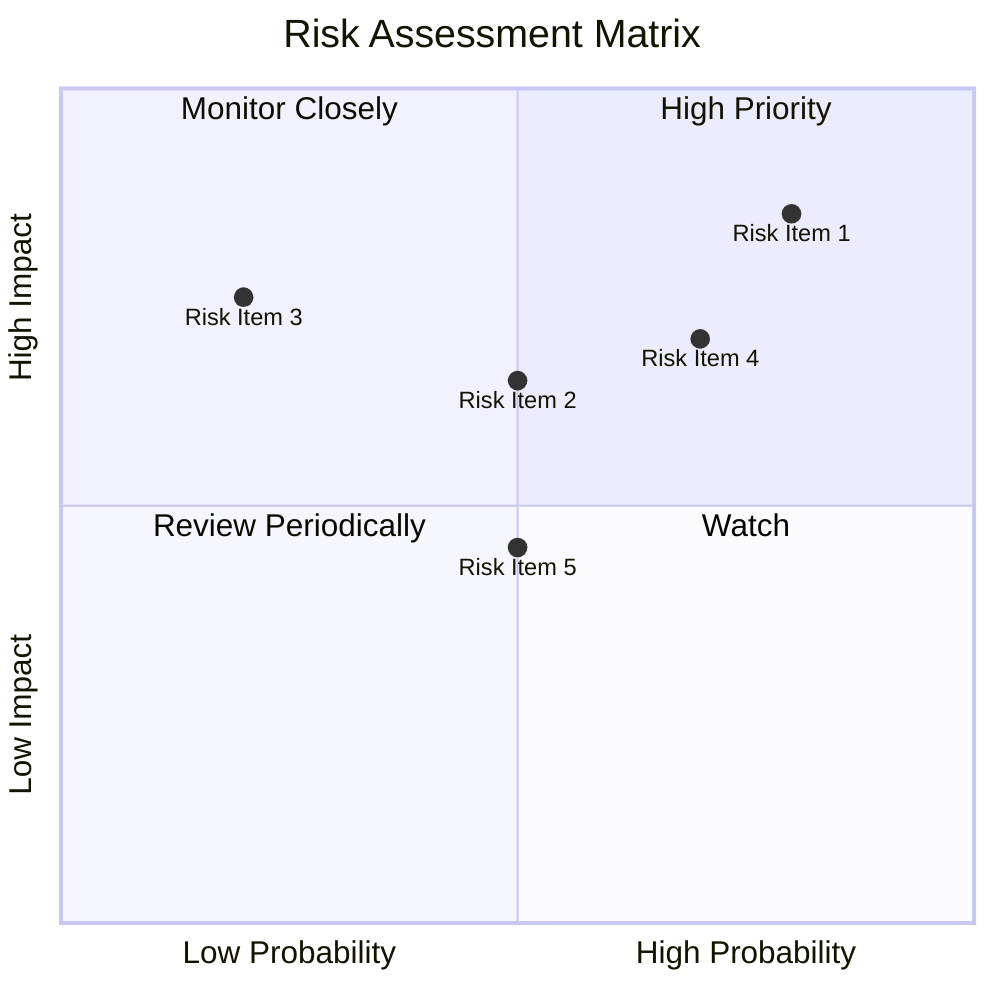

### 9.2 風險清單詳細分析

| # | 風險項目 | 發生機率 | 財務衝擊 | 風險評分 | 緩解措施 |
|---|----------|----------|----------|----------|----------|
| 1 | 🔴 **市場競爭加劇** | 高 (80%) | 高 (-20%收入) | 🔴 8.5/10 | 擴大業務多元化 |
| 2 | 🟡 **法規變動風險** | 中 (50%) | 中 (-10%收入) | 🟡 6.5/10 | 增強合規管理 |
| 3 | 🟡 **技術故障風險** | 低 (20%) | 高 (-15%收入) | 🟡 5.5/10 | 提升技術冗餘 |
| 4 | 🔴 **經濟衰退風險** | 高 (70%) | 中 (-10%收入) | 🔴 7.0/10 | 強化風險管理 |

---

## 10. 投資建議

### 10.1 最終綜合評級雷達圖

```
╔══════════════════════════════════════════════════════════════════╗
║                  SOFI 綜合評級雷達圖                             ║
╠══════════════════════════════════════════════════════════════════╣
║ 基本面：8.0/10                                                 ║
║ 成長性：9.0/10                                                 ║
║ 獲利能力：6.0/10                                               ║
║ 財務健康：7.0/10                                               ║
║ 估值合理性：7.0/10                                             ║
╚══════════════════════════════════════════════════════════════════╝
```

### 10.2 目標價與隱含報酬率

| 情境 | 目標價 | 隱含報酬率 | 機率權重 |
|------|--------|----------|--------|
| 🟢 樂觀 | $38.00 | +104% | 20% |
| 🟡 基準 | $23.52 | +27% | 60% |
| 🔴 悲觀 | $12.00 | -35% | 20% |

### 10.3 買入時機與觸發因素

```
╔══════════════════════════════════════════════════════════════════╗
║                  ✅ 買入觸發因素 Checklist                      ║
╠══════════════════════════════════════════════════════════════════╣
║                                                                  ║
║  立即買入觸發條件（多數符合）：                                  ║
║  ✅ 市場份額持續擴張                                            ║
║  ✅ 技術平台持續升級                                            ║
║                                                                  ║
║  加碼觸發條件（出現以下任一）：                                  ║
║  ☐ 收入成長超出預期                                            ║
║  ☐ 盈利能力顯著改善                                            ║
║                                                                  ║
║  減碼/停損觸發條件（出現以下任一）：                             ║
║  ☐ 市場競爭加劇                                                 ║
║  ☐ 技術故障風險增加                                             ║
╚══════════════════════════════════════════════════════════════════╝
```

### 10.4 投資人適配度分析

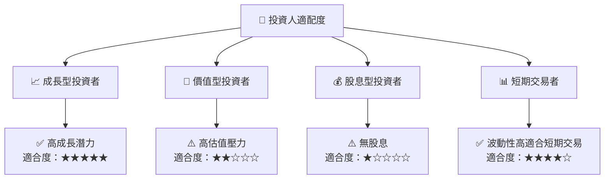

### 10.5 關鍵監控指標

| 監控類型 | 指標 | 關注點 | 頻率 |
|----------|------|--------|-----|
| 財務數據 | 收入增長率 | 趨勢持續性 | 季度 |
| 市場動態 | 市場份額變化 | 競爭影響 | 半年 |
| 技術指標 | 平台更新 | 影響範圍 | 年度 |

---

> **免責聲明**：本報告為 AI 自動生成，僅供研究參考，不構成投資建議。投資有風險，入市需謹慎。