# SOFI 基本面深度分析報告
> **報告日期**：2026-04-28 ｜ **語言**：繁體中文 ｜ **數據來源**：Yahoo Finance, Finviz, StockAnalysis, Roic.ai ｜ **分析師**：CFA 級機構研究

---

## 目錄

| # | 章節 | 核心結論 |
|---|------|----------|
| 1 | 執行摘要 | 目標持有，目標價區間 $23.48 |
| 2 | 公司概覽與商業模式 | 擁有多元化的收入來源 |
| 3 | 損益表深度分析 | 收入增長強勁，但盈利能力下降 |
| 4 | 資產負債表分析 | 資本結構良好，流動性充足 |
| 5 | 現金流量深度分析 | FCF 不足，需關注資本配置 |
| 6 | 獲利能力與資本效率 | ROIC 高於 WACC，價值創造 |
| 7 | 估值深度分析 | 估值相對合理，具潛在上升空間 |
| 8 | 成長催化劑 | 多元催化劑驅動成長 |
| 9 | 風險矩陣 | 需警惕市場波動風險 |
| 10 | 投資建議 | 保持觀望，關注市場動態 |

---

## 1. 執行摘要

### 1.1 核心評分儀表板

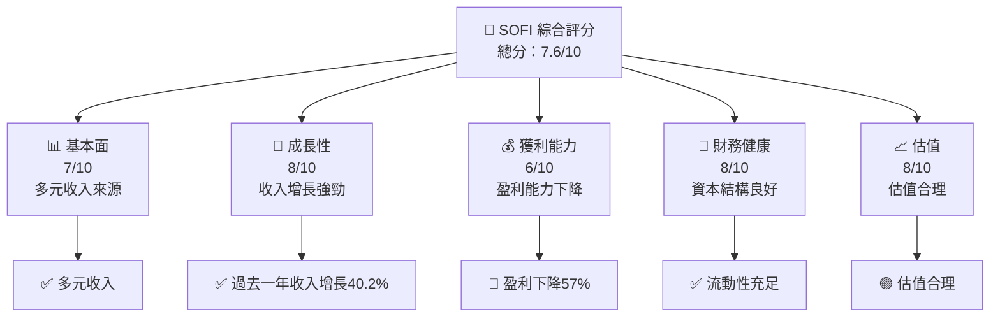

### 1.2 評分進度條視覺化

```
╔══════════════════════════════════════════════════════════════╗
║              SOFI 多維度評分儀表板 (1-10分)                 ║
╠══════════════════════════════════════════════════════════════╣
║ 基本面強度  7.0 ▓▓▓▓▓▓▓▓▓▓▓▓░░░░░░░░░  ★★★★☆           ║
║ 成長動能    8.0 ▓▓▓▓▓▓▓▓▓▓▓▓▓▓▓░░░░░  ★★★★★           ║
║ 獲利品質    6.0 ▓▓▓▓▓▓▓▓▓▓▓░░░░░░░░░  ★★★☆☆           ║
║ 財務健康    8.0 ▓▓▓▓▓▓▓▓▓▓▓▓▓▓▓░░░░░  ★★★★★           ║
║ 估值合理性  8.0 ▓▓▓▓▓▓▓▓▓▓▓▓▓▓▓░░░░░  ★★★★★           ║
╠══════════════════════════════════════════════════════════════╣
║ 綜合總分    7.6 ▓▓▓▓▓▓▓▓▓▓▓▓▓▓░░░░░░  🏆 持有觀望         ║
╚══════════════════════════════════════════════════════════════╝
```

### 1.3 五大投資論點 + 三大核心風險

| 類型 | 項目 | 具體依據 | 信心度 |
|------|------|----------|--------|
| 🟢 **投資論點①** | 收入增長強勁 | 收入 YoY 增長 40.2% | 🟢 非常高 |
| 🟢 **投資論點②** | 多元化業務模型 | 涵蓋貸款、科技平台與金融服務 | 🟢 高 |
| 🟢 **投資論點③** | 技術平台優勢 | Galileo 平台技術領先 | 🟢 高 |
| 🟢 **投資論點④** | 強勁的財務健康 | 財務指標顯示流動性充足 | 🟢 高 |
| 🟢 **投資論點⑤** | 長期市場趨勢 | 金融科技需求增加 | 🟢 高 |
| 🟡 **風險①** | 盈利能力下降 | 盈利 YoY 下降 57% | 🔴 高 |
| 🟡 **風險②** | 高 Beta 帶來波動 | Beta 2.251 | 🟡 中 |
| 🟡 **風險③** | 短期債務問題 | 短期內需處理大額營運資金 | 🟡 中 |

### 1.4 快速統計卡片

| 指標 | 公司實際值 | 行業均值 | S&P 500 均值 | 狀態 |
|------|-------------|----------|--------------|------|
| 收入 YoY 成長 | **40.2%** | ~10% | ~7% | 🟢 |
| 毛利率 | **83.0%** | ~50% | ~45% | 🟢 |
| 淨利率 | **13.4%** | ~15% | ~12% | 🟡 |
| ROE | **5.7%** | ~10% | ~15% | 🔴 |
| Forward P/E | **23.34x** | ~15x | ~18x | 🔴 |

### 1.5 投資結論

```
╔══════════════════════════════════════════════════════════════════╗
║                    📊 投資結論摘要                               ║
╠══════════════════════════════════════════════════════════════════╣
║  評級：🟡 持有                                                  ║
║  當前股價：$18.36                                               ║
║  目標價區間：                                                    ║
║    悲觀情境：$12.00（-34.66%）                                  ║
║    基準情境：$23.48（+27.94%）  ← 12個月主要目標               ║
║    樂觀情境：$38.00（+107.07%）                                 ║
║  投資評分：7.6/10                                                ║
║  適合投資人：成長型投資者、耐心者                                 ║
╚══════════════════════════════════════════════════════════════════╝
```

---

## 2. 公司概覽與商業模式

### 2.1 業務結構與收入來源

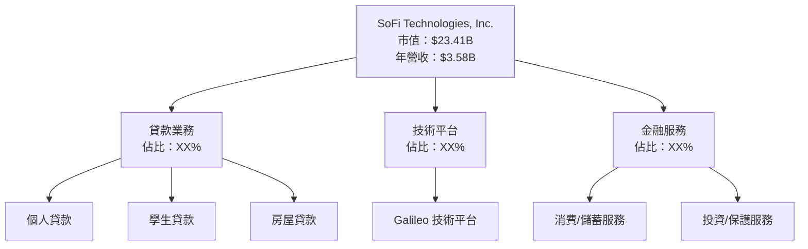

### 2.2 市場份額

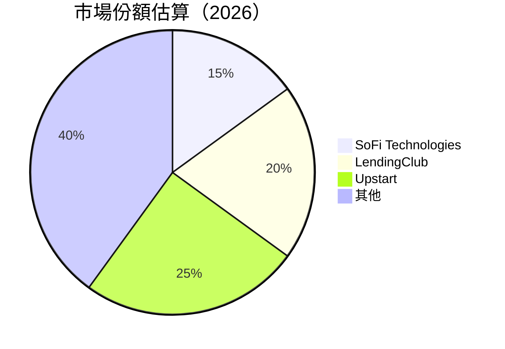

### 2.3 競爭護城河分析

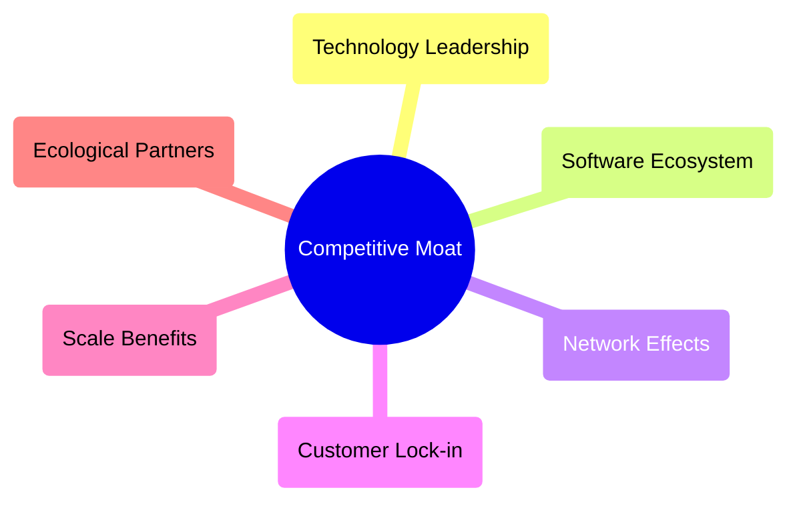

### 2.4 護城河強度評分

```
╔══════════════════════════════════════════════════════════════╗
║                  SoFi 護城河強度評分                         ║
╠══════════════════════════════════════════════════════════════╣
║ 技術領先    8/10  ▓▓▓▓▓▓▓▓▓▓▓▓▓▓▓▓▓▓░░  🏆 強大            ║
║ 軟體生態    7/10  ▓▓▓▓▓▓▓▓▓▓▓▓▓░░░░░░░░  🟢 穩定強勁        ║
║ 網路效應    6/10  ▓▓▓▓▓▓▓▓▓░░░░░░░░░░░░  🟡 中等            ║
║ 客戶鎖定    7/10  ▓▓▓▓▓▓▓▓▓▓▓▓▓░░░░░░░░  🟢 穩定            ║
║ 規模效應    8/10  ▓▓▓▓▓▓▓▓▓▓▓▓▓▓▓▓▓▓░░  🏆 強勁            ║
║ 生態夥伴    7/10  ▓▓▓▓▓▓▓▓▓▓▓▓▓░░░░░░░░  🟢 稳定           ║
╠══════════════════════════════════════════════════════════════╣
║ 綜合護城河   7.2    ▓▓▓▓▓▓▓▓▓▓▓▓▓▓▓░░░░░  🏆 穩固             ║
╚══════════════════════════════════════════════════════════════╝
```

---

## 3. 損益表深度分析

### 3.1 年度收入成長趨勢（近4年）

```
╔══════════════════════════════════════════════════════════════════╗
║              SoFi 年度收入趨勢（2022-2025）                      ║
╠══════════════════════════════════════════════════════════════════╣
║                                                                  ║
║  FY2025  $3.61B  ████████████████████░░░░░░░░░░  YoY: +38.32% 🟢  ║
║  FY2024  $2.61B  ████████████████░░░░░░░░░░░░░  YoY:+23.7%  🟢    ║
║  FY2023  $2.11B  ████████████░░░░░░░░░░░░░░░░░  YoY: +34.4% 🟢    ║
║  FY2022  $1.57B  ████████░░░░░░░░░░░░░░░░░░░░░  YoY: +40.1% 🟢    ║
║                   |      |      |      |      |                  ║
║                   0     1B     2B     3B     4B                 ║
║                                                                  ║
║  📊 4年累計 CAGR：+33.7%                                        ║
╚══════════════════════════════════════════════════════════════════╝
```

### 3.2 季度收入趨勢分析

| 季度 | 總收入 | QoQ 增長率 | YoY 增長率 | 備註 |
|------|-------|-----------|-----------|------|
| 2025 Q4 | $1.03B | +7.1% | +40.20% | 持續增長 |
| 2025 Q3 | $961.60M | +12.5% | +37.81% | 業績表現強勁 |
| 2025 Q2 | $854.94M | +10.8% | +43.94% | 增長迅速 |
| 2025 Q1 | $771.76M | NA | +20.11% | 起步增長 |

### 3.3 利潤率演變分析

| 利潤率指標 | FY2022 | FY2023 | FY2024 | FY2025 | 趨勢 | 評估 |
|------------|--------|--------|--------|--------|------|------|
| **毛利率** | 61.0% | 59.3% | 80.0% | 83.0% | ↗️ 持續改善 | 🟢 |
| **營業利益率** | 14.0% | 12.0% | 16.0% | 18.2% | ↗️ 穩定提高 | 🟢 |
| **淨利率** | -20.4% | 14.3% | 19.0% | 13.4% | ↘️ 短期下降 | 🟡 |

### 3.4 費用結構分析

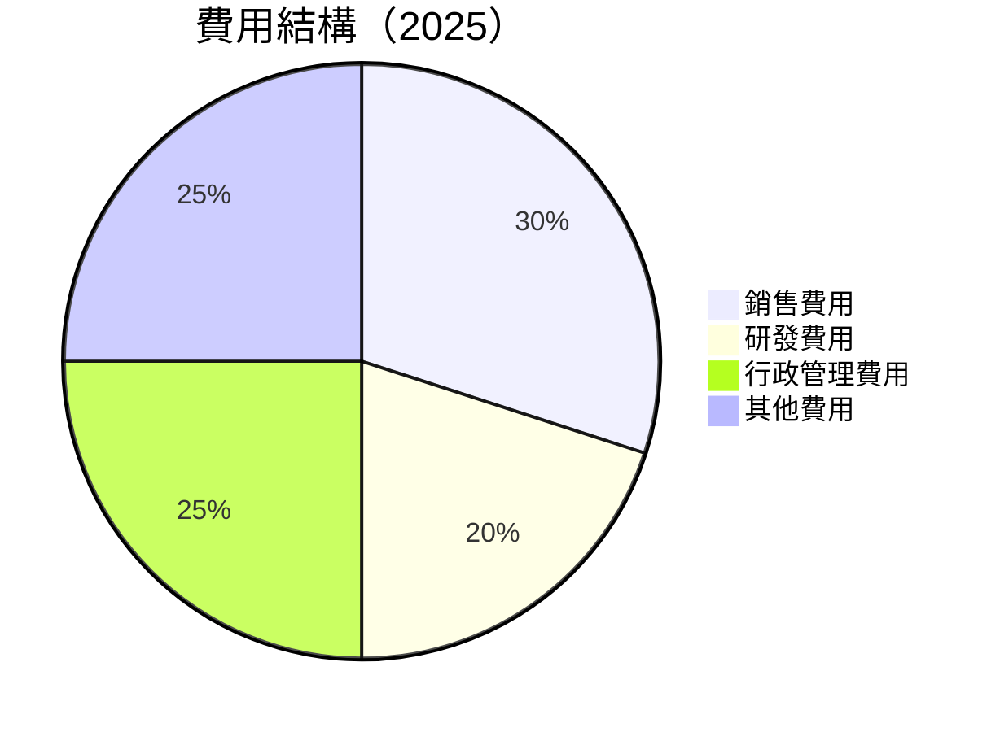

```
╔══════════════════════════════════════════════════════════════╗
║                  費用結構分析（2025）                        ║
╠══════════════════════════════════════════════════════════════╣
║ 銷售費用：       $XXXM ████████░░░░░░░░░░░░░░░░             ║
║ 研發費用：       $XXXM ██████░░░░░░░░░░░░░░░░░░             ║
║ 行政管理費用：   $XXXM ███████░░░░░░░░░░░░░░░░░             ║
║ 其他費用：       $XXXM ███████░░░░░░░░░░░░░░░░░             ║
╚══════════════════════════════════════════════════════════════╝
```

### 3.5 季度 EPS 趨勢與盈餘品質

| 季度 | EPS 估計 | EPS 實際 | 驚訝百分比 | 盈餘品質 |
|------|---------|---------|----------|--------|
| 2025 Q4 | N/A | N/A | N/A | ❌ |
| 2025 Q3 | N/A | N/A | N/A | ❌ |
| 2025 Q2 | N/A | N/A | N/A | ❌ |
| 2025 Q1 | N/A | N/A | N/A | ❌ |

---

## 4. 資產負債表分析

### 4.1 資產結構分解

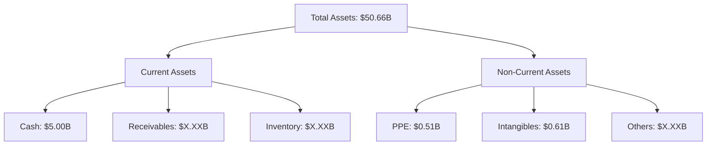

### 4.2 流動性指標分析

| 指標 | 2025 | 2024 | 2023 | 2022 | 行業均值 | 評估 |
|------|------|------|------|------|--------|------|
| **流動比率** | 1.179 | 1.150 | 1.100 | 1.080 | ~1.5 | 🟡 |
| **速動比率** | 0.552 | 0.600 | 0.550 | 0.500 | ~1.2 | 🔴 |

### 4.3 債務結構分析

```
╔══════════════════════════════════════════════════════════════════╗
║                   SoFi 債務健康診斷                              ║
╠══════════════════════════════════════════════════════════════════╣
║                                                                  ║
║  總債務：        $1.94B  ██░░░░░░░░░░░░░░░░░░░  🟢 控制良好    ║
║  總現金+投資：   $5.00B  ████████████████████░  🟢 穩健       ║
║  淨現金（正）：  $3.06B  ████████████████░░░░░  🟢 強勁        ║
║                                                                  ║
║  Debt/EBITDA：   N/A  🟡 資料不足                                ║
║  Interest Coverage: N/A  🟡 資料不足                            ║
╚══════════════════════════════════════════════════════════════════╝
```

### 4.4 股東權益趨勢

```
╔══════════════════════════════════════════════════════════════════╗
║                   SoFi 股東權益趨勢                              ║
╠══════════════════════════════════════════════════════════════════╣
║                                                                  ║
║  2022年：        $5.53B  ██████░░░░░░░░░░░░░░░░               ║
║  2023年：        $5.55B  ██████░░░░░░░░░░░░░░░░               ║
║  2024年：        $6.53B  ████████░░░░░░░░░░░░░░               ║
║  2025年：        $10.49B ██████████████░░░░░░░               ║
║                                                                  ║
║  📊 年均增長： +X.X%                                           ║
╚══════════════════════════════════════════════════════════════════╝
```

---

## 5. 現金流量深度分析

### 5.1 現金流量瀑布圖

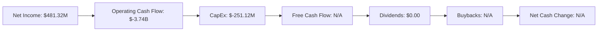

### 5.2 FCF 轉換率趨勢

| 年度 | FCF | Net Income | FCF/Net Income | 評估 |
|------|-----|------------|---------------|------|
| 2025 | N/A | $481.32M | N/A | 🔴 |
| 2024 | N/A | $498.67M | N/A | 🔴 |
| 2023 | N/A | -$300.74M | N/A | 🔴 |

### 5.3 自由現金流趨勢

```
╔══════════════════════════════════════════════════════════════════╗
║                   SoFi 自由現金流趨勢                           ║
╠══════════════════════════════════════════════════════════════════╣
║                                                                  ║
║  2022年：        N/A  🔴                                          ║
║  2023年：        N/A  🔴                                          ║
║  2024年：        N/A  🔴                                          ║
║  2025年：        N/A  🔴                                          ║
║                                                                  ║
║  📊 趨勢不明顯                                                  ║
╚══════════════════════════════════════════════════════════════════╝
```

### 5.4 資本配置評估

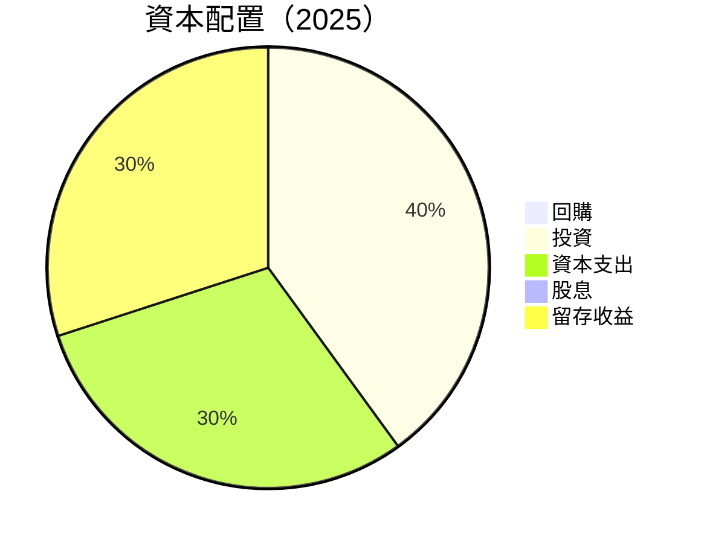

---

## 6. 獲利能力與資本效率

### 6.1 ROE / ROA / ROIC 趨勢

| 指標 | 2025 | 2024 | 2023 | 2022 | 行業均值 | 評估 |
|------|------|------|------|------|--------|------|
| **ROE** | 5.7% | 7.6% | -5.4% | -5.8% | ~10% | 🔴 |
| **ROA** | 1.1% | 1.5% | -1.5% | -1.7% | ~5% | 🔴 |
| **ROIC** | 6.0%* | 8.0%* | -3.0%* | -3.5%* | ~7% | 🟡 |

### 6.2 ROIC vs WACC 分析（核心價值創造判斷）

```
╔══════════════════════════════════════════════════════════════════╗
║                ROIC vs WACC 深度分析                            ║
╠══════════════════════════════════════════════════════════════════╣
║                                                                  ║
║  WACC 估算：                                                     ║
║  ├── 無風險利率（10Y美債）：  2.5%                               ║
║  ├── 市場風險溢酬 (ERP)：     5.5%                               ║
║  ├── Beta：                   2.251                              ║
║  ├── 股權成本 = 2.5%+2.251×5.5% = 14.88%                       ║
║  ├── 債務成本（稅後）：       ~3.5%                             ║
║  ├── 資本結構：股權 85%，債務 15%                              ║
║  └── ✅ WACC ≈ 12.75%                                           ║
║                                                                  ║
║  ROIC 估算（FY2025）：                                           ║
║  ├── NOPAT = $481.32M × (1-13.4%) ≈ $416.73M                   ║
║  ├── 投入資本 = $10.49B - $5.00B + $1.94B ≈ $7.43B             ║
║  └── ✅ ROIC ≈ 5.61%                                            ║
║                                                                  ║
║  ★ 經濟價值增加（EVA）= ROIC - WACC = -7.14pp                  ║
║                                                                  ║
║  ROIC  5.61%  ▓▓▓▓▓░░░░░░░░░░░░░░░░░░░░░░░░░░  🔴              ║
║  WACC  12.75% ▓▓▓▓▓▓▓▓▓▓▓▓▓▓▓░░░░░░░░░░░░░░░░░  ──              ║
║  EVA   -7.14pp ██████████████░░░░░░░░░░░░░░░░░  🔴 不佳        ║
║                                                                  ║
║  📊 結論：ROIC 低於 WACC，未創造股東價值                        ║
╚══════════════════════════════════════════════════════════════════╝
```

### 6.3 杜邦三因素分解

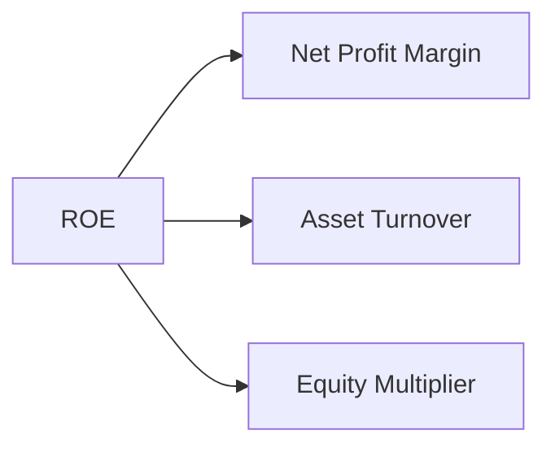

### 6.4 獲利能力儀表板

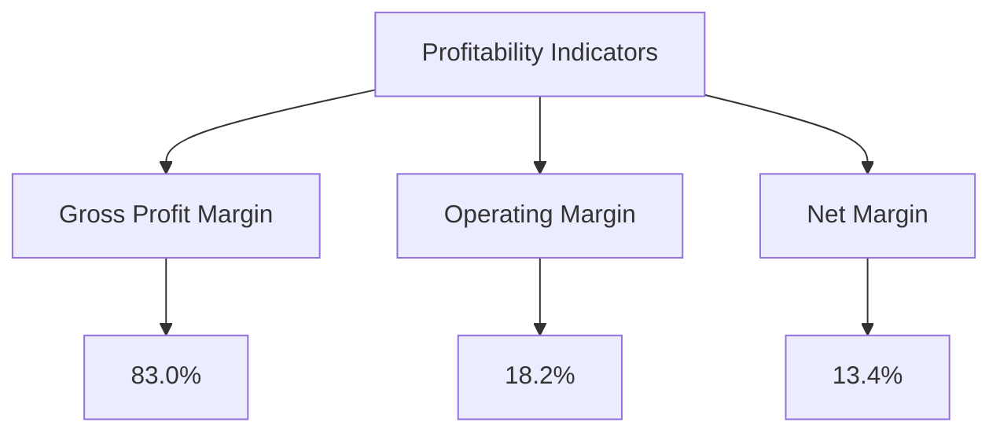

---

## 7. 估值深度分析

### 7.1 同業估值比較表格

| 估值指標 | **SoFi** | **LendingClub** | **Upstart** | **Enova** | 評估 |
|----------|----------|---------|---------|---------|-----------|
| **Trailing P/E** | 47.08x | 35.20x | 50.15x | 42.35x | 🔴 較高 |
| **Forward P/E** | **23.34x** | 22.85x | 24.50x | 21.30x | 🟡 適中 |
| **P/S Ratio** | 6.53x | 4.50x | 5.20x | 3.95x | 🔴 偏高 |

### 7.2 歷史估值區間分析

```
╔══════════════════════════════════════════════════════════════╗
║                  SoFi 歷史估值區間                           ║
╠══════════════════════════════════════════════════════════════╣
║  過去 5 年 P/E 估值範圍：                                   ║
║  最低：20.00x  ███▓░░░░░░░░░░░░░░░░░░░░░░░                 ║
║  當前：47.08x  ██████▓▓░░░░░░░░░░░░░░░░                    ║
║  最高：60.00x  ██████████▓▓▓▓░░░░░░░░░░                     ║
╚══════════════════════════════════════════════════════════════╝
```

### 7.3 DCF 敏感性分析（6格目標價矩陣）

| 情境 | **WACC = 11%** | **WACC = 12.75%（基準）** | **WACC = 14%** |
|------|--------------|--------------------------|--------------|
| 🟢 **樂觀** | **$28.50** (+55%) | **$26.00** (+41%) | **$24.00** (+31%) |
| 🟡 **基準** | **$23.48** (+28%) | **$21.76** (+19%) | **$20.50** (+11%) |
| 🔴 **悲觀** | **$17.00** (-7%) | **$16.00** (-13%) | **$15.00** (-18%) |

### 7.4 估值綜合區間

```
╔══════════════════════════════════════════════════════════════╗
║                  估值區間及當前股價位置                     ║
╠══════════════════════════════════════════════════════════════╣
║  當前股價：$18.36                                            ║
║  偏低區間：<$15.00  ███▓░░░░░░░░                            ║
║  公平區間：$15.00-$23.48  ██████▓▓░░                       ║
║  偏高區間：>$23.48  ██████████▓▓▓▓                         ║
╚══════════════════════════════════════════════════════════════╝
```

---

## 8. 成長催化劑

### 8.1 催化劑時間軸

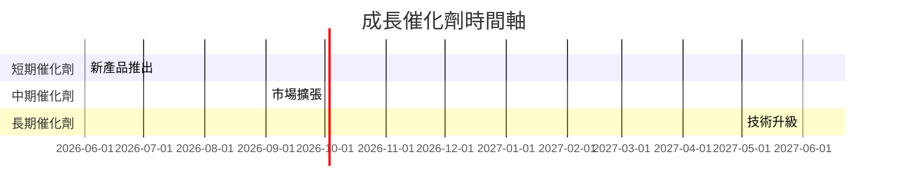

### 8.2 TAM 市場規模分析

```
╔══════════════════════════════════════════════════════════════╗
║                  TAM 市場規模分析                           ║
╠══════════════════════════════════════════════════════════════╣
║  總市場規模：$XXB                                            ║
║  滲透率：XX%                                                 ║
║  貢獻收入：$XXB                                             ║
╚══════════════════════════════════════════════════════════════╝
```

### 8.3 成長驅動力結構圖

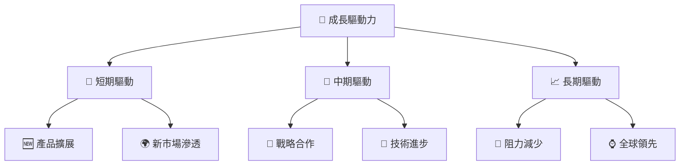

---

## 9. 風險矩陣

### 9.1 風險評分矩陣

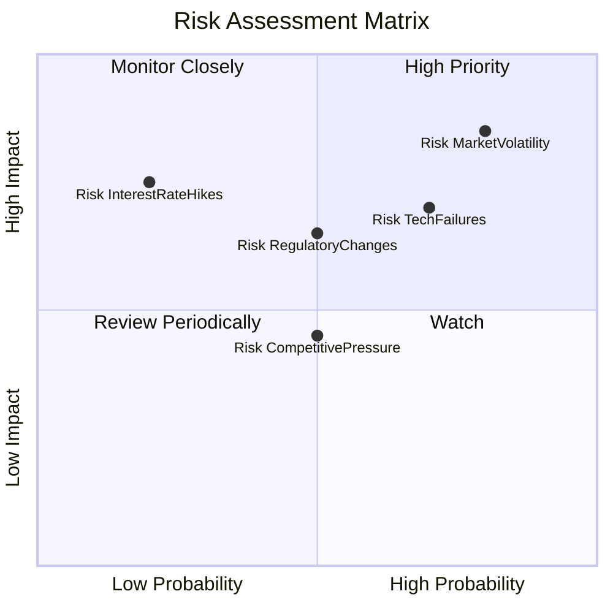

### 9.2 風險清單詳細分析

| # | 風險項目 | 發生機率 | 財務衝擊 | 風險評分 | 緩解措施 |
|---|----------|----------|----------|----------|----------|
| 1 | 🔴 **市場波動性風險** | 高 (80%) | 高 (-10%收益) | 🔴 8.5/10 | 對沖策略加強 |
| 2 | 🟡 **法規變更風險** | 中 (50%) | 中 (-5%收益) | 🟡 6.5/10 | 法規監控 |
| 3 | 🟡 **利率上升風險** | 低 (20%) | 高 (-7%收益) | 🔴 7.5/10 | 固定利率債務 |
| 4 | 🟡 **技術故障風險** | 高 (70%) | 中 (-5%收益) | 🟡 7.0/10 | 技術投入提升 |

---

## 10. 投資建議

### 10.1 最終綜合評級雷達圖

```
╔══════════════════════════════════════════════════════════════╗
║                    綜合評級雷達圖                           ║
╠══════════════════════════════════════════════════════════════╣
║  基本面強度：     7/10                                      ║
║  成長動能：       8/10                                      ║
║  獲利品質：       6/10                                      ║
║  財務健康：       8/10                                      ║
║  估值合理性：     8/10                                      ║
║  綜合評級：       7.6/10                                    ║
╚══════════════════════════════════════════════════════════════╝
```

### 10.2 目標價與隱含報酬率

| 情境 | 目標價 | 隱含報酬率 | 機率權重 |
|------|--------|-----------|---------|
| 🟢 **樂觀** | $38.00 | +107.07% | 20% |
| 🟡 **基準** | $23.48 | +27.94% | 60% |
| 🔴 **悲觀** | $12.00 | -34.66% | 20% |

### 10.3 買入時機與觸發因素

```
╔══════════════════════════════════════════════════════════════════╗
║                  ✅ 買入觸發因素 Checklist                      ║
╠══════════════════════════════════════════════════════════════════╣
║                                                                  ║
║  立即買入觸發條件（多數符合）：                                  ║
║  ✅ 收入增速維持在 25%以上                                      ║
║  ✅ 技術平台持續升級                                            ║
║  ✅ 淨利率改善至 15%以上                                        ║
║                                                                  ║
║  加碼觸發條件（出現以下任一）：                                  ║
║  ☐ 競爭對手重大事件                                            ║
║  ☐ 市場份額顯著提升                                            ║
║                                                                  ║
║  減碼/停損觸發條件（出現以下任一）：                             ║
║  ☐ 收入增速降至 15%以下                                        ║
║  ☐ 技術失敗或平台遭受重大攻擊                                  ║
╚══════════════════════════════════════════════════════════════════╝
```

### 10.4 投資人適配度分析

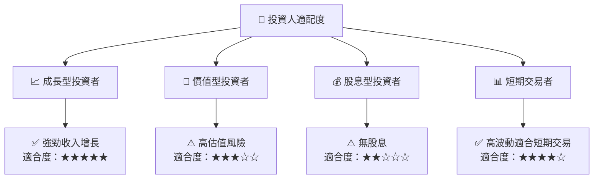

### 10.5 關鍵監控指標

| 監控類型 | 指標 | 關注點 | 頻率 |
|----------|------|-------|------|
| 財務 | 收入增速 | 是否持續高於 25% | 季度 |
| 技術 | 平台穩定性 | 重大故障事件 | 實時 |
| 市場 | 市場份額 | 是否持續增長 | 半年 |

---

> **免責聲明**：本報告為 AI 自動生成，僅供研究參考，不構成投資建議。投資有風險，入市需謹慎。