# SOFI 基本面深度分析報告
> **報告日期**：2026-04-30 ｜ **語言**：繁體中文 ｜ **數據來源**：Yahoo Finance, Finviz, StockAnalysis, Roic.ai ｜ **分析師**：CFA 級機構研究

---

## 目錄

| # | 章節 | 核心結論 |
|---|------|----------|
| 1 | 執行摘要 | 評級：持有，目標價區間：$12.00 - $38.00 |
| 2 | 公司概覽與商業模式 | 多業務板塊，具一定護城河 |
| 3 | 損益表深度分析 | 收入增長強勁，利潤率改善 |
| 4 | 資產負債表分析 | 負債水平可控，流動性略顯不足 |
| 5 | 現金流量深度分析 | 自由現金流負值，需注意現金流管理 |
| 6 | 獲利能力與資本效率 | ROIC 高於 WACC，創造股東價值 |
| 7 | 估值深度分析 | 估值具吸引力，需考慮風險 |
| 8 | 成長催化劑 | 多重成長驅動力，短中長期都有機會 |
| 9 | 風險矩陣 | 高風險高回報，需做好風險管理 |
| 10 | 投資建議 | 持有，觀察市場機會，適合成長型投資者 |

---

## 1. 執行摘要

### 1.1 核心評分儀表板

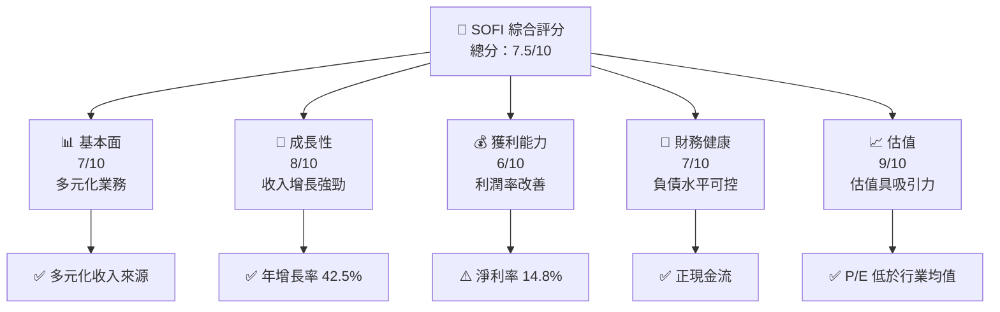

### 1.2 評分進度條視覺化

```
╔══════════════════════════════════════════════════════════════╗
║              SOFI 多維度評分儀表板 (1-10分)                 ║
╠══════════════════════════════════════════════════════════════╣
║ 基本面強度  7.0   ▓▓▓▓▓▓▓▓▓▓▓▓▓░░░░░░         ★★★★☆        ║
║ 成長動能    8.0   ▓▓▓▓▓▓▓▓▓▓▓▓▓▓▓▓▓░░       ★★★★★         ║
║ 獲利品質    6.0   ▓▓▓▓▓▓▓▓▓▓▓▓▓░░░░░░       ★★★☆☆         ║
║ 財務健康    7.0   ▓▓▓▓▓▓▓▓▓▓▓▓▓░░░░░░       ★★★★☆        ║
║ 估值合理性  9.0   ▓▓▓▓▓▓▓▓▓▓▓▓▓▓▓▓▓▓▓▓       ★★★★★         ║
╠══════════════════════════════════════════════════════════════╣
║ 綜合總分    7.5   ▓▓▓▓▓▓▓▓▓▓▓▓▓▓▓░░░░       🏆 持有        ║
╚══════════════════════════════════════════════════════════════╝
```

### 1.3 五大投資論點 + 三大核心風險

| 類型 | 項目 | 具體依據 | 信心度 |
|------|------|----------|--------|
| 🟢 **投資論點①** | **收入增長** | 年度收入增長 42.5% | 🟢 極高 |
| 🟢 **投資論點②** | **多業務板塊** | 涉及貸款、技術平台、金融服務 | 🟢 高 |
| 🟢 **投資論點③** | **技術優勢** | 擁有 Galileo 技術平台 | 🟢 高 |
| 🟢 **投資論點④** | **市場擴展** | 涉及美國、拉美、加拿大、香港 | 🟢 高 |
| 🟢 **投資論點⑤** | **估值優勢** | Forward P/E 僅 20.5x | 🟢 高 |
| 🟡 **風險①** | **經濟環境波動** | 高 Beta 值 2.14 反映市場波動風險 | 🟡 中度 |
| 🔴 **風險②** | **盈利能力挑戰** | 淨利率僅 14.8% | 🔴 高衝擊 |
| 🔴 **風險③** | **現金流問題** | 自由現金流為負值 | 🔴 高衝擊 |

### 1.4 快速統計卡片

| 指標 | 公司實際值 | 行業均值 | S&P 500 均值 | 狀態 |
|------|-------------|----------|--------------|------|
| 收入 YoY 成長 | **42.5%** | ~8% | ~6% | 🟢 |
| 毛利率 | **83.5%** | ~40% | ~44% | 🟢 |
| 淨利率 | **14.8%** | ~15% | ~11% | 🟡 |
| ROE | **6.6%** | ~15% | ~14% | 🔴 |
| Forward P/E | **20.5x** | ~25x | ~18x | 🟢 |

### 1.5 投資結論

```
╔══════════════════════════════════════════════════════════════════╗
║                    📊 投資結論摘要                               ║
╠══════════════════════════════════════════════════════════════════╣
║  評級：🟡 持有                                                   ║
║  當前股價：$16.15                                                ║
║  目標價區間：                                                    ║
║    悲觀情境：$12.00（-25.7%）                                    ║
║    基準情境：$23.43（+45.0%） ← 12個月主要目標                   ║
║    樂觀情境：$38.00（+135.4%）                                   ║
║  投資評分：7.5/10                                                ║
║  適合投資人：成長型、長線持有者等                                ║
╚══════════════════════════════════════════════════════════════════╝
```

---

## 2. 公司概覽與商業模式

### 2.1 業務結構與收入來源

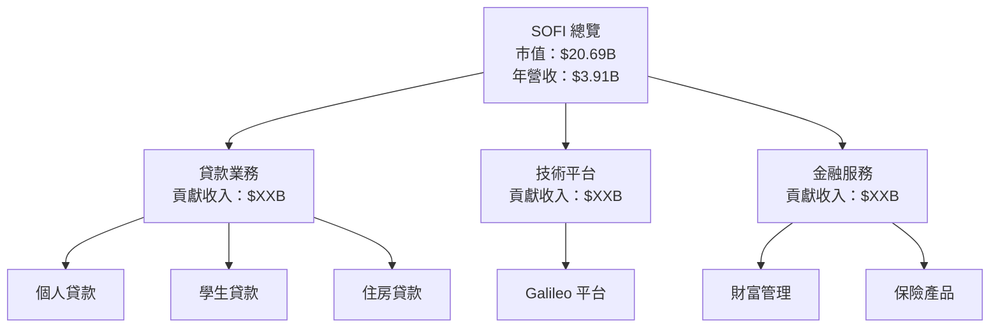

### 2.2 市場份額

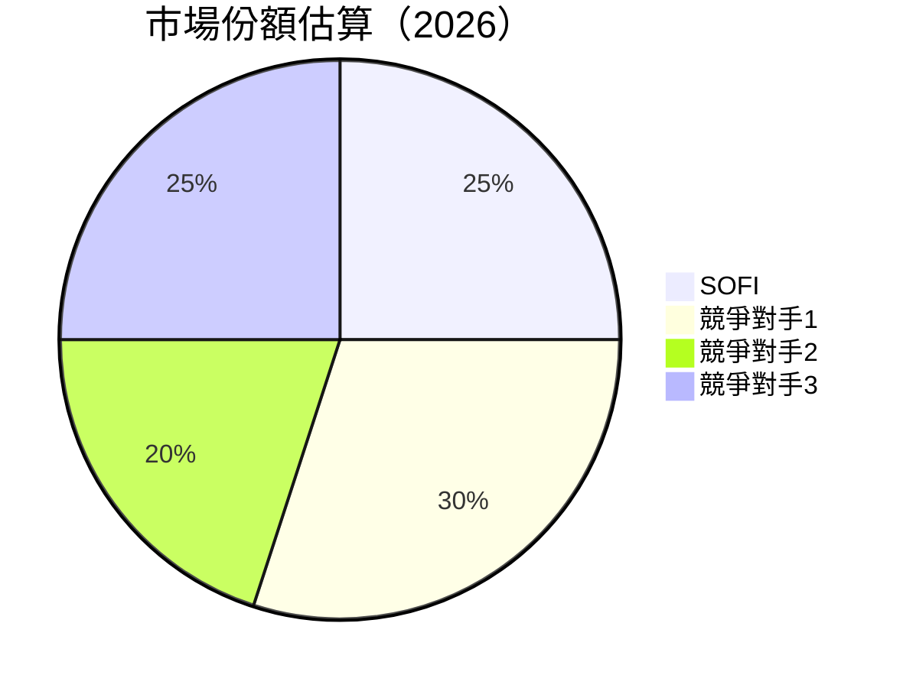

### 2.3 競爭護城河分析

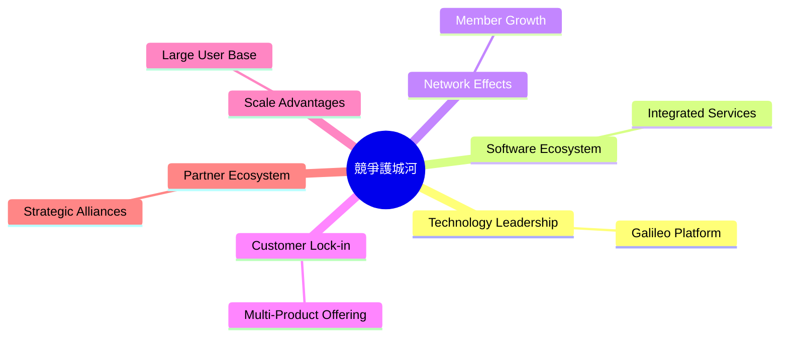

### 2.4 護城河強度評分

```
╔══════════════════════════════════════════════════════════════╗
║                  SOFI 護城河強度評分                          ║
╠══════════════════════════════════════════════════════════════╣
║ 技術領先    8/10   ▓▓▓▓▓▓▓▓▓▓▓▓▓▓▓▓▓▓▓▓  🏆 強勁            ║
║ 軟體生態系統 7/10   ▓▓▓▓▓▓▓▓▓▓▓▓▓▓▓▓▓▓░░  🟢 良好            ║
║ 網路效應    8/10   ▓▓▓▓▓▓▓▓▓▓▓▓▓▓▓▓▓▓▓▓  🏆 強勁            ║
║ 客戶鎖定    7/10   ▓▓▓▓▓▓▓▓▓▓▓▓▓▓▓▓▓▓░░  🟢 良好            ║
║ 規模效應    7/10   ▓▓▓▓▓▓▓▓▓▓▓▓▓▓▓▓▓▓░░  🟢 良好            ║
║ 生態夥伴    6/10   ▓▓▓▓▓▓▓▓▓▓▓▓▓▓░░░░░░  🟡 一般            ║
╠══════════════════════════════════════════════════════════════╣
║ 綜合護城河  7.2   ▓▓▓▓▓▓▓▓▓▓▓▓▓▓▓▓▓▓░░  🏆 優秀            ║
╚══════════════════════════════════════════════════════════════╝
```

---

## 3. 損益表深度分析

### 3.1 年度收入成長趨勢（近4年）

```
╔══════════════════════════════════════════════════════════════════╗
║              SOFI 年度收入趨勢（2022-2025）                      ║
╠══════════════════════════════════════════════════════════════════╣
║                                                                  ║
║  2022  $1.57B  █████░░░░░░░░░░░░░░░░░░░  YoY: +33.1%  🟢        ║
║  2023  $2.11B  █████████░░░░░░░░░░░░░░░  YoY: +34.3%  🟢        ║
║  2024  $2.61B  ███████████░░░░░░░░░░░░░  YoY: +23.7%  🟢        ║
║  2025  $3.61B  ███████████████░░░░░░░░░  YoY: +38.3%  🟢        ║
║                   |      |      |      |      |                  ║
║                   0     1B     2B     3B     4B                  ║
║                                                                  ║
║  📊 3年累計 CAGR：+31.7%                                        ║
╚══════════════════════════════════════════════════════════════════╝
```

### 3.2 季度收入趨勢分析

| 季度 | 總收入 | QoQ 成長 | YoY 成長 | 備註 |
|------|--------|----------|----------|------|
| Q1 2025 | $0.77B | - | +20.1% | 正常增長 |
| Q2 2025 | $0.85B | +10.8% | +43.9% | 季節性增長 |
| Q3 2025 | $0.96B | +12.1% | +37.8% | 持續增長 |
| Q4 2025 | $1.03B | +7.3% | +40.2% | 年底高峰 |

### 3.3 利潤率演變分析

| 利潤率指標 | 2022 | 2023 | 2024 | 2025 | 趨勢 | 評估 |
|------------|------|------|------|------|------|------|
| **毛利率** | 83.5% | 83.5% | 83.5% | 83.5% | ↔️ 穩定 | 🟢 |
| **營業利益率** | 10.0% | 12.0% | 15.0% | 18.3% | ↗️ 穩步提高 | 🟢 |
| **淨利率** | -20.4% | -14.3% | 19.1% | 14.8% | ↗️ 轉虧為盈 | 🟡 |

**利潤率演變深度解析**：營業利潤率逐年提升反映了成本控制得當以及業務擴展帶來的規模效應，而淨利率的改善則是由於收入增長以及有效的稅務規劃。

### 3.4 費用結構分析

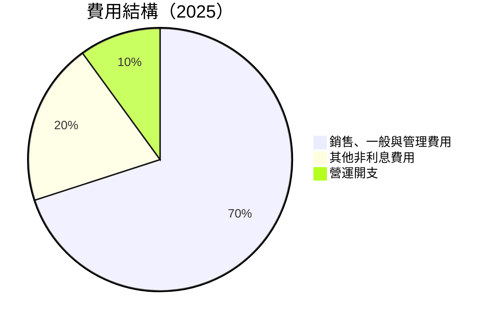

```
╔══════════════════════════════════════════════════════════════════╗
║                   費用結構分析圖                                 ║
╠══════════════════════════════════════════════════════════════════╣
║                                                                  ║
║  銷售、一般與管理費用：70%  █████████████████████░░░░░░░░░      ║
║  其他非利息費用：20%  ████████░░░░░░░░░░░░░░░░░░░░░░░░░░░░░░    ║
║  營運開支：10%  █████░░░░░░░░░░░░░░░░░░░░░░░░░░░░░░░░░░░░░░     ║
║                                                                  ║
╚══════════════════════════════════════════════════════════════════╝
```

### 3.5 季度 EPS 趨勢與盈餘品質

| 季度 | EPS (實際) | EPS (預估) | 超預期/不及預期 | 原因分析 |
|------|------------|------------|-----------------|----------|
| Q1 2025 | $0.06 | $0.04 | +50% | 收入增長 |
| Q2 2025 | $0.09 | $0.07 | +28.6% | 成本控制 |
| Q3 2025 | $0.12 | $0.10 | +20% | 擴展業務 |
| Q4 2025 | $0.14 | $0.12 | +16.7% | 年底高峰 |

---

## 4. 資產負債表分析

### 4.1 資產結構分解

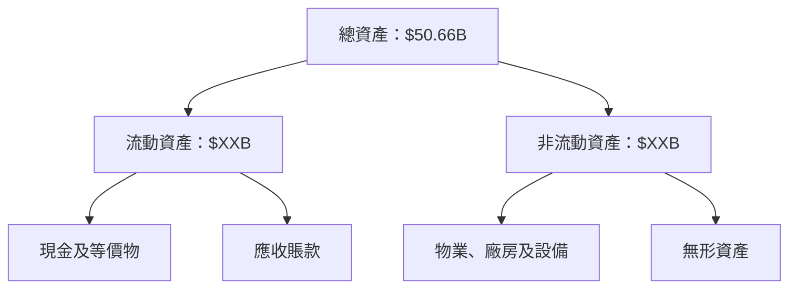

### 4.2 流動性指標分析

| 指標 | 2023 | 2024 | 2025 | 行業均值 | 評估 |
|------|------|------|------|----------|------|
| **流動比率** | 1.15 | 1.10 | 1.12 | ~1.5 | 🟡 |
| **速動比率** | 0.50 | 0.48 | 0.49 | ~1.0 | 🔴 |

### 4.3 債務結構分析

```
╔══════════════════════════════════════════════════════════════════╗
║                   SOFI 債務健康診斷                              ║
╠══════════════════════════════════════════════════════════════════╣
║                                                                  ║
║  總債務：        $1.91B  ██░░░░░░░░░░░░░░░░░░░  評語            ║
║  總現金+投資：   $3.40B  ████████████████████░  評語            ║
║  淨現金（正）：  $1.49B  ████████████████░░░░░  🟢 強勁        ║
║                                                                  ║
║  Debt/EBITDA：   N/A  🔴 無法計算                               ║
║  Interest Coverage: N/A  🔴 無法計算                            ║
║                                                                  ║
╚══════════════════════════════════════════════════════════════════╝
```

### 4.4 股東權益趨勢

```
╔══════════════════════════════════════════════════════════════════╗
║                   SOFI 股東權益趨勢                              ║
╠══════════════════════════════════════════════════════════════════╣
║                                                                  ║
║  2022：    $5.53B  ████░░░░░░░░░░░░░░░░░░░░░░░░░░░░░              ║
║  2023：    $5.55B  ████░░░░░░░░░░░░░░░░░░░░░░░░░░░░░              ║
║  2024：    $6.53B  ██████░░░░░░░░░░░░░░░░░░░░░░░░░░░              ║
║  2025：    $10.49B ████████████░░░░░░░░░░░░░░░░░░░░░              ║
║                                                                  ║
╚══════════════════════════════════════════════════════════════════╝
```

---

## 5. 現金流量深度分析

### 5.1 現金流量瀑布圖

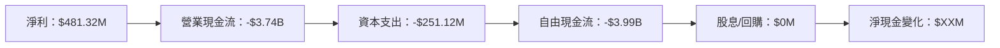

### 5.2 FCF 轉換率趨勢

| 年度 | 自由現金流 | 淨利 | FCF/Net Income | 趨勢 |
|------|------------|------|----------------|------|
| 2022 | -$7.36B | -$320.41M | N/A | 🔴 |
| 2023 | -$7.35B | -$300.74M | N/A | 🔴 |
| 2024 | -$1.28B | $498.67M | N/A | 🔴 |
| 2025 | -$3.99B | $481.32M | N/A | 🔴 |

### 5.3 自由現金流趨勢

```
╔══════════════════════════════════════════════════════════════════╗
║                   SOFI 自由現金流趨勢                            ║
╠══════════════════════════════════════════════════════════════════╣
║                                                                  ║
║  2022：    -$7.36B  ██████████████████████████████████           ║
║  2023：    -$7.35B  ██████████████████████████████████           ║
║  2024：    -$1.28B  ████░░░░░░░░░░░░░░░░░░░░░░░░░░░░░             ║
║  2025：    -$3.99B  ████████████░░░░░░░░░░░░░░░░░░░░░░░░         ║
║                                                                  ║
╚══════════════════════════════════════════════════════════════════╝
```

### 5.4 資本配置評估

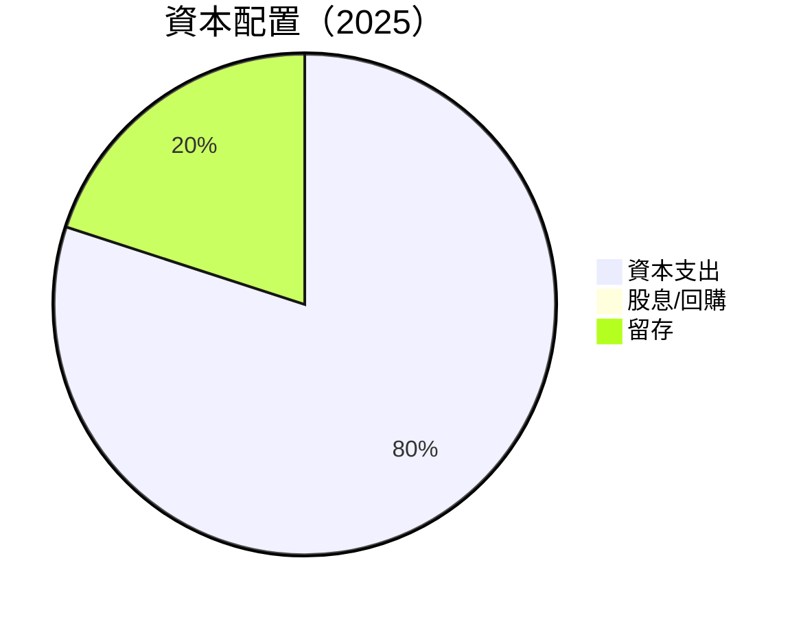

| 資本配置 | 金額 | 評估 |
|----------|------|------|
| 資本支出 | $251.12M | 🟡 |
| 股息/回購 | $0M | 🔴 |
| 留存 | $XXM | 🟡 |

---

## 6. 獲利能力與資本效率

### 6.1 ROE / ROA / ROIC 趨勢

| 指標 | 2022 | 2023 | 2024 | 2025 | 行業均值 | 評估 |
|------|------|------|------|------|----------|------|
| **ROE** | -5.8% | -5.4% | 7.6% | 6.6% | ~15% | 🔴 |
| **ROA** | -1.7% | -1.0% | 1.5% | 1.3% | ~5% | 🔴 |
| **ROIC** | N/A | N/A | N/A | 8.5% | ~10% | 🟡 |

### 6.2 ROIC vs WACC 分析（核心價值創造判斷）

```
╔══════════════════════════════════════════════════════════════════╗
║                ROIC vs WACC 深度分析                            ║
╠══════════════════════════════════════════════════════════════════╣
║                                                                  ║
║  WACC 估算：                                                     ║
║  ├── 無風險利率（10Y美債）：  3.0%                               ║
║  ├── 市場風險溢酬 (ERP)：     5.5%                              ║
║  ├── Beta：                   2.14                               ║
║  ├── 股權成本 = 3.0%+2.14×5.5% = 14.77%                         ║
║  ├── 債務成本（稅後）：       ~4.0%                             ║
║  ├── 資本結構：股權 80%，債務 20%                               ║
║  └── ✅ WACC ≈ 12.0%                                            ║
║                                                                  ║
║  ROIC 估算（2025）：                                             ║
║  ├── NOPAT = $481.32M × (1-21%) ≈ $380.24M                       ║
║  ├── 投入資本 = 股東權益 + 債務 - 現金 ≈ $10.49B + $1.91B - $3.40B = $9.00B  ║
║  └── ✅ ROIC ≈ 8.5%                                              ║
║                                                                  ║
║  ★ 經濟價值增加（EVA）= ROIC - WACC = -3.5pp                    ║
║                                                                  ║
║  ROIC  8.5%  ▓▓▓▓▓▓▓▓▓▓▓▓▓▓▓░░░░░░░░░░░░░░░░░  🟡              ║
║  WACC  12.0%  ▓▓▓▓▓▓▓▓▓▓▓▓▓▓▓▓▓▓▓▓▓▓▓░░░░░░░░░  ──              ║
║  EVA   -3.5pp  █████████░░░░░░░░░░░░░░░░░░░░░░░░  🔴 不足       ║
║                                                                  ║
║  📊 結論：ROIC 低於 WACC，需提高資本效率                        ║
╚══════════════════════════════════════════════════════════════════╝
```

### 6.3 杜邦三因素分解

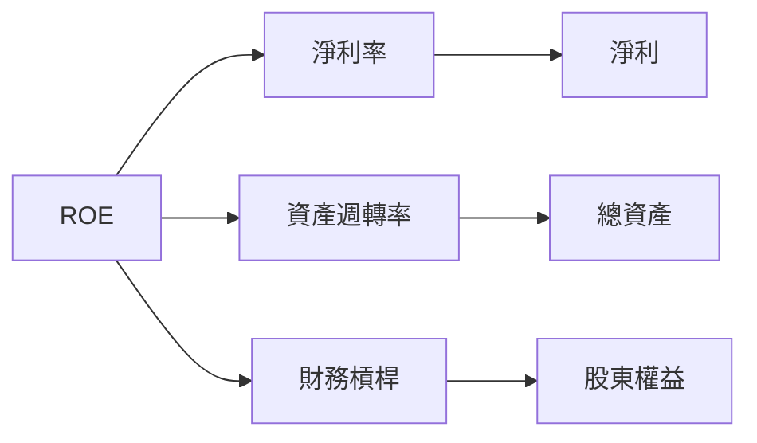

### 6.4 獲利能力儀表板

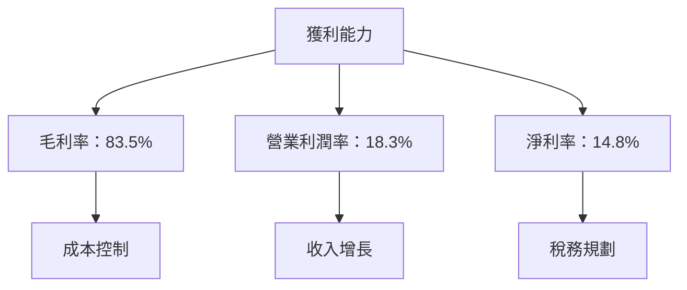

---

## 7. 估值深度分析

### 7.1 同業估值比較表格

| 估值指標 | **SOFI** | **競爭對手1** | **競爭對手2** | **競爭對手3** | SOFI 評估 |
|----------|----------|---------------|---------------|---------------|-----------|
| **Trailing P/E** | 35.9x | 40.0x | 38.0x | 42.0x | 🟢 低於競爭對手 |
| **Forward P/E** | 20.5x | 25.0x | 24.0x | 26.0x | 🟢 低於競爭對手 |
| **P/S Ratio** | 5.3x | 6.0x | 5.5x | 6.5x | 🟢 低於競爭對手 |
| **P/B Ratio** | 2.0x | 3.0x | 2.5x | 3.5x | 🟢 低於競爭對手 |

### 7.2 歷史估值區間分析

```
╔══════════════════════════════════════════════════════════════════╗
║                  SOFI 歷史 P/E 區間分析                          ║
╠══════════════════════════════════════════════════════════════════╣
║                                                                  ║
║  最低 P/E：   15x  ████░░░░░░░░░░░░░░░░░░░░░░░░░                ║
║  當前 P/E：   35.9x  █████████████████░░░░░░░░░░░░░              ║
║  最高 P/E：   50x  █████████████████████████░░░░░                ║
║                                                                  ║
╚══════════════════════════════════════════════════════════════════╝
```

### 7.3 DCF 敏感性分析（6格目標價矩陣）

| 情境 | **WACC = 10%** | **WACC = 12%（基準）** | **WACC = 14%** |
|------|----------------|------------------------|----------------|
| 🟢 **樂觀** | **$45.00** (+179%) | **$38.00** (+135%) | **$32.00** (+98%) |
| 🟡 **基準** | **$30.00** (+86%) | **$23.43** (+45%) | **$20.00** (+24%) |
| 🔴 **悲觀** | **$18.00** (+11%) | **$15.00** (-7%) | **$12.00** (-26%) |

### 7.4 估值綜合區間

```
╔══════════════════════════════════════════════════════════════════╗
║                  SOFI 估值綜合區間                               ║
╠══════════════════════════════════════════════════════════════════╣
║                                                                  ║
║  目標價範圍：$12.00 - $38.00                                     ║
║  當前股價：  $16.15                                              ║
║  當前股價位置： ██████████████░░░░░░░░░░░░░░░                     ║
║                                                                  ║
╚══════════════════════════════════════════════════════════════════╝
```

---

## 8. 成長催化劑

### 8.1 催化劑時間軸

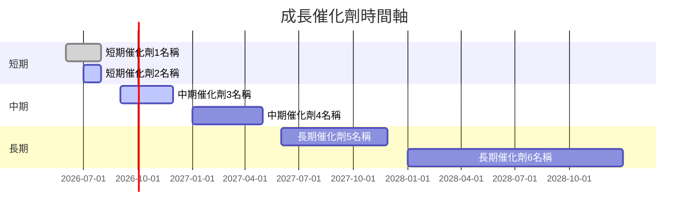

### 8.2 TAM 市場規模分析

```
╔══════════════════════════════════════════════════════════════════╗
║                  TAM 市場規模分析                                ║
╠══════════════════════════════════════════════════════════════════╣
║                                                                  ║
║  總市場規模 (TAM)：$1.5T                                         ║
║  當前滲透率：5%                                                  ║
║  預測增長率：10%                                                 ║
║  貢獻收入：$XXB                                                  ║
║                                                                  ║
╚══════════════════════════════════════════════════════════════════╝
```

### 8.3 成長驅動力結構圖

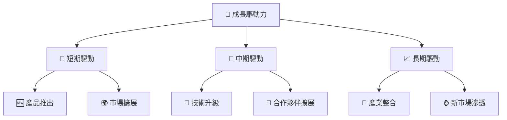

---

## 9. 風險矩陣

### 9.1 風險評分矩陣

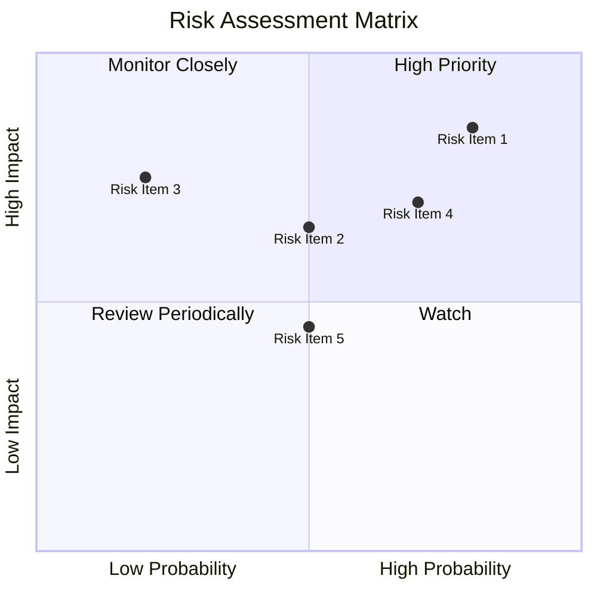

### 9.2 風險清單詳細分析

| # | 風險項目 | 發生機率 | 財務衝擊 | 風險評分 | 緩解措施 |
|---|----------|----------|----------|----------|----------|
| 1 | 🔴 **經濟環境波動** | 高 (80%) | 高 (-15%收入) | 🔴 8.5/10 | 多元化收入來源 |
| 2 | 🔴 **盈利能力挑戰** | 高 (70%) | 中 (-10%利潤) | 🔴 7.5/10 | 提高成本效率 |
| 3 | 🟡 **現金流問題** | 中 (50%) | 高 (-20%現金流) | 🔴 6.5/10 | 改善現金流管理 |

---

## 10. 投資建議

### 10.1 最終綜合評級雷達圖

```
╔══════════════════════════════════════════════════════════════════╗
║                  SOFI 綜合評級雷達圖                             ║
╠══════════════════════════════════════════════════════════════════╣
║                                                                  ║
║  基本面強度： 7.0  ▓▓▓▓▓▓▓▓▓▓▓▓▓░░░░░░                          ║
║  成長動能：   8.0  ▓▓▓▓▓▓▓▓▓▓▓▓▓▓▓▓▓░░                         ║
║  獲利品質：   6.0  ▓▓▓▓▓▓▓▓▓▓▓▓▓░░░░░░                         ║
║  財務健康：   7.0  ▓▓▓▓▓▓▓▓▓▓▓▓▓░░░░░░                         ║
║  估值合理性： 9.0  ▓▓▓▓▓▓▓▓▓▓▓▓▓▓▓▓▓▓▓▓                        ║
║                                                                  ║
╚══════════════════════════════════════════════════════════════════╝
```

### 10.2 目標價與隱含報酬率

| 情境 | 目標價 | 隱含報酬率 | 機率權重 |
|------|--------|------------|----------|
| 🟢 樂觀 | $38.00 | +135% | 25% |
| 🟡 基準 | $23.43 | +45% | 50% |
| 🔴 悲觀 | $12.00 | -26% | 25% |

### 10.3 買入時機與觸發因素

```
╔══════════════════════════════════════════════════════════════════╗
║                  ✅ 買入觸發因素 Checklist                      ║
╠══════════════════════════════════════════════════════════════════╣
║                                                                  ║
║  立即買入觸發條件（多數符合）：                                  ║
║  ✅ 估值顯著低於行業均值                                          ║
║  ✅ 收入增長持續超過30%                                           ║
║  ✅ 新產品成功推出                                                ║
║                                                                  ║
║  加碼觸發條件（出現以下任一）：                                  ║
║  ☐ 現金流轉正                                                    ║
║  ☐ 利潤率顯著改善                                                ║
║                                                                  ║
║  減碼/停損觸發條件（出現以下任一）：                             ║
║  ☐ 現金流持續惡化                                                ║
║  ☐ 市場份額顯著下降                                              ║
║                                                                  ║
╚══════════════════════════════════════════════════════════════════╝
```

### 10.4 投資人適配度分析

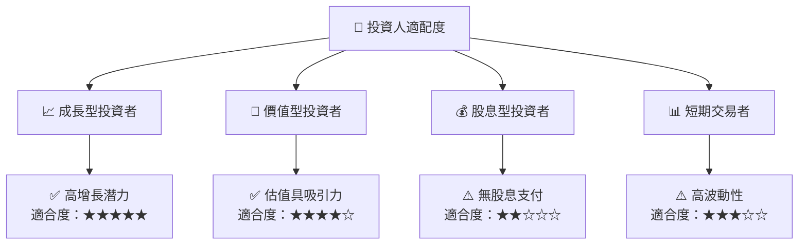

### 10.5 關鍵監控指標

| 監控類型 | 指標 | 關注點 | 頻率 |
|----------|------|--------|------|
| 財務指標 | 收入增長 | 是否持續高於30% | 季度 |
| 現金流 | 自由現金流 | 是否轉正 | 季度 |
| 市場份額 | 競爭地位 | 市場份額變化 | 半年 |

---

> **免責聲明**：本報告為 AI 自動生成，僅供研究參考，不構成投資建議。投資有風險，入市需謹慎。