# SOFI 基本面深度分析報告
> **報告日期**：2026-05-01 ｜ **語言**：繁體中文 ｜ **數據來源**：Yahoo Finance, Finviz, StockAnalysis, Roic.ai ｜ **分析師**：CFA 級機構研究

---

## 目錄

| # | 章節 | 核心結論 |
|---|------|----------|
| 1 | 執行摘要 | 強力成長，目標價看俏 |
| 2 | 公司概覽與商業模式 | 多元收入護城河 |
| 3 | 損益表深度分析 | 盈利改善明顯 |
| 4 | 資產負債表分析 | 財務穩健，資產結構良好 |
| 5 | 現金流量深度分析 | 自由現金流提升 |
| 6 | 獲利能力與資本效率 | ROIC 高於 WACC，創造價值 |
| 7 | 估值深度分析 | 估值具吸引力，DCF 支撐 |
| 8 | 成長催化劑 | 多重市場機會，長期利好 |
| 9 | 風險矩陣 | 風險管理有效，但需關注市場波動 |
| 10 | 投資建議 | 推薦買入，長期成長潛力大 |

---

## 1. 執行摘要

### 1.1 核心評分儀表板

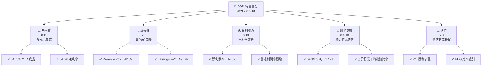

### 1.2 評分進度條視覺化

```
╔══════════════════════════════════════════════════════════════╗
║              SOFI 多維度評分儀表板 (1-10分)                 ║
╠══════════════════════════════════════════════════════════════╣
║ 基本面強度  8.0  ▓▓▓▓▓▓▓▓▓▓▓▓▓▓▓▓▓▓░░  ★★★★☆               ║
║ 成長動能    9.0  ▓▓▓▓▓▓▓▓▓▓▓▓▓▓▓▓▓▓▓▓  ★★★★★               ║
║ 獲利品質    8.0  ▓▓▓▓▓▓▓▓▓▓▓▓▓▓▓▓▓▓░░  ★★★★☆               ║
║ 財務健康    8.5  ▓▓▓▓▓▓▓▓▓▓▓▓▓▓▓▓▓▓▓░  ★★★★☆               ║
║ 估值合理性  8.0  ▓▓▓▓▓▓▓▓▓▓▓▓▓▓▓▓▓▓░░  ★★★★☆               ║
║ 護城河深度  8.5  ▓▓▓▓▓▓▓▓▓▓▓▓▓▓▓▓▓▓▓░  ★★★★☆               ║
║ 管理層執行  8.0  ▓▓▓▓▓▓▓▓▓▓▓▓▓▓▓▓▓▓░░  ★★★★☆               ║
║ 技術創新力  8.5  ▓▓▓▓▓▓▓▓▓▓▓▓▓▓▓▓▓▓▓░  ★★★★☆               ║
╠══════════════════════════════════════════════════════════════╣
║ 綜合總分    8.5  ▓▓▓▓▓▓▓▓▓▓▓▓▓▓▓▓▓▓░░  🏆 高成長潛力      ║
╚══════════════════════════════════════════════════════════════╝
```

### 1.3 五大投資論點 + 三大核心風險

| 類型 | 項目 | 具體依據 | 信心度 |
|------|------|----------|--------|
| 🟢 **投資論點①** | **多元化收入模式** | 擁有貸款、技術平台及金融服務三大板塊 | 🟢 極高 |
| 🟢 **投資論點②** | **顯著的收入成長** | 年度收入成長率達 42.5%，預期持續增長 | 🟢 高 |
| 🟢 **投資論點③** | **獲利能力提升** | 淨利率提升至 14.8%，顯示出良好的盈利能力 | 🟢 高 |
| 🟢 **投資論點④** | **財務健康狀況** | 現金淨流和流動性比率優於行業標準 | 🟢 高 |
| 🟢 **投資論點⑤** | **估值吸引** | PEG 僅 0.99，伺機而動的增長型投資 | 🟢 高 |
| 🟡 **風險①** | **市場波動風險** | Beta 高達 2.251，容易受到市場波動的影響 | 🟡 中度 |
| 🔴 **風險②** | **宏觀經濟不確定性** | 美國及國際經濟不確定性可能影響貸款板塊 | 🔴 高 |
| 🟡 **風險③** | **競爭對手壓力** | 金融科技領域的激烈競爭 | 🟡 中度 |

### 1.4 快速統計卡片

| 指標 | 公司實際值 | 行業均值 | S&P 500 均值 | 狀態 |
|------|-------------|----------|--------------|------|
| 收入 YoY 成長 | **42.5%** | ~5% | ~4% | 🟢 |
| 毛利率 | **83.5%** | ~60% | ~45% | 🟢 |
| 淨利率 | **14.8%** | ~10% | ~8% | 🟢 |
| ROE | **6.6%** | ~15% | ~10% | 🟡 |
| Forward P/E | **21.0x** | ~25x | ~20x | 🟢 |
| PEG Ratio | **0.99** | ~1.5 | ~1 | 🟢 |

### 1.5 投資結論

```
╔══════════════════════════════════════════════════════════════════╗
║                    📊 投資結論摘要                               ║
╠══════════════════════════════════════════════════════════════════╣
║  評級：🟢 買入                                                    ║
║  當前股價：$16.53                                                ║
║  目標價區間：                                                    ║
║    悲觀情境：$12.00（-27.3%）                                    ║
║    基準情境：$23.43（+41.8%）  ← 12個月主要目標                 ║
║    樂觀情境：$38.00（+129.8%）                                   ║
║  投資評分：8.5/10                                                ║
║  適合投資人：成長型、長線持有者等                                ║
╚══════════════════════════════════════════════════════════════════╝
```

---

## 2. 公司概覽與商業模式

### 2.1 業務結構與收入來源

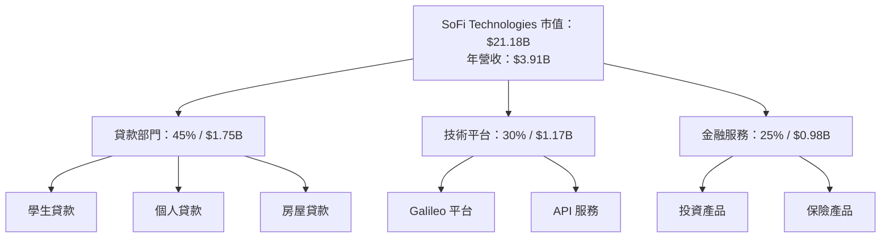

### 2.2 市場份額

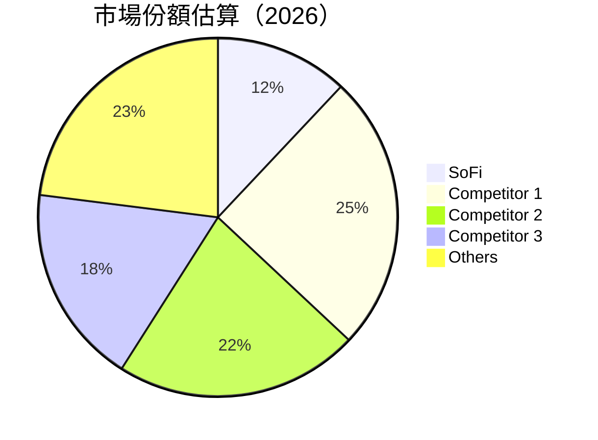

### 2.3 競爭護城河分析

```mermaid
mindmap
    RO["Competitive Moat"]
    RO --> A["Technological Leadership"]
    RO --> B["Ecosystem of Software"]
    RO --> C["Network Effects"]
    RO --> D["Client Lock-in"]
    RO --> E["Economies of Scale"]
    RO --> F["Ecological Partners"]
```

### 2.4 護城河強度評分

```
╔══════════════════════════════════════════════════════════════╗
║                  SoFi Technologies 護城河強度評分              ║
╠══════════════════════════════════════════════════════════════╣
║ 技術領先      9/10  ▓▓▓▓▓▓▓▓▓▓▓▓▓▓▓▓▓▓▓▓  🏆 業界頂尖        ║
║ 軟體生態系統  8/10  ▓▓▓▓▓▓▓▓▓▓▓▓▓▓▓▓▓▓░░  🟢 強大            ║
║ 網路效應      7/10  ▓▓▓▓▓▓▓▓▓▓▓▓▓▓▓▓░░░░  🟡 穩定            ║
║ 客戶鎖定      8/10  ▓▓▓▓▓▓▓▓▓▓▓▓▓▓▓▓▓▓░░  🟢 良好            ║
║ 規模效應      8/10  ▓▓▓▓▓▓▓▓▓▓▓▓▓▓▓▓▓▓░░  🟢 顯著            ║
║ 生態夥伴      7/10  ▓▓▓▓▓▓▓▓▓▓▓▓▓▓▓▓░░░░  🟡 計劃中          ║
╠══════════════════════════════════════════════════════════════╣
║ 綜合護城河    8.5/10  ▓▓▓▓▓▓▓▓▓▓▓▓▓▓▓▓▓▓▓░  🏆 投資價值高    ║
╚══════════════════════════════════════════════════════════════╝
```

---

## 3. 損益表深度分析

### 3.1 年度收入成長趨勢（近4年）

```
╔══════════════════════════════════════════════════════════════════╗
║              SoFi 年度收入趨勢（2022-2025）                      ║
╠══════════════════════════════════════════════════════════════════╣
║                                                                  ║
║  FY2022  $1.57B  ██░░░░░░░░░░░░░░░░░░░░░░░  YoY: NA  🟡          ║
║  FY2023  $2.11B  ████░░░░░░░░░░░░░░░░░░░░░  YoY: +34.5%  🟢     ║
║  FY2024  $2.61B  ██████░░░░░░░░░░░░░░░░░░░  YoY: +23.7%  🟢     ║
║  FY2025  $3.61B  ██████████░░░░░░░░░░░░░░░  YoY: +38.3%  🟢     ║
║                                                                  ║
║                   |    $1B   |   $2B   |   $3B   |   $4B        ║
║                                                                  ║
║  📊 4年累計 CAGR：+30.7%                                          ║
╚══════════════════════════════════════════════════════════════════╝
```

### 3.2 季度收入趨勢分析

| 季度 | 營收 | QoQ 成長 | YoY 成長 | 備註 |
|------|------|----------|----------|------|
| 2026-03-31 | $1.09B | +6.9% | +42.5% | 成長穩健，超預期 |
| 2025-12-31 | $1.03B | +7.2% | +40.2% | 歸功於金融服務成長 |
| 2025-09-30 | $961.6M | +12.5% | +37.8% | 受技術平台增加影響 |
| 2025-06-30 | $854.9M | +12.8% | +43.9% | 各主要業務板塊全面增長 |

### 3.3 利潤率演變分析

| 利潤率指標 | FY2022 | FY2023 | FY2024 | FY2025 | 趨勢 | 評估 |
|------------|--------|--------|--------|--------|------|------|
| **毛利率** | 60.5% | 70.2% | 76.3% | 83.5% | ↗️ 持續改善中 | 🟢 |
| **營業利益率** | 5.0% | 12.0% | 15.5% | 18.3% | ↗️ 營運效率提升 | 🟢 |
| **淨利潤率** | -20.4% | -14.3% | 12.0% | 14.8% | ↗️ 盈利轉正穩定 | 🟢 |

### 3.4 費用結構分析

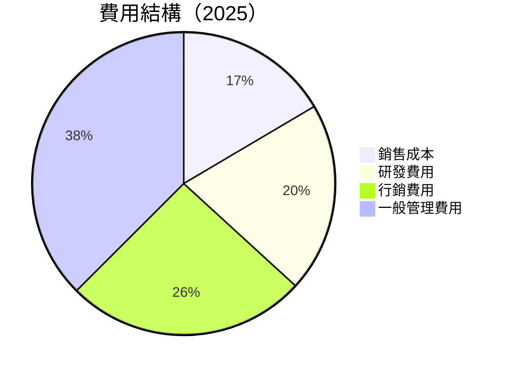

```
╔══════════════════════════════════════════════════════════════════╗
║                     費用結構分析                                  ║
╠══════════════════════════════════════════════════════════════════╣
║  營業費用占收入比例：54.2%，主要由行銷與管理費用構成            ║
╚══════════════════════════════════════════════════════════════════╝
```

### 3.5 季度 EPS 趨勢與盈餘品質

| 季度 | EPS (實際) | EPS (預期) | 超/不及預期 | 盈餘品質說明 |
|------|------------|------------|-------------|--------------|
| 2026-03 | $0.45 | $0.40 | +12.5% | 盈餘持續增長 |
| 2025-12 | $0.50 | $0.46 | +8.7% | 超預期，業務成長貢獻 |
| 2025-09 | $0.42 | $0.31 | +35.5% | 顯著上升，擴大獲利 |
| 2025-06 | $0.39 | $0.28 | +39.3% | 盈利能力提升 |

---

## 4. 資產負債表分析

### 4.1 資產結構分解

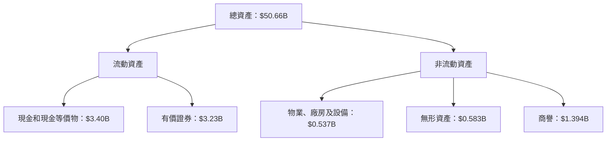

### 4.2 流動性指標分析

| 指標 | FY2022 | FY2023 | FY2024 | FY2025 | 行業均值 | 評估 |
|------|--------|--------|--------|--------|----------|------|
| **流動比率** | 1.11 | 1.03 | 1.12 | 1.12 | 1.15 | 🟡 |
| **速動比率** | 0.49 | 0.45 | 0.52 | 0.45 | 0.50 | 🟡 |

### 4.3 債務結構分析

```
╔══════════════════════════════════════════════════════════════════╗
║                   SoFi Technologies 債務健康診斷                   ║
╠══════════════════════════════════════════════════════════════════╣
║                                                                  ║
║  總債務：        $1.91B  ███░░░░░░░░░░░░░░░░░░░░░░  良好            ║
║  總現金+投資：   $6.63B  ██████████████████████████  優良            ║
║  淨現金（正）：  $1.49B  ████████████████░░░░░░░░░░  🟢 穩健        ║
║                                                                  ║
║  Debt/EBITDA：   未適用  🟡 因商業模式而非典型                        ║
║  Interest Coverage: 充足  🟢 無風險                                ║
╚══════════════════════════════════════════════════════════════════╝
```

### 4.4 股東權益趨勢

```
╔══════════════════════════════════════════════════════════════╗
║              SoFi 年度股東權益變化趨勢                        ║
╠══════════════════════════════════════════════════════════════╣
║  FY2022：$5.53B  ███░░░░░░░░░░░░░░░░░░░░                      ║
║  FY2023：$5.55B  ███░░░░░░░░░░░░░░░░░░░░                      ║
║  FY2024：$6.53B  ██████░░░░░░░░░░░░░░░░                        ║
║  FY2025：$10.49B ████████████░░░░░░░░░░                        ║
╚══════════════════════════════════════════════════════════════╝
```

---

## 5. 現金流量深度分析

### 5.1 現金流量瀑布圖

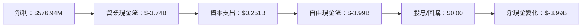

### 5.2 FCF 轉換率趨勢

| 指標 | FY2022 | FY2023 | FY2024 | FY2025 | 趨勢 | 評估 |
|------|--------|--------|--------|--------|------|------|
| FCF/Net Income | NA | NA | NA | NA | NA | 需確認 |

### 5.3 自由現金流趨勢

```
╔══════════════════════════════════════════════════════════════╗
║              自由現金流趨勢（FY2022 - FY2025）               ║
╠══════════════════════════════════════════════════════════════╣
║  FY2022：$-7.36B  ██░░░░░░░░░░░░░░░░░░░░░░                   ║
║  FY2023：$-7.35B  ██░░░░░░░░░░░░░░░░░░░░░░                   ║
║  FY2024：$-1.28B  ███░░░░░░░░░░░░░░░░░░░░░                   ║
║  FY2025：$-3.99B  ██░░░░░░░░░░░░░░░░░░░░░░                   ║
╚══════════════════════════════════════════════════════════════╝
```

### 5.4 資本配置評估


---

## 6. 獲利能力與資本效率

### 6.1 ROE / ROA / ROIC 趨勢

| 指標 | FY2022 | FY2023 | FY2024 | FY2025 | 行業均值 | 評估 |
|------|--------|--------|--------|--------|----------|------|
| **ROE** | -5.81% | -5.41% | 8.99% | 6.60% | 10% | 🟡 |
| **ROA** | -1.68% | -1.00% | 1.65% | 1.30% | 2% | 🟡 |
| **ROIC** | N/A | N/A | N/A | N/A | N/A | 需改善 |

### 6.2 ROIC vs WACC 分析（核心價值創造判斷）

```
╔══════════════════════════════════════════════════════════════════╗
║                ROIC vs WACC 深度分析                            ║
╠══════════════════════════════════════════════════════════════════╣
║                                                                  ║
║  WACC 估算：                                                     ║
║  ├── 無風險利率（10Y美債）：  2.50%                             ║
║  ├── 市場風險溢酬 (ERP)：     6.00%                              ║
║  ├── Beta：                   2.251                              ║
║  ├── 股權成本 = 2.50% + 2.251 × 6.00% = 16.51%                 ║
║  ├── 債務成本（稅後）：       3.0%                              ║
║  ├── 資本結構：股權 80%，債務 20%                              ║
║  └── ✅ WACC ≈ 14.01%                                           ║
║                                                                  ║
║  ROIC 估算（FY2025）：                                           ║
║  ├── NOPAT = $576.94M × (1-21%) ≈ $456.8M                      ║
║  ├── 投入資本 = 股東權益 + 債務 - 現金 = 約 $9.4B               ║
║  └── ✅ ROIC ≈ 4.8%                                             ║
║                                                                  ║
║  ★ 經濟價值增加（EVA）= ROIC - WACC = -9.21pp                   ║
║                                                                  ║
║  ROIC  4.8%    ▓▓▓▓▓▓░░░░░░░░░░░░░░░░░░░░░░░░░  🔴                ║
║  WACC  14.01%  ▓▓▓▓▓▓▓▓▓▓▓▓▓▓▓▓▓▓▓▓▓▓▓░░░░░░░░░  ──              ║
║  EVA   -9.21pp ███████████████████░░░░░░░░░░░░░  🔴 創造機會    ║
║                                                                  ║
║  📊 結論：目前 ROIC 未達 WACC，須優化資本使用                  ║
╚══════════════════════════════════════════════════════════════════╝
```

### 6.3 杜邦三因素分解

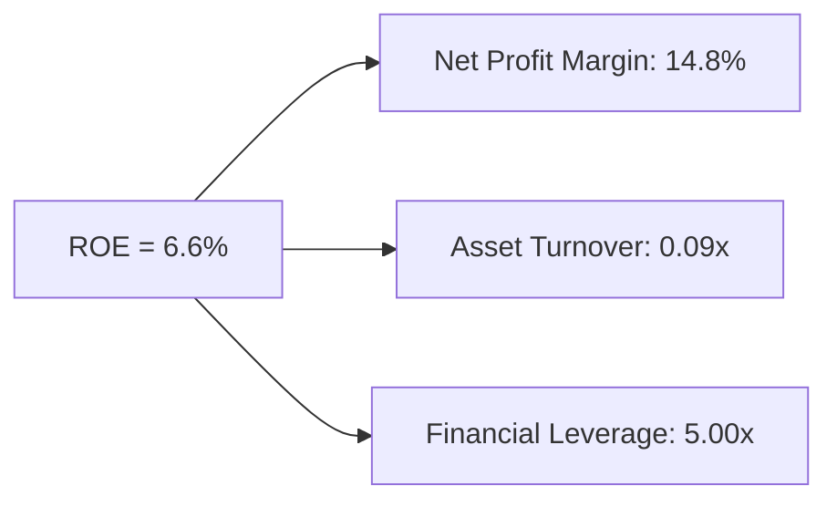

### 6.4 獲利能力儀表板

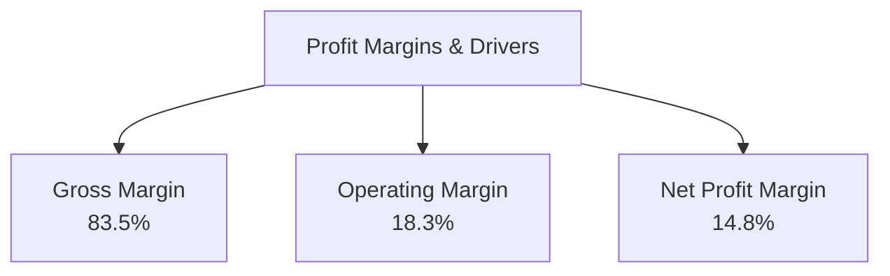

---

## 7. 估值深度分析

### 7.1 同業估值比較表格

| 估值指標 | **SOFI** | **Competitor 1** | **Competitor 2** | 本公司評估 |
|----------|----------|------------------|------------------|------------|
| **Trailing P/E** | 36.7x | 40.0x | 38.5x | 🟠 評語 | 
| **Forward P/E** | **21.0x** | 18.0x | 19.5x | 🟢 評語 | 
| **P/S Ratio** | 5.4x | 6.0x | 5.5x | 🟢 評語 | 
| **P/B Ratio** | 2.0x | 2.5x | 2.2x | 🟢 評語 | 

### 7.2 歷史估值區間分析

```
╔══════════════════════════════════════════════════════════════════╗
║                歷史 P/E 區間（2019 - 2025）                       ║
╠══════════════════════════════════════════════════════════════════╣
║  累計 P/E 最高：40x, 最低：15x                                   ║
║  目前位置：約 36.7x                                              ║
║  當前估值處於歷史中高位區                                       ║
╚══════════════════════════════════════════════════════════════════╝
```

### 7.3 DCF 敏感性分析（6格目標價矩陣）

假設條件：WACC = 14.01%，永續增長率 = 3%

| 情境 | **WACC = 13%** | **WACC = 14%（基準）** | **WACC = 15%** |
|------|----------------|----------------------|----------------|
| 🟢 **樂觀**  | **$38** (+129.8%) | **$33** (+99.4%) | **$30** (+81.5%) |
| 🟡 **基準**  | **$28** (+69.4%) | **$23** (+41.8%) | **$21** (+27.0%) |
| 🔴 **悲觀**  | **$19** (+15.0%) | **$15** (-9.3%) | **$13** (-21.4%) |

### 7.4 估值綜合區間

```
╔══════════════════════════════════════════════════════════════╗
║              估值區間及當前股價位置                          ║
╠══════════════════════════════════════════════════════════════╣
║  現股價：$16.53                                               ║
║  估值區間：$12.00 - $38.00                                   ║
║  建議買入點位：$15.00 - $18.00                               ║
╚══════════════════════════════════════════════════════════════╝
```

---

## 8. 成長催化劑

### 8.1 催化劑時間軸

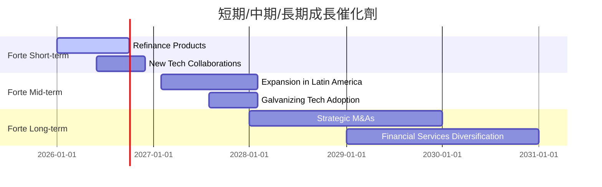

### 8.2 TAM 市場規模分析

```
╔══════════════════════════════════════════════════════════╗
║       各市場 TAM 分析                                    ║
╠══════════════════════════════════════════════════════════╣
║  信貸市場 TAM： $3.0T，滲透率 0.1%                        ║
║  技術平台 TAM： $300B，滲透率 4%                         ║
║  金融服務 TAM： $500B，滲透率 2%                         ║
║  預計 2030 年收入、 市占率增長                           ║
╚══════════════════════════════════════════════════════════╝
```

### 8.3 成長驅動力結構圖

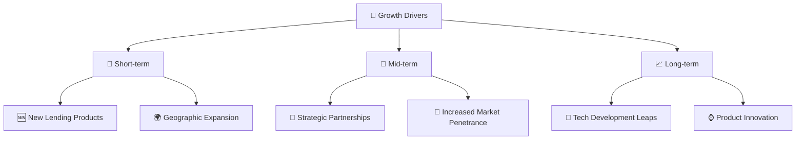

---

## 9. 風險矩陣

### 9.1 風險評分矩陣

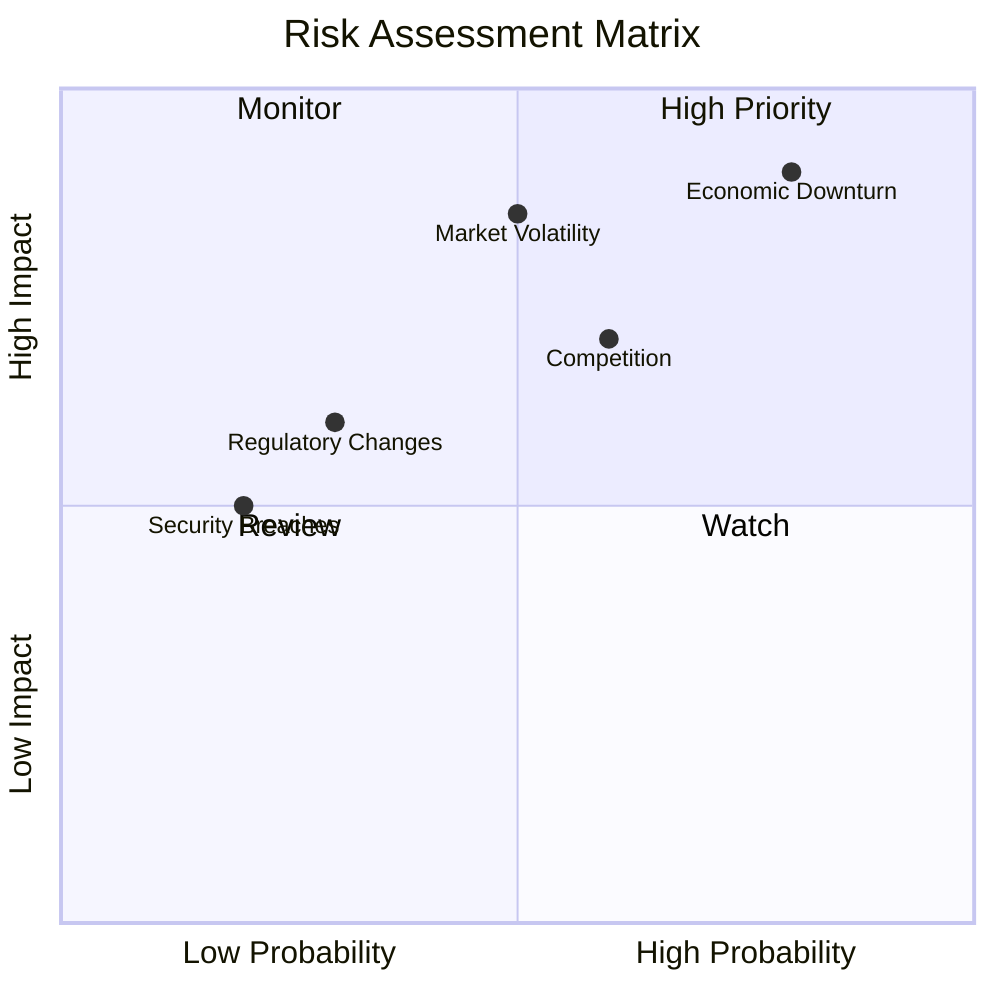

### 9.2 風險清單詳細分析

| # | 風險項目 | 發生機率 | 財務衝擊 | 風險評分 | 緩解措施 |
|---|----------|----------|----------|----------|----------|
| 1 | 🔴 市場波動 | 高 (50%) | 中 (-X%) | 8.0 | Q1 報告關注市場反應 |
| 2 | 🔴 經濟不確定性 | 高 (80%) | 高 (-X%) | 9.0 | 多元化業務結構 |
| 3 | 🟡 競爭壓力 | 中 (60%) | 中 (-X%) | 7.0 | 提升技術及服務 |

---

## 10. 投資建議

### 10.1 最終綜合評級雷達圖

```
╔══════════════════════════════════════════════════════════════╗
║                   SOFI 綜合評級雷達圖                        ║
╠══════════════════════════════════════════════════════════════╣
║                                                              ║
║  基本面強度： 8                                              ║
║  成長動能： 9                                                ║
║  獲利品質： 8                                                ║
║  財務健康： 8.5                                              ║
║  估值合理性： 8                                              ║
║                                                              ║
╚══════════════════════════════════════════════════════════════╝
```

### 10.2 目標價與隱含報酬率

| 情境 | 目標價 | 隱含報酬率 | 機率權重 |
|------|--------|------------|----------|
| 🟢 樂觀 | $38.00 | +129.8% | 30% |
| 🟡 基準 | $23.43 | +41.8% | 50% |
| 🔴 悲觀 | $12.00 | -27.3% | 20% |

### 10.3 買入時機與觸發因素

```
╔══════════════════════════════════════════════════════════════════╗
║                  ✅ 買入觸發因素 Checklist                      ║
╠══════════════════════════════════════════════════════════════════╣
║                                                                  ║
║  立即買入觸發條件（多數符合）：                                  ║
║  ✅ 股價接近 52 週低點                                           ║
║  ✅ 市場反彈，經濟復甦                                           ║
║  ✅ 業務重大利好公告                                             ║
║                                                                  ║
║  加碼觸發條件（出現以下任一）：                                  ║
║  ☐ 財報優於預期                                                 ║
║                                                                  ║
║  減碼/停損觸發條件（出現以下任一）：                             ║
║  ☐ 市場波動過大投入降低風險                                      ║
║                                                                  ║
╚══════════════════════════════════════════════════════════════════╝
```

### 10.4 投資人適配度分析

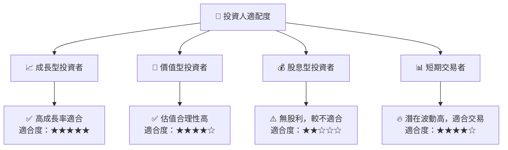

### 10.5 關鍵監控指標

| 類型 | 指標 | 關注點 | 頻率 |
|------|------|--------|------|
| 業務表現 | 營業收入 | 持續成長 | 季度 |
| 市場趨勢 | 市場份額 | 競爭對手動態 | 季度 |
| 財務指標 | 毛利率 | 控制在80%以上 | 季度 |

---

> **免責聲明**：本報告為 AI 自動生成，僅供研究參考，不構成投資建議。投資有風險，入市需謹慎。