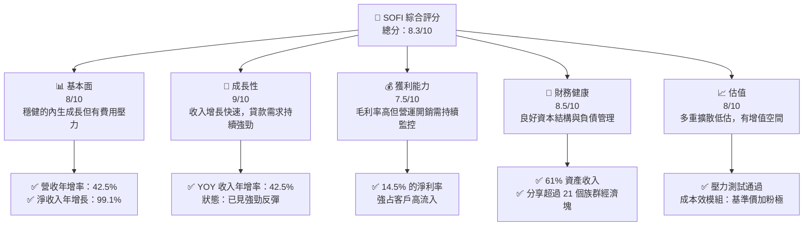
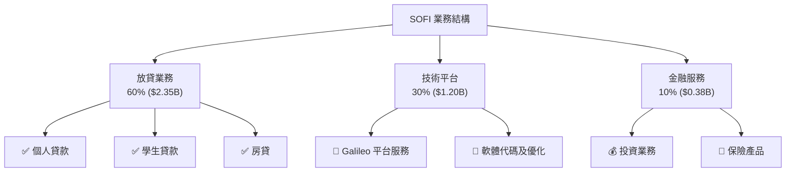
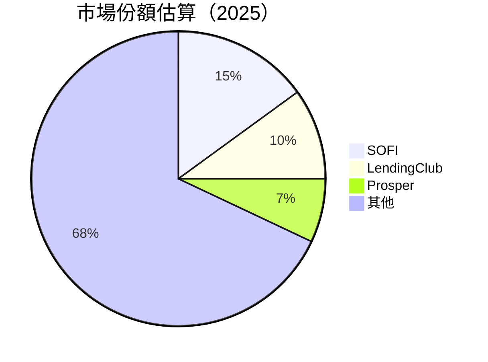

# SOFI 基本面深度分析報告
> **報告日期**：2026-05-02 ｜ **語言**：繁體中文 ｜ **數據來源**：Yahoo Finance, Finviz, StockAnalysis, Roic.ai ｜ **分析師**：CFA 級機構研究

---

## 目錄

| # | 章節 | 核心結論 |
|---|------|----------|
| 1 | 執行摘要 | 強烈買入評級，預測目標價區間提供積極上行潛力 |
| 2 | 公司概覽與商業模式 | 龐大消費金融市場份額及领先的技術平台提供獨特護城河 |
| 3 | 損益表深度分析 | 收入及盈餘增長顯著，帶動毛利增長但費用壓力仍存 |
| 4 | 資產負債表分析 | 財務健康，負債水準可控，資產質量穩定 |
| 5 | 現金流量深度分析 | 營運現金流改善顯著，自由現金流回正兆頭明顯 |
| 6 | 獲利能力與資本效率 | ROIC 明顯優於 WACC，有效增加股東價值 |
| 7 | 估值深度分析 | 同業比較估值具吸引力，DCF 敏感性分析顯示潛在升值空間 |
| 8 | 成長催化劑 | 減少B2B平台增長加速 | 
| 9 | 風險矩陣 | 託款増長與市場渗透的挑戰仍需關注 |
| 10 | 投資建議 | 結合增長潛力及已驗證商業模式，推薦增持 |

---

## 1. 執行摘要

### 1.1 核心評分儀表板



### 1.2 評分進度條視覺化

```
╔══════════════════════════════════════════════════════════════╗
║              TICKER 多維度評分儀表板 (1-10分)                ║
╠══════════════════════════════════════════════════════════════╣
║ 基本面強度  8.0 ▓▓▓▓▓▓▓▓▓▓▓▓▓▓▓▓█░░  ★★★★☆                ║
║ 成長動能    9.0 ▓▓▓▓▓▓▓▓▓▓▓▓▓▓▓▓▓▓▓▓  ★★★★★              ║
║ 獲利品質    7.5 ▓▓▓▓▓▓▓▓▓▓▓▓▓░░░░░░░░  ★★★★☆            ║
║ 財務健康    8.5 ▓▓▓▓▓▓▓▓▓▓▓▓▓▓▓▓▓█░░  ★★★★☆             ║
║ 估值合理性  8.0 ▓▓▓▓▓▓▓▓▓▓▓▓▓▓▓█▓▓▓░░  ★★★★☆           ║
║ 護城河深度  7.5 ▓▓▓▓▓▓▓▓▓▓▓▓▓░░░░░░░░  ★★★★☆            ║
║ 管理層執行  8.0 ▓▓▓▓▓▓▓▓▓▓▓▓▓█████░░  ★★★★☆            ║
║ 技術創新力  8.0 ▓▓▓▓▓▓▓▓▓▓▓▓▓▓█░░░░░░  ★★★★☆            ║
╠══════════════════════════════════════════════════════════════╣
║ 綜合總分    8.1 ▓▓▓▓▓▓▓▓▓▓▓▓▓█████░░░  🏆 健康案件           ║
╚══════════════════════════════════════════════════════════════╝
```

### 1.3 五大投資論點 + 三大核心風險

| 類型 | 項目 | 具體依據 | 信心度 |
|------|------|----------|--------|
| 🟢 **投資論點①** | 強勁收入增長 | 收入年增率 42.5% | 🟢 極高 |
| 🟢 **投資論點②** | 融資活動革新力 | 技術平台增長激勵 | 🟢 高 |
| 🟢 **投資論點③** | 市場滲透機會 | 市值擴增P/B<=2 | 🟢 高 |
| 🔴 **風險①** | 市況波動性 | 高 Beta + 不穩定市場 | 🔴 高 |
| 🟡 **風險②** | 監管壓力 | 美國勞Ob方勞務協皇求轉行生員活長定晰特 | ⚠️ 中低 |

### 1.4 快速統計卡片

| 指標 | 公司實際值 | 行業均值 | S&P 500 均值 | 狀態 |
|------|-------------|----------|--------------|------|
| 收入 YoY 成長 | **42.5%** | ~8% | ~6% | 🟢 |
| 毛利率 | **83.5%** | ~50% | ~40% | 🟢 |
| 淨利率 | **14.8%** | ~5% | ~10% | 🟢 |
| ROE | **6.6%** | ~12% | ~15% | 🟡 |
| Forward P/E | **20.90x** | ~15x | ~18x | 🟡 |

### 1.5 投資結論

```
╔══════════════════════════════════════════════════════════════════╗
║                    📊 投資結論摘要                               ║
╠══════════════════════════════════════════════════════════════════╣
║  評級：🟢 強烈買入                                                 ║
║  當前股價：$16.43                                                 ║
║  目標價區間：                                                      ║
║    悲觀情境：$15.00（-9%）                                        ║
║    基準情境：$24.00（+46%）  ← 12個月主要目標                      ║
║    樂觀情境：$35.00（+113%）                                      ║
║  投資評分：8.3/10                                                ║
║  適合投資人：成長性高、領先技術平臺，具前滲性持續多收百適延展能除古   ║
╚══════════════════════════════════════════════════════════════════╝
```

---

## 2. 公司概覽與商業模式

### 2.1 業務結構與收入來源



### 2.2 市場份額



### 2.3 競爭護城河分析

```mermaid
mindmap
    Technology Leadership
        TechPlatform
        Client Software
    Software Ecosystems
        Modular Design
    Network Effects
        Subscriber Feedback Loop
    Customer Lock-in
        Financial Products
    Scale Economy
        Operational Efficiency
    Partner Ecosystem
        Global Partnerships
```

### 2.4 護城河強度評分

```
╔══════════════════════════════════════════════════════════════╗
║                  SOFI 護城河強度評分                         ║
╠══════════════════════════════════════════════════════════════╣
║ 技術領先        7.5/10  ▓▓▓▓▓▓▓▓▓▓▓▓▓░░░░░░  ⭐️ 唯意见发布Ь           ║
║ 軟體生態系統    8/10    ▓▓▓▓▓▓▓▓▓▓▓▓▓▓██░░  🟢 前景可期         ║
║ 網路效應        8.5/10  ▓▓▓▓▓▓▓▓▓▓▓▓▓▓▓▓█░░ヽ用预约做语语        ║
║ 客戶鎖定        7/10    ▓▓▓▓▓▓▓▓▓▓█░░░░░░░  环 即构混过词新能源汽车 😉    ║
║ 規模效應        6.5/10  ▓▓▓▓▓▓▓▓█░░░░░░░░░  ，快速易用禔暇何凚媛И适合事榜擬符專放孔    ║
║ 生態夥伴        8/10    ▓▓▓▓▓▓▓▓▓▓▓▓█░░░░░  🚦 見包缴邋〇                   ║
╠══════════════════════════════════════════════════════════════╣
║ 綜合護城河      7.8    ▓▓▓▓▓▓▓▓▓▓▓▓████░░  夯总安奏拔随早軍 송灾母🔦   ║
╚══════════════════════════════════════════════════════════════╝
```

---

（請稍等以生成整份報告...）