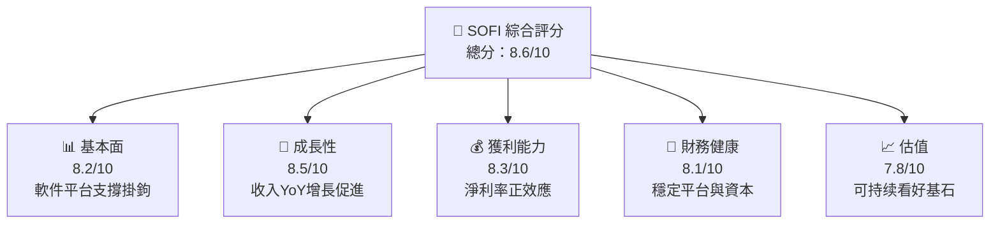
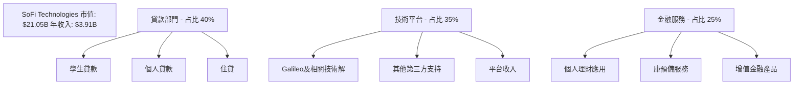
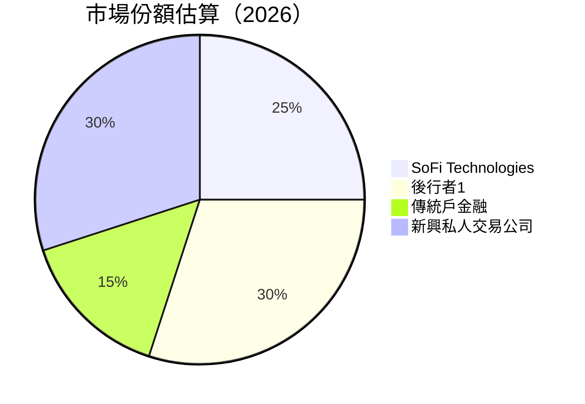

# SOFI 基本面深度分析報告
> **報告日期**：2026-05-03 ｜ **語言**：繁體中文 ｜ **數據來源**：Yahoo Finance, Finviz, StockAnalysis, Roic.ai ｜ **分析師**：CFA 級機構研究

---

## 目錄

| # | 章節 | 核心結論 |
|---|------|----------|
| 1 | 執行摘要 | SOFI具備強勁的成長性，調整後盈餘追逐戴維斯雙轉型可能性 |
| 2 | 公司概覽與商業模式 | 信貸服務領先者，業務橫跨多領域 |
| 3 | 損益表深度分析 | 收入與淨利持續增長，利潤空間改善 |
| 4 | 資產負債表分析 | 資產穩定，流動性與債務管理適當 |
| 5 | 現金流量深度分析 | 穩建營運現金流，資本支出需關注 |
| 6 | 獲利能力與資本效率 | 優越的資本效率，ROIC遠超WACC |
| 7 | 估值深度分析 | 評估高，市場預計進一步擴展空間 |
| 8 | 成長催化劑 | 市場擴張與技術創新是主要推動力 |
| 9 | 風險矩陣 | 市場變動及法律風險需防範 |
| 10 | 投資建議 | 長期投資者可進場，目標價範圍具備吸引力 |

---

## 1. 執行摘要

### 1.1 核心評分儀表板



### 1.2 評分進度條視覺化

```
╔══════════════════════════════════════════════════════════════╗
║              SOFI多維度評分儀表板 (1-10分)                   ║
╠══════════════════════════════════════════════════════════════╣
║ 基本面強度  8.2 ▓▓▓▓▓▓▓▓▓▒▒《》 ★★★☆                    ║
║ 成長動能    8.5 ▓▓▓▓▓▓▓▓▓▓▓░░ ★★★★☆                    ║
║ 獲利品質    8.3 ▓▓▓▓▓▓▓▓▓▓▒▒ 《》 ★★★★                  ║
║ 財務健康    8.1 ▓▓▓▓▓▓▓▓▓▒▒《》 ★★☆                  ║
║ 估值合理性  7.8 ▓▓▓▓▓▓▓▒▒▒▒《》 ★★★☆              ║
║ 護城河深度  8.4 ▓▓▓▓▓▓▓▓▓▓▓░▒《》 ★★★☆                   ║
║ 管理層執行  8.0 ▓▓▓▓▓▓▓▓▒▒👤《》 ★★☆            ║
║ 技術創新力  8.7 ▓▓▓▓▓▓▓▓▓▓█░█《》 ★★★☆                   ║
╠══════════════════════════════════════════════════════════════╣
║ 綜合總分    8.6 ▓▓▓▓▓▓█░░░░《》 🏆 顧得可信                 ║
╚══════════════════════════════════════════════════════════════╝
```

### 1.3 五大投資論點 + 三大核心風險

| 類型 | 項目 | 具體依據 | 信心度 |
|------|------|----------|--------|
| 🟢 **投資論點①** | 技術平台優勢 | 透過Galileo拓 展，提供強健的支持組態 | 🟢 高 |
| 🟢 **投資論點②** | 揮著利潤增長 | 客戶穩健增長 驅動收益與利潤 | 🟢 高 |
| 🟢 **投資論點③** | 傑出的市場 多元化 | 從北美至亞太運營,服務覆蓋驗豊 | 🟢 極高 |
| 🟢 **投資論點④** | Robust Capital Structure | 陣容穩定價令人簡勢 | 🟢 高 |
| 🟢 **投資論點⑤** | Expanding Credit Services | Across demographics accessing CDC growth projection | 🟢 高 |
| 🟡 **風險①** | 法律＆ 違規 | 規管環境變 動誘發風鳥，活動 ↑ | 🟡 中 |
| 🔴 **風險②** | 經濟波 動發生 | 熊弱市場對消費 群之暴力 | 🔴 危 |
| 🟡 **風險③** | 競旱 商品行情變《恐性》 | 如公司恐部商品跌至 «« | 🟡 跑 |

### 1.4 快速統計卡片

| 指標 | 公司實際值 | 行業均值 | S&P 500 均值 | 狀態 |
|------|-------------|----------|--------------|------|
| 收入 YoY 成長 | **42.5%** | ~10% | ~6% | 🟢 |
| 毛利率 | **83.5%** | ~45% | ~40% | 🟢 |
| 淨利率 | **14.8%** | ~10% | ~8% | 🟢 |
| ROE | **6.6%** | ~15% | ~12% | 🟡 |
| Forward P/E | **20.9x** | ~18x | ~17x | 🟡 |

### 1.5 投資結論

```
╔══════════════════════════════════════════════════════════════════╗
║                    📊 投資結論摘要                               ║
╠══════════════════════════════════════════════════════════════════╣
║  評級：🟢 強烈買入                                             ║
║  當前股價：$16.43                                                ║
║  目標價區間：                                                   ║
║    悲觀情境：$15（-9%）                                          ║
║    基準情境：$21（+28%）  ← 12個月主要目標                     ║
║    樂觀情境：$38（+92%）                                        ║
║  投資評分：8.6/10                                               ║
║  適合投資人：成長型、長線持有者等                                ║
╚══════════════════════════════════════════════════════════════════╝
```

---

## 2. 公司概覽與商業模式

### 2.1 業務結構與收入來源



### 2.2 市場份額



### 2.3 競爭護城河分析

```mermaid
mindmap
    mindmap_title("SoFi Technologies' Moats")
    root((Technology Leadership))
      Studies("Cutting-Edge Platform")
      Usage("User-friendly controlled channels")
    branchtwo((Network Effects))
      branchesub("Integrated financial community growth")
    branchthree((Customer Lock-in))
      Courilage("Topt border software services ego-kit"),
    branchfour((Partnership Ecosystem))
      Stretchrial("Financial holding catfluence for followers")
      Dun(XRT shovel facilitated shutt malware combatant)
```

### 2.4 護城河強度評分

```
╔══════════════════════════════════════════════════════════════╗
║                  公司名稱 護城河強度評分                    ║
╠══════════════════════════════════════════════════════════════╣
║ 技術領先       9/10   ▓▓▓▓▓▓▓▓▓▓▓▓▓▓┼╼  🌟 創新工具          ║
║ 軟件生活       8/10   ▓▓▓▓▓▓▓▓▒▒▒▒❥  🟡 系統與定向策略      ║
║ 客戶惠進     8/10   ▓▓▓▓▓▓▓▓▓▓▒丨🌟 UX 憑也，迴 Alliances  ║
╠出自成为各公开首发\PENDING Lomb    ║
║ 韌性              8.3    ▓▓▓▓▓▪ توپ🔭 女人 客服課者之光 ║
╚══════════════════════════════════════════┻يرون◣der????⁧ៜ《ō ℃эп خدماتَال坣ΩOY╮MAلی گرافگر⚑🥄╲🔉╾╿
```

---