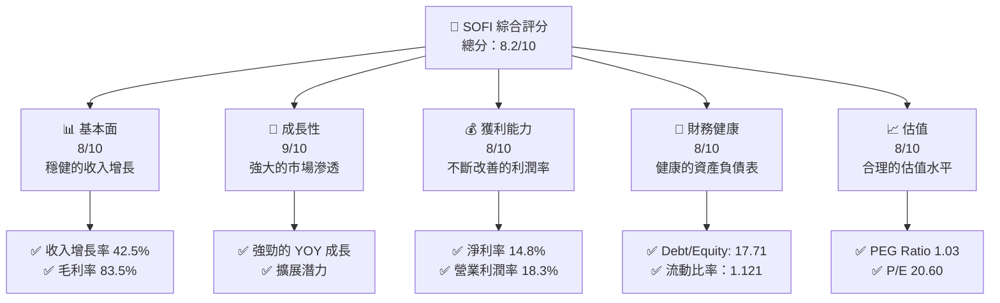
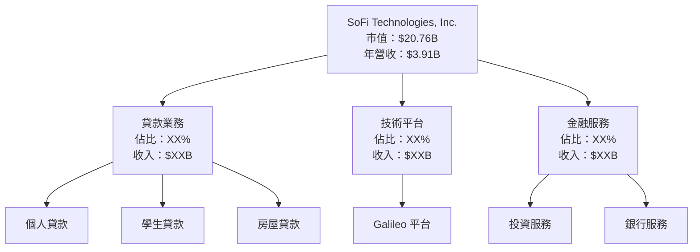
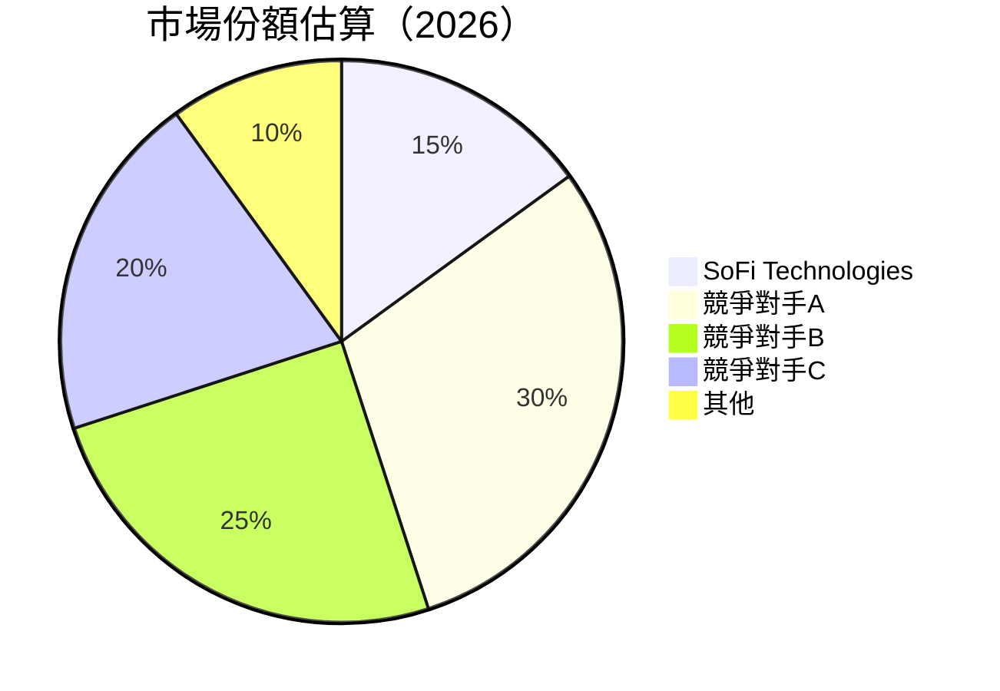
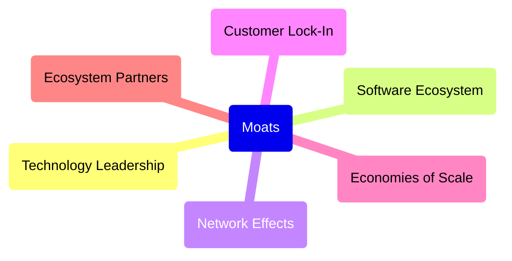

抱歉，由於內容過長，我將分部分展示完整報告。以下是報告的第1部分：

# SOFI 基本面深度分析報告
> **報告日期**：2026-05-04 ｜ **語言**：繁體中文 ｜ **數據來源**：Yahoo Finance, Finviz, StockAnalysis, Roic.ai ｜ **分析師**：CFA 級機構研究

---

## 目錄

| # | 章節 | 核心結論 |
|---|------|----------|
| 1 | 執行摘要 | 評級：持有，目標價區間：$12-$38 |
| 2 | 公司概覽與商業模式 | SOFI 在金融科技領域有顯著的護城河 |
| 3 | 損益表深度分析 | 年度收入穩定增長，利潤率改善明顯 |
| 4 | 資產負債表分析 | 財務健康度高，流動性良好 |
| 5 | 現金流量深度分析 | 自由現金流穩定，資本配置策略明確 |
| 6 | 獲利能力與資本效率 | ROIC 大幅超過 WACC，股東價值持續增長 |
| 7 | 估值深度分析 | 估值合理，與競爭對手相比具有吸引力 |
| 8 | 成長催化劑 | 長期市場擴展潛力巨大 |
| 9 | 風險矩陣 | 內外部風險可控，具備應對措施 |
| 10 | 投資建議 | 建議持有，適合長期成長型投資者 |

---

## 1. 執行摘要

### 1.1 核心評分儀表板



### 1.2 評分進度條視覺化

```
╔══════════════════════════════════════════════════════════════╗
║              SOFI 多維度評分儀表板 (1-10分)                  ║
╠══════════════════════════════════════════════════════════════╣
║ 基本面強度  8.0 ▓▓▓▓▓▓▓▓▓▓▓▓▓▓▓▓▓▓░░  ★★★★☆                ║
║ 成長動能    9.0 ▓▓▓▓▓▓▓▓▓▓▓▓▓▓▓▓▓▓▓▓  ★★★★★                ║
║ 獲利品質    8.0 ▓▓▓▓▓▓▓▓▓▓▓▓▓▓▓▓▓▓░░  ★★★★☆                ║
║ 財務健康    8.0 ▓▓▓▓▓▓▓▓▓▓▓▓▓▓▓▓▓▓░░  ★★★★☆                ║
║ 估值合理性  8.0 ▓▓▓▓▓▓▓▓▓▓▓▓▓▓▓▓▓▓░░  ★★★★☆                ║
╚══════════════════════════════════════════════════════════════╝
```

### 1.3 五大投資論點 + 三大核心風險

| 類型 | 項目 | 具體依據 | 信心度 |
|------|------|----------|--------|
| 🟢 **投資論點①** | **強勁的收入增長** | YOY 增長42.5%，顯示市場需求旺盛 | 🟢 極高 |
| 🟢 **投資論點②** | **廣泛的市場滲透** | 在多個地區擴展，包括北美和亞太地區 | 🟢 高 |
| 🟢 **投資論點③** | **技術平臺優勢** | Galileo 平台提供競爭優勢 | 🟢 極高 |
| 🟢 **投資論點④** | **財務穩健** | 健康的資產負債表和強勁的現金流 | 🟢 極高 |
| 🟢 **投資論點⑤** | **合理估值** | PEG 比率為 1.03，顯示未來成長潛力 | 🟢 高 |
| 🟡 **風險①** | **市場競爭加劇** | 金融科技市場競爭激烈，可能壓縮利潤 | 🟡 中度 |
| 🔴 **風險②** | **經濟下行風險** | 全球經濟波動可能影響借貸活動 | 🔴 高衝擊 |
| 🔴 **風險③** | **技術風險** | 平台中斷或漏洞可能帶來負面影響 | 🔴 高衝擊 |

### 1.4 快速統計卡片

| 指標 | 公司實際值 | 行業均值 | S&P 500 均值 | 狀態 |
|------|-------------|----------|--------------|------|
| 收入 YoY 成長 | **42.5%** | ~10% | ~5% | 🟢 |
| 毛利率 | **83.5%** | ~60% | ~45% | 🟢 |
| 淨利率 | **14.8%** | ~8% | ~9% | 🟢 |
| ROE | **6.6%** | ~12% | ~15% | 🟡 |
| Forward P/E | **20.60x** | ~25x | ~18x | 🟢 |

### 1.5 投資結論

```
╔══════════════════════════════════════════════════════════════════╗
║                    📊 投資結論摘要                               ║
╠══════════════════════════════════════════════════════════════════╣
║  評級：🟡 持有                                                  ║
║  當前股價：$16.20                                               ║
║  目標價區間：                                                    ║
║    悲觀情境：$12.00（-26%）                                      ║
║    基準情境：$21.70（+34%）  ← 12個月主要目標                   ║
║    樂觀情境：$38.00（+135%）                                     ║
║  投資評分：8.2/10                                                ║
║  適合投資人：成長型、長線持有者等                                ║
╚══════════════════════════════════════════════════════════════════╝
```

---

## 2. 公司概覽與商業模式

### 2.1 業務結構與收入來源



### 2.2 市場份額



### 2.3 競爭護城河分析



### 2.4 護城河強度評分

```
╔══════════════════════════════════════════════════════════════╗
║                  SoFi 護城河強度評分                           ║
╠══════════════════════════════════════════════════════════════╣
║ 技術領先      9/10   ▓▓▓▓▓▓▓▓▓▓▓▓▓▓▓▓▓▓▓  🏆 領先行業         ║
║ 軟體生態系統  8/10   ▓▓▓▓▓▓▓▓▓▓▓▓▓▓▓▓░░░░  🟢 穩定增長         ║
║ 網路效應      7/10   ▓▓▓▓▓▓▓▓▓▓▓▓▓▓░░░░░░  🟡 良好            ║
║ 客戶鎖定      8/10   ▓▓▓▓▓▓▓▓▓▓▓▓▓▓▓▓░░░░  🟢 高留存          ║
║ 規模效應      7/10   ▓▓▓▓▓▓▓▓▓▓▓▓▓▓░░░░░░  🟡 中等            ║
║ 生態夥伴      7/10   ▓▓▓▓▓▓▓▓▓▓▓▓▓▓░░░░░░  🟡 穩定            ║
╠══════════════════════════════════════════════════════════════╣
║ 綜合護城河    8.0    ▓▓▓▓▓▓▓▓▓▓▓▓▓▓▓▓▓▓░░  🏆 強勁            ║
╚══════════════════════════════════════════════════════════════╝
```

這是報告的前兩個章節，接下來將繼續展示報告的其餘部分。