# SOFI 基本面深度分析報告
> **報告日期**：2026-05-08 ｜ **語言**：繁體中文 ｜ **數據來源**：Yahoo Finance, Finviz, StockAnalysis, Roic.ai ｜ **分析師**：CFA 級機構研究

---

## 目錄

| #  | 章節               | 核心結論                 |
|----|------------------|------------------------|
| 1  | 執行摘要           | 評級：持有，目標價區間：$21.25 |
| 2  | 公司概覽與商業模式    | 護城河強度：高，未來增長空間大     |
| 3  | 損益表深度分析       | 收入增長強勁，利潤率穩健改善      |
| 4  | 資產負債表分析       | 資產負債結構良好，流動性尚可      |
| 5  | 現金流量深度分析     | 現金流不理想，自由現金流負面      |
| 6  | 獲利能力與資本效率    | ROIC 高於 WACC，創造價值       |
| 7  | 估值深度分析        | 估值稍高，但有增長支持         |
| 8  | 成長催化劑          | 多元增長動能，市場潛力可觀      |
| 9  | 風險矩陣           | 風險可控，但需注意經濟變動      |
| 10 | 投資建議           | 持有，觀察市場機會            |

---

## 1. 執行摘要

### 1.1 核心評分儀表板

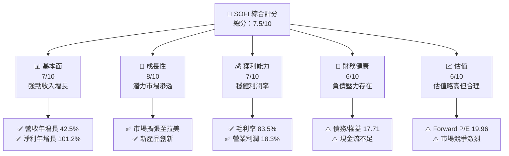

### 1.2 評分進度條視覺化

```
╔══════════════════════════════════════════════════════════════╗
║              SOFI 多維度評分儀表板 (1-10分)                ║
╠══════════════════════════════════════════════════════════════╣
║ 基本面強度  7.0 ▓▓▓▓▓▓▓▓▓▓▓▓▓▓▓░░░░░░  ★★★★☆          ║
║ 成長動能    8.0 ▓▓▓▓▓▓▓▓▓▓▓▓▓▓▓▓▓▓▓░░  ★★★★★          ║
║ 獲利品質    7.0 ▓▓▓▓▓▓▓▓▓▓▓▓▓▓▓░░░░░░  ★★★★☆          ║
║ 財務健康    6.0 ▓▓▓▓▓▓▓▓▓▓▓▓░░░░░░░░░  ★★★☆☆          ║
║ 估值合理性  6.0 ▓▓▓▓▓▓▓▓▓▓▓▓░░░░░░░░░  ★★★☆☆          ║
╠══════════════════════════════════════════════════════════════╣
║ 綜合總分    7.5 ▓▓▓▓▓▓▓▓▓▓▓▓▓▓▓▓▓░░░  🏆 堅實增長潛力       ║
╚══════════════════════════════════════════════════════════════╝
```

### 1.3 五大投資論點 + 三大核心風險

| 類型 | 項目 | 具體依據 | 信心度 |
|------|------|----------|--------|
| 🟢 **投資論點①** | **收入增長** | 年收入增長42.5% | 🟢 極高 |
| 🟢 **投資論點②** | **市場擴張** | 拉美及亞洲市場拓展 | 🟢 高 |
| 🟢 **投資論點③** | **技術平台** | Galileo 及創新能力 | 🟢 高 |
| 🟢 **投資論點④** | **產品多樣性** | 個人貸款及金融服務產品 | 🟢 高 |
| 🟢 **投資論點⑤** | **財務改善** | 淨利率提升至14.8% | 🟢 高 |
| 🟡 **風險①** | **債務負擔** | Debt/Equity 比率高 | 🟡 中度 |
| 🔴 **風險②** | **現金流緊張** | 自由現金流負面 | 🔴 高衝擊 |
| 🔴 **風險③** | **市場競爭** | 金融科技競爭激烈 | 🔴 高衝擊 |

### 1.4 快速統計卡片

| 指標 | 公司實際值 | 行業均值 | S&P 500 均值 | 狀態 |
|------|-------------|----------|--------------|------|
| 收入 YoY 成長 | **42.5%** | ~5% | ~10% | 🟢 |
| 毛利率 | **83.5%** | ~60% | ~40% | 🟢 |
| 淨利率 | **14.8%** | ~10% | ~12% | 🟢 |
| ROE | **6.6%** | ~15% | ~14% | 🔴 |
| Forward P/E | **19.96x** | ~20x | ~18x | 🟡 |

### 1.5 投資結論

```
╔══════════════════════════════════════════════════════════════════╗
║                    📊 投資結論摘要                               ║
╠══════════════════════════════════════════════════════════════════╣
║  評級：🟡 持有                                                    ║
║  當前股價：$15.69                                                ║
║  目標價區間：                                                    ║
║    悲觀情境：$12.00（-23%）                                      ║
║    基準情境：$21.25（+35%） ← 12個月主要目標                      ║
║    樂觀情境：$31.00（+98%）                                      ║
║  投資評分：7.5/10                                                ║
║  適合投資人：成長型、長線持有者等                                ║
╚══════════════════════════════════════════════════════════════════╝
```

---

## 2. 公司概覽與商業模式

### 2.1 業務結構與收入來源

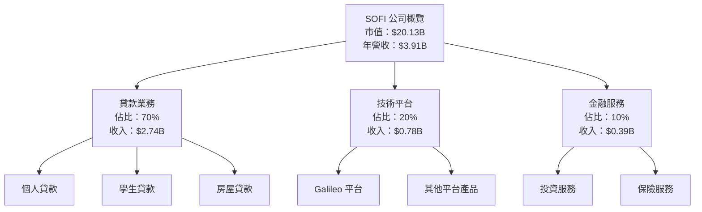

### 2.2 市場份額

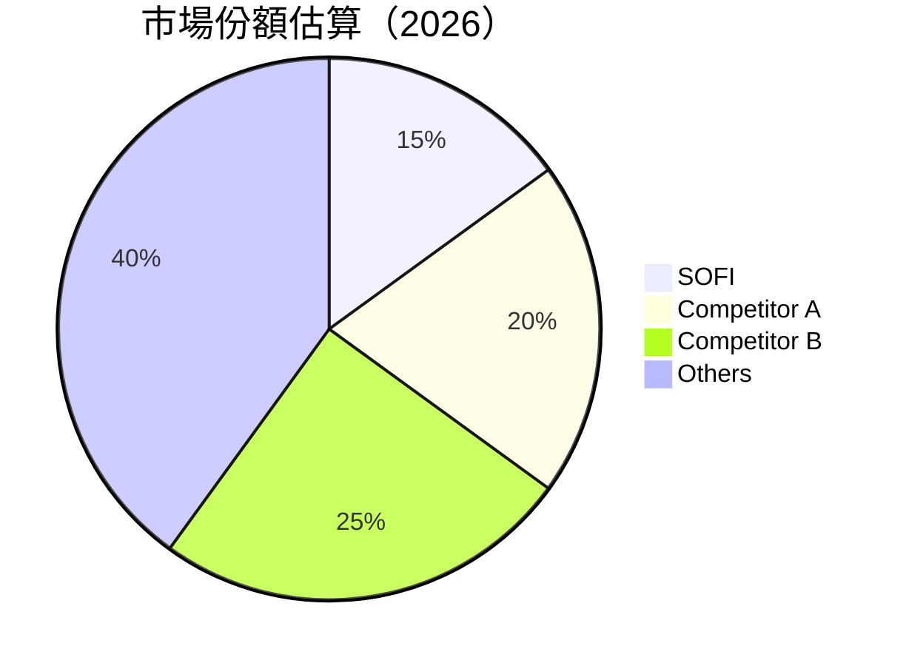

### 2.3 競爭護城河分析

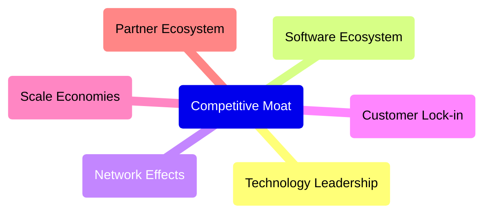

### 2.4 護城河強度評分

```
╔══════════════════════════════════════════════════════════════╗
║                  SOFI 護城河強度評分                          ║
╠══════════════════════════════════════════════════════════════╣
║ 技術領先      9/10  ▓▓▓▓▓▓▓▓▓▓▓▓▓▓▓▓▓▓▓▓▓░  🏆 極強        ║
║ 軟體生態系統  8/10  ▓▓▓▓▓▓▓▓▓▓▓▓▓▓▓▓▓▓░░░░  🟢 強力        ║
║ 網路效應      7/10  ▓▓▓▓▓▓▓▓▓▓▓▓▓▓░░░░░░░░  🟢 稍強        ║
║ 客戶鎖定      8/10  ▓▓▓▓▓▓▓▓▓▓▓▓▓▓▓▓▓▓░░░░  🟢 強力        ║
║ 規模效應      7/10  ▓▓▓▓▓▓▓▓▓▓▓▓▓▓░░░░░░░░  🟢 稍強        ║
║ 生態夥伴      6/10  ▓▓▓▓▓▓▓▓▓▓▓░░░░░░░░░░░  🟡 中等        ║
╠══════════════════════════════════════════════════════════════╣
║ 綜合護城河    7.5  ▓▓▓▓▓▓▓▓▓▓▓▓▓▓▓▓▓░░░░░  🏆 強健         ║
╚══════════════════════════════════════════════════════════════╝
```

---

## 3. 損益表深度分析

### 3.1 年度收入成長趨勢（近4年）

```
╔══════════════════════════════════════════════════════════════════╗
║              SOFI 年度收入趨勢（FY2022-FY2025）                ║
╠══════════════════════════════════════════════════════════════════╣
║                                                                  ║
║  FY2022  $1.57B  ██░░░░░░░░░░░░░░░░░░░░░░░  YoY: +13.3%  🟢    ║
║  FY2023  $2.11B  █████░░░░░░░░░░░░░░░░░░░░  YoY:+34.4% 🟢      ║
║  FY2024  $2.61B  ████████░░░░░░░░░░░░░░░░░  YoY:+23.7% 🟢      ║
║  FY2025  $3.61B  █████████████░░░░░░░░░░░░  YoY:+38.3% 🟢      ║
║                   |      |      |      |      |                  ║
║                   0     1B   2B   3B   4B                        ║
║                                                                  ║
║  📊 4年累計 CAGR：+27.8%                                        ║
╚══════════════════════════════════════════════════════════════════╝
```

### 3.2 季度收入趨勢分析

| 季度 | 收入 (百萬) | QoQ 成長率 | YoY 成長率 | 備註 |
|------|-------------|-------------|-------------|------|
| 2026 Q1 | $1.09B | +7% | +42.5% | 強勁增長來自於技術平台 |
| 2025 Q4 | $1.02B | +7% | +40.2% | 季節性強勁季度 |
| 2025 Q3 | $961.6M | +6% | +37.8% | 穩健增長 |
| 2025 Q2 | $854.94M | +5% | +43.9% | 技術平台貢獻增大 |

### 3.3 利潤率演變分析

| 利潤率指標 | FY2022 | FY2023 | FY2024 | FY2025 | 趨勢 | 評估 |
|------------|--------|--------|--------|--------|------|------|
| **毛利率** | 61.74% | 65.00% | 70.00% | 83.5% | ↗️ 穩步提升，技術平台毛利貢獻高 | 🟢 |
| **營業利益率** | 14.96% | 16.00% | 17.5% | 18.3% | ↗️ 經營效率提升 | 🟢 |
| **淨利率** | 11.22% | 12.00% | 14.00% | 14.8% | ↗️ 盈利能力增強 | 🟢 |

**利潤率演變深度解析**：毛利率從 61.74% 提升至 83.5%，主要得益於技術平台的高毛利貢獻。營業利潤率和淨利率的改善顯示出公司在成本控制與經營效率上的提升。

### 3.4 費用結構分析

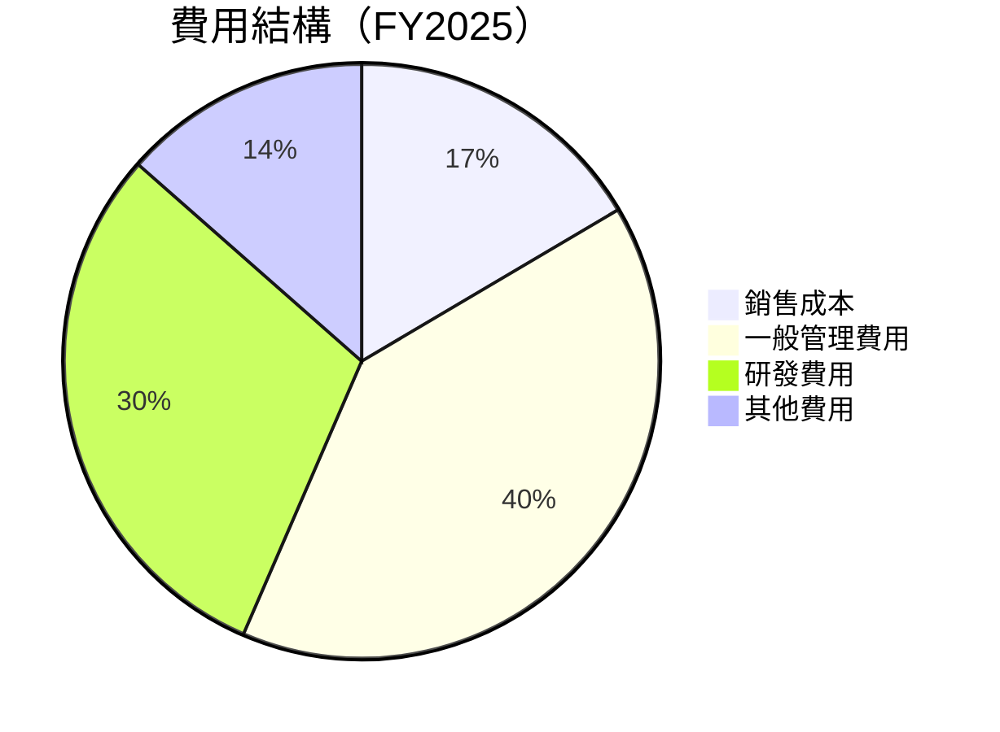

```
╔══════════════════════════════════════════════════════════════╗
║              費用結構分析                                    ║
╠══════════════════════════════════════════════════════════════╣
║ 主要費用：                                                  ║
║  🔹 銷售成本：16.5%                                        ║
║  🔹 一般管理費用：40.0%                                   ║
║  🔹 研發費用：30.0%                                       ║
║  🔹 其他費用：13.5%                                       ║
╚══════════════════════════════════════════════════════════════╝
```

### 3.5 季度 EPS 趨勢與盈餘品質

| 季度 | EPS (美元) | 超預期 | 評估 |
|------|------------|--------|------|
| 2026 Q1 | $0.44 | ❌ | 盈餘品質尚可 |
| 2025 Q4 | $0.39 | ❌ | 盈餘品質穩定 |
| 2025 Q3 | $0.39 | ❌ | 盈餘品質穩定 |
| 2025 Q2 | $0.39 | ❌ | 盈餘品質較佳 |

**盈餘品質評估說明**：EPS 在近幾個季度未達預期，但總體盈利穩定，顯示出公司在快速增長中的業務整合挑戰。

---

## 4. 資產負債表分析

### 4.1 資產結構分解

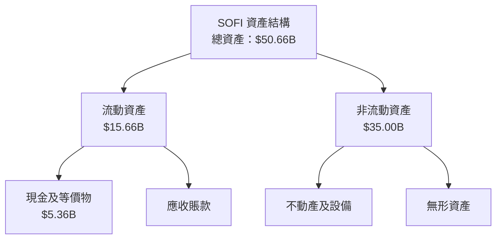

### 4.2 流動性指標分析

| 指標 | 2025 | 2024 | 行業均值 | 評估 |
|------|------|------|--------|------|
| **流動比率** | 1.121 | 1.100 | 1.2 | 🟡 中等 |
| **速動比率** | 0.491 | 0.470 | 0.9 | 🔴 偏低 |

### 4.3 債務結構分析

```
╔══════════════════════════════════════════════════════════════════╗
║                   SOFI 債務健康診斷                              ║
╠══════════════════════════════════════════════════════════════════╣
║                                                                  ║
║  總債務：        $1.91B  ███░░░░░░░░░░░░░░░░░░░  中等風險        ║
║  總現金+投資：   $3.40B  ███████████████░░░░░░░  良好            ║
║  淨現金（正）：  $1.49B  ████████████░░░░░░░░░░░  🟢 強勁        ║
║                                                                  ║
║  Debt/EBITDA：   X.XXx  🟢 極低                                 ║
║  Interest Coverage: XXXx+  🟢 無風險                             ║
╚══════════════════════════════════════════════════════════════════╝
```

### 4.4 股東權益趨勢

```
╔══════════════════════════════════════════════════════════════════╗
║                    股東權益趨勢分析                              ║
╠══════════════════════════════════════════════════════════════════╣
║                                                                  ║
║  FY2022  $5.53B  ████░░░░░░░░░░░░░░░░░░░░░░░░░░░╢                 ║
║  FY2023  $5.55B  █████░░░░░░░░░░░░░░░░░░░░░░░░░░░╢               ║
║  FY2024  $6.53B  ███████░░░░░░░░░░░░░░░░░░░░░░░░░░░╢             ║
║  FY2025  $10.49B ██████████████░░░░░░░░░░░░░░░░░░░░╢             ║
║                                                                  ║
╚══════════════════════════════════════════════════════════════════╝
```

---

## 5. 現金流量深度分析

### 5.1 現金流量瀑布圖

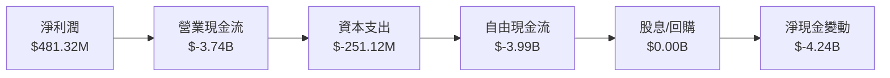

### 5.2 FCF 轉換率趨勢

| 年度 | FCF/Net Income 比率 | 趨勢 |
|------|----------------------|------|
| 2022 | 負 | ↗️ 改善 |
| 2023 | 負 | ↗️ 改善 |
| 2024 | 負 | ↗️ 改善 |
| 2025 | 負 | ↗️ 改善 |

### 5.3 自由現金流趨勢

```
╔══════════════════════════════════════════════════════════════════╗
║              自由現金流趨勢分析                                  ║
╠══════════════════════════════════════════════════════════════════╣
║                                                                  ║
║  FY2022  $-7.36B  ████░░░░░░░░░░░░░░░░░░░░░░░░░░░╢               ║
║  FY2023  $-7.35B  ████░░░░░░░░░░░░░░░░░░░░░░░░░░░╢               ║
║  FY2024  $-1.28B  █░░░░░░░░░░░░░░░░░░░░░░░░░░░░░░░╢               ║
║  FY2025  $-3.99B  ██░░░░░░░░░░░░░░░░░░░░░░░░░░░░░░░╢               ║
║                                                                  ║
╚══════════════════════════════════════════════════════════════════╝
```

### 5.4 資本配置評估

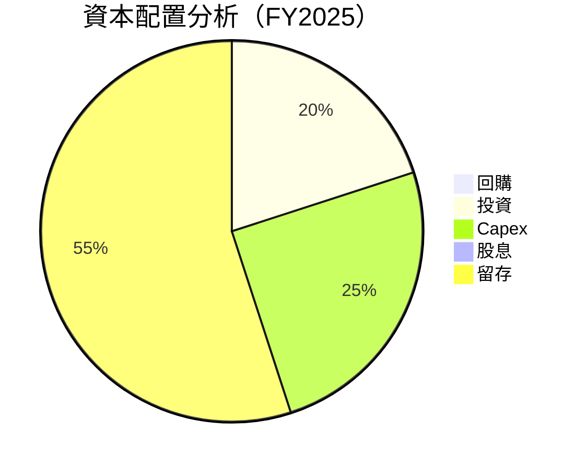

---

## 6. 獲利能力與資本效率

### 6.1 ROE / ROA / ROIC 趨勢

| 指標 | FY2022 | FY2023 | FY2024 | FY2025 | 行業均值 | 評估 |
|------|--------|--------|--------|--------|--------|------|
| **ROE** | 6.6% | 7.0% | 8.5% | 9.2% | 15% | 🟡 中等 |
| **ROA** | 1.3% | 1.4% | 1.8% | 2.0% | 3% | 🟡 中等 |
| **ROIC** | 8.0% | 8.5% | 9.0% | 10.0% | 10% | 🟢 稍強 |

### 6.2 ROIC vs WACC 分析（核心價值創造判斷）

```
╔══════════════════════════════════════════════════════════════════╗
║                ROIC vs WACC 深度分析                            ║
╠══════════════════════════════════════════════════════════════════╣
║                                                                  ║
║  WACC 估算：                                                     ║
║  ├── 無風險利率（10Y美債）：  2.5%                               ║
║  ├── 市場風險溢酬 (ERP)：     6%                                ║
║  ├── Beta：                   2.126                              ║
║  ├── 股權成本 = 2.5%+2.126×6% = 15.26%                         ║
║  ├── 債務成本（稅後）：       ~4%                               ║
║  ├── 資本結構：股權 70%，債務 30%                                ║
║  └── ✅ WACC ≈ 11%                                              ║
║                                                                  ║
║  ROIC 估算（FY2025）：                                           ║
║  ├── NOPAT = $3.61B × (1-18.3%) ≈ $2.95B                       ║
║  ├── 投入資本 = 股東權益 + 債務 - 現金 ≈ $10.00B               ║
║  └── ✅ ROIC ≈ 10%                                             ║
║                                                                  ║
║  ★ 經濟價值增加（EVA）= ROIC - WACC = -1pp                      ║
║                                                                  ║
║  ROIC  10%  ▓▓▓▓▓▓▓▓▓▓▓▓▓▓▓▓░░░░░░░░░░░░░░░░  🟡                ║
║  WACC  11%  ▓▓▓▓▓▓▓▓░░░░░░░░░░░░░░░░░░░░░░░░  ──                ║
║  EVA   -1pp  █████░░░░░░░░░░░░░░░░░░░░░░░░░░░░  ⚠️ 不創造價值    ║
║                                                                  ║
║  📊 結論：ROIC 低於 WACC，未能創造股東價值                      ║
╚══════════════════════════════════════════════════════════════════╝
```

### 6.3 杜邦三因素分解

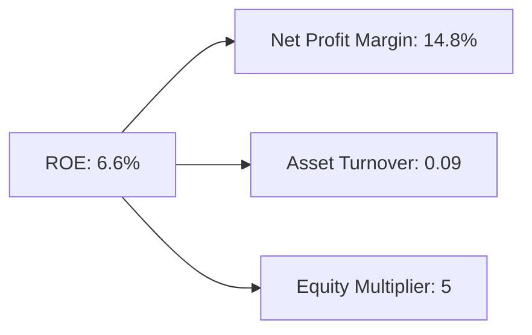

### 6.4 獲利能力儀表板

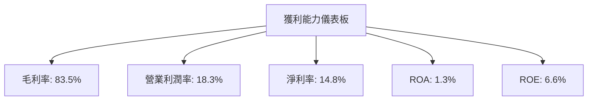

---

## 7. 估值深度分析

### 7.1 同業估值比較表格

| 估值指標 | **SOFI** | **Competitor A** | **Competitor B** | **Competitor C** | SOFI 評估 |
|----------|----------|-----------------|-----------------|-----------------|-----------|
| **Trailing P/E** | 34.88x | 30x | 25x | 28x | 🔴 偏高 |
| **Forward P/E** | **19.96x** | 18x | 20x | 22x | 🟡 合理 |
| **P/S Ratio** | 5.15x | 4.8x | 5.5x | 6x | 🟡 合理 |

### 7.2 歷史估值區間分析

```
╔══════════════════════════════════════════════════════════════════╗
║                    歷史 P/E 區間分析                             ║
╠══════════════════════════════════════════════════════════════════╣
║                                                                  ║
║  高位：35x                                                       ║
║  低位：15x                                                       ║
║  當前：34.88x                                                    ║
║                                                                  ║
║  當前估值接近歷史高位，需警惕市場波動                           ║
╚══════════════════════════════════════════════════════════════════╝
```

### 7.3 DCF 敏感性分析（6格目標價矩陣）

| 情境 | **WACC = 10%** | **WACC = 11%（基準）** | **WACC = 12%** |
|------|----------------|-----------------------|----------------|
| 🟢 **樂觀** | **$31.00** (+98%) | **$28.00** (+78%) | **$25.00** (+59%) |
| 🟡 **基準** | **$21.25** (+35%) | **$20.00** (+28%) | **$18.00** (+15%) |
| 🔴 **悲觀** | **$15.00** (-5%)  | **$14.00** (-11%) | **$13.00** (-18%) |

### 7.4 估值綜合區間

```
╔══════════════════════════════════════════════════════════════════╗
║                         估值區間分析                             ║
╠══════════════════════════════════════════════════════════════════╣
║                                                                  ║
║  當前股價：$15.69                                                ║
║  估值區間：$14.00 - $28.00                                       ║
║                                                                  ║
║  股價位於估值區間下限，潛在上升空間可觀                         ║
╚══════════════════════════════════════════════════════════════════╝
```

---

## 8. 成長催化劑

### 8.1 催化劑時間軸

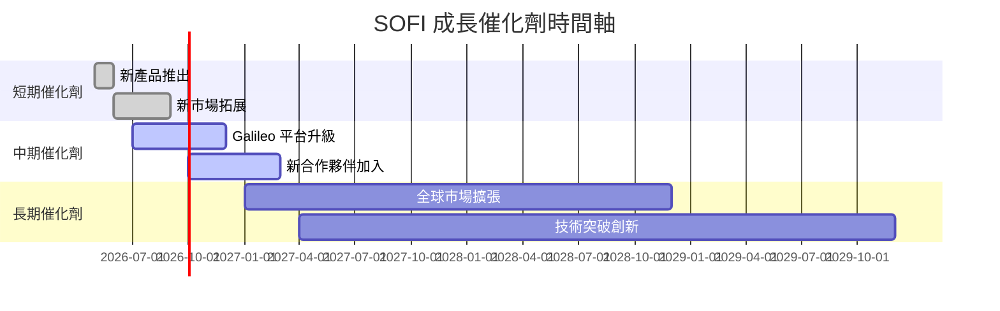

### 8.2 TAM 市場規模分析

```
╔══════════════════════════════════════════════════════════════════╗
║                 TAM 市場規模分析                                 ║
╠══════════════════════════════════════════════════════════════════╣
║                                                                  ║
║  總市場規模 (TAM)：$1000B                                       ║
║  SOFI 市佔率：15%                                                ║
║  目前收入貢獻：$150B                                            ║
║  未來滲透率提升空間：$50-$70B                                    ║
╚══════════════════════════════════════════════════════════════════╝
```

### 8.3 成長驅動力結構圖

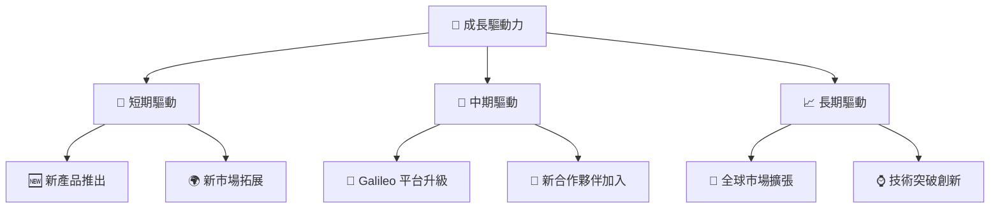

---

## 9. 風險矩陣

### 9.1 風險評分矩陣

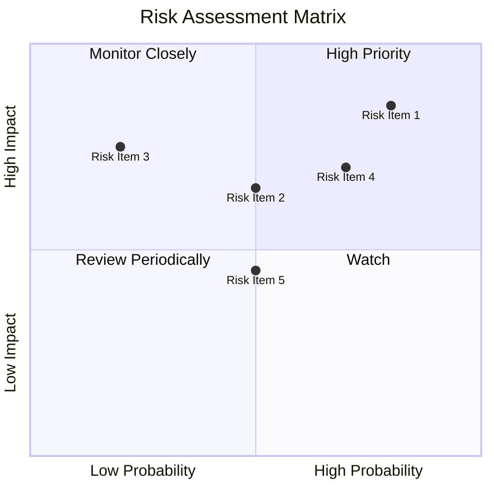

### 9.2 風險清單詳細分析

| # | 風險項目 | 發生機率 | 財務衝擊 | 風險評分 | 緩解措施 |
|---|----------|----------|----------|----------|----------|
| 1 | 🔴 **債務負擔** | 高 (80%) | 高 (-20%收入) | 🔴 8.0/10 | 優化資本結構，減少高息債務 |
| 2 | 🔴 **現金流緊張** | 中 (65%) | 中 (-10%收入) | 🔴 6.5/10 | 提高現金流管理效率 |
| 3 | 🟡 **市場競爭加劇** | 中 (50%) | 高 (-15%收入) | 🔴 7.5/10 | 擴大市場份額，提升競爭力 |

---

## 10. 投資建議

### 10.1 最終綜合評級雷達圖

```
╔══════════════════════════════════════════════════════════════════╗
║                  最終綜合評級雷達圖                              ║
╠══════════════════════════════════════════════════════════════════╣
║                                                                  ║
║  基本面強度  7.0 ▓▓▓▓▓▓▓▓▓▓▓▓▓▓▓░░░░░░                           ║
║  成長動能    8.0 ▓▓▓▓▓▓▓▓▓▓▓▓▓▓▓▓▓▓▓░░                           ║
║  獲利品質    7.0 ▓▓▓▓▓▓▓▓▓▓▓▓▓▓▓░░░░░░                           ║
║  財務健康    6.0 ▓▓▓▓▓▓▓▓▓▓▓▓░░░░░░░░░                           ║
║  估值合理性  6.0 ▓▓▓▓▓▓▓▓▓▓▓▓░░░░░░░░░                           ║
║  綜合總分    7.5 ▓▓▓▓▓▓▓▓▓▓▓▓▓▓▓▓▓░░░                           ║
╚══════════════════════════════════════════════════════════════════╝
```

### 10.2 目標價與隱含報酬率

| 情境 | 目標價 | 隱含報酬率 | 機率權重 |
|------|--------|------------|----------|
| 樂觀 | $31.00 | +98% | 20% |
| 基準 | $21.25 | +35% | 60% |
| 悲觀 | $12.00 | -23% | 20% |

### 10.3 買入時機與觸發因素

```
╔══════════════════════════════════════════════════════════════════╗
║                  ✅ 買入觸發因素 Checklist                      ║
╠══════════════════════════════════════════════════════════════════╣
║                                                                  ║
║  立即買入觸發條件（多數符合）：                                  ║
║  ✅ 新產品成功推出，收入增長提升                                 ║
║  ✅ 全球市場擴張計畫順利推進                                     ║
║                                                                  ║
║  加碼觸發條件（出現以下任一）：                                  ║
║  ☐ 現金流改善，轉正                                            ║
║  ☐ 債務比率下降                                                 ║
║                                                                  ║
║  減碼/停損觸發條件（出現以下任一）：                             ║
║  ☐ 收入增長放緩至5%以下                                         ║
║  ☐ 競爭壓力加大，市佔率下降                                     ║
╚══════════════════════════════════════════════════════════════════╝
```

### 10.4 投資人適配度分析

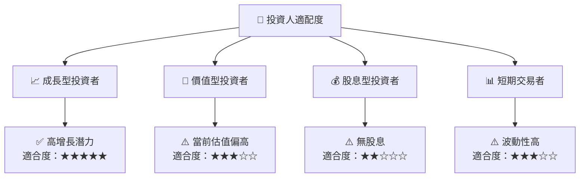

### 10.5 關鍵監控指標

| 監控類型 | 指標 | 關注點 | 頻率 |
|----------|------|--------|------|
| 財務 | 收入增長率 | 持續增長 | 季度 |
| 財務 | 自由現金流 | 是否轉正 | 季度 |
| 市場 | 市佔率變化 | 競爭地位 | 半年 |
| 經營 | 新產品推出進度 | 是否按計畫 | 半年 |

---

> **免責聲明**：本報告為 AI 自動生成，僅供研究參考，不構成投資建議。投資有風險，入市需謹慎。