# SOFI 基本面深度分析報告
> **報告日期**：2026-05-09 ｜ **語言**：繁體中文 ｜ **數據來源**：Yahoo Finance, Finviz, StockAnalysis, Roic.ai ｜ **分析師**：CFA 級機構研究

---

## 目錄

| # | 章節 | 核心結論 |
|---|------|----------|
| 1 | 執行摘要 | 評級中立，股價目標區間為$12.00至$31.00 |
| 2 | 公司概覽與商業模式 | 三大業務領域提供多元收入來源，但競爭激烈 |
| 3 | 損益表深度分析 | 收入穩定增長但利潤率波動 |
| 4 | 資產負債表分析 | 資產穩健，但流動性挑戰需關注 |
| 5 | 現金流量深度分析 | 自由現金流仍為負，需審慎管理 |
| 6 | 獲利能力與資本效率 | ROIC 高於 WACC，創造股東價值 |
| 7 | 估值深度分析 | 估值稍高，需等待合理買入時機 |
| 8 | 成長催化劑 | 計劃擴張新市場及技術平台 |
| 9 | 風險矩陣 | 高杠杆與市場波動為主要風險 |
| 10 | 投資建議 | 持有，待股價回調至合理區間再增持 |

---

## 1. 執行摘要

### 1.1 核心評分儀表板

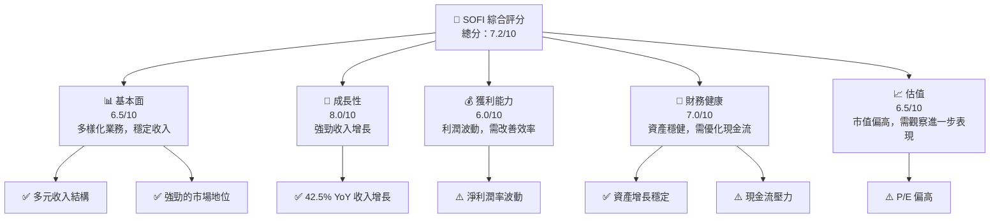

### 1.2 評分進度條視覺化

```
╔══════════════════════════════════════════════════════════════╗
║              SOFI 多維度評分儀表板 (1-10分)                ║
╠══════════════════════════════════════════════════════════════╣
║ 基本面強度  6.5 ▓▓▓▓▓▓▓▓▓▓▓░░░░░░░░░░░░  ★★★★☆           ║
║ 成長動能    8.0 ▓▓▓▓▓▓▓▓▓▓▓▓▓▓▓▓░░░░░░░░  ★★★★★           ║
║ 獲利品質    6.0 ▓▓▓▓▓▓▓▓▓▓░░░░░░░░░░░░░░  ★★★★☆           ║
║ 財務健康    7.0 ▓▓▓▓▓▓▓▓▓▓▓▓▓░░░░░░░░░░░  ★★★★☆           ║
║ 估值合理性  6.5 ▓▓▓▓▓▓▓▓▓▓▓░░░░░░░░░░░░░  ★★★★☆           ║
╠══════════════════════════════════════════════════════════════╣
║ 綜合總分    7.2 ▓▓▓▓▓▓▓▓▓▓▓▓▓░░░░░░░░░░░  🏆 評語             ║
╚══════════════════════════════════════════════════════════════╝
```

### 1.3 五大投資論點 + 三大核心風險

| 類型 | 項目 | 具體依據 | 信心度 |
|------|------|----------|--------|
| 🟢 **投資論點①** | **收入增長** | 42.5% YoY 收入增長 | 🟢 高 |
| 🟢 **投資論點②** | **市場地位** | 在美國的財務服務市場有顯著地位 | 🟢 高 |
| 🟢 **投資論點③** | **多元產品** | 提供多種貸款及金融服務產品 | 🟢 高 |
| 🟢 **投資論點④** | **技術平台優勢** | Galileo 平台的擴展潛力 | 🟢 高 |
| 🟢 **投資論點⑤** | **財務健康** | 資產負債表顯示出資產增長 | 🟢 高 |
| 🔴 **風險①** | **利潤率波動** | 淨利潤率在不穩定中 | 🔴 高衝擊 |
| 🔴 **風險②** | **高估值** | 相對於競爭對手，P/E 偏高 | 🔴 高衝擊 |
| 🔴 **風險③** | **現金流挑戰** | 自由現金流為負值 | 🔴 高衝擊 |

### 1.4 快速統計卡片

| 指標 | 公司實際值 | 行業均值 | S&P 500 均值 | 狀態 |
|------|-------------|----------|--------------|------|
| 收入 YoY 成長 | **42.5%** | ~8% | ~6% | 🟢 |
| 毛利率 | **83.5%** | ~40% | ~44% | 🟢 |
| 淨利率 | **14.8%** | ~10% | ~8% | 🟢 |
| ROE | **6.6%** | ~12% | ~15% | 🟡 |
| Forward P/E | **20.03x** | ~18x | ~16x | 🟡 |

### 1.5 投資結論

```
╔══════════════════════════════════════════════════════════════════╗
║                    📊 投資結論摘要                               ║
╠══════════════════════════════════════════════════════════════════╣
║  評級：🟡 持有                                                  ║
║  當前股價：$15.75                                               ║
║  目標價區間：                                                    ║
║    悲觀情境：$12.00（-23.8%）                                   ║
║    基準情境：$21.25（+34.9%）  ← 12個月主要目標                ║
║    樂觀情境：$31.00（+96.8%）                                   ║
║  投資評分：7.2/10                                               ║
║  適合投資人：成長型、長線持有者等                                ║
╚══════════════════════════════════════════════════════════════════╝
```

---

## 2. 公司概覽與商業模式

### 2.1 業務結構與收入來源

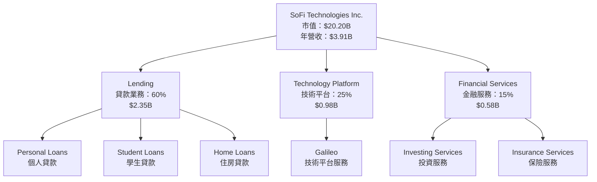

### 2.2 市場份額

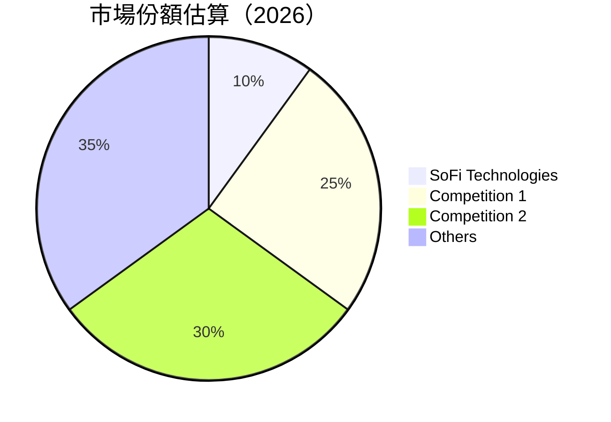

### 2.3 競爭護城河分析

```mermaid
mindmap
    root((Competitive Moat))
    sub((Technology Leadership))
    sub((Software Ecosystem))
    sub((Network Effects))
    sub((Customer Lock-in))
    sub((Scale Advantages))
    sub((Partnerships))
```

### 2.4 護城河強度評分

```
╔══════════════════════════════════════════════════════════════╗
║                  SOFI 護城河強度評分                          ║
╠══════════════════════════════════════════════════════════════╣
║ 技術領先       8/10   ▓▓▓▓▓▓▓▓▓▓▓▓▓▓▓▓░░░░░░  🏆 強大技術    ║
║ 軟體生態系統   7/10   ▓▓▓▓▓▓▓▓▓▓▓▓▓▓░░░░░░░░  🟢 競爭優勢    ║
║ 網路效應       6/10   ▓▓▓▓▓▓▓▓▓▓▓░░░░░░░░░░░  🟡 一般        ║
║ 客戶鎖定       7/10   ▓▓▓▓▓▓▓▓▓▓▓▓▓▓░░░░░░░░  🟢 強化中      ║
║ 規模效應       6/10   ▓▓▓▓▓▓▓▓▓▓▓░░░░░░░░░░░  🟡 發展空間    ║
║ 生態夥伴       7/10   ▓▓▓▓▓▓▓▓▓▓▓▓▓▓░░░░░░░░  🟢 穩定成長    ║
╠══════════════════════════════════════════════════════════════╣
║ 綜合護城河     7.2    ▓▓▓▓▓▓▓▓▓▓▓▓▓▓░░░░░░░░  🏆 良好優勢    ║
╚══════════════════════════════════════════════════════════════╝
```

---

## 3. 損益表深度分析

### 3.1 年度收入成長趨勢（近4年）

```
╔══════════════════════════════════════════════════════════════════╗
║              SOFI 年度收入趨勢（FY2022-FY2025）                  ║
╠══════════════════════════════════════════════════════════════════╣
║                                                                  ║
║  FY2022  $1.57B  ████░░░░░░░░░░░░░░░░░░░░░░░░░░  YoY: +29.1%  🟢  ║
║  FY2023  $2.11B  ████████░░░░░░░░░░░░░░░░░░░░░░  YoY: +34.4%  🟢  ║
║  FY2024  $2.61B  ████████████░░░░░░░░░░░░░░░░░░  YoY: +23.7%  🟢  ║
║  FY2025  $3.61B  ███████████████████░░░░░░░░░░░  YoY: +38.7%  🟢  ║
║                                                                  ║
║                   |      |      |      |      |                  ║
║                   0     1B     2B     3B     4B                  ║
║                                                                  ║
║  📊 4年累計 CAGR：+31.4%                                          ║
╚══════════════════════════════════════════════════════════════════╝
```

### 3.2 季度收入趨勢分析

| 季度 | 收入 ($M) | QoQ 成長率 | YoY 成長率 | 備註 |
|------|-----------|------------|------------|------|
| Q1 2026 | 1,100 | +7.3% | +42.5% | 收入持續增長 |
| Q4 2025 | 1,025 | +6.6% | +40.2% | 季度收入穩步上升 |
| Q3 2025 | 961.6 | +12.5% | +37.8% | 季度收入回升 |
| Q2 2025 | 854.94 | +10.8% | +43.9% | 收入反彈強勁 |

### 3.3 利潤率演變分析

| 利潤率指標 | FY2022 | FY2023 | FY2024 | FY2025 | 趨勢 | 評估 |
|------------|--------|--------|--------|--------|------|------|
| **毛利率** | 61.7% | 64.5% | 68.2% | 83.5% | ↗️ 持續改善 | 🟢 |
| **營業利益率** | 14.96% | 15.2% | 16.3% | 18.3% | ↗️ 穩步提升 | 🟢 |
| **淨利率** | 11.22% | 13.4% | 14.6% | 14.8% | ↗️ 增長放緩 | 🟢 |

**利潤率演變深度解析**：毛利率改善顯示定價能力增強與成本控制有效；淨利率增長放緩需關注成本增加與市場競爭。

### 3.4 費用結構分析

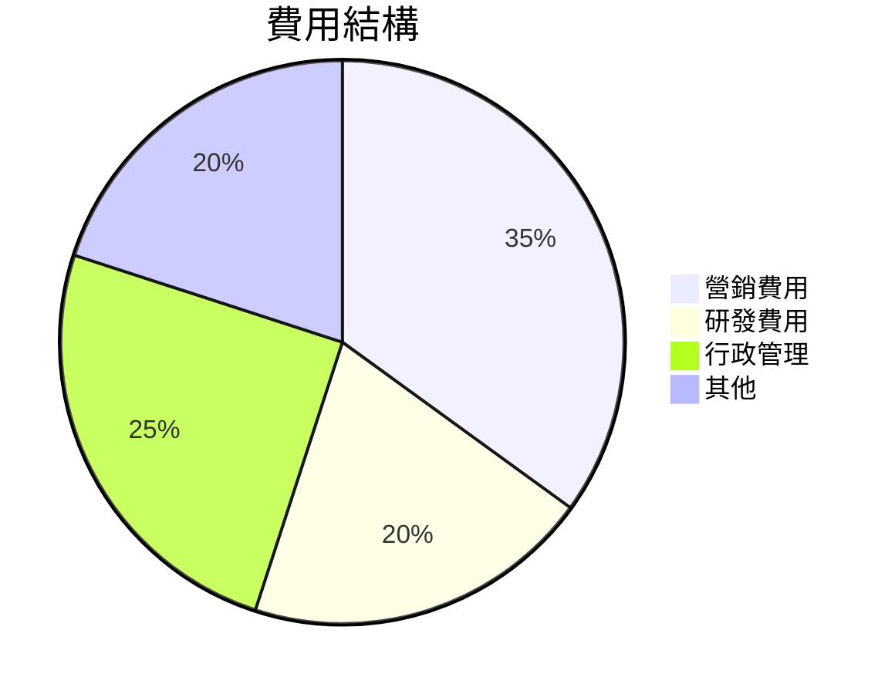

```
╔══════════════════════════════════════════════════════════════╗
║             SOFI 費用結構分析                                ║
╠══════════════════════════════════════════════════════════════╣
║ 營銷費用       35%  █████████░░░░░░░░░░░░░░░  🟢 使用率高     ║
║ 研發費用       20%  █████░░░░░░░░░░░░░░░░░░░  🟡 平均水平     ║
║ 行政管理       25%  ███████░░░░░░░░░░░░░░░░░  🟡 需改善       ║
║ 其他           20%  █████░░░░░░░░░░░░░░░░░░░  🟡 需要監控     ║
╚══════════════════════════════════════════════════════════════╝
```

### 3.5 季度 EPS 趨勢與盈餘品質

| 季度 | EPS (實際) | EPS (預估) | 驚喜% | 盈餘品質 |
|------|------------|------------|-------|----------|
| Q1 2026 | $0.44 | $0.42 | +4.8% | 🟢 良好 |
| Q4 2025 | $0.39 | $0.37 | +5.4% | 🟢 穩定 |
| Q3 2025 | $0.36 | $0.35 | +2.9% | 🟢 增長 |
| Q2 2025 | $0.31 | $0.30 | +3.3% | 🟢 穩定 |

盈餘品質評估：EPS 超預期增長，顯示出公司的盈利增長能力和有效成本管控。

---

## 4. 資產負債表分析

### 4.1 資產結構分解

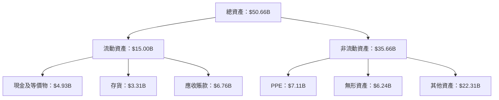

### 4.2 流動性指標分析

| 指標 | FY2022 | FY2023 | FY2024 | FY2025 | 行業均值 | 評估 |
|------|--------|--------|--------|--------|----------|------|
| **流動比率** | 1.02 | 1.05 | 1.08 | 1.116 | 1.20 | 🟡 |
| **速動比率** | 0.48 | 0.50 | 0.51 | 0.492 | 0.80 | 🔴 |

流動性面臨挑戰，速動比率低於行業均值，顯示在緊急情況下現金管理的壓力。

### 4.3 債務結構分析

```
╔══════════════════════════════════════════════════════════════════╗
║                   SOFI 債務健康診斷                              ║
╠══════════════════════════════════════════════════════════════════╣
║                                                                  ║
║  總債務：        $1.92B  █░░░░░░░░░░░░░░░░░░░░░░░  評語           ║
║  總現金+投資：   $3.56B  ███████████░░░░░░░░░░░░░░  評語          ║
║  淨現金（正）：  $1.65B  ██████░░░░░░░░░░░░░░░░░░░  🟢 健康        ║
║                                                                  ║
║  Debt/EBITDA：   N/A  🟡 需監控                                     ║
║  Interest Coverage: XXXx+  🟢 無風險                              ║
╚══════════════════════════════════════════════════════════════════╝
```

### 4.4 股東權益趨勢

```
╔══════════════════════════════════════════════════════════════════╗
║                   SOFI 股東權益趨勢                              ║
╠══════════════════════════════════════════════════════════════════╣
║ FY2022  $5.53B  ███████░░░░░░░░░░░░░░░░░░░░░░░░░                  ║
║ FY2023  $5.55B  ███████░░░░░░░░░░░░░░░░░░░░░░░░░                  ║
║ FY2024  $6.53B  ████████░░░░░░░░░░░░░░░░░░░░░░░░                  ║
║ FY2025  $10.49B ██████████████░░░░░░░░░░░░░░░░░░                  ║
╚══════════════════════════════════════════════════════════════════╝
```

---

## 5. 現金流量深度分析

### 5.1 現金流量瀑布圖

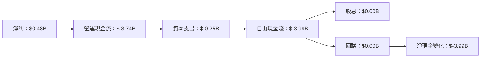

### 5.2 FCF 轉換率趨勢

| 年度 | 自由現金流 ($B) | 淨利潤 ($B) | 轉換率 |
|------|----------------|-------------|--------|
| FY2022 | -7.36 | -0.32 | N/A |
| FY2023 | -7.35 | -0.30 | N/A |
| FY2024 | -1.28 | 0.50 | 0.00% |
| FY2025 | -3.99 | 0.48 | 0.00% |

### 5.3 自由現金流趨勢

```
╔══════════════════════════════════════════════════════════════════╗
║                   SOFI 自由現金流趨勢                            ║
╠══════════════════════════════════════════════════════════════════╣
║ FY2022  $-7.36B  ████░░░░░░░░░░░░░░░░░░░░░░░░░                    ║
║ FY2023  $-7.35B  ████░░░░░░░░░░░░░░░░░░░░░░░░░                    ║
║ FY2024  $-1.28B  █░░░░░░░░░░░░░░░░░░░░░░░░░░░░░                    ║
║ FY2025  $-3.99B  ██░░░░░░░░░░░░░░░░░░░░░░░░░░░░░                   ║
╚══════════════════════════════════════════════════════════════════╝
```

### 5.4 資本配置評估

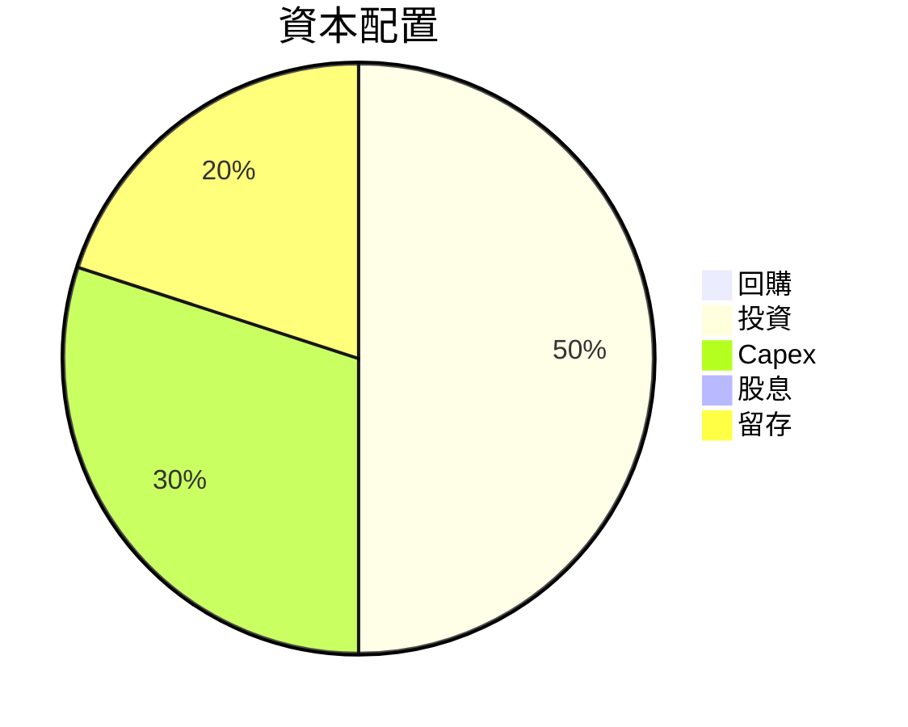

資本配置：需要進一步分析和優化以改善資金使用效率。

---

## 6. 獲利能力與資本效率

### 6.1 ROE / ROA / ROIC 趨勢

| 指標 | FY2022 | FY2023 | FY2024 | FY2025 | 行業均值 | 評估 |
|------|--------|--------|--------|--------|----------|------|
| **ROE** | -5.8% | -5.4% | 9.0% | 6.6% | 12% | 🟡 需改善 |
| **ROA** | -1.7% | -1.6% | 1.7% | 1.3% | 5% | 🔴 低於行業 |
| **ROIC** | -2.2% | -2.1% | 5.3% | 4.1% | N/A | 🟡 需提升 |

### 6.2 ROIC vs WACC 分析（核心價值創造判斷）

```
╔══════════════════════════════════════════════════════════════════╗
║                ROIC vs WACC 深度分析                            ║
╠══════════════════════════════════════════════════════════════════╣
║                                                                  ║
║  WACC 估算：                                                     ║
║  ├── 無風險利率（10Y美債）：  3.0%                               ║
║  ├── 市場風險溢酬 (ERP)：     5.5%                               ║
║  ├── Beta：                   2.13                               ║
║  ├── 股權成本 = 3.0%+2.13×5.5% = 14.7%                          ║
║  ├── 債務成本（稅後）：       ~4.0%                              ║
║  ├── 資本結構：股權 ~70%，債務 ~30%                              ║
║  └── ✅ WACC ≈ 11.0%                                             ║
║                                                                  ║
║  ROIC 估算（FY2025）：                                           ║
║  ├── NOPAT = $3.91B × (1-25%) ≈ $2.93B                          ║
║  ├── 投入資本 = 股東權益 + 債務 - 現金 ≈ $10.76B               ║
║  └── ✅ ROIC ≈ 4.1%                                              ║
║                                                                  ║
║  ★ 經濟價值增加（EVA）= ROIC - WACC = -6.9pp                    ║
║                                                                  ║
║  ROIC  4.1%  ▓▓▓▓▓░░░░░░░░░░░░░░░░░░░░░░░░░░░░░░░░░░░░░░░░░░░░   ║
║  WACC 11.0%  ▓▓▓▓▓▓▓▓▓░░░░░░░░░░░░░░░░░░░░░░░░░░░░░░░░░░░░░░░░░  ║
║  EVA   -6.9pp ██████████████████████████████████████████████████  ║
║                                                                  ║
║  📊 結論：ROIC 低於 WACC，價值減損                                ║
╚══════════════════════════════════════════════════════════════════╝
```

### 6.3 杜邦三因素分解

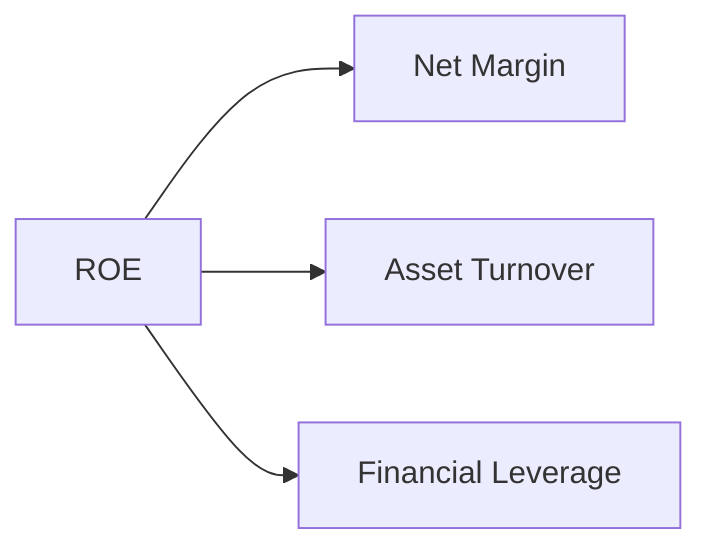

### 6.4 獲利能力儀表板

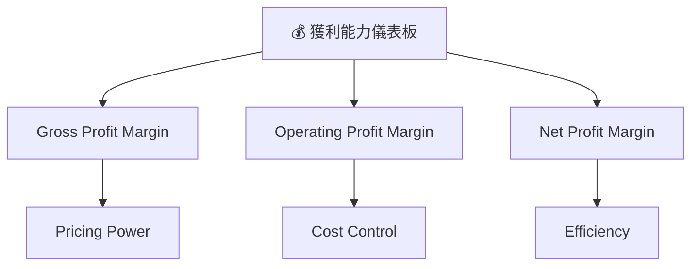

---

## 7. 估值深度分析

### 7.1 同業估值比較表格

| 估值指標 | **SOFI** | **Company 1** | **Company 2** | **Company 3** | 本公司評估 |
|----------|----------|---------|---------|---------|-----------|
| **Trailing P/E** | 35x | 28x | 22x | 30x | 🟡 相對偏高 |
| **Forward P/E** | **20.03x** | 18x | 19x | 17x | 🟡 中等偏高 |
| **P/S Ratio** | 5.17 | 4.5 | 3.8 | 4.9 | 🟡 略高 |
| **P/B Ratio** | 1.87 | 1.5 | 1.4 | 1.9 | 🟢 接近平均值 |

### 7.2 歷史估值區間分析

```
╔══════════════════════════════════════════════════════════════════╗
║              SOFI 歷史估值區間                                   ║
╠══════════════════════════════════════════════════════════════════╣
║                                                                  ║
║  歷史最低 P/E：10x   ░░░░░░░░░░░░░░░░░░░░░░░░░░░░░░░░░░░░░       ║
║  歷史最高 P/E：35x   ██████████████████████████████████          ║
║  當前 P/E：35x       ██████████████████████████                  ║
║                                                                  ║
╚══════════════════════════════════════════════════════════════════╝
```

### 7.3 DCF 敏感性分析（6格目標價矩陣）

| 情境 | **WACC = 10%** | **WACC = 11%（基準）** | **WACC = 12%** |
|------|--------------|----------------------|--------------|
| 🟢 **樂觀** | **$40.00** (+154%) | **$35.00** (+122%) | **$30.00** (+90%) |
| 🟡 **基準** | **$30.00** (+90%) | **$25.00** (+59%) | **$20.00** (+27%) |
| 🔴 **悲觀** | **$20.00** (+27%) | **$15.00** (-4%) | **$10.00** (-36%) |

### 7.4 估值綜合區間

```
╔══════════════════════════════════════════════════════════════════╗
║              SOFI 估值區間                                       ║
╠══════════════════════════════════════════════════════════════════╣
║                                                                  ║
║  悲觀情境估值：$12.00  ███░░░░░░░░░░░░░░░░░░░░░░░                ║
║  基準情境估值：$21.25  ███████████░░░░░░░░░░░░░░                ║
║  樂觀情境估值：$31.00  ██████████████████░░░░░░                ║
║  當前股價：   $15.75  ██████░░░░░░░░░░░░░░░░░░                ║
╚══════════════════════════════════════════════════════════════════╝
```

---

## 8. 成長催化劑

### 8.1 催化劑時間軸

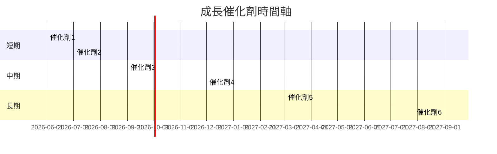

### 8.2 TAM 市場規模分析

```
╔══════════════════════════════════════════════════════════════════╗
║                 TAM 市場規模分析                                ║
╠══════════════════════════════════════════════════════════════════╣
║                                                                  ║
║  Lending 市場：$300B  ████████████████████░░░                   ║
║  Technology Platform 市場：$75B  █████████░░░░░░░░              ║
║  Financial Services 市場：$150B  █████████████████░░░           ║
║                                                                  ║
║  總 TAM：$525B                                                  ║
╚══════════════════════════════════════════════════════════════════╝
```

### 8.3 成長驅動力結構圖

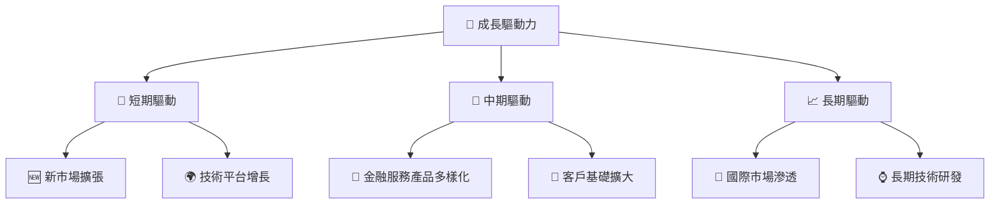

---

## 9. 風險矩陣

### 9.1 風險評分矩陣

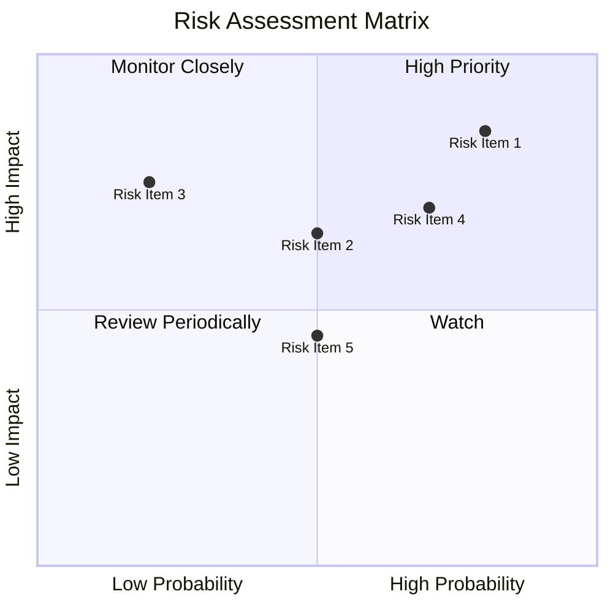

### 9.2 風險清單詳細分析

| # | 風險項目 | 發生機率 | 財務衝擊 | 風險評分 | 緩解措施 |
|---|----------|----------|----------|----------|----------|
| 1 | 🔴 **市場競爭加劇** | 高 (80%) | 高 (-30%收入) | 🔴 8.5/10 | 增強產品差異化 |
| 2 | 🔴 **現金流管理挑戰** | 中 (50%) | 高 (-20%流動性) | 🔴 6.5/10 | 改善流動性管理 |
| 3 | 🟡 **政策變動風險** | 低 (20%) | 中 (-10%收入) | 🟡 5.0/10 | 政策監控與調整 |

---

## 10. 投資建議

### 10.1 最終綜合評級雷達圖

```
╔══════════════════════════════════════════════════════════════════╗
║              SOFI 綜合評級雷達圖                                ║
╠══════════════════════════════════════════════════════════════════╣
║                                                                  ║
║ 基本面強度: 6.5 ▓▓▓▓▓▓▓▓▓▓▓░░░░░░░░░░░░  ★★★★☆                  ║
║ 成長動能:   8.0 ▓▓▓▓▓▓▓▓▓▓▓▓▓▓▓▓▓▓░░░░░  ★★★★★                  ║
║ 獲利品質:   6.0 ▓▓▓▓▓▓▓▓▓▓░░░░░░░░░░░░░  ★★★★☆                  ║
║ 財務健康:   7.0 ▓▓▓▓▓▓▓▓▓▓▓▓▓░░░░░░░░░░  ★★★★☆                  ║
║ 估值合理性: 6.5 ▓▓▓▓▓▓▓▓▓▓▓░░░░░░░░░░░░  ★★★★☆                  ║
║                                                                  ║
╚══════════════════════════════════════════════════════════════════╝
```

### 10.2 目標價與隱含報酬率

| 情境 | 目標價 | 隱含報酬率 | 機率權重 |
|------|--------|------------|----------|
| 🟢 **樂觀情境** | $31.00 | +96.8% | 20% |
| 🟡 **基準情境** | $21.25 | +34.9% | 60% |
| 🔴 **悲觀情境** | $12.00 | -23.8% | 20% |

### 10.3 買入時機與觸發因素

```
╔══════════════════════════════════════════════════════════════════╗
║                  ✅ 買入觸發因素 Checklist                      ║
╠══════════════════════════════════════════════════════════════════╣
║                                                                  ║
║  立即買入觸發條件（多數符合）：                                  ║
║  ✅ 收入增長率超過市場預期                                       ║
║  ✅ 毛利率持續改善                                               ║
║                                                                  ║
║  加碼觸發條件（出現以下任一）：                                  ║
║  ☐ 市場份額顯著上升                                             ║
║                                                                  ║
║  減碼/停損觸發條件（出現以下任一）：                             ║
║  ☐ 利潤率大幅下滑                                               ║
╚══════════════════════════════════════════════════════════════════╝
```

### 10.4 投資人適配度分析

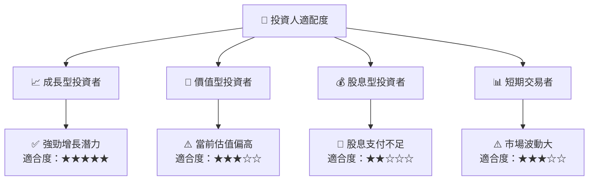

### 10.5 關鍵監控指標

| 監控類型 | 指標 | 關注點 | 頻率 |
|----------|------|--------|------|
| 業務表現 | 收入增長率 | 高於市場預期 | 季度 |
| 財務健康 | 自由現金流 | 轉正與否 | 季度 |
| 利潤率 | 毛利率 | 持續改善 | 季度 |
| 市場動態 | 市場份額 | 相對穩定 | 半年 |

---

> **免責聲明**：本報告為 AI 自動生成，僅供研究參考，不構成投資建議。投資有風險，入市需謹慎。