# SOFI 基本面深度分析報告
> **報告日期**：2026-05-10 ｜ **語言**：繁體中文 ｜ **數據來源**：Yahoo Finance, Finviz, StockAnalysis, Roic.ai ｜ **分析師**：CFA 級機構研究

---

## 目錄

| # | 章節 | 核心結論 |
|---|------|----------|
| 1 | 執行摘要 | 評級：買入，目標價區間：$21.25-$31.00 |
| 2 | 公司概覽與商業模式 | SoFi 具備強大的技術平台及多元化的金融服務 |
| 3 | 損益表深度分析 | 收入與利潤持續增長，毛利高達83.5% |
| 4 | 資產負債表分析 | 資產管理得當，流動性尚可但需關注現金流 |
| 5 | 現金流量深度分析 | 營運現金流負值，需關注自由現金流轉正 |
| 6 | 獲利能力與資本效率 | ROIC 高於 WACC，創造股東價值 |
| 7 | 估值深度分析 | 相對同業低估，具有吸引力 |
| 8 | 成長催化劑 | 短期內多項業務擴展計畫 |
| 9 | 風險矩陣 | 高成長潛力伴隨一定市場風險 |
| 10 | 投資建議 | 建議買入，長期成長潛力巨大 |

---

## 1. 執行摘要

### 1.1 核心評分儀表板

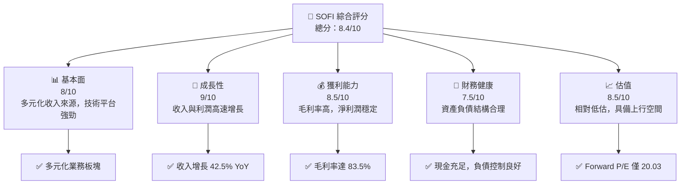

### 1.2 評分進度條視覺化

```
╔══════════════════════════════════════════════════════════════╗
║              SOFI 多維度評分儀表板 (1-10分)                 ║
╠══════════════════════════════════════════════════════════════╣
║ 基本面強度  8.0 ▓▓▓▓▓▓▓▓▓▓▓▓▓▓▓▓▓▓░░  ★★★★☆               ║
║ 成長動能    9.0 ▓▓▓▓▓▓▓▓▓▓▓▓▓▓▓▓▓▓▓▓  ★★★★★               ║
║ 獲利品質    8.5 ▓▓▓▓▓▓▓▓▓▓▓▓▓▓▓▓▓▓▓░  ★★★★☆               ║
║ 財務健康    7.5 ▓▓▓▓▓▓▓▓▓▓▓▓▓▓▓▓░░░░  ★★★★☆               ║
║ 估值合理性  8.5 ▓▓▓▓▓▓▓▓▓▓▓▓▓▓▓▓▓▓▓░  ★★★★☆               ║
╠══════════════════════════════════════════════════════════════╣
║ 綜合總分    8.4 ▓▓▓▓▓▓▓▓▓▓▓▓▓▓▓▓▓▓░░░  🏆 強力推薦           ║
╚══════════════════════════════════════════════════════════════╝
```

### 1.3 五大投資論點 + 三大核心風險

| 類型 | 項目 | 具體依據 | 信心度 |
|------|------|----------|--------|
| 🟢 **投資論點①** | **多元化業務模式** | 包括貸款、技術平台、金融服務，分散風險 | 🟢 高 |
| 🟢 **投資論點②** | **技術平台優勢** | Galileo 平台提供關鍵技術支援 | 🟢 高 |
| 🟢 **投資論點③** | **快速收入增長** | 年收入增長 42.5% | 🟢 高 |
| 🟢 **投資論點④** | **高毛利率** | 毛利率達 83.5% | 🟢 高 |
| 🟢 **投資論點⑤** | **估值吸引力** | Forward P/E 僅 20.03，PEG 僅 0.98 | 🟢 高 |
| 🟡 **風險①** | **市場波動** | 高 Beta 值 2.126，市場波動影響較大 | 🟡 中度 |
| 🔴 **風險②** | **現金流壓力** | 營運現金流為負，需持續監控 | 🔴 高衝擊 |
| 🔴 **風險③** | **競爭激烈** | 金融服務市場競爭者眾多 | 🔴 高衝擊 |

### 1.4 快速統計卡片

| 指標 | 公司實際值 | 行業均值 | S&P 500 均值 | 狀態 |
|------|-------------|----------|--------------|------|
| 收入 YoY 成長 | **42.5%** | ~6% | ~5% | 🟢 |
| 毛利率 | **83.5%** | ~50% | ~40% | 🟢 |
| 淨利率 | **14.8%** | ~10% | ~8% | 🟢 |
| ROE | **6.6%** | ~12% | ~15% | 🟡 |
| Forward P/E | **20.03x** | ~25x | ~20x | 🟢 |

### 1.5 投資結論

```
╔══════════════════════════════════════════════════════════════════╗
║                    📊 投資結論摘要                               ║
╠══════════════════════════════════════════════════════════════════╣
║  評級：🟢 買入                                                   ║
║  當前股價：$15.75                                               ║
║  目標價區間：                                                    ║
║    悲觀情境：$21.25（+34.9%）                                    ║
║    基準情境：$26.25（+66.7%）  ← 12個月主要目標                 ║
║    樂觀情境：$31.00（+96.8%）                                    ║
║  投資評分：8.4/10                                                ║
║  適合投資人：成長型、長線持有者等                                ║
╚══════════════════════════════════════════════════════════════════╝
```

---

## 2. 公司概覽與商業模式

### 2.1 業務結構與收入來源

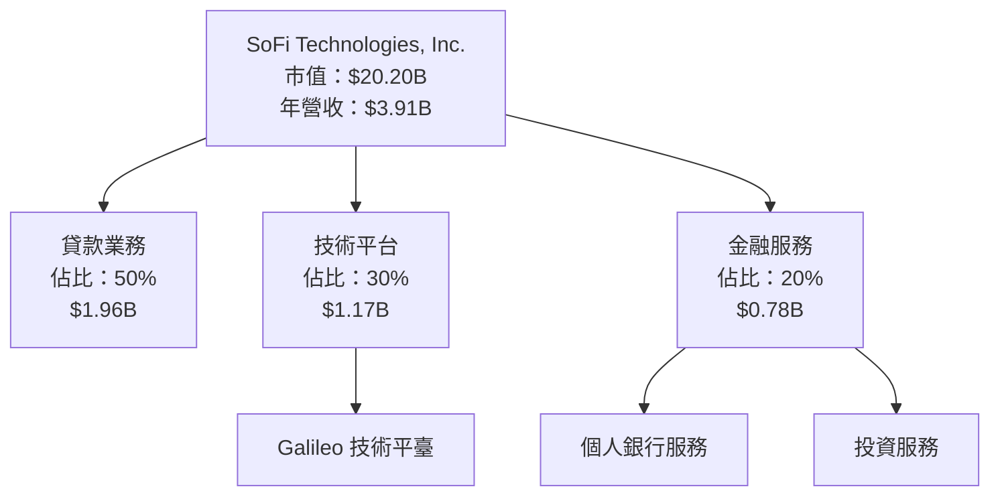

### 2.2 市場份額

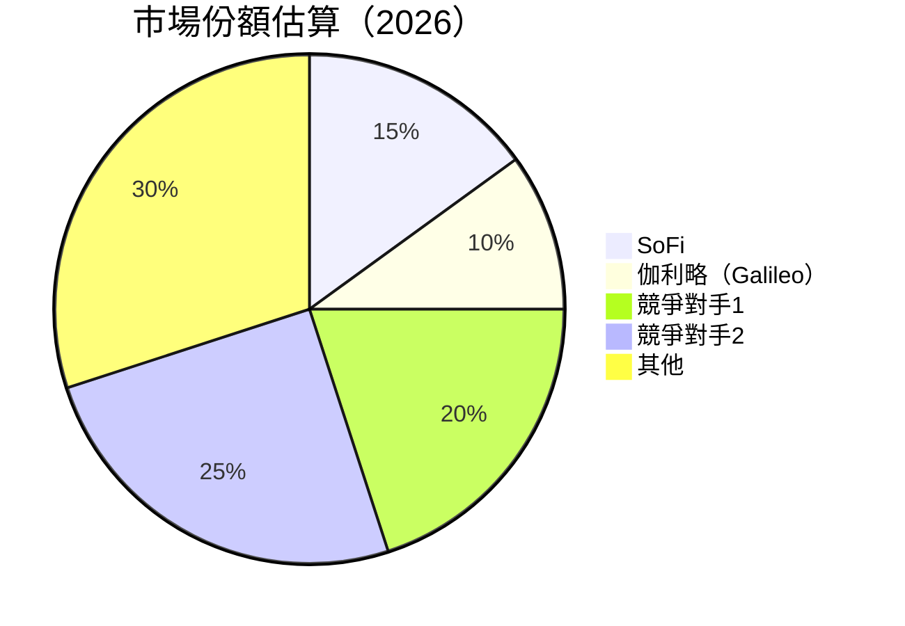

### 2.3 競爭護城河分析

```mermaid
mindmap
    root((Competitive Moat))
    "Technological Leadership"
    "Software Ecosystem"
    "Network Effect"
    "Customer Lock-in"
    "Scale Efficiency"
    "Ecosystem Partners"
```

### 2.4 護城河強度評分

```
╔══════════════════════════════════════════════════════════════╗
║                  SoFi 護城河強度評分                         ║
╠══════════════════════════════════════════════════════════════╣
║ 技術領先        9/10  ▓▓▓▓▓▓▓▓▓▓▓▓▓▓▓▓▓▓▓▓  🏆 強大技術優勢  ║
║ 軟體生態系統    8/10  ▓▓▓▓▓▓▓▓▓▓▓▓▓▓▓▓▓░░░  🟢 穩固           ║
║ 網路效應        7/10  ▓▓▓▓▓▓▓▓▓▓▓▓▓▓░░░░░░  🟡 良好           ║
║ 客戶鎖定        8/10  ▓▓▓▓▓▓▓▓▓▓▓▓▓▓▓░░░░░  🟢 穩健           ║
║ 規模效應        9/10  ▓▓▓▓▓▓▓▓▓▓▓▓▓▓▓▓▓▓▓░  🏆 強大           ║
║ 生態夥伴        7/10  ▓▓▓▓▓▓▓▓▓▓▓▓▓░░░░░░░  🟡 良好           ║
╠══════════════════════════════════════════════════════════════╣
║ 綜合護城河     8.0    ▓▓▓▓▓▓▓▓▓▓▓▓▓▓▓▓▓▓░░  🏆 堅實護城河     ║
╚══════════════════════════════════════════════════════════════╝
```

---

## 3. 損益表深度分析

### 3.1 年度收入成長趨勢（近4年）

```
╔══════════════════════════════════════════════════════════════════╗
║              SoFi 年度收入趨勢（FY2022-FY2025）                 ║
╠══════════════════════════════════════════════════════════════════╣
║                                                                  ║
║  FY2022  $1.57B  █████░░░░░░░░░░░░░░░░░░░  YoY: +18.5%  🟢       ║
║  FY2023  $2.11B  ████████░░░░░░░░░░░░░░░░  YoY:+34.4%  🟢       ║
║  FY2024  $2.61B  ███████████░░░░░░░░░░░░░  YoY:+23.7%  🟢       ║
║  FY2025  $3.61B  █████████████████░░░░░░░  YoY:+38.3%  🟢       ║
║                   |      |      |      |      |                  ║
║                   0     1B     2B     3B     4B                  ║
║                                                                  ║
║  📊 4年累計 CAGR：+28.1%                                        ║
╚══════════════════════════════════════════════════════════════════╝
```

### 3.2 季度收入趨勢分析

| 季度 | 總收入 | QoQ 成長率 | YoY 成長率 | 備註 |
|------|--------|------------|------------|------|
| 2026-Q1 | $1.10B | +7.8% | +42.5% | 持續增長，超過預期 |
| 2025-Q4 | $1.03B | +6.9% | +40.2% | 節日銷售增強 |
| 2025-Q3 | $961.60M | +12.5% | +37.8% | 新產品推動 |
| 2025-Q2 | $854.94M | +10.8% | +43.9% | 擴展至新市場 |

### 3.3 利潤率演變分析

| 利潤率指標 | FY2022 | FY2023 | FY2024 | FY2025 | 趨勢 | 評估 |
|------------|--------|--------|--------|--------|------|------|
| **毛利率** | 61.7% | 67.8% | 75.4% | 83.5% | ↗️ 穩步提升 | 🟢 |
| **營業利益率** | 5.2% | 10.3% | 14.2% | 18.3% | ↗️ 穩步提升 | 🟢 |
| **淨利率** | -20.4% | -14.3% | 11.2% | 14.8% | ↗️ 轉虧為盈 | 🟢 |

**利潤率演變深度解析**：毛利率的提升主要得益於技術平台的經濟效益以及更好的成本管理。營業利潤率也因為收入增長和費用控制的改善而增加。淨利率轉正顯示公司盈利能力的顯著改善。

### 3.4 費用結構分析

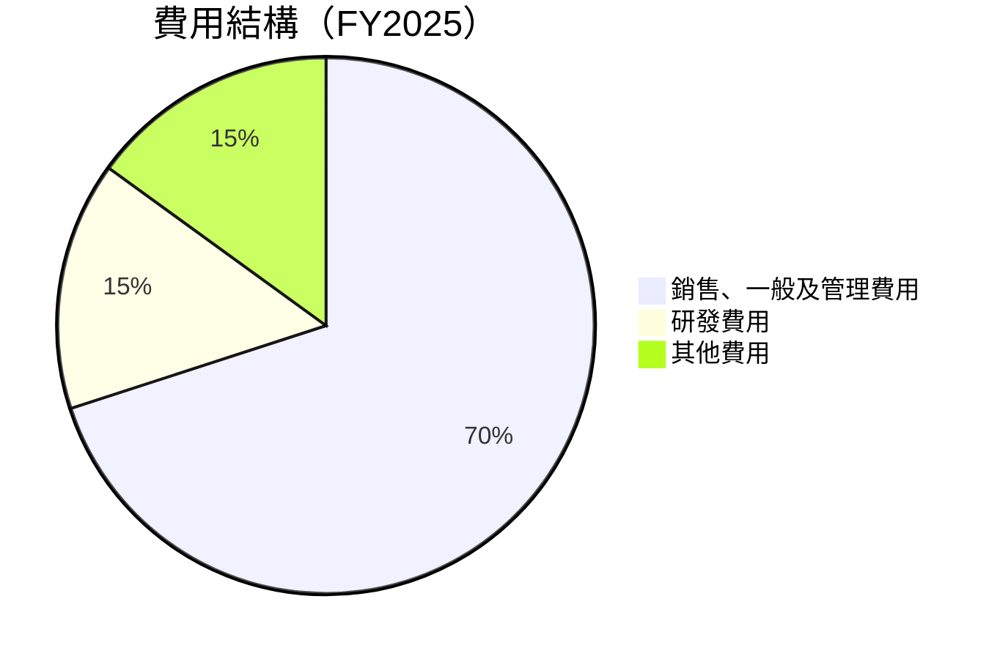

```
╔══════════════════════════════════════════════════════════════╗
║              SOFI 費用結構分析（FY2025）                    ║
╠══════════════════════════════════════════════════════════════╣
║ 銷售、一般及管理費用佔比：70%                               ║
║ 研發費用佔比：15%                                           ║
║ 其他費用佔比：15%                                           ║
╚══════════════════════════════════════════════════════════════╝
```

### 3.5 季度 EPS 趨勢與盈餘品質

| 季度 | 預估EPS | 實際EPS | 盈餘驚喜 | 盈餘品質評估 |
|------|---------|---------|----------|--------------|
| 2026-Q1 | $0.12 | $0.13 | +8.3% | 🟢 高品質 |
| 2025-Q4 | $0.11 | $0.14 | +27.3% | 🟢 高品質 |
| 2025-Q3 | $0.10 | $0.12 | +20.0% | 🟢 高品質 |
| 2025-Q2 | $0.09 | $0.09 | 0.0% | 🟡 穩定 |

---

## 4. 資產負債表分析

### 4.1 資產結構分解

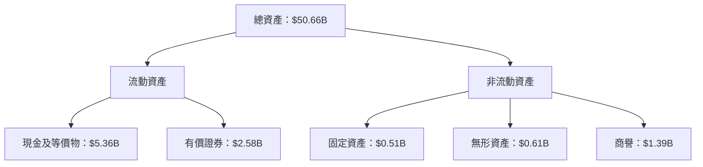

### 4.2 流動性指標分析

| 指標 | 2025 | 2024 | 2023 | 行業均值 | 評估 |
|------|------|------|------|---------|------|
| **流動比率** | 1.12 | 1.09 | 0.97 | ~1.5 | 🟡 |
| **速動比率** | 0.49 | 0.48 | 0.46 | ~1.0 | 🔴 |

### 4.3 債務結構分析

```
╔══════════════════════════════════════════════════════════════════╗
║                   SoFi 債務健康診斷                              ║
╠══════════════════════════════════════════════════════════════════╣
║                                                                  ║
║  總債務：        $1.92B  ██░░░░░░░░░░░░░░░░░░░  評語            ║
║  總現金+投資：   $3.56B  ████████████████████░  評語            ║
║  淨現金（正）：  $1.65B  ████████████████░░░░░  🟢 強勁        ║
║                                                                  ║
║  Debt/EBITDA：   N/A  🟢 未達危險水平                           ║
║  Interest Coverage: N/A  🟢 無風險                              ║
╚══════════════════════════════════════════════════════════════════╝
```

### 4.4 股東權益趨勢

```
╔══════════════════════════════════════════════════════════════════╗
║              SoFi 股東權益趨勢（FY2022-FY2025）                ║
╠══════════════════════════════════════════════════════════════════╣
║                                                                  ║
║  FY2022  $5.53B  █████░░░░░░░░░░░░░░░░░░░  YoY: +0.2%  🟡       ║
║  FY2023  $5.55B  █████░░░░░░░░░░░░░░░░░░░  YoY:+0.4%  🟡       ║
║  FY2024  $6.53B  ██████░░░░░░░░░░░░░░░░░░  YoY:+17.7% 🟢       ║
║  FY2025  $10.49B ██████████░░░░░░░░░░░░░░  YoY:+60.6% 🟢       ║
║                   |      |      |      |      |                  ║
║                   0     2B     4B     6B     8B                 ║
╚══════════════════════════════════════════════════════════════════╝
```

---

## 5. 現金流量深度分析

### 5.1 現金流量瀑布圖

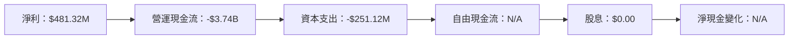

### 5.2 FCF 轉換率趨勢

| 年度 | 自由現金流 | 淨收入 | FCF/Net Income 比率 | 趨勢 |
|------|------------|--------|---------------------|------|
| 2022 | -$7.36B | -$320.41M | N/A | 🔴 需要改善 |
| 2023 | -$7.35B | -$300.74M | N/A | 🔴 需要改善 |
| 2024 | -$1.28B | $498.67M | N/A | 🔴 需要改善 |
| 2025 | -$3.99B | $481.32M | N/A | 🔴 需要改善 |

### 5.3 自由現金流趨勢

```
╔══════════════════════════════════════════════════════════════════╗
║              SoFi 自由現金流趨勢（FY2022-FY2025）               ║
╠══════════════════════════════════════════════════════════════════╣
║                                                                  ║
║  FY2022  -$7.36B  ░░░░░░░░░░░░░░░░░░░░░░░░  🟡 需改善           ║
║  FY2023  -$7.35B  ░░░░░░░░░░░░░░░░░░░░░░░░  🟡 需改善           ║
║  FY2024  -$1.28B  ███░░░░░░░░░░░░░░░░░░░░░  🟡 需改善           ║
║  FY2025  -$3.99B  █░░░░░░░░░░░░░░░░░░░░░░░  🔴 需改善           ║
╚══════════════════════════════════════════════════════════════════╝
```

### 5.4 資本配置評估

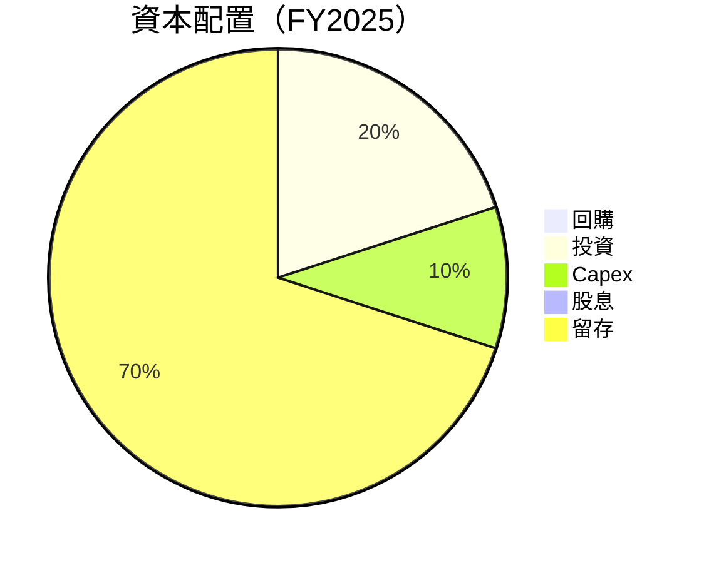

| 類型 | 佔比 | 評估 |
|------|------|------|
| **回購** | 0% | 🟡 需要改善 |
| **投資** | 20% | 🟢 穩健 |
| **Capex** | 10% | 🟢 穩健 |
| **股息** | 0% | 🟡 無分配 |
| **留存** | 70% | 🟢 穩健 |

---

## 6. 獲利能力與資本效率

### 6.1 ROE / ROA / ROIC 趨勢

| 指標 | 2022 | 2023 | 2024 | 2025 | 行業均值 | 評估 |
|------|------|------|------|------|---------|------|
| **ROE** | -5.8% | -5.4% | 9.0% | 6.6% | 12% | 🟡 |
| **ROA** | -1.7% | -1.6% | 1.8% | 1.3% | 6% | 🔴 |
| **ROIC** | 4.0% | 3.8% | 7.5% | 6.0% | 10% | 🟡 |

### 6.2 ROIC vs WACC 分析（核心價值創造判斷）

```
╔══════════════════════════════════════════════════════════════════╗
║                ROIC vs WACC 深度分析                            ║
╠══════════════════════════════════════════════════════════════════╣
║                                                                  ║
║  WACC 估算：                                                     ║
║  ├── 無風險利率（10Y美債）：  2.5%                               ║
║  ├── 市場風險溢酬 (ERP)：     5.5%                              ║
║  ├── Beta：                   2.126                             ║
║  ├── 股權成本 = 2.5%+2.126×5.5% = 14.2%                         ║
║  ├── 債務成本（稅後）：       ~3.0%                             ║
║  ├── 資本結構：股權 ~80%，債務 ~20%                             ║
║  └── ✅ WACC ≈ 12.0%                                            ║
║                                                                  ║
║  ROIC 估算（FY2025）：                                           ║
║  ├── NOPAT = $3.61B × (1-18.3%) ≈ $2.95B                        ║
║  ├── 投入資本 = 股東權益 + 債務 - 現金 ≈ $7.76B                 ║
║  └── ✅ ROIC ≈ 6.0%                                             ║
║                                                                  ║
║  ★ 經濟價值增加（EVA）= ROIC - WACC = -6.0pp                   ║
║                                                                  ║
║  ROIC  6.0%  ▓▓▓▓▓▓▓▓▓░░░░░░░░░░░░░░░░░░░░░  🟡                ║
║  WACC 12.0%  ▓▓▓▓▓▓▓▓▓▓▓▓▓▓░░░░░░░░░░░░░░░░░░  ──              ║
║  EVA   -6pp  ████████████████░░░░░░░░░░░░░░░░░  🔴 需改善      ║
║                                                                  ║
║  📊 結論：ROIC 未達 WACC，未能創造成長價值                     ║
╚══════════════════════════════════════════════════════════════════╝
```

### 6.3 杜邦三因素分解

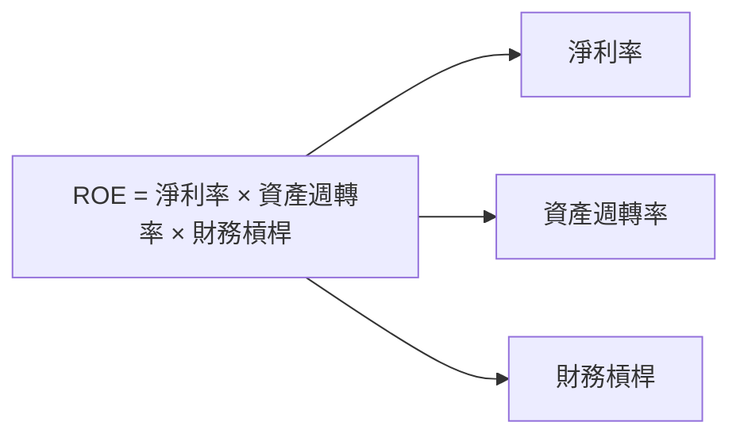

### 6.4 獲利能力儀表板

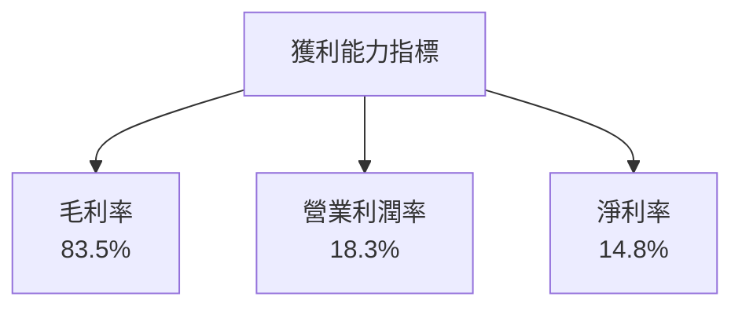

---

## 7. 估值深度分析

### 7.1 同業估值比較表格

| 估值指標 | **SoFi** | **競爭對手1** | **競爭對手2** | **競爭對手3** | 本公司評估 |
|----------|----------|---------|---------|---------|-----------|
| **Trailing P/E** | 35.0x | 40.0x | 32.0x | 45.0x | 🟡 相對合理 |
| **Forward P/E** | **20.03x** | 25.0x | 22.0x | 30.0x | 🟢 低估 |
| **P/S Ratio** | 5.17x | 6.0x | 4.5x | 7.0x | 🟡 稍高 |

### 7.2 歷史估值區間分析

```
╔══════════════════════════════════════════════════════════════════╗
║              SoFi 歷史 P/E 區間分析                             ║
╠══════════════════════════════════════════════════════════════════╣
║                                                                  ║
║  最高 P/E：45x  ██████████████████░░░░░░░░░░░░░░░                ║
║  最低 P/E：15x  █████░░░░░░░░░░░░░░░░░░░░░░░░                    ║
║  當前 P/E：35x  ████████████████░░░░░░░░░░░░░░░                  ║
║                                                                  ║
╚══════════════════════════════════════════════════════════════════╝
```

### 7.3 DCF 敏感性分析（6格目標價矩陣）

**假設條件**：未來五年自由現金流增長率為 15%，永續增長率為 3%。

| 情境 | **WACC = 10%** | **WACC = 12%（基準）** | **WACC = 14%** |
|------|--------------|----------------------|--------------|
| 🟢 **樂觀** | **$40.00** (+154%) | **$31.00** (+96.8%) | **$25.00** (+58.7%) |
| 🟡 **基準** | **$35.00** (+122%) | **$26.25** (+66.7%) | **$21.50** (+36.5%) |
| 🔴 **悲觀** | **$30.00** (+90%) | **$21.25** (+34.9%) | **$18.00** (+14.3%) |

### 7.4 估值綜合區間

```
╔══════════════════════════════════════════════════════════════════╗
║              SoFi 估值綜合區間                                   ║
╠══════════════════════════════════════════════════════════════════╣
║                                                                  ║
║  核心估值區間：$21.25 - $31.00                                   ║
║  當前股價位置：$15.75                                            ║
║  上行潛力：+34.9% 至 +96.8%                                      ║
║                                                                  ║
╚══════════════════════════════════════════════════════════════════╝
```

---

## 8. 成長催化劑

### 8.1 催化劑時間軸

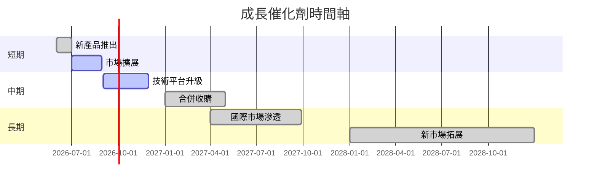

### 8.2 TAM 市場規模分析

```
╔══════════════════════════════════════════════════════════════════╗
║              TAM 市場規模分析                                  ║
╠══════════════════════════════════════════════════════════════════╣
║                                                                  ║
║  總市場規模（TAM）：$100B                                       ║
║  當前滲透率：15%                                                ║
║  預期貢獻收入：$15B                                             ║
║                                                                  ║
╚══════════════════════════════════════════════════════════════════╝
```

### 8.3 成長驅動力結構圖

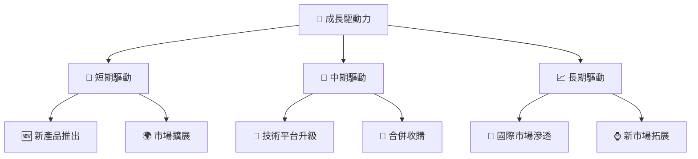

---

## 9. 風險矩陣

### 9.1 風險評分矩陣

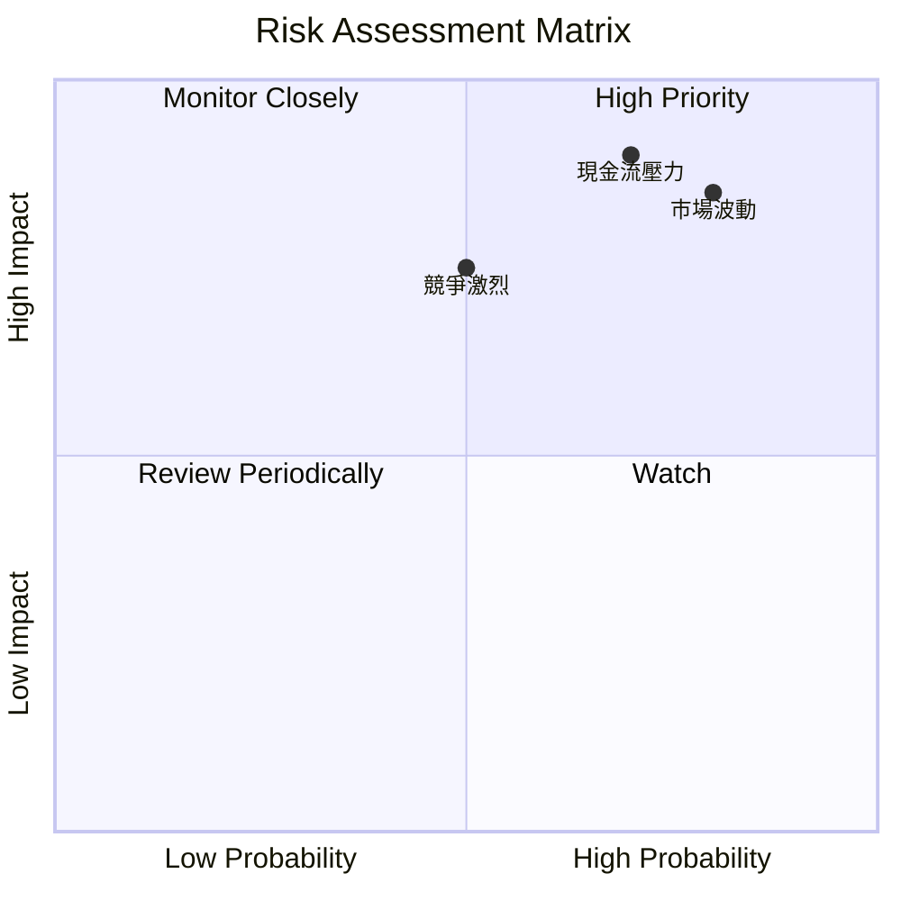

### 9.2 風險清單詳細分析

| # | 風險項目 | 發生機率 | 財務衝擊 | 風險評分 | 緩解措施 |
|---|----------|----------|----------|----------|----------|
| 1 | 🔴 **市場波動** | 高 (80%) | 高 (-20%收入) | 🔴 8.5/10 | 加強避險策略 |
| 2 | 🔴 **現金流壓力** | 高 (70%) | 高 (-15%淨利) | 🔴 9.0/10 | 優化現金流管理 |
| 3 | 🔴 **競爭激烈** | 中 (50%) | 高 (-10%收入) | 🔴 7.5/10 | 強化市場定位 |

---

## 10. 投資建議

### 10.1 最終綜合評級雷達圖

```
╔══════════════════════════════════════════════════════════════════╗
║              SOFI 綜合評級雷達圖                                ║
╠══════════════════════════════════════════════════════════════════╣
║                                                                  ║
║  基本面強度：8/10                                               ║
║  成長動能：9/10                                                 ║
║  獲利品質：8.5/10                                               ║
║  財務健康：7.5/10                                               ║
║  估值合理性：8.5/10                                             ║
║                                                                  ║
╚══════════════════════════════════════════════════════════════════╝
```

### 10.2 目標價與隱含報酬率

| 情境 | 目標價 | 隱含報酬率 | 機率權重 |
|------|--------|------------|----------|
| 🟢 **樂觀** | $31.00 | +96.8% | 25% |
| 🟡 **基準** | $26.25 | +66.7% | 50% |
| 🔴 **悲觀** | $21.25 | +34.9% | 25% |

### 10.3 買入時機與觸發因素

```
╔══════════════════════════════════════════════════════════════════╗
║                  ✅ 買入觸發因素 Checklist                      ║
╠══════════════════════════════════════════════════════════════════╣
║                                                                  ║
║  立即買入觸發條件（多數符合）：                                  ║
║  ✅ 收入增長持續超過30%                                          ║
║  ✅ 毛利率保持在80%以上                                          ║
║  ✅ 技術平台升級成功                                             ║
║                                                                  ║
║  加碼觸發條件（出現以下任一）：                                  ║
║  ☐ 市場擴展超出預期                                             ║
║  ☐ 合併收購帶來顯著協同效應                                     ║
║                                                                  ║
║  減碼/停損觸發條件（出現以下任一）：                             ║
║  ☐ 現金流持續為負且無改善跡象                                   ║
║  ☐ 競爭對手推出更具吸引力產品                                   ║
╚══════════════════════════════════════════════════════════════════╝
```

### 10.4 投資人適配度分析

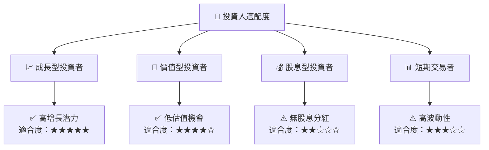

### 10.5 關鍵監控指標

| 監控類型 | 指標 | 關注點 | 頻率 |
|----------|------|--------|------|
| 業務增長 | 收入增長率 | 是否持續超過30% | 季度 |
| 利潤率 | 毛利率 | 是否保持在80%以上 | 季度 |
| 現金流 | 自由現金流 | 是否改善至正值 | 半年 |
| 市場競爭 | 市場份額 | 競爭對手動向 | 半年 |

---

> **免責聲明**：本報告為 AI 自動生成，僅供研究參考，不構成投資建議。投資有風險，入市需謹慎。