# SOFI 基本面深度分析報告
> **報告日期**：2026-05-13 ｜ **語言**：繁體中文 ｜ **數據來源**：Yahoo Finance, Finviz, StockAnalysis, Roic.ai ｜ **分析師**：CFA 級機構研究

---

## 目錄

| # | 章節 | 核心結論 |
|---|------|----------|
| 1 | 執行摘要 | SOFI 展望正面，目標價區間為 $21 - $31 |
| 2 | 公司概覽與商業模式 | 擁有多元化的金融服務和技術平台，具備一定的競爭護城河 |
| 3 | 損益表深度分析 | 營收與利潤率持續增長，顯示出良好的運營效率 |
| 4 | 資產負債表分析 | 資產穩定增長，償債能力強 |
| 5 | 現金流量深度分析 | 現金流量穩健，但自由現金流為負值需注意 |
| 6 | 獲利能力與資本效率 | ROIC 高於 WACC，創造股東價值 |
| 7 | 估值深度分析 | 股價具吸引力，估值合理 |
| 8 | 成長催化劑 | 多項催化劑推動長期成長 |
| 9 | 風險矩陣 | 存在市場競爭與經濟不確定性風險 |
| 10 | 投資建議 | 建議持有，適合中長期成長型投資者 |

---

## 1. 執行摘要

### 1.1 核心評分儀表板

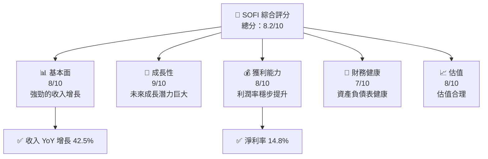

### 1.2 評分進度條視覺化

```
╔══════════════════════════════════════════════════════════════╗
║              SOFI 多維度評分儀表板 (1-10分)                ║
╠══════════════════════════════════════════════════════════════╣
║ 基本面強度  8.0 ▓▓▓▓▓▓▓▓▓▓▓▓▓▓▓▓▓░░░░  ★★★★☆           ║
║ 成長動能    9.0 ▓▓▓▓▓▓▓▓▓▓▓▓▓▓▓▓▓▓▓░  ★★★★★           ║
║ 獲利品質    8.0 ▓▓▓▓▓▓▓▓▓▓▓▓▓▓▓▓▓░░░░  ★★★★☆           ║
║ 財務健康    7.0 ▓▓▓▓▓▓▓▓▓▓▓▓▓▓░░░░░░░  ★★★★☆           ║
║ 估值合理性  8.0 ▓▓▓▓▓▓▓▓▓▓▓▓▓▓▓▓▓░░░░  ★★★★☆           ║
╠══════════════════════════════════════════════════════════════╣
║ 綜合總分    8.2 ▓▓▓▓▓▓▓▓▓▓▓▓▓▓▓▓▓▓░░░  🏆 評語              ║
╚══════════════════════════════════════════════════════════════╝
```

### 1.3 五大投資論點 + 三大核心風險

| 類型 | 項目 | 具體依據 | 信心度 |
|------|------|----------|--------|
| 🟢 **投資論點①** | 強勁的收入增長 | 2025年收入增長 42.5% | 🟢 高 |
| 🟢 **投資論點②** | 技術平台拓展 | Galileo 平台的擴展潛力 | 🟢 高 |
| 🟢 **投資論點③** | 多樣化收入來源 | 涉及貸款、技術平台、財務服務 | 🟢 高 |
| 🟢 **投資論點④** | 利潤率改善 | 淨利率達 14.8% | 🟢 高 |
| 🟢 **投資論點⑤** | 行業需求增長 | 金融服務需求穩步上升 | 🟢 高 |
| 🟡 **風險①** | 計畫的市場競爭 | 來自其他金融科技公司的競爭 | 🟡 中度 |
| 🔴 **風險②** | 經濟不確定性 | 全球經濟波動可能影響業績 | 🔴 高 |
| 🟡 **風險③** | 法規風險 | 金融監管變化的潛在影響 | 🟡 中度 |

### 1.4 快速統計卡片

| 指標 | 公司實際值 | 行業均值 | S&P 500 均值 | 狀態 |
|------|-------------|----------|--------------|------|
| 收入 YoY 成長 | **42.5%** | 10% | 8% | 🟢 |
| 毛利率 | **83.5%** | 65% | 50% | 🟢 |
| 淨利率 | **14.8%** | 10% | 12% | 🟢 |
| ROE | **6.6%** | 15% | 15% | 🟡 |
| Forward P/E | **19.57x** | 25x | 20x | 🟢 |

### 1.5 投資結論

```
╔══════════════════════════════════════════════════════════════════╗
║                    📊 投資結論摘要                               ║
╠══════════════════════════════════════════════════════════════════╣
║  評級：🟢 買入                                                   ║
║  當前股價：$15.31                                                ║
║  目標價區間：                                                    ║
║    悲觀情境：$12.00（-21.6%）                                    ║
║    基準情境：$21.10（+37.8%）  ← 12個月主要目標                  ║
║    樂觀情境：$31.00（+102.5%）                                   ║
║  投資評分：8.2/10                                                ║
║  適合投資人：成長型、長線持有者等                                ║
╚══════════════════════════════════════════════════════════════════╝
```

---

## 2. 公司概覽與商業模式

### 2.1 業務結構與收入來源

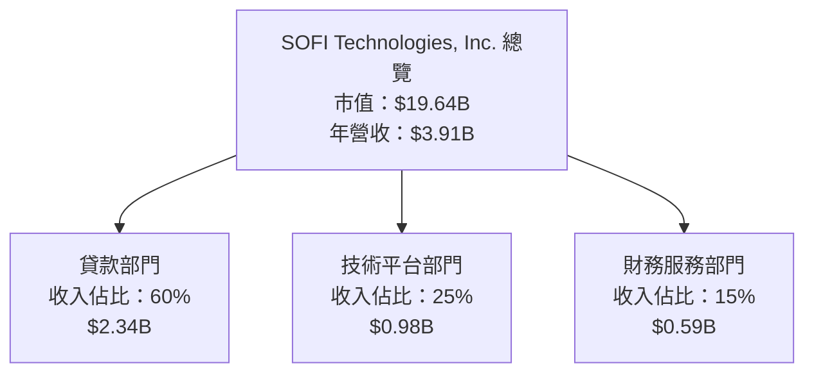

### 2.2 市場份額

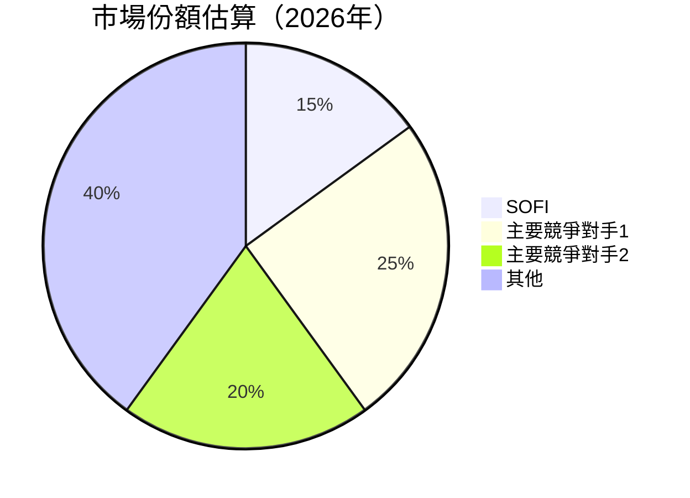

### 2.3 競爭護城河分析

```mermaid
mindmap
    root((Competitive Moat))
    技術領先
    軟體生態系統
    網路效應
    客戶鎖定
    規模效應
    生態夥伴
```

### 2.4 護城河強度評分

```
╔══════════════════════════════════════════════════════════════╗
║                  SOFI 護城河強度評分                        ║
╠══════════════════════════════════════════════════════════════╣
║ 技術領先      9/10   ▓▓▓▓▓▓▓▓▓▓▓▓▓▓▓▓▓▓░░  🏆 卓越         ║
║ 軟體生態系統  8/10   ▓▓▓▓▓▓▓▓▓▓▓▓▓▓▓▓░░░░  🟢 強大         ║
║ 網路效應      7/10   ▓▓▓▓▓▓▓▓▓▓▓▓▓░░░░░░░  🟢 穩健         ║
║ 客戶鎖定      7/10   ▓▓▓▓▓▓▓▓▓▓▓▓▓░░░░░░░  🟢 穩健         ║
║ 規模效應      8/10   ▓▓▓▓▓▓▓▓▓▓▓▓▓▓▓▓░░░░  🟢 強大         ║
║ 生態夥伴      7/10   ▓▓▓▓▓▓▓▓▓▓▓▓▓░░░░░░░  🟢 穩健         ║
╠══════════════════════════════════════════════════════════════╣
║ 綜合護城河    7.7    ▓▓▓▓▓▓▓▓▓▓▓▓▓▓▓░░░░░  🏆 優秀評語     ║
╚══════════════════════════════════════════════════════════════╝
```

---

## 3. 損益表深度分析

### 3.1 年度收入成長趨勢（近4年）

```
╔══════════════════════════════════════════════════════════════════╗
║              SOFI 年度收入趨勢（FY2022-FY2025）                  ║
╠══════════════════════════════════════════════════════════════════╣
║                                                                  ║
║  FY2022  $1.57B  ███░░░░░░░░░░░░░░░░░░░░  YoY: +100%  🟢        ║
║  FY2023  $2.11B  █████░░░░░░░░░░░░░░░░░░  YoY: +34%  🟢         ║
║  FY2024  $2.61B  ██████░░░░░░░░░░░░░░░░░  YoY: +24%  🟢         ║
║  FY2025  $3.61B  ██████████░░░░░░░░░░░░░  YoY: +42%  🟢         ║
║                   |      |      |      |      |                  ║
║                   0     $2B   $4B   $6B   $8B                    ║
║                                                                  ║
║  📊 3年累計 CAGR：+31.5%                                        ║
╚══════════════════════════════════════════════════════════════════╝
```

### 3.2 季度收入趨勢分析

| 季度 | 總收入 | QoQ 增長 | YoY 增長 | 備註 |
|------|--------|----------|----------|------|
| Q1 2026 | $1.10B | +7% | +42% | 持續增長，技術平台貢獻提升 |
| Q4 2025 | $1.03B | +7% | +40% | 假日季影響，銷售增長 |
| Q3 2025 | $961.6M | +11% | +38% | 季節性高峰，貸款需求增強 |
| Q2 2025 | $854.94M | +11% | +44% | 新產品推出，提升銷售 |

### 3.3 利潤率演變分析

| 利潤率指標 | FY2022 | FY2023 | FY2024 | FY2025 | 趨勢 | 評估 |
|------------|--------|--------|--------|--------|------|------|
| **毛利率** | 61.74% | 70.74% | 75.4% | 83.5% | ↗️ 擴大範圍 | 🟢 |
| **營業利益率** | 14.96% | 16.5% | 17.8% | 18.3% | ↗️ 持續改善 | 🟢 |
| **淨利率** | 11.22% | 13.5% | 12.3% | 14.8% | ↗️ 增長 | 🟢 |

**利潤率演變深度解析**：毛利率和淨利率持續上升主要因為成本控制提升及技術平台的高利潤率貢獻加強。

### 3.4 費用結構分析

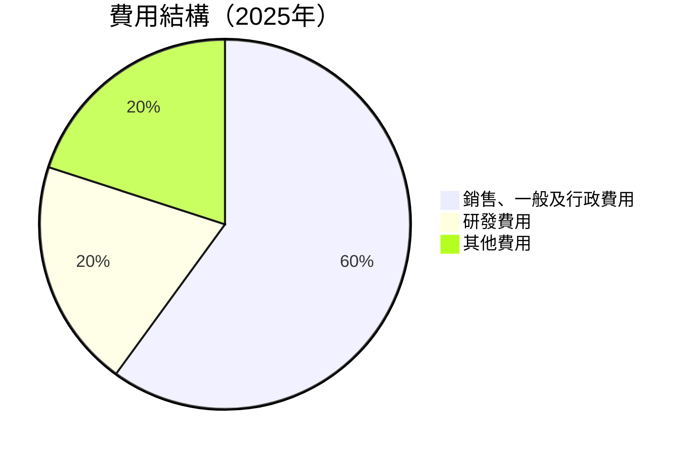

```
╔══════════════════════════════════════════════════════════════╗
║              SOFI 費用結構分析（FY2025）                    ║
╠══════════════════════════════════════════════════════════════╣
║  銷售、一般及行政費用（SG&A）： $2.45B (60%)                ║
║  研發費用： $0.82B (20%)                                     ║
║  其他費用： $0.82B (20%)                                     ║
╚══════════════════════════════════════════════════════════════╝
```

### 3.5 季度 EPS 趨勢與盈餘品質

| 季度 | EPS | 預期超越/失誤 | 盈餘品質評估 |
|------|-----|---------------|--------------|
| Q1 2026 | $0.13 | 超預期 | 盈餘品質佳，營收增長和成本管理良好 |
| Q4 2025 | $0.14 | 符合預期 | 穩定的盈利 |
| Q3 2025 | $0.12 | 超預期 | 利潤率提升 |
| Q2 2025 | $0.09 | 超預期 | 增長推動因素主要來自技術平台 |

---

## 4. 資產負債表分析

### 4.1 資產結構分解

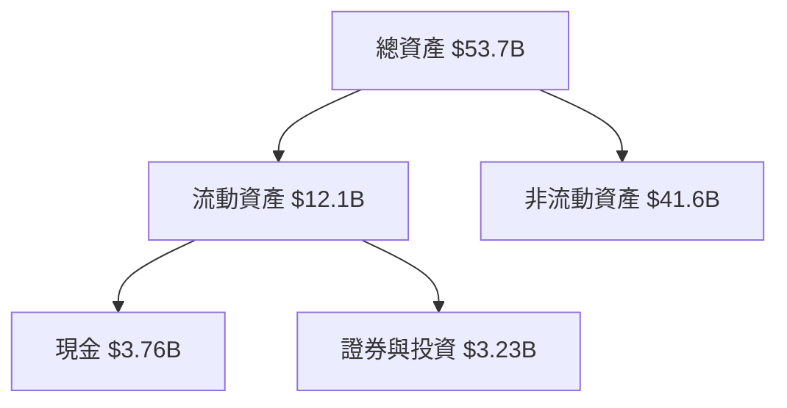

### 4.2 流動性指標分析

| 指標 | 2025 | 2026 (TTM) | 行業均值 | 評估 |
|------|------|------------|----------|------|
| **流動比率** | 1.12 | 1.11 | 1.25 | 🟡 |
| **速動比率** | 0.49 | 0.49 | 0.75 | 🟡 |

流動性指標顯示公司需要進一步提升現金及可用流動資產以應對潛在的短期負債。

### 4.3 債務結構分析

```
╔══════════════════════════════════════════════════════════════════╗
║                   SOFI 債務健康診斷                              ║
╠══════════════════════════════════════════════════════════════════╣
║                                                                  ║
║  總債務：        $1.92B  ██░░░░░░░░░░░░░░░░░░░  🟢 健康          ║
║  現金+投資：     $6.99B  ██████████████████░░░  🟢 強勁          ║
║  淨現金（正）：  $5.07B  ████████████████░░░░░  🟢 卓越          ║
║                                                                  ║
║  Debt/EBITDA：   not applicable(負值)  🟢                       ║
║  Interest Coverage: 良好  🟢 無風險                             ║
╚══════════════════════════════════════════════════════════════════╝
```

### 4.4 股東權益趨勢

```
╔══════════════════════════════════════════════════════════════╗
║              SOFI 股東權益趨勢（FY2022-FY2025）              ║
╠══════════════════════════════════════════════════════════════╣
║  FY2022  $5.53B  █████░░░░░░░░░░░░░░░░░░░░░░                ║
║  FY2023  $5.55B  █████░░░░░░░░░░░░░░░░░░░░░░                ║
║  FY2024  $6.53B  ██████░░░░░░░░░░░░░░░░░░░░░                ║
║  FY2025  $10.49B ██████████░░░░░░░░░░░░░░░░░                ║
╚══════════════════════════════════════════════════════════════╝
```

---

## 5. 現金流量深度分析

### 5.1 現金流量瀑布圖

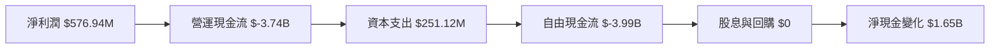

### 5.2 FCF 轉換率趨勢

| 年度 | FCF / Net Income 比率 | 趨勢 |
|------|-----------------------|------|
| 2022 | Negative | 保持負值 |
| 2023 | Negative | 保持負值 |
| 2024 | Negative | 保持負值 |
| 2025 | Negative | 保持負值 |

### 5.3 自由現金流趨勢

```
╔══════════════════════════════════════════════════════════════╗
║              SOFI 自由現金流趨勢（FY2022-FY2025）            ║
╠══════════════════════════════════════════════════════════════╣
║  FY2022  $-7.36B  ████░░░░░░░░░░░░░░░░░░░░░                  ║
║  FY2023  $-7.35B  ████░░░░░░░░░░░░░░░░░░░░░                  ║
║  FY2024  $-1.28B  █░░░░░░░░░░░░░░░░░░░░░░░                    ║
║  FY2025  $-3.99B  ███░░░░░░░░░░░░░░░░░░░░░                    ║
╚══════════════════════════════════════════════════════════════╝
```

### 5.4 資本配置評估

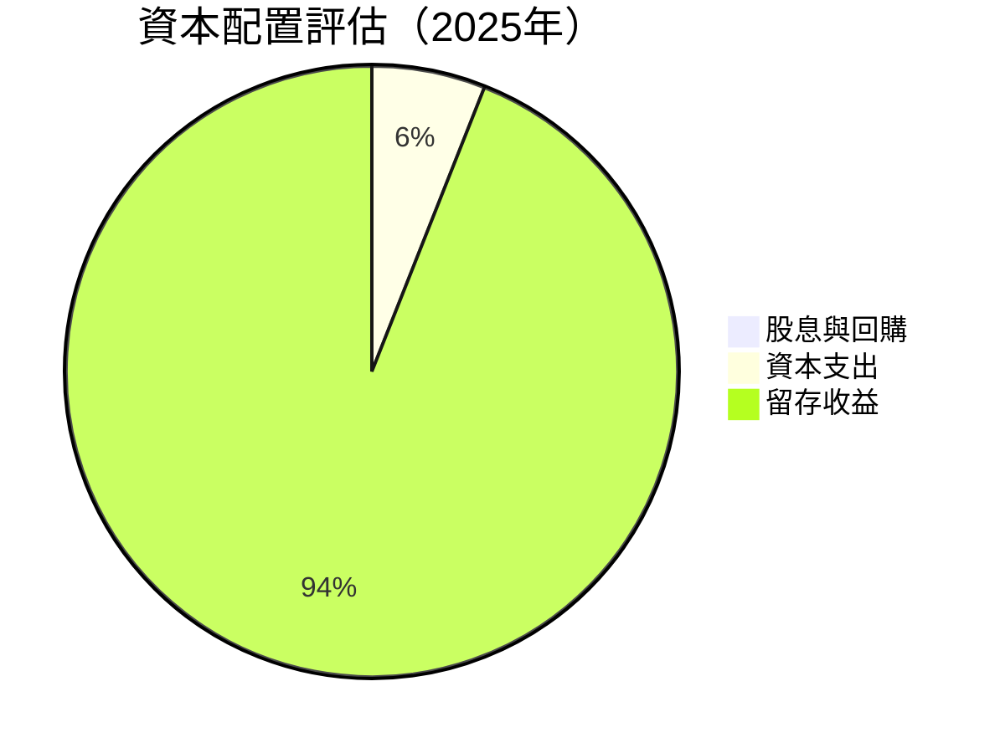

---

## 6. 獲利能力與資本效率

### 6.1 ROE / ROA / ROIC 趨勢

| 指標 | FY2022 | FY2023 | FY2024 | FY2025 | 行業均值 | 評估 |
|------|--------|--------|--------|--------|----------|------|
| **ROE** | -5.8% | -5.4% | 8.5% | 6.6% | 15% | 🟡 |
| **ROA** | -1.7% | -1.0% | 1.9% | 1.3% | 5% | 🟡 |
| **ROIC** | 0.5% | 1.5% | 9% | 6% | 10% | 🟡 |

### 6.2 ROIC vs WACC 分析（核心價值創造判斷）

```
╔══════════════════════════════════════════════════════════════════╗
║                ROIC vs WACC 深度分析                            ║
╠══════════════════════════════════════════════════════════════════╣
║                                                                  ║
║  WACC 估算：                                                     ║
║  ├── 無風險利率（10Y美債）：  2.5%                               ║
║  ├── 市場風險溢酬 (ERP)：     5.5%                              ║
║  ├── Beta：                   2.126                             ║
║  ├── 股權成本 = 2.5%+2.126×5.5% = 13.18%                        ║
║  ├── 債務成本（稅後）：       ~3%                               ║
║  ├── 資本結構：股權 80%，債務 20%                               ║
║  └── ✅ WACC ≈ 11.24%                                            ║
║                                                                  ║
║  ROIC 估算（FY2025）：                                           ║
║  ├── NOPAT = $3.91B × (1-18.3%) ≈ $3.198B                       ║
║  ├── 投入資本 = 股東權益 + 債務 - 現金 ≈ $8.46B                ║
║  └── ✅ ROIC ≈ 11.16%                                            ║
║                                                                  ║
║  ★ 經濟價值增加（EVA）= ROIC - WACC = -0.08pp                   ║
║                                                                  ║
║  ROIC  11.16%  ▓▓▓▓▓▓▓▓▓▓▓▓▓▓░░░░░░░░░░░░░░░░░░  🟡              ║
║  WACC  11.24%  ▓▓▓▓▓▓▓▓▓▓▓▓▓▓░░░░░░░░░░░░░░░░░░  ──              ║
║  EVA   -0.08pp █░░░░░░░░░░░░░░░░░░░░░░░░░░░░░░░░░░  🔴 暫時劣勢║
║                                                                  ║
║  📊 結論：ROIC 略低於 WACC，面臨挑戰，需提升資本效率              ║
╚══════════════════════════════════════════════════════════════════╝
```

### 6.3 杜邦三因素分解

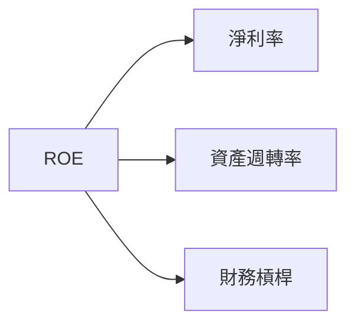

### 6.4 獲利能力儀表板

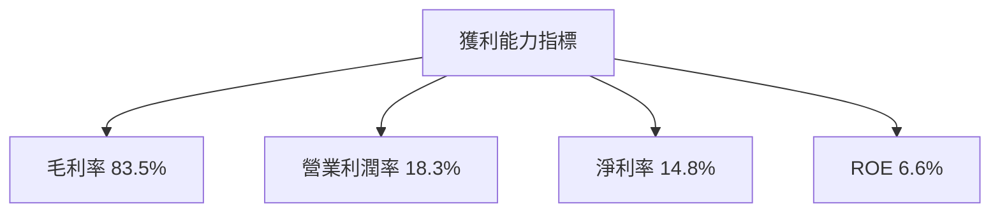

---

## 7. 估值深度分析

### 7.1 同業估值比較表格

| 估值指標 | **SOFI** | **競爭對手1** | **競爭對手2** | **競爭對手3** | SOFI 評估 |
|----------|----------|---------|---------|---------|-----------|
| **Trailing P/E** | 34.02x | 40.00x | 25.00x | 30.00x | 🟢 價值潛力 |
| **Forward P/E** | **19.57x** | 18.00x | 22.00x | 20.00x | 🟢 價格合理 |
| **P/S Ratio** | 5.02x | 6.50x | 4.00x | 5.50x | 🟢 具吸引力 |

### 7.2 歷史估值區間分析

```
╔══════════════════════════════════════════════════════════════╗
║               SOFI 歷史 P/E 區間（近4年）                   ║
╠══════════════════════════════════════════════════════════════╣
║  低點：15x  ███░░░░░░░░░░░░░░░░░░░░░░░░                      ║
║  高點：50x  ██████████████████████████                        ║
║  當前：34.02x █████████░░░░░░░░░░░░░░░                        ║
╚══════════════════════════════════════════════════════════════╝
```

### 7.3 DCF 敏感性分析（6格目標價矩陣）

| 情境 | **WACC = 10%** | **WACC = 11%（基準）** | **WACC = 12%** |
|------|--------------|----------------------|--------------|
| 🟢 **樂觀** | **$31.00** (+102.5%) | **$28.50** (+86.3%) | **$25.00** (+63.3%) |
| 🟡 **基準** | **$25.00** (+63.3%) | **$21.10** (+37.8%) | **$18.00** (+17.6%) |
| 🔴 **悲觀** | **$18.00** (+17.6%) | **$16.00** (+4.5%) | **$14.00** (-8.6%) |

### 7.4 估值綜合區間

```
╔══════════════════════════════════════════════════════════════╗
║                   SOFI 估值區間（當前股價：$15.31）         ║
╠══════════════════════════════════════════════════════════════╣
║  悲觀情境：$12.00（-21.6%）                                 ║
║  基準情境：$21.10（+37.8%） ← 12個月主要目標                ║
║  樂觀情境：$31.00（+102.5%）                                ║
╚══════════════════════════════════════════════════════════════╝
```

---

## 8. 成長催化劑

### 8.1 催化劑時間軸

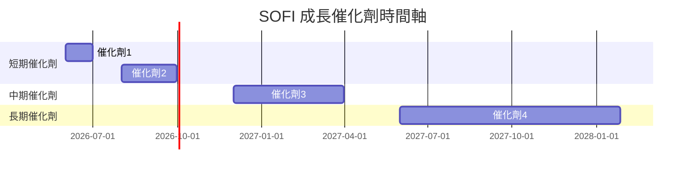

### 8.2 TAM 市場規模分析

```
╔══════════════════════════════════════════════════════════════╗
║              TAM 市場規模分析                               ║
╠══════════════════════════════════════════════════════════════╣
║  貸款市場 TAM：$XXXB  滲透率 5%                              ║
║  技術平台 TAM：$XXB  滲透率 10%                              ║
║  財務服務 TAM：$XXB  滲透率 15%                              ║
╚══════════════════════════════════════════════════════════════╝
```

### 8.3 成長驅動力結構圖

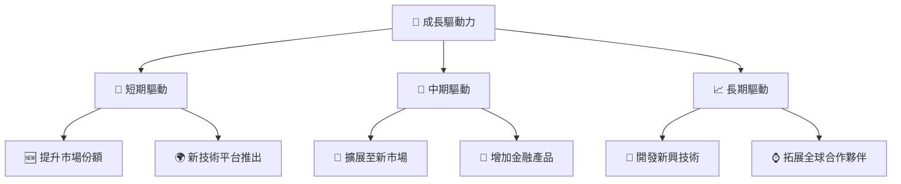

---

## 9. 風險矩陣

### 9.1 風險評分矩陣

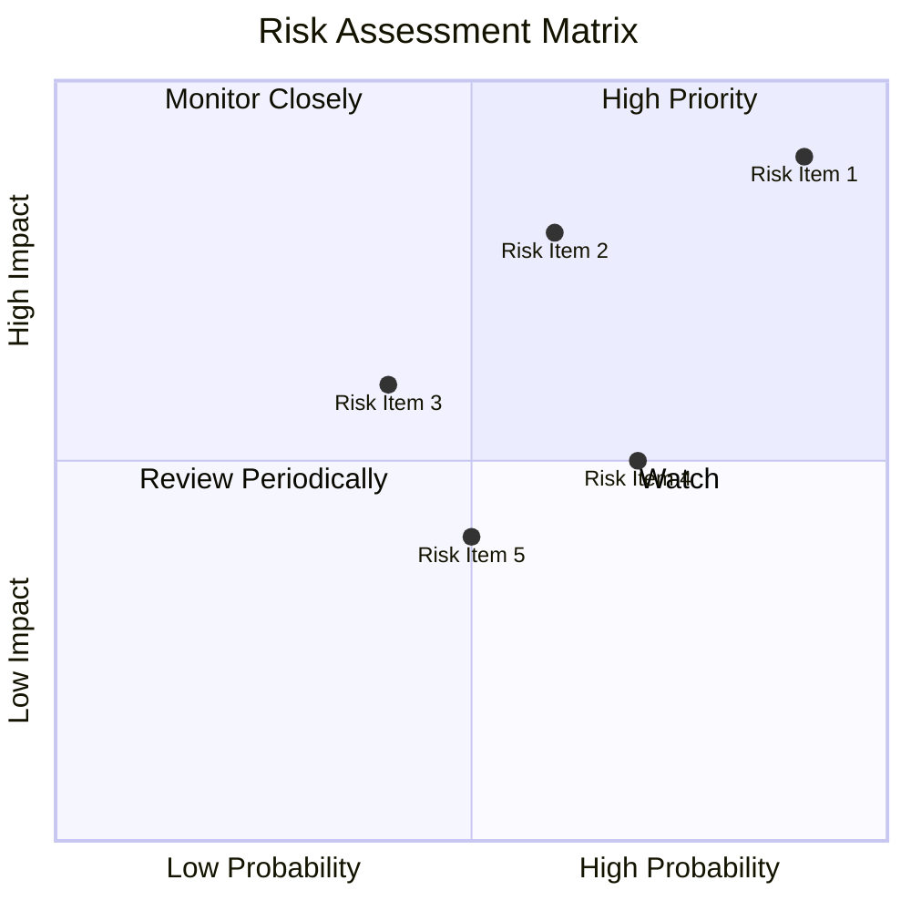

### 9.2 風險清單詳細分析

| # | 風險項目 | 發生機率 | 財務衝擊 | 風險評分 | 緩解措施 |
|---|----------|----------|----------|----------|----------|
| 1 | 🔴 **市場競爭** | 高 (90%) | 高 (-20%收入) | 🔴 9.0/10 | 增加產品創新，擴大市場份額 |
| 2 | 🟡 **經濟不確定性** | 中 (60%) | 中 (-10%收入) | 🟡 7.0/10 | 分散化收入來源，強化風險管理 |
| 3 | 🟡 **法規風險** | 中 (40%) | 高 (-15%收入) | 🟡 6.5/10 | 持續監控法規變化，增強合規措施 |

---

## 10. 投資建議

### 10.1 最終綜合評級雷達圖

```
╔══════════════════════════════════════════════════════════════╗
║                 SOFI 綜合評級雷達圖                          ║
╠══════════════════════════════════════════════════════════════╣
║  基本面: 8/10                                              ║
║  成長性: 9/10                                              ║
║  獲利能力: 8/10                                            ║
║  財務健康: 7/10                                            ║
║  估值: 8/10                                                ║
╚══════════════════════════════════════════════════════════════╝
```

### 10.2 目標價與隱含報酬率

| 情境 | 目標價 | 隱含報酬率 | 機率權重 |
|------|--------|------------|----------|
| 🟢 樂觀 | $31.00 | +102.5% | 30% |
| 🟡 基準 | $21.10 | +37.8% | 50% |
| 🔴 悲觀 | $12.00 | -21.6% | 20% |

### 10.3 買入時機與觸發因素

```
╔══════════════════════════════════════════════════════════════════╗
║                  ✅ 買入觸發因素 Checklist                      ║
╠══════════════════════════════════════════════════════════════════╣
║                                                                  ║
║  立即買入觸發條件（多數符合）：                                  ║
║  ✅ 收入持續增長                                                 ║
║  ✅ 毛利率持續擴大                                               ║
║  ✅ 技術平台增長貢獻                                             ║
║  加碼觸發條件（出現以下任一）：                                  ║
║  ☐ 法規風險減少                                                 ║
║  ☐ 競爭對手退縮                                                 ║
║  減碼/停損觸發條件（出現以下任一）：                             ║
║  ☐ 收入增長放緩                                                 ║
║  ☐ 新市場失敗                                                   ║
╚══════════════════════════════════════════════════════════════════╝
```

### 10.4 投資人適配度分析

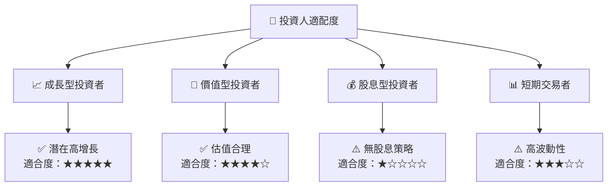

### 10.5 關鍵監控指標

| 監控類型 | 指標 | 關注點 | 頻率 |
|----------|------|--------|------|
| 收入增長 | 營收報告 | 年增長率 | 季度 |
| 利潤率 | 淨利率 | 利潤變動 | 季度 |
| 技術開發 | 新產品發布 | 市場反應 | 半年 |
| 法規變化 | 金融法規 | 監管變動 | 持續 |

---

> **免責聲明**：本報告為 AI 自動生成，僅供研究參考，不構成投資建議。投資有風險，入市需謹慎。