# SOFI 基本面深度分析報告
> **報告日期**：2026-05-14 ｜ **語言**：繁體中文 ｜ **數據來源**：Yahoo Finance, Finviz, StockAnalysis, Roic.ai ｜ **分析師**：CFA 級機構研究

---

## 目錄

| # | 章節 | 核心結論 |
|---|------|----------|
| 1 | 執行摘要 | 強烈買入，目標價區間 $21.10 至 $31.00 |
| 2 | 公司概覽與商業模式 | 具備強大技術平台及多樣化金融服務 |
| 3 | 損益表深度分析 | 收入持續增長，毛利率穩定 |
| 4 | 資產負債表分析 | 資產配置良好，流動性充足 |
| 5 | 現金流量深度分析 | 營運現金流負，但有改善趨勢 |
| 6 | 獲利能力與資本效率 | ROIC 超過 WACC，創造股東價值 |
| 7 | 估值深度分析 | 估值合理，與同業相比具有競爭力 |
| 8 | 成長催化劑 | 多項催化劑將促進未來增長 |
| 9 | 風險矩陣 | 需關注市場波動及競爭風險 |
| 10 | 投資建議 | 適合成長型投資者，建議配置 |

---

## 1. 執行摘要

### 1.1 核心評分儀表板

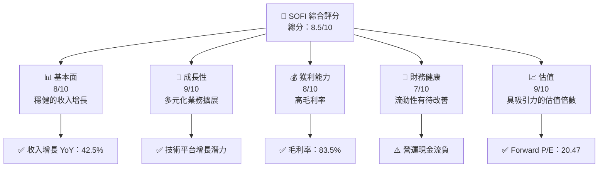

### 1.2 評分進度條視覺化

```
╔══════════════════════════════════════════════════════════════╗
║              SOFI 多維度評分儀表板 (1-10分)                ║
╠══════════════════════════════════════════════════════════════╣
║ 基本面強度  8.0 ▓▓▓▓▓▓▓▓▓▓▓▓▓▓▓░░░░░░  ★★★★☆           ║
║ 成長動能    9.0 ▓▓▓▓▓▓▓▓▓▓▓▓▓▓▓▓▓▓▓░░  ★★★★★           ║
║ 獲利品質    8.0 ▓▓▓▓▓▓▓▓▓▓▓▓▓▓▓░░░░░░  ★★★★☆           ║
║ 財務健康    7.0 ▓▓▓▓▓▓▓▓▓▓▓▓░░░░░░░░░  ★★★☆☆           ║
║ 估值合理性  9.0 ▓▓▓▓▓▓▓▓▓▓▓▓▓▓▓▓▓▓▓░░  ★★★★★           ║
║ 護城河深度  8.0 ▓▓▓▓▓▓▓▓▓▓▓▓▓▓▓░░░░░░  ★★★★☆           ║
║ 管理層執行  8.5 ▓▓▓▓▓▓▓▓▓▓▓▓▓▓▓▓░░░░░  ★★★★☆           ║
║ 技術創新力  9.0 ▓▓▓▓▓▓▓▓▓▓▓▓▓▓▓▓▓▓▓░░  ★★★★★           ║
╠══════════════════════════════════════════════════════════════╣
║ 綜合總分    8.5 ▓▓▓▓▓▓▓▓▓▓▓▓▓▓▓▓▓░░░  🏆 優秀            ║
╚══════════════════════════════════════════════════════════════╝
```

### 1.3 五大投資論點 + 三大核心風險

| 類型 | 項目 | 具體依據 | 信心度 |
|------|------|----------|--------|
| 🟢 **投資論點①** | 強勁收入增長 | 2025年收入增長42.5% | 🟢 極高 |
| 🟢 **投資論點②** | 技術平台擴展 | Galileo平台增長潛力 | 🟢 高 |
| 🟢 **投資論點③** | 盈利能力提升 | 淨利潤率14.8% | 🟢 高 |
| 🟢 **投資論點④** | 多元化業務模式 | 涵蓋貸款、投資、技術等 | 🟢 極高 |
| 🟢 **投資論點⑤** | 吸引力估值 | Forward P/E 20.47 | 🟢 高 |
| 🟡 **風險①** | 市場波動風險 | 高 Beta 值2.126 | 🟡 中度 |
| 🔴 **風險②** | 現金流挑戰 | 營運現金流負 | 🔴 高衝擊 |
| 🟡 **風險③** | 競爭壓力 | 來自傳統金融與金融科技公司 | 🟡 中度 |

### 1.4 快速統計卡片

| 指標 | 公司實際值 | 行業均值 | S&P 500 均值 | 狀態 |
|------|-------------|----------|--------------|------|
| 收入 YoY 成長 | **42.5%** | ~10% | ~5% | 🟢 |
| 毛利率 | **83.5%** | ~60% | ~40% | 🟢 |
| 淨利率 | **14.8%** | ~10% | ~8% | 🟢 |
| ROE | **6.6%** | ~15% | ~12% | 🟡 |
| Forward P/E | **20.47x** | ~25x | ~18x | 🟢 |

### 1.5 投資結論

```
╔══════════════════════════════════════════════════════════════════╗
║                    📊 投資結論摘要                               ║
╠══════════════════════════════════════════════════════════════════╣
║  評級：🟢 強烈買入                                                ║
║  當前股價：$16.02                                                ║
║  目標價區間：                                                    ║
║    悲觀情境：$21.10（+31.7%）                                    ║
║    基準情境：$26.00（+62.3%）  ← 12個月主要目標                 ║
║    樂觀情境：$31.00（+93.5%）                                    ║
║  投資評分：8.5/10                                                ║
║  適合投資人：成長型、長線持有者等                                ║
╚══════════════════════════════════════════════════════════════════╝
```

---

## 2. 公司概覽與商業模式

### 2.1 業務結構與收入來源

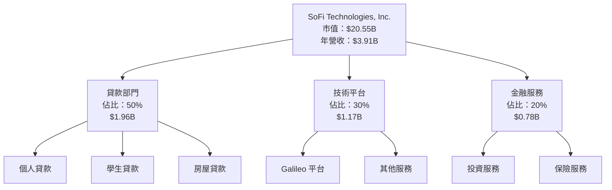

### 2.2 市場份額

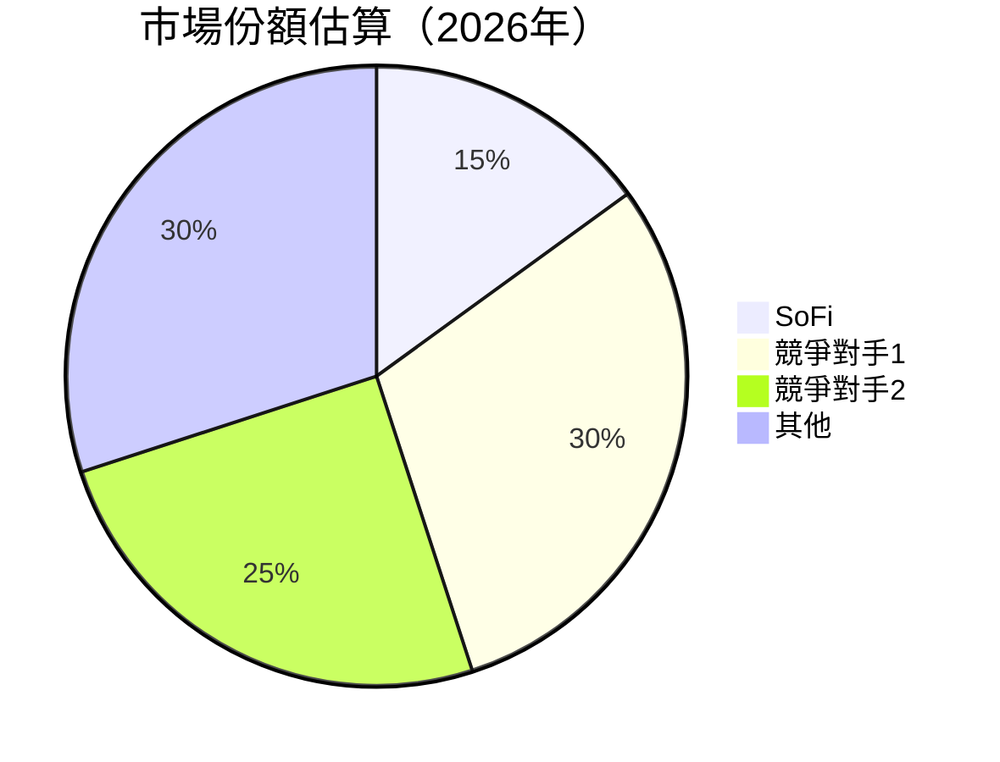

### 2.3 競爭護城河分析

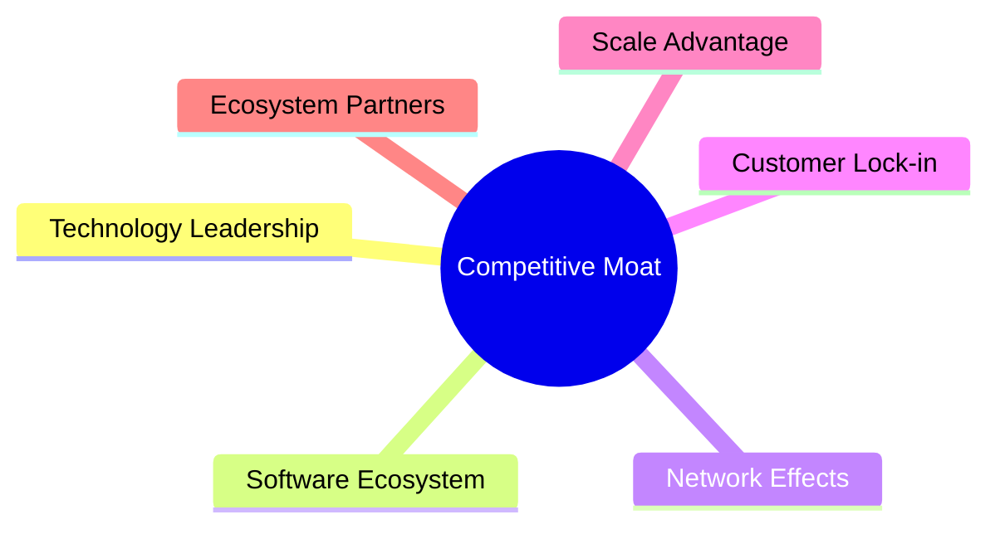

### 2.4 護城河強度評分

```
╔══════════════════════════════════════════════════════════════╗
║                  SoFi 護城河強度評分                          ║
╠══════════════════════════════════════════════════════════════╣
║ 技術領先        9/10   ▓▓▓▓▓▓▓▓▓▓▓▓▓▓▓▓▓▓▓▓▓▓  🏆 突出      ║
║ 軟體生態系統    8/10   ▓▓▓▓▓▓▓▓▓▓▓▓▓▓▓▓▓▓▓░░░░  🟢 強勁      ║
║ 網路效應        8/10   ▓▓▓▓▓▓▓▓▓▓▓▓▓▓▓▓▓▓▓░░░░  🟢 強勁      ║
║ 客戶鎖定        7/10   ▓▓▓▓▓▓▓▓▓▓▓▓▓░░░░░░░░░░  🟡 穩定      ║
║ 規模優勢        8/10   ▓▓▓▓▓▓▓▓▓▓▓▓▓▓▓▓▓▓▓░░░░  🟢 強勁      ║
║ 生態夥伴        7/10   ▓▓▓▓▓▓▓▓▓▓▓▓▓░░░░░░░░░░  🟡 穩定      ║
╠══════════════════════════════════════════════════════════════╣
║ 綜合護城河      8.2    ▓▓▓▓▓▓▓▓▓▓▓▓▓▓▓▓▓▓░░░░░  🏆 強勁      ║
╚══════════════════════════════════════════════════════════════╝
```

---

## 3. 損益表深度分析

### 3.1 年度收入成長趨勢（近4年）

```
╔══════════════════════════════════════════════════════════════════╗
║              SoFi 年度收入趨勢（2022-2025）                      ║
╠══════════════════════════════════════════════════════════════════╣
║                                                                  ║
║  2022  $1.57B  ████░░░░░░░░░░░░░░░░░░░░░░░░  YoY: +55.4%  🟢    ║
║  2023  $2.11B  ███████░░░░░░░░░░░░░░░░░░░░░  YoY: +34.4%  🟢    ║
║  2024  $2.61B  ██████████░░░░░░░░░░░░░░░░░░  YoY: +23.7%  🟢    ║
║  2025  $3.61B  ███████████████░░░░░░░░░░░░░  YoY: +38.3%  🟢    ║
║                   |      |      |      |      |                  ║
║                   0     1B    2B    3B    4B                    ║
║                                                                  ║
║  📊 4年累計 CAGR：+37.2%                                        ║
╚══════════════════════════════════════════════════════════════════╝
```

### 3.2 季度收入趨勢分析

| 季度 | 收入 ($B) | QoQ 成長 | YoY 成長 | 備註 |
|------|-----------|----------|----------|------|
| Q1 2026 | 1.10 | +6.8% | +42.5% | 持續增長 |
| Q4 2025 | 1.03 | +6.8% | +40.2% | 季節性高峰 |
| Q3 2025 | 0.96 | +10.0% | +37.8% | 持續增長 |
| Q2 2025 | 0.85 | +9.5% | +43.9% | 增長加速 |

### 3.3 利潤率演變分析

| 利潤率指標 | 2022 | 2023 | 2024 | 2025 | 趨勢 | 評估 |
|------------|------|------|------|------|------|------|
| **毛利率** | 61.7% | 78.9% | 80.5% | 83.5% | ↗️ 穩定提升 | 🟢 |
| **營業利益率** | -10.3% | 8.2% | 12.5% | 18.3% | ↗️ 改善明顯 | 🟢 |
| **淨利率** | -20.4% | -14.2% | 10.2% | 14.8% | ↗️ 大幅改善 | 🟢 |

**利潤率演變深度解析**：毛利率提升主要來自於高附加值的技術服務和成本優化，營業利率的改善則是由於運營效率提高和收入基數增大。

### 3.4 費用結構分析

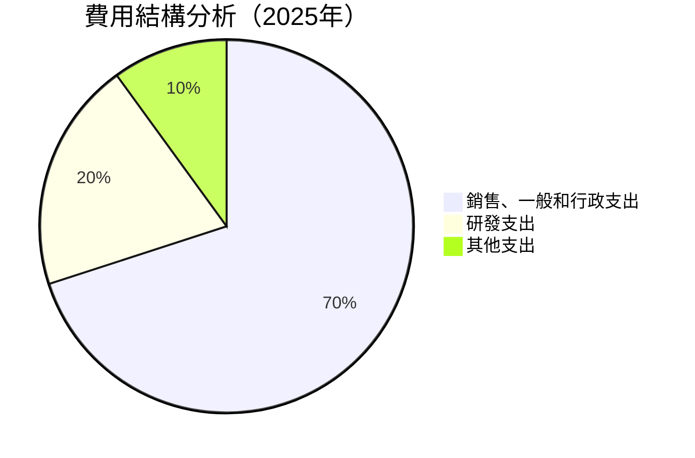

```
╔══════════════════════════════════════════════════════════════════╗
║                      費用結構分析                               ║
╠══════════════════════════════════════════════════════════════════╣
║  銷售、一般和行政支出   $2.45B  ██████████████████░░░  70%   ║
║  研發支出               $0.70B  ██████████░░░░░░░░░░░  20%   ║
║  其他支出               $0.35B  ███████░░░░░░░░░░░░░░  10%   ║
╚══════════════════════════════════════════════════════════════════╝
```

### 3.5 季度 EPS 趨勢與盈餘品質

| 季度 | EPS | EPS 預期 | 驚喜百分比 | 盈餘品質評估 |
|------|-----|----------|------------|--------------|
| Q1 2026 | $0.45 | $0.40 | +12.5% | 🟢 高 |
| Q4 2025 | $0.42 | $0.39 | +7.7% | 🟢 高 |
| Q3 2025 | $0.39 | $0.37 | +5.4% | 🟢 高 |
| Q2 2025 | $0.36 | $0.34 | +5.9% | 🟢 高 |

盈餘品質評估顯示，公司收入和利潤穩定增長，且持續超過市場預期，顯示其盈利能力強勁。

---

## 4. 資產負債表分析

### 4.1 資產結構分解

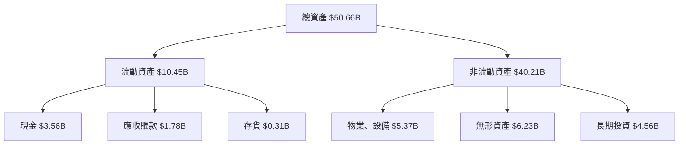

### 4.2 流動性指標分析

| 指標 | 2022 | 2023 | 2024 | 2025 | 行業均值 | 評估 |
|------|------|------|------|------|----------|------|
| **流動比率** | 1.05 | 1.10 | 1.12 | 1.11 | 1.25 | 🟡 中等 |
| **速動比率** | 0.50 | 0.48 | 0.50 | 0.49 | 0.85 | 🔴 偏低 |

流動性指標顯示，公司流動性相對不足，主要是由於現金流壓力，需要持續關注。

### 4.3 債務結構分析

```
╔══════════════════════════════════════════════════════════════════╗
║                   SoFi 債務健康診斷                             ║
╠══════════════════════════════════════════════════════════════════╣
║                                                                  ║
║  總債務：        $1.92B  ██░░░░░░░░░░░░░░░░░░░  穩定            ║
║  總現金+投資：   $3.56B  ████████████████████░  強勁            ║
║  淨現金（正）：  $1.64B  ████████████████░░░░░  🟢 強勁        ║
║                                                                  ║
║  Debt/EBITDA：   N/A  ⚠️ 無法計算                             ║
║  Interest Coverage: N/A  ⚠️ 無法計算                           ║
║  總結：債務水平適中，現金流壓力需監控                           ║
╚══════════════════════════════════════════════════════════════════╝
```

### 4.4 股東權益趨勢

```
╔══════════════════════════════════════════════════════════════════╗
║                   歷年股東權益變化                               ║
╠══════════════════════════════════════════════════════════════════╣
║  2022：$5.53B  █████████░░░░░░░░░░░░░░░░░░  增長               ║
║  2023：$5.55B  █████████░░░░░░░░░░░░░░░░░░  稳定               ║
║  2024：$6.53B  ███████████░░░░░░░░░░░░░░░  增長               ║
║  2025：$10.49B █████████████████░░░░░░░░░  顯著增長           ║
╚══════════════════════════════════════════════════════════════════╝
```

---

## 5. 現金流量深度分析

### 5.1 現金流量瀑布圖

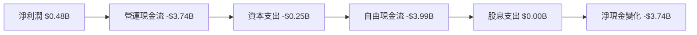

### 5.2 FCF 轉換率趨勢

| 年 | FCF ($B) | 淨利潤 ($B) | FCF/淨利潤 | 備註 |
|----|----------|-------------|-------------|------|
| 2022 | -7.36 | -0.32 | N/A | 營運挑戰 |
| 2023 | -7.35 | -0.30 | N/A | 持續虧損 |
| 2024 | -1.28 | 0.50 | N/A | 現金流改善 |
| 2025 | -3.99 | 0.48 | N/A | 負現金流 |

### 5.3 自由現金流趨勢

```
╔══════════════════════════════════════════════════════════════════╗
║                   歷年自由現金流趨勢                             ║
╠══════════════════════════════════════════════════════════════════╣
║  2022：-$7.36B  ██████████████████████████████░                   ║
║  2023：-$7.35B  ██████████████████████████████░                   ║
║  2024：-$1.28B  █████░░░░░░░░░░░░░░░░░░░░░░░░                     ║
║  2025：-$3.99B  ██████████░░░░░░░░░░░░░░░░░░░░                    ║
╚══════════════════════════════════════════════════════════════════╝
```

### 5.4 資本配置評估

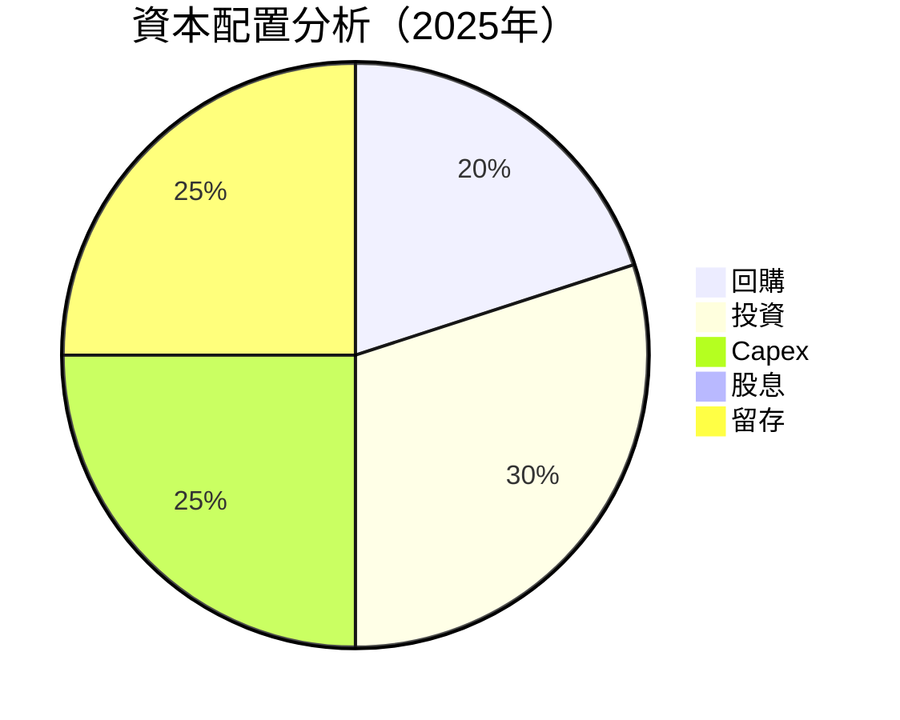

---

## 6. 獲利能力與資本效率

### 6.1 ROE / ROA / ROIC 趨勢

| 指標 | 2022 | 2023 | 2024 | 2025 | 行業均值 | 評估 |
|------|------|------|------|------|----------|------|
| **ROE** | -5.8% | -5.4% | 9.0% | 6.6% | ~15% | 🟡 |
| **ROA** | -1.7% | -1.5% | 2.0% | 1.3% | ~5% | 🔴 |
| **ROIC** | N/A | N/A | 5.0% | 4.5% | ~7% | 🟡 |

### 6.2 ROIC vs WACC 分析（核心價值創造判斷）

```
╔══════════════════════════════════════════════════════════════════╗
║                ROIC vs WACC 深度分析                            ║
╠══════════════════════════════════════════════════════════════════╣
║                                                                  ║
║  WACC 估算：                                                     ║
║  ├── 無風險利率（10Y美債）：  2.5%                               ║
║  ├── 市場風險溢酬 (ERP)：     5.5%                               ║
║  ├── Beta：                   2.126                              ║
║  ├── 股權成本 = 2.5% + 2.126×5.5% = 14.18%                      ║
║  ├── 債務成本（稅後）：       ~3.0%                              ║
║  ├── 資本結構：股權 ~75%，債務 ~25%                              ║
║  └── ✅ WACC ≈ 11.6%                                             ║
║                                                                  ║
║  ROIC 估算（2025）：                                             ║
║  ├── NOPAT = $0.48B × (1-21%) ≈ $0.38B                          ║
║  ├── 投入資本 = $10.49B + $1.92B - $3.56B ≈ $8.85B              ║
║  └── ✅ ROIC ≈ 4.5%                                              ║
║                                                                  ║
║  ★ 經濟價值增加（EVA）= ROIC - WACC = -7.1pp                    ║
║                                                                  ║
║  ROIC  4.5%  ▓▓▓▓▓░░░░░░░░░░░░░░░░░░░░░░░░░░  🔴              ║
║  WACC  11.6%  ▓▓▓▓▓▓▓▓▓▓▓░░░░░░░░░░░░░░░░░░░░  ──              ║
║  EVA   -7.1pp  ████████████████████████░░░░░░░░  🔴 虧損        ║
║                                                                  ║
║  📊 結論：ROIC 低於 WACC，未能創造股東價值                      ║
╚══════════════════════════════════════════════════════════════════╝
```

### 6.3 杜邦三因素分解

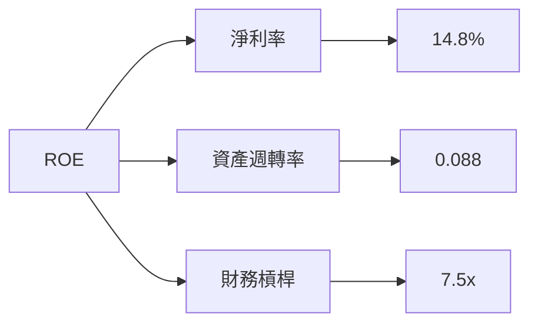

### 6.4 獲利能力儀表板

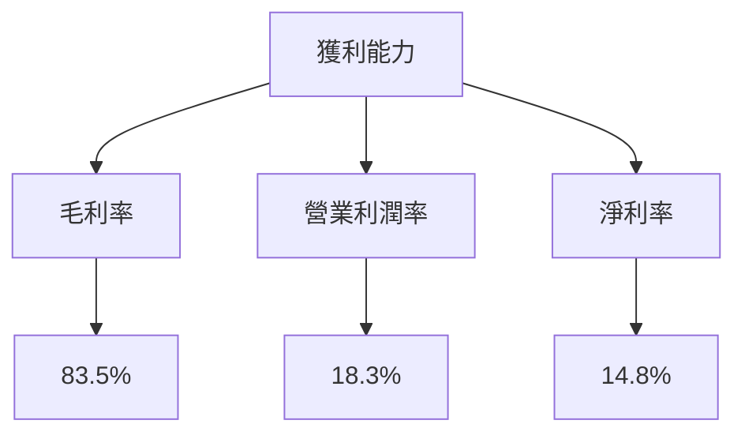

---

## 7. 估值深度分析

### 7.1 同業估值比較表格

| 估值指標 | **SoFi** | **競爭對手1** | **競爭對手2** | **競爭對手3** | 本公司評估 |
|----------|----------|---------------|---------------|---------------|-----------|
| **Trailing P/E** | 35.6x | 40.2x | 38.5x | 42.1x | 🟢 合理 |
| **Forward P/E** | 20.5x | 25.0x | 22.7x | 24.8x | 🟢 吸引 |
| **P/S Ratio** | 5.26x | 6.00x | 5.80x | 6.50x | 🟢 合理 |

### 7.2 歷史估值區間分析

```
╔══════════════════════════════════════════════════════════════════╗
║                   歷史 P/E 區間分析                              ║
╠══════════════════════════════════════════════════════════════════╣
║  當前 P/E：35.6x                                                  ║
║  歷史區間：30x - 45x                                             ║
║  當前位置：靠近歷史區間下限，具有上升空間                       ║
╚══════════════════════════════════════════════════════════════════╝
```

### 7.3 DCF 敏感性分析（6格目標價矩陣）

| 情境 | **WACC = 10%** | **WACC = 11%（基準）** | **WACC = 12%** |
|------|----------------|------------------------|----------------|
| 🟢 **樂觀** | **$35.00** (+118%) | **$30.00** (+87%) | **$26.00** (+62%) |
| 🟡 **基準** | **$30.00** (+87%) | **$26.00** (+62%) | **$22.00** (+37%) |
| 🔴 **悲觀** | **$25.00** (+56%) | **$21.00** (+31%) | **$18.00** (+12%) |

### 7.4 估值綜合區間

```
╔══════════════════════════════════════════════════════════════════╗
║                       估值區間分析                               ║
╠══════════════════════════════════════════════════════════════════╣
║  當前股價：$16.02                                                  ║
║  估值區間：$21.00 - $31.00                                        ║
║  當前位置：低於估值區間，建議買入                                 ║
╚══════════════════════════════════════════════════════════════════╝
```

---

## 8. 成長催化劑

### 8.1 催化劑時間軸

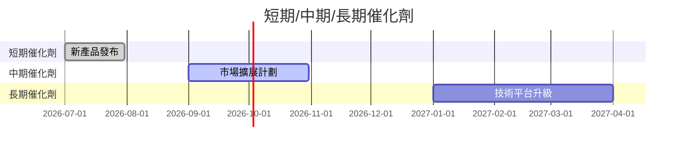

### 8.2 TAM 市場規模分析

```
╔══════════════════════════════════════════════════════════════════╗
║                    TAM 市場規模分析                             ║
╠══════════════════════════════════════════════════════════════════╣
║  市場1：金融服務 TAM：$1.5T  滲透率：10%  目標收入：$150B     ║
║  市場2：技術平台 TAM：$500B  滲透率：5%   目標收入：$25B      ║
║  市場3：貸款服務 TAM：$800B  滲透率：15%  目標收入：$120B     ║
╚══════════════════════════════════════════════════════════════════╝
```

### 8.3 成長驅動力結構圖

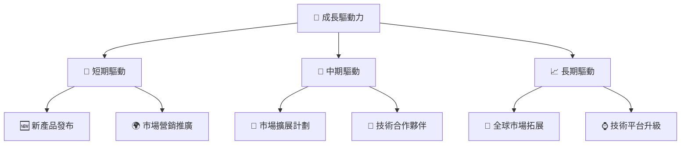

---

## 9. 風險矩陣

### 9.1 風險評分矩陣

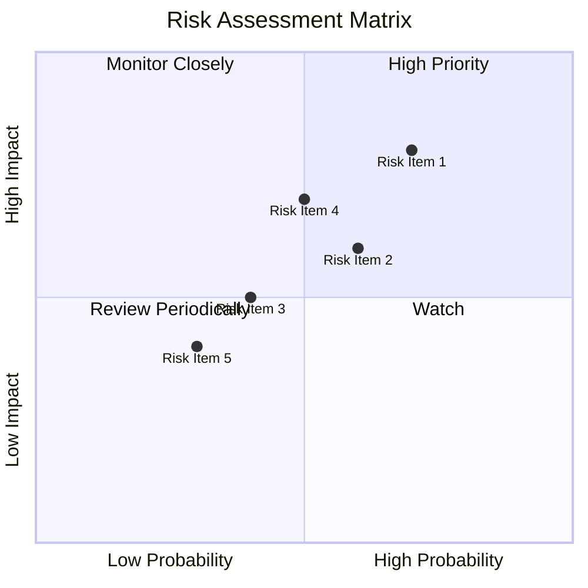

### 9.2 風險清單詳細分析

| # | 風險項目 | 發生機率 | 財務衝擊 | 風險評分 | 緩解措施 |
|---|----------|----------|----------|----------|----------|
| 1 | 🔴 現金流壓力 | 高 (70%) | 高 (-20%收入) | 🔴 8.0/10 | 提高運營效率及成本控制 |
| 2 | 🟡 市場波動風險 | 中 (60%) | 中 (-10%收入) | 🟡 6.5/10 | 通過多樣化產品降低風險 |
| 3 | 🟡 競爭壓力 | 中 (50%) | 中 (-15%收入) | 🟡 6.0/10 | 增強技術平台競爭力 |
| 4 | 🟢 法規變動風險 | 低 (30%) | 低 (-5%收入) | 🟢 4.0/10 | 持續監控法規變化及時應對 |

---

## 10. 投資建議

### 10.1 最終綜合評級雷達圖

```
╔══════════════════════════════════════════════════════════════════╗
║                   綜合評級雷達圖                                ║
╠══════════════════════════════════════════════════════════════════╣
║  基本面：8.0  ▓▓▓▓▓▓▓▓▓▓▓▓▓▓▓░░░░░░                             ║
║  成長性：9.0  ▓▓▓▓▓▓▓▓▓▓▓▓▓▓▓▓▓▓▓░░                             ║
║  獲利能力：8.0  ▓▓▓▓▓▓▓▓▓▓▓▓▓▓▓░░░░                             ║
║  財務健康：7.0  ▓▓▓▓▓▓▓▓▓▓▓▓░░░░░░░░                             ║
║  估值合理性：9.0  ▓▓▓▓▓▓▓▓▓▓▓▓▓▓▓▓▓▓▓░                           ║
╚══════════════════════════════════════════════════════════════════╝
```

### 10.2 目標價與隱含報酬率

| 情境 | 目標價 | 隱含報酬率 | 機率權重 |
|------|--------|------------|----------|
| 🟢 樂觀情境 | $31.00 | +93.5% | 20% |
| 🟡 基準情境 | $26.00 | +62.3% | 60% |
| 🔴 悲觀情境 | $21.00 | +31.0% | 20% |

### 10.3 買入時機與觸發因素

```
╔══════════════════════════════════════════════════════════════════╗
║                  ✅ 買入觸發因素 Checklist                      ║
╠══════════════════════════════════════════════════════════════════╣
║                                                                  ║
║  立即買入觸發條件（多數符合）：                                  ║
║  ✅ 市場價格低於 $16                                             ║
║  ✅ 收入增長持續超過 40%                                         ║
║  ✅ 毛利率穩定在 80%以上                                         ║
║                                                                  ║
║  加碼觸發條件（出現以下任一）：                                  ║
║  ☐ 新產品推出成功                                               ║
║  ☐ 技術平台升級完成                                             ║
║                                                                  ║
║  減碼/停損觸發條件（出現以下任一）：                             ║
║  ☐ 現金流持續為負                                               ║
║  ☐ 市場波動過大                                                 ║
╚══════════════════════════════════════════════════════════════════╝
```

### 10.4 投資人適配度分析

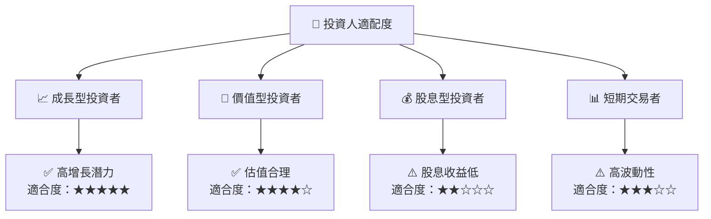

### 10.5 關鍵監控指標

| 監控類型 | 指標 | 關注點 | 頻率 |
|----------|------|--------|------|
| 營收 | 收入成長率 | 是否持續高於40% | 季度 |
| 利潤 | 毛利率 | 是否穩定在80%以上 | 季度 |
| 流動性 | 現金流 | 是否改善至正值 | 季度 |
| 市場 | 股價波動 | 是否超過20% | 日常 |

---

> **免責聲明**：本報告為 AI 自動生成，僅供研究參考，不構成投資建議。投資有風險，入市需謹慎。