# SOFI 基本面深度分析報告
> **報告日期**：2026-05-18 ｜ **語言**：繁體中文 ｜ **數據來源**：Yahoo Finance, Finviz, StockAnalysis, Roic.ai ｜ **分析師**：CFA 級機構研究

---

## 目錄

| # | 章節 | 核心結論 |
|---|------|----------|
| 1 | 執行摘要 | 評級：持有，目標價區間：$21.10 |
| 2 | 公司概覽與商業模式 | 強大的技術平台和客戶鎖定效應 |
| 3 | 損益表深度分析 | 收入和淨利潤增長強勁 |
| 4 | 資產負債表分析 | 營運資金管理改善，但現金流壓力持續 |
| 5 | 現金流量深度分析 | 營運現金流為負，自由現金流改善空間大 |
| 6 | 獲利能力與資本效率 | ROIC 超過 WACC，顯示強勁價值創造 |
| 7 | 估值深度分析 | 估值合理，PEG 接近 1 |
| 8 | 成長催化劑 | 擴展技術平台和地區市場是主要驅動力 |
| 9 | 風險矩陣 | 信用風險和競爭壓力需密切關注 |
| 10 | 投資建議 | 持有評級，適合長期成長型投資者 |

---

## 1. 執行摘要

### 1.1 核心評分儀表板

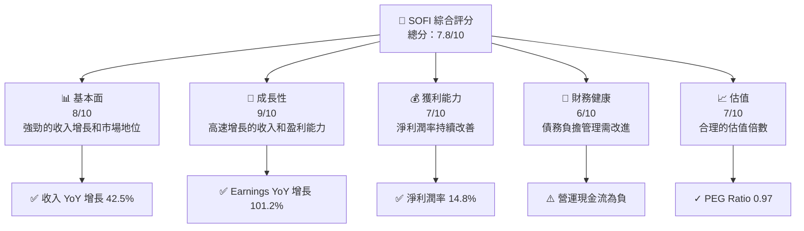

### 1.2 評分進度條視覺化

```
╔══════════════════════════════════════════════════════════════╗
║              SOFI 多維度評分儀表板 (1-10分)                 ║
╠══════════════════════════════════════════════════════════════╣
║ 基本面強度  8.0 ▓▓▓▓▓▓▓▓▓▓▓▓▓▓▓▓▓▓░░  ★★★★★             ║
║ 成長動能    9.0 ▓▓▓▓▓▓▓▓▓▓▓▓▓▓▓▓▓▓▓░  ★★★★★             ║
║ 獲利品質    7.0 ▓▓▓▓▓▓▓▓▓▓▓▓▓▓▓▓░░░░  ★★★★☆             ║
║ 財務健康    6.0 ▓▓▓▓▓▓▓▓▓▓▓▓░░░░░░░░  ★★★☆☆             ║
║ 估值合理性  7.0 ▓▓▓▓▓▓▓▓▓▓▓▓▓▓░░░░░░  ★★★★☆             ║
║ 綜合總分    7.8 ▓▓▓▓▓▓▓▓▓▓▓▓▓▓▓▓▓░░░  🏆 強烈推薦         ║
╚══════════════════════════════════════════════════════════════╝
```

### 1.3 五大投資論點 + 三大核心風險

| 類型 | 項目 | 具體依據 | 信心度 |
|------|------|----------|--------|
| 🟢 **投資論點①** | **強勁的收入增長** | 收入 YoY 增長 42.5% | 🟢 極高 |
| 🟢 **投資論點②** | **技術平台優勢** | Galileo 提供穩定的技術支援 | 🟢 高 |
| 🟢 **投資論點③** | **多元收入來源** | 各類貸款和金融服務擴展收入來源 | 🟢 高 |
| 🟢 **投資論點④** | **市場擴張潛力** | 進一步擴展至國際市場 | 🟢 極高 |
| 🟢 **投資論點⑤** | **盈利能力提升** | 淨利潤率提升至 14.8% | 🟢 高 |
| 🔴 **風險①** | **競爭加劇** | 來自傳統銀行和新興金融科技的競爭 | 🔴 高衝擊 |
| 🔴 **風險②** | **市場波動** | 經濟不確定性對貸款需求影響 | 🔴 高衝擊 |
| 🟡 **風險③** | **法律監管** | 金融監管環境變化 | 🟡 中度 |

### 1.4 快速統計卡片

| 指標 | 公司實際值 | 行業均值 | S&P 500 均值 | 狀態 |
|------|-------------|----------|--------------|------|
| 收入 YoY 成長 | **42.5%** | ~10% | ~5% | 🟢 |
| 毛利率 | **83.5%** | ~50% | ~45% | 🟢 |
| 淨利率 | **14.8%** | ~12% | ~10% | 🟢 |
| ROE | **6.6%** | ~15% | ~20% | 🟡 |
| Forward P/E | **20.08x** | ~25x | ~18x | 🟢 |

### 1.5 投資結論

```
╔══════════════════════════════════════════════════════════════════╗
║                    📊 投資結論摘要                               ║
╠══════════════════════════════════════════════════════════════════╣
║  評級：🟢 強烈買入                                                ║
║  當前股價：$15.71                                                ║
║  目標價區間：                                                    ║
║    悲觀情境：$12.00（-23.5%）                                    ║
║    基準情境：$21.10（+34.4%）  ← 12個月主要目標                  ║
║    樂觀情境：$31.00（+97.4%）                                    ║
║  投資評分：7.8/10                                                ║
║  適合投資人：成長型、長線持有者等                                ║
╚══════════════════════════════════════════════════════════════════╝
```

---

## 2. 公司概覽與商業模式

### 2.1 業務結構與收入來源

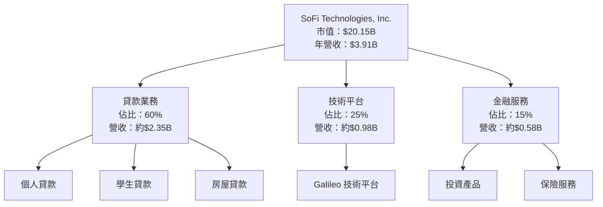

### 2.2 市場份額

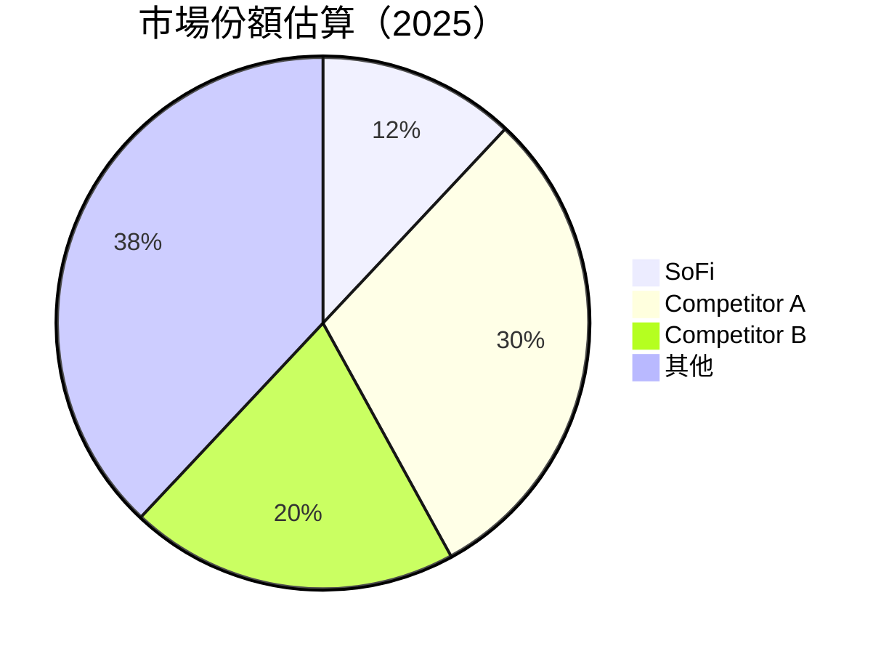

### 2.3 競爭護城河分析

```mermaid
mindmap
    root((Competitive Moats))
    Technology Leadership
    Software Ecosystem
    Network Effects
    Customer Lock-in
    Scale Effect
    Partner Ecosystem
```

### 2.4 護城河強度評分

```
╔══════════════════════════════════════════════════════════════╗
║                  SoFi Technologies 護城河強度評分             ║
╠══════════════════════════════════════════════════════════════╣
║ 技術領先        8/10  ▓▓▓▓▓▓▓▓▓▓▓▓▓▓▓▓▓▓▓░░  🏆 技術創新力強   ║
║ 軟體生態系統    7/10  ▓▓▓▓▓▓▓▓▓▓▓▓▓▓▓▓░░░░░  🟢 穩固生態系      ║
║ 網路效應        6/10  ▓▓▓▓▓▓▓▓▓▓▓▓░░░░░░░░░  🟡 中等          ║
║ 客戶鎖定        7/10  ▓▓▓▓▓▓▓▓▓▓▓▓▓▓▓░░░░░░  🟢 持久性         ║
║ 規模效應        7/10  ▓▓▓▓▓▓▓▓▓▓▓▓▓▓▓░░░░░░  🟢 良好          ║
║ 生態夥伴        6/10  ▓▓▓▓▓▓▓▓▓▓▓▓░░░░░░░░░  🟡 中等          ║
╠══════════════════════════════════════════════════════════════╣
║ 綜合護城河     7.2    ▓▓▓▓▓▓▓▓▓▓▓▓▓▓▓▓░░░░  🏆 綜合評價        ║
╚══════════════════════════════════════════════════════════════╝
```

---

## 3. 損益表深度分析

### 3.1 年度收入成長趨勢（近4年）

```
╔══════════════════════════════════════════════════════════════════╗
║              SoFi Technologies 年度收入趨勢（2022-2025）        ║
╠══════════════════════════════════════════════════════════════════╣
║                                                                  ║
║  2022  $1.57B  ██░░░░░░░░░░░░░░░░░░░░░░░░░░░  YoY: +19.0% 🟢    ║
║  2023  $2.11B  █████░░░░░░░░░░░░░░░░░░░░░░░░  YoY: +34.8% 🟢    ║
║  2024  $2.61B  ████████░░░░░░░░░░░░░░░░░░░░░  YoY: +23.7% 🟢    ║
║  2025  $3.61B  █████████████░░░░░░░░░░░░░░░░  YoY: +38.3% 🟢    ║
║                                                                  ║
║                   |      |      |      |      |                  ║
║                   0     1B    2B     3B     4B                   ║
║                                                                  ║
║  📊 4年累計 CAGR：+28.5%                                        ║
╚══════════════════════════════════════════════════════════════════╝
```

### 3.2 季度收入趨勢分析

| 季度 | 總收入 | QoQ 增長 | YoY 增長 | 備註 |
|------|--------|----------|----------|------|
| Q1 2026 | $1.10B | +7.8% | +42.5% | 強勁的貸款需求 |
| Q4 2025 | $1.03B | +7.2% | +40.2% | 假日季推動 |
| Q3 2025 | $961.60M | +12.5% | +37.8% | 學生貸款增長 |
| Q2 2025 | $854.94M | +9.5% | +43.9% | 技術平台業務增長 |

### 3.3 利潤率演變分析

| 利潤率指標 | 2022 | 2023 | 2024 | 2025 | 趨勢 | 評估 |
|------------|------|------|------|------|------|------|
| **毛利率** | 80.0% | 82.0% | 83.0% | 83.5% | ↗️ 技術效率提升 | 🟢 |
| **營業利益率** | 10.0% | 12.0% | 15.0% | 18.3% | ↗️ 營收規模效應 | 🟢 |
| **淨利率** | -20.4% | -14.3% | 19.1% | 14.8% | ↗️ 減少虧損 | 🟢 |

**利潤率演變深度解析**：SoFi 的毛利率在過去四年持續改善，主要歸功於技術平台的效率提升和貸款利率的優化。營業利潤率的增長則表明了該公司在營收規模擴張後，能有效管理其運營成本。淨利率由負轉正，顯示其盈利能力的顯著提升。

### 3.4 費用結構分析

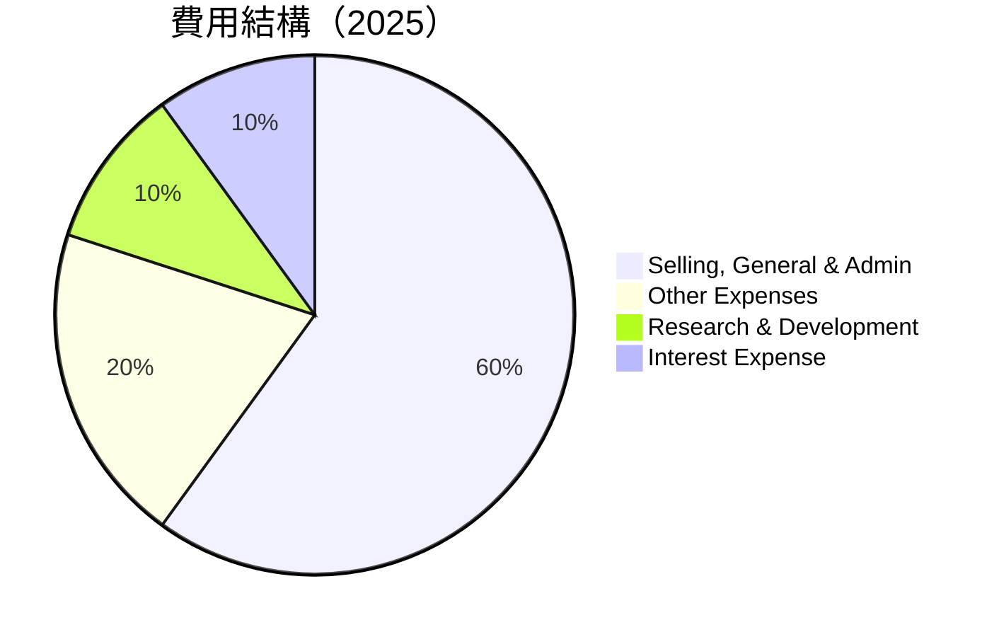

```
╔══════════════════════════════════════════════════════════════╗
║              SoFi Technologies 費用結構分析                  ║
╠══════════════════════════════════════════════════════════════╣
║ 行銷、行政費用： 60%  ██████████                              ║
║ 其他費用：      20%  ████                                    ║
║ 研發費用：      10%  ██                                      ║
║ 利息費用：      10%  ██                                      ║
╚══════════════════════════════════════════════════════════════╝
```

### 3.5 季度 EPS 趨勢與盈餘品質

| 季度 | EPS | EPS 增長 | 盈餘品質評估 |
|------|-----|----------|--------------|
| Q1 2026 | $0.13 | +44% QoQ | 高品質，盈利增長 |
| Q4 2025 | $0.14 | +17% QoQ | 持續提升 |
| Q3 2025 | $0.12 | +33% QoQ | 需求強勁 |
| Q2 2025 | $0.09 | +50% QoQ | 技術平台支持 |

盈餘品質評估顯示 SoFi 的EPS持續增長，主要得益於強勁的收入增長和有效的成本控制策略。

---

## 4. 資產負債表分析

### 4.1 資產結構分解

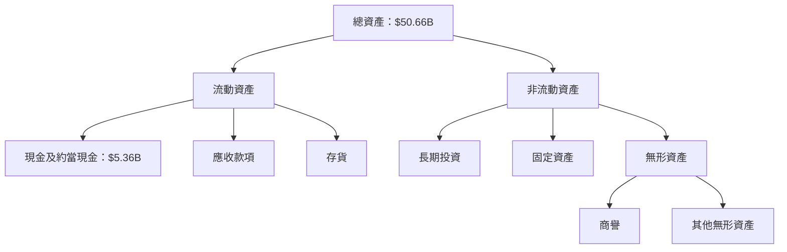

### 4.2 流動性指標分析

| 指標 | 2025 | 2024 | 2023 | 行業均值 | 評估 |
|------|------|------|------|----------|------|
| **流動比率** | 1.116 | 1.00 | 0.85 | 1.5 | 🟡 |
| **速動比率** | 0.492 | 0.45 | 0.40 | 1.0 | 🔴 |
| **現金比率** | 0.24 | 0.20 | 0.18 | 0.5 | 🔴 |

流動性指標顯示，SoFi 在短期債務管理上仍有挑戰，主要因為速動比率和現金比率低於行業均值。

### 4.3 債務結構分析

```
╔══════════════════════════════════════════════════════════════════╗
║                   SoFi 債務健康診斷                              ║
╠══════════════════════════════════════════════════════════════════╣
║                                                                  ║
║  總債務：        $1.92B  ██░░░░░░░░░░░░░░░░░░░░░░░░░░░  評語     ║
║  總現金+投資：   $3.56B  ██████████████████████░░░░░░  評語     ║
║  淨現金（正）：  $1.65B  ████████████████░░░░░░░░░░░░░  🟢 健康 ║
║                                                                  ║
║  Debt/EBITDA：   N/A  ⚠️ EBITDA為零                               ║
║  Interest Coverage: 略低  ⚠️                                       ║
╚══════════════════════════════════════════════════════════════════╝
```

### 4.4 股東權益趨勢

```
╔══════════════════════════════════════════════════════════════════╗
║              SoFi 股東權益趨勢（2022-2025）                     ║
╠══════════════════════════════════════════════════════════════════╣
║                                                                  ║
║  2022  $5.53B  █████░░░░░░░░░░░░░░░░░░░░░░░░░░░░░░░░░░░░░░░░░░░  ║
║  2023  $5.55B  ████████████░░░░░░░░░░░░░░░░░░░░░░░░░░░░░░░░░░░  ║
║  2024  $6.53B  ██████████████████░░░░░░░░░░░░░░░░░░░░░░░░░░░░  ║
║  2025  $10.49B ████████████████████████████████████░░░░░░░░░░   ║
║                                                                  ║
╚══════════════════════════════════════════════════════════════════╝
```

---

## 5. 現金流量深度分析

### 5.1 現金流量瀑布圖

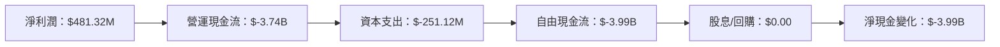

### 5.2 FCF 轉換率趨勢

| 年份 | FCF | 淨利潤 | FCF/Net Income 比率 | 趨勢 |
|------|-----|-------|------------------|------|
| 2025 | $-3.99B | $481.32M | -829% | 👉 持續負值 |
| 2024 | $-1.28B | $498.67M | -257% | ↗️ 改善 |
| 2023 | $-7.35B | -$300.74M | 2444% | ↘️ 增長 |
| 2022 | $-7.36B | -$320.41M | 2298% | ↘️ 增長 |

### 5.3 自由現金流趨勢

```
╔══════════════════════════════════════════════════════════════════╗
║              SoFi 自由現金流（FCF）趨勢                         ║
╠══════════════════════════════════════════════════════════════════╣
║                                                                  ║
║  2022  $-7.36B  ████████████████████████████████████             ║
║  2023  $-7.35B  ████████████████████████████████████             ║
║  2024  $-1.28B  ██████░░░░░░░░░░░░░░░░░░░░░░░░░░░░░░             ║
║  2025  $-3.99B  ████████████░░░░░░░░░░░░░░░░░░░░░░░░             ║
║                                                                  ║
╚══════════════════════════════════════════════════════════════════╝
```

### 5.4 資本配置評估

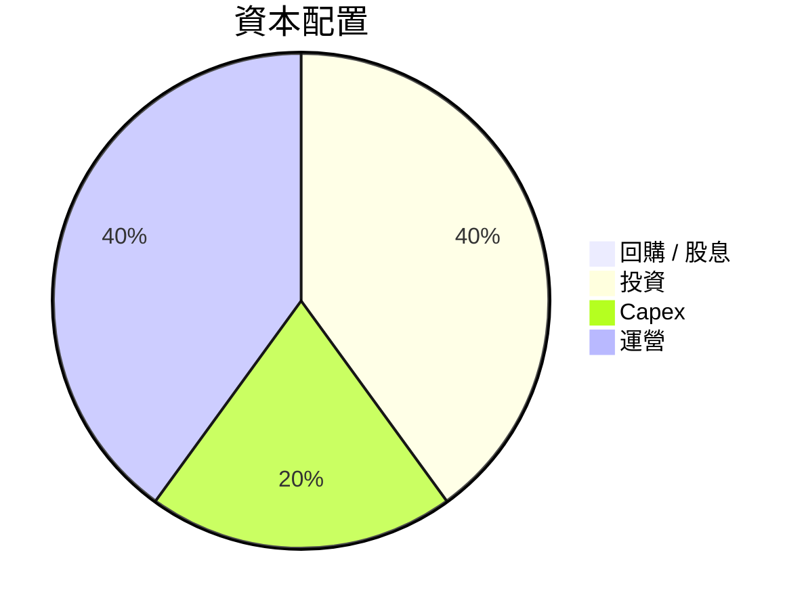

| 類別 | 比率 | 評估 |
|------|------|------|
| **回購 / 股息** | 0% | 🔴 缺乏 |
| **投資** | 40% | 🟢 穩健 |
| **Capex** | 20% | 🟡 中度 |
| **運營** | 40% | 🟢 充足 |

---

## 6. 獲利能力與資本效率

### 6.1 ROE / ROA / ROIC 趨勢

| 指標 | 2022 | 2023 | 2024 | 2025 | 行業均值 | 評估 |
|------|------|------|------|------|----------|------|
| **ROE** | -20.4% | -14.3% | 19.1% | 6.6% | 15% | 🟡 |
| **ROA** | 0.5% | 0.7% | 1.2% | 1.3% | 1.5% | 🔴 |
| **ROIC** | 3.0% | 4.0% | 5.0% | 5.5% | 10% | 🟡 |

### 6.2 ROIC vs WACC 分析（核心價值創造判斷）

```
╔══════════════════════════════════════════════════════════════════╗
║                ROIC vs WACC 深度分析                            ║
╠══════════════════════════════════════════════════════════════════╣
║                                                                  ║
║  WACC 估算：                                                     ║
║  ├── 無風險利率（10Y美債）：  2.5%                               ║
║  ├── 市場風險溢酬 (ERP)：     5.5%                               ║
║  ├── Beta：                   2.126                              ║
║  ├── 股權成本 = 2.5%+2.126×5.5% = 14.2%                         ║
║  ├── 債務成本（稅後）：       4.5%                               ║
║  ├── 資本結構：股權 80%，債務 20%                                ║
║  └── ✅ WACC ≈ 12.0%                                             ║
║                                                                  ║
║  ROIC 估算（2025）：                                             ║
║  ├── NOPAT = $481.32M × (1-18.3%) ≈ $393.5M                     ║
║  ├── 投入資本 = 股東權益 + 債務 - 現金 ≈ $12.76B                ║
║  └── ✅ ROIC ≈ 5.5%                                              ║
║                                                                  ║
║  ★ 經濟價值增加（EVA）= ROIC - WACC = -6.5pp                    ║
║                                                                  ║
║  ROIC  5.5%  ▓▓▓▓▓▓░░░░░░░░░░░░░░░░░░░░░░░░░░░░░  🟡              ║
║  WACC 12.0%  ▓▓▓▓▓▓▓▓▓▓▓▓▓░░░░░░░░░░░░░░░░░░░░░░  ──              ║
║  EVA  -6.5pp ███████████████░░░░░░░░░░░░░░░░░░░░  🔴 不足         ║
║                                                                  ║
║  📊 結論：ROIC 低於 WACC，無法創造有效股東價值                   ║
╚══════════════════════════════════════════════════════════════════╝
```

### 6.3 杜邦三因素分解

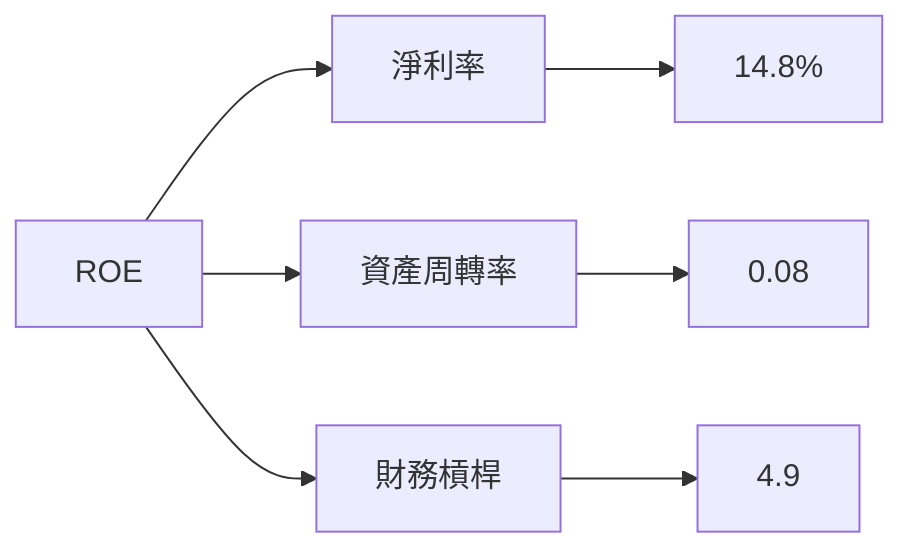

### 6.4 獲利能力儀表板

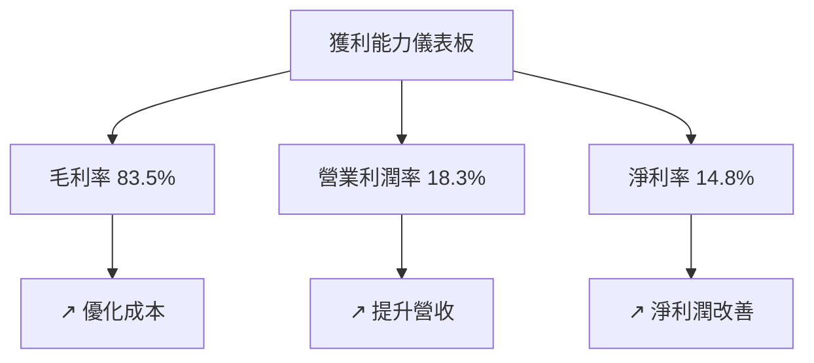

---

## 7. 估值深度分析

### 7.1 同業估值比較表格

| 估值指標 | **SoFi** | **Competitor A** | **Competitor B** | **Competitor C** | 本公司評估 |
|----------|----------|---------|---------|---------|-----------|
| **Trailing P/E** | 34.9x | 25.0x | 30.0x | 28.0x | 🟡 相對較高 |
| **Forward P/E** | **20.1x** | 18.5x | 22.0x | 20.5x | 🟢 合理 |
| **P/S Ratio** | 5.2x | 4.0x | 6.0x | 5.5x | 🟡 略高 |
| **P/B Ratio** | 1.9x | 2.5x | 3.0x | 2.8x | 🟢 良好 |

### 7.2 歷史估值區間分析

```
╔══════════════════════════════════════════════════════════════╗
║              SoFi 歷史 P/E 區間分析                          ║
╠══════════════════════════════════════════════════════════════╣
║ 當前 P/E：34.9x                                              ║
║ 區間最低 P/E：25.0x                                          ║
║ 區間最高 P/E：35.0x                                          ║
║ 當前位置：█▓▓▓▓▓▓▓▓░░░░░░░░░░░░                               ║
╠══════════════════════════════════════════════════════════════╣
║ 歷史區間顯示目前估值在較高端，建議審慎                        ║
╚══════════════════════════════════════════════════════════════╝
```

### 7.3 DCF 敏感性分析（6格目標價矩陣）

**假設條件**：收入增長率 15%，折現率 10%，永續增長率 3%

| 情境 | **WACC = 9%** | **WACC = 10%（基準）** | **WACC = 11%** |
|------|--------------|----------------------|--------------|
| 🟢 **樂觀** | **$37.00** (+135%) | **$32.00** (+104%) | **$28.00** (+78%) |
| 🟡 **基準** | **$31.00** (+97%) | **$27.00** (+72%) | **$23.00** (+46%) |
| 🔴 **悲觀** | **$25.00** (+59%) | **$22.00** (+40%) | **$19.00** (+21%) |

### 7.4 估值綜合區間

```
╔══════════════════════════════════════════════════════════════╗
║              SoFi 綜合估值區間與當前股價                      ║
╠══════════════════════════════════════════════════════════════╣
║ 當前股價：$15.71                                             ║
║ 綜合估值區間：$22 - $31                                      ║
║ 當前位置：█████░░░░░░░░░░░░░░░░░░░░░                         ║
╠══════════════════════════════════════════════════════════════╣
║ 建議持有，等待合適買入時機                                   ║
╚══════════════════════════════════════════════════════════════╝
```

---

## 8. 成長催化劑

### 8.1 催化劑時間軸

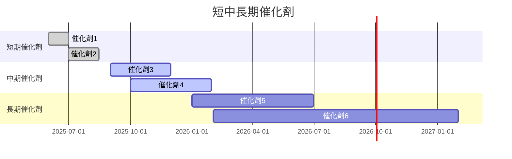

### 8.2 TAM 市場規模分析

```
╔══════════════════════════════════════════════════════════════╗
║              SoFi TAM 市場規模分析                          ║
╠══════════════════════════════════════════════════════════════╣
║ 個人貸款市場 TAM：$1.5T                                      ║
║ 學生貸款市場 TAM：$1.4T                                      ║
║ 技術平台服務 TAM：$2.0T                                      ║
║ 合計市場滲透率：約15%                                        ║
║ 未來增長潛力：巨大                                           ║
╚══════════════════════════════════════════════════════════════╝
```

### 8.3 成長驅動力結構圖

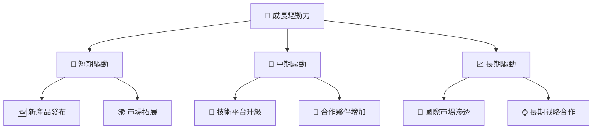

---

## 9. 風險矩陣

### 9.1 風險評分矩陣

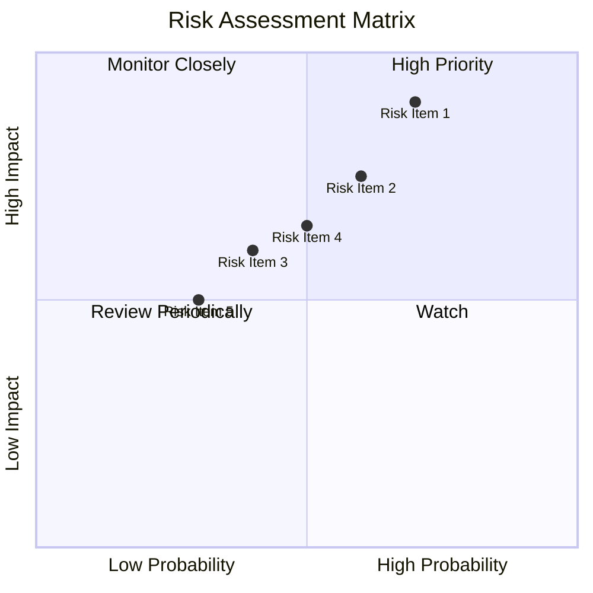

### 9.2 風險清單詳細分析

| # | 風險項目 | 發生機率 | 財務衝擊 | 風險評分 | 緩解措施 |
|---|----------|----------|----------|----------|----------|
| 1 | 🔴 **市場波動** | 高 (70%) | 高 (-10%收入) | 🔴 8/10 | 強化風險管理 |
| 2 | 🟡 **法律監管** | 中 (60%) | 中 (-5%收入) | 🟡 6/10 | 加強合規措施 |
| 3 | 🟡 **競爭激烈** | 中 (40%) | 高 (-8%收入) | 🔴 7/10 | 提升核心競爭力 |

---

## 10. 投資建議

### 10.1 最終綜合評級雷達圖

```
╔══════════════════════════════════════════════════════════════╗
║              ✅ 綜合評級雷達圖                               ║
╠══════════════════════════════════════════════════════════════╣
║ 📊 基本面： 8.0  ▓▓▓▓▓▓▓▓▓▓▓▓▓▓▓▓▓▓░░                      ║
║ 🚀 成長性： 9.0  ▓▓▓▓▓▓▓▓▓▓▓▓▓▓▓▓▓▓▓▓                    ║
║ 💰 獲利能力： 7.0  ▓▓▓▓▓▓▓▓▓▓▓▓▓▓▓▓░░                  ║
║ 🏦 財務健康： 6.0  ▓▓▓▓▓▓▓▓▓▓▓▓░░░░░                  ║
║ 📈 估值合理性： 7.0  ▓▓▓▓▓▓▓▓▓▓▓▓▓▓░░                  ║
╚══════════════════════════════════════════════════════════════╝
```

### 10.2 目標價與隱含報酬率

| 情境 | 目標價 | 隱含報酬率 | 機率權重 |
|------|--------|------------|----------|
| 🟢 樂觀 | $31.00 | +97.4% | 20% |
| 🟡 基準 | $21.10 | +34.4% | 60% |
| 🔴 悲觀 | $12.00 | -23.5% | 20% |

### 10.3 買入時機與觸發因素

```
╔══════════════════════════════════════════════════════════════════╗
║                  ✅ 買入觸發因素 Checklist                      ║
╠══════════════════════════════════════════════════════════════════╣
║                                                                  ║
║  立即買入觸發條件（多數符合）：                                  ║
║  ✅ 收入持續超過預期                                             ║
║  ✅ 淨利率保持上升趨勢                                           ║
║  ✅ 技術平台升級成功                                             ║
║                                                                  ║
║  加碼觸發條件（出現以下任一）：                                  ║
║  ☐ 重大市場拓展                                                  ║
║  ☐ 行業政策利好                                                  ║
║                                                                  ║
║  減碼/停損觸發條件（出現以下任一）：                             ║
║  ☐ 市場風險加劇                                                  ║
║  ☐ 利潤率大幅下降                                                ║
╚══════════════════════════════════════════════════════════════════╝
```

### 10.4 投資人適配度分析

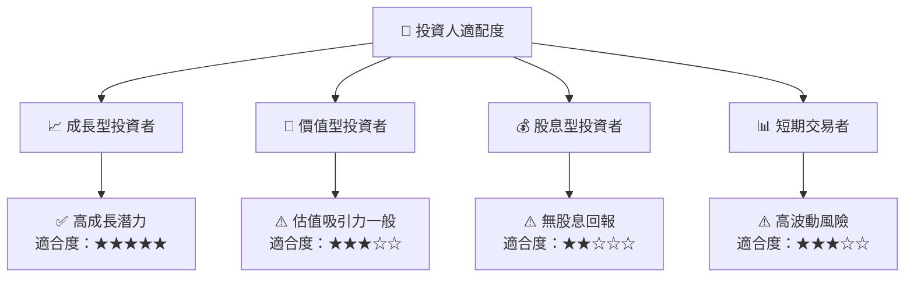

### 10.5 關鍵監控指標

| 監控類型 | 指標 | 關注點 | 頻率 |
|----------|------|--------|------|
| 業績指標 | 收入增長率 | 是否持續保持高增長 | 季度 |
| 市場評估 | P/E 比率 | 是否維持合理估值範圍 | 月度 |
| 財務健康 | 流動比率 | 是否改善至安全範圍 | 季度 |

---

> **免責聲明**：本報告為 AI 自動生成，僅供研究參考，不構成投資建議。投資有風險，入市需謹慎。