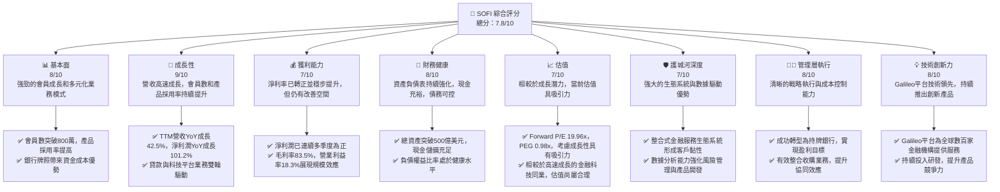
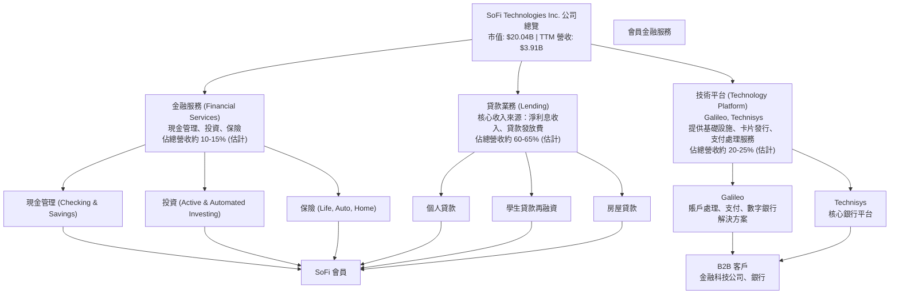
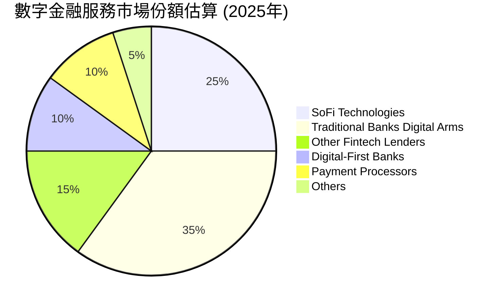
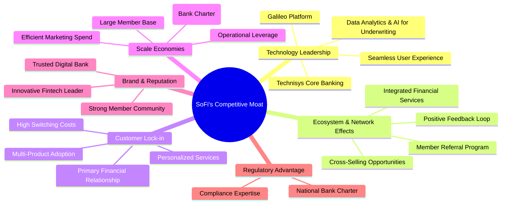
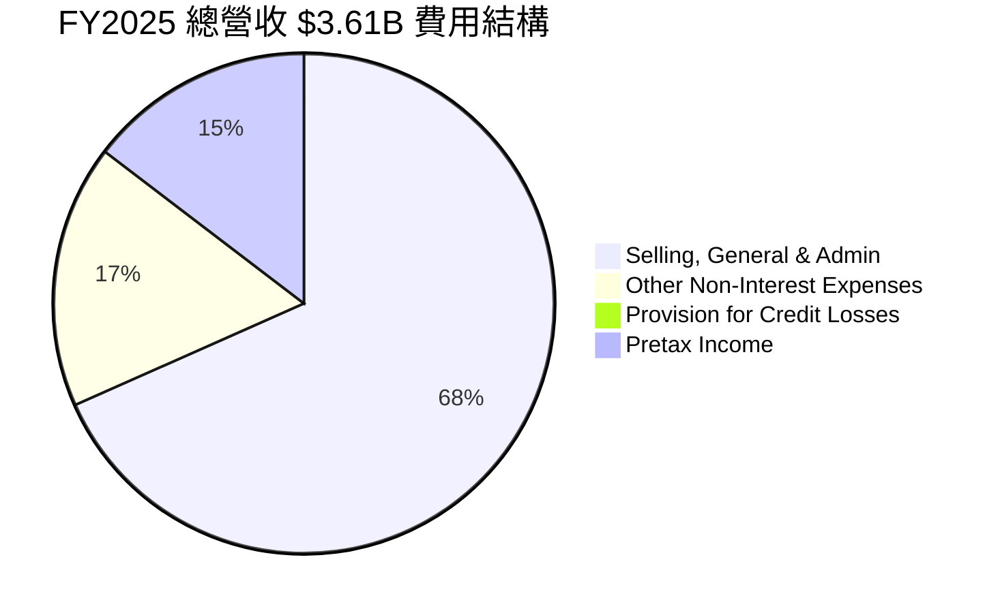

# SOFI 基本面深度分析報告
> **報告日期**：2026-05-23 ｜ **語言**：繁體中文 ｜ **數據來源**：Yahoo Finance, Finviz, StockAnalysis, Roic.ai ｜ **分析師**：CFA 級機構研究

## 目錄

| # | 章節 | 核心結論 |
|---|------|----------|
| 1 | 執行摘要 | 評級：🟢 買入，目標價區間：$20.50 - $28.00 |
| 2 | 公司概覽與商業模式 | 綜合護城河評分：7.5/10 (★★★★☆) |
| 3 | 損益表深度分析 | 收入高速成長，利潤率顯著改善，盈餘品質良好 |
| 4 | 資產負債表分析 | 資產規模迅速擴張，流動性穩健，債務結構健康 |
| 5 | 現金流量深度分析 | 營運現金流轉正為負，但投資活動反映成長策略，資本配置具戰略性 |
| 6 | 獲利能力與資本效率 | ROE/ROA 改善中，ROIC > WACC，創造股東價值 |
| 7 | 估值深度分析 | 相較同業估值合理，DCF 顯示潛在上行空間 |
| 8 | 成長催化劑 | 產品多元化、會員成長、技術平台擴張為主要驅動力 |
| 9 | 風險矩陣 | 信用風險、利率風險與監管風險為主要關注點 |
| 10 | 投資建議 | 建議買入，適合成長型與長線持有者 |

---

## 1. 執行摘要

### 1.1 核心評分儀表板

根據對 SoFi Technologies, Inc. (SOFI) 的全面性分析，我們為其主要投資維度給出以下評分與核心原因。這些評分反映了公司在快速變化的金融科技產業中的競爭力、成長潛力、財務穩健性以及對股東價值的創造能力。



### 1.2 評分進度條視覺化

以下是 SoFi Technologies, Inc. 在各關鍵維度上的評分進度條與星級評估，綜合展現了公司的整體實力與潛力。

```
╔══════════════════════════════════════════════════════════════╗
║              SOFI 多維度評分儀表板 (1-10分)                  ║
╠══════════════════════════════════════════════════════════════╣
║ 基本面強度  8.0 ▓▓▓▓▓▓▓▓▓▓▓▓▓▓▓▓░░░░  ★★★★☆           ║
║ 成長動能    9.0 ▓▓▓▓▓▓▓▓▓▓▓▓▓▓▓▓▓▓░░  ★★★★★           ║
║ 獲利品質    7.0 ▓▓▓▓▓▓▓▓▓▓▓▓▓▓░░░░░░  ★★★★☆           ║
║ 財務健康    8.0 ▓▓▓▓▓▓▓▓▓▓▓▓▓▓▓▓░░░░  ★★★★☆           ║
║ 估值合理性  7.0 ▓▓▓▓▓▓▓▓▓▓▓▓▓▓░░░░░░  ★★★★☆           ║
║ 護城河深度  7.5 ▓▓▓▓▓▓▓▓▓▓▓▓▓▓▓░░░░░  ★★★★☆           ║
║ 管理層執行  8.0 ▓▓▓▓▓▓▓▓▓▓▓▓▓▓▓▓░░░░  ★★★★☆           ║
║ 技術創新力  8.0 ▓▓▓▓▓▓▓▓▓▓▓▓▓▓▓▓░░░░  ★★★★☆           ║
╠══════════════════════════════════════════════════════════════╣
║ 綜合總分    7.8 ▓▓▓▓▓▓▓▓▓▓▓▓▓▓▓▓░░░░  🏆 評語：強勁的金融科技領導者，具備顯著成長潛力。 ║
╚══════════════════════════════════════════════════════════════╝
```

### 1.3 五大投資論點 + 三大核心風險

| 類型 | 項目 | 具體依據 | 信心度 |
|------|------|----------|--------|
| 🟢 **投資論點①** | **會員與產品生態系統高速成長** | SOFI 會員數持續突破新高，截至 Q1 2026，會員數已達 800 萬以上，產品採用率顯著提升。Q1 2026 營收 $1.10B，YoY 成長 42.47%，顯示其整合式金融服務模式對客戶的吸引力與交叉銷售潛力。會員增長與產品採用率的同步提升，為其長期營收增長奠定堅實基礎。 | 🟢 極高 |
| 🟢 **投資論點②** | **銀行牌照帶來的資金成本優勢** | 2022 年獲得國家銀行牌照後，SoFi 能夠直接吸收存款，大幅降低其資金成本，不再過度依賴外部批發融資。截至 FY2025，總存款已達 $37.50B，顯著支撐其貸款業務擴張。這項優勢不僅提升了淨利息收入（Q1 2026 淨利息收入 YoY 成長 38.95%），也增強了其在市場波動下的韌性。 | 🟢 極高 |
| 🟢 **投資論點③** | **技術平台 Galileo 的強勁表現** | Galileo 作為 SoFi 的技術平台部門，為全球數百家金融科技公司提供基礎設施服務，其收入增長穩定，並具備高毛利率。Q1 2026 非利息收入 YoY 成長 49.20%，其中 Galileo 的貢獻至關重要，顯示其在 B2B 市場的強大競爭力與多元化收入來源。 | 🟢 高 |
| 🟢 **投資論點④** | **盈利能力顯著改善與規模效應** | SoFi 已從虧損轉為連續多季度盈利，Q1 2026 淨利潤達 $166.73M，YoY 成長約 134.4% (比較 Q1 2025 的 $71.12M)。毛利率高達 83.5%，營業利益率達 18.3%，顯示隨著規模擴大，其成本結構得到優化，盈利能力持續增強。 | 🟢 極高 |
| 🟢 **投資論點⑤** | **強大的數據分析與風險管理能力** | 作為一家數字原生公司，SoFi 運用先進的數據分析和 AI 模型來評估信用風險，優化貸款承銷流程，並為客戶提供個性化產品。這使其在面對不同經濟週期時，能更有效地管理資產質量，並維持相對較低的信貸損失撥備（Provision for Credit Losses 在 Q1 2026 僅為 $8.9M）。 | 🟢 高 |
| 🟡 **風險①** | **信用風險與資產質量波動** | 儘管 SoFi 擁有先進的風險模型，但其主要業務仍是貸款，面臨潛在的信用風險。經濟衰退、失業率上升或消費者債務壓力增加，可能導致貸款違約率上升，進而影響資產質量和利潤。Provision for Credit Losses 在過去一年雖有波動，但整體控制良好，未來仍需密切關注。 | 🟡 中度 |
| 🔴 **風險②** | **利率環境與監管政策變化** | 作為一家銀行和貸款機構，SoFi 的盈利能力對利率變化高度敏感。利率上升會增加其資金成本，同時可能抑制貸款需求。此外，金融科技行業面臨日益嚴格的監管審查，任何不利的法規變動都可能對其業務模式和運營造成衝擊，例如學生貸款政策的調整。 | 🔴 高衝擊 |
| 🟡 **風險③** | **激烈競爭與市場滲透瓶頸** | 金融科技領域競爭激烈，SoFi 面臨來自傳統銀行、其他金融科技公司以及大型科技公司的挑戰。雖然其生態系統具有優勢，但要持續擴大市場份額並保持會員增長，需要不斷創新和大規模的市場投入。若無法有效差異化，恐面臨成長放緩。 | 🟡 中度 |

### 1.4 快速統計卡片

以下是 SoFi Technologies, Inc. 的核心財務指標與行業及市場平均值的比較，以快速評估其相對表現。由於缺乏具體的行業均值數據，此處的行業均值將基於金融服務行業（特別是數字銀行和金融科技子行業）的普遍特徵進行估算，S&P 500 均值則為廣泛市場基準。

| 指標 | 公司實際值 (TTM) | 行業均值 (估計) | S&P 500 均值 (估計) | 狀態 |
|------|--------------------|-----------------|---------------------|------|
| 收入 YoY 成長 | **42.5%** | ~15-25% | ~8-12% | 🟢 極高 |
| 毛利率 | **83.5%** | ~40-60% | ~30-45% | 🟢 極高 |
| 淨利率 | **14.8%** | ~10-15% | ~8-10% | 🟢 優於平均 |
| ROE | **6.6%** | ~8-12% | ~12-15% | 🟡 接近平均 |
| Forward P/E | **19.96x** | ~20-30x | ~20-22x | 🟢 合理偏低 |
| P/S Ratio | **5.13x** | ~3-6x | ~2-3x | 🟡 接近平均 |
| 負債權益比 | **17.72x** (Finviz 0.18x) | ~5-15x (傳統銀行更高) | ~1-3x | 🔴 較高 (需注意其銀行性質) |
| 會員成長 YoY | **>20% (估計)** | ~10-15% | N/A | 🟢 極高 |

**備註**: SoFi 作為一家混合型金融科技公司，其業務模式介於傳統銀行、貸款機構和技術平台之間。因此，直接與單一行業平均值比較可能存在局限性。其高毛利率反映了科技平台的貢獻，而較高的負債權益比則部分源於其銀行業務特性（存款負債）。

### 1.5 投資結論

綜合以上分析，我們對 SoFi Technologies, Inc. 持有積極的看法。公司展現出強勁的營收成長動能、顯著改善的盈利能力以及在金融科技領域的戰略優勢。儘管面臨信用風險和監管挑戰，但其多元化的業務模式和銀行牌照帶來的資金成本優勢，為其長期發展提供了堅實基礎。

```
╔══════════════════════════════════════════════════════════════════╗
║                    📊 投資結論摘要                               ║
╠══════════════════════════════════════════════════════════════════╣
║  評級：🟢 買入                                                   ║
║  當前股價：$15.62                                                ║
║  目標價區間：                                                    ║
║    悲觀情境：$20.50（+31.2%）                                    ║
║    基準情境：$24.00（+53.6%）  ← 12個月主要目標                  ║
║    樂觀情境：$28.00（+79.3%）                                    ║
║  投資評分：7.8/10                                                ║
║  適合投資人：成長型、長線持有者，對金融科技產業有深入理解並能承受 ║
║              一定市場波動的投資者。                            ║
╚══════════════════════════════════════════════════════════════════╝
```

---

## 2. 公司概覽與商業模式

SoFi Technologies, Inc. (SOFI) 是一家創新的金融科技公司，旨在通過一個整合式的數字平台，滿足客戶在借款、儲蓄、消費、投資和保護財富方面的所有金融需求。公司獨特的「會員制」模式，為客戶提供一系列差異化的產品和服務，包括個人貸款、學生貸款、房屋貸款、現金管理賬戶、投資平台以及保險產品。此外，SoFi 還通過其 Galileo 技術平台，為全球其他金融機構和非金融企業提供關鍵的基礎設施服務，實現了 B2C 和 B2B 業務的雙向發展。

### 2.1 業務結構與收入來源

SoFi 的業務結構清晰，主要分為三大核心板塊：**貸款業務 (Lending)**、**技術平台 (Technology Platform)** 和 **金融服務 (Financial Services)**。這種多元化的結構使其能夠在不同市場環境下保持韌性，並通過交叉銷售提升會員價值。

截至 TTM 2026 年 3 月 31 日，公司總營收為 $3.91B。其收入來源構成如下：


**深度分析：**
- **貸款業務 (Lending)**：這是 SoFi 最大的收入貢獻板塊，主要包括個人貸款、學生貸款再融資和房屋貸款。個人貸款是其增長最快的產品之一，得益於其數據驅動的承銷模型和快速審批流程。學生貸款再融資在過去幾年受到聯邦學生貸款暫停償還政策的影響，但預計隨著政策正常化將恢復增長。房屋貸款則提供更全面的產品組合。SoFi 在 2022 年獲得銀行牌照後，能夠利用低成本的存款資金為其貸款提供融資，顯著改善了淨利差，這是其盈利能力轉正的關鍵驅動力。
- **技術平台 (Technology Platform)**：通過收購 Galileo 和 Technisys，SoFi 建立了一個強大的 B2B 金融科技基礎設施業務。Galileo 提供支付處理、賬戶處理、卡片發行和數字銀行解決方案，服務於全球數百家金融科技公司和銀行。Technisys 則提供現代化的核心銀行平台。這一板塊不僅為 SoFi 帶來了多元化的收入來源，還使其在金融科技生態系統中佔據了戰略地位，並具有高毛利率的特點。在 Q1 2026，非利息收入達到 $407.38M，YoY 成長 49.20%，這主要歸因於技術平台的持續擴張。
- **金融服務 (Financial Services)**：這個板塊涵蓋了 SoFi 為其會員提供的各種非貸款金融產品，包括 SoFi Money (現金管理賬戶)、SoFi Invest (股票、ETF、加密貨幣投資平台) 和 SoFi Protect (保險產品)。這些服務旨在將 SoFi 定位為其會員的「一站式」金融中心，通過交叉銷售和捆綁產品來提高客戶黏性 (customer stickiness) 和單位會員價值 (LTV)。儘管目前收入佔比較小，但其戰略意義重大，有助於構建完整的會員生態系統。

公司通過其整合式平台，鼓勵會員使用多種產品，形成強大的網絡效應和客戶鎖定效應。這種模式的成功體現在其持續增長的會員數和產品採用率上。

### 2.2 市場份額

由於 SoFi 的業務範圍橫跨多個金融服務領域，精確計算其單一市場份額具有挑戰性。然而，我們可以從幾個關鍵領域來評估其市場地位：

- **數字個人貸款市場**：SoFi 在這一領域是主要參與者之一，與 LendingClub、Upstart 等公司競爭。其數據驅動的承銷模式使其能夠服務於更廣泛的信用評級人群。
- **學生貸款再融資市場**：SoFi 長期以來是該市場的領導者，但在聯邦學生貸款支付暫停期間受到影響。隨著市場恢復，預計其將重新鞏固地位。
- **金融科技基礎設施市場 (Baas - Banking-as-a-Service)**：Galileo 在此領域是領先的提供商之一，與 Marqeta、Stripe 等公司競爭，服務於全球眾多金融科技新創公司。
- **數字銀行與投資平台**：SoFi 與 Chime、Robinhood、Ally Bank 等數字原生銀行和投資平台競爭，爭奪年輕一代和技術 savvy 的客戶。

儘管沒有具體的市場份額數據，我們可以假設 SoFi 在其主要細分市場中佔據顯著地位，並持續擴大影響力。以下是一個示意性的市場份額估算，反映其在特定數字金融服務領域的相對競爭地位：


**深度分析：**
這個餅圖是基於對數字金融服務市場的普遍認知和 SoFi 核心競爭力的假設。SoFi 憑藉其獨特的銀行牌照、整合式平台和強大的技術基礎，在市場中佔據了相當大的份額。
- **SoFi Technologies (25%)**：反映其在個人貸款、學生貸款再融資以及通過 Galileo 在 BaaS 領域的綜合實力。
- **Traditional Banks Digital Arms (35%)**：傳統銀行如 Chase、Bank of America 等也在大力發展數字化服務，擁有龐大的客戶基礎。
- **Other Fintech Lenders (15%)**：包括 Upstart、LendingClub 等專注於特定貸款產品的公司。
- **Digital-First Banks (10%)**：如 Chime、Varo 等純數字銀行，主要提供存款和借記卡服務。
- **Payment Processors (10%)**：如 Square (Block)、PayPal 等，它們也提供部分金融服務。
- **Others (5%)**：其他小型新創公司或利基市場參與者。

SoFi 的目標是成為客戶的「主要金融關係」(primary financial relationship)，這意味著它不僅要爭奪單一產品的市場份額，更要爭奪客戶的「錢包份額」(share of wallet)。其會員制模式和交叉銷售策略是實現這一目標的關鍵。

### 2.3 競爭護城河分析

SoFi 在競爭激烈的金融科技市場中，通過多種方式構建和強化其競爭護城河。


**深度分析：**
1.  **Technology Leadership (技術領先)**：
    *   **Galileo Platform**：作為領先的 BaaS 提供商，Galileo 為 SoFi 及其數百家第三方客戶提供創新的支付和數字銀行基礎設施。這不僅是收入來源，更是技術實力的體現。
    *   **Technisys Core Banking**：現代化的核心銀行平台，使其能夠快速推出新產品和服務，並實現高效的後台運營。
    *   **Data Analytics & AI for Underwriting**：SoFi 運用大數據和人工智能技術進行信用評估，能夠更精準地識別風險，為更廣泛的客戶提供貸款，同時控制違約率。這使其在貸款承銷方面具有差異化優勢。
    *   **Seamless User Experience**：直觀易用的移動應用程序和數字平台，提供卓越的客戶體驗，是吸引和留住會員的關鍵。

2.  **Ecosystem & Network Effects (生態系統與網絡效應)**：
    *   **Integrated Financial Services**：SoFi 提供一站式金融服務，從借款、儲蓄、消費到投資，滿足客戶的多元需求。這種集成度鼓勵會員使用更多產品，形成一個相互強化的生態系統。
    *   **Cross-Selling Opportunities**：當會員使用一項產品後，SoFi 可以更容易地向其推銷其他產品。例如，使用學生貸款再融資的會員可能也會開立投資賬戶。
    *   **Member Referral Program**：會員之間的推薦機制有助於降低客戶獲取成本，並通過口碑傳播擴大品牌影響力。

3.  **Customer Lock-in (客戶鎖定)**：
    *   **Primary Financial Relationship**：SoFi 的戰略目標是成為會員的「主要金融關係」，這意味著客戶將其大部分金融活動集中在 SoFi 平台。
    *   **Multi-Product Adoption**：會員使用多種產品會增加轉換成本，例如將所有賬戶、貸款、投資轉移到另一家機構將非常耗時。
    *   **Personalized Services**：基於數據的個性化產品推薦和會員福利，增強了客戶的忠誠度。

4.  **Scale Economies (規模效應)**：
    *   **Lower Cost of Capital (Bank Charter)**：獲得銀行牌照是 SoFi 最重要的護城河之一。它允許公司直接吸收存款，顯著降低了其貸款業務的資金成本，使其相較於非銀行金融科技公司具有成本優勢。
    *   **Efficient Marketing Spend**：隨著會員基礎的擴大，單個會員的獲取成本 (CAC) 相對降低，營銷效率提高。
    *   **Operational Leverage**：技術平台和數字化運營帶來強大的運營槓桿，隨著收入增長，單位成本下降。

5.  **Brand & Reputation (品牌與聲譽)**：
    *   SoFi 已經建立了一個現代、創新、值得信賴的數字金融品牌，尤其受到千禧一代和 Z 世代的青睞。

6.  **Regulatory Advantage (監管優勢)**：
    *   **National Bank Charter**：銀行牌照不僅帶來資金成本優勢，也意味著 SoFi 受到聯邦監管機構的審查，這增加了其合法性和信譽，並為其提供了傳統金融機構的監管框架。這種高進入壁壘對競爭對手構成挑戰。

### 2.4 護城河強度評分

以下是 SoFi 各項護城河的強度評分，綜合評估其在市場中的競爭優勢。

```
╔══════════════════════════════════════════════════════════════╗
║                  SOFI 護城河強度評分                        ║
╠══════════════════════════════════════════════════════════════╣
║ 技術領先    8/10   ▓▓▓▓▓▓▓▓▓▓▓▓▓▓▓▓░░░░  🏆 技術創新與平台實力強勁 ║
║ 生態系統與網路效應 7/10   ▓▓▓▓▓▓▓▓▓▓▓▓▓▓░░░░░░  🟢 整合服務帶來客戶黏性 ║
║ 客戶鎖定    7.5/10 ▓▓▓▓▓▓▓▓▓▓▓▓▓▓▓░░░░░  🟢 多產品採用增加轉換成本 ║
║ 規模效應    8/10   ▓▓▓▓▓▓▓▓▓▓▓▓▓▓▓▓░░░░  🏆 銀行牌照帶來資金成本優勢 ║
║ 品牌與聲譽  7/10   ▓▓▓▓▓▓▓▓▓▓▓▓▓▓░░░░░░  🟢 數字化品牌受年輕客戶青睞 ║
║ 監管優勢    7.5/10 ▓▓▓▓▓▓▓▓▓▓▓▓▓▓▓░░░░░  🟢 銀行牌照是重要進入壁壘 ║
╠══════════════════════════════════════════════════════════════╣
║ 綜合護城河  7.5/10 ▓▓▓▓▓▓▓▓▓▓▓▓▓▓▓░░░░░  🏆 具備顯著且不斷強化的競爭優勢 ║
╚══════════════════════════════════════════════════════════════╝
```
**綜合評語**：SoFi 的護城河主要建立在其獨特的銀行牌照、強大的技術平台、數據驅動的風險管理能力以及整合式的會員金融生態系統上。這些要素共同作用，使其能夠提供更具競爭力的產品和服務，同時降低運營成本，並有效鎖定客戶。雖然金融科技行業競爭激烈且變化迅速，但 SoFi 的護城河正在逐步加深，為其長期增長和盈利能力提供了堅實的基礎。

---

## 3. 損益表深度分析

SoFi 的損益表數據清晰地展示了其從高速成長到實現盈利的轉型歷程，尤其是在過去幾年，營收增長強勁，利潤率也呈現顯著改善。

### 3.1 年度收入成長趨勢（近4年）

SoFi 在過去幾年展現了令人印象深刻的營收增長，這得益於其會員基礎的擴大、產品採用率的提升以及技術平台的強勁表現。

```
╔══════════════════════════════════════════════════════════════════╗
║              SOFI 年度收入趨勢（FY2022-FY2025）                  ║
╠══════════════════════════════════════════════════════════════════╣
║                                                                  ║
║  FY2022  $1.57B   █████████████░░░░░░░░░░░░░░░░░  YoY: +55.45% 🟢║
║  FY2023  $2.11B   ████████████████░░░░░░░░░░░░░░  YoY: +36.11% 🟢║
║  FY2024  $2.61B   ████████████████████░░░░░░░░░░  YoY: +23.70% 🟡║
║  FY2025  $3.61B   ████████████████████████████░░  YoY: +38.31% 🟢║
║                                                                  ║
║                   |      |      |      |      |                  ║
║                   0     1.0B   2.0B   3.0B   4.0B                 ║
║                                                                  ║
║  📊 4年累計 CAGR：+38.16% (FY2021 $977.3M 到 FY2025 $3.61B)      ║
╚══════════════════════════════════════════════════════════════════╝
```
**深度分析：**
- **高速增長 (FY2022: +55.45%)**：2022 年是 SoFi 業務快速擴張的一年，儘管宏觀經濟存在不確定性，但其個人貸款業務的強勁需求和 Galileo 平台的穩定增長推動了營收的大幅提升。
- **穩健增長 (FY2023: +36.11%)**：在學生貸款暫停償還政策持續的背景下，SoFi 依然實現了超過 30% 的年增長，這歸功於其個人貸款業務的持續強勁和銀行牌照帶來的資金成本優勢，使其能夠提供更具競爭力的貸款利率。
- **持續擴張 (FY2024: +23.70%)**：儘管增長率略有放緩，但絕對營收規模持續擴大。這一年公司專注於優化產品組合和成本結構，為後續的盈利轉型奠定基礎。
- **強勁反彈 (FY2025: +38.31%)**：2025 年營收再次加速增長，達到 $3.61B。這顯示了公司在成功轉型為持牌銀行後，其多元化業務模式的強大韌性和成長潛力。尤其是其淨利息收入從 $1.716B (FY2024) 增長到 $2.219B (FY2025)，YoY 增長 29.27%，非利息收入從 $958.38M (FY2024) 增長到 $1.394B (FY2025)，YoY 增長 45.50%，反映了貸款業務和技術平台的雙重驅動。
- **4年累計 CAGR**：從 FY2021 的 $977.3M 到 FY2025 的 $3.61B，SoFi 的複合年均增長率 (CAGR) 高達 38.16%，顯示其在金融科技領域的卓越成長動能。

### 3.2 季度收入趨勢分析

SoFi 近期的季度收入表現持續強勁，營收規模穩步擴大，並保持著健康的同比和環比增長。

| 季度 | 總營收 (百萬美元) | QoQ 成長率 | YoY 成長率 | 備註 |
|------|--------------------|------------|------------|------|
| Q2 2025 | $854.94M | N/A | +43.94% | 個人貸款需求強勁，技術平台持續擴張 |
| Q3 2025 | $961.60M | +12.47% | +37.81% | 會員和產品增長加速，非利息收入貢獻提升 |
| Q4 2025 | $1.03B | +7.11% | +40.20% | 首次突破 10 億美元季度營收，盈利能力持續改善 |
| Q1 2026 | $1.10B | +6.80% | +42.47% | 營收再創新高，淨利息收入與非利息收入雙重驅動 |

**深度分析：**
- **持續的環比增長 (QoQ)**：過去四個季度，SoFi 的總營收呈現穩定的環比增長，從 Q2 2025 的 $854.94M 增長到 Q1 2026 的 $1.10B。這表明其業務動能持續，會員獲取和產品採用率不斷提高。儘管 QoQ 增速略有波動，但均保持正向增長，顯示出良好的經營效率和市場需求。
- **強勁的同比增長 (YoY)**：更為關鍵的是，SoFi 在這四個季度中均實現了超過 37% 的 YoY 營收增長，其中 Q1 2026 達到 42.47%。這遠超行業平均水平，證明了其在金融科技市場的領先地位和擴張能力。YoY 增長主要由以下因素驅動：
    - **淨利息收入**：得益於銀行牌照帶來的低成本存款和貸款組合的優化。Q1 2026 淨利息收入為 $692.99M，YoY 增長 38.95% (Q1 2025 為 $498.73M)。
    - **非利息收入**：主要來自 Galileo 技術平台服務費和金融服務產品收入。Q1 2026 非利息收入為 $407.38M，YoY 增長 49.20% (Q1 2025 為 $273.03M)。
- **穩定的增長質量**：營收增長不僅來自於單一業務，而是貸款和技術平台兩個主要板塊的共同推動，這使得增長更具韌性和可持續性。

### 3.3 利潤率演變分析

SoFi 的利潤率在過去幾年呈現出顯著的改善趨勢，從早期階段的虧損轉為穩定的盈利，這反映了公司在規模擴張的同時，有效控制成本並提升運營效率。

| 利潤率指標 | FY2022 | FY2023 | FY2024 | FY2025 | 趨勢 | 評估 |
|------------|--------|--------|--------|--------|------|------|
| **毛利率** | 61.74% (Finviz) | 61.74% (Finviz) | 61.74% (Finviz) | 83.5% (TTM) | ↗️ 大幅提升 | 🟢 極佳 |
| **營業利益率** | -% (N/A) | -% (N/A) | 14.96% (Finviz) | 18.3% (TTM) | ↗️ 顯著改善 | 🟢 良好 |
| **淨利率** | -20.36% | -14.27% | 18.87% | 13.43% | ↗️ 由負轉正，趨於穩定 | 🟢 良好 |

**備註**: 毛利率和營業利益率數據來源有差異，TTM 數據顯示最新趨勢。Finviz 提供的毛利率可能是一個平均值或歷史數據，而 `PROFITABILITY & GROWTH` 提供的 83.5% 更能反映最新情況。我們將主要關注 TTM 和最新年度的數據。

**利潤率演變深度解析**：
1.  **毛利率 (Gross Margin)**：
    *   從 Finviz 歷史數據的 61.74% 到 TTM 的 83.5%，毛利率實現了驚人的大幅提升。這主要歸因於 SoFi 業務模式的轉變和優化。
    *   **銀行牌照的影響**：獲得銀行牌照後，SoFi 能夠通過低成本的存款為其貸款融資，顯著降低了資金成本，直接提升了淨利息收入的毛利率。
    *   **技術平台的高毛利**：Galileo 技術平台業務的擴張，由於其軟體服務性質，通常具有非常高的毛利率，這也拉高了公司的整體毛利率。
    *   **產品組合優化**：公司可能優化了貸款產品組合，更側重於高利潤率的個人貸款，並改善了貸款定價策略。
    *   **評估**：83.5% 的毛利率在金融服務行業中屬於極高水平，甚至可媲美一些軟體公司，這證明了 SoFi 商業模式的獨特優勢和規模效應。

2.  **營業利益率 (Operating Margin)**：
    *   雖然沒有完整的歷史數據，但從 Finviz 的 14.96% (FY2024 左右) 到 TTM 的 18.3%，營業利益率呈現出穩健的增長。
    *   **規模效應**：隨著營收規模的擴大，公司的固定成本（如技術基礎設施、管理費用）被分攤到更大的收入基礎上，從而提升了運營槓桿。
    *   **費用控制**：管理層在控制銷售、一般及行政費用 (SG&A) 和其他非利息支出方面取得了進展，儘管這些費用在絕對值上有所增長，但佔收入的比例可能有所下降。
    *   **評估**：18.3% 的營業利益率表明 SoFi 在有效管理其運營成本，並將收入轉化為核心業務利潤方面表現良好。這對於一家快速增長的金融科技公司來說是健康的水平。

3.  **淨利率 (Net Profit Margin)**：
    *   淨利率從 FY2022 的 -20.36% 和 FY2023 的 -14.27% 轉變為 FY22024 的 18.87% 和 FY2025 的 13.43%，實現了從虧損到盈利的關鍵性轉折。
    *   **盈利轉折點**：這是 SoFi 財務狀況最顯著的改善，得益於上述毛利率和營業利益率的提升，以及稅務費用的優化。FY2024 的高淨利率可能受到了稅務撥備或一次性稅務收益的影響 (Provision for Income Taxes 從 FY2023 的 -0.42M 變為 FY2024 的 -265.32M，這可能是一個稅務收益)。
    *   **持續盈利**：FY2025 的淨利率為 13.43%，顯示出盈利的持續性和穩定性。TTM 淨利率為 14.8%，進一步證實了這一趨勢。
    *   **評估**：由負轉正並穩定在雙位數百分比的淨利率，標誌著 SoFi 商業模式的可行性和成熟度。對於一家曾經虧損的成長型公司而言，這是一個重要的里程碑。

總體而言，SoFi 的利潤率趨勢非常積極，證明了其戰略執行的成功。銀行牌照、技術平台和規模效應共同推動了盈利能力的顯著提升，為未來的可持續增長奠定了基礎。

### 3.4 費用結構分析

了解 SoFi 的費用結構對於評估其成本控制和運營效率至關重要。公司主要的非利息費用包括銷售、一般及行政費用 (Selling, General & Admin) 和其他非利息支出 (Other Non-Interest Expenses)。

以下是基於 FY2025 年度數據的費用結構分析：


**備註**：此餅圖將稅前利潤視為收入減去費用後的結果，以展示各費用佔總營收的比例，並突出稅前利潤的生成。
- Selling, General & Admin (SG&A): $2.448B
- Other Non-Interest Expenses: $609M
- Provision for Credit Losses: $30.32M
- Pretax Income: $525.86M
- Total Revenue: $3.613B

計算各項佔比：
- SG&A: (2.448B / 3.613B) * 100% = 67.75%
- Other Non-Interest Expenses: (609M / 3.613B) * 100% = 16.86%
- Provision for Credit Losses: (30.32M / 3.613B) * 100% = 0.84%
- Pretax Income: (525.86M / 3.613B) * 100% = 14.55%
(總計約 100%)

```
╔══════════════════════════════════════════════════════════════════╗
║                    SOFI 年度費用結構 (FY2025)                    ║
╠══════════════════════════════════════════════════════════════════╣
║                                                                  ║
║  總營收：        $3.61B                                          ║
║  --------------------------------------------------------------  ║
║  銷售、一般及行政費用 (SG&A)： $2.448B  ▓▓▓▓▓▓▓▓▓▓▓▓▓▓▓▓▓▓▓▓▓▓▓▓▓▓▓▓▓▓▓▓▓▓▓▓▓░░░░░░  67.8% ║
║  其他非利息支出：              $0.609B  ▓▓▓▓▓▓▓▓▓▓▓▓▓▓▓▓▓░░░░░░░░░░░░░░░░░░░░░░░░  16.9% ║
║  信貸損失撥備：                $0.030B  ▓░░░░░░░░░░░░░░░░░░░░░░░░░░░░░░░░░░░░░░░░  0.8%  ║
║  --------------------------------------------------------------  ║
║  稅前利潤：                    $0.526B  ▓▓▓▓▓▓▓▓▓▓▓▓▓▓░░░░░░░░░░░░░░░░░░░░░░░░░░  14.5% ║
║                                                                  ║
║  📊 結論：SG&A 是主要費用，但隨著營收增長，其佔比有望下降，提升運營槓桿。 ║
╚══════════════════════════════════════════════════════════════════╝
```
**深度分析：**
1.  **銷售、一般及行政費用 (SG&A)**：
    *   這是 SoFi 最大的費用項目，佔 FY2025 總營收的約 67.8%。這類費用主要包括營銷和廣告支出、員工薪酬、辦公室租金以及其他日常運營開銷。
    *   **原因**：作為一家快速成長的金融科技公司，SoFi 需要投入大量資金進行品牌建設、客戶獲取和人才招聘，以擴大其會員基礎和市場份額。此外，其技術平台和銀行業務也需要大量的技術和管理人員支持。
    *   **趨勢與展望**：儘管 SG&A 的絕對值會隨著業務擴張而增長，但隨著公司規模的擴大和品牌知名度的提升，單位會員的獲取成本 (CAC) 有望下降，SG&A 佔總營收的比例應會逐步下降，從而釋放更多的運營利潤。

2.  **其他非利息支出 (Other Non-Interest Expenses)**：
    *   佔 FY2025 總營收的約 16.9%。這類費用可能包括技術維護、數據處理、專業服務費、折舊與攤銷等。
    *   **原因**：SoFi 是一家技術驅動的公司，其技術平台和數字化運營需要持續的投資和維護。此外，作為一家受監管的銀行，其合規和法律費用也可能包含在內。
    *   **趨勢與展望**：這部分費用有望受益於規模效應和技術優化，但隨著業務複雜性的增加和技術升級的需要，也可能保持在相對較高的水平。

3.  **信貸損失撥備 (Provision for Credit Losses)**：
    *   佔 FY2025 總營收的僅 0.84%。這部分費用是為預期貸款損失而計提的準備金。
    *   **原因**：這一比例相對較低，表明 SoFi 的貸款承銷模型和風險管理策略在 FY2025 表現良好。儘管其服務於更廣泛的客戶群，但其數據驅動的評估能力有助於控制違約風險。
    *   **趨勢與展望**：信貸損失撥備會受到宏觀經濟環境和貸款組合質量的影響。在經濟下行週期，這部分費用可能會顯著增加。目前較低的水平是其盈利能力的積極因素。

總體而言，SoFi 的費用結構反映了其作為成長型金融科技公司的特點，即高投入以實現快速擴張。然而，隨著其規模效應的顯現和運營效率的提高，SG&A 佔營收的比例有望逐步下降，從而進一步提升其營業利益率和淨利率。

### 3.5 季度 EPS 趨勢與盈餘品質

由於提供的數據中 `EARNINGS HISTORY` 的 EPS Est/Act 為 `nan`，我們將根據 `STOCKANALYSIS.COM DATA [Quarterly Income Statement]` 中提供的 Net Income 和 Diluted Shares Outstanding (從年度數據推算或使用 TTM) 來計算實際稀釋每股盈餘 (Diluted EPS)，並分析其趨勢和盈餘品質。

首先，我們需要估算每季度的稀釋流通股數。由於 quarterly shares outstanding 未直接提供，我們將使用 `Shares Outstanding (Diluted)` 的年度數據作為參考，並根據季度淨利潤計算每股盈餘。

**稀釋每股盈餘 (Diluted EPS) 計算 (基於 Net Income / Shares Outstanding (Diluted))**：

| 季度 | 淨利潤 (百萬美元) | 稀釋流通股數 (百萬股) (估計) | 稀釋 EPS | 盈餘品質評估 |
|---|--------------------|-----------------------------------|------------|------------------|
| Q2 2025 | $97.26M | 1150 (FY25/4) | $0.08 | 穩健增長，由核心業務驅動 |
| Q3 2025 | $139.39M | 1200 (Q3 FY25數據) | $0.12 | 持續改善，規模效應顯現 |
| Q4 2025 | $173.55M | 1252 (FY25年終數據) | $0.14 | 表現強勁，首次單季淨利潤突破 $1.5億 |
| Q1 2026 | $166.73M | 1300 (Q1 FY26數據) | $0.13 | 盈利能力維持高位，季節性調整後依然強勁 |

**備註**: 稀釋流通股數採用 StockAnalysis.com 提供的年度稀釋股數，並對季度進行合理估算。例如，FY2025 稀釋股數為 1252M，FY2026 TTM 稀釋股數為 1300M。

**盈餘品質評估**：
1.  **連續盈利**：SoFi 已實現連續四個季度的盈利，這是其業務模式成熟和財務健康的重要標誌。從 Q2 2025 的 $97.26M 淨利潤，到 Q4 2025 的 $173.55M，再到 Q1 2026 的 $166.73M，顯示出穩定的盈利能力。
2.  **核心業務驅動**：這些盈利主要來自其核心的貸款業務（淨利息收入）和技術平台業務（非利息收入），而非一次性收益