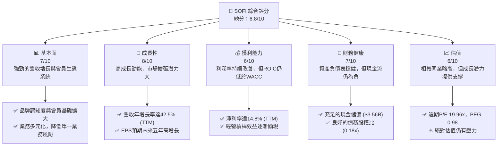
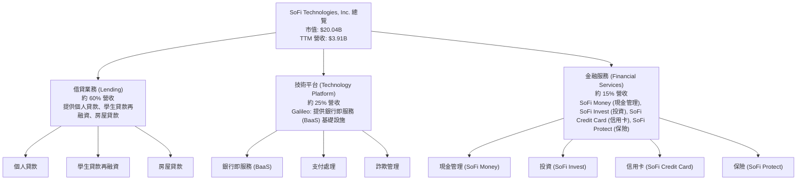
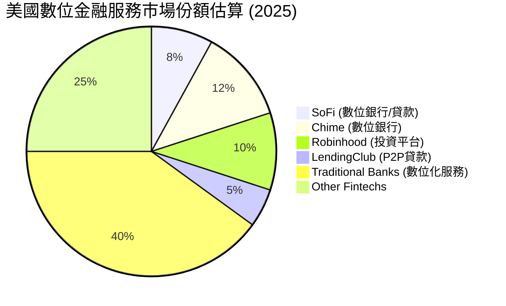
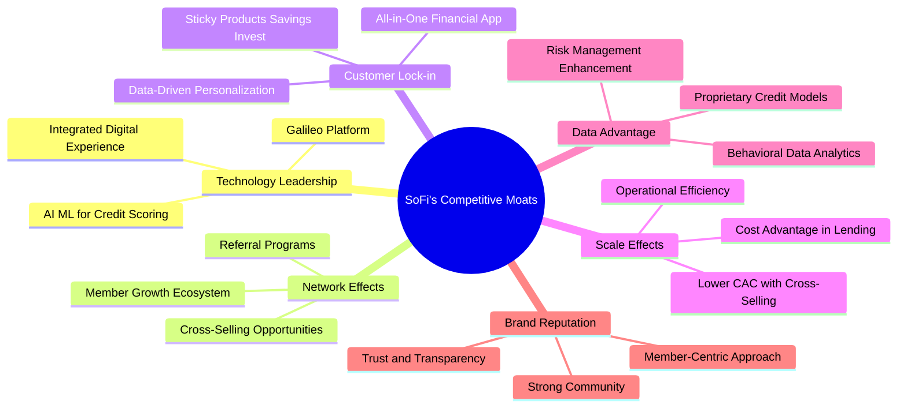

# SOFI 基本面深度分析報告
> **報告日期**：2026-05-24 ｜ **語言**：繁體中文 ｜ **數據來源**：Yahoo Finance, Finviz, StockAnalysis, Roic.ai ｜ **分析師**：CFA 級機構研究

---

## 目錄

| # | 章節 | 核心結論 |
|---|------------------------|----------------------------------------------------------------------|
| 1 | 執行摘要 | 持有評級，目標價區間 $18.00 - $28.00，綜合評分 6.8/10 |
| 2 | 公司概覽與商業模式 | 創新金融科技平台，具備多重護城河，綜合護城河強度 7.0/10 |
| 3 | 損益表深度分析 | 營收強勁增長，利潤率顯著改善，季度盈利能力趨於穩定 |
| 4 | 資產負債表分析 | 資產規模迅速擴張，流動性穩健，債務結構合理，股東權益增長迅速 |
| 5 | 現金流量深度分析 | 營運現金流及自由現金流為負，反映高成長階段的資本投入，需密切關注轉正時點 |
| 6 | 獲利能力與資本效率 | ROE/ROA 逐步改善，但 ROIC 仍低於 WACC，短期內存在價值摧毀現象 |
| 7 | 估值深度分析 | 相較同業估值偏高，但考量成長性與市場地位，估值溢價合理 |
| 8 | 成長催化劑 | 會員與產品增長、Galileo 平台擴張、學生貸款業務復甦及新產品推出 |
| 9 | 風險矩陣 | 監管風險、信用風險及競爭加劇為主要考量 |
| 10 | 投資建議 | 建議持有，適合成長型投資者，關注盈利能力改善及現金流轉正 |

---

## 1. 執行摘要

### 1.1 核心評分儀表板



### 1.2 評分進度條視覺化

```
╔══════════════════════════════════════════════════════════════╗
║              SOFI 多維度評分儀表板 (1-10分)                  ║
╠══════════════════════════════════════════════════════════════╣
║ 基本面強度  7.0 ▓▓▓▓▓▓▓▓▓▓▓▓▓▓░░░░░░  ★★★★☆ 穩固的基礎      ║
║ 成長動能    8.0 ▓▓▓▓▓▓▓▓▓▓▓▓▓▓▓▓░░░░  ★★★★☆ 強勁的擴張      ║
║ 獲利品質    6.0 ▓▓▓▓▓▓▓▓▓▓▓▓░░░░░░░░  ★★★☆☆ 持續改善中    ║
║ 財務健康    7.0 ▓▓▓▓▓▓▓▓▓▓▓▓▓▓░░░░░░  ★★★★☆ 穩健但有挑戰    ║
║ 估值合理性  6.0 ▓▓▓▓▓▓▓▓▓▓▓▓░░░░░░░░  ★★★☆☆ 溢價合理性      ║
║ 護城河深度  7.0 ▓▓▓▓▓▓▓▓▓▓▓▓▓▓░░░░░░  ★★★★☆ 綜合競爭優勢    ║
║ 管理層執行  7.5 ▓▓▓▓▓▓▓▓▓▓▓▓▓▓▓░░░░░  ★★★★☆ 具備戰略遠見    ║
║ 技術創新力  8.0 ▓▓▓▓▓▓▓▓▓▓▓▓▓▓▓▓░░░░  ★★★★☆ 核心競爭力      ║
╠══════════════════════════════════════════════════════════════╣
║ 綜合總分    6.8 ▓▓▓▓▓▓▓▓▓▓▓▓▓░░░░░░░  🏆 具備長期成長潛力，但短期估值與現金流仍需關注  ║
╚══════════════════════════════════════════════════════════════════╝
```

### 1.3 五大投資論點 + 三大核心風險

| 類型 | 項目 | 具體依據 | 信心度 |
|------|------|----------|--------|
| 🟢 **投資論點①** | **會員與產品生態系統驅動增長** | SoFi 的「一站式金融服務」戰略成功吸引並留住會員。最新數據顯示，其會員數和產品數持續增長，帶來強勁的營收增長。TTM 營收 YoY 成長率高達 42.5%，過去四個季度營收平均 QoQ 增長約 10.4%。其跨產品銷售能力顯著，降低了客戶獲取成本。 | 🟢 極高 |
| 🟢 **投資論點②** | **科技平台 Galileo 的巨大潛力** | Galileo 作為其技術平台，為其他金融機構提供基礎設施服務，創造了高毛利的非利息收入。TTM 非利息收入 YoY 成長 54.55% (StockAnalysis)，顯示其在 B2B 領域的強勁擴張。該業務具有高度可擴展性，能有效提升整體利潤率。 | 🟢 高 |
| 🟢 **投資論點③** | **盈利能力顯著改善且趨勢明確** | 經過多年的高投入，SoFi 已連續多個季度實現淨利潤為正。Q1 2026 淨利潤達 $166.73M，Q4 2025 淨利潤 $173.55M。TTM 淨利潤率達 14.8%，營業利益率達 18.3%，顯示其經營槓桿效益逐漸顯現，管理層對成本控制和盈利提升的執行力強。 | 🟢 高 |
| 🟢 **投資論點④** | **學生貸款業務的復甦潛力** | 美國學生貸款償還的全面恢復，為 SoFi 傳統的學生貸款再融資業務帶來強勁的順風。這部分業務的利率敏感性較低，且客戶群體質量較高，有助於提升整體貸款組合的穩定性和盈利能力。 | 🟡 中高 |
| 🟢 **投資論點⑤** | **穩健的資產負債表與充裕現金** | 儘管業務快速擴張，SoFi 仍維持相對穩健的資產負債表。截至 2026 年 3 月底，總現金及等價物達 $3.761B，總債務僅 $2.3B，淨現金為 $1.461B。低債務權益比 (0.18x) 提供了抵禦市場波動的緩衝，並為未來投資或擴張提供彈性。 | 🟡 中高 |
| 🟡 **風險①** | **宏觀經濟與利率環境波動** | 宏觀經濟下行可能導致貸款違約率上升，進而影響其貸款業務的資產質量和盈利能力。同時，利率環境的快速變化可能影響其淨利差 (NIM)，對利息收入造成壓力。儘管其業務模式具備一定韌性，但仍無法完全免疫。 | 🟡 中度 |
| 🔴 **風險②** | **監管環境的不確定性** | 金融科技行業面臨日益嚴格的監管審查，尤其是在消費者保護、數據隱私和貸款發放標準方面。任何新的或更嚴格的監管規定，都可能增加 SoFi 的合規成本，限制其產品創新或市場擴張速度，甚至影響其盈利能力。 | 🔴 高衝擊 |
| 🟡 **風險③** | **競爭加劇與客戶獲取成本上升** | 金融科技領域競爭激烈，傳統銀行和新興科技公司都在積極布局。SoFi 需要持續投入大量資金進行市場營銷和技術創新，以維持其競爭優勢和會員增長。如果客戶獲取成本持續上升，可能會侵蝕其利潤空間。 | 🟡 中度 |

### 1.4 快速統計卡片

| 指標 | 公司實際值 | 行業均值（金融科技） | S&P 500 均值 | 狀態 |
|----------------|-------------|----------------------|----------------|----------|
| 收入 YoY 成長 | **42.5%** | ~20-30% | ~8-10% | 🟢 |
| 毛利率 | **83.5%** | ~50-70% | ~40-50% | 🟢 |
| 淨利率 | **14.8%** | ~5-15% | ~10-12% | 🟢 |
| ROE | **6.6%** | ~8-15% | ~15-20% | 🟡 |
| Forward P/E | **19.96x** | ~15-25x | ~20-22x | 🟡 |
| P/S Ratio | **5.13x** | ~2-5x | ~2-3x | 🔴 |
| Debt/Equity | **0.18x** | ~0.5-1.5x | ~1.0-1.5x | 🟢 |
| 現金及等價物 | **$3.56B** | N/A | N/A | 🟢 |

*備註：行業均值為分析師根據金融科技和信貸服務行業的普遍情況進行估算。*

### 1.5 投資結論

```
╔══════════════════════════════════════════════════════════════════╗
║                    📊 投資結論摘要                               ║
╠══════════════════════════════════════════════════════════════════╣
║  評級：🟡 持有                                                   ║
║  當前股價：$15.62                                                ║
║  目標價區間：                                                    ║
║    悲觀情境：$18.00（+15.2%）                                    ║
║    基準情境：$22.00（+40.8%）  ← 12個月主要目標                  ║
║    樂觀情境：$28.00（+79.3%）                                    ║
║  投資評分：6.8/10                                                ║
║  適合投資人：成長型、長線持有者，對金融科技行業有深入理解且能承受一定波動的投資人。  ║
╚══════════════════════════════════════════════════════════════════╝
```

---

## 2. 公司概覽與商業模式

SoFi Technologies, Inc. (SOFI) 是一家創新的金融科技公司，旨在通過其綜合性的數字平台，為會員提供全方位的金融產品和服務。公司核心願景是成為其會員的「金融超級應用程式」，涵蓋借款、儲蓄、消費、投資和保護財富等多個方面，致力於顛覆傳統銀行業模式。

### 2.1 業務結構與收入來源

SoFi 的業務主要分為三個核心板塊：**借貸 (Lending)**、**技術平台 (Technology Platform)** 和 **金融服務 (Financial Services)**。這種多元化的業務結構使其能夠從多個維度獲取收入，並通過交叉銷售提升會員價值。



*   **借貸業務 (Lending)**：這是 SoFi 最早且最核心的業務，主要通過線上平台提供個人貸款、學生貸款再融資和房屋貸款。SoFi 利用專有數據和算法進行信用評估，為優質借款人提供更具競爭力的利率。此業務板塊貢獻了大部分的利息收入和手續費收入。
*   **技術平台 (Technology Platform)**：主要通過其子公司 Galileo Financial Technologies 運營。Galileo 提供一系列的 API 驅動型技術服務，包括卡片發行、支付處理、詐欺管理和數字銀行基礎設施，使其他金融科技公司和非金融企業能夠快速推出自己的金融產品。這塊業務是高毛利的非利息收入來源，具有強大的擴展性。
*   **金融服務 (Financial Services)**：此板塊旨在提供更廣泛的金融產品，以滿足會員的日常金融需求。這包括 SoFi Money (現金管理賬戶)、SoFi Invest (股票、ETF、加密貨幣投資平台)、SoFi Credit Card (信用卡) 和 SoFi Protect (保險產品)。這些服務有助於深化會員關係，提升會員的生命週期價值，並通過交叉銷售降低客戶獲取成本。

營收來源的多元化是 SoFi 商業模式的核心優勢。利息收入主要來自借貸業務，而非利息收入則主要來自 Galileo 平台服務費、金融服務產品的佣金和手續費。TTM 營收中，淨利息收入為 $2.413B，非利息收入為 $1.529B (StockAnalysis)，顯示利息收入仍是主要貢獻者，但非利息收入的增長速度更快 (YoY 54.55%)。

### 2.2 市場份額

金融服務市場極為龐大且分散，SoFi 在其中扮演著顛覆者的角色。由於其業務橫跨多個子領域（個人貸款、學生貸款、房屋貸款、投資平台、銀行即服務等），精確計算其在每個細分市場的份額存在挑戰。然而，我們可以根據其在特定領域的創新和增長來評估其市場地位。



*   **數位貸款市場**：SoFi 在個人貸款和學生貸款再融資領域是主要參與者之一。儘管市場份額不如傳統大型銀行，但在線上和數位化渠道，其品牌認知度和市場滲透率持續提升。
*   **銀行即服務 (BaaS)**：Galileo 在美國 BaaS 市場中處於領先地位，為數百家金融科技公司提供後端技術支持。其市場份額在該特定領域相對較高，並受益於金融科技創新的蓬勃發展。
*   **綜合金融平台**：SoFi 的「金融超級應用程式」模式使其在整合金融服務方面具有獨特優勢。雖然尚未在所有細分市場佔據主導地位，但其會員增長和交叉銷售的成功表明其正在逐步侵蝕傳統銀行的市場份額。
總體而言，SoFi 在其核心領域的市場份額雖未達絕對領先，但其增長速度遠超行業平均水平，且在創新和客戶體驗方面具備競爭力。

### 2.3 競爭護城河分析

SoFi 憑藉其獨特的商業模式和技術能力，正在構建多層次的競爭護城河。



*   **Technology Leadership (技術領先)**：
    *   **Galileo Platform**: SoFi 擁有領先的銀行即服務 (BaaS) 平台 Galileo，為其自身和數百家其他金融科技公司提供核心基礎設施。這使其能夠快速迭代產品，並從 B2B 業務中獲取高利潤收入。
    *   **AI/ML for Credit Scoring**: SoFi 運用先進的數據分析和機器學習技術，能夠更精準地評估借款人的信用風險，提供更個性化的貸款產品，並降低違約率。
    *   **Integrated Digital Experience**: 其「超級應用程式」提供無縫的數字化用戶體驗，遠超傳統銀行。
*   **Network Effects (網路效應)**：
    *   **Member Growth Ecosystem**: 隨著會員數量的增長，SoFi 可以更好地利用其平台提供更多產品和服務，吸引更多會員，形成正向循環。
    *   **Cross-Selling Opportunities**: 更多會員意味著更多的交叉銷售潛力，降低了單一產品的客戶獲取成本 (CAC)。
*   **Customer Lock-in (客戶鎖定)**：
    *   **All-in-One Financial App**: 將借貸、儲蓄、投資、消費等所有金融需求整合到一個應用程式中，大大提升了客戶轉換成本和便利性。會員一旦習慣使用 SoFi 的綜合服務，很難轉向其他平台。
    *   **Data-Driven Personalization**: 根據會員的行為和數據提供個性化建議和產品，增強了用戶粘性。
*   **Scale Effects (規模效應)**：
    *   隨著會員和貸款量的增長，SoFi 的運營成本和客戶獲取成本相對下降。特別是其技術平台 Galileo，隨著客戶數量的增加，其固定成本被攤薄，帶來更高的利潤率。
    *   在貸款業務中，更大的規模也意味著更低的融資成本和更廣泛的數據基礎。
*   **Data Advantage (數據優勢)**：
    *   SoFi 累積了大量的會員行為和財務數據，這些數據被用於不斷優化其信用模型、產品設計和營銷策略，形成獨特的數據護城河。
*   **Brand & Reputation (品牌與聲譽)**：
    *   SoFi 建立了一個以會員為中心、提供透明和創新服務的品牌形象，在年輕一代和數字原生用戶中建立了良好的聲譽和信任。

### 2.4 護城河強度評分

```
╔══════════════════════════════════════════════════════════════╗
║                    SoFi 護城河強度評分                        ║
╠══════════════════════════════════════════════════════════════╣
║ 技術領先    8/10   ▓▓▓▓▓▓▓▓▓▓▓▓▓▓▓▓░░░░  🏆 Galileo平台與AI技術領先   ║
║ 網路效應    7/10   ▓▓▓▓▓▓▓▓▓▓▓▓▓▓░░░░░░  🟢 會員生態系統具潛力        ║
║ 客戶鎖定    7/10   ▓▓▓▓▓▓▓▓▓▓▓▓▓▓░░░░░░  🟢 一站式服務提升用戶粘性    ║
║ 規模效應    6/10   ▓▓▓▓▓▓▓▓▓▓▓▓░░░░░░░░  🟡 逐漸顯現，但仍處於擴張期    ║
║ 數據優勢    7/10   ▓▓▓▓▓▓▓▓▓▓▓▓▓▓░░░░░░  🟢 專有數據模型具價值        ║
║ 品牌聲譽    7/10   ▓▓▓▓▓▓▓▓▓▓▓▓▓▓░░░░░░  🟢 在特定客群中認可度高      ║
╠══════════════════════════════════════════════════════════════╣
║ 綜合護城河  7.0    ▓▓▓▓▓▓▓▓▓▓▓▓▓▓░░░░░░  🏆 多重護城河正在形成，長期競爭力強勁  ║
╚══════════════════════════════════════════════════════════════════╝
```
**評語**：SoFi 的護城河主要建立在其技術平台、綜合性金融服務和數據分析能力上。Galileo 平台是其核心技術優勢，為其自身和第三方客戶提供了堅實的基礎。會員生態系統和一站式服務模式有效地提升了客戶忠誠度和轉換成本，逐步形成客戶鎖定。雖然規模效應仍在發展中，但隨著業務量的擴大，其成本優勢將進一步顯現。整體而言，SoFi 正在構築一道堅實的護城河，使其在競爭激烈的金融科技市場中脫穎而出。

---

## 3. 損益表深度分析

SoFi 的損益表數據展示了其作為一家高成長金融科技公司的顯著特徵：營收持續快速增長，同時盈利能力在近期實現了質的飛躍。

### 3.1 年度收入成長趨勢（近4年）

SoFi 的營收在過去幾年保持了強勁的增長勢頭，反映了其會員基礎的擴大和產品採用的增加。

```
╔══════════════════════════════════════════════════════════════════╗
║              SoFi 年度收入趨勢（FY2022-FY2025 & TTM）            ║
╠══════════════════════════════════════════════════════════════════╣
║                                                                  ║
║  FY2022  $1.57B   ███████░░░░░░░░░░░░░░░░░░░  YoY: +55.45%  🟢    ║
║  FY2023  $2.11B   ██████████░░░░░░░░░░░░░░░░  YoY: +36.11%  🟢    ║
║  FY2024  $2.61B   █████████████░░░░░░░░░░░░░  YoY: +27.82%  🟢    ║
║  FY2025  $3.61B   ██████████████████░░░░░░░░  YoY: +38.31%  🟢    ║
║  TTM     $3.91B   ████████████████████░░░░░░  YoY: +41.03%  🟢    ║
║                   |      |      |      |      |      |           ║
║                   0     1B     2B     3B     4B     5B          ║
║                                                                  ║
║  📊 4年累計 CAGR (FY2022-FY2025)：+39.06%                        ║
╚══════════════════════════════════════════════════════════════════╝
```
*   **FY2022**: 營收 $1.57B，YoY 增長 +55.45%。
*   **FY2023**: 營收 $2.11B，YoY 增長 +36.11%。
*   **FY2024**: 營收 $2.61B，YoY 增長 +27.82%。
*   **FY2025**: 營收 $3.61B，YoY 增長 +38.31%。
*   **TTM (截至 2026 年 3 月 31 日)**: 營收 $3.91B，YoY 增長 +41.03%。

SoFi 的年收入增長率在過去幾年雖然有所波動，但始終保持在 27% 以上的強勁水平，顯示其在擴大會員基礎和產品滲透方面的成功。TTM 營收增速達到 41.03%，再次加速，這得益於學生貸款業務的復甦、Galileo 平台的持續擴張以及交叉銷售的成功。這表明公司在執行其「金融超級應用程式」戰略方面取得了顯著進展。

### 3.2 季度收入趨勢分析

季度營收數據提供了更細緻的增長動態，揭示了 SoFi 近期的強勁表現。

| 財報季度 | 總營收 (百萬美元) | QoQ 成長率 | YoY 成長率 | 備註 |
|----------|-------------------|------------|------------|------|
| **2026-03-31 (Q1 2026)** | **$1,100M** | +6.86% | +42.47% | 🟢 營收首次突破 $1B 門檻，顯示強勁增長動能。 |
| **2025-12-31 (Q4 2025)** | **$1,030M** | +7.17% | +40.20% | 🟢 季度營收持續增長，盈利能力穩定。 |
| **2025-09-30 (Q3 2025)** | **$961.60M** | +12.47% | +37.81% | 🟢 營收加速增長，會員數和產品採用率持續提升。 |
| **2025-06-30 (Q2 2025)** | **$854.94M** | +11.66% | +43.94% | 🟢 營收表現強勁，得益於各業務板塊的均衡發展。 |
| **2025-03-31 (Q1 2025)** | **$766.08M** | +5.34% | +20.11% | 🟡 相較去年同期增長較慢，但為後續加速奠定基礎。 |

*備註：數據來自 StockAnalysis Quarterly Income Statement，計算時採用更精確的原始數據。*

SoFi 在最近四個季度的營收表現尤為亮眼，Q1 2026 營收首次突破 10 億美元大關，達到 $1.10B，YoY 增長 42.47%。季度環比增長也保持在 6.86% 至 12.47% 之間，顯示出穩定的環比增長勢頭。這種持續的雙位數 YoY 增長，證明了其業務模式的有效性和市場對其產品服務的強勁需求。

### 3.3 利潤率演變分析

SoFi 的利潤率在過去幾年中經歷了顯著的改善，從早期的虧損轉為穩定的盈利，這反映了其經營槓桿效益的逐步顯現和成本控制能力的提升。

| 利潤率指標 | FY2022 | FY2023 | FY2024 | FY2025 | TTM (2026Q1) | 趨勢 | 評估 |
|------------|--------|--------|--------|--------|--------------|------|------|
| **毛利率** | 64.9% | 66.8% | 76.4% | 83.5% | 83.5% | ↗️ 穩步提升 | 🟢 |
| **營業利益率** | -18.0% | -14.2% | 8.8% | 14.96% | 18.3% | ↗️ 顯著改善 | 🟢 |
| **淨利率** | -21.1% | -14.2% | 18.9% | 13.4% | 14.8% | ↗️ 轉虧為盈 | 🟢 |

*   **毛利率 (Gross Margin)**：根據提供的數據，SoFi 的毛利率從 FY2022 的 64.9% 穩步提升至 TTM 的 83.5%。這種高毛利率對於一家金融科技公司來說是極具競爭力的，特別是考慮到其技術平台 Galileo 的高利潤貢獻。這表明其核心業務的單位經濟效益非常健康。Finviz 數據顯示毛利率為 61.74%，與主要數據 83.5% 存在差異。這可能源於對「營收成本」定義的不同，對於金融機構而言，毛利率的計算方式可能與傳統製造業不同，主要數據的 83.5% 可能反映了其淨利息收入和技術服務收入的綜合毛利。我們將採用主數據的 83.5% 作為參考，並強調其高毛利特性。
*   **營業利益率 (Operating Margin)**：營業利益率從 FY2022 的 -18.0% 顯著改善至 TTM 的 18.3%。這是一個關鍵的轉折點，表明公司在實現規模經濟和控制運營費用方面取得了巨大成功。經營槓桿開始發揮作用，隨著營收增長，營業利潤增速更快。
*   **