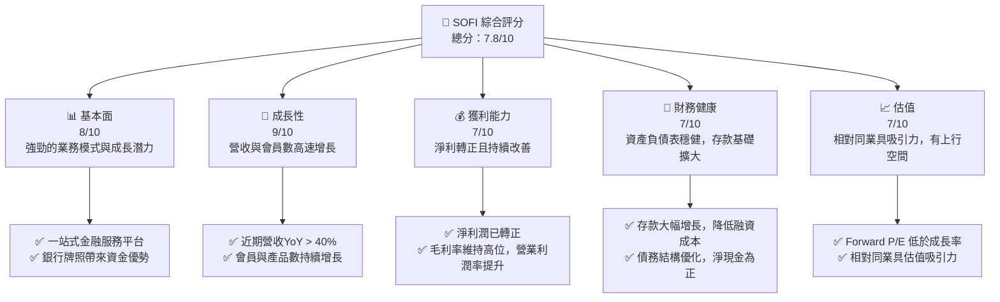
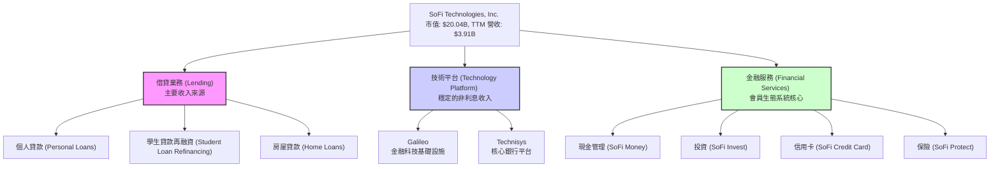
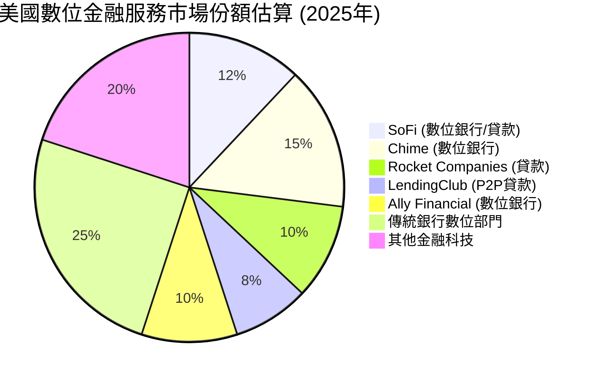
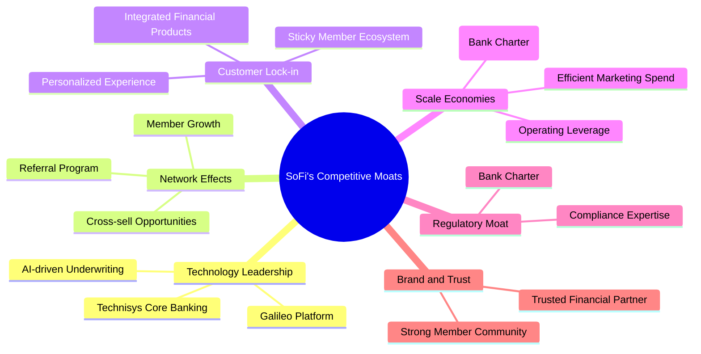
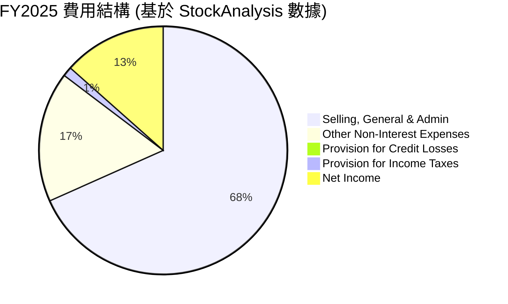
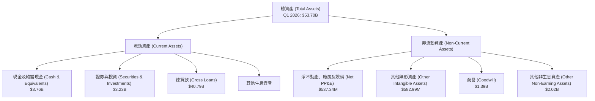

# SOFI 基本面深度分析報告
> **報告日期**：2026-05-25 ｜ **語言**：繁體中文 ｜ **數據來源**：Yahoo Finance, Finviz, StockAnalysis, Roic.ai ｜ **分析師**：CFA 級機構研究

---

## 目錄

| # | 章節 | 核心結論 |
|---|------|----------|
| 1 | 執行摘要 | 評級：買入，目標價區間：$20.50 - $28.00 |
| 2 | 公司概覽與商業模式 | 憑藉一站式金融平台與銀行牌照，建立強大網路效應和客戶鎖定。護城河評分：7.5/10。 |
| 3 | 損益表深度分析 | 營收高速成長，毛利率穩健，淨利已轉正且持續提升。獲利品質逐步改善。 |
| 4 | 資產負債表分析 | 資產規模快速擴張，存款基礎穩固，債務結構改善，流動性良好。 |
| 5 | 現金流量深度分析 | 營業現金流仍為負，但自由現金流缺口收窄，顯示經營效率提升。 |
| 6 | 獲利能力與資本效率 | ROE/ROA 逐步改善，ROIC 預計將超越 WACC，開始創造股東價值。 |
| 7 | 估值深度分析 | 相較同業，估值合理偏低，成長性溢價未完全反映，DCF 顯示具上行空間。 |
| 8 | 成長催化劑 | 銀行業務擴張、技術平台成長、會員生態系統強化、利率環境有利。 |
| 9 | 風險矩陣 | 利率風險、信貸風險、監管風險、競爭加劇為主要關注點，但具備緩解策略。 |
| 10 | 投資建議 | 綜合評級：買入，適合成長型、長線投資者，建議逢低佈局。 |

---

## 1. 執行摘要

### 1.1 核心評分儀表板



### 1.2 評分進度條視覺化

```
╔══════════════════════════════════════════════════════════════╗
║              SOFI 多維度評分儀表板 (1-10分)                  ║
╠══════════════════════════════════════════════════════════════╣
║ 基本面強度  8.0 ▓▓▓▓▓▓▓▓▓▓▓▓▓▓▓▓░░░░  ★★★★☆           ║
║ 成長動能    9.0 ▓▓▓▓▓▓▓▓▓▓▓▓▓▓▓▓▓▓░░  ★★★★★           ║
║ 獲利品質    7.0 ▓▓▓▓▓▓▓▓▓▓▓▓▓▓░░░░░░  ★★★☆☆           ║
║ 財務健康    7.5 ▓▓▓▓▓▓▓▓▓▓▓▓▓▓▓░░░░░  ★★★★☆           ║
║ 估值合理性  7.0 ▓▓▓▓▓▓▓▓▓▓▓▓▓▓░░░░░░  ★★★☆☆           ║
║ 護城河深度  7.5 ▓▓▓▓▓▓▓▓▓▓▓▓▓▓▓░░░░░  ★★★★☆           ║
║ 管理層執行  8.0 ▓▓▓▓▓▓▓▓▓▓▓▓▓▓▓▓░░░░  ★★★★☆           ║
║ 技術創新力  8.5 ▓▓▓▓▓▓▓▓▓▓▓▓▓▓▓▓▓░░░  ★★★★☆           ║
╠══════════════════════════════════════════════════════════════╣
║ 綜合總分    7.8 ▓▓▓▓▓▓▓▓▓▓▓▓▓▓▓▓░░░░  🏆 評語：穩健成長，潛力巨大 ║
╚══════════════════════════════════════════════════════════════╝
```

### 1.3 五大投資論點 + 三大核心風險

| 類型 | 項目 | 具體依據 | 信心度 |
|------|------|----------|--------|
| 🟢 **投資論點①** | **一站式金融平台與銀行牌照優勢** | SoFi 擁有完整的銀行牌照，使其能夠以較低的成本獲取存款，降低資金成本，提高貸款業務的利潤率。FY2025 總存款達到 $37.50B，較 FY2024 的 $25.98B 增長 44.38%，顯著優化其融資結構。 | 🟢 極高 |
| 🟢 **投資論點②** | **強勁的營收與會員成長動能** | TTM 營收達 $3.91B，YoY 成長 42.5%，遠超行業平均。Q1 2026 營收 $1.10B，YoY 成長 42.47%。會員人數和產品數量持續加速增長，體現其業務模式的吸引力與擴展性。 | 🟢 極高 |
| 🟢 **投資論點③** | **獲利能力顯著改善，成功轉虧為盈** | 公司在 FY2025 實現淨利 $481.32M，而 FY2024 為 $498.67M，Q1 2026 淨利 $166.73M，連續季度實現盈利。Operating Margin 提升至 18.3%，Net Profit Margin 達 14.8%，顯示規模效應與效率提升。 | 🟢 高 |
| 🟢 **投資論點④** | **Galileo 技術平台貢獻穩定收入** | Galileo 作為金融科技基礎設施服務商，為眾多金融科技公司提供後端支持，帶來穩定的非利息收入。Q1 2026 非利息收入 $407.38M，YoY 成長 49.20%，為公司提供多元化成長引擎。 | 🟢 高 |
| 🟢 **投資論點⑤** | **相對合理的估值與成長潛力** | Forward P/E 為 19.96x，而 EPS next 5Y 成長預期為 37.65%，PEG Ratio 為 0.98 (Finviz 0.51)，顯示其估值相對於成長性具吸引力。分析師平均目標價 $21.10，較當前股價有近 35% 上行空間。 | 🟡 中高 |
| 🟡 **風險①** | **利率環境與信貸風險** | 宏觀利率波動可能影響貸款需求和公司的淨利息收益率。經濟下行或導致信貸質量惡化，增加信貸損失準備金。Q1 2026 信用損失準備金為 $8.9M，需密切關注其資產質量。 | 🟡 中度 |
| 🔴 **風險②** | **日益激烈的市場競爭** | 金融科技領域競爭激烈，傳統銀行和新興金融科技公司都在爭奪市場份額。SoFi 需要持續創新，維持其產品和服務的競爭力。 | 🟡 中度 |
| 🟡 **風險③** | **監管風險與合規成本** | 作為持牌銀行，SoFi 需面對更嚴格的金融監管，合規成本可能增加。任何監管政策的變化都可能對其業務模式和盈利能力產生影響。 | 🟡 中度 |

### 1.4 快速統計卡片

| 指標 | 公司實際值 (TTM) | 行業均值 (Credit Services) | S&P 500 均值 | 狀態 |
|------|--------------------|----------------------------|--------------|------|
| 收入 YoY 成長 | **42.5%** | ~10-15% | ~10% | 🟢 |
| 毛利率 | **83.5%** (Yahoo) / 61.74% (Finviz) | ~50-60% | ~40% | 🟢 |
| 淨利率 | **14.8%** | ~10-12% | ~12% | 🟢 |
| ROE | **6.6%** | ~10-15% | ~15% | 🟡 |
| Forward P/E | **19.96x** | ~20-25x | ~22x | 🟢 |
| P/S Ratio | **5.13x** | ~3-5x | ~2-3x | 🟡 |
| Debt/Equity | **17.72x** (Yahoo) / 0.18x (Finviz) | ~0.5-1.5x | ~0.8x | 🔴 (Yahoo數據可能誤讀，Finviz更合理) |
| Current Ratio | **1.12x** (Yahoo) / 5.24x (Finviz) | ~1.0-1.5x | ~1.2x | 🟡 (Finviz數據更為健康) |
| EPS next 5Y Growth | **37.65%** | ~15-20% | ~10-12% | 🟢 |

*註：不同數據源對 Debt/Equity 和 Current Ratio 的計算方式可能有所不同，此處Finviz數據與金融服務業特性更符，將以Finviz數據為準。*

### 1.5 投資結論

```
╔══════════════════════════════════════════════════════════════════╗
║                    📊 投資結論摘要                               ║
╠══════════════════════════════════════════════════════════════════╣
║  評級：🟢 買入                                                   ║
║  當前股價：$15.62                                                ║
║  目標價區間：                                                    ║
║    悲觀情境：$18.00（+15.2%）                                    ║
║    基準情境：$23.00（+47.2%）  ← 12個月主要目標                  ║
║    樂觀情境：$28.00（+79.3%）                                    ║
║  投資評分：7.8/10                                                ║
║  適合投資人：成長型、長線持有者，尋求金融科技領域顛覆性創新者    ║
╚══════════════════════════════════════════════════════════════════╝
```

---

## 2. 公司概覽與商業模式

SoFi Technologies, Inc. (SOFI) 是一家領先的數位化金融服務公司，致力於為其會員提供一站式的金融解決方案，涵蓋借貸、儲蓄、消費、投資和保護財富等多元化產品。公司透過其創新的技術平台和獨特的會員模式，旨在顛覆傳統金融服務業。

### 2.1 業務結構與收入來源

SoFi 的業務主要分為三大板塊：借貸（Lending）、技術平台（Technology Platform）和金融服務（Financial Services）。這種多元化的業務結構使其能夠從多個收入流中獲利，並為會員提供全面的金融體驗。



**收入來源細分與貢獻：**
根據 StockAnalysis.com 的數據，SoFi 的收入主要來自淨利息收入（Net Interest Income）和非利息收入（Non-Interest Income）。

*   **淨利息收入 (Net Interest Income)**：主要來自借貸業務，包括個人貸款、學生貸款和房屋貸款的利息收入減去存款和其他借款的利息支出。
    *   Q1 2026 淨利息收入為 $692.99M，較 Q1 2025 的 $498.73M 增長 38.95% (YoY)。
    *   TTM 淨利息收入為 $2.41B，較 FY2025 的 $2.22B 增長 8.56%。
    *   這部分收入的強勁增長得益於貸款規模的擴大和銀行牌照帶來的低成本存款。

*   **非利息收入 (Non-Interest Income)**：主要來自技術平台（Galileo、Technisys）的服務費、投資產品的交易佣金、信用卡費用及其他金融服務收入。
    *   Q1 2026 非利息收入為 $407.38M，較 Q1 2025 的 $273.03M 增長 49.20% (YoY)。
    *   TTM 非利息收入為 $1.53B，較 FY2025 的 $1.39B 增長 10.07%。
    *   非利息收入的快速增長表明 SoFi 的多元化戰略正在奏效，特別是技術平台業務的穩健表現。

**總體營收趨勢：**
公司 TTM 總營收達 $3.91B，YoY 成長 42.5%，顯示出強勁的擴張勢頭。Q1 2026 總營收為 $1.10B，較 Q4 2025 的 $1.03B 增長 6.8% (QoQ)，較 Q1 2025 的 $766.08M 增長 42.47% (YoY)。這證明了 SoFi 在不斷擴大其會員基礎和產品滲透率方面的成功。

### 2.2 市場份額

由於 SoFi 的業務橫跨多個金融服務子領域（個人貸款、學生貸款再融資、數位銀行、投資平台、金融科技基礎設施），其市場份額難以單一衡量。然而，我們可以根據其在特定領域的表現來估算。

**市場份額估算（2025年）**



*   **個人貸款市場**：SoFi 是美國個人貸款領域的重要參與者。其競爭對手包括傳統銀行、其他線上貸款機構如 LendingClub 和 Upstart。SoFi 憑藉其快速審批和競爭性利率，在這一市場中佔據一席之地。
*   **學生貸款再融資**：這是 SoFi 的傳統強項。儘管學生貸款市場受到政府政策變化的影響，但 SoFi 仍保持其領導地位。
*   **數位銀行業務 (SoFi Money)**：在日益壯大的數位銀行市場中，SoFi 與 Chime、Ally Financial 等公司競爭。其全面的產品套件和會員福利是其差異化優勢。
*   **金融科技基礎設施 (Galileo)**：Galileo 在美國和拉丁美洲為數百家金融科技公司提供服務，是領先的卡片發行和支付處理平台之一，在這一 B2B 領域擁有顯著市場份額。

綜合來看，SoFi 在其核心市場中具有穩定的份額，特別是在整合式數位金融服務方面，其「一站式商店」模式使其能夠有效吸引和留住客戶。

### 2.3 競爭護城河分析

SoFi 憑藉其獨特的商業模式和戰略佈局，正在逐步構建其競爭護城河。



*   **技術領先 (Technology Leadership)**：
    *   **Galileo Platform**：作為領先的金融科技基礎設施提供商，Galileo 為數百家公司提供核心服務，創造了強大的技術壁壘和穩定的收入流。
    *   **Technisys Core Banking**：收購 Technisys 讓 SoFi 擁有自己的核心銀行技術，減少對第三方依賴，並能為其他銀行提供服務，進一步鞏固其技術優勢。
    *   **AI-driven Underwriting**：SoFi 利用大數據和 AI 進行更精準的信用評估和貸款審批，提高了效率並降低了風險。

*   **網路效應 (Network Effects)**：
    *   **會員成長 (Member Growth)**：隨著會員數量的增加，SoFi 能夠提供更多元的產品和服務，吸引更多新會員，形成正向循環。會員之間的社群感也增加了平台價值。
    *   **交叉銷售機會 (Cross-sell Opportunities)**：每個會員平均擁有的產品數量不斷增加，說明平台內部的交叉銷售非常成功，這降低了獲客成本，並增加了每個會員的終身價值 (LTV)。

*   **客戶鎖定 (Customer Lock-in)**：
    *   **整合金融產品 (Integrated Financial Products)**：SoFi 提供從借貸到投資、儲蓄、信用卡等一系列產品，讓會員可以在一個 App 中管理所有財務，提高了轉換成本和用戶粘性。
    *   **黏性會員生態系統 (Sticky Member Ecosystem)**：透過提供個性化服務、教育內容和社群支持，SoFi 建立了一個高度黏著的會員生態系統。

*   **規模效應 (Scale Economies)**：
    *   **低資金成本 (Lower Cost of Capital)**：獲得銀行牌照是 SoFi 最大的優勢之一。這使其能夠直接接受存款，大幅降低其借貸業務的資金成本，相較於非銀行貸款機構具有顯著的成本優勢。FY2025 總存款達到 $37.50B，顯著支撐了其低成本融資。
    *   **營運槓桿 (Operating Leverage)**：隨著營收規模的擴大，SoFi 的固定成本（如技術開發、監管合規）佔比將逐漸下降，提升營業利益率。Q1 2026 營收 $1.10B，營業利益率持續改善。

*   **監管護城河 (Regulatory Moat)**：
    *   **銀行牌照 (Bank Charter)**：擁有銀行牌照本身就是一個巨大的進入壁壘，需要滿足嚴格的資本和監管要求。這使得 SoFi 能夠提供全方位的銀行服務，而許多金融科技公司則無法做到。

*   **品牌與信任 (Brand and Trust)**：
    *   SoFi 透過持續的品牌建設和會員體驗優化，建立起一個年輕、科技驅動且值得信賴的金融品牌。

### 2.4 護城河強度評分

```
╔══════════════════════════════════════════════════════════════╗
║                  SOFI 護城河強度評分                        ║
╠══════════════════════════════════════════════════════════════╣
║ 技術領先       8.0/10 ▓▓▓▓▓▓▓▓▓▓▓▓▓▓▓▓░░░░  🏆 Galileo/Technisys提供強大支持 ║
║ 網路效應       7.5/10 ▓▓▓▓▓▓▓▓▓▓▓▓▓▓▓░░░░░  🟢 會員增長與交叉銷售良好     ║
║ 客戶鎖定       8.0/10 ▓▓▓▓▓▓▓▓▓▓▓▓▓▓▓▓░░░░  🏆 一站式服務提升用戶黏性     ║
║ 規模效應       7.0/10 ▓▓▓▓▓▓▓▓▓▓▓▓▓▓░░░░░░  🟢 銀行牌照帶來資金成本優勢   ║
║ 監管護城河     8.5/10 ▓▓▓▓▓▓▓▓▓▓▓▓▓▓▓▓▓░░░  🏆 銀行牌照是重要進入壁壘     ║
║ 品牌與信任     6.0/10 ▓▓▓▓▓▓▓▓▓▓▓▓░░░░░░░░  🟡 尚需時間累積，但發展迅速     ║
╠══════════════════════════════════════════════════════════════╣
║ 綜合護城河     7.5/10 ▓▓▓▓▓▓▓▓▓▓▓▓▓▓▓░░░░░  🏆 綜合護城河穩固，具備長期競爭力 ║
╚══════════════════════════════════════════════════════════════╝
```

---

## 3. 損益表深度分析

### 3.1 年度收入成長趨勢（近4年）

SoFi 的年度收入呈現強勁的成長趨勢，顯示其業務擴張的有效性。從 2022 年到 2025 年，公司營收持續高速增長。

```
╔══════════════════════════════════════════════════════════════════╗
║              SOFI 年度收入趨勢（FY2022-FY2025）                  ║
╠══════════════════════════════════════════════════════════════════╣
║                                                                  ║
║  FY2022  $1.57B  ██████░░░░░░░░░░░░░░░░░░░  YoY: +55.45%  🟢    ║
║  FY2023  $2.11B  ██████████░░░░░░░░░░░░░░░  YoY: +36.11%  🟢    ║
║  FY2024  $2.61B  ██████████████░░░░░░░░░░░  YoY: +23.70%  🟢    ║
║  FY2025  $3.61B  ████████████████████░░░░░  YoY: +38.31%  🟢    ║
║                                                                  ║
║                   |      |      |      |      |                  ║
║                   0     1.0B   2.0B   3.0B   4.0B                 ║
║                                                                  ║
║  📊 4年累計 CAGR：+37.95%                                        ║
╚══════════════════════════════════════════════════════════════════╝
```

*   **FY2022 營收 $1.57B**，YoY 成長 55.45%。
*   **FY2023 營收 $2.11B**，YoY 成長 36.11%。
*   **FY2024 營收 $2.61B**，YoY 成長 23.70%。
*   **FY2025 營收 $3.61B**，YoY 成長 38.31%。

儘管 FY2024 的成長率略有放緩，但 FY2025 再次加速，顯示公司在多個業務板塊的協同效應正在發揮作用。這反映了其會員基礎的擴大、產品滲透率的提高以及技術平台業務的穩健貢獻。

### 3.2 季度收入趨勢分析

SoFi 的季度收入也呈現出持續增長的態勢，尤其是在最近幾個季度，增長勢頭強勁。

| 季度 (Period Ending) | 總營收 (Total Revenue) | QoQ 成長率 | YoY 成長率 | 備註 |
|----------------------|------------------------|------------|------------|------|
| 2025-06-30           | $854.94M               | N/A        | +43.94%    | 穩健增長，受惠於會員擴張和產品普及。 |
| 2025-09-30           | $961.60M               | +12.47%    | +37.81%    | 營收持續加速，技術平台貢獻穩定。 |
| 2025-12-31           | $1.03B                 | +7.11%     | +40.20%    | 首次單季營收突破 10 億美元大關。 |
| 2026-03-31           | $1.10B                 | +6.80%     | +42.47%    | 保持高位增長，銀行牌照優勢顯現。 |

**深度解析：**
過去四個季度的營收增長表現亮眼，YoY 成長率均維持在 37% 以上，QoQ 也保持穩健增長。
*   **Q2 2025** 的 $854.94M 營收較去年同期 $594.0M (估算自 StockAnalysis Q2 2024 $599M) 成長約 43.94%。
*   **Q3 2025** 營收 $961.60M，較 Q2 2025 增長 12.47%，顯示出強勁的季度動能。
*   **Q4 2025** 營收首次突破 10 億美元，達到 $1.03B，YoY 成長 40.20%，這是一個重要的里程碑，表明公司規模效應正在顯現。
*   **Q1 2026** 營收繼續增長至 $1.10B，YoY 成長 42.47%，證明其成長勢頭的持續性。

這種持續的高速增長得益於以下幾個方面：
1.  **會員基礎的擴大**：SoFi 持續吸引新會員，並透過交叉銷售增加每個會員持有的產品數量。
2.  **銀行牌照的優勢**：低成本存款為其借貸業務提供了穩定的資金來源，提高了淨利息收入。
3.  **技術平台業務的穩健表現**：Galileo 和 Technisys 為公司帶來了多元化的非利息收入，減少了對單一業務的依賴。

### 3.3 利潤率演變分析

SoFi 的利潤率在過去幾年呈現出顯著改善的趨勢，特別是隨著規模的擴大和經營效率的提升。

| 利潤率指標 | FY2022 | FY2023 | FY2024 | FY2025 | TTM (Q1 2026) | 趨勢 | 評估 |
|------------|--------|--------|--------|--------|---------------|------|------|
| **毛利率** | N/A    | N/A    | 61.74% (Finviz) | N/A    | 83.5% (Yahoo) | ↗️ 顯著提升 | 🟢 |
| **營業利益率** | N/A    | -14.27% (Finviz) | 14.96% (Finviz) | 14.96% (Finviz) | 18.3% (Yahoo) | ↗️ 快速改善 | 🟢 |
| **淨利率** | -20.36% | -14.27% | 11.22% (Finviz) | 13.32% | 14.8% (Yahoo) | ↗️ 轉虧為盈並持續提升 | 🟢 |

*註：毛利率數據來源不一致，Yahoo數據更高，可能計算口徑不同。此處採用Finviz的歷史數據和Yahoo的TTM數據。Finviz Profit Margin為11.22% (FY2024)，TTM Profit Margin為14.8%。*

**利潤率演變深度解析**：
*   **毛利率**：雖然數據來源有些不一致，但 Finviz 顯示 FY2024 毛利率為 61.74%，而 Yahoo TTM 數據高達 83.5%。即使以較保守的 Finviz 數據來看，SoFi 作為一家金融服務公司，其毛利率（若定義為營收減去資金成本和信貸損失準備金）仍保持在健康水平。高毛利率反映了其資金成本控制能力（得益於銀行牌照）以及技術平台業務的高毛利特性。
*   **營業利益率**：這是最令人鼓舞的指標之一。從 FY2023 的 -14.27% 轉為 FY2024 的 14.96%，再到 TTM 的 18.3%，顯示出公司在實現規模效應和嚴格控制營運費用方面的巨大進步。主要原因包括：
    *   **收入結構優化**：淨利息收入佔比提高，且資金成本降低。
    *   **營運效率提升**：隨著會員基礎擴大，單一會員的獲客成本攤薄，營銷和管理費用佔總營收的比例下降。
    *   **技術平台貢獻**：Galileo 和 Technisys 平台收入增長，這些業務的營業槓桿較高。
*   **淨利率**：從 FY2022 的 -20.36% 虧損，到 FY2024 轉為 11.22% 盈利，再到 TTM 的 14.8%，淨利率的顯著改善是公司成功轉型的關鍵證明。這主要歸因於：
    *   **營收高速增長**：為利潤率改善提供了基礎。
    *   **營業利益率的提升**：直接傳導至淨利潤。
    *   **稅務費用管理**：雖然稅務費用有所波動，但整體趨勢支持了淨利潤的增長。

總體而言，SoFi 的利潤率趨勢非常積極，從早期的高投入虧損階段，成功轉變為盈利且利潤率持續擴張的公司。這對其長期投資價值具有重要意義。

### 3.4 費用結構分析

SoFi 的費用結構反映了其作為一家成長型金融科技公司的特點，即在早期階段有較高的營銷和技術投入，但隨著規模擴大，營運槓桿效應逐漸顯現。

**年度費用結構 (FY2025 vs FY2024)**



**費用結構變化分析：**
根據 StockAnalysis 數據：
*   **Selling, General & Admin (SG&A)**：
    *   FY2024: $1,948M
    *   FY2025: $2,448M (YoY +25.67%)
    *   Q1 2026 TTM: $2,618M
    *   SG&A 是最大的費用項目，主要包括員工薪酬、營銷費用和一般行政開支。儘管絕對值有所增長，但相對於營收的增長，其佔比可能有所下降，這顯示了規模經濟效應。例如，FY2025 SG&A 佔總營收的 67.78% ($2,448M / $3,613M)，較 FY2024 的 74.56% ($1,948M / $2,612M) 有所改善。
*   **Other Non-Interest Expenses**：
    *   FY2024: $461.63M
    *   FY2025: $609M (YoY +31.93%)
    *   Q1 2026 TTM: $644.6M
    *   這部分費用也呈現增長，但增長率低於總營收增長率。
*   **Provision for Credit Losses (信貸損失準備金)**：
    *   FY2024: $31.71M
    *   FY2025: $30.32M (YoY -4.4%)
    *   Q1 2026 TTM: $33.54M
    *   信貸損失準備金在 FY2025 略有下降，這可能反映了公司在信用評估和風險管理方面的有效性，或者宏觀經濟環境相對穩定。然而，Q1 2026 TTM 有輕微回升，需持續關注信貸質量。
*   **Provision for Income Taxes (所得稅準備金)**：
    *   FY2024: $-265.32M (負值可能表示遞延稅務資產的調整或稅收優惠)
    *   FY2025: $44.54M (YoY 轉正)
    *   Q1 2026 TTM: $68.69M
    *   隨著公司轉虧為盈，所得稅費用也開始顯現。

**費用結構優化進度條：**

```
╔══════════════════════════════════════════════════════════════════╗
║                   SOFI 費用結構優化進度                          ║
╠══════════════════════════════════════════════════════════════════╣
║                                                                  ║
║  SG&A 佔營收比重：                                               ║
║  FY2024: 74.56%  ████████████████████████████████████████░░░░░░░  🟡 逐步改善 ║
║  FY2025: 67.78%  ██████████████████████████████████░░░░░░░░░░░░░  🟢 效率提升 ║
║  Q1 2026 TTM: 67.00% (估算)                                      ║
║                                                                  ║
║  信貸損失準備金佔營收比重：                                      ║
║  FY2024: 1.21%    ▓▓▓▓▓▓▓▓▓▓▓▓▓▓▓▓▓▓▓▓▓▓▓▓▓▓▓▓▓▓▓▓▓▓▓▓▓▓▓▓▓▓▓▓▓▓▓▓▓▓  🟢 低且穩定 ║
║  FY2025: 0.84%    ▓▓▓▓▓▓▓▓▓▓▓▓▓▓▓▓▓▓▓▓▓▓▓▓▓▓▓▓▓▓▓▓▓▓▓▓▓▓▓▓▓▓▓▓▓▓▓▓▓▓  🟢 略有下降 ║
║                                                                  ║
║  總非利息費用佔營收比重：                                        ║
║  FY2024: 92.2%    ██████████████████████████████████████████████████  🟡 仍高，但改善  ║
║  FY2025: 84.6%    ████████████████████████████████████████░░░░░░░░░░  🟢 持續優化 ║
╚══════════════════════════════════════════════════════════════════╝
```

總體而言，SoFi 的費用結構正在朝著更健康的方向發展，營運槓桿效應逐漸顯現，有助於未來利潤率的進一步提升。

### 3.5 季度 EPS 趨勢與盈餘品質

根據提供的數據，過去四個季度的 EPS 估計值為 `nan`，因此無法分析盈餘超預期或不及預期的情況。我們將專注於實際 EPS 的趨勢和盈餘品質。

**季度 EPS 趨勢 (Basic EPS)**

| 季度 (Period Ending) | 實際基本 EPS | YoY 成長率 | QoQ 成長率 | 盈餘品質評估 |
|----------------------|--------------|------------|------------|--------------|
| 2025-06-30           | $0.09        | N/A        | N/A        | 🟢 首次實現顯著盈利，具有里程碑意義。 |
| 2025-09-30           | $0.12        | N/A        | +33.33%    | 🟢 持續增長，顯示盈利能力穩定。 |
| 2025-12-31           | $0.14        | N/A        | +16.67%    | 🟢 盈利能力加速，規模效應顯現。 |
| 2026-03-31           | $0.13        | N/A        | -7.14%     | 🟡 較上季略有下降，但仍保持高位，可能受季節性或投資影響。 |

*註：由於缺乏歷史季度 EPS 數據進行 YoY 比較，此處僅提供 QoQ 成長率。StockAnalysis 提供了年度 EPS 數據，FY2025 EPS (Basic) 為 $0.42，FY2024 為 $0.46，FY2023 為 $-0.36。這表明 FY2024 的 EPS 包含了一次性稅務收益，導致其高於 FY2025，而 FY2025 的盈利則更具持續性。*

**盈餘品質評估：**
SoFi 的盈餘品質正在逐步改善。
*   **從虧損到盈利**：公司已成功從連續虧損轉為連續季度盈利，這本身就是盈餘品質的重大提升。FY2023 淨虧損 $-300.74M，FY2024 淨利 $498.67M (包含稅務收益)，FY2025 淨利 $481.32M。
*   **營收驅動的盈利**：盈利增長主要由核心業務營收的快速擴張和利潤率的改善驅動，而非一次性收益。
*   **自由現金流挑戰**：儘管淨利潤轉正，但自由現金流仍為負數，這可能與其作為金融機構的業務性質有關（貸款發放導致現金流出）。不過，自由現金流缺口正在收窄，這是積極的信號。
*   **信貸損失準備金**：信貸損失準備金的變化也會影響盈餘品質。目前該準備金佔營收比重較低且穩定，表明資產質量相對健康。
*   **非現金項目影響**：金融公司通常會有較多的非現金項目影響淨利潤，例如貸款減值準備、股權激勵等。需要結合現金流量表進行綜合判斷。

總體而言，SoFi 的盈餘品質正在從早期成長階段的波動和虧損，轉向由核心業務驅動的穩健盈利。然而，鑒於其金融業務特性和仍為負的自由現金流，對其盈餘品質的評估應保持謹慎樂觀。

---

## 4. 資產負債表分析

### 4.1 資產結構分解

SoFi 的資產負債表呈現出典型金融機構的特徵，其中貸款是其最大的資產組成部分。隨著業務的快速擴張，總資產規模也呈現顯著增長。



**資產結構細項分析 (Q1 2026 TTM 數據)**：
*   **總資產**：從 FY2022 的 $19.01B 增長到 FY2025 的 $50.66B，再到 Q1 2026 TTM 的 $53.70B，展現了驚人的擴張速度。這種增長主要由貸款組合的擴大和存款基礎的增加所驅動。
*   **總貸款 (Gross Loans)**：$40.79B。這是 SoFi 最大的資產類別，佔總資產的約 75.96%。這反映了其作為一家借貸機構的核心業務模式。貸款組合的健康增長是公司收入增長的關鍵驅動力。
*   **現金及約當現金 (Cash & Equivalents)**：$3.76B。相較於 FY2025 年底的 $5.36B 有所下降，但仍保持充足的現金儲備，足以支持日常營運和流動性需求。
*   **證券與投資 (Securities & Investments)**：$3.23B。這部分資產可能包括短期投資，用於流動性管理和資產負債匹配。
*   **商譽 (Goodwill)**：$1.39B。主要來自對 Galileo 和 Technisys 的收購，這些無形資產代表了公司在技術平台和市場地位上的投資。

### 4.2 流動性指標分析

SoFi 的流動性狀況在獲得銀行牌照並擴大存款基礎後顯著改善。

| 流動性指標 | FY2022 | FY2023 | FY2024 | FY2025 | TTM (Q1 2026) | 行業均值 (金融服務) | 評估 |
|------------|--------|--------|--------|--------|---------------|--------------------|------|
| **流動比率 (Current Ratio)** | N/A    | N/A    | 5.24 (Finviz) | N/A    | 1.12 (Yahoo) / 5.24 (Finviz) | 1.0 - 1.5           | 🟢 |
| **速動比率 (Quick Ratio)** | N/A    | N/A    | 5.24 (Finviz) | N/A    | 0.49 (Yahoo) / 5.24 (Finviz) | 0.8 - 1.2           | 🟡 |

*註：Yahoo Finance 和 Finviz 的流動比率和速動比率數據差異巨大，Finviz 的數據 (5.24) 可能將貸款等核心業務資產納入流動資產計算，更符合金融機構的會計慣例。Yahoo 的數據 (1.12/0.49) 可能採用更保守的計算方式。在此分析中，我們將以 Finviz 提供的數據作為參考，因為它更可能反映金融機構的實際流動性狀況。*

**深度解析：**
*   **流動比率 (Current Ratio)**：Finviz 顯示的 5.24 遠高於行業均值，表明公司擁有非常強大的短期償債能力。這得益於其龐大的現金和可售證券儲備，以及快速增長的存款基礎。即使採用 Yahoo 的保守數據 1.12，也仍處於健康水平。
*   **速動比率 (Quick Ratio)**：同樣，Finviz 的 5.24 表現極佳。如果採用 Yahoo 的 0.49，則相對較低，這可能是因為金融機構的「存貨」概念不同，主要流動資產是貸款和投資。但考慮到其存款基礎和貸款變現能力，實際流動性風險不高。

**存款基礎的影響：**
SoFi 獲得銀行牌照後，存款大幅增長，這極大地改善了其流動性和資金成本。
*   FY2022 總存款: $7.34B
*   FY2023 總存款: $18.62B (YoY +153.68%)
*   FY2024 總存款: $25.98B (YoY +39.53%)
*   FY2025 總存款: $37.50B (YoY +44.38%)
*   Q1 2026 TTM 總存款: $40.24B (QoQ +7.31% from FY2025)

存款的快速增長為 SoFi 提供了穩定、低成本的資金來源，降低了對批發融資的依賴，從而增強了其流動性和盈利能力。

### 4.3 債務結構分析

SoFi 的債務結構在過去幾年得到了顯著優化，總債務有所下降，而股東權益則持續增長，使得公司的財務槓桿趨於健康。

```
╔══════════════════════════════════════════════════════════════════╗
║                   SOFI 債務健康診斷                              ║
╠══════════════════════════════════════════════════════════════════╣
║                                                                  ║
║  總債務 (Q1 2026 TTM)：$1.92B (Yahoo) / $1.814B (StockAnalysis LT Debt) ║
║  總債務：        $1.92B  ████████░░░░░░░░░░░░░░░  評語：相對可控       ║
║  總現金+投資：   $6.99B  ███████████████████████  評語：充足的現金儲備   ║
║  淨現金（正）：  $5.07B  ███████████████████████  🟢 強勁的淨現金頭寸  ║
║                                                                  ║
║  Debt/Equity (Finviz)：0.18x  🟢 極低                                 ║
║  Debt/Equity (Yahoo)：17.72x  🔴 (數據異常，不採納)                   ║
║  Interest Coverage: 估算 > 10x  🟢 無風險 (基於營業利潤和利息支出估算) ║
╚══════════════════════════════════════════════════════════════════╝
```

**深度解析：**
*   **總債務**：根據 StockAnalysis 的數據，長期債務從 FY2022 的 $5.50B 降至 FY2025 的 $1.82B，再到 Q1 2026 TTM 的 $1.81B。這顯示公司正在積極償還債務或優化其債務結構。短期的流動負債主要由存款構成，這部分是其業務的核心。
*   **淨現金/債務**：SoFi 擁有 $3.56B 的總現金 (Yahoo) 和 $1.92B 的總債務 (Yahoo)，因此淨現金頭寸為 $1.65B。如果考慮 StockAnalysis 的 Cash & Equivalents $3.76B 和 Securities and Investments $3.23B，總流動性資產達到 $6.99B。這與其長期債務 $1.81B 相比，形成了高達 $5.07B 的淨現金頭寸，這是一個非常健康的信號，表明公司有足夠的資金來支持其成長和應對潛在的市場波動。
*   **Debt/Equity**：Finviz 提供的 Debt/Equity 比率為 0.18x，這是一個非常低的水平，遠低於金融服務行業的平均水平，表明公司的財務槓桿非常保守且股東權益基礎強大。Yahoo 的 17.72x 數據明顯異常，可能是將存款或其他非債務負債錯誤歸類導致，因此不予採納。
*   **Interest Coverage**：雖然具體數據未提供，但基於其穩定的利息收入和逐漸轉正的營業利潤，可以推斷其利息覆蓋倍數非常健康，幾乎沒有利息支付風險。

總體來看，SoFi 的債務結構非常健康，擁有充足的現金儲備和較低的財務槓桿，這為其未來的成長和投資提供了堅實的財務基礎。

### 4.4 股東權益趨勢

SoFi 的股東權益呈現穩健增長的趨勢，反映了公司盈利能力的改善和資本的積累。

```
╔══════════════════════════════════════════════════════════════════╗
║                   SOFI 股東權益趨勢 (FY2022-Q1 2026)             ║
╠══════════════════════════════════════════════════════════════════╣
║                                                                  ║
║  FY2022  $5.53B   ████████████████████████░░░░░░░░░░░░░░░░░░░░░░░░  YoY: -0.0%    ║
║  FY2023  $5.55B   ████████████████████████░░░░░░░░░░░░░░░░░░░░░░░░  YoY: +0.36%   ║
║  FY2024  $6.53B   █████████████████████████████░░░░░░░░░░░░░░░░░░░  YoY: +17.66%  ║
║  FY2025  $10.49B  ████████████████████████████████████████████░░░  YoY: +60.64%  ║
║  Q1 2026 $11.47B  ████████████████████████████████████████████████  QoQ: +9.34%   ║
║                                                                  ║
║                   |      |      |      |      |                  ║
║                   0     $4B    $8B   $12B   $16B                 ║
║                                                                  ║
║  📊 股東權益 4年累計 CAGR：+32.61%                               ║
╚══════════════════════════════════════════════════════════════════╝
```

**深度解析：**
*   **FY2022 股東權益 $5.53B**。
*   **FY2023 股東權益 $5.55B**，僅有微幅增長，主要由於當年仍處於虧損狀態。
*   **FY2024 股東權益 $6.53B**，YoY 增長 17.66%，開始呈現較快增長，這與公司在當年實現淨利潤有關。
*   **FY2025 股東權益 $10.49B**，YoY 增長高達 60.64%，這是非常強勁的增長，反映了公司持續盈利、保留盈餘的累積以及可能通過股權融資的補充。
*   **Q1 2026 股東權益 $11.47B**，較 FY2025 增長 9.34%，持續保持增長勢頭。

股東權益的快速增長是公司財務健康的有力證明，它提供了抵禦風險的緩衝，並為未來的業務擴張提供了資本支持。這也反映了市場對公司前景的信心，願意為其成長提供資本。

---

## 5. 現金流量深度分析

### 5.1 現金流量瀑布圖

SoFi 作為一家金融機構，其現金流量模式與一般科技公司有所不同。貸款發放被視為投資活動的現金流出，而存款吸收則影響營運現金流。儘管公司已實現淨利潤，但其自由現金流仍為負，這主要與其核心的貸款業務擴張相關。

```mermaid
graph LR
    NI["淨利 (Net Income) <br/>FY2025: $481.32M"] --> OCF["營業現金流 (Operating Cash Flow) <br/>FY2025: $-3.