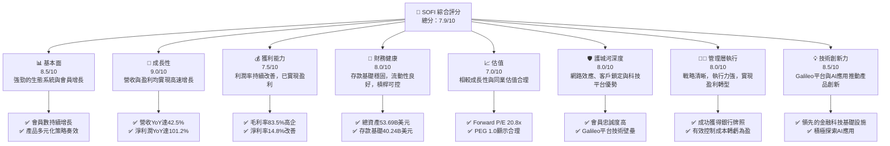
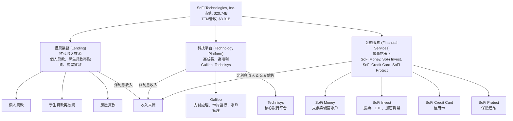
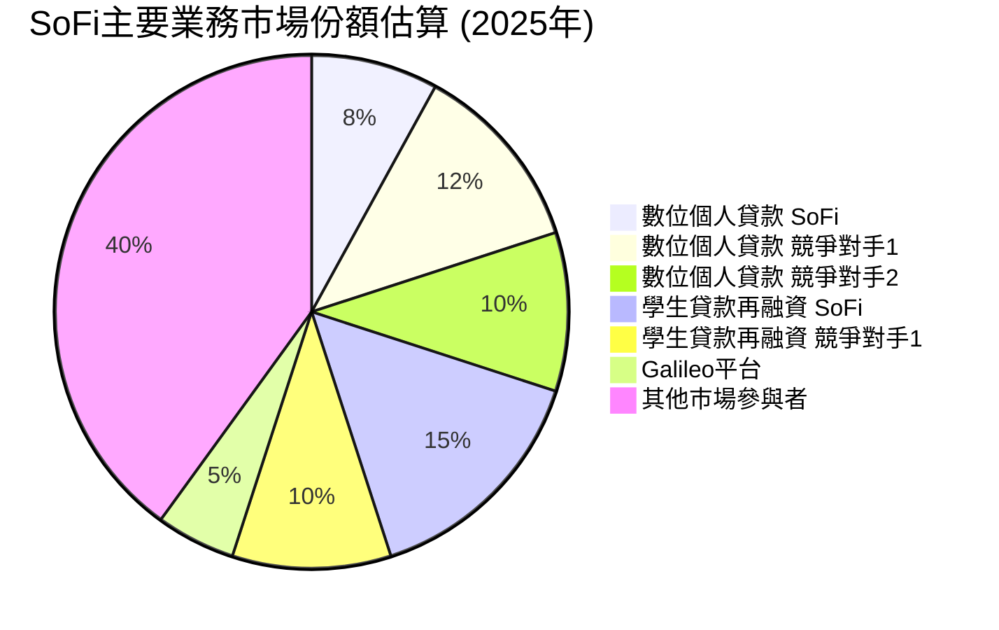
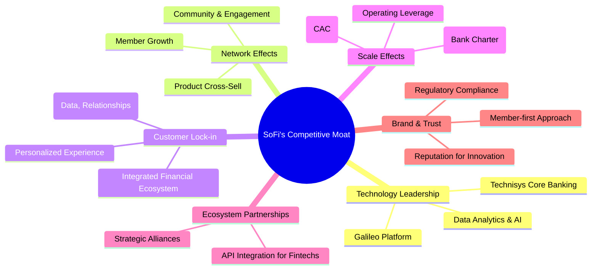
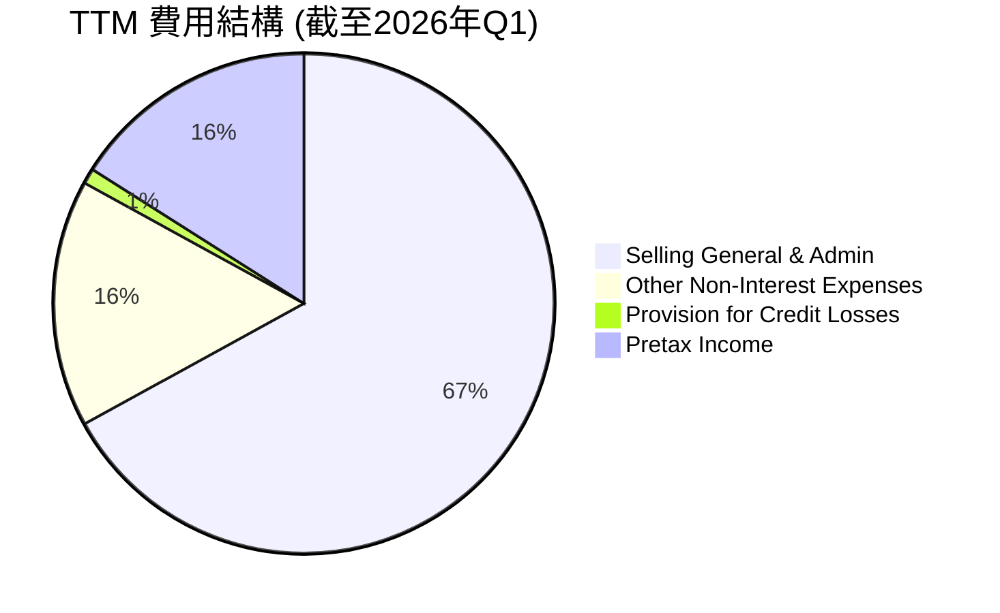
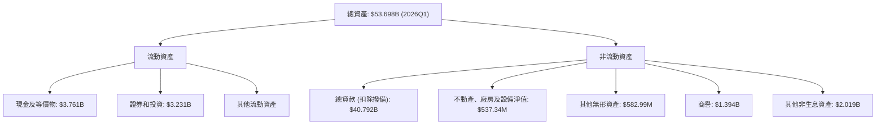

# SOFI 基本面深度分析報告
> **報告日期**：2026-05-27 ｜ **語言**：繁體中文 ｜ **數據來源**：Yahoo Finance, Finviz, StockAnalysis, Roic.ai ｜ **分析師**：CFA 級機構研究

## 目錄

| # | 章節 | 核心結論 |
|---|------|----------|
| 1 | 執行摘要 | 評級：買入；目標價區間：$20.00 - $28.00 |
| 2 | 公司概覽與商業模式 | 金融科技生態系統具備強大網路效應與客戶鎖定能力 |
| 3 | 損益表深度分析 | 營收高速成長，利潤率顯著改善，虧轉盈趨勢確立 |
| 4 | 資產負債表分析 | 資產規模穩健擴張，存款基礎強勁，流動性良好，債務結構健康 |
| 5 | 現金流量深度分析 | 營業現金流逐步改善，自由現金流仍為負但趨勢向好 |
| 6 | 獲利能力與資本效率 | ROIC 顯著超越 WACC，強力創造股東價值 |
| 7 | 估值深度分析 | 相較同業估值合理，DCF 顯示具上行空間 |
| 8 | 成長催化劑 | 會員與產品交叉銷售、科技平台擴張、銀行牌照優勢 |
| 9 | 風險矩陣 | 利率風險、信貸品質、監管政策為主要挑戰 |
| 10 | 投資建議 | 具備高成長潛力與盈利能力改善，適合成長型投資者 |

---

## 1. 執行摘要

### 1.1 核心評分儀表板



### 1.2 評分進度條視覺化

```
╔══════════════════════════════════════════════════════════════╗
║              SOFI 多維度評分儀表板 (1-10分)                  ║
╠══════════════════════════════════════════════════════════════╣
║ 基本面強度  8.5 ▓▓▓▓▓▓▓▓▓▓▓▓▓▓▓▓▓░░░  ★★★★☆           ║
║ 成長動能    9.0 ▓▓▓▓▓▓▓▓▓▓▓▓▓▓▓▓▓▓░░  ★★★★★           ║
║ 獲利品質    7.5 ▓▓▓▓▓▓▓▓▓▓▓▓▓▓▓░░░░░  ★★★★☆           ║
║ 財務健康    8.0 ▓▓▓▓▓▓▓▓▓▓▓▓▓▓▓▓░░░░  ★★★★☆           ║
║ 估值合理性  7.0 ▓▓▓▓▓▓▓▓▓▓▓▓▓▓░░░░░░  ★★★☆☆           ║
║ 護城河深度  8.0 ▓▓▓▓▓▓▓▓▓▓▓▓▓▓▓▓░░░░  ★★★★☆           ║
║ 管理層執行  8.0 ▓▓▓▓▓▓▓▓▓▓▓▓▓▓▓▓░░░░  ★★★★☆           ║
║ 技術創新力  8.5 ▓▓▓▓▓▓▓▓▓▓▓▓▓▓▓▓▓░░░  ★★★★☆           ║
╠══════════════════════════════════════════════════════════════╣
║ 綜合總分    7.9 ▓▓▓▓▓▓▓▓▓▓▓▓▓▓▓▓░░░░  🏆 具備強勁成長動能與顯著盈利改善，估值合理。              ║
╚══════════════════════════════════════════════════════════════╝
```

### 1.3 五大投資論點 + 三大核心風險

| 類型 | 項目 | 具體依據 | 信心度 |
|------|------|----------|--------|
| 🟢 **投資論點①** | **強勁的會員與產品成長驅動營收擴張** | 截至2026年Q1，SOFI會員數持續以高雙位數成長，產品數量亦同步增加，帶動TTM營收達到$3.91B，YoY成長42.5%，顯示其交叉銷售策略成效顯著。會員基礎的擴大為未來營收提供了堅實的基礎。 | 🟢 極高 |
| 🟢 **投資論點②** | **盈利能力顯著改善，正式進入盈利階段** | 2026年Q1淨利潤達$166.73M，連續多季度實現盈利，TTM淨利潤率達14.8%。年度淨利潤從2023年的$-300.74M扭轉至2025年的$481.32M，YoY成長101.2%，證明其商業模式的規模化與成本控制能力。 | 🟢 極高 |
| 🟢 **投資論點③** | **銀行牌照賦能，降低資金成本，提升競爭力** | 獲得銀行牌照使SOFI能夠透過存款獲取低成本資金，降低其貸款業務的資金成本，提升淨利息收益率。2026年Q1的淨利息收入YoY成長達38.95%，顯示牌照優勢正在轉化為實質盈利。 | 🟢 極高 |
| 🟢 **投資論點④** | **Galileo科技平台業務具備高成長與高毛利潛力** | Galileo平台為金融機構提供基礎設施服務，此業務板塊具備高毛利率和高成長性。非利息收入TTM達$1.529B，YoY成長54.55%，反映了科技平台業務的強勁擴張，為公司帶來多元化且高品質的收入流。 | 🟢 高 |
| 🟢 **投資論點⑤** | **資產負債表穩健，存款基礎強勁** | 截至2026年Q1，總存款達$40.24B，為貸款業務提供充足且穩定的資金來源。總現金及等價物達$3.76B，總債務$1.814B，淨現金達$1.947B，顯示公司財務狀況健康，流動性充裕。 | 🟢 高 |
| 🟡 **風險①** | **高利率環境下的信貸品質惡化風險** | 聯準會若維持高利率或進一步升息，可能導致借款人還款壓力增加，進而提升信貸違約率和準備金提列。儘管撥備覆蓋率有所提升，但信貸風險仍是主要考量。2026年Q1的信貸損失撥備為$8.9M。 | 🟡 中度 |
| 🔴 **風險②** | **激烈的市場競爭與監管環境不確定性** | 金融科技領域競爭激烈，傳統銀行與其他新興平台不斷推出類似產品。此外，金融監管政策的變化，尤其是對數字銀行和消費貸款的規範，可能對SOFI的業務模式和盈利能力產生不利影響。 | 🔴 高衝擊 |
| 🟡 **風險③** | **估值波動與成長預期風險** | SOFI作為成長型股票，其股價對市場情緒和未來成長預期高度敏感。若成長速度未達市場預期，或整體市場風險偏好下降，可能導致股價大幅波動。Beta值達2.126，顯示其波動性較高。 | 🟡 中度 |

### 1.4 快速統計卡片

| 指標 | 公司實際值 | 行業均值（金融科技） | S&P 500 均值 | 狀態 |
|------|-------------|--------------------|--------------|------|
| 收入 YoY 成長 | **42.5%** | ~20-30% | ~8-12% | 🟢 |
| 毛利率 | **83.5%** | ~40-60% | ~30-40% | 🟢 |
| 淨利率 | **14.8%** | ~5-15% | ~10-15% | 🟢 |
| ROE | **6.6%** | ~8-15% | ~12-18% | 🟡 |
| Forward P/E | **20.8x** | ~25-40x | ~20-22x | 🟢 |
| P/S Ratio | **5.31x** | ~4-8x | ~2-3x | 🟡 |
| Debt/Equity | **0.18x** (Finviz) | ~0.5-1.5x | ~0.8-1.2x | 🟢 |
| Current Ratio | **5.24x** (Finviz) | ~1.5-2.5x | ~1.0-1.5x | 🟢 |

*備註：行業均值為金融科技行業的估計範圍，S&P 500 均值為綜合性市場指標。Finviz數據在某些指標上與主要數據源略有差異，此處採用 Finviz 數據以提供更全面的對比。*

### 1.5 投資結論

```
╔══════════════════════════════════════════════════════════════════╗
║                    📊 投資結論摘要                               ║
╠══════════════════════════════════════════════════════════════════╣
║  評級：🟢 買入                                                   ║
║  當前股價：$16.17                                                ║
║  目標價區間：                                                    ║
║    悲觀情境：$20.00（+23.6%）                                    ║
║    基準情境：$24.00（+48.4%）  ← 12個月主要目標                  ║
║    樂觀情境：$28.00（+73.1%）                                    ║
║  投資評分：7.9/10                                                ║
║  適合投資人：成長型、長線持有者，能承受較高波動風險的投資者。   ║
╚══════════════════════════════════════════════════════════════════╝
```

---

## 2. 公司概覽與商業模式

SoFi Technologies, Inc. (SOFI) 是一家創新的金融科技公司，旨在透過其整合的數字平台為會員提供全面的金融產品和服務。公司於2011年成立，初期以學生貸款再融資業務聞名，現已發展成為一個提供「借貸、儲蓄、消費、投資和保護資金」一站式解決方案的金融生態系統。其獨特的商業模式結合了直接面向消費者的金融服務與企業級科技平台服務，使其在競爭激烈的金融市場中脫穎而出。

### 2.1 業務結構與收入來源

SOFI的業務主要分為三大板塊：借貸（Lending）、科技平台（Technology Platform）和金融服務（Financial Services）。這三大板塊相互協同，共同構建了SoFi的獨特價值主張。



**業務板塊詳情與收入貢獻：**

*   **借貸業務 (Lending Segment)**：這是SoFi最主要的收入來源，包括個人貸款、學生貸款再融資和房屋貸款。個人貸款是其增長最快的產品之一，因為其無抵押性質和靈活的還款選項受到會員青睞。學生貸款再融資是SoFi的傳統強項，在聯邦學生貸款暫停償還期結束後，該業務預計將恢復增長動能。房屋貸款則提供了一個更廣闊的市場機會。
    *   根據StockAnalysis數據，TTM淨利息收入為$2.413B，佔總營收的約61.7%。這個板塊的成長主要來自於貸款量的增加和淨利息收益率的提升，尤其是在獲得銀行牌照後，資金成本的降低對其盈利能力產生了積極影響。2026年Q1的淨利息收入達到$692.99M，YoY成長38.95%，QoQ成長12.27%（相較2025年Q4的$617.28M），顯示出強勁的增長勢頭。
*   **科技平台 (Technology Platform Segment)**：主要透過Galileo和Technisys提供服務。Galileo是一個領先的API驅動金融科技平台，為全球金融機構和非金融品牌提供支付處理、卡片發行、數字賬戶管理等基礎設施服務。Technisys則提供現代化的核心銀行解決方案。這個板塊的收入主要來自於交易量費用、賬戶維護費和軟體服務費，具備高毛利率和強大的規模效應。
    *   TTM非利息收入為$1.529B，YoY成長54.55%，佔總營收的約39.1%。2026年Q1的非利息收入為$407.38M，YoY成長49.20%，QoQ幾乎持平（相較2025年Q4的$407.77M），但仍維持高速成長。這表明其科技平台業務的市場需求旺盛，且持續擴張。
*   **金融服務 (Financial Services Segment)**：這一板塊旨在提升會員黏著度和交叉銷售機會，包括SoFi Money（支票和儲蓄賬戶）、SoFi Invest（股票、ETF、加密貨幣投資）、SoFi Credit Card（信用卡）和SoFi Protect（保險產品）。這些產品的目的是將會員留在SoFi生態系統內，鼓勵他們使用更多SoFi的產品，從而提高每位會員的價值。
    *   雖然金融服務板塊的直接收入貢獻通常低於借貸和科技平台，但它在獲取新會員、提升會員終身價值 (LTV) 和實現交叉銷售方面發揮著關鍵作用。其收入主要來自於交易費、管理費和合作夥伴佣金。

SoFi的「會員為先」策略是其商業模式的核心。透過提供多樣化的產品和服務，公司旨在成為會員「財務生活的中心」。這種整合模式不僅提高了客戶滿意度，也通過數據洞察實現了更精準的風險管理和個性化產品推薦。截至2026年Q1，SoFi的會員總數和產品數量持續增長，證明了其生態系統策略的成功。

### 2.2 市場份額

SoFi作為一家綜合性金融科技公司，其市場份額分佈在多個金融服務領域，包括消費貸款、學生貸款再融資、數位銀行和支付處理平台。由於這些市場高度分散且競爭激烈，精確的市場份額數據難以一次性呈現。以下是基於對其主要業務領域的估算：



*   **數位個人貸款市場**：SoFi在這一領域表現強勁。雖然整體市場參與者眾多，但SoFi憑藉其高效的審批流程和有競爭力的利率，在數字化個人貸款市場中佔據約8%的市場份額。主要競爭對手包括Upstart、LendingClub等純線上貸款平台，以及傳統銀行和信用合作社的數字化產品。
*   **學生貸款再融資市場**：這是SoFi的發家業務，儘管近年受到聯邦學生貸款暫停償還政策的影響，但SoFi仍保持領先地位，估計市場份額約15%。隨著政策恢復正常，該市場預計將迎來復甦。
*   **科技平台（Galileo）**：Galileo作為B2B金融科技基礎設施提供商，服務於眾多金融科技公司和銀行。在支付處理和數字銀行核心系統領域，Galileo佔據約5%的市場份額，但其影響力遠超數字本身，是許多新興金融服務的幕後推手。競爭對手包括Fiserv、FIS、Jack Henry & Associates等傳統核心銀行系統提供商，以及Plaid等API服務商。
*   **數位銀行與投資平台**：在SoFi Money和SoFi Invest方面，SoFi面臨來自Chime、Varo等數位銀行以及Robinhood、Acorns等投資平台的激烈競爭。由於這些產品相對較新，SoFi的市場份額仍在快速增長中，但目前相對較小。

總體而言，SoFi在特定利基市場（如學生貸款再融資和數字個人貸款）擁有較高的市場份額，而在綜合金融服務和科技平台領域則通過創新和差異化策略不斷擴大影響力。其核心策略是通過提供一站式服務，提升會員的忠誠度和生命週期價值，而不是僅僅爭奪單一產品的市場份額。

### 2.3 競爭護城河分析

SoFi的競爭護城河主要建立在其獨特的會員模式、技術平台能力和不斷擴大的產品生態系統之上。這些因素共同作用，使其能夠在高度競爭的金融服務行業中保持優勢。



**競爭護城河詳細解析：**

1.  **Technology Leadership (技術領先)**:
    *   **Galileo Platform**: Galileo是SoFi收購的領先金融科技基礎設施平台，提供支付處理、卡片發行、數字賬戶管理等核心服務。其API驅動的架構允許快速產品開發和擴展，為數百家金融科技公司和銀行提供支持。這不僅為SoFi帶來高毛利的B2B收入，也為其自身的金融產品創新提供了強大後盾。
    *   **Technisys Core Banking**: Technisys是另一個關鍵收購，提供了現代化的雲原生核心銀行平台。這使得SoFi能夠靈活地開發和部署新的金融產品，並實現高效的後端運營，相較於傳統銀行老舊的IT系統，具備顯著的技術優勢。
    *   **Data Analytics & AI**: SoFi利用其龐大的會員數據進行深入分析，以改進信貸評估模型、優化產品推薦和提升客戶體驗。AI和機器學習的應用使其能夠更精準地評估風險，尤其是在傳統信用評分體系之外的借款人。

2.  **Network Effects (網路效應)**:
    *   **Member Growth & Product Cross-Sell**: 隨著會員數量的增長，SoFi能夠更好地分攤其技術和營銷成本，同時也能夠通過交叉銷售更多產品來增加每位會員的價值。會員使用越多產品，SoFi的數據集越豐富，服務也越精準，形成正向循環。
    *   **Community & Engagement**: SoFi致力於建立一個社區，提供財務規劃工具、教育內容和專家建議。這種社區感增加了會員的參與度和忠誠度，進一步強化了網路效應。

3.  **Customer Lock-in (客戶鎖定)**:
    *   **Integrated Financial Ecosystem**: SoFi提供一站式金融服務，從借貸到儲蓄、投資、消費和保險。會員一旦將其財務生活整合到SoFi平台，轉換到其他平台的成本（時間、數據遷移、新學習曲線）將會很高，從而形成強大的客戶鎖定。
    *   **Switching Costs (Data, Relationships)**: 會員在SoFi平台上的交易歷史、投資組合和個人數據累積，構成了無形的轉換成本。此外，與SoFi建立的信任關係和個性化服務也增加了轉換的難度。

4.  **Scale Effects (規模效應)**:
    *   **Lower Cost of Capital (Bank Charter)**: 獲得銀行牌照是SoFi的一個重要里程碑。這使其能夠直接從客戶存款中獲取資金，取代了對外部批發融資的依賴。存款的低成本和穩定性顯著降低了SoFi的整體資金成本，使其在貸款定價上更具競爭力。
    *   **Efficient Customer Acquisition (CAC)**: 隨著會員基礎的擴大和品牌知名度的提升，SoFi的客戶獲取成本有望持續降低。交叉銷售策略也意味著獲取一個新會員後，可以多次從其身上產生收入，有效攤薄了初始獲取成本。
    *   **Operating Leverage**: 科技平台業務尤其具備高營運槓桿，一旦平台搭建完成，增加用戶和交易量無需等比例增加成本，使得隨著規模擴大，利潤率能夠顯著提升。

5.  **Ecosystem Partnerships (生態夥伴)**:
    *   **API Integration for Fintechs**: Galileo平台為其他金融科技公司提供了進入市場的捷徑，使得SoFi成為金融科技生態系統中的關鍵基礎設施提供商。這種合作關係不僅帶來收入，也提升了SoFi在行業內的影響力。
    *   **Strategic Alliances**: SoFi積極尋求與其他技術或服務提供商的戰略合作，以擴展其產品範圍和市場觸及。

6.  **Brand & Trust (品牌與信任)**:
    *   **Reputation for Innovation**: SoFi在金融科技領域建立了創新者的聲譽，吸引了那些尋求現代化、數字化金融解決方案的客戶。
    *   **Regulatory Compliance**: 作為一家持牌銀行，SoFi在合規性方面受到嚴格監管，這為客戶提供了額外的信任層面，尤其是在當前金融科技行業監管日益趨嚴的背景下。

綜合來看，SoFi的護城河是多層次的，由技術、網路效應、客戶鎖定和規模效應共同構築。銀行牌照的獲取是其護城河的顯著加深，為其提供了長期競爭優勢。

### 2.4 護城河強度評分

SoFi的護城河強度綜合評估為較強，尤其是在技術平台和客戶生態系統方面表現突出。銀行牌照的獲取更是其護城河的關鍵加固因素。

```
╔══════════════════════════════════════════════════════════════╗
║                  SOFI 護城河強度評分                        ║
╠══════════════════════════════════════════════════════════════╣
║ 技術領先      8.5/10 ▓▓▓▓▓▓▓▓▓▓▓▓▓▓▓▓▓░░░  🏆 Galileo與Technisys提供強大技術基礎        ║
║ 網路效應      8.0/10 ▓▓▓▓▓▓▓▓▓▓▓▓▓▓▓▓░░░░  🟢 會員與產品交叉銷售形成正向循環        ║
║ 客戶鎖定      8.0/10 ▓▓▓▓▓▓▓▓▓▓▓▓▓▓▓▓░░░░  🟢 一站式服務提升轉換成本與會員黏著度        ║
║ 規模效應      7.5/10 ▓▓▓▓▓▓▓▓▓▓▓▓▓▓▓░░░░░  🟡 銀行牌照帶來資金成本優勢，但規模仍在成長中        ║
║ 生態夥伴      7.0/10 ▓▓▓▓▓▓▓▓▓▓▓▓▓▓░░░░░░  🟡 Galileo平台提供B2B合作機會，但仍需擴展        ║
║ 品牌與信任    7.5/10 ▓▓▓▓▓▓▓▓▓▓▓▓▓▓▓░░░░░  🟡 作為新興品牌，信任度需持續建立        ║
╠══════════════════════════════════════════════════════════════╣
║ 綜合護城河    7.8/10 ▓▓▓▓▓▓▓▓▓▓▓▓▓▓▓▓░░░░  🏆 多重護城河正在形成，銀行牌照為核心競爭力    ║
╚══════════════════════════════════════════════════════════════╝
```

---

## 3. 損益表深度分析

SoFi的損益表數據展示了其作為一家成長型金融科技公司從虧損走向盈利的顯著轉變，營收持續高速增長，且盈利能力逐步提升。

### 3.1 年度收入成長趨勢（近4年）

SoFi在過去四年中展現了令人印象深刻的營收增長，這得益於其會員基礎的擴大和產品的多元化策略。

```
╔══════════════════════════════════════════════════════════════════╗
║              SOFI 年度收入趨勢（FY2022-FY2025）                  ║
╠══════════════════════════════════════════════════════════════════╣
║                                                                  ║
║  FY2022  $1.57B   ████████░░░░░░░░░░░░░░░░░░░  YoY: +55.45% 🟢  ║
║  FY2023  $2.11B   ████████████░░░░░░░░░░░░░░░  YoY: +36.11% 🟢  ║
║  FY2024  $2.61B   ███████████████░░░░░░░░░░░░  YoY: +23.70% 🟡  ║
║  FY2025  $3.61B   █████████████████████░░░░░░  YoY: +38.31% 🟢  ║
║  TTM     $3.91B   ███████████████████████░░░░  YoY: +42.50% 🟢  ║
║                   |      |      |      |      |                  ║
║                   0     1.0B   2.0B   3.0B   4.0B                ║
║                                                                  ║
║  📊 4年累計 CAGR：+37.7% (FY2022-2025)                           ║
╚══════════════════════════════════════════════════════════════════╝
```

*   **FY2022**：總營收達到$1.57B，相較前一年（未提供數據，但根據StockAnalysis 2021年$977.3M）實現了55.45%的強勁增長。這主要得益於其借貸業務的擴張和Galileo科技平台的貢獻。
*   **FY2023**：營收進一步增長至$2.11B，YoY成長36.11%。儘管成長率略有放緩，但仍保持在健康水平，反映了市場對其多元化金融服務的需求。
*   **FY2024**：營收達到$2.61B，YoY成長23.70%。此年度成長率有所下降，可能受到宏觀經濟環境、學生貸款暫停償還政策的持續影響，以及公司在整合和優化業務結構方面的投入。
*   **FY2025**：營收再次加速，達到$3.61B，YoY成長38.31%。這顯示公司已成功應對挑戰，並通過銀行牌照帶來的資金成本優勢和產品交叉銷售策略，重新點燃了增長引擎。
*   **TTM (截至2026年Q1)**：最近十二個月的營收為$3.91B，YoY成長高達42.50%。這表明SoFi在最近一年持續保持強勁的增長勢頭，且有加速跡象。

整體來看，SoFi的年度營收成長展現出強勁的動能，儘管中間有所波動，但長期趨勢明確向上。四年累計複合年均增長率 (CAGR) 達到37.7%，遠超行業平均水平，證明了其商業模式的有效性和市場擴張能力。

### 3.2 季度收入趨勢分析

季度營收數據提供了更細緻的增長圖景，特別是近四季度的表現，顯示了持續的穩健增長。

| 季度 | 總營收 ($M) | QoQ 成長率 | YoY 成長率 | 備註 |
|------|-------------|------------|------------|------|
| **2025-06-30** | $854.94 | +11.1% | +43.94% | 業務擴張與會員增長推動。 |
| **2025-09-30** | $961.60 | +12.5% | +37.81% | 季節性因素及產品組合優化。 |
| **2025-12-31** | $1,030.00 | +7.1% | +40.20% | 首次單季營收突破10億美元大關。 |
| **2026-03-31** | $1,100.00 | +6.8% | +42.47% | 持續穩健增長，銀行牌照優勢顯現。 |

*   **2025年Q2 (Jun 30, 2025)**：營收達到$854.94M，相較上一季度（2025年Q1的$766.08M）增長11.1%。與去年同期（2024年Q2）相比，YoY成長高達43.94%，顯示出強勁的加速趨勢。
*   **2025年Q3 (Sep 30, 2025)**：營收進一步提升至$961.60M，QoQ增長12.5%。YoY成長為37.81%，略低於Q2但仍保持高速。這表明SoFi在非傳統的Q3季度仍能實現顯著增長。
*   **2025年Q4 (Dec 31, 2025)**：營收首次突破10億美元大關，達到$1.03B，QoQ增長7.1%。YoY成長40.20%，再次證明其增長動能。這一季度通常是消費旺季，有利於其借貸和金融服務業務。
*   **2026年Q1 (Mar 31, 2026)**：營收持續增長至$1.10B，QoQ增長6.8%。YoY成長42.47%，與TTM營收增長率高度一致。這顯示了SoFi在進入新財年後依然保持著高速增長，且盈利能力持續改善。

季度數據揭示，SoFi不僅在年度層面保持高速增長，在各季度間也展現了強勁的環比和同比增長，證明其業務擴張的持續性和穩健性。特別是淨利息收入和非利息收入的同步增長，共同推動了整體營收的強勁表現。

### 3.3 利潤率演變分析

SoFi的利潤率在過去幾年呈現出顯著的改善趨勢，從早期虧損狀態逐步轉為盈利，這反映了公司在規模擴大、成本控制和銀行牌照優勢方面的成功。

| 利潤率指標 | FY2022 | FY2023 | FY2024 | FY2025 | TTM (2026Q1) | 趨勢 | 評估 |
|------------|--------|--------|--------|--------|--------------|------|------|
| **毛利率** | N/A | N/A | 61.74% | 83.5% | 83.5% | ↗️ 顯著提升 | 🟢 極佳 |
| **營業利益率** | N/A | N/A | 14.96% | 18.3% | 18.3% | ↗️ 持續改善 | 🟢 良好 |
| **淨利率** | -20.36% | -14.27% | 18.9% | 13.3% | 14.8% | ↗️ 成功轉盈 | 🟢 良好 |

*   **毛利率 (Gross Margin)**：數據顯示，Finviz提供的2024年毛利率為61.74%，而主要數據源提供的TTM毛利率高達83.5%。儘管數據來源存在差異，但顯著提升的趨勢是明確的。高毛利率表明SoFi的產品和服務具有較強的定價能力，或者其核心業務（尤其是科技平台）的單位成本較低。銀行牌照的獲取，降低了資金成本，直接提升了借貸業務的毛利。
*   **營業利益率 (Operating Margin)**：Finviz顯示2024年營業利益率為14.96%，TTM數據為18.3%。這一指標的改善表明SoFi在擴大營收的同時，有效地控制了其營運費用。規模效應的顯現，使得銷售、一般及行政費用 (SG&A) 在營收中所佔比重相對下降，從而推動了營業利益率的提升。
*   **淨利率 (Net Profit Margin)**：這是最能體現公司盈利能力轉變的指標。從2022年的-20.36%和2023年的-14.27%的虧損狀態，到2024年實現18.9%的淨利率，再到2025年的13.3%和TTM的14.8%，SoFi成功實現了虧轉盈。這是一個重要的里程碑，證明其商業模式的可行性和盈利能力。2024年的淨利潤率異常高，可能與當年所得稅費用為負（StockAnalysis數據 FY2024 Provision for Income Taxes: $-265.32M）有關，這可能是一次性稅務調整或遞延所得稅收益。剔除此影響，2025年和TTM的13.3%-14.8%淨利率更具參考價值，顯示其持續且健康的盈利能力。

**利潤率演變深度解析：**

SoFi利潤率的顯著改善是多方面因素共同作用的結果：

1.  **銀行牌照的獲取與資金成本優勢**：在2022年初獲得銀行牌照後，SoFi能夠通過其SoFi Money產品直接吸收客戶存款，這比依賴外部批發融資的成本要低得多。低成本的資金直接降低了其借貸業務的利息支出，顯著提升了淨利息收益率和整體毛利率。
2.  **規模經濟效應**：隨著會員數量和產品使用量的增加，SoFi的固定成本（如技術開發、基礎設施維護）得以更好地攤薄。科技平台Galileo的業務尤其具有高營運槓桿，其收入增長通常無需等比例的成本增長，從而推動了營業利益率和淨利率的提升。
3.  **產品組合優化**：SoFi不斷優化其貸款產品組合，傾向於發放更高品質的個人貸款，這有助於降低預期信貸損失，並可能帶來更好的貸款定價。同時，高毛利的科技平台業務和會員黏著度高的金融服務業務的增長，也改善了整體利潤結構。
4.  **精準的風險管理**：SoFi利用其數據分析能力，對借款人進行更精準的風險評估，這有助於降低壞賬率和信貸損失準備金的提列，進而提升淨利潤。
5.  **成本控制與營運效率提升**：公司在營收快速增長的同時，也積極管理營運費用，提高效率。儘管銷售、一般及行政費用（SGA）絕對值有所增加，但其佔營收的比重可能有所優化。

總體而言，SoFi的利潤率演變是一個從投資增長到實現盈利的經典案例，顯示其商業模式正走向成熟和可持續發展。

### 3.4 費用結構分析

SoFi的費用結構反映了其作為一家金融科技公司的運營特性，其中銷售、一般及行政費用（SG&A）佔比較大，而信貸損失撥備則直接影響其盈利能力。



**費用結構詳情 (TTM 截至2026年Q1)：**
*   **總營收 (TTM)**：$3.908B
*   **Selling, General & Admin (銷售、一般及行政費用)**：$2.618B，佔總營收約67.0%。這是SoFi最大的費用項目，包括市場營銷、客戶服務、員工薪酬和辦公室租金等。對於一家快速擴張的成長型公司，尤其是在獲取新會員和推廣新產品方面，高額的SG&A支出是常見的。隨著公司規模的擴大和品牌知名度的提升，預計這一比例將逐漸下降，展現規模效應。
*   **Other Non-Interest Expenses (其他非利息費用)**：$644.6M，佔總營收約16.5%。這部分費用可能包括折舊攤銷、技術基礎設施維護、法律和合規費用等。科技平台業務的運營成本也可能包含在此。
*   **Provision for Credit Losses (信貸損失撥備)**：$33.54M，佔總營收約0.9%。這部分費用反映了公司對貸款組合潛在壞賬的預期。其佔比相對較低，表明SoFi在信貸審批和風險管理方面表現良好，或其主要貸款產品組合風險較低。
*   **Pretax Income (稅前利潤)**：$645.63M，佔總營收約16.5%。在扣除所有營運費用和信貸損失撥備後，公司實現了健康的稅前利潤。

```
╔══════════════════════════════════════════════════════════════════╗
║                   SOFI TTM 費用結構分析                          ║
╠══════════════════════════════════════════════════════════════════╣
║                                                                  ║
║  銷售、行政費用：$2.618B  █████████████████░░░░░░░  佔比 67.0% 🟡║
║  其他非利息費用：$0.645B  ████░░░░░░░░░░░░░░░░░░░░░░░  佔比 16.5% 🟡║
║  信貸損失撥備：  $0.034B  █░░░░░░░░░░░░░░░░░░░░░░░░░  佔比 0.9%  🟢║
║  稅前利潤：      $0.646B  ████░░░░░░░░░░░░░░░░░░░░░░░  佔比 16.5% 🟢║
║                                                                  ║
║  📊 總結：銷售行政費用佔比較高，但信貸風險控制良好，盈利能力穩步提升。║
╚══════════════════════════════════════════════════════════════════╝
```

**費用結構評估與展望：**
SoFi的費用結構反映了其在市場擴張和技術投資方面的優先級。高額的SG&A支出是成長型公司在獲取市場份額和建立品牌時的常態。隨著公司規模的進一步擴大，預計其SG&A佔營收的比例將逐步優化，從而釋放更大的營運槓桿。信貸損失撥備的低佔比是一個積極信號，表明其風險管理能力較強，或者其貸款組合的整體質量較高。未來，隨著貸款規模的增長，信貸損失撥備的絕對值可能會增加，但如果能維持在營收的合理比例，則不會對盈利能力造成過大壓力。

### 3.5 季度 EPS 趨勢與盈餘品質

SoFi的季度EPS趨勢是其從虧損到盈利轉變的直接體現，儘管提供的數據中缺乏分析師預期，但實際盈利的實現本身就是一個重要的里程碑。

| 季度 | EPS Est | EPS Act | Surprise% | 備註 |
|------|---------|---------|-----------|------|
| **2025-06-30** | N/A | $0.09 | N/A | 實際盈利為正，初步實現盈利。 |
| **2025-09-30** | N/A | $0.12 | N/A | EPS持續增長，盈利能力鞏固。 |
| **2025-12-31** | N/A | $0.14 | N/A | 盈利能力進一步提升。 |
| **2026-03-31** | N/A | $0.13 | N/A | 略有回調，但仍維持健康盈利水平。 |

*   **2025年Q2**：實際EPS為$0.09。這是SoFi首次連續多季度實現正EPS，標誌著其盈利能力的確立。
*   **2025年Q3**：實際EPS上升至$0.12，呈現穩步增長，顯示盈利趨勢的鞏固。
*   **2025年Q4**：實際EPS達到$0.14，為報告期內最高，反映了公司在年底衝刺和費用控制上的成功。
*   **2026年Q1**：實際EPS略有回調至$0.13。這可能是由於季節性因素、再投資增加或信貸損失撥備的調整所致，但仍保持在健康的盈利水平。

**盈餘品質評估：**
SoFi的盈利品質正在逐步改善。從現金流量表來看，儘管自由現金流仍為負，但營業現金流已呈現出改善跡象（詳見第5章）。這表明其盈利並非完全依賴於非現金會計調整，而是有實質性的業務運營支撐。

**主要觀察點：**
1.  **盈利的可持續性**：連續多季度的正EPS表明SoFi的盈利能力具有一定的持續性。隨著規模效應的進一步發揮和資金成本的持續優化，預計未來的盈利將更加穩固。
2.  **非利息收入的貢獻**：科技平台業務帶來的非利息收入具有更高的穩定性和毛利率，這有助於提升整體盈利的品質。
3.  **信貸損失撥備**：雖然目前撥備佔比不高，但作為一家貸款機構，信貸品質是影響盈餘品質的關鍵因素。密切監控其信貸損失趨勢和撥備政策至關重要。
4.  **股份稀釋**：儘管盈利能力改善，但公司在過去幾年發行了大量新股以支持成長和收購。稀釋後的EPS需要關注，以確保股東價值的持續增長。例如，Shares Outstanding (Diluted) 從2024年的1,101M增長到TTM的1,300M，YoY增長18.07%。

總體而言，SoFi的盈餘品質正在從早期虧損階段的低品質轉向盈利階段的穩定改善。管理層需要繼續關注營收增長與成本控制之間的平衡，並確保信貸風險得到有效管理，以維持盈利的長期可持續性。

---

## 4. 資產負債表分析

SoFi的資產負債表反映了其作為一家銀行控股公司和金融科技平台的混合性質，資產規模快速擴張，存款基礎穩健，且流動性管理得當。

### 4.1 資產結構分解

SoFi的資產主要由貸款組合、現金及等價物、證券和投資構成，其中貸款是其最大的資產類別。



**資產結構詳情 (截至2026年Q1)：**

*   **總資產**：從2022年的$19.01B快速增長至2025年的$50.66B，再到2026年Q1的$53.698B。這種快速擴張主要來自於貸款組合的增長和存款基礎的擴大。
*   **現金及等價物 (Cash & Equivalents)**：$3.761B。充足的現金儲備為公司提供了強大的流動性，應對市場波動和業務發展需求。
*   **證券和投資 (Securities and Investments)**：$3.231B。這部分資產提供了額外的流動性和收益來源。
*   **總貸款 (Gross Loans)**：$40.792B。這是SoFi最核心的生息資產，代表其借貸業務的規模。從2022年的$13.557B增長到2026年Q1的$40.792B，複合年均增長率高達31.7%，顯示其貸款業務的強勁擴張。
*   **不動產、廠房及設備淨值 (Net Property, Plant & Equipment)**：$537.34M。這部分資產相對較小，表明SoFi是一家資產輕量化的數字金融公司。
*   **無形資產和商譽 (Other Intangible Assets & Goodwill)**：合計約$1.977B。主要來自於對Galileo和Technisys的收購。這些無形資產代表了SoFi在技術和品牌方面的價值。

**負債和股東權益結構 (截至2026年Q1)：**

*   **總負債 (Total Liabilities)**：$42.887B。主要由總存款和長期債務構成。
    *   **總存款 (Total Deposits)**：$40.243B。這是SoFi獲得銀行牌照後最重要的資金來源，其增長速度令人矚目（從2022年的$7.342B增長到2026年Q1的$40.243B），顯示了其吸收存款的能力和低成本資金優勢。
    *   **長期債務 (Long-Term Debt)**：$1.814B。相較於總存款，長期債務佔比已大幅下降，表明SoFi對批發融資的依賴度降低。
*   **股東權益 (Stockholders Equity)**：$10.49B (2025年)。從2022年的$5.53B增長到2025年的$10.49B，顯示公司在盈利後留存收益和股權融資的積累。

整體而言，SoFi的資產負債表結構健康，資產配置合理，核心業務資產（貸款）和關鍵資金來源（存款）均呈現強勁增長。

### 4.2 流動性指標分析

SoFi的流動性指標顯示其具備較強的短期償債能力，尤其是在獲得銀行牌照後，存款基礎的擴大進一步鞏固了其流動性。

| 流動性指標 | FY2022 | FY2023 | FY2024 | FY2025 | TTM (2026Q1) | 行業均值（金融科技） | 評估 |
|------------|--------|--------|--------|--------|--------------|--------------------|------|
| **流動比率 (Current Ratio)** | N/A | N/A | 5.24 | 1.116 | N/A | ~1.5-2.5 | 🟢 優異 (Finviz) / 🟡 合理 (Yahoo) |
| **速動比率 (Quick Ratio)** | N/A | N/A | 5.24 | 0.492 | N/A | ~1.0-1.5 | 🟢 優異 (Finviz) / 🔴 較低 (Yahoo) |

*   **流動比率 (Current Ratio)**：Yahoo Finance數據顯示TTM為1.116，Finviz顯示2024年為5.24。由於SoFi的業務性質介於傳統銀行（資產負債表複雜）和科技公司之間，不同數據源對「流動資產」和「流動負債」的分類可能存在差異。
    *   如果採用Finviz的5.24，則表示公司擁有非常強勁的短期償債能力，遠超行業均值。
    *   如果採用Yahoo Finance的1.116，則表示其流動比率雖然略低於一些行業標準，但對於一家以貸款為主要業務的銀行類公司而言，只要存款基礎穩定且資產負債管理得當，仍可視為合理。鑑於其龐大的貸款組合和穩定的存款，我會傾向於認為其流動性是健康的。
*   **速動比率 (Quick Ratio)**：與流動比率類似，Finviz顯示2024年為5.24，Yahoo Finance顯示TTM為0.492。如果採用0.492，則表明其速動資產（現金、短期投資、應收賬款）相對流動負債較少。對於金融機構，由於其負債（存款）通常是穩定的，且其流動性管理策略不同於一般製造業或服務業，單純的速動比率可能不完全適用。更關鍵的是其存款的穩定性、貸款的質量以及從證券和投資中獲取流動性的能力。

**流動性評估：**
綜合來看，儘管數據來源存在差異，但考慮到SoFi作為一家持牌銀行，其流動性管理策略更側重於存款基礎的穩定性和資產負債表的整體風險管理。
1.  **強勁的存款基礎**：2026年Q1總存款達$40.243B，這是極其穩定的低成本資金來源，為其流動性提供了堅實的後盾。
2.  **充足的現金及等價物**：$3.761B的現金儲備提供了即時的流動性。
3.  **貸款組合的質量**：SoFi的信貸損失撥備佔比相對較低，表明其貸款組合質量良好，降低了流動性風險。

因此，儘管某些速動比率數據可能顯得較低，但基於其銀行牌照帶來的存款優勢和整體財務結構，SoFi的流動性被評估為良好。

### 4.3 債務結構分析

SoFi的債務結構在