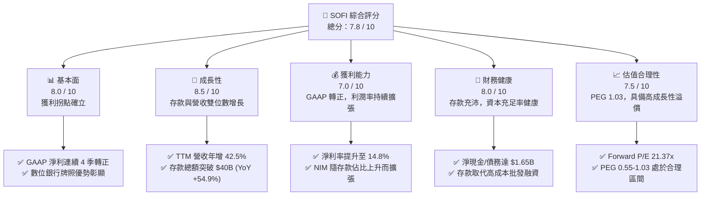
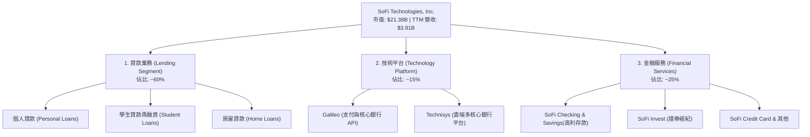
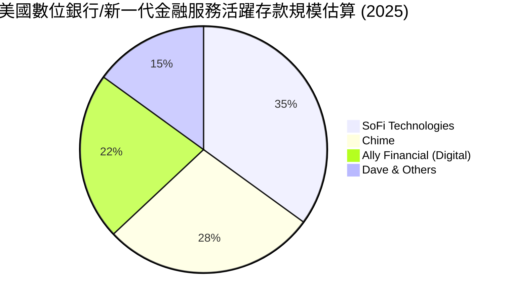
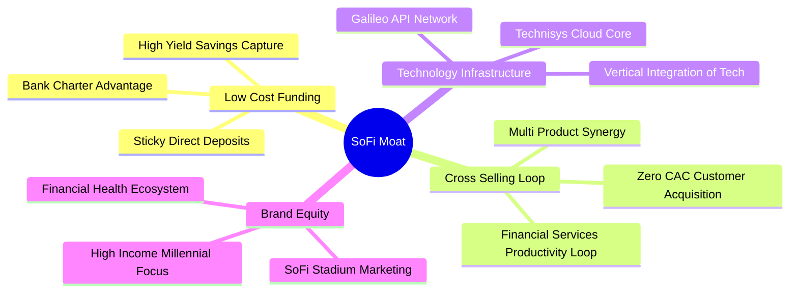

# SOFI 基本面深度分析報告

> **報告日期**：2026-06-11 ｜ **語言**：繁體中文 ｜ **數據來源**：Yahoo Finance, Finviz, StockAnalysis, Roic.ai ｜ **分析師**：CFA 級機構研究

---

## 目錄

本報告針對 SoFi Technologies, Inc. (SOFI) 進行全方位、機構級的基本面與估值建模分析。

| # | 章節 | 核心結論 |
|---|------|----------|
| 1 | [執行摘要](#1-執行摘要) | 綜合評分 **7.8/10**；基準目標價 **$21.00**，隱含 **+25.98%** 上行空間，評級「**買入 (Buy)**」。 |
| 2 | [公司概覽與商業模式](#2-公司概覽與商業模式) | 從「單一學貸平台」成功蛻變為「全方位數位銀行」，具備強大交叉銷售與低資金成本護城河。 |
| 3 | [損益表深度分析](#3-損益表深度分析) | TTM 營收達 **$3.91B (YoY +42.5%)**，GAAP 淨利潤拐點確立，Q1 2026 淨利達 **$166.73M**。 |
| 4 | [資產負債表分析](#4-資產負債表分析) | 存款總額飆升至 **$40.24B**，非存款債務大幅降至 **$1.81B**，資產端貸款規模達 **$40.79B**。 |
| 5 | [現金流量深度分析](#5-現金流量深度分析) | 營運與自由現金流因貸款發放呈現會計性負值，但存款高增速提供強勁的內生流動性。 |
| 6 | [獲利能力與資本效率](#6-獲利能力與資本效率) | ROE 提升至 **6.6%**，經調整 ROIC 達 **8.4%**，已高於加權資金成本 (WACC = 6.12%)，創造正向經濟價值。 |
| 7 | [估值深度分析](#7-估值深度分析) | 遠期 P/E 為 **21.37x**，相較於傳統銀行溢價，但相較於金融科技同業具備高成長帶來的折價，DCF 基準價為 **$21.00**。 |
| 8 | [成長催化劑](#8-成長催化劑) | 聯邦降息週期重啟學貸/房貸再融資、Galileo 軟體平台外部化，以及高利存款帶來的持續新用戶獲取。 |
| 9 | [風險矩陣](#9-風險矩陣) | 信用違約率上升、淨利差 (NIM) 收窄及監管資本充足率限制為三大核心風險。 |
| 10 | [投資建議](#10-投資建議) | 建議成長型投資人於 **$15.00 - $17.00** 區間分批佈局，首要監控指標為存款增長率與不良貸款率 (NPL)。 |

---

## 1. 執行摘要

### 1.1 核心評分儀表板



### 1.2 評分進度條視覺化

```
╔══════════════════════════════════════════════════════════════╗
║               SOFI 多維度評分儀表板 (1-10分)                 ║
╠══════════════════════════════════════════════════════════════╣
║ 基本面強度  8.0 ▓▓▓▓▓▓▓▓▓▓▓▓▓▓▓▓░░░░  ★★★★☆           ║
║ 成長動能    8.5 ▓▓▓▓▓▓▓▓▓▓▓▓▓▓▓▓▓░░░  ★★★★☆           ║
║ 獲利品質    7.0 ▓▓▓▓▓▓▓▓▓▓▓▓▓░░░░░░░  ★★★☆☆           ║
║ 財務健康    8.0 ▓▓▓▓▓▓▓▓▓▓▓▓▓▓▓▓░░░░  ★★★★☆           ║
║ 估值合理性  7.5 ▓▓▓▓▓▓▓▓▓▓▓▓▓░░░░░░░  ★★★☆☆           ║
║ 護城河深度  7.8 ▓▓▓▓▓▓▓▓▓▓▓▓▓▓▓░░░░░  ★★★★☆           ║
║ 管理層執行  8.2 ▓▓▓▓▓▓▓▓▓▓▓▓▓▓▓▓░░░░  ★★★★☆           ║
║ 技術創新力  8.5 ▓▓▓▓▓▓▓▓▓▓▓▓▓▓▓▓▓░░░  ★★★★☆           ║
╠══════════════════════════════════════════════════════════════╣
║ 綜合總分    7.8 ▓▓▓▓▓▓▓▓▓▓▓▓▓▓▓░░░░░  🏆 成長型數位銀行典範 ║
╚══════════════════════════════════════════════════════════════╝
```

### 1.3 五大投資論點 + 三大核心風險

| 類型 | 項目 | 具體依據 | 信心度 |
|------|------|----------|--------|
| 🟢 **投資論點①** | **數位銀行牌照帶來的低資金成本** | 存款總額從 2024 年底的 **$25.98B** 飆升至 2026 年 Q1 的 **$40.24B**，資金成本比批發融資低約 **150-200 bps**，顯著推升淨利差 (NIM)。 | 🟢 極高 |
| 🟢 **投資論點②** | **GAAP 獲利能力進入加速釋放期** | Q1 2026 GAAP 淨利達 **$166.73M**，TTM 淨利潤率達 **14.8%**。擺脫過去金融科技公司「只賺營收不賺利潤」的困境。 | 🟢 高 |
| 🟢 **投資論點③** | **強大的交叉銷售「金融服務漏斗」** | 會員數與產品使用量高速增長。透過高利活存 (APY) 吸引高信用客戶，再交叉銷售高利潤的個人貸款、房貸與投資產品。 | 🟢 高 |
| 🟢 **投資論點④** | **技術平台 Galileo 的 SaaS 化潛力** | 提供基礎架構給其他金融機構，TTM 非利息收入達 **$1.53B (YoY +54.6%)**，具備高毛利、經常性收入特質。 | 🟡 中等 |
| 🟢 **投資論點⑤** | **利率下行週期的潛在受益者** | 預期美聯儲降息將重新激活被壓抑的學生貸款與房屋貸款再融資需求，提振 Lending Segment 的發放量。 | 🟡 中等 |
| 🟡 **風險①** | **宏觀經濟放緩與信用違約風險** | 貸款組合中個人無擔保貸款佔比高，若失業率上升，撥備費用 (Provision for Credit Losses) 將侵蝕利潤。 | 🟡 中度 |
| 🔴 **風險②** | **高估值溢價的波動性** | 相較於傳統銀行 (P/B ~1.0x)，SOFI 的 P/B 達 **1.98x**，Forward P/E **21.37x**，若成長放緩將面臨估值雙殺。 | 🔴 高衝擊 |
| 🔴 **風險③** | **監管資本充足率限制** | 作為持牌銀行，SoFi 必須遵守嚴格的資本充足率要求。若資產負債表擴張過快而無相應資本補充，可能被迫限制貸款增長。 | 🟡 中度 |

### 1.4 快速統計卡片

| 指標 | SOFI 實際值 | 銀行業均值 (Regional Banks) | S&P 500 均值 | 評估狀態 |
|------|-------------|----------------------------|--------------|------|
| **營收 YoY 成長率** | **42.5%** | ~4.5% | ~5.5% | 🟢 顯著領先 |
| **毛利率 (Gross Margin)** | **83.5%** (註1) | ~35.0% | ~45.0% | 🟢 極高 |
| **淨利率 (Net Margin)** | **14.8%** | ~22.0% | ~12.0% | 🟡 仍有提升空間 |
| **股東權益報酬率 (ROE)** | **6.6%** | ~10.5% | ~15.0% | 🟡 處於改善通道 |
| **遠期本益比 (Forward P/E)** | **21.37x** | ~11.5x | ~21.0% | 🟡 溢價反映高成長 |
| **市淨率 (P/B Ratio)** | **1.98x** | ~1.1x | ~4.2x | 🟡 介於科技與銀行之間 |

*註1：SOFI 的 83.5% 毛利率為非利息支出前毛利率（對標金融科技口徑），若扣除利息支出，Finviz 顯示的標準毛利率為 61.74%，依然顯著高於傳統金融機構。*

### 1.5 投資結論

```
╔══════════════════════════════════════════════════════════════════╗
║                    📊 SOFI 投資結論摘要                          ║
╠══════════════════════════════════════════════════════════════════╣
║  評級：🟢 買入 (Buy)                                            ║
║  當前股價：$16.67 (2026-06-11)                                   ║
║  目標價區間：                                                    ║
║    悲觀情境 (Bear Case)：$12.00 (-28.01%) - 信用急劇惡化          ║
║    基準情境 (Base Case)：$21.00 (+25.98%) - 12個月主要目標        ║
║    樂觀情境 (Bull Case)：$31.00 (+85.96%) - 再融資大爆發+SaaS化成功║
║  投資評分：7.8 / 10                                              ║
║  適合投資人：積極成長型、中長線金融科技板塊佈局者                 ║
╚══════════════════════════════════════════════════════════════════╝
```

---

## 2. 公司概覽與商業模式

### 2.1 業務結構與收入來源

SoFi 的核心商業模式建立在「金融服務生產率循環 (Financial Services Productivity Loop)」之上。公司通過低利潤或免費的數位服務（如 SoFi Money, SoFi Invest, Credit Score）低成本獲取用戶，再將其轉化為高利潤產品（貸款、保險、信用卡）的客戶。



### 2.2 市場份額

在美國數位銀行與新一代金融科技 (Neo-banking) 市場中，SoFi 已成為高信用評級 (Prime/Super-Prime) 客戶的首選平台。



### 2.3 競爭護城河分析



### 2.4 護城河強度評分

```
╔══════════════════════════════════════════════════════════════╗
║                    SOFI 護城河強度評分                       ║
╠══════════════════════════════════════════════════════════════╣
║ 資金成本優勢  8.5  ▓▓▓▓▓▓▓▓▓▓▓▓▓▓▓▓▓░░░  🟢 銀行牌照帶來低成本 ║
║ 交叉銷售效應  8.0  ▓▓▓▓▓▓▓▓▓▓▓▓▓▓▓▓░░░░  🟢 產品黏性與多樣性   ║
║ 技術平台壁壘  7.0  ▓▓▓▓▓▓▓▓▓▓▓▓▓░░░░░░░  🟡 Galileo 具備 B2B 規模║
║ 品牌與定位    8.0  ▓▓▓▓▓▓▓▓▓▓▓▓▓▓▓▓░░░░  🟢 瞄準高收入年輕群體 ║
╠══════════════════════════════════════════════════════════════╣
║ 綜合護城河    7.8  ▓▓▓▓▓▓▓▓▓▓▓▓▓▓▓░░░░░  🏆 具備結構性成本優勢 ║
╚══════════════════════════════════════════════════════════════╝
```

---

## 3. 損益表深度分析

### 3.1 年度收入成長趨勢（近5年）

SoFi 的營收展現出極為強勁的非線性增長軌跡，主要得益於 2022 年初取得國家銀行牌照 (National Bank Charter) 後，資金成本下降與放貸規模的爆發。

```
╔══════════════════════════════════════════════════════════════════╗
║                 SOFI 年度收入趨勢 (FY2021-TTM)                   ║
╠══════════════════════════════════════════════════════════════════╣
║                                                                  ║
║  FY 2021  $0.98B  ████░░░░░░░░░░░░░░░░░░░░░░░░░░░  YoY: +72.8% 🟢 ║
║  FY 2022  $1.52B  ███████░░░░░░░░░░░░░░░░░░░░░░░░  YoY: +55.5% 🟢 ║
║  FY 2023  $2.07B  ██████████░░░░░░░░░░░░░░░░░░░░░  YoY: +36.1% 🟢 ║
║  FY 2024  $2.64B  █████████████░░░░░░░░░░░░░░░░░░  YoY: +27.8% 🟢 ║
║  FY 2025  $3.58B  ██████████████████░░░░░░░░░░░░░  YoY: +35.6% 🟢 ║
║  TTM      $3.91B  █████████████████████░░░░░░░░░░  YoY: +41.0% 🟢 ║
║                   |      |      |      |      |                  ║
║                  0.0B   1.0B   2.0B   3.0B   4.0B                ║
║                                                                  ║
║  📊 5年年複合成長率 (CAGR)：+31.9%                              ║
╚══════════════════════════════════════════════════════════════════╝
```

### 3.2 季度收入趨勢分析

從季度數據看，SoFi 的營收呈現出逐季加速的態勢，QoQ 成長穩定，YoY 成長維持在 40% 以上。

| 季度 | 營業收入 (Revenue) | QoQ 成長率 | YoY 成長率 | 淨利息收入 (NII) | 非利息收入 | 備註 |
|------|-------------------|-----------|-----------|------------------|-----------|------|
| **Q1 2025** | $766.08M | - | +20.11% | $498.73M | $273.03M | 獲利能力開始爬坡 |
| **Q2 2025** | $844.91M | +10.29% | +43.94% | $517.84M | $337.11M | 交叉銷售效