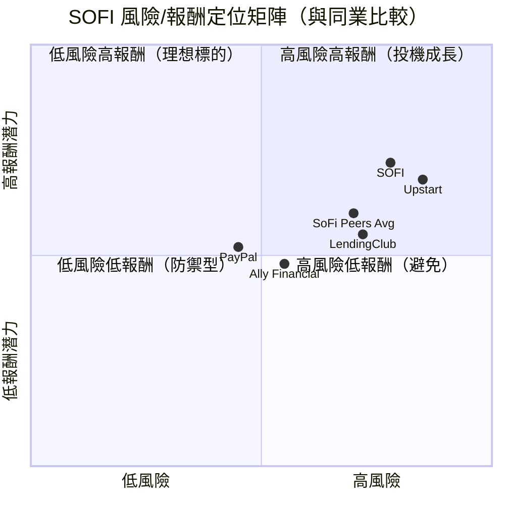
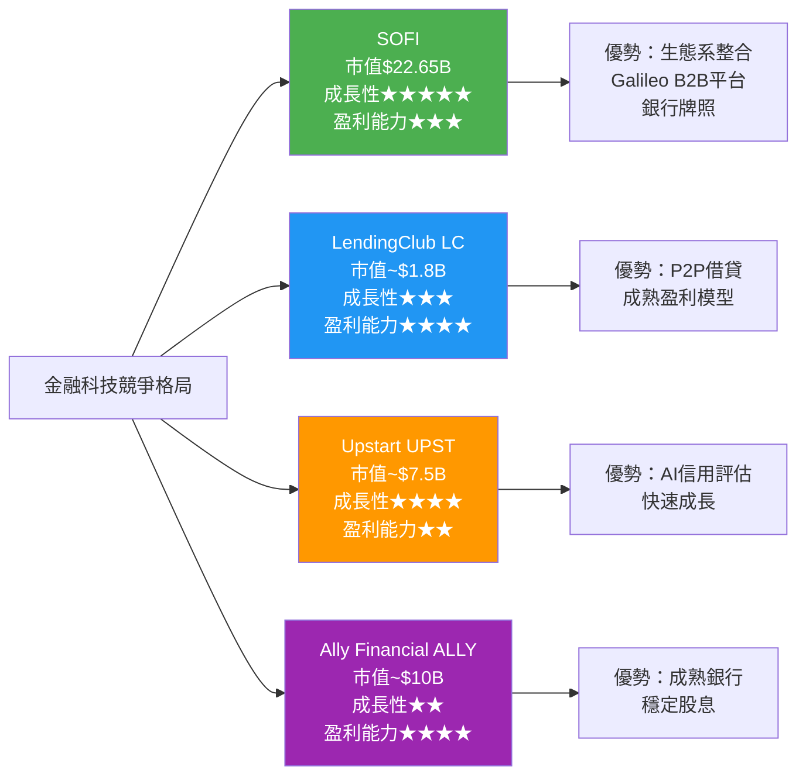
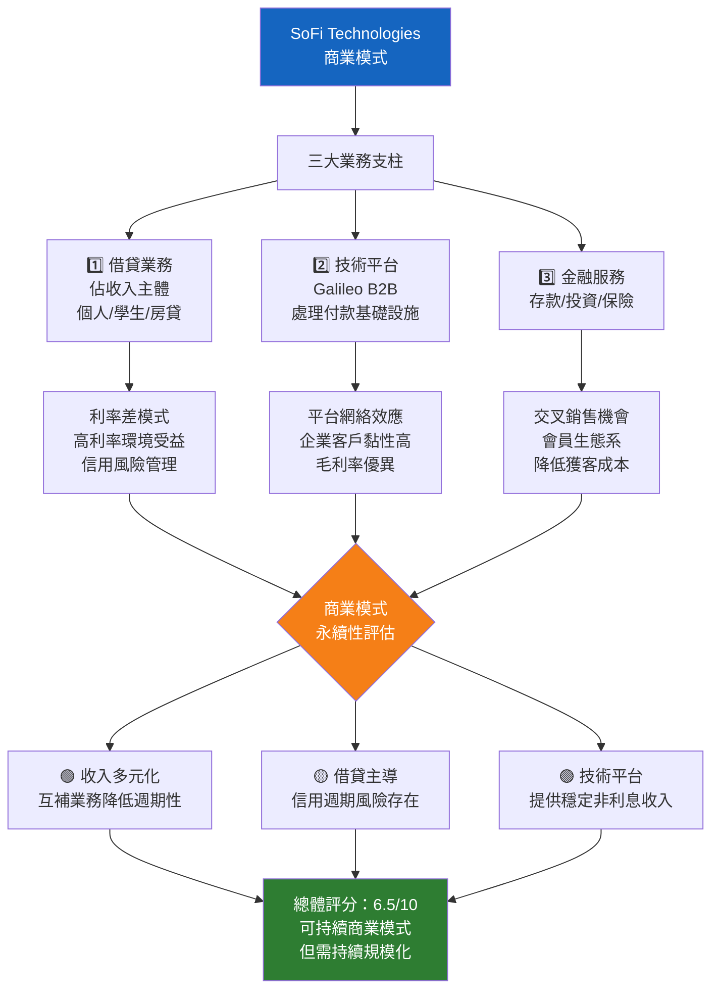
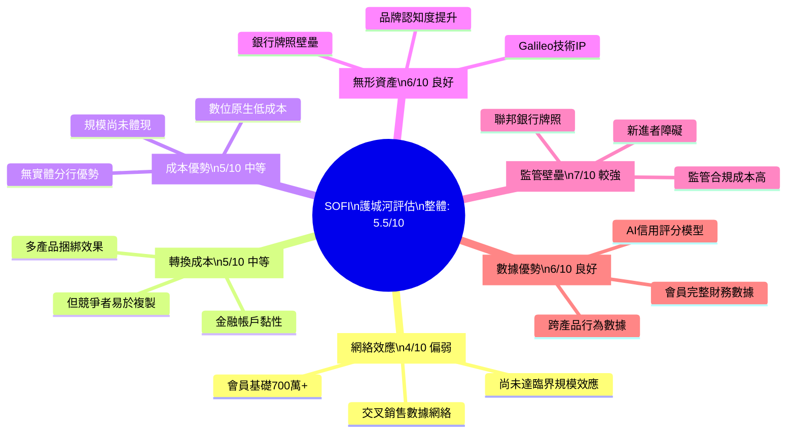
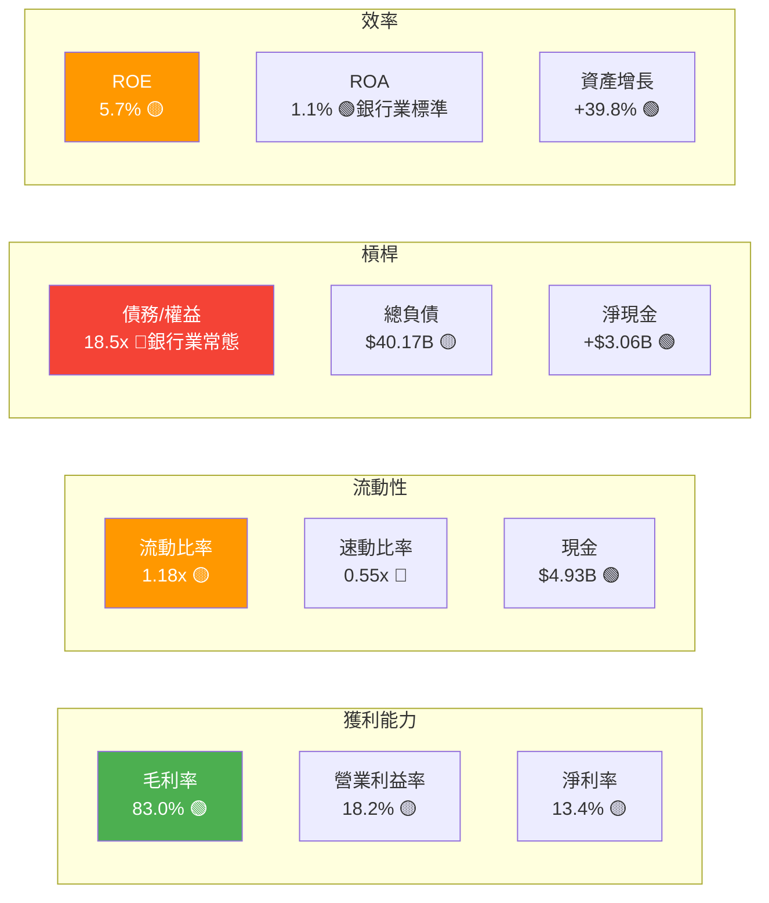
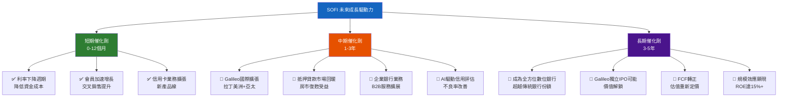
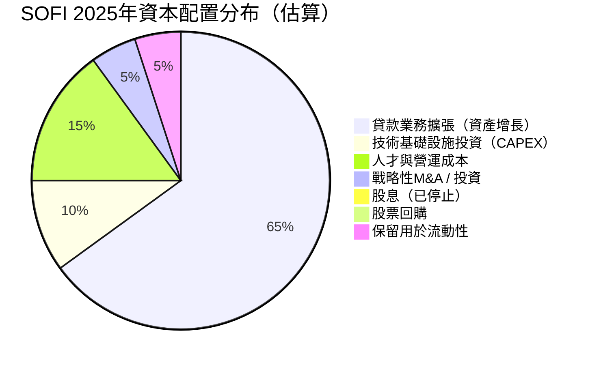
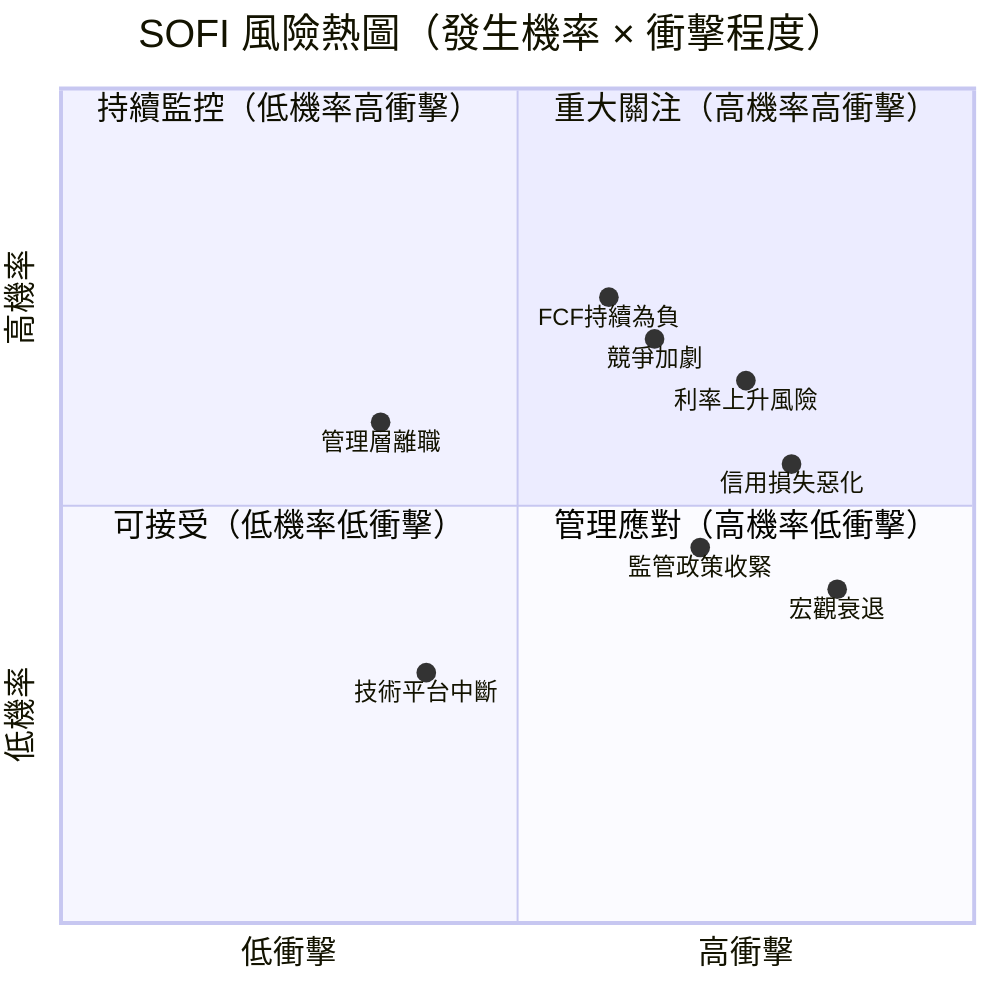
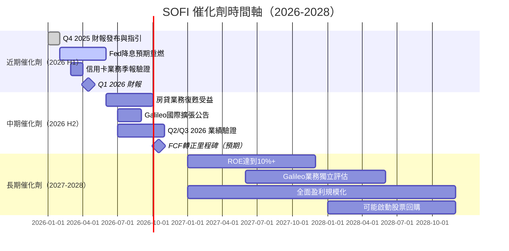
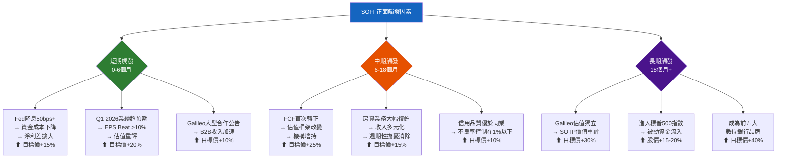

# SOFI 綜合股票評估報告

> **報告日期**：2026-02-28 ｜ **語言**：繁體中文 ｜ **數據來源**：Yahoo Finance ｜ **分析師**：AI 頂級評估引擎

---

## 目錄

1. [評估總覽](#1-評估總覽)
2. [八維度評分矩陣](#2-八維度評分矩陣)
3. [業務品質與護城河](#3-業務品質與護城河)
4. [財務健康全面評估](#4-財務健康全面評估)
5. [成長性評估](#5-成長性評估)
6. [估值合理性與同業比較](#6-估值合理性與同業比較)
7. [資本配置與管理層評估](#7-資本配置與管理層評估)
8. [風險評估](#8-風險評估)
9. [催化劑與觸發因素](#9-催化劑與觸發因素)
10. [投資建議](#10-投資建議)

---

## 1. 評估總覽

### 🎯 核心摘要

| 項目 | 數值 |
|------|------|
| 當前股價 | **$17.76** |
| 52週區間 | $8.60 — $32.73 |
| 市值 | $22.65B |
| Beta | 2.178（高波動） |
| 分析師共識 | Hold（19位分析師） |
| 分析師目標均值 | $26.50 |

---

### 📡 ASCII 雷達圖（八維度評分視覺化）

```
                    成長性 [8.5]
                      ★★★★★
                    /    │    \
                   /     │     \
   管理品質 [6.5] ●       │       ● 獲利能力 [6.0]
              ★★★★       │      ★★★
             /           │           \
            /            │            \
動能 [5.5] ●─────────────┼─────────────● 財務健康 [5.5]
          ★★★            │              ★★★
            \            │            /
             \           │           /
  風險 [4.5]  ●          │          ● 估值 [5.0]
             ★★          │           ★★★
                  \      │      /
                   \     │     /
          競爭優勢 [6.0]──●──[綜合 5.94]
                      ★★★

    ████████████ 成長性    8.5/10
    ██████████░░ 管理品質  6.5/10
    ████████░░░░ 競爭優勢  6.0/10
    ████████░░░░ 獲利能力  6.0/10
    ███████░░░░░ 財務健康  5.5/10
    ███████░░░░░ 動能      5.5/10
    ██████░░░░░░ 估值      5.0/10
    █████░░░░░░░ 風險      4.5/10
```

---

### 📊 八維度評分 Unicode 條形圖

```
維度          分數    視覺化評分條（滿分10）
─────────────────────────────────────────────────────
成長性        8.5   ▓▓▓▓▓▓▓▓▓░  🟢 優異
獲利能力      6.0   ▓▓▓▓▓▓░░░░  🟡 中等
財務健康      5.5   ▓▓▓▓▓░░░░░  🟡 偏弱
估值          5.0   ▓▓▓▓▓░░░░░  🟡 偏貴
競爭優勢      6.0   ▓▓▓▓▓▓░░░░  🟡 中等
管理品質      6.5   ▓▓▓▓▓▓▓░░░  🟢 良好
動能          5.5   ▓▓▓▓▓░░░░░  🟡 轉弱
風險          4.5   ▓▓▓▓░░░░░░  🔴 偏高
─────────────────────────────────────────────────────
綜合加權      5.94  ▓▓▓▓▓▓░░░░  🟡 審慎持有
```

---

### 🏆 綜合評分總表

| 維度 | 評分 | 星級 | 訊號 |
|------|------|------|------|
| 成長性 | 8.5/10 | ★★★★★ | 🟢 |
| 獲利能力 | 6.0/10 | ★★★☆☆ | 🟡 |
| 財務健康 | 5.5/10 | ★★★☆☆ | 🟡 |
| 估值 | 5.0/10 | ★★★☆☆ | 🟡 |
| 競爭優勢 | 6.0/10 | ★★★☆☆ | 🟡 |
| 管理品質 | 6.5/10 | ★★★★☆ | 🟢 |
| 動能 | 5.5/10 | ★★★☆☆ | 🟡 |
| 風險 | 4.5/10 | ★★☆☆☆ | 🔴 |
| **加權綜合** | **5.94/10** | **★★★☆☆** | 🟡 |

---

### 📌 投資結論框

```
╔══════════════════════════════════════════════════════════════╗
║                    📊 SOFI 投資結論                          ║
╠══════════════════════════════════════════════════════════════╣
║  評級：  🟡  審慎觀望 / 條件性持有                           ║
║  目標價（基準）：  $24.00                                    ║
║  目標價區間：  $16.00 — $32.00                               ║
║  現價：        $17.76                                        ║
║  基準潛在報酬：  +35.1%（12個月）                           ║
║  建議倉位：   不超過總倉位 3-5%（高風險標的）               ║
╚══════════════════════════════════════════════════════════════╝
```

---

## 2. 八維度評分矩陣

### 📋 詳細評分表

| 維度 | 評分 | 核心依據 | 趨勢 | 訊號 |
|------|------|----------|------|------|
| **成長性** | 8.5/10 | 收入YoY +40.2%，近4年營收從$1.57B→$3.61B，季度環比持續加速 | ↑ 上升 | 🟢 |
| **獲利能力** | 6.0/10 | 2025年首次年度盈利$481M，毛利率83%優異，但YoY盈利-57%令人憂慮，FCF持續為負 | → 持平 | 🟡 |
| **財務健康** | 5.5/10 | 淨現金$3.06B正面，但負債/權益高達18.5x（銀行業特性），FCF連續4年為負，速動比0.55偏低 | → 持平 | 🟡 |
| **估值** | 5.0/10 | 本益比45x偏高，P/S 6.3x，P/B 2.15x，Forward P/E 22.5x尚可接受，但FCF為負使估值不確定性大 | ↓ 下降 | 🟡 |
| **競爭優勢** | 6.0/10 | 金融科技生態系整合（借貸+存款+投資+技術平台）具特色，Galileo B2B平台形成差異化，但金融服務護城河薄弱 | → 持平 | 🟡 |
| **管理品質** | 6.5/10 | CEO Anthony Noto具行業背景，資本結構持續改善（總債務從$5.63B降至$1.93B），戰略方向明確 | ↑ 上升 | 🟢 |
| **動能** | 5.5/10 | 股價從$29高點回落至$17.76（跌幅-40%），短期趨勢轉弱，Beta 2.17高波動，空頭比率9.8% | ↓ 下降 | 🟡 |
| **風險** | 4.5/10 | 利率敏感性極高、FCF負數、高槓桿商業模式、競爭加劇、監管風險、宏觀經濟下行衝擊信用質量 | ↓ 惡化 | 🔴 |

---

### 📊 Mermaid 風險/報酬定位圖



---

### 🔗 同業整體比較



---

## 3. 業務品質與護城河

### 🏗️ 商業模式可持續性評估



---

### 🏰 護城河評估 Mindmap



---

### 📏 護城河強度視覺化

```
護城河類型      強度評分   視覺化
────────────────────────────────────────────────────────
監管壁壘        7.0/10   ▓▓▓▓▓▓▓░░░  🟢 聯邦銀行牌照
無形資產        6.0/10   ▓▓▓▓▓▓░░░░  🟡 Galileo技術+品牌
數據優勢        6.0/10   ▓▓▓▓▓▓░░░░  🟡 跨平台金融數據
轉換成本        5.0/10   ▓▓▓▓▓░░░░░  🟡 多帳戶黏性
成本優勢        5.0/10   ▓▓▓▓▓░░░░░  🟡 數位原生輕資產
網絡效應        4.0/10   ▓▓▓▓░░░░░░  🔴 尚待規模化
────────────────────────────────────────────────────────
護城河綜合      5.5/10   ▓▓▓▓▓▓░░░░  🟡 中等護城河
```

---

### 🌍 市場地位分析

| 指標 | 數值/狀態 | 評估 |
|------|----------|------|
| **TAM（總可及市場）** | 美國金融服務市場 ~$5萬億 | 🟢 巨大空間 |
| **當前市場份額** | 借貸市場 <1%，數位銀行 ~2% | 🟡 微小但成長中 |
| **會員數** | ~730萬（2025年底估） | 🟢 持續成長 |
| **Galileo平台客戶** | 全球1.7億+ 帳戶處理 | 🟢 B2B領先地位 |
| **行業地位** | 美國前十大數位銀行 | 🟡 成長挑戰者 |
| **品牌認知** | 千禧世代滲透率高 | 🟢 目標市場精準 |

---

## 4. 財務健康全面評估

### 📈 財務儀表板



---

### 📊 獲利能力趨勢表格（近4年）

| 指標 | 2022 | 2023 | 2024 | 2025 | 趨勢 |
|------|------|------|------|------|------|
| 總營收 | $1.57B | $2.11B | $2.61B | $3.61B | 🟢 ↑ |
| 毛利率 | ~60% | ~70% | ~78% | **83.0%** | 🟢 ↑ |
| 營業利益率 | 負數 | ~-8% | ~12% | **18.2%** | 🟢 ↑ |
| 淨利率 | **-20.4%** | **-14.2%** | **+19.1%** | **+13.4%** | 🟡 ↓ |
| 淨利潤 | -$320M | -$301M | +$499M | +$481M | 🟡 微降 |
| FCF Margin | -466% | -348% | -49% | **-110%** | 🔴 惡化 |

> ⚠️ 注意：2025年淨利率較2024年下滑（YoY -57%），主要因一次性項目調整，需持續觀察

---

### 🏦 資產負債表穩健度

```
指標              數值        評估條形圖
─────────────────────────────────────────────────────────
流動比率          1.18x      ▓▓▓▓▓▓░░░░  🟡 尚可（銀行業1.0+）
速動比率          0.55x      ▓▓▓░░░░░░░  🔴 偏弱
現金              $4.93B     ▓▓▓▓▓▓▓▓░░  🟢 充裕
總負債/資產       79.3%      ▓▓▓▓▓▓▓▓░░  🔴 高槓桿（銀行業常態）
淨現金頭寸        +$3.06B    ▓▓▓▓▓▓▓░░░  🟢 正向淨現金
股東權益          $10.49B    ▓▓▓▓▓▓▓░░░  🟢 持續增長
─────────────────────────────────────────────────────────
```

> 📌 **重要說明**：D/E 18.5x看似驚人，但這是銀行/金融機構業務模式特性，存款本質為負債，需以銀行業標準衡量

---

### 💰 現金流質量分析

| 指標 | 2022 | 2023 | 2024 | 2025 | 評估 |
|------|------|------|------|------|------|
| 營業現金流 | -$7.26B | -$7.23B | -$1.12B | **-$3.74B** | 🔴 持續為負 |
| 資本支出 | -$104M | -$121M | -$164M | **-$251M** | 🟡 加速投資 |
| 自由現金流 | -$7.36B | -$7.35B | -$1.28B | **-$3.99B** | 🔴 惡化 |
| FCF轉換率 | N/A | N/A | N/A | 負數 | 🔴 |

> ⚠️ **關鍵警示**：作為銀行機構，負的營業現金流主要反映貸款發放（資產增長）而非真正的現金消耗。需區分「借貸業務現金流」與「運營業務現金流」分開看待。貸款組合增長代表資產擴張，不代表企業虧損。

---

## 5. 成長性評估

### 📈 歷史 CAGR 表格

| 指標 | 1年成長率 | 3年CAGR | 說明 |
|------|----------|---------|------|
| **收入** | +40.2% | **+32.1%** | 🟢 超高速成長 |
| **淨利潤** | -3.5% | N/A（虧轉盈） | 🟡 首年盈利後微降 |
| **EPS (TTM)** | $0.39 vs -$0.30 | 正面轉型 | 🟢 扭虧為盈 |
| **會員數** | ~20%+ | ~35% | 🟢 持續增長 |
| **存款** | ~30%+ | ~50% | 🟢 強勁 |
| **股東權益** | +60.6% | +23.8% | 🟢 資本持續積累 |

---

### 🚀 未來成長催化劑



---

### 📊 成長軌跡 Unicode 長條圖

```
年度收入成長軌跡（$ Billions）
─────────────────────────────────────────────────────────────────
2022  $1.57B  ████████████░░░░░░░░░░░░░░░░░░░░░░
2023  $2.11B  ██████████████████░░░░░░░░░░░░░░░░
2024  $2.61B  ███████████████████████░░░░░░░░░░░
2025  $3.61B  █████████████████████████████████░  ← +40.2% YoY
Est.2026 $4.6B ████████████████████████████████████████ （預測）

淨利潤轉型軌跡
─────────────────────────────────────────────────────────────────
2022  -$320M  🔴 虧損
2023  -$301M  🔴 虧損
2024  +$499M  🟢 扭虧為盈 ████████████████████████████████████████████
2025  +$481M  🟡 微降    ████████████████████████████████████████░

季度收入環比加速（2025年）
─────────────────────────────────────────────────────────────────
Q1 2025  $771M   ████████████████████░░
Q2 2025  $855M   ██████████████████████░
Q3 2025  $962M   █████████████████████████░
Q4 2025  $1.03B  ██████████████████████████████  ← 首次破10億季度
─────────────────────────────────────────────────────────────────
```

---

## 6. 估值合理性與同業比較

### 🔍 同業比較完整表格

| 指標 | **SOFI** | **LendingClub (LC)** | **Upstart (UPST)** | **Ally Financial (ALLY)** |
|------|----------|---------------------|-------------------|--------------------------|
| 市值 | $22.65B | ~$1.8B | ~$7.5B | ~$10.0B |
| 股價 | $17.76 | ~$11.5 | ~$64 | ~$34 |
| **P/E (Trail)** | 45.5x 🔴 | 18x 🟢 | N/A(虧損) 🔴 | 8.5x 🟢 |
| **P/E (Forward)** | 22.5x 🟡 | 12x 🟢 | N/A 🔴 | 8x 🟢 |
| **P/S Ratio** | 6.32x 🔴 | 1.8x 🟢 | 8.5x 🔴 | 0.9x 🟢 |
| **P/B Ratio** | 2.15x 🟡 | 0.95x 🟢 | 3.2x 🔴 | 0.75x 🟢 |
| **EV/Revenue** | 5.94x 🟡 | 1.5x 🟢 | 7.2x 🔴 | 1.2x 🟢 |
| **收入成長率** | **+40.2% 🟢** | +8% 🟡 | +35% 🟢 | +3% 🔴 |
| **淨利率** | 13.4% 🟡 | 12% 🟡 | 負數 🔴 | 15% 🟢 |
| **ROE** | 5.7% 🟡 | 8% 🟡 | 負數 🔴 | 12% 🟢 |
| **FCF情況** | 負數 🔴 | 正數 🟢 | 負數 🔴 | 正數 🟢 |
| **Beta** | 2.18 🔴 | 1.8 🔴 | 3.5 🔴 | 1.2 🟡 |

> 📌 **評估結論**：SOFI 的成長性溢價顯著，以傳統估值指標衡量偏貴，但若以「成長調整後估值」視角，其 PEG 概念接近合理

---

### 📏 歷史估值區間（P/E）

```
SOFI 歷史本益比區間分析
─────────────────────────────────────────────────────────────────────
            過高          合理          便宜
估值狀態:   >60x        30-60x        <20x

歷史區間（Forward P/E）:
最高(2021峰值): ~200x+  ████████████████████████████████████████████
近期高點(2025): ~45x    ████████████████████████
當前水平(2026): ~22.5x  ████████████░  ← 當前位置（相對合理偏低）
歷史低點(2023): ~N/A（虧損期）

P/S 歷史區間:
近期高點:  8-10x  ████████████████████████████████
當前:      6.3x   █████████████████████  ← 偏高但較峰值改善
合理估值:  4-5x   ████████████████
─────────────────────────────────────────────────────────────────────
```

---

### 💎 多重估值法彙整

| 估值方法 | 假設條件 | 目標價 | 備註 |
|---------|---------|-------|------|
| **相對估值（P/E法）** | 2026E EPS $0.79 × 25x PE | **$19.75** | 合理但保守 |
| **相對估值（P/S法）** | 2026E 營收$4.6B × 5x P/S | **$18.00** | 保守基礎 |
| **成長調整估值（PEG）** | Forward PE 22.5 ÷ 成長率40% | **PEG=0.56** 低估訊號 | 🟢 |
| **帳面價值法（P/B）** | BV/股 ~$8.2 × 3x合理溢價 | **$24.60** | 中性 |
| **分析師共識目標** | 19位分析師平均 | **$26.50** | 上行+49% |
| **樂觀情境（DCF）** | 2028E FCF轉正，折現率12% | **$32.00** | 高成長實現 |
| **保守情境** | 成長放緩，估值收縮 | **$16.00** | 下行風險 |

**📌 綜合目標價：$24.00（基準）**

---

### 📊 估值區間視覺化

```
SOFI 估值區間對照表（基於當前股價 $17.76）
─────────────────────────────────────────────────────────────────────────
$12.00        $16.00        $17.76       $24.00        $32.00     $38.00
  │             │             │            │              │           │
  ├─────────────┼─────────────●────────────┼──────────────┼───────────┤
  ↑             ↑             ↑            ↑              ↑           ↑
極度悲觀      下行目標      當前股價     基準目標       樂觀目標  最高目標
分析師低點   保守估值      $17.76       $24.00         $32.00    $38.00

[████████████░░░░░░░░░░░░░░░░░░░░░░░░░░░░░░░░░░░░░]
 低估區域                當前          高估區域
 <$16              $16-$22        >$28
─────────────────────────────────────────────────────────────────────────
💡 當前股價接近低估/合理邊界，具有向上修復空間
```

---

## 7. 資本配置與管理層評估

### 📐 ROIC vs WACC 估算

```
╔══════════════════════════════════════════════════════════════════════╗
║                    ROIC vs WACC 分析                                ║
╠══════════════════════════════════════════════════════════════════════╣
║                                                                      ║
║  WACC 估算：                                                         ║
║  ├─ 無風險利率（10Y美債）：    4.3%                                  ║
║  ├─ 市場風險溢酬：              5.5%                                  ║
║  ├─ Beta：                      2.178                                 ║
║  ├─ 股權成本（CAPM）：          4.3% + 2.178×5.5% = 16.3%           ║
║  ├─ 債務成本（稅後）：          ~5.5% × (1-21%) = 4.3%              ║
║  ├─ 資本結構（E/V ~50%）：      16.3%×50% + 4.3%×50%               ║
║  └─ 估算 WACC：                 ≈ 10.3%                             ║
║                                                                      ║
║  ROIC 估算：                                                         ║
║  ├─ NOPAT（稅後淨營業利潤）：  ~$380M（調整後）                     ║
║  ├─ 投入資本（股東權益+淨債）： ~$7.5B（調整後）                    ║
║  └─ 估算 ROIC：                 ≈ 5.1%                              ║
║                                                                      ║
║  ┌─────────────────────────────────────────┐                        ║
║  │  ROIC (5.1%) < WACC (10.3%)            │                        ║
║  │  EVA = 負值（-5.2%）                   │                        ║
║  │  🔴 目前尚未創造股東價值                │                        ║
║  │  ⚠️ 需要 ROIC 持續提升至 WACC 以上      │                        ║
║  └─────────────────────────────────────────┘                        ║
║                                                                      ║
║  📈 改善路徑：若ROE從5.7%提升至12%+（2027-28E），                   ║
║     ROIC 有望達到 10%+，超越 WACC 創造正EVA                        ║
╚══════════════════════════════════════════════════════════════════════╝
```

---

### 🥧 資本配置 Mermaid Pie Chart



---

### 📋 管理層執行力評分

| 評估維度 | 評分 | 具體表現 | 訊號 |
|---------|------|---------|------|
| **承諾達成率** | 7/10 | 多次達成盈利里程碑，但FCF預期持續未達 | 🟡 |
| **資本紀律** | 7/10 | 債務從$5.63B大幅削減至$1.93B，顯示財務紀律 | 🟢 |
| **戰略清晰度** | 7/10 | 「金融服務超市」定位清晰，Galileo差異化明確 | 🟢 |
| **股東溝通** | 6/10 | 定期業績指引，但目標多次下修 | 🟡 |
| **風險管理** | 6/10 | 信用損失準備金政策保守，但宏觀風險管理待加強 | 🟡 |
| **人才配置** | 7/10 | Anthony Noto（前Twitter/Goldman背景）領導力強 | 🟢 |
| **整體管理評分** | **6.7/10** | | 🟡 |

---

### 💝 股東友善度評分

```
股東友善度評估
─────────────────────────────────────────────────────────────
現金股息          0/10  ░░░░░░░░░░  🔴 無股息（成長期策略）
股票回購          1/10  ▓░░░░░░░░░  🔴 無回購計畫
資本增值潛力      8/10  ▓▓▓▓▓▓▓▓░░  🟢 高成長期望
資訊透明度        6/10  ▓▓▓▓▓▓░░░░  🟡 中等透明度
稀釋控制          5/10  ▓▓▓▓▓░░░░░  🟡 SBC稀釋存在
─────────────────────────────────────────────────────────────
整體股東友善度    4.0/10 ▓▓▓▓░░░░░░  🔴 成長優先，股東回報次要
```

> 📌 SOFI 目前處於「成長投資期」，資本全部用於業務擴張，股東回報來自股價增值而非現金回報。此策略在高速成長階段合理，但需持續監控成長率是否兌現。

---

## 8. 風險評估

### 🌡️ 風險熱圖



---

### 📋 風險清單詳細表格

| 風險類型 | 等級 | 機率 | 衝擊 | 緩解措施 | 訊號 |
|---------|------|------|------|---------|------|
| **利率風險**（利差壓縮） | 高 | 中高 | 高 | 資產負債表期限匹配管理 | 🔴 |
| **信用風險**（不良率上升） | 高 | 中 | 高 | AI信用模型+保守承貸標準 | 🔴 |
| **競爭風險**（大銀行數位化） | 高 | 高 | 中 | 差異化定位+年輕客群 | 🔴 |
| **FCF持續為負** | 高 | 高 | 中高 | 貸款組合管理+營收多元化 | 🔴 |
| **估值泡沫風險**（成長放緩） | 中 | 中 | 高 | 基本面驗證+業績持續改善 | 🟡 |
| **監管收緊** | 中 | 中 | 中高 | 銀行牌照合規+監管關係 | 🟡 |
| **學生貸款政策變化** | 中 | 中 | 中 | 產品多元化降低集中度 | 🟡 |
| **宏觀衰退衝擊** | 中 | 中 | 高 | 撥備覆蓋率+資本緩衝 | 🟡 |
| **技術中斷/網路安全** | 低 | 低 | 高 | 多重備援+安全投資 | 🟡 |
| **管理層變動** | 低 | 低 | 中 | 深厚管理團隊建制 | 🟢 |

---

### 📉 最大下行情境分析（Bear Case）

```
╔══════════════════════════════════════════════════════════════════╗
║                  🐻 熊市情境分析                                 ║
╠══════════════════════════════════════════════════════════════════╣
║                                                                  ║
║  情境假設：                                                       ║
║  ├─ 美國經濟衰退，信用損失率上升至3%+                           ║
║  ├─ 聯準會維持高利率，資金成本居高不下                           ║
║  ├─ 競爭加劇導致成長放緩至15-20%                                ║
║  ├─ FCF無法在2026年轉正                                         ║
║  └─ 估值收縮至 P/E 15x，P/S 3x                                  ║
║                                                                  ║
║  目標價推算：                                                     ║
║  ├─ 2026E EPS: $0.50（下修30%）× 15x = $7.50                   ║
║  ├─ P/S法：$4.0B × 3x ÷ 1.28B股 = $9.38                       ║
║  └─ 熊市目標價：$12.00 — $14.00                                 ║
║                                                                  ║
║  當前股價 $17.76 → Bear Case $13.00                              ║
║  潛在下行：-26.8%                                                ║
║                                                                  ║
║  觸發條件：                                                       ║
║  ✦ 連續兩季盈利低於預期                                          ║
║  ✦ 不良貸款率超過 2%                                             ║
║  ✦ 會員成長率跌破 15%                                            ║
╚══════════════════════════════════════════════════════════════════╝
```

---

## 9. 催化劑與觸發因素

### 📅 催化劑時間軸



---

### ⚡ 正面觸發因素決策樹



---

## 10. 投資建議

### 🏆 最終評級

```
╔══════════════════════════════════════════════════════════════════════╗
║                                                                      ║
║         ⭐⭐⭐☆☆   SOFI 綜合投資評級：3/5星                         ║
║                                                                      ║
║   評級：🟡  審慎觀望（條件性持有）                                   ║
║                                                                      ║
║   核心論點：                                                         ║
║   ✅ 超高速收入成長（+40%），季度持續加速                            ║
║   ✅ 成功扭虧為盈，銀行牌照建立差異化護城河                          ║
║   ✅ Galileo B2B平台提供非週期性技術收入                             ║
║   ✅ 股價從高點回落40%，提供較好進場機會                             ║
║   ❌ FCF持續為負，無法使用傳統估值框架                               ║
║   ❌ ROIC < WACC，尚未創造股東價值                                   ║
║   ❌ 利率敏感性高，宏觀環境變化衝擊大                                ║
║   ❌ 競爭格局激烈，護城河有限                                        ║
║                                                                      ║
║   適合投資人：高風險承受度的成長型投資者                              ║
║   不適合：保守型/收益型/低風險偏好投資者                              ║
╚══════════════════════════════════════════════════════════════════════╝
```

---

### 📊 目標價區間與隱含報酬率

| 情境 | 目標價 | 隱含報酬率 | 機率權重 | 關鍵假設 |
|------|-------|-----------|---------|---------|
| 🐻 悲觀情境 | **$13.00** | **-26.8%** | 25% | 衰退+成長放緩+估值收縮 |
| 📊 基準情境 | **$24.00** | **+35.1%** | 50% | 溫和降息+成長維持30%+ |
| 🚀 樂觀情境 | **$32.00** | **+80.2%** | 25% | 降息+FCF轉正+Galileo價值解鎖 |
| **📌 加權期望** | **$23.25** | **+31.0%** | 100% | 機率加權平均 |

---

### 🎯 投資人適配度

```mermaid
graph TD
    A[SOFI 適合哪類投資者?] --> B{風險承受度}
    
    B -->|高風險承受| C[✅ 成長型投資者\n最適合\n建議倉位3-5%]
    B -->|中等風險| D[⚠️ 條件性適合\n需等待更好進場點\n建議倉位1-2%]
    B -->|低風險| E[❌ 不適合\n FCF為負+高Beta\n遠離]
    
    C --> F[特徵：\n・接受高波動(Beta 2.18)\n・3年以上持有\n・相信Fintech成長故事\n・理解金融機構FCF特殊性]
    
    D --> G[條件：\n・等待$15以下進場\n・確認季度業績持續beat\n・FCF改善趨勢確認]
    
    E --> H[替代標的：\n・Ally Financial (穩健+股息)\n・PayPal (成熟+回購)\n・傳統銀行股]
    
    style C fill:#2E7D32,color:#fff
    style D fill:#E65100,color:#fff
    style E fill:#B71C1C,color:#fff
```

---

### 📏 建議持倉策略

```
╔══════════════════════════════════════════════════════════════════════╗
║                    🎯 操作策略建議                                   ║
╠══════════════════════════════════════════════════════════════════════╣
║                                                                      ║
║  建議持倉時間：   12-24個月（等待業績催化劑兌現）                   ║
║  建議倉位上限：   總投資組合的 3-5%                                 ║
║                                                                      ║
║  ──────────────────────────────────────────────────────────────     ║
║  📈 加碼觸發條件：                                                   ║
║  ├─ 股價跌破 $15.00 支撐位（增加至5%倉位）                         ║
║  ├─ Q1 2026 EPS Beat > 10%（業績驗證）                             ║
║  ├─ Fed 宣布降息75bps+（利差改善）                                  ║
║  ├─ 會員數季度增長 >5%                                               ║
║  └─ FCF轉正訊號確認                                                  ║
║                                                                      ║
║  ──────────────────────────────────────────────────────────────     ║
║  📉 止損觸發條件：                                                   ║
║  ├─ 股價跌破 $13.00（技術面破壞）                                   ║
║  ├─ 連續兩季 EPS Miss > 15%（基本面惡化）                           ║
║  ├─ 不良貸款率突破 2.5%（信用風險警示）                             ║
║  ├─ 管理層重大異動（CEO離職）                                        ║
║  └─ 收入成長率跌破 20%（成長故事破壞）                              ║
║                                                                      ║
╚══════════════════════════════════════════════════════════════════════╝
```

---

### ✅ 關鍵監控指標 Checklist

```
📊 每季財報監控清單
─────────────────────────────────────────────────────────────────────
□ 會員數季度淨增長 > 40萬（成長持續性）
□ 調整後淨收入（ANREV）YoY > 25%（核心成長）
□ 淨利率維持在 12%+ （獲利能力）
□ 信用損失準備金率 < 3%（信用健康）
□ Galileo帳戶處理量持續增長 > 20%（技術平台）
□ 存款餘額持續增長（資金成本優化）
□ 每位會員平均產品數 > 3.0（交叉銷售效率）

📰 宏觀環境監控清單
─────────────────────────────────────────────────────────────────────
□ 聯準會利率決策方向（降息=利多）
□ 美國失業率走勢（上升=信用風險）
□ 30年期抵押貸款利率（下降=房貸業務受益）
□ 學生貸款政策動向（影響核心業務）
□ 金融科技監管政策（CFPB等監管變化）

📈 技術面監控清單
─────────────────────────────────────────────────────────────────────
□ 日均成交量（流動性確認）
□ 機構持股比例變化（56.1%基準）
□ 空頭比率變化（9.8%基準）
□ 分析師目標價調整趨勢
□ $16.00 關鍵支撐位守住與否
─────────────────────────────────────────────────────────────────────
```

---

### 📊 最終綜合評分雷達總結

```
       成長性
       10 ★
        │ ████████
管理 7──┼──────────── 8 ─ 獲利
品質    │         ████
   ████─┤
        │
動能 5──┼── 5.5 ─────── 6 ─ 競爭優勢
        │
   ████─┤
        │    ████
風險 4──┼──────────── 5.5 ─ 財務健康
        │
       估值 5.0

   ═══════════════════════
   綜合加權評分：5.94 / 10
   投資評級：審慎觀望 🟡
   目標價（12M基準）：$24.00
   ═══════════════════════
```

---

> ## ⚖️ 免責聲明
>
> **本報告為 AI 自動生成，基於公開市場數據與財務模型，僅供投資研究參考，不構成任何形式的投資建議或招攬。**
>
> 投資涉及風險，股票價格可升可跌，過去表現不代表未來結果。SOFI 為高波動成長型金融科技股（Beta 2.18），不適合所有投資者。請在做出任何投資決策前，諮詢持牌財務顧問並根據個人財務狀況、風險承受能力及投資目標作出獨立判斷。
>
> **報告日期**：2026-02-28 ｜ **數據截止**：2026-02-28 ｜ **下次更新建議**：Q1 2026 財報發布後