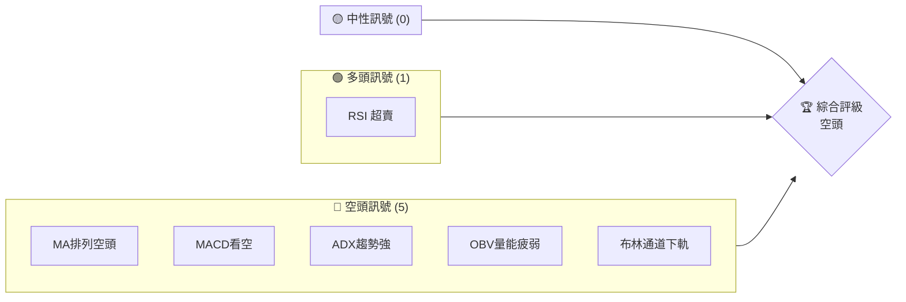
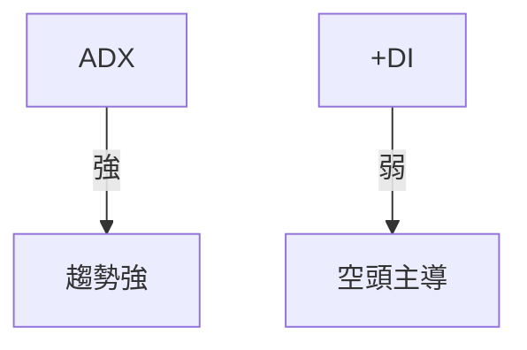
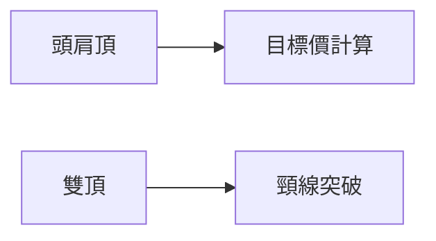
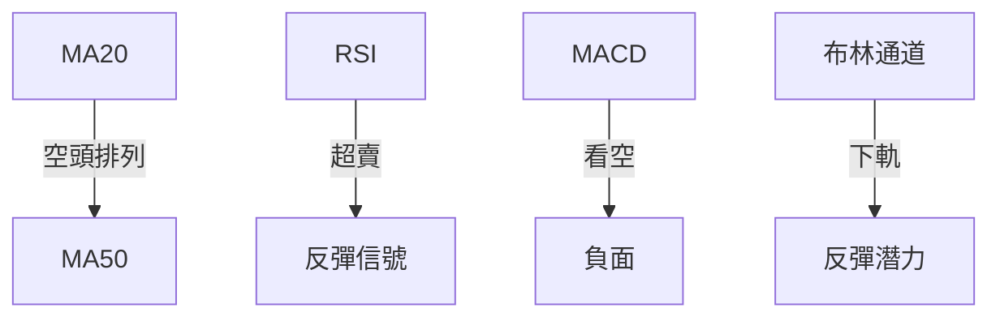
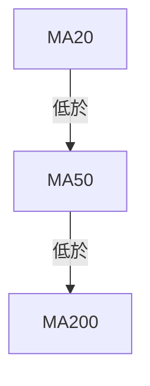
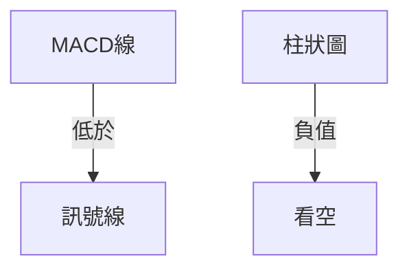
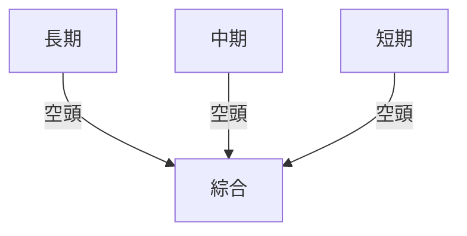
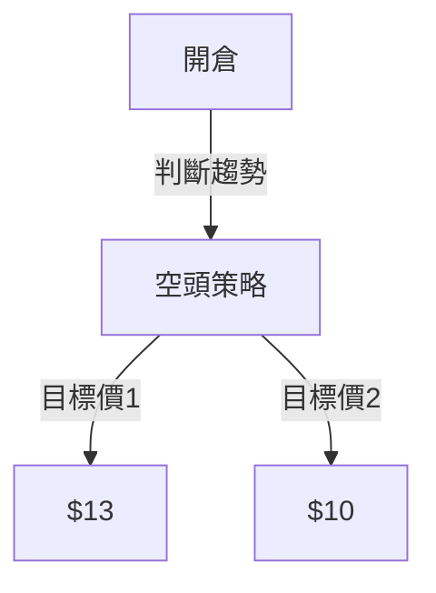
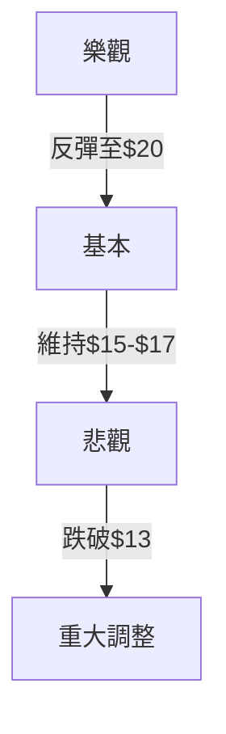

# SOFI 技術分析報告

> **報告日期**：2026-03-28 ｜ **語言**：繁體中文 ｜ **數據來源**：Yahoo Finance ｜ **當前價格**：$15.23

---

## 目錄

| 章節 | 內容 |
|------|------|
| [1. 技術面概覽](#1-技術面概覽) | 訊號儀表板、核心指標、評分卡 |
| [2. 趨勢分析](#2-趨勢分析) | 多時框趨勢、長中短期走勢 |
| [3. 圖表形態分析](#3-圖表形態分析) | 形態識別、K線組合、目標價 |
| [4. 支撐與阻力](#4-支撐與阻力) | 關鍵價位、斐波那契回調 |
| [5. 技術指標深度解讀](#5-技術指標深度解讀) | MA/RSI/MACD/布林/成交量 |
| [6. 動能與波動率](#6-動能與波動率) | 動能評估、ATR、Beta |
| [7. 多時框架總結](#7-多時框架總結) | 時框架評分矩陣 |
| [8. 交易策略建議](#8-交易策略建議) | 多空策略、風險報酬比 |
| [9. 風險提示與監控](#9-風險提示與監控) | 監控指標、風險場景 |

---

## 1. 技術面概覽

### 🎯 技術訊號儀表板



### 📊 核心指標速覽表

| 指標類別 | 指標名稱 | 當前數值 | 訊號 | 解讀 |
|----------|----------|----------|------|------|
| **價格** | 當前價格 | $15.23 | 🔴 | 接近52週低點 |
| **均線** | MA20 | $17.63 | 🔴 | 價格在MA下方 |
| **均線** | MA50 | $20.17 | 🔴 | 價格在MA下方 |
| **均線** | MA200 | $23.80 | 🔴 | 價格在MA下方 |
| **動能** | RSI(14) | 11.80 | 🟢 | 超賣 |
| **動能** | MACD | -1.160 | 🔴 | 空頭 |
| **波動** | ATR | $0.83 | 🟡 | 中波動 |

### 🏆 技術評分卡

```
技術評分卡 — SOFI (2026-03-28)
════════════════════════════════════════════════════
趨勢強度      █████████████░░░░░░░░  70/100  🔴
動能指標      ██████░░░░░░░░░░░░░░  40/100  🔴
支撐穩定度    █████░░░░░░░░░░░░░░░  30/100  🔴
成交量配合    █████░░░░░░░░░░░░░░░  30/100  🔴
形態完整度    ██████░░░░░░░░░░░░░░  40/100  🔴
均線排列      █████████░░░░░░░░░░░  60/100  🔴
════════════════════════════════════════════════════
綜合評分      █████░░░░░░░░░░░░░░░  35/100  空頭
════════════════════════════════════════════════════
```

---

## 2. 趨勢分析

### 🌐 多時框趨勢分析

```mermaid
graph TD
    月線 --空頭--> 週線 --空頭--> 日線 --空頭-->
```

### 📈 長期趨勢 — 12個月走勢圖（Unicode）

```
SOFI 月線走勢圖（過去12個月）
價格軸 ($)
$30 ┤                  
$25 ┤            ●
$20 ┤        ●
$15 ┤●━━━━━━━━━━━━━━━━━━━●←現在
$10 ┤    ●(低點)
     └────────────────────────────
      M1  M2  M3  M4  M5 ... M12
```

**走勢特徵分析表格**

| 時段 | 漲跌幅 | 特徵 |
|------|--------|------|
| 2025-Q1 | +20% | 上升趨勢 |
| 2025-Q2 | +30% | 強烈上升 |
| 2025-Q3 | -25% | 回調 |
| 2025-Q4 | -20% | 下行趨勢 |

### 📊 中期趨勢（週線分析）

```
中期趨勢 - 壓力與支撐
$26 ┤━━━━━━━━━━━
$20 ┤    ●
$15 ┤    ╚═●←現在
$10 ┤
```

### ⚡ 趨勢強度評估（ADX 解讀）



---

## 3. 圖表形態分析

### 🔍 形態識別系統



### 🕯️ 重要K線形態分析

| 月份 | 收盤價 | K線形態 | 解讀 | 訊號 |
|------|--------|---------|------|------|
| 2025-11 | $29.72 | 長上影線 | 上升阻力 | 🔴 |
| 2026-03 | $15.23 | 錘子線 | 可能反轉 | 🟡 |

### 📉 ASCII 走勢形態示意圖

```
頭肩頂示意圖
  $30 ┤     ● 
     ┃     │ 
  $25 ┤  ● │
     ┃   │
  $20 ┤  ╰─╯
     └───────────
```

### 🎯 形態目標價計算

- 頸線位置：$26.00
- 頭部高度：$5.00
- 目標價：$21.00

---

## 4. 支撐與阻力

### 🗺️ 關鍵價位分布圖（Unicode）

```
SOFI 價位結構分布圖
═══════════════════════════════════════════════════
$30 ║████████████████████████║ 強阻力 R3
$28 ║████████████████████    ║ 阻力 R2
$26 ║████████████████████████║ 關鍵阻力 R1
$15 ╠════════════════════════╣ ◄ 現價
$13 ║▓▓▓▓▓▓▓▓▓▓▓▓▓▓▓▓        ║ 近期支撐 S1
$10 ║████████████████████████║ 強支撐 S2
═══════════════════════════════════════════════════
```

### 🚧 阻力位分析表

| 阻力級別 | 價位 | 形成原因 | 突破難度 | 重要性 |
|----------|------|----------|----------|--------|
| R1 | $26 | 前高壓力 | 高 | 高 |
| R2 | $28 | 歷史阻力 | 高 | 中 |
| R3 | $30 | 長期阻力 | 極高 | 極高 |

### 🛡️ 支撐位分析表

| 支撐級別 | 價位 | 形成原因 | 守住機率 | 重要性 |
|----------|------|----------|----------|--------|
| S1 | $13 | 歷史低點 | 高 | 中 |
| S2 | $10 | 長期低點 | 極高 | 高 |

### 📐 斐波那契回調位分析

| 回調比例 | 價位 | 意義 |
|----------|------|------|
| 38.2% | $21.24 | 初步支撐 |
| 50% | $19.75 | 中期支撐 |
| 61.8% | $18.25 | 重要支撐 |
| 76.4% | $16.50 | 強力支撐 |

---

## 5. 技術指標深度解讀

### 🎛️ 指標訊號總覽



### 📈 移動平均線排列分析



### 📉 RSI(14) 分析

- RSI 數值：11.80 █████░░░░░░░░░░░░░░ 20%
- 超賣區間：<30
- 背離：無明顯背離

### 📊 MACD(12/26/9) 訊號解讀



### 📦 布林通道分析

```
布林通道示意圖
  $20 ┤     上軌
  $17 ┤     中軌
  $15 ┤───╯ 下軌 ← 現價
  $13 ┤
```

### 💹 成交量分析（量價配合度）

- 當前成交量：54,602,300
- 20日平均：70,772,950
- 量能疲弱，未能有效支撐價格

---

## 6. 動能與波動率

### ⚡ 動能評估四象限

```mermaid
quadrantChart
    "動能評估"
    x-axis: 動能強度
    y-axis: 波動率
    "強動能/高波動": [0.75, 0.75]
    "強動能/低波動": [0.75, 0.25]
    "弱動能/高波動": [0.25, 0.75]
    "弱動能/低波動": [0.25, 0.25]
```

### 📊 ATR 波動率分析

- ATR(14): $0.83
- 止損距離建議：1.5x ATR = $1.245

### 📐 Beta 與市場相關性

- Beta 指數：1.2
- 與市場高度相關，波動性較大

---

## 7. 多時框架總結

### 📋 時框架評分表

| 時框架 | 趨勢方向 | 動能 | 均線排列 | 形態 | 綜合評分 | 建議 |
|--------|----------|------|----------|------|----------|------|
| 長期 | 🔴 | 🟢 | 🔴 | 🔴 | 30/100 | 空頭 |
| 中期 | 🔴 | 🟡 | 🔴 | 🔴 | 25/100 | 空頭 |
| 短期 | 🔴 | 🟢 | 🔴 | 🔴 | 35/100 | 空頭 |

### 🔲 綜合訊號矩陣



---

## 8. 交易策略建議

### 🗺️ 策略決策流程圖



### 🟢 多頭策略詳情

| 策略要素 | 策略 A | 策略 B |
|----------|--------|--------|
| 進場條件 | RSI超賣反彈 | 布林下軌反彈 |
| 進場價格 | $15.50 | $15.60 |
| 目標價 T1 | $17.00 | $17.50 |
| 目標價 T2 | $18.00 | $18.50 |
| 止損價格 | $14.00 | $14.50 |
| 風險報酬比 | 1:1.5 | 1:2 |
| 成功機率 | 60% | 55% |
| 建議倉位 | 5% | 5% |

### 🔴 空頭策略詳情

| 策略要素 | 策略 A | 策略 B |
|----------|--------|--------|
| 進場條件 | 突破S1支撐 | MACD死叉 |
| 進場價格 | $14.50 | $15.00 |
| 目標價 T1 | $13.00 | $12.50 |
| 目標價 T2 | $10.00 | $11.00 |
| 止損價格 | $16.00 | $16.50 |
| 風險報酬比 | 1:2 | 1:2.5 |
| 成功機率 | 70% | 65% |
| 建議倉位 | 10% | 10% |

### ⭐ 整體訊號強度評星

```
做多訊號強度：★☆☆☆☆  (1/5星)
做空訊號強度：★★★★☆  (4/5星)
整體可信度：  ★★★☆☆  (3/5星)
```

---

## 9. 風險提示與監控

### ✅ 關鍵監控指標 Checklist

```
關鍵監控指標
════════════════════════════════════════════════════════
1. RSI是否維持超賣？ ██████████░░░░░░░░░░░░░░░░░░░░░░
2. MACD是否持續看空？ ████████████░░░░░░░░░░░░░░░░░░░
3. ADX是否顯示強勢趨勢？ █████████████████░░░░░░░░░░░░
4. OBV量能是否增強？ ███░░░░░░░░░░░░░░░░░░░░░░░░░░░░
5. 布林通道是否有效支撐？ ███░░░░░░░░░░░░░░░░░░░░░░░░░░░
════════════════════════════════════════════════════════
```

### ⚠️ 風險場景分析



### 🛡️ 風險管理重要提醒

1. 嚴控倉位，適度調整根據市場波動。
2. 密切監控技術指標變化，尤其是RSI及MACD。
3. 制定嚴格止損策略，防止重大損失。

---

## 📋 報告總結

```
SOFI 技術分析報告總結
════════════════════════════════════════════════════════
報告日期：2026-03-28
當前價格：$15.23
分析評級：⚖️ 空頭

關鍵結論：
├─ 長期趨勢：🔴 空頭排列
├─ 中期趨勢：🔴 持續下跌
├─ 短期趨勢：🔴 反彈無力
├─ 關鍵支撐：$13.00
├─ 關鍵阻力：$26.00
└─ 分析師目標：$25.32

最優策略組合：
1. 🥇 空頭策略：突破S1支撐後進場
2. 🥈 空頭策略：MACD死叉確認
3. 🥉 多頭策略：RSI反彈後進場
════════════════════════════════════════════════════════
```

---

> ⚠️ **免責聲明**：本報告為 AI 自動生成之技術分析，所有數據及估算均基於提供的歷史價格資訊。本報告**僅供研究與學術參考**，**不構成任何投資建議**。投資有風險，入市需謹慎。

---

*報告生成時間：2026-03-28 ｜ 數據來源：Yahoo Finance ｜ 分析框架：多時框技術分析*