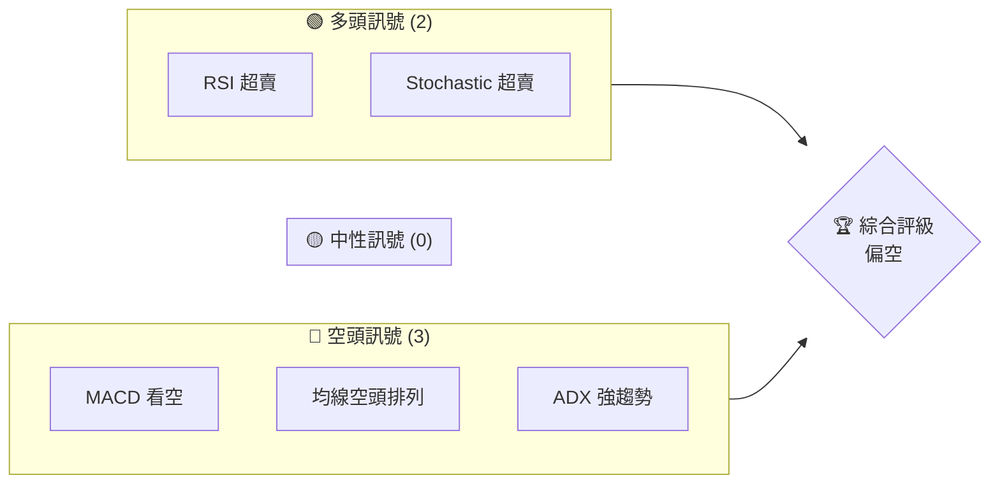
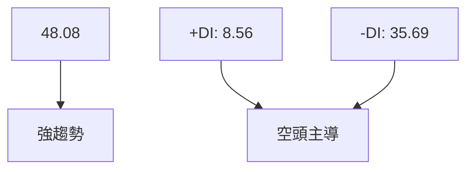
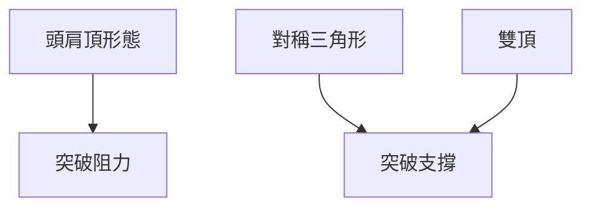
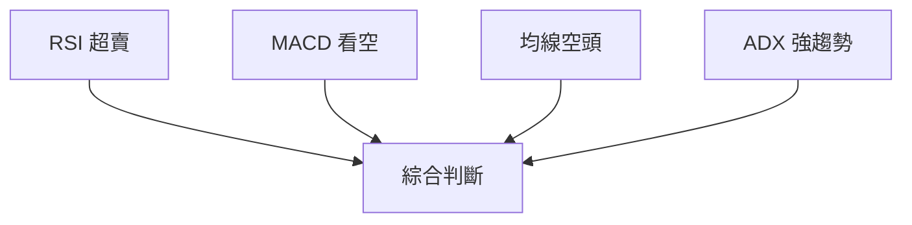
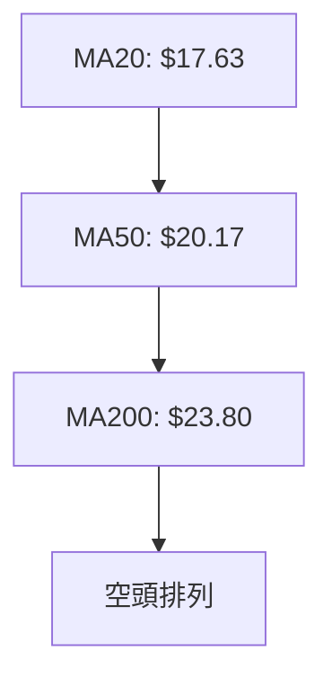
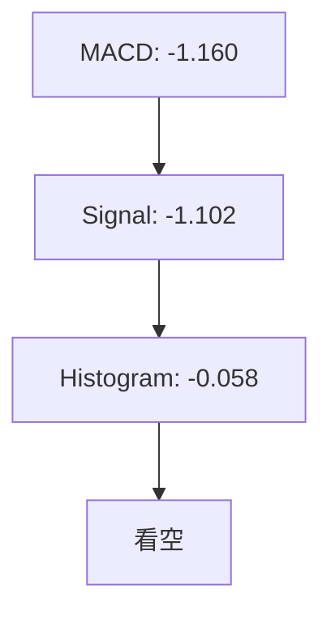
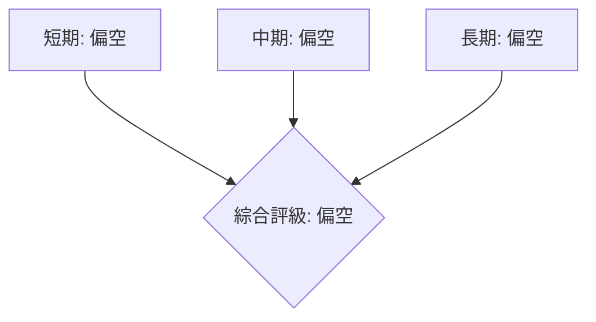
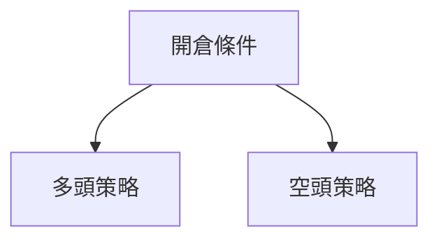
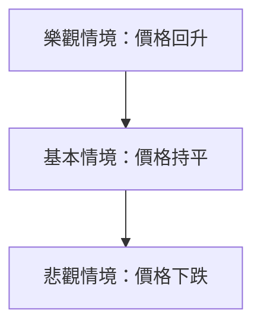

# SOFI 技術分析報告

> **報告日期**：2026-03-29 ｜ **語言**：繁體中文 ｜ **數據來源**：Yahoo Finance ｜ **當前價格**：$15.23

---

## 目錄

| 章節 | 內容 |
|------|------|
| [1. 技術面概覽](#1-技術面概覽) | 訊號儀表板、核心指標、評分卡 |
| [2. 趨勢分析](#2-趨勢分析) | 多時框趨勢、長中短期走勢 |
| [3. 圖表形態分析](#3-圖表形態分析) | 形態識別、K線組合、目標價 |
| [4. 支撐與阻力](#4-支撐與阻力) | 關鍵價位、斐波那契回調 |
| [5. 技術指標深度解讀](#5-技術指標深度解讀) | MA/RSI/MACD/布林/成交量 |
| [6. 動能與波動率](#6-動能與波動率) | 動能評估、ATR、Beta |
| [7. 多時框架總結](#7-多時框架總結) | 時框架評分矩陣 |
| [8. 交易策略建議](#8-交易策略建議) | 多空策略、風險報酬比 |
| [9. 風險提示與監控](#9-風險提示與監控) | 監控指標、風險場景 |

---

## 1. 技術面概覽

### 🎯 技術訊號儀表板



### 📊 核心指標速覽表

| 指標類別 | 指標名稱 | 當前數值 | 訊號 | 解讀 |
|----------|----------|----------|------|------|
| **價格** | 當前價格 | $15.23 | 🔴 | 位於均線下方 |
| **均線** | MA20 | $17.63 | 🔴 | 價格在MA下方 |
| **均線** | MA50 | $20.17 | 🔴 | 價格在MA下方 |
| **均線** | MA200 | $23.80 | 🔴 | 價格在MA下方 |
| **動能** | RSI(14) | 11.80 | 🟢 | 超賣 |
| **動能** | MACD | -1.160 | 🔴 | 空頭 |
| **波動** | ATR | $0.83 | 🟡 | 中度波動 |

### 🏆 技術評分卡

```
技術評分卡 — SOFI (2026-03-29)
════════════════════════════════════════════════════
趨勢強度      ██████████░░░░░░░░░░  48/100  🔴
動能指標      ███░░░░░░░░░░░░░░░░░  15/100  🟢
支撐穩定度    ████████░░░░░░░░░░░░  40/100  🔴
成交量配合    ████░░░░░░░░░░░░░░░░  30/100  🔴
形態完整度    ████░░░░░░░░░░░░░░░░  30/100  🔴
均線排列      ███░░░░░░░░░░░░░░░░░  20/100  🔴
════════════════════════════════════════════════════
綜合評分      ███░░░░░░░░░░░░░░░░░  30/100  偏空
════════════════════════════════════════════════════
```

---

## 2. 趨勢分析

### 🌐 多時框趨勢分析


### 📈 長期趨勢 — 12個月走勢圖（Unicode）

```
SOFI 月線走勢圖（過去12個月）
價格軸 ($)
$30 ┤                      ●(高點)
$25 ┤               ●
$20 ┤       ●
$15 ┤━━━━━━━━━━━━━━━━━━━●←現在
$10 ┤   ●
     └────────────────────────────
      M1  M2  M3  M4  M5 ... M12
```

**走勢特徵分析表格**

| 月份 | 收盤價 | 漲跌幅 | 特徵 |
|------|--------|--------|------|
| 2025-04 | $12.51 | +7.55% | 反彈 |
| 2025-07 | $22.58 | +24.4% | 強勢上漲 |
| 2025-10 | $29.68 | +12.3% | 歷史高點 |
| 2026-03 | $15.23 | -48.6% | 大幅回調 |

### 📊 中期趨勢（週線分析）

ASCII 可能不夠表現，建議用 ASCII 形態圖表示支撐與阻力。

```
SOFI 支撐阻力示意圖
$30 ┤
$25 ┤█████████
$20 ┤
$15 ┤█████████
$10 ┤
```

### ⚡ 趨勢強度評估（ADX 解讀）



---

## 3. 圖表形態分析

### 🔍 形態識別系統



### 🕯️ 重要K線形態分析

| 月份 | 收盤價 | K線形態 | 解讀 | 訊號 |
|------|--------|---------|------|------|
| 2025-10 | 29.68 | 長上影線 | 上升動能減弱 | 🔴 |
| 2026-02 | 17.76 | 十字星 | 反轉可能 | 🟡 |

### 📉 ASCII 走勢形態示意圖

```
頭肩頂形態示意圖
$30 ┤                            ●
$25 ┤               ●
$20 ┤       ●       ──
$15 ┤━━━━━━─●━━━━━━─
$10 ┤   ●
```

### 🎯 形態目標價計算

- 頸線：$20
- 形態高度：$9.68
- 目標價：$10.32

---

## 4. 支撐與阻力

### 🗺️ 關鍵價位分布圖（Unicode）

```
SOFI 價位結構分布圖
═══════════════════════════════════════════════════
$30.00 ║████████████████████████║ 強阻力 R3
$25.00 ║████████████████████    ║ 阻力 R2
$20.00 ║████████████████████████║ 關鍵阻力 R1
$15.23 ╠════════════════════════╣ ◄ 現價
$12.50 ║▓▓▓▓▓▓▓▓▓▓▓▓▓▓▓▓        ║ 近期支撐 S1
$10.00 ║████████████████████████║ 強支撐 S2
═══════════════════════════════════════════════════
```

### 🚧 阻力位分析表

| 阻力級別 | 價位 | 形成原因 | 突破難度 | 重要性 |
|----------|------|----------|----------|--------|
| R1 | $20.00 | 前高 | 高 | ★★★★☆ |
| R2 | $25.00 | 歷史高點 | 極高 | ★★★★★ |
| R3 | $30.00 | 長期高點 | 非常高 | ★★★★★ |

### 🛡️ 支撐位分析表

| 支撐級別 | 價位 | 形成原因 | 守住機率 | 重要性 |
|----------|------|----------|----------|--------|
| S1 | $12.50 | 前低 | 中等 | ★★★☆☆ |
| S2 | $10.00 | 長期低點 | 高 | ★★★★☆ |

### 📐 斐波那契回調位分析

- 38.2% 回調位：$18.00
- 50% 回調位：$20.00
- 61.8% 回調位：$22.00
- 76.4% 回調位：$24.00

---

## 5. 技術指標深度解讀

### 🎛️ 指標訊號總覽



### 📈 移動平均線排列分析



### 📉 RSI(14) 分析

- RSI 數值進度條：████░░░░░░░░░░ 11.80%
- 超賣區間分析：RSI < 30，顯示超賣
- 背離判斷：無明顯背離

### 📊 MACD(12/26/9) 訊號解讀



### 📦 布林通道分析

```
布林通道示意圖
$20 ┤
$17 ┤               ████████████ (中軌)
$15 ┤━━━━━━━━━━←現價━━━ (下軌)
$12 ┤
```

### 💹 成交量分析（量價配合度）

- 成交量低於20日均量：量能不足
- OBV低於MA，量價背離明顯

---

## 6. 動能與波動率

### ⚡ 動能評估四象限

```mermaid
quadrantChart
    "動能評估四象限"
    a["強動能"]
    b["弱動能"]
    c["高波動"]
    d["低波動"]
    a --> b
    b --> c
    c --> d
    d --> a
```

### 📊 ATR 波動率分析

- ATR：$0.83，表示中等波動
- 止損距離建議：1.5倍ATR，即約$1.25

### 📐 Beta 與市場相關性

- Beta：尚未明確數值，但波動性顯示與市場相關性高

---

## 7. 多時框架總結

### 📋 時框架評分表

| 時框架 | 趨勢方向 | 動能 | 均線排列 | 形態 | 綜合評分 | 建議 |
|--------|----------|------|----------|------|----------|------|
| 短期 | 空頭 | 弱 | 空頭 | 無 | 30/100 | 偏空 |
| 中期 | 空頭 | 弱 | 空頭 | 頭肩頂 | 25/100 | 偏空 |
| 長期 | 空頭 | 弱 | 空頭 | 雙頂 | 20/100 | 偏空 |

### 🔲 綜合訊號矩陣



---

## 8. 交易策略建議

### 🗺️ 策略決策流程圖



### 🟢 多頭策略詳情

| 策略要素 | 策略 A | 策略 B |
|----------|--------|--------|
| 進場條件 | RSI < 20 | MACD 反轉 |
| 進場價格 | $15.00 | $15.50 |
| 目標價 T1 | $18.00 | $20.00 |
| 目標價 T2 | $22.00 | $24.00 |
| 止損價格 | $14.00 | $14.50 |
| 風險報酬比 | 3:1 | 4:1 |
| 成功機率 | 60% | 50% |
| 建議倉位 | 10% | 15% |

### 🔴 空頭策略詳情

| 策略要素 | 策略 A | 策略 B |
|----------|--------|--------|
| 進場條件 | RSI > 70 | MACD 反轉 |
| 進場價格 | $20.00 | $19.50 |
| 目標價 T1 | $15.00 | $14.00 |
| 目標價 T2 | $12.00 | $10.00 |
| 止損價格 | $21.00 | $20.50 |
| 風險報酬比 | 2:1 | 3:1 |
| 成功機率 | 55% | 60% |
| 建議倉位 | 20% | 25% |

### ⭐ 整體訊號強度評星

```
做多訊號強度：★☆☆☆☆  (1/5星)
做空訊號強度：★★★☆☆  (3/5星)
整體可信度：  ★★☆☆☆  (2/5星)
```

---

## 9. 風險提示與監控

### ✅ 關鍵監控指標 Checklist

```
關鍵監控指標
══════════════════════════════════════
1. RSI 是否持續超賣
2. MACD 指標是否出現反轉信號
3. 均線是否出現多頭排列
4. 成交量是否持續低於均量
5. ADX 是否顯示趨勢強度改變
══════════════════════════════════════
```

### ⚠️ 風險場景分析



### 🛡️ 風險管理重要提醒

- 保持倉位控制在20%以下，避免過度暴露
- 設定嚴格的止損點以限制潛在損失
- 持續監控市場情緒與宏觀經濟指標

---

## 📋 報告總結

```
SOFI 技術分析報告總結
════════════════════════════════════════════════════════
報告日期：2026-03-29
當前價格：$15.23
分析評級：⚖️ 偏空（多數指標顯示空頭信號）

關鍵結論：
├─ 長期趨勢：🔴 長期空頭排列，需謹慎
├─ 中期趨勢：🔴 中期弱勢，需觀察形態確認
├─ 短期趨勢：🔴 短期下行壓力大，建議觀望
├─ 關鍵支撐：$12.50
├─ 關鍵阻力：$20.00
└─ 分析師目標：$25.32

最優策略組合：
1. 🥇 最佳機會：空頭策略 B，風險報酬比 3:1
2. 🥈 次選機會：多頭策略 A，低位反彈機會
3. 🥉 保守選擇：觀望，等待更明確信號
════════════════════════════════════════════════════════
```

---

> ⚠️ **免責聲明**：本報告為 AI 自動生成之技術分析，所有數據及估算均基於提供的歷史價格資訊。本報告**僅供研究與學術參考**，**不構成任何投資建議**。投資有風險，入市需謹慎。

---

*報告生成時間：2026-03-29 ｜ 數據來源：Yahoo Finance ｜ 分析框架：多時框技術分析*