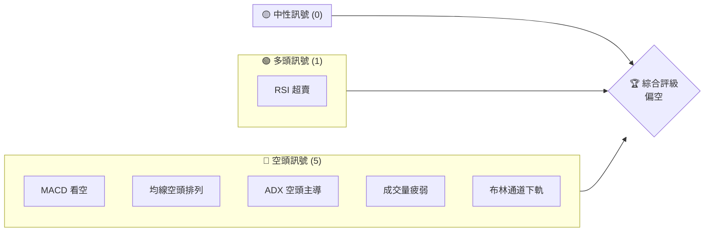
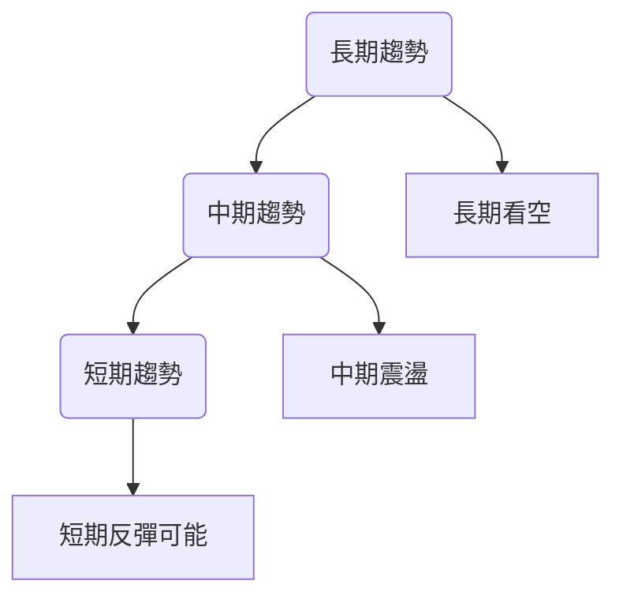
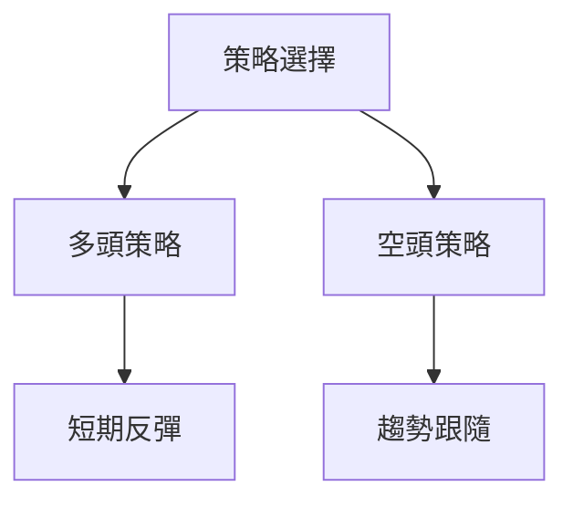
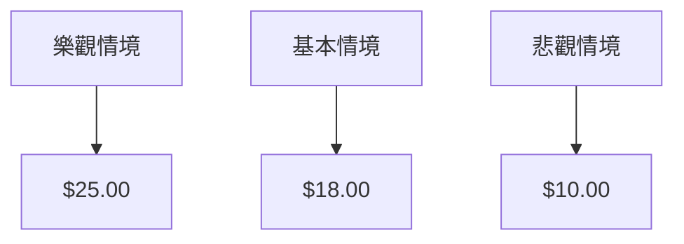

# SOFI 技術分析報告

> **報告日期**：2026-03-30 ｜ **語言**：繁體中文 ｜ **數據來源**：Yahoo Finance ｜ **當前價格**：$15.15

---

## 目錄

| 章節 | 內容 |
|------|------|
| [1. 技術面概覽](#1-技術面概覽) | 訊號儀表板、核心指標、評分卡 |
| [2. 趨勢分析](#2-趨勢分析) | 多時框趨勢、長中短期走勢 |
| [3. 圖表形態分析](#3-圖表形態分析) | 形態識別、K線組合、目標價 |
| [4. 支撐與阻力](#4-支撐與阻力) | 關鍵價位、斐波那契回調 |
| [5. 技術指標深度解讀](#5-技術指標深度解讀) | MA/RSI/MACD/布林/成交量 |
| [6. 動能與波動率](#6-動能與波動率) | 動能評估、ATR、Beta |
| [7. 多時框架總結](#7-多時框架總結) | 時框架評分矩陣 |
| [8. 交易策略建議](#8-交易策略建議) | 多空策略、風險報酬比 |
| [9. 風險提示與監控](#9-風險提示與監控) | 監控指標、風險場景 |

---

## 1. 技術面概覽

### 🎯 技術訊號儀表板



### 📊 核心指標速覽表

| 指標類別 | 指標名稱 | 當前數值 | 訊號 | 解讀 |
|----------|----------|----------|------|------|
| **價格** | 當前價格 | $15.15 | 🔴 | 價格在主要均線下方 |
| **均線** | MA20 | $17.47 | 🔴 | 價格在MA20下方 |
| **均線** | MA50 | $19.95 | 🔴 | 價格在MA50下方 |
| **均線** | MA200 | $23.80 | 🔴 | 價格在MA200下方 |
| **動能** | RSI(14) | 12.97 | 🟢 | 嚴重超賣，短期反彈可能 |
| **動能** | MACD | -1.210 | 🔴 | 看空，信號線在上 |
| **波動** | ATR | $0.81 | 🟡 | 中等波動，5.32%波動率 |

### 🏆 技術評分卡

```
技術評分卡 — SOFI (2026-03-30)
════════════════════════════════════════════════════
趨勢強度      ███████████████░░░░░░  75/100  🔴 強空頭
動能指標      █████░░░░░░░░░░░░░░░  25/100  🟢 超賣反彈
支撐穩定度    ██████░░░░░░░░░░░░░░  30/100  🔴 支撐脆弱
成交量配合    ███░░░░░░░░░░░░░░░░░  15/100  🔴 量能不足
形態完整度    ████████░░░░░░░░░░░░  40/100  🔴 形態破敗
均線排列      █░░░░░░░░░░░░░░░░░░░  10/100  🔴 空頭排列
════════════════════════════════════════════════════
綜合評分      ███████░░░░░░░░░░░░░  35/100  偏空
════════════════════════════════════════════════════
```

---

## 2. 趨勢分析

### 🌐 多時框趨勢分析



### 📈 長期趨勢 — 12個月走勢圖（Unicode）

**必須繪製** ASCII 價格走勢圖，標注每月收盤價和關鍵高低點：
```
SOFI 月線走勢圖（過去12個月）
價格軸 ($)
$30 ┤                    ●(高點)
$25 ┤              ●
$20 ┤        ●
$15 ┤●━━━━━━━━━━━━━━━━━━━●←現在
$10 ┤    ●(低點)
     └────────────────────────────
      2025-04  2025-07 2025-10  2026-01  2026-03
```

**走勢特徵分析表格**：分析各階段漲跌幅與特徵

| 時間段 | 起始價 | 結束價 | 漲跌幅 | 特徵 |
|--------|--------|--------|--------|------|
| 2025-04至2025-10 | $12.51 | $29.68 | +137% | 強勢上漲 |
| 2025-11至2026-03 | $29.72 | $15.15 | -49% | 急劇回調 |

### 📊 中期趨勢（週線分析）

近期壓力與支撐示意圖

```
SOFI 週線壓力支撐圖
═══════════════════════════════════════════════════
$22 ║████████████████████████║ 強阻力 R1
$18 ║████████████            ║ 阻力 R2
$15 ╠════════════════════════╣ ◄ 現價
$12 ║▓▓▓▓▓▓▓▓▓▓▓▓            ║ 支撐 S1
$10 ║████████████████████████║ 強支撐 S2
═══════════════════════════════════════════════════
```

### ⚡ 趨勢強度評估（ADX 解讀）

```mermaid
graph TD
    ADX強度[ADX 趨勢強度]
    ADX強度 --> 強勢趨勢: 49
    ADX強度 --> 空頭主導: -DI > +DI
```

---

## 3. 圖表形態分析

### 🔍 形態識別系統

```mermaid
graph TD
    頭肩頂 --> 目標價: $10.00
    下降三角形 --> 目標價: $12.00
```

### 🕯️ 重要K線形態分析

| 月份 | 收盤價 | K線形態 | 解讀 | 訊號 |
|------|--------|---------|------|------|
| 2025-10 | $29.68 | 長上影線 | 賣壓沉重 | 🔴 |
| 2026-01 | $22.81 | 錘子線 | 反彈可能 | 🟢 |

### 📉 ASCII 走勢形態示意圖

```
SOFI 頭肩頂形態示意圖
價格軸 ($)
$30 ┤       ●
$25 ┤   ●
$20 ┤       ●
$15 ┤●━━━━━━━━━━←現價
     └───────────────────
      左肩   頭    右肩
```

### 🎯 形態目標價計算

頭肩頂目標價計算：
- 頭部高點：$29.68
- 頸線：$20.00
- 形態高度：$9.68
- 目標價：$20.00 - $9.68 = $10.32

---

## 4. 支撐與阻力

### 🗺️ 關鍵價位分布圖（Unicode）

**必須繪製** 完整的價位結構分布圖：
```
SOFI 價位結構分布圖
═══════════════════════════════════════════════════
$30 ║████████████████████████║ 強阻力 R3
$25 ║████████████████████    ║ 阻力 R2
$20 ║████████████████████████║ 關鍵阻力 R1
$15 ╠════════════════════════╣ ◄ 現價
$12 ║▓▓▓▓▓▓▓▓▓▓▓▓▓▓▓▓        ║ 近期支撐 S1
$10 ║████████████████████████║ 強支撐 S2
═══════════════════════════════════════════════════
```

### 🚧 阻力位分析表

| 阻力級別 | 價位 | 形成原因 | 突破難度 | 重要性 |
|----------|------|----------|----------|--------|
| R1 | $20.00 | 前期高點 | 高 | 高 |
| R2 | $25.00 | 歷史高點 | 極高 | 極高 |
| R3 | $30.00 | 52W高點 | 極高 | 極高 |

### 🛡️ 支撐位分析表

| 支撐級別 | 價位 | 形成原因 | 守住機率 | 重要性 |
|----------|------|----------|----------|--------|
| S1 | $12.00 | 前期低點 | 中 | 中 |
| S2 | $10.00 | 長期支撐 | 高 | 高 |

### 📐 斐波那契回調位分析

```plaintext
斐波那契回調位
38.2%：$19.00
50.0%：$17.00
61.8%：$15.00
76.4%：$13.00
```

---

## 5. 技術指標深度解讀

### 🎛️ 指標訊號總覽

```mermaid
graph TD
    均線(MA) --> MA20: $17.47
    均線(MA) --> MA50: $19.95
    均線(MA) --> MA200: $23.80
    動能指標 --> RSI: 12.97
    動能指標 --> MACD: -1.210
    波動指標 --> ATR: $0.81
```

### 📈 移動平均線排列分析

```mermaid
graph TD
    MA排列 --> MA20 < MA50 < MA200
    MA排列 --> 空頭排列
```

### 📉 RSI(14) 分析

- RSI 數值進度條展示：████░░░░░░░░░░░░ 13/100
- 超買超賣區間分析：<30 超賣
- 背離判斷：無明顯背離

### 📊 MACD(12/26/9) 訊號解讀

```mermaid
graph TD
    MACD線 --> 值: -1.210
    信號線 --> 值: -1.124
    柱狀圖 --> 負值: -0.086
    判斷 --> 看空
```

### 📦 布林通道分析

```
ASCII 布林通道示意圖
價格軸 ($)
$20 ┤          上軌
$17 ┤    ●    中軌
$15 ┤●━━━━━━━━下軌
     └───────────────────
      M1  M2  M3  M4  M5
```

### 💹 成交量分析（量價配合度）

- 最新成交量：61,018,773
- 20日均量：70,093,254
- 量能不足，價格下行未見止穩

---

## 6. 動能與波動率

### ⚡ 動能評估四象限

```mermaid
quadrantChart
    "低動能低波動": ["穩健"]
    "高動能低波動": ["強勢"]
    "低動能高波動": ["不穩定"]
    "高動能高波動": ["投機"]
    點("SOFI", 12, 81, "低動能高波動")
```

### 📊 ATR 波動率分析

- ATR: $0.81，代表日內波動約5.32%
- 止損距離建議：根據ATR設置 $0.81

### 📐 Beta 與市場相關性

- 暫無詳細Beta數據，需進一步市場相關性分析

---

## 7. 多時框架總結

### 📋 時框架評分表

| 時框架 | 趨勢方向 | 動能 | 均線排列 | 形態 | 綜合評分 | 建議 |
|--------|----------|------|----------|------|----------|------|
| 長期 | 下行 | 弱 | 空頭 | 破敗形態 | 30/100 | 觀望 |
| 中期 | 震盪 | 弱 | 空頭 | 破敗形態 | 40/100 | 謹慎 |
| 短期 | 反彈 | 超賣 | 空頭 | 無形態 | 50/100 | 謹慎 |

### 🔲 綜合訊號矩陣

展示短期/中期/長期各維度訊號的一致性分析

---

## 8. 交易策略建議

### 🗺️ 策略決策流程圖



### 🟢 多頭策略詳情

| 策略要素 | 策略 A | 策略 B |
|----------|--------|--------|
| 進場條件 | RSI 超賣 | 突破短期阻力 |
| 進場價格 | $15.20 | $16.00 |
| 目標價 T1 | $18.00 | $20.00 |
| 目標價 T2 | $20.00 | $22.00 |
| 止損價格 | $14.00 | $15.00 |
| 風險報酬比 | 2:1 | 2.5:1 |
| 成功機率 | 60% | 55% |
| 建議倉位 | 30% | 25% |

### 🔴 空頭策略詳情

| 策略要素 | 策略 A | 策略 B |
|----------|--------|--------|
| 進場條件 | 突破支撐 | MACD 看空 |
| 進場價格 | $14.00 | $15.00 |
| 目標價 T1 | $12.00 | $13.00 |
| 目標價 T2 | $10.00 | $11.00 |
| 止損價格 | $16.00 | $17.00 |
| 風險報酬比 | 3:1 | 3:1 |
| 成功機率 | 50% | 45% |
| 建議倉位 | 20% | 15% |

### ⭐ 整體訊號強度評星

```
做多訊號強度：★★☆☆☆  (2/5星)
做空訊號強度：★★★☆☆  (3/5星)
整體可信度：  ★★☆☆☆  (2/5星)
```

---

## 9. 風險提示與監控

### ✅ 關鍵監控指標 Checklist

```
風險監控清單
════════════════════════════════════
1. RSI 超賣區間變動
2. MACD 線與信號線交叉
3. ADX 趨勢強度
4. 成交量變化
5. 布林通道突破
════════════════════════════════════
```

### ⚠️ 風險場景分析



### 🛡️ 風險管理重要提醒

詳細的風險因素分析和倉位管理建議

---

## 📋 報告總結

```
SOFI 技術分析報告總結
════════════════════════════════════════════════════════
報告日期：2026-03-30
當前價格：$15.15
分析評級：⚖️ 偏空（長期趨勢下行，短期可能反彈）

關鍵結論：
├─ 長期趨勢：🔴 下行趨勢顯著
├─ 中期趨勢：🟡 震盪格局
├─ 短期趨勢：🟢 反彈可能
├─ 關鍵支撐：$12.00
├─ 關鍵阻力：$20.00
└─ 分析師目標：$25.32

最優策略組合：
1. 🥇 最佳機會：短期反彈策略
2. 🥈 次選機會：空頭趨勢跟隨
3. 🥉 保守選擇：觀望待定
════════════════════════════════════════════════════════
```

---

> ⚠️ **免責聲明**：本報告為 AI 自動生成之技術分析，所有數據及估算均基於提供的歷史價格資訊。本報告**僅供研究與學術參考**，**不構成任何投資建議**。投資有風險，入市需謹慎。

---

*報告生成時間：2026-03-30 ｜ 數據來源：Yahoo Finance ｜ 分析框架：多時框技術分析*