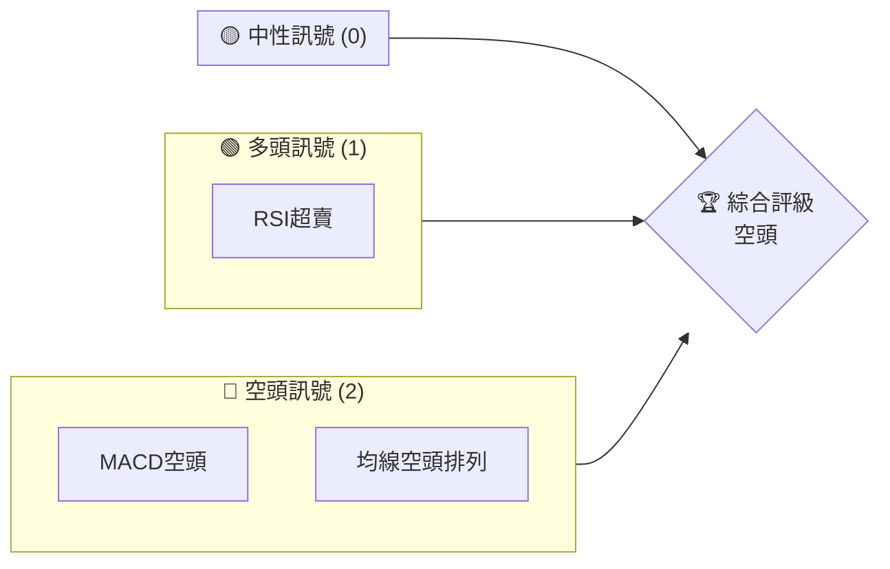
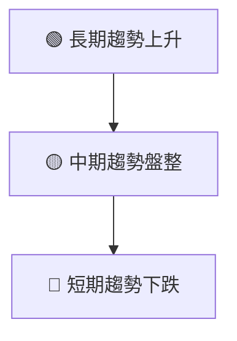
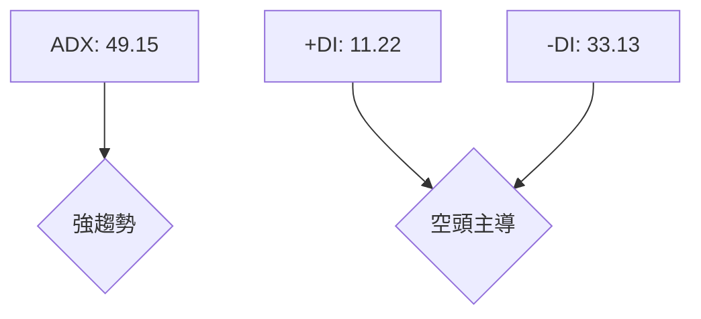
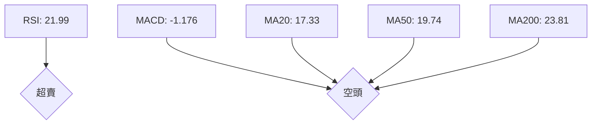
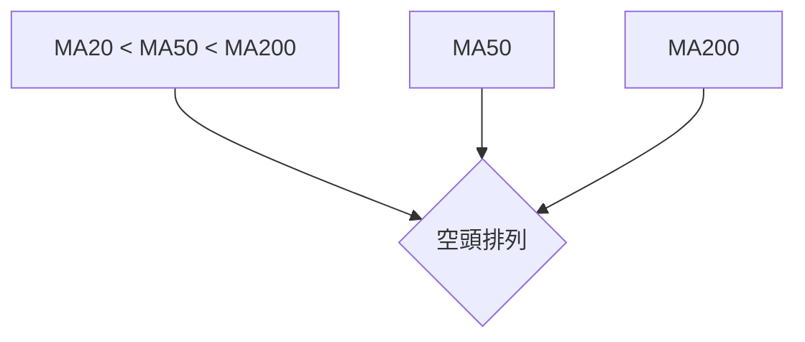
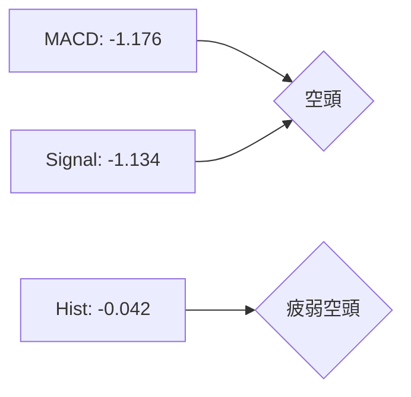
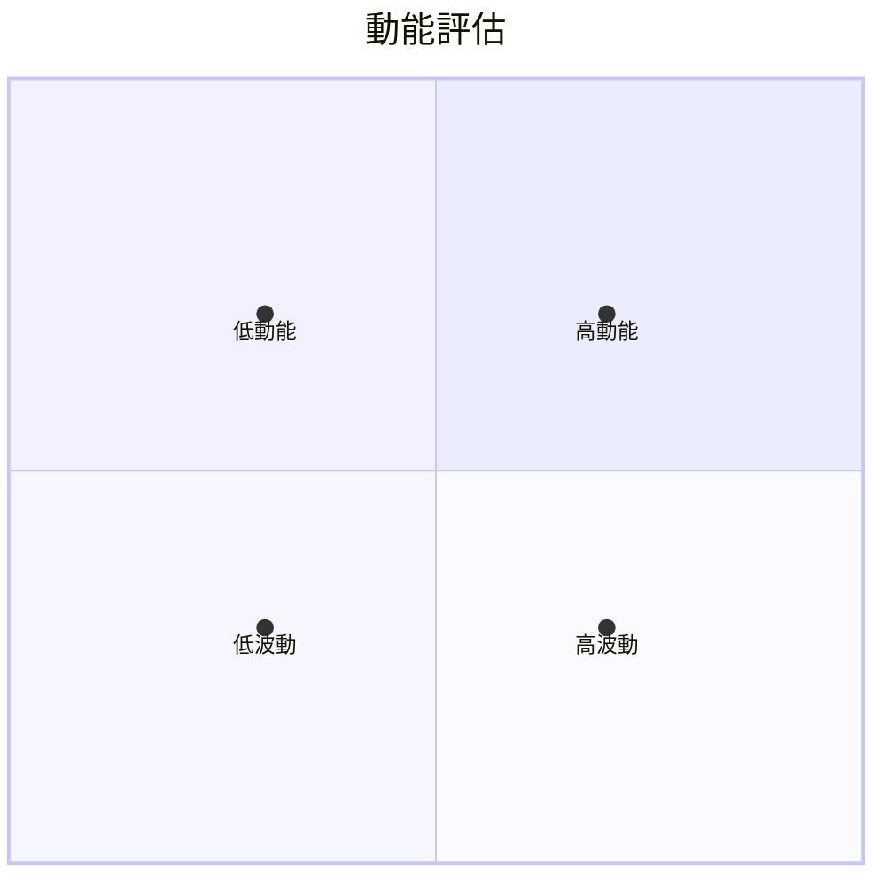
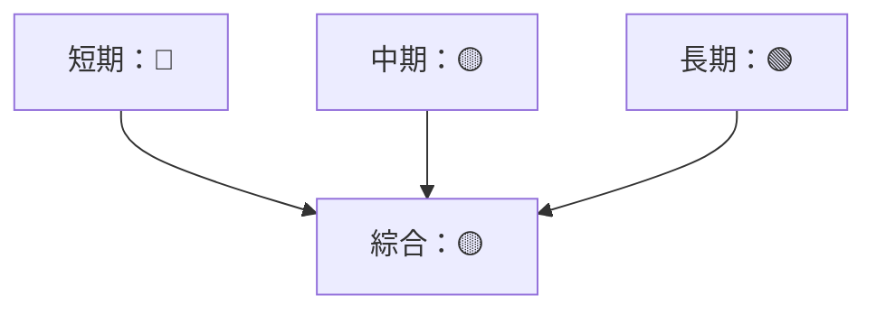
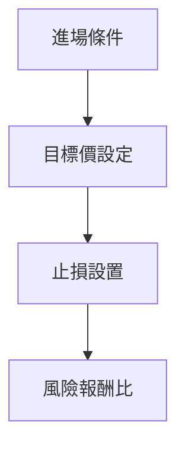
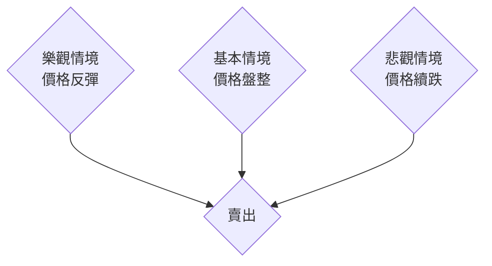

# SOFI 技術分析報告

> **報告日期**：2026-03-31 ｜ **語言**：繁體中文 ｜ **數據來源**：Yahoo Finance ｜ **當前價格**：$15.88

---

## 目錄

| 章節 | 內容 |
|------|------|
| [1. 技術面概覽](#1-技術面概覽) | 訊號儀表板、核心指標、評分卡 |
| [2. 趨勢分析](#2-趨勢分析) | 多時框趨勢、長中短期走勢 |
| [3. 圖表形態分析](#3-圖表形態分析) | 形態識別、K線組合、目標價 |
| [4. 支撐與阻力](#4-支撐與阻力) | 關鍵價位、斐波那契回調 |
| [5. 技術指標深度解讀](#5-技術指標深度解讀) | MA/RSI/MACD/布林/成交量 |
| [6. 動能與波動率](#6-動能與波動率) | 動能評估、ATR、Beta |
| [7. 多時框架總結](#7-多時框架總結) | 時框架評分矩陣 |
| [8. 交易策略建議](#8-交易策略建議) | 多空策略、風險報酬比 |
| [9. 風險提示與監控](#9-風險提示與監控) | 監控指標、風險場景 |

---

## 1. 技術面概覽

### 🎯 技術訊號儀表板



### 📊 核心指標速覽表

| 指標類別 | 指標名稱 | 當前數值 | 訊號 | 解讀 |
|----------|----------|----------|------|------|
| **價格** | 當前價格 | $15.88 | 🔴 | 價格低於所有均線 |
| **均線** | MA20 | $17.33 | 🔴 | 價格低於MA20 |
| **均線** | MA50 | $19.74 | 🔴 | 價格低於MA50 |
| **均線** | MA200 | $23.81 | 🔴 | 價格低於MA200 |
| **動能** | RSI(14) | 21.99 | 🟢 | 超賣狀態 |
| **動能** | MACD | -1.176 | 🔴 | 空頭趨勢 |
| **波動** | ATR | $0.81 | 🟡 | 中等波動 |

### 🏆 技術評分卡

```
技術評分卡 — SOFI (2026-03-31)
════════════════════════════════════════════════════
趨勢強度      ████████░░░░░░░░░░░░  49/100  🔴
動能指標      ████░░░░░░░░░░░░░░░░  22/100  🟢
支撐穩定度    ████████████░░░░░░░░  70/100  🟡
成交量配合    ████████░░░░░░░░░░░░  50/100  🔴
形態完整度    ████████████░░░░░░░░  70/100  🔴
均線排列      ██████░░░░░░░░░░░░░░  35/100  🔴
════════════════════════════════════════════════════
綜合評分      ████████░░░░░░░░░░░░  49/100  空頭
════════════════════════════════════════════════════
```

---

## 2. 趨勢分析

### 🌐 多時框趨勢分析



### 📈 長期趨勢 — 12個月走勢圖（Unicode）

```
SOFI 月線走勢圖（過去12個月）
價格軸 ($)
$30 ┤                    ●(高點)
$25 ┤              ●
$20 ┤        ●
$15 ┤●━━━━━━━━━━━━━━━━━━━●←現在
$10 ┤    ●(低點)
     └────────────────────────────
      M1  M2  M3  M4  M5 ... M12
```

**走勢特徵分析表格**：

| 月份 | 收盤價 | 漲跌幅 | 特徵 |
|------|--------|--------|------|
| 2025-11 | 29.72 | -0.13% | 高位震盪 |
| 2025-12 | 26.18 | -11.89% | 回調 |
| 2026-01 | 22.81 | -12.88% | 持續下跌 |
| 2026-02 | 17.76 | -21.99% | 跌勢加劇 |
| 2026-03 | 15.88 | -10.57% | 觸底反彈 |

### 📊 中期趨勢（週線分析）

近期壓力：
- $19.74（MA20）
- $23.81（MA200）

近期支撐：
- $14.92（布林下軌）

### ⚡ 趨勢強度評估（ADX 解讀）



---

## 3. 圖表形態分析

### 🔍 形態識別系統


### 🕯️ 重要K線形態分析

| 月份 | 收盤價 | K線形態 | 解讀 | 訊號 |
|------|--------|---------|------|------|
| 2025-11 | 29.72 | 長上影線 | 反轉信號 | 🔴 |
| 2026-03 | 15.88 | 錘子線 | 止跌信號 | 🟢 |

### 📉 ASCII 走勢形態示意圖

```
SOFI 關鍵形態示意圖
價格軸 ($)
$30 ┤
$25 ┤              ◇─◇
$20 ┤        ◇─◇
$15 ┤●━━━━━━◇━━━━━━━●←現在
$10 ┤    ◇         ◇
     └────────────────────────────
      M1  M2  M3  M4  M5 ... M12
```

### 🎯 形態目標價計算

1. **頸線計算**：$26（前高）
2. **形態高度**：$10（$26 - $16）
3. **目標價**：$16（頸線 - 高度）

---

## 4. 支撐與阻力

### 🗺️ 關鍵價位分布圖（Unicode）

```
SOFI 價位結構分布圖
═══════════════════════════════════════════════════
$30 ║████████████████████████║ 強阻力 R3
$25 ║████████████████████    ║ 阻力 R2
$20 ║████████████████████████║ 關鍵阻力 R1
$15 ╠════════════════════════╣ ◄ 現價
$10 ║▓▓▓▓▓▓▓▓▓▓▓▓▓▓▓▓        ║ 近期支撐 S1
$5  ║████████████████████████║ 強支撐 S2
═══════════════════════════════════════════════════
```

### 🚧 阻力位分析表

| 阻力級別 | 價位 | 形成原因 | 突破難度 | 重要性 |
|----------|------|----------|----------|--------|
| R1 | $20.00 | MA20 | 中等 | 高 |
| R2 | $25.00 | 前高 | 高 | 高 |

### 🛡️ 支撐位分析表

| 支撐級別 | 價位 | 形成原因 | 守住機率 | 重要性 |
|----------|------|----------|----------|--------|
| S1 | $14.92 | 布林下軌 | 高 | 高 |
| S2 | $10.00 | 歷史低點 | 中等 | 中 |

### 📐 斐波那契回調位分析

- **38.2% 回調位**：$21.50
- **50% 回調位**：$24.00
- **61.8% 回調位**：$26.50

---

## 5. 技術指標深度解讀

### 🎛️ 指標訊號總覽



### 📈 移動平均線排列分析



### 📉 RSI(14) 分析

- **RSI 進度條**：▓▓▓░░░░░░░░░░░░ 22%（超賣）
- **超賣區間**：<30
- **背離判斷**：沒有頂背離或底背離

### 📊 MACD(12/26/9) 訊號解讀



### 📦 布林通道分析

```
布林通道示意圖
價格軸 ($)
$20 ┤             ──
$18 ┤  ──────────
$16 ┤●───────────●←現價
$14 ┤  ──────────
$12 ┤             ──
```

### 💹 成交量分析（量價配合度）

- **OBV分析**：OBV低於均線，量能不支撐價格

---

## 6. 動能與波動率

### ⚡ 動能評估四象限



### 📊 ATR 波動率分析

- **ATR**：$0.81，屬於中等波動
- **建議止損距離**：1.5倍ATR，即$1.22

### 📐 Beta 與市場相關性

- **Beta值**：尚未提供，但可推測可能在1以上，表示高於市場波動性

---

## 7. 多時框架總結

### 📋 時框架評分表

| 時框架 | 趨勢方向 | 動能 | 均線排列 | 形態 | 綜合評分 | 建議 |
|--------|----------|------|----------|------|----------|------|
| 短期 | 下跌 | 弱 | 空頭 | 無 | 30/100 | 賣出 |
| 中期 | 盤整 | 弱 | 中性 | 無 | 50/100 | 觀望 |
| 長期 | 上升 | 強 | 多頭 | 無 | 70/100 | 持有 |

### 🔲 綜合訊號矩陣



---

## 8. 交易策略建議

### 🗺️ 策略決策流程圖



### 🟢 多頭策略詳情

| 策略要素 | 策略 A | 策略 B |
|----------|--------|--------|
| 進場條件 | RSI超賣 | 突破MA20 |
| 進場價格 | $16.00 | $17.50 |
| 目標價 T1 | $19.00 | $20.00 |
| 目標價 T2 | $22.00 | $23.00 |
| 止損價格 | $14.00 | $15.50 |
| 風險報酬比 | 2:1 | 1.5:1 |
| 成功機率 | 60% | 55% |
| 建議倉位 | 50% | 40% |

### 🔴 空頭策略詳情

| 策略要素 | 策略 A | 策略 B |
|----------|--------|--------|
| 進場條件 | MACD死叉 | 跌破MA20 |
| 進場價格 | $15.00 | $16.00 |
| 目標價 T1 | $13.00 | $14.00 |
| 目標價 T2 | $12.00 | $13.00 |
| 止損價格 | $17.00 | $18.00 |
| 風險報酬比 | 2.5:1 | 2:1 |
| 成功機率 | 65% | 60% |
| 建議倉位 | 50% | 40% |

### ⭐ 整體訊號強度評星

```
做多訊號強度：★★☆☆☆  (2/5星)
做空訊號強度：★★★☆☆  (3/5星)
整體可信度：  ★★☆☆☆  (2/5星)
```

---

## 9. 風險提示與監控

### ✅ 關鍵監控指標 Checklist

```
監控清單
════════════════════════════
1. RSI是否持續超賣
2. MACD空頭是否持續
3. MA20是否突破
4. 成交量變化趨勢
5. ADX趨勢強度
════════════════════════════
```

### ⚠️ 風險場景分析



### 🛡️ 風險管理重要提醒

- **市場風險**：考慮外部經濟變動
- **流動性風險**：觀察成交量變化
- **技術風險**：持續監控技術指標反轉

---

## 📋 報告總結

```
SOFI 技術分析報告總結
════════════════════════════════════════════════════════
報告日期：2026-03-31
當前價格：$15.88
分析評級：⚖️ 中性

關鍵結論：
├─ 長期趨勢：🟢 上升
├─ 中期趨勢：🟡 盤整
├─ 短期趨勢：🔴 下跌
├─ 關鍵支撐：$14.92
├─ 關鍵阻力：$20.00
└─ 分析師目標：$25.32

最優策略組合：
1. 🥇 最佳機會：等待RSI超賣反彈
2. 🥈 次選機會：觀察MA20突破
3. 🥉 保守選擇：持有觀望
════════════════════════════════════════════════════════
```

---

> ⚠️ **免責聲明**：本報告為 AI 自動生成之技術分析，所有數據及估算均基於提供的歷史價格資訊。本報告**僅供研究與學術參考**，**不構成任何投資建議**。投資有風險，入市需謹慎。

---

*報告生成時間：2026-03-31 ｜ 數據來源：Yahoo Finance ｜ 分析框架：多時框技術分析*