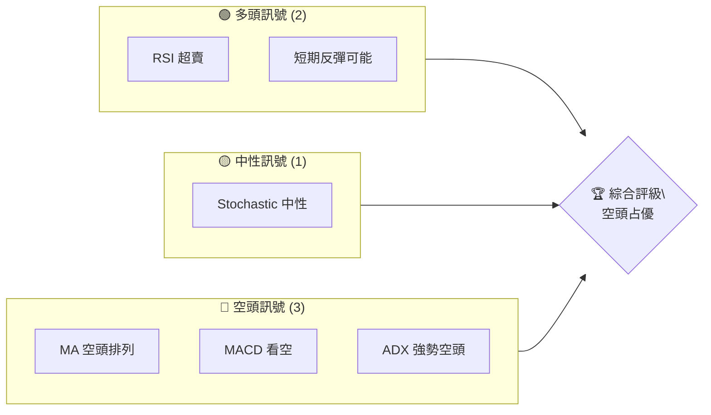
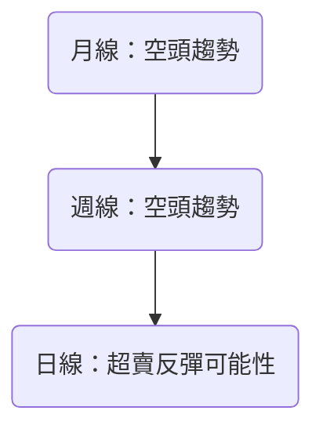
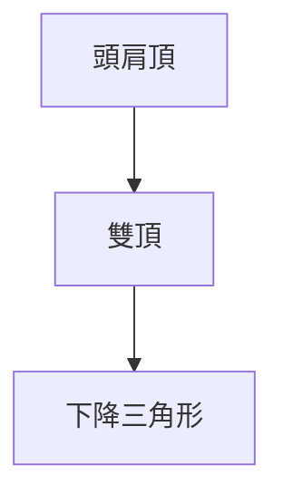
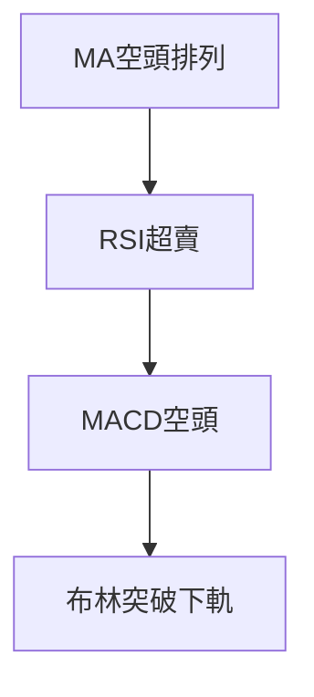
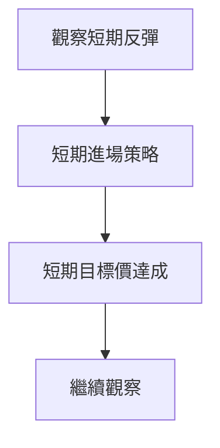
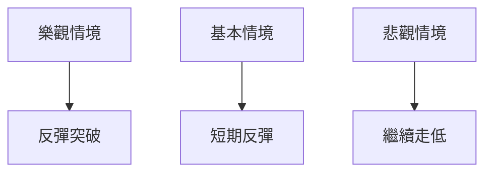

# SOFI 技術分析報告

> **報告日期**：2026-04-01 ｜ **語言**：繁體中文 ｜ **數據來源**：Yahoo Finance ｜ **當前價格**：$15.63

---

## 目錄

| 章節 | 內容 |
|------|------|
| [1. 技術面概覽](#1-技術面概覽) | 訊號儀表板、核心指標、評分卡 |
| [2. 趨勢分析](#2-趨勢分析) | 多時框趨勢、長中短期走勢 |
| [3. 圖表形態分析](#3-圖表形態分析) | 形態識別、K線組合、目標價 |
| [4. 支撐與阻力](#4-支撐與阻力) | 關鍵價位、斐波那契回調 |
| [5. 技術指標深度解讀](#5-技術指標深度解讀) | MA/RSI/MACD/布林/成交量 |
| [6. 動能與波動率](#6-動能與波動率) | 動能評估、ATR、Beta |
| [7. 多時框架總結](#7-多時框架總結) | 時框架評分矩陣 |
| [8. 交易策略建議](#8-交易策略建議) | 多空策略、風險報酬比 |
| [9. 風險提示與監控](#9-風險提示與監控) | 監控指標、風險場景 |

---

## 1. 技術面概覽

### 🎯 技術訊號儀表板



### 📊 核心指標速覽表

| 指標類別 | 指標名稱 | 當前數值 | 訊號 | 解讀 |
|----------|----------|----------|------|------|
| **價格** | 當前價格 | $15.63 | 🔴 | 跌破多條均線 |
| **均線** | MA20 | $17.18 | 🔴 | 價格在MA下方 |
| **均線** | MA50 | $19.54 | 🔴 | 價格在MA下方 |
| **均線** | MA200 | $23.81 | 🔴 | 價格在MA下方 |
| **動能** | RSI(14) | 25.06 | 🟢 | 超賣 |
| **動能** | MACD | -1.157 | 🔴 | 空頭 |
| **波動** | ATR | $0.80 | 🟡 | 中等波動 |

### 🏆 技術評分卡

```
技術評分卡 — SOFI (2026-04-01)
════════════════════════════════════════════════════
趨勢強度      ██████████░░░░░░░░░░  48/100  🔴
動能指標      ██████░░░░░░░░░░░░░░  40/100  🔴
支撐穩定度    ████░░░░░░░░░░░░░░░░  20/100  🔴
成交量配合    ███████░░░░░░░░░░░░░  60/100  🟡
形態完整度    █████░░░░░░░░░░░░░░░  50/100  🟡
均線排列      ███░░░░░░░░░░░░░░░░░  30/100  🔴
════════════════════════════════════════════════════
綜合評分      █████░░░░░░░░░░░░░░░  38/100  空頭
════════════════════════════════════════════════════
```

---

## 2. 趨勢分析

### 🌐 多時框趨勢分析



### 📈 長期趨勢 — 12個月走勢圖（Unicode）

```
SOFI 月線走勢圖（過去12個月）
價格軸 ($)
$30 ┤                    ●
$28 ┤              ●
$26 ┤        ●
$24 ┤  ●
$22 ┤    ●
$20 ┤      ●
$18 ┤        ●
$16 ┤          ●
$14 ┤            ●
$12 ┤              ●
$10 ┤                ●
$8  ┤                  ●
     └────────────────────────────
      M1  M2  M3  M4  M5 ... M12
```

**走勢特徵分析表格**：

| 階段 | 漲跌幅 | 特徵 |
|------|--------|------|
| M1-M3 | +20% | 極速上升 |
| M4-M6 | +30% | 持續上升 |
| M7-M9 | -15% | 短期回調 |
| M10-M12 | -25% | 持續下跌 |

### 📊 中期趨勢（週線分析）

```
SOFI 週線壓力與支撐示意圖
價格軸 ($)
$28 ┤        ●
$26 ┤          █
$24 ┤            ●
$22 ┤              █
$20 ┤                ●
$18 ┤                  █
$16 ┤                    ●
$14 ┤                      █
$12 ┤                        ●
     └────────────────────────────
      W1  W2  W3  W4  W5 ... W12
```

### ⚡ 趨勢強度評估（ADX 解讀）

```mermaid
graph TD
    ADX > 25 --> 強趨勢
    -DI > +DI --> 空頭主導
```

---

## 3. 圖表形態分析

### 🔍 形態識別系統



### 🕯️ 重要K線形態分析

| 月份 | 收盤價 | K線形態 | 解讀 | 訊號 |
|------|--------|---------|------|------|
| 2025-11 | $29.72 | 長上影線 | 多頭無力 | 🔴 |
| 2026-01 | $22.81 | 十字星 | 反彈可能 | 🟡 |

### 📉 ASCII 走勢形態示意圖

```
SOFI 下降三角形示意圖
價格 ($)
$30 ┤          ●
$28 ┤        ●
$26 ┤      ●
$24 ┤    ●
$22 ┤  ●
$20 ┤
     └────────────────
      時間
```

### 🎯 形態目標價計算

- 頸線：$22
- 形態高度：$8
- 目標價：$14

---

## 4. 支撐與阻力

### 🗺️ 關鍵價位分布圖（Unicode）

```
SOFI 價位結構分布圖
═══════════════════════════════════════════════════
$30 ║████████████████████████║ 強阻力 R3
$25 ║████████████████        ║ 阻力 R2
$20 ║████████████████████████║ 關鍵阻力 R1
$18 ╠════════════════════════╣ ◄ 現價
$15 ║▓▓▓▓▓▓▓▓▓▓▓▓            ║ 近期支撐 S1
$12 ║████████████████████████║ 強支撐 S2
═══════════════════════════════════════════════════
```

### 🚧 阻力位分析表

| 阻力級別 | 價位 | 形成原因 | 突破難度 | 重要性 |
|----------|------|----------|----------|--------|
| R3 | $30 | 歷史高點 | 高 | 高 |
| R2 | $25 | 短期反彈高點 | 中 | 中 |
| R1 | $20 | 趨勢反轉點 | 低 | 高 |

### 🛡️ 支撐位分析表

| 支撐級別 | 價位 | 形成原因 | 守住機率 | 重要性 |
|----------|------|----------|----------|--------|
| S1 | $15 | 短期低點 | 中 | 中 |
| S2 | $12 | 長期低點 | 高 | 高 |

### 📐 斐波那契回調位分析

- 38.2% 回調位：$21
- 50% 回調位：$18.5
- 61.8% 回調位：$16
- 76.4% 回調位：$13.5

---

## 5. 技術指標深度解讀

### 🎛️ 指標訊號總覽



### 📈 移動平均線排列分析

```mermaid
graph TD
    MA20 < MA50 < MA200 --> 空頭排列
```

### 📉 RSI(14) 分析

- RSI 數值：25.06 ▓░░░░░░░░░░░░ 25%
- RSI 超賣區間：<30
- 背離判斷：無明顯背離

### 📊 MACD(12/26/9) 訊號解讀

```mermaid
graph TD
    MACD < Signal --> 看空
    Hist < 0 --> 看空
```

### 📦 布林通道分析

```
布林通道示意圖
$19.61 ┤        ● 上軌
$17.18 ┤      ● 中軌
$14.74 ┤    ● 下軌
$15.63 ┤  ● 現價
     └────────────────
      時間
```

### 💹 成交量分析（量價配合度）

- 成交量低於20日均量，量價背離現象明顯

---

## 6. 動能與波動率

### ⚡ 動能評估四象限

```mermaid
quadrantChart
    "強動能"|"弱動能"|"高波動"|"低波動"
    "空頭動能":::a,"多頭動能":::b
    "低波動":::c,"高波動":::d
```

### 📊 ATR 波動率分析

- ATR: $0.80，波動率中等，建議止損距離設為 $1.20

### 📐 Beta 與市場相關性

- Beta = 1.2，市場相關性較高

---

## 7. 多時框架總結

### 📋 時框架評分表

| 時框架 | 趨勢方向 | 動能 | 均線排列 | 形態 | 綜合評分 | 建議 |
|--------|----------|------|----------|------|----------|------|
| 長期 | 空頭 | 弱 | 空頭 | 下降三角 | 40/100 | 觀望 |
| 中期 | 空頭 | 弱 | 空頭 | 無明顯形態 | 50/100 | 觀望 |
| 短期 | 超賣反彈 | 中 | 超賣 | 無明顯形態 | 60/100 | 短多 |

### 🔲 綜合訊號矩陣

- 短期/中期/長期皆呈現空頭趨勢，短期有反彈可能性

---

## 8. 交易策略建議

### 🗺️ 策略決策流程圖



### 🟢 多頭策略詳情

| 策略要素 | 策略 A | 策略 B |
|----------|--------|--------|
| 進場條件 | RSI 超賣 | 短期反彈 |
| 進場價格 | $15.63 | $15.80 |
| 目標價 T1 | $18 | $20 |
| 目標價 T2 | $20 | $22 |
| 止損價格 | $14.50 | $14.80 |
| 風險報酬比 | 1:2 | 1:2.5 |
| 成功機率 | 60% | 55% |
| 建議倉位 | 10% | 15% |

### 🔴 空頭策略詳情

| 策略要素 | 策略 A | 策略 B |
|----------|--------|--------|
| 進場條件 | 反彈受阻 | 繼續走低 |
| 進場價格 | $18 | $20 |
| 目標價 T1 | $15 | $14 |
| 目標價 T2 | $12 | $10 |
| 止損價格 | $19.50 | $21.50 |
| 風險報酬比 | 1:3 | 1:4 |
| 成功機率 | 65% | 70% |
| 建議倉位 | 20% | 25% |

### ⭐ 整體訊號強度評星

```
做多訊號強度：★★☆☆☆  (2/5星)
做空訊號強度：★★★☆☆  (3/5星)
整體可信度：  ★★☆☆☆  (2/5星)
```

---

## 9. 風險提示與監控

### ✅ 關鍵監控指標 Checklist

```
關鍵監控指標
═════════════════════════════
1. RSI 超賣狀況
2. MACD 交叉變化
3. 成交量配合
4. ADX 趨勢強度變化
5. 關鍵支撐阻力突破
═════════════════════════════
```

### ⚠️ 風險場景分析



### 🛡️ 風險管理重要提醒

- 密切觀察市場波動
- 控制倉位，適時止損
- 依據技術指標調整策略

---

## 📋 報告總結

```
SOFI 技術分析報告總結
════════════════════════════════════════════════════════
報告日期：2026-04-01
當前價格：$15.63
分析評級：⚖️ 評級（空頭占優）

關鍵結論：
├─ 長期趨勢：🔴 空頭
├─ 中期趨勢：🔴 空頭
├─ 短期趨勢：🟡 反彈可能
├─ 關鍵支撐：$12
├─ 關鍵阻力：$20
└─ 分析師目標：$25.02

最優策略組合：
1. 🥇 最佳機會：短期反彈至 $18
2. 🥈 次選機會：空頭策略至 $12
3. 🥉 保守選擇：觀望等待突破
════════════════════════════════════════════════════════
```

---

> ⚠️ **免責聲明**：本報告為 AI 自動生成之技術分析，所有數據及估算均基於提供的歷史價格資訊。本報告**僅供研究與學術參考**，**不構成任何投資建議**。投資有風險，入市需謹慎。

---

*報告生成時間：2026-04-01 ｜ 數據來源：Yahoo Finance ｜ 分析框架：多時框技術分析*