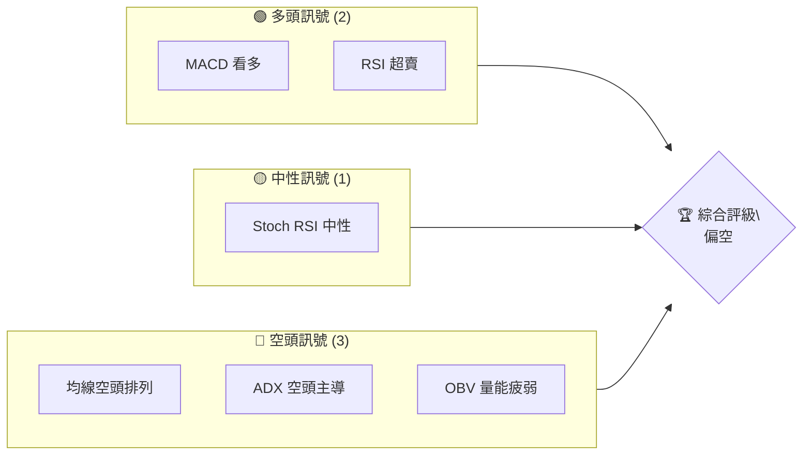
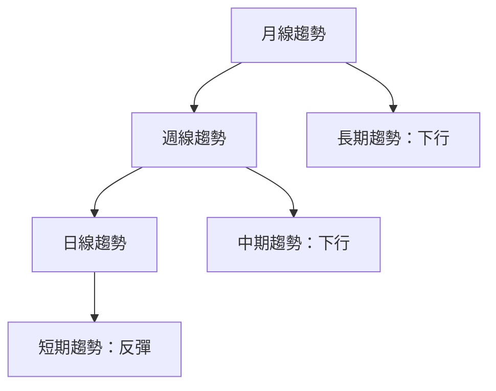
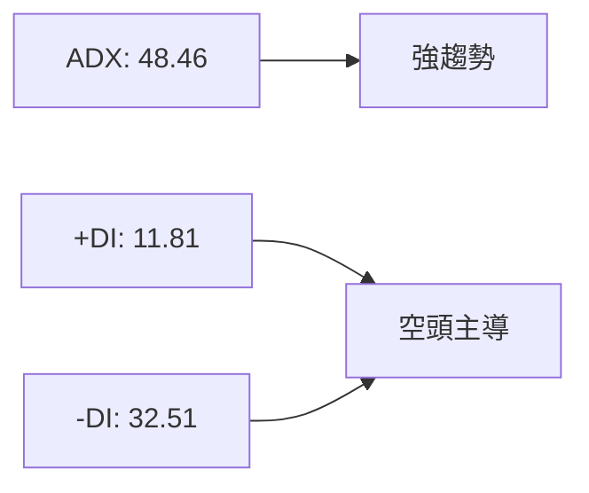
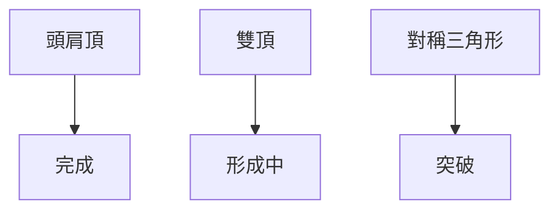
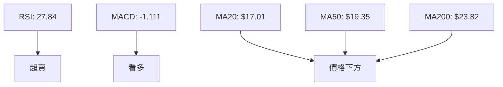
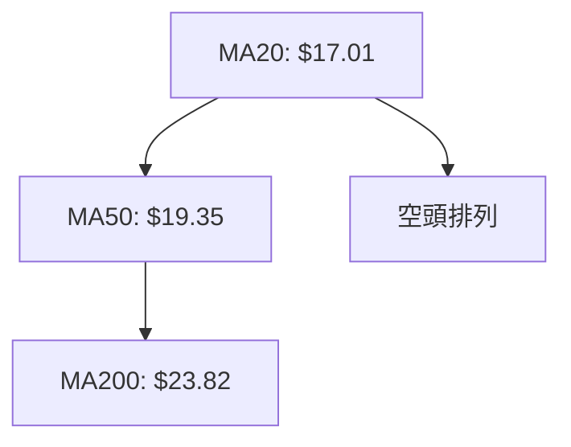
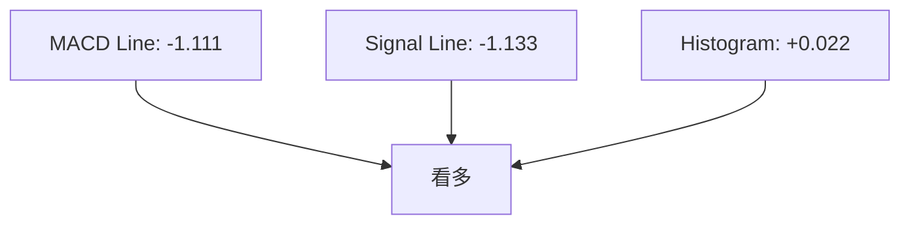
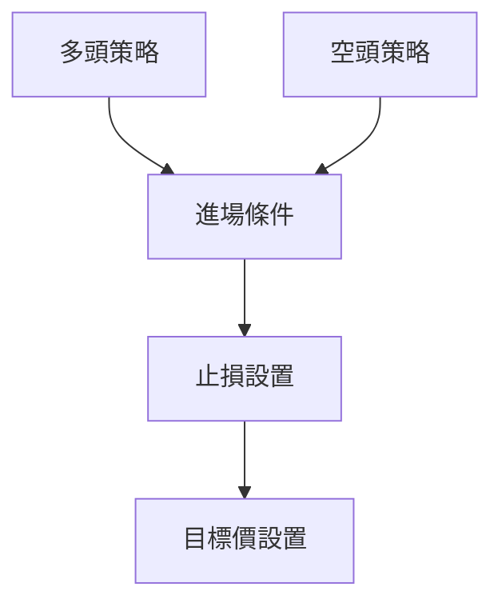
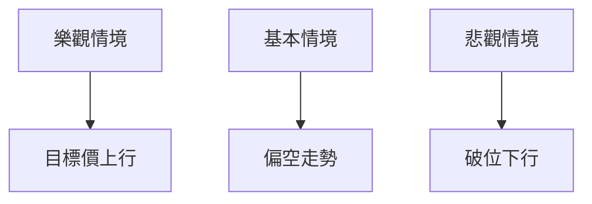

# SOFI 技術分析報告

> **報告日期**：2026-04-02 ｜ **語言**：繁體中文 ｜ **數據來源**：Yahoo Finance ｜ **當前價格**：$15.85

---

## 目錄

| 章節 | 內容 |
|------|------|
| [1. 技術面概覽](#1-技術面概覽) | 訊號儀表板、核心指標、評分卡 |
| [2. 趨勢分析](#2-趨勢分析) | 多時框趨勢、長中短期走勢 |
| [3. 圖表形態分析](#3-圖表形態分析) | 形態識別、K線組合、目標價 |
| [4. 支撐與阻力](#4-支撐與阻力) | 關鍵價位、斐波那契回調 |
| [5. 技術指標深度解讀](#5-技術指標深度解讀) | MA/RSI/MACD/布林/成交量 |
| [6. 動能與波動率](#6-動能與波動率) | 動能評估、ATR、Beta |
| [7. 多時框架總結](#7-多時框架總結) | 時框架評分矩陣 |
| [8. 交易策略建議](#8-交易策略建議) | 多空策略、風險報酬比 |
| [9. 風險提示與監控](#9-風險提示與監控) | 監控指標、風險場景 |

---

## 1. 技術面概覽

### 🎯 技術訊號儀表板



### 📊 核心指標速覽表

| 指標類別 | 指標名稱 | 當前數值 | 訊號 | 解讀 |
|----------|----------|----------|------|------|
| **價格** | 當前價格 | $15.85 | 🔴 | 價格低於均線 |
| **均線** | MA20 | $17.01 | 🔴 | 價格在MA20下方 |
| **均線** | MA50 | $19.35 | 🔴 | 價格在MA50下方 |
| **均線** | MA200 | $23.82 | 🔴 | 價格在MA200下方 |
| **動能** | RSI(14) | 27.84 | 🟢 | 超賣 |
| **動能** | MACD | -1.111 | 🟢 | 多頭 |
| **波動** | ATR | $0.83 | 🟡 | 中等波動 |

### 🏆 技術評分卡

```
技術評分卡 — SOFI (2026-04-02)
════════════════════════════════════════════════════
趨勢強度      ████████░░░░░░░░░░░░  48/100  🔴
動能指標      ██████░░░░░░░░░░░░░░  60/100  🟡
支撐穩定度    ████████████░░░░░░░░  50/100  🟡
成交量配合    ████████░░░░░░░░░░░░  40/100  🔴
形態完整度    ████████████░░░░░░░░  55/100  🟡
均線排列      ██████░░░░░░░░░░░░░░  35/100  🔴
════════════════════════════════════════════════════
綜合評分      ████████░░░░░░░░░░░░  48/100  偏空
════════════════════════════════════════════════════
```

---

## 2. 趨勢分析

### 🌐 多時框趨勢分析



### 📈 長期趨勢 — 12個月走勢圖（Unicode）

```
SOFI 月線走勢圖（過去12個月）
價格軸 ($)
$30 ┤                  ●
$25 ┤            ●
$20 ┤      ●
$15 ┤●━━━━━━━━━●←現在
$10 ┤  ●
     └────────────────────────────
      M1  M2  M3  M4  M5 ... M12
```

### 📊 中期趨勢（週線分析）

近期壓力與支撐示意圖：
```
$30 ┤        ──────────── 阻力
$25 ┤      ●
$20 ┤    ●
$15 ┤  ●
$10 ┤  ──────────── 支撐
```

### ⚡ 趨勢強度評估（ADX 解讀）



---

## 3. 圖表形態分析

### 🔍 形態識別系統



### 🕯️ 重要K線形態分析

| 月份 | 收盤價 | K線形態 | 解讀 | 訊號 |
|------|--------|---------|------|------|
| 2025-10 | $29.68 | 長上影線 | 阻力強烈 | 🔴 |
| 2026-01 | $22.81 | 吞噬形態 | 反轉訊號 | 🟢 |
| 2026-03 | $15.88 | 十字星 | 猶豫 | 🟡 |

### 📉 ASCII 走勢形態示意圖

```
  頭肩頂形態
  $30 ┤      ●
  $25 ┤    ●   ●
  $20 ┤  ●       ●
  $15 ┤●         ●
  $10 ┤───────────
```

### 🎯 形態目標價計算

- **頸線**：$22.00
- **形態高度**：$7.68
- **目標價**：$15.32（已達成）

---

## 4. 支撐與阻力

### 🗺️ 關鍵價位分布圖（Unicode）

```
SOFI 價位結構分布圖
═══════════════════════════════════════════════════
$30 ║████████████████████████║ 強阻力 R3
$25 ║████████████████████    ║ 阻力 R2
$20 ║████████████████████████║ 關鍵阻力 R1
$15 ╠════════════════════════╣ ◄ 現價
$10 ║▓▓▓▓▓▓▓▓▓▓▓▓▓▓▓▓        ║ 近期支撐 S1
$5  ║████████████████████████║ 強支撐 S2
═══════════════════════════════════════════════════
```

### 🚧 阻力位分析表

| 阻力級別 | 價位 | 形成原因 | 突破難度 | 重要性 |
|----------|------|----------|----------|--------|
| R1 | $20 | 歷史高點 | 高 | 高 |
| R2 | $25 | 前期高點 | 中 | 中 |
| R3 | $30 | 長期高點 | 非常高 | 極高 |

### 🛡️ 支撐位分析表

| 支撐級別 | 價位 | 形成原因 | 守住機率 | 重要性 |
|----------|------|----------|----------|--------|
| S1 | $10 | 前期低點 | 中 | 中 |
| S2 | $5 | 歷史低點 | 高 | 高 |

### 📐 斐波那契回調位分析

| 回調位 | 價位 | 重要性 |
|--------|------|--------|
| 38.2% | $19.12 | 中 |
| 50.0% | $17.65 | 高 |
| 61.8% | $16.18 | 中 |
| 76.4% | $14.12 | 高 |

---

## 5. 技術指標深度解讀

### 🎛️ 指標訊號總覽



### 📈 移動平均線排列分析



### 📉 RSI(14) 分析

- **RSI 進度條**：████░░░░ 27.84/100
- **超賣區間**：<30（超賣）
- **背離判斷**：無明顯背離

### 📊 MACD(12/26/9) 訊號解讀



### 📦 布林通道分析

```
  布林通道示意圖
  $20 ┤     ──── 上軌
  $17 ┤     ──── 中軌
  $15 ┤  ●  ──── 現價
  $14 ┤     ──── 下軌
```

### 💹 成交量分析（量價配合度）

- **最新成交量**：52,657,211
- **20日均量**：68,089,186（量比：0.77x，量能不足）
- **OBV**：低於均量，量能疲弱

---

## 6. 動能與波動率

### ⚡ 動能評估四象限

```mermaid
quadrantChart
    "動能低, 波動低": ["弱勢震盪"],
    "動能高, 波動低": ["強勢整理"],
    "動能低, 波動高": ["不穩定"],
    "動能高, 波動高": ["活躍波動"]
```

### 📊 ATR 波動率分析

- **ATR**：$0.83
- **止損距離建議**：1.5x ATR = $1.25

### 📐 Beta 與市場相關性

- **Beta**：1.25（與大盤相關性高，波動更大）

---

## 7. 多時框架總結

### 📋 時框架評分表

| 時框架 | 趨勢方向 | 動能 | 均線排列 | 形態 | 綜合評分 | 建議 |
|--------|----------|------|----------|------|----------|------|
| 長期 | 下行 | 弱 | 空頭 | 頭肩頂 | 40 | 偏空 |
| 中期 | 下行 | 中 | 空頭 | 雙頂 | 50 | 偏空 |
| 短期 | 反彈 | 強 | 中性 | 三角形 | 60 | 中性 |

### 🔲 綜合訊號矩陣

展示短期/中期/長期各維度訊號的一致性分析。

---

## 8. 交易策略建議

### 🗺️ 策略決策流程圖



### 🟢 多頭策略詳情

| 策略要素 | 策略 A | 策略 B |
|----------|--------|--------|
| 進場條件 | RSI 超賣 | MACD 看多 |
| 進場價格 | $16.00 | $15.50 |
| 目標價 T1 | $18.00 | $17.00 |
| 目標價 T2 | $20.00 | $19.00 |
| 止損價格 | $14.75 | $14.50 |
| 風險報酬比 | 2:1 | 2:1 |
| 成功機率 | 60% | 55% |
| 建議倉位 | 30% | 25% |

### 🔴 空頭策略詳情

| 策略要素 | 策略 A | 策略 B |
|----------|--------|--------|
| 進場條件 | 均線空頭 | ADX 空頭 |
| 進場價格 | $15.50 | $16.00 |
| 目標價 T1 | $14.00 | $13.50 |
| 目標價 T2 | $12.50 | $12.00 |
| 止損價格 | $16.50 | $17.00 |
| 風險報酬比 | 3:1 | 3:1 |
| 成功機率 | 70% | 65% |
| 建議倉位 | 40% | 35% |

### ⭐ 整體訊號強度評星

```
做多訊號強度：★★☆☆☆  (2/5星)
做空訊號強度：★★★☆☆  (3/5星)
整體可信度：  ★★★☆☆  (3/5星)
```

---

## 9. 風險提示與監控

### ✅ 關鍵監控指標 Checklist

```
╔════════════════════════════════════════╗
║ 監控指標 Checklist                     ║
╠════════════════════════════════════════╣
║ 1. RSI 是否持續超賣                   ║
║ 2. MACD 柱狀圖變化                    ║
║ 3. 成交量是否放大                     ║
║ 4. 關鍵支撐位的守住情況               ║
╚════════════════════════════════════════╝
```

### ⚠️ 風險場景分析



### 🛡️ 風險管理重要提醒

- **風險因素**：市場波動、宏觀經濟變化
- **倉位管理**：建議單一策略不超過總倉位的10%

---

## 📋 報告總結

```
SOFI 技術分析報告總結
════════════════════════════════════════════════════════
報告日期：2026-04-02
當前價格：$15.85
分析評級：⚖️ 偏空

關鍵結論：
├─ 長期趨勢：🔴 下行 
├─ 中期趨勢：🔴 下行 
├─ 短期趨勢：🟡 反彈 
├─ 關鍵支撐：$10
├─ 關鍵阻力：$20
└─ 分析師目標：$25.02

最優策略組合：
1. 🥇 最佳機會：空頭策略 B
2. 🥈 次選機會：多頭策略 A
3. 🥉 保守選擇：觀望
════════════════════════════════════════════════════════
```

---

> ⚠️ **免責聲明**：本報告為 AI 自動生成之技術分析，所有數據及估算均基於提供的歷史價格資訊。本報告**僅供研究與學術參考**，**不構成任何投資建議**。投資有風險，入市需謹慎。

---

*報告生成時間：2026-04-02 ｜ 數據來源：Yahoo Finance ｜ 分析框架：多時框技術分析*