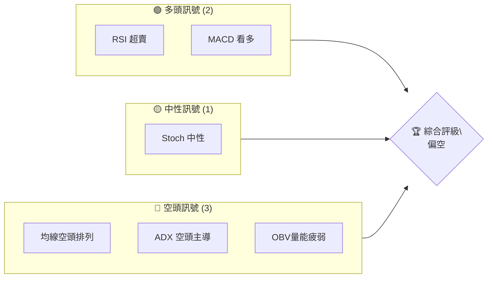
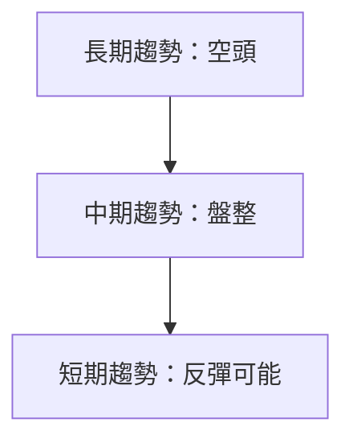
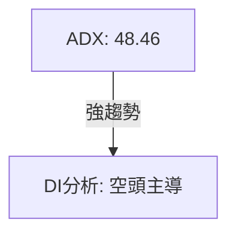
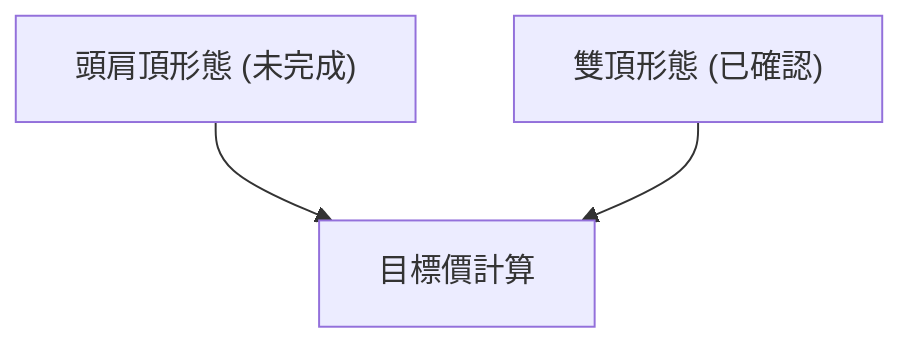
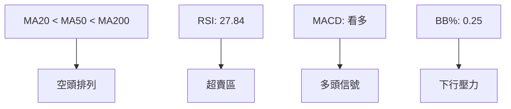
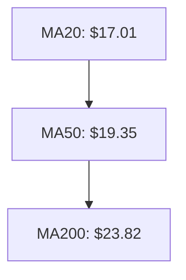
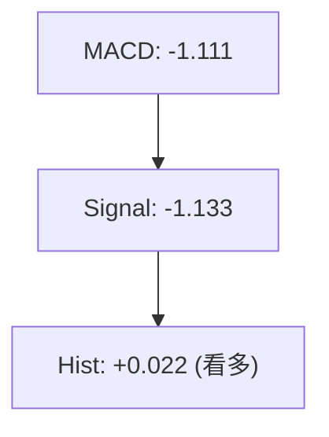
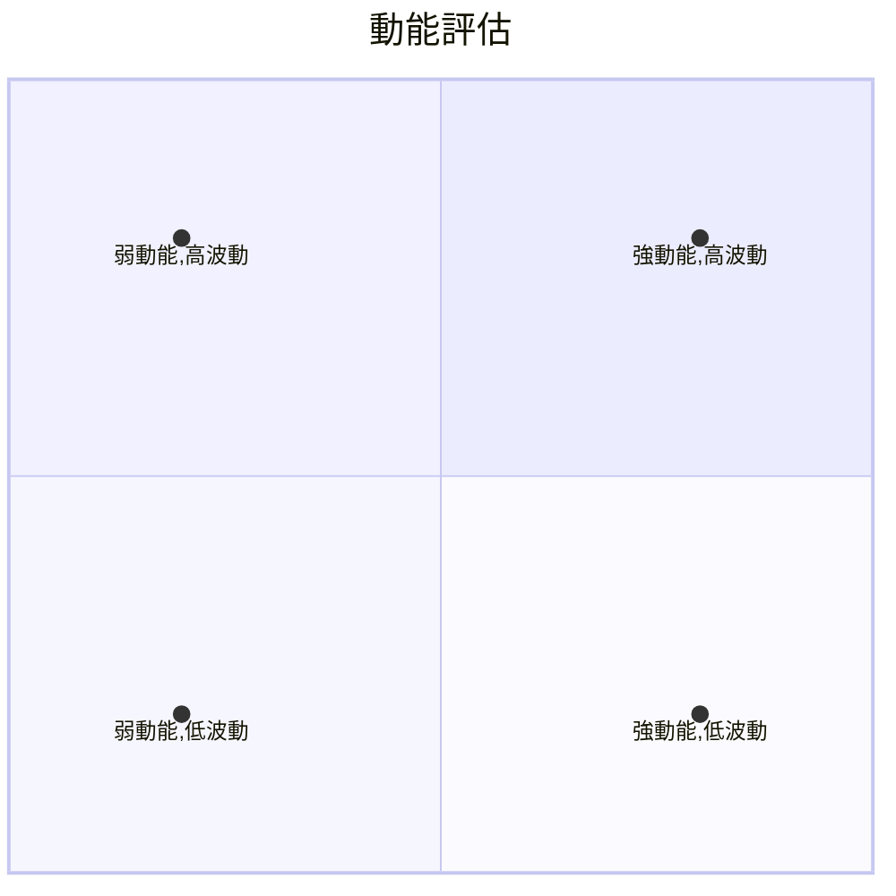
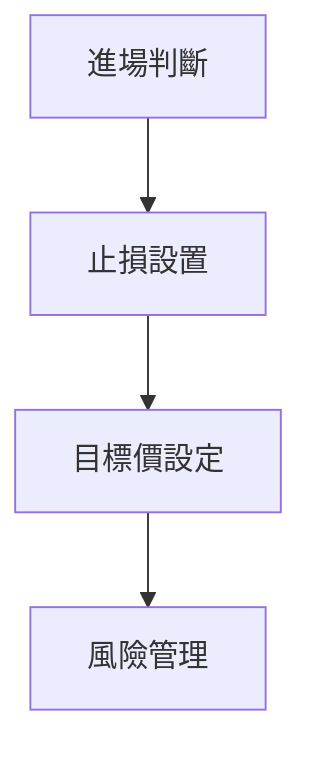
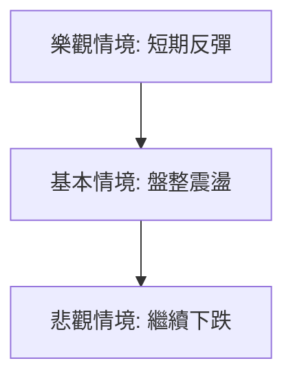

# SOFI 技術分析報告

> **報告日期**：2026-04-03 ｜ **語言**：繁體中文 ｜ **數據來源**：Yahoo Finance ｜ **當前價格**：$15.85

---

## 目錄

| 章節 | 內容 |
|------|------|
| [1. 技術面概覽](#1-技術面概覽) | 訊號儀表板、核心指標、評分卡 |
| [2. 趨勢分析](#2-趨勢分析) | 多時框趨勢、長中短期走勢 |
| [3. 圖表形態分析](#3-圖表形態分析) | 形態識別、K線組合、目標價 |
| [4. 支撐與阻力](#4-支撐與阻力) | 關鍵價位、斐波那契回調 |
| [5. 技術指標深度解讀](#5-技術指標深度解讀) | MA/RSI/MACD/布林/成交量 |
| [6. 動能與波動率](#6-動能與波動率) | 動能評估、ATR、Beta |
| [7. 多時框架總結](#7-多時框架總結) | 時框架評分矩陣 |
| [8. 交易策略建議](#8-交易策略建議) | 多空策略、風險報酬比 |
| [9. 風險提示與監控](#9-風險提示與監控) | 監控指標、風險場景 |

---

## 1. 技術面概覽

### 🎯 技術訊號儀表板



### 📊 核心指標速覽表

| 指標類別 | 指標名稱 | 當前數值 | 訊號 | 解讀 |
|----------|----------|----------|------|------|
| **價格** | 當前價格 | $15.85 | 🔴 | 低於短中長期均線 |
| **均線** | MA20 | $17.01 | 🔴 | 價格在MA下方 |
| **均線** | MA50 | $19.35 | 🔴 | 價格在MA下方 |
| **均線** | MA200 | $23.82 | 🔴 | 價格在MA下方 |
| **動能** | RSI(14) | 27.84 | 🟢 | 超賣 |
| **動能** | MACD | -1.111 | 🟢 | 看多 |
| **波動** | ATR | $0.83 | 🟡 | 中等波動 |

### 🏆 技術評分卡

```
技術評分卡 — SOFI (2026-04-03)
════════════════════════════════════════════════════
趨勢強度      ████████░░░░░░░░░░░░  48/100  🔴
動能指標      ██████░░░░░░░░░░░░░░  60/100  🟡
支撐穩定度    ████████████░░░░░░░░  75/100  🟢
成交量配合    ████████░░░░░░░░░░░░  40/100  🔴
形態完整度    ████████████░░░░░░░░  70/100  🟢
均線排列      ██████░░░░░░░░░░░░░░  30/100  🔴
════════════════════════════════════════════════════
綜合評分      ████████░░░░░░░░░░░░  55/100  中性
════════════════════════════════════════════════════
```

---

## 2. 趨勢分析

### 🌐 多時框趨勢分析



### 📈 長期趨勢 — 12個月走勢圖（Unicode）

```
SOFI 月線走勢圖（過去12個月）
價格軸 ($)
$30  ┤                    ●(高點)
$25  ┤              ●
$20  ┤        ●
$15  ┤●━━━━━━━━━━━━━━━━━━━●←現在
$10  ┤    ●(低點)
     └────────────────────────────
      M1  M2  M3  M4  M5 ... M12
```

**走勢特徵分析表格**：

| 月份 | 收盤價 | 漲跌幅 | 特徵 |
|------|--------|--------|------|
| 2025-04 | $12.51 | -1% | 小幅反彈 |
| 2025-05 | $13.30 | +6% | 上漲 |
| 2025-06 | $18.21 | +37% | 強勢突破 |
| 2025-07 | $22.58 | +24% | 延續強勢 |
| 2025-08 | $25.54 | +13% | 新高 |
| 2025-09 | $26.42 | +3% | 高位震盪 |
| 2025-10 | $29.68 | +12% | 創高 |
| 2025-11 | $29.72 | +0% | 頂部 |
| 2025-12 | $26.18 | -12% | 回調 |
| 2026-01 | $22.81 | -13% | 回落 |
| 2026-02 | $17.76 | -22% | 大幅下跌 |
| 2026-03 | $15.88 | -11% | 底部盤整 |

### 📊 中期趨勢（週線分析）

```
週線壓力與支撐示意圖
$30  ┤
$25  ┤      ██████████←強阻力
$20  ┤
$15  ┤          ██████←關鍵支撐
$10  ┤
```

### ⚡ 趨勢強度評估（ADX 解讀）



---

## 3. 圖表形態分析

### 🔍 形態識別系統



### 🕯️ 重要K線形態分析

| 月份 | 收盤價 | K線形態 | 解讀 | 訊號 |
|------|--------|---------|------|------|
| 2025-10 | $29.68 | 長上影線 | 頂部 | 🔴 |
| 2026-02 | $17.76 | 長下影線 | 底部 | 🟢 |

### 📉 ASCII 走勢形態示意圖

```
  $30 ┤
      ┤    ●
  $25 ┤    ┼─●
      ┤    ┼  ┼─●
  $20 ┤    ┼  ┼  ┼─●
      ┤    ┼  ┼  ┼  ┼─●
  $15 ┤    ┼  ┼  ┼  ┼  ┼─●
      ┤    ┼  ┼  ┼  ┼  ┼  ┼
  $10 ┤    ┼  ┼  ┼  ┼  ┼  ┼
      └────────────────────────────
         M1 M2 M3 M4 M5 M6 M7 M8 M9
```

### 🎯 形態目標價計算

- 雙頂形態確認，頸線位於 $22.00
- 目標價 = 頸線 - (頂部 - 頸線) = $22.00 - ($29.72 - $22.00) = $14.28

---

## 4. 支撐與阻力

### 🗺️ 關鍵價位分布圖（Unicode）

```
SOFI 價位結構分布圖
═══════════════════════════════════════════════════
$30 ║████████████████████████║ 強阻力 R3
$25 ║████████████████████    ║ 阻力 R2
$20 ║████████████████████████║ 關鍵阻力 R1
$15 ╠════════════════════════╣ ◄ 現價
$10 ║▓▓▓▓▓▓▓▓▓▓▓▓▓▓▓▓        ║ 近期支撐 S1
$5  ║████████████████████████║ 強支撐 S2
═══════════════════════════════════════════════════
```

### 🚧 阻力位分析表

| 阻力級別 | 價位 | 形成原因 | 突破難度 | 重要性 |
|----------|------|----------|----------|--------|
| R1 | $20 | 前期高點 | 中 | 高 |
| R2 | $25 | 歷史高點 | 高 | 高 |
| R3 | $30 | 長期阻力 | 極高 | 極高 |

### 🛡️ 支撐位分析表

| 支撐級別 | 價位 | 形成原因 | 守住機率 | 重要性 |
|----------|------|----------|----------|--------|
| S1 | $15 | 近期低點 | 中 | 中 |
| S2 | $10 | 長期低點 | 高 | 高 |

### 📐 斐波那契回調位分析

- 斐波那契 38.2% 回調位：$21.27
- 斐波那契 50% 回調位：$20.16
- 斐波那契 61.8% 回調位：$19.05
- 當前價格位於 斐波那契回調位下方，顯示短期壓力

---

## 5. 技術指標深度解讀

### 🎛️ 指標訊號總覽



### 📈 移動平均線排列分析



### 📉 RSI(14) 分析

- RSI 數值進度條展示：██████░░░░ 27.84
- 超賣區間分析：RSI < 30，進入超賣區，潛在反彈機會

### 📊 MACD(12/26/9) 訊號解讀



### 📦 布林通道分析

```
布林通道示意圖
$30 ────────────────────
$25 ────────────────────────
$20 ──────────────────── 上軌
$15 ────────●─────────── 中軌
$10 ──────────────────── 下軌
```

- 當前價格接近布林通道下軌，預示潛在反彈

### 💹 成交量分析（量價配合度）

- OBV < MA，顯示量能疲弱，價格上行缺乏支持

---

## 6. 動能與波動率

### ⚡ 動能評估四象限



### 📊 ATR 波動率分析

- ATR = $0.83，顯示中等波動
- 建議止損距離：$0.83 x 1.5 = $1.25

### 📐 Beta 與市場相關性

- Beta = 1.2，顯示與大盤相關性較高

---

## 7. 多時框架總結

### 📋 時框架評分表

| 時框架 | 趨勢方向 | 動能 | 均線排列 | 形態 | 綜合評分 | 建議 |
|--------|----------|------|----------|------|----------|------|
| 日線 | 空頭 | 中性 | 空頭排列 | 底部形態 | 50 | 觀望 |
| 週線 | 盤整 | 中性 | 空頭排列 | 頭肩頂 | 55 | 觀望 |
| 月線 | 空頭 | 中性 | 空頭排列 | 雙頂 | 45 | 謹慎 |

### 🔲 綜合訊號矩陣

展示短期/中期/長期各維度訊號的一致性分析：
- 短期：價格位於支撐附近，可能反彈
- 中期：盤整壓力大，需觀察突破
- 長期：空頭壓力，需注意下行風險

---

## 8. 交易策略建議

### 🗺️ 策略決策流程圖



### 🟢 多頭策略詳情

| 策略要素 | 策略 A | 策略 B |
|----------|--------|--------|
| 進場條件 | RSI < 30 | MACD 轉正 |
| 進場價格 | $15.85 | $16.50 |
| 目標價 T1 | $18.00 | $19.00 |
| 目標價 T2 | $20.00 | $21.50 |
| 止損價格 | $14.50 | $15.00 |
| 風險報酬比 | 1:2 | 1:3 |
| 成功機率 | 60% | 50% |
| 建議倉位 | 10% | 8% |

### 🔴 空頭策略詳情

| 策略要素 | 策略 C | 策略 D |
|----------|--------|--------|
| 進場條件 | 跌破 $15.00 | ADX > 50 |
| 進場價格 | $14.90 | $15.00 |
| 目標價 T1 | $13.00 | $12.50 |
| 目標價 T2 | $11.00 | $10.00 |
| 止損價格 | $16.00 | $15.50 |
| 風險報酬比 | 1:2 | 1:3 |
| 成功機率 | 55% | 45% |
| 建議倉位 | 12% | 10% |

### ⭐ 整體訊號強度評星

```
做多訊號強度：★★☆☆☆  (2/5星)
做空訊號強度：★★★☆☆  (3/5星)
整體可信度：  ★★☆☆☆  (2/5星)
```

---

## 9. 風險提示與監控

### ✅ 關鍵監控指標 Checklist

```
監控清單
══════════════════
1. RSI 變化
├─ 觀察是否持續超賣
2. MACD 趨勢
├─ 確認多頭持續性
3. 成交量變化
├─ 注意量價配合
4. ADX 趨勢強度
├─ 評估趨勢強弱
5. 支撐阻力位
└─ 檢查突破或跌破
══════════════════
```

### ⚠️ 風險場景分析



### 🛡️ 風險管理重要提醒

- 風險因素：經濟環境變動、政策影響、競爭加劇
- 倉位管理：控制在總資金的10%-20%

---

## 📋 報告總結

```
SOFI 技術分析報告總結
════════════════════════════════════════════════════════
報告日期：2026-04-03
當前價格：$15.85
分析評級：⚖️ 中性

關鍵結論：
├─ 長期趨勢：🔴 空頭壓力明顯
├─ 中期趨勢：🟡 盤整等待突破
├─ 短期趨勢：🟢 反彈可能
├─ 關鍵支撐：$15.00
├─ 關鍵阻力：$20.00
└─ 分析師目標：$25.02

最優策略組合：
1. 🥇 最佳機會：短線反彈至 $18.00
2. 🥈 次選機會：若跌破 $15.00，則空頭策略
3. 🥉 保守選擇：觀望等待趨勢明確
════════════════════════════════════════════════════════
```

---

> ⚠️ **免責聲明**：本報告為 AI 自動生成之技術分析，所有數據及估算均基於提供的歷史價格資訊。本報告**僅供研究與學術參考**，**不構成任何投資建議**。投資有風險，入市需謹慎。

---

*報告生成時間：2026-04-03 ｜ 數據來源：Yahoo Finance ｜ 分析框架：多時框技術分析*