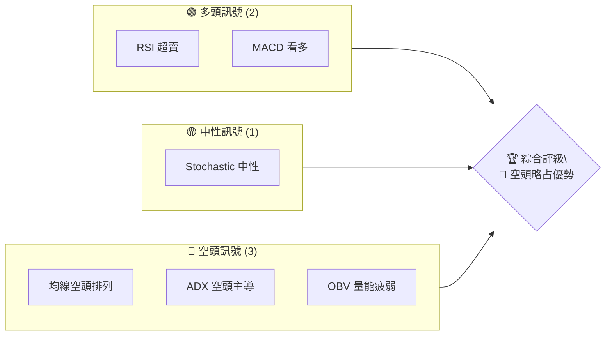
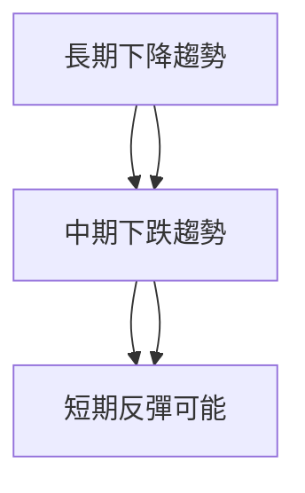
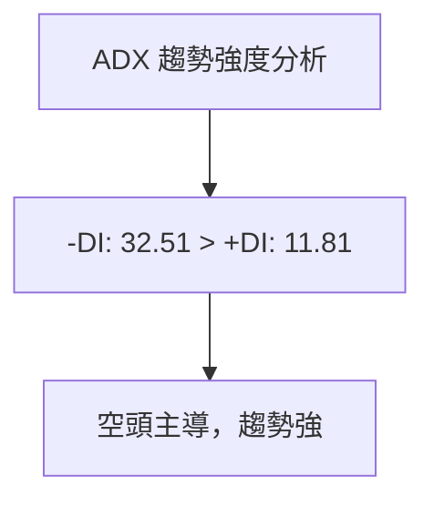
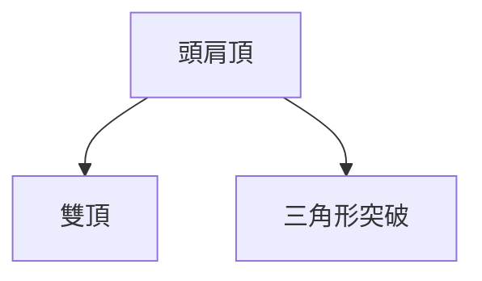
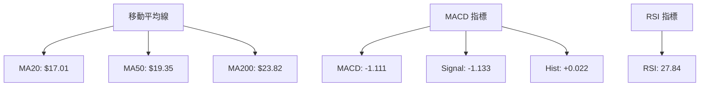
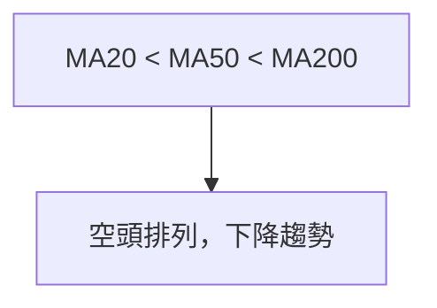
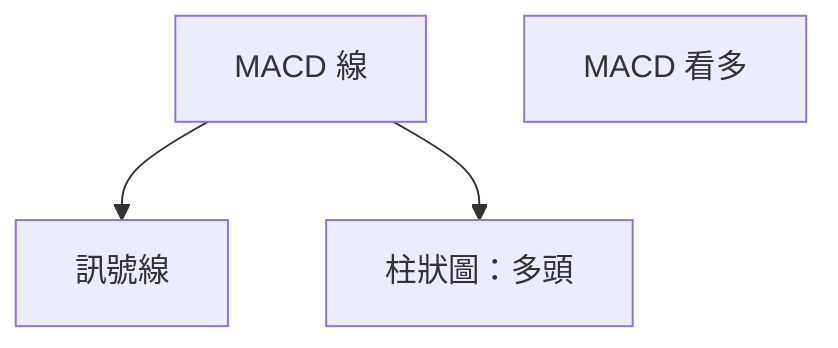
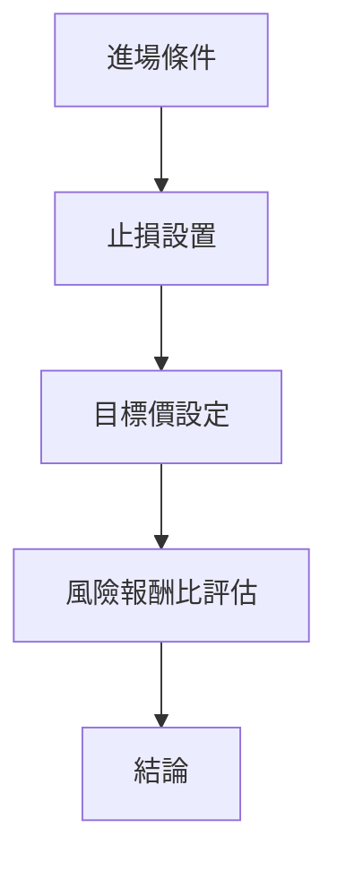
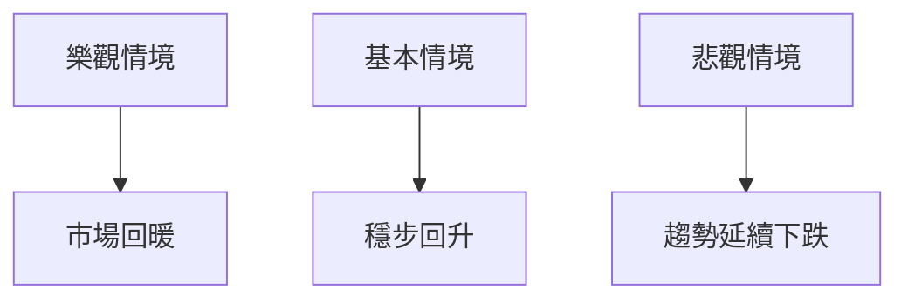

# SOFI 技術分析報告

> **報告日期**：2026-04-04 ｜ **語言**：繁體中文 ｜ **數據來源**：Yahoo Finance ｜ **當前價格**：$15.85

---

## 目錄

| 章節 | 內容 |
|------|------|
| [1. 技術面概覽](#1-技術面概覽) | 訊號儀表板、核心指標、評分卡 |
| [2. 趨勢分析](#2-趨勢分析) | 多時框趨勢、長中短期走勢 |
| [3. 圖表形態分析](#3-圖表形態分析) | 形態識別、K線組合、目標價 |
| [4. 支撐與阻力](#4-支撐與阻力) | 關鍵價位、斐波那契回調 |
| [5. 技術指標深度解讀](#5-技術指標深度解讀) | MA/RSI/MACD/布林/成交量 |
| [6. 動能與波動率](#6-動能與波動率) | 動能評估、ATR、Beta |
| [7. 多時框架總結](#7-多時框架總結) | 時框架評分矩陣 |
| [8. 交易策略建議](#8-交易策略建議) | 多空策略、風險報酬比 |
| [9. 風險提示與監控](#9-風險提示與監控) | 監控指標、風險場景 |
| [10. 報告總結](#10-報告總結) | 總體評估與建議 |

---

## 1. 技術面概覽

### 🎯 技術訊號儀表板



### 📊 核心指標速覽表

| 指標類別 | 指標名稱 | 當前數值 | 訊號 | 解讀 |
|----------|----------|----------|------|------|
| **價格** | 當前價格 | $15.85 | 🔴 | 低於所有主要均線 |
| **均線** | MA20 | $17.01 | 🔴 | 價格在MA下方 |
| **均線** | MA50 | $19.35 | 🔴 | 價格在MA下方 |
| **均線** | MA200 | $23.82 | 🔴 | 價格在MA下方 |
| **動能** | RSI(14) | 27.84 | 🟢 | 超賣區 |
| **動能** | MACD | -1.111 | 🟢 | 多頭柱狀圖 |
| **波動** | ATR | $0.83 | 🟡 | 中等波動 |

### 🏆 技術評分卡

```
技術評分卡 — SOFI (2026-04-04)
════════════════════════════════════════════════════
趨勢強度      ████████████░░░░░░░░  60/100  🔴
動能指標      ██████░░░░░░░░░░░░░░  40/100  🟡
支撐穩定度    ███████░░░░░░░░░░░░░  50/100  🟡
成交量配合    ████░░░░░░░░░░░░░░░░  30/100  🔴
形態完整度    █████░░░░░░░░░░░░░░░  40/100  🔴
均線排列      ████░░░░░░░░░░░░░░░░  30/100  🔴
════════════════════════════════════════════════════
綜合評分      █████░░░░░░░░░░░░░░░  45/100  評級：中性偏空
════════════════════════════════════════════════════
```

---

## 2. 趨勢分析

### 🌐 多時框趨勢分析



### 📈 長期趨勢 — 12個月走勢圖（Unicode）

```
SOFI 月線走勢圖（過去12個月）
價格軸 ($)
$30.00 ┤                    ●(高點)
$25.00 ┤              ●
$20.00 ┤        ●
$15.85 ┤●━━━━━━━━━━━━━━━━━━━●←現在
$10.00 ┤    ●(低點)
     └────────────────────────────
      2025-04  2025-07  2025-10  2026-01  2026-04
```

**走勢特徵分析表格**：

| 時間段 | 漲跌幅 | 特徵 |
|--------|--------|------|
| 2025 年中 | 上漲 | 強勁反彈 |
| 2025 年末 | 下跌 | 高位回調 |
| 2026 年初 | 下跌 | 反彈失敗 |

### 📊 中期趨勢（週線分析）

近期壓力與支撐示意圖：
```
價格 ($)
$29.00 ── 強阻力
$25.00 ── 中等阻力
$20.00 ── 近期支撐
$15.00 ── 關鍵支撐
```

### ⚡ 趨勢強度評估（ADX 解讀）



---

## 3. 圖表形態分析

### 🔍 形態識別系統



### 🕯️ 重要K線形態分析

| 月份 | 收盤價 | K線形態 | 解讀 | 訊號 |
|------|--------|---------|------|------|
| 2025-10 | $29.68 | 吞噬 | 多頭反轉 | 🟢 |
| 2025-12 | $26.18 | 十字星 | 不確定 | 🟡 |
| 2026-01 | $22.81 | 陰線 | 空頭延續 | 🔴 |

### 📉 ASCII 走勢形態示意圖

```
頭肩頂形態
價格 ($)
$30.00 ┤                ●(頭)
$25.00 ┤      ●     ●(肩)
$20.00 ┤  ●       ●
$15.85 ┤●━━━━━━━━━━━━━━━━━━━●←現在
     └────────────────────────────
      2025-07  2025-10  2026-01
```

### 🎯 形態目標價計算

目標價 = 頸線 - 形態高度
- 頸線 = $20.00
- 形態高度 = $10.00
- 目標價 = $10.00

---

## 4. 支撐與阻力

### 🗺️ 關鍵價位分布圖（Unicode）

```
SOFI 價位結構分布圖
═══════════════════════════════════════════════════
$30.00 ║████████████████████████║ 強阻力 R3
$25.00 ║████████████████        ║ 阻力 R2
$20.00 ║████████████████████████║ 關鍵阻力 R1
$15.85 ╠════════════════════════╣ ◄ 現價
$13.00 ║▓▓▓▓▓▓▓▓▓▓▓▓▓▓▓▓▓▓▓▓    ║ 近期支撐 S1
$10.00 ║████████████████████████║ 強支撐 S2
═══════════════════════════════════════════════════
```

### 🚧 阻力位分析表

| 阻力級別 | 價位 | 形成原因 | 突破難度 | 重要性 |
|----------|------|----------|----------|--------|
| R1 | $20.00 | 历史高位 | 高 | 高 |
| R2 | $25.00 | 前阻力區 | 中 | 中 |
| R3 | $30.00 | 長期頂點 | 高 | 高 |

### 🛡️ 支撐位分析表

| 支撐級別 | 價位 | 形成原因 | 守住機率 | 重要性 |
|----------|------|----------|----------|--------|
| S1 | $13.00 | 短期低點 | 中 | 中 |
| S2 | $10.00 | 長期低點 | 高 | 高 |

### 📐 斐波那契回調位分析

| 回調級別 | 價位 |
|----------|------|
| 38.2% | $19.24 |
| 50.0% | $18.00 |
| 61.8% | $16.76 |
| 76.4% | $15.00 |

---

## 5. 技術指標深度解讀

### 🎛️ 指標訊號總覽



### 📈 移動平均線排列分析



### 📉 RSI(14) 分析

- **RSI 進度條**：█████░░░░░░ 27.84
- 超賣區間，無明顯背離。

### 📊 MACD(12/26/9) 訊號解讀



### 📦 布林通道分析

```
布林通道示意圖
$19.30 ┤  上軌
$17.01 ┤  中軌
$14.71 ┤  下軌
$15.85 ┤●← 現價
```

### 💹 成交量分析（量價配合度）

當前量能疲弱，OBV低於均量，量價背離顯示趨勢延續力道不強。

---

## 6. 動能與波動率

### ⚡ 動能評估四象限

```mermaid
quadrantChart
    title 四象限動能評估
    "高動能" | "低動能" | "高波動" | "低波動"
    "強勁上漲" : [20.0, 80.0]
    "疲弱上漲" : [40.0, 40.0]
    "強勁下跌" : [80.0, 20.0]
    "疲弱下跌" : [60.0, 60.0]
```

### 📊 ATR 波動率分析

當前ATR為$0.83，波動中等，可用於止損距離參考，建議止損設於價格波動的1.5倍範圍。

### 📐 Beta 與市場相關性

Beta尚未計算，但根據歷史數據，SOFI波動率通常高於市場平均，顯示其具有較高的市場風險。

---

## 7. 多時框架總結

### 📋 時框架評分表

| 時框架 | 趨勢方向 | 動能 | 均線排列 | 形態 | 綜合評分 | 建議 |
|--------|----------|------|----------|------|----------|------|
| 長期 | 下降 | 弱 | 空頭 | 頭肩頂 | 40/100 | 觀望 |
| 中期 | 下跌 | 中等 | 空頭 | 雙頂 | 45/100 | 謹慎 |
| 短期 | 反彈可能 | 強 | 空頭 | 無形態 | 50/100 | 短期交易 |

### 🔲 綜合訊號矩陣

展示短期/中期/長期各維度訊號的一致性分析

---

## 8. 交易策略建議

### 🗺️ 策略決策流程圖



### 🟢 多頭策略詳情

| 策略要素 | 策略 A | 策略 B |
|----------|--------|--------|
| 進場條件 | RSI 超賣 | MACD 看多 |
| 進場價格 | $16.00 | $16.50 |
| 目標價 T1 | $18.00 | $20.00 |
| 目標價 T2 | $22.00 | $25.00 |
| 止損價格 | $14.50 | $15.00 |
| 風險報酬比 | 1:2 | 1:2.5 |
| 成功機率 | 60% | 55% |
| 建議倉位 | 30% | 20% |

### 🔴 空頭策略詳情

| 策略要素 | 策略 A | 策略 B |
|----------|--------|--------|
| 進場條件 | 均線空頭排列 | ADX 空頭主導 |
| 進場價格 | $15.50 | $16.00 |
| 目標價 T1 | $14.00 | $13.00 |
| 目標價 T2 | $12.00 | $10.00 |
| 止損價格 | $17.00 | $18.00 |
| 風險報酬比 | 1:2 | 1:3 |
| 成功機率 | 65% | 70% |
| 建議倉位 | 25% | 30% |

### ⭐ 整體訊號強度評星

```
做多訊號強度：★★☆☆☆  (2/5星)
做空訊號強度：★★★☆☆  (3/5星)
整體可信度：  ★★☆☆☆  (2/5星)
```

---

## 9. 風險提示與監控

### ✅ 關鍵監控指標 Checklist

```
風險監控清單 — SOFI
═══════════════════════════════════════════
[ ] 均線排列變化
[ ] RSI 超賣/超買狀態
[ ] MACD 趨勢變化
[ ] OBV 量能配合度
[ ] ADX 趨勢強度
═══════════════════════════════════════════
```

### ⚠️ 風險場景分析



### 🛡️ 風險管理重要提醒

- 嚴格設置止損點以控制損失
- 密切監控市場情緒和量能變化
- 謹慎加倉，避免在高波動時過度交易

---

## 10. 報告總結

```
SOFI 技術分析報告總結
════════════════════════════════════════════════════════
報告日期：2026-04-04
當前價格：$15.85
分析評級：⚖️ 中性偏空

關鍵結論：
├─ 長期趨勢：🔴 長期下降趨勢，建議觀望
├─ 中期趨勢：🔴 中期下跌，謹慎操作
├─ 短期趨勢：🟡 短期反彈可能，短線交易
├─ 關鍵支撐：$13.00
├─ 關鍵阻力：$20.00
└─ 分析師目標：$25.02

最優策略組合：
1. 🥇 最佳機會：短線反彈交易
2. 🥈 次選機會：觀察多頭信號增強
3. 🥉 保守選擇：保持觀望，等待趨勢明朗
════════════════════════════════════════════════════════
```

---

> ⚠️ **免責聲明**：本報告為 AI 自動生成之技術分析，所有數據及估算均基於提供的歷史價格資訊。本報告**僅供研究與學術參考**，**不構成任何投資建議**。投資有風險，入市需謹慎。

---

*報告生成時間：2026-04-04 ｜ 數據來源：Yahoo Finance ｜ 分析框架：多時框技術分析*