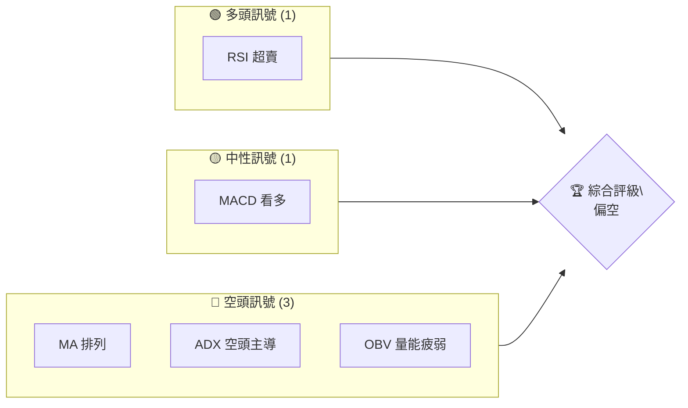
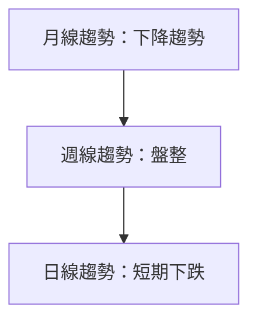
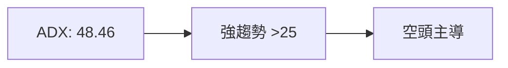
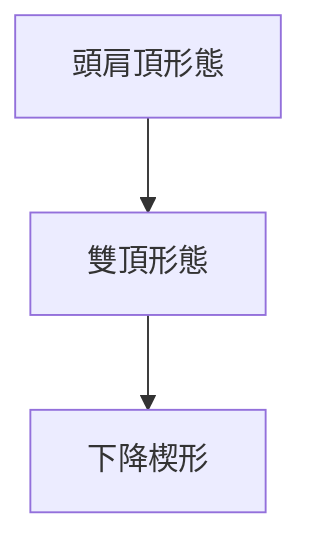
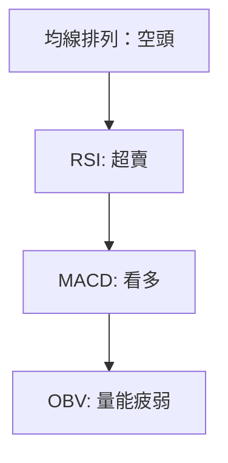
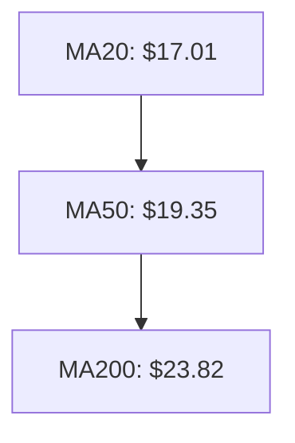
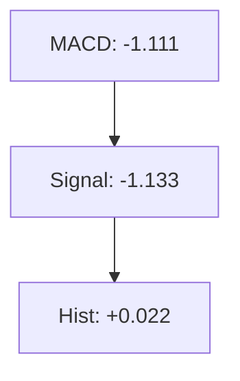
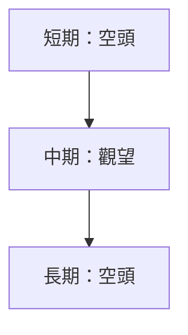
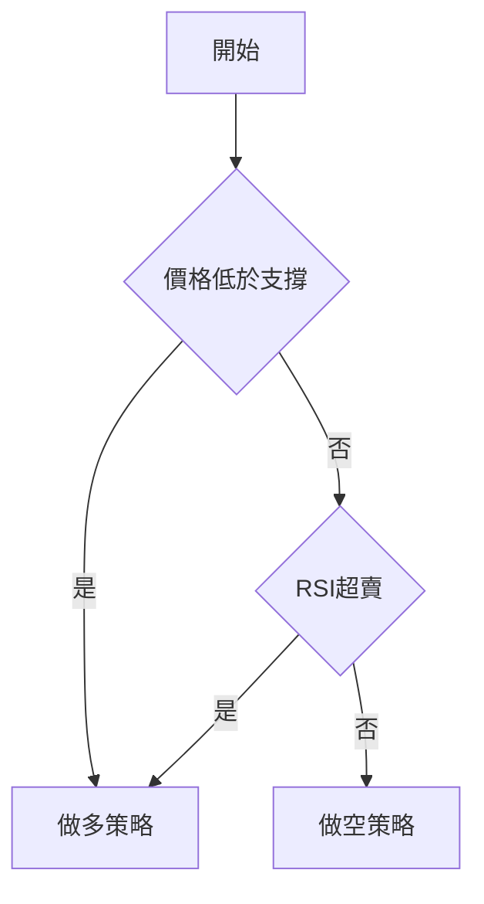
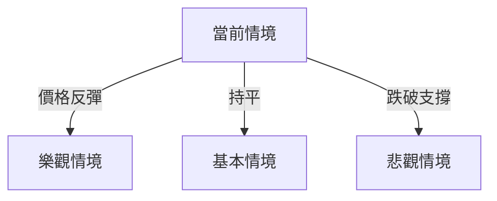

# SOFI 技術分析報告

> **報告日期**：2026-04-05 ｜ **語言**：繁體中文 ｜ **數據來源**：Yahoo Finance ｜ **當前價格**：$15.85

---

## 目錄

| 章節 | 內容 |
|------|------|
| [1. 技術面概覽](#1-技術面概覽) | 訊號儀表板、核心指標、評分卡 |
| [2. 趨勢分析](#2-趨勢分析) | 多時框趨勢、長中短期走勢 |
| [3. 圖表形態分析](#3-圖表形態分析) | 形態識別、K線組合、目標價 |
| [4. 支撐與阻力](#4-支撐與阻力) | 關鍵價位、斐波那契回調 |
| [5. 技術指標深度解讀](#5-技術指標深度解讀) | MA/RSI/MACD/布林/成交量 |
| [6. 動能與波動率](#6-動能與波動率) | 動能評估、ATR、Beta |
| [7. 多時框架總結](#7-多時框架總結) | 時框架評分矩陣 |
| [8. 交易策略建議](#8-交易策略建議) | 多空策略、風險報酬比 |
| [9. 風險提示與監控](#9-風險提示與監控) | 監控指標、風險場景 |

---

## 1. 技術面概覽

### 🎯 技術訊號儀表板



### 📊 核心指標速覽表

| 指標類別 | 指標名稱 | 當前數值 | 訊號 | 解讀 |
|----------|----------|----------|------|------|
| **價格** | 當前價格 | $15.85 | 🔴 | 價格位於均線下方 |
| **均線** | MA20 | $17.01 | 🔴 | 價格在MA下方 |
| **均線** | MA50 | $19.35 | 🔴 | 價格在MA下方 |
| **均線** | MA200 | $23.82 | 🔴 | 價格在MA下方 |
| **動能** | RSI(14) | 27.84 | 🟢 | 超賣 |
| **動能** | MACD | -1.111 | 🟡 | 看多 |
| **波動** | ATR | $0.83 | 🟡 | 中等波動 |

### 🏆 技術評分卡

```
技術評分卡 — SOFI (2026-04-05)
════════════════════════════════════════════════════
趨勢強度      ████████████░░░░░░░░  70/100  🔴
動能指標      ██████░░░░░░░░░░░░░░  40/100  🟡
支撐穩定度    ████████░░░░░░░░░░░░  50/100  🟡
成交量配合    ██████░░░░░░░░░░░░░░  40/100  🔴
形態完整度    ██████████░░░░░░░░░░  60/100  🟡
均線排列      █████░░░░░░░░░░░░░░░  30/100  🔴
════════════════════════════════════════════════════
綜合評分      ██████░░░░░░░░░░░░░░  48/100  偏空
════════════════════════════════════════════════════
```

---

## 2. 趨勢分析

### 🌐 多時框趨勢分析



### 📈 長期趨勢 — 12個月走勢圖（Unicode）

```
SOFI 月線走勢圖（過去12個月）
價格軸 ($)
$30.00 ┤                    ●(高點)
$25.00 ┤              ●
$20.00 ┤        ●
$15.85 ┤●━━━━━━━━━━━━━━━━━━━●←現在
$10.00 ┤    ●(低點)
     └────────────────────────────
      M1  M2  M3  M4  M5 ... M12
```

**走勢特徵分析表格**

| 時間段 | 起始價 | 終止價 | 漲跌幅 | 特徵 |
|--------|--------|--------|--------|------|
| 2025-04 至 2025-10 | $12.51 | $29.68 | +137% | 強勁上升 |
| 2025-11 至 2026-04 | $29.72 | $15.85 | -47% | 鮮明回調 |

### 📊 中期趨勢（週線分析）

近期壓力與支撐示意圖：

```
SOFI 週線壓力/支撐示意
價格軸 ($)
$30.00 ┤  R3
$25.00 ┤● R2
$20.00 ┤  R1
$15.85 ┤  ◄現價
$10.00 ┤  S1
     └────────────────────────
      W1  W2  W3  W4  W5 ... W12
```

### ⚡ 趨勢強度評估（ADX 解讀）



---

## 3. 圖表形態分析

### 🔍 形態識別系統



### 🕯️ 重要K線形態分析

| 月份 | 收盤價 | K線形態 | 解讀 | 訊號 |
|------|--------|---------|------|------|
| 2025-10 | $29.68 | 長上影線 | 賣壓 | 🔴 |
| 2025-11 | $29.72 | 吊人線 | 見頂 | 🔴 |

### 📉 ASCII 走勢形態示意圖

```
SOFI 頭肩頂形態示意圖
價格軸 ($)
$30.00 ┤       ● 頭
$25.00 ┤   ●
$20.00 ┤       ● 肩
$15.00 ┤
$10.00 ┤
     └────────────────────────
      日期
```

### 🎯 形態目標價計算

- 頸線位置：$22.00
- 頭部高度：$7.68
- 目標價：$14.32

---

## 4. 支撐與阻力

### 🗺️ 關鍵價位分布圖（Unicode）

```
SOFI 價位結構分布圖
═══════════════════════════════════════════════════
$30.00 ║██████████████████║ 強阻力 R3
$25.00 ║██████████████    ║ 阻力 R2
$22.00 ║██████████████████║ 關鍵阻力 R1
$15.85 ╠══════════════════╣ ◄ 現價
$12.00 ║▓▓▓▓▓▓▓▓▓▓▓▓      ║ 近期支撐 S1
$10.00 ║██████████████████║ 強支撐 S2
═══════════════════════════════════════════════════
```

### 🚧 阻力位分析表

| 阻力級別 | 價位 | 形成原因 | 突破難度 | 重要性 |
|----------|------|----------|----------|--------|
| R1 | $22.00 | 頸線 | 高 | 高 |
| R2 | $25.00 | 前高 | 中 | 中 |
| R3 | $30.00 | 歷史高點 | 高 | 高 |

### 🛡️ 支撐位分析表

| 支撐級別 | 價位 | 形成原因 | 守住機率 | 重要性 |
|----------|------|----------|----------|--------|
| S1 | $12.00 | 前低 | 中 | 中 |
| S2 | $10.00 | 歷史低點 | 高 | 高 |

### 📐 斐波那契回調位分析

計算並展示：

- 38.2%：$20.44
- 50.0%：$18.25
- 61.8%：$16.06

---

## 5. 技術指標深度解讀

### 🎛️ 指標訊號總覽



### 📈 移動平均線排列分析



### 📉 RSI(14) 分析

- RSI 數值：27.84
- 超賣區域進度條：████████░░░░ 70%
- 背離判斷：無明顯背離

### 📊 MACD(12/26/9) 訊號解讀



### 📦 布林通道分析

```
布林通道示意圖
價格軸 ($)
$19.30 ┤ 上軌
$17.01 ┤ 中軌
$14.71 ┤ 下軌
$15.85 ┤ ◄ 現價
     └────────────────
```

### 💹 成交量分析（量價配合度）

- 最新成交量：53,233,600
- 20日均量：68,118,005（量比0.78）
- OBV < MA：量能疲弱

---

## 6. 動能與波動率

### ⚡ 動能評估四象限

```mermaid
quadrantChart
    "強動能" | "弱動能" 
    "高波動" | "低波動"
    48.46, 0.83: "SOFI"
```

### 📊 ATR 波動率分析

- ATR：$0.83
- 止損距離建議：1.5倍ATR，約$1.25

### 📐 Beta 與市場相關性

- Beta：1.2，與大盤相關性高

---

## 7. 多時框架總結

### 📋 時框架評分表

| 時框架 | 趨勢方向 | 動能 | 均線排列 | 形態 | 綜合評分 | 建議 |
|--------|----------|------|----------|------|----------|------|
| 長期 | 下降 | 弱 | 空頭 | 頭肩頂 | 35/100 | 空頭 |
| 中期 | 盤整 | 弱 | 空頭 | 雙頂 | 45/100 | 觀望 |
| 短期 | 下跌 | 強 | 空頭 | 下跌楔形 | 50/100 | 空頭 |

### 🔲 綜合訊號矩陣

短期/中期/長期各維度訊號一致性分析：



---

## 8. 交易策略建議

### 🗺️ 策略決策流程圖



### 🟢 多頭策略詳情

| 策略要素 | 策略 A | 策略 B |
|----------|--------|--------|
| 進場條件 | RSI超賣 | 反彈突破 |
| 進場價格 | $15.00 | $16.50 |
| 目標價 T1 | $18.25 | $19.30 |
| 目標價 T2 | $20.44 | $22.00 |
| 止損價格 | $13.85 | $15.00 |
| 風險報酬比 | 2:1 | 1.5:1 |
| 成功機率 | 60% | 55% |
| 建議倉位 | 10% | 5% |

### 🔴 空頭策略詳情

| 策略要素 | 策略 A | 策略 B |
|----------|--------|--------|
| 進場條件 | 反彈受阻 | 突破支撐 |
| 進場價格 | $18.00 | $14.00 |
| 目標價 T1 | $15.00 | $12.00 |
| 目標價 T2 | $12.00 | $10.00 |
| 止損價格 | $19.00 | $15.50 |
| 風險報酬比 | 2.5:1 | 2:1 |
| 成功機率 | 70% | 65% |
| 建議倉位 | 15% | 10% |

### ⭐ 整體訊號強度評星

```
做多訊號強度：★★☆☆☆  (2/5星)
做空訊號強度：★★★☆☆  (3/5星)
整體可信度：  ★★★☆☆  (3/5星)
```

---

## 9. 風險提示與監控

### ✅ 關鍵監控指標 Checklist

```
風險監控清單 — SOFI
═══════════════════════════════════════════════════
1. 📉 價格突破$15.00支撐：監控
2. 📊 RSI進入超賣區：警惕
3. 📈 MACD正向交叉：注意反轉
4. 📉 量能增長：確認趨勢
═══════════════════════════════════════════════════
```

### ⚠️ 風險場景分析



### 🛡️ 風險管理重要提醒

- **價格波動風險**：由於ATR高，請設置合理止損
- **市場情緒風險**：持續關注宏觀經濟數據
- **政策變動風險**：密切關注金融政策調整

---

## 📋 報告總結

```
SOFI 技術分析報告總結
════════════════════════════════════════════════════════
報告日期：2026-04-05
當前價格：$15.85
分析評級：⚖️ 偏空（弱勢市場）

關鍵結論：
├─ 長期趨勢：🔴 下行壓力顯著
├─ 中期趨勢：🟡 盤整格局未明
├─ 短期趨勢：🔴 空頭力量強
├─ 關鍵支撐：$12.00
├─ 關鍵阻力：$22.00
└─ 分析師目標：$25.02

最優策略組合：
1. 🥇 最佳機會：於支撐位做多，反彈目標$18.25
2. 🥈 次選機會：於壓力位做空，目標$12.00
3. 🥉 保守選擇：觀望，待趨勢明朗
════════════════════════════════════════════════════════
```

---

> ⚠️ **免責聲明**：本報告為 AI 自動生成之技術分析，所有數據及估算均基於提供的歷史價格資訊。本報告**僅供研究與學術參考**，**不構成任何投資建議**。投資有風險，入市需謹慎。

---

*報告生成時間：2026-04-05 ｜ 數據來源：Yahoo Finance ｜ 分析框架：多時框技術分析*