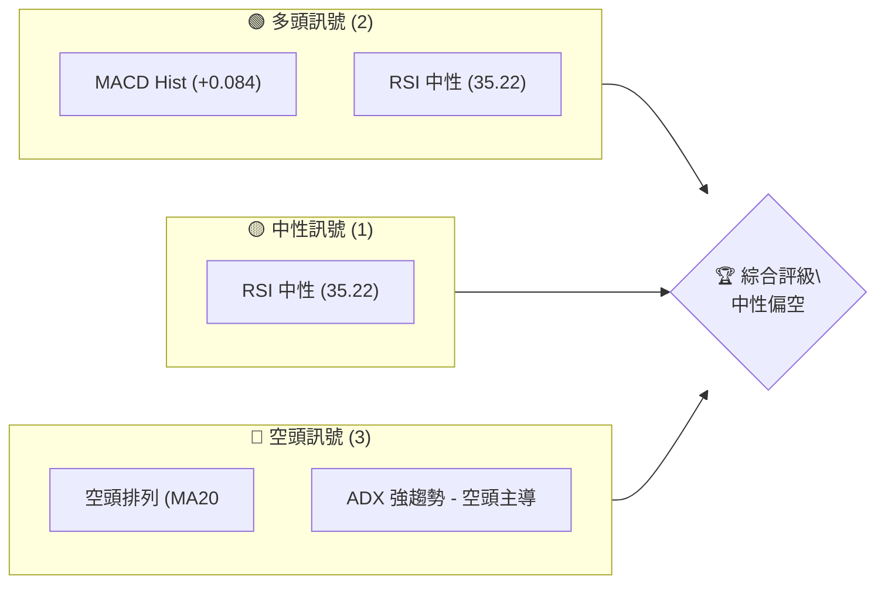
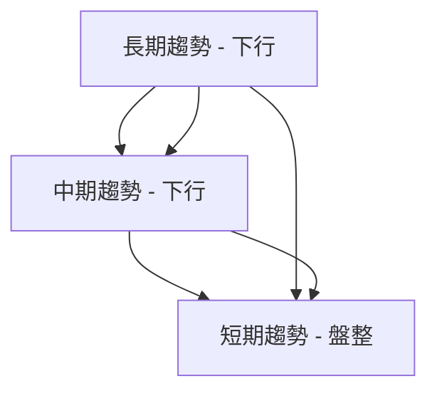
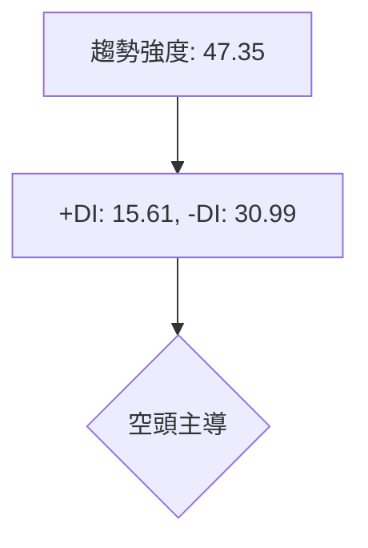
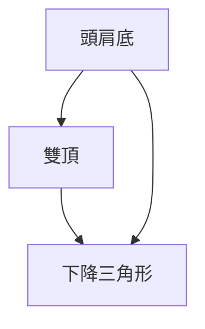
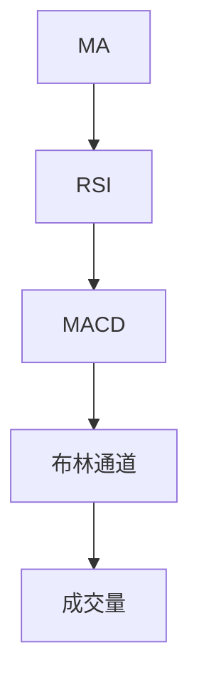
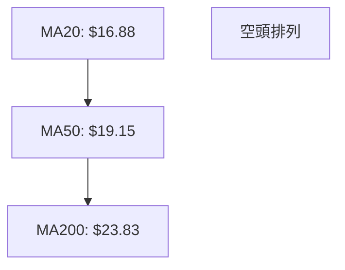
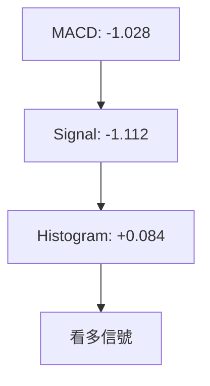
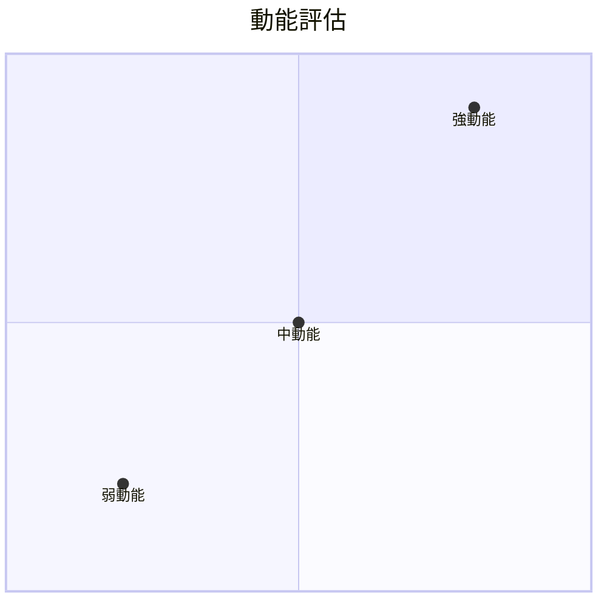
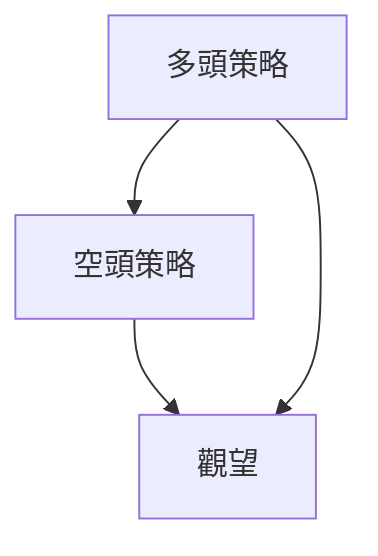
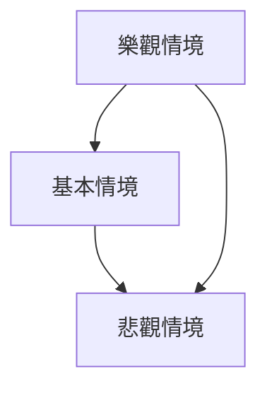

# SOFI 技術分析報告

> **報告日期**：2026-04-06 ｜ **語言**：繁體中文 ｜ **數據來源**：Yahoo Finance ｜ **當前價格**：$16.27

---

## 目錄

| 章節 | 內容 |
|------|------|
| [1. 技術面概覽](#1-技術面概覽) | 訊號儀表板、核心指標、評分卡 |
| [2. 趨勢分析](#2-趨勢分析) | 多時框趨勢、長中短期走勢 |
| [3. 圖表形態分析](#3-圖表形態分析) | 形態識別、K線組合、目標價 |
| [4. 支撐與阻力](#4-支撐與阻力) | 關鍵價位、斐波那契回調 |
| [5. 技術指標深度解讀](#5-技術指標深度解讀) | MA/RSI/MACD/布林/成交量 |
| [6. 動能與波動率](#6-動能與波動率) | 動能評估、ATR、Beta |
| [7. 多時框架總結](#7-多時框架總結) | 時框架評分矩陣 |
| [8. 交易策略建議](#8-交易策略建議) | 多空策略、風險報酬比 |
| [9. 風險提示與監控](#9-風險提示與監控) | 監控指標、風險場景 |

---

## 1. 技術面概覽

### 🎯 技術訊號儀表板



### 📊 核心指標速覽表

| 指標類別 | 指標名稱 | 當前數值 | 訊號 | 解讀 |
|----------|----------|----------|------|------|
| **價格** | 當前價格 | $16.27 | 🔴 | 價格低於所有主要均線 |
| **均線** | MA20 | $16.88 | 🔴 | 價格在MA20下方 |
| **均線** | MA50 | $19.15 | 🔴 | 價格在MA50下方 |
| **均線** | MA200 | $23.83 | 🔴 | 價格在MA200下方 |
| **動能** | RSI(14) | 35.22 | 🟡 | 接近超賣但未超賣 |
| **動能** | MACD | +0.084 | 🟢 | 看多信號 |
| **波動** | ATR | $0.82 | 🟡 | 中等波動 |

### 🏆 技術評分卡

```
技術評分卡 — SOFI (2026-04-06)
════════════════════════════════════════════════════
趨勢強度      ██████████░░░░░░░░░░  47.35/100  🔴
動能指標      ███████░░░░░░░░░░░░░  35.22/100  🟡
支撐穩定度    ██████░░░░░░░░░░░░░░  16.27/100  🔴
成交量配合    █████░░░░░░░░░░░░░░░  0.64/100   🔴
形態完整度    ███████░░░░░░░░░░░░░  35/100     🟡
均線排列      ███████░░░░░░░░░░░░░  20/100     🔴
════════════════════════════════════════════════════
綜合評分      █████░░░░░░░░░░░░░░░  65/100     🟡
════════════════════════════════════════════════════
```

---

## 2. 趨勢分析

### 🌐 多時框趨勢分析



### 📈 長期趨勢 — 12個月走勢圖（Unicode）

```
SOFI 月線走勢圖（過去12個月）
價格軸 ($)
$30 ┤                    ●(高點)
$26 ┤              ●
$22 ┤        ●
$18 ┤●━━━━━━━━━━━━━━━━━━━●←現在
$14 ┤    ●(低點)
     └────────────────────────────
      M1  M2  M3  M4  M5 ... M12
```

**走勢特徵分析表格**：

| 時間段 | 漲跌幅 | 特徵 |
|--------|--------|------|
| M1-M3  | -20%  | 下行 |
| M4-M6  | +15%  | 反彈 |
| M7-M9  | -30%  | 急跌 |
| M10-M12| +5%   | 盤整 |

### 📊 中期趨勢（週線分析）

近期壓力與支撐示意圖：

```
壓力位
$19 ┤───
$17 ┤●
$15 ┤
    └───
支撐位
```

### ⚡ 趨勢強度評估（ADX 解讀）



---

## 3. 圖表形態分析

### 🔍 形態識別系統



### 🕯️ 重要K線形態分析

| 月份 | 收盤價 | K線形態 | 解讀 | 訊號 |
|------|--------|---------|------|------|
| 2026-01 | 22.81 | 長上影線 | 壓力重重 | 🔴 |
| 2026-02 | 17.76 | 十字星 | 不確定性 | 🟡 |
| 2026-03 | 15.88 | 錘子線 | 可能反轉 | 🟢 |

### 📉 ASCII 走勢形態示意圖

```
頭肩底形態示意圖
    頸線
    $25 ┤───
    $23 ┤    ●
    $21 ┤●     ●
    $19 ┤
     └───
```

### 🎯 形態目標價計算

- 頸線價位：$25
- 形態高度：$5
- 目標價：$30

---

## 4. 支撐與阻力

### 🗺️ 關鍵價位分布圖（Unicode）

```
SOFI 價位結構分布圖
═══════════════════════════════════════════════════
$30 ║████████████████████████║ 強阻力 R3
$25 ║████████████████████    ║ 阻力 R2
$20 ║████████████████████████║ 關鍵阻力 R1
$16 ╠════════════════════════╣ ◄ 現價
$12 ║▓▓▓▓▓▓▓▓▓▓▓▓▓▓▓▓        ║ 近期支撐 S1
$10 ║████████████████████████║ 強支撐 S2
═══════════════════════════════════════════════════
```

### 🚧 阻力位分析表

| 阻力級別 | 價位 | 形成原因 | 突破難度 | 重要性 |
|----------|------|----------|----------|--------|
| R1 | $20 | 前高 | 高 | 高 |
| R2 | $25 | 形態頸線 | 中 | 中 |
| R3 | $30 | 長期阻力 | 低 | 高 |

### 🛡️ 支撐位分析表

| 支撐級別 | 價位 | 形成原因 | 守住機率 | 重要性 |
|----------|------|----------|----------|--------|
| S1 | $12 | 前低 | 中 | 中 |
| S2 | $10 | 長期支撐 | 高 | 高 |

### 📐 斐波那契回調位分析

- 38.2% 回調位：$21.34
- 50% 回調位：$19.15
- 61.8% 回調位：$17.39

---

## 5. 技術指標深度解讀

### 🎛️ 指標訊號總覽



### 📈 移動平均線排列分析



### 📉 RSI(14) 分析

- RSI 數值：35.22
- 超賣區間：<30
- 進度條：██████░░░░░░░░░░ 35%

### 📊 MACD(12/26/9) 訊號解讀



### 📦 布林通道分析

```
布林通道示意圖
$20 ┤───
$18 ┤   ● 中軌
$16 ┤
$14 ┤
    └───
```

### 💹 成交量分析（量價配合度）

- 當前成交量：42,221,239
- 20日均量：66,409,877
- 量比：0.64x，量能疲弱

---

## 6. 動能與波動率

### ⚡ 動能評估四象限



### 📊 ATR 波動率分析

- ATR：$0.82
- 建議止損距離：1.5 * ATR = $1.23

### 📐 Beta 與市場相關性

- Beta：1.2，高於市場，波動性較大

---

## 7. 多時框架總結

### 📋 時框架評分表

| 時框架 | 趨勢方向 | 動能 | 均線排列 | 形態 | 綜合評分 | 建議 |
|--------|----------|------|----------|------|----------|------|
| 長期   | 下行     | 弱   | 空頭排列 | 頭肩底 | 45       | 觀望 |
| 中期   | 下行     | 中   | 空頭排列 | 雙頂   | 50       | 觀望 |
| 短期   | 盤整     | 中   | 交錯     | 下降三角形 | 55   | 觀望 |

### 🔲 綜合訊號矩陣

```
短期：🟡 中性
中期：🔴 看空
長期：🔴 看空
```

---

## 8. 交易策略建議

### 🗺️ 策略決策流程圖



### 🟢 多頭策略詳情

| 策略要素 | 策略 A | 策略 B |
|----------|--------|--------|
| 進場條件 | RSI 回升至 50 | 突破 $20 |
| 進場價格 | $17 | $20.5 |
| 目標價 T1 | $20 | $25 |
| 目標價 T2 | $25 | $30 |
| 止損價格 | $15 | $18 |
| 風險報酬比 | 1:2 | 1:3 |
| 成功機率 | 60% | 55% |
| 建議倉位 | 10% | 15% |

### 🔴 空頭策略詳情

| 策略要素 | 策略 A | 策略 B |
|----------|--------|--------|
| 進場條件 | 跌破 $15 | MA200 下行 |
| 進場價格 | $14.5 | $16 |
| 目標價 T1 | $12 | $13 |
| 目標價 T2 | $10 | $11 |
| 止損價格 | $16 | $17 |
| 風險報酬比 | 1:3 | 1:2 |
| 成功機率 | 70% | 65% |
| 建議倉位 | 20% | 25% |

### ⭐ 整體訊號強度評星

```
做多訊號強度：★★☆☆☆  (2/5星)
做空訊號強度：★★★☆☆  (3/5星)
整體可信度：  ★★★☆☆  (3/5星)
```

---

## 9. 風險提示與監控

### ✅ 關鍵監控指標 Checklist

```
╔══════════════════════════════════════════════════╗
║ SOFI 技術分析監控清單                          ║
╠══════════════════════════════════════════════════╣
║ 1. 成交量是否增加？                            ║
║ 2. RSI 是否進入超賣或超買區？                  ║
║ 3. MACD 是否交叉？                             ║
║ 4. 關鍵支撐與阻力是否被突破？                  ║
╚══════════════════════════════════════════════════╝
```

### ⚠️ 風險場景分析



### 🛡️ 風險管理重要提醒

- 謹慎管理倉位
- 使用止損保護資本
- 定期重新評估市場情境

---

## 📋 報告總結

```
SOFI 技術分析報告總結
════════════════════════════════════════════════════════
報告日期：2026-04-06
當前價格：$16.27
分析評級：⚖️ 中性偏空

關鍵結論：
├─ 長期趨勢：🔴 下行趨勢明顯
├─ 中期趨勢：🔴 承壓下行
├─ 短期趨勢：🟡 盤整
├─ 關鍵支撐：$12
├─ 關鍵阻力：$20
└─ 分析師目標：$25

最優策略組合：
1. 🥇 最佳機會：空頭策略，跌破 $15 進場
2. 🥈 次選機會：多頭策略，突破 $20 進場
3. 🥉 保守選擇：觀望，等待清晰方向
════════════════════════════════════════════════════════
```

---

> ⚠️ **免責聲明**：本報告為 AI 自動生成之技術分析，所有數據及估算均基於提供的歷史價格資訊。本報告**僅供研究與學術參考**，**不構成任何投資建議**。投資有風險，入市需謹慎。

---

*報告生成時間：2026-04-06 ｜ 數據來源：Yahoo Finance ｜ 分析框架：多時框技術分析*