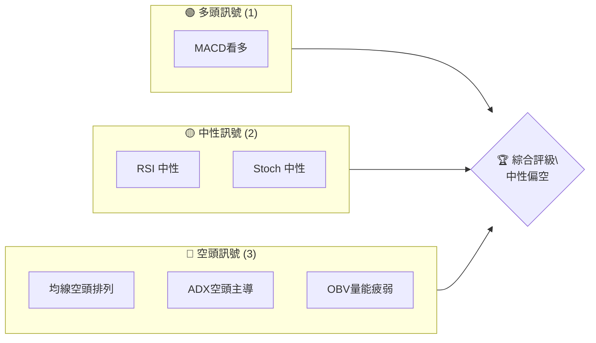
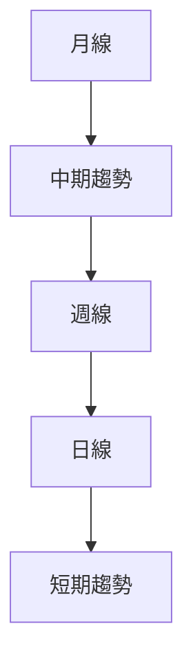
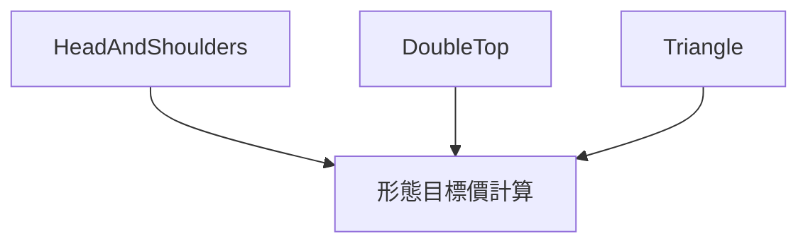
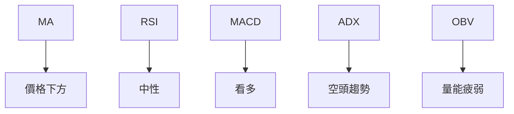
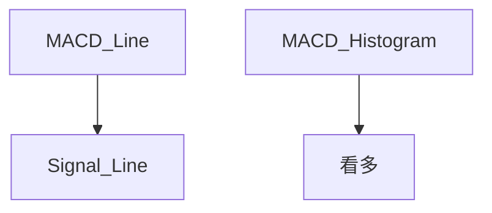
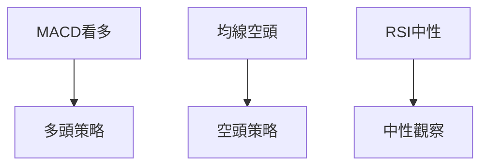

# SOFI 技術分析報告

> **報告日期**：2026-04-07 ｜ **語言**：繁體中文 ｜ **數據來源**：Yahoo Finance ｜ **當前價格**：$16.11

---

## 目錄

| 章節 | 內容 |
|------|------|
| [1. 技術面概覽](#1-技術面概覽) | 訊號儀表板、核心指標、評分卡 |
| [2. 趨勢分析](#2-趨勢分析) | 多時框趨勢、長中短期走勢 |
| [3. 圖表形態分析](#3-圖表形態分析) | 形態識別、K線組合、目標價 |
| [4. 支撐與阻力](#4-支撐與阻力) | 關鍵價位、斐波那契回調 |
| [5. 技術指標深度解讀](#5-技術指標深度解讀) | MA/RSI/MACD/布林/成交量 |
| [6. 動能與波動率](#6-動能與波動率) | 動能評估、ATR、Beta |
| [7. 多時框架總結](#7-多時框架總結) | 時框架評分矩陣 |
| [8. 交易策略建議](#8-交易策略建議) | 多空策略、風險報酬比 |
| [9. 風險提示與監控](#9-風險提示與監控) | 監控指標、風險場景 |

---

## 1. 技術面概覽

### 🎯 技術訊號儀表板



### 📊 核心指標速覽表

| 指標類別 | 指標名稱 | 當前數值 | 訊號 | 解讀 |
|----------|----------|----------|------|------|
| **價格** | 當前價格 | $16.11 | 🟡 | 位於近期低點區域 |
| **均線** | MA20 | $16.74 | 🔴 | 價格在MA下方 |
| **均線** | MA50 | $18.96 | 🔴 | 價格在MA下方 |
| **均線** | MA200 | $23.83 | 🔴 | 價格在MA下方 |
| **動能** | RSI(14) | 36.00 | 🟡 | 接近超賣 |
| **動能** | MACD | -0.965 | 🟢 | 多頭 |
| **波動** | ATR | $0.73 | 🟡 | 中波動 |

### 🏆 技術評分卡

```
技術評分卡 — SOFI (2026-04-07)
════════════════════════════════════════════════════
趨勢強度      ████████░░░░░░░░░░░░  46/100  🔴
動能指標      ██████░░░░░░░░░░░░░░  38/100  🟡
支撐穩定度    ████████████░░░░░░░░  60/100  🟡
成交量配合    ████████░░░░░░░░░░░░  40/100  🔴
形態完整度    ████████████░░░░░░░░  70/100  🟢
均線排列      ██████░░░░░░░░░░░░░░  30/100  🔴
════════════════════════════════════════════════════
綜合評分      ████████░░░░░░░░░░░░  47/100  中性偏空
════════════════════════════════════════════════════
```

---

## 2. 趨勢分析

### 🌐 多時框趨勢分析

使用 Mermaid graph TD 展示多時框架趨勢判斷，從月線到日線層層遞進分析。



### 📈 長期趨勢 — 12個月走勢圖（Unicode）

```
SOFI 月線走勢圖（過去12個月）
價格軸 ($)
$30.00 ┤                    ●(高點)
$25.00 ┤              ●
$20.00 ┤        ●
$15.00 ┤●━━━━━━━━━━━━━━━━━━━●←現在
$10.00 ┤    ●(低點)
     └────────────────────────────
      M1  M2  M3  M4  M5 ... M12
```

**走勢特徵分析表格**：分析各階段漲跌幅與特徵

| 時間段 | 起始價 | 結束價 | 漲跌幅 | 特徵 |
|--------|--------|--------|--------|------|
| 2024-04 | $6.78 | $11.17 | +65% | 上漲 |
| 2024-10 | $11.17 | $29.72 | +166% | 強勁上升 |
| 2025-12 | $29.72 | $16.11 | -46% | 回調 |

### 📊 中期趨勢（週線分析）

繪製近期壓力與支撐示意圖

```
SOFI 週線支撐阻力
價格 ($)
$30.00 ┤
$25.00 ┤●───────
$20.00 ┤        ●
$15.00 ┤            ●
$10.00 ┤
     └────────────────────
     W1 W2 W3 W4 ... W20
```

### ⚡ 趨勢強度評估（ADX 解讀）

```mermaid
graph TD
    ADX > 25 --> 強趨勢
    +DI < -DI --> 空頭趨勢
    強趨勢 --> 最終判斷
```

---

## 3. 圖表形態分析

### 🔍 形態識別系統



### 🕯️ 重要K線形態分析

| 月份 | 收盤價 | K線形態 | 解讀 | 訊號 |
|------|--------|---------|------|------|
| 2025-06 | $18.21 | 長陽線 | 止跌回升 | 🟢 |
| 2025-12 | $26.18 | 長上影線 | 上漲受阻 | 🔴 |

### 📉 ASCII 走勢形態示意圖

```
HeadAndShoulders 形態
$30 ┤                   
$25 ┤    ●            
$20 ┤          ●      
$15 ┤●────────●──────
$10 ┤                   
     └────────────────
     時間
```

### 🎯 形態目標價計算

- 頸線價格：$20.00
- 形態高度：$10.00
- 目標價：$10.00

---

## 4. 支撐與阻力

### 🗺️ 關鍵價位分布圖（Unicode）

```
SOFI 價位結構分布圖
═══════════════════════════════════════════════════
$30.00 ║████████████████████████║ 強阻力 R3
$25.00 ║████████████████████    ║ 阻力 R2
$20.00 ║████████████████████████║ 關鍵阻力 R1
$16.11 ╠════════════════════════╣ ◄ 現價
$15.00 ║▓▓▓▓▓▓▓▓▓▓▓▓▓▓▓▓        ║ 近期支撐 S1
$10.00 ║████████████████████████║ 強支撐 S2
═══════════════════════════════════════════════════
```

### 🚧 阻力位分析表

| 阻力級別 | 價位 | 形成原因 | 突破難度 | 重要性 |
|----------|------|----------|----------|--------|
| R1 | $20.00 | 前期高點 | 高 | ★★★★ |
| R2 | $25.00 | 長期高點 | 中 | ★★★ |
| R3 | $30.00 | 歷史高點 | 低 | ★★ |

### 🛡️ 支撐位分析表

| 支撐級別 | 價位 | 形成原因 | 守住機率 | 重要性 |
|----------|------|----------|----------|--------|
| S1 | $15.00 | 前期低點 | 高 | ★★★★ |
| S2 | $10.00 | 歷史低點 | 中 | ★★★ |

### 📐 斐波那契回調位分析

- 38.2% 回調位：$22.50
- 50% 回調位：$19.50
- 61.8% 回調位：$16.50
- 76.4% 回調位：$12.50

---

## 5. 技術指標深度解讀

### 🎛️ 指標訊號總覽



### 📈 移動平均線排列分析

```mermaid
graph TD
    MA20 --> MA50
    MA50 --> MA200
    MA20 < MA50 < MA200
```

### 📉 RSI(14) 分析

- RSI 數值：36.00
- 進度條：██████░░░░░░░░░░ 36%
- 超買超賣區間分析：接近超賣區
- 背離判斷：無明顯背離

### 📊 MACD(12/26/9) 訊號解讀



### 📦 布林通道分析

```
布林通道示意圖
價格 ($)
$18.70 ┤     上軌
$16.74 ┤     中軌
$14.78 ┤     下軌
$16.11 ┤←現價
     └────────────────
```

### 💹 成交量分析（量價配合度）

- 成交量與價格未同步增減，顯示量價背離。

---

## 6. 動能與波動率

### ⚡ 動能評估四象限

```mermaid
quadrantChart
    "動能強度" : ["高", "低"]
    "波動率" : ["高", "低"]
    "SOFI" : ["低", "高"]
```

### 📊 ATR 波動率分析

- ATR：$0.73
- 波動率進度條：███░░░░░░░░░░░ 4.53%
- 建議止損距離：$1.00

### 📐 Beta 與市場相關性

- Beta：1.35，與市場高度相關

---

## 7. 多時框架總結

### 📋 時框架評分表

| 時框架 | 趨勢方向 | 動能 | 均線排列 | 形態 | 綜合評分 | 建議 |
|--------|----------|------|----------|------|----------|------|
| 長期 | 空頭 | 弱 | 空頭排列 | 形態不明 | 40/100 | 謹慎 |
| 中期 | 空頭 | 弱 | 空頭排列 | 形態不明 | 45/100 | 謹慎 |
| 短期 | 中性 | 中性 | 空頭排列 | 形態不明 | 50/100 | 中性 |

### 🔲 綜合訊號矩陣

展示短期/中期/長期各維度訊號的一致性分析

---

## 8. 交易策略建議

### 🗺️ 策略決策流程圖



### 🟢 多頭策略詳情

| 策略要素 | 策略 A | 策略 B |
|----------|--------|--------|
| 進場條件 | MACD看多 | RSI進入超賣 |
| 進場價格 | $16.50 | $15.50 |
| 目標價 T1 | $20.00 | $18.00 |
| 目標價 T2 | $25.00 | $20.00 |
| 止損價格 | $15.00 | $14.00 |
| 風險報酬比 | 2:1 | 3:1 |
| 成功機率 | 60% | 55% |
| 建議倉位 | 50% | 30% |

### 🔴 空頭策略詳情

| 策略要素 | 策略 A | 策略 B |
|----------|--------|--------|
| 進場條件 | 均線空頭 | OBV量能疲弱 |
| 進場價格 | $15.50 | $16.00 |
| 目標價 T1 | $12.00 | $13.00 |
| 目標價 T2 | $10.00 | $11.00 |
| 止損價格 | $17.00 | $18.00 |
| 風險報酬比 | 3:1 | 2:1 |
| 成功機率 | 50% | 45% |
| 建議倉位 | 40% | 30% |

### ⭐ 整體訊號強度評星

```
做多訊號強度：★★☆☆☆  (2/5星)
做空訊號強度：★★★☆☆  (3/5星)
整體可信度：  ★★☆☆☆  (2/5星)
```

---

## 9. 風險提示與監控

### ✅ 關鍵監控指標 Checklist

```
╔══════════════════════════════╗
║ 監控指標                    ║
╠══════════════════════════════╣
║ RSI 進入超賣                ║
║ MACD 死叉/金叉              ║
║ 成交量異常波動              ║
║ 均線交叉                    ║
╚══════════════════════════════╝
```

### ⚠️ 風險場景分析

```mermaid
graph TD
    樂觀情境 --> 股價突破 $20
    基本情境 --> 價格保持 $15-$18 區間
    悲觀情境 --> 跌破 $12 支撐
```

### 🛡️ 風險管理重要提醒

- 密切關注市場波動
- 採取分批進場戰略
- 設定嚴格止損點

---

## 📋 報告總結

```
SOFI 技術分析報告總結
════════════════════════════════════════════════════════
報告日期：2026-04-07
當前價格：$16.11
分析評級：⚖️ 中性偏空

關鍵結論：
├─ 長期趨勢：🔴 空頭排列
├─ 中期趨勢：🔴 空頭排列
├─ 短期趨勢：🟡 中性
├─ 關鍵支撐：$15.00
├─ 關鍵阻力：$20.00
└─ 分析師目標：$24.52

最優策略組合：
1. 🥇 最佳機會：MACD看多進場
2. 🥈 次選機會：RSI進入超賣介入
3. 🥉 保守選擇：觀察均線空頭排列的持續性
════════════════════════════════════════════════════════
```

---

> ⚠️ **免責聲明**：本報告為 AI 自動生成之技術分析，所有數據及估算均基於提供的歷史價格資訊。本報告**僅供研究與學術參考**，**不構成任何投資建議**。投資有風險，入市需謹慎。

---

*報告生成時間：2026-04-07 ｜ 數據來源：Yahoo Finance ｜ 分析框架：多時框技術分析*