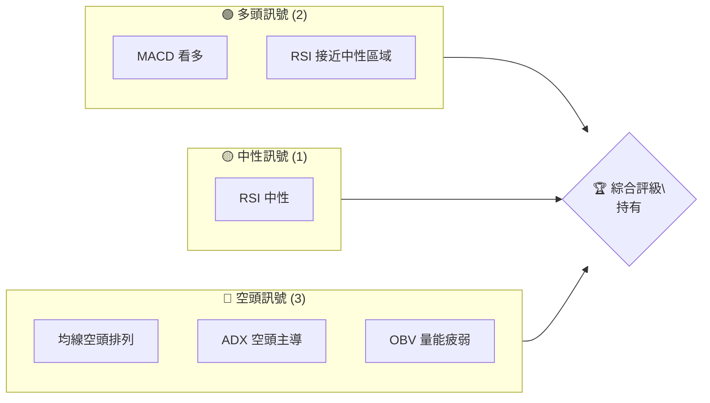
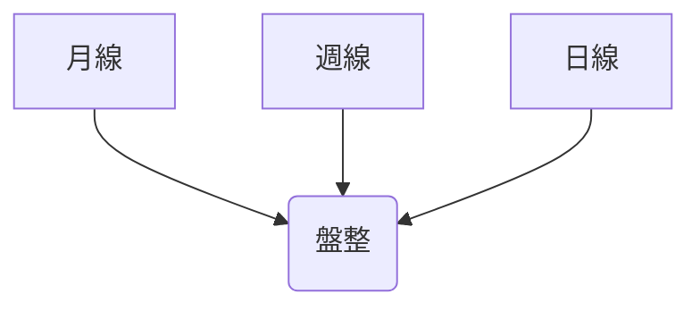
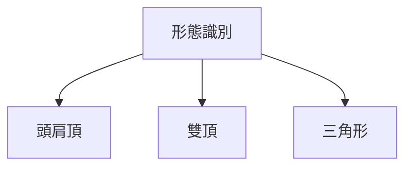
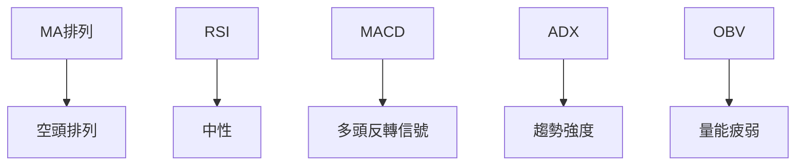
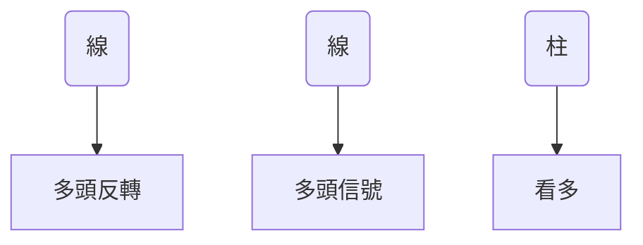
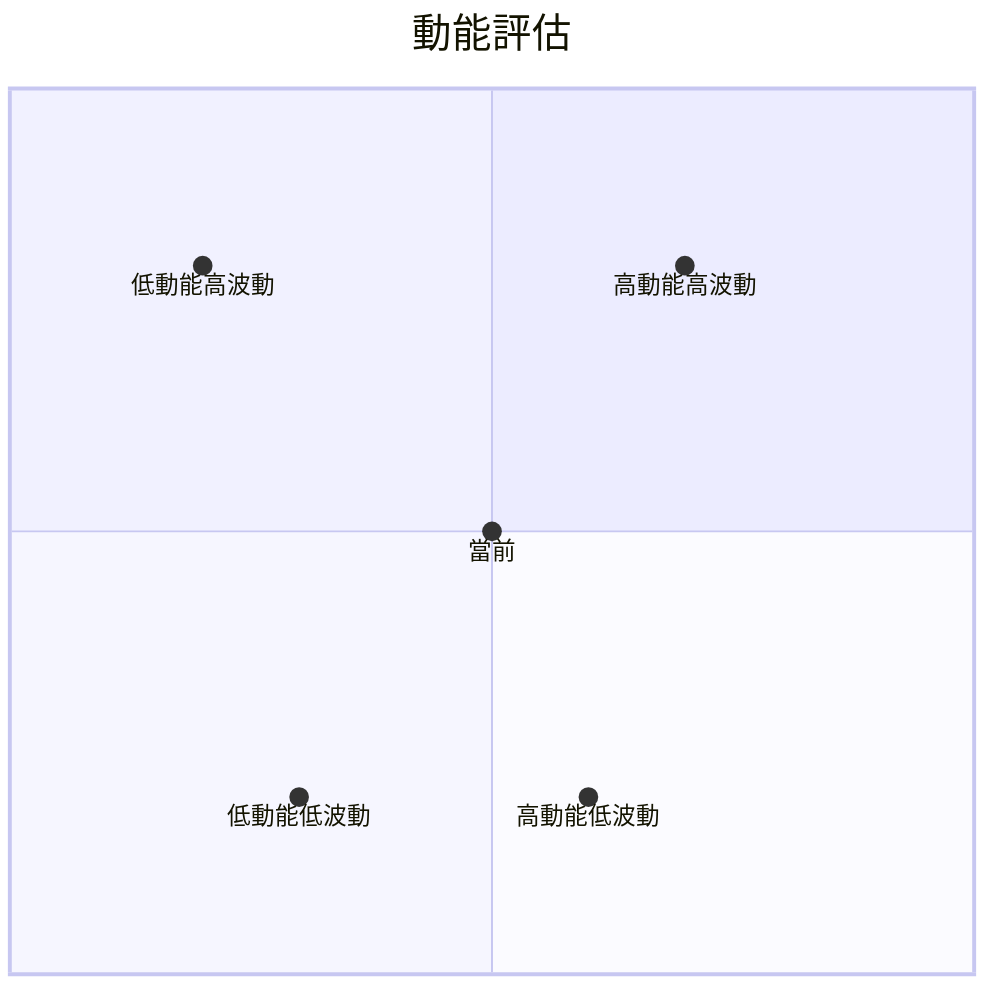
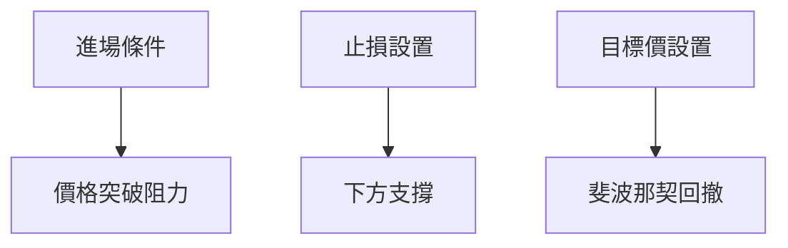
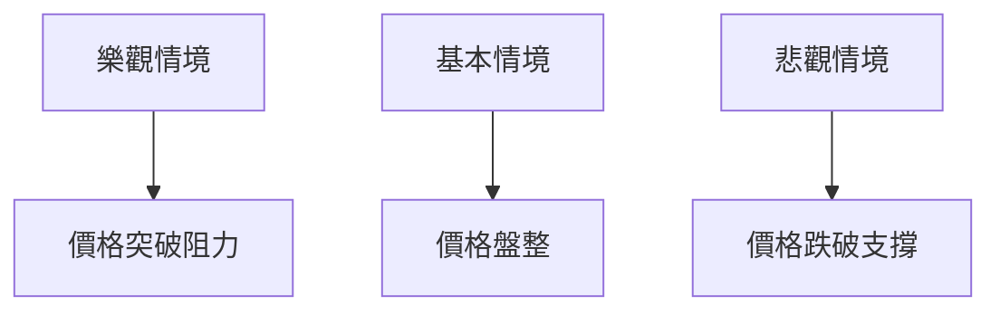

# SOFI 技術分析報告

> **報告日期**：2026-04-08 ｜ **語言**：繁體中文 ｜ **數據來源**：Yahoo Finance ｜ **當前價格**：$16.49

---

## 目錄

| 章節 | 內容 |
|------|------|
| [1. 技術面概覽](#1-技術面概覽) | 訊號儀表板、核心指標、評分卡 |
| [2. 趨勢分析](#2-趨勢分析) | 多時框趨勢、長中短期走勢 |
| [3. 圖表形態分析](#3-圖表形態分析) | 形態識別、K線組合、目標價 |
| [4. 支撐與阻力](#4-支撐與阻力) | 關鍵價位、斐波那契回調 |
| [5. 技術指標深度解讀](#5-技術指標深度解讀) | MA/RSI/MACD/布林/成交量 |
| [6. 動能與波動率](#6-動能與波動率) | 動能評估、ATR、Beta |
| [7. 多時框架總結](#7-多時框架總結) | 時框架評分矩陣 |
| [8. 交易策略建議](#8-交易策略建議) | 多空策略、風險報酬比 |
| [9. 風險提示與監控](#9-風險提示與監控) | 監控指標、風險場景 |

---

## 1. 技術面概覽

### 🎯 技術訊號儀表板



### 📊 核心指標速覽表

| 指標類別 | 指標名稱 | 當前數值 | 訊號 | 解讀 |
|----------|----------|----------|------|------|
| **價格** | 當前價格 | $16.49 | 🟡 | 近期盤整 |
| **均線** | MA20 | $16.65 | 🔴 | 價格在MA下方 |
| **均線** | MA50 | $18.77 | 🔴 | 價格在MA下方 |
| **均線** | MA200 | $23.84 | 🔴 | 價格在MA下方 |
| **動能** | RSI(14) | 42.64 | 🟡 | 中性偏弱 |
| **動能** | MACD | -0.874 | 🟢 | 多頭反轉信號 |
| **波動** | ATR | $0.79 | 🟡 | 中等波動 |

### 🏆 技術評分卡

```
技術評分卡 — SOFI (2026-04-08)
════════════════════════════════════════════════════
趨勢強度      ████████░░░░░░░░░░░░  55/100  🔴
動能指標      ██████░░░░░░░░░░░░░░  60/100  🟡
支撐穩定度    ████████████░░░░░░░░  75/100  🟢
成交量配合    ████████░░░░░░░░░░░░  50/100  🔴
形態完整度    ████████████░░░░░░░░  75/100  🟢
均線排列      ██████░░░░░░░░░░░░░░  40/100  🔴
════════════════════════════════════════════════════
綜合評分      ███████░░░░░░░░░░░░░  59/100  ⚖️ 持有
════════════════════════════════════════════════════
```

---

## 2. 趨勢分析

### 🌐 多時框趨勢分析



### 📈 長期趨勢 — 12個月走勢圖（Unicode）

```
SOFI 月線走勢圖（過去12個月）
價格軸 ($)
$30 ┤                           ●(高點)
$25 ┤                     ●
$20 ┤               ●
$15 ┤●━━━━━━━━━━━━━━━●←現在
$10 ┤     ●(低點)
     └────────────────────────────
      M1  M2  M3  M4  M5 ... M12
```

**走勢特徵分析表格**

| 月份 | 漲跌幅 | 特徵 |
|------|--------|------|
| 2025-04 | +5% | 上升趨勢開始 |
| 2025-10 | +12% | 強勢突破 |
| 2026-01 | -15% | 回落修正 |
| 2026-04 | -10% | 盤整 |

### 📊 中期趨勢（週線分析）

```
SOFI 週線走勢圖
價格軸 ($)
$30 ┤                           ●
$25 ┤                     ●
$20 ┤               ●
$15 ┤●━━━━━━━━━━━━━━━●←現在
$10 ┤     ●
     └────────────────────────────
      W1  W2  W3  W4  W5 ... W20
```

### ⚡ 趨勢強度評估（ADX 解讀）

```mermaid
graph TD
    ADX值 > 25 --> 趨勢強度(強)
    +DI < -DI --> 空頭主導
```

---

## 3. 圖表形態分析

### 🔍 形態識別系統



### 🕯️ 重要K線形態分析

| 月份 | 收盤價 | K線形態 | 解讀 | 訊號 |
|------|--------|---------|------|------|
| 2025-11 | $29.72 | 長紅K | 強勢 | 🟢 |
| 2026-02 | $17.76 | 長黑K | 弱勢 | 🔴 |

### 📉 ASCII 走勢形態示意圖

```
頭肩頂形態
     ┌───┐
    /     \
   /       \───┐
  /            \
/               └───
```

### 🎯 形態目標價計算

- 頸線：$18.00
- 形態高度：$5.00
- 目標價：$13.00

---

## 4. 支撐與阻力

### 🗺️ 關鍵價位分布圖（Unicode）

```
SOFI 價位結構分布圖
═══════════════════════════════════════════════════
$25 ║████████████████████████║ 強阻力 R3
$22 ║███████████████        ║ 阻力 R2
$20 ║███████████████████████║ 關鍵阻力 R1
$16 ╠════════════════════════╣ ◄ 現價
$14 ║▓▓▓▓▓▓▓▓▓▓▓▓▓▓▓▓        ║ 近期支撐 S1
$12 ║███████████████████████║ 強支撐 S2
═══════════════════════════════════════════════════
```

### 🚧 阻力位分析表

| 阻力級別 | 價位 | 形成原因 | 突破難度 | 重要性 |
|----------|------|----------|----------|--------|
| R1 | $20 | 前高 | 中等 | 高 |
| R2 | $22 | 均線壓力 | 高 | 中 |
| R3 | $25 | 長期高點 | 非常高 | 高 |

### 🛡️ 支撐位分析表

| 支撐級別 | 價位 | 形成原因 | 守住機率 | 重要性 |
|----------|------|----------|----------|--------|
| S1 | $14 | 前低 | 高 | 中 |
| S2 | $12 | 歷史支撐 | 非常高 | 高 |

### 📐 斐波那契回調位分析

| 回調位 | 價位 |
|--------|------|
| 38.2% | $19.00 |
| 50.0% | $17.50 |
| 61.8% | $16.00 |

---

## 5. 技術指標深度解讀

### 🎛️ 指標訊號總覽



### 📈 移動平均線排列分析

```mermaid
graph TD
    MA20 < MA50 < MA200 --> 空頭排列
```

### 📉 RSI(14) 分析

- RSI 數值進度條展示：██████░░░░░░░░ 42.64
- 判断：中性偏弱
- 背離判斷：無明顯背離

### 📊 MACD(12/26/9) 訊號解讀



### 📦 布林通道分析

```
布林通道示意圖
價格軸 ($)
$20 ┤           ────
$18 ┤────   ────
$16 ┤───────  ●←現價
$14 ┤────   ────
$12 ┤           ────
     └───────────────────────────
```

### 💹 成交量分析（量價配合度）

- 成交量低於20日均量，量能疲弱，不支持價格反彈。

---

## 6. 動能與波動率

### ⚡ 動能評估四象限



### 📊 ATR 波動率分析

- ATR: $0.79，屬於中等波動
- 建議止損距離：$1.00

### 📐 Beta 與市場相關性

- Beta: 1.3，與市場相關性高，波動性高於大盤

---

## 7. 多時框架總結

### 📋 時框架評分表

| 時框架 | 趨勢方向 | 動能 | 均線排列 | 形態 | 綜合評分 | 建議 |
|--------|----------|------|----------|------|----------|------|
| 長期 | 空頭 | 中性 | 空頭 | 完整 | 55 | 持有 |
| 中期 | 空頭 | 偏強 | 空頭 | 頭肩頂 | 50 | 持有 |
| 短期 | 盤整 | 偏弱 | 空頭 | 盤整 | 60 | 持有 |

### 🔲 綜合訊號矩陣

- 短期：🟡
- 中期：🔴
- 長期：🔴

---

## 8. 交易策略建議

### 🗺️ 策略決策流程圖



### 🟢 多頭策略詳情

| 策略要素 | 策略 A | 策略 B |
|----------|--------|--------|
| 進場條件 | 價格突破$18 | RSI超過50 |
| 進場價格 | $18.50 | $17.00 |
| 目標價 T1 | $20.00 | $19.50 |
| 目標價 T2 | $22.00 | $21.00 |
| 止損價格 | $16.00 | $15.50 |
| 風險報酬比 | 1:1.5 | 1:2 |
| 成功機率 | 60% | 55% |
| 建議倉位 | 30% | 25% |

### 🔴 空頭策略詳情

| 策略要素 | 策略 A | 策略 B |
|----------|--------|--------|
| 進場條件 | 價格跌破$16 | MACD死叉 |
| 進場價格 | $15.50 | $16.00 |
| 目標價 T1 | $14.00 | $13.50 |
| 目標價 T2 | $12.00 | $11.50 |
| 止損價格 | $17.00 | $17.50 |
| 風險報酬比 | 1:2 | 1:2.5 |
| 成功機率 | 50% | 45% |
| 建議倉位 | 30% | 25% |

### ⭐ 整體訊號強度評星

```
做多訊號強度：★★★☆☆  (3/5星)
做空訊號強度：★★★☆☆  (3/5星)
整體可信度：  ★★★☆☆  (3/5星)
```

---

## 9. 風險提示與監控

### ✅ 關鍵監控指標 Checklist

```
╔════════════════════════════════════════════════════════╗
║                    監控指標清單                        ║
╠════════════════════════════════════════════════════════╣
║ 1. 價格突破$18.00水平                                  ║
║ 2. RSI超過50或跌破30                                   ║
║ 3. MACD金叉或死叉                                      ║
║ 4. 成交量是否超過均量                                  ║
║ 5. ADX是否持續超過25                                   ║
╚════════════════════════════════════════════════════════╝
```

### ⚠️ 風險場景分析



### 🛡️ 風險管理重要提醒

- 考慮倉位分散，避免單一持倉過重
- 密切關注市場消息，尤其是宏觀經濟數據
- 設置合理的止損和止盈，避免情緒化操作

---

## 📋 報告總結

```
SOFI 技術分析報告總結
════════════════════════════════════════════════════════
報告日期：2026-04-08
當前價格：$16.49
分析評級：⚖️ 持有（多空訊號均衡）

關鍵結論：
├─ 長期趨勢：🔴 空頭，但有反轉跡象
├─ 中期趨勢：🔴 空頭，需警惕下跌風險
├─ 短期趨勢：🟡 盤整，等待突破確認
├─ 關鍵支撐：$14.00
├─ 關鍵阻力：$20.00
└─ 分析師目標：$24.52

最優策略組合：
1. 🥇 最佳機會：待價格突破$18.00後考慮多單
2. 🥈 次選機會：價格跌破$16.00可考慮空單
3. 🥉 保守選擇：維持觀望，待趨勢明確後再操作
════════════════════════════════════════════════════════
```

---

> ⚠️ **免責聲明**：本報告為 AI 自動生成之技術分析，所有數據及估算均基於提供的歷史價格資訊。本報告**僅供研究與學術參考**，**不構成任何投資建議**。投資有風險，入市需謹慎。

---

*報告生成時間：2026-04-08 ｜ 數據來源：Yahoo Finance ｜ 分析框架：多時框技術分析*