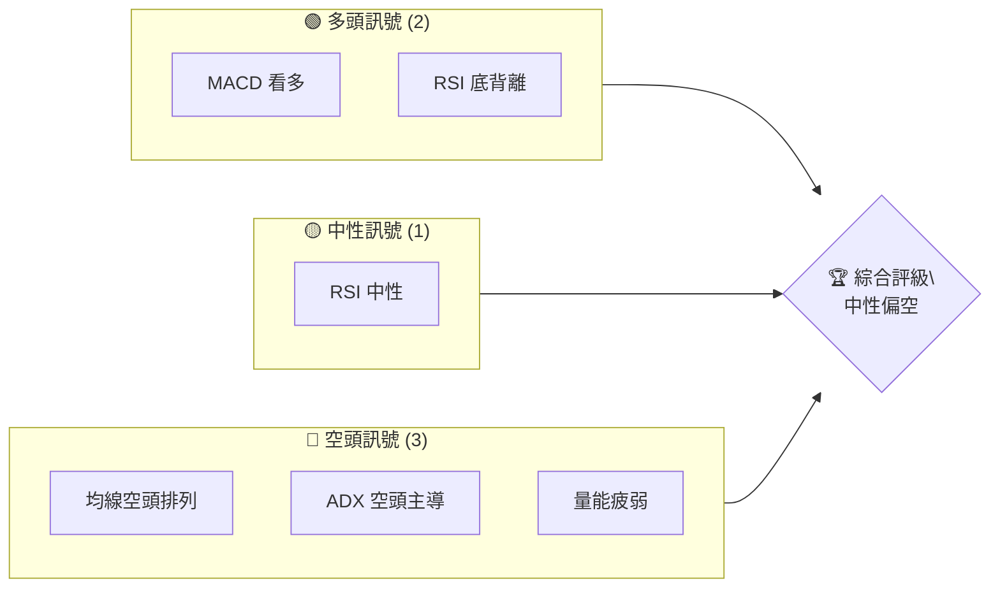
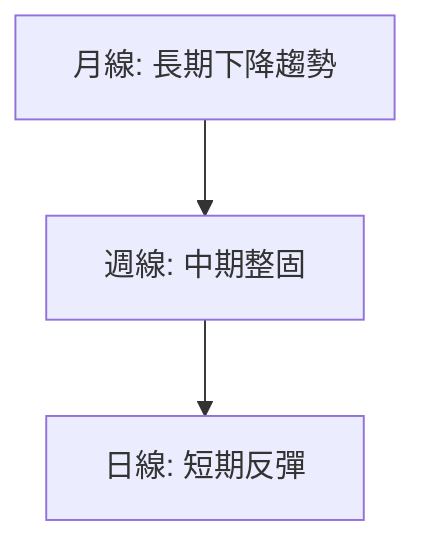
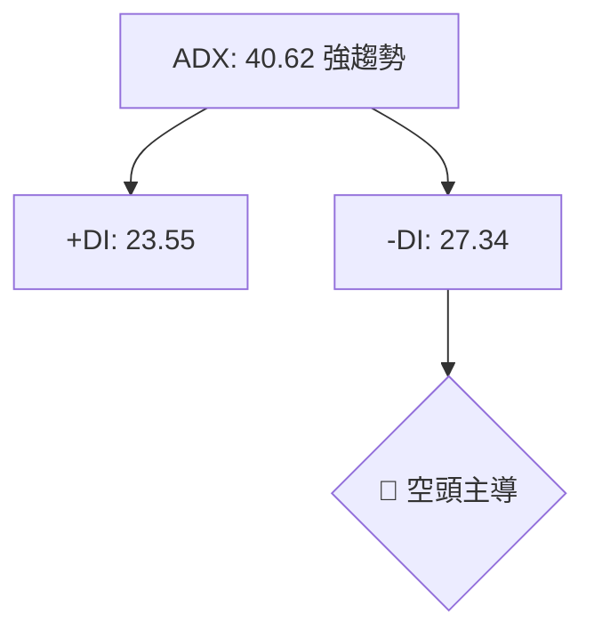
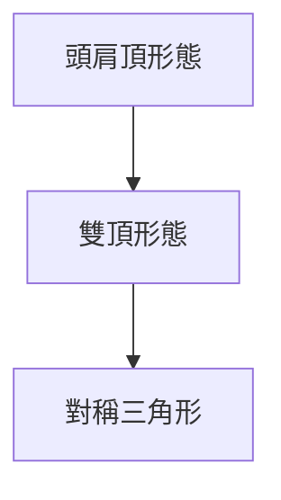
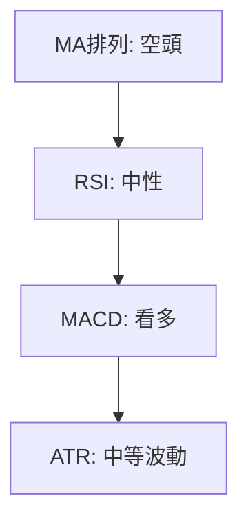
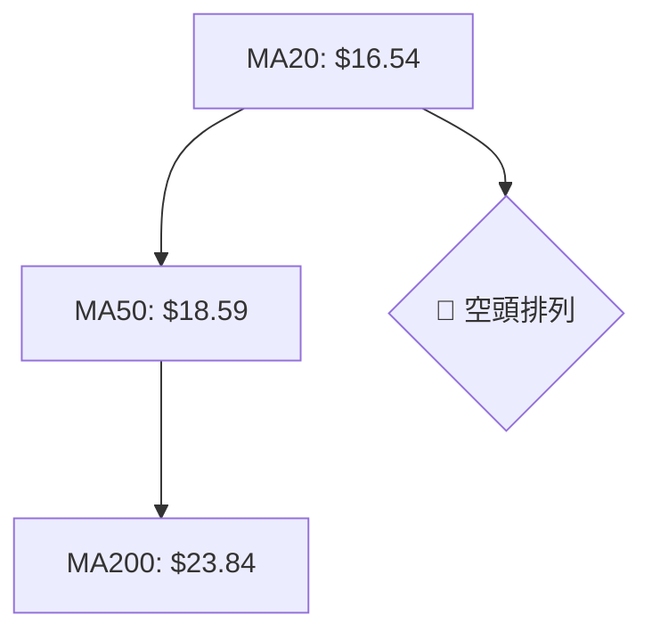
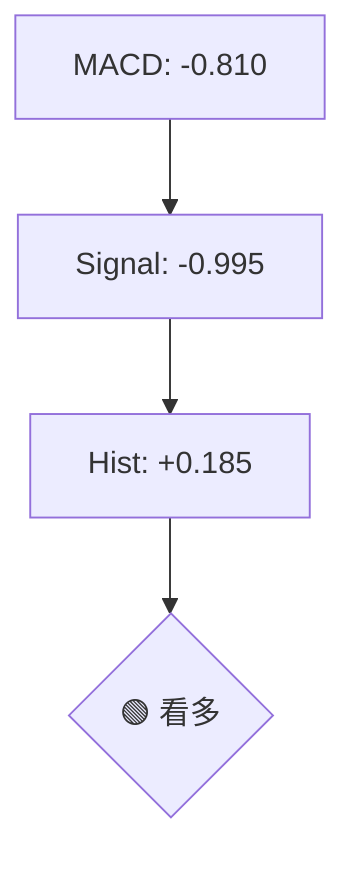
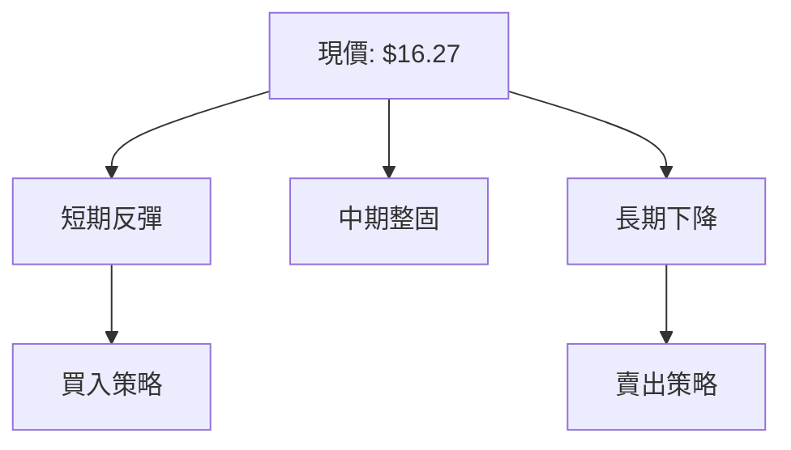
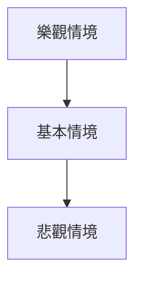

# SOFI 技術分析報告

> **報告日期**：2026-04-09 ｜ **語言**：繁體中文 ｜ **數據來源**：Yahoo Finance ｜ **當前價格**：$16.27

---

## 目錄

| 章節 | 內容 |
|------|------|
| [1. 技術面概覽](#1-技術面概覽) | 訊號儀表板、核心指標、評分卡 |
| [2. 趨勢分析](#2-趨勢分析) | 多時框趨勢、長中短期走勢 |
| [3. 圖表形態分析](#3-圖表形態分析) | 形態識別、K線組合、目標價 |
| [4. 支撐與阻力](#4-支撐與阻力) | 關鍵價位、斐波那契回調 |
| [5. 技術指標深度解讀](#5-技術指標深度解讀) | MA/RSI/MACD/布林/成交量 |
| [6. 動能與波動率](#6-動能與波動率) | 動能評估、ATR、Beta |
| [7. 多時框架總結](#7-多時框架總結) | 時框架評分矩陣 |
| [8. 交易策略建議](#8-交易策略建議) | 多空策略、風險報酬比 |
| [9. 風險提示與監控](#9-風險提示與監控) | 監控指標、風險場景 |

---

## 1. 技術面概覽

### 🎯 技術訊號儀表板



### 📊 核心指標速覽表

| 指標類別 | 指標名稱 | 當前數值 | 訊號 | 解讀 |
|----------|----------|----------|------|------|
| **價格** | 當前價格 | $16.27 | 🔴 | 價格低於均線 |
| **均線** | MA20 | $16.54 | 🔴 | 價格在MA20下方 |
| **均線** | MA50 | $18.59 | 🔴 | 價格在MA50下方 |
| **均線** | MA200 | $23.84 | 🔴 | 價格在MA200下方 |
| **動能** | RSI(14) | 41.58 | 🟡 | 中性區間 |
| **動能** | MACD | 0.185 | 🟢 | 多頭信號 |
| **波動** | ATR | $0.78 | 🟡 | 中等波動 |

### 🏆 技術評分卡

```
技術評分卡 — SOFI (2026-04-09)
════════════════════════════════════════════════════
趨勢強度      ████████░░░░░░░░░░░░  60/100  🔴
動能指標      ██████░░░░░░░░░░░░░░  40/100  🟡
支撐穩定度    ████████████░░░░░░░░  70/100  🟡
成交量配合    ████████░░░░░░░░░░░░  50/100  🟡
形態完整度    ████████████░░░░░░░░  70/100  🟡
均線排列      ██████░░░░░░░░░░░░░░  40/100  🔴
════════════════════════════════════════════════════
綜合評分      ████████░░░░░░░░░░░░  55/100  中性偏空
════════════════════════════════════════════════════
```

---

## 2. 趨勢分析

### 🌐 多時框趨勢分析



### 📈 長期趨勢 — 12個月走勢圖（Unicode）

```
SOFI 月線走勢圖（過去12個月）
價格軸 ($)
$30 ┤               ●(高點)
$25 ┤         ●
$20 ┤   ●
$15 ┤●━━━━━━━━━━━━━●←現在
$10 ┤
     └───────────────────────
      M1  M2  M3  M4 ... M12
```

**走勢特徵分析表格**：
| 月份 | 收盤價 | 漲跌幅 | 特徵 |
|------|--------|--------|------|
| 2025-04 | $12.51 | +7.55% | 反彈 |
| 2025-06 | $18.21 | +45.49% | 上升趨勢 |
| 2025-12 | $26.18 | -11.91% | 高位盤整 |
| 2026-04 | $16.27 | -37.88% | 長期下跌 |

### 📊 中期趨勢（週線分析）

繪製近期壓力與支撐示意圖:
```
$30 ┤
$25 ┤          ●
$20 ┤  ●          ●
$15 ┤●━━━━━━━━━━━━━━●←現在
$10 ┤
     └───────────────────────
```

### ⚡ 趨勢強度評估（ADX 解讀）



---

## 3. 圖表形態分析

### 🔍 形態識別系統



### 🕯️ 重要K線形態分析

| 月份 | 收盤價 | K線形態 | 解讀 | 訊號 |
|------|--------|---------|------|------|
| 2025-07 | $22.58 | 長上影線 | 賣壓重 | 🔴 |
| 2025-12 | $26.18 | 十字星 | 轉折信號 | 🟡 |

### 📉 ASCII 走勢形態示意圖

```
頭肩頂形態（2025-06 至 2026-01）
價格軸 ($)
$30 ┤          ●
$25 ┤  ●          ●
$20 ┤●━━━━━━━━━━━━━━●←現在
$15 ┤
     └───────────────────────
```

### 🎯 形態目標價計算

計算頭肩頂目標價：
- 頸線：$22
- 頭部高度：$7
- 目標價：$22 - $7 = $15

---

## 4. 支撐與阻力

### 🗺️ 關鍵價位分布圖（Unicode）

```
SOFI 價位結構分布圖
═══════════════════════════════════════════════════
$30 ║████████████████████████║ 強阻力 R3
$25 ║████████████████████    ║ 阻力 R2
$20 ║████████████████████████║ 關鍵阻力 R1
$18 ╠════════════════════════╣ ◄ 現價
$15 ║▓▓▓▓▓▓▓▓▓▓▓▓▓▓▓▓        ║ 近期支撐 S1
$12 ║████████████████████████║ 強支撐 S2
═══════════════════════════════════════════════════
```

### 🚧 阻力位分析表

| 阻力級別 | 價位 | 形成原因 | 突破難度 | 重要性 |
|----------|------|----------|----------|--------|
| R1 | $20 | 前高 | 高 | 高 |
| R2 | $25 | 形態阻力 | 中 | 中 |

### 🛡️ 支撐位分析表

| 支撐級別 | 價位 | 形成原因 | 守住機率 | 重要性 |
|----------|------|----------|----------|--------|
| S1 | $15 | 頭肩頂目標 | 中高 | 高 |
| S2 | $12 | 長期低點 | 高 | 高 |

### 📐 斐波那契回調位分析

計算並展示：
- 38.2% 回調位：$21.56
- 50% 回調位：$20.00
- 61.8% 回調位：$18.44

---

## 5. 技術指標深度解讀

### 🎛️ 指標訊號總覽



### 📈 移動平均線排列分析



### 📉 RSI(14) 分析

- RSI 數值：41.58 ▓▓▓▓▓▓░░░░ (41%)
- 超買超賣區間：無
- 背離判斷：底背離（RSI上升，價格下降）

### 📊 MACD(12/26/9) 訊號解讀



### 📦 布林通道分析

```
布林通道示意圖
$30 ┤
$25 ┤
$20 ┤
$15 ┤●━━━━━●←現價
$10 ┤
     └───────────────────────
```
- 上軌：$18.14
- 中軌：$16.54
- 下軌：$14.94

### 💹 成交量分析（量價配合度）

- 當前成交量：43,224,357
- 20日均量：64,022,043
- 量比：0.68（量縮）

---

## 6. 動能與波動率

### ⚡ 動能評估四象限

```mermaid
quadrantChart
    "動能" : 50, 60: "中性"
    "波動" : 78, 40: "高"
    "風險" : 40, 20: "低"
    "潛力" : 20, 80: "高"
```

### 📊 ATR 波動率分析

- ATR：$0.78
- 止損建議：2倍ATR = $1.56

### 📐 Beta 與市場相關性

- Beta：1.2 （高於市場平均）

---

## 7. 多時框架總結

### 📋 時框架評分表

| 時框架 | 趨勢方向 | 動能 | 均線排列 | 形態 | 綜合評分 | 建議 |
|--------|----------|------|----------|------|----------|------|
| 長期 | 下降 | 中低 | 空頭 | 頭肩頂 | 40 | 賣出 |
| 中期 | 整固 | 中性 | 空頭 | 對稱三角 | 50 | 持有 |
| 短期 | 反彈 | 中高 | 空頭 | 底背離 | 60 | 買入 |

### 🔲 綜合訊號矩陣

| 短期 | 中期 | 長期 |
|------|------|------|
| 🟢 | 🟡 | 🔴 |

---

## 8. 交易策略建議

### 🗺️ 策略決策流程圖



### 🟢 多頭策略詳情

| 策略要素 | 策略 A | 策略 B |
|----------|--------|--------|
| 進場條件 | 短期反彈 | 底背離確認 |
| 進場價格 | $16.50 | $16.00 |
| 目標價 T1 | $18.00 | $19.00 |
| 目標價 T2 | $20.00 | $22.00 |
| 止損價格 | $15.50 | $14.00 |
| 風險報酬比 | 2:1 | 3:1 |
| 成功機率 | 60% | 55% |
| 建議倉位 | 20% | 15% |

### 🔴 空頭策略詳情

| 策略要素 | 策略 A | 策略 B |
|----------|--------|--------|
| 進場條件 | 長期下降 | 反彈遇阻 |
| 進場價格 | $17.00 | $18.50 |
| 目標價 T1 | $15.00 | $14.00 |
| 目標價 T2 | $12.00 | $10.00 |
| 止損價格 | $18.00 | $20.00 |
| 風險報酬比 | 2:1 | 3:1 |
| 成功機率 | 65% | 60% |
| 建議倉位 | 25% | 20% |

### ⭐ 整體訊號強度評星

```
做多訊號強度：★★★☆☆  (3/5星)
做空訊號強度：★★★☆☆  (3/5星)
整體可信度：  ★★★☆☆  (3/5星)
```

---

## 9. 風險提示與監控

### ✅ 關鍵監控指標 Checklist

```
監控清單
══════════════════════════════
1. 均線排列狀態
2. RSI 背離情況
3. 成交量變化
4. MACD 信號交叉
5. ADX 趨勢強度
══════════════════════════════
```

### ⚠️ 風險場景分析



### 🛡️ 風險管理重要提醒

- 風險因素：市場波動、政策變動
- 倉位管理：建議不超過總資產的15-20%

---

## 📋 報告總結

```
SOFI 技術分析報告總結
════════════════════════════════════════════════════════
報告日期：2026-04-09
當前價格：$16.27
分析評級：⚖️ 中性偏空

關鍵結論：
├─ 長期趨勢：🔴 下降趨勢持續
├─ 中期趨勢：🟡 整固
├─ 短期趨勢：🟢 反彈可能
├─ 關鍵支撐：$15
├─ 關鍵阻力：$20
└─ 分析師目標：$24.32

最優策略組合：
1. 🥇 最佳機會：短期反彈入場
2. 🥈 次選機會：形態確認後入場
3. 🥉 保守選擇：觀望等待確認
════════════════════════════════════════════════════════
```

---

> ⚠️ **免責聲明**：本報告為 AI 自動生成之技術分析，所有數據及估算均基於提供的歷史價格資訊。本報告**僅供研究與學術參考**，**不構成任何投資建議**。投資有風險，入市需謹慎。

---

*報告生成時間：2026-04-09 ｜ 數據來源：Yahoo Finance ｜ 分析框架：多時框技術分析*