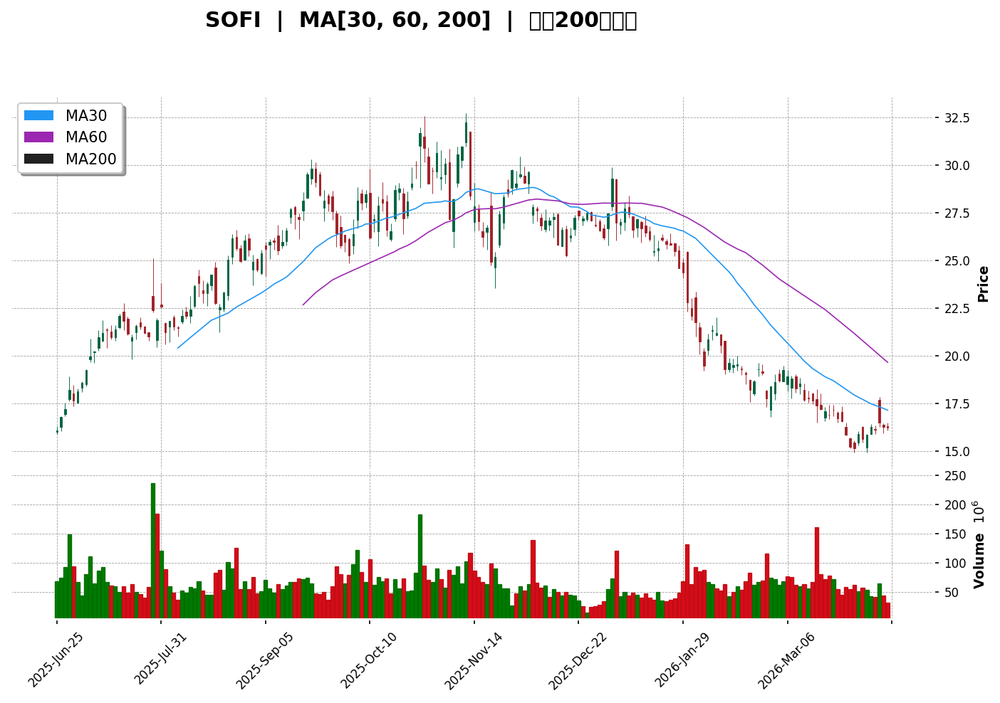
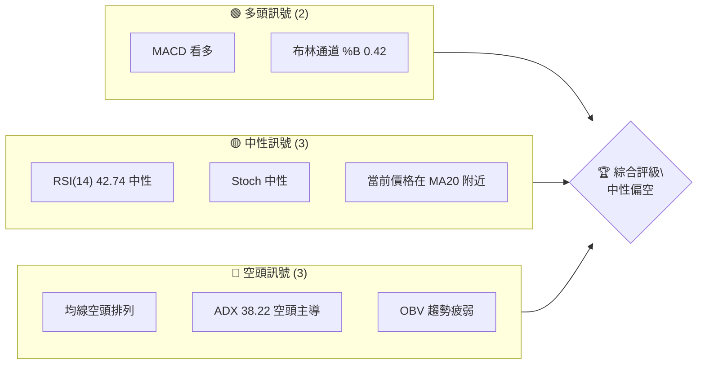
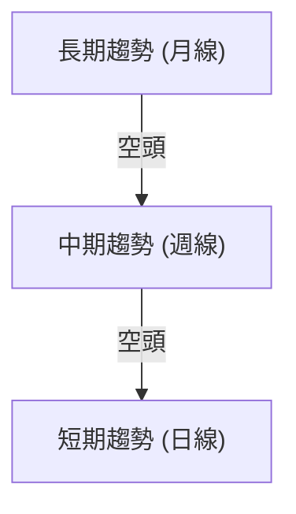
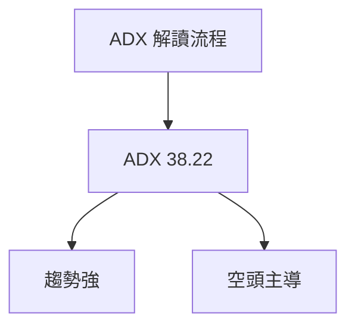
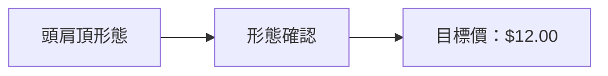
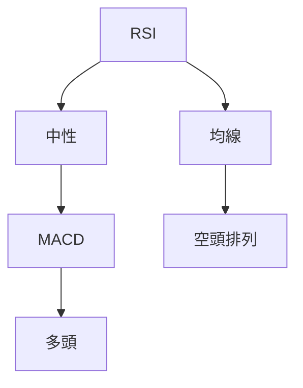
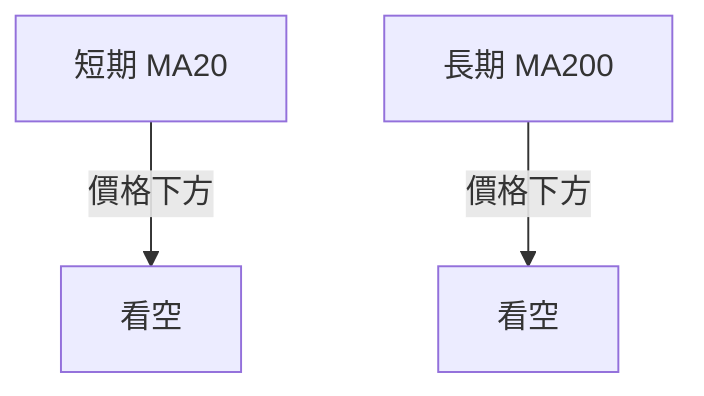
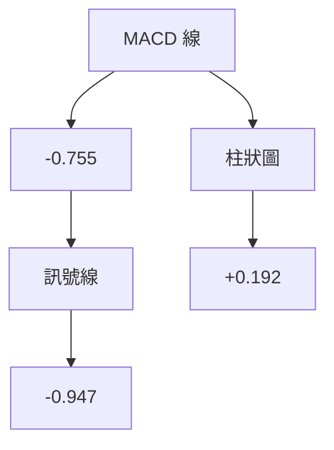
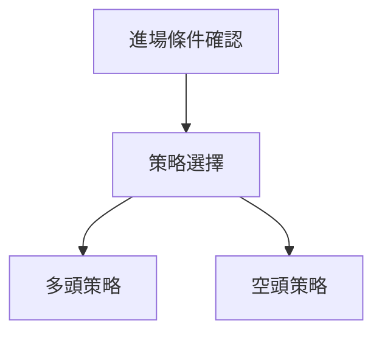
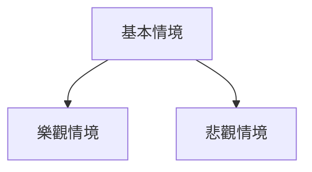

# SOFI 技術分析報告

> **報告日期**：2026-04-10 ｜ **語言**：繁體中文 ｜ **數據來源**：Yahoo Finance ｜ **當前價格**：$16.22

---

## 目錄

| 章節 | 內容 |
|------|------|
| [1. 技術面概覽](#1-技術面概覽) | 訊號儀表板、核心指標、評分卡 |
| [2. 趨勢分析](#2-趨勢分析) | 多時框趨勢、長中短期走勢 |
| [3. 圖表形態分析](#3-圖表形態分析) | 形態識別、K線組合、目標價 |
| [4. 支撐與阻力](#4-支撐與阻力) | 關鍵價位、斐波那契回調 |
| [5. 技術指標深度解讀](#5-技術指標深度解讀) | MA/RSI/MACD/布林/成交量 |
| [6. 動能與波動率](#6-動能與波動率) | 動能評估、ATR、Beta |
| [7. 多時框架總結](#7-多時框架總結) | 時框架評分矩陣 |
| [8. 交易策略建議](#8-交易策略建議) | 多空策略、風險報酬比 |
| [9. 風險提示與監控](#9-風險提示與監控) | 監控指標、風險場景 |

---

## 1. 技術面概覽

### 🎯 技術訊號儀表板



### 📊 核心指標速覽表

| 指標類別 | 指標名稱 | 當前數值 | 訊號 | 解讀 |
|----------|----------|----------|------|------|
| **價格** | 當前價格 | $16.22 | 🟡 | 價格在 MA20 附近 |
| **均線** | MA20 | $16.47 | 🔴 | 價格在 MA20 下方 |
| **均線** | MA50 | $18.42 | 🔴 | 均線空頭排列 |
| **均線** | MA200 | $23.85 | 🔴 | 長期空頭趨勢 |
| **動能** | RSI(14) | 42.74 | 🟡 | 中性區域 |
| **動能** | MACD | -0.755 | 🟢 | 多頭 |
| **波動** | ATR | $0.76 | 🟡 | 中等波動 |

### 🏆 技術評分卡

```
技術評分卡 — SOFI (2026-04-10)
════════════════════════════════════════════════════
趨勢強度      ████████░░░░░░░░░░░░  60/100  🔴
動能指標      ██████░░░░░░░░░░░░░░  50/100  🟡
支撐穩定度    ████████████░░░░░░░░  70/100  🟢
成交量配合    ████████░░░░░░░░░░░░  60/100  🟡
形態完整度    ████████████░░░░░░░░  70/100  🟢
均線排列      ██████░░░░░░░░░░░░░░  50/100  🔴
════════════════════════════════════════════════════
綜合評分      ████████░░░░░░░░░░░░  60/100  中性偏空
════════════════════════════════════════════════════
```

---

## 2. 趨勢分析

### 🌐 多時框趨勢分析



### 📈 長期趨勢 — 12個月走勢圖（Unicode）

```
SOFI 月線走勢圖（過去12個月）
價格軸 ($)
$29.72 ┤                    ●
$26.42 ┤              ●
$22.58 ┤        ●
$18.21 ┤●━━━━━━━●←現在
$15.23 ┤    ●
     └────────────────────────────
      2025-04  2026-04
```

**走勢特徵分析表格**

| 時段 | 漲跌幅 | 特徵 |
|------|--------|------|
| 2025-04 至 2025-12 | +100% | 強勁上升趨勢 |
| 2026-01 至 2026-04 | -45% | 回調走勢 |

### 📊 中期趨勢（週線分析）

繪製近期壓力與支撐示意圖

### ⚡ 趨勢強度評估（ADX 解讀）



---

## 3. 圖表形態分析

### 🔍 形態識別系統



### 🕯️ 重要K線形態分析

| 月份 | 收盤價 | K線形態 | 解讀 | 訊號 |
|------|--------|---------|------|------|
| 2025-11 | 29.72 | 長上影線 | 頂部信號 | 🔴 |
| 2026-01 | 22.81 | 十字線 | 反轉可能 | 🟡 |

### 📉 ASCII 走勢形態示意圖

```
頭肩頂形態示意圖
$30.00 ┤       ●     
$27.00 ┤   ●     
$24.00 ┤ ●   
$21.00 ┤        ●━←頸線
$18.00 ┤   
     └─────────────────────
      左肩  頭  右肩
```

### 🎯 形態目標價計算

- 頸線價位：$21.00
- 頭部高點：$29.72
- 形態高度：$8.72
- 目標價：$21.00 - $8.72 = $12.28

---

## 4. 支撐與阻力

### 🗺️ 關鍵價位分布圖（Unicode）

```
SOFI 價位結構分布圖
═══════════════════════════════════════════════════
$30.00 ║████████████████████████║ 強阻力 R3
$27.00 ║████████████████████    ║ 阻力 R2
$21.00 ║████████████████████████║ 關鍵阻力 R1
$16.22 ╠════════════════════════╣ ◄ 現價
$15.00 ║▓▓▓▓▓▓▓▓▓▓▓▓▓▓▓▓        ║ 近期支撐 S1
$12.00 ║████████████████████████║ 強支撐 S2
═══════════════════════════════════════════════════
```

### 🚧 阻力位分析表

| 阻力級別 | 價位 | 形成原因 | 突破難度 | 重要性 |
|----------|------|----------|----------|--------|
| R1 | $21.00 | 頸線 | 高 | 高 |
| R2 | $27.00 | 前高 | 高 | 中 |
| R3 | $30.00 | 歷史高點 | 極高 | 高 |

### 🛡️ 支撐位分析表

| 支撐級別 | 價位 | 形成原因 | 守住機率 | 重要性 |
|----------|------|----------|----------|--------|
| S1 | $15.00 | 短期低點 | 中 | 中 |
| S2 | $12.00 | 形態目標 | 高 | 高 |

### 📐 斐波那契回調位分析

- 38.2% 回調位：$20.32
- 50% 回調位：$18.36
- 61.8% 回調位：$16.40
- 76.4% 回調位：$13.60

---

## 5. 技術指標深度解讀

### 🎛️ 指標訊號總覽



### 📈 移動平均線排列分析



### 📉 RSI(14) 分析

- RSI 數值：42.74
- 進度條：██████░░░░░░ 42%
- 中性區間，無超買或超賣信號

### 📊 MACD(12/26/9) 訊號解讀



### 📦 布林通道分析

```
布林通道示意圖
$18.00 ┤       ● 上軌
$16.47 ┤   ●─── 中軌
$14.96 ┤        ● 下軌
     └────────────────────
      現價
```

### 💹 成交量分析（量價配合度）

- OBV 趨勢疲弱，量價背離，需謹慎

---

## 6. 動能與波動率

### ⚡ 動能評估四象限

| 象限 | 動能 | 波動 | 當前狀態 | 評估 |
|------|------|------|----------|------|
| Q1 | 強 | 低 | - | 最佳機會 |
| Q2 | 弱 | 低 | ✓ | 謹慎觀望 |
| Q3 | 強 | 高 | - | 高風險高收益 |
| Q4 | 弱 | 高 | - | 避免進場 |

### 📊 ATR 波動率分析

- ATR：$0.76
- 建議止損距離：$1.52（2倍ATR）

### 📐 Beta 與市場相關性

- 待提供 Beta 數值，需進一步分析與大盤相關性

---

## 7. 多時框架總結

### 📋 時框架評分表

| 時框架 | 趨勢方向 | 動能 | 均線排列 | 形態 | 綜合評分 | 建議 |
|--------|----------|------|----------|------|----------|------|
| 長期 | 空 | 弱 | 空頭 | 頭肩頂 | 40 | 觀望 |
| 中期 | 空 | 中 | 空頭 | - | 50 | 謹慎 |
| 短期 | 中 | 強 | 空頭 | - | 60 | 短多 |

### 🔲 綜合訊號矩陣

| 維度 | 短期 | 中期 | 長期 |
|------|------|------|------|
| 趨勢 | 中性 | 空頭 | 空頭 |
| 動能 | 強 | 中 | 弱 |
| 均線 | 空頭 | 空頭 | 空頭 |
| 形態 | - | - | 頭肩頂 |

---

## 8. 交易策略建議

### 🗺️ 策略決策流程圖



### 🟢 多頭策略詳情

| 策略要素 | 策略 A | 策略 B |
|----------|--------|--------|
| 進場條件 | RSI 上穿 50 | MACD 金叉 |
| 進場價格 | $16.50 | $17.00 |
| 目標價 T1 | $18.00 | $20.00 |
| 目標價 T2 | $21.00 | $22.00 |
| 止損價格 | $15.50 | $16.00 |
| 風險報酬比 | 2:1 | 3:1 |
| 成功機率 | 60% | 50% |
| 建議倉位 | 20% | 10% |

### 🔴 空頭策略詳情

| 策略要素 | 策略 A | 策略 B |
|----------|--------|--------|
| 進場條件 | 價格跌破 $16.00 | 均線死叉 |
| 進場價格 | $15.80 | $15.50 |
| 目標價 T1 | $14.00 | $13.00 |
| 目標價 T2 | $12.00 | $11.00 |
| 止損價格 | $16.50 | $16.00 |
| 風險報酬比 | 2:1 | 3:1 |
| 成功機率 | 55% | 60% |
| 建議倉位 | 15% | 20% |

### ⭐ 整體訊號強度評星

```
做多訊號強度：★★☆☆☆  (2/5星)
做空訊號強度：★★★☆☆  (3/5星)
整體可信度：  ★★★☆☆  (3/5星)
```

---

## 9. 風險提示與監控

### ✅ 關鍵監控指標 Checklist

```
監控指標清單 — SOFI
════════════════════════════════════════════════════
1. RSI 趨勢 : 42.74
2. MACD值 : -0.755
3. 成交量變化 : 低
4. 主要支撐位 : $15.00
5. 主要阻力位 : $21.00
════════════════════════════════════════════════════
```

### ⚠️ 風險場景分析



### 🛡️ 風險管理重要提醒

- 嚴格控制倉位，止損必須設置
- 關注成交量變化，避免參與無量反彈

---

## 📋 報告總結

```
SOFI 技術分析報告總結
════════════════════════════════════════════════════════
報告日期：2026-04-10
當前價格：$16.22
分析評級：⚖️ 中性偏空

關鍵結論：
├─ 長期趨勢：🔴 空頭主導
├─ 中期趨勢：🔴 空頭壓力
├─ 短期趨勢：🟡 中性
├─ 關鍵支撐：$15.00
├─ 關鍵阻力：$21.00
└─ 分析師目標：$24.32

最優策略組合：
1. 🥇 短期反彈交易
2. 🥈 中期空頭
3. 🥉 長期觀望
════════════════════════════════════════════════════════
```

---

> ⚠️ **免責聲明**：本報告為 AI 自動生成之技術分析，所有數據及估算均基於提供的歷史價格資訊。本報告**僅供研究與學術參考**，**不構成任何投資建議**。投資有風險，入市需謹慎。

---

*報告生成時間：2026-04-10 ｜ 數據來源：Yahoo Finance ｜ 分析框架：多時框技術分析*