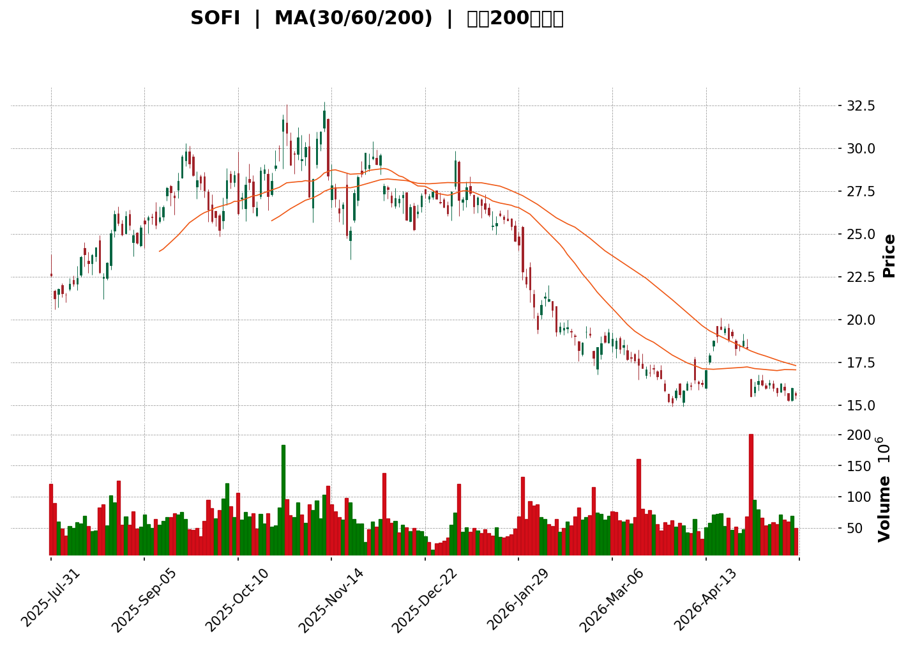
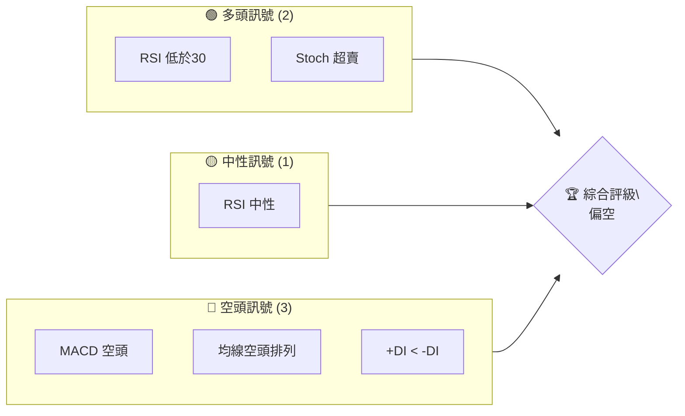
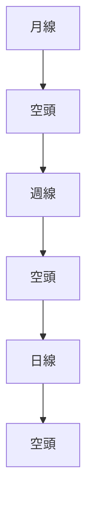
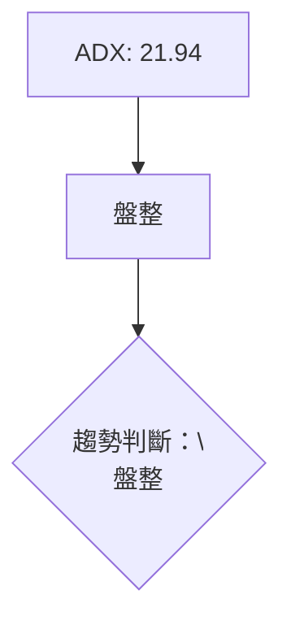
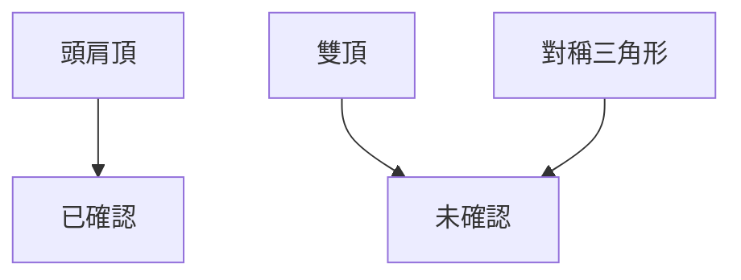
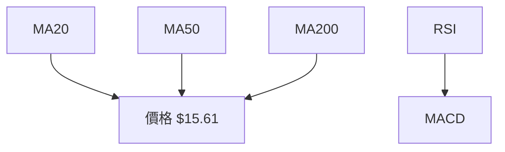
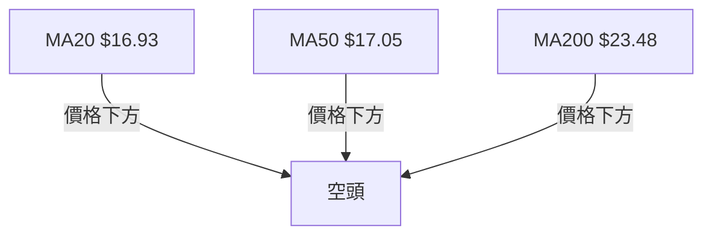
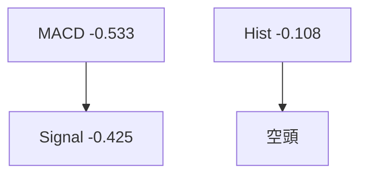
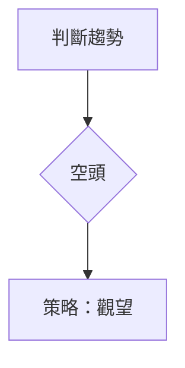
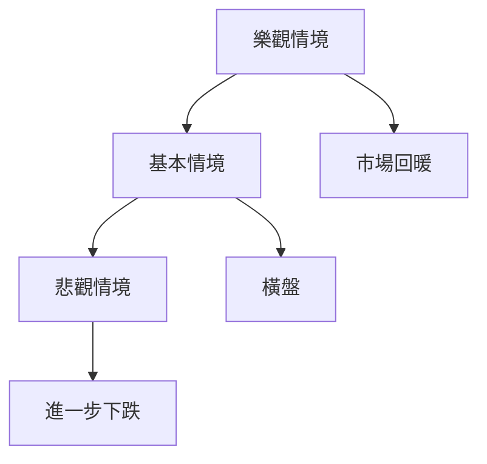

<details>
<summary>📊 靜態圖表 (點擊展開)</summary>

</details>

<html>
<head><meta charset="utf-8" /></head>
<body>
    <div>                        <script>window.PlotlyConfig = {MathJaxConfig: 'local'};</script>
        <script charset="utf-8" src="https://cdn.plot.ly/plotly-3.5.0.min.js" integrity="sha256-fHbNLP+GlIXN+efbQec78UkemUz3NJp7UmfGxC1tNxs=" crossorigin="anonymous"></script>                <div id="candlestick-chart" class="plotly-graph-div" style="height:500px; width:100%;"></div>            <script>                window.PLOTLYENV=window.PLOTLYENV || {};                                if (document.getElementById("candlestick-chart")) {                    Plotly.newPlot(                        "candlestick-chart",                        [{"close":{"dtype":"f8","bdata":"AAAA4HqUNkAAAABA4To1QAAAACBczzVAAAAAgD2KNUAAAACAwnU1QAAAAOB6FDZAAAAAoJkZNkAAAAAghWs2QAAAAGBmpjdAAAAAIFzPN0AAAACAPUo3QAAAAMAexTdAAAAAQOE6OEAAAAAAAMA2QAAAAMAehTZAAAAA4HpUN0AAAADAHgU5QAAAAGBmJjpAAAAAYLieOUAAAACAwvU4QAAAAIA9CjpAAAAAgD2KOUAAAADA9eg4QAAAAKBwfThAAAAAoEdhOUAAAACgmZk5QAAAAIDC9TlAAAAA4FH4OUAAAADAHoU5QAAAAIDC9TlAAAAAwMyMOkAAAAAghas7QAAAACCFaztAAAAAANcjO0AAAAAAKRw8QAAAAGCPgj1AAAAAIFzPPUAAAABAChc9QAAAAOCjcDxAAAAAYLgePEAAAABA4fo7QAAAAMDMjDtAAAAAIIVrOkAAAABgj8I5QAAAAOBR+DlAAAAAoHA9OUAAAAAAKVw6QAAAAADXIzxAAAAAwB4FPEAAAABAM3M8QAAAAOCjMDpAAAAAANcjO0AAAABguN47QAAAACCuBzxAAAAAoJmZOkAAAACAPYo6QAAAAIAUrjxAAAAAAADAPEAAAADgozA7QAAAAOB6FDxAAAAAYI8CPUAAAAAAAAA+QAAAAMD1qD9AAAAAYGbmPkAAAAAgrgc9QAAAAIAUrj1AAAAAoEehPkAAAABguF49QAAAAIDrET5AAAAAwPUoO0AAAACAwjU8QAAAAIA9ij5AAAAAQDPzPkAAAABA4RpAQAAAAADXYzxAAAAAgOvRO0AAAACAPQo7QAAAAKBwPTpAAAAA4FG4OkAAAADA9eg4QAAAAOCjMDlAAAAAYGZmO0AAAADgelQ8QAAAAKBwfTxAAAAA4FG4PUAAAAAgrgc9QAAAAGCPgj1AAAAAgOsRPUAAAACgmZk9QAAAACCuxztAAAAAACmcO0AAAADgetQ6QAAAAEAKFztAAAAAgOsRO0AAAAAgrkc7QAAAAIDr0TlAAAAA4HqUOkAAAADAHkU5QAAAAIA9SjpAAAAAoHA9O0AAAACgmVk7QAAAAOCjMDtAAAAAQOF6O0AAAACA6xE7QAAAAIDr0TpAAAAAIFyPOkAAAACAFC46QAAAAIDCdTtAAAAAIK5HPUAAAABA4fo6QAAAAAAAADtAAAAA4FG4O0AAAABgZmY7QAAAAKCZmTpAAAAAANcjO0AAAAAghas6QAAAAOCjcDpAAAAAoEchOkAAAACgcH05QAAAAADXozlAAAAAQAoXOkAAAACgmdk5QAAAAMDMzDlAAAAAgMJ1OUAAAACgmZk4QAAAAAApXDhAAAAAIFzPNkAAAADgehQ2QAAAAGCPwjVAAAAAAADANEAAAACAwnUzQAAAAAAp3DRAAAAAoJlZNUAAAACAFC41QAAAAMDMjDRAAAAAwMxMM0AAAAAAKZwzQAAAAGCPgjNAAAAAgD2KM0AAAADAzEwzQAAAAMAeBTNAAAAA4FE4MkAAAADA9agyQAAAAIA9SjNAAAAAoJkZM0AAAABgj8IxQAAAAADXYzJAAAAAACmcMkAAAABAM7MyQAAAAAAAQDNAAAAAYGbmMkAAAACAPcoyQAAAAIA9SjJAAAAAIK6HMkAAAABAM7MxQAAAAGCPwjFAAAAAoEehMUAAAABguF4xQAAAAIAULjFAAAAA4HoUMUAAAABgZuYwQAAAAGBmJjFAAAAAQDOzMEAAAAAgXI8wQAAAAKBwvS9AAAAAgMJ1LkAAAADAzEwuQAAAAGCPwi9AAAAAYI9CL0AAAABAM7MvQAAAAMAeRTBAAAAAACkcMEAAAACgcH0wQAAAAMAeRTBAAAAA4FE4MEAAAADAzAwxQAAAAMD16DFAAAAAgD3KMkAAAAAgrgczQAAAAIAUbjNAAAAAAACAM0AAAADgetQyQAAAACBcDzNAAAAAgOtRMkAAAADgo3AyQAAAAGCPwjJAAAAAAClcMkAAAADAzAwvQAAAAKCZGTBAAAAAgBRuMEAAAABAMzMwQAAAAMAeBTBAAAAAwMxMMEAAAAAAAAAwQAAAAAAAgC9AAAAAYI9CMEAAAADAzMwvQAAAAGC4ni5AAAAAwB4FMEAAAADgUTgvQA=="},"high":{"dtype":"f8","bdata":"AAAAgBTON0AAAABgj8I1QAAAAEAK1zVAAAAAYLgeNkAAAAAgXI81QAAAAIAUbjZAAAAAgMKVNkAAAAAA1yM3QAAAAEDhujdAAAAAAACAOEAAAABAM\u002fM3QAAAAAAp3DdAAAAAQOE6OEAAAADA9eg4QAAAAOBRuDZAAAAAwHZeN0AAAAAAAEA5QAAAAKBHYTpAAAAAQOGaOkAAAAAgXM85QAAAAOB6VDpAAAAAIIVrOkAAAAAgrkc5QAAAAAApHDlAAAAAgD2KOUAAAADgUfg5QAAAAKCZGTpAAAAA4KMwOkAAAABA4do6QAAAAKCZmTpAAAAA4KOwOkAAAADAHsU7QAAAAKBH4TtAAAAAgMJ1O0AAAABAtpM8QAAAAKBHoT1AAAAAwMxMPkAAAAAA1yM+QAAAACCFqz1AAAAAIIWrPEAAAABA4Xo8QAAAAKBHoTxAAAAAACmcO0AAAADgelQ7QAAAAKCZWTpAAAAAgBQuOkAAAAAA1yM7QAAAAEAK1zxAAAAAgMK1PEAAAADgo7A8QAAAAMDMzD1AAAAAgBRuO0AAAACgmVk8QAAAAEAKFz1AAAAA4KNwPEAAAAAghes6QAAAAIAU7jxAAAAAgOsRPUAAAADAzMw8QAAAAOBRmDxAAAAAYLjePUAAAABAMzM+QAAAAEDh+j9AAAAA4FFIQEAAAACAPeo+QAAAAAAp3D1AAAAA4FE4P0AAAACAPco+QAAAAGC4Xj5AAAAAYOfbPkAAAACgcD08QAAAAOBR+D5AAAAAoHD9PkAAAACgcF1AQAAAAAAAwD9AAAAAgOsRPUAAAABAM\u002fM7QAAAAAAAADtAAAAAoJnZOkAAAABAM5M8QAAAAIDrcTlAAAAAACmcO0AAAABAM3M8QAAAAAAAQD1AAAAAAADAPUAAAABAM7M9QAAAACCFaz5AAAAAgBTuPUAAAABAM7M9QAAAAIAU7jtAAAAA4HrUO0AAAABAM3M7QAAAAIAUrjtAAAAAIK5HO0AAAAAAAIA7QAAAAEDhejtAAAAAoHC9OkAAAACAwtU6QAAAAEAKtzpAAAAAYLheO0AAAABguJ47QAAAAEAKVztAAAAAgD2KO0AAAADAzIw7QAAAAMD1aDtAAAAAANcjO0AAAABgZuY6QAAAAKBHgTtAAAAAACncPUAAAADAzEw9QAAAAIAULjtAAAAAgBQOPEAAAAAAAGA8QAAAAGDlUDtAAAAAQDMzO0AAAACAwhU7QAAAAOB6VDtAAAAAIK7HOkAAAABAClc6QAAAAMDMDDpAAAAAANdjOkAAAACgRyE6QAAAAGBmZjpAAAAAgBTuOUAAAACAPco5QAAAAGC4HjlAAAAA4FF4OUAAAAAAAAA3QAAAAAApXDdAAAAAANfDNUAAAABgZmY0QAAAAMD1KDVAAAAAQAqXNUAAAAAAAAA2QAAAAKCZGTVAAAAAgD3KNEAAAABguN4zQAAAAEAK1zNAAAAAYI8CNEAAAABA4XozQAAAAOCjMDNAAAAAoEfBMkAAAACAwrUyQAAAAGC4njNAAAAAIFyPM0AAAACAwjUyQAAAAMD1aDJAAAAAgD0KM0AAAAAgrkczQAAAAEDhejNAAAAAYLg+M0AAAACA6\u002fEyQAAAAGBmBjNAAAAAoJnZMkAAAADAzIwyQAAAAGBmJjJAAAAAgOsRMkAAAACgR0EyQAAAACCuBzJAAAAAIIVLMUAAAADAcmgxQAAAAMD1aDFAAAAAgOsRMUAAAABAClcxQAAAAKBwfTBAAAAAoEdhL0AAAACgRyEvQAAAAGBmBjBAAAAAgOtRMEAAAAAgrscvQAAAAMDMbDBAAAAAQOFaMEAAAACgmdkxQAAAAOBReDBAAAAAoHB9MEAAAAAgXA8xQAAAAEAzEzJAAAAAgOvRMkAAAABguJ4zQAAAAKBHITRAAAAAwB6lM0AAAADAHsUzQAAAACCwcjNAAAAAYGbmMkAAAABAM5MyQAAAACCFKzNAAAAAYLjeMkAAAABACpcwQAAAAGC4XjBAAAAAIIXLMEAAAAAgrscwQAAAACBcTzBAAAAAoEeBMEAAAACAwnUwQAAAAMDMDDBAAAAAgOtRMEAAAADgelQwQAAAACCFay9AAAAA4KMQMEAAAACAFK4vQA=="},"hovertemplate":"\u003cb\u003e%{x|%Y-%m-%d}\u003c\u002fb\u003e\u003cbr\u003e\u958b: $%{open:.2f}\u003cbr\u003e\u9ad8: $%{high:.2f}\u003cbr\u003e\u4f4e: $%{low:.2f}\u003cbr\u003e\u6536: $%{close:.2f}\u003cextra\u003e\u003c\u002fextra\u003e","low":{"dtype":"f8","bdata":"AAAAACl8NkAAAACgmZk0QAAAAEAzszRAAAAAgOtRNUAAAADAHgU1QAAAAIAUrjVAAAAAQDPzNUAAAABACrc1QAAAAMAehTZAAAAAQAoXN0AAAACgcL02QAAAAAApnDZAAAAAwPVoN0AAAADgo7A2QAAAAIDCNTVAAAAAIFxPNkAAAABgZuY2QAAAACBczzhAAAAAAACAOUAAAACgR+E4QAAAAAAAADlAAAAAgMI1OUAAAABAM7M3QAAAAADXYzhAAAAAILI9OEAAAACAFC44QAAAAMDMDDlAAAAAwMyMOUAAAADAzEw5QAAAAGC4njlAAAAAwB7FOUAAAAAgXO86QAAAAKBHoTpAAAAAoEchOkAAAADgehQ7QAAAAKBwPTxAAAAA4FH4PEAAAACgmdk8QAAAAKCZWTxAAAAAIFwPO0AAAAAgXI87QAAAAAApHDtAAAAAQDOzOUAAAAAA16M5QAAAAEAzczlAAAAAQArXOEAAAAAgXE85QAAAAIAUrjpAAAAAwB6lO0AAAAAAAMA7QAAAAKBHITpAAAAA4FF4OkAAAAAAAMA5QAAAACBcjztAAAAAAABAOkAAAABgjwI6QAAAACBcDztAAAAAYGYmPEAAAACgR2E6QAAAAKDxMjtAAAAAQDOzPEAAAADAHkU9QAAAAMDMzDxAAAAAANcjPkAAAABA4fo8QAAAAKBwfTxAAAAA4HpUPUAAAADgo7A8QAAAAGCPAj1AAAAAoEchO0AAAADA9ag5QAAAAEAK1zxAAAAA4CLbPUAAAACAwvU+QAAAAGBmJjxAAAAAIK6HOkAAAADAzIw6QAAAAIDCtTlAAAAAIFyPOUAAAABguL44QAAAAMAehTdAAAAAIK6nOUAAAACgR6E6QAAAACBcTzxAAAAA4Hp0PEAAAAAghas8QAAAAOCjUD1AAAAAwB4FPUAAAABA4Xo8QAAAAIAU7jpAAAAAwMwMO0AAAADAzIw6QAAAAEDhejpAAAAAgBSOOkAAAABAMzM6QAAAAIA9yjlAAAAA4FG4OUAAAAAghSs5QAAAAEAz8zlAAAAAIK5HOkAAAACgmRk7QAAAAEAz0zpAAAAAIK4HO0AAAAAgrgc7QAAAAKBwvTpAAAAAgD2KOkAAAAAgXA86QAAAAIA9yjlAAAAAoJmZO0AAAAAgrgc6QAAAAKBwXTpAAAAAgOuROkAAAABA4To7QAAAAEAzMzpAAAAA4FE4OkAAAAAghes5QAAAAIDCNTpAAAAAYI8COkAAAACAwjU5QAAAAEAz8zhAAAAAAAAAOkAAAACgmZk5QAAAAMAexTlAAAAAgMI1OUAAAACA65E4QAAAAMDMDDhAAAAAIFxPNkAAAAAAKdw1QAAAAMAeBTVAAAAAgOsRNEAAAAAAqjEzQAAAAIA9CjRAAAAAwMzMNEAAAADAzAw1QAAAAADXIzRAAAAAgD0KM0AAAABgZiYzQAAAAAApHDNAAAAAoJk5M0AAAADgUfgyQAAAAADXgzJAAAAA4HqUMUAAAAAA1+MxQAAAAIAU7jJAAAAA4FH4MkAAAAAgXE8xQAAAAMDMzDBAAAAA4KOwMUAAAAAAKZwyQAAAAADXozJAAAAAYLgeMkAAAADAHsUxQAAAAIA9CjJAAAAA4FH4MUAAAABguJ4xQAAAACCuhzFAAAAA4FF4MUAAAABA4XowQAAAAMD1KDFAAAAA4HqUMEAAAAAghaswQAAAAEAK1zBAAAAAoHB9MEAAAADAHoUwQAAAAAApnC9AAAAAwMxMLkAAAABguN4tQAAAAGC4ni5AAAAAoEfhLkAAAAAAKdwtQAAAAGCPwi9AAAAAgOvRL0AAAABgj0IwQAAAAOB61C9AAAAA4FEYMEAAAAAghesvQAAAAGBmZjFAAAAAIIUrMkAAAABgZqYyQAAAAADXYzNAAAAAQAoXM0AAAADgo7AyQAAAAMD16DJAAAAAgBTuMUAAAACAwCoyQAAAAADXYzJAAAAAwB5FMkAAAAAAAAAvQAAAAOB6FC9AAAAAAADAL0AAAACgRyEwQAAAAKBH4S9AAAAAQOH6L0AAAADA9agvQAAAAIA9Ci9AAAAAgD2KL0AAAACgmRkvQAAAAIAUbi5AAAAAgMJ1LkAAAABgj8IuQA=="},"name":"\u50f9\u683c","open":{"dtype":"f8","bdata":"AAAAwMysNkAAAABAM7M1QAAAAGCPgjVAAAAAAAAANkAAAADgUXg1QAAAAIA9yjVAAAAAwMxMNkAAAACgmRk2QAAAAGC4njZAAAAAgBQuOEAAAAAghWs3QAAAAIA9SjdAAAAA4KOwN0AAAAAAKZw4QAAAACCFazZAAAAA4KNwNkAAAADA9Sg3QAAAAIAULjlAAAAA4Ho0OkAAAACgcJ05QAAAAMAeBTlAAAAAwPUoOkAAAAAAAIA4QAAAACBcDzlAAAAA4HpUOEAAAADAHsU5QAAAACBczzlAAAAAwB4FOkAAAACAPUo6QAAAAGCPwjlAAAAAAAAAOkAAAAAAAEA7QAAAAIA9yjtAAAAAAABAO0AAAABACpc7QAAAAADXQzxAAAAAwMxMPUAAAACAFM49QAAAAAAAgD1AAAAAYI\u002fCO0AAAABguF48QAAAAAApXDxAAAAA4FF4O0AAAABA4bo6QAAAAOB6VDpAAAAAoJkZOkAAAADAHsU5QAAAAKCZGTtAAAAAoHB9PEAAAACAPQo8QAAAAMDMjDxAAAAAgOsRO0AAAABgj4I6QAAAAEAzMzxAAAAAgOsRPEAAAACgmRk6QAAAAEAzMztAAAAAIFyPPEAAAACgcH08QAAAAOB6VDtAAAAA4FHYPEAAAAAAAAA+QAAAAKBw\u002fT5AAAAAYLh+P0AAAAAgXG8+QAAAAOCjsD1AAAAAwPWoPUAAAAAghUs9QAAAAMAehT1AAAAAAAAgPkAAAABgZoY6QAAAACBcDz1AAAAAYLg+PkAAAACAFC4\u002fQAAAAEDhuj9AAAAAAAAAO0AAAACAwrU7QAAAAGCPgjpAAAAAoJl5OkAAAACgR+E7QAAAAKBHoThAAAAA4HrUOUAAAABA4fo6QAAAAIDCtTxAAAAAgD3KPEAAAADgetQ8QAAAAADXYz1AAAAAwMxsPUAAAADA9Qg9QAAAAKBwXTtAAAAAQOG6O0AAAACgcD07QAAAAGBmpjpAAAAAQArXOkAAAADAHiU7QAAAACBcbztAAAAAoHC9OUAAAAAA16M6QAAAAIAULjpAAAAAYLieOkAAAADgUZg7QAAAAIDrETtAAAAAIIUrO0AAAACAPYo7QAAAAGC43jpAAAAAIK4HO0AAAACAFK46QAAAAMD1qDpAAAAAIFzPO0AAAABA4To9QAAAAKBw3TpAAAAAAAAAO0AAAACAFM47QAAAAIA9SjtAAAAAQDOzOkAAAAAAAAA7QAAAACBczzpAAAAAgD2KOkAAAADgo3A5QAAAAAAAgDlAAAAAgBQuOkAAAAAAAAA6QAAAAGBm5jlAAAAAYGbmOUAAAAAAAIA5QAAAAKBw3ThAAAAAgBRuOUAAAABgj4I2QAAAAMDMDDdAAAAAoHB9NUAAAABA4To0QAAAAIA9SjRAAAAAgD1KNUAAAABAChc1QAAAAKCZGTVAAAAAgD3KNEAAAAAgrkczQAAAAMD1aDNAAAAA4FF4M0AAAADgelQzQAAAAIDCFTNAAAAAQOG6MkAAAAAAAAAyQAAAACCuRzNAAAAA4KMwM0AAAADA9SgyQAAAAMAeJTFAAAAAAAAAMkAAAAAgXA8zQAAAAGBmpjJAAAAAACl8MkAAAADgelQyQAAAACCF6zJAAAAAANdjMkAAAADgUTgyQAAAAMDMzDFAAAAAAAAAMkAAAADgUbgxQAAAAIAUbjFAAAAAAADAMEAAAACAPeowQAAAACCuJzFAAAAAYLj+MEAAAACAPQoxQAAAAGBmRjBAAAAAQApXL0AAAAAAKdwuQAAAAGBm5i5AAAAAYGZGMEAAAACgR2EuQAAAACCuxy9AAAAAwPUoMEAAAACAFK4xQAAAAADXYzBAAAAAwMxMMEAAAAAAAAAwQAAAACCuhzFAAAAA4FF4MkAAAABguJ4zQAAAAKCZmTNAAAAAYI9CM0AAAABgj4IzQAAAAIA9SjNAAAAAwB7FMkAAAADgo3AyQAAAAEDhejJAAAAAwB5lMkAAAADAzIwwQAAAAIA9ii9AAAAAACk8MEAAAADgUXgwQAAAACCFKzBAAAAAQDMzMEAAAABgj0IwQAAAACCuBzBAAAAAoJmZL0AAAACA6xEwQAAAACCFay9AAAAAYLieLkAAAABgZmYvQA=="},"x":["2025-07-31T00:00:00-04:00","2025-08-01T00:00:00-04:00","2025-08-04T00:00:00-04:00","2025-08-05T00:00:00-04:00","2025-08-06T00:00:00-04:00","2025-08-07T00:00:00-04:00","2025-08-08T00:00:00-04:00","2025-08-11T00:00:00-04:00","2025-08-12T00:00:00-04:00","2025-08-13T00:00:00-04:00","2025-08-14T00:00:00-04:00","2025-08-15T00:00:00-04:00","2025-08-18T00:00:00-04:00","2025-08-19T00:00:00-04:00","2025-08-20T00:00:00-04:00","2025-08-21T00:00:00-04:00","2025-08-22T00:00:00-04:00","2025-08-25T00:00:00-04:00","2025-08-26T00:00:00-04:00","2025-08-27T00:00:00-04:00","2025-08-28T00:00:00-04:00","2025-08-29T00:00:00-04:00","2025-09-02T00:00:00-04:00","2025-09-03T00:00:00-04:00","2025-09-04T00:00:00-04:00","2025-09-05T00:00:00-04:00","2025-09-08T00:00:00-04:00","2025-09-09T00:00:00-04:00","2025-09-10T00:00:00-04:00","2025-09-11T00:00:00-04:00","2025-09-12T00:00:00-04:00","2025-09-15T00:00:00-04:00","2025-09-16T00:00:00-04:00","2025-09-17T00:00:00-04:00","2025-09-18T00:00:00-04:00","2025-09-19T00:00:00-04:00","2025-09-22T00:00:00-04:00","2025-09-23T00:00:00-04:00","2025-09-24T00:00:00-04:00","2025-09-25T00:00:00-04:00","2025-09-26T00:00:00-04:00","2025-09-29T00:00:00-04:00","2025-09-30T00:00:00-04:00","2025-10-01T00:00:00-04:00","2025-10-02T00:00:00-04:00","2025-10-03T00:00:00-04:00","2025-10-06T00:00:00-04:00","2025-10-07T00:00:00-04:00","2025-10-08T00:00:00-04:00","2025-10-09T00:00:00-04:00","2025-10-10T00:00:00-04:00","2025-10-13T00:00:00-04:00","2025-10-14T00:00:00-04:00","2025-10-15T00:00:00-04:00","2025-10-16T00:00:00-04:00","2025-10-17T00:00:00-04:00","2025-10-20T00:00:00-04:00","2025-10-21T00:00:00-04:00","2025-10-22T00:00:00-04:00","2025-10-23T00:00:00-04:00","2025-10-24T00:00:00-04:00","2025-10-27T00:00:00-04:00","2025-10-28T00:00:00-04:00","2025-10-29T00:00:00-04:00","2025-10-30T00:00:00-04:00","2025-10-31T00:00:00-04:00","2025-11-03T00:00:00-05:00","2025-11-04T00:00:00-05:00","2025-11-05T00:00:00-05:00","2025-11-06T00:00:00-05:00","2025-11-07T00:00:00-05:00","2025-11-10T00:00:00-05:00","2025-11-11T00:00:00-05:00","2025-11-12T00:00:00-05:00","2025-11-13T00:00:00-05:00","2025-11-14T00:00:00-05:00","2025-11-17T00:00:00-05:00","2025-11-18T00:00:00-05:00","2025-11-19T00:00:00-05:00","2025-11-20T00:00:00-05:00","2025-11-21T00:00:00-05:00","2025-11-24T00:00:00-05:00","2025-11-25T00:00:00-05:00","2025-11-26T00:00:00-05:00","2025-11-28T00:00:00-05:00","2025-12-01T00:00:00-05:00","2025-12-02T00:00:00-05:00","2025-12-03T00:00:00-05:00","2025-12-04T00:00:00-05:00","2025-12-05T00:00:00-05:00","2025-12-08T00:00:00-05:00","2025-12-09T00:00:00-05:00","2025-12-10T00:00:00-05:00","2025-12-11T00:00:00-05:00","2025-12-12T00:00:00-05:00","2025-12-15T00:00:00-05:00","2025-12-16T00:00:00-05:00","2025-12-17T00:00:00-05:00","2025-12-18T00:00:00-05:00","2025-12-19T00:00:00-05:00","2025-12-22T00:00:00-05:00","2025-12-23T00:00:00-05:00","2025-12-24T00:00:00-05:00","2025-12-26T00:00:00-05:00","2025-12-29T00:00:00-05:00","2025-12-30T00:00:00-05:00","2025-12-31T00:00:00-05:00","2026-01-02T00:00:00-05:00","2026-01-05T00:00:00-05:00","2026-01-06T00:00:00-05:00","2026-01-07T00:00:00-05:00","2026-01-08T00:00:00-05:00","2026-01-09T00:00:00-05:00","2026-01-12T00:00:00-05:00","2026-01-13T00:00:00-05:00","2026-01-14T00:00:00-05:00","2026-01-15T00:00:00-05:00","2026-01-16T00:00:00-05:00","2026-01-20T00:00:00-05:00","2026-01-21T00:00:00-05:00","2026-01-22T00:00:00-05:00","2026-01-23T00:00:00-05:00","2026-01-26T00:00:00-05:00","2026-01-27T00:00:00-05:00","2026-01-28T00:00:00-05:00","2026-01-29T00:00:00-05:00","2026-01-30T00:00:00-05:00","2026-02-02T00:00:00-05:00","2026-02-03T00:00:00-05:00","2026-02-04T00:00:00-05:00","2026-02-05T00:00:00-05:00","2026-02-06T00:00:00-05:00","2026-02-09T00:00:00-05:00","2026-02-10T00:00:00-05:00","2026-02-11T00:00:00-05:00","2026-02-12T00:00:00-05:00","2026-02-13T00:00:00-05:00","2026-02-17T00:00:00-05:00","2026-02-18T00:00:00-05:00","2026-02-19T00:00:00-05:00","2026-02-20T00:00:00-05:00","2026-02-23T00:00:00-05:00","2026-02-24T00:00:00-05:00","2026-02-25T00:00:00-05:00","2026-02-26T00:00:00-05:00","2026-02-27T00:00:00-05:00","2026-03-02T00:00:00-05:00","2026-03-03T00:00:00-05:00","2026-03-04T00:00:00-05:00","2026-03-05T00:00:00-05:00","2026-03-06T00:00:00-05:00","2026-03-09T00:00:00-04:00","2026-03-10T00:00:00-04:00","2026-03-11T00:00:00-04:00","2026-03-12T00:00:00-04:00","2026-03-13T00:00:00-04:00","2026-03-16T00:00:00-04:00","2026-03-17T00:00:00-04:00","2026-03-18T00:00:00-04:00","2026-03-19T00:00:00-04:00","2026-03-20T00:00:00-04:00","2026-03-23T00:00:00-04:00","2026-03-24T00:00:00-04:00","2026-03-25T00:00:00-04:00","2026-03-26T00:00:00-04:00","2026-03-27T00:00:00-04:00","2026-03-30T00:00:00-04:00","2026-03-31T00:00:00-04:00","2026-04-01T00:00:00-04:00","2026-04-02T00:00:00-04:00","2026-04-06T00:00:00-04:00","2026-04-07T00:00:00-04:00","2026-04-08T00:00:00-04:00","2026-04-09T00:00:00-04:00","2026-04-10T00:00:00-04:00","2026-04-13T00:00:00-04:00","2026-04-14T00:00:00-04:00","2026-04-15T00:00:00-04:00","2026-04-16T00:00:00-04:00","2026-04-17T00:00:00-04:00","2026-04-20T00:00:00-04:00","2026-04-21T00:00:00-04:00","2026-04-22T00:00:00-04:00","2026-04-23T00:00:00-04:00","2026-04-24T00:00:00-04:00","2026-04-27T00:00:00-04:00","2026-04-28T00:00:00-04:00","2026-04-29T00:00:00-04:00","2026-04-30T00:00:00-04:00","2026-05-01T00:00:00-04:00","2026-05-04T00:00:00-04:00","2026-05-05T00:00:00-04:00","2026-05-06T00:00:00-04:00","2026-05-07T00:00:00-04:00","2026-05-08T00:00:00-04:00","2026-05-11T00:00:00-04:00","2026-05-12T00:00:00-04:00","2026-05-13T00:00:00-04:00","2026-05-14T00:00:00-04:00","2026-05-15T00:00:00-04:00"],"type":"candlestick"},{"hovertemplate":"MA30: $%{y:.2f}\u003cextra\u003e\u003c\u002fextra\u003e","line":{"color":"#2196F3","dash":"dash","width":2},"mode":"lines","name":"MA30","x":["2025-07-31T00:00:00-04:00","2025-08-01T00:00:00-04:00","2025-08-04T00:00:00-04:00","2025-08-05T00:00:00-04:00","2025-08-06T00:00:00-04:00","2025-08-07T00:00:00-04:00","2025-08-08T00:00:00-04:00","2025-08-11T00:00:00-04:00","2025-08-12T00:00:00-04:00","2025-08-13T00:00:00-04:00","2025-08-14T00:00:00-04:00","2025-08-15T00:00:00-04:00","2025-08-18T00:00:00-04:00","2025-08-19T00:00:00-04:00","2025-08-20T00:00:00-04:00","2025-08-21T00:00:00-04:00","2025-08-22T00:00:00-04:00","2025-08-25T00:00:00-04:00","2025-08-26T00:00:00-04:00","2025-08-27T00:00:00-04:00","2025-08-28T00:00:00-04:00","2025-08-29T00:00:00-04:00","2025-09-02T00:00:00-04:00","2025-09-03T00:00:00-04:00","2025-09-04T00:00:00-04:00","2025-09-05T00:00:00-04:00","2025-09-08T00:00:00-04:00","2025-09-09T00:00:00-04:00","2025-09-10T00:00:00-04:00","2025-09-11T00:00:00-04:00","2025-09-12T00:00:00-04:00","2025-09-15T00:00:00-04:00","2025-09-16T00:00:00-04:00","2025-09-17T00:00:00-04:00","2025-09-18T00:00:00-04:00","2025-09-19T00:00:00-04:00","2025-09-22T00:00:00-04:00","2025-09-23T00:00:00-04:00","2025-09-24T00:00:00-04:00","2025-09-25T00:00:00-04:00","2025-09-26T00:00:00-04:00","2025-09-29T00:00:00-04:00","2025-09-30T00:00:00-04:00","2025-10-01T00:00:00-04:00","2025-10-02T00:00:00-04:00","2025-10-03T00:00:00-04:00","2025-10-06T00:00:00-04:00","2025-10-07T00:00:00-04:00","2025-10-08T00:00:00-04:00","2025-10-09T00:00:00-04:00","2025-10-10T00:00:00-04:00","2025-10-13T00:00:00-04:00","2025-10-14T00:00:00-04:00","2025-10-15T00:00:00-04:00","2025-10-16T00:00:00-04:00","2025-10-17T00:00:00-04:00","2025-10-20T00:00:00-04:00","2025-10-21T00:00:00-04:00","2025-10-22T00:00:00-04:00","2025-10-23T00:00:00-04:00","2025-10-24T00:00:00-04:00","2025-10-27T00:00:00-04:00","2025-10-28T00:00:00-04:00","2025-10-29T00:00:00-04:00","2025-10-30T00:00:00-04:00","2025-10-31T00:00:00-04:00","2025-11-03T00:00:00-05:00","2025-11-04T00:00:00-05:00","2025-11-05T00:00:00-05:00","2025-11-06T00:00:00-05:00","2025-11-07T00:00:00-05:00","2025-11-10T00:00:00-05:00","2025-11-11T00:00:00-05:00","2025-11-12T00:00:00-05:00","2025-11-13T00:00:00-05:00","2025-11-14T00:00:00-05:00","2025-11-17T00:00:00-05:00","2025-11-18T00:00:00-05:00","2025-11-19T00:00:00-05:00","2025-11-20T00:00:00-05:00","2025-11-21T00:00:00-05:00","2025-11-24T00:00:00-05:00","2025-11-25T00:00:00-05:00","2025-11-26T00:00:00-05:00","2025-11-28T00:00:00-05:00","2025-12-01T00:00:00-05:00","2025-12-02T00:00:00-05:00","2025-12-03T00:00:00-05:00","2025-12-04T00:00:00-05:00","2025-12-05T00:00:00-05:00","2025-12-08T00:00:00-05:00","2025-12-09T00:00:00-05:00","2025-12-10T00:00:00-05:00","2025-12-11T00:00:00-05:00","2025-12-12T00:00:00-05:00","2025-12-15T00:00:00-05:00","2025-12-16T00:00:00-05:00","2025-12-17T00:00:00-05:00","2025-12-18T00:00:00-05:00","2025-12-19T00:00:00-05:00","2025-12-22T00:00:00-05:00","2025-12-23T00:00:00-05:00","2025-12-24T00:00:00-05:00","2025-12-26T00:00:00-05:00","2025-12-29T00:00:00-05:00","2025-12-30T00:00:00-05:00","2025-12-31T00:00:00-05:00","2026-01-02T00:00:00-05:00","2026-01-05T00:00:00-05:00","2026-01-06T00:00:00-05:00","2026-01-07T00:00:00-05:00","2026-01-08T00:00:00-05:00","2026-01-09T00:00:00-05:00","2026-01-12T00:00:00-05:00","2026-01-13T00:00:00-05:00","2026-01-14T00:00:00-05:00","2026-01-15T00:00:00-05:00","2026-01-16T00:00:00-05:00","2026-01-20T00:00:00-05:00","2026-01-21T00:00:00-05:00","2026-01-22T00:00:00-05:00","2026-01-23T00:00:00-05:00","2026-01-26T00:00:00-05:00","2026-01-27T00:00:00-05:00","2026-01-28T00:00:00-05:00","2026-01-29T00:00:00-05:00","2026-01-30T00:00:00-05:00","2026-02-02T00:00:00-05:00","2026-02-03T00:00:00-05:00","2026-02-04T00:00:00-05:00","2026-02-05T00:00:00-05:00","2026-02-06T00:00:00-05:00","2026-02-09T00:00:00-05:00","2026-02-10T00:00:00-05:00","2026-02-11T00:00:00-05:00","2026-02-12T00:00:00-05:00","2026-02-13T00:00:00-05:00","2026-02-17T00:00:00-05:00","2026-02-18T00:00:00-05:00","2026-02-19T00:00:00-05:00","2026-02-20T00:00:00-05:00","2026-02-23T00:00:00-05:00","2026-02-24T00:00:00-05:00","2026-02-25T00:00:00-05:00","2026-02-26T00:00:00-05:00","2026-02-27T00:00:00-05:00","2026-03-02T00:00:00-05:00","2026-03-03T00:00:00-05:00","2026-03-04T00:00:00-05:00","2026-03-05T00:00:00-05:00","2026-03-06T00:00:00-05:00","2026-03-09T00:00:00-04:00","2026-03-10T00:00:00-04:00","2026-03-11T00:00:00-04:00","2026-03-12T00:00:00-04:00","2026-03-13T00:00:00-04:00","2026-03-16T00:00:00-04:00","2026-03-17T00:00:00-04:00","2026-03-18T00:00:00-04:00","2026-03-19T00:00:00-04:00","2026-03-20T00:00:00-04:00","2026-03-23T00:00:00-04:00","2026-03-24T00:00:00-04:00","2026-03-25T00:00:00-04:00","2026-03-26T00:00:00-04:00","2026-03-27T00:00:00-04:00","2026-03-30T00:00:00-04:00","2026-03-31T00:00:00-04:00","2026-04-01T00:00:00-04:00","2026-04-02T00:00:00-04:00","2026-04-06T00:00:00-04:00","2026-04-07T00:00:00-04:00","2026-04-08T00:00:00-04:00","2026-04-09T00:00:00-04:00","2026-04-10T00:00:00-04:00","2026-04-13T00:00:00-04:00","2026-04-14T00:00:00-04:00","2026-04-15T00:00:00-04:00","2026-04-16T00:00:00-04:00","2026-04-17T00:00:00-04:00","2026-04-20T00:00:00-04:00","2026-04-21T00:00:00-04:00","2026-04-22T00:00:00-04:00","2026-04-23T00:00:00-04:00","2026-04-24T00:00:00-04:00","2026-04-27T00:00:00-04:00","2026-04-28T00:00:00-04:00","2026-04-29T00:00:00-04:00","2026-04-30T00:00:00-04:00","2026-05-01T00:00:00-04:00","2026-05-04T00:00:00-04:00","2026-05-05T00:00:00-04:00","2026-05-06T00:00:00-04:00","2026-05-07T00:00:00-04:00","2026-05-08T00:00:00-04:00","2026-05-11T00:00:00-04:00","2026-05-12T00:00:00-04:00","2026-05-13T00:00:00-04:00","2026-05-14T00:00:00-04:00","2026-05-15T00:00:00-04:00"],"y":{"dtype":"f8","bdata":"AAAAAAAA+H8AAAAAAAD4fwAAAAAAAPh\u002fAAAAAAAA+H8AAAAAAAD4fwAAAAAAAPh\u002fAAAAAAAA+H8AAAAAAAD4fwAAAAAAAPh\u002fAAAAAAAA+H8AAAAAAAD4fwAAAAAAAPh\u002fAAAAAAAA+H8AAAAAAAD4fwAAAAAAAPh\u002fAAAAAAAA+H8AAAAAAAD4fwAAAAAAAPh\u002fAAAAAAAA+H8AAAAAAAD4fwAAAAAAAPh\u002fAAAAAAAA+H8AAAAAAAD4fwAAAAAAAPh\u002fAAAAAAAA+H8AAAAAAAD4fwAAAAAAAPh\u002fAAAAAAAA+H8AAAAAAAD4f6uqqspa\u002fTdAMzMzYzsfOECJiIjIL1Y4QERERAQPhjhAZmZmZti1OEDNzMyMl+44QCIiIqL+LTlAIiIiYslvOUCJiIg4tKg5QDMzMyOU0TlAq6qqelv2OUAAAADwYB46QImIiHiiPjpAmpmZmVJROkC8u7sLAms6QO\u002fu7q5yiDpAREREJL+YOkCrqqpqLqQ6QDMzM6MptTpAREREhKTJOkCrqqqKbOc6QImIiDi06DpAiYiIeFv2OkARERGxnQ87QBEREfHSLTtAMzMzEzw4O0CamZmJQUA7QImIiHh3VztAmpmZeTBvO0BVVVWlcH07QLy7u9uHjztAAAAA0IWkO0BmZmbGZ7g7QCIiIjKW3DtAq6qqCqz8O0AAAADQhQQ8QO\u002fu7i75BTxAAAAAgPgMPEC8u7srXA88QFVVVfVEHTxA3t3dzRMVPEDv7u4+Chc8QBEREQGOMDxAERER8TVXPEDe3d0tQI48QAAAAMDmojxAiYiI2Oq4PEBERERUuL48QHd3d7eBrjxAIiIi0mmjPEAiIiKSNIU8QJqZmQmsfDxAREREBOR+PEBmZmbm0II8QImIiMi9hjxAZmZmhl2hPEAzMzMDnbY8QM3MzCyyvTxAmpmZOW3APEAzMzPz\u002fdQ8QHd3d5du0jxA7+7uPnzGPEBmZmZGb6s8QFVVVfVvhDxAIiIiMsFjPEAzMzND0lQ8QGZmZvbhMzxAq6qqmlIRPEBEREQEVu47QLy7u3sUzjtA7+7uPsPOO0DNzMyMbMc7QM3MzFzWqjtAd3d3BzqNO0B3d3eHXWE7QAAAAND3UztAzczMTDdJO0CamZmZ4EE7QKuqqrpJTDtAMzMzIyJiO0Dv7u4ezHM7QAAAACA+gztAzczMLPmFO0Dv7u6OCX47QKuqqsrobTtAIiIisuRXO0AiIiIywUM7QN7d3a2OKTtAZmZmJngQO0B3d3e3Ze06QAAAANAi2zpAIiIiUirOOkCrqqp6zcU6QN7d3W3LujpAREREVA6tOkB3d3fHL5Y6QM3MzFy6iTpAvLu7q45pOkAiIiICVk46QCIiIhKuJzpAMzMzc0zwOUCrqqp6+Kw5QCIiImL0djlAIiIiMqVCOUC8u7tLYhA5QFVVVUXh2jhA7+7uju2cOEDNzMws3WQ4QDMzMyMGIThAiYiIyOjNN0ARERGRX4w3QN7d3f1GSDdAzczM7DX3NkCrqqoaoaw2QKuqqipAbjZAVVVVhaQpNkBERERUnN01QFVVVdXqmDVAVVVVJb9YNUCrqqoqzh41QAAAAABH6DRARERENOyqNEBmZmZmrW40QO\u002fu7o6XLjRA7+7uvnTzM0B3d3d3k7gzQLy7u4tBgDNAmpmZqQ1UM0AzMzOD3CszQJqZmVnHBDNAzczMHHblMkBVVVW1nc8yQGZmZhb1rzJAIiIiAkeIMkBmZmZ22mAyQBEREdnqODJAREREzC8WMkDv7u7GIPAxQLy7u+sm0TFAzczMZMmvMUCamZnBWJIxQCIiIkrhejFAVVVV7d9oMUBVVVV9W1YxQKuqqjKWPDFAVVVVvQIkMUAAAAC48x0xQM3MzCTbGTFAREREXGQbMUCamZlBNR4xQBEREXm+HzFAmpmZMd0kMUCrqqqSNCUxQBEREanGKzFAAAAA6PspMUDe3d11TDAxQGZmZv7UODFAzczMtA8\u002fMUBVVVU9US8xQJqZmfEZJjFAd3d3\u002f40gMUC8u7vTlBoxQGZmZk7wEDFAVVVVfYYNMUDv7u4mvwgxQCIiIgK5BzFAREREFIMQMUCrqqp66RYxQLy7u0sMEjFAvLu7Q2AVMUCamZn5UxMxQA=="},"type":"scatter"},{"hovertemplate":"MA60: $%{y:.2f}\u003cextra\u003e\u003c\u002fextra\u003e","line":{"color":"#9C27B0","dash":"dash","width":2},"mode":"lines","name":"MA60","x":["2025-07-31T00:00:00-04:00","2025-08-01T00:00:00-04:00","2025-08-04T00:00:00-04:00","2025-08-05T00:00:00-04:00","2025-08-06T00:00:00-04:00","2025-08-07T00:00:00-04:00","2025-08-08T00:00:00-04:00","2025-08-11T00:00:00-04:00","2025-08-12T00:00:00-04:00","2025-08-13T00:00:00-04:00","2025-08-14T00:00:00-04:00","2025-08-15T00:00:00-04:00","2025-08-18T00:00:00-04:00","2025-08-19T00:00:00-04:00","2025-08-20T00:00:00-04:00","2025-08-21T00:00:00-04:00","2025-08-22T00:00:00-04:00","2025-08-25T00:00:00-04:00","2025-08-26T00:00:00-04:00","2025-08-27T00:00:00-04:00","2025-08-28T00:00:00-04:00","2025-08-29T00:00:00-04:00","2025-09-02T00:00:00-04:00","2025-09-03T00:00:00-04:00","2025-09-04T00:00:00-04:00","2025-09-05T00:00:00-04:00","2025-09-08T00:00:00-04:00","2025-09-09T00:00:00-04:00","2025-09-10T00:00:00-04:00","2025-09-11T00:00:00-04:00","2025-09-12T00:00:00-04:00","2025-09-15T00:00:00-04:00","2025-09-16T00:00:00-04:00","2025-09-17T00:00:00-04:00","2025-09-18T00:00:00-04:00","2025-09-19T00:00:00-04:00","2025-09-22T00:00:00-04:00","2025-09-23T00:00:00-04:00","2025-09-24T00:00:00-04:00","2025-09-25T00:00:00-04:00","2025-09-26T00:00:00-04:00","2025-09-29T00:00:00-04:00","2025-09-30T00:00:00-04:00","2025-10-01T00:00:00-04:00","2025-10-02T00:00:00-04:00","2025-10-03T00:00:00-04:00","2025-10-06T00:00:00-04:00","2025-10-07T00:00:00-04:00","2025-10-08T00:00:00-04:00","2025-10-09T00:00:00-04:00","2025-10-10T00:00:00-04:00","2025-10-13T00:00:00-04:00","2025-10-14T00:00:00-04:00","2025-10-15T00:00:00-04:00","2025-10-16T00:00:00-04:00","2025-10-17T00:00:00-04:00","2025-10-20T00:00:00-04:00","2025-10-21T00:00:00-04:00","2025-10-22T00:00:00-04:00","2025-10-23T00:00:00-04:00","2025-10-24T00:00:00-04:00","2025-10-27T00:00:00-04:00","2025-10-28T00:00:00-04:00","2025-10-29T00:00:00-04:00","2025-10-30T00:00:00-04:00","2025-10-31T00:00:00-04:00","2025-11-03T00:00:00-05:00","2025-11-04T00:00:00-05:00","2025-11-05T00:00:00-05:00","2025-11-06T00:00:00-05:00","2025-11-07T00:00:00-05:00","2025-11-10T00:00:00-05:00","2025-11-11T00:00:00-05:00","2025-11-12T00:00:00-05:00","2025-11-13T00:00:00-05:00","2025-11-14T00:00:00-05:00","2025-11-17T00:00:00-05:00","2025-11-18T00:00:00-05:00","2025-11-19T00:00:00-05:00","2025-11-20T00:00:00-05:00","2025-11-21T00:00:00-05:00","2025-11-24T00:00:00-05:00","2025-11-25T00:00:00-05:00","2025-11-26T00:00:00-05:00","2025-11-28T00:00:00-05:00","2025-12-01T00:00:00-05:00","2025-12-02T00:00:00-05:00","2025-12-03T00:00:00-05:00","2025-12-04T00:00:00-05:00","2025-12-05T00:00:00-05:00","2025-12-08T00:00:00-05:00","2025-12-09T00:00:00-05:00","2025-12-10T00:00:00-05:00","2025-12-11T00:00:00-05:00","2025-12-12T00:00:00-05:00","2025-12-15T00:00:00-05:00","2025-12-16T00:00:00-05:00","2025-12-17T00:00:00-05:00","2025-12-18T00:00:00-05:00","2025-12-19T00:00:00-05:00","2025-12-22T00:00:00-05:00","2025-12-23T00:00:00-05:00","2025-12-24T00:00:00-05:00","2025-12-26T00:00:00-05:00","2025-12-29T00:00:00-05:00","2025-12-30T00:00:00-05:00","2025-12-31T00:00:00-05:00","2026-01-02T00:00:00-05:00","2026-01-05T00:00:00-05:00","2026-01-06T00:00:00-05:00","2026-01-07T00:00:00-05:00","2026-01-08T00:00:00-05:00","2026-01-09T00:00:00-05:00","2026-01-12T00:00:00-05:00","2026-01-13T00:00:00-05:00","2026-01-14T00:00:00-05:00","2026-01-15T00:00:00-05:00","2026-01-16T00:00:00-05:00","2026-01-20T00:00:00-05:00","2026-01-21T00:00:00-05:00","2026-01-22T00:00:00-05:00","2026-01-23T00:00:00-05:00","2026-01-26T00:00:00-05:00","2026-01-27T00:00:00-05:00","2026-01-28T00:00:00-05:00","2026-01-29T00:00:00-05:00","2026-01-30T00:00:00-05:00","2026-02-02T00:00:00-05:00","2026-02-03T00:00:00-05:00","2026-02-04T00:00:00-05:00","2026-02-05T00:00:00-05:00","2026-02-06T00:00:00-05:00","2026-02-09T00:00:00-05:00","2026-02-10T00:00:00-05:00","2026-02-11T00:00:00-05:00","2026-02-12T00:00:00-05:00","2026-02-13T00:00:00-05:00","2026-02-17T00:00:00-05:00","2026-02-18T00:00:00-05:00","2026-02-19T00:00:00-05:00","2026-02-20T00:00:00-05:00","2026-02-23T00:00:00-05:00","2026-02-24T00:00:00-05:00","2026-02-25T00:00:00-05:00","2026-02-26T00:00:00-05:00","2026-02-27T00:00:00-05:00","2026-03-02T00:00:00-05:00","2026-03-03T00:00:00-05:00","2026-03-04T00:00:00-05:00","2026-03-05T00:00:00-05:00","2026-03-06T00:00:00-05:00","2026-03-09T00:00:00-04:00","2026-03-10T00:00:00-04:00","2026-03-11T00:00:00-04:00","2026-03-12T00:00:00-04:00","2026-03-13T00:00:00-04:00","2026-03-16T00:00:00-04:00","2026-03-17T00:00:00-04:00","2026-03-18T00:00:00-04:00","2026-03-19T00:00:00-04:00","2026-03-20T00:00:00-04:00","2026-03-23T00:00:00-04:00","2026-03-24T00:00:00-04:00","2026-03-25T00:00:00-04:00","2026-03-26T00:00:00-04:00","2026-03-27T00:00:00-04:00","2026-03-30T00:00:00-04:00","2026-03-31T00:00:00-04:00","2026-04-01T00:00:00-04:00","2026-04-02T00:00:00-04:00","2026-04-06T00:00:00-04:00","2026-04-07T00:00:00-04:00","2026-04-08T00:00:00-04:00","2026-04-09T00:00:00-04:00","2026-04-10T00:00:00-04:00","2026-04-13T00:00:00-04:00","2026-04-14T00:00:00-04:00","2026-04-15T00:00:00-04:00","2026-04-16T00:00:00-04:00","2026-04-17T00:00:00-04:00","2026-04-20T00:00:00-04:00","2026-04-21T00:00:00-04:00","2026-04-22T00:00:00-04:00","2026-04-23T00:00:00-04:00","2026-04-24T00:00:00-04:00","2026-04-27T00:00:00-04:00","2026-04-28T00:00:00-04:00","2026-04-29T00:00:00-04:00","2026-04-30T00:00:00-04:00","2026-05-01T00:00:00-04:00","2026-05-04T00:00:00-04:00","2026-05-05T00:00:00-04:00","2026-05-06T00:00:00-04:00","2026-05-07T00:00:00-04:00","2026-05-08T00:00:00-04:00","2026-05-11T00:00:00-04:00","2026-05-12T00:00:00-04:00","2026-05-13T00:00:00-04:00","2026-05-14T00:00:00-04:00","2026-05-15T00:00:00-04:00"],"y":{"dtype":"f8","bdata":"AAAAAAAA+H8AAAAAAAD4fwAAAAAAAPh\u002fAAAAAAAA+H8AAAAAAAD4fwAAAAAAAPh\u002fAAAAAAAA+H8AAAAAAAD4fwAAAAAAAPh\u002fAAAAAAAA+H8AAAAAAAD4fwAAAAAAAPh\u002fAAAAAAAA+H8AAAAAAAD4fwAAAAAAAPh\u002fAAAAAAAA+H8AAAAAAAD4fwAAAAAAAPh\u002fAAAAAAAA+H8AAAAAAAD4fwAAAAAAAPh\u002fAAAAAAAA+H8AAAAAAAD4fwAAAAAAAPh\u002fAAAAAAAA+H8AAAAAAAD4fwAAAAAAAPh\u002fAAAAAAAA+H8AAAAAAAD4fwAAAAAAAPh\u002fAAAAAAAA+H8AAAAAAAD4fwAAAAAAAPh\u002fAAAAAAAA+H8AAAAAAAD4fwAAAAAAAPh\u002fAAAAAAAA+H8AAAAAAAD4fwAAAAAAAPh\u002fAAAAAAAA+H8AAAAAAAD4fwAAAAAAAPh\u002fAAAAAAAA+H8AAAAAAAD4fwAAAAAAAPh\u002fAAAAAAAA+H8AAAAAAAD4fwAAAAAAAPh\u002fAAAAAAAA+H8AAAAAAAD4fwAAAAAAAPh\u002fAAAAAAAA+H8AAAAAAAD4fwAAAAAAAPh\u002fAAAAAAAA+H8AAAAAAAD4fwAAAAAAAPh\u002fAAAAAAAA+H8AAAAAAAD4fzMzM1NxxjlAmpmZmeDhOUB3d3fHSwc6QDMzM5tSMTpAiYiIOEJZOkBmZmaujnk6QImIiOj7mTpAERER8WC+OkAiIiIyCNw6QERERIxs9zpAREREpLcFO0B3d3eXtRo7QM3MzDyYNztAVVVVRURUO0DNzMwcoXw7QHd3d7eslTtAZmZm\u002ftSoO0B3d3dfc7E7QFVVVa3VsTtAMzMzK4e2O0BmZmaOULY7QBERESGwsjtAZmZmvp+6O0C8u7tLN8k7QM3MzFxI2jtAzczMzMzsO0BmZmZGb\u002fs7QKuqqtKUCjxAmpmZ2c4XPEBERERMNyk8QJqZmTn7MDxAd3d3B4E1PEBmZmaG6zE8QLy7uxODMDxAZmZmnjYwPECamZkJrCw8QKuqqpLtHDxAVVVVjSUPPEAAAAAY2f47QImIiLis9TtAZmZmhuvxO0De3d1lO+87QO\u002fu7i6y7TtARERE\u002fDfyO0Crqqrazvc7QAAAAEhv+ztAq6qqEhEBPEDv7u52TAA8QBEREbll\u002fTtAq6qq+sUCPECJiIhYgPw7QM3MzBT1\u002fztAiYiImG4CPECrqqo6bQA8QJqZmUlT+jtAREREHKH8O0CrqqoaL\u002f07QFVVVW2g8ztAAAAAsHLoO0BVVVXVMeE7QLy7u7PI1jtAiYiISFPKO0CJiIhgnrg7QJqZmbGdnztAMzMzw2eIO0BVVVUFgXU7QJqZmSnOXjtAMzMzo3A9O0AzMzMDVh47QO\u002fu7kbh+jpAERER2YffOkC8u7uDMro6QHd3d1\u002flkDpAzczMnO9nOkCamZnp3zg6QKuqqopsFzpA3t3dbRLzOUAzMzPjXtM5QO\u002fu7u6ntjlA3t3ddQWYOUAAAADYFYA5QO\u002fu7o7CZTlAzczMjJc+OUDNzMxUVRU5QKuqqnoU7jhAvLu7m8TAOEAzMzPDrpA4QJqZmcE8YThA3t3dpZs0OEARERHxGQY4QAAAAOi04TdAMzMzQ4u8N0CJiIhwPZo3QGZmZn6xdDdAmpmZiUFQN0B3d3efYSc3QERERPT9BDdAq6qqKs7eNkCrqqpCGb02QN7d3bU6ljZAAAAASOFqNkAAAAAYSz42QERERLx0EzZAIiIiGnblNUARERFhnrg1QDMzMw\u002fmiTVAmpmZrY5ZNUDe3d35fio1QHd3d4cW+TRAq6qqFtm+NEBVVVUpXI80QAAAACSUYTRAERER7QowNEAAAABMfgE0QKuqqi5r1TNAVVVVodOmM0AiIiIGyH0zQBEREf1iWTNAzczMwBE6M0AiIiK2gR4zQImIiLwCBDNA7+7usuTnMkCJiIj88MkyQAAAABwvrTJAd3d3U7iOMkCrqqr2b3QyQBEREUWLXDJAMzMzr45JMkBERETgli0yQJqZmaVwFTJAIiIiDgIDMkCJiIhEGfUxQGZmZrJy4DFAvLu7v+bKMUCrqqrOzLQxQJqZme1RoDFAREREcFmTMUDNzMwghYMxQLy7u5uZcTFARERE1JRiMUCamZld1lIxQA=="},"type":"scatter"},{"hovertemplate":"MA200: $%{y:.2f}\u003cextra\u003e\u003c\u002fextra\u003e","line":{"color":"#FF6F00","dash":"solid","width":2},"mode":"lines","name":"MA200","x":["2025-07-31T00:00:00-04:00","2025-08-01T00:00:00-04:00","2025-08-04T00:00:00-04:00","2025-08-05T00:00:00-04:00","2025-08-06T00:00:00-04:00","2025-08-07T00:00:00-04:00","2025-08-08T00:00:00-04:00","2025-08-11T00:00:00-04:00","2025-08-12T00:00:00-04:00","2025-08-13T00:00:00-04:00","2025-08-14T00:00:00-04:00","2025-08-15T00:00:00-04:00","2025-08-18T00:00:00-04:00","2025-08-19T00:00:00-04:00","2025-08-20T00:00:00-04:00","2025-08-21T00:00:00-04:00","2025-08-22T00:00:00-04:00","2025-08-25T00:00:00-04:00","2025-08-26T00:00:00-04:00","2025-08-27T00:00:00-04:00","2025-08-28T00:00:00-04:00","2025-08-29T00:00:00-04:00","2025-09-02T00:00:00-04:00","2025-09-03T00:00:00-04:00","2025-09-04T00:00:00-04:00","2025-09-05T00:00:00-04:00","2025-09-08T00:00:00-04:00","2025-09-09T00:00:00-04:00","2025-09-10T00:00:00-04:00","2025-09-11T00:00:00-04:00","2025-09-12T00:00:00-04:00","2025-09-15T00:00:00-04:00","2025-09-16T00:00:00-04:00","2025-09-17T00:00:00-04:00","2025-09-18T00:00:00-04:00","2025-09-19T00:00:00-04:00","2025-09-22T00:00:00-04:00","2025-09-23T00:00:00-04:00","2025-09-24T00:00:00-04:00","2025-09-25T00:00:00-04:00","2025-09-26T00:00:00-04:00","2025-09-29T00:00:00-04:00","2025-09-30T00:00:00-04:00","2025-10-01T00:00:00-04:00","2025-10-02T00:00:00-04:00","2025-10-03T00:00:00-04:00","2025-10-06T00:00:00-04:00","2025-10-07T00:00:00-04:00","2025-10-08T00:00:00-04:00","2025-10-09T00:00:00-04:00","2025-10-10T00:00:00-04:00","2025-10-13T00:00:00-04:00","2025-10-14T00:00:00-04:00","2025-10-15T00:00:00-04:00","2025-10-16T00:00:00-04:00","2025-10-17T00:00:00-04:00","2025-10-20T00:00:00-04:00","2025-10-21T00:00:00-04:00","2025-10-22T00:00:00-04:00","2025-10-23T00:00:00-04:00","2025-10-24T00:00:00-04:00","2025-10-27T00:00:00-04:00","2025-10-28T00:00:00-04:00","2025-10-29T00:00:00-04:00","2025-10-30T00:00:00-04:00","2025-10-31T00:00:00-04:00","2025-11-03T00:00:00-05:00","2025-11-04T00:00:00-05:00","2025-11-05T00:00:00-05:00","2025-11-06T00:00:00-05:00","2025-11-07T00:00:00-05:00","2025-11-10T00:00:00-05:00","2025-11-11T00:00:00-05:00","2025-11-12T00:00:00-05:00","2025-11-13T00:00:00-05:00","2025-11-14T00:00:00-05:00","2025-11-17T00:00:00-05:00","2025-11-18T00:00:00-05:00","2025-11-19T00:00:00-05:00","2025-11-20T00:00:00-05:00","2025-11-21T00:00:00-05:00","2025-11-24T00:00:00-05:00","2025-11-25T00:00:00-05:00","2025-11-26T00:00:00-05:00","2025-11-28T00:00:00-05:00","2025-12-01T00:00:00-05:00","2025-12-02T00:00:00-05:00","2025-12-03T00:00:00-05:00","2025-12-04T00:00:00-05:00","2025-12-05T00:00:00-05:00","2025-12-08T00:00:00-05:00","2025-12-09T00:00:00-05:00","2025-12-10T00:00:00-05:00","2025-12-11T00:00:00-05:00","2025-12-12T00:00:00-05:00","2025-12-15T00:00:00-05:00","2025-12-16T00:00:00-05:00","2025-12-17T00:00:00-05:00","2025-12-18T00:00:00-05:00","2025-12-19T00:00:00-05:00","2025-12-22T00:00:00-05:00","2025-12-23T00:00:00-05:00","2025-12-24T00:00:00-05:00","2025-12-26T00:00:00-05:00","2025-12-29T00:00:00-05:00","2025-12-30T00:00:00-05:00","2025-12-31T00:00:00-05:00","2026-01-02T00:00:00-05:00","2026-01-05T00:00:00-05:00","2026-01-06T00:00:00-05:00","2026-01-07T00:00:00-05:00","2026-01-08T00:00:00-05:00","2026-01-09T00:00:00-05:00","2026-01-12T00:00:00-05:00","2026-01-13T00:00:00-05:00","2026-01-14T00:00:00-05:00","2026-01-15T00:00:00-05:00","2026-01-16T00:00:00-05:00","2026-01-20T00:00:00-05:00","2026-01-21T00:00:00-05:00","2026-01-22T00:00:00-05:00","2026-01-23T00:00:00-05:00","2026-01-26T00:00:00-05:00","2026-01-27T00:00:00-05:00","2026-01-28T00:00:00-05:00","2026-01-29T00:00:00-05:00","2026-01-30T00:00:00-05:00","2026-02-02T00:00:00-05:00","2026-02-03T00:00:00-05:00","2026-02-04T00:00:00-05:00","2026-02-05T00:00:00-05:00","2026-02-06T00:00:00-05:00","2026-02-09T00:00:00-05:00","2026-02-10T00:00:00-05:00","2026-02-11T00:00:00-05:00","2026-02-12T00:00:00-05:00","2026-02-13T00:00:00-05:00","2026-02-17T00:00:00-05:00","2026-02-18T00:00:00-05:00","2026-02-19T00:00:00-05:00","2026-02-20T00:00:00-05:00","2026-02-23T00:00:00-05:00","2026-02-24T00:00:00-05:00","2026-02-25T00:00:00-05:00","2026-02-26T00:00:00-05:00","2026-02-27T00:00:00-05:00","2026-03-02T00:00:00-05:00","2026-03-03T00:00:00-05:00","2026-03-04T00:00:00-05:00","2026-03-05T00:00:00-05:00","2026-03-06T00:00:00-05:00","2026-03-09T00:00:00-04:00","2026-03-10T00:00:00-04:00","2026-03-11T00:00:00-04:00","2026-03-12T00:00:00-04:00","2026-03-13T00:00:00-04:00","2026-03-16T00:00:00-04:00","2026-03-17T00:00:00-04:00","2026-03-18T00:00:00-04:00","2026-03-19T00:00:00-04:00","2026-03-20T00:00:00-04:00","2026-03-23T00:00:00-04:00","2026-03-24T00:00:00-04:00","2026-03-25T00:00:00-04:00","2026-03-26T00:00:00-04:00","2026-03-27T00:00:00-04:00","2026-03-30T00:00:00-04:00","2026-03-31T00:00:00-04:00","2026-04-01T00:00:00-04:00","2026-04-02T00:00:00-04:00","2026-04-06T00:00:00-04:00","2026-04-07T00:00:00-04:00","2026-04-08T00:00:00-04:00","2026-04-09T00:00:00-04:00","2026-04-10T00:00:00-04:00","2026-04-13T00:00:00-04:00","2026-04-14T00:00:00-04:00","2026-04-15T00:00:00-04:00","2026-04-16T00:00:00-04:00","2026-04-17T00:00:00-04:00","2026-04-20T00:00:00-04:00","2026-04-21T00:00:00-04:00","2026-04-22T00:00:00-04:00","2026-04-23T00:00:00-04:00","2026-04-24T00:00:00-04:00","2026-04-27T00:00:00-04:00","2026-04-28T00:00:00-04:00","2026-04-29T00:00:00-04:00","2026-04-30T00:00:00-04:00","2026-05-01T00:00:00-04:00","2026-05-04T00:00:00-04:00","2026-05-05T00:00:00-04:00","2026-05-06T00:00:00-04:00","2026-05-07T00:00:00-04:00","2026-05-08T00:00:00-04:00","2026-05-11T00:00:00-04:00","2026-05-12T00:00:00-04:00","2026-05-13T00:00:00-04:00","2026-05-14T00:00:00-04:00","2026-05-15T00:00:00-04:00"],"y":{"dtype":"f8","bdata":"AAAAAAAA+H8AAAAAAAD4fwAAAAAAAPh\u002fAAAAAAAA+H8AAAAAAAD4fwAAAAAAAPh\u002fAAAAAAAA+H8AAAAAAAD4fwAAAAAAAPh\u002fAAAAAAAA+H8AAAAAAAD4fwAAAAAAAPh\u002fAAAAAAAA+H8AAAAAAAD4fwAAAAAAAPh\u002fAAAAAAAA+H8AAAAAAAD4fwAAAAAAAPh\u002fAAAAAAAA+H8AAAAAAAD4fwAAAAAAAPh\u002fAAAAAAAA+H8AAAAAAAD4fwAAAAAAAPh\u002fAAAAAAAA+H8AAAAAAAD4fwAAAAAAAPh\u002fAAAAAAAA+H8AAAAAAAD4fwAAAAAAAPh\u002fAAAAAAAA+H8AAAAAAAD4fwAAAAAAAPh\u002fAAAAAAAA+H8AAAAAAAD4fwAAAAAAAPh\u002fAAAAAAAA+H8AAAAAAAD4fwAAAAAAAPh\u002fAAAAAAAA+H8AAAAAAAD4fwAAAAAAAPh\u002fAAAAAAAA+H8AAAAAAAD4fwAAAAAAAPh\u002fAAAAAAAA+H8AAAAAAAD4fwAAAAAAAPh\u002fAAAAAAAA+H8AAAAAAAD4fwAAAAAAAPh\u002fAAAAAAAA+H8AAAAAAAD4fwAAAAAAAPh\u002fAAAAAAAA+H8AAAAAAAD4fwAAAAAAAPh\u002fAAAAAAAA+H8AAAAAAAD4fwAAAAAAAPh\u002fAAAAAAAA+H8AAAAAAAD4fwAAAAAAAPh\u002fAAAAAAAA+H8AAAAAAAD4fwAAAAAAAPh\u002fAAAAAAAA+H8AAAAAAAD4fwAAAAAAAPh\u002fAAAAAAAA+H8AAAAAAAD4fwAAAAAAAPh\u002fAAAAAAAA+H8AAAAAAAD4fwAAAAAAAPh\u002fAAAAAAAA+H8AAAAAAAD4fwAAAAAAAPh\u002fAAAAAAAA+H8AAAAAAAD4fwAAAAAAAPh\u002fAAAAAAAA+H8AAAAAAAD4fwAAAAAAAPh\u002fAAAAAAAA+H8AAAAAAAD4fwAAAAAAAPh\u002fAAAAAAAA+H8AAAAAAAD4fwAAAAAAAPh\u002fAAAAAAAA+H8AAAAAAAD4fwAAAAAAAPh\u002fAAAAAAAA+H8AAAAAAAD4fwAAAAAAAPh\u002fAAAAAAAA+H8AAAAAAAD4fwAAAAAAAPh\u002fAAAAAAAA+H8AAAAAAAD4fwAAAAAAAPh\u002fAAAAAAAA+H8AAAAAAAD4fwAAAAAAAPh\u002fAAAAAAAA+H8AAAAAAAD4fwAAAAAAAPh\u002fAAAAAAAA+H8AAAAAAAD4fwAAAAAAAPh\u002fAAAAAAAA+H8AAAAAAAD4fwAAAAAAAPh\u002fAAAAAAAA+H8AAAAAAAD4fwAAAAAAAPh\u002fAAAAAAAA+H8AAAAAAAD4fwAAAAAAAPh\u002fAAAAAAAA+H8AAAAAAAD4fwAAAAAAAPh\u002fAAAAAAAA+H8AAAAAAAD4fwAAAAAAAPh\u002fAAAAAAAA+H8AAAAAAAD4fwAAAAAAAPh\u002fAAAAAAAA+H8AAAAAAAD4fwAAAAAAAPh\u002fAAAAAAAA+H8AAAAAAAD4fwAAAAAAAPh\u002fAAAAAAAA+H8AAAAAAAD4fwAAAAAAAPh\u002fAAAAAAAA+H8AAAAAAAD4fwAAAAAAAPh\u002fAAAAAAAA+H8AAAAAAAD4fwAAAAAAAPh\u002fAAAAAAAA+H8AAAAAAAD4fwAAAAAAAPh\u002fAAAAAAAA+H8AAAAAAAD4fwAAAAAAAPh\u002fAAAAAAAA+H8AAAAAAAD4fwAAAAAAAPh\u002fAAAAAAAA+H8AAAAAAAD4fwAAAAAAAPh\u002fAAAAAAAA+H8AAAAAAAD4fwAAAAAAAPh\u002fAAAAAAAA+H8AAAAAAAD4fwAAAAAAAPh\u002fAAAAAAAA+H8AAAAAAAD4fwAAAAAAAPh\u002fAAAAAAAA+H8AAAAAAAD4fwAAAAAAAPh\u002fAAAAAAAA+H8AAAAAAAD4fwAAAAAAAPh\u002fAAAAAAAA+H8AAAAAAAD4fwAAAAAAAPh\u002fAAAAAAAA+H8AAAAAAAD4fwAAAAAAAPh\u002fAAAAAAAA+H8AAAAAAAD4fwAAAAAAAPh\u002fAAAAAAAA+H8AAAAAAAD4fwAAAAAAAPh\u002fAAAAAAAA+H8AAAAAAAD4fwAAAAAAAPh\u002fAAAAAAAA+H8AAAAAAAD4fwAAAAAAAPh\u002fAAAAAAAA+H8AAAAAAAD4fwAAAAAAAPh\u002fAAAAAAAA+H8AAAAAAAD4fwAAAAAAAPh\u002fAAAAAAAA+H8AAAAAAAD4fwAAAAAAAPh\u002fAAAAAAAA+H9xPQo1gHs3QA=="},"type":"scatter"}],                        {"template":{"data":{"barpolar":[{"marker":{"line":{"color":"rgb(17,17,17)","width":0.5},"pattern":{"fillmode":"overlay","size":10,"solidity":0.2}},"type":"barpolar"}],"bar":[{"error_x":{"color":"#f2f5fa"},"error_y":{"color":"#f2f5fa"},"marker":{"line":{"color":"rgb(17,17,17)","width":0.5},"pattern":{"fillmode":"overlay","size":10,"solidity":0.2}},"type":"bar"}],"carpet":[{"aaxis":{"endlinecolor":"#A2B1C6","gridcolor":"#506784","linecolor":"#506784","minorgridcolor":"#506784","startlinecolor":"#A2B1C6"},"baxis":{"endlinecolor":"#A2B1C6","gridcolor":"#506784","linecolor":"#506784","minorgridcolor":"#506784","startlinecolor":"#A2B1C6"},"type":"carpet"}],"choropleth":[{"colorbar":{"outlinewidth":0,"ticks":""},"type":"choropleth"}],"contourcarpet":[{"colorbar":{"outlinewidth":0,"ticks":""},"type":"contourcarpet"}],"contour":[{"colorbar":{"outlinewidth":0,"ticks":""},"colorscale":[[0.0,"#0d0887"],[0.1111111111111111,"#46039f"],[0.2222222222222222,"#7201a8"],[0.3333333333333333,"#9c179e"],[0.4444444444444444,"#bd3786"],[0.5555555555555556,"#d8576b"],[0.6666666666666666,"#ed7953"],[0.7777777777777778,"#fb9f3a"],[0.8888888888888888,"#fdca26"],[1.0,"#f0f921"]],"type":"contour"}],"heatmap":[{"colorbar":{"outlinewidth":0,"ticks":""},"colorscale":[[0.0,"#0d0887"],[0.1111111111111111,"#46039f"],[0.2222222222222222,"#7201a8"],[0.3333333333333333,"#9c179e"],[0.4444444444444444,"#bd3786"],[0.5555555555555556,"#d8576b"],[0.6666666666666666,"#ed7953"],[0.7777777777777778,"#fb9f3a"],[0.8888888888888888,"#fdca26"],[1.0,"#f0f921"]],"type":"heatmap"}],"histogram2dcontour":[{"colorbar":{"outlinewidth":0,"ticks":""},"colorscale":[[0.0,"#0d0887"],[0.1111111111111111,"#46039f"],[0.2222222222222222,"#7201a8"],[0.3333333333333333,"#9c179e"],[0.4444444444444444,"#bd3786"],[0.5555555555555556,"#d8576b"],[0.6666666666666666,"#ed7953"],[0.7777777777777778,"#fb9f3a"],[0.8888888888888888,"#fdca26"],[1.0,"#f0f921"]],"type":"histogram2dcontour"}],"histogram2d":[{"colorbar":{"outlinewidth":0,"ticks":""},"colorscale":[[0.0,"#0d0887"],[0.1111111111111111,"#46039f"],[0.2222222222222222,"#7201a8"],[0.3333333333333333,"#9c179e"],[0.4444444444444444,"#bd3786"],[0.5555555555555556,"#d8576b"],[0.6666666666666666,"#ed7953"],[0.7777777777777778,"#fb9f3a"],[0.8888888888888888,"#fdca26"],[1.0,"#f0f921"]],"type":"histogram2d"}],"histogram":[{"marker":{"pattern":{"fillmode":"overlay","size":10,"solidity":0.2}},"type":"histogram"}],"mesh3d":[{"colorbar":{"outlinewidth":0,"ticks":""},"type":"mesh3d"}],"parcoords":[{"line":{"colorbar":{"outlinewidth":0,"ticks":""}},"type":"parcoords"}],"pie":[{"automargin":true,"type":"pie"}],"scatter3d":[{"line":{"colorbar":{"outlinewidth":0,"ticks":""}},"marker":{"colorbar":{"outlinewidth":0,"ticks":""}},"type":"scatter3d"}],"scattercarpet":[{"marker":{"colorbar":{"outlinewidth":0,"ticks":""}},"type":"scattercarpet"}],"scattergeo":[{"marker":{"colorbar":{"outlinewidth":0,"ticks":""}},"type":"scattergeo"}],"scattergl":[{"marker":{"line":{"color":"#283442"}},"type":"scattergl"}],"scattermapbox":[{"marker":{"colorbar":{"outlinewidth":0,"ticks":""}},"type":"scattermapbox"}],"scattermap":[{"marker":{"colorbar":{"outlinewidth":0,"ticks":""}},"type":"scattermap"}],"scatterpolargl":[{"marker":{"colorbar":{"outlinewidth":0,"ticks":""}},"type":"scatterpolargl"}],"scatterpolar":[{"marker":{"colorbar":{"outlinewidth":0,"ticks":""}},"type":"scatterpolar"}],"scatter":[{"marker":{"line":{"color":"#283442"}},"type":"scatter"}],"scatterternary":[{"marker":{"colorbar":{"outlinewidth":0,"ticks":""}},"type":"scatterternary"}],"surface":[{"colorbar":{"outlinewidth":0,"ticks":""},"colorscale":[[0.0,"#0d0887"],[0.1111111111111111,"#46039f"],[0.2222222222222222,"#7201a8"],[0.3333333333333333,"#9c179e"],[0.4444444444444444,"#bd3786"],[0.5555555555555556,"#d8576b"],[0.6666666666666666,"#ed7953"],[0.7777777777777778,"#fb9f3a"],[0.8888888888888888,"#fdca26"],[1.0,"#f0f921"]],"type":"surface"}],"table":[{"cells":{"fill":{"color":"#506784"},"line":{"color":"rgb(17,17,17)"}},"header":{"fill":{"color":"#2a3f5f"},"line":{"color":"rgb(17,17,17)"}},"type":"table"}]},"layout":{"annotationdefaults":{"arrowcolor":"#f2f5fa","arrowhead":0,"arrowwidth":1},"autotypenumbers":"strict","coloraxis":{"colorbar":{"outlinewidth":0,"ticks":""}},"colorscale":{"diverging":[[0,"#8e0152"],[0.1,"#c51b7d"],[0.2,"#de77ae"],[0.3,"#f1b6da"],[0.4,"#fde0ef"],[0.5,"#f7f7f7"],[0.6,"#e6f5d0"],[0.7,"#b8e186"],[0.8,"#7fbc41"],[0.9,"#4d9221"],[1,"#276419"]],"sequential":[[0.0,"#0d0887"],[0.1111111111111111,"#46039f"],[0.2222222222222222,"#7201a8"],[0.3333333333333333,"#9c179e"],[0.4444444444444444,"#bd3786"],[0.5555555555555556,"#d8576b"],[0.6666666666666666,"#ed7953"],[0.7777777777777778,"#fb9f3a"],[0.8888888888888888,"#fdca26"],[1.0,"#f0f921"]],"sequentialminus":[[0.0,"#0d0887"],[0.1111111111111111,"#46039f"],[0.2222222222222222,"#7201a8"],[0.3333333333333333,"#9c179e"],[0.4444444444444444,"#bd3786"],[0.5555555555555556,"#d8576b"],[0.6666666666666666,"#ed7953"],[0.7777777777777778,"#fb9f3a"],[0.8888888888888888,"#fdca26"],[1.0,"#f0f921"]]},"colorway":["#636efa","#EF553B","#00cc96","#ab63fa","#FFA15A","#19d3f3","#FF6692","#B6E880","#FF97FF","#FECB52"],"font":{"color":"#f2f5fa"},"geo":{"bgcolor":"rgb(17,17,17)","lakecolor":"rgb(17,17,17)","landcolor":"rgb(17,17,17)","showlakes":true,"showland":true,"subunitcolor":"#506784"},"hoverlabel":{"align":"left"},"hovermode":"closest","mapbox":{"style":"dark"},"paper_bgcolor":"rgb(17,17,17)","plot_bgcolor":"rgb(17,17,17)","polar":{"angularaxis":{"gridcolor":"#506784","linecolor":"#506784","ticks":""},"bgcolor":"rgb(17,17,17)","radialaxis":{"gridcolor":"#506784","linecolor":"#506784","ticks":""}},"scene":{"xaxis":{"backgroundcolor":"rgb(17,17,17)","gridcolor":"#506784","gridwidth":2,"linecolor":"#506784","showbackground":true,"ticks":"","zerolinecolor":"#C8D4E3"},"yaxis":{"backgroundcolor":"rgb(17,17,17)","gridcolor":"#506784","gridwidth":2,"linecolor":"#506784","showbackground":true,"ticks":"","zerolinecolor":"#C8D4E3"},"zaxis":{"backgroundcolor":"rgb(17,17,17)","gridcolor":"#506784","gridwidth":2,"linecolor":"#506784","showbackground":true,"ticks":"","zerolinecolor":"#C8D4E3"}},"shapedefaults":{"line":{"color":"#f2f5fa"}},"sliderdefaults":{"bgcolor":"#C8D4E3","bordercolor":"rgb(17,17,17)","borderwidth":1,"tickwidth":0},"ternary":{"aaxis":{"gridcolor":"#506784","linecolor":"#506784","ticks":""},"baxis":{"gridcolor":"#506784","linecolor":"#506784","ticks":""},"bgcolor":"rgb(17,17,17)","caxis":{"gridcolor":"#506784","linecolor":"#506784","ticks":""}},"title":{"x":0.05},"updatemenudefaults":{"bgcolor":"#506784","borderwidth":0},"xaxis":{"automargin":true,"gridcolor":"#283442","linecolor":"#506784","ticks":"","title":{"standoff":15},"zerolinecolor":"#283442","zerolinewidth":2},"yaxis":{"automargin":true,"gridcolor":"#283442","linecolor":"#506784","ticks":"","title":{"standoff":15},"zerolinecolor":"#283442","zerolinewidth":2}}},"xaxis":{"rangeslider":{"visible":false},"title":{"text":"\u65e5\u671f"}},"font":{"size":11},"title":{"text":"SOFI  |  MA(30\u002f60\u002f200)  |  \u6700\u8fd1200\u4ea4\u6613\u65e5"},"yaxis":{"title":{"text":"\u80a1\u50f9 (USD)"}},"hovermode":"x unified","height":500},                        {"responsive": true}                    )                };            </script>        </div>
</body>
</html>

# SOFI 技術分析報告

> **報告日期**：2026-05-17 ｜ **語言**：繁體中文 ｜ **數據來源**：Yahoo Finance ｜ **當前價格**：$15.61

---

## 目錄

| 章節 | 內容 |
|------|------|
| [1. 技術面概覽](#1-技術面概覽) | 訊號儀表板、核心指標、評分卡 |
| [2. 趨勢分析](#2-趨勢分析) | 多時框趨勢、長中短期走勢 |
| [3. 圖表形態分析](#3-圖表形態分析) | 形態識別、K線組合、目標價 |
| [4. 支撐與阻力](#4-支撐與阻力) | 關鍵價位、斐波那契回調 |
| [5. 技術指標深度解讀](#5-技術指標深度解讀) | MA/RSI/MACD/布林/成交量 |
| [6. 動能與波動率](#6-動能與波動率) | 動能評估、ATR、Beta |
| [7. 多時框架總結](#7-多時框架總結) | 時框架評分矩陣 |
| [8. 交易策略建議](#8-交易策略建議) | 多空策略、風險報酬比 |
| [9. 風險提示與監控](#9-風險提示與監控) | 監控指標、風險場景 |

---

## 1. 技術面概覽

### 🎯 技術訊號儀表板



### 📊 核心指標速覽表

| 指標類別 | 指標名稱 | 當前數值 | 訊號 | 解讀 |
|----------|----------|----------|------|------|
| **價格** | 當前價格 | $15.61 | 🔴 | 處於空頭區間 |
| **均線** | MA20 | $16.93 | 🔴 | 價格在MA下方 |
| **均線** | MA50 | $17.05 | 🔴 | 價格在MA下方 |
| **均線** | MA200 | $23.48 | 🔴 | 價格在MA下方 |
| **動能** | RSI(14) | 30.21 | 🟡 | 接近超賣區 |
| **動能** | MACD | -0.533 | 🔴 | 空頭 |
| **波動** | ATR | $0.82 | 🟡 | 中等波動 |

### 🏆 技術評分卡

```
技術評分卡 — SOFI (2026-05-17)
════════════════════════════════════════════════════
趨勢強度      █████░░░░░░░░░░░░░░░  40/100  🔴
動能指標      ██████░░░░░░░░░░░░░░  50/100  🟡
支撐穩定度    ██████░░░░░░░░░░░░░░  60/100  🟡
成交量配合    █████░░░░░░░░░░░░░░░  40/100  🔴
形態完整度    █████████░░░░░░░░░░░  70/100  🟢
均線排列      ███░░░░░░░░░░░░░░░░░  30/100  🔴
════════════════════════════════════════════════════
綜合評分      █████░░░░░░░░░░░░░░░  50/100  中性偏空
════════════════════════════════════════════════════
```

---

## 2. 趨勢分析

### 🌐 多時框趨勢分析



### 📈 長期趨勢 — 12個月走勢圖（Unicode）

```
SOFI 月線走勢圖（過去12個月）
價格軸 ($)
$29.68 ┤                    ●(高點)
$26.42 ┤              ●
$22.58 ┤        ●
$18.21 ┤●━━━━━━━━━━━━━━━━━━━●←現在
$15.61 ┤    ●(低點)
     └────────────────────────────
      M1  M2  M3  M4  M5 ... M12
```

**走勢特徵分析表格**

| 階段 | 價格變化 | 特徵 |
|------|----------|------|
| M1-M3 | 下跌 | 高點下移 |
| M4-M6 | 上漲 | 反彈但未創新高 |
| M7-M12 | 下跌 | 逐步走低 |

### 📊 中期趨勢（週線分析）

```
SOFI 週線支撐阻力示意圖
價格軸 ($)
$26.50 ┤
$20.00 ┤     ●
$15.00 ┤───●───●←現在
$12.00 ┤
     └───────────────────
      W1  W2  W3 ... W12
```

### ⚡ 趨勢強度評估（ADX 解讀）



---

## 3. 圖表形態分析

### 🔍 形態識別系統



### 🕯️ 重要K線形態分析

| 月份 | 收盤價 | K線形態 | 解讀 | 訊號 |
|------|--------|---------|------|------|
| 2025-10 | $29.68 | 長上影線 | 短期見頂 | 🔴 |
| 2026-01 | $22.81 | 下影線 | 短期支撐 | 🟢 |

### 📉 ASCII 走勢形態示意圖

```
SOFI 頭肩頂形態
價格軸 ($)
$29.68 ┤       ●
$24.00 ┤     ●   ●
$18.00 ┤───●───────●───←現價
$15.00 ┤
     └─────────────────────
      M1  M2  M3 ... M12
```

### 🎯 形態目標價計算

頭肩頂形態目標價：$29.68 (高點) - $18.00 (頸線) = $11.68

---

## 4. 支撐與阻力

### 🗺️ 關鍵價位分布圖（Unicode）

```
SOFI 價位結構分布圖
═══════════════════════════════════════════════════
$29.00 ║████████████████████████║ 強阻力 R3
$26.00 ║████████████████████    ║ 阻力 R2
$23.00 ║████████████████████████║ 關鍵阻力 R1
$15.61 ╠════════════════════════╣ ◄ 現價
$14.00 ║▓▓▓▓▓▓▓▓▓▓▓▓▓▓▓▓        ║ 近期支撐 S1
$12.00 ║████████████████████████║ 強支撐 S2
═══════════════════════════════════════════════════
```

### 🚧 阻力位分析表

| 阻力級別 | 價位 | 形成原因 | 突破難度 | 重要性 |
|----------|------|----------|----------|--------|
| R3 | $29.00 | 前高 | 高 | 高 |
| R2 | $26.00 | 整數關卡 | 中 | 中 |
| R1 | $23.00 | 短期高點 | 中 | 高 |

### 🛡️ 支撐位分析表

| 支撐級別 | 價位 | 形成原因 | 守住機率 | 重要性 |
|----------|------|----------|----------|--------|
| S1 | $14.00 | 前低 | 高 | 中 |
| S2 | $12.00 | 長期低點 | 高 | 高 |

### 📐 斐波那契回調位分析

| 回調比例 | 價位 |
|----------|------|
| 38.2% | $22.34 |
| 50.0% | $20.34 |
| 61.8% | $18.33 |

---

## 5. 技術指標深度解讀

### 🎛️ 指標訊號總覽



### 📈 移動平均線排列分析



### 📉 RSI(14) 分析

- RSI 數值進度條展示：███████░░░░░░░░ 30.21
- 超買超賣區間分析：接近超賣
- 背離判斷：無明顯背離

### 📊 MACD(12/26/9) 訊號解讀



### 📦 布林通道分析

```
布林通道示意圖
價格軸 ($)
$19.76 ┤  上軌
$16.93 ┤  中軌
$14.11 ┤  下軌
$15.61 ┤  現價
     └─────────────────────
```

### 💹 成交量分析（量價配合度）

| 日期 | 收盤價 | 週成交量 | OBV |
|------|--------|----------|-----|
| 2026-05-17 | $15.61 | 312,487,000 | 弱量 |

---

## 6. 動能與波動率

### ⚡ 動能評估四象限

| 象限 | 動能 | 波動 | 當前狀態 | 評估 |
|------|------|------|----------|------|
| Q1 | 強 | 低 | - | 最佳機會 |
| Q2 | 弱 | 低 | ✓ | 謹慎觀望 |
| Q3 | 強 | 高 | - | 高風險高收益 |
| Q4 | 弱 | 高 | - | 避免進場 |

### 📊 ATR 波動率分析

- ATR 為 $0.82，屬於中等波動
- 建議止損距離：$1.64（2倍ATR）

### 📐 Beta 與市場相關性

- 尚無具體 Beta 數據，需進一步分析與大盤相關性

---

## 7. 多時框架總結

### 📋 時框架評分表

| 時框架 | 趨勢方向 | 動能 | 均線排列 | 形態 | 綜合評分 | 建議 |
|--------|----------|------|----------|------|----------|------|
| 月線 | 空頭 | 弱 | 空頭 | 頭肩頂 | 40/100 | 觀望 |
| 週線 | 空頭 | 中性 | 空頭 | 無 | 50/100 | 觀望 |
| 日線 | 空頭 | 弱 | 空頭 | 無 | 40/100 | 觀望 |

### 🔲 綜合訊號矩陣

| 時框架 | 趨勢 | 動能 | 形態 | 建議 |
|--------|------|------|------|------|
| 長期 | 🔴 | 🟡 | 🔴 | 觀望 |
| 中期 | 🔴 | 🟡 | 🔴 | 觀望 |
| 短期 | 🔴 | 🟡 | 🔴 | 觀望 |

---

## 8. 交易策略建議

### 🗺️ 策略決策流程圖



### 🟢 多頭策略詳情

| 策略要素 | 策略 A | 策略 B |
|----------|--------|--------|
| 進場條件 | - | - |
| 進場價格 | - | - |
| 目標價 T1 | - | - |
| 目標價 T2 | - | - |
| 止損價格 | - | - |
| 風險報酬比 | - | - |
| 成功機率 | - | - |
| 建議倉位 | - | - |

### 🔴 空頭策略詳情

| 策略要素 | 策略 A |
|----------|--------|
| 進場條件 | 價格跌破 $14.00 |
| 進場價格 | $13.90 |
| 目標價 T1 | $12.00 |
| 目標價 T2 | $10.00 |
| 止損價格 | $14.50 |
| 風險報酬比 | 3:1 |
| 成功機率 | 60% |
| 建議倉位 | 20% |

### ⭐ 整體訊號強度評星

```
做多訊號強度：★☆☆☆☆  (1/5星)
做空訊號強度：★★★☆☆  (3/5星)
整體可信度：  ★★☆☆☆  (2/5星)
```

---

## 9. 風險提示與監控

### ✅ 關鍵監控指標 Checklist

```
風險監控清單 — SOFI
════════════════════════════
1. RSI 超賣反彈
2. MACD 死叉
3. 成交量變化
4. 關鍵支撐 $14.00
5. 關鍵阻力 $23.00
════════════════════════════
```

### ⚠️ 風險場景分析



### 🛡️ 風險管理重要提醒

- 嚴格止損：設定在關鍵支撐下方
- 持倉管理：不超過 20% 總資產
- 定期檢視：每周檢視趨勢變化

---

## 📋 報告總結

```
SOFI 技術分析報告總結
════════════════════════════════════════════════════════
報告日期：2026-05-17
當前價格：$15.61
分析評級：⚖️ 平衡偏空

關鍵結論：
├─ 長期趨勢：🔴 空頭
├─ 中期趨勢：🔴 空頭
├─ 短期趨勢：🔴 空頭
├─ 關鍵支撐：$14.00
├─ 關鍵阻力：$23.00
└─ 分析師目標：$21.10

最優策略組合：
1. 🥇 避免進場：趨勢不明朗
2. 🥈 謹慎觀望：等待更明確訊號
3. 🥉 空頭策略：進場點在$13.90
════════════════════════════════════════════════════════
```

---

> ⚠️ **免責聲明**：本報告為 AI 自動生成之技術分析，所有數據及估算均基於提供的歷史價格資訊。本報告**僅供研究與學術參考**，**不構成任何投資建議**。投資有風險，入市需謹慎。

---

*報告生成時間：2026-05-17 ｜ 數據來源：Yahoo Finance ｜ 分析框架：多時框技術分析*