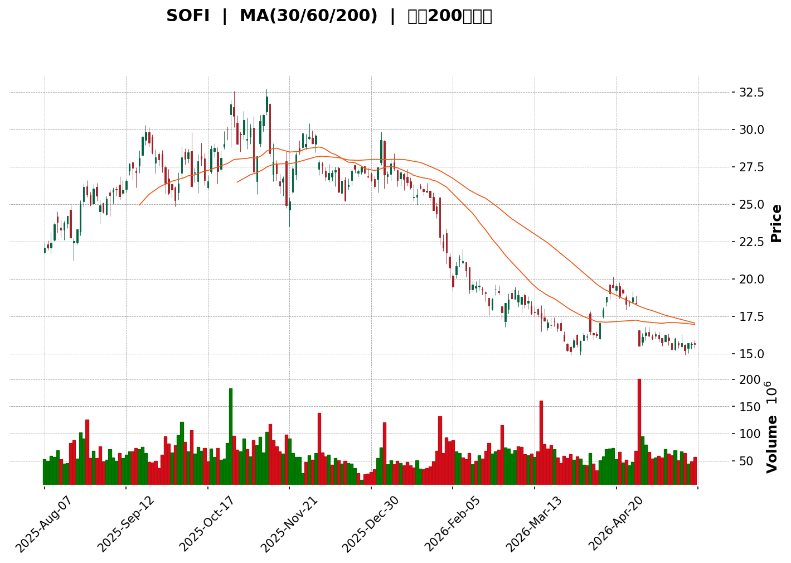
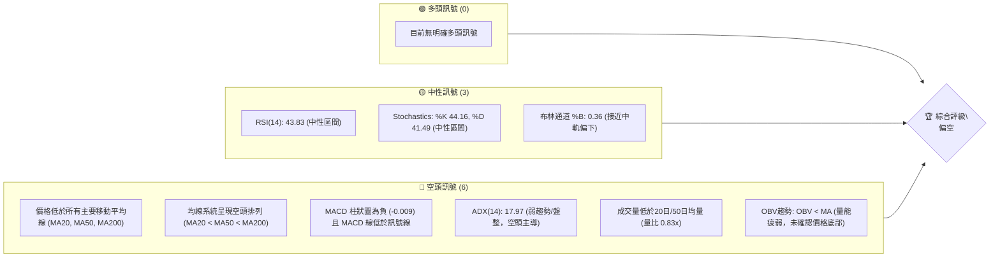
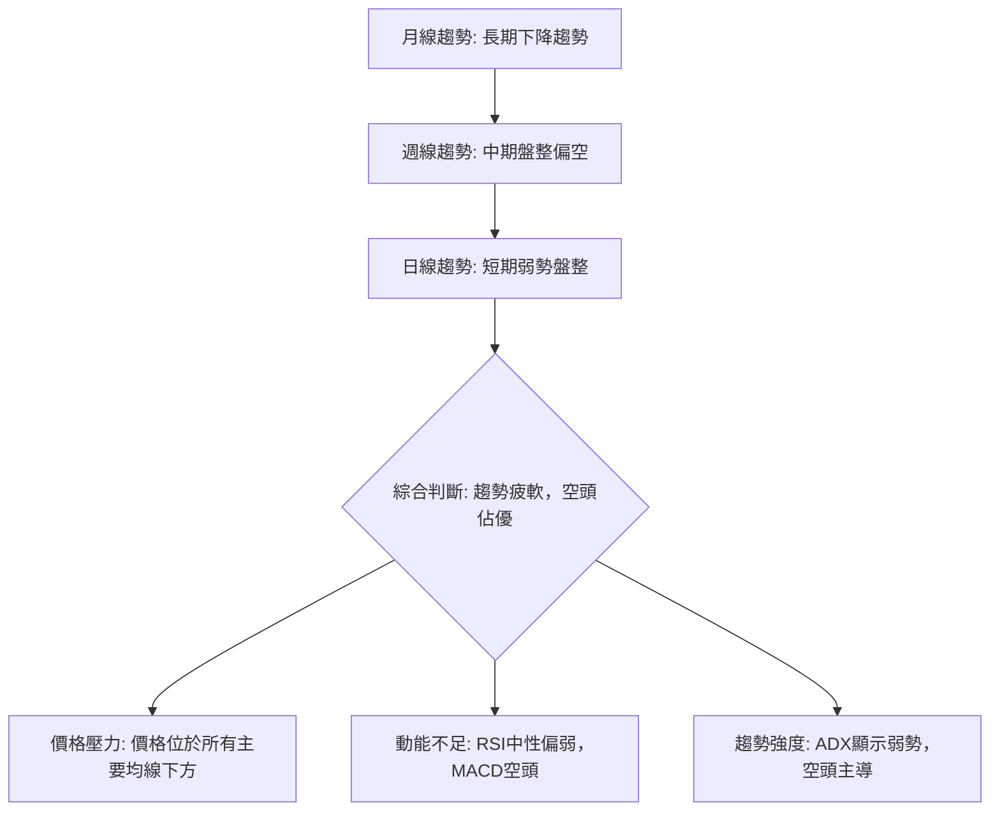
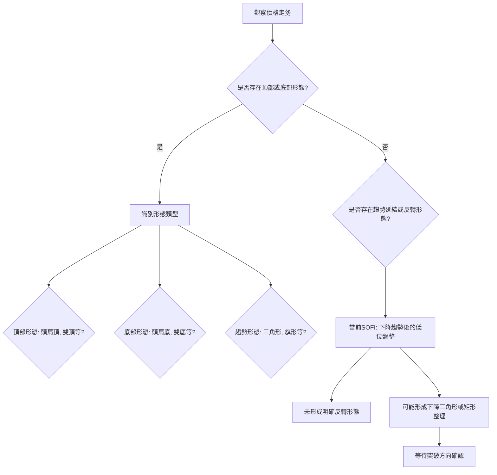
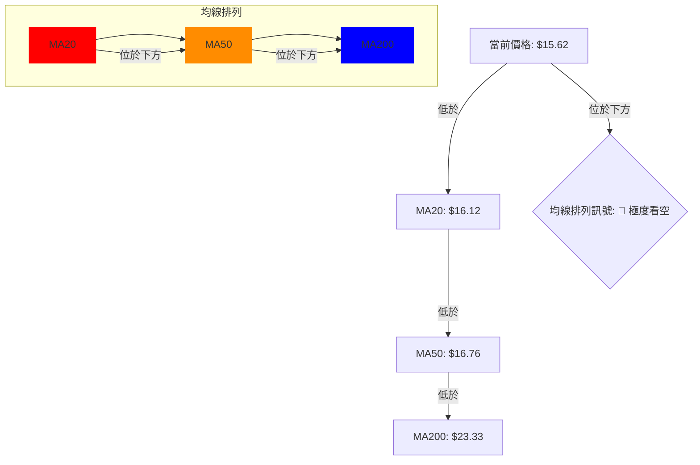

<details>
<summary>📊 靜態圖表 (點擊展開)</summary>

</details>

<html>
<head><meta charset="utf-8" /></head>
<body>
    <div>                        <script>window.PlotlyConfig = {MathJaxConfig: 'local'};</script>
        <script charset="utf-8" src="https://cdn.plot.ly/plotly-3.5.0.min.js" integrity="sha256-fHbNLP+GlIXN+efbQec78UkemUz3NJp7UmfGxC1tNxs=" crossorigin="anonymous"></script>                <div id="candlestick-chart" class="plotly-graph-div" style="height:500px; width:100%;"></div>            <script>                window.PLOTLYENV=window.PLOTLYENV || {};                                if (document.getElementById("candlestick-chart")) {                    Plotly.newPlot(                        "candlestick-chart",                        [{"close":{"dtype":"f8","bdata":"AAAA4HoUNkAAAACgmRk2QAAAACCFazZAAAAAYGamN0AAAAAgXM83QAAAAIA9SjdAAAAAwB7FN0AAAABA4To4QAAAAAAAwDZAAAAAwB6FNkAAAADgelQ3QAAAAMAeBTlAAAAAYGYmOkAAAABguJ45QAAAAIDC9ThAAAAAgD0KOkAAAACAPYo5QAAAAMD16DhAAAAAoHB9OEAAAACgR2E5QAAAAKCZmTlAAAAAgML1OUAAAADgUfg5QAAAAMAehTlAAAAAgML1OUAAAADAzIw6QAAAACCFqztAAAAAIIVrO0AAAAAA1yM7QAAAAAApHDxAAAAAYI+CPUAAAAAgXM89QAAAAEAKFz1AAAAA4KNwPEAAAABguB48QAAAAEDh+jtAAAAAwMyMO0AAAAAghWs6QAAAAGCPwjlAAAAA4FH4OUAAAACgcD05QAAAAAApXDpAAAAAANcjPEAAAADAHgU8QAAAAEAzczxAAAAA4KMwOkAAAAAA1yM7QAAAAGC43jtAAAAAIK4HPEAAAACgmZk6QAAAAIA9ijpAAAAAgBSuPEAAAAAAAMA8QAAAAOCjMDtAAAAA4HoUPEAAAABgjwI9QAAAAAAAAD5AAAAAwPWoP0AAAABgZuY+QAAAACCuBz1AAAAAgBSuPUAAAACgR6E+QAAAAGC4Xj1AAAAAgOsRPkAAAADA9Sg7QAAAAIDCNTxAAAAAgD2KPkAAAABAM\u002fM+QAAAAEDhGkBAAAAAANdjPEAAAACA69E7QAAAAIA9CjtAAAAAoHA9OkAAAADgUbg6QAAAAMD16DhAAAAA4KMwOUAAAABgZmY7QAAAAOB6VDxAAAAAoHB9PEAAAADgUbg9QAAAACCuBz1AAAAAYI+CPUAAAACA6xE9QAAAAKCZmT1AAAAAIK7HO0AAAAAAKZw7QAAAAOB61DpAAAAAQAoXO0AAAACA6xE7QAAAACCuRztAAAAAgOvROUAAAADgepQ6QAAAAMAeRTlAAAAAgD1KOkAAAACgcD07QAAAAKCZWTtAAAAA4KMwO0AAAABA4Xo7QAAAAIDrETtAAAAAgOvROkAAAAAgXI86QAAAAIAULjpAAAAAgMJ1O0AAAAAgrkc9QAAAAEDh+jpAAAAAAAAAO0AAAADgUbg7QAAAAGBmZjtAAAAAoJmZOkAAAAAA1yM7QAAAACCFqzpAAAAA4KNwOkAAAACgRyE6QAAAAKBwfTlAAAAAANejOUAAAABAChc6QAAAAKCZ2TlAAAAAwMzMOUAAAACAwnU5QAAAAKCZmThAAAAAAClcOEAAAAAgXM82QAAAAOB6FDZAAAAAYI\u002fCNUAAAAAAAMA0QAAAAIDCdTNAAAAAACncNEAAAACgmVk1QAAAAIAULjVAAAAAwMyMNEAAAADAzEwzQAAAAAApnDNAAAAAYI+CM0AAAACAPYozQAAAAMDMTDNAAAAAwB4FM0AAAADgUTgyQAAAAMD1qDJAAAAAgD1KM0AAAACgmRkzQAAAAGCPwjFAAAAAANdjMkAAAAAAKZwyQAAAAEAzszJAAAAAAABAM0AAAABgZuYyQAAAAIA9yjJAAAAAgD1KMkAAAAAgrocyQAAAAEAzszFAAAAAYI\u002fCMUAAAACgR6ExQAAAAGC4XjFAAAAAgBQuMUAAAADgehQxQAAAAGBm5jBAAAAAYGYmMUAAAABAM7MwQAAAACBcjzBAAAAAoHC9L0AAAACAwnUuQAAAAMDMTC5AAAAAYI\u002fCL0AAAABgj0IvQAAAAEAzsy9AAAAAwB5FMEAAAAAAKRwwQAAAAKBwfTBAAAAAwB5FMEAAAADgUTgwQAAAAMDMDDFAAAAAwPXoMUAAAACAPcoyQAAAACCuBzNAAAAAgBRuM0AAAAAAAIAzQAAAAOB61DJAAAAAIFwPM0AAAACA61EyQAAAAOCjcDJAAAAAYI\u002fCMkAAAAAAKVwyQAAAAMDMDC9AAAAAoJkZMEAAAACAFG4wQAAAAEAzMzBAAAAAwB4FMEAAAADAzEwwQAAAAAAAADBAAAAAAACAL0AAAABgj0IwQAAAAMDMzC9AAAAAYLieLkAAAADAHgUwQAAAAOBROC9AAAAAIIVrL0AAAACAwnUuQAAAAKBHYS9AAAAAwMxML0AAAACgcD0vQA=="},"high":{"dtype":"f8","bdata":"AAAAgBRuNkAAAACAwpU2QAAAAADXIzdAAAAAQOG6N0AAAAAAAIA4QAAAAEAz8zdAAAAAACncN0AAAABA4To4QAAAAMD16DhAAAAA4FG4NkAAAADAdl43QAAAAAAAQDlAAAAAoEdhOkAAAABA4Zo6QAAAACBczzlAAAAA4HpUOkAAAAAghWs6QAAAACCuRzlAAAAAACkcOUAAAACAPYo5QAAAAOBR+DlAAAAAoJkZOkAAAADgozA6QAAAAEDh2jpAAAAAoJmZOkAAAADgo7A6QAAAAMAexTtAAAAAoEfhO0AAAACAwnU7QAAAAEC2kzxAAAAAoEehPUAAAADAzEw+QAAAAADXIz5AAAAAIIWrPUAAAAAghas8QAAAAEDhejxAAAAAoEehPEAAAAAAKZw7QAAAAOB6VDtAAAAAoJlZOkAAAACAFC46QAAAAADXIztAAAAAQArXPEAAAACAwrU8QAAAAOCjsDxAAAAAwMzMPUAAAACAFG47QAAAAKCZWTxAAAAAQAoXPUAAAADgo3A8QAAAACCF6zpAAAAAgBTuPEAAAACA6xE9QAAAAMDMzDxAAAAA4FGYPEAAAABguN49QAAAAEAzMz5AAAAAQOH6P0AAAADgUUhAQAAAAIA96j5AAAAAACncPUAAAADgUTg\u002fQAAAAIA9yj5AAAAAYLhePkAAAABg59s+QAAAAKBwPTxAAAAA4FH4PkAAAACgcP0+QAAAAKBwXUBAAAAAAADAP0AAAACA6xE9QAAAAEAz8ztAAAAAAAAAO0AAAACgmdk6QAAAAEAzkzxAAAAAgOtxOUAAAAAAKZw7QAAAAEAzczxAAAAAAABAPUAAAAAAAMA9QAAAAEAzsz1AAAAAIIVrPkAAAACAFO49QAAAAEAzsz1AAAAAgBTuO0AAAADgetQ7QAAAAEAzcztAAAAAgBSuO0AAAAAgrkc7QAAAAAAAgDtAAAAAQOF6O0AAAACgcL06QAAAAIDC1TpAAAAAQAq3OkAAAABguF47QAAAAGC4njtAAAAAQApXO0AAAACAPYo7QAAAAMDMjDtAAAAAwPVoO0AAAAAA1yM7QAAAAGBm5jpAAAAAoEeBO0AAAAAAKdw9QAAAAMDMTD1AAAAAgBQuO0AAAACAFA48QAAAAAAAYDxAAAAAYOVQO0AAAABAMzM7QAAAAIDCFTtAAAAA4HpUO0AAAAAgrsc6QAAAAEAKVzpAAAAAwMwMOkAAAAAA12M6QAAAAKBHITpAAAAAYGZmOkAAAACAFO45QAAAAIA9yjlAAAAAYLgeOUAAAADgUXg5QAAAAAAAADdAAAAAAClcN0AAAAAA18M1QAAAAGBmZjRAAAAAwPUoNUAAAABACpc1QAAAAAAAADZAAAAAoJkZNUAAAACAPco0QAAAAGC43jNAAAAAQArXM0AAAABgjwI0QAAAAEDhejNAAAAA4KMwM0AAAACgR8EyQAAAAIDCtTJAAAAAYLieM0AAAAAgXI8zQAAAAIDCNTJAAAAAwPVoMkAAAACAPQozQAAAACCuRzNAAAAAQOF6M0AAAABguD4zQAAAAIDr8TJAAAAAYGYGM0AAAACgmdkyQAAAAMDMjDJAAAAAYGYmMkAAAACA6xEyQAAAAKBHQTJAAAAAIK4HMkAAAAAghUsxQAAAAMByaDFAAAAAwPVoMUAAAACA6xExQAAAAEAKVzFAAAAAoHB9MEAAAACgR2EvQAAAAKBHIS9AAAAAYGYGMEAAAACA61EwQAAAACCuxy9AAAAAwMxsMEAAAABA4VowQAAAAKCZ2TFAAAAA4FF4MEAAAACgcH0wQAAAACBcDzFAAAAAQDMTMkAAAACA69EyQAAAAGC4njNAAAAAoEchNEAAAADAHqUzQAAAAMAexTNAAAAAILByM0AAAABgZuYyQAAAAEAzkzJAAAAAIIUrM0AAAABguN4yQAAAAEAKlzBAAAAAYLheMEAAAAAghcswQAAAACCuxzBAAAAAIFxPMEAAAACgR4EwQAAAAIDCdTBAAAAAwMwMMEAAAACA61EwQAAAAOB6VDBAAAAAIIVrL0AAAADgoxAwQAAAAIAUri9AAAAAgOtRMEAAAAAgrkcvQAAAAOCjcC9AAAAAgOuRL0AAAAAAKdwvQA=="},"hovertemplate":"\u003cb\u003e%{x|%Y-%m-%d}\u003c\u002fb\u003e\u003cbr\u003e\u958b: $%{open:.2f}\u003cbr\u003e\u9ad8: $%{high:.2f}\u003cbr\u003e\u4f4e: $%{low:.2f}\u003cbr\u003e\u6536: $%{close:.2f}\u003cextra\u003e\u003c\u002fextra\u003e","low":{"dtype":"f8","bdata":"AAAAgBSuNUAAAABAM\u002fM1QAAAAEAKtzVAAAAAwB6FNkAAAABAChc3QAAAAKBwvTZAAAAAACmcNkAAAADA9Wg3QAAAAOCjsDZAAAAAgMI1NUAAAAAgXE82QAAAAGBm5jZAAAAAIFzPOEAAAAAAAIA5QAAAAKBH4ThAAAAAAAAAOUAAAACAwjU5QAAAAEAzszdAAAAAANdjOEAAAAAgsj04QAAAAIAULjhAAAAAwMwMOUAAAADAzIw5QAAAAMDMTDlAAAAAYLieOUAAAADAHsU5QAAAACBc7zpAAAAAoEehOkAAAACgRyE6QAAAAOB6FDtAAAAAoHA9PEAAAADgUfg8QAAAAKCZ2TxAAAAAoJlZPEAAAAAgXA87QAAAACBcjztAAAAAACkcO0AAAABAM7M5QAAAAADXozlAAAAAQDNzOUAAAABACtc4QAAAACBcTzlAAAAAgBSuOkAAAADAHqU7QAAAAAAAwDtAAAAAoEchOkAAAADgUXg6QAAAAAAAwDlAAAAAIFyPO0AAAAAAAEA6QAAAAGCPAjpAAAAAIFwPO0AAAABgZiY8QAAAAKBHYTpAAAAAoPEyO0AAAABAM7M8QAAAAMAeRT1AAAAAwMzMPEAAAAAA1yM+QAAAAEDh+jxAAAAAoHB9PEAAAADgelQ9QAAAAOCjsDxAAAAAYI8CPUAAAACgRyE7QAAAAMD1qDlAAAAAQArXPEAAAADgIts9QAAAAIDC9T5AAAAAYGYmPEAAAAAgroc6QAAAAMDMjDpAAAAAgMK1OUAAAAAgXI85QAAAAGC4vjhAAAAAwB6FN0AAAAAgrqc5QAAAAKBHoTpAAAAAIFxPPEAAAADgenQ8QAAAACCFqzxAAAAA4KNQPUAAAADAHgU9QAAAAEDhejxAAAAAgBTuOkAAAADAzAw7QAAAAMDMjDpAAAAAQOF6OkAAAACAFI46QAAAAEAzMzpAAAAAgD3KOUAAAADgUbg5QAAAACCFKzlAAAAAQDPzOUAAAAAgrkc6QAAAAKCZGTtAAAAAQDPTOkAAAAAgrgc7QAAAACCuBztAAAAAoHC9OkAAAACAPYo6QAAAACBcDzpAAAAAgD3KOUAAAACgmZk7QAAAACCuBzpAAAAAoHBdOkAAAACA65E6QAAAAEDhOjtAAAAAQDMzOkAAAADgUTg6QAAAACCF6zlAAAAAgMI1OkAAAABgjwI6QAAAAIDCNTlAAAAAQDPzOEAAAAAAAAA6QAAAAKCZmTlAAAAAwB7FOUAAAACAwjU5QAAAAIDrkThAAAAAwMwMOEAAAAAgXE82QAAAAAAp3DVAAAAAwB4FNUAAAACA6xE0QAAAAACqMTNAAAAAgD0KNEAAAADAzMw0QAAAAMDMDDVAAAAAANcjNEAAAACAPQozQAAAAGBmJjNAAAAAACkcM0AAAACgmTkzQAAAAOBR+DJAAAAAANeDMkAAAADgepQxQAAAAADX4zFAAAAAgBTuMkAAAADgUfgyQAAAACBcTzFAAAAAwMzMMEAAAADgo7AxQAAAAAApnDJAAAAAANejMkAAAABguB4yQAAAAMAexTFAAAAAgD0KMkAAAADgUfgxQAAAAGC4njFAAAAAIK6HMUAAAADgUXgxQAAAAEDhejBAAAAAwPUoMUAAAADgepQwQAAAACCFqzBAAAAAQArXMEAAAACgcH0wQAAAAMAehTBAAAAAACmcL0AAAADAzEwuQAAAAGC43i1AAAAAYLieLkAAAACgR+EuQAAAAAAp3C1AAAAAYI\u002fCL0AAAACA69EvQAAAAGCPQjBAAAAA4HrUL0AAAADgURgwQAAAACCF6y9AAAAAYGZmMUAAAAAghSsyQAAAAGBmpjJAAAAAANdjM0AAAABAChczQAAAAOCjsDJAAAAAwPXoMkAAAACAFO4xQAAAAIDAKjJAAAAAANdjMkAAAADAHkUyQAAAAAAAAC9AAAAA4HoUL0AAAAAAAMAvQAAAAKBHITBAAAAAoEfhL0AAAABA4fovQAAAAMD1qC9AAAAAgD0KL0AAAACAPYovQAAAAKCZGS9AAAAAgBRuLkAAAACAwnUuQAAAAGCPwi5AAAAAgBSuLkAAAABACtctQAAAACBcDy5AAAAAQDOzLkAAAADgUbguQA=="},"name":"\u50f9\u683c","open":{"dtype":"f8","bdata":"AAAAgD3KNUAAAADAzEw2QAAAAKCZGTZAAAAAYLieNkAAAACAFC44QAAAACCFazdAAAAAgD1KN0AAAADgo7A3QAAAAAApnDhAAAAAIIVrNkAAAADgo3A2QAAAAMD1KDdAAAAAgBQuOUAAAADgejQ6QAAAAKBwnTlAAAAAwB4FOUAAAADA9Sg6QAAAAAAAgDhAAAAAIFwPOUAAAADgelQ4QAAAAMAexTlAAAAAIFzPOUAAAADAHgU6QAAAAIA9SjpAAAAAYI\u002fCOUAAAAAAAAA6QAAAAAAAQDtAAAAAgD3KO0AAAAAAAEA7QAAAAEAKlztAAAAAANdDPEAAAADAzEw9QAAAAIAUzj1AAAAAAACAPUAAAABgj8I7QAAAAGC4XjxAAAAAAClcPEAAAADgUXg7QAAAAEDhujpAAAAA4HpUOkAAAACgmRk6QAAAAMAexTlAAAAAoJkZO0AAAACgcH08QAAAAIA9CjxAAAAAwMyMPEAAAACA6xE7QAAAAGCPgjpAAAAAQDMzPEAAAACA6xE8QAAAAKCZGTpAAAAAQDMzO0AAAAAgXI88QAAAAKBwfTxAAAAA4HpUO0AAAADgUdg8QAAAAAAAAD5AAAAAoHD9PkAAAABguH4\u002fQAAAACBcbz5AAAAA4KOwPUAAAADA9ag9QAAAACCFSz1AAAAAwB6FPUAAAAAAACA+QAAAAGBmhjpAAAAAIFwPPUAAAABguD4+QAAAAIAULj9AAAAAQOG6P0AAAAAAAAA7QAAAAIDCtTtAAAAAYI+COkAAAACgmXk6QAAAAKBH4TtAAAAAoEehOEAAAADgetQ5QAAAAEDh+jpAAAAAgMK1PEAAAACAPco8QAAAAOB61DxAAAAAANdjPUAAAADAzGw9QAAAAMD1CD1AAAAAoHBdO0AAAABA4bo7QAAAAKBwPTtAAAAAYGamOkAAAABACtc6QAAAAMAeJTtAAAAAIFxvO0AAAACgcL05QAAAAADXozpAAAAAgBQuOkAAAABguJ46QAAAAOBRmDtAAAAAgOsRO0AAAAAghSs7QAAAAIA9ijtAAAAAYLjeOkAAAAAgrgc7QAAAAIAUrjpAAAAAwPWoOkAAAAAgXM87QAAAAEDhOj1AAAAAoHDdOkAAAAAAAAA7QAAAAIAUzjtAAAAAgD1KO0AAAABAM7M6QAAAAAAAADtAAAAAIFzPOkAAAACAPYo6QAAAAOCjcDlAAAAAAACAOUAAAACAFC46QAAAAAAAADpAAAAAYGbmOUAAAABgZuY5QAAAAAAAgDlAAAAAoHDdOEAAAACAFG45QAAAAGCPgjZAAAAAwMwMN0AAAACgcH01QAAAAEDhOjRAAAAAgD1KNEAAAACAPUo1QAAAAEAKFzVAAAAAoJkZNUAAAACAPco0QAAAACCuRzNAAAAAwPVoM0AAAADgUXgzQAAAAOB6VDNAAAAAgMIVM0AAAABA4boyQAAAAAAAADJAAAAAIK5HM0AAAADgozAzQAAAAMD1KDJAAAAAwB4lMUAAAAAAAAAyQAAAACBcDzNAAAAAYGamMkAAAAAAKXwyQAAAAOB6VDJAAAAAIIXrMkAAAAAA12MyQAAAAOBRODJAAAAAwMzMMUAAAAAAAAAyQAAAAOBRuDFAAAAAgBRuMUAAAAAAAMAwQAAAAIA96jBAAAAAIK4nMUAAAABguP4wQAAAAIA9CjFAAAAAYGZGMEAAAABAClcvQAAAAAAp3C5AAAAAYGbmLkAAAABgZkYwQAAAAKBHYS5AAAAAIK7HL0AAAADA9SgwQAAAAIAUrjFAAAAAANdjMEAAAADAzEwwQAAAAAAAADBAAAAAIK6HMUAAAADgUXgyQAAAAGC4njNAAAAAoJmZM0AAAABgj0IzQAAAAGCPgjNAAAAAgD1KM0AAAADAHsUyQAAAAOCjcDJAAAAAQOF6MkAAAADAHmUyQAAAAMDMjDBAAAAAgD2KL0AAAAAAKTwwQAAAAOBReDBAAAAAIIUrMEAAAABAMzMwQAAAAGCPQjBAAAAAIK4HMEAAAACgmZkvQAAAAIDrETBAAAAAIIVrL0AAAABguJ4uQAAAAGBmZi9AAAAAgML1LkAAAACAwjUvQAAAAEDhui5AAAAAoHA9L0AAAAAghWsvQA=="},"x":["2025-08-07T00:00:00-04:00","2025-08-08T00:00:00-04:00","2025-08-11T00:00:00-04:00","2025-08-12T00:00:00-04:00","2025-08-13T00:00:00-04:00","2025-08-14T00:00:00-04:00","2025-08-15T00:00:00-04:00","2025-08-18T00:00:00-04:00","2025-08-19T00:00:00-04:00","2025-08-20T00:00:00-04:00","2025-08-21T00:00:00-04:00","2025-08-22T00:00:00-04:00","2025-08-25T00:00:00-04:00","2025-08-26T00:00:00-04:00","2025-08-27T00:00:00-04:00","2025-08-28T00:00:00-04:00","2025-08-29T00:00:00-04:00","2025-09-02T00:00:00-04:00","2025-09-03T00:00:00-04:00","2025-09-04T00:00:00-04:00","2025-09-05T00:00:00-04:00","2025-09-08T00:00:00-04:00","2025-09-09T00:00:00-04:00","2025-09-10T00:00:00-04:00","2025-09-11T00:00:00-04:00","2025-09-12T00:00:00-04:00","2025-09-15T00:00:00-04:00","2025-09-16T00:00:00-04:00","2025-09-17T00:00:00-04:00","2025-09-18T00:00:00-04:00","2025-09-19T00:00:00-04:00","2025-09-22T00:00:00-04:00","2025-09-23T00:00:00-04:00","2025-09-24T00:00:00-04:00","2025-09-25T00:00:00-04:00","2025-09-26T00:00:00-04:00","2025-09-29T00:00:00-04:00","2025-09-30T00:00:00-04:00","2025-10-01T00:00:00-04:00","2025-10-02T00:00:00-04:00","2025-10-03T00:00:00-04:00","2025-10-06T00:00:00-04:00","2025-10-07T00:00:00-04:00","2025-10-08T00:00:00-04:00","2025-10-09T00:00:00-04:00","2025-10-10T00:00:00-04:00","2025-10-13T00:00:00-04:00","2025-10-14T00:00:00-04:00","2025-10-15T00:00:00-04:00","2025-10-16T00:00:00-04:00","2025-10-17T00:00:00-04:00","2025-10-20T00:00:00-04:00","2025-10-21T00:00:00-04:00","2025-10-22T00:00:00-04:00","2025-10-23T00:00:00-04:00","2025-10-24T00:00:00-04:00","2025-10-27T00:00:00-04:00","2025-10-28T00:00:00-04:00","2025-10-29T00:00:00-04:00","2025-10-30T00:00:00-04:00","2025-10-31T00:00:00-04:00","2025-11-03T00:00:00-05:00","2025-11-04T00:00:00-05:00","2025-11-05T00:00:00-05:00","2025-11-06T00:00:00-05:00","2025-11-07T00:00:00-05:00","2025-11-10T00:00:00-05:00","2025-11-11T00:00:00-05:00","2025-11-12T00:00:00-05:00","2025-11-13T00:00:00-05:00","2025-11-14T00:00:00-05:00","2025-11-17T00:00:00-05:00","2025-11-18T00:00:00-05:00","2025-11-19T00:00:00-05:00","2025-11-20T00:00:00-05:00","2025-11-21T00:00:00-05:00","2025-11-24T00:00:00-05:00","2025-11-25T00:00:00-05:00","2025-11-26T00:00:00-05:00","2025-11-28T00:00:00-05:00","2025-12-01T00:00:00-05:00","2025-12-02T00:00:00-05:00","2025-12-03T00:00:00-05:00","2025-12-04T00:00:00-05:00","2025-12-05T00:00:00-05:00","2025-12-08T00:00:00-05:00","2025-12-09T00:00:00-05:00","2025-12-10T00:00:00-05:00","2025-12-11T00:00:00-05:00","2025-12-12T00:00:00-05:00","2025-12-15T00:00:00-05:00","2025-12-16T00:00:00-05:00","2025-12-17T00:00:00-05:00","2025-12-18T00:00:00-05:00","2025-12-19T00:00:00-05:00","2025-12-22T00:00:00-05:00","2025-12-23T00:00:00-05:00","2025-12-24T00:00:00-05:00","2025-12-26T00:00:00-05:00","2025-12-29T00:00:00-05:00","2025-12-30T00:00:00-05:00","2025-12-31T00:00:00-05:00","2026-01-02T00:00:00-05:00","2026-01-05T00:00:00-05:00","2026-01-06T00:00:00-05:00","2026-01-07T00:00:00-05:00","2026-01-08T00:00:00-05:00","2026-01-09T00:00:00-05:00","2026-01-12T00:00:00-05:00","2026-01-13T00:00:00-05:00","2026-01-14T00:00:00-05:00","2026-01-15T00:00:00-05:00","2026-01-16T00:00:00-05:00","2026-01-20T00:00:00-05:00","2026-01-21T00:00:00-05:00","2026-01-22T00:00:00-05:00","2026-01-23T00:00:00-05:00","2026-01-26T00:00:00-05:00","2026-01-27T00:00:00-05:00","2026-01-28T00:00:00-05:00","2026-01-29T00:00:00-05:00","2026-01-30T00:00:00-05:00","2026-02-02T00:00:00-05:00","2026-02-03T00:00:00-05:00","2026-02-04T00:00:00-05:00","2026-02-05T00:00:00-05:00","2026-02-06T00:00:00-05:00","2026-02-09T00:00:00-05:00","2026-02-10T00:00:00-05:00","2026-02-11T00:00:00-05:00","2026-02-12T00:00:00-05:00","2026-02-13T00:00:00-05:00","2026-02-17T00:00:00-05:00","2026-02-18T00:00:00-05:00","2026-02-19T00:00:00-05:00","2026-02-20T00:00:00-05:00","2026-02-23T00:00:00-05:00","2026-02-24T00:00:00-05:00","2026-02-25T00:00:00-05:00","2026-02-26T00:00:00-05:00","2026-02-27T00:00:00-05:00","2026-03-02T00:00:00-05:00","2026-03-03T00:00:00-05:00","2026-03-04T00:00:00-05:00","2026-03-05T00:00:00-05:00","2026-03-06T00:00:00-05:00","2026-03-09T00:00:00-04:00","2026-03-10T00:00:00-04:00","2026-03-11T00:00:00-04:00","2026-03-12T00:00:00-04:00","2026-03-13T00:00:00-04:00","2026-03-16T00:00:00-04:00","2026-03-17T00:00:00-04:00","2026-03-18T00:00:00-04:00","2026-03-19T00:00:00-04:00","2026-03-20T00:00:00-04:00","2026-03-23T00:00:00-04:00","2026-03-24T00:00:00-04:00","2026-03-25T00:00:00-04:00","2026-03-26T00:00:00-04:00","2026-03-27T00:00:00-04:00","2026-03-30T00:00:00-04:00","2026-03-31T00:00:00-04:00","2026-04-01T00:00:00-04:00","2026-04-02T00:00:00-04:00","2026-04-06T00:00:00-04:00","2026-04-07T00:00:00-04:00","2026-04-08T00:00:00-04:00","2026-04-09T00:00:00-04:00","2026-04-10T00:00:00-04:00","2026-04-13T00:00:00-04:00","2026-04-14T00:00:00-04:00","2026-04-15T00:00:00-04:00","2026-04-16T00:00:00-04:00","2026-04-17T00:00:00-04:00","2026-04-20T00:00:00-04:00","2026-04-21T00:00:00-04:00","2026-04-22T00:00:00-04:00","2026-04-23T00:00:00-04:00","2026-04-24T00:00:00-04:00","2026-04-27T00:00:00-04:00","2026-04-28T00:00:00-04:00","2026-04-29T00:00:00-04:00","2026-04-30T00:00:00-04:00","2026-05-01T00:00:00-04:00","2026-05-04T00:00:00-04:00","2026-05-05T00:00:00-04:00","2026-05-06T00:00:00-04:00","2026-05-07T00:00:00-04:00","2026-05-08T00:00:00-04:00","2026-05-11T00:00:00-04:00","2026-05-12T00:00:00-04:00","2026-05-13T00:00:00-04:00","2026-05-14T00:00:00-04:00","2026-05-15T00:00:00-04:00","2026-05-18T00:00:00-04:00","2026-05-19T00:00:00-04:00","2026-05-20T00:00:00-04:00","2026-05-21T00:00:00-04:00","2026-05-22T00:00:00-04:00"],"type":"candlestick"},{"hovertemplate":"MA30: $%{y:.2f}\u003cextra\u003e\u003c\u002fextra\u003e","line":{"color":"#2196F3","dash":"dash","width":2},"mode":"lines","name":"MA30","x":["2025-08-07T00:00:00-04:00","2025-08-08T00:00:00-04:00","2025-08-11T00:00:00-04:00","2025-08-12T00:00:00-04:00","2025-08-13T00:00:00-04:00","2025-08-14T00:00:00-04:00","2025-08-15T00:00:00-04:00","2025-08-18T00:00:00-04:00","2025-08-19T00:00:00-04:00","2025-08-20T00:00:00-04:00","2025-08-21T00:00:00-04:00","2025-08-22T00:00:00-04:00","2025-08-25T00:00:00-04:00","2025-08-26T00:00:00-04:00","2025-08-27T00:00:00-04:00","2025-08-28T00:00:00-04:00","2025-08-29T00:00:00-04:00","2025-09-02T00:00:00-04:00","2025-09-03T00:00:00-04:00","2025-09-04T00:00:00-04:00","2025-09-05T00:00:00-04:00","2025-09-08T00:00:00-04:00","2025-09-09T00:00:00-04:00","2025-09-10T00:00:00-04:00","2025-09-11T00:00:00-04:00","2025-09-12T00:00:00-04:00","2025-09-15T00:00:00-04:00","2025-09-16T00:00:00-04:00","2025-09-17T00:00:00-04:00","2025-09-18T00:00:00-04:00","2025-09-19T00:00:00-04:00","2025-09-22T00:00:00-04:00","2025-09-23T00:00:00-04:00","2025-09-24T00:00:00-04:00","2025-09-25T00:00:00-04:00","2025-09-26T00:00:00-04:00","2025-09-29T00:00:00-04:00","2025-09-30T00:00:00-04:00","2025-10-01T00:00:00-04:00","2025-10-02T00:00:00-04:00","2025-10-03T00:00:00-04:00","2025-10-06T00:00:00-04:00","2025-10-07T00:00:00-04:00","2025-10-08T00:00:00-04:00","2025-10-09T00:00:00-04:00","2025-10-10T00:00:00-04:00","2025-10-13T00:00:00-04:00","2025-10-14T00:00:00-04:00","2025-10-15T00:00:00-04:00","2025-10-16T00:00:00-04:00","2025-10-17T00:00:00-04:00","2025-10-20T00:00:00-04:00","2025-10-21T00:00:00-04:00","2025-10-22T00:00:00-04:00","2025-10-23T00:00:00-04:00","2025-10-24T00:00:00-04:00","2025-10-27T00:00:00-04:00","2025-10-28T00:00:00-04:00","2025-10-29T00:00:00-04:00","2025-10-30T00:00:00-04:00","2025-10-31T00:00:00-04:00","2025-11-03T00:00:00-05:00","2025-11-04T00:00:00-05:00","2025-11-05T00:00:00-05:00","2025-11-06T00:00:00-05:00","2025-11-07T00:00:00-05:00","2025-11-10T00:00:00-05:00","2025-11-11T00:00:00-05:00","2025-11-12T00:00:00-05:00","2025-11-13T00:00:00-05:00","2025-11-14T00:00:00-05:00","2025-11-17T00:00:00-05:00","2025-11-18T00:00:00-05:00","2025-11-19T00:00:00-05:00","2025-11-20T00:00:00-05:00","2025-11-21T00:00:00-05:00","2025-11-24T00:00:00-05:00","2025-11-25T00:00:00-05:00","2025-11-26T00:00:00-05:00","2025-11-28T00:00:00-05:00","2025-12-01T00:00:00-05:00","2025-12-02T00:00:00-05:00","2025-12-03T00:00:00-05:00","2025-12-04T00:00:00-05:00","2025-12-05T00:00:00-05:00","2025-12-08T00:00:00-05:00","2025-12-09T00:00:00-05:00","2025-12-10T00:00:00-05:00","2025-12-11T00:00:00-05:00","2025-12-12T00:00:00-05:00","2025-12-15T00:00:00-05:00","2025-12-16T00:00:00-05:00","2025-12-17T00:00:00-05:00","2025-12-18T00:00:00-05:00","2025-12-19T00:00:00-05:00","2025-12-22T00:00:00-05:00","2025-12-23T00:00:00-05:00","2025-12-24T00:00:00-05:00","2025-12-26T00:00:00-05:00","2025-12-29T00:00:00-05:00","2025-12-30T00:00:00-05:00","2025-12-31T00:00:00-05:00","2026-01-02T00:00:00-05:00","2026-01-05T00:00:00-05:00","2026-01-06T00:00:00-05:00","2026-01-07T00:00:00-05:00","2026-01-08T00:00:00-05:00","2026-01-09T00:00:00-05:00","2026-01-12T00:00:00-05:00","2026-01-13T00:00:00-05:00","2026-01-14T00:00:00-05:00","2026-01-15T00:00:00-05:00","2026-01-16T00:00:00-05:00","2026-01-20T00:00:00-05:00","2026-01-21T00:00:00-05:00","2026-01-22T00:00:00-05:00","2026-01-23T00:00:00-05:00","2026-01-26T00:00:00-05:00","2026-01-27T00:00:00-05:00","2026-01-28T00:00:00-05:00","2026-01-29T00:00:00-05:00","2026-01-30T00:00:00-05:00","2026-02-02T00:00:00-05:00","2026-02-03T00:00:00-05:00","2026-02-04T00:00:00-05:00","2026-02-05T00:00:00-05:00","2026-02-06T00:00:00-05:00","2026-02-09T00:00:00-05:00","2026-02-10T00:00:00-05:00","2026-02-11T00:00:00-05:00","2026-02-12T00:00:00-05:00","2026-02-13T00:00:00-05:00","2026-02-17T00:00:00-05:00","2026-02-18T00:00:00-05:00","2026-02-19T00:00:00-05:00","2026-02-20T00:00:00-05:00","2026-02-23T00:00:00-05:00","2026-02-24T00:00:00-05:00","2026-02-25T00:00:00-05:00","2026-02-26T00:00:00-05:00","2026-02-27T00:00:00-05:00","2026-03-02T00:00:00-05:00","2026-03-03T00:00:00-05:00","2026-03-04T00:00:00-05:00","2026-03-05T00:00:00-05:00","2026-03-06T00:00:00-05:00","2026-03-09T00:00:00-04:00","2026-03-10T00:00:00-04:00","2026-03-11T00:00:00-04:00","2026-03-12T00:00:00-04:00","2026-03-13T00:00:00-04:00","2026-03-16T00:00:00-04:00","2026-03-17T00:00:00-04:00","2026-03-18T00:00:00-04:00","2026-03-19T00:00:00-04:00","2026-03-20T00:00:00-04:00","2026-03-23T00:00:00-04:00","2026-03-24T00:00:00-04:00","2026-03-25T00:00:00-04:00","2026-03-26T00:00:00-04:00","2026-03-27T00:00:00-04:00","2026-03-30T00:00:00-04:00","2026-03-31T00:00:00-04:00","2026-04-01T00:00:00-04:00","2026-04-02T00:00:00-04:00","2026-04-06T00:00:00-04:00","2026-04-07T00:00:00-04:00","2026-04-08T00:00:00-04:00","2026-04-09T00:00:00-04:00","2026-04-10T00:00:00-04:00","2026-04-13T00:00:00-04:00","2026-04-14T00:00:00-04:00","2026-04-15T00:00:00-04:00","2026-04-16T00:00:00-04:00","2026-04-17T00:00:00-04:00","2026-04-20T00:00:00-04:00","2026-04-21T00:00:00-04:00","2026-04-22T00:00:00-04:00","2026-04-23T00:00:00-04:00","2026-04-24T00:00:00-04:00","2026-04-27T00:00:00-04:00","2026-04-28T00:00:00-04:00","2026-04-29T00:00:00-04:00","2026-04-30T00:00:00-04:00","2026-05-01T00:00:00-04:00","2026-05-04T00:00:00-04:00","2026-05-05T00:00:00-04:00","2026-05-06T00:00:00-04:00","2026-05-07T00:00:00-04:00","2026-05-08T00:00:00-04:00","2026-05-11T00:00:00-04:00","2026-05-12T00:00:00-04:00","2026-05-13T00:00:00-04:00","2026-05-14T00:00:00-04:00","2026-05-15T00:00:00-04:00","2026-05-18T00:00:00-04:00","2026-05-19T00:00:00-04:00","2026-05-20T00:00:00-04:00","2026-05-21T00:00:00-04:00","2026-05-22T00:00:00-04:00"],"y":{"dtype":"f8","bdata":"AAAAAAAA+H8AAAAAAAD4fwAAAAAAAPh\u002fAAAAAAAA+H8AAAAAAAD4fwAAAAAAAPh\u002fAAAAAAAA+H8AAAAAAAD4fwAAAAAAAPh\u002fAAAAAAAA+H8AAAAAAAD4fwAAAAAAAPh\u002fAAAAAAAA+H8AAAAAAAD4fwAAAAAAAPh\u002fAAAAAAAA+H8AAAAAAAD4fwAAAAAAAPh\u002fAAAAAAAA+H8AAAAAAAD4fwAAAAAAAPh\u002fAAAAAAAA+H8AAAAAAAD4fwAAAAAAAPh\u002fAAAAAAAA+H8AAAAAAAD4fwAAAAAAAPh\u002fAAAAAAAA+H8AAAAAAAD4f83MzIyX7jhAIiIiov4tOUAiIiJiyW85QImIiDi0qDlAMzMzI5TROUCrqqp6W\u002fY5QAAAAPBgHjpAiYiIeKI+OkCamZmZUlE6QLy7uwsCazpA7+7urnKIOkBEREQkv5g6QKuqqmoupDpAMzMzoym1OkBERESEpMk6QKuqqops5zpAiYiIOLToOkCJiIh4W\u002fY6QBEREbGdDztAERER8dItO0AzMzMTPDg7QJqZmYlBQDtAiYiIeHdXO0CamZl5MG87QFVVVaVwfTtAvLu724ePO0AAAADQhaQ7QGZmZsZnuDtAIiIiMpbcO0CrqqoKrPw7QAAAANCFBDxA7+7uLvkFPEAAAACA+Aw8QLy7uytcDzxAVVVV9UQdPEDe3d3NExU8QO\u002fu7j4KFzxAERERAY4wPEARERHxNVc8QN7d3S1AjjxAAAAAwOaiPECJiIjY6rg8QERERFS4vjxAd3d3t4GuPEAiIiLSaaM8QCIiIpI0hTxAmpmZCax8PEBEREQE5H48QGZmZubQgjxAiYiIyL2GPEBmZmaGXaE8QDMzMwOdtjxAzczMLLK9PECamZk5bcA8QDMzM\u002fP91DxAd3d3l27SPEDv7u4+fMY8QGZmZkZvqzxAVVVV9W+EPEAiIiIywWM8QDMzM0PSVDxAZmZm9uEzPECrqqqaUhE8QERERARW7jtAvLu7exTOO0Dv7u4+w847QM3MzIxsxztAzczMXNaqO0B3d3cHOo07QHd3d4ddYTtAAAAA0PdTO0DNzMxMN0k7QJqZmZngQTtAq6qquklMO0AzMzMjImI7QO\u002fu7h7McztAAAAAID6DO0DNzMws+YU7QO\u002fu7o4JfjtAq6qqyuhtO0AiIiKy5Fc7QCIiIjLBQztA3t3drY4pO0BmZmYmeBA7QHd3d7dl7TpAAAAA0CLbOkAiIiJSKs46QKuqqnrNxTpA3t3dbcu6OkBERERUDq06QHd3d8cvljpAzczMXLqJOkC8u7urjmk6QCIiIgJWTjpAIiIiEq4nOkAzMzNzTPA5QKuqqnr4rDlAIiIiYvR2OUAiIiIypUI5QLy7u0tiEDlAVVVVReHaOEDv7u6O7Zw4QM3MzCzdZDhAMzMzIwYhOECJiIjI6M03QBEREZFfjDdA3t3d\u002fUZIN0DNzMzsNfc2QKuqqhqhrDZAq6qqKkBuNkBVVVWFpCk2QERERFSc3TVAVVVV1eqYNUBVVVUlv1g1QKuqqirOHjVAAAAAAEfoNEBEREQ07Ko0QGZmZmatbjRA7+7ujpcuNEDv7u6+dPMzQHd3d3eTuDNAvLu7i0GAM0CamZmpDVQzQDMzM4PcKzNAmpmZWccEM0DNzMwcduUyQFVVVbWdzzJAZmZmFvWvMkAiIiICR4gyQGZmZnbaYDJAERER2eo4MkBERETMLxYyQO\u002fu7sYg8DFAvLu76ybRMUDNzMxkya8xQJqZmcFYkjFAIiIiSuF6MUBVVVXt32gxQFVVVX1bVjFAq6qqMpY8MUBVVVW9AiQxQAAAALjzHTFAzczMJNsZMUBERERcZBsxQJqZmUE1HjFAEREReb4fMUCamZkx3SQxQKuqqpI0JTFAERERqcYrMUAAAADo+ykxQN7d3XVMMDFAZmZm\u002ftQ4MUDNzMy0Dz8xQFVVVT1RLzFAmpmZ8RkmMUB3d3f\u002fjSAxQLy7u9OUGjFAZmZmTvAQMUBVVVV9hg0xQO\u002fu7ia\u002fCDFAIiIiArkHMUBEREQUgxAxQKuqqnrpFjFAvLu7SwwSMUC8u7tDYBUxQJqZmflTEzFAq6qqoowOMUBmZmY+CgcxQN7d3Z02ADFARERENOz6MEBERER8zfUwQA=="},"type":"scatter"},{"hovertemplate":"MA60: $%{y:.2f}\u003cextra\u003e\u003c\u002fextra\u003e","line":{"color":"#9C27B0","dash":"dash","width":2},"mode":"lines","name":"MA60","x":["2025-08-07T00:00:00-04:00","2025-08-08T00:00:00-04:00","2025-08-11T00:00:00-04:00","2025-08-12T00:00:00-04:00","2025-08-13T00:00:00-04:00","2025-08-14T00:00:00-04:00","2025-08-15T00:00:00-04:00","2025-08-18T00:00:00-04:00","2025-08-19T00:00:00-04:00","2025-08-20T00:00:00-04:00","2025-08-21T00:00:00-04:00","2025-08-22T00:00:00-04:00","2025-08-25T00:00:00-04:00","2025-08-26T00:00:00-04:00","2025-08-27T00:00:00-04:00","2025-08-28T00:00:00-04:00","2025-08-29T00:00:00-04:00","2025-09-02T00:00:00-04:00","2025-09-03T00:00:00-04:00","2025-09-04T00:00:00-04:00","2025-09-05T00:00:00-04:00","2025-09-08T00:00:00-04:00","2025-09-09T00:00:00-04:00","2025-09-10T00:00:00-04:00","2025-09-11T00:00:00-04:00","2025-09-12T00:00:00-04:00","2025-09-15T00:00:00-04:00","2025-09-16T00:00:00-04:00","2025-09-17T00:00:00-04:00","2025-09-18T00:00:00-04:00","2025-09-19T00:00:00-04:00","2025-09-22T00:00:00-04:00","2025-09-23T00:00:00-04:00","2025-09-24T00:00:00-04:00","2025-09-25T00:00:00-04:00","2025-09-26T00:00:00-04:00","2025-09-29T00:00:00-04:00","2025-09-30T00:00:00-04:00","2025-10-01T00:00:00-04:00","2025-10-02T00:00:00-04:00","2025-10-03T00:00:00-04:00","2025-10-06T00:00:00-04:00","2025-10-07T00:00:00-04:00","2025-10-08T00:00:00-04:00","2025-10-09T00:00:00-04:00","2025-10-10T00:00:00-04:00","2025-10-13T00:00:00-04:00","2025-10-14T00:00:00-04:00","2025-10-15T00:00:00-04:00","2025-10-16T00:00:00-04:00","2025-10-17T00:00:00-04:00","2025-10-20T00:00:00-04:00","2025-10-21T00:00:00-04:00","2025-10-22T00:00:00-04:00","2025-10-23T00:00:00-04:00","2025-10-24T00:00:00-04:00","2025-10-27T00:00:00-04:00","2025-10-28T00:00:00-04:00","2025-10-29T00:00:00-04:00","2025-10-30T00:00:00-04:00","2025-10-31T00:00:00-04:00","2025-11-03T00:00:00-05:00","2025-11-04T00:00:00-05:00","2025-11-05T00:00:00-05:00","2025-11-06T00:00:00-05:00","2025-11-07T00:00:00-05:00","2025-11-10T00:00:00-05:00","2025-11-11T00:00:00-05:00","2025-11-12T00:00:00-05:00","2025-11-13T00:00:00-05:00","2025-11-14T00:00:00-05:00","2025-11-17T00:00:00-05:00","2025-11-18T00:00:00-05:00","2025-11-19T00:00:00-05:00","2025-11-20T00:00:00-05:00","2025-11-21T00:00:00-05:00","2025-11-24T00:00:00-05:00","2025-11-25T00:00:00-05:00","2025-11-26T00:00:00-05:00","2025-11-28T00:00:00-05:00","2025-12-01T00:00:00-05:00","2025-12-02T00:00:00-05:00","2025-12-03T00:00:00-05:00","2025-12-04T00:00:00-05:00","2025-12-05T00:00:00-05:00","2025-12-08T00:00:00-05:00","2025-12-09T00:00:00-05:00","2025-12-10T00:00:00-05:00","2025-12-11T00:00:00-05:00","2025-12-12T00:00:00-05:00","2025-12-15T00:00:00-05:00","2025-12-16T00:00:00-05:00","2025-12-17T00:00:00-05:00","2025-12-18T00:00:00-05:00","2025-12-19T00:00:00-05:00","2025-12-22T00:00:00-05:00","2025-12-23T00:00:00-05:00","2025-12-24T00:00:00-05:00","2025-12-26T00:00:00-05:00","2025-12-29T00:00:00-05:00","2025-12-30T00:00:00-05:00","2025-12-31T00:00:00-05:00","2026-01-02T00:00:00-05:00","2026-01-05T00:00:00-05:00","2026-01-06T00:00:00-05:00","2026-01-07T00:00:00-05:00","2026-01-08T00:00:00-05:00","2026-01-09T00:00:00-05:00","2026-01-12T00:00:00-05:00","2026-01-13T00:00:00-05:00","2026-01-14T00:00:00-05:00","2026-01-15T00:00:00-05:00","2026-01-16T00:00:00-05:00","2026-01-20T00:00:00-05:00","2026-01-21T00:00:00-05:00","2026-01-22T00:00:00-05:00","2026-01-23T00:00:00-05:00","2026-01-26T00:00:00-05:00","2026-01-27T00:00:00-05:00","2026-01-28T00:00:00-05:00","2026-01-29T00:00:00-05:00","2026-01-30T00:00:00-05:00","2026-02-02T00:00:00-05:00","2026-02-03T00:00:00-05:00","2026-02-04T00:00:00-05:00","2026-02-05T00:00:00-05:00","2026-02-06T00:00:00-05:00","2026-02-09T00:00:00-05:00","2026-02-10T00:00:00-05:00","2026-02-11T00:00:00-05:00","2026-02-12T00:00:00-05:00","2026-02-13T00:00:00-05:00","2026-02-17T00:00:00-05:00","2026-02-18T00:00:00-05:00","2026-02-19T00:00:00-05:00","2026-02-20T00:00:00-05:00","2026-02-23T00:00:00-05:00","2026-02-24T00:00:00-05:00","2026-02-25T00:00:00-05:00","2026-02-26T00:00:00-05:00","2026-02-27T00:00:00-05:00","2026-03-02T00:00:00-05:00","2026-03-03T00:00:00-05:00","2026-03-04T00:00:00-05:00","2026-03-05T00:00:00-05:00","2026-03-06T00:00:00-05:00","2026-03-09T00:00:00-04:00","2026-03-10T00:00:00-04:00","2026-03-11T00:00:00-04:00","2026-03-12T00:00:00-04:00","2026-03-13T00:00:00-04:00","2026-03-16T00:00:00-04:00","2026-03-17T00:00:00-04:00","2026-03-18T00:00:00-04:00","2026-03-19T00:00:00-04:00","2026-03-20T00:00:00-04:00","2026-03-23T00:00:00-04:00","2026-03-24T00:00:00-04:00","2026-03-25T00:00:00-04:00","2026-03-26T00:00:00-04:00","2026-03-27T00:00:00-04:00","2026-03-30T00:00:00-04:00","2026-03-31T00:00:00-04:00","2026-04-01T00:00:00-04:00","2026-04-02T00:00:00-04:00","2026-04-06T00:00:00-04:00","2026-04-07T00:00:00-04:00","2026-04-08T00:00:00-04:00","2026-04-09T00:00:00-04:00","2026-04-10T00:00:00-04:00","2026-04-13T00:00:00-04:00","2026-04-14T00:00:00-04:00","2026-04-15T00:00:00-04:00","2026-04-16T00:00:00-04:00","2026-04-17T00:00:00-04:00","2026-04-20T00:00:00-04:00","2026-04-21T00:00:00-04:00","2026-04-22T00:00:00-04:00","2026-04-23T00:00:00-04:00","2026-04-24T00:00:00-04:00","2026-04-27T00:00:00-04:00","2026-04-28T00:00:00-04:00","2026-04-29T00:00:00-04:00","2026-04-30T00:00:00-04:00","2026-05-01T00:00:00-04:00","2026-05-04T00:00:00-04:00","2026-05-05T00:00:00-04:00","2026-05-06T00:00:00-04:00","2026-05-07T00:00:00-04:00","2026-05-08T00:00:00-04:00","2026-05-11T00:00:00-04:00","2026-05-12T00:00:00-04:00","2026-05-13T00:00:00-04:00","2026-05-14T00:00:00-04:00","2026-05-15T00:00:00-04:00","2026-05-18T00:00:00-04:00","2026-05-19T00:00:00-04:00","2026-05-20T00:00:00-04:00","2026-05-21T00:00:00-04:00","2026-05-22T00:00:00-04:00"],"y":{"dtype":"f8","bdata":"AAAAAAAA+H8AAAAAAAD4fwAAAAAAAPh\u002fAAAAAAAA+H8AAAAAAAD4fwAAAAAAAPh\u002fAAAAAAAA+H8AAAAAAAD4fwAAAAAAAPh\u002fAAAAAAAA+H8AAAAAAAD4fwAAAAAAAPh\u002fAAAAAAAA+H8AAAAAAAD4fwAAAAAAAPh\u002fAAAAAAAA+H8AAAAAAAD4fwAAAAAAAPh\u002fAAAAAAAA+H8AAAAAAAD4fwAAAAAAAPh\u002fAAAAAAAA+H8AAAAAAAD4fwAAAAAAAPh\u002fAAAAAAAA+H8AAAAAAAD4fwAAAAAAAPh\u002fAAAAAAAA+H8AAAAAAAD4fwAAAAAAAPh\u002fAAAAAAAA+H8AAAAAAAD4fwAAAAAAAPh\u002fAAAAAAAA+H8AAAAAAAD4fwAAAAAAAPh\u002fAAAAAAAA+H8AAAAAAAD4fwAAAAAAAPh\u002fAAAAAAAA+H8AAAAAAAD4fwAAAAAAAPh\u002fAAAAAAAA+H8AAAAAAAD4fwAAAAAAAPh\u002fAAAAAAAA+H8AAAAAAAD4fwAAAAAAAPh\u002fAAAAAAAA+H8AAAAAAAD4fwAAAAAAAPh\u002fAAAAAAAA+H8AAAAAAAD4fwAAAAAAAPh\u002fAAAAAAAA+H8AAAAAAAD4fwAAAAAAAPh\u002fAAAAAAAA+H8AAAAAAAD4f2ZmZq6OeTpAiYiI6PuZOkARERHxYL46QCIiIjII3DpAREREjGz3OkBERESktwU7QHd3d5e1GjtAzczMPJg3O0BVVVVFRFQ7QM3MzByhfDtAd3d3t6yVO0BmZmb+1Kg7QHd3d19zsTtAVVVVrdWxO0AzMzMrh7Y7QGZmZo5QtjtAERERIbCyO0BmZma+n7o7QLy7u0s3yTtAzczMXEjaO0DNzMzMzOw7QGZmZkZv+ztAq6qq0pQKPECamZnZzhc8QEREREw3KTxAmpmZOfswPEB3d3cHgTU8QGZmZobrMTxAvLu7E4MwPEBmZmaeNjA8QJqZmQmsLDxAq6qqku0cPEBVVVWNJQ88QAAAABjZ\u002fjtAiYiIuKz1O0BmZmaG6\u002fE7QN7d3WU77ztA7+7uLrLtO0BERET8N\u002fI7QKuqqtrO9ztAAAAASG\u002f7O0CrqqoSEQE8QO\u002fu7nZMADxAERERuWX9O0Crqqr6xQI8QImIiFiA\u002fDtAzczMFPX\u002fO0CJiIiYbgI8QKuqqjptADxAmpmZSVP6O0BEREQcofw7QKuqqhov\u002fTtAVVVVbaDzO0AAAACwcug7QFVVVdUx4TtAvLu7s8jWO0CJiIhIU8o7QImIiGCeuDtAmpmZsZ2fO0AzMzPDZ4g7QFVVVQWBdTtAmpmZKc5eO0AzMzOjcD07QDMzMwNWHjtA7+7uRuH6OkARERHZh986QLy7u4MyujpAd3d3X+WQOkDNzMyc72c6QJqZmenfODpAq6qqimwXOkDe3d1tEvM5QDMzM+Ne0zlA7+7u7qe2OUDe3d11BZg5QAAAANgVgDlA7+7ujsJlOUDNzMyMlz45QM3MzFRVFTlAq6qqehTuOEC8u7ubxMA4QDMzM8OukDhAmpmZwTxhOEDe3d2lmzQ4QBEREfEZBjhAAAAA6LThN0AzMzNDi7w3QImIiHA9mjdAZmZmfrF0N0CamZmJQVA3QHd3d59hJzdARERE9P0EN0Crqqoqzt42QKuqqkIZvTZA3t3dtTqWNkAAAABI4Wo2QAAAABhLPjZAREREvHQTNkAiIiIaduU1QBEREWGeuDVAMzMzD+aJNUCamZmtjlk1QN7d3fl+KjVAd3d3hxb5NECrqqoW2b40QFVVVSlcjzRAAAAAJJRhNEARERHtCjA0QAAAAEx+ATRAq6qqLmvVM0BVVVWh06YzQCIiIgbIfTNAERER\u002fWJZM0DNzMzAETozQCIiIraBHjNAiYiIvAIEM0Dv7u6y5OcyQImIiPzwyTJAAAAAHC+tMkB3d3dTuI4yQKuqqvZvdDJAERERRYtcMkAzMzOvjkkyQEREROCWLTJAmpmZpXAVMkAiIiIOAgMyQImIiEQZ9TFAZmZmsnLgMUC8u7u\u002f5soxQKuqqs7MtDFAmpmZ7VGgMUBERERwWZMxQM3MzCCFgzFAvLu7m5lxMUBERETUlGIxQJqZmV3WUjFAZmZm9rZEMUDe3d0V9TcxQJqZmQ1JKzFAd3d3M8EbMUDNzMwc6AwxQA=="},"type":"scatter"},{"hovertemplate":"MA200: $%{y:.2f}\u003cextra\u003e\u003c\u002fextra\u003e","line":{"color":"#FF6F00","dash":"solid","width":2},"mode":"lines","name":"MA200","x":["2025-08-07T00:00:00-04:00","2025-08-08T00:00:00-04:00","2025-08-11T00:00:00-04:00","2025-08-12T00:00:00-04:00","2025-08-13T00:00:00-04:00","2025-08-14T00:00:00-04:00","2025-08-15T00:00:00-04:00","2025-08-18T00:00:00-04:00","2025-08-19T00:00:00-04:00","2025-08-20T00:00:00-04:00","2025-08-21T00:00:00-04:00","2025-08-22T00:00:00-04:00","2025-08-25T00:00:00-04:00","2025-08-26T00:00:00-04:00","2025-08-27T00:00:00-04:00","2025-08-28T00:00:00-04:00","2025-08-29T00:00:00-04:00","2025-09-02T00:00:00-04:00","2025-09-03T00:00:00-04:00","2025-09-04T00:00:00-04:00","2025-09-05T00:00:00-04:00","2025-09-08T00:00:00-04:00","2025-09-09T00:00:00-04:00","2025-09-10T00:00:00-04:00","2025-09-11T00:00:00-04:00","2025-09-12T00:00:00-04:00","2025-09-15T00:00:00-04:00","2025-09-16T00:00:00-04:00","2025-09-17T00:00:00-04:00","2025-09-18T00:00:00-04:00","2025-09-19T00:00:00-04:00","2025-09-22T00:00:00-04:00","2025-09-23T00:00:00-04:00","2025-09-24T00:00:00-04:00","2025-09-25T00:00:00-04:00","2025-09-26T00:00:00-04:00","2025-09-29T00:00:00-04:00","2025-09-30T00:00:00-04:00","2025-10-01T00:00:00-04:00","2025-10-02T00:00:00-04:00","2025-10-03T00:00:00-04:00","2025-10-06T00:00:00-04:00","2025-10-07T00:00:00-04:00","2025-10-08T00:00:00-04:00","2025-10-09T00:00:00-04:00","2025-10-10T00:00:00-04:00","2025-10-13T00:00:00-04:00","2025-10-14T00:00:00-04:00","2025-10-15T00:00:00-04:00","2025-10-16T00:00:00-04:00","2025-10-17T00:00:00-04:00","2025-10-20T00:00:00-04:00","2025-10-21T00:00:00-04:00","2025-10-22T00:00:00-04:00","2025-10-23T00:00:00-04:00","2025-10-24T00:00:00-04:00","2025-10-27T00:00:00-04:00","2025-10-28T00:00:00-04:00","2025-10-29T00:00:00-04:00","2025-10-30T00:00:00-04:00","2025-10-31T00:00:00-04:00","2025-11-03T00:00:00-05:00","2025-11-04T00:00:00-05:00","2025-11-05T00:00:00-05:00","2025-11-06T00:00:00-05:00","2025-11-07T00:00:00-05:00","2025-11-10T00:00:00-05:00","2025-11-11T00:00:00-05:00","2025-11-12T00:00:00-05:00","2025-11-13T00:00:00-05:00","2025-11-14T00:00:00-05:00","2025-11-17T00:00:00-05:00","2025-11-18T00:00:00-05:00","2025-11-19T00:00:00-05:00","2025-11-20T00:00:00-05:00","2025-11-21T00:00:00-05:00","2025-11-24T00:00:00-05:00","2025-11-25T00:00:00-05:00","2025-11-26T00:00:00-05:00","2025-11-28T00:00:00-05:00","2025-12-01T00:00:00-05:00","2025-12-02T00:00:00-05:00","2025-12-03T00:00:00-05:00","2025-12-04T00:00:00-05:00","2025-12-05T00:00:00-05:00","2025-12-08T00:00:00-05:00","2025-12-09T00:00:00-05:00","2025-12-10T00:00:00-05:00","2025-12-11T00:00:00-05:00","2025-12-12T00:00:00-05:00","2025-12-15T00:00:00-05:00","2025-12-16T00:00:00-05:00","2025-12-17T00:00:00-05:00","2025-12-18T00:00:00-05:00","2025-12-19T00:00:00-05:00","2025-12-22T00:00:00-05:00","2025-12-23T00:00:00-05:00","2025-12-24T00:00:00-05:00","2025-12-26T00:00:00-05:00","2025-12-29T00:00:00-05:00","2025-12-30T00:00:00-05:00","2025-12-31T00:00:00-05:00","2026-01-02T00:00:00-05:00","2026-01-05T00:00:00-05:00","2026-01-06T00:00:00-05:00","2026-01-07T00:00:00-05:00","2026-01-08T00:00:00-05:00","2026-01-09T00:00:00-05:00","2026-01-12T00:00:00-05:00","2026-01-13T00:00:00-05:00","2026-01-14T00:00:00-05:00","2026-01-15T00:00:00-05:00","2026-01-16T00:00:00-05:00","2026-01-20T00:00:00-05:00","2026-01-21T00:00:00-05:00","2026-01-22T00:00:00-05:00","2026-01-23T00:00:00-05:00","2026-01-26T00:00:00-05:00","2026-01-27T00:00:00-05:00","2026-01-28T00:00:00-05:00","2026-01-29T00:00:00-05:00","2026-01-30T00:00:00-05:00","2026-02-02T00:00:00-05:00","2026-02-03T00:00:00-05:00","2026-02-04T00:00:00-05:00","2026-02-05T00:00:00-05:00","2026-02-06T00:00:00-05:00","2026-02-09T00:00:00-05:00","2026-02-10T00:00:00-05:00","2026-02-11T00:00:00-05:00","2026-02-12T00:00:00-05:00","2026-02-13T00:00:00-05:00","2026-02-17T00:00:00-05:00","2026-02-18T00:00:00-05:00","2026-02-19T00:00:00-05:00","2026-02-20T00:00:00-05:00","2026-02-23T00:00:00-05:00","2026-02-24T00:00:00-05:00","2026-02-25T00:00:00-05:00","2026-02-26T00:00:00-05:00","2026-02-27T00:00:00-05:00","2026-03-02T00:00:00-05:00","2026-03-03T00:00:00-05:00","2026-03-04T00:00:00-05:00","2026-03-05T00:00:00-05:00","2026-03-06T00:00:00-05:00","2026-03-09T00:00:00-04:00","2026-03-10T00:00:00-04:00","2026-03-11T00:00:00-04:00","2026-03-12T00:00:00-04:00","2026-03-13T00:00:00-04:00","2026-03-16T00:00:00-04:00","2026-03-17T00:00:00-04:00","2026-03-18T00:00:00-04:00","2026-03-19T00:00:00-04:00","2026-03-20T00:00:00-04:00","2026-03-23T00:00:00-04:00","2026-03-24T00:00:00-04:00","2026-03-25T00:00:00-04:00","2026-03-26T00:00:00-04:00","2026-03-27T00:00:00-04:00","2026-03-30T00:00:00-04:00","2026-03-31T00:00:00-04:00","2026-04-01T00:00:00-04:00","2026-04-02T00:00:00-04:00","2026-04-06T00:00:00-04:00","2026-04-07T00:00:00-04:00","2026-04-08T00:00:00-04:00","2026-04-09T00:00:00-04:00","2026-04-10T00:00:00-04:00","2026-04-13T00:00:00-04:00","2026-04-14T00:00:00-04:00","2026-04-15T00:00:00-04:00","2026-04-16T00:00:00-04:00","2026-04-17T00:00:00-04:00","2026-04-20T00:00:00-04:00","2026-04-21T00:00:00-04:00","2026-04-22T00:00:00-04:00","2026-04-23T00:00:00-04:00","2026-04-24T00:00:00-04:00","2026-04-27T00:00:00-04:00","2026-04-28T00:00:00-04:00","2026-04-29T00:00:00-04:00","2026-04-30T00:00:00-04:00","2026-05-01T00:00:00-04:00","2026-05-04T00:00:00-04:00","2026-05-05T00:00:00-04:00","2026-05-06T00:00:00-04:00","2026-05-07T00:00:00-04:00","2026-05-08T00:00:00-04:00","2026-05-11T00:00:00-04:00","2026-05-12T00:00:00-04:00","2026-05-13T00:00:00-04:00","2026-05-14T00:00:00-04:00","2026-05-15T00:00:00-04:00","2026-05-18T00:00:00-04:00","2026-05-19T00:00:00-04:00","2026-05-20T00:00:00-04:00","2026-05-21T00:00:00-04:00","2026-05-22T00:00:00-04:00"],"y":{"dtype":"f8","bdata":"AAAAAAAA+H8AAAAAAAD4fwAAAAAAAPh\u002fAAAAAAAA+H8AAAAAAAD4fwAAAAAAAPh\u002fAAAAAAAA+H8AAAAAAAD4fwAAAAAAAPh\u002fAAAAAAAA+H8AAAAAAAD4fwAAAAAAAPh\u002fAAAAAAAA+H8AAAAAAAD4fwAAAAAAAPh\u002fAAAAAAAA+H8AAAAAAAD4fwAAAAAAAPh\u002fAAAAAAAA+H8AAAAAAAD4fwAAAAAAAPh\u002fAAAAAAAA+H8AAAAAAAD4fwAAAAAAAPh\u002fAAAAAAAA+H8AAAAAAAD4fwAAAAAAAPh\u002fAAAAAAAA+H8AAAAAAAD4fwAAAAAAAPh\u002fAAAAAAAA+H8AAAAAAAD4fwAAAAAAAPh\u002fAAAAAAAA+H8AAAAAAAD4fwAAAAAAAPh\u002fAAAAAAAA+H8AAAAAAAD4fwAAAAAAAPh\u002fAAAAAAAA+H8AAAAAAAD4fwAAAAAAAPh\u002fAAAAAAAA+H8AAAAAAAD4fwAAAAAAAPh\u002fAAAAAAAA+H8AAAAAAAD4fwAAAAAAAPh\u002fAAAAAAAA+H8AAAAAAAD4fwAAAAAAAPh\u002fAAAAAAAA+H8AAAAAAAD4fwAAAAAAAPh\u002fAAAAAAAA+H8AAAAAAAD4fwAAAAAAAPh\u002fAAAAAAAA+H8AAAAAAAD4fwAAAAAAAPh\u002fAAAAAAAA+H8AAAAAAAD4fwAAAAAAAPh\u002fAAAAAAAA+H8AAAAAAAD4fwAAAAAAAPh\u002fAAAAAAAA+H8AAAAAAAD4fwAAAAAAAPh\u002fAAAAAAAA+H8AAAAAAAD4fwAAAAAAAPh\u002fAAAAAAAA+H8AAAAAAAD4fwAAAAAAAPh\u002fAAAAAAAA+H8AAAAAAAD4fwAAAAAAAPh\u002fAAAAAAAA+H8AAAAAAAD4fwAAAAAAAPh\u002fAAAAAAAA+H8AAAAAAAD4fwAAAAAAAPh\u002fAAAAAAAA+H8AAAAAAAD4fwAAAAAAAPh\u002fAAAAAAAA+H8AAAAAAAD4fwAAAAAAAPh\u002fAAAAAAAA+H8AAAAAAAD4fwAAAAAAAPh\u002fAAAAAAAA+H8AAAAAAAD4fwAAAAAAAPh\u002fAAAAAAAA+H8AAAAAAAD4fwAAAAAAAPh\u002fAAAAAAAA+H8AAAAAAAD4fwAAAAAAAPh\u002fAAAAAAAA+H8AAAAAAAD4fwAAAAAAAPh\u002fAAAAAAAA+H8AAAAAAAD4fwAAAAAAAPh\u002fAAAAAAAA+H8AAAAAAAD4fwAAAAAAAPh\u002fAAAAAAAA+H8AAAAAAAD4fwAAAAAAAPh\u002fAAAAAAAA+H8AAAAAAAD4fwAAAAAAAPh\u002fAAAAAAAA+H8AAAAAAAD4fwAAAAAAAPh\u002fAAAAAAAA+H8AAAAAAAD4fwAAAAAAAPh\u002fAAAAAAAA+H8AAAAAAAD4fwAAAAAAAPh\u002fAAAAAAAA+H8AAAAAAAD4fwAAAAAAAPh\u002fAAAAAAAA+H8AAAAAAAD4fwAAAAAAAPh\u002fAAAAAAAA+H8AAAAAAAD4fwAAAAAAAPh\u002fAAAAAAAA+H8AAAAAAAD4fwAAAAAAAPh\u002fAAAAAAAA+H8AAAAAAAD4fwAAAAAAAPh\u002fAAAAAAAA+H8AAAAAAAD4fwAAAAAAAPh\u002fAAAAAAAA+H8AAAAAAAD4fwAAAAAAAPh\u002fAAAAAAAA+H8AAAAAAAD4fwAAAAAAAPh\u002fAAAAAAAA+H8AAAAAAAD4fwAAAAAAAPh\u002fAAAAAAAA+H8AAAAAAAD4fwAAAAAAAPh\u002fAAAAAAAA+H8AAAAAAAD4fwAAAAAAAPh\u002fAAAAAAAA+H8AAAAAAAD4fwAAAAAAAPh\u002fAAAAAAAA+H8AAAAAAAD4fwAAAAAAAPh\u002fAAAAAAAA+H8AAAAAAAD4fwAAAAAAAPh\u002fAAAAAAAA+H8AAAAAAAD4fwAAAAAAAPh\u002fAAAAAAAA+H8AAAAAAAD4fwAAAAAAAPh\u002fAAAAAAAA+H8AAAAAAAD4fwAAAAAAAPh\u002fAAAAAAAA+H8AAAAAAAD4fwAAAAAAAPh\u002fAAAAAAAA+H8AAAAAAAD4fwAAAAAAAPh\u002fAAAAAAAA+H8AAAAAAAD4fwAAAAAAAPh\u002fAAAAAAAA+H8AAAAAAAD4fwAAAAAAAPh\u002fAAAAAAAA+H8AAAAAAAD4fwAAAAAAAPh\u002fAAAAAAAA+H8AAAAAAAD4fwAAAAAAAPh\u002fAAAAAAAA+H8AAAAAAAD4fwAAAAAAAPh\u002fAAAAAAAA+H8K16PgLVQ3QA=="},"type":"scatter"}],                        {"template":{"data":{"barpolar":[{"marker":{"line":{"color":"rgb(17,17,17)","width":0.5},"pattern":{"fillmode":"overlay","size":10,"solidity":0.2}},"type":"barpolar"}],"bar":[{"error_x":{"color":"#f2f5fa"},"error_y":{"color":"#f2f5fa"},"marker":{"line":{"color":"rgb(17,17,17)","width":0.5},"pattern":{"fillmode":"overlay","size":10,"solidity":0.2}},"type":"bar"}],"carpet":[{"aaxis":{"endlinecolor":"#A2B1C6","gridcolor":"#506784","linecolor":"#506784","minorgridcolor":"#506784","startlinecolor":"#A2B1C6"},"baxis":{"endlinecolor":"#A2B1C6","gridcolor":"#506784","linecolor":"#506784","minorgridcolor":"#506784","startlinecolor":"#A2B1C6"},"type":"carpet"}],"choropleth":[{"colorbar":{"outlinewidth":0,"ticks":""},"type":"choropleth"}],"contourcarpet":[{"colorbar":{"outlinewidth":0,"ticks":""},"type":"contourcarpet"}],"contour":[{"colorbar":{"outlinewidth":0,"ticks":""},"colorscale":[[0.0,"#0d0887"],[0.1111111111111111,"#46039f"],[0.2222222222222222,"#7201a8"],[0.3333333333333333,"#9c179e"],[0.4444444444444444,"#bd3786"],[0.5555555555555556,"#d8576b"],[0.6666666666666666,"#ed7953"],[0.7777777777777778,"#fb9f3a"],[0.8888888888888888,"#fdca26"],[1.0,"#f0f921"]],"type":"contour"}],"heatmap":[{"colorbar":{"outlinewidth":0,"ticks":""},"colorscale":[[0.0,"#0d0887"],[0.1111111111111111,"#46039f"],[0.2222222222222222,"#7201a8"],[0.3333333333333333,"#9c179e"],[0.4444444444444444,"#bd3786"],[0.5555555555555556,"#d8576b"],[0.6666666666666666,"#ed7953"],[0.7777777777777778,"#fb9f3a"],[0.8888888888888888,"#fdca26"],[1.0,"#f0f921"]],"type":"heatmap"}],"histogram2dcontour":[{"colorbar":{"outlinewidth":0,"ticks":""},"colorscale":[[0.0,"#0d0887"],[0.1111111111111111,"#46039f"],[0.2222222222222222,"#7201a8"],[0.3333333333333333,"#9c179e"],[0.4444444444444444,"#bd3786"],[0.5555555555555556,"#d8576b"],[0.6666666666666666,"#ed7953"],[0.7777777777777778,"#fb9f3a"],[0.8888888888888888,"#fdca26"],[1.0,"#f0f921"]],"type":"histogram2dcontour"}],"histogram2d":[{"colorbar":{"outlinewidth":0,"ticks":""},"colorscale":[[0.0,"#0d0887"],[0.1111111111111111,"#46039f"],[0.2222222222222222,"#7201a8"],[0.3333333333333333,"#9c179e"],[0.4444444444444444,"#bd3786"],[0.5555555555555556,"#d8576b"],[0.6666666666666666,"#ed7953"],[0.7777777777777778,"#fb9f3a"],[0.8888888888888888,"#fdca26"],[1.0,"#f0f921"]],"type":"histogram2d"}],"histogram":[{"marker":{"pattern":{"fillmode":"overlay","size":10,"solidity":0.2}},"type":"histogram"}],"mesh3d":[{"colorbar":{"outlinewidth":0,"ticks":""},"type":"mesh3d"}],"parcoords":[{"line":{"colorbar":{"outlinewidth":0,"ticks":""}},"type":"parcoords"}],"pie":[{"automargin":true,"type":"pie"}],"scatter3d":[{"line":{"colorbar":{"outlinewidth":0,"ticks":""}},"marker":{"colorbar":{"outlinewidth":0,"ticks":""}},"type":"scatter3d"}],"scattercarpet":[{"marker":{"colorbar":{"outlinewidth":0,"ticks":""}},"type":"scattercarpet"}],"scattergeo":[{"marker":{"colorbar":{"outlinewidth":0,"ticks":""}},"type":"scattergeo"}],"scattergl":[{"marker":{"line":{"color":"#283442"}},"type":"scattergl"}],"scattermapbox":[{"marker":{"colorbar":{"outlinewidth":0,"ticks":""}},"type":"scattermapbox"}],"scattermap":[{"marker":{"colorbar":{"outlinewidth":0,"ticks":""}},"type":"scattermap"}],"scatterpolargl":[{"marker":{"colorbar":{"outlinewidth":0,"ticks":""}},"type":"scatterpolargl"}],"scatterpolar":[{"marker":{"colorbar":{"outlinewidth":0,"ticks":""}},"type":"scatterpolar"}],"scatter":[{"marker":{"line":{"color":"#283442"}},"type":"scatter"}],"scatterternary":[{"marker":{"colorbar":{"outlinewidth":0,"ticks":""}},"type":"scatterternary"}],"surface":[{"colorbar":{"outlinewidth":0,"ticks":""},"colorscale":[[0.0,"#0d0887"],[0.1111111111111111,"#46039f"],[0.2222222222222222,"#7201a8"],[0.3333333333333333,"#9c179e"],[0.4444444444444444,"#bd3786"],[0.5555555555555556,"#d8576b"],[0.6666666666666666,"#ed7953"],[0.7777777777777778,"#fb9f3a"],[0.8888888888888888,"#fdca26"],[1.0,"#f0f921"]],"type":"surface"}],"table":[{"cells":{"fill":{"color":"#506784"},"line":{"color":"rgb(17,17,17)"}},"header":{"fill":{"color":"#2a3f5f"},"line":{"color":"rgb(17,17,17)"}},"type":"table"}]},"layout":{"annotationdefaults":{"arrowcolor":"#f2f5fa","arrowhead":0,"arrowwidth":1},"autotypenumbers":"strict","coloraxis":{"colorbar":{"outlinewidth":0,"ticks":""}},"colorscale":{"diverging":[[0,"#8e0152"],[0.1,"#c51b7d"],[0.2,"#de77ae"],[0.3,"#f1b6da"],[0.4,"#fde0ef"],[0.5,"#f7f7f7"],[0.6,"#e6f5d0"],[0.7,"#b8e186"],[0.8,"#7fbc41"],[0.9,"#4d9221"],[1,"#276419"]],"sequential":[[0.0,"#0d0887"],[0.1111111111111111,"#46039f"],[0.2222222222222222,"#7201a8"],[0.3333333333333333,"#9c179e"],[0.4444444444444444,"#bd3786"],[0.5555555555555556,"#d8576b"],[0.6666666666666666,"#ed7953"],[0.7777777777777778,"#fb9f3a"],[0.8888888888888888,"#fdca26"],[1.0,"#f0f921"]],"sequentialminus":[[0.0,"#0d0887"],[0.1111111111111111,"#46039f"],[0.2222222222222222,"#7201a8"],[0.3333333333333333,"#9c179e"],[0.4444444444444444,"#bd3786"],[0.5555555555555556,"#d8576b"],[0.6666666666666666,"#ed7953"],[0.7777777777777778,"#fb9f3a"],[0.8888888888888888,"#fdca26"],[1.0,"#f0f921"]]},"colorway":["#636efa","#EF553B","#00cc96","#ab63fa","#FFA15A","#19d3f3","#FF6692","#B6E880","#FF97FF","#FECB52"],"font":{"color":"#f2f5fa"},"geo":{"bgcolor":"rgb(17,17,17)","lakecolor":"rgb(17,17,17)","landcolor":"rgb(17,17,17)","showlakes":true,"showland":true,"subunitcolor":"#506784"},"hoverlabel":{"align":"left"},"hovermode":"closest","mapbox":{"style":"dark"},"paper_bgcolor":"rgb(17,17,17)","plot_bgcolor":"rgb(17,17,17)","polar":{"angularaxis":{"gridcolor":"#506784","linecolor":"#506784","ticks":""},"bgcolor":"rgb(17,17,17)","radialaxis":{"gridcolor":"#506784","linecolor":"#506784","ticks":""}},"scene":{"xaxis":{"backgroundcolor":"rgb(17,17,17)","gridcolor":"#506784","gridwidth":2,"linecolor":"#506784","showbackground":true,"ticks":"","zerolinecolor":"#C8D4E3"},"yaxis":{"backgroundcolor":"rgb(17,17,17)","gridcolor":"#506784","gridwidth":2,"linecolor":"#506784","showbackground":true,"ticks":"","zerolinecolor":"#C8D4E3"},"zaxis":{"backgroundcolor":"rgb(17,17,17)","gridcolor":"#506784","gridwidth":2,"linecolor":"#506784","showbackground":true,"ticks":"","zerolinecolor":"#C8D4E3"}},"shapedefaults":{"line":{"color":"#f2f5fa"}},"sliderdefaults":{"bgcolor":"#C8D4E3","bordercolor":"rgb(17,17,17)","borderwidth":1,"tickwidth":0},"ternary":{"aaxis":{"gridcolor":"#506784","linecolor":"#506784","ticks":""},"baxis":{"gridcolor":"#506784","linecolor":"#506784","ticks":""},"bgcolor":"rgb(17,17,17)","caxis":{"gridcolor":"#506784","linecolor":"#506784","ticks":""}},"title":{"x":0.05},"updatemenudefaults":{"bgcolor":"#506784","borderwidth":0},"xaxis":{"automargin":true,"gridcolor":"#283442","linecolor":"#506784","ticks":"","title":{"standoff":15},"zerolinecolor":"#283442","zerolinewidth":2},"yaxis":{"automargin":true,"gridcolor":"#283442","linecolor":"#506784","ticks":"","title":{"standoff":15},"zerolinecolor":"#283442","zerolinewidth":2}}},"xaxis":{"rangeslider":{"visible":false},"title":{"text":"\u65e5\u671f"}},"font":{"size":11},"title":{"text":"SOFI  |  MA(30\u002f60\u002f200)  |  \u6700\u8fd1200\u4ea4\u6613\u65e5"},"yaxis":{"title":{"text":"\u80a1\u50f9 (USD)"}},"hovermode":"x unified","height":500},                        {"responsive": true}                    )                };            </script>        </div>
</body>
</html>

# SOFI 技術分析報告

> **報告日期**：2026-05-22 ｜ **語言**：繁體中文 ｜ **數據來源**：提供數據 ｜ **當前價格**：$15.62

---

## 目錄

| 章節 | 內容 |
|------|------|
| [1. 技術面概覽](#1-技術面概覽) | 訊號儀表板、核心指標、評分卡 |
| [2. 趨勢分析](#2-趨勢分析) | 多時框趨勢、長中短期走勢 |
| [3. 圖表形態分析](#3-圖表形態分析) | 形態識別、K線組合、目標價 |
| [4. 支撐與阻力](#4-支撐與阻力) | 關鍵價位、斐波那契回調 |
| [5. 技術指標深度解讀](#5-技術指標深度解讀) | MA/RSI/MACD/布林/成交量 |
| [6. 動能與波動率](#6-動能與波動率) | 動能評估、ATR、Beta |
| [7. 多時框架總結](#7-多時框架總結) | 時框架評分矩陣 |
| [8. 交易策略建議](#8-交易策略建議) | 多空策略、風險報酬比 |
| [9. 風險提示與監控](#9-風險提示與監控) | 監控指標、風險場景 |

---

## 1. 技術面概覽

### 🎯 技術訊號儀表板

本儀表板綜合評估當前SOFI的技術訊號，將其歸類為多頭、中性或空頭，以提供迅速直觀的市場方向判斷。



**儀表板解讀**：
當前SOFI的技術面呈現明顯的偏空態勢。多頭訊號幾乎缺失，而空頭訊號則多達六項，涵蓋了價格與均線關係、動能指標、趨勢強度及成交量等關鍵維度。中性訊號的存在主要反映了當前指標尚未進入極端超買或超賣區間，但並未提供反轉的積極證據。整體而言，市場情緒和技術結構均不利於多頭，需警惕進一步下行風險。

### 📊 核心指標速覽表

| 指標類別 | 指標名稱 | 當前數值 | 訊號 | 解讀 |
|----------|----------|----------|------|------|
| **價格** | 當前價格 | $15.62 | 🔴 | 較52週高點 $32.73 下跌超過50%，位於52週區間的14.4%低位。 |
| **均線** | MA20 | $16.12 | 🔴 | 價格 ($15.62) 位於MA20下方，顯示短期壓力。 |
| **均線** | MA50 | $16.76 | 🔴 | 價格位於MA50下方，顯示中期壓力。 |
| **均線** | MA200 | $23.33 | 🔴 | 價格位於MA200下方，顯示長期趨勢疲軟。 |
| **動能** | RSI(14) | 43.83 | 🟡 | 處於中性區間 (30-70)，尚未進入超賣區，但趨勢偏弱。 |
| **動能** | MACD | -0.501 | 🔴 | MACD線位於訊號線下方，MACD柱狀圖為負，顯示空頭動能。 |
| **波動** | ATR | $0.64 | 🟡 | 佔價格4.12%，屬於中等波動，提供每日交易區間參考。 |
| **趨勢** | ADX(14) | 17.97 | 🔴 | ADX低於25，顯示趨勢不強，目前處於盤整或弱勢下跌。 |
| **成交量** | 量比 | 0.83x | 🔴 | 當前成交量低於20日均量，顯示市場活躍度下降，缺乏買盤支撐。 |

### 🏆 技術評分卡

本評分卡從多個維度量化SOFI的技術健康狀況，以100分為滿分，提供綜合性的評級。

```
╔══════════════════════════════════════════════════════════════╗
║                 技術評分卡 — SOFI (2026-05-22)                 ║
╠══════════════════════════════════════════════════════════════╣
║ 趨勢強度      ██████░░░░░░░░░░░░░░  30/100  🔴                 ║
║   (ADX顯示弱趨勢，且空頭主導，長期均線空頭排列)                  ║
║ 動能指標      ██████░░░░░░░░░░░░░░  35/100  🔴                 ║
║   (RSI中性偏弱，MACD空頭訊號，Stochastics中性偏下)               ║
║ 支撐穩定度    ██████████░░░░░░░░░░  50/100  🟡                 ║
║   (接近52週低點，但下方仍有較強支撐，但多次考驗使其穩定性下降)     ║
║ 成交量配合    ████░░░░░░░░░░░░░░░░  20/100  🔴                 ║
║   (成交量低於均量，OBV疲弱，量能未確認底部)                      ║
║ 形態完整度    ██████░░░░░░░░░░░░░░  30/100  🔴                 ║
║   (目前處於下降趨勢中的盤整，尚未形成明確反轉形態)                ║
║ 均線排列      ████░░░░░░░░░░░░░░░░  20/100  🔴                 ║
║   (標準空頭排列，價格遠低於所有主要均線，壓力沉重)                ║
╠══════════════════════════════════════════════════════════════╣
║ 綜合評分      ██████░░░░░░░░░░░░░░  31/100  🔴 賣出/觀望        ║
╠══════════════════════════════════════════════════════════════╣
║ 評級說明：當前SOFI處於明顯的下降趨勢，各項技術指標均顯示疲軟。     ║
║ 動能不足，成交量萎縮，均線系統呈現空頭排列，支撐位多次受考驗。     ║
║ 建議投資者保持極度謹慎，避免盲目抄底，等待明確的底部訊號和趨勢反轉。║
╚══════════════════════════════════════════════════════════════╝
```

---

## 2. 趨勢分析

### 🌐 多時框趨勢分析

多時框分析是技術分析的核心，透過檢視不同時間週期下的價格行為，可以更全面地理解市場的潛在方向和結構。SOFI在月線、週線和日線層面呈現不同的趨勢強度和方向。



**詳細解讀**：
*   **月線趨勢 (長期)**：從2025年11月的歷史高點$29.72開始，SOFI股價經歷了長期的、持續性的下跌。月線圖顯示股價持續走低，遠離所有長期移動平均線（如MA200月線）。這表明SOFI目前處於一個明確的長期下降通道中，多頭力量在長期內遭受重創，市場信心不足。
*   **週線趨勢 (中期)**：從2026年1月的$22.81至當前$15.62，股價雖然有小幅反彈，但未能突破關鍵阻力位，並再度回落。週線級別的移動平均線（MA20週、MA50週）均呈現向下發散的態勢，且價格位於其下方。這表明中期趨勢仍然偏空，即便出現反彈也多為下跌途中的技術性修正。目前的走勢更像是一個下降趨勢中的盤整階段，為進一步下跌積蓄動能。
*   **日線趨勢 (短期)**：當前價格$15.62位於MA20日線$16.12下方，且MA20日線也位於MA50日線$16.76下方，形成短期空頭排列。ADX(14)值為17.97，表明日線趨勢強度較弱，市場處於盤整或弱勢下跌狀態。+DI(20.28)低於-DI(22.99)，進一步確認了短期內空頭力量佔據主導。短線投資者可能會發現交易機會有限，且風險較高。

**綜合判斷**：SOFI在所有主要時間框架內均表現出疲軟或下降趨勢。長期趨勢明確為空，中期趨勢為盤整偏空，短期趨勢為弱勢盤整。這是一個典型的熊市結構，任何反彈都應被視為修正，而非趨勢反轉的開始。

### 📈 長期趨勢 — 12個月走勢圖（Unicode）

以下是SOFI過去12個月的月線收盤價走勢圖，標注了關鍵高低點：

```
SOFI 月線走勢圖（過去12個月）
價格軸 ($)
$30 ┤                                        ● (29.72 - 2025-11, 高點)
$28 ┤                                        │
$26 ┤                   ● (26.42 - 2025-09)  ● (26.18 - 2025-12)
$24 ┤                 ● (25.54 - 2025-08)    │
$22 ┤             ● (22.58 - 2025-07)        ● (22.81 - 2026-01)
$20 ┤                                        │
$18 ┤       ● (18.21 - 2025-06)              ● (17.76 - 2026-02)
$16 ┤                                                    ● (16.10 - 2026-04)
$14 ┤ ● (13.30 - 2025-05, 低點)                      ● (15.88 - 2026-03) ● (15.62 - 2026-05, 現價)
$12 ┤
     └───────────────────────────────────────────────────────────────────
      May25 Jun25 Jul25 Aug25 Sep25 Oct25 Nov25 Dec25 Jan26 Feb26 Mar26 Apr26 May26
```

**走勢特徵分析表格**：

| 階段名稱 | 時間區間 | 價格區間 | 漲跌幅 | 走勢特徵 | 評估 |
|----------|----------|----------|--------|----------|------|
| **強勁上漲** | 2025-05 ~ 2025-11 | $13.30 ~ $29.72 | +123.46% | 價格從低點持續上漲，動能強勁，創下12個月新高。 | 🟢 多頭趨勢 |
| **高位盤整/回落** | 2025-11 ~ 2026-01 | $29.72 ~ $22.81 | -23.25% | 觸及高點後未能繼續突破，開始出現獲利回吐，價格進入調整。 | 🟡 轉弱訊號 |
| **加速下跌** | 2026-01 ~ 2026-03 | $22.81 ~ $15.88 | -30.38% | 跌破關鍵支撐後加速下行，市場恐慌情緒蔓延。 | 🔴 空頭趨勢 |
| **低位盤整** | 2026-03 ~ 2026-05 | $15.88 ~ $15.62 | -1.64% | 股價在低位徘徊，波動率有所收斂，但缺乏明確反彈動能。 | 🟡 底部築底中/弱勢盤整 |

### 📊 中期趨勢（週線分析）

中期趨勢主要關注過去數月至一年的股價表現，對於判斷投資者情緒和資金流向至關重要。SOFI在經歷了2025年下半年的強勁上漲後，於2025年11月達到頂峰，隨後進入了漫長的回調期。

**近期壓力與支撐示意圖**：
下圖展示了SOFI近期週線層級的關鍵壓力與支撐區間。

```
SOFI 近期週線壓力與支撐示意圖
═══════════════════════════════════════════════════════════════════
$29.72 ║                     ▲ 歷史高點 (主要阻力)
       ║                     │
$22.81 ║███████████████████████═╡ 前期重要支撐轉阻力
       ║                     │
$17.76 ║─────────────────────┤ 週線阻力區間 (MA50週線附近)
       ║                     │
$16.12 ║─────────────────────┤ 週線關鍵壓力 (MA20週線/布林中軌)
$15.62 ╠═════════════════════╣ ◄ 現價
$14.33 ║▓▓▓▓▓▓▓▓▓▓▓▓▓▓▓▓▓▓▓▓▓┤ 週線支撐區間 (布林下軌)
       ║                     │
$12.74 ║███████████████████████═╡ 52週低點 (強勁支撐)
═══════════════════════════════════════════════════════════════════
```

**分析**：
SOFI的中期趨勢目前呈現出一個明顯的下降通道。股價在2025年11月見頂$29.72後，一路下行。
*   **中期壓力**：首先面臨的是$16.12 (MA20日線/布林中軌)，其次是$16.76 (MA50日線)。更強的阻力位於$17.76 (2026年2月低點) 和布林上軌$17.91。若能突破這些短期壓力，則會挑戰$22.81 (2026年1月低點，現已轉為強阻力)。這些價位在技術上形成了一層層的賣壓區。
*   **中期支撐**：目前價格$15.62位於布林中軌下方，距離布林下軌$14.33較近。若跌破$14.33，則將考驗2025年5月的低點$13.30，以及52週低點$12.74。這些價位是中期趨勢中買盤可能出現的區域。
整體而言，中期趨勢仍偏空，任何反彈都應關注能否有效突破上述壓力位。

### ⚡ 趨勢強度評估（ADX 解讀）

平均方向指數 (ADX) 用於衡量趨勢的強度，而非方向。它由 ADX 線、+DI (正向動向指數) 和 -DI (負向動向指數) 組成。

```mermaid
graph TD
    A[ADX(14) = 17.97] --> B{ADX < 25?}
    B -- 是 --> C[趨勢強度弱，可能處於盤整或弱勢下跌]
    B -- 否 --> D[趨勢強度強]

    C --> E[比較 +DI 和 -DI]
    E --> F{+DI (20.28) > -DI (22.99)?}
    F -- 否 --> G[空頭主導市場]
    F -- 是 --> H[多頭主導市場]

    G --> I{結論: 弱勢趨勢，空頭力量佔優}
```

**ADX 強度對照表**：

| ADX 值 | 趨勢強度 | 市場類型 |
|--------|----------|----------|
| 0-25   | 弱趨勢   | 盤整/無趨勢 |
| 25-50  | 中等趨勢 | 趨勢形成中 |
| 50-75  | 強趨勢   | 明確趨勢 |
| 75-100 | 極強趨勢 | 趨勢加速中 |

**SOFI ADX 解讀**：
*   **ADX(14) 數值**：SOFI當前的ADX值為17.97。根據ADX強度對照表，這屬於「弱趨勢」區間（0-25）。這意味著當前市場缺乏明確的強勢趨勢，股價可能處於盤整狀態，或者是一個緩慢、缺乏動能的下跌趨勢。
*   **+DI 與 -DI 比較**：+DI為20.28，-DI為22.99。由於-DI高於+DI，這表明儘管趨勢強度不強，但市場中空頭力量佔據主導地位。這與價格位於所有主要均線下方，以及MACD的空頭訊號相符，互相確認了市場的弱勢偏空格局。
*   **綜合判斷**：ADX指標確認SOFI目前處於一個弱勢且由空頭主導的市場環境。這進一步支持了整體偏空的趨勢判斷，並暗示在沒有強勁催化劑的情況下，股價短期內難以形成有力的上漲趨勢。對於投資者而言，這通常意味著觀望或謹慎做空，不適宜積極做多。

---

## 3. 圖表形態分析

圖表形態是價格行為的具體表現，透過識別這些形態，可以預測未來的價格走勢和目標價。然而，由於提供的數據是月度收盤價和週度收盤價，對於複雜的日線形態識別存在局限性。我們將基於現有數據，分析可能存在的形態或趨勢結構。

### 🔍 形態識別系統



**分析**：
根據SOFI過去12個月的價格走勢，從2025年11月的高點$29.72開始，股價一路下跌至目前的$15.62。這段走勢呈現出一個明顯的長期下降趨勢。在近期（2026年3月至5月），股價在$15.23至$16.22之間進行了小幅的盤整，但並未形成明確的反轉形態，如頭肩底或雙底。

*   **頂部形態**：在2025年11月達到高點$29.72後，雖然沒有提供足夠的日線數據來精確繪製，但從月線收盤價來看，價格呈現出一個「尖頂」回落的態勢，隨後未能再次挑戰高點，而是持續下跌。這可能暗示一個更廣泛的「多重頂」或「頭肩頂」形態的右肩部分正在形成或已經完成，如果我們將$29.72視為頭部區域。
*   **底部形態**：目前股價在$15.62附近徘徊，接近52週低點$12.74。雖然出現了低位盤整，但缺乏明顯的底部反轉形態。例如，沒有看到明確的「雙底」或「頭肩底」形態的構建。目前的盤整更像是下跌趨勢中的中繼調整，或者是潛在的「下降三角形」或「矩形整理」，等待方向的選擇。如果形成下降三角形，則可能預示進一步下跌；如果是矩形整理，則突破任何一方都可能引導新的趨勢。
*   **趨勢形態**：考慮到近期的價格在$15.23到$16.22區間波動，可以視為一個短期的「矩形整理」或「箱型整理」。這種形態通常是趨勢暫停後的能量積蓄，隨後的突破將決定新一輪的方向。由於大趨勢是下降，向下突破的可能性較大。

### 🕯️ 重要K線形態分析

由於提供的數據是週收盤價，而非每日K線的開高低收，我們無法精確判斷單根K線的具體形態。但可以根據週收盤價的變化來推斷可能的K線行為。

| 月份 | 收盤價 | 價格變化推斷K線形態 | 解讀 | 訊號 |
|------|--------|----------------------|------|------|
| 2026-02-01 | $22.81 | 大陰線 (從$25.85急跌) | 強烈看空，空頭力量佔優，跌破重要支撐。 | 🔴 |
| 2026-02-08 | $20.86 | 中陰線 | 延續跌勢，市場信心持續低迷。 | 🔴 |
| 2026-02-15 | $19.61 | 中陰線 | 跌勢持續，但跌幅有所收斂。 | 🔴 |
| 2026-03-01 | $17.76 | 錘子線/十字星 (從$19.02微跌，但可能下影線長) | 價格探底回升，可能出現短期買盤介入，但未能形成反轉。 | 🟡 |
| 2026-03-08 | $18.90 | 大陽線 (從$17.76反彈) | 短期反彈強勁，多頭嘗試收復失地。 | 🟢 |
| 2026-03-15 | $17.76 | 陰線 (從$18.90回落) | 反彈受阻，未能站穩，顯示上方壓力沉重。 | 🔴 |
| 2026-03-29 | $15.23 | 大陰線 (從$16.90急跌) | 跌破前低，加速下行，空頭力量再度增強。 | 🔴 |
| 2026-04-19 | $19.43 | 大陽線 (從$16.22強勁反彈) | 強勁反彈，市場情緒短暫樂觀，但可能為技術性反彈。 | 🟢 |
| 2026-04-26 | $18.44 | 中陰線 (從$19.43回落) | 反彈動能減弱，未能延續漲勢，顯示上方賣壓。 | 🔴 |
| 2026-05-03 | $16.43 | 大陰線 (從$18.44急跌) | 強烈看空，跌破多個短期支撐。 | 🔴 |
| 2026-05-10 | $15.75 | 中陰線 | 跌勢延續，市場情緒悲觀。 | 🔴 |
| 2026-05-17 | $15.61 | 十字星/小陰線 (微跌) | 價格波動收窄，多空力量暫時平衡，可能為變盤訊號。 | 🟡 |
| 2026-05-24 | $15.62 | 小陽線/十字星 (微漲) | 價格企穩，但反彈力度微弱，缺乏明確方向。 | 🟡 |

**近期K線分析**：
從2026年5月初的週線來看，SOFI經歷了連續兩週的下跌（$16.43 -> $15.75 -> $15.61），顯示空頭主導。最近兩週（5月17日和5月24日）的收盤價分別為$15.61和$15.62，呈現出非常小的波動，這在週線上可能表現為「十字星」或「小實體K線」。這種形態通常意味著多空力量在當前價位達到暫時平衡，市場在經歷大幅下跌後可能會進入盤整，也可能是變盤前的信號。然而，在整體空頭趨勢下，這種平衡往往只是暫時的，向下突破的風險依然存在。

### 📉 ASCII 走勢形態示意圖

下圖示意了SOFI從高點回落後的下降趨勢及目前的低位盤整形態。

```
SOFI 走勢形態示意圖：下降趨勢與低位盤整
═════════════════════════════════════════════════════════════════════════════
$30 ┤                                                                ● (高點)
    │                                                             ／
$25 ┤                                                          ／
    │                                                      ／
$20 ┤                                                  ／
    │                                              ／
$15 ┤                                          ／───────┐
    │                                      ／           │ 現價
$10 ┤                                  ／               └───● (低位盤整)
    └──────────────────────────────────────────────────────────────────────────
      時間軸
      (下降趨勢)                                       (低位盤整/潛在下降三角形)

圖形解讀：
- 股價從高點一路下滑，形成明確的下降趨勢線。
- 近期價格在一個較窄的區間內波動，形成一個低位盤整平台。
- 如果這個盤整平台繼續向下傾斜，則可能形成下降三角形，預示進一步下跌。
- 如果突破盤整區間上沿，則可能形成短期反彈，但需留意上方強大阻力。
```

### 🎯 形態目標價計算

由於目前沒有明確的底部反轉形態（如雙底或頭肩底），我們主要關注下降趨勢中可能形成的盤整形態。

**假設形態：矩形整理/下降三角形**
在當前$15.62的價位，股價在$15.23 (2026-03-29低點) 至 $16.22 (2026-04-12高點) 之間進行盤整。

*   **矩形整理形態**：
    *   **形態範圍**：約 $15.23 ~ $16.22
    *   **形態高度**：$16.22 - $15.23 = $0.99
    *   **向下突破目標價**：如果價格跌破 $15.23，則目標價為 $15.23 - $0.99 = **$14.24**
        *   **意義**：此目標價位於布林下軌($14.33)附近，並接近2025年5月低點($13.30)的上方，顯示一旦向下突破，將考驗這些重要支撐。
    *   **向上突破目標價**：如果價格突破 $16.22，則目標價為 $16.22 + $0.99 = **$17.21**
        *   **意義**：此目標價位於MA50 ($16.76) 和斐波那契76.4%回調位 ($17.48) 附近，顯示向上反彈將面臨較強阻力。

*   **下降三角形形態**：
    如果我們觀察到近期低點趨於平坦 ($15.23, $15.61, $15.62)，而高點逐漸降低 (例如從$19.43到$18.44，再到$16.22未能突破MA50)，則可能形成下降三角形。此形態的目標價計算方式類似矩形整理，但通常以下跌趨勢為主。
    *   **向下突破目標價**：以三角形的垂直高度計算。假設高點為$16.22，低點為$15.23，形態高度為$0.99。若跌破$15.23，則目標價約為 **$14.24**。
    *   **向上突破目標價**：下降三角形向上突破較少見，但若發生，目標價也大致在 **$17.21** 附近。

**結論**：
目前SOFI的價格行為顯示出一個低位盤整的形態，在整體下降趨勢的背景下，向下突破的風險較高。形態目標價計算顯示，一旦跌破近期支撐$15.23，則可能下探至$14.24，進而考驗更低的$13.30和$12.74支撐位。向上突破則需站穩$16.22，並挑戰$17.21及更高阻力。

---

## 4. 支撐與阻力

支撐與阻力是技術分析的基石，它們代表了歷史上買賣雙方力量轉換的關鍵價位。識別這些價位對於制定交易策略至關重要。

### 🗺️ 關鍵價位分布圖（Unicode）

下圖展示了SOFI當前價格附近的關鍵支撐與阻力位。

```
SOFI 價位結構分布圖
═══════════════════════════════════════════════════════════════════
$32.73 ║████████████████████████████████████████████████████████████║ 52週高點 (極強阻力 R5)
$29.72 ║████████████████████████████████████████████████████████████║ 2025-11高點 (強阻力 R4)
$22.81 ║████████████████████████████████████████████████████████████║ 2026-01低點轉阻力 (強阻力 R3)
$17.91 ║████████████████████████████████████████████████████████████║ 布林上軌 (阻力 R2)
$17.48 ║████████████████████████████████████████████████████████████║ 斐波那契76.4%回調 (阻力 R1.5)
$16.76 ║████████████████████████████████████████████████████████████║ MA50 (關鍵阻力 R1)
$16.12 ║████████████████████████████████████████████████████████████║ MA20 / 布林中軌 (近期阻力 R0)
$15.62 ╠═══════════════════════════════════════════════════════════╣ ◄ 現價
$15.23 ║▓▓▓▓▓▓▓▓▓▓▓▓▓▓▓▓▓▓▓▓▓▓▓▓▓▓▓▓▓▓▓▓▓▓▓▓▓▓▓▓▓▓▓▓▓▓▓▓▓▓▓▓▓▓▓▓▓▓▓▓▓║ 近期低點 (近期支撐 S0)
$14.33 ║████████████████████████████████████████████████████████████║ 布林下軌 (支撐 S1)
$13.30 ║████████████████████████████████████████████████████████████║ 2025-05低點 (強支撐 S2)
$12.74 ║████████████████████████████████████████████████████████████║ 52週低點 (極強支撐 S3)
═══════════════════════════════════════════════════════════════════
```

### 🚧 阻力位分析表

SOFI目前面臨多重阻力，反映了其處於下降趨勢的本質。

| 阻力級別 | 價位 | 形成原因 | 突破難度 | 重要性 |
|----------|------|----------|----------|--------|
| **近期阻力 R0** | $16.12 | MA20 / 布林中軌 | 中等 | 🟢 |
| **關鍵阻力 R1** | $16.76 | MA50 | 中等偏高 | 🟡 |
| **阻力 R1.5** | $17.48 | 斐波那契76.4%回調位 | 中等偏高 | 🟡 |
| **阻力 R2** | $17.91 | 布林上軌 | 中等偏高 | 🟡 |
| **強阻力 R3** | $22.81 | 2026-01低點，轉為強阻力 | 高 | 🔴 |
| **強阻力 R4** | $29.72 | 2025-11高點 | 極高 | 🔴 |
| **極強阻力 R5** | $32.73 | 52週高點 | 極高 | 🔴 |

**詳細解讀**：
當前價格$15.62位於所有短期、中期、長期移動平均線下方，顯示上方賣壓沉重。
*   **$16.12 (MA20 / 布林中軌)**：這是SOFI短期內必須突破的關鍵價位。站穩此處才能緩解短期壓力，但由於均線空頭排列，突破難度較大。
*   **$16.76 (MA50)**：中期趨勢的阻力，突破此處才能扭轉中期跌勢。
*   **$17.48 (斐波那契76.4%回調位)**：這是從52週高點到低點的斐波那契回調位，代表了從高點下跌後反彈的強阻力區域，具有較強的技術意義。
*   **$17.91 (布林上軌)**：若股價能反彈至此，通常會遇到布林通道的自然壓制。
*   **$22.81 (2026-01低點)**：此價位在年初曾是重要支撐，跌破後已轉為強阻力。若能突破，意味著趨勢有較大轉變。
*   **$29.72 (2025-11高點) 和 $32.73 (52週高點)**：這些是長期阻力，除非有極其強勁的基本面利好，否則短期內難以觸及。

### 🛡️ 支撐位分析表

SOFI當前價格接近多個關鍵支撐位，這些價位將是多頭防守的重點。

| 支撐級別 | 價位 | 形成原因 | 守住機率 | 重要性 |
|----------|------|----------|----------|--------|
| **近期支撐 S0** | $15.23 | 近期低點，盤整區間下沿 | 中等 | 🟢 |
| **支撐 S1** | $14.33 | 布林下軌，形態目標價 | 中等偏高 | 🟡 |
| **強支撐 S2** | $13.30 | 2025-05低點 | 高 | 🟢 |
| **極強支撐 S3** | $12.74 | 52週低點 | 極高 | 🟢 |

**詳細解讀**：
*   **$15.23 (近期低點)**：這是SOFI在2026年3月底的低點，也是近期盤整區間的下沿。若跌破此處，將確認盤整向下突破，並可能加速下跌。
*   **$14.33 (布林下軌)**：布林通道的下軌通常是股價下跌的自然支撐，也是基於矩形形態計算出的向下目標價。
*   **$13.30 (2025-05低點)**：這是SOFI在過去12個月內的較低點位，可能吸引逢低買盤。
*   **$12.74 (52週低點)**：這是SOFI在過去一年中的最低點。歷史上，52週低點往往會形成強大的心理和技術支撐，因為許多長期投資者可能會在此處考慮介入。跌破此處將是極其負面的訊號。

### 📐 斐波那契回調位分析

斐波那契回調位是基於黃金分割比率，用於預測股價在趨勢中回調或反彈的潛在支撐和阻力位。我們將以SOFI的52週高點($32.73)和52週低點($12.74)作為參考點，計算其回調位。

*   **52週高點 (100%)**: $32.73
*   **52週低點 (0%)**: $12.74
*   **總跌幅**: $32.73 - $12.74 = $19.99

**斐波那契回調位計算**：
*   **23.6% 回調**: $12.74 + ($19.99 * 0.236) = **$17.45**
    *   **意義**：此價位與布林上軌 ($17.91) 和斐波那契76.4%回調位 (從高點計算) 接近，形成一個重要的阻力區。
*   **38.2% 回調**: $12.74 + ($19.99 * 0.382) = **$20.37**
    *   **意義**：此價位是從低點反彈的較強阻力，也接近2026年2月初的價格水平。
*   **50% 回調**: $12.74 + ($19.99 * 0.500) = **$22.73**
    *   **意義**：此價位與2026年1月低點 ($22.81) 極為接近，是一個重要的心理和技術阻力。
*   **61.8% 回調**: $12.74 + ($19.99 * 0.618) = **$25.07**
    *   **意義**：黃金分割點，通常是強勢反彈的目標位，但對SOFI而言，目前距離較遠。

**斐波那契回調位視覺化**：

```
SOFI 斐波那契回調位示意圖 (基於52週高低點)
═══════════════════════════════════════════════════════════════════
$32.73 ║████████████████████████████████████████████████████████████║ 100% (52週高點)
       ║                                                            ║
$25.07 ║████████████████████████████████████████████████████████████║ 61.8% 回調
$22.73 ║████████████████████████████████████████████████████████████║ 50.0% 回調
$20.37 ║████████████████████████████████████████████████████████████║ 38.2% 回調
$17.45 ║████████████████████████████████████████████████████████████║ 23.6% 回調
$15.62 ╠═══════════════════════════════════════════════════════════╣ ◄ 現價
$12.74 ║████████████████████████████████████████████████████████████║ 0% (52週低點)
═══════════════════════════════════════════════════════════════════
```

**結論**：
SOFI目前的價格$15.62位於所有斐波那契回調位下方，顯示其仍處於強勢下跌趨勢中。最近的斐波那契阻力位於$17.45，這與其他技術阻力位形成共振。這意味著即使出現反彈，也將面臨來自斐波那契回調線的強大賣壓。對於多頭而言，突破這些回調位是趨勢反轉的必要條件。

---

## 5. 技術指標深度解讀

本章節將對SOFI的各項關鍵技術指標進行詳細分析，包括移動平均線、相對強弱指數、MACD、布林通道和成交量，並探討它們之間的相互印證或矛盾。

### 🎛️ 指標訊號總覽

```mermaid
graph TD
    A[價格行為: $15.62] --> B[均線系統: 空頭排列, 價格在所有MA下方]
    B --> C{空頭趨勢確認}

    A --> D[RSI(14): 43.83]
    D --> D1{中性區間, 偏弱}

    A --> E[MACD: -0.501, Signal: -0.492, Hist: -0.009]
    E --> E1{MACD線在Signal線下方, 柱狀圖為負}
    E1 --> F{空頭動能確認}

    A --> G[ADX(14): 17.97, +DI:20.28, -DI:22.99]
    G --> G1{弱趨勢, 空頭主導}
    G1 --> H{趨勢強度確認}

    A --> I[布林通道: %B 0.36]
    I --> I1{價格接近下軌, 通道中等收斂}
    I1 --> J{波動率與相對位置}

    A --> K[成交量: 0.83x均量, OBV < MA]
    K --> K1{量能萎縮, 未確認底部}
    K1 --> L{量價配合確認}

    C & F & H & L --> M{綜合結論: 偏空，需謹慎}
```

**綜合訊號分析**：
SOFI的技術指標呈現高度一致的偏空訊號。價格位於所有主要移動平均線下方，且均線呈空頭排列，這是經典的熊市結構。MACD的空頭排列和負值柱狀圖確認了空頭動能。儘管RSI處於中性區間，但其偏下的數值並未提供反轉訊號。ADX則指出趨勢強度弱，且空頭佔優。成交量萎縮和OBV疲弱進一步證實市場缺乏買盤支撐。布林通道顯示價格接近下軌，但通道並未極度收窄，暗示波動性仍有空間。整體而言，所有主要指標均指向SOFI的疲軟態勢，且互相印證，增加了空頭訊號的可信度。

### 📈 移動平均線排列分析

移動平均線 (MA) 是判斷趨勢方向和強度的重要工具。MA的排列順序和價格與MA的相對位置能提供清晰的趨勢訊號。



**詳細解讀**：
SOFI的移動平均線系統呈現出一個標準的**空頭排列**：
*   **MA20 ($16.12) < MA50 ($16.76) < MA200 ($23.33)**
這是一種強烈的空頭訊號，表明短期、中期和長期趨勢均向下。
此外，當前價格$15.62遠低於所有這些移動平均線：
*   價格 ($15.62) < MA20 ($16.12)
*   價格 ($15.62) < MA50 ($16.76)
*   價格 ($15.62) < MA200 ($23.33)
這進一步確認了股價處於明顯的弱勢和下跌趨勢中。所有移動平均線都對股價構成壓力，任何反彈都可能在這些均線處遇到賣壓。這種排列是熊市的典型特徵，除非出現強勁的基本面轉變或技術上的重大突破，否則股價很難在短期內逆轉頹勢。

### 📉 RSI(14) 分析

相對強弱指數 (RSI) 衡量價格變動的速度和幅度，用於判斷超買或超賣狀態。

**RSI(14) 數值進度條**：
RSI(14): 43.83  ▓▓▓▓▓▓▓▓▓░░░░░░░░░░░░ 43.83% 🟡 中性偏弱

**詳細解讀**：
*   **RSI 數值**：SOFI當前的RSI(14)為43.83。這個數值位於傳統RSI區間的30-70之間，屬於中性區間。
*   **超買/超賣區間分析**：
    *   **超買區 (RSI > 70)**：目前RSI遠低於70，顯示市場沒有超買風險，多頭動能不足。
    *   **超賣區 (RSI < 30)**：目前RSI也未進入30以下的