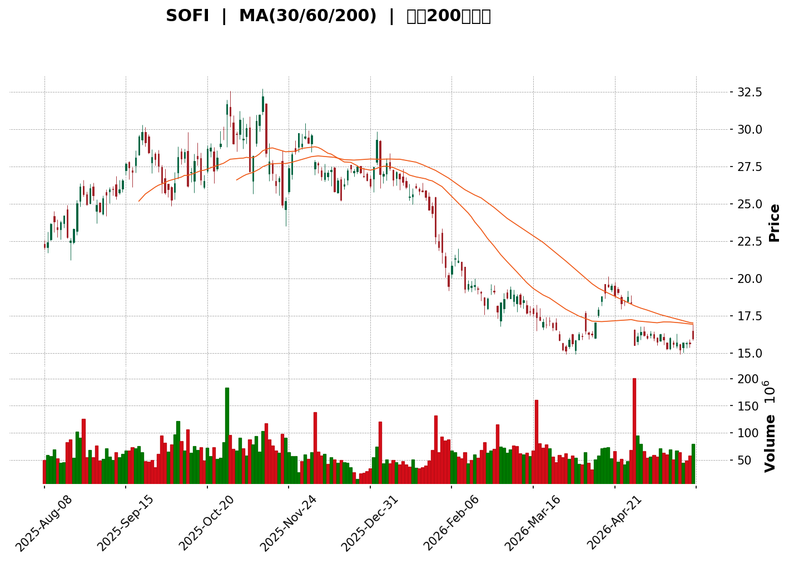
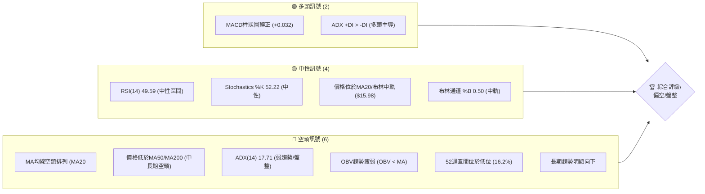

<details>
<summary>📊 靜態圖表 (點擊展開)</summary>

</details>

<html>
<head><meta charset="utf-8" /></head>
<body>
    <div>                        <script>window.PlotlyConfig = {MathJaxConfig: 'local'};</script>
        <script charset="utf-8" src="https://cdn.plot.ly/plotly-3.5.0.min.js" integrity="sha256-fHbNLP+GlIXN+efbQec78UkemUz3NJp7UmfGxC1tNxs=" crossorigin="anonymous"></script>                <div id="candlestick-chart" class="plotly-graph-div" style="height:500px; width:100%;"></div>            <script>                window.PLOTLYENV=window.PLOTLYENV || {};                                if (document.getElementById("candlestick-chart")) {                    Plotly.newPlot(                        "candlestick-chart",                        [{"close":{"dtype":"f8","bdata":"AAAAoJkZNkAAAAAghWs2QAAAAGBmpjdAAAAAIFzPN0AAAACAPUo3QAAAAMAexTdAAAAAQOE6OEAAAAAAAMA2QAAAAMAehTZAAAAA4HpUN0AAAADAHgU5QAAAAGBmJjpAAAAAYLieOUAAAACAwvU4QAAAAIA9CjpAAAAAgD2KOUAAAADA9eg4QAAAAKBwfThAAAAAoEdhOUAAAACgmZk5QAAAAIDC9TlAAAAA4FH4OUAAAADAHoU5QAAAAIDC9TlAAAAAwMyMOkAAAAAghas7QAAAACCFaztAAAAAANcjO0AAAAAAKRw8QAAAAGCPgj1AAAAAIFzPPUAAAABAChc9QAAAAOCjcDxAAAAAYLgePEAAAABA4fo7QAAAAMDMjDtAAAAAIIVrOkAAAABgj8I5QAAAAOBR+DlAAAAAoHA9OUAAAAAAKVw6QAAAAADXIzxAAAAAwB4FPEAAAABAM3M8QAAAAOCjMDpAAAAAANcjO0AAAABguN47QAAAACCuBzxAAAAAoJmZOkAAAACAPYo6QAAAAIAUrjxAAAAAAADAPEAAAADgozA7QAAAAOB6FDxAAAAAYI8CPUAAAAAAAAA+QAAAAMD1qD9AAAAAYGbmPkAAAAAgrgc9QAAAAIAUrj1AAAAAoEehPkAAAABguF49QAAAAIDrET5AAAAAwPUoO0AAAACAwjU8QAAAAIA9ij5AAAAAQDPzPkAAAABA4RpAQAAAAADXYzxAAAAAgOvRO0AAAACAPQo7QAAAAKBwPTpAAAAA4FG4OkAAAADA9eg4QAAAAOCjMDlAAAAAYGZmO0AAAADgelQ8QAAAAKBwfTxAAAAA4FG4PUAAAAAgrgc9QAAAAGCPgj1AAAAAgOsRPUAAAACgmZk9QAAAACCuxztAAAAAACmcO0AAAADgetQ6QAAAAEAKFztAAAAAgOsRO0AAAAAgrkc7QAAAAIDr0TlAAAAA4HqUOkAAAADAHkU5QAAAAIA9SjpAAAAAoHA9O0AAAACgmVk7QAAAAOCjMDtAAAAAQOF6O0AAAACA6xE7QAAAAIDr0TpAAAAAIFyPOkAAAACAFC46QAAAAIDCdTtAAAAAIK5HPUAAAABA4fo6QAAAAAAAADtAAAAA4FG4O0AAAABgZmY7QAAAAKCZmTpAAAAAANcjO0AAAAAghas6QAAAAOCjcDpAAAAAoEchOkAAAACgcH05QAAAAADXozlAAAAAQAoXOkAAAACgmdk5QAAAAMDMzDlAAAAAgMJ1OUAAAACgmZk4QAAAAAApXDhAAAAAIFzPNkAAAADgehQ2QAAAAGCPwjVAAAAAAADANEAAAACAwnUzQAAAAAAp3DRAAAAAoJlZNUAAAACAFC41QAAAAMDMjDRAAAAAwMxMM0AAAAAAKZwzQAAAAGCPgjNAAAAAgD2KM0AAAADAzEwzQAAAAMAeBTNAAAAA4FE4MkAAAADA9agyQAAAAIA9SjNAAAAAoJkZM0AAAABgj8IxQAAAAADXYzJAAAAAACmcMkAAAABAM7MyQAAAAAAAQDNAAAAAYGbmMkAAAACAPcoyQAAAAIA9SjJAAAAAIK6HMkAAAABAM7MxQAAAAGCPwjFAAAAAoEehMUAAAABguF4xQAAAAIAULjFAAAAA4HoUMUAAAABgZuYwQAAAAGBmJjFAAAAAQDOzMEAAAAAgXI8wQAAAAKBwvS9AAAAAgMJ1LkAAAADAzEwuQAAAAGCPwi9AAAAAYI9CL0AAAABAM7MvQAAAAMAeRTBAAAAAACkcMEAAAACgcH0wQAAAAMAeRTBAAAAA4FE4MEAAAADAzAwxQAAAAMD16DFAAAAAgD3KMkAAAAAgrgczQAAAAIAUbjNAAAAAAACAM0AAAADgetQyQAAAACBcDzNAAAAAgOtRMkAAAADgo3AyQAAAAGCPwjJAAAAAAClcMkAAAADAzAwvQAAAAKCZGTBAAAAAgBRuMEAAAABAMzMwQAAAAMAeBTBAAAAAwMxMMEAAAAAAAAAwQAAAAAAAgC9AAAAAYI9CMEAAAADAzMwvQAAAAGC4ni5AAAAAwB4FMEAAAADgUTgvQAAAACCFay9AAAAAgMJ1LkAAAACgR2EvQAAAAMDMTC9AAAAAoHA9L0AAAACAwvUvQA=="},"high":{"dtype":"f8","bdata":"AAAAgMKVNkAAAAAA1yM3QAAAAEDhujdAAAAAAACAOEAAAABAM\u002fM3QAAAAAAp3DdAAAAAQOE6OEAAAADA9eg4QAAAAOBRuDZAAAAAwHZeN0AAAAAAAEA5QAAAAKBHYTpAAAAAQOGaOkAAAAAgXM85QAAAAOB6VDpAAAAAIIVrOkAAAAAgrkc5QAAAAAApHDlAAAAAgD2KOUAAAADgUfg5QAAAAKCZGTpAAAAA4KMwOkAAAABA4do6QAAAAKCZmTpAAAAA4KOwOkAAAADAHsU7QAAAAKBH4TtAAAAAgMJ1O0AAAABAtpM8QAAAAKBHoT1AAAAAwMxMPkAAAAAA1yM+QAAAACCFqz1AAAAAIIWrPEAAAABA4Xo8QAAAAKBHoTxAAAAAACmcO0AAAADgelQ7QAAAAKCZWTpAAAAAgBQuOkAAAAAA1yM7QAAAAEAK1zxAAAAAgMK1PEAAAADgo7A8QAAAAMDMzD1AAAAAgBRuO0AAAACgmVk8QAAAAEAKFz1AAAAA4KNwPEAAAAAghes6QAAAAIAU7jxAAAAAgOsRPUAAAADAzMw8QAAAAOBRmDxAAAAAYLjePUAAAABAMzM+QAAAAEDh+j9AAAAA4FFIQEAAAACAPeo+QAAAAAAp3D1AAAAA4FE4P0AAAACAPco+QAAAAGC4Xj5AAAAAYOfbPkAAAACgcD08QAAAAOBR+D5AAAAAoHD9PkAAAACgcF1AQAAAAAAAwD9AAAAAgOsRPUAAAABAM\u002fM7QAAAAAAAADtAAAAAoJnZOkAAAABAM5M8QAAAAIDrcTlAAAAAACmcO0AAAABAM3M8QAAAAAAAQD1AAAAAAADAPUAAAABAM7M9QAAAACCFaz5AAAAAgBTuPUAAAABAM7M9QAAAAIAU7jtAAAAA4HrUO0AAAABAM3M7QAAAAIAUrjtAAAAAIK5HO0AAAAAAAIA7QAAAAEDhejtAAAAAoHC9OkAAAACAwtU6QAAAAEAKtzpAAAAAYLheO0AAAABguJ47QAAAAEAKVztAAAAAgD2KO0AAAADAzIw7QAAAAMD1aDtAAAAAANcjO0AAAABgZuY6QAAAAKBHgTtAAAAAACncPUAAAADAzEw9QAAAAIAULjtAAAAAgBQOPEAAAAAAAGA8QAAAAGDlUDtAAAAAQDMzO0AAAACAwhU7QAAAAOB6VDtAAAAAIK7HOkAAAABAClc6QAAAAMDMDDpAAAAAANdjOkAAAACgRyE6QAAAAGBmZjpAAAAAgBTuOUAAAACAPco5QAAAAGC4HjlAAAAA4FF4OUAAAAAAAAA3QAAAAAApXDdAAAAAANfDNUAAAABgZmY0QAAAAMD1KDVAAAAAQAqXNUAAAAAAAAA2QAAAAKCZGTVAAAAAgD3KNEAAAABguN4zQAAAAEAK1zNAAAAAYI8CNEAAAABA4XozQAAAAOCjMDNAAAAAoEfBMkAAAACAwrUyQAAAAGC4njNAAAAAIFyPM0AAAACAwjUyQAAAAMD1aDJAAAAAgD0KM0AAAAAgrkczQAAAAEDhejNAAAAAYLg+M0AAAACA6\u002fEyQAAAAGBmBjNAAAAAoJnZMkAAAADAzIwyQAAAAGBmJjJAAAAAgOsRMkAAAACgR0EyQAAAACCuBzJAAAAAIIVLMUAAAADAcmgxQAAAAMD1aDFAAAAAgOsRMUAAAABAClcxQAAAAKBwfTBAAAAAoEdhL0AAAACgRyEvQAAAAGBmBjBAAAAAgOtRMEAAAAAgrscvQAAAAMDMbDBAAAAAQOFaMEAAAACgmdkxQAAAAOBReDBAAAAAoHB9MEAAAAAgXA8xQAAAAEAzEzJAAAAAgOvRMkAAAABguJ4zQAAAAKBHITRAAAAAwB6lM0AAAADAHsUzQAAAACCwcjNAAAAAYGbmMkAAAABAM5MyQAAAACCFKzNAAAAAYLjeMkAAAABACpcwQAAAAGC4XjBAAAAAIIXLMEAAAAAgrscwQAAAACBcTzBAAAAAoEeBMEAAAACAwnUwQAAAAMDMDDBAAAAAgOtRMEAAAADgelQwQAAAACCFay9AAAAA4KMQMEAAAACAFK4vQAAAAIDrUTBAAAAAIK5HL0AAAADgo3AvQAAAAIDrkS9AAAAAACncL0AAAABAM\u002fMwQA=="},"hovertemplate":"\u003cb\u003e%{x|%Y-%m-%d}\u003c\u002fb\u003e\u003cbr\u003e\u958b: $%{open:.2f}\u003cbr\u003e\u9ad8: $%{high:.2f}\u003cbr\u003e\u4f4e: $%{low:.2f}\u003cbr\u003e\u6536: $%{close:.2f}\u003cextra\u003e\u003c\u002fextra\u003e","low":{"dtype":"f8","bdata":"AAAAQDPzNUAAAABACrc1QAAAAMAehTZAAAAAQAoXN0AAAACgcL02QAAAAAApnDZAAAAAwPVoN0AAAADgo7A2QAAAAIDCNTVAAAAAIFxPNkAAAABgZuY2QAAAACBczzhAAAAAAACAOUAAAACgR+E4QAAAAAAAADlAAAAAgMI1OUAAAABAM7M3QAAAAADXYzhAAAAAILI9OEAAAACAFC44QAAAAMDMDDlAAAAAwMyMOUAAAADAzEw5QAAAAGC4njlAAAAAwB7FOUAAAAAgXO86QAAAAKBHoTpAAAAAoEchOkAAAADgehQ7QAAAAKBwPTxAAAAA4FH4PEAAAACgmdk8QAAAAKCZWTxAAAAAIFwPO0AAAAAgXI87QAAAAAApHDtAAAAAQDOzOUAAAAAA16M5QAAAAEAzczlAAAAAQArXOEAAAAAgXE85QAAAAIAUrjpAAAAAwB6lO0AAAAAAAMA7QAAAAKBHITpAAAAA4FF4OkAAAAAAAMA5QAAAACBcjztAAAAAAABAOkAAAABgjwI6QAAAACBcDztAAAAAYGYmPEAAAACgR2E6QAAAAKDxMjtAAAAAQDOzPEAAAADAHkU9QAAAAMDMzDxAAAAAANcjPkAAAABA4fo8QAAAAKBwfTxAAAAA4HpUPUAAAADgo7A8QAAAAGCPAj1AAAAAoEchO0AAAADA9ag5QAAAAEAK1zxAAAAA4CLbPUAAAACAwvU+QAAAAGBmJjxAAAAAIK6HOkAAAADAzIw6QAAAAIDCtTlAAAAAIFyPOUAAAABguL44QAAAAMAehTdAAAAAIK6nOUAAAACgR6E6QAAAACBcTzxAAAAA4Hp0PEAAAAAghas8QAAAAOCjUD1AAAAAwB4FPUAAAABA4Xo8QAAAAIAU7jpAAAAAwMwMO0AAAADAzIw6QAAAAEDhejpAAAAAgBSOOkAAAABAMzM6QAAAAIA9yjlAAAAA4FG4OUAAAAAghSs5QAAAAEAz8zlAAAAAIK5HOkAAAACgmRk7QAAAAEAz0zpAAAAAIK4HO0AAAAAgrgc7QAAAAKBwvTpAAAAAgD2KOkAAAAAgXA86QAAAAIA9yjlAAAAAoJmZO0AAAAAgrgc6QAAAAKBwXTpAAAAAgOuROkAAAABA4To7QAAAAEAzMzpAAAAA4FE4OkAAAAAghes5QAAAAIDCNTpAAAAAYI8COkAAAACAwjU5QAAAAEAz8zhAAAAAAAAAOkAAAACgmZk5QAAAAMAexTlAAAAAgMI1OUAAAACA65E4QAAAAMDMDDhAAAAAIFxPNkAAAAAAKdw1QAAAAMAeBTVAAAAAgOsRNEAAAAAAqjEzQAAAAIA9CjRAAAAAwMzMNEAAAADAzAw1QAAAAADXIzRAAAAAgD0KM0AAAABgZiYzQAAAAAApHDNAAAAAoJk5M0AAAADgUfgyQAAAAADXgzJAAAAA4HqUMUAAAAAA1+MxQAAAAIAU7jJAAAAA4FH4MkAAAAAgXE8xQAAAAMDMzDBAAAAA4KOwMUAAAAAAKZwyQAAAAADXozJAAAAAYLgeMkAAAADAHsUxQAAAAIA9CjJAAAAA4FH4MUAAAABguJ4xQAAAACCuhzFAAAAA4FF4MUAAAABA4XowQAAAAMD1KDFAAAAA4HqUMEAAAAAghaswQAAAAEAK1zBAAAAAoHB9MEAAAADAHoUwQAAAAAApnC9AAAAAwMxMLkAAAABguN4tQAAAAGC4ni5AAAAAoEfhLkAAAAAAKdwtQAAAAGCPwi9AAAAAgOvRL0AAAABgj0IwQAAAAOB61C9AAAAA4FEYMEAAAAAghesvQAAAAGBmZjFAAAAAIIUrMkAAAABgZqYyQAAAAADXYzNAAAAAQAoXM0AAAADgo7AyQAAAAMD16DJAAAAAgBTuMUAAAACAwCoyQAAAAADXYzJAAAAAwB5FMkAAAAAAAAAvQAAAAOB6FC9AAAAAAADAL0AAAACgRyEwQAAAAKBH4S9AAAAAQOH6L0AAAADA9agvQAAAAIA9Ci9AAAAAgD2KL0AAAACgmRkvQAAAAIAUbi5AAAAAgMJ1LkAAAABgj8IuQAAAAIAUri5AAAAAQArXLUAAAAAgXA8uQAAAAEAzsy5AAAAA4FG4LkAAAADgUbgvQA=="},"name":"\u50f9\u683c","open":{"dtype":"f8","bdata":"AAAAwMxMNkAAAACgmRk2QAAAAGC4njZAAAAAgBQuOEAAAAAghWs3QAAAAIA9SjdAAAAA4KOwN0AAAAAAKZw4QAAAACCFazZAAAAA4KNwNkAAAADA9Sg3QAAAAIAULjlAAAAA4Ho0OkAAAACgcJ05QAAAAMAeBTlAAAAAwPUoOkAAAAAAAIA4QAAAACBcDzlAAAAA4HpUOEAAAADAHsU5QAAAACBczzlAAAAAwB4FOkAAAACAPUo6QAAAAGCPwjlAAAAAAAAAOkAAAAAAAEA7QAAAAIA9yjtAAAAAAABAO0AAAABACpc7QAAAAADXQzxAAAAAwMxMPUAAAACAFM49QAAAAAAAgD1AAAAAYI\u002fCO0AAAABguF48QAAAAAApXDxAAAAA4FF4O0AAAABA4bo6QAAAAOB6VDpAAAAAoJkZOkAAAADAHsU5QAAAAKCZGTtAAAAAoHB9PEAAAACAPQo8QAAAAMDMjDxAAAAAgOsRO0AAAABgj4I6QAAAAEAzMzxAAAAAgOsRPEAAAACgmRk6QAAAAEAzMztAAAAAIFyPPEAAAACgcH08QAAAAOB6VDtAAAAA4FHYPEAAAAAAAAA+QAAAAKBw\u002fT5AAAAAYLh+P0AAAAAgXG8+QAAAAOCjsD1AAAAAwPWoPUAAAAAghUs9QAAAAMAehT1AAAAAAAAgPkAAAABgZoY6QAAAACBcDz1AAAAAYLg+PkAAAACAFC4\u002fQAAAAEDhuj9AAAAAAAAAO0AAAACAwrU7QAAAAGCPgjpAAAAAoJl5OkAAAACgR+E7QAAAAKBHoThAAAAA4HrUOUAAAABA4fo6QAAAAIDCtTxAAAAAgD3KPEAAAADgetQ8QAAAAADXYz1AAAAAwMxsPUAAAADA9Qg9QAAAAKBwXTtAAAAAQOG6O0AAAACgcD07QAAAAGBmpjpAAAAAQArXOkAAAADAHiU7QAAAACBcbztAAAAAoHC9OUAAAAAA16M6QAAAAIAULjpAAAAAYLieOkAAAADgUZg7QAAAAIDrETtAAAAAIIUrO0AAAACAPYo7QAAAAGC43jpAAAAAIK4HO0AAAACAFK46QAAAAMD1qDpAAAAAIFzPO0AAAABA4To9QAAAAKBw3TpAAAAAAAAAO0AAAACAFM47QAAAAIA9SjtAAAAAQDOzOkAAAAAAAAA7QAAAACBczzpAAAAAgD2KOkAAAADgo3A5QAAAAAAAgDlAAAAAgBQuOkAAAAAAAAA6QAAAAGBm5jlAAAAAYGbmOUAAAAAAAIA5QAAAAKBw3ThAAAAAgBRuOUAAAABgj4I2QAAAAMDMDDdAAAAAoHB9NUAAAABA4To0QAAAAIA9SjRAAAAAgD1KNUAAAABAChc1QAAAAKCZGTVAAAAAgD3KNEAAAAAgrkczQAAAAMD1aDNAAAAA4FF4M0AAAADgelQzQAAAAIDCFTNAAAAAQOG6MkAAAAAAAAAyQAAAACCuRzNAAAAA4KMwM0AAAADA9SgyQAAAAMAeJTFAAAAAAAAAMkAAAAAgXA8zQAAAAGBmpjJAAAAAACl8MkAAAADgelQyQAAAACCF6zJAAAAAANdjMkAAAADgUTgyQAAAAMDMzDFAAAAAAAAAMkAAAADgUbgxQAAAAIAUbjFAAAAAAADAMEAAAACAPeowQAAAACCuJzFAAAAAYLj+MEAAAACAPQoxQAAAAGBmRjBAAAAAQApXL0AAAAAAKdwuQAAAAGBm5i5AAAAAYGZGMEAAAACgR2EuQAAAACCuxy9AAAAAwPUoMEAAAACAFK4xQAAAAADXYzBAAAAAwMxMMEAAAAAAAAAwQAAAACCuhzFAAAAA4FF4MkAAAABguJ4zQAAAAKCZmTNAAAAAYI9CM0AAAABgj4IzQAAAAIA9SjNAAAAAwB7FMkAAAADgo3AyQAAAAEDhejJAAAAAwB5lMkAAAADAzIwwQAAAAIA9ii9AAAAAACk8MEAAAADgUXgwQAAAACCFKzBAAAAAQDMzMEAAAABgj0IwQAAAACCuBzBAAAAAoJmZL0AAAACA6xEwQAAAACCFay9AAAAAYLieLkAAAABgZmYvQAAAAIDC9S5AAAAAgMI1L0AAAABA4bouQAAAAKBwPS9AAAAAYGZmL0AAAABA4XowQA=="},"x":["2025-08-08T00:00:00-04:00","2025-08-11T00:00:00-04:00","2025-08-12T00:00:00-04:00","2025-08-13T00:00:00-04:00","2025-08-14T00:00:00-04:00","2025-08-15T00:00:00-04:00","2025-08-18T00:00:00-04:00","2025-08-19T00:00:00-04:00","2025-08-20T00:00:00-04:00","2025-08-21T00:00:00-04:00","2025-08-22T00:00:00-04:00","2025-08-25T00:00:00-04:00","2025-08-26T00:00:00-04:00","2025-08-27T00:00:00-04:00","2025-08-28T00:00:00-04:00","2025-08-29T00:00:00-04:00","2025-09-02T00:00:00-04:00","2025-09-03T00:00:00-04:00","2025-09-04T00:00:00-04:00","2025-09-05T00:00:00-04:00","2025-09-08T00:00:00-04:00","2025-09-09T00:00:00-04:00","2025-09-10T00:00:00-04:00","2025-09-11T00:00:00-04:00","2025-09-12T00:00:00-04:00","2025-09-15T00:00:00-04:00","2025-09-16T00:00:00-04:00","2025-09-17T00:00:00-04:00","2025-09-18T00:00:00-04:00","2025-09-19T00:00:00-04:00","2025-09-22T00:00:00-04:00","2025-09-23T00:00:00-04:00","2025-09-24T00:00:00-04:00","2025-09-25T00:00:00-04:00","2025-09-26T00:00:00-04:00","2025-09-29T00:00:00-04:00","2025-09-30T00:00:00-04:00","2025-10-01T00:00:00-04:00","2025-10-02T00:00:00-04:00","2025-10-03T00:00:00-04:00","2025-10-06T00:00:00-04:00","2025-10-07T00:00:00-04:00","2025-10-08T00:00:00-04:00","2025-10-09T00:00:00-04:00","2025-10-10T00:00:00-04:00","2025-10-13T00:00:00-04:00","2025-10-14T00:00:00-04:00","2025-10-15T00:00:00-04:00","2025-10-16T00:00:00-04:00","2025-10-17T00:00:00-04:00","2025-10-20T00:00:00-04:00","2025-10-21T00:00:00-04:00","2025-10-22T00:00:00-04:00","2025-10-23T00:00:00-04:00","2025-10-24T00:00:00-04:00","2025-10-27T00:00:00-04:00","2025-10-28T00:00:00-04:00","2025-10-29T00:00:00-04:00","2025-10-30T00:00:00-04:00","2025-10-31T00:00:00-04:00","2025-11-03T00:00:00-05:00","2025-11-04T00:00:00-05:00","2025-11-05T00:00:00-05:00","2025-11-06T00:00:00-05:00","2025-11-07T00:00:00-05:00","2025-11-10T00:00:00-05:00","2025-11-11T00:00:00-05:00","2025-11-12T00:00:00-05:00","2025-11-13T00:00:00-05:00","2025-11-14T00:00:00-05:00","2025-11-17T00:00:00-05:00","2025-11-18T00:00:00-05:00","2025-11-19T00:00:00-05:00","2025-11-20T00:00:00-05:00","2025-11-21T00:00:00-05:00","2025-11-24T00:00:00-05:00","2025-11-25T00:00:00-05:00","2025-11-26T00:00:00-05:00","2025-11-28T00:00:00-05:00","2025-12-01T00:00:00-05:00","2025-12-02T00:00:00-05:00","2025-12-03T00:00:00-05:00","2025-12-04T00:00:00-05:00","2025-12-05T00:00:00-05:00","2025-12-08T00:00:00-05:00","2025-12-09T00:00:00-05:00","2025-12-10T00:00:00-05:00","2025-12-11T00:00:00-05:00","2025-12-12T00:00:00-05:00","2025-12-15T00:00:00-05:00","2025-12-16T00:00:00-05:00","2025-12-17T00:00:00-05:00","2025-12-18T00:00:00-05:00","2025-12-19T00:00:00-05:00","2025-12-22T00:00:00-05:00","2025-12-23T00:00:00-05:00","2025-12-24T00:00:00-05:00","2025-12-26T00:00:00-05:00","2025-12-29T00:00:00-05:00","2025-12-30T00:00:00-05:00","2025-12-31T00:00:00-05:00","2026-01-02T00:00:00-05:00","2026-01-05T00:00:00-05:00","2026-01-06T00:00:00-05:00","2026-01-07T00:00:00-05:00","2026-01-08T00:00:00-05:00","2026-01-09T00:00:00-05:00","2026-01-12T00:00:00-05:00","2026-01-13T00:00:00-05:00","2026-01-14T00:00:00-05:00","2026-01-15T00:00:00-05:00","2026-01-16T00:00:00-05:00","2026-01-20T00:00:00-05:00","2026-01-21T00:00:00-05:00","2026-01-22T00:00:00-05:00","2026-01-23T00:00:00-05:00","2026-01-26T00:00:00-05:00","2026-01-27T00:00:00-05:00","2026-01-28T00:00:00-05:00","2026-01-29T00:00:00-05:00","2026-01-30T00:00:00-05:00","2026-02-02T00:00:00-05:00","2026-02-03T00:00:00-05:00","2026-02-04T00:00:00-05:00","2026-02-05T00:00:00-05:00","2026-02-06T00:00:00-05:00","2026-02-09T00:00:00-05:00","2026-02-10T00:00:00-05:00","2026-02-11T00:00:00-05:00","2026-02-12T00:00:00-05:00","2026-02-13T00:00:00-05:00","2026-02-17T00:00:00-05:00","2026-02-18T00:00:00-05:00","2026-02-19T00:00:00-05:00","2026-02-20T00:00:00-05:00","2026-02-23T00:00:00-05:00","2026-02-24T00:00:00-05:00","2026-02-25T00:00:00-05:00","2026-02-26T00:00:00-05:00","2026-02-27T00:00:00-05:00","2026-03-02T00:00:00-05:00","2026-03-03T00:00:00-05:00","2026-03-04T00:00:00-05:00","2026-03-05T00:00:00-05:00","2026-03-06T00:00:00-05:00","2026-03-09T00:00:00-04:00","2026-03-10T00:00:00-04:00","2026-03-11T00:00:00-04:00","2026-03-12T00:00:00-04:00","2026-03-13T00:00:00-04:00","2026-03-16T00:00:00-04:00","2026-03-17T00:00:00-04:00","2026-03-18T00:00:00-04:00","2026-03-19T00:00:00-04:00","2026-03-20T00:00:00-04:00","2026-03-23T00:00:00-04:00","2026-03-24T00:00:00-04:00","2026-03-25T00:00:00-04:00","2026-03-26T00:00:00-04:00","2026-03-27T00:00:00-04:00","2026-03-30T00:00:00-04:00","2026-03-31T00:00:00-04:00","2026-04-01T00:00:00-04:00","2026-04-02T00:00:00-04:00","2026-04-06T00:00:00-04:00","2026-04-07T00:00:00-04:00","2026-04-08T00:00:00-04:00","2026-04-09T00:00:00-04:00","2026-04-10T00:00:00-04:00","2026-04-13T00:00:00-04:00","2026-04-14T00:00:00-04:00","2026-04-15T00:00:00-04:00","2026-04-16T00:00:00-04:00","2026-04-17T00:00:00-04:00","2026-04-20T00:00:00-04:00","2026-04-21T00:00:00-04:00","2026-04-22T00:00:00-04:00","2026-04-23T00:00:00-04:00","2026-04-24T00:00:00-04:00","2026-04-27T00:00:00-04:00","2026-04-28T00:00:00-04:00","2026-04-29T00:00:00-04:00","2026-04-30T00:00:00-04:00","2026-05-01T00:00:00-04:00","2026-05-04T00:00:00-04:00","2026-05-05T00:00:00-04:00","2026-05-06T00:00:00-04:00","2026-05-07T00:00:00-04:00","2026-05-08T00:00:00-04:00","2026-05-11T00:00:00-04:00","2026-05-12T00:00:00-04:00","2026-05-13T00:00:00-04:00","2026-05-14T00:00:00-04:00","2026-05-15T00:00:00-04:00","2026-05-18T00:00:00-04:00","2026-05-19T00:00:00-04:00","2026-05-20T00:00:00-04:00","2026-05-21T00:00:00-04:00","2026-05-22T00:00:00-04:00","2026-05-26T00:00:00-04:00"],"type":"candlestick"},{"hovertemplate":"MA30: $%{y:.2f}\u003cextra\u003e\u003c\u002fextra\u003e","line":{"color":"#2196F3","dash":"dash","width":2},"mode":"lines","name":"MA30","x":["2025-08-08T00:00:00-04:00","2025-08-11T00:00:00-04:00","2025-08-12T00:00:00-04:00","2025-08-13T00:00:00-04:00","2025-08-14T00:00:00-04:00","2025-08-15T00:00:00-04:00","2025-08-18T00:00:00-04:00","2025-08-19T00:00:00-04:00","2025-08-20T00:00:00-04:00","2025-08-21T00:00:00-04:00","2025-08-22T00:00:00-04:00","2025-08-25T00:00:00-04:00","2025-08-26T00:00:00-04:00","2025-08-27T00:00:00-04:00","2025-08-28T00:00:00-04:00","2025-08-29T00:00:00-04:00","2025-09-02T00:00:00-04:00","2025-09-03T00:00:00-04:00","2025-09-04T00:00:00-04:00","2025-09-05T00:00:00-04:00","2025-09-08T00:00:00-04:00","2025-09-09T00:00:00-04:00","2025-09-10T00:00:00-04:00","2025-09-11T00:00:00-04:00","2025-09-12T00:00:00-04:00","2025-09-15T00:00:00-04:00","2025-09-16T00:00:00-04:00","2025-09-17T00:00:00-04:00","2025-09-18T00:00:00-04:00","2025-09-19T00:00:00-04:00","2025-09-22T00:00:00-04:00","2025-09-23T00:00:00-04:00","2025-09-24T00:00:00-04:00","2025-09-25T00:00:00-04:00","2025-09-26T00:00:00-04:00","2025-09-29T00:00:00-04:00","2025-09-30T00:00:00-04:00","2025-10-01T00:00:00-04:00","2025-10-02T00:00:00-04:00","2025-10-03T00:00:00-04:00","2025-10-06T00:00:00-04:00","2025-10-07T00:00:00-04:00","2025-10-08T00:00:00-04:00","2025-10-09T00:00:00-04:00","2025-10-10T00:00:00-04:00","2025-10-13T00:00:00-04:00","2025-10-14T00:00:00-04:00","2025-10-15T00:00:00-04:00","2025-10-16T00:00:00-04:00","2025-10-17T00:00:00-04:00","2025-10-20T00:00:00-04:00","2025-10-21T00:00:00-04:00","2025-10-22T00:00:00-04:00","2025-10-23T00:00:00-04:00","2025-10-24T00:00:00-04:00","2025-10-27T00:00:00-04:00","2025-10-28T00:00:00-04:00","2025-10-29T00:00:00-04:00","2025-10-30T00:00:00-04:00","2025-10-31T00:00:00-04:00","2025-11-03T00:00:00-05:00","2025-11-04T00:00:00-05:00","2025-11-05T00:00:00-05:00","2025-11-06T00:00:00-05:00","2025-11-07T00:00:00-05:00","2025-11-10T00:00:00-05:00","2025-11-11T00:00:00-05:00","2025-11-12T00:00:00-05:00","2025-11-13T00:00:00-05:00","2025-11-14T00:00:00-05:00","2025-11-17T00:00:00-05:00","2025-11-18T00:00:00-05:00","2025-11-19T00:00:00-05:00","2025-11-20T00:00:00-05:00","2025-11-21T00:00:00-05:00","2025-11-24T00:00:00-05:00","2025-11-25T00:00:00-05:00","2025-11-26T00:00:00-05:00","2025-11-28T00:00:00-05:00","2025-12-01T00:00:00-05:00","2025-12-02T00:00:00-05:00","2025-12-03T00:00:00-05:00","2025-12-04T00:00:00-05:00","2025-12-05T00:00:00-05:00","2025-12-08T00:00:00-05:00","2025-12-09T00:00:00-05:00","2025-12-10T00:00:00-05:00","2025-12-11T00:00:00-05:00","2025-12-12T00:00:00-05:00","2025-12-15T00:00:00-05:00","2025-12-16T00:00:00-05:00","2025-12-17T00:00:00-05:00","2025-12-18T00:00:00-05:00","2025-12-19T00:00:00-05:00","2025-12-22T00:00:00-05:00","2025-12-23T00:00:00-05:00","2025-12-24T00:00:00-05:00","2025-12-26T00:00:00-05:00","2025-12-29T00:00:00-05:00","2025-12-30T00:00:00-05:00","2025-12-31T00:00:00-05:00","2026-01-02T00:00:00-05:00","2026-01-05T00:00:00-05:00","2026-01-06T00:00:00-05:00","2026-01-07T00:00:00-05:00","2026-01-08T00:00:00-05:00","2026-01-09T00:00:00-05:00","2026-01-12T00:00:00-05:00","2026-01-13T00:00:00-05:00","2026-01-14T00:00:00-05:00","2026-01-15T00:00:00-05:00","2026-01-16T00:00:00-05:00","2026-01-20T00:00:00-05:00","2026-01-21T00:00:00-05:00","2026-01-22T00:00:00-05:00","2026-01-23T00:00:00-05:00","2026-01-26T00:00:00-05:00","2026-01-27T00:00:00-05:00","2026-01-28T00:00:00-05:00","2026-01-29T00:00:00-05:00","2026-01-30T00:00:00-05:00","2026-02-02T00:00:00-05:00","2026-02-03T00:00:00-05:00","2026-02-04T00:00:00-05:00","2026-02-05T00:00:00-05:00","2026-02-06T00:00:00-05:00","2026-02-09T00:00:00-05:00","2026-02-10T00:00:00-05:00","2026-02-11T00:00:00-05:00","2026-02-12T00:00:00-05:00","2026-02-13T00:00:00-05:00","2026-02-17T00:00:00-05:00","2026-02-18T00:00:00-05:00","2026-02-19T00:00:00-05:00","2026-02-20T00:00:00-05:00","2026-02-23T00:00:00-05:00","2026-02-24T00:00:00-05:00","2026-02-25T00:00:00-05:00","2026-02-26T00:00:00-05:00","2026-02-27T00:00:00-05:00","2026-03-02T00:00:00-05:00","2026-03-03T00:00:00-05:00","2026-03-04T00:00:00-05:00","2026-03-05T00:00:00-05:00","2026-03-06T00:00:00-05:00","2026-03-09T00:00:00-04:00","2026-03-10T00:00:00-04:00","2026-03-11T00:00:00-04:00","2026-03-12T00:00:00-04:00","2026-03-13T00:00:00-04:00","2026-03-16T00:00:00-04:00","2026-03-17T00:00:00-04:00","2026-03-18T00:00:00-04:00","2026-03-19T00:00:00-04:00","2026-03-20T00:00:00-04:00","2026-03-23T00:00:00-04:00","2026-03-24T00:00:00-04:00","2026-03-25T00:00:00-04:00","2026-03-26T00:00:00-04:00","2026-03-27T00:00:00-04:00","2026-03-30T00:00:00-04:00","2026-03-31T00:00:00-04:00","2026-04-01T00:00:00-04:00","2026-04-02T00:00:00-04:00","2026-04-06T00:00:00-04:00","2026-04-07T00:00:00-04:00","2026-04-08T00:00:00-04:00","2026-04-09T00:00:00-04:00","2026-04-10T00:00:00-04:00","2026-04-13T00:00:00-04:00","2026-04-14T00:00:00-04:00","2026-04-15T00:00:00-04:00","2026-04-16T00:00:00-04:00","2026-04-17T00:00:00-04:00","2026-04-20T00:00:00-04:00","2026-04-21T00:00:00-04:00","2026-04-22T00:00:00-04:00","2026-04-23T00:00:00-04:00","2026-04-24T00:00:00-04:00","2026-04-27T00:00:00-04:00","2026-04-28T00:00:00-04:00","2026-04-29T00:00:00-04:00","2026-04-30T00:00:00-04:00","2026-05-01T00:00:00-04:00","2026-05-04T00:00:00-04:00","2026-05-05T00:00:00-04:00","2026-05-06T00:00:00-04:00","2026-05-07T00:00:00-04:00","2026-05-08T00:00:00-04:00","2026-05-11T00:00:00-04:00","2026-05-12T00:00:00-04:00","2026-05-13T00:00:00-04:00","2026-05-14T00:00:00-04:00","2026-05-15T00:00:00-04:00","2026-05-18T00:00:00-04:00","2026-05-19T00:00:00-04:00","2026-05-20T00:00:00-04:00","2026-05-21T00:00:00-04:00","2026-05-22T00:00:00-04:00","2026-05-26T00:00:00-04:00"],"y":{"dtype":"f8","bdata":"AAAAAAAA+H8AAAAAAAD4fwAAAAAAAPh\u002fAAAAAAAA+H8AAAAAAAD4fwAAAAAAAPh\u002fAAAAAAAA+H8AAAAAAAD4fwAAAAAAAPh\u002fAAAAAAAA+H8AAAAAAAD4fwAAAAAAAPh\u002fAAAAAAAA+H8AAAAAAAD4fwAAAAAAAPh\u002fAAAAAAAA+H8AAAAAAAD4fwAAAAAAAPh\u002fAAAAAAAA+H8AAAAAAAD4fwAAAAAAAPh\u002fAAAAAAAA+H8AAAAAAAD4fwAAAAAAAPh\u002fAAAAAAAA+H8AAAAAAAD4fwAAAAAAAPh\u002fAAAAAAAA+H8AAAAAAAD4fyIiIqL+LTlAIiIiYslvOUCJiIg4tKg5QDMzMyOU0TlAq6qqelv2OUAAAADwYB46QImIiHiiPjpAmpmZmVJROkC8u7sLAms6QO\u002fu7q5yiDpAREREJL+YOkCrqqpqLqQ6QDMzM6MptTpAREREhKTJOkCrqqqKbOc6QImIiDi06DpAiYiIeFv2OkARERGxnQ87QBEREfHSLTtAMzMzEzw4O0CamZmJQUA7QImIiHh3VztAmpmZeTBvO0BVVVWlcH07QLy7u9uHjztAAAAA0IWkO0BmZmbGZ7g7QCIiIjKW3DtAq6qqCqz8O0AAAADQhQQ8QO\u002fu7i75BTxAAAAAgPgMPEC8u7srXA88QFVVVfVEHTxA3t3dzRMVPEDv7u4+Chc8QBEREQGOMDxAERER8TVXPEDe3d0tQI48QAAAAMDmojxAiYiI2Oq4PEBERERUuL48QHd3d7eBrjxAIiIi0mmjPEAiIiKSNIU8QJqZmQmsfDxAREREBOR+PEBmZmbm0II8QImIiMi9hjxAZmZmhl2hPEAzMzMDnbY8QM3MzCyyvTxAmpmZOW3APEAzMzPz\u002fdQ8QHd3d5du0jxA7+7uPnzGPEBmZmZGb6s8QFVVVfVvhDxAIiIiMsFjPEAzMzND0lQ8QGZmZvbhMzxAq6qqmlIRPEBEREQEVu47QLy7u3sUzjtA7+7uPsPOO0DNzMyMbMc7QM3MzFzWqjtAd3d3BzqNO0B3d3eHXWE7QAAAAND3UztAzczMTDdJO0CamZmZ4EE7QKuqqrpJTDtAMzMzIyJiO0Dv7u4ezHM7QAAAACA+gztAzczMLPmFO0Dv7u6OCX47QKuqqsrobTtAIiIisuRXO0AiIiIywUM7QN7d3a2OKTtAZmZmJngQO0B3d3e3Ze06QAAAANAi2zpAIiIiUirOOkCrqqp6zcU6QN7d3W3LujpAREREVA6tOkB3d3fHL5Y6QM3MzFy6iTpAvLu7q45pOkAiIiICVk46QCIiIhKuJzpAMzMzc0zwOUCrqqp6+Kw5QCIiImL0djlAIiIiMqVCOUC8u7tLYhA5QFVVVUXh2jhA7+7uju2cOEDNzMws3WQ4QDMzMyMGIThAiYiIyOjNN0ARERGRX4w3QN7d3f1GSDdAzczM7DX3NkCrqqoaoaw2QKuqqipAbjZAVVVVhaQpNkBERERUnN01QFVVVdXqmDVAVVVVJb9YNUCrqqoqzh41QAAAAABH6DRARERENOyqNEBmZmZmrW40QO\u002fu7o6XLjRA7+7uvnTzM0B3d3d3k7gzQLy7u4tBgDNAmpmZqQ1UM0AzMzOD3CszQJqZmVnHBDNAzczMHHblMkBVVVW1nc8yQGZmZhb1rzJAIiIiAkeIMkBmZmZ22mAyQBEREdnqODJAREREzC8WMkDv7u7GIPAxQLy7u+sm0TFAzczMZMmvMUCamZnBWJIxQCIiIkrhejFAVVVV7d9oMUBVVVV9W1YxQKuqqjKWPDFAVVVVvQIkMUAAAAC48x0xQM3MzCTbGTFAREREXGQbMUCamZlBNR4xQBEREXm+HzFAmpmZMd0kMUCrqqqSNCUxQBEREanGKzFAAAAA6PspMUDe3d11TDAxQGZmZv7UODFAzczMtA8\u002fMUBVVVU9US8xQJqZmfEZJjFAd3d3\u002f40gMUC8u7vTlBoxQGZmZk7wEDFAVVVVfYYNMUDv7u4mvwgxQCIiIgK5BzFAREREFIMQMUCrqqp66RYxQLy7u0sMEjFAvLu7Q2AVMUCamZn5UxMxQKuqqqKMDjFAZmZmPgoHMUDe3d2dNgAxQERERDTs+jBAREREfM31MEAREREJrOwwQA=="},"type":"scatter"},{"hovertemplate":"MA60: $%{y:.2f}\u003cextra\u003e\u003c\u002fextra\u003e","line":{"color":"#9C27B0","dash":"dash","width":2},"mode":"lines","name":"MA60","x":["2025-08-08T00:00:00-04:00","2025-08-11T00:00:00-04:00","2025-08-12T00:00:00-04:00","2025-08-13T00:00:00-04:00","2025-08-14T00:00:00-04:00","2025-08-15T00:00:00-04:00","2025-08-18T00:00:00-04:00","2025-08-19T00:00:00-04:00","2025-08-20T00:00:00-04:00","2025-08-21T00:00:00-04:00","2025-08-22T00:00:00-04:00","2025-08-25T00:00:00-04:00","2025-08-26T00:00:00-04:00","2025-08-27T00:00:00-04:00","2025-08-28T00:00:00-04:00","2025-08-29T00:00:00-04:00","2025-09-02T00:00:00-04:00","2025-09-03T00:00:00-04:00","2025-09-04T00:00:00-04:00","2025-09-05T00:00:00-04:00","2025-09-08T00:00:00-04:00","2025-09-09T00:00:00-04:00","2025-09-10T00:00:00-04:00","2025-09-11T00:00:00-04:00","2025-09-12T00:00:00-04:00","2025-09-15T00:00:00-04:00","2025-09-16T00:00:00-04:00","2025-09-17T00:00:00-04:00","2025-09-18T00:00:00-04:00","2025-09-19T00:00:00-04:00","2025-09-22T00:00:00-04:00","2025-09-23T00:00:00-04:00","2025-09-24T00:00:00-04:00","2025-09-25T00:00:00-04:00","2025-09-26T00:00:00-04:00","2025-09-29T00:00:00-04:00","2025-09-30T00:00:00-04:00","2025-10-01T00:00:00-04:00","2025-10-02T00:00:00-04:00","2025-10-03T00:00:00-04:00","2025-10-06T00:00:00-04:00","2025-10-07T00:00:00-04:00","2025-10-08T00:00:00-04:00","2025-10-09T00:00:00-04:00","2025-10-10T00:00:00-04:00","2025-10-13T00:00:00-04:00","2025-10-14T00:00:00-04:00","2025-10-15T00:00:00-04:00","2025-10-16T00:00:00-04:00","2025-10-17T00:00:00-04:00","2025-10-20T00:00:00-04:00","2025-10-21T00:00:00-04:00","2025-10-22T00:00:00-04:00","2025-10-23T00:00:00-04:00","2025-10-24T00:00:00-04:00","2025-10-27T00:00:00-04:00","2025-10-28T00:00:00-04:00","2025-10-29T00:00:00-04:00","2025-10-30T00:00:00-04:00","2025-10-31T00:00:00-04:00","2025-11-03T00:00:00-05:00","2025-11-04T00:00:00-05:00","2025-11-05T00:00:00-05:00","2025-11-06T00:00:00-05:00","2025-11-07T00:00:00-05:00","2025-11-10T00:00:00-05:00","2025-11-11T00:00:00-05:00","2025-11-12T00:00:00-05:00","2025-11-13T00:00:00-05:00","2025-11-14T00:00:00-05:00","2025-11-17T00:00:00-05:00","2025-11-18T00:00:00-05:00","2025-11-19T00:00:00-05:00","2025-11-20T00:00:00-05:00","2025-11-21T00:00:00-05:00","2025-11-24T00:00:00-05:00","2025-11-25T00:00:00-05:00","2025-11-26T00:00:00-05:00","2025-11-28T00:00:00-05:00","2025-12-01T00:00:00-05:00","2025-12-02T00:00:00-05:00","2025-12-03T00:00:00-05:00","2025-12-04T00:00:00-05:00","2025-12-05T00:00:00-05:00","2025-12-08T00:00:00-05:00","2025-12-09T00:00:00-05:00","2025-12-10T00:00:00-05:00","2025-12-11T00:00:00-05:00","2025-12-12T00:00:00-05:00","2025-12-15T00:00:00-05:00","2025-12-16T00:00:00-05:00","2025-12-17T00:00:00-05:00","2025-12-18T00:00:00-05:00","2025-12-19T00:00:00-05:00","2025-12-22T00:00:00-05:00","2025-12-23T00:00:00-05:00","2025-12-24T00:00:00-05:00","2025-12-26T00:00:00-05:00","2025-12-29T00:00:00-05:00","2025-12-30T00:00:00-05:00","2025-12-31T00:00:00-05:00","2026-01-02T00:00:00-05:00","2026-01-05T00:00:00-05:00","2026-01-06T00:00:00-05:00","2026-01-07T00:00:00-05:00","2026-01-08T00:00:00-05:00","2026-01-09T00:00:00-05:00","2026-01-12T00:00:00-05:00","2026-01-13T00:00:00-05:00","2026-01-14T00:00:00-05:00","2026-01-15T00:00:00-05:00","2026-01-16T00:00:00-05:00","2026-01-20T00:00:00-05:00","2026-01-21T00:00:00-05:00","2026-01-22T00:00:00-05:00","2026-01-23T00:00:00-05:00","2026-01-26T00:00:00-05:00","2026-01-27T00:00:00-05:00","2026-01-28T00:00:00-05:00","2026-01-29T00:00:00-05:00","2026-01-30T00:00:00-05:00","2026-02-02T00:00:00-05:00","2026-02-03T00:00:00-05:00","2026-02-04T00:00:00-05:00","2026-02-05T00:00:00-05:00","2026-02-06T00:00:00-05:00","2026-02-09T00:00:00-05:00","2026-02-10T00:00:00-05:00","2026-02-11T00:00:00-05:00","2026-02-12T00:00:00-05:00","2026-02-13T00:00:00-05:00","2026-02-17T00:00:00-05:00","2026-02-18T00:00:00-05:00","2026-02-19T00:00:00-05:00","2026-02-20T00:00:00-05:00","2026-02-23T00:00:00-05:00","2026-02-24T00:00:00-05:00","2026-02-25T00:00:00-05:00","2026-02-26T00:00:00-05:00","2026-02-27T00:00:00-05:00","2026-03-02T00:00:00-05:00","2026-03-03T00:00:00-05:00","2026-03-04T00:00:00-05:00","2026-03-05T00:00:00-05:00","2026-03-06T00:00:00-05:00","2026-03-09T00:00:00-04:00","2026-03-10T00:00:00-04:00","2026-03-11T00:00:00-04:00","2026-03-12T00:00:00-04:00","2026-03-13T00:00:00-04:00","2026-03-16T00:00:00-04:00","2026-03-17T00:00:00-04:00","2026-03-18T00:00:00-04:00","2026-03-19T00:00:00-04:00","2026-03-20T00:00:00-04:00","2026-03-23T00:00:00-04:00","2026-03-24T00:00:00-04:00","2026-03-25T00:00:00-04:00","2026-03-26T00:00:00-04:00","2026-03-27T00:00:00-04:00","2026-03-30T00:00:00-04:00","2026-03-31T00:00:00-04:00","2026-04-01T00:00:00-04:00","2026-04-02T00:00:00-04:00","2026-04-06T00:00:00-04:00","2026-04-07T00:00:00-04:00","2026-04-08T00:00:00-04:00","2026-04-09T00:00:00-04:00","2026-04-10T00:00:00-04:00","2026-04-13T00:00:00-04:00","2026-04-14T00:00:00-04:00","2026-04-15T00:00:00-04:00","2026-04-16T00:00:00-04:00","2026-04-17T00:00:00-04:00","2026-04-20T00:00:00-04:00","2026-04-21T00:00:00-04:00","2026-04-22T00:00:00-04:00","2026-04-23T00:00:00-04:00","2026-04-24T00:00:00-04:00","2026-04-27T00:00:00-04:00","2026-04-28T00:00:00-04:00","2026-04-29T00:00:00-04:00","2026-04-30T00:00:00-04:00","2026-05-01T00:00:00-04:00","2026-05-04T00:00:00-04:00","2026-05-05T00:00:00-04:00","2026-05-06T00:00:00-04:00","2026-05-07T00:00:00-04:00","2026-05-08T00:00:00-04:00","2026-05-11T00:00:00-04:00","2026-05-12T00:00:00-04:00","2026-05-13T00:00:00-04:00","2026-05-14T00:00:00-04:00","2026-05-15T00:00:00-04:00","2026-05-18T00:00:00-04:00","2026-05-19T00:00:00-04:00","2026-05-20T00:00:00-04:00","2026-05-21T00:00:00-04:00","2026-05-22T00:00:00-04:00","2026-05-26T00:00:00-04:00"],"y":{"dtype":"f8","bdata":"AAAAAAAA+H8AAAAAAAD4fwAAAAAAAPh\u002fAAAAAAAA+H8AAAAAAAD4fwAAAAAAAPh\u002fAAAAAAAA+H8AAAAAAAD4fwAAAAAAAPh\u002fAAAAAAAA+H8AAAAAAAD4fwAAAAAAAPh\u002fAAAAAAAA+H8AAAAAAAD4fwAAAAAAAPh\u002fAAAAAAAA+H8AAAAAAAD4fwAAAAAAAPh\u002fAAAAAAAA+H8AAAAAAAD4fwAAAAAAAPh\u002fAAAAAAAA+H8AAAAAAAD4fwAAAAAAAPh\u002fAAAAAAAA+H8AAAAAAAD4fwAAAAAAAPh\u002fAAAAAAAA+H8AAAAAAAD4fwAAAAAAAPh\u002fAAAAAAAA+H8AAAAAAAD4fwAAAAAAAPh\u002fAAAAAAAA+H8AAAAAAAD4fwAAAAAAAPh\u002fAAAAAAAA+H8AAAAAAAD4fwAAAAAAAPh\u002fAAAAAAAA+H8AAAAAAAD4fwAAAAAAAPh\u002fAAAAAAAA+H8AAAAAAAD4fwAAAAAAAPh\u002fAAAAAAAA+H8AAAAAAAD4fwAAAAAAAPh\u002fAAAAAAAA+H8AAAAAAAD4fwAAAAAAAPh\u002fAAAAAAAA+H8AAAAAAAD4fwAAAAAAAPh\u002fAAAAAAAA+H8AAAAAAAD4fwAAAAAAAPh\u002fAAAAAAAA+H8AAAAAAAD4f4mIiOj7mTpAERER8WC+OkAiIiIyCNw6QERERIxs9zpAREREpLcFO0B3d3eXtRo7QM3MzDyYNztAVVVVRURUO0DNzMwcoXw7QHd3d7eslTtAZmZm\u002ftSoO0B3d3dfc7E7QFVVVa3VsTtAMzMzK4e2O0BmZmaOULY7QBERESGwsjtAZmZmvp+6O0C8u7tLN8k7QM3MzFxI2jtAzczMzMzsO0BmZmZGb\u002fs7QKuqqtKUCjxAmpmZ2c4XPEBERERMNyk8QJqZmTn7MDxAd3d3B4E1PEBmZmaG6zE8QLy7uxODMDxAZmZmnjYwPECamZkJrCw8QKuqqpLtHDxAVVVVjSUPPEAAAAAY2f47QImIiLis9TtAZmZmhuvxO0De3d1lO+87QO\u002fu7i6y7TtARERE\u002fDfyO0Crqqrazvc7QAAAAEhv+ztAq6qqEhEBPEDv7u52TAA8QBEREbll\u002fTtAq6qq+sUCPECJiIhYgPw7QM3MzBT1\u002fztAiYiImG4CPECrqqo6bQA8QJqZmUlT+jtAREREHKH8O0CrqqoaL\u002f07QFVVVW2g8ztAAAAAsHLoO0BVVVXVMeE7QLy7u7PI1jtAiYiISFPKO0CJiIhgnrg7QJqZmbGdnztAMzMzw2eIO0BVVVUFgXU7QJqZmSnOXjtAMzMzo3A9O0AzMzMDVh47QO\u002fu7kbh+jpAERER2YffOkC8u7uDMro6QHd3d1\u002flkDpAzczMnO9nOkCamZnp3zg6QKuqqopsFzpA3t3dbRLzOUAzMzPjXtM5QO\u002fu7u6ntjlA3t3ddQWYOUAAAADYFYA5QO\u002fu7o7CZTlAzczMjJc+OUDNzMxUVRU5QKuqqnoU7jhAvLu7m8TAOEAzMzPDrpA4QJqZmcE8YThA3t3dpZs0OEARERHxGQY4QAAAAOi04TdAMzMzQ4u8N0CJiIhwPZo3QGZmZn6xdDdAmpmZiUFQN0B3d3efYSc3QERERPT9BDdAq6qqKs7eNkCrqqpCGb02QN7d3bU6ljZAAAAASOFqNkAAAAAYSz42QERERLx0EzZAIiIiGnblNUARERFhnrg1QDMzMw\u002fmiTVAmpmZrY5ZNUDe3d35fio1QHd3d4cW+TRAq6qqFtm+NEBVVVUpXI80QAAAACSUYTRAERER7QowNEAAAABMfgE0QKuqqi5r1TNAVVVVodOmM0AiIiIGyH0zQBEREf1iWTNAzczMwBE6M0AiIiK2gR4zQImIiLwCBDNA7+7usuTnMkCJiIj88MkyQAAAABwvrTJAd3d3U7iOMkCrqqr2b3QyQBEREUWLXDJAMzMzr45JMkBERETgli0yQJqZmaVwFTJAIiIiDgIDMkCJiIhEGfUxQGZmZrJy4DFAvLu7v+bKMUCrqqrOzLQxQJqZme1RoDFAREREcFmTMUDNzMwghYMxQLy7u5uZcTFARERE1JRiMUCamZld1lIxQGZmZva2RDFA3t3dFfU3MUCamZkNSSsxQHd3dzPBGzFAzczMHOgMMUCJiIjgTwUxQA=="},"type":"scatter"},{"hovertemplate":"MA200: $%{y:.2f}\u003cextra\u003e\u003c\u002fextra\u003e","line":{"color":"#FF6F00","dash":"solid","width":2},"mode":"lines","name":"MA200","x":["2025-08-08T00:00:00-04:00","2025-08-11T00:00:00-04:00","2025-08-12T00:00:00-04:00","2025-08-13T00:00:00-04:00","2025-08-14T00:00:00-04:00","2025-08-15T00:00:00-04:00","2025-08-18T00:00:00-04:00","2025-08-19T00:00:00-04:00","2025-08-20T00:00:00-04:00","2025-08-21T00:00:00-04:00","2025-08-22T00:00:00-04:00","2025-08-25T00:00:00-04:00","2025-08-26T00:00:00-04:00","2025-08-27T00:00:00-04:00","2025-08-28T00:00:00-04:00","2025-08-29T00:00:00-04:00","2025-09-02T00:00:00-04:00","2025-09-03T00:00:00-04:00","2025-09-04T00:00:00-04:00","2025-09-05T00:00:00-04:00","2025-09-08T00:00:00-04:00","2025-09-09T00:00:00-04:00","2025-09-10T00:00:00-04:00","2025-09-11T00:00:00-04:00","2025-09-12T00:00:00-04:00","2025-09-15T00:00:00-04:00","2025-09-16T00:00:00-04:00","2025-09-17T00:00:00-04:00","2025-09-18T00:00:00-04:00","2025-09-19T00:00:00-04:00","2025-09-22T00:00:00-04:00","2025-09-23T00:00:00-04:00","2025-09-24T00:00:00-04:00","2025-09-25T00:00:00-04:00","2025-09-26T00:00:00-04:00","2025-09-29T00:00:00-04:00","2025-09-30T00:00:00-04:00","2025-10-01T00:00:00-04:00","2025-10-02T00:00:00-04:00","2025-10-03T00:00:00-04:00","2025-10-06T00:00:00-04:00","2025-10-07T00:00:00-04:00","2025-10-08T00:00:00-04:00","2025-10-09T00:00:00-04:00","2025-10-10T00:00:00-04:00","2025-10-13T00:00:00-04:00","2025-10-14T00:00:00-04:00","2025-10-15T00:00:00-04:00","2025-10-16T00:00:00-04:00","2025-10-17T00:00:00-04:00","2025-10-20T00:00:00-04:00","2025-10-21T00:00:00-04:00","2025-10-22T00:00:00-04:00","2025-10-23T00:00:00-04:00","2025-10-24T00:00:00-04:00","2025-10-27T00:00:00-04:00","2025-10-28T00:00:00-04:00","2025-10-29T00:00:00-04:00","2025-10-30T00:00:00-04:00","2025-10-31T00:00:00-04:00","2025-11-03T00:00:00-05:00","2025-11-04T00:00:00-05:00","2025-11-05T00:00:00-05:00","2025-11-06T00:00:00-05:00","2025-11-07T00:00:00-05:00","2025-11-10T00:00:00-05:00","2025-11-11T00:00:00-05:00","2025-11-12T00:00:00-05:00","2025-11-13T00:00:00-05:00","2025-11-14T00:00:00-05:00","2025-11-17T00:00:00-05:00","2025-11-18T00:00:00-05:00","2025-11-19T00:00:00-05:00","2025-11-20T00:00:00-05:00","2025-11-21T00:00:00-05:00","2025-11-24T00:00:00-05:00","2025-11-25T00:00:00-05:00","2025-11-26T00:00:00-05:00","2025-11-28T00:00:00-05:00","2025-12-01T00:00:00-05:00","2025-12-02T00:00:00-05:00","2025-12-03T00:00:00-05:00","2025-12-04T00:00:00-05:00","2025-12-05T00:00:00-05:00","2025-12-08T00:00:00-05:00","2025-12-09T00:00:00-05:00","2025-12-10T00:00:00-05:00","2025-12-11T00:00:00-05:00","2025-12-12T00:00:00-05:00","2025-12-15T00:00:00-05:00","2025-12-16T00:00:00-05:00","2025-12-17T00:00:00-05:00","2025-12-18T00:00:00-05:00","2025-12-19T00:00:00-05:00","2025-12-22T00:00:00-05:00","2025-12-23T00:00:00-05:00","2025-12-24T00:00:00-05:00","2025-12-26T00:00:00-05:00","2025-12-29T00:00:00-05:00","2025-12-30T00:00:00-05:00","2025-12-31T00:00:00-05:00","2026-01-02T00:00:00-05:00","2026-01-05T00:00:00-05:00","2026-01-06T00:00:00-05:00","2026-01-07T00:00:00-05:00","2026-01-08T00:00:00-05:00","2026-01-09T00:00:00-05:00","2026-01-12T00:00:00-05:00","2026-01-13T00:00:00-05:00","2026-01-14T00:00:00-05:00","2026-01-15T00:00:00-05:00","2026-01-16T00:00:00-05:00","2026-01-20T00:00:00-05:00","2026-01-21T00:00:00-05:00","2026-01-22T00:00:00-05:00","2026-01-23T00:00:00-05:00","2026-01-26T00:00:00-05:00","2026-01-27T00:00:00-05:00","2026-01-28T00:00:00-05:00","2026-01-29T00:00:00-05:00","2026-01-30T00:00:00-05:00","2026-02-02T00:00:00-05:00","2026-02-03T00:00:00-05:00","2026-02-04T00:00:00-05:00","2026-02-05T00:00:00-05:00","2026-02-06T00:00:00-05:00","2026-02-09T00:00:00-05:00","2026-02-10T00:00:00-05:00","2026-02-11T00:00:00-05:00","2026-02-12T00:00:00-05:00","2026-02-13T00:00:00-05:00","2026-02-17T00:00:00-05:00","2026-02-18T00:00:00-05:00","2026-02-19T00:00:00-05:00","2026-02-20T00:00:00-05:00","2026-02-23T00:00:00-05:00","2026-02-24T00:00:00-05:00","2026-02-25T00:00:00-05:00","2026-02-26T00:00:00-05:00","2026-02-27T00:00:00-05:00","2026-03-02T00:00:00-05:00","2026-03-03T00:00:00-05:00","2026-03-04T00:00:00-05:00","2026-03-05T00:00:00-05:00","2026-03-06T00:00:00-05:00","2026-03-09T00:00:00-04:00","2026-03-10T00:00:00-04:00","2026-03-11T00:00:00-04:00","2026-03-12T00:00:00-04:00","2026-03-13T00:00:00-04:00","2026-03-16T00:00:00-04:00","2026-03-17T00:00:00-04:00","2026-03-18T00:00:00-04:00","2026-03-19T00:00:00-04:00","2026-03-20T00:00:00-04:00","2026-03-23T00:00:00-04:00","2026-03-24T00:00:00-04:00","2026-03-25T00:00:00-04:00","2026-03-26T00:00:00-04:00","2026-03-27T00:00:00-04:00","2026-03-30T00:00:00-04:00","2026-03-31T00:00:00-04:00","2026-04-01T00:00:00-04:00","2026-04-02T00:00:00-04:00","2026-04-06T00:00:00-04:00","2026-04-07T00:00:00-04:00","2026-04-08T00:00:00-04:00","2026-04-09T00:00:00-04:00","2026-04-10T00:00:00-04:00","2026-04-13T00:00:00-04:00","2026-04-14T00:00:00-04:00","2026-04-15T00:00:00-04:00","2026-04-16T00:00:00-04:00","2026-04-17T00:00:00-04:00","2026-04-20T00:00:00-04:00","2026-04-21T00:00:00-04:00","2026-04-22T00:00:00-04:00","2026-04-23T00:00:00-04:00","2026-04-24T00:00:00-04:00","2026-04-27T00:00:00-04:00","2026-04-28T00:00:00-04:00","2026-04-29T00:00:00-04:00","2026-04-30T00:00:00-04:00","2026-05-01T00:00:00-04:00","2026-05-04T00:00:00-04:00","2026-05-05T00:00:00-04:00","2026-05-06T00:00:00-04:00","2026-05-07T00:00:00-04:00","2026-05-08T00:00:00-04:00","2026-05-11T00:00:00-04:00","2026-05-12T00:00:00-04:00","2026-05-13T00:00:00-04:00","2026-05-14T00:00:00-04:00","2026-05-15T00:00:00-04:00","2026-05-18T00:00:00-04:00","2026-05-19T00:00:00-04:00","2026-05-20T00:00:00-04:00","2026-05-21T00:00:00-04:00","2026-05-22T00:00:00-04:00","2026-05-26T00:00:00-04:00"],"y":{"dtype":"f8","bdata":"AAAAAAAA+H8AAAAAAAD4fwAAAAAAAPh\u002fAAAAAAAA+H8AAAAAAAD4fwAAAAAAAPh\u002fAAAAAAAA+H8AAAAAAAD4fwAAAAAAAPh\u002fAAAAAAAA+H8AAAAAAAD4fwAAAAAAAPh\u002fAAAAAAAA+H8AAAAAAAD4fwAAAAAAAPh\u002fAAAAAAAA+H8AAAAAAAD4fwAAAAAAAPh\u002fAAAAAAAA+H8AAAAAAAD4fwAAAAAAAPh\u002fAAAAAAAA+H8AAAAAAAD4fwAAAAAAAPh\u002fAAAAAAAA+H8AAAAAAAD4fwAAAAAAAPh\u002fAAAAAAAA+H8AAAAAAAD4fwAAAAAAAPh\u002fAAAAAAAA+H8AAAAAAAD4fwAAAAAAAPh\u002fAAAAAAAA+H8AAAAAAAD4fwAAAAAAAPh\u002fAAAAAAAA+H8AAAAAAAD4fwAAAAAAAPh\u002fAAAAAAAA+H8AAAAAAAD4fwAAAAAAAPh\u002fAAAAAAAA+H8AAAAAAAD4fwAAAAAAAPh\u002fAAAAAAAA+H8AAAAAAAD4fwAAAAAAAPh\u002fAAAAAAAA+H8AAAAAAAD4fwAAAAAAAPh\u002fAAAAAAAA+H8AAAAAAAD4fwAAAAAAAPh\u002fAAAAAAAA+H8AAAAAAAD4fwAAAAAAAPh\u002fAAAAAAAA+H8AAAAAAAD4fwAAAAAAAPh\u002fAAAAAAAA+H8AAAAAAAD4fwAAAAAAAPh\u002fAAAAAAAA+H8AAAAAAAD4fwAAAAAAAPh\u002fAAAAAAAA+H8AAAAAAAD4fwAAAAAAAPh\u002fAAAAAAAA+H8AAAAAAAD4fwAAAAAAAPh\u002fAAAAAAAA+H8AAAAAAAD4fwAAAAAAAPh\u002fAAAAAAAA+H8AAAAAAAD4fwAAAAAAAPh\u002fAAAAAAAA+H8AAAAAAAD4fwAAAAAAAPh\u002fAAAAAAAA+H8AAAAAAAD4fwAAAAAAAPh\u002fAAAAAAAA+H8AAAAAAAD4fwAAAAAAAPh\u002fAAAAAAAA+H8AAAAAAAD4fwAAAAAAAPh\u002fAAAAAAAA+H8AAAAAAAD4fwAAAAAAAPh\u002fAAAAAAAA+H8AAAAAAAD4fwAAAAAAAPh\u002fAAAAAAAA+H8AAAAAAAD4fwAAAAAAAPh\u002fAAAAAAAA+H8AAAAAAAD4fwAAAAAAAPh\u002fAAAAAAAA+H8AAAAAAAD4fwAAAAAAAPh\u002fAAAAAAAA+H8AAAAAAAD4fwAAAAAAAPh\u002fAAAAAAAA+H8AAAAAAAD4fwAAAAAAAPh\u002fAAAAAAAA+H8AAAAAAAD4fwAAAAAAAPh\u002fAAAAAAAA+H8AAAAAAAD4fwAAAAAAAPh\u002fAAAAAAAA+H8AAAAAAAD4fwAAAAAAAPh\u002fAAAAAAAA+H8AAAAAAAD4fwAAAAAAAPh\u002fAAAAAAAA+H8AAAAAAAD4fwAAAAAAAPh\u002fAAAAAAAA+H8AAAAAAAD4fwAAAAAAAPh\u002fAAAAAAAA+H8AAAAAAAD4fwAAAAAAAPh\u002fAAAAAAAA+H8AAAAAAAD4fwAAAAAAAPh\u002fAAAAAAAA+H8AAAAAAAD4fwAAAAAAAPh\u002fAAAAAAAA+H8AAAAAAAD4fwAAAAAAAPh\u002fAAAAAAAA+H8AAAAAAAD4fwAAAAAAAPh\u002fAAAAAAAA+H8AAAAAAAD4fwAAAAAAAPh\u002fAAAAAAAA+H8AAAAAAAD4fwAAAAAAAPh\u002fAAAAAAAA+H8AAAAAAAD4fwAAAAAAAPh\u002fAAAAAAAA+H8AAAAAAAD4fwAAAAAAAPh\u002fAAAAAAAA+H8AAAAAAAD4fwAAAAAAAPh\u002fAAAAAAAA+H8AAAAAAAD4fwAAAAAAAPh\u002fAAAAAAAA+H8AAAAAAAD4fwAAAAAAAPh\u002fAAAAAAAA+H8AAAAAAAD4fwAAAAAAAPh\u002fAAAAAAAA+H8AAAAAAAD4fwAAAAAAAPh\u002fAAAAAAAA+H8AAAAAAAD4fwAAAAAAAPh\u002fAAAAAAAA+H8AAAAAAAD4fwAAAAAAAPh\u002fAAAAAAAA+H8AAAAAAAD4fwAAAAAAAPh\u002fAAAAAAAA+H8AAAAAAAD4fwAAAAAAAPh\u002fAAAAAAAA+H8AAAAAAAD4fwAAAAAAAPh\u002fAAAAAAAA+H8AAAAAAAD4fwAAAAAAAPh\u002fAAAAAAAA+H8AAAAAAAD4fwAAAAAAAPh\u002fAAAAAAAA+H8AAAAAAAD4fwAAAAAAAPh\u002fAAAAAAAA+H8AAAAAAAD4fwAAAAAAAPh\u002fAAAAAAAA+H+4HoUHX0w3QA=="},"type":"scatter"}],                        {"template":{"data":{"barpolar":[{"marker":{"line":{"color":"rgb(17,17,17)","width":0.5},"pattern":{"fillmode":"overlay","size":10,"solidity":0.2}},"type":"barpolar"}],"bar":[{"error_x":{"color":"#f2f5fa"},"error_y":{"color":"#f2f5fa"},"marker":{"line":{"color":"rgb(17,17,17)","width":0.5},"pattern":{"fillmode":"overlay","size":10,"solidity":0.2}},"type":"bar"}],"carpet":[{"aaxis":{"endlinecolor":"#A2B1C6","gridcolor":"#506784","linecolor":"#506784","minorgridcolor":"#506784","startlinecolor":"#A2B1C6"},"baxis":{"endlinecolor":"#A2B1C6","gridcolor":"#506784","linecolor":"#506784","minorgridcolor":"#506784","startlinecolor":"#A2B1C6"},"type":"carpet"}],"choropleth":[{"colorbar":{"outlinewidth":0,"ticks":""},"type":"choropleth"}],"contourcarpet":[{"colorbar":{"outlinewidth":0,"ticks":""},"type":"contourcarpet"}],"contour":[{"colorbar":{"outlinewidth":0,"ticks":""},"colorscale":[[0.0,"#0d0887"],[0.1111111111111111,"#46039f"],[0.2222222222222222,"#7201a8"],[0.3333333333333333,"#9c179e"],[0.4444444444444444,"#bd3786"],[0.5555555555555556,"#d8576b"],[0.6666666666666666,"#ed7953"],[0.7777777777777778,"#fb9f3a"],[0.8888888888888888,"#fdca26"],[1.0,"#f0f921"]],"type":"contour"}],"heatmap":[{"colorbar":{"outlinewidth":0,"ticks":""},"colorscale":[[0.0,"#0d0887"],[0.1111111111111111,"#46039f"],[0.2222222222222222,"#7201a8"],[0.3333333333333333,"#9c179e"],[0.4444444444444444,"#bd3786"],[0.5555555555555556,"#d8576b"],[0.6666666666666666,"#ed7953"],[0.7777777777777778,"#fb9f3a"],[0.8888888888888888,"#fdca26"],[1.0,"#f0f921"]],"type":"heatmap"}],"histogram2dcontour":[{"colorbar":{"outlinewidth":0,"ticks":""},"colorscale":[[0.0,"#0d0887"],[0.1111111111111111,"#46039f"],[0.2222222222222222,"#7201a8"],[0.3333333333333333,"#9c179e"],[0.4444444444444444,"#bd3786"],[0.5555555555555556,"#d8576b"],[0.6666666666666666,"#ed7953"],[0.7777777777777778,"#fb9f3a"],[0.8888888888888888,"#fdca26"],[1.0,"#f0f921"]],"type":"histogram2dcontour"}],"histogram2d":[{"colorbar":{"outlinewidth":0,"ticks":""},"colorscale":[[0.0,"#0d0887"],[0.1111111111111111,"#46039f"],[0.2222222222222222,"#7201a8"],[0.3333333333333333,"#9c179e"],[0.4444444444444444,"#bd3786"],[0.5555555555555556,"#d8576b"],[0.6666666666666666,"#ed7953"],[0.7777777777777778,"#fb9f3a"],[0.8888888888888888,"#fdca26"],[1.0,"#f0f921"]],"type":"histogram2d"}],"histogram":[{"marker":{"pattern":{"fillmode":"overlay","size":10,"solidity":0.2}},"type":"histogram"}],"mesh3d":[{"colorbar":{"outlinewidth":0,"ticks":""},"type":"mesh3d"}],"parcoords":[{"line":{"colorbar":{"outlinewidth":0,"ticks":""}},"type":"parcoords"}],"pie":[{"automargin":true,"type":"pie"}],"scatter3d":[{"line":{"colorbar":{"outlinewidth":0,"ticks":""}},"marker":{"colorbar":{"outlinewidth":0,"ticks":""}},"type":"scatter3d"}],"scattercarpet":[{"marker":{"colorbar":{"outlinewidth":0,"ticks":""}},"type":"scattercarpet"}],"scattergeo":[{"marker":{"colorbar":{"outlinewidth":0,"ticks":""}},"type":"scattergeo"}],"scattergl":[{"marker":{"line":{"color":"#283442"}},"type":"scattergl"}],"scattermapbox":[{"marker":{"colorbar":{"outlinewidth":0,"ticks":""}},"type":"scattermapbox"}],"scattermap":[{"marker":{"colorbar":{"outlinewidth":0,"ticks":""}},"type":"scattermap"}],"scatterpolargl":[{"marker":{"colorbar":{"outlinewidth":0,"ticks":""}},"type":"scatterpolargl"}],"scatterpolar":[{"marker":{"colorbar":{"outlinewidth":0,"ticks":""}},"type":"scatterpolar"}],"scatter":[{"marker":{"line":{"color":"#283442"}},"type":"scatter"}],"scatterternary":[{"marker":{"colorbar":{"outlinewidth":0,"ticks":""}},"type":"scatterternary"}],"surface":[{"colorbar":{"outlinewidth":0,"ticks":""},"colorscale":[[0.0,"#0d0887"],[0.1111111111111111,"#46039f"],[0.2222222222222222,"#7201a8"],[0.3333333333333333,"#9c179e"],[0.4444444444444444,"#bd3786"],[0.5555555555555556,"#d8576b"],[0.6666666666666666,"#ed7953"],[0.7777777777777778,"#fb9f3a"],[0.8888888888888888,"#fdca26"],[1.0,"#f0f921"]],"type":"surface"}],"table":[{"cells":{"fill":{"color":"#506784"},"line":{"color":"rgb(17,17,17)"}},"header":{"fill":{"color":"#2a3f5f"},"line":{"color":"rgb(17,17,17)"}},"type":"table"}]},"layout":{"annotationdefaults":{"arrowcolor":"#f2f5fa","arrowhead":0,"arrowwidth":1},"autotypenumbers":"strict","coloraxis":{"colorbar":{"outlinewidth":0,"ticks":""}},"colorscale":{"diverging":[[0,"#8e0152"],[0.1,"#c51b7d"],[0.2,"#de77ae"],[0.3,"#f1b6da"],[0.4,"#fde0ef"],[0.5,"#f7f7f7"],[0.6,"#e6f5d0"],[0.7,"#b8e186"],[0.8,"#7fbc41"],[0.9,"#4d9221"],[1,"#276419"]],"sequential":[[0.0,"#0d0887"],[0.1111111111111111,"#46039f"],[0.2222222222222222,"#7201a8"],[0.3333333333333333,"#9c179e"],[0.4444444444444444,"#bd3786"],[0.5555555555555556,"#d8576b"],[0.6666666666666666,"#ed7953"],[0.7777777777777778,"#fb9f3a"],[0.8888888888888888,"#fdca26"],[1.0,"#f0f921"]],"sequentialminus":[[0.0,"#0d0887"],[0.1111111111111111,"#46039f"],[0.2222222222222222,"#7201a8"],[0.3333333333333333,"#9c179e"],[0.4444444444444444,"#bd3786"],[0.5555555555555556,"#d8576b"],[0.6666666666666666,"#ed7953"],[0.7777777777777778,"#fb9f3a"],[0.8888888888888888,"#fdca26"],[1.0,"#f0f921"]]},"colorway":["#636efa","#EF553B","#00cc96","#ab63fa","#FFA15A","#19d3f3","#FF6692","#B6E880","#FF97FF","#FECB52"],"font":{"color":"#f2f5fa"},"geo":{"bgcolor":"rgb(17,17,17)","lakecolor":"rgb(17,17,17)","landcolor":"rgb(17,17,17)","showlakes":true,"showland":true,"subunitcolor":"#506784"},"hoverlabel":{"align":"left"},"hovermode":"closest","mapbox":{"style":"dark"},"paper_bgcolor":"rgb(17,17,17)","plot_bgcolor":"rgb(17,17,17)","polar":{"angularaxis":{"gridcolor":"#506784","linecolor":"#506784","ticks":""},"bgcolor":"rgb(17,17,17)","radialaxis":{"gridcolor":"#506784","linecolor":"#506784","ticks":""}},"scene":{"xaxis":{"backgroundcolor":"rgb(17,17,17)","gridcolor":"#506784","gridwidth":2,"linecolor":"#506784","showbackground":true,"ticks":"","zerolinecolor":"#C8D4E3"},"yaxis":{"backgroundcolor":"rgb(17,17,17)","gridcolor":"#506784","gridwidth":2,"linecolor":"#506784","showbackground":true,"ticks":"","zerolinecolor":"#C8D4E3"},"zaxis":{"backgroundcolor":"rgb(17,17,17)","gridcolor":"#506784","gridwidth":2,"linecolor":"#506784","showbackground":true,"ticks":"","zerolinecolor":"#C8D4E3"}},"shapedefaults":{"line":{"color":"#f2f5fa"}},"sliderdefaults":{"bgcolor":"#C8D4E3","bordercolor":"rgb(17,17,17)","borderwidth":1,"tickwidth":0},"ternary":{"aaxis":{"gridcolor":"#506784","linecolor":"#506784","ticks":""},"baxis":{"gridcolor":"#506784","linecolor":"#506784","ticks":""},"bgcolor":"rgb(17,17,17)","caxis":{"gridcolor":"#506784","linecolor":"#506784","ticks":""}},"title":{"x":0.05},"updatemenudefaults":{"bgcolor":"#506784","borderwidth":0},"xaxis":{"automargin":true,"gridcolor":"#283442","linecolor":"#506784","ticks":"","title":{"standoff":15},"zerolinecolor":"#283442","zerolinewidth":2},"yaxis":{"automargin":true,"gridcolor":"#283442","linecolor":"#506784","ticks":"","title":{"standoff":15},"zerolinecolor":"#283442","zerolinewidth":2}}},"xaxis":{"rangeslider":{"visible":false},"title":{"text":"\u65e5\u671f"}},"font":{"size":11},"title":{"text":"SOFI  |  MA(30\u002f60\u002f200)  |  \u6700\u8fd1200\u4ea4\u6613\u65e5"},"yaxis":{"title":{"text":"\u80a1\u50f9 (USD)"}},"hovermode":"x unified","height":500},                        {"responsive": true}                    )                };            </script>        </div>
</body>
</html>

# SOFI 技術分析報告

> **報告日期**：2026-05-26 ｜ **語言**：繁體中文 ｜ **數據來源**：Yahoo Finance ｜ **當前價格**：$15.98

---

## 目錄

| 章節 | 內容 |
|------|------|
| [1. 技術面概覽](#1-技術面概覽) | 訊號儀表板、核心指標、評分卡 |
| [2. 趨勢分析](#2-趨勢分析) | 多時框趨勢、長中短期走勢 |
| [3. 圖表形態分析](#3-圖表形態分析) | 形態識別、K線組合、目標價 |
| [4. 支撐與阻力](#4-支撐與阻力) | 關鍵價位、斐波那契回調 |
| [5. 技術指標深度解讀](#5-技術指標深度解讀) | MA/RSI/MACD/布林/成交量 |
| [6. 動能與波動率](#6-動能與波動率) | 動能評估、ATR、Beta |
| [7. 多時框架總結](#7-多時框架總結) | 時框架評分矩陣 |
| [8. 交易策略建議](#8-交易策略建議) | 多空策略、風險報酬比 |
| [9. 風險提示與監控](#9-風險提示與監控) | 監控指標、風險場景 |
| [📋 報告總結](#-報告總結) | 綜合結論與建議 |

---

## 1. 技術面概覽

本章節將對SoFi Technologies, Inc. (SOFI) 的當前技術面狀況進行快速而全面的評估，透過視覺化儀表板、核心指標速覽及專業評分卡，為後續的深度分析奠定基礎。當前SOFI股價為 $15.98，位於52週高點 $32.73 與低點 $12.74 之間，距離52週高點尚有約51%的跌幅，顯示出股價仍處於較弱勢的區間。

### 🎯 技術訊號儀表板

以下Mermaid圖表匯總了SOFI當前的主要技術訊號，將其歸類為多頭、中性及空頭訊號，以提供直觀的市場情緒判斷。



**解讀**：
從訊號儀表板來看，SOFI目前呈現出明顯的空頭主導格局，尤其在中長期趨勢指標上。雖然短期動能指標MACD柱狀圖轉正，且ADX的+DI略高於-DI，顯示短期存在多頭嘗試反攻的動能，但這些積極訊號的強度相對較弱，並未能扭轉整體偏空的局面。價格恰好位於MA20和布林通道中軌，表明短期處於多空拉鋸的平衡點，但其下方即是強勁的長期均線阻力，上方則是多重阻力位。

### 📊 核心指標速覽表

下表彙總了SOFI當前關鍵技術指標的數值、訊號及其初步解讀。

| 指標類別 | 指標名稱 | 當前數值 | 訊號 | 解讀 |
|----------|----------|----------|------|------|
| **價格** | 當前價格 | $15.98 | 🟡 | 位於短期均線MA20，但低於中長期均線。 |
| **均線** | MA20 | $15.98 | 🟡 | 價格與MA20持平，短期支撐/阻力關鍵。 |
| **均線** | MA50 | $16.73 | 🔴 | 價格位於MA50下方，中期趨勢偏空。 |
| **均線** | MA200 | $23.30 | 🔴 | 價格位於MA200下方，長期趨勢嚴重偏空。 |
| **動能** | RSI(14) | 49.59 | 🟡 | 處於中性區間，無超買超賣壓力。 |
| **動能** | MACD | MACD: -0.452, Signal: -0.484, Hist: +0.032 | 🟢 | MACD線剛上穿訊號線，柱狀圖轉正，短期動能偏多。 |
| **波動** | ATR(14) | $0.71 | 🟡 | 每日平均波動約4.46%，波動性適中。 |
| **趨勢** | ADX(14) | 17.71 | 🔴 | 趨勢強度較弱，市場處於盤整或弱勢趨勢。 |
| **趨勢** | ADX (+DI/-DI) | +DI: 27.00, -DI: 20.25 | 🟢 | 雖然總體趨勢弱，但多頭力量略佔優勢。 |
| **量能** | OBV趨勢 | OBV < MA | 🔴 | 量能疲弱，未能有效支撐價格上漲。 |

**綜合觀察**：從核心指標來看，SOFI面臨著強烈的中長期空頭壓力，主要體現在價格遠低於MA50和MA200，且均線呈空頭排列。儘管短期動能指標如MACD和ADX的+DI顯示出一定的多頭動能，但這些訊號在缺乏趨勢強度和量能配合的情況下，其可靠性需要打折扣。價格目前正處於MA20和布林中軌的關鍵節點，這是一個多空爭奪的區域。

### 🏆 技術評分卡

以下評分卡提供了對SOFI各個技術維度的量化評估，並給出總體評級。

```
技術評分卡 — SOFI (2026-05-26)
════════════════════════════════════════════════════
趨勢強度      ████░░░░░░░░░░░░░░░░  20/100  🔴 (ADX弱，均線空頭排列)
動能指標      ████████░░░░░░░░░░░░  45/100  🟡 (RSI中性，MACD短期轉多，但整體偏弱)
支撐穩定度    ██████████░░░░░░░░░░  50/100  🟡 (短期MA20有支撐，但下方主要支撐較遠)
成交量配合    ████░░░░░░░░░░░░░░░░  30/100  🔴 (OBV疲弱，量能未有效配合)
形態完整度    ██████░░░░░░░░░░░░░░  35/100  🟡 (處於下跌後的盤整階段，形態不明顯)
均線排列      ██░░░░░░░░░░░░░░░░░░  10/100  🔴 (經典空頭排列，趨勢向下)
════════════════════════════════════════════════════
綜合評分      ████░░░░░░░░░░░░░░░░  31/100  評級: 🔴 偏空/盤整
════════════════════════════════════════════════════
```

**評分總結**：SOFI的技術評分卡顯示整體技術面處於偏空或盤整的弱勢狀態。趨勢強度和均線排列得分極低，明確指示了中長期下行壓力。動能指標雖然有短期改善，但不足以改變整體趨勢。成交量配合不佳，也未能提供強有力的上漲訊號。綜合來看，SOFI當前不具備明顯的多頭趨勢，投資者應保持謹慎。

---

## 2. 趨勢分析

對SOFI的多時框架趨勢進行深入分析，有助於理解其股價在不同時間維度上的表現，從而更全面地把握其市場定位和潛在走勢。我們將從長期（月線）、中期（週線）和短期（日線）三個維度進行評估。

### 🌐 多時框趨勢分析

以下Mermaid圖展示了SOFI股價在不同時間框架下的趨勢判斷，從宏觀到微觀層層遞進。

```mermaid
graph TD
    A[長期趨勢 (月線/MA200)] --> B{2025年高點回落}
    B --> C[MA200 ($23.30) 遠高於現價]
    C --> D(結論: 🔴 強烈空頭趨勢)

    E[中期趨勢 (週線/MA50)] --> F{2026年初以來持續下跌}
    F --> G[價格低於MA50 ($16.73)]
    G --> H(結論: 🔴 偏空趨勢)

    I[短期趨勢 (日線/MA20)] --> J{近期在MA20附近震盪}
    J --> K[MA20 ($15.98) 與現價持平]
    K --> L[MACD柱狀圖轉正，+DI > -DI]
    L --> M(結論: 🟡 盤整/短期止跌)

    D --> N{綜合判斷}
    H --> N
    M --> N
    N --> O[整體: 🔴 中長期空頭主導，短期嘗試築底或盤整]
```

**詳細解讀**：

*   **長期趨勢（月線/MA200）**：
    SOFI的長期趨勢表現出明顯的空頭格局。股價在2025年10月至11月達到 $29.68 - $29.72 的高點後，便開始了一輪劇烈的下跌。目前價格 $15.98 遠低於MA200的 $23.30，且MA200本身也呈現下行趨勢，這是一個典型的長期下降趨勢訊號。歷史高點的形成可能是市場情緒過度樂觀的結果，而隨後的修正則反映了基本面或市場風險的重新定價。這種長期下行趨勢的扭轉需要強大的催化劑和持續的買盤動能。

*   **中期趨勢（週線/MA50）**：
    從中期來看，SOFI也處於偏空狀態。自2026年初以來，股價持續在MA50下方運行，MA50的數值為 $16.73，高於當前價格 $15.98。MA50的下行斜率表明中期賣壓沉重。即使在下跌過程中出現反彈，也往往在接近MA50時遭遇阻力而回落。週線圖上，股價在2026年4月中旬曾嘗試突破MA50並達到 $19.43 的反彈高點，但隨後迅速回落，未能站穩，這進一步確認了MA50作為中期阻力的有效性。

*   **短期趨勢（日線/MA20）**：
    短期而言，SOFI的股價正處於一個盤整或嘗試止跌的階段。當前價格 $15.98 恰好位於MA20的 $15.98，這表明短期內多空力量在此區域達到平衡。MACD柱狀圖轉正，且ADX的+DI略高於-DI，這些訊號提示短期可能存在一定的反彈動能或至少是下跌動能的減弱。然而，由於中長期趨勢的強烈壓制，這種短期止跌的性質更偏向於下跌途中的盤整，而非強勁的反轉訊號。

**綜合結論**：SOFI在長期和中期時間框架內均處於明顯的空頭趨勢中。儘管短期內出現了盤整和一些止跌訊號，但這些訊號的強度不足以改變整體偏空的結構。投資者應警惕任何短期反彈可能是賣出機會，而非趨勢反轉的開始。

### 📈 長期趨勢 — 12個月走勢圖（Unicode）

以下ASCII圖展示了SOFI在過去12個月的月線收盤價走勢，並標注了關鍵的高低點。

```
SOFI 月線走勢圖（過去12個月：2025-05 至 2026-05）
價格軸 ($)
$30 ┤                                  ●(29.72)
$25 ┤                         ●(26.42)      ●(26.18)
$20 ┤                     ●(22.58)  ●(22.81)
$15 ┤         ●(13.30)           ●(15.78)     ●(15.98)←現在
$10 ┤
$ 5 ┤
     └───────────────────────────────────────────────────
      25/05 25/06 25/07 25/08 25/09 25/10 25/11 25/12 26/01 26/02 26/03 26/04 26/05
      (13.30) (18.21) (22.58) (25.54) (26.42) (29.68) (29.72) (26.18) (22.81) (17.76) (15.88) (16.10) (15.98)
```

**走勢特徵分析表格**：

| 階段 | 時間段 | 收盤價範圍 | 漲跌幅 | 關鍵特徵 | 趨勢判斷 |
|------|----------|------------|--------|----------|----------|
| **上漲階段** | 2025-05 ~ 2025-11 | $13.30 → $29.72 | +123.46% | 股價快速拉升，形成主要上升趨勢，動能強勁。 | 🟢 強勢多頭 |
| **頂部構築** | 2025-10 ~ 2025-11 | $29.68 ~ $29.72 | +0.13% | 股價在高位震盪，未能有效突破，量能有所放大但未能推升股價。 | 🟡 頂部盤整 |
| **下跌階段** | 2025-11 ~ 2026-03 | $29.72 → $15.88 | -46.63% | 股價從高點急劇回落，跌破多個關鍵支撐位，空頭力量佔優。 | 🔴 強勢空頭 |
| **盤整階段** | 2026-03 ~ 2026-05 | $15.88 ~ $16.10 | +1.3% | 股價在低位區域震盪，試圖築底，下跌動能減弱但反彈無力。 | 🟡 低位盤整 |

**長期走勢總結**：SOFI在過去12個月經歷了一個完整的牛熊週期。從2025年5月到11月，股價從 $13.30 飆升至近 $30，漲幅超過一倍，顯示出市場對其未來增長的強烈預期。然而，在觸及高點後，股價經歷了快速而深度的修正，從 $29.72 大幅下跌至 $15.88，跌幅近半，吞噬了大部分漲幅。目前股價在 $15-$16 區間進行低位盤整，顯示市場正在重新評估其價值，並試圖尋找新的平衡點。

### 📊 中期趨勢（週線分析）

從提供的近20週收盤走勢數據（即從2026年1月18日至2026年5月31日）來看，SOFI的中期趨勢仍然偏弱。在此期間，股價從 $26.13 一路下跌至 $15.88（2026年3月1日），隨後雖有反彈，但未能持續，並再次回落至當前水平。

**近期壓力與支撐示意圖**：

```
SOFI 近期週線壓力與支撐示意圖
══════════════════════════════════════════════════════════════
$26.13 ║                                          ▲ (2026-01-18 高點)
       ║
$22.81 ║███████████████████████████████████████████ (重要阻力區間: 2026-02-01 低點/2026-01-25 阻力)
       ║                                            
$19.43 ║             ▲ (2026-04-19 反彈高點)
       ║
$18.90 ║███████████████████████████████████████████ (中期阻力: 2026-03-08 高點)
       ║
$17.76 ║                 ▲ (2026-03-01 / 2026-03-15 反彈高點)
       ║
$16.73 ╠═════════════════════════════════════════════╣ (MA50 中期阻力)
$15.98 ╠═════════════════════════════════════════════╣ ◄ 現價
$15.88 ║                   ▼ (2026-03-01 低點)
$15.75 ║                      ▼ (2026-05-10 低點)
$15.23 ║███████████████████████████████████████████ (近期關鍵支撐: 2026-03-29 低點)
       ║
$12.74 ║                                            ▼ (52週低點)
══════════════════════════════════════════════════════════════
```

**解讀**：
從週線圖來看，SOFI在 $22.81 區域（2026年2月1日低點）形成了一個重要的中期阻力，因為股價跌破此處後，多次反彈均未能有效站穩。近期在 $19.43（2026年4月19日）的反彈高點以及 $18.90（2026年3月8日）的阻力位也顯示了上漲動能的不足。當前價格 $15.98 位於MA50 ($16.73) 之下，這是一個中期看跌的訊號。下方的關鍵支撐位於 $15.23（2026年3月29日低點）和 $15.75（2026年5月10日低點），這些點位在近期多次提供了買盤支撐。如果這些支撐位被跌破，則 $12.74 的52週低點將成為下一個重要考驗。

### ⚡ 趨勢強度評估（ADX 解讀）

ADX (Average Directional Index) 是衡量趨勢強度的指標，而非方向。它與+DI (Positive Directional Indicator) 和-DI (Negative Directional Indicator) 結合使用，可以判斷市場是處於趨勢行情還是盤整行情，以及趨勢的方向性。

```mermaid
graph TD
    A[ADX(14) = 17.71] --> B{趨勢強度判斷}
    B --> C{ADX < 20-25 ?}
    C -- 是 --> D[弱趨勢/盤整行情]
    C -- 否 --> E[強趨勢行情]

    D --> F[SOFI目前處於弱趨勢或盤整]
    F --> G{方向性判斷}
    G --> H[+DI = 27.00]
    G --> I[-DI = 20.25]
    H --> J{+DI > -DI ?}
    J -- 是 --> K[多頭力量略佔優勢]
    J -- 否 --> L[空頭力量佔優勢]

    K --> M(結論: 🟡 市場處於弱勢盤整，但短期內多頭力量略強於空頭。)
```

**ADX強度對照表**：

| ADX數值範圍 | 趨勢強度 | 市場狀態 |
|--------------|----------|----------|
| 0-20         | 弱       | 盤整/無趨勢 |
| 20-25        | 中等偏弱 | 趨勢開始形成 |
| 25-50        | 強       | 明顯趨勢 |
| 50-75        | 非常強   | 強勁趨勢 |
| 75-100       | 極強     | 極端趨勢 |

**SOFI ADX解讀**：
SOFI的ADX(14)數值為17.71。根據ADX強度對照表，當ADX數值低於20-25時，表明市場處於弱趨勢或盤整階段。這與我們前面觀察到的中長期下跌後的低位盤整相符。這意味著當前市場缺乏一個明確、強勁的單一方向性趨勢，股價更可能在一個區間內震盪。

進一步觀察+DI和-DI：
*   +DI: 27.00
*   -DI: 20.25

由於+DI (27.00) 大於 -DI (20.25)，這表示在當前弱勢盤整的市場中，多頭力量稍微佔據上風，或者說多頭在嘗試推動價格上漲的努力略大於空頭。然而，由於ADX總體強度較低，這種多頭的優勢可能只是暫時的，或者僅限於小範圍的反彈，不足以形成強勁的上升趨勢。

**結論**：ADX指標確認SOFI目前處於一個缺乏明確方向的盤整行情中，趨勢強度較弱。儘管多頭力量略佔優勢，但這更像是下跌後的喘息，而非反轉的開始。交易者應避免在此階段追逐單邊行情，而應關注區間交易機會。

---

## 3. 圖表形態分析

圖表形態是技術分析中預測價格走勢的重要工具。透過識別經典的價格形態和K線組合，我們可以推斷市場的潛在方向和目標價位。

### 🔍 形態識別系統

根據SOFI過去24個月的價格走勢，我們識別出一個大型的趨勢反轉形態和一個近期的盤整形態。

```mermaid
graph TD
    A[SOFI 24個月價格走勢] --> B{趨勢反轉形態識別}
    B --> C[2025年10-11月高點: $29.68 - $29.72]
    C --> D[2025年12月至2026年1月回落: $26.18 - $22.81]
    C --> E[形態: 🔴 大型頭肩頂 或 雙重頂 (已完成跌破)]
    E --> F{形態目標價已達成}

    G[近期價格走勢 (2026年3月至今)] --> H{盤整形態識別}
    H --> I[2026年3月低點: $15.23]
    I --> J[2026年4月高點: $19.43 (未能維持)]
    I --> K[當前價格: $15.98]
    K --> L[形態: 🟡 潛在矩形盤整 或 下降楔形]
    L --> M{等待突破確認}
```

**詳細分析**：

1.  **大型頭肩頂/雙重頂形態（已完成）**：
    *   **形成時間**：主要在2025年10月至2026年1月期間。
    *   **左肩**：約在2025年10月達到 $29.68。
    *   **頭部**：約在2025年11月達到 $29.72。
    *   **右肩**：若將2025年12月的 $26.18 或2026年1月的 $22.81 視為右肩，則形態成立。
    *   **頸線**：粗略估計頸線位於 $22.81 (2026年1月低點) 附近。股價在2026年2月跌破此頸線，確認了頭肩頂或雙重頂的反轉形態。
    *   **意義**：這是一個強烈的頂部反轉訊號，預示著股價將從上升趨勢轉為下降趨勢。從數據來看，股價確實從高點 $29.72 一路下跌至 $15.88（2026年3月），形態的下行目標價已基本達成或接近達成。

2.  **近期矩形盤整/下降楔形形態（構築中）**：
    *   **形成時間**：從2026年3月低點 $15.23 至今。
    *   **潛在矩形盤整**：股價在 $15.23 至 $16.43 (或更高至 $17.76) 之間震盪。例如，2026年3月29日的 $15.23 低點，以及2026年4月5日 $15.85、2026年5月10日 $15.75 的多次測試，形成了下方的支撐區。而上方的阻力則可能在 $16.43 (2026年5月3日)、$17.76 (2026年3月1日/15日) 甚至 $19.43 (2026年4月19日)。
    *   **潛在下降楔形**：如果將近期高點和低點連接，高點逐漸降低 (如 $19.43 -> $18.44 -> $16.43)，而低點則相對穩定或輕微降低 (如 $15.23 -> $15.75 -> $15.61)，則可能形成一個下降楔形。下降楔形通常被視為看漲反轉形態，但需要向上突破才能確認。
    *   **意義**：這兩種形態都表明市場在經歷大幅下跌後正在積累動能。矩形盤整通常是趨勢中繼或反轉前的蓄勢，而下降楔形則預示著潛在的築底反轉。目前股價位於此形態的下半部分，正在測試支撐。

### 🕯️ 重要K線形態分析

我們將分析近期的週線K線數據，以識別重要的反轉或延續形態。

| 月份 (週) | 收盤價 | K線形態 (週) | 解讀 | 訊號 |
|-----------|--------|---------------|------|------|
| 2026-02-01 | $22.81 | 長陰線        | 股價大幅下跌，顯示強烈賣壓，是趨勢加速下跌的訊號。 | 🔴 賣出 |
| 2026-03-01 | $17.76 | 錘子線/長下影線 | 股價在低位經歷大幅下跌後出現長下影線，表明下方有買盤承接，可能預示短期止跌或反彈。 | 🟢 潛在買入 |
| 2026-03-29 | $15.23 | 長陰線        | 再次出現大幅下跌，跌破前一週低點，顯示空頭力量強勁。 | 🔴 賣出 |
| 2026-04-19 | $19.43 | 長陽線/吞噬 | 股價大幅上漲，吞噬前幾週的跌幅，顯示買盤強勁，短期動能轉多。RSI達到86.7，超買。 | 🟢 強勢買入 (短期) |
| 2026-05-03 | $16.43 | 長陰線        | 股價從高點回落，形成長陰線，吞噬前一週部分漲幅，顯示賣壓再現。 | 🔴 賣出 |
| 2026-05-10 | $15.75 | 錘子線/十字星 | 股價在下跌後出現小實體和長下影線，表明下跌動能減弱，多空力量拉鋸。 | 🟡 觀望/潛在止跌 |
| 2026-05-31 | $15.98 | 小陽線/十字星 | 股價小幅收漲，實體較小，表明多空力量平衡，市場方向不明確。 | 🟡 觀望/盤整 |

**近期K線總結**：SOFI在2026年4月19日曾出現強勁的長陽線反彈，但未能持續，隨後又被長陰線吞噬。近幾週的K線多為小實體線或帶影線的形態，如錘子線或十字星，這表明市場處於多空膠著的盤整狀態，缺乏明確的方向性。買盤在低位有所承接，但上方賣壓依然存在，使得股價難以有效突破。

### 📉 ASCII 走勢形態示意圖

以下ASCII圖展示了SOFI近期（2026年3月至5月）的矩形盤整形態，並標注了關鍵點位。

```
SOFI 近期矩形盤整形態示意圖 (2026年3月 - 2026年5月)
═══════════════════════════════════════════════════════════════
$19.43 ║                                          ▲(2026-04-19 高點)
       ║                                          │
$17.76 ║             ─────────────────────────────┼─────────── 潛在盤整區間上沿/阻力
       ║             │                            │
$16.43 ║             │                            ▲(2026-05-03)
       ║             │                            │
$15.98 ╠═════════════┼═════════════════════════════╣ ◄ 現價 (盤整中線)
       ║             │                            │
$15.23 ║─────────────▼(2026-03-29 低點)───────────▼(2026-05-10 低點)
       ║                                          │
$14.69 ║─────────────────────────────────────────── 潛在盤整區間下沿/支撐 (布林下軌)
═══════════════════════════════════════════════════════════════
```

**形態分析**：
從示意圖可見，SOFI在經歷2026年初的大幅下跌後，自3月底開始在 $15.23 至 $17.76 之間形成一個大致的矩形盤整區間。雖然在4月中旬曾有一次向上假突破至 $19.43，但未能站穩。當前價格 $15.98 位於此盤整區間的中間偏下位置，靠近下沿支撐。此形態表明市場正在積蓄力量，等待一個方向性的突破。向上突破 $17.76-18.00 區域將預示著反彈的延續，而向下突破 $15.23-14.69 區域則可能引發進一步的下跌，重新測試52週低點。

### 🎯 形態目標價計算

基於上述形態分析，我們將計算潛在的目標價。

1.  **大型頭肩頂/雙重頂（已完成，但其影響仍在）**：
    *   高點：$29.72 (2025年11月)
    *   頸線：約 $22.81 (2026年1月低點)
    *   形態高度：$29.72 - $22.81 = $6.91
    *   **下行目標價**：頸線 - 形態高度 = $22.81 - $6.91 = $15.90
    *   **解讀**：這個目標價 $15.90 與當前價格 $15.98 極為接近。這意味著從大型頂部形態推算的下跌目標已經基本達成。這可能解釋了為什麼股價在 $15-$16 區域開始出現盤整和築底的嘗試。雖然目標已達，但這不代表趨勢會立即反轉，市場仍可能在此區間內繼續震盪或尋找更低的支撐。

2.  **近期矩形盤整形態（潛在）**：
    *   **盤整區間**：保守估計為 $14.69 (布林下軌) 至 $17.27 (布林上軌)。
    *   **形態高度**：$17.27 - $14.69 = $2.58
    *   **向上突破目標價**：
        *   若向上突破 $17.27，則目標價 = $17.27 + $2.58 = $19.85
        *   此目標價接近2026年4月19日的反彈高點 $19.43，具有一定的合理性。
    *   **向下突破目標價**：
        *   若向下突破 $14.69，則目標價 = $14.69 - $2.58 = $12.11
        *   此目標價非常接近52週低點 $12.74 和分析師最低目標價 $12.00，也具有高度的參考價值。

**形態目標價總結**：
SOFI的大型頂部形態所預示的下跌目標價 $15.90 已經基本達成，這為股價在當前水平提供了一定的底部支撐依據。然而，近期形成的矩形盤整形態，其突破方向將決定SOFI短期內的走勢。向上突破 $17.27 可望挑戰 $19.85，而向下突破 $14.69 則可能跌至 $12.11，接近其52週低點。投資者應密切關注股價在這些關鍵突破點的表現。

---

## 4. 支撐與阻力

識別關鍵的支撐與阻力位是技術分析的核心，它們是市場上買賣力量平衡與失衡的關鍵點。透過分析歷史價格行為、均線、斐波那契回調等，可以精確定位這些重要價位。

### 🗺️ 關鍵價位分布圖（Unicode）

以下ASCII圖清晰展示了SOFI當前股價周圍的關鍵支撐與阻力位。

```
SOFI 價位結構分布圖 (2026-05-26)
═════════════════════════════════════════════════════════════════════════════════
$32.73 ║████████████████████████████████████████████████████████████████████████████║ 強阻力 R4 (52週高點)
$29.72 ║████████████████████████████████████████████████████████████████████████████║ 強阻力 R3 (歷史高點)
$23.30 ║████████████████████████████████████████████████████████████████████████████║ 強阻力 R2 (MA200長期阻力)
$21.10 ║████████████████████████████████████████████████████████████████████████████║ 阻力 R1.5 (分析師平均目標/斐波那契38.2%)
$19.43 ║████████████████████████████████████████████████████████████████████████████║ 阻力 R1.2 (近期反彈高點)
$18.31 ║████████████████████████████████████████████████████████████████████████████║ 阻力 R1.1 (斐波那契50%)
$17.27 ║████████████████████████████████████████████████████████████████████████████║ 關鍵阻力 R1 (布林上軌)
$16.73 ║████████████████████████████████████████████████████████████████████████████║ 關鍵阻力 R0.5 (MA50中期阻力)
$15.98 ╠═════════════════════════════════════════════════════════════════════════════╣ ◄ 現價 (MA20/布林中軌)
$15.63 ║▓▓▓▓▓▓▓▓▓▓▓▓▓▓▓▓▓▓▓▓▓▓▓▓▓▓▓▓▓▓▓▓▓▓▓▓▓▓▓▓▓▓▓▓▓▓▓▓▓▓▓▓▓▓▓▓▓▓▓▓▓▓▓▓▓▓▓▓▓▓▓▓▓▓▓▓▓▓▓▓║ 近期支撐 S1 (斐波那契61.8%)
$14.69 ║▓▓▓▓▓▓▓▓▓▓▓▓▓▓▓▓▓▓▓▓▓▓▓▓▓▓▓▓▓▓▓▓▓▓▓▓▓▓▓▓▓▓▓▓▓▓▓▓▓▓▓▓▓▓▓▓▓▓▓▓▓▓▓▓▓▓▓▓▓▓▓▓▓▓▓▓▓▓▓▓║ 近期支撐 S1.5 (布林下軌)
$12.74 ║████████████████████████████████████████████████████████████████████████████║ 強支撐 S2 (52週低點)
$12.27 ║████████████████████████████████████████████████████████████████████████████║ 強支撐 S2.5 (斐波那契76.4%)
$12.00 ║████████████████████████████████████████████████████████████████████████████║ 強支撐 S3 (分析師最低目標)
═════════════════════════════════════════════════════════════════════════════════
```

### 🚧 阻力位分析表

| 阻力級別 | 價位 | 形成原因 | 突破難度 | 重要性 |
|----------|------|----------|----------|--------|
| **R0.5** | $16.73 | MA50移動平均線。 | 中等 | 股價需站穩此處才能扭轉中期跌勢。 |
| **R1**   | $17.27 | 布林通道上軌。 | 中等 | 短期上漲的第一道考驗，也是盤整區間上沿。 |
| **R1.1** | $18.31 | 斐波那契50%回調位。 | 較高 | 從歷史高點回落的重要心理關口。 |
| **R1.2** | $19.43 | 2026年4月19日反彈高點。 | 較高 | 證明多頭力量能否持續的關鍵。 |
| **R1.5** | $21.01 | 斐波那契38.2%回調位 / 分析師平均目標 $21.10。 | 高 | 突破此處才有可能挑戰長期均線。 |
| **R2**   | $23.30 | MA200移動平均線。 | 極高 | 長期趨勢的牛熊分界線，突破則長期趨勢有望扭轉。 |
| **R3**   | $29.72 | 2025年11月歷史高點。 | 極高 | 股價若能回升至此，將是V型反轉的強烈訊號。 |
| **R4**   | $32.73 | 52週高點。 | 極高 | 挑戰歷史新高的重要關口。 |

### 🛡️ 支撐位分析表

| 支撐級別 | 價位 | 形成原因 | 守住機率 | 重要性 |
|----------|------|----------|----------|--------|
| **S0.5** | $15.98 | MA20移動平均線 / 布林通道中軌。 | 中等 | 短期多空平衡點，跌破則短期偏空。 |
| **S1**   | $15.63 | 斐波那契61.8%回調位。 | 較高 | 從歷史高點回落的關鍵回調位，心理支撐強。 |
| **S1.5** | $14.69 | 布林通道下軌。 | 較高 | 短期下跌的極限，跌破則可能加速下跌。 |
| **S2**   | $12.74 | 52週低點。 | 極高 | 過去一年來的價格底部，具有極強的心理和技術支撐。 |
| **S2.5** | $12.27 | 斐波那契76.4%回調位。 | 極高 | 若跌破61.8%，此處是下一道重要防線。 |
| **S3**   | $12.00 | 分析師最低目標價。 | 極高 | 專業機構對最低價位的判斷，具參考價值。 |

### 📐 斐波那契回調位分析

我們以SOFI從2024年5月的低點 $6.90 到2025年11月的高點 $29.72 作為主要上升趨