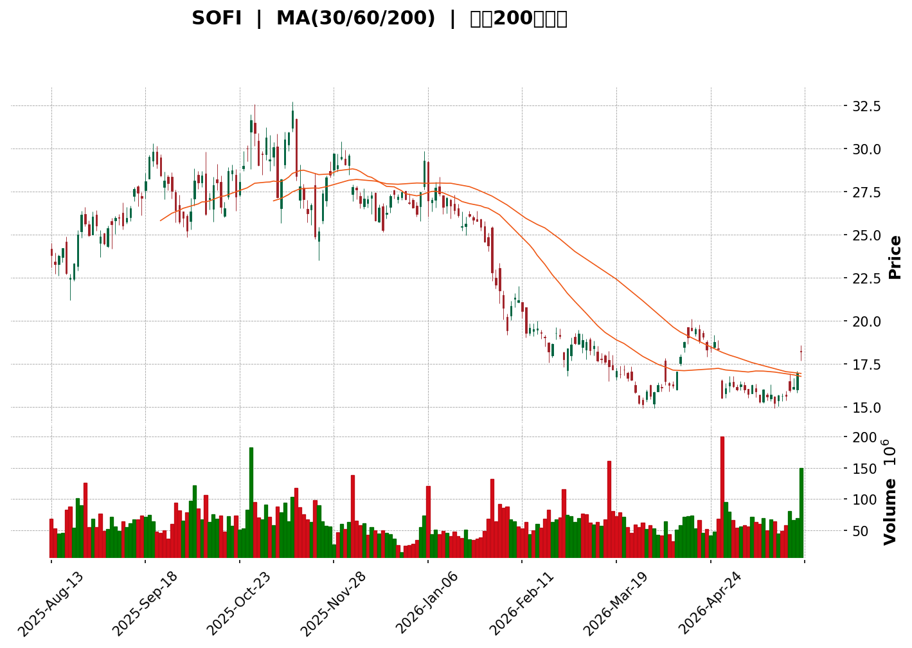
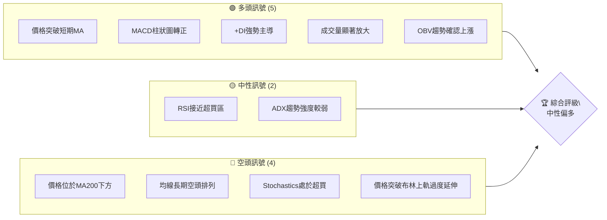
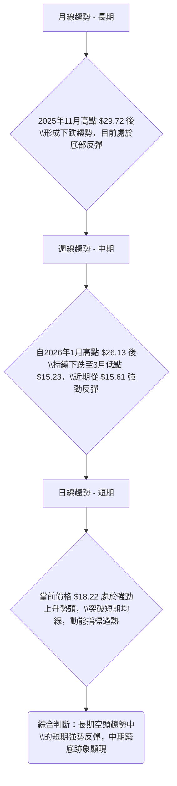
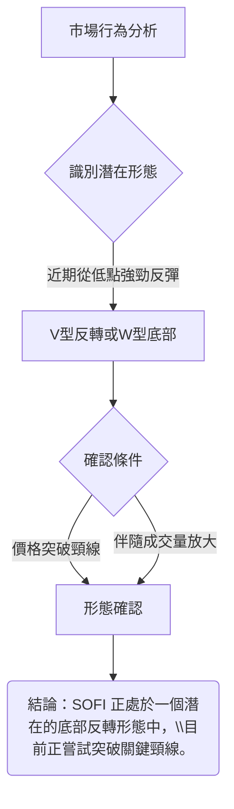

<details>
<summary>📊 靜態圖表 (點擊展開)</summary>

</details>

<html>
<head><meta charset="utf-8" /></head>
<body>
    <div>                        <script>window.PlotlyConfig = {MathJaxConfig: 'local'};</script>
        <script charset="utf-8" src="https://cdn.plot.ly/plotly-3.5.0.min.js" integrity="sha256-fHbNLP+GlIXN+efbQec78UkemUz3NJp7UmfGxC1tNxs=" crossorigin="anonymous"></script>                <div id="candlestick-chart" class="plotly-graph-div" style="height:500px; width:100%;"></div>            <script>                window.PLOTLYENV=window.PLOTLYENV || {};                                if (document.getElementById("candlestick-chart")) {                    Plotly.newPlot(                        "candlestick-chart",                        [{"close":{"dtype":"f8","bdata":"AAAAIFzPN0AAAACAPUo3QAAAAMAexTdAAAAAQOE6OEAAAAAAAMA2QAAAAMAehTZAAAAA4HpUN0AAAADAHgU5QAAAAGBmJjpAAAAAYLieOUAAAACAwvU4QAAAAIA9CjpAAAAAgD2KOUAAAADA9eg4QAAAAKBwfThAAAAAoEdhOUAAAACgmZk5QAAAAIDC9TlAAAAA4FH4OUAAAADAHoU5QAAAAIDC9TlAAAAAwMyMOkAAAAAghas7QAAAACCFaztAAAAAANcjO0AAAAAAKRw8QAAAAGCPgj1AAAAAIFzPPUAAAABAChc9QAAAAOCjcDxAAAAAYLgePEAAAABA4fo7QAAAAMDMjDtAAAAAIIVrOkAAAABgj8I5QAAAAOBR+DlAAAAAoHA9OUAAAAAAKVw6QAAAAADXIzxAAAAAwB4FPEAAAABAM3M8QAAAAOCjMDpAAAAAANcjO0AAAABguN47QAAAACCuBzxAAAAAoJmZOkAAAACAPYo6QAAAAIAUrjxAAAAAAADAPEAAAADgozA7QAAAAOB6FDxAAAAAYI8CPUAAAAAAAAA+QAAAAMD1qD9AAAAAYGbmPkAAAAAgrgc9QAAAAIAUrj1AAAAAoEehPkAAAABguF49QAAAAIDrET5AAAAAwPUoO0AAAACAwjU8QAAAAIA9ij5AAAAAQDPzPkAAAABA4RpAQAAAAADXYzxAAAAAgOvRO0AAAACAPQo7QAAAAKBwPTpAAAAA4FG4OkAAAADA9eg4QAAAAOCjMDlAAAAAYGZmO0AAAADgelQ8QAAAAKBwfTxAAAAA4FG4PUAAAAAgrgc9QAAAAGCPgj1AAAAAgOsRPUAAAACgmZk9QAAAACCuxztAAAAAACmcO0AAAADgetQ6QAAAAEAKFztAAAAAgOsRO0AAAAAgrkc7QAAAAIDr0TlAAAAA4HqUOkAAAADAHkU5QAAAAIA9SjpAAAAAoHA9O0AAAACgmVk7QAAAAOCjMDtAAAAAQOF6O0AAAACA6xE7QAAAAIDr0TpAAAAAIFyPOkAAAACAFC46QAAAAIDCdTtAAAAAIK5HPUAAAABA4fo6QAAAAAAAADtAAAAA4FG4O0AAAABgZmY7QAAAAKCZmTpAAAAAANcjO0AAAAAghas6QAAAAOCjcDpAAAAAoEchOkAAAACgcH05QAAAAADXozlAAAAAQAoXOkAAAACgmdk5QAAAAMDMzDlAAAAAgMJ1OUAAAACgmZk4QAAAAAApXDhAAAAAIFzPNkAAAADgehQ2QAAAAGCPwjVAAAAAAADANEAAAACAwnUzQAAAAAAp3DRAAAAAoJlZNUAAAACAFC41QAAAAMDMjDRAAAAAwMxMM0AAAAAAKZwzQAAAAGCPgjNAAAAAgD2KM0AAAADAzEwzQAAAAMAeBTNAAAAA4FE4MkAAAADA9agyQAAAAIA9SjNAAAAAoJkZM0AAAABgj8IxQAAAAADXYzJAAAAAACmcMkAAAABAM7MyQAAAAAAAQDNAAAAAYGbmMkAAAACAPcoyQAAAAIA9SjJAAAAAIK6HMkAAAABAM7MxQAAAAGCPwjFAAAAAoEehMUAAAABguF4xQAAAAIAULjFAAAAA4HoUMUAAAABgZuYwQAAAAGBmJjFAAAAAQDOzMEAAAAAgXI8wQAAAAKBwvS9AAAAAgMJ1LkAAAADAzEwuQAAAAGCPwi9AAAAAYI9CL0AAAABAM7MvQAAAAMAeRTBAAAAAACkcMEAAAACgcH0wQAAAAMAeRTBAAAAA4FE4MEAAAADAzAwxQAAAAMD16DFAAAAAgD3KMkAAAAAgrgczQAAAAIAUbjNAAAAAAACAM0AAAADgetQyQAAAACBcDzNAAAAAgOtRMkAAAADgo3AyQAAAAGCPwjJAAAAAAClcMkAAAADAzAwvQAAAAKCZGTBAAAAAgBRuMEAAAABAMzMwQAAAAMAeBTBAAAAAwMxMMEAAAAAAAAAwQAAAAAAAgC9AAAAAYI9CMEAAAADAzMwvQAAAAGC4ni5AAAAAwB4FMEAAAADgUTgvQAAAACCFay9AAAAAgMJ1LkAAAACgR2EvQAAAAMDMTC9AAAAAoHA9L0AAAACAwvUvQAAAACCFKzBAAAAA4FH4MEAAAADgUTgyQA=="},"high":{"dtype":"f8","bdata":"AAAAAACAOEAAAABAM\u002fM3QAAAAAAp3DdAAAAAQOE6OEAAAADA9eg4QAAAAOBRuDZAAAAAwHZeN0AAAAAAAEA5QAAAAKBHYTpAAAAAQOGaOkAAAAAgXM85QAAAAOB6VDpAAAAAIIVrOkAAAAAgrkc5QAAAAAApHDlAAAAAgD2KOUAAAADgUfg5QAAAAKCZGTpAAAAA4KMwOkAAAABA4do6QAAAAKCZmTpAAAAA4KOwOkAAAADAHsU7QAAAAKBH4TtAAAAAgMJ1O0AAAABAtpM8QAAAAKBHoT1AAAAAwMxMPkAAAAAA1yM+QAAAACCFqz1AAAAAIIWrPEAAAABA4Xo8QAAAAKBHoTxAAAAAACmcO0AAAADgelQ7QAAAAKCZWTpAAAAAgBQuOkAAAAAA1yM7QAAAAEAK1zxAAAAAgMK1PEAAAADgo7A8QAAAAMDMzD1AAAAAgBRuO0AAAACgmVk8QAAAAEAKFz1AAAAA4KNwPEAAAAAghes6QAAAAIAU7jxAAAAAgOsRPUAAAADAzMw8QAAAAOBRmDxAAAAAYLjePUAAAABAMzM+QAAAAEDh+j9AAAAA4FFIQEAAAACAPeo+QAAAAAAp3D1AAAAA4FE4P0AAAACAPco+QAAAAGC4Xj5AAAAAYOfbPkAAAACgcD08QAAAAOBR+D5AAAAAoHD9PkAAAACgcF1AQAAAAAAAwD9AAAAAgOsRPUAAAABAM\u002fM7QAAAAAAAADtAAAAAoJnZOkAAAABAM5M8QAAAAIDrcTlAAAAAACmcO0AAAABAM3M8QAAAAAAAQD1AAAAAAADAPUAAAABAM7M9QAAAACCFaz5AAAAAgBTuPUAAAABAM7M9QAAAAIAU7jtAAAAA4HrUO0AAAABAM3M7QAAAAIAUrjtAAAAAIK5HO0AAAAAAAIA7QAAAAEDhejtAAAAAoHC9OkAAAACAwtU6QAAAAEAKtzpAAAAAYLheO0AAAABguJ47QAAAAEAKVztAAAAAgD2KO0AAAADAzIw7QAAAAMD1aDtAAAAAANcjO0AAAABgZuY6QAAAAKBHgTtAAAAAACncPUAAAADAzEw9QAAAAIAULjtAAAAAgBQOPEAAAAAAAGA8QAAAAGDlUDtAAAAAQDMzO0AAAACAwhU7QAAAAOB6VDtAAAAAIK7HOkAAAABAClc6QAAAAMDMDDpAAAAAANdjOkAAAACgRyE6QAAAAGBmZjpAAAAAgBTuOUAAAACAPco5QAAAAGC4HjlAAAAA4FF4OUAAAAAAAAA3QAAAAAApXDdAAAAAANfDNUAAAABgZmY0QAAAAMD1KDVAAAAAQAqXNUAAAAAAAAA2QAAAAKCZGTVAAAAAgD3KNEAAAABguN4zQAAAAEAK1zNAAAAAYI8CNEAAAABA4XozQAAAAOCjMDNAAAAAoEfBMkAAAACAwrUyQAAAAGC4njNAAAAAIFyPM0AAAACAwjUyQAAAAMD1aDJAAAAAgD0KM0AAAAAgrkczQAAAAEDhejNAAAAAYLg+M0AAAACA6\u002fEyQAAAAGBmBjNAAAAAoJnZMkAAAADAzIwyQAAAAGBmJjJAAAAAgOsRMkAAAACgR0EyQAAAACCuBzJAAAAAIIVLMUAAAADAcmgxQAAAAMD1aDFAAAAAgOsRMUAAAABAClcxQAAAAKBwfTBAAAAAoEdhL0AAAACgRyEvQAAAAGBmBjBAAAAAgOtRMEAAAAAgrscvQAAAAMDMbDBAAAAAQOFaMEAAAACgmdkxQAAAAOBReDBAAAAAoHB9MEAAAAAgXA8xQAAAAEAzEzJAAAAAgOvRMkAAAABguJ4zQAAAAKBHITRAAAAAwB6lM0AAAADAHsUzQAAAACCwcjNAAAAAYGbmMkAAAABAM5MyQAAAACCFKzNAAAAAYLjeMkAAAABACpcwQAAAAGC4XjBAAAAAIIXLMEAAAAAgrscwQAAAACBcTzBAAAAAoEeBMEAAAACAwnUwQAAAAMDMDDBAAAAAgOtRMEAAAADgelQwQAAAACCFay9AAAAA4KMQMEAAAACAFK4vQAAAAIDrUTBAAAAAIK5HL0AAAADgo3AvQAAAAIDrkS9AAAAAACncL0AAAABAM\u002fMwQAAAAOCjsDBAAAAA4HoUMUAAAADgepQyQA=="},"hovertemplate":"\u003cb\u003e%{x|%Y-%m-%d}\u003c\u002fb\u003e\u003cbr\u003e\u958b: $%{open:.2f}\u003cbr\u003e\u9ad8: $%{high:.2f}\u003cbr\u003e\u4f4e: $%{low:.2f}\u003cbr\u003e\u6536: $%{close:.2f}\u003cextra\u003e\u003c\u002fextra\u003e","low":{"dtype":"f8","bdata":"AAAAQAoXN0AAAACgcL02QAAAAAApnDZAAAAAwPVoN0AAAADgo7A2QAAAAIDCNTVAAAAAIFxPNkAAAABgZuY2QAAAACBczzhAAAAAAACAOUAAAACgR+E4QAAAAAAAADlAAAAAgMI1OUAAAABAM7M3QAAAAADXYzhAAAAAILI9OEAAAACAFC44QAAAAMDMDDlAAAAAwMyMOUAAAADAzEw5QAAAAGC4njlAAAAAwB7FOUAAAAAgXO86QAAAAKBHoTpAAAAAoEchOkAAAADgehQ7QAAAAKBwPTxAAAAA4FH4PEAAAACgmdk8QAAAAKCZWTxAAAAAIFwPO0AAAAAgXI87QAAAAAApHDtAAAAAQDOzOUAAAAAA16M5QAAAAEAzczlAAAAAQArXOEAAAAAgXE85QAAAAIAUrjpAAAAAwB6lO0AAAAAAAMA7QAAAAKBHITpAAAAA4FF4OkAAAAAAAMA5QAAAACBcjztAAAAAAABAOkAAAABgjwI6QAAAACBcDztAAAAAYGYmPEAAAACgR2E6QAAAAKDxMjtAAAAAQDOzPEAAAADAHkU9QAAAAMDMzDxAAAAAANcjPkAAAABA4fo8QAAAAKBwfTxAAAAA4HpUPUAAAADgo7A8QAAAAGCPAj1AAAAAoEchO0AAAADA9ag5QAAAAEAK1zxAAAAA4CLbPUAAAACAwvU+QAAAAGBmJjxAAAAAIK6HOkAAAADAzIw6QAAAAIDCtTlAAAAAIFyPOUAAAABguL44QAAAAMAehTdAAAAAIK6nOUAAAACgR6E6QAAAACBcTzxAAAAA4Hp0PEAAAAAghas8QAAAAOCjUD1AAAAAwB4FPUAAAABA4Xo8QAAAAIAU7jpAAAAAwMwMO0AAAADAzIw6QAAAAEDhejpAAAAAgBSOOkAAAABAMzM6QAAAAIA9yjlAAAAA4FG4OUAAAAAghSs5QAAAAEAz8zlAAAAAIK5HOkAAAACgmRk7QAAAAEAz0zpAAAAAIK4HO0AAAAAgrgc7QAAAAKBwvTpAAAAAgD2KOkAAAAAgXA86QAAAAIA9yjlAAAAAoJmZO0AAAAAgrgc6QAAAAKBwXTpAAAAAgOuROkAAAABA4To7QAAAAEAzMzpAAAAA4FE4OkAAAAAghes5QAAAAIDCNTpAAAAAYI8COkAAAACAwjU5QAAAAEAz8zhAAAAAAAAAOkAAAACgmZk5QAAAAMAexTlAAAAAgMI1OUAAAACA65E4QAAAAMDMDDhAAAAAIFxPNkAAAAAAKdw1QAAAAMAeBTVAAAAAgOsRNEAAAAAAqjEzQAAAAIA9CjRAAAAAwMzMNEAAAADAzAw1QAAAAADXIzRAAAAAgD0KM0AAAABgZiYzQAAAAAApHDNAAAAAoJk5M0AAAADgUfgyQAAAAADXgzJAAAAA4HqUMUAAAAAA1+MxQAAAAIAU7jJAAAAA4FH4MkAAAAAgXE8xQAAAAMDMzDBAAAAA4KOwMUAAAAAAKZwyQAAAAADXozJAAAAAYLgeMkAAAADAHsUxQAAAAIA9CjJAAAAA4FH4MUAAAABguJ4xQAAAACCuhzFAAAAA4FF4MUAAAABA4XowQAAAAMD1KDFAAAAA4HqUMEAAAAAghaswQAAAAEAK1zBAAAAAoHB9MEAAAADAHoUwQAAAAAApnC9AAAAAwMxMLkAAAABguN4tQAAAAGC4ni5AAAAAoEfhLkAAAAAAKdwtQAAAAGCPwi9AAAAAgOvRL0AAAABgj0IwQAAAAOB61C9AAAAA4FEYMEAAAAAghesvQAAAAGBmZjFAAAAAIIUrMkAAAABgZqYyQAAAAADXYzNAAAAAQAoXM0AAAADgo7AyQAAAAMD16DJAAAAAgBTuMUAAAACAwCoyQAAAAADXYzJAAAAAwB5FMkAAAAAAAAAvQAAAAOB6FC9AAAAAAADAL0AAAACgRyEwQAAAAKBH4S9AAAAAQOH6L0AAAADA9agvQAAAAIA9Ci9AAAAAgD2KL0AAAACgmRkvQAAAAIAUbi5AAAAAgMJ1LkAAAABgj8IuQAAAAIAUri5AAAAAQArXLUAAAAAgXA8uQAAAAEAzsy5AAAAA4FG4LkAAAADgUbgvQAAAAGCPAjBAAAAAANejL0AAAACAFK4xQA=="},"name":"\u50f9\u683c","open":{"dtype":"f8","bdata":"AAAAgBQuOEAAAAAghWs3QAAAAIA9SjdAAAAA4KOwN0AAAAAAKZw4QAAAACCFazZAAAAA4KNwNkAAAADA9Sg3QAAAAIAULjlAAAAA4Ho0OkAAAACgcJ05QAAAAMAeBTlAAAAAwPUoOkAAAAAAAIA4QAAAACBcDzlAAAAA4HpUOEAAAADAHsU5QAAAACBczzlAAAAAwB4FOkAAAACAPUo6QAAAAGCPwjlAAAAAAAAAOkAAAAAAAEA7QAAAAIA9yjtAAAAAAABAO0AAAABACpc7QAAAAADXQzxAAAAAwMxMPUAAAACAFM49QAAAAAAAgD1AAAAAYI\u002fCO0AAAABguF48QAAAAAApXDxAAAAA4FF4O0AAAABA4bo6QAAAAOB6VDpAAAAAoJkZOkAAAADAHsU5QAAAAKCZGTtAAAAAoHB9PEAAAACAPQo8QAAAAMDMjDxAAAAAgOsRO0AAAABgj4I6QAAAAEAzMzxAAAAAgOsRPEAAAACgmRk6QAAAAEAzMztAAAAAIFyPPEAAAACgcH08QAAAAOB6VDtAAAAA4FHYPEAAAAAAAAA+QAAAAKBw\u002fT5AAAAAYLh+P0AAAAAgXG8+QAAAAOCjsD1AAAAAwPWoPUAAAAAghUs9QAAAAMAehT1AAAAAAAAgPkAAAABgZoY6QAAAACBcDz1AAAAAYLg+PkAAAACAFC4\u002fQAAAAEDhuj9AAAAAAAAAO0AAAACAwrU7QAAAAGCPgjpAAAAAoJl5OkAAAACgR+E7QAAAAKBHoThAAAAA4HrUOUAAAABA4fo6QAAAAIDCtTxAAAAAgD3KPEAAAADgetQ8QAAAAADXYz1AAAAAwMxsPUAAAADA9Qg9QAAAAKBwXTtAAAAAQOG6O0AAAACgcD07QAAAAGBmpjpAAAAAQArXOkAAAADAHiU7QAAAACBcbztAAAAAoHC9OUAAAAAA16M6QAAAAIAULjpAAAAAYLieOkAAAADgUZg7QAAAAIDrETtAAAAAIIUrO0AAAACAPYo7QAAAAGC43jpAAAAAIK4HO0AAAACAFK46QAAAAMD1qDpAAAAAIFzPO0AAAABA4To9QAAAAKBw3TpAAAAAAAAAO0AAAACAFM47QAAAAIA9SjtAAAAAQDOzOkAAAAAAAAA7QAAAACBczzpAAAAAgD2KOkAAAADgo3A5QAAAAAAAgDlAAAAAgBQuOkAAAAAAAAA6QAAAAGBm5jlAAAAAYGbmOUAAAAAAAIA5QAAAAKBw3ThAAAAAgBRuOUAAAABgj4I2QAAAAMDMDDdAAAAAoHB9NUAAAABA4To0QAAAAIA9SjRAAAAAgD1KNUAAAABAChc1QAAAAKCZGTVAAAAAgD3KNEAAAAAgrkczQAAAAMD1aDNAAAAA4FF4M0AAAADgelQzQAAAAIDCFTNAAAAAQOG6MkAAAAAAAAAyQAAAACCuRzNAAAAA4KMwM0AAAADA9SgyQAAAAMAeJTFAAAAAAAAAMkAAAAAgXA8zQAAAAGBmpjJAAAAAACl8MkAAAADgelQyQAAAACCF6zJAAAAAANdjMkAAAADgUTgyQAAAAMDMzDFAAAAAAAAAMkAAAADgUbgxQAAAAIAUbjFAAAAAAADAMEAAAACAPeowQAAAACCuJzFAAAAAYLj+MEAAAACAPQoxQAAAAGBmRjBAAAAAQApXL0AAAAAAKdwuQAAAAGBm5i5AAAAAYGZGMEAAAACgR2EuQAAAACCuxy9AAAAAwPUoMEAAAACAFK4xQAAAAADXYzBAAAAAwMxMMEAAAAAAAAAwQAAAACCuhzFAAAAA4FF4MkAAAABguJ4zQAAAAKCZmTNAAAAAYI9CM0AAAABgj4IzQAAAAIA9SjNAAAAAwB7FMkAAAADgo3AyQAAAAEDhejJAAAAAwB5lMkAAAADAzIwwQAAAAIA9ii9AAAAAACk8MEAAAADgUXgwQAAAACCFKzBAAAAAQDMzMEAAAABgj0IwQAAAACCuBzBAAAAAoJmZL0AAAACA6xEwQAAAACCFay9AAAAAYLieLkAAAABgZmYvQAAAAIDC9S5AAAAAgMI1L0AAAABA4bouQAAAAKBwPS9AAAAAYGZmL0AAAABA4XowQAAAAMDMDDBAAAAAwB4FMEAAAACgcD0yQA=="},"x":["2025-08-13T00:00:00-04:00","2025-08-14T00:00:00-04:00","2025-08-15T00:00:00-04:00","2025-08-18T00:00:00-04:00","2025-08-19T00:00:00-04:00","2025-08-20T00:00:00-04:00","2025-08-21T00:00:00-04:00","2025-08-22T00:00:00-04:00","2025-08-25T00:00:00-04:00","2025-08-26T00:00:00-04:00","2025-08-27T00:00:00-04:00","2025-08-28T00:00:00-04:00","2025-08-29T00:00:00-04:00","2025-09-02T00:00:00-04:00","2025-09-03T00:00:00-04:00","2025-09-04T00:00:00-04:00","2025-09-05T00:00:00-04:00","2025-09-08T00:00:00-04:00","2025-09-09T00:00:00-04:00","2025-09-10T00:00:00-04:00","2025-09-11T00:00:00-04:00","2025-09-12T00:00:00-04:00","2025-09-15T00:00:00-04:00","2025-09-16T00:00:00-04:00","2025-09-17T00:00:00-04:00","2025-09-18T00:00:00-04:00","2025-09-19T00:00:00-04:00","2025-09-22T00:00:00-04:00","2025-09-23T00:00:00-04:00","2025-09-24T00:00:00-04:00","2025-09-25T00:00:00-04:00","2025-09-26T00:00:00-04:00","2025-09-29T00:00:00-04:00","2025-09-30T00:00:00-04:00","2025-10-01T00:00:00-04:00","2025-10-02T00:00:00-04:00","2025-10-03T00:00:00-04:00","2025-10-06T00:00:00-04:00","2025-10-07T00:00:00-04:00","2025-10-08T00:00:00-04:00","2025-10-09T00:00:00-04:00","2025-10-10T00:00:00-04:00","2025-10-13T00:00:00-04:00","2025-10-14T00:00:00-04:00","2025-10-15T00:00:00-04:00","2025-10-16T00:00:00-04:00","2025-10-17T00:00:00-04:00","2025-10-20T00:00:00-04:00","2025-10-21T00:00:00-04:00","2025-10-22T00:00:00-04:00","2025-10-23T00:00:00-04:00","2025-10-24T00:00:00-04:00","2025-10-27T00:00:00-04:00","2025-10-28T00:00:00-04:00","2025-10-29T00:00:00-04:00","2025-10-30T00:00:00-04:00","2025-10-31T00:00:00-04:00","2025-11-03T00:00:00-05:00","2025-11-04T00:00:00-05:00","2025-11-05T00:00:00-05:00","2025-11-06T00:00:00-05:00","2025-11-07T00:00:00-05:00","2025-11-10T00:00:00-05:00","2025-11-11T00:00:00-05:00","2025-11-12T00:00:00-05:00","2025-11-13T00:00:00-05:00","2025-11-14T00:00:00-05:00","2025-11-17T00:00:00-05:00","2025-11-18T00:00:00-05:00","2025-11-19T00:00:00-05:00","2025-11-20T00:00:00-05:00","2025-11-21T00:00:00-05:00","2025-11-24T00:00:00-05:00","2025-11-25T00:00:00-05:00","2025-11-26T00:00:00-05:00","2025-11-28T00:00:00-05:00","2025-12-01T00:00:00-05:00","2025-12-02T00:00:00-05:00","2025-12-03T00:00:00-05:00","2025-12-04T00:00:00-05:00","2025-12-05T00:00:00-05:00","2025-12-08T00:00:00-05:00","2025-12-09T00:00:00-05:00","2025-12-10T00:00:00-05:00","2025-12-11T00:00:00-05:00","2025-12-12T00:00:00-05:00","2025-12-15T00:00:00-05:00","2025-12-16T00:00:00-05:00","2025-12-17T00:00:00-05:00","2025-12-18T00:00:00-05:00","2025-12-19T00:00:00-05:00","2025-12-22T00:00:00-05:00","2025-12-23T00:00:00-05:00","2025-12-24T00:00:00-05:00","2025-12-26T00:00:00-05:00","2025-12-29T00:00:00-05:00","2025-12-30T00:00:00-05:00","2025-12-31T00:00:00-05:00","2026-01-02T00:00:00-05:00","2026-01-05T00:00:00-05:00","2026-01-06T00:00:00-05:00","2026-01-07T00:00:00-05:00","2026-01-08T00:00:00-05:00","2026-01-09T00:00:00-05:00","2026-01-12T00:00:00-05:00","2026-01-13T00:00:00-05:00","2026-01-14T00:00:00-05:00","2026-01-15T00:00:00-05:00","2026-01-16T00:00:00-05:00","2026-01-20T00:00:00-05:00","2026-01-21T00:00:00-05:00","2026-01-22T00:00:00-05:00","2026-01-23T00:00:00-05:00","2026-01-26T00:00:00-05:00","2026-01-27T00:00:00-05:00","2026-01-28T00:00:00-05:00","2026-01-29T00:00:00-05:00","2026-01-30T00:00:00-05:00","2026-02-02T00:00:00-05:00","2026-02-03T00:00:00-05:00","2026-02-04T00:00:00-05:00","2026-02-05T00:00:00-05:00","2026-02-06T00:00:00-05:00","2026-02-09T00:00:00-05:00","2026-02-10T00:00:00-05:00","2026-02-11T00:00:00-05:00","2026-02-12T00:00:00-05:00","2026-02-13T00:00:00-05:00","2026-02-17T00:00:00-05:00","2026-02-18T00:00:00-05:00","2026-02-19T00:00:00-05:00","2026-02-20T00:00:00-05:00","2026-02-23T00:00:00-05:00","2026-02-24T00:00:00-05:00","2026-02-25T00:00:00-05:00","2026-02-26T00:00:00-05:00","2026-02-27T00:00:00-05:00","2026-03-02T00:00:00-05:00","2026-03-03T00:00:00-05:00","2026-03-04T00:00:00-05:00","2026-03-05T00:00:00-05:00","2026-03-06T00:00:00-05:00","2026-03-09T00:00:00-04:00","2026-03-10T00:00:00-04:00","2026-03-11T00:00:00-04:00","2026-03-12T00:00:00-04:00","2026-03-13T00:00:00-04:00","2026-03-16T00:00:00-04:00","2026-03-17T00:00:00-04:00","2026-03-18T00:00:00-04:00","2026-03-19T00:00:00-04:00","2026-03-20T00:00:00-04:00","2026-03-23T00:00:00-04:00","2026-03-24T00:00:00-04:00","2026-03-25T00:00:00-04:00","2026-03-26T00:00:00-04:00","2026-03-27T00:00:00-04:00","2026-03-30T00:00:00-04:00","2026-03-31T00:00:00-04:00","2026-04-01T00:00:00-04:00","2026-04-02T00:00:00-04:00","2026-04-06T00:00:00-04:00","2026-04-07T00:00:00-04:00","2026-04-08T00:00:00-04:00","2026-04-09T00:00:00-04:00","2026-04-10T00:00:00-04:00","2026-04-13T00:00:00-04:00","2026-04-14T00:00:00-04:00","2026-04-15T00:00:00-04:00","2026-04-16T00:00:00-04:00","2026-04-17T00:00:00-04:00","2026-04-20T00:00:00-04:00","2026-04-21T00:00:00-04:00","2026-04-22T00:00:00-04:00","2026-04-23T00:00:00-04:00","2026-04-24T00:00:00-04:00","2026-04-27T00:00:00-04:00","2026-04-28T00:00:00-04:00","2026-04-29T00:00:00-04:00","2026-04-30T00:00:00-04:00","2026-05-01T00:00:00-04:00","2026-05-04T00:00:00-04:00","2026-05-05T00:00:00-04:00","2026-05-06T00:00:00-04:00","2026-05-07T00:00:00-04:00","2026-05-08T00:00:00-04:00","2026-05-11T00:00:00-04:00","2026-05-12T00:00:00-04:00","2026-05-13T00:00:00-04:00","2026-05-14T00:00:00-04:00","2026-05-15T00:00:00-04:00","2026-05-18T00:00:00-04:00","2026-05-19T00:00:00-04:00","2026-05-20T00:00:00-04:00","2026-05-21T00:00:00-04:00","2026-05-22T00:00:00-04:00","2026-05-26T00:00:00-04:00","2026-05-27T00:00:00-04:00","2026-05-28T00:00:00-04:00","2026-05-29T00:00:00-04:00"],"type":"candlestick"},{"hovertemplate":"MA30: $%{y:.2f}\u003cextra\u003e\u003c\u002fextra\u003e","line":{"color":"#2196F3","dash":"dash","width":2},"mode":"lines","name":"MA30","x":["2025-08-13T00:00:00-04:00","2025-08-14T00:00:00-04:00","2025-08-15T00:00:00-04:00","2025-08-18T00:00:00-04:00","2025-08-19T00:00:00-04:00","2025-08-20T00:00:00-04:00","2025-08-21T00:00:00-04:00","2025-08-22T00:00:00-04:00","2025-08-25T00:00:00-04:00","2025-08-26T00:00:00-04:00","2025-08-27T00:00:00-04:00","2025-08-28T00:00:00-04:00","2025-08-29T00:00:00-04:00","2025-09-02T00:00:00-04:00","2025-09-03T00:00:00-04:00","2025-09-04T00:00:00-04:00","2025-09-05T00:00:00-04:00","2025-09-08T00:00:00-04:00","2025-09-09T00:00:00-04:00","2025-09-10T00:00:00-04:00","2025-09-11T00:00:00-04:00","2025-09-12T00:00:00-04:00","2025-09-15T00:00:00-04:00","2025-09-16T00:00:00-04:00","2025-09-17T00:00:00-04:00","2025-09-18T00:00:00-04:00","2025-09-19T00:00:00-04:00","2025-09-22T00:00:00-04:00","2025-09-23T00:00:00-04:00","2025-09-24T00:00:00-04:00","2025-09-25T00:00:00-04:00","2025-09-26T00:00:00-04:00","2025-09-29T00:00:00-04:00","2025-09-30T00:00:00-04:00","2025-10-01T00:00:00-04:00","2025-10-02T00:00:00-04:00","2025-10-03T00:00:00-04:00","2025-10-06T00:00:00-04:00","2025-10-07T00:00:00-04:00","2025-10-08T00:00:00-04:00","2025-10-09T00:00:00-04:00","2025-10-10T00:00:00-04:00","2025-10-13T00:00:00-04:00","2025-10-14T00:00:00-04:00","2025-10-15T00:00:00-04:00","2025-10-16T00:00:00-04:00","2025-10-17T00:00:00-04:00","2025-10-20T00:00:00-04:00","2025-10-21T00:00:00-04:00","2025-10-22T00:00:00-04:00","2025-10-23T00:00:00-04:00","2025-10-24T00:00:00-04:00","2025-10-27T00:00:00-04:00","2025-10-28T00:00:00-04:00","2025-10-29T00:00:00-04:00","2025-10-30T00:00:00-04:00","2025-10-31T00:00:00-04:00","2025-11-03T00:00:00-05:00","2025-11-04T00:00:00-05:00","2025-11-05T00:00:00-05:00","2025-11-06T00:00:00-05:00","2025-11-07T00:00:00-05:00","2025-11-10T00:00:00-05:00","2025-11-11T00:00:00-05:00","2025-11-12T00:00:00-05:00","2025-11-13T00:00:00-05:00","2025-11-14T00:00:00-05:00","2025-11-17T00:00:00-05:00","2025-11-18T00:00:00-05:00","2025-11-19T00:00:00-05:00","2025-11-20T00:00:00-05:00","2025-11-21T00:00:00-05:00","2025-11-24T00:00:00-05:00","2025-11-25T00:00:00-05:00","2025-11-26T00:00:00-05:00","2025-11-28T00:00:00-05:00","2025-12-01T00:00:00-05:00","2025-12-02T00:00:00-05:00","2025-12-03T00:00:00-05:00","2025-12-04T00:00:00-05:00","2025-12-05T00:00:00-05:00","2025-12-08T00:00:00-05:00","2025-12-09T00:00:00-05:00","2025-12-10T00:00:00-05:00","2025-12-11T00:00:00-05:00","2025-12-12T00:00:00-05:00","2025-12-15T00:00:00-05:00","2025-12-16T00:00:00-05:00","2025-12-17T00:00:00-05:00","2025-12-18T00:00:00-05:00","2025-12-19T00:00:00-05:00","2025-12-22T00:00:00-05:00","2025-12-23T00:00:00-05:00","2025-12-24T00:00:00-05:00","2025-12-26T00:00:00-05:00","2025-12-29T00:00:00-05:00","2025-12-30T00:00:00-05:00","2025-12-31T00:00:00-05:00","2026-01-02T00:00:00-05:00","2026-01-05T00:00:00-05:00","2026-01-06T00:00:00-05:00","2026-01-07T00:00:00-05:00","2026-01-08T00:00:00-05:00","2026-01-09T00:00:00-05:00","2026-01-12T00:00:00-05:00","2026-01-13T00:00:00-05:00","2026-01-14T00:00:00-05:00","2026-01-15T00:00:00-05:00","2026-01-16T00:00:00-05:00","2026-01-20T00:00:00-05:00","2026-01-21T00:00:00-05:00","2026-01-22T00:00:00-05:00","2026-01-23T00:00:00-05:00","2026-01-26T00:00:00-05:00","2026-01-27T00:00:00-05:00","2026-01-28T00:00:00-05:00","2026-01-29T00:00:00-05:00","2026-01-30T00:00:00-05:00","2026-02-02T00:00:00-05:00","2026-02-03T00:00:00-05:00","2026-02-04T00:00:00-05:00","2026-02-05T00:00:00-05:00","2026-02-06T00:00:00-05:00","2026-02-09T00:00:00-05:00","2026-02-10T00:00:00-05:00","2026-02-11T00:00:00-05:00","2026-02-12T00:00:00-05:00","2026-02-13T00:00:00-05:00","2026-02-17T00:00:00-05:00","2026-02-18T00:00:00-05:00","2026-02-19T00:00:00-05:00","2026-02-20T00:00:00-05:00","2026-02-23T00:00:00-05:00","2026-02-24T00:00:00-05:00","2026-02-25T00:00:00-05:00","2026-02-26T00:00:00-05:00","2026-02-27T00:00:00-05:00","2026-03-02T00:00:00-05:00","2026-03-03T00:00:00-05:00","2026-03-04T00:00:00-05:00","2026-03-05T00:00:00-05:00","2026-03-06T00:00:00-05:00","2026-03-09T00:00:00-04:00","2026-03-10T00:00:00-04:00","2026-03-11T00:00:00-04:00","2026-03-12T00:00:00-04:00","2026-03-13T00:00:00-04:00","2026-03-16T00:00:00-04:00","2026-03-17T00:00:00-04:00","2026-03-18T00:00:00-04:00","2026-03-19T00:00:00-04:00","2026-03-20T00:00:00-04:00","2026-03-23T00:00:00-04:00","2026-03-24T00:00:00-04:00","2026-03-25T00:00:00-04:00","2026-03-26T00:00:00-04:00","2026-03-27T00:00:00-04:00","2026-03-30T00:00:00-04:00","2026-03-31T00:00:00-04:00","2026-04-01T00:00:00-04:00","2026-04-02T00:00:00-04:00","2026-04-06T00:00:00-04:00","2026-04-07T00:00:00-04:00","2026-04-08T00:00:00-04:00","2026-04-09T00:00:00-04:00","2026-04-10T00:00:00-04:00","2026-04-13T00:00:00-04:00","2026-04-14T00:00:00-04:00","2026-04-15T00:00:00-04:00","2026-04-16T00:00:00-04:00","2026-04-17T00:00:00-04:00","2026-04-20T00:00:00-04:00","2026-04-21T00:00:00-04:00","2026-04-22T00:00:00-04:00","2026-04-23T00:00:00-04:00","2026-04-24T00:00:00-04:00","2026-04-27T00:00:00-04:00","2026-04-28T00:00:00-04:00","2026-04-29T00:00:00-04:00","2026-04-30T00:00:00-04:00","2026-05-01T00:00:00-04:00","2026-05-04T00:00:00-04:00","2026-05-05T00:00:00-04:00","2026-05-06T00:00:00-04:00","2026-05-07T00:00:00-04:00","2026-05-08T00:00:00-04:00","2026-05-11T00:00:00-04:00","2026-05-12T00:00:00-04:00","2026-05-13T00:00:00-04:00","2026-05-14T00:00:00-04:00","2026-05-15T00:00:00-04:00","2026-05-18T00:00:00-04:00","2026-05-19T00:00:00-04:00","2026-05-20T00:00:00-04:00","2026-05-21T00:00:00-04:00","2026-05-22T00:00:00-04:00","2026-05-26T00:00:00-04:00","2026-05-27T00:00:00-04:00","2026-05-28T00:00:00-04:00","2026-05-29T00:00:00-04:00"],"y":{"dtype":"f8","bdata":"AAAAAAAA+H8AAAAAAAD4fwAAAAAAAPh\u002fAAAAAAAA+H8AAAAAAAD4fwAAAAAAAPh\u002fAAAAAAAA+H8AAAAAAAD4fwAAAAAAAPh\u002fAAAAAAAA+H8AAAAAAAD4fwAAAAAAAPh\u002fAAAAAAAA+H8AAAAAAAD4fwAAAAAAAPh\u002fAAAAAAAA+H8AAAAAAAD4fwAAAAAAAPh\u002fAAAAAAAA+H8AAAAAAAD4fwAAAAAAAPh\u002fAAAAAAAA+H8AAAAAAAD4fwAAAAAAAPh\u002fAAAAAAAA+H8AAAAAAAD4fwAAAAAAAPh\u002fAAAAAAAA+H8AAAAAAAD4fzMzMyOU0TlAq6qqelv2OUAAAADwYB46QImIiHiiPjpAmpmZmVJROkC8u7sLAms6QO\u002fu7q5yiDpAREREJL+YOkCrqqpqLqQ6QDMzM6MptTpAREREhKTJOkCrqqqKbOc6QImIiDi06DpAiYiIeFv2OkARERGxnQ87QBEREfHSLTtAMzMzEzw4O0CamZmJQUA7QImIiHh3VztAmpmZeTBvO0BVVVWlcH07QLy7u9uHjztAAAAA0IWkO0BmZmbGZ7g7QCIiIjKW3DtAq6qqCqz8O0AAAADQhQQ8QO\u002fu7i75BTxAAAAAgPgMPEC8u7srXA88QFVVVfVEHTxA3t3dzRMVPEDv7u4+Chc8QBEREQGOMDxAERER8TVXPEDe3d0tQI48QAAAAMDmojxAiYiI2Oq4PEBERERUuL48QHd3d7eBrjxAIiIi0mmjPEAiIiKSNIU8QJqZmQmsfDxAREREBOR+PEBmZmbm0II8QImIiMi9hjxAZmZmhl2hPEAzMzMDnbY8QM3MzCyyvTxAmpmZOW3APEAzMzPz\u002fdQ8QHd3d5du0jxA7+7uPnzGPEBmZmZGb6s8QFVVVfVvhDxAIiIiMsFjPEAzMzND0lQ8QGZmZvbhMzxAq6qqmlIRPEBEREQEVu47QLy7u3sUzjtA7+7uPsPOO0DNzMyMbMc7QM3MzFzWqjtAd3d3BzqNO0B3d3eHXWE7QAAAAND3UztAzczMTDdJO0CamZmZ4EE7QKuqqrpJTDtAMzMzIyJiO0Dv7u4ezHM7QAAAACA+gztAzczMLPmFO0Dv7u6OCX47QKuqqsrobTtAIiIisuRXO0AiIiIywUM7QN7d3a2OKTtAZmZmJngQO0B3d3e3Ze06QAAAANAi2zpAIiIiUirOOkCrqqp6zcU6QN7d3W3LujpAREREVA6tOkB3d3fHL5Y6QM3MzFy6iTpAvLu7q45pOkAiIiICVk46QCIiIhKuJzpAMzMzc0zwOUCrqqp6+Kw5QCIiImL0djlAIiIiMqVCOUC8u7tLYhA5QFVVVUXh2jhA7+7uju2cOEDNzMws3WQ4QDMzMyMGIThAiYiIyOjNN0ARERGRX4w3QN7d3f1GSDdAzczM7DX3NkCrqqoaoaw2QKuqqipAbjZAVVVVhaQpNkBERERUnN01QFVVVdXqmDVAVVVVJb9YNUCrqqoqzh41QAAAAABH6DRARERENOyqNEBmZmZmrW40QO\u002fu7o6XLjRA7+7uvnTzM0B3d3d3k7gzQLy7u4tBgDNAmpmZqQ1UM0AzMzOD3CszQJqZmVnHBDNAzczMHHblMkBVVVW1nc8yQGZmZhb1rzJAIiIiAkeIMkBmZmZ22mAyQBEREdnqODJAREREzC8WMkDv7u7GIPAxQLy7u+sm0TFAzczMZMmvMUCamZnBWJIxQCIiIkrhejFAVVVV7d9oMUBVVVV9W1YxQKuqqjKWPDFAVVVVvQIkMUAAAAC48x0xQM3MzCTbGTFAREREXGQbMUCamZlBNR4xQBEREXm+HzFAmpmZMd0kMUCrqqqSNCUxQBEREanGKzFAAAAA6PspMUDe3d11TDAxQGZmZv7UODFAzczMtA8\u002fMUBVVVU9US8xQJqZmfEZJjFAd3d3\u002f40gMUC8u7vTlBoxQGZmZk7wEDFAVVVVfYYNMUDv7u4mvwgxQCIiIgK5BzFAREREFIMQMUCrqqp66RYxQLy7u0sMEjFAvLu7Q2AVMUCamZn5UxMxQKuqqqKMDjFAZmZmPgoHMUDe3d2dNgAxQERERDTs+jBAREREfM31MEAREREJrOwwQKuqqvLS3TBAAAAAGEvOMEBmZmaeYccwQA=="},"type":"scatter"},{"hovertemplate":"MA60: $%{y:.2f}\u003cextra\u003e\u003c\u002fextra\u003e","line":{"color":"#9C27B0","dash":"dash","width":2},"mode":"lines","name":"MA60","x":["2025-08-13T00:00:00-04:00","2025-08-14T00:00:00-04:00","2025-08-15T00:00:00-04:00","2025-08-18T00:00:00-04:00","2025-08-19T00:00:00-04:00","2025-08-20T00:00:00-04:00","2025-08-21T00:00:00-04:00","2025-08-22T00:00:00-04:00","2025-08-25T00:00:00-04:00","2025-08-26T00:00:00-04:00","2025-08-27T00:00:00-04:00","2025-08-28T00:00:00-04:00","2025-08-29T00:00:00-04:00","2025-09-02T00:00:00-04:00","2025-09-03T00:00:00-04:00","2025-09-04T00:00:00-04:00","2025-09-05T00:00:00-04:00","2025-09-08T00:00:00-04:00","2025-09-09T00:00:00-04:00","2025-09-10T00:00:00-04:00","2025-09-11T00:00:00-04:00","2025-09-12T00:00:00-04:00","2025-09-15T00:00:00-04:00","2025-09-16T00:00:00-04:00","2025-09-17T00:00:00-04:00","2025-09-18T00:00:00-04:00","2025-09-19T00:00:00-04:00","2025-09-22T00:00:00-04:00","2025-09-23T00:00:00-04:00","2025-09-24T00:00:00-04:00","2025-09-25T00:00:00-04:00","2025-09-26T00:00:00-04:00","2025-09-29T00:00:00-04:00","2025-09-30T00:00:00-04:00","2025-10-01T00:00:00-04:00","2025-10-02T00:00:00-04:00","2025-10-03T00:00:00-04:00","2025-10-06T00:00:00-04:00","2025-10-07T00:00:00-04:00","2025-10-08T00:00:00-04:00","2025-10-09T00:00:00-04:00","2025-10-10T00:00:00-04:00","2025-10-13T00:00:00-04:00","2025-10-14T00:00:00-04:00","2025-10-15T00:00:00-04:00","2025-10-16T00:00:00-04:00","2025-10-17T00:00:00-04:00","2025-10-20T00:00:00-04:00","2025-10-21T00:00:00-04:00","2025-10-22T00:00:00-04:00","2025-10-23T00:00:00-04:00","2025-10-24T00:00:00-04:00","2025-10-27T00:00:00-04:00","2025-10-28T00:00:00-04:00","2025-10-29T00:00:00-04:00","2025-10-30T00:00:00-04:00","2025-10-31T00:00:00-04:00","2025-11-03T00:00:00-05:00","2025-11-04T00:00:00-05:00","2025-11-05T00:00:00-05:00","2025-11-06T00:00:00-05:00","2025-11-07T00:00:00-05:00","2025-11-10T00:00:00-05:00","2025-11-11T00:00:00-05:00","2025-11-12T00:00:00-05:00","2025-11-13T00:00:00-05:00","2025-11-14T00:00:00-05:00","2025-11-17T00:00:00-05:00","2025-11-18T00:00:00-05:00","2025-11-19T00:00:00-05:00","2025-11-20T00:00:00-05:00","2025-11-21T00:00:00-05:00","2025-11-24T00:00:00-05:00","2025-11-25T00:00:00-05:00","2025-11-26T00:00:00-05:00","2025-11-28T00:00:00-05:00","2025-12-01T00:00:00-05:00","2025-12-02T00:00:00-05:00","2025-12-03T00:00:00-05:00","2025-12-04T00:00:00-05:00","2025-12-05T00:00:00-05:00","2025-12-08T00:00:00-05:00","2025-12-09T00:00:00-05:00","2025-12-10T00:00:00-05:00","2025-12-11T00:00:00-05:00","2025-12-12T00:00:00-05:00","2025-12-15T00:00:00-05:00","2025-12-16T00:00:00-05:00","2025-12-17T00:00:00-05:00","2025-12-18T00:00:00-05:00","2025-12-19T00:00:00-05:00","2025-12-22T00:00:00-05:00","2025-12-23T00:00:00-05:00","2025-12-24T00:00:00-05:00","2025-12-26T00:00:00-05:00","2025-12-29T00:00:00-05:00","2025-12-30T00:00:00-05:00","2025-12-31T00:00:00-05:00","2026-01-02T00:00:00-05:00","2026-01-05T00:00:00-05:00","2026-01-06T00:00:00-05:00","2026-01-07T00:00:00-05:00","2026-01-08T00:00:00-05:00","2026-01-09T00:00:00-05:00","2026-01-12T00:00:00-05:00","2026-01-13T00:00:00-05:00","2026-01-14T00:00:00-05:00","2026-01-15T00:00:00-05:00","2026-01-16T00:00:00-05:00","2026-01-20T00:00:00-05:00","2026-01-21T00:00:00-05:00","2026-01-22T00:00:00-05:00","2026-01-23T00:00:00-05:00","2026-01-26T00:00:00-05:00","2026-01-27T00:00:00-05:00","2026-01-28T00:00:00-05:00","2026-01-29T00:00:00-05:00","2026-01-30T00:00:00-05:00","2026-02-02T00:00:00-05:00","2026-02-03T00:00:00-05:00","2026-02-04T00:00:00-05:00","2026-02-05T00:00:00-05:00","2026-02-06T00:00:00-05:00","2026-02-09T00:00:00-05:00","2026-02-10T00:00:00-05:00","2026-02-11T00:00:00-05:00","2026-02-12T00:00:00-05:00","2026-02-13T00:00:00-05:00","2026-02-17T00:00:00-05:00","2026-02-18T00:00:00-05:00","2026-02-19T00:00:00-05:00","2026-02-20T00:00:00-05:00","2026-02-23T00:00:00-05:00","2026-02-24T00:00:00-05:00","2026-02-25T00:00:00-05:00","2026-02-26T00:00:00-05:00","2026-02-27T00:00:00-05:00","2026-03-02T00:00:00-05:00","2026-03-03T00:00:00-05:00","2026-03-04T00:00:00-05:00","2026-03-05T00:00:00-05:00","2026-03-06T00:00:00-05:00","2026-03-09T00:00:00-04:00","2026-03-10T00:00:00-04:00","2026-03-11T00:00:00-04:00","2026-03-12T00:00:00-04:00","2026-03-13T00:00:00-04:00","2026-03-16T00:00:00-04:00","2026-03-17T00:00:00-04:00","2026-03-18T00:00:00-04:00","2026-03-19T00:00:00-04:00","2026-03-20T00:00:00-04:00","2026-03-23T00:00:00-04:00","2026-03-24T00:00:00-04:00","2026-03-25T00:00:00-04:00","2026-03-26T00:00:00-04:00","2026-03-27T00:00:00-04:00","2026-03-30T00:00:00-04:00","2026-03-31T00:00:00-04:00","2026-04-01T00:00:00-04:00","2026-04-02T00:00:00-04:00","2026-04-06T00:00:00-04:00","2026-04-07T00:00:00-04:00","2026-04-08T00:00:00-04:00","2026-04-09T00:00:00-04:00","2026-04-10T00:00:00-04:00","2026-04-13T00:00:00-04:00","2026-04-14T00:00:00-04:00","2026-04-15T00:00:00-04:00","2026-04-16T00:00:00-04:00","2026-04-17T00:00:00-04:00","2026-04-20T00:00:00-04:00","2026-04-21T00:00:00-04:00","2026-04-22T00:00:00-04:00","2026-04-23T00:00:00-04:00","2026-04-24T00:00:00-04:00","2026-04-27T00:00:00-04:00","2026-04-28T00:00:00-04:00","2026-04-29T00:00:00-04:00","2026-04-30T00:00:00-04:00","2026-05-01T00:00:00-04:00","2026-05-04T00:00:00-04:00","2026-05-05T00:00:00-04:00","2026-05-06T00:00:00-04:00","2026-05-07T00:00:00-04:00","2026-05-08T00:00:00-04:00","2026-05-11T00:00:00-04:00","2026-05-12T00:00:00-04:00","2026-05-13T00:00:00-04:00","2026-05-14T00:00:00-04:00","2026-05-15T00:00:00-04:00","2026-05-18T00:00:00-04:00","2026-05-19T00:00:00-04:00","2026-05-20T00:00:00-04:00","2026-05-21T00:00:00-04:00","2026-05-22T00:00:00-04:00","2026-05-26T00:00:00-04:00","2026-05-27T00:00:00-04:00","2026-05-28T00:00:00-04:00","2026-05-29T00:00:00-04:00"],"y":{"dtype":"f8","bdata":"AAAAAAAA+H8AAAAAAAD4fwAAAAAAAPh\u002fAAAAAAAA+H8AAAAAAAD4fwAAAAAAAPh\u002fAAAAAAAA+H8AAAAAAAD4fwAAAAAAAPh\u002fAAAAAAAA+H8AAAAAAAD4fwAAAAAAAPh\u002fAAAAAAAA+H8AAAAAAAD4fwAAAAAAAPh\u002fAAAAAAAA+H8AAAAAAAD4fwAAAAAAAPh\u002fAAAAAAAA+H8AAAAAAAD4fwAAAAAAAPh\u002fAAAAAAAA+H8AAAAAAAD4fwAAAAAAAPh\u002fAAAAAAAA+H8AAAAAAAD4fwAAAAAAAPh\u002fAAAAAAAA+H8AAAAAAAD4fwAAAAAAAPh\u002fAAAAAAAA+H8AAAAAAAD4fwAAAAAAAPh\u002fAAAAAAAA+H8AAAAAAAD4fwAAAAAAAPh\u002fAAAAAAAA+H8AAAAAAAD4fwAAAAAAAPh\u002fAAAAAAAA+H8AAAAAAAD4fwAAAAAAAPh\u002fAAAAAAAA+H8AAAAAAAD4fwAAAAAAAPh\u002fAAAAAAAA+H8AAAAAAAD4fwAAAAAAAPh\u002fAAAAAAAA+H8AAAAAAAD4fwAAAAAAAPh\u002fAAAAAAAA+H8AAAAAAAD4fwAAAAAAAPh\u002fAAAAAAAA+H8AAAAAAAD4fwAAAAAAAPh\u002fAAAAAAAA+H8AAAAAAAD4f0RERIxs9zpAREREpLcFO0B3d3eXtRo7QM3MzDyYNztAVVVVRURUO0DNzMwcoXw7QHd3d7eslTtAZmZm\u002ftSoO0B3d3dfc7E7QFVVVa3VsTtAMzMzK4e2O0BmZmaOULY7QBERESGwsjtAZmZmvp+6O0C8u7tLN8k7QM3MzFxI2jtAzczMzMzsO0BmZmZGb\u002fs7QKuqqtKUCjxAmpmZ2c4XPEBERERMNyk8QJqZmTn7MDxAd3d3B4E1PEBmZmaG6zE8QLy7uxODMDxAZmZmnjYwPECamZkJrCw8QKuqqpLtHDxAVVVVjSUPPEAAAAAY2f47QImIiLis9TtAZmZmhuvxO0De3d1lO+87QO\u002fu7i6y7TtARERE\u002fDfyO0Crqqrazvc7QAAAAEhv+ztAq6qqEhEBPEDv7u52TAA8QBEREbll\u002fTtAq6qq+sUCPECJiIhYgPw7QM3MzBT1\u002fztAiYiImG4CPECrqqo6bQA8QJqZmUlT+jtAREREHKH8O0CrqqoaL\u002f07QFVVVW2g8ztAAAAAsHLoO0BVVVXVMeE7QLy7u7PI1jtAiYiISFPKO0CJiIhgnrg7QJqZmbGdnztAMzMzw2eIO0BVVVUFgXU7QJqZmSnOXjtAMzMzo3A9O0AzMzMDVh47QO\u002fu7kbh+jpAERER2YffOkC8u7uDMro6QHd3d1\u002flkDpAzczMnO9nOkCamZnp3zg6QKuqqopsFzpA3t3dbRLzOUAzMzPjXtM5QO\u002fu7u6ntjlA3t3ddQWYOUAAAADYFYA5QO\u002fu7o7CZTlAzczMjJc+OUDNzMxUVRU5QKuqqnoU7jhAvLu7m8TAOEAzMzPDrpA4QJqZmcE8YThA3t3dpZs0OEARERHxGQY4QAAAAOi04TdAMzMzQ4u8N0CJiIhwPZo3QGZmZn6xdDdAmpmZiUFQN0B3d3efYSc3QERERPT9BDdAq6qqKs7eNkCrqqpCGb02QN7d3bU6ljZAAAAASOFqNkAAAAAYSz42QERERLx0EzZAIiIiGnblNUARERFhnrg1QDMzMw\u002fmiTVAmpmZrY5ZNUDe3d35fio1QHd3d4cW+TRAq6qqFtm+NEBVVVUpXI80QAAAACSUYTRAERER7QowNEAAAABMfgE0QKuqqi5r1TNAVVVVodOmM0AiIiIGyH0zQBEREf1iWTNAzczMwBE6M0AiIiK2gR4zQImIiLwCBDNA7+7usuTnMkCJiIj88MkyQAAAABwvrTJAd3d3U7iOMkCrqqr2b3QyQBEREUWLXDJAMzMzr45JMkBERETgli0yQJqZmaVwFTJAIiIiDgIDMkCJiIhEGfUxQGZmZrJy4DFAvLu7v+bKMUCrqqrOzLQxQJqZme1RoDFAREREcFmTMUDNzMwghYMxQLy7u5uZcTFARERE1JRiMUCamZld1lIxQGZmZva2RDFA3t3dFfU3MUCamZkNSSsxQHd3dzPBGzFAzczMHOgMMUCJiIjgTwUxQLy7uwvX+zBAIiIiutf0MEAAAABwy\u002fIwQA=="},"type":"scatter"},{"hovertemplate":"MA200: $%{y:.2f}\u003cextra\u003e\u003c\u002fextra\u003e","line":{"color":"#FF6F00","dash":"solid","width":2},"mode":"lines","name":"MA200","x":["2025-08-13T00:00:00-04:00","2025-08-14T00:00:00-04:00","2025-08-15T00:00:00-04:00","2025-08-18T00:00:00-04:00","2025-08-19T00:00:00-04:00","2025-08-20T00:00:00-04:00","2025-08-21T00:00:00-04:00","2025-08-22T00:00:00-04:00","2025-08-25T00:00:00-04:00","2025-08-26T00:00:00-04:00","2025-08-27T00:00:00-04:00","2025-08-28T00:00:00-04:00","2025-08-29T00:00:00-04:00","2025-09-02T00:00:00-04:00","2025-09-03T00:00:00-04:00","2025-09-04T00:00:00-04:00","2025-09-05T00:00:00-04:00","2025-09-08T00:00:00-04:00","2025-09-09T00:00:00-04:00","2025-09-10T00:00:00-04:00","2025-09-11T00:00:00-04:00","2025-09-12T00:00:00-04:00","2025-09-15T00:00:00-04:00","2025-09-16T00:00:00-04:00","2025-09-17T00:00:00-04:00","2025-09-18T00:00:00-04:00","2025-09-19T00:00:00-04:00","2025-09-22T00:00:00-04:00","2025-09-23T00:00:00-04:00","2025-09-24T00:00:00-04:00","2025-09-25T00:00:00-04:00","2025-09-26T00:00:00-04:00","2025-09-29T00:00:00-04:00","2025-09-30T00:00:00-04:00","2025-10-01T00:00:00-04:00","2025-10-02T00:00:00-04:00","2025-10-03T00:00:00-04:00","2025-10-06T00:00:00-04:00","2025-10-07T00:00:00-04:00","2025-10-08T00:00:00-04:00","2025-10-09T00:00:00-04:00","2025-10-10T00:00:00-04:00","2025-10-13T00:00:00-04:00","2025-10-14T00:00:00-04:00","2025-10-15T00:00:00-04:00","2025-10-16T00:00:00-04:00","2025-10-17T00:00:00-04:00","2025-10-20T00:00:00-04:00","2025-10-21T00:00:00-04:00","2025-10-22T00:00:00-04:00","2025-10-23T00:00:00-04:00","2025-10-24T00:00:00-04:00","2025-10-27T00:00:00-04:00","2025-10-28T00:00:00-04:00","2025-10-29T00:00:00-04:00","2025-10-30T00:00:00-04:00","2025-10-31T00:00:00-04:00","2025-11-03T00:00:00-05:00","2025-11-04T00:00:00-05:00","2025-11-05T00:00:00-05:00","2025-11-06T00:00:00-05:00","2025-11-07T00:00:00-05:00","2025-11-10T00:00:00-05:00","2025-11-11T00:00:00-05:00","2025-11-12T00:00:00-05:00","2025-11-13T00:00:00-05:00","2025-11-14T00:00:00-05:00","2025-11-17T00:00:00-05:00","2025-11-18T00:00:00-05:00","2025-11-19T00:00:00-05:00","2025-11-20T00:00:00-05:00","2025-11-21T00:00:00-05:00","2025-11-24T00:00:00-05:00","2025-11-25T00:00:00-05:00","2025-11-26T00:00:00-05:00","2025-11-28T00:00:00-05:00","2025-12-01T00:00:00-05:00","2025-12-02T00:00:00-05:00","2025-12-03T00:00:00-05:00","2025-12-04T00:00:00-05:00","2025-12-05T00:00:00-05:00","2025-12-08T00:00:00-05:00","2025-12-09T00:00:00-05:00","2025-12-10T00:00:00-05:00","2025-12-11T00:00:00-05:00","2025-12-12T00:00:00-05:00","2025-12-15T00:00:00-05:00","2025-12-16T00:00:00-05:00","2025-12-17T00:00:00-05:00","2025-12-18T00:00:00-05:00","2025-12-19T00:00:00-05:00","2025-12-22T00:00:00-05:00","2025-12-23T00:00:00-05:00","2025-12-24T00:00:00-05:00","2025-12-26T00:00:00-05:00","2025-12-29T00:00:00-05:00","2025-12-30T00:00:00-05:00","2025-12-31T00:00:00-05:00","2026-01-02T00:00:00-05:00","2026-01-05T00:00:00-05:00","2026-01-06T00:00:00-05:00","2026-01-07T00:00:00-05:00","2026-01-08T00:00:00-05:00","2026-01-09T00:00:00-05:00","2026-01-12T00:00:00-05:00","2026-01-13T00:00:00-05:00","2026-01-14T00:00:00-05:00","2026-01-15T00:00:00-05:00","2026-01-16T00:00:00-05:00","2026-01-20T00:00:00-05:00","2026-01-21T00:00:00-05:00","2026-01-22T00:00:00-05:00","2026-01-23T00:00:00-05:00","2026-01-26T00:00:00-05:00","2026-01-27T00:00:00-05:00","2026-01-28T00:00:00-05:00","2026-01-29T00:00:00-05:00","2026-01-30T00:00:00-05:00","2026-02-02T00:00:00-05:00","2026-02-03T00:00:00-05:00","2026-02-04T00:00:00-05:00","2026-02-05T00:00:00-05:00","2026-02-06T00:00:00-05:00","2026-02-09T00:00:00-05:00","2026-02-10T00:00:00-05:00","2026-02-11T00:00:00-05:00","2026-02-12T00:00:00-05:00","2026-02-13T00:00:00-05:00","2026-02-17T00:00:00-05:00","2026-02-18T00:00:00-05:00","2026-02-19T00:00:00-05:00","2026-02-20T00:00:00-05:00","2026-02-23T00:00:00-05:00","2026-02-24T00:00:00-05:00","2026-02-25T00:00:00-05:00","2026-02-26T00:00:00-05:00","2026-02-27T00:00:00-05:00","2026-03-02T00:00:00-05:00","2026-03-03T00:00:00-05:00","2026-03-04T00:00:00-05:00","2026-03-05T00:00:00-05:00","2026-03-06T00:00:00-05:00","2026-03-09T00:00:00-04:00","2026-03-10T00:00:00-04:00","2026-03-11T00:00:00-04:00","2026-03-12T00:00:00-04:00","2026-03-13T00:00:00-04:00","2026-03-16T00:00:00-04:00","2026-03-17T00:00:00-04:00","2026-03-18T00:00:00-04:00","2026-03-19T00:00:00-04:00","2026-03-20T00:00:00-04:00","2026-03-23T00:00:00-04:00","2026-03-24T00:00:00-04:00","2026-03-25T00:00:00-04:00","2026-03-26T00:00:00-04:00","2026-03-27T00:00:00-04:00","2026-03-30T00:00:00-04:00","2026-03-31T00:00:00-04:00","2026-04-01T00:00:00-04:00","2026-04-02T00:00:00-04:00","2026-04-06T00:00:00-04:00","2026-04-07T00:00:00-04:00","2026-04-08T00:00:00-04:00","2026-04-09T00:00:00-04:00","2026-04-10T00:00:00-04:00","2026-04-13T00:00:00-04:00","2026-04-14T00:00:00-04:00","2026-04-15T00:00:00-04:00","2026-04-16T00:00:00-04:00","2026-04-17T00:00:00-04:00","2026-04-20T00:00:00-04:00","2026-04-21T00:00:00-04:00","2026-04-22T00:00:00-04:00","2026-04-23T00:00:00-04:00","2026-04-24T00:00:00-04:00","2026-04-27T00:00:00-04:00","2026-04-28T00:00:00-04:00","2026-04-29T00:00:00-04:00","2026-04-30T00:00:00-04:00","2026-05-01T00:00:00-04:00","2026-05-04T00:00:00-04:00","2026-05-05T00:00:00-04:00","2026-05-06T00:00:00-04:00","2026-05-07T00:00:00-04:00","2026-05-08T00:00:00-04:00","2026-05-11T00:00:00-04:00","2026-05-12T00:00:00-04:00","2026-05-13T00:00:00-04:00","2026-05-14T00:00:00-04:00","2026-05-15T00:00:00-04:00","2026-05-18T00:00:00-04:00","2026-05-19T00:00:00-04:00","2026-05-20T00:00:00-04:00","2026-05-21T00:00:00-04:00","2026-05-22T00:00:00-04:00","2026-05-26T00:00:00-04:00","2026-05-27T00:00:00-04:00","2026-05-28T00:00:00-04:00","2026-05-29T00:00:00-04:00"],"y":{"dtype":"f8","bdata":"AAAAAAAA+H8AAAAAAAD4fwAAAAAAAPh\u002fAAAAAAAA+H8AAAAAAAD4fwAAAAAAAPh\u002fAAAAAAAA+H8AAAAAAAD4fwAAAAAAAPh\u002fAAAAAAAA+H8AAAAAAAD4fwAAAAAAAPh\u002fAAAAAAAA+H8AAAAAAAD4fwAAAAAAAPh\u002fAAAAAAAA+H8AAAAAAAD4fwAAAAAAAPh\u002fAAAAAAAA+H8AAAAAAAD4fwAAAAAAAPh\u002fAAAAAAAA+H8AAAAAAAD4fwAAAAAAAPh\u002fAAAAAAAA+H8AAAAAAAD4fwAAAAAAAPh\u002fAAAAAAAA+H8AAAAAAAD4fwAAAAAAAPh\u002fAAAAAAAA+H8AAAAAAAD4fwAAAAAAAPh\u002fAAAAAAAA+H8AAAAAAAD4fwAAAAAAAPh\u002fAAAAAAAA+H8AAAAAAAD4fwAAAAAAAPh\u002fAAAAAAAA+H8AAAAAAAD4fwAAAAAAAPh\u002fAAAAAAAA+H8AAAAAAAD4fwAAAAAAAPh\u002fAAAAAAAA+H8AAAAAAAD4fwAAAAAAAPh\u002fAAAAAAAA+H8AAAAAAAD4fwAAAAAAAPh\u002fAAAAAAAA+H8AAAAAAAD4fwAAAAAAAPh\u002fAAAAAAAA+H8AAAAAAAD4fwAAAAAAAPh\u002fAAAAAAAA+H8AAAAAAAD4fwAAAAAAAPh\u002fAAAAAAAA+H8AAAAAAAD4fwAAAAAAAPh\u002fAAAAAAAA+H8AAAAAAAD4fwAAAAAAAPh\u002fAAAAAAAA+H8AAAAAAAD4fwAAAAAAAPh\u002fAAAAAAAA+H8AAAAAAAD4fwAAAAAAAPh\u002fAAAAAAAA+H8AAAAAAAD4fwAAAAAAAPh\u002fAAAAAAAA+H8AAAAAAAD4fwAAAAAAAPh\u002fAAAAAAAA+H8AAAAAAAD4fwAAAAAAAPh\u002fAAAAAAAA+H8AAAAAAAD4fwAAAAAAAPh\u002fAAAAAAAA+H8AAAAAAAD4fwAAAAAAAPh\u002fAAAAAAAA+H8AAAAAAAD4fwAAAAAAAPh\u002fAAAAAAAA+H8AAAAAAAD4fwAAAAAAAPh\u002fAAAAAAAA+H8AAAAAAAD4fwAAAAAAAPh\u002fAAAAAAAA+H8AAAAAAAD4fwAAAAAAAPh\u002fAAAAAAAA+H8AAAAAAAD4fwAAAAAAAPh\u002fAAAAAAAA+H8AAAAAAAD4fwAAAAAAAPh\u002fAAAAAAAA+H8AAAAAAAD4fwAAAAAAAPh\u002fAAAAAAAA+H8AAAAAAAD4fwAAAAAAAPh\u002fAAAAAAAA+H8AAAAAAAD4fwAAAAAAAPh\u002fAAAAAAAA+H8AAAAAAAD4fwAAAAAAAPh\u002fAAAAAAAA+H8AAAAAAAD4fwAAAAAAAPh\u002fAAAAAAAA+H8AAAAAAAD4fwAAAAAAAPh\u002fAAAAAAAA+H8AAAAAAAD4fwAAAAAAAPh\u002fAAAAAAAA+H8AAAAAAAD4fwAAAAAAAPh\u002fAAAAAAAA+H8AAAAAAAD4fwAAAAAAAPh\u002fAAAAAAAA+H8AAAAAAAD4fwAAAAAAAPh\u002fAAAAAAAA+H8AAAAAAAD4fwAAAAAAAPh\u002fAAAAAAAA+H8AAAAAAAD4fwAAAAAAAPh\u002fAAAAAAAA+H8AAAAAAAD4fwAAAAAAAPh\u002fAAAAAAAA+H8AAAAAAAD4fwAAAAAAAPh\u002fAAAAAAAA+H8AAAAAAAD4fwAAAAAAAPh\u002fAAAAAAAA+H8AAAAAAAD4fwAAAAAAAPh\u002fAAAAAAAA+H8AAAAAAAD4fwAAAAAAAPh\u002fAAAAAAAA+H8AAAAAAAD4fwAAAAAAAPh\u002fAAAAAAAA+H8AAAAAAAD4fwAAAAAAAPh\u002fAAAAAAAA+H8AAAAAAAD4fwAAAAAAAPh\u002fAAAAAAAA+H8AAAAAAAD4fwAAAAAAAPh\u002fAAAAAAAA+H8AAAAAAAD4fwAAAAAAAPh\u002fAAAAAAAA+H8AAAAAAAD4fwAAAAAAAPh\u002fAAAAAAAA+H8AAAAAAAD4fwAAAAAAAPh\u002fAAAAAAAA+H8AAAAAAAD4fwAAAAAAAPh\u002fAAAAAAAA+H8AAAAAAAD4fwAAAAAAAPh\u002fAAAAAAAA+H8AAAAAAAD4fwAAAAAAAPh\u002fAAAAAAAA+H8AAAAAAAD4fwAAAAAAAPh\u002fAAAAAAAA+H8AAAAAAAD4fwAAAAAAAPh\u002fAAAAAAAA+H8AAAAAAAD4fwAAAAAAAPh\u002fAAAAAAAA+H8AAAAAAAD4fwAAAAAAAPh\u002fAAAAAAAA+H9mZma62jY3QA=="},"type":"scatter"}],                        {"template":{"data":{"barpolar":[{"marker":{"line":{"color":"rgb(17,17,17)","width":0.5},"pattern":{"fillmode":"overlay","size":10,"solidity":0.2}},"type":"barpolar"}],"bar":[{"error_x":{"color":"#f2f5fa"},"error_y":{"color":"#f2f5fa"},"marker":{"line":{"color":"rgb(17,17,17)","width":0.5},"pattern":{"fillmode":"overlay","size":10,"solidity":0.2}},"type":"bar"}],"carpet":[{"aaxis":{"endlinecolor":"#A2B1C6","gridcolor":"#506784","linecolor":"#506784","minorgridcolor":"#506784","startlinecolor":"#A2B1C6"},"baxis":{"endlinecolor":"#A2B1C6","gridcolor":"#506784","linecolor":"#506784","minorgridcolor":"#506784","startlinecolor":"#A2B1C6"},"type":"carpet"}],"choropleth":[{"colorbar":{"outlinewidth":0,"ticks":""},"type":"choropleth"}],"contourcarpet":[{"colorbar":{"outlinewidth":0,"ticks":""},"type":"contourcarpet"}],"contour":[{"colorbar":{"outlinewidth":0,"ticks":""},"colorscale":[[0.0,"#0d0887"],[0.1111111111111111,"#46039f"],[0.2222222222222222,"#7201a8"],[0.3333333333333333,"#9c179e"],[0.4444444444444444,"#bd3786"],[0.5555555555555556,"#d8576b"],[0.6666666666666666,"#ed7953"],[0.7777777777777778,"#fb9f3a"],[0.8888888888888888,"#fdca26"],[1.0,"#f0f921"]],"type":"contour"}],"heatmap":[{"colorbar":{"outlinewidth":0,"ticks":""},"colorscale":[[0.0,"#0d0887"],[0.1111111111111111,"#46039f"],[0.2222222222222222,"#7201a8"],[0.3333333333333333,"#9c179e"],[0.4444444444444444,"#bd3786"],[0.5555555555555556,"#d8576b"],[0.6666666666666666,"#ed7953"],[0.7777777777777778,"#fb9f3a"],[0.8888888888888888,"#fdca26"],[1.0,"#f0f921"]],"type":"heatmap"}],"histogram2dcontour":[{"colorbar":{"outlinewidth":0,"ticks":""},"colorscale":[[0.0,"#0d0887"],[0.1111111111111111,"#46039f"],[0.2222222222222222,"#7201a8"],[0.3333333333333333,"#9c179e"],[0.4444444444444444,"#bd3786"],[0.5555555555555556,"#d8576b"],[0.6666666666666666,"#ed7953"],[0.7777777777777778,"#fb9f3a"],[0.8888888888888888,"#fdca26"],[1.0,"#f0f921"]],"type":"histogram2dcontour"}],"histogram2d":[{"colorbar":{"outlinewidth":0,"ticks":""},"colorscale":[[0.0,"#0d0887"],[0.1111111111111111,"#46039f"],[0.2222222222222222,"#7201a8"],[0.3333333333333333,"#9c179e"],[0.4444444444444444,"#bd3786"],[0.5555555555555556,"#d8576b"],[0.6666666666666666,"#ed7953"],[0.7777777777777778,"#fb9f3a"],[0.8888888888888888,"#fdca26"],[1.0,"#f0f921"]],"type":"histogram2d"}],"histogram":[{"marker":{"pattern":{"fillmode":"overlay","size":10,"solidity":0.2}},"type":"histogram"}],"mesh3d":[{"colorbar":{"outlinewidth":0,"ticks":""},"type":"mesh3d"}],"parcoords":[{"line":{"colorbar":{"outlinewidth":0,"ticks":""}},"type":"parcoords"}],"pie":[{"automargin":true,"type":"pie"}],"scatter3d":[{"line":{"colorbar":{"outlinewidth":0,"ticks":""}},"marker":{"colorbar":{"outlinewidth":0,"ticks":""}},"type":"scatter3d"}],"scattercarpet":[{"marker":{"colorbar":{"outlinewidth":0,"ticks":""}},"type":"scattercarpet"}],"scattergeo":[{"marker":{"colorbar":{"outlinewidth":0,"ticks":""}},"type":"scattergeo"}],"scattergl":[{"marker":{"line":{"color":"#283442"}},"type":"scattergl"}],"scattermapbox":[{"marker":{"colorbar":{"outlinewidth":0,"ticks":""}},"type":"scattermapbox"}],"scattermap":[{"marker":{"colorbar":{"outlinewidth":0,"ticks":""}},"type":"scattermap"}],"scatterpolargl":[{"marker":{"colorbar":{"outlinewidth":0,"ticks":""}},"type":"scatterpolargl"}],"scatterpolar":[{"marker":{"colorbar":{"outlinewidth":0,"ticks":""}},"type":"scatterpolar"}],"scatter":[{"marker":{"line":{"color":"#283442"}},"type":"scatter"}],"scatterternary":[{"marker":{"colorbar":{"outlinewidth":0,"ticks":""}},"type":"scatterternary"}],"surface":[{"colorbar":{"outlinewidth":0,"ticks":""},"colorscale":[[0.0,"#0d0887"],[0.1111111111111111,"#46039f"],[0.2222222222222222,"#7201a8"],[0.3333333333333333,"#9c179e"],[0.4444444444444444,"#bd3786"],[0.5555555555555556,"#d8576b"],[0.6666666666666666,"#ed7953"],[0.7777777777777778,"#fb9f3a"],[0.8888888888888888,"#fdca26"],[1.0,"#f0f921"]],"type":"surface"}],"table":[{"cells":{"fill":{"color":"#506784"},"line":{"color":"rgb(17,17,17)"}},"header":{"fill":{"color":"#2a3f5f"},"line":{"color":"rgb(17,17,17)"}},"type":"table"}]},"layout":{"annotationdefaults":{"arrowcolor":"#f2f5fa","arrowhead":0,"arrowwidth":1},"autotypenumbers":"strict","coloraxis":{"colorbar":{"outlinewidth":0,"ticks":""}},"colorscale":{"diverging":[[0,"#8e0152"],[0.1,"#c51b7d"],[0.2,"#de77ae"],[0.3,"#f1b6da"],[0.4,"#fde0ef"],[0.5,"#f7f7f7"],[0.6,"#e6f5d0"],[0.7,"#b8e186"],[0.8,"#7fbc41"],[0.9,"#4d9221"],[1,"#276419"]],"sequential":[[0.0,"#0d0887"],[0.1111111111111111,"#46039f"],[0.2222222222222222,"#7201a8"],[0.3333333333333333,"#9c179e"],[0.4444444444444444,"#bd3786"],[0.5555555555555556,"#d8576b"],[0.6666666666666666,"#ed7953"],[0.7777777777777778,"#fb9f3a"],[0.8888888888888888,"#fdca26"],[1.0,"#f0f921"]],"sequentialminus":[[0.0,"#0d0887"],[0.1111111111111111,"#46039f"],[0.2222222222222222,"#7201a8"],[0.3333333333333333,"#9c179e"],[0.4444444444444444,"#bd3786"],[0.5555555555555556,"#d8576b"],[0.6666666666666666,"#ed7953"],[0.7777777777777778,"#fb9f3a"],[0.8888888888888888,"#fdca26"],[1.0,"#f0f921"]]},"colorway":["#636efa","#EF553B","#00cc96","#ab63fa","#FFA15A","#19d3f3","#FF6692","#B6E880","#FF97FF","#FECB52"],"font":{"color":"#f2f5fa"},"geo":{"bgcolor":"rgb(17,17,17)","lakecolor":"rgb(17,17,17)","landcolor":"rgb(17,17,17)","showlakes":true,"showland":true,"subunitcolor":"#506784"},"hoverlabel":{"align":"left"},"hovermode":"closest","mapbox":{"style":"dark"},"paper_bgcolor":"rgb(17,17,17)","plot_bgcolor":"rgb(17,17,17)","polar":{"angularaxis":{"gridcolor":"#506784","linecolor":"#506784","ticks":""},"bgcolor":"rgb(17,17,17)","radialaxis":{"gridcolor":"#506784","linecolor":"#506784","ticks":""}},"scene":{"xaxis":{"backgroundcolor":"rgb(17,17,17)","gridcolor":"#506784","gridwidth":2,"linecolor":"#506784","showbackground":true,"ticks":"","zerolinecolor":"#C8D4E3"},"yaxis":{"backgroundcolor":"rgb(17,17,17)","gridcolor":"#506784","gridwidth":2,"linecolor":"#506784","showbackground":true,"ticks":"","zerolinecolor":"#C8D4E3"},"zaxis":{"backgroundcolor":"rgb(17,17,17)","gridcolor":"#506784","gridwidth":2,"linecolor":"#506784","showbackground":true,"ticks":"","zerolinecolor":"#C8D4E3"}},"shapedefaults":{"line":{"color":"#f2f5fa"}},"sliderdefaults":{"bgcolor":"#C8D4E3","bordercolor":"rgb(17,17,17)","borderwidth":1,"tickwidth":0},"ternary":{"aaxis":{"gridcolor":"#506784","linecolor":"#506784","ticks":""},"baxis":{"gridcolor":"#506784","linecolor":"#506784","ticks":""},"bgcolor":"rgb(17,17,17)","caxis":{"gridcolor":"#506784","linecolor":"#506784","ticks":""}},"title":{"x":0.05},"updatemenudefaults":{"bgcolor":"#506784","borderwidth":0},"xaxis":{"automargin":true,"gridcolor":"#283442","linecolor":"#506784","ticks":"","title":{"standoff":15},"zerolinecolor":"#283442","zerolinewidth":2},"yaxis":{"automargin":true,"gridcolor":"#283442","linecolor":"#506784","ticks":"","title":{"standoff":15},"zerolinecolor":"#283442","zerolinewidth":2}}},"xaxis":{"rangeslider":{"visible":false},"title":{"text":"\u65e5\u671f"}},"font":{"size":11},"title":{"text":"SOFI  |  MA(30\u002f60\u002f200)  |  \u6700\u8fd1200\u4ea4\u6613\u65e5"},"yaxis":{"title":{"text":"\u80a1\u50f9 (USD)"}},"hovermode":"x unified","height":500},                        {"responsive": true}                    )                };            </script>        </div>
</body>
</html>

# SOFI 技術分析報告

> **報告日期**：2026-05-29 ｜ **語言**：繁體中文 ｜ **數據來源**：Yahoo Finance ｜ **當前價格**：$18.22

---

## 目錄

| 章節 | 內容 |
|------|------|
| [1. 技術面概覽](#1-技術面概覽) | 訊號儀表板、核心指標、評分卡 |
| [2. 趨勢分析](#2-趨勢分析) | 多時框趨勢、長中短期走勢 |
| [3. 圖表形態分析](#3-圖表形態分析) | 形態識別、K線組合、目標價 |
| [4. 支撐與阻力](#4-支撐與阻力) | 關鍵價位、斐波那契回調 |
| [5. 技術指標深度解讀](#5-技術指標深度解讀) | MA/RSI/MACD/布林/成交量 |
| [6. 動能與波動率](#6-動能與波動率) | 動能評估、ATR、Beta |
| [7. 多時框架總結](#7-多時框架總結) | 時框架評分矩陣 |
| [8. 交易策略建議](#8-交易策略建議) | 多空策略、風險報酬比 |
| [9. 風險提示與監控](#9-風險提示與監控) | 監控指標、風險場景 |
| [📋 報告總結](#-報告總結) | 綜合評級與關鍵結論 |

---

## 1. 技術面概覽

本章節提供 SOFI 當前技術狀態的快速總覽，透過視覺化儀表板、核心指標速覽與專業評分卡，讓投資者能迅速掌握其多空力量對比與潛在風險。

### 🎯 技術訊號儀表板

當前 SOFI 的技術訊號呈現多空交織的局面。短期內多頭力量佔優，表現為價格突破短期均線、MACD柱狀圖轉正以及成交量顯著放大。然而，長期趨勢的空頭排列、指標過熱以及價格脫離布林通道上軌，提示了潛在的回調風險，使得整體情勢趨於中性偏多。



**儀表板解讀**：
- **多頭訊號**：數量上顯示多頭在短期內表現活躍。價格成功站上MA20和MA50，MACD柱狀圖由負轉正，顯示動能轉強。ADX的+DI線遠高於-DI線，表明多頭在當前弱勢趨勢中佔據主導地位。最關鍵的是，近期成交量顯著放大，且OBV趨勢向上，這是價格上漲的強力量能確認。
- **中性訊號**：RSI(14)值高達69.63，雖然尚未進入傳統意義上的超買區（70以上），但已非常接近，暗示短期內上漲動能可能面臨耗盡或回調壓力。ADX趨勢強度僅為19.35，表示市場目前缺乏明確的強勢單邊趨勢，更傾向於盤整或初期趨勢形成。
- **空頭訊號**：長期均線MA200位於價格上方，且MA20<MA50<MA200的「空頭排列」格局並未改變，這提醒我們長期來看，SOFI 仍處於下降趨勢中。Stochastics指標已進入超買區（%K=90.16, %D=82.22），這是短期回調的常見預警。此外，價格已突破布林通道上軌，通常意味著短期內過度上漲，有向中軌回歸的需求。

綜合來看，SOFI 處於一個短期強勁反彈但長期趨勢仍受壓制、且短期動能過熱的狀態。多頭需警惕回調風險，但短期內仍有上攻潛力。

### 📊 核心指標速覽表

下表提供 SOFI 當前關鍵技術指標的數值、訊號及專業解讀，幫助快速理解市場現況。

| 指標類別 | 指標名稱 | 當前數值 | 訊號 | 解讀 |
|----------|----------|----------|------|------|
| **價格** | 當前收盤價 | $18.22 | 🟢 | 位於短期均線上方，顯示短期強勢 |
| **均線** | MA20 | $16.05 | 🟢 | 價格位於MA20上方，短期看多 |
| **均線** | MA50 | $16.71 | 🟢 | 價格位於MA50上方，中期看多 |
| **均線** | MA200 | $23.21 | 🔴 | 價格位於MA200下方，長期看空 |
| **動能** | RSI(14) | 69.63 | 🟡 | 接近超買區，動能強勁但需警惕回調 |
| **動能** | MACD Hist | +0.273 | 🟢 | MACD柱狀圖為正，多頭動能強勁 |
| **動能** | Stochastics | %K:90.16, %D:82.22 | 🔴 | 進入超買區，短期回調風險高 |
| **趨勢** | ADX(14) | 19.35 | 🟡 | 趨勢強度較弱，市場處於盤整或初期趨勢 |
| **趨勢** | +DI (多頭) | 34.67 | 🟢 | 多頭力量主導當前趨勢 |
| **趨勢** | -DI (空頭) | 14.69 | 🔴 | 空頭力量較弱 |
| **波動** | ATR(14) | $0.85 | 🟡 | 每日波動中等，約佔價格的4.66% |
| **通道** | BB %B | 1.34 | 🔴 | 價格位於布林通道上軌之上，短期過度擴張 |
| **成交量** | 量比(20日) | 2.25x | 🟢 | 成交量顯著放大，支持近期漲勢 |
| **成交量** | OBV趨勢 | OBV > MA | 🟢 | 量能確認價格上漲，趨勢健康 |

### 🏆 技術評分卡

本評分卡綜合多個技術維度，以量化方式評估 SOFI 的當前技術狀態。每個維度採用百分制評分，並以進度條視覺化呈現，最終給出綜合評級。

```
╔══════════════════════════════════════════════════════════════╗
║              技術評分卡 — SOFI (2026-05-29)                   ║
╠══════════════════════════════════════════════════════════════╣
║ 趨勢強度      ████░░░░░░░░░░░░░░░░  40/100  🟡 (ADX弱，但多頭主導)   ║
║ 動能指標      ███████░░░░░░░░░░░░  70/100  🟢 (RSI高, MACD強, Stoch過熱)║
║ 支撐穩定度    ████████░░░░░░░░░░░░  80/100  🟢 (MA20/50提供良好支撐) ║
║ 成交量配合    █████████░░░░░░░░░░  90/100  🟢 (巨量上漲，OBV確認)   ║
║ 形態完整度    ██████░░░░░░░░░░░░░░  60/100  🟡 (潛在底部形態，待確認)║
║ 均線排列      ████░░░░░░░░░░░░░░░░  40/100  🟡 (短期多頭，長期空頭)   ║
╠══════════════════════════════════════════════════════════════╣
║ 綜合評分      ███████░░░░░░░░░░░░  63/100  ⚖️ 中性偏多              ║
╚══════════════════════════════════════════════════════════════╝
```

**評分解讀**：
- **趨勢強度 (40/100 🟡)**：ADX值低於25，表明市場缺乏強勁的單邊趨勢，可能處於盤整或趨勢形成初期。儘管+DI顯著高於-DI，顯示多頭在當前格局中佔優，但整體趨勢強度仍需提升。
- **動能指標 (70/100 🟢)**：RSI接近超買，MACD柱狀圖為正且不斷擴大，Stochastics也處於超買區。這反映了強勁的短期上漲動能，但同時也暗示了技術性回調的風險。
- **支撐穩定度 (80/100 🟢)**：當前價格 $18.22 位於短期MA20 ($16.05) 和MA50 ($16.71) 之上，這些均線形成了穩固的短期支撐，為價格提供緩衝。
- **成交量配合 (90/100 🟢)**：近期成交量大幅飆升至20日均量的2.25倍，且OBV趨勢確認價格上漲，顯示買盤積極，量價配合良好，增強了近期漲勢的可信度。
- **形態完整度 (60/100 🟡)**：從近期走勢看，SOFI 正從底部區域反彈，可能正在構建一個V型或W型底部形態。雖然形態尚不完全成熟，但初步的築底跡象已經顯現。
- **均線排列 (40/100 🟡)**：雖然價格已站上MA20和MA50，但MA20<MA50<MA200的長期空頭排列格局未變，且價格仍在MA200下方。這表明短期反彈未能改變長期下跌趨勢，多空力量在均線層面仍存在顯著分歧。

**綜合評級 (63/100 ⚖️ 中性偏多)**：SOFI 短期內展現出強勁的反彈動能和量能支持，支撐結構也較為穩固。然而，長期趨勢的空頭壓制以及部分動能指標的過熱狀態，提示了潛在的回調風險。因此，綜合評級為「中性偏多」，建議投資者在追漲時保持謹慎，並密切關注回調支撐。

---

## 2. 趨勢分析

趨勢分析是技術分析的核心，本章節將透過多時框架、歷史走勢圖和 ADX 指標，深入剖析 SOFI 的長期、中期和短期趨勢，以判斷其所處的市場週期階段。

### 🌐 多時框趨勢分析

透過月線、週線和日線等多個時間框架的分析，我們可以更全面地理解 SOFI 的趨勢結構，識別不同層級的趨勢方向與強度。



**多時框架趨勢詳解**：
-   **月線趨勢 (長期趨勢)**：
    *   從2024年5月的 $6.90 一路飆升至2025年11月的歷史高點 $29.72，SOFI 經歷了一波強勁的長期牛市。
    *   然而，自2025年11月高點之後，股價開始進入漫長的調整期，一路跌至2026年3月的 $15.88。這段期間，月線圖上呈現明顯的下降趨勢，長期均線MA200 (當前 $23.21) 仍位於價格上方，形成長期壓力。
    *   儘管近期有所反彈，但從月線級別來看，SOFI 仍處於長期空頭趨勢的範疇內，任何上漲都可視為對前期下跌的回調或築底過程。長期投資者應警惕上方壓力。
    *   **評級**：🔴 空頭趨勢主導，但底部有反彈跡象。

-   **週線趨勢 (中期趨勢)**：
    *   根據提供的近20週數據，SOFI 從2026年1月18日的 $26.13 開始，進入了明顯的中期下跌趨勢，直到2026年5月17日觸及 $15.61 的低點。
    *   此下跌過程中，週線圖上價格持續受制於中期移動平均線。
    *   然而，自 $15.61 (2026-05-17) 之後，SOFI 在最近一周內從 $15.62 飆升至 $18.22，顯示出強勁的反彈動能，成交量也大幅放大。這表明中期下跌趨勢可能已經觸底，正在形成一個潛在的反轉結構。
    *   **評級**：🟡 中期下跌趨勢中出現強勢反彈，築底過程進行中。

-   **日線趨勢 (短期趨勢)**：
    *   當前價格 $18.22 較前一日（或近期收盤價 $15.62）大幅上漲，且成交量顯著放大，這是一個非常強勁的短期多頭訊號。
    *   價格成功突破並站穩 MA20 ($16.05) 和 MA50 ($16.71)，顯示短期上漲趨勢已經確立。
    *   RSI 和 MACD 等動能指標也顯示出強烈的多頭動能，但同時也伴隨著過熱的風險。
    *   **評級**：🟢 短期強勁上升趨勢，動能充沛，但存在技術性回調需求。

**綜合判斷**：SOFI 目前處於一個長期空頭趨勢中的中期築底反彈階段，短期走勢極為強勁。這種情況下，短期交易者可以把握反彈機會，但長期投資者仍需等待更明確的趨勢反轉訊號，例如突破MA200或形成更穩固的底部形態。

### 📈 長期趨勢 — 12個月走勢圖（Unicode）

以下是 SOFI 過去12個月的月線收盤價走勢圖，清晰展示了其從高峰回落並嘗試築底的歷程。

```
SOFI 月線走勢圖（過去12個月：2025年6月 - 2026年5月）
價格軸 ($)
$30 ┤                                 ● (29.72)
$28 ┤                           ●
$26 ┤                 ● ●
$24 ┤             ●
$22 ┤         ●
$20 ┤
$18 ┤●                                     ● ← 現在 (18.22)
$16 ┤                               ● ● ●
$14 ┤
     └──────────────────────────────────────────────────────
      2025-06 07 08 09 10 11 12 2026-01 02 03 04 05
      (18.21)                                  (15.88)
```
**圖表關鍵點位**：
-   **2025年11月高點**：$29.72
-   **2026年3月低點**：$15.88
-   **當前價格 (2026年5月)**：$18.22

**走勢特徵分析表格**：

| 階段 | 期間 | 價格區間 | 漲跌幅 | 主要特徵 | 趨勢 |
|------|------|----------|--------|----------|------|
| **強勁上漲** | 2025-06 至 2025-11 | $18.21 -> $29.72 | +63.2% | 股價從底部快速拉升，創下52週新高，買盤強勁。 | 🟢 上升 |
| **高位盤整** | 2025-11 至 2025-12 | $29.72 -> $26.18 | -11.9% | 觸頂後小幅回調，但仍維持在高位，多空開始膠著。 | 🟡 盤整 |
| **快速下跌** | 2026-01 至 2026-03 | $22.81 -> $15.88 | -30.4% | 空頭力量主導，股價快速跌破關鍵支撐，恐慌盤湧現。 | 🔴 下降 |
| **底部反彈** | 2026-04 至 2026-05 | $16.10 -> $18.22 | +13.2% | 股價在低位獲得支撐後開始反彈，買盤回歸，動能增強。 | 🟢 反彈 |

**長期趨勢總結**：SOFI 在過去一年中經歷了從強勁上漲到快速下跌，再到近期底部反彈的完整週期。其長期趨勢目前仍處於從高點回落的修正階段，儘管短期動能充沛，但要扭轉長期空頭格局，仍需時間和更多買盤的持續介入。投資者應將當前反彈視為在長期下降通道中尋求築底的過程。

### 📊 中期趨勢 — 近期壓力與支撐示意圖

以下示意圖展示了 SOFI 在中期走勢中的關鍵壓力位與支撐位，這些是判斷其未來方向的重要參考點。

```
SOFI 中期走勢 — 壓力與支撐示意圖
═══════════════════════════════════════════════════
$26.13 ║████████████████████████║ 主要壓力 (2026-01-18高點)
$22.81 ║████████████████████    ║ 次要壓力 (2026-01-01收盤)
$19.43 ║████████████████████████║ 近期壓力 (2026-04-19高點)
$18.22 ╠════════════════════════╣ ◄ 現價
$16.71 ║▓▓▓▓▓▓▓▓▓▓▓▓▓▓▓▓        ║ MA50支撐 (中期關鍵)
$16.05 ║████████████████████████║ MA20支撐 (短期關鍵)
$15.61 ║████████████████████████║ 近期底部支撐 (2026-05-17低點)
$15.23 ║████████████████████████║ 強勁支撐 (2026-03-29低點)
═══════════════════════════════════════════════════
```

**中期趨勢分析**：
SOFI 的中期趨勢在經歷了年初以來的下跌後，目前正處於一個關鍵的反彈階段。
-   **壓力位**：最直接的壓力來自於2026年4月19日的 $19.43 高點，這是近期反彈的頸線位。若能有效突破並站穩此價位，將為進一步上漲打開空間。再往上，2026年1月的 $22.81 和 $26.13 則是更強勁的心理和技術壓力區，這些位置曾是下跌途中的重要平台或高點。
-   **支撐位**：當前價格 $18.22 已經成功站上 MA20 ($16.05) 和 MA50 ($16.71)，這兩條均線形成了穩固的動態支撐。特別是 MA50，是判斷中期趨勢強弱的重要指標。近期低點 $15.61 (2026-05-17) 和 $15.23 (2026-03-29) 則是關鍵的實體底部支撐，若價格回調至此並獲得支撐，則中期築底的可靠性將進一步提高。

**結論**：中期來看，SOFI 正試圖擺脫下跌趨勢。站穩短期均線是積極訊號，但上方壓力重重，需要持續的量能和買盤來突破。

### ⚡ 趨勢強度評估（ADX 解讀）

ADX (Average Directional Index) 指標用於衡量趨勢的強度，而非方向。結合 +DI 和 -DI 則可判斷趨勢的方向。

```mermaid
graph TD
    A[ADX(14) 值: 19.35] --> B{判斷趨勢強度}
    B -- ADX < 25 --> C[弱趨勢或盤整行情]
    C --> D{結合 +DI 和 -DI 判斷方向}
    D -- +DI (34.67) > -DI (14.69) --> E[多頭力量主導]
    E --> F(綜合結論：市場處於弱勢趨勢或盤整階段，但多頭力量正逐漸佔據主導地位，可能預示著新趨勢的醞釀或當前反彈的持續。)
```

**ADX 強度對照表**：

| ADX 數值範圍 | 趨勢強度 | 市場行為 |
|--------------|----------|----------|
| 0-25         | 弱趨勢   | 盤整或趨勢形成初期 |
| 25-50        | 中等趨勢 | 明確的上升或下降趨勢 |
| 50-75        | 強趨勢   | 強勁的單邊趨勢 |
| 75-100       | 極強趨勢 | 極端強勁的單邊趨勢 |

**ADX 解讀**：
-   **ADX 數值**：SOFI 的 ADX(14) 值為 19.35。根據上述對照表，這表明當前市場處於**弱勢趨勢或盤整行情**。這意味著在過去14個交易日中，SOFI 的價格波動缺乏持續的、強勁的單邊方向性。
-   **+DI 和 -DI**：
    *   +DI (多頭方向指數) 為 34.67。
    *   -DI (空頭方向指數) 為 14.69。
    *   由於 +DI 遠大於 -DI，這明確指出在當前弱勢趨勢中，**多頭力量佔據主導地位**。雖然整體趨勢不強，但買方正在積極推動價格上漲。
-   **綜合結論**：SOFI 目前正處於一個多頭嘗試主導的盤整或新趨勢醞釀階段。ADX 的低值提醒我們不要過度追漲，因為趨勢可能隨時反轉或進入更長的盤整期。然而，+DI 的強勢表明多頭正試圖建立一個新的上升趨勢，短期內價格仍有上漲動能。這與其短期強勁反彈的觀察相符，但需警惕趨勢強度不足可能導致的假突破或快速回調。

---

## 3. 圖表形態分析

圖表形態是價格行為的視覺化表現，它們能提供潛在的趨勢反轉或延續訊號，並協助預測未來的價格目標。本章節將識別 SOFI 當前走勢中可能存在的圖表形態。

### 🔍 形態識別系統

根據近期的價格走勢，SOFI 似乎正在形成一個底部反轉形態。



**形態識別詳解**：
從2026年1月高點 $26.13 開始，SOFI 經歷了一波持續的下跌，在2026年3月29日觸及 $15.23 的低點，隨後在2026年5月17日再次觸及 $15.61 的低點。在最近一個交易週期內，價格從 $15.62 迅速反彈至 $18.22，伴隨著巨大的成交量。
這種走勢呈現出一個明顯的「V型反轉」或「W型底部」的雛形。
-   **V型反轉**：如果價格能夠持續強勢上漲，不回調或僅小幅回調，則可能確認V型反轉。這種形態通常發生在極度恐慌性拋售後，買盤迅速介入。
-   **W型底部 (雙重底)**：如果價格在反彈至某個阻力位（頸線）後，回調至第二個底部附近，然後再次上漲並突破頸線，則形成W型底部。SOFI 在 $15.23 和 $15.61 附近形成了兩個低點，儘管第二個低點略高於第一個，但仍可視為潛在的雙重底結構。當前價格的強勁反彈正嘗試突破前期反彈高點 $19.43（2026年4月19日），該價位可視為此形態的潛在頸線。

### 🕯️ 重要K線形態分析

分析近20週的收盤數據，我們可以觀察到一些關鍵的K線形態和價格行為。

| 月份 | 收盤價 | K線形態 (推斷) | 解讀 | 訊號 |
|------|--------|------------------|------|------|
| 2026-02-01 | $22.81 | 長陰線 / 跌破關鍵支撐 | 股價加速下跌，市場情緒極度悲觀，恐慌性拋售。 | 🔴 強烈看空 |
| 2026-03-29 | $15.23 | 錘頭線 / 止跌企穩 | 在超賣區形成下影線較長的K線，顯示下方有買盤承接，下跌動能減弱。 | 🟢 潛在看多 |
| 2026-05-17 | $15.61 | 紡錘線 / 築底盤整 | 股價在低位窄幅震盪，多空力量平衡，等待方向選擇。 | 🟡 中性 |
| 2026-05-31 | $18.22 | 長陽線 / 大陽線 | 價格強勁上漲，伴隨巨量，突破多個短期阻力，買盤積極。 | 🟢 強烈看多 |

**K線形態詳解**：
-   **2026-02-01 ($22.81)**：數據顯示該週收盤價大幅下跌，RSI跌至16.6，MACD柱狀圖為-0.299。這暗示了可能出現一根帶有巨大下跌動能的長陰線或吞噬形態，確認了下跌趨勢的加速。
-   **2026-03-29 ($15.23)**：RSI跌至11.8，這是極度超賣區域。儘管收盤價仍低，但如此低的RSI值通常伴隨著止跌K線，例如錘頭線或十字星，表明空頭力量已達極致，多頭開始嘗試反攻。
-   **2026-05-17 ($15.61)**：該週RSI為30.2，MACD柱狀圖為-0.108，價格在低位震盪。這可能形成紡錘線或小實體K線，代表市場在尋找方向，是潛在底部形成期的特徵。
-   **2026-05-31 ($18.22)**：這是當前數據的最新收盤價。相較於前一周的 $15.62，漲幅高達 $2.60 (16.6%)，且成交量是20日均量的2.25倍。這幾乎肯定是一根**實體長陽線 (或大陽線)**，它吞噬了前面幾週的跌幅，是極為強烈的短期看漲訊號，顯示了買盤的強烈介入和市場情緒的顯著轉變。

### 📉 ASCII 走勢形態示意圖

以下示意圖描繪了 SOFI 近期從下跌趨勢中反轉的潛在「W型底部」形態，並標注了關鍵點位。

```
SOFI 潛在「W型底部」形態示意圖
═══════════════════════════════════════════════════════════════════
價格 ($)
$20.00 ┤                                  ● (頸線R1: 19.43)
       │                                 ╱
$18.22 ┤───────────────────────────●← 現價
       │                          ╱
$17.00 ┤                       ╱
       │                    ╱
$16.00 ┤                  ╱
       │                 ╱
$15.23 ┤●──────────────● (底部L1)
       │              ╱
$15.61 ┤            ● (底部L2)
       └───────────────────────────────────────────────────────────
        時間軸 (簡化)
```
**形態詳解**：
-   **底部 L1 ($15.23)**：2026年3月29日的低點，這是第一波下跌的谷底。
-   **底部 L2 ($15.61)**：2026年5月17日的低點，這是第二波下跌的谷底，略高於L1，通常在W型底部形態中，第二個底部可以略高或略低於第一個底部。
-   **頸線 R1 ($19.43)**：2026年4月19日的反彈高點，這是連接兩個底部之間的反彈高峰。
-   **當前價格 ($18.22)**：價格已從L2強勁反彈，正向頸線R1衝擊。

**形態意義**：W型底部形態被視為一個強烈的反轉形態。當價格成功突破頸線並站穩時，通常預示著趨勢將從下跌轉為上漲。當前 SOFI 正在挑戰頸線，這是關鍵時刻。

### 🎯 形態目標價計算

基於上述潛在的「W型底部」形態，我們可以計算其理論上的目標價。
**計算方法**：W型底部的目標價通常是從頸線處向上量度形態的深度。
1.  **形態深度 (H)**：頸線價位與最低底部價位之間的垂直距離。
    *   頸線價位 (R1)：$19.43 (2026-04-19 高點)
    *   最低底部價位 (L1)：$15.23 (2026-03-29 低點)
    *   形態深度 H = $19.43 - $15.23 = $4.20
2.  **形態目標價 (T)**：從頸線價位向上疊加形態深度。
    *   形態目標價 T = 頸線價位 + 形態深度
    *   形態目標價 T = $19.43 + $4.20 = $23.63

**目標價解讀**：
-   如果 SOFI 能夠成功突破並在 $19.43 頸線價位上方收盤並站穩，那麼 $23.63 將成為此 W型底部形態的初步理論目標價。
-   值得注意的是，此目標價 $23.63 接近 MA200 ($23.21) 和斐波那契50%回調位 ($22.47) 以及61.8%回調位 ($24.10)。這些巧合增加了此目標價的技術意義，也意味著在到達此區域時可能會面臨較強的阻力。

**風險提示**：此目標價基於形態假設，形態的確認需要價格有效突破頸線，並伴隨成交量的配合。若未能突破頸線，或在突破後迅速回落，則形態可能失效。

---

## 4. 支撐與阻力

支撐與阻力是技術分析的基石，它們代表了買賣雙方力量的關鍵戰線。本章節將詳細分析 SOFI 的關鍵價位，包括歷史高低點、均線、斐波那契回調位，並透過視覺化圖表清晰呈現。

### 🗺️ 關鍵價位分布圖（Unicode）

以下圖表展示了 SOFI 當前價格周圍的關鍵支撐與阻力價位，幫助投資者理解其價格結構。

```
SOFI 價位結構分布圖 (2026-05-29)
═══════════════════════════════════════════════════
$32.73 ║████████████████████████║ 52週高點 / 極強阻力 R5
$29.72 ║████████████████████████║ 歷史高點 / 強阻力 R4
$26.18 ║████████████████████    ║ 阻力 R3 (2025-12收盤)
$23.21 ║████████████████████████║ MA200 / 阻力 R2
$22.47 ║████████████████████    ║ Fibo 50% 回調 / 阻力 R1 (次要)
$19.43 ║████████████████████████║ 頸線阻力 / 近期高點 R0
$18.70 ║▓▓▓▓▓▓▓▓▓▓▓▓▓▓▓▓        ║ Fibo 23.6% 回調
$18.22 ╠════════════════════════╣ ◄ 現價
$17.35 ║▓▓▓▓▓▓▓▓▓▓▓▓▓▓▓▓        ║ 布林通道上軌 (短期超買)
$16.71 ║████████████████████████║ MA50支撐 S0
$16.05 ║████████████████████    ║ MA20支撐 S1
$15.61 ║████████████████████████║ 近期底部支撐 S2
$15.23 ║████████████████████████║ 強支撐 S3 (W底第一低點)
$14.76 ║████████████████████    ║ 布林通道下軌
$12.86 ║████████████████████████║ 52週低點 / 極強支撐 S4
═══════════════════════════════════════════════════
```

**圖表解讀**：當前價格 $18.22 位於短期均線MA20和MA50之上，顯示短期支撐穩固。然而，價格已突破布林通道上軌，且上方密集分佈著多重阻力，包括斐波那契回調位、近期高點、MA200以及歷史高點。這表明 SOFI 在上漲過程中將面臨層層考驗。

### 🚧 阻力位分析表

以下表格詳細列出了 SOFI 的關鍵阻力位及其形成原因、突破難度與重要性。

| 阻力級別 | 價位 | 形成原因 | 突破難度 | 重要性 |
|----------|------|----------|----------|--------|
| **R0** | $19.43 | 2026-04-19 高點 / W型底部頸線 / 潛在斐波那契23.6%附近 | 中等偏高 | **關鍵**：突破此位將確認短期反轉形態，為進一步上漲打開空間。 |
| **R1** | $22.47 | 斐波那契50%回調位 (從 $29.72 到 $15.23) | 較高 | **強勁**：心理關口，也是前期下跌途中的籌碼密集區，可能引發獲利了結。 |
| **R2** | $23.21 | MA200 (長期均線) | 極高 | **極強**：長期空頭趨勢的象徵，突破MA200意味著長期趨勢的潛在反轉。 |
| **R3** | $26.18 | 2025-12月收盤價 / 前期平台支撐轉阻力 | 極高 | **重要**：這是從高點回落後的一個重要整理平台，上方套牢盤壓力較大。 |
| **R4** | $29.72 | 2025-11月歷史高點 / 52週高點 | 極高 | **極強**：歷史最高點，若能突破此位，則意味著全面牛市回歸，但短期內難以觸及。 |
| **R5** | $32.73 | 52週最高價 (數據提供) | 極高 | **極強**：與 R4 接近，是市場記憶中的重要心理關口。 |

### 🛡️ 支撐位分析表

下表詳細列出了 SOFI 的關鍵支撐位及其形成原因、守住機率與重要性。

| 支撐級別 | 價位 | 形成原因 | 守住機率 | 重要性 |
|----------|------|----------|----------|--------|
| **S0** | $16.71 | MA50 (中期均線) | 較高 | **關鍵**：中期趨勢的動態支撐，跌破可能引發中期賣壓。 |
| **S1** | $16.05 | MA20 (短期均線) | 較高 | **關鍵**：短期趨勢的動態支撐，跌破可能意味著短期反彈結束。 |
| **S2** | $15.61 | 2026-05-17 低點 / 近期實體底部 | 極高 | **強勁**：近期反彈的發起點，也是W型底部的第二個低點，具有重要心理意義。 |
| **S3** | $15.23 | 2026-03-29 低點 / W型底部第一個低點 | 極高 | **極強**：W型底部形態的最低點，若跌破此位，則底部形態失效，可能開啟新一輪跌勢。 |
| **S4** | $12.86 | 52週最低價 | 極高 | **極強**：年度最低點，具有強烈的心理支撐作用，若觸及通常會引發抄底買盤。 |

### 📐 斐波那契回調位分析

我們將以 SOFI 從2025年11月高點 $29.72 到2026年3月低點 $15.23 的主要下跌趨勢作為基礎，計算其反彈的斐波那契回調位。這些回調位通常作為反彈過程中的潛在阻力區。

**斐波那契回調計算**：
-   **高點 (100%)**：$29.72 (2025-11)
-   **低點 (0%)**：$15.23 (2026-03)
-   **跌幅**：$29.72 - $15.23 = $14.49

1.  **23.6% 回調位**：$15.23 + ($14.49 × 0.236) = $15.23 + $3.42 = **$18.65**
2.  **38.2% 回調位**：$15.23 + ($14.49 × 0.382) = $15.23 + $5.53 = **$20.76**
3.  **50% 回調位**：$15.23 + ($14.49 × 0.500) = $15.23 + $7.25 = **$22.48**
4.  **61.8% 回調位**：$15.23 + ($14.49 × 0.618) = $15.23 + $8.95 = **$24.18**
5.  **76.4% 回調位**：$15.23 + ($14.49 × 0.764) = $15.23 + $11.07 = **$26.30**

**斐波那契回調位視覺化**：
```
SOFI 斐波那契回調位示意圖 (從 $29.72 跌至 $15.23 的反彈)
═══════════════════════════════════════════════════
$29.72 ║████████████████████████║ 100% (最高點)
       