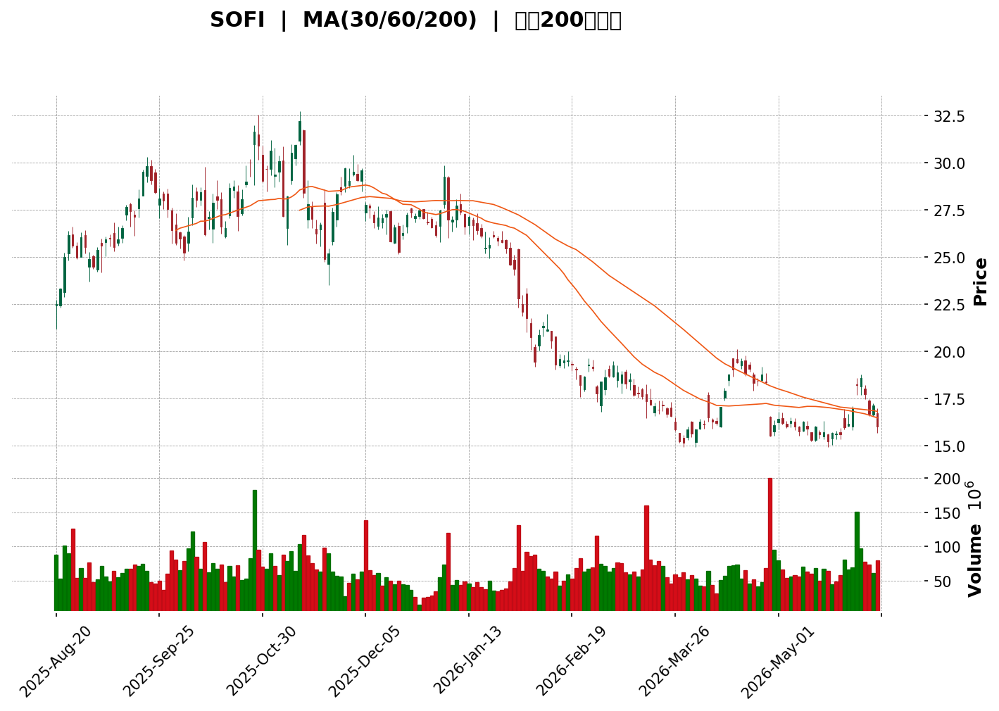
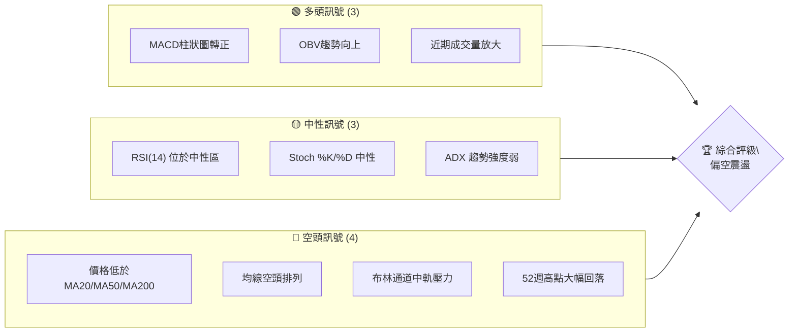
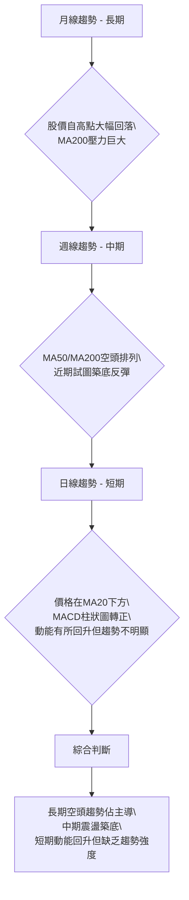
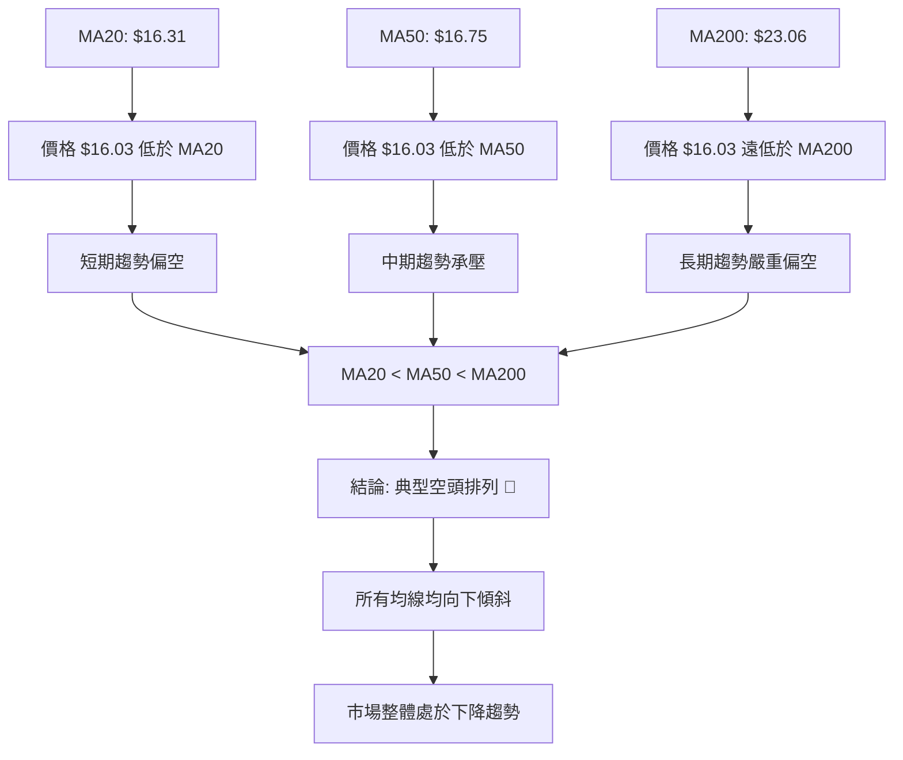

<details>
<summary>📊 靜態圖表 (點擊展開)</summary>

</details>

<html>
<head><meta charset="utf-8" /></head>
<body>
    <div style="height:500px; width:100%;">                        <script>window.PlotlyConfig = {MathJaxConfig: 'local'};</script>
        <script charset="utf-8" src="https://cdn.plot.ly/plotly-3.6.0.min.js" integrity="sha256-QaOVwtVY0T02VaHrr6pnoHLCwayMJp4O5n4YyaE3rJk=" crossorigin="anonymous"></script>                <div id="candlestick-chart" class="plotly-graph-div" style="height:100%; width:100%;"></div>            <script>                window.PLOTLYENV=window.PLOTLYENV || {};                                if (document.getElementById("candlestick-chart")) {                    Plotly.newPlot(                        "candlestick-chart",                        [{"close":{"dtype":"f8","bdata":"AAAAwB6FNkAAAADgelQ3QAAAAMAeBTlAAAAAYGYmOkAAAABguJ45QAAAAIDC9ThAAAAAgD0KOkAAAACAPYo5QAAAAMD16DhAAAAAoHB9OEAAAACgR2E5QAAAAKCZmTlAAAAAgML1OUAAAADgUfg5QAAAAMAehTlAAAAAgML1OUAAAADAzIw6QAAAACCFqztAAAAAIIVrO0AAAAAA1yM7QAAAAAApHDxAAAAAYI+CPUAAAAAgXM89QAAAAEAKFz1AAAAA4KNwPEAAAABguB48QAAAAEDh+jtAAAAAwMyMO0AAAAAghWs6QAAAAGCPwjlAAAAA4FH4OUAAAACgcD05QAAAAAApXDpAAAAAANcjPEAAAADAHgU8QAAAAEAzczxAAAAA4KMwOkAAAAAA1yM7QAAAAGC43jtAAAAAIK4HPEAAAACgmZk6QAAAAIA9ijpAAAAAgBSuPEAAAAAAAMA8QAAAAOCjMDtAAAAA4HoUPEAAAABgjwI9QAAAAAAAAD5AAAAAwPWoP0AAAABgZuY+QAAAACCuBz1AAAAAgBSuPUAAAACgR6E+QAAAAGC4Xj1AAAAAgOsRPkAAAADA9Sg7QAAAAIDCNTxAAAAAgD2KPkAAAABAM\u002fM+QAAAAEDhGkBAAAAAANdjPEAAAACA69E7QAAAAIA9CjtAAAAAoHA9OkAAAADgUbg6QAAAAMD16DhAAAAA4KMwOUAAAABgZmY7QAAAAOB6VDxAAAAAoHB9PEAAAADgUbg9QAAAACCuBz1AAAAAYI+CPUAAAACA6xE9QAAAAKCZmT1AAAAAIK7HO0AAAAAAKZw7QAAAAOB61DpAAAAAQAoXO0AAAACA6xE7QAAAACCuRztAAAAAgOvROUAAAADgepQ6QAAAAMAeRTlAAAAAgD1KOkAAAACgcD07QAAAAKCZWTtAAAAA4KMwO0AAAABA4Xo7QAAAAIDrETtAAAAAgOvROkAAAAAgXI86QAAAAIAULjpAAAAAgMJ1O0AAAAAgrkc9QAAAAEDh+jpAAAAAAAAAO0AAAADgUbg7QAAAAGBmZjtAAAAAoJmZOkAAAAAA1yM7QAAAACCFqzpAAAAA4KNwOkAAAACgRyE6QAAAAKBwfTlAAAAAANejOUAAAABAChc6QAAAAKCZ2TlAAAAAwMzMOUAAAACAwnU5QAAAAKCZmThAAAAAAClcOEAAAAAgXM82QAAAAOB6FDZAAAAAYI\u002fCNUAAAAAAAMA0QAAAAIDCdTNAAAAAACncNEAAAACgmVk1QAAAAIAULjVAAAAAwMyMNEAAAADAzEwzQAAAAAApnDNAAAAAYI+CM0AAAACAPYozQAAAAMDMTDNAAAAAwB4FM0AAAADgUTgyQAAAAMD1qDJAAAAAgD1KM0AAAACgmRkzQAAAAGCPwjFAAAAAANdjMkAAAAAAKZwyQAAAAEAzszJAAAAAAABAM0AAAABgZuYyQAAAAIA9yjJAAAAAgD1KMkAAAAAgrocyQAAAAEAzszFAAAAAYI\u002fCMUAAAACgR6ExQAAAAGC4XjFAAAAAgBQuMUAAAADgehQxQAAAAGBm5jBAAAAAYGYmMUAAAABAM7MwQAAAACBcjzBAAAAAoHC9L0AAAACAwnUuQAAAAMDMTC5AAAAAYI\u002fCL0AAAABgj0IvQAAAAEAzsy9AAAAAwB5FMEAAAAAAKRwwQAAAAKBwfTBAAAAAwB5FMEAAAADgUTgwQAAAAMDMDDFAAAAAwPXoMUAAAACAPcoyQAAAACCuBzNAAAAAgBRuM0AAAAAAAIAzQAAAAOB61DJAAAAAIFwPM0AAAACA61EyQAAAAOCjcDJAAAAAYI\u002fCMkAAAAAAKVwyQAAAAMDMDC9AAAAAoJkZMEAAAACAFG4wQAAAAEAzMzBAAAAAwB4FMEAAAADAzEwwQAAAAAAAADBAAAAAAACAL0AAAABgj0IwQAAAAMDMzC9AAAAAYLieLkAAAADAHgUwQAAAAOBROC9AAAAAIIVrL0AAAACAwnUuQAAAAKBHYS9AAAAAwMxML0AAAACgcD0vQAAAAIDC9S9AAAAAIIUrMEAAAADgUfgwQAAAAOBRODJAAAAA4HqUMkAAAACgcL0xQAAAAIAUrjBAAAAAYGYmMUAAAAAgrgcwQA=="},"high":{"dtype":"f8","bdata":"AAAA4FG4NkAAAADAdl43QAAAAAAAQDlAAAAAoEdhOkAAAABA4Zo6QAAAACBczzlAAAAA4HpUOkAAAAAghWs6QAAAACCuRzlAAAAAACkcOUAAAACAPYo5QAAAAOBR+DlAAAAAoJkZOkAAAADgozA6QAAAAEDh2jpAAAAAoJmZOkAAAADgo7A6QAAAAMAexTtAAAAAoEfhO0AAAACAwnU7QAAAAEC2kzxAAAAAoEehPUAAAADAzEw+QAAAAADXIz5AAAAAIIWrPUAAAAAghas8QAAAAEDhejxAAAAAoEehPEAAAAAAKZw7QAAAAOB6VDtAAAAAoJlZOkAAAACAFC46QAAAAADXIztAAAAAQArXPEAAAACAwrU8QAAAAOCjsDxAAAAAwMzMPUAAAACAFG47QAAAAKCZWTxAAAAAQAoXPUAAAADgo3A8QAAAACCF6zpAAAAAgBTuPEAAAACA6xE9QAAAAMDMzDxAAAAA4FGYPEAAAABguN49QAAAAEAzMz5AAAAAQOH6P0AAAADgUUhAQAAAAIA96j5AAAAAACncPUAAAADgUTg\u002fQAAAAIA9yj5AAAAAYLhePkAAAABg59s+QAAAAKBwPTxAAAAA4FH4PkAAAACgcP0+QAAAAKBwXUBAAAAAAADAP0AAAACA6xE9QAAAAEAz8ztAAAAAAAAAO0AAAACgmdk6QAAAAEAzkzxAAAAAgOtxOUAAAAAAKZw7QAAAAEAzczxAAAAAAABAPUAAAAAAAMA9QAAAAEAzsz1AAAAAIIVrPkAAAACAFO49QAAAAEAzsz1AAAAAgBTuO0AAAADgetQ7QAAAAEAzcztAAAAAgBSuO0AAAAAgrkc7QAAAAAAAgDtAAAAAQOF6O0AAAACgcL06QAAAAIDC1TpAAAAAQAq3OkAAAABguF47QAAAAGC4njtAAAAAQApXO0AAAACAPYo7QAAAAMDMjDtAAAAAwPVoO0AAAAAA1yM7QAAAAGBm5jpAAAAAoEeBO0AAAAAAKdw9QAAAAMDMTD1AAAAAgBQuO0AAAACAFA48QAAAAAAAYDxAAAAAYOVQO0AAAABAMzM7QAAAAIDCFTtAAAAA4HpUO0AAAAAgrsc6QAAAAEAKVzpAAAAAwMwMOkAAAAAA12M6QAAAAKBHITpAAAAAYGZmOkAAAACAFO45QAAAAIA9yjlAAAAAYLgeOUAAAADgUXg5QAAAAAAAADdAAAAAAClcN0AAAAAA18M1QAAAAGBmZjRAAAAAwPUoNUAAAABACpc1QAAAAAAAADZAAAAAoJkZNUAAAACAPco0QAAAAGC43jNAAAAAQArXM0AAAABgjwI0QAAAAEDhejNAAAAA4KMwM0AAAACgR8EyQAAAAIDCtTJAAAAAYLieM0AAAAAgXI8zQAAAAIDCNTJAAAAAwPVoMkAAAACAPQozQAAAACCuRzNAAAAAQOF6M0AAAABguD4zQAAAAIDr8TJAAAAAYGYGM0AAAACgmdkyQAAAAMDMjDJAAAAAYGYmMkAAAACA6xEyQAAAAKBHQTJAAAAAIK4HMkAAAAAghUsxQAAAAMByaDFAAAAAwPVoMUAAAACA6xExQAAAAEAKVzFAAAAAoHB9MEAAAACgR2EvQAAAAKBHIS9AAAAAYGYGMEAAAACA61EwQAAAACCuxy9AAAAAwMxsMEAAAABA4VowQAAAAKCZ2TFAAAAA4FF4MEAAAACgcH0wQAAAACBcDzFAAAAAQDMTMkAAAACA69EyQAAAAGC4njNAAAAAoEchNEAAAADAHqUzQAAAAMAexTNAAAAAILByM0AAAABgZuYyQAAAAEAzkzJAAAAAIIUrM0AAAABguN4yQAAAAEAKlzBAAAAAYLheMEAAAAAghcswQAAAACCuxzBAAAAAIFxPMEAAAACgR4EwQAAAAIDCdTBAAAAAwMwMMEAAAACA61EwQAAAAOB6VDBAAAAAIIVrL0AAAADgoxAwQAAAAIAUri9AAAAAgOtRMEAAAAAgrkcvQAAAAOCjcC9AAAAAgOuRL0AAAAAAKdwvQAAAAEAz8zBAAAAA4KOwMEAAAADgehQxQAAAAEAKlzJAAAAAIIXLMkAAAABA4ToyQAAAAEAKdzFAAAAAQOE6MUAAAACgcP0wQA=="},"hovertemplate":"\u003cb\u003e%{x|%Y-%m-%d}\u003c\u002fb\u003e\u003cbr\u003e\u958b: $%{open:.2f}\u003cbr\u003e\u9ad8: $%{high:.2f}\u003cbr\u003e\u4f4e: $%{low:.2f}\u003cbr\u003e\u6536: $%{close:.2f}\u003cextra\u003e\u003c\u002fextra\u003e","low":{"dtype":"f8","bdata":"AAAAgMI1NUAAAAAgXE82QAAAAGBm5jZAAAAAIFzPOEAAAAAAAIA5QAAAAKBH4ThAAAAAAAAAOUAAAACAwjU5QAAAAEAzszdAAAAAANdjOEAAAAAgsj04QAAAAIAULjhAAAAAwMwMOUAAAADAzIw5QAAAAMDMTDlAAAAAYLieOUAAAADAHsU5QAAAACBc7zpAAAAAoEehOkAAAACgRyE6QAAAAOB6FDtAAAAAoHA9PEAAAADgUfg8QAAAAKCZ2TxAAAAAoJlZPEAAAAAgXA87QAAAACBcjztAAAAAACkcO0AAAABAM7M5QAAAAADXozlAAAAAQDNzOUAAAABACtc4QAAAACBcTzlAAAAAgBSuOkAAAADAHqU7QAAAAAAAwDtAAAAAoEchOkAAAADgUXg6QAAAAAAAwDlAAAAAIFyPO0AAAAAAAEA6QAAAAGCPAjpAAAAAIFwPO0AAAABgZiY8QAAAAKBHYTpAAAAAoPEyO0AAAABAM7M8QAAAAMAeRT1AAAAAwMzMPEAAAAAA1yM+QAAAAEDh+jxAAAAAoHB9PEAAAADgelQ9QAAAAOCjsDxAAAAAYI8CPUAAAACgRyE7QAAAAMD1qDlAAAAAQArXPEAAAADgIts9QAAAAIDC9T5AAAAAYGYmPEAAAAAgroc6QAAAAMDMjDpAAAAAgMK1OUAAAAAgXI85QAAAAGC4vjhAAAAAwB6FN0AAAAAgrqc5QAAAAKBHoTpAAAAAIFxPPEAAAADgenQ8QAAAACCFqzxAAAAA4KNQPUAAAADAHgU9QAAAAEDhejxAAAAAgBTuOkAAAADAzAw7QAAAAMDMjDpAAAAAQOF6OkAAAACAFI46QAAAAEAzMzpAAAAAgD3KOUAAAADgUbg5QAAAACCFKzlAAAAAQDPzOUAAAAAgrkc6QAAAAKCZGTtAAAAAQDPTOkAAAAAgrgc7QAAAACCuBztAAAAAoHC9OkAAAACAPYo6QAAAACBcDzpAAAAAgD3KOUAAAACgmZk7QAAAACCuBzpAAAAAoHBdOkAAAACA65E6QAAAAEDhOjtAAAAAQDMzOkAAAADgUTg6QAAAACCF6zlAAAAAgMI1OkAAAABgjwI6QAAAAIDCNTlAAAAAQDPzOEAAAAAAAAA6QAAAAKCZmTlAAAAAwB7FOUAAAACAwjU5QAAAAIDrkThAAAAAwMwMOEAAAAAgXE82QAAAAAAp3DVAAAAAwB4FNUAAAACA6xE0QAAAAACqMTNAAAAAgD0KNEAAAADAzMw0QAAAAMDMDDVAAAAAANcjNEAAAACAPQozQAAAAGBmJjNAAAAAACkcM0AAAACgmTkzQAAAAOBR+DJAAAAAANeDMkAAAADgepQxQAAAAADX4zFAAAAAgBTuMkAAAADgUfgyQAAAACBcTzFAAAAAwMzMMEAAAADgo7AxQAAAAAApnDJAAAAAANejMkAAAABguB4yQAAAAMAexTFAAAAAgD0KMkAAAADgUfgxQAAAAGC4njFAAAAAIK6HMUAAAADgUXgxQAAAAEDhejBAAAAAwPUoMUAAAADgepQwQAAAACCFqzBAAAAAQArXMEAAAACgcH0wQAAAAMAehTBAAAAAACmcL0AAAADAzEwuQAAAAGC43i1AAAAAYLieLkAAAACgR+EuQAAAAAAp3C1AAAAAYI\u002fCL0AAAACA69EvQAAAAGCPQjBAAAAA4HrUL0AAAADgURgwQAAAACCF6y9AAAAAYGZmMUAAAAAghSsyQAAAAGBmpjJAAAAAANdjM0AAAABAChczQAAAAOCjsDJAAAAAwPXoMkAAAACAFO4xQAAAAIDAKjJAAAAAANdjMkAAAADAHkUyQAAAAAAAAC9AAAAA4HoUL0AAAAAAAMAvQAAAAKBHITBAAAAAoEfhL0AAAABA4fovQAAAAMD1qC9AAAAAgD0KL0AAAACAPYovQAAAAKCZGS9AAAAAgBRuLkAAAACAwnUuQAAAAGCPwi5AAAAAgBSuLkAAAABACtctQAAAACBcDy5AAAAAQDOzLkAAAADgUbguQAAAAOBRuC9AAAAAYI8CMEAAAAAA16MvQAAAAIAUrjFAAAAA4KOwMUAAAACAwnUxQAAAAOB6lDBAAAAAgMKVMEAAAAAAKVwvQA=="},"name":"\u50f9\u683c","open":{"dtype":"f8","bdata":"AAAAIIVrNkAAAADgo3A2QAAAAMD1KDdAAAAAgBQuOUAAAADgejQ6QAAAAKBwnTlAAAAAwB4FOUAAAADA9Sg6QAAAAAAAgDhAAAAAIFwPOUAAAADgelQ4QAAAAMAexTlAAAAAIFzPOUAAAADAHgU6QAAAAIA9SjpAAAAAYI\u002fCOUAAAAAAAAA6QAAAAAAAQDtAAAAAgD3KO0AAAAAAAEA7QAAAAEAKlztAAAAAANdDPEAAAADAzEw9QAAAAIAUzj1AAAAAAACAPUAAAABgj8I7QAAAAGC4XjxAAAAAAClcPEAAAADgUXg7QAAAAEDhujpAAAAA4HpUOkAAAACgmRk6QAAAAMAexTlAAAAAoJkZO0AAAACgcH08QAAAAIA9CjxAAAAAwMyMPEAAAACA6xE7QAAAAGCPgjpAAAAAQDMzPEAAAACA6xE8QAAAAKCZGTpAAAAAQDMzO0AAAAAgXI88QAAAAKBwfTxAAAAA4HpUO0AAAADgUdg8QAAAAAAAAD5AAAAAoHD9PkAAAABguH4\u002fQAAAACBcbz5AAAAA4KOwPUAAAADA9ag9QAAAACCFSz1AAAAAwB6FPUAAAAAAACA+QAAAAGBmhjpAAAAAIFwPPUAAAABguD4+QAAAAIAULj9AAAAAQOG6P0AAAAAAAAA7QAAAAIDCtTtAAAAAYI+COkAAAACgmXk6QAAAAKBH4TtAAAAAoEehOEAAAADgetQ5QAAAAEDh+jpAAAAAgMK1PEAAAACAPco8QAAAAOB61DxAAAAAANdjPUAAAADAzGw9QAAAAMD1CD1AAAAAoHBdO0AAAABA4bo7QAAAAKBwPTtAAAAAYGamOkAAAABACtc6QAAAAMAeJTtAAAAAIFxvO0AAAACgcL05QAAAAADXozpAAAAAgBQuOkAAAABguJ46QAAAAOBRmDtAAAAAgOsRO0AAAAAghSs7QAAAAIA9ijtAAAAAYLjeOkAAAAAgrgc7QAAAAIAUrjpAAAAAwPWoOkAAAAAgXM87QAAAAEDhOj1AAAAAoHDdOkAAAAAAAAA7QAAAAIAUzjtAAAAAgD1KO0AAAABAM7M6QAAAAAAAADtAAAAAIFzPOkAAAACAPYo6QAAAAOCjcDlAAAAAAACAOUAAAACAFC46QAAAAAAAADpAAAAAYGbmOUAAAABgZuY5QAAAAAAAgDlAAAAAoHDdOEAAAACAFG45QAAAAGCPgjZAAAAAwMwMN0AAAACgcH01QAAAAEDhOjRAAAAAgD1KNEAAAACAPUo1QAAAAEAKFzVAAAAAoJkZNUAAAACAPco0QAAAACCuRzNAAAAAwPVoM0AAAADgUXgzQAAAAOB6VDNAAAAAgMIVM0AAAABA4boyQAAAAAAAADJAAAAAIK5HM0AAAADgozAzQAAAAMD1KDJAAAAAwB4lMUAAAAAAAAAyQAAAACBcDzNAAAAAYGamMkAAAAAAKXwyQAAAAOB6VDJAAAAAIIXrMkAAAAAA12MyQAAAAOBRODJAAAAAwMzMMUAAAAAAAAAyQAAAAOBRuDFAAAAAgBRuMUAAAAAAAMAwQAAAAIA96jBAAAAAIK4nMUAAAABguP4wQAAAAIA9CjFAAAAAYGZGMEAAAABAClcvQAAAAAAp3C5AAAAAYGbmLkAAAABgZkYwQAAAAKBHYS5AAAAAIK7HL0AAAADA9SgwQAAAAIAUrjFAAAAAANdjMEAAAADAzEwwQAAAAAAAADBAAAAAIK6HMUAAAADgUXgyQAAAAGC4njNAAAAAoJmZM0AAAABgj0IzQAAAAGCPgjNAAAAAgD1KM0AAAADAHsUyQAAAAOCjcDJAAAAAQOF6MkAAAADAHmUyQAAAAMDMjDBAAAAAgD2KL0AAAAAAKTwwQAAAAOBReDBAAAAAIIUrMEAAAABAMzMwQAAAAGCPQjBAAAAAIK4HMEAAAACgmZkvQAAAAIDrETBAAAAAIIVrL0AAAABguJ4uQAAAAGBmZi9AAAAAgML1LkAAAACAwjUvQAAAAEDhui5AAAAAoHA9L0AAAABgZmYvQAAAAEDhejBAAAAAwMwMMEAAAADAHgUwQAAAAGCPQjJAAAAAYGYmMkAAAAAgrgcyQAAAAKBHYTFAAAAAwPWoMEAAAAAA1bgwQA=="},"x":["2025-08-20T00:00:00-04:00","2025-08-21T00:00:00-04:00","2025-08-22T00:00:00-04:00","2025-08-25T00:00:00-04:00","2025-08-26T00:00:00-04:00","2025-08-27T00:00:00-04:00","2025-08-28T00:00:00-04:00","2025-08-29T00:00:00-04:00","2025-09-02T00:00:00-04:00","2025-09-03T00:00:00-04:00","2025-09-04T00:00:00-04:00","2025-09-05T00:00:00-04:00","2025-09-08T00:00:00-04:00","2025-09-09T00:00:00-04:00","2025-09-10T00:00:00-04:00","2025-09-11T00:00:00-04:00","2025-09-12T00:00:00-04:00","2025-09-15T00:00:00-04:00","2025-09-16T00:00:00-04:00","2025-09-17T00:00:00-04:00","2025-09-18T00:00:00-04:00","2025-09-19T00:00:00-04:00","2025-09-22T00:00:00-04:00","2025-09-23T00:00:00-04:00","2025-09-24T00:00:00-04:00","2025-09-25T00:00:00-04:00","2025-09-26T00:00:00-04:00","2025-09-29T00:00:00-04:00","2025-09-30T00:00:00-04:00","2025-10-01T00:00:00-04:00","2025-10-02T00:00:00-04:00","2025-10-03T00:00:00-04:00","2025-10-06T00:00:00-04:00","2025-10-07T00:00:00-04:00","2025-10-08T00:00:00-04:00","2025-10-09T00:00:00-04:00","2025-10-10T00:00:00-04:00","2025-10-13T00:00:00-04:00","2025-10-14T00:00:00-04:00","2025-10-15T00:00:00-04:00","2025-10-16T00:00:00-04:00","2025-10-17T00:00:00-04:00","2025-10-20T00:00:00-04:00","2025-10-21T00:00:00-04:00","2025-10-22T00:00:00-04:00","2025-10-23T00:00:00-04:00","2025-10-24T00:00:00-04:00","2025-10-27T00:00:00-04:00","2025-10-28T00:00:00-04:00","2025-10-29T00:00:00-04:00","2025-10-30T00:00:00-04:00","2025-10-31T00:00:00-04:00","2025-11-03T00:00:00-05:00","2025-11-04T00:00:00-05:00","2025-11-05T00:00:00-05:00","2025-11-06T00:00:00-05:00","2025-11-07T00:00:00-05:00","2025-11-10T00:00:00-05:00","2025-11-11T00:00:00-05:00","2025-11-12T00:00:00-05:00","2025-11-13T00:00:00-05:00","2025-11-14T00:00:00-05:00","2025-11-17T00:00:00-05:00","2025-11-18T00:00:00-05:00","2025-11-19T00:00:00-05:00","2025-11-20T00:00:00-05:00","2025-11-21T00:00:00-05:00","2025-11-24T00:00:00-05:00","2025-11-25T00:00:00-05:00","2025-11-26T00:00:00-05:00","2025-11-28T00:00:00-05:00","2025-12-01T00:00:00-05:00","2025-12-02T00:00:00-05:00","2025-12-03T00:00:00-05:00","2025-12-04T00:00:00-05:00","2025-12-05T00:00:00-05:00","2025-12-08T00:00:00-05:00","2025-12-09T00:00:00-05:00","2025-12-10T00:00:00-05:00","2025-12-11T00:00:00-05:00","2025-12-12T00:00:00-05:00","2025-12-15T00:00:00-05:00","2025-12-16T00:00:00-05:00","2025-12-17T00:00:00-05:00","2025-12-18T00:00:00-05:00","2025-12-19T00:00:00-05:00","2025-12-22T00:00:00-05:00","2025-12-23T00:00:00-05:00","2025-12-24T00:00:00-05:00","2025-12-26T00:00:00-05:00","2025-12-29T00:00:00-05:00","2025-12-30T00:00:00-05:00","2025-12-31T00:00:00-05:00","2026-01-02T00:00:00-05:00","2026-01-05T00:00:00-05:00","2026-01-06T00:00:00-05:00","2026-01-07T00:00:00-05:00","2026-01-08T00:00:00-05:00","2026-01-09T00:00:00-05:00","2026-01-12T00:00:00-05:00","2026-01-13T00:00:00-05:00","2026-01-14T00:00:00-05:00","2026-01-15T00:00:00-05:00","2026-01-16T00:00:00-05:00","2026-01-20T00:00:00-05:00","2026-01-21T00:00:00-05:00","2026-01-22T00:00:00-05:00","2026-01-23T00:00:00-05:00","2026-01-26T00:00:00-05:00","2026-01-27T00:00:00-05:00","2026-01-28T00:00:00-05:00","2026-01-29T00:00:00-05:00","2026-01-30T00:00:00-05:00","2026-02-02T00:00:00-05:00","2026-02-03T00:00:00-05:00","2026-02-04T00:00:00-05:00","2026-02-05T00:00:00-05:00","2026-02-06T00:00:00-05:00","2026-02-09T00:00:00-05:00","2026-02-10T00:00:00-05:00","2026-02-11T00:00:00-05:00","2026-02-12T00:00:00-05:00","2026-02-13T00:00:00-05:00","2026-02-17T00:00:00-05:00","2026-02-18T00:00:00-05:00","2026-02-19T00:00:00-05:00","2026-02-20T00:00:00-05:00","2026-02-23T00:00:00-05:00","2026-02-24T00:00:00-05:00","2026-02-25T00:00:00-05:00","2026-02-26T00:00:00-05:00","2026-02-27T00:00:00-05:00","2026-03-02T00:00:00-05:00","2026-03-03T00:00:00-05:00","2026-03-04T00:00:00-05:00","2026-03-05T00:00:00-05:00","2026-03-06T00:00:00-05:00","2026-03-09T00:00:00-04:00","2026-03-10T00:00:00-04:00","2026-03-11T00:00:00-04:00","2026-03-12T00:00:00-04:00","2026-03-13T00:00:00-04:00","2026-03-16T00:00:00-04:00","2026-03-17T00:00:00-04:00","2026-03-18T00:00:00-04:00","2026-03-19T00:00:00-04:00","2026-03-20T00:00:00-04:00","2026-03-23T00:00:00-04:00","2026-03-24T00:00:00-04:00","2026-03-25T00:00:00-04:00","2026-03-26T00:00:00-04:00","2026-03-27T00:00:00-04:00","2026-03-30T00:00:00-04:00","2026-03-31T00:00:00-04:00","2026-04-01T00:00:00-04:00","2026-04-02T00:00:00-04:00","2026-04-06T00:00:00-04:00","2026-04-07T00:00:00-04:00","2026-04-08T00:00:00-04:00","2026-04-09T00:00:00-04:00","2026-04-10T00:00:00-04:00","2026-04-13T00:00:00-04:00","2026-04-14T00:00:00-04:00","2026-04-15T00:00:00-04:00","2026-04-16T00:00:00-04:00","2026-04-17T00:00:00-04:00","2026-04-20T00:00:00-04:00","2026-04-21T00:00:00-04:00","2026-04-22T00:00:00-04:00","2026-04-23T00:00:00-04:00","2026-04-24T00:00:00-04:00","2026-04-27T00:00:00-04:00","2026-04-28T00:00:00-04:00","2026-04-29T00:00:00-04:00","2026-04-30T00:00:00-04:00","2026-05-01T00:00:00-04:00","2026-05-04T00:00:00-04:00","2026-05-05T00:00:00-04:00","2026-05-06T00:00:00-04:00","2026-05-07T00:00:00-04:00","2026-05-08T00:00:00-04:00","2026-05-11T00:00:00-04:00","2026-05-12T00:00:00-04:00","2026-05-13T00:00:00-04:00","2026-05-14T00:00:00-04:00","2026-05-15T00:00:00-04:00","2026-05-18T00:00:00-04:00","2026-05-19T00:00:00-04:00","2026-05-20T00:00:00-04:00","2026-05-21T00:00:00-04:00","2026-05-22T00:00:00-04:00","2026-05-26T00:00:00-04:00","2026-05-27T00:00:00-04:00","2026-05-28T00:00:00-04:00","2026-05-29T00:00:00-04:00","2026-06-01T00:00:00-04:00","2026-06-02T00:00:00-04:00","2026-06-03T00:00:00-04:00","2026-06-04T00:00:00-04:00","2026-06-05T00:00:00-04:00"],"type":"candlestick"},{"hovertemplate":"MA30: $%{y:.2f}\u003cextra\u003e\u003c\u002fextra\u003e","line":{"color":"#2196F3","dash":"dash","width":2},"mode":"lines","name":"MA30","x":["2025-08-20T00:00:00-04:00","2025-08-21T00:00:00-04:00","2025-08-22T00:00:00-04:00","2025-08-25T00:00:00-04:00","2025-08-26T00:00:00-04:00","2025-08-27T00:00:00-04:00","2025-08-28T00:00:00-04:00","2025-08-29T00:00:00-04:00","2025-09-02T00:00:00-04:00","2025-09-03T00:00:00-04:00","2025-09-04T00:00:00-04:00","2025-09-05T00:00:00-04:00","2025-09-08T00:00:00-04:00","2025-09-09T00:00:00-04:00","2025-09-10T00:00:00-04:00","2025-09-11T00:00:00-04:00","2025-09-12T00:00:00-04:00","2025-09-15T00:00:00-04:00","2025-09-16T00:00:00-04:00","2025-09-17T00:00:00-04:00","2025-09-18T00:00:00-04:00","2025-09-19T00:00:00-04:00","2025-09-22T00:00:00-04:00","2025-09-23T00:00:00-04:00","2025-09-24T00:00:00-04:00","2025-09-25T00:00:00-04:00","2025-09-26T00:00:00-04:00","2025-09-29T00:00:00-04:00","2025-09-30T00:00:00-04:00","2025-10-01T00:00:00-04:00","2025-10-02T00:00:00-04:00","2025-10-03T00:00:00-04:00","2025-10-06T00:00:00-04:00","2025-10-07T00:00:00-04:00","2025-10-08T00:00:00-04:00","2025-10-09T00:00:00-04:00","2025-10-10T00:00:00-04:00","2025-10-13T00:00:00-04:00","2025-10-14T00:00:00-04:00","2025-10-15T00:00:00-04:00","2025-10-16T00:00:00-04:00","2025-10-17T00:00:00-04:00","2025-10-20T00:00:00-04:00","2025-10-21T00:00:00-04:00","2025-10-22T00:00:00-04:00","2025-10-23T00:00:00-04:00","2025-10-24T00:00:00-04:00","2025-10-27T00:00:00-04:00","2025-10-28T00:00:00-04:00","2025-10-29T00:00:00-04:00","2025-10-30T00:00:00-04:00","2025-10-31T00:00:00-04:00","2025-11-03T00:00:00-05:00","2025-11-04T00:00:00-05:00","2025-11-05T00:00:00-05:00","2025-11-06T00:00:00-05:00","2025-11-07T00:00:00-05:00","2025-11-10T00:00:00-05:00","2025-11-11T00:00:00-05:00","2025-11-12T00:00:00-05:00","2025-11-13T00:00:00-05:00","2025-11-14T00:00:00-05:00","2025-11-17T00:00:00-05:00","2025-11-18T00:00:00-05:00","2025-11-19T00:00:00-05:00","2025-11-20T00:00:00-05:00","2025-11-21T00:00:00-05:00","2025-11-24T00:00:00-05:00","2025-11-25T00:00:00-05:00","2025-11-26T00:00:00-05:00","2025-11-28T00:00:00-05:00","2025-12-01T00:00:00-05:00","2025-12-02T00:00:00-05:00","2025-12-03T00:00:00-05:00","2025-12-04T00:00:00-05:00","2025-12-05T00:00:00-05:00","2025-12-08T00:00:00-05:00","2025-12-09T00:00:00-05:00","2025-12-10T00:00:00-05:00","2025-12-11T00:00:00-05:00","2025-12-12T00:00:00-05:00","2025-12-15T00:00:00-05:00","2025-12-16T00:00:00-05:00","2025-12-17T00:00:00-05:00","2025-12-18T00:00:00-05:00","2025-12-19T00:00:00-05:00","2025-12-22T00:00:00-05:00","2025-12-23T00:00:00-05:00","2025-12-24T00:00:00-05:00","2025-12-26T00:00:00-05:00","2025-12-29T00:00:00-05:00","2025-12-30T00:00:00-05:00","2025-12-31T00:00:00-05:00","2026-01-02T00:00:00-05:00","2026-01-05T00:00:00-05:00","2026-01-06T00:00:00-05:00","2026-01-07T00:00:00-05:00","2026-01-08T00:00:00-05:00","2026-01-09T00:00:00-05:00","2026-01-12T00:00:00-05:00","2026-01-13T00:00:00-05:00","2026-01-14T00:00:00-05:00","2026-01-15T00:00:00-05:00","2026-01-16T00:00:00-05:00","2026-01-20T00:00:00-05:00","2026-01-21T00:00:00-05:00","2026-01-22T00:00:00-05:00","2026-01-23T00:00:00-05:00","2026-01-26T00:00:00-05:00","2026-01-27T00:00:00-05:00","2026-01-28T00:00:00-05:00","2026-01-29T00:00:00-05:00","2026-01-30T00:00:00-05:00","2026-02-02T00:00:00-05:00","2026-02-03T00:00:00-05:00","2026-02-04T00:00:00-05:00","2026-02-05T00:00:00-05:00","2026-02-06T00:00:00-05:00","2026-02-09T00:00:00-05:00","2026-02-10T00:00:00-05:00","2026-02-11T00:00:00-05:00","2026-02-12T00:00:00-05:00","2026-02-13T00:00:00-05:00","2026-02-17T00:00:00-05:00","2026-02-18T00:00:00-05:00","2026-02-19T00:00:00-05:00","2026-02-20T00:00:00-05:00","2026-02-23T00:00:00-05:00","2026-02-24T00:00:00-05:00","2026-02-25T00:00:00-05:00","2026-02-26T00:00:00-05:00","2026-02-27T00:00:00-05:00","2026-03-02T00:00:00-05:00","2026-03-03T00:00:00-05:00","2026-03-04T00:00:00-05:00","2026-03-05T00:00:00-05:00","2026-03-06T00:00:00-05:00","2026-03-09T00:00:00-04:00","2026-03-10T00:00:00-04:00","2026-03-11T00:00:00-04:00","2026-03-12T00:00:00-04:00","2026-03-13T00:00:00-04:00","2026-03-16T00:00:00-04:00","2026-03-17T00:00:00-04:00","2026-03-18T00:00:00-04:00","2026-03-19T00:00:00-04:00","2026-03-20T00:00:00-04:00","2026-03-23T00:00:00-04:00","2026-03-24T00:00:00-04:00","2026-03-25T00:00:00-04:00","2026-03-26T00:00:00-04:00","2026-03-27T00:00:00-04:00","2026-03-30T00:00:00-04:00","2026-03-31T00:00:00-04:00","2026-04-01T00:00:00-04:00","2026-04-02T00:00:00-04:00","2026-04-06T00:00:00-04:00","2026-04-07T00:00:00-04:00","2026-04-08T00:00:00-04:00","2026-04-09T00:00:00-04:00","2026-04-10T00:00:00-04:00","2026-04-13T00:00:00-04:00","2026-04-14T00:00:00-04:00","2026-04-15T00:00:00-04:00","2026-04-16T00:00:00-04:00","2026-04-17T00:00:00-04:00","2026-04-20T00:00:00-04:00","2026-04-21T00:00:00-04:00","2026-04-22T00:00:00-04:00","2026-04-23T00:00:00-04:00","2026-04-24T00:00:00-04:00","2026-04-27T00:00:00-04:00","2026-04-28T00:00:00-04:00","2026-04-29T00:00:00-04:00","2026-04-30T00:00:00-04:00","2026-05-01T00:00:00-04:00","2026-05-04T00:00:00-04:00","2026-05-05T00:00:00-04:00","2026-05-06T00:00:00-04:00","2026-05-07T00:00:00-04:00","2026-05-08T00:00:00-04:00","2026-05-11T00:00:00-04:00","2026-05-12T00:00:00-04:00","2026-05-13T00:00:00-04:00","2026-05-14T00:00:00-04:00","2026-05-15T00:00:00-04:00","2026-05-18T00:00:00-04:00","2026-05-19T00:00:00-04:00","2026-05-20T00:00:00-04:00","2026-05-21T00:00:00-04:00","2026-05-22T00:00:00-04:00","2026-05-26T00:00:00-04:00","2026-05-27T00:00:00-04:00","2026-05-28T00:00:00-04:00","2026-05-29T00:00:00-04:00","2026-06-01T00:00:00-04:00","2026-06-02T00:00:00-04:00","2026-06-03T00:00:00-04:00","2026-06-04T00:00:00-04:00","2026-06-05T00:00:00-04:00"],"y":{"dtype":"f8","bdata":"AAAAAAAA+H8AAAAAAAD4fwAAAAAAAPh\u002fAAAAAAAA+H8AAAAAAAD4fwAAAAAAAPh\u002fAAAAAAAA+H8AAAAAAAD4fwAAAAAAAPh\u002fAAAAAAAA+H8AAAAAAAD4fwAAAAAAAPh\u002fAAAAAAAA+H8AAAAAAAD4fwAAAAAAAPh\u002fAAAAAAAA+H8AAAAAAAD4fwAAAAAAAPh\u002fAAAAAAAA+H8AAAAAAAD4fwAAAAAAAPh\u002fAAAAAAAA+H8AAAAAAAD4fwAAAAAAAPh\u002fAAAAAAAA+H8AAAAAAAD4fwAAAAAAAPh\u002fAAAAAAAA+H8AAAAAAAD4f7y7uwsCazpA7+7urnKIOkBEREQkv5g6QKuqqmoupDpAMzMzoym1OkBERESEpMk6QKuqqops5zpAiYiIOLToOkCJiIh4W\u002fY6QBEREbGdDztAERER8dItO0AzMzMTPDg7QJqZmYlBQDtAiYiIeHdXO0CamZl5MG87QFVVVaVwfTtAvLu724ePO0AAAADQhaQ7QGZmZsZnuDtAIiIiMpbcO0CrqqoKrPw7QAAAANCFBDxA7+7uLvkFPEAAAACA+Aw8QLy7uytcDzxAVVVV9UQdPEDe3d3NExU8QO\u002fu7j4KFzxAERERAY4wPEARERHxNVc8QN7d3S1AjjxAAAAAwOaiPECJiIjY6rg8QERERFS4vjxAd3d3t4GuPEAiIiLSaaM8QCIiIpI0hTxAmpmZCax8PEBEREQE5H48QGZmZubQgjxAiYiIyL2GPEBmZmaGXaE8QDMzMwOdtjxAzczMLLK9PECamZk5bcA8QDMzM\u002fP91DxAd3d3l27SPEDv7u4+fMY8QGZmZkZvqzxAVVVV9W+EPEAiIiIywWM8QDMzM0PSVDxAZmZm9uEzPECrqqqaUhE8QERERARW7jtAvLu7exTOO0Dv7u4+w847QM3MzIxsxztAzczMXNaqO0B3d3cHOo07QHd3d4ddYTtAAAAA0PdTO0DNzMxMN0k7QJqZmZngQTtAq6qquklMO0AzMzMjImI7QO\u002fu7h7McztAAAAAID6DO0DNzMws+YU7QO\u002fu7o4JfjtAq6qqyuhtO0AiIiKy5Fc7QCIiIjLBQztA3t3drY4pO0BmZmYmeBA7QHd3d7dl7TpAAAAA0CLbOkAiIiJSKs46QKuqqnrNxTpA3t3dbcu6OkBERERUDq06QHd3d8cvljpAzczMXLqJOkC8u7urjmk6QCIiIgJWTjpAIiIiEq4nOkAzMzNzTPA5QKuqqnr4rDlAIiIiYvR2OUAiIiIypUI5QLy7u0tiEDlAVVVVReHaOEDv7u6O7Zw4QM3MzCzdZDhAMzMzIwYhOECJiIjI6M03QBEREZFfjDdA3t3d\u002fUZIN0DNzMzsNfc2QKuqqhqhrDZAq6qqKkBuNkBVVVWFpCk2QERERFSc3TVAVVVV1eqYNUBVVVUlv1g1QKuqqirOHjVAAAAAAEfoNEBEREQ07Ko0QGZmZmatbjRA7+7ujpcuNEDv7u6+dPMzQHd3d3eTuDNAvLu7i0GAM0CamZmpDVQzQDMzM4PcKzNAmpmZWccEM0DNzMwcduUyQFVVVbWdzzJAZmZmFvWvMkAiIiICR4gyQGZmZnbaYDJAERER2eo4MkBERETMLxYyQO\u002fu7sYg8DFAvLu76ybRMUDNzMxkya8xQJqZmcFYkjFAIiIiSuF6MUBVVVXt32gxQFVVVX1bVjFAq6qqMpY8MUBVVVW9AiQxQAAAALjzHTFAzczMJNsZMUBERERcZBsxQJqZmUE1HjFAEREReb4fMUCamZkx3SQxQKuqqpI0JTFAERERqcYrMUAAAADo+ykxQN7d3XVMMDFAZmZm\u002ftQ4MUDNzMy0Dz8xQFVVVT1RLzFAmpmZ8RkmMUB3d3f\u002fjSAxQLy7u9OUGjFAZmZmTvAQMUBVVVV9hg0xQO\u002fu7ia\u002fCDFAIiIiArkHMUBEREQUgxAxQKuqqnrpFjFAvLu7SwwSMUC8u7tDYBUxQJqZmflTEzFAq6qqoowOMUBmZmY+CgcxQN7d3Z02ADFARERENOz6MEBERER8zfUwQBEREQms7DBAq6qq8tLdMEAAAAAYS84wQGZmZp5hxzBAvLu7wyDAMEBERET8G7EwQFVVVT3DnjBAAAAAyHaOMEC8u7sz7HowQA=="},"type":"scatter"},{"hovertemplate":"MA60: $%{y:.2f}\u003cextra\u003e\u003c\u002fextra\u003e","line":{"color":"#9C27B0","dash":"dash","width":2},"mode":"lines","name":"MA60","x":["2025-08-20T00:00:00-04:00","2025-08-21T00:00:00-04:00","2025-08-22T00:00:00-04:00","2025-08-25T00:00:00-04:00","2025-08-26T00:00:00-04:00","2025-08-27T00:00:00-04:00","2025-08-28T00:00:00-04:00","2025-08-29T00:00:00-04:00","2025-09-02T00:00:00-04:00","2025-09-03T00:00:00-04:00","2025-09-04T00:00:00-04:00","2025-09-05T00:00:00-04:00","2025-09-08T00:00:00-04:00","2025-09-09T00:00:00-04:00","2025-09-10T00:00:00-04:00","2025-09-11T00:00:00-04:00","2025-09-12T00:00:00-04:00","2025-09-15T00:00:00-04:00","2025-09-16T00:00:00-04:00","2025-09-17T00:00:00-04:00","2025-09-18T00:00:00-04:00","2025-09-19T00:00:00-04:00","2025-09-22T00:00:00-04:00","2025-09-23T00:00:00-04:00","2025-09-24T00:00:00-04:00","2025-09-25T00:00:00-04:00","2025-09-26T00:00:00-04:00","2025-09-29T00:00:00-04:00","2025-09-30T00:00:00-04:00","2025-10-01T00:00:00-04:00","2025-10-02T00:00:00-04:00","2025-10-03T00:00:00-04:00","2025-10-06T00:00:00-04:00","2025-10-07T00:00:00-04:00","2025-10-08T00:00:00-04:00","2025-10-09T00:00:00-04:00","2025-10-10T00:00:00-04:00","2025-10-13T00:00:00-04:00","2025-10-14T00:00:00-04:00","2025-10-15T00:00:00-04:00","2025-10-16T00:00:00-04:00","2025-10-17T00:00:00-04:00","2025-10-20T00:00:00-04:00","2025-10-21T00:00:00-04:00","2025-10-22T00:00:00-04:00","2025-10-23T00:00:00-04:00","2025-10-24T00:00:00-04:00","2025-10-27T00:00:00-04:00","2025-10-28T00:00:00-04:00","2025-10-29T00:00:00-04:00","2025-10-30T00:00:00-04:00","2025-10-31T00:00:00-04:00","2025-11-03T00:00:00-05:00","2025-11-04T00:00:00-05:00","2025-11-05T00:00:00-05:00","2025-11-06T00:00:00-05:00","2025-11-07T00:00:00-05:00","2025-11-10T00:00:00-05:00","2025-11-11T00:00:00-05:00","2025-11-12T00:00:00-05:00","2025-11-13T00:00:00-05:00","2025-11-14T00:00:00-05:00","2025-11-17T00:00:00-05:00","2025-11-18T00:00:00-05:00","2025-11-19T00:00:00-05:00","2025-11-20T00:00:00-05:00","2025-11-21T00:00:00-05:00","2025-11-24T00:00:00-05:00","2025-11-25T00:00:00-05:00","2025-11-26T00:00:00-05:00","2025-11-28T00:00:00-05:00","2025-12-01T00:00:00-05:00","2025-12-02T00:00:00-05:00","2025-12-03T00:00:00-05:00","2025-12-04T00:00:00-05:00","2025-12-05T00:00:00-05:00","2025-12-08T00:00:00-05:00","2025-12-09T00:00:00-05:00","2025-12-10T00:00:00-05:00","2025-12-11T00:00:00-05:00","2025-12-12T00:00:00-05:00","2025-12-15T00:00:00-05:00","2025-12-16T00:00:00-05:00","2025-12-17T00:00:00-05:00","2025-12-18T00:00:00-05:00","2025-12-19T00:00:00-05:00","2025-12-22T00:00:00-05:00","2025-12-23T00:00:00-05:00","2025-12-24T00:00:00-05:00","2025-12-26T00:00:00-05:00","2025-12-29T00:00:00-05:00","2025-12-30T00:00:00-05:00","2025-12-31T00:00:00-05:00","2026-01-02T00:00:00-05:00","2026-01-05T00:00:00-05:00","2026-01-06T00:00:00-05:00","2026-01-07T00:00:00-05:00","2026-01-08T00:00:00-05:00","2026-01-09T00:00:00-05:00","2026-01-12T00:00:00-05:00","2026-01-13T00:00:00-05:00","2026-01-14T00:00:00-05:00","2026-01-15T00:00:00-05:00","2026-01-16T00:00:00-05:00","2026-01-20T00:00:00-05:00","2026-01-21T00:00:00-05:00","2026-01-22T00:00:00-05:00","2026-01-23T00:00:00-05:00","2026-01-26T00:00:00-05:00","2026-01-27T00:00:00-05:00","2026-01-28T00:00:00-05:00","2026-01-29T00:00:00-05:00","2026-01-30T00:00:00-05:00","2026-02-02T00:00:00-05:00","2026-02-03T00:00:00-05:00","2026-02-04T00:00:00-05:00","2026-02-05T00:00:00-05:00","2026-02-06T00:00:00-05:00","2026-02-09T00:00:00-05:00","2026-02-10T00:00:00-05:00","2026-02-11T00:00:00-05:00","2026-02-12T00:00:00-05:00","2026-02-13T00:00:00-05:00","2026-02-17T00:00:00-05:00","2026-02-18T00:00:00-05:00","2026-02-19T00:00:00-05:00","2026-02-20T00:00:00-05:00","2026-02-23T00:00:00-05:00","2026-02-24T00:00:00-05:00","2026-02-25T00:00:00-05:00","2026-02-26T00:00:00-05:00","2026-02-27T00:00:00-05:00","2026-03-02T00:00:00-05:00","2026-03-03T00:00:00-05:00","2026-03-04T00:00:00-05:00","2026-03-05T00:00:00-05:00","2026-03-06T00:00:00-05:00","2026-03-09T00:00:00-04:00","2026-03-10T00:00:00-04:00","2026-03-11T00:00:00-04:00","2026-03-12T00:00:00-04:00","2026-03-13T00:00:00-04:00","2026-03-16T00:00:00-04:00","2026-03-17T00:00:00-04:00","2026-03-18T00:00:00-04:00","2026-03-19T00:00:00-04:00","2026-03-20T00:00:00-04:00","2026-03-23T00:00:00-04:00","2026-03-24T00:00:00-04:00","2026-03-25T00:00:00-04:00","2026-03-26T00:00:00-04:00","2026-03-27T00:00:00-04:00","2026-03-30T00:00:00-04:00","2026-03-31T00:00:00-04:00","2026-04-01T00:00:00-04:00","2026-04-02T00:00:00-04:00","2026-04-06T00:00:00-04:00","2026-04-07T00:00:00-04:00","2026-04-08T00:00:00-04:00","2026-04-09T00:00:00-04:00","2026-04-10T00:00:00-04:00","2026-04-13T00:00:00-04:00","2026-04-14T00:00:00-04:00","2026-04-15T00:00:00-04:00","2026-04-16T00:00:00-04:00","2026-04-17T00:00:00-04:00","2026-04-20T00:00:00-04:00","2026-04-21T00:00:00-04:00","2026-04-22T00:00:00-04:00","2026-04-23T00:00:00-04:00","2026-04-24T00:00:00-04:00","2026-04-27T00:00:00-04:00","2026-04-28T00:00:00-04:00","2026-04-29T00:00:00-04:00","2026-04-30T00:00:00-04:00","2026-05-01T00:00:00-04:00","2026-05-04T00:00:00-04:00","2026-05-05T00:00:00-04:00","2026-05-06T00:00:00-04:00","2026-05-07T00:00:00-04:00","2026-05-08T00:00:00-04:00","2026-05-11T00:00:00-04:00","2026-05-12T00:00:00-04:00","2026-05-13T00:00:00-04:00","2026-05-14T00:00:00-04:00","2026-05-15T00:00:00-04:00","2026-05-18T00:00:00-04:00","2026-05-19T00:00:00-04:00","2026-05-20T00:00:00-04:00","2026-05-21T00:00:00-04:00","2026-05-22T00:00:00-04:00","2026-05-26T00:00:00-04:00","2026-05-27T00:00:00-04:00","2026-05-28T00:00:00-04:00","2026-05-29T00:00:00-04:00","2026-06-01T00:00:00-04:00","2026-06-02T00:00:00-04:00","2026-06-03T00:00:00-04:00","2026-06-04T00:00:00-04:00","2026-06-05T00:00:00-04:00"],"y":{"dtype":"f8","bdata":"AAAAAAAA+H8AAAAAAAD4fwAAAAAAAPh\u002fAAAAAAAA+H8AAAAAAAD4fwAAAAAAAPh\u002fAAAAAAAA+H8AAAAAAAD4fwAAAAAAAPh\u002fAAAAAAAA+H8AAAAAAAD4fwAAAAAAAPh\u002fAAAAAAAA+H8AAAAAAAD4fwAAAAAAAPh\u002fAAAAAAAA+H8AAAAAAAD4fwAAAAAAAPh\u002fAAAAAAAA+H8AAAAAAAD4fwAAAAAAAPh\u002fAAAAAAAA+H8AAAAAAAD4fwAAAAAAAPh\u002fAAAAAAAA+H8AAAAAAAD4fwAAAAAAAPh\u002fAAAAAAAA+H8AAAAAAAD4fwAAAAAAAPh\u002fAAAAAAAA+H8AAAAAAAD4fwAAAAAAAPh\u002fAAAAAAAA+H8AAAAAAAD4fwAAAAAAAPh\u002fAAAAAAAA+H8AAAAAAAD4fwAAAAAAAPh\u002fAAAAAAAA+H8AAAAAAAD4fwAAAAAAAPh\u002fAAAAAAAA+H8AAAAAAAD4fwAAAAAAAPh\u002fAAAAAAAA+H8AAAAAAAD4fwAAAAAAAPh\u002fAAAAAAAA+H8AAAAAAAD4fwAAAAAAAPh\u002fAAAAAAAA+H8AAAAAAAD4fwAAAAAAAPh\u002fAAAAAAAA+H8AAAAAAAD4fwAAAAAAAPh\u002fAAAAAAAA+H8AAAAAAAD4f83MzByhfDtAd3d3t6yVO0BmZmb+1Kg7QHd3d19zsTtAVVVVrdWxO0AzMzMrh7Y7QGZmZo5QtjtAERERIbCyO0BmZma+n7o7QLy7u0s3yTtAzczMXEjaO0DNzMzMzOw7QGZmZkZv+ztAq6qq0pQKPECamZnZzhc8QEREREw3KTxAmpmZOfswPEB3d3cHgTU8QGZmZobrMTxAvLu7E4MwPEBmZmaeNjA8QJqZmQmsLDxAq6qqku0cPEBVVVWNJQ88QAAAABjZ\u002fjtAiYiIuKz1O0BmZmaG6\u002fE7QN7d3WU77ztA7+7uLrLtO0BERET8N\u002fI7QKuqqtrO9ztAAAAASG\u002f7O0CrqqoSEQE8QO\u002fu7nZMADxAERERuWX9O0Crqqr6xQI8QImIiFiA\u002fDtAzczMFPX\u002fO0CJiIiYbgI8QKuqqjptADxAmpmZSVP6O0BEREQcofw7QKuqqhov\u002fTtAVVVVbaDzO0AAAACwcug7QFVVVdUx4TtAvLu7s8jWO0CJiIhIU8o7QImIiGCeuDtAmpmZsZ2fO0AzMzPDZ4g7QFVVVQWBdTtAmpmZKc5eO0AzMzOjcD07QDMzMwNWHjtA7+7uRuH6OkARERHZh986QLy7u4MyujpAd3d3X+WQOkDNzMyc72c6QJqZmenfODpAq6qqimwXOkDe3d1tEvM5QDMzM+Ne0zlA7+7u7qe2OUDe3d11BZg5QAAAANgVgDlA7+7ujsJlOUDNzMyMlz45QM3MzFRVFTlAq6qqehTuOEC8u7ubxMA4QDMzM8OukDhAmpmZwTxhOEDe3d2lmzQ4QBEREfEZBjhAAAAA6LThN0AzMzNDi7w3QImIiHA9mjdAZmZmfrF0N0CamZmJQVA3QHd3d59hJzdARERE9P0EN0Crqqoqzt42QKuqqkIZvTZA3t3dtTqWNkAAAABI4Wo2QAAAABhLPjZAREREvHQTNkAiIiIaduU1QBEREWGeuDVAMzMzD+aJNUCamZmtjlk1QN7d3fl+KjVAd3d3hxb5NECrqqoW2b40QFVVVSlcjzRAAAAAJJRhNEARERHtCjA0QAAAAEx+ATRAq6qqLmvVM0BVVVWh06YzQCIiIgbIfTNAERER\u002fWJZM0DNzMzAETozQCIiIraBHjNAiYiIvAIEM0Dv7u6y5OcyQImIiPzwyTJAAAAAHC+tMkB3d3dTuI4yQKuqqvZvdDJAERERRYtcMkAzMzOvjkkyQEREROCWLTJAmpmZpXAVMkAiIiIOAgMyQImIiEQZ9TFAZmZmsnLgMUC8u7u\u002f5soxQKuqqs7MtDFAmpmZ7VGgMUBERERwWZMxQM3MzCCFgzFAvLu7m5lxMUBERETUlGIxQJqZmV3WUjFAZmZm9rZEMUDe3d0V9TcxQJqZmQ1JKzFAd3d3M8EbMUDNzMwc6AwxQImIiOBPBTFAvLu7C9f7MEAiIiK61\u002fQwQAAAAHDL8jBAZmZmnu\u002fvMEDv7u6W\u002fOowQAAAAOj74TBAiYiIuB7dMEDe3d0NdNIwQA=="},"type":"scatter"},{"hovertemplate":"MA200: $%{y:.2f}\u003cextra\u003e\u003c\u002fextra\u003e","line":{"color":"#FF6F00","dash":"solid","width":2},"mode":"lines","name":"MA200","x":["2025-08-20T00:00:00-04:00","2025-08-21T00:00:00-04:00","2025-08-22T00:00:00-04:00","2025-08-25T00:00:00-04:00","2025-08-26T00:00:00-04:00","2025-08-27T00:00:00-04:00","2025-08-28T00:00:00-04:00","2025-08-29T00:00:00-04:00","2025-09-02T00:00:00-04:00","2025-09-03T00:00:00-04:00","2025-09-04T00:00:00-04:00","2025-09-05T00:00:00-04:00","2025-09-08T00:00:00-04:00","2025-09-09T00:00:00-04:00","2025-09-10T00:00:00-04:00","2025-09-11T00:00:00-04:00","2025-09-12T00:00:00-04:00","2025-09-15T00:00:00-04:00","2025-09-16T00:00:00-04:00","2025-09-17T00:00:00-04:00","2025-09-18T00:00:00-04:00","2025-09-19T00:00:00-04:00","2025-09-22T00:00:00-04:00","2025-09-23T00:00:00-04:00","2025-09-24T00:00:00-04:00","2025-09-25T00:00:00-04:00","2025-09-26T00:00:00-04:00","2025-09-29T00:00:00-04:00","2025-09-30T00:00:00-04:00","2025-10-01T00:00:00-04:00","2025-10-02T00:00:00-04:00","2025-10-03T00:00:00-04:00","2025-10-06T00:00:00-04:00","2025-10-07T00:00:00-04:00","2025-10-08T00:00:00-04:00","2025-10-09T00:00:00-04:00","2025-10-10T00:00:00-04:00","2025-10-13T00:00:00-04:00","2025-10-14T00:00:00-04:00","2025-10-15T00:00:00-04:00","2025-10-16T00:00:00-04:00","2025-10-17T00:00:00-04:00","2025-10-20T00:00:00-04:00","2025-10-21T00:00:00-04:00","2025-10-22T00:00:00-04:00","2025-10-23T00:00:00-04:00","2025-10-24T00:00:00-04:00","2025-10-27T00:00:00-04:00","2025-10-28T00:00:00-04:00","2025-10-29T00:00:00-04:00","2025-10-30T00:00:00-04:00","2025-10-31T00:00:00-04:00","2025-11-03T00:00:00-05:00","2025-11-04T00:00:00-05:00","2025-11-05T00:00:00-05:00","2025-11-06T00:00:00-05:00","2025-11-07T00:00:00-05:00","2025-11-10T00:00:00-05:00","2025-11-11T00:00:00-05:00","2025-11-12T00:00:00-05:00","2025-11-13T00:00:00-05:00","2025-11-14T00:00:00-05:00","2025-11-17T00:00:00-05:00","2025-11-18T00:00:00-05:00","2025-11-19T00:00:00-05:00","2025-11-20T00:00:00-05:00","2025-11-21T00:00:00-05:00","2025-11-24T00:00:00-05:00","2025-11-25T00:00:00-05:00","2025-11-26T00:00:00-05:00","2025-11-28T00:00:00-05:00","2025-12-01T00:00:00-05:00","2025-12-02T00:00:00-05:00","2025-12-03T00:00:00-05:00","2025-12-04T00:00:00-05:00","2025-12-05T00:00:00-05:00","2025-12-08T00:00:00-05:00","2025-12-09T00:00:00-05:00","2025-12-10T00:00:00-05:00","2025-12-11T00:00:00-05:00","2025-12-12T00:00:00-05:00","2025-12-15T00:00:00-05:00","2025-12-16T00:00:00-05:00","2025-12-17T00:00:00-05:00","2025-12-18T00:00:00-05:00","2025-12-19T00:00:00-05:00","2025-12-22T00:00:00-05:00","2025-12-23T00:00:00-05:00","2025-12-24T00:00:00-05:00","2025-12-26T00:00:00-05:00","2025-12-29T00:00:00-05:00","2025-12-30T00:00:00-05:00","2025-12-31T00:00:00-05:00","2026-01-02T00:00:00-05:00","2026-01-05T00:00:00-05:00","2026-01-06T00:00:00-05:00","2026-01-07T00:00:00-05:00","2026-01-08T00:00:00-05:00","2026-01-09T00:00:00-05:00","2026-01-12T00:00:00-05:00","2026-01-13T00:00:00-05:00","2026-01-14T00:00:00-05:00","2026-01-15T00:00:00-05:00","2026-01-16T00:00:00-05:00","2026-01-20T00:00:00-05:00","2026-01-21T00:00:00-05:00","2026-01-22T00:00:00-05:00","2026-01-23T00:00:00-05:00","2026-01-26T00:00:00-05:00","2026-01-27T00:00:00-05:00","2026-01-28T00:00:00-05:00","2026-01-29T00:00:00-05:00","2026-01-30T00:00:00-05:00","2026-02-02T00:00:00-05:00","2026-02-03T00:00:00-05:00","2026-02-04T00:00:00-05:00","2026-02-05T00:00:00-05:00","2026-02-06T00:00:00-05:00","2026-02-09T00:00:00-05:00","2026-02-10T00:00:00-05:00","2026-02-11T00:00:00-05:00","2026-02-12T00:00:00-05:00","2026-02-13T00:00:00-05:00","2026-02-17T00:00:00-05:00","2026-02-18T00:00:00-05:00","2026-02-19T00:00:00-05:00","2026-02-20T00:00:00-05:00","2026-02-23T00:00:00-05:00","2026-02-24T00:00:00-05:00","2026-02-25T00:00:00-05:00","2026-02-26T00:00:00-05:00","2026-02-27T00:00:00-05:00","2026-03-02T00:00:00-05:00","2026-03-03T00:00:00-05:00","2026-03-04T00:00:00-05:00","2026-03-05T00:00:00-05:00","2026-03-06T00:00:00-05:00","2026-03-09T00:00:00-04:00","2026-03-10T00:00:00-04:00","2026-03-11T00:00:00-04:00","2026-03-12T00:00:00-04:00","2026-03-13T00:00:00-04:00","2026-03-16T00:00:00-04:00","2026-03-17T00:00:00-04:00","2026-03-18T00:00:00-04:00","2026-03-19T00:00:00-04:00","2026-03-20T00:00:00-04:00","2026-03-23T00:00:00-04:00","2026-03-24T00:00:00-04:00","2026-03-25T00:00:00-04:00","2026-03-26T00:00:00-04:00","2026-03-27T00:00:00-04:00","2026-03-30T00:00:00-04:00","2026-03-31T00:00:00-04:00","2026-04-01T00:00:00-04:00","2026-04-02T00:00:00-04:00","2026-04-06T00:00:00-04:00","2026-04-07T00:00:00-04:00","2026-04-08T00:00:00-04:00","2026-04-09T00:00:00-04:00","2026-04-10T00:00:00-04:00","2026-04-13T00:00:00-04:00","2026-04-14T00:00:00-04:00","2026-04-15T00:00:00-04:00","2026-04-16T00:00:00-04:00","2026-04-17T00:00:00-04:00","2026-04-20T00:00:00-04:00","2026-04-21T00:00:00-04:00","2026-04-22T00:00:00-04:00","2026-04-23T00:00:00-04:00","2026-04-24T00:00:00-04:00","2026-04-27T00:00:00-04:00","2026-04-28T00:00:00-04:00","2026-04-29T00:00:00-04:00","2026-04-30T00:00:00-04:00","2026-05-01T00:00:00-04:00","2026-05-04T00:00:00-04:00","2026-05-05T00:00:00-04:00","2026-05-06T00:00:00-04:00","2026-05-07T00:00:00-04:00","2026-05-08T00:00:00-04:00","2026-05-11T00:00:00-04:00","2026-05-12T00:00:00-04:00","2026-05-13T00:00:00-04:00","2026-05-14T00:00:00-04:00","2026-05-15T00:00:00-04:00","2026-05-18T00:00:00-04:00","2026-05-19T00:00:00-04:00","2026-05-20T00:00:00-04:00","2026-05-21T00:00:00-04:00","2026-05-22T00:00:00-04:00","2026-05-26T00:00:00-04:00","2026-05-27T00:00:00-04:00","2026-05-28T00:00:00-04:00","2026-05-29T00:00:00-04:00","2026-06-01T00:00:00-04:00","2026-06-02T00:00:00-04:00","2026-06-03T00:00:00-04:00","2026-06-04T00:00:00-04:00","2026-06-05T00:00:00-04:00"],"y":{"dtype":"f8","bdata":"AAAAAAAA+H8AAAAAAAD4fwAAAAAAAPh\u002fAAAAAAAA+H8AAAAAAAD4fwAAAAAAAPh\u002fAAAAAAAA+H8AAAAAAAD4fwAAAAAAAPh\u002fAAAAAAAA+H8AAAAAAAD4fwAAAAAAAPh\u002fAAAAAAAA+H8AAAAAAAD4fwAAAAAAAPh\u002fAAAAAAAA+H8AAAAAAAD4fwAAAAAAAPh\u002fAAAAAAAA+H8AAAAAAAD4fwAAAAAAAPh\u002fAAAAAAAA+H8AAAAAAAD4fwAAAAAAAPh\u002fAAAAAAAA+H8AAAAAAAD4fwAAAAAAAPh\u002fAAAAAAAA+H8AAAAAAAD4fwAAAAAAAPh\u002fAAAAAAAA+H8AAAAAAAD4fwAAAAAAAPh\u002fAAAAAAAA+H8AAAAAAAD4fwAAAAAAAPh\u002fAAAAAAAA+H8AAAAAAAD4fwAAAAAAAPh\u002fAAAAAAAA+H8AAAAAAAD4fwAAAAAAAPh\u002fAAAAAAAA+H8AAAAAAAD4fwAAAAAAAPh\u002fAAAAAAAA+H8AAAAAAAD4fwAAAAAAAPh\u002fAAAAAAAA+H8AAAAAAAD4fwAAAAAAAPh\u002fAAAAAAAA+H8AAAAAAAD4fwAAAAAAAPh\u002fAAAAAAAA+H8AAAAAAAD4fwAAAAAAAPh\u002fAAAAAAAA+H8AAAAAAAD4fwAAAAAAAPh\u002fAAAAAAAA+H8AAAAAAAD4fwAAAAAAAPh\u002fAAAAAAAA+H8AAAAAAAD4fwAAAAAAAPh\u002fAAAAAAAA+H8AAAAAAAD4fwAAAAAAAPh\u002fAAAAAAAA+H8AAAAAAAD4fwAAAAAAAPh\u002fAAAAAAAA+H8AAAAAAAD4fwAAAAAAAPh\u002fAAAAAAAA+H8AAAAAAAD4fwAAAAAAAPh\u002fAAAAAAAA+H8AAAAAAAD4fwAAAAAAAPh\u002fAAAAAAAA+H8AAAAAAAD4fwAAAAAAAPh\u002fAAAAAAAA+H8AAAAAAAD4fwAAAAAAAPh\u002fAAAAAAAA+H8AAAAAAAD4fwAAAAAAAPh\u002fAAAAAAAA+H8AAAAAAAD4fwAAAAAAAPh\u002fAAAAAAAA+H8AAAAAAAD4fwAAAAAAAPh\u002fAAAAAAAA+H8AAAAAAAD4fwAAAAAAAPh\u002fAAAAAAAA+H8AAAAAAAD4fwAAAAAAAPh\u002fAAAAAAAA+H8AAAAAAAD4fwAAAAAAAPh\u002fAAAAAAAA+H8AAAAAAAD4fwAAAAAAAPh\u002fAAAAAAAA+H8AAAAAAAD4fwAAAAAAAPh\u002fAAAAAAAA+H8AAAAAAAD4fwAAAAAAAPh\u002fAAAAAAAA+H8AAAAAAAD4fwAAAAAAAPh\u002fAAAAAAAA+H8AAAAAAAD4fwAAAAAAAPh\u002fAAAAAAAA+H8AAAAAAAD4fwAAAAAAAPh\u002fAAAAAAAA+H8AAAAAAAD4fwAAAAAAAPh\u002fAAAAAAAA+H8AAAAAAAD4fwAAAAAAAPh\u002fAAAAAAAA+H8AAAAAAAD4fwAAAAAAAPh\u002fAAAAAAAA+H8AAAAAAAD4fwAAAAAAAPh\u002fAAAAAAAA+H8AAAAAAAD4fwAAAAAAAPh\u002fAAAAAAAA+H8AAAAAAAD4fwAAAAAAAPh\u002fAAAAAAAA+H8AAAAAAAD4fwAAAAAAAPh\u002fAAAAAAAA+H8AAAAAAAD4fwAAAAAAAPh\u002fAAAAAAAA+H8AAAAAAAD4fwAAAAAAAPh\u002fAAAAAAAA+H8AAAAAAAD4fwAAAAAAAPh\u002fAAAAAAAA+H8AAAAAAAD4fwAAAAAAAPh\u002fAAAAAAAA+H8AAAAAAAD4fwAAAAAAAPh\u002fAAAAAAAA+H8AAAAAAAD4fwAAAAAAAPh\u002fAAAAAAAA+H8AAAAAAAD4fwAAAAAAAPh\u002fAAAAAAAA+H8AAAAAAAD4fwAAAAAAAPh\u002fAAAAAAAA+H8AAAAAAAD4fwAAAAAAAPh\u002fAAAAAAAA+H8AAAAAAAD4fwAAAAAAAPh\u002fAAAAAAAA+H8AAAAAAAD4fwAAAAAAAPh\u002fAAAAAAAA+H8AAAAAAAD4fwAAAAAAAPh\u002fAAAAAAAA+H8AAAAAAAD4fwAAAAAAAPh\u002fAAAAAAAA+H8AAAAAAAD4fwAAAAAAAPh\u002fAAAAAAAA+H8AAAAAAAD4fwAAAAAAAPh\u002fAAAAAAAA+H8AAAAAAAD4fwAAAAAAAPh\u002fAAAAAAAA+H8AAAAAAAD4fwAAAAAAAPh\u002fAAAAAAAA+H8AAAAAAAD4fwAAAAAAAPh\u002fAAAAAAAA+H+kcD0aUQ43QA=="},"type":"scatter"}],                        {"template":{"data":{"barpolar":[{"marker":{"line":{"color":"rgb(17,17,17)","width":0.5},"pattern":{"fillmode":"overlay","size":10,"solidity":0.2}},"type":"barpolar"}],"bar":[{"error_x":{"color":"#f2f5fa"},"error_y":{"color":"#f2f5fa"},"marker":{"line":{"color":"rgb(17,17,17)","width":0.5},"pattern":{"fillmode":"overlay","size":10,"solidity":0.2}},"type":"bar"}],"carpet":[{"aaxis":{"endlinecolor":"#A2B1C6","gridcolor":"#506784","linecolor":"#506784","minorgridcolor":"#506784","startlinecolor":"#A2B1C6"},"baxis":{"endlinecolor":"#A2B1C6","gridcolor":"#506784","linecolor":"#506784","minorgridcolor":"#506784","startlinecolor":"#A2B1C6"},"type":"carpet"}],"choropleth":[{"colorbar":{"outlinewidth":0,"ticks":""},"type":"choropleth"}],"contourcarpet":[{"colorbar":{"outlinewidth":0,"ticks":""},"type":"contourcarpet"}],"contour":[{"colorbar":{"outlinewidth":0,"ticks":""},"colorscale":[[0.0,"#0d0887"],[0.1111111111111111,"#46039f"],[0.2222222222222222,"#7201a8"],[0.3333333333333333,"#9c179e"],[0.4444444444444444,"#bd3786"],[0.5555555555555556,"#d8576b"],[0.6666666666666666,"#ed7953"],[0.7777777777777778,"#fb9f3a"],[0.8888888888888888,"#fdca26"],[1.0,"#f0f921"]],"type":"contour"}],"heatmap":[{"colorbar":{"outlinewidth":0,"ticks":""},"colorscale":[[0.0,"#0d0887"],[0.1111111111111111,"#46039f"],[0.2222222222222222,"#7201a8"],[0.3333333333333333,"#9c179e"],[0.4444444444444444,"#bd3786"],[0.5555555555555556,"#d8576b"],[0.6666666666666666,"#ed7953"],[0.7777777777777778,"#fb9f3a"],[0.8888888888888888,"#fdca26"],[1.0,"#f0f921"]],"type":"heatmap"}],"histogram2dcontour":[{"colorbar":{"outlinewidth":0,"ticks":""},"colorscale":[[0.0,"#0d0887"],[0.1111111111111111,"#46039f"],[0.2222222222222222,"#7201a8"],[0.3333333333333333,"#9c179e"],[0.4444444444444444,"#bd3786"],[0.5555555555555556,"#d8576b"],[0.6666666666666666,"#ed7953"],[0.7777777777777778,"#fb9f3a"],[0.8888888888888888,"#fdca26"],[1.0,"#f0f921"]],"type":"histogram2dcontour"}],"histogram2d":[{"colorbar":{"outlinewidth":0,"ticks":""},"colorscale":[[0.0,"#0d0887"],[0.1111111111111111,"#46039f"],[0.2222222222222222,"#7201a8"],[0.3333333333333333,"#9c179e"],[0.4444444444444444,"#bd3786"],[0.5555555555555556,"#d8576b"],[0.6666666666666666,"#ed7953"],[0.7777777777777778,"#fb9f3a"],[0.8888888888888888,"#fdca26"],[1.0,"#f0f921"]],"type":"histogram2d"}],"histogram":[{"marker":{"pattern":{"fillmode":"overlay","size":10,"solidity":0.2}},"type":"histogram"}],"mesh3d":[{"colorbar":{"outlinewidth":0,"ticks":""},"type":"mesh3d"}],"parcoords":[{"line":{"colorbar":{"outlinewidth":0,"ticks":""}},"type":"parcoords"}],"pie":[{"automargin":true,"type":"pie"}],"scatter3d":[{"line":{"colorbar":{"outlinewidth":0,"ticks":""}},"marker":{"colorbar":{"outlinewidth":0,"ticks":""}},"type":"scatter3d"}],"scattercarpet":[{"marker":{"colorbar":{"outlinewidth":0,"ticks":""}},"type":"scattercarpet"}],"scattergeo":[{"marker":{"colorbar":{"outlinewidth":0,"ticks":""}},"type":"scattergeo"}],"scattergl":[{"marker":{"line":{"color":"#283442"}},"type":"scattergl"}],"scattermapbox":[{"marker":{"colorbar":{"outlinewidth":0,"ticks":""}},"type":"scattermapbox"}],"scattermap":[{"marker":{"colorbar":{"outlinewidth":0,"ticks":""}},"type":"scattermap"}],"scatterpolargl":[{"marker":{"colorbar":{"outlinewidth":0,"ticks":""}},"type":"scatterpolargl"}],"scatterpolar":[{"marker":{"colorbar":{"outlinewidth":0,"ticks":""}},"type":"scatterpolar"}],"scatter":[{"marker":{"line":{"color":"#283442"}},"type":"scatter"}],"scatterternary":[{"marker":{"colorbar":{"outlinewidth":0,"ticks":""}},"type":"scatterternary"}],"surface":[{"colorbar":{"outlinewidth":0,"ticks":""},"colorscale":[[0.0,"#0d0887"],[0.1111111111111111,"#46039f"],[0.2222222222222222,"#7201a8"],[0.3333333333333333,"#9c179e"],[0.4444444444444444,"#bd3786"],[0.5555555555555556,"#d8576b"],[0.6666666666666666,"#ed7953"],[0.7777777777777778,"#fb9f3a"],[0.8888888888888888,"#fdca26"],[1.0,"#f0f921"]],"type":"surface"}],"table":[{"cells":{"fill":{"color":"#506784"},"line":{"color":"rgb(17,17,17)"}},"header":{"fill":{"color":"#2a3f5f"},"line":{"color":"rgb(17,17,17)"}},"type":"table"}]},"layout":{"annotationdefaults":{"arrowcolor":"#f2f5fa","arrowhead":0,"arrowwidth":1},"autotypenumbers":"strict","coloraxis":{"colorbar":{"outlinewidth":0,"ticks":""}},"colorscale":{"diverging":[[0,"#8e0152"],[0.1,"#c51b7d"],[0.2,"#de77ae"],[0.3,"#f1b6da"],[0.4,"#fde0ef"],[0.5,"#f7f7f7"],[0.6,"#e6f5d0"],[0.7,"#b8e186"],[0.8,"#7fbc41"],[0.9,"#4d9221"],[1,"#276419"]],"sequential":[[0.0,"#0d0887"],[0.1111111111111111,"#46039f"],[0.2222222222222222,"#7201a8"],[0.3333333333333333,"#9c179e"],[0.4444444444444444,"#bd3786"],[0.5555555555555556,"#d8576b"],[0.6666666666666666,"#ed7953"],[0.7777777777777778,"#fb9f3a"],[0.8888888888888888,"#fdca26"],[1.0,"#f0f921"]],"sequentialminus":[[0.0,"#0d0887"],[0.1111111111111111,"#46039f"],[0.2222222222222222,"#7201a8"],[0.3333333333333333,"#9c179e"],[0.4444444444444444,"#bd3786"],[0.5555555555555556,"#d8576b"],[0.6666666666666666,"#ed7953"],[0.7777777777777778,"#fb9f3a"],[0.8888888888888888,"#fdca26"],[1.0,"#f0f921"]]},"colorway":["#636efa","#EF553B","#00cc96","#ab63fa","#FFA15A","#19d3f3","#FF6692","#B6E880","#FF97FF","#FECB52"],"font":{"color":"#f2f5fa"},"geo":{"bgcolor":"rgb(17,17,17)","lakecolor":"rgb(17,17,17)","landcolor":"rgb(17,17,17)","showlakes":true,"showland":true,"subunitcolor":"#506784"},"hoverlabel":{"align":"left"},"hovermode":"closest","mapbox":{"style":"dark"},"paper_bgcolor":"rgb(17,17,17)","plot_bgcolor":"rgb(17,17,17)","polar":{"angularaxis":{"gridcolor":"#506784","linecolor":"#506784","ticks":""},"bgcolor":"rgb(17,17,17)","radialaxis":{"gridcolor":"#506784","linecolor":"#506784","ticks":""}},"scene":{"xaxis":{"backgroundcolor":"rgb(17,17,17)","gridcolor":"#506784","gridwidth":2,"linecolor":"#506784","showbackground":true,"ticks":"","zerolinecolor":"#C8D4E3"},"yaxis":{"backgroundcolor":"rgb(17,17,17)","gridcolor":"#506784","gridwidth":2,"linecolor":"#506784","showbackground":true,"ticks":"","zerolinecolor":"#C8D4E3"},"zaxis":{"backgroundcolor":"rgb(17,17,17)","gridcolor":"#506784","gridwidth":2,"linecolor":"#506784","showbackground":true,"ticks":"","zerolinecolor":"#C8D4E3"}},"shapedefaults":{"line":{"color":"#f2f5fa"}},"sliderdefaults":{"bgcolor":"#C8D4E3","bordercolor":"rgb(17,17,17)","borderwidth":1,"tickwidth":0},"ternary":{"aaxis":{"gridcolor":"#506784","linecolor":"#506784","ticks":""},"baxis":{"gridcolor":"#506784","linecolor":"#506784","ticks":""},"bgcolor":"rgb(17,17,17)","caxis":{"gridcolor":"#506784","linecolor":"#506784","ticks":""}},"title":{"x":0.05},"updatemenudefaults":{"bgcolor":"#506784","borderwidth":0},"xaxis":{"automargin":true,"gridcolor":"#283442","linecolor":"#506784","ticks":"","title":{"standoff":15},"zerolinecolor":"#283442","zerolinewidth":2},"yaxis":{"automargin":true,"gridcolor":"#283442","linecolor":"#506784","ticks":"","title":{"standoff":15},"zerolinecolor":"#283442","zerolinewidth":2}}},"xaxis":{"rangeslider":{"visible":false},"title":{"text":"\u65e5\u671f"}},"font":{"size":11},"title":{"text":"SOFI  |  MA(30\u002f60\u002f200)  |  \u6700\u8fd1200\u4ea4\u6613\u65e5"},"yaxis":{"title":{"text":"\u80a1\u50f9 (USD)"}},"hovermode":"x unified","height":500},                        {"responsive": true}                    )                };            </script>        </div>
</body>
</html>

# SOFI 技術分析報告

> **報告日期**：2026-06-05 ｜ **語言**：繁體中文 ｜ **數據來源**：Yahoo Finance ｜ **當前價格**：$16.03

---

## 目錄

| 章節 | 內容 |
|------|------|
| [1. 技術面概覽](#1-技術面概覽) | 訊號儀表板、核心指標、評分卡 |
| [2. 趨勢分析](#2-趨勢分析) | 多時框趨勢、長中短期走勢 |
| [3. 圖表形態分析](#3-圖表形態分析) | 形態識別、K線組合、目標價 |
| [4. 支撐與阻力](#4-支撐與阻力) | 關鍵價位、斐波那契回調 |
| [5. 技術指標深度解讀](#5-技術指標深度解讀) | MA/RSI/MACD/布林/成交量 |
| [6. 動能與波動率](#6-動能與波動率) | 動能評估、ATR、Beta |
| [7. 多時框架總結](#7-多時框架總結) | 時框架評分矩陣 |
| [8. 交易策略建議](#8-交易策略建議) | 多空策略、風險報酬比 |
| [9. 風險提示與監控](#9-風險提示與監控) | 監控指標、風險場景 |
| [📋 報告總結](#-報告總結) | 報告總結、關鍵結論、最優策略組合 |

---

## 1. 技術面概覽

本章節旨在提供SOFI當前技術狀況的快速總覽，透過儀表板、核心指標速覽及評分卡，讓投資者對其多空訊號及整體技術強度有初步認識。

### 🎯 技術訊號儀表板

當前SOFI的技術訊號呈現多空交織的複雜局面。短期動能指標顯示一定程度的回升，但長期均線排列及趨勢強度則偏向空頭。



**儀表板解讀**：
目前多頭訊號主要來自於短期動能指標（MACD柱狀圖翻正）及量能支持（OBV趨勢向上），顯示近期有嘗試反彈的跡象。然而，中長期均線的空頭排列及價格位於所有主要均線下方，強烈暗示整體趨勢仍處於空頭市場。RSI與Stochastic指標處於中性區間，且ADX顯示趨勢強度不足，表明當前市場可能處於一個較為疲弱的盤整階段，多空力量拉鋸，但空方佔據主要優勢。

### 📊 核心指標速覽表

下表列出了SOFI關鍵技術指標的當前數值、訊號以及簡要解讀，提供一目了然的技術現狀。

| 指標類別 | 指標名稱 | 當前數值 | 訊號 | 解讀 |
|----------|----------|----------|------|------|
| **價格** | 當前價格 | $16.03 | 🔴 | 位於關鍵均線下方，接近52週低點 |
| **均線** | MA20 (短期) | $16.31 | 🔴 | 價格位於MA20下方，形成短期阻力 |
| **均線** | MA50 (中期) | $16.75 | 🔴 | 價格位於MA50下方，中期趨勢承壓 |
| **均線** | MA200 (長期) | $23.06 | 🔴 | 價格遠低於MA200，長期趨勢嚴重偏空 |
| **動能** | RSI(14) | 52.78 | 🟡 | 位於中性區間 (30-70)，無超買超賣訊號 |
| **動能** | MACD (Hist) | +0.108 | 🟢 | MACD柱狀圖翻正，短期動能轉多 |
| **波動** | ATR(14) | $0.99 | 🟡 | 相對價格的6.19%，波動性中等 |
| **趨勢** | ADX(14) | 19.96 | 🟡 | 趨勢強度弱 (<25)，市場處於盤整或無趨勢狀態 |
| **量能** | OBV趨勢 | OBV > MA | 🟢 | 量能支持價格上漲，但需留意趨勢強度 |

### 🏆 技術評分卡

本評分卡綜合考量各項技術指標，對SOFI的技術面給出量化評估，滿分100分。

```
╔══════════════════════════════════════════════════════════════╗
║              技術評分卡 — SOFI (2026-06-05)                   ║
╠══════════════════════════════════════════════════════════════╣
║  趨勢強度      ███░░░░░░░░░░░░░░░░░  15/100  🔴 (ADX弱，均線空頭) ║
║  動能指標      ███████░░░░░░░░░░░░  35/100  🟡 (MACD強，RSI中性) ║
║  支撐穩定度    ██████░░░░░░░░░░░░░░  30/100  🟡 (接近52W低點，但有密集區) ║
║  成交量配合    ████████░░░░░░░░░░░░  40/100  🟢 (OBV支持，量比放大) ║
║  形態完整度    ████░░░░░░░░░░░░░░░░  20/100  🔴 (缺乏明確反轉形態) ║
║  均線排列      ██░░░░░░░░░░░░░░░░░░  10/100  🔴 (典型空頭排列)    ║
╠══════════════════════════════════════════════════════════════╣
║  綜合評分      ████░░░░░░░░░░░░░░░░  25/100  評級: 偏空震盪      ║
╚══════════════════════════════════════════════════════════════╝
```

**評分卡總結**：SOFI的綜合技術評分僅為25/100，顯示其技術面整體偏弱。主要拖累因素是趨勢強度和均線排列的嚴重空頭訊號，以及缺乏明確的底部反轉形態。儘管短期動能和成交量呈現一些積極跡象，但不足以改變整體疲軟的局面。這表明SOFI目前仍處於下降趨勢的盤整階段，投資者應保持高度警惕。

---

## 2. 趨勢分析

本章節將透過多時框架分析，深入探討SOFI的長期、中期與短期價格走勢，並利用ADX指標評估當前趨勢的強度與性質。

### 🌐 多時框趨勢分析

多時框架分析有助於我們避免被單一時框架的雜訊所誤導，從宏觀到微觀層層遞進地理解市場結構。



**解讀**：
- **長期趨勢 (月線)**：從24個月歷史數據來看，SOFI在2025年11月達到高點$29.72後，經歷了長期的下跌，目前價格$16.03遠低於長期均線MA200 ($23.06)。這明確指示SOFI處於一個顯著的長期空頭趨勢中。長期投資者應警惕此一結構性壓力。
- **中期趨勢 (週線)**：中期來看，MA50 ($16.75) 低於MA200 ($23.06)，且價格位於兩者下方，構成典型的空頭排列。儘管近期價格在$15.23-$18.22區間震盪，表現出嘗試築底的跡象，但尚未成功突破中期阻力，未能形成明確的反轉。
- **短期趨勢 (日線)**：短期內，價格$16.03位於MA20 ($16.31) 和MA50 ($16.75) 下方，顯示短期反彈動能不足。然而，MACD柱狀圖翻正，OBV趨勢向上，表明短期買盤力量有所增強。但ADX趨勢強度較弱，提示當前僅是短期動能的恢復，而非趨勢的反轉。

### 📈 長期趨勢 — 12個月走勢圖（Unicode）

以下是SOFI過去12個月的月線收盤價走勢圖，清晰展示了從高點回落的過程。

```
SOFI 月線走勢圖（過去12個月：2025-06 至 2026-06）
價格軸 ($)
$30.00 ┤                               ●(29.72, 2025-11)
$27.50 ┤                     ●(29.68, 2025-10)
$25.00 ┤                 ●(26.42, 2025-09)
$22.50 ┤             ●(25.54, 2025-08)  ●(26.18, 2025-12)
$20.00 ┤         ●(22.58, 2025-07)      ●(22.81, 2026-01)
$17.50 ┤ ●(18.21, 2025-06)                                  ●(18.22, 2026-05)
$15.00 ┤                                 ●(17.76, 2026-02)  ●(16.10, 2026-04) ●(16.03, 2026-06)
$12.50 ┤                                 ●(15.88, 2026-03)
     └───────────────────────────────────────────────────────
      25-06 25-07 25-08 25-09 25-10 25-11 25-12 26-01 26-02 26-03 26-04 26-05 26-06
                                                              ↑
                                                           當前月份
```

**走勢特徵分析表格**：
下表詳細分析了SOFI過去12個月的價格走勢，劃分為上升、盤整和下跌階段。

| 階段 | 時間區間 | 起始價 | 結束價 | 漲跌幅 | 主要特徵 |
|------|----------|--------|--------|--------|----------|
| **上升趨勢** | 2025-06 至 2025-11 | $18.21 | $29.72 | +63.21% | 價格穩步上漲，創下24個月新高，量能配合良好。 |
| **盤整/回調** | 2025-12 | $29.72 | $26.18 | -11.84% | 達到高點後出現首次較大幅度回調，市場獲利了結。 |
| **下跌趨勢** | 2026-01 至 2026-03 | $26.18 | $15.88 | -39.34% | 快速下跌，跌破多條均線支撐，空頭力量強勁。 |
| **底部震盪** | 2026-04 至 2026-06 | $15.88 | $16.03 | +0.94% | 價格在$15.23-$18.22區間震盪，嘗試築底，但反彈乏力。 |

**結論**：從長期走勢圖來看，SOFI在2025年下半年經歷了一波強勁的上升趨勢，達到$29.72的高峰。然而，自2026年初以來，股價經歷了劇烈回調，目前已跌去近一半的市值，並在$15-$18區間尋求支撐。當前價格$16.03位於長期下跌趨勢的底部震盪區間，未能有效突破關鍵阻力。

### 📊 中期趨勢（週線分析）

中期趨勢主要由週線圖反映，以下示意圖展示了SOFI近期關鍵的壓力與支撐結構。

```
SOFI 中期壓力與支撐示意圖
═══════════════════════════════════════════════════
$23.00 ║████████████████████████║ 長期阻力 (MA200)
$20.80 ║████████████████████    ║ 斐波那契回調阻力 (61.8%)
$18.20 ║████████████████████████║ 重要阻力 (近期高點/布林上軌)
$16.70 ║▓▓▓▓▓▓▓▓▓▓▓▓▓▓▓▓▓▓▓▓▓▓▓▓║ 中期阻力 (MA50)
$16.30 ╠════════════════════════╣ ◄ 現價 $16.03 (MA20)
$15.80 ║▓▓▓▓▓▓▓▓▓▓▓▓▓▓▓▓        ║ 近期支撐 (2026-03低點)
$15.20 ║████████████████████████║ 強支撐 (週線低點/布林下軌附近)
$13.40 ║████████████████████████║ 52週低點支撐
═══════════════════════════════════════════════════
```

**週線走勢分析**：
SOFI的中期趨勢目前呈現出一個下降三角形或箱型整理的形態，價格在$15.23至$18.22之間震盪。MA50 ($16.75) 仍位於MA200 ($23.06) 下方，且兩者均向下傾斜，明確指示中期空頭趨勢。在過去幾週，SOFI曾嘗試突破$18.22的阻力位（2026年5月的月線高點及布林上軌），但未能成功並回落至MA20 ($16.31) 和MA50 ($16.75) 之下。這表明儘管下方支撐區域($15.23-$15.80) 表現出一定韌性，但上方賣壓沉重，中期多頭力量不足以扭轉頹勢。

### ⚡ 趨勢強度評估（ADX 解讀）

ADX指標用於衡量趨勢的強度，而非方向。結合+DI和-DI，我們可以判斷趨勢的性質和主導方。

```mermaid
graph TD
    A[ADX 指標分析] --> B{ADX(14): 19.96}
    B --> C{+DI: 23.38}
    B --> D{-DI: 23.28}
    C --> E[多頭力量略佔優勢]
    D --> F[空頭力量較為接近]
    B --> G[ADX < 25]
    G --> H[結論: 弱趨勢或盤整行情]
    E & F & H --> I[綜合判斷: 市場處於震盪區間，缺乏明確方向性]
```

**ADX強度對照表**：

| ADX 數值範圍 | 趨勢強度 | 市場性質 |
|--------------|----------|----------|----------|
| 0-25         | 弱趨勢   | 盤整或無趨勢 |
| 25-50        | 中等趨勢 | 明確趨勢 |
| 50-75        | 強趨勢   | 強勁趨勢 |
| 75-100       | 極強趨勢 | 極強趨勢 |

**ADX解讀**：
SOFI的ADX(14)值為19.96，明顯低於25的閾值，這強烈表明當前市場處於一個弱趨勢或盤整行情中。這與之前觀察到的價格在$15.23-$18.22區間震盪的現象相符。
雖然+DI (23.38) 略高於-DI (23.28)，暗示多頭力量在微弱的趨勢中稍微佔優，但兩者數值非常接近，且ADX整體偏低，這意味著無論多空，都沒有足夠的動能來推動價格形成一個強勁的單邊趨勢。因此，目前SOFI的市場環境更適合區間操作，而非追逐趨勢。

---

## 3. 圖表形態分析

圖表形態是價格行為的視覺化表現，它們提供關於市場情緒、供需平衡以及未來價格潛在方向的重要線索。本章節將識別SOFI當前的圖表形態，並評估其潛在的目標價。

### 🔍 形態識別系統

目前SOFI的圖表形態尚未形成經典的強勢反轉或持續形態。從24個月的歷史走勢來看，主要形態是從高點回落後的底部震盪。

```mermaid
graph TD
    A[SOFI 圖表形態識別] --> B{長期下降趨勢}
    B --> C[高點 $29.72 (2025-11)]
    B --> D[近期底部震盪區間 $15.23 - $18.22]
    D --> E{觀察到潛在的}
    E --> F[下降楔形 (未完全確認)]
    E --> G[箱型整理 (持續中)]
    F --> H[若突破則看漲]
    G --> I[區間操作為主]
    H & I --> J[綜合判斷：目前主要為底部震盪，缺乏明確反轉形態，但有築底跡象]
```

**形態分析**：
- **長期下降趨勢**：自2025年11月高點$29.72以來，SOFI股價呈現明顯的下降趨勢。這一趨勢在月線圖上表現為一系列更低的高點和更低的低點。
- **底部震盪/箱型整理**：在2026年3月觸及$15.23的低點後，SOFI股價進入了一個約$15.23至$18.22的窄幅震盪區間。這種箱型整理形態通常代表市場在經歷大幅下跌後，多空力量達到暫時平衡，等待新的催化劑。
- **潛在下降楔形**：如果我們觀察從2026年1月高點$22.81開始的回落，以及2026年3月$15.88和2026年5月$15.61的低點，可以隱約看到一個下降楔形的輪廓。下降楔形通常被視為看漲的反轉形態，但目前尚未有明確的向上突破來確認。

### 🕯️ 重要K線形態分析

K線形態提供短期市場情緒的即時快照，以下是SOFI近20週內觀察到的重要K線形態及其解讀。

| 月份 | 收盤價 | K線形態 | 解讀 | 訊號 |
|------|--------|---------|------|------|
| 2026-02-01 | $22.81 | 長陰線 | 伴隨巨量下跌，確認空頭強勢，短期趨勢惡化。 | 🔴 |
| 2026-03-01 | $17.76 | 長陽線 | 伴隨放量，顯示在低位有買盤介入，短期止跌回穩。 | 🟢 |
| 2026-03-29 | $15.23 | 長陰線 | 跌破多個支撐，創下近期新低，空頭力量再度佔優。 | 🔴 |
| 2026-04-05 | $15.85 | 錘子線 | 在低位出現，帶有長下影線，暗示下方支撐強勁，潛在反轉。 | 🟡 |
| 2026-04-19 | $19.43 | 長陽線 | 伴隨放量突破，顯示強勁買盤，短期反彈勢頭強勁。 | 🟢 |
| 2026-05-03 | $16.43 | 長陰線 | 吞噬了前幾週的漲幅，且伴隨巨量，表明上方賣壓沉重。 | 🔴 |
| 2026-05-31 | $18.22 | 長陽線 | 嘗試突破區間上沿，但未能站穩，顯示反彈動能衰竭。 | 🟡 |
| 2026-06-07 | $16.03 | 長陰線 | 再次跌回區間中下部，確認區間阻力有效，短期偏空。 | 🔴 |

**K線形態總結**：SOFI的K線形態顯示市場情緒反覆。在2026年3月和4月，出現了一些築底和反彈的K線組合（如錘子線和長陽線），但這些反彈均未能持續，隨後被長陰線和高位回落所吞噬。這表明儘管多頭曾嘗試發力，但空頭力量依然強大，尤其是在$18.22-$19.43附近的阻力位。

### 📉 ASCII 走勢形態示意圖

以下是SOFI從2025年11月高點到當前的價格走勢，標注了主要的下降趨勢線和底部箱型整理區間。

```
SOFI 歷史走勢與形態示意圖 (2025-11 至 2026-06)
價格 ($)
$30.00 ┤              ● (29.72 - 2025-11 高點)
$28.00 ┤             /
$26.00 ┤            /
$24.00 ┤           /
$22.00 ┤          /
$20.00 ┤         /
$18.00 ┤        +--------------------------- R1 ($18.22)
$16.00 ┤      / |                           |  <- 現價 $16.03
$14.00 ┤     /  +--------------------------- S1 ($15.23)
$12.00 ┤    /
     └───────────────────────────────────────────────────────
            2025-11  2026-01  2026-03  2026-05  2026-06
```
**示意圖解讀**：
圖中清晰展示了SOFI自2025年11月高點$29.72以來的下降趨勢線。在觸及$15.23的低點後，價格進入一個約$15.23至$18.22的箱型整理區間。目前價格$16.03位於這個區間的中下部，顯示在遭遇$18.22阻力後再次回落。

### 🎯 形態目標價計算

鑑於SOFI目前處於箱型整理或潛在下降楔形之中，我們將分別計算這兩種形態的目標價。

1.  **箱型整理形態 (Rectangle Pattern)**
    -   **區間高點**：約 $18.22 (2026-05 高點)
    -   **區間低點**：約 $15.23 (2026-03 低點)
    -   **形態高度**：$18.22 - $15.23 = $2.99
    -   **向上突破目標價**：如果價格向上突破區間高點 $18.22，則目標價為 $18.22 + $2.99 = **$21.21**。
    -   **向下突破目標價**：如果價格向下突破區間低點 $15.23，則目標價為 $15.23 - $2.99 = **$12.24**。
    -   **當前判斷**：目前價格在區間中下部，尚未有明確突破跡象。

2.  **下降楔形形態 (Falling Wedge Pattern)**
    -   **前提**：假設從2026年1月高點 $22.81 和2026年5月高點 $18.22 畫出下降阻力線，並從2026年3月低點 $15.23 和2026年5月低點 $15.61 畫出下降支撐線，形成一個收斂的下降楔形。
    -   **形態突破點**：通常在楔形末端向上突破。
    -   **目標價計算**：下降楔形的目標價通常是形態開始時的最高點或形態寬度的投射。
        -   形態開始時高點：$22.81 (2026-01)
        -   形態開始時寬度：$22.81 (高點) - $15.23 (低點) = $7.58
        -   若從當前位置向上突破，目標價可能指向 $22.81 甚至更高。但更保守的目標是形態開始時的阻力線或斐波那契回調位。
        -   **保守目標價**：若向上突破，目標價將首先測試 $18.22 (箱型上沿)，隨後是斐波那契回調 $20.83 (61.8%) 和 $23.10 (50%)，最終可能挑戰 $25.37 (38.2%)。
    -   **當前判斷**：下降楔形尚未被確認突破，目前價格仍在形態內運行，需等待明確突破訊號。

**總結**：目前SOFI的圖表形態主要是一個底部震盪的箱型整理，同時帶有潛在的下降楔形特徵。這兩種形態都預示著在經歷大幅下跌後，市場正在積蓄力量。箱型整理的突破將提供明確的交易訊號，而下降楔形的確認突破則可能預示著更強勁的反轉。

---

## 4. 支撐與阻力

支撐與阻力是技術分析的核心概念，它們代表了市場供需力量的關鍵轉折點。本章節將詳細識別SOFI的關鍵價位，並結合斐波那契回調進行分析。

### 🗺️ 關鍵價位分布圖（Unicode）

以下是SOFI重要的支撐與阻力位，以當前價格為中心進行視覺化呈現。

```
SOFI 價位結構分布圖 (當前價格: $16.03)
═══════════════════════════════════════════════════
$32.73 ║████████████████████████║ 極強阻力 (52W 高點)
$29.72 ║████████████████████    ║ 強阻力 R3 (24M 高點)
$25.37 ║████████████████████████║ 阻力 R2 (Fibo 38.2%)
$23.06 ║████████████████████    ║ 關鍵阻力 R1 (MA200, Fibo 50%)
$20.83 ║████████████████████████║ 近期阻力 (Fibo 61.8%)
$18.22 ║▓▓▓▓▓▓▓▓▓▓▓▓▓▓▓▓▓▓▓▓▓▓▓▓║ 短期阻力 (布林上軌, 2026-05高點)
$16.75 ║▓▓▓▓▓▓▓▓▓▓▓▓▓▓▓▓▓▓▓▓▓▓▓▓║ 中期阻力 (MA50)
$16.31 ║▓▓▓▓▓▓▓▓▓▓▓▓▓▓▓▓▓▓▓▓▓▓▓▓║ 短期阻力 (MA20, 布林中軌)
$16.03 ╠════════════════════════╣ ◄ 現價
$15.88 ║▓▓▓▓▓▓▓▓▓▓▓▓▓▓▓▓        ║ 近期支撐 S1 (2026-03低點)
$15.23 ║████████████████████████║ 強支撐 S2 (週線低點)
$14.41 ║████████████████████████║ 關鍵支撐 S3 (布林下軌)
$13.46 ║████████████████████████║ 極強支撐 (52W 低點)
═══════════════════════════════════════════════════
```

### 🚧 阻力位分析表

阻力位代表了潛在的賣壓區域，價格在此處可能遭遇回落。

| 阻力級別 | 價位 | 形成原因 | 突破難度 | 重要性 |
|----------|------|----------|----------|--------|
| **短期阻力** | $16.31 | MA20, 布林通道中軌，近期反彈受阻點 | 中等 | 🟢 |
| **短期阻力** | $16.75 | MA50，中期趨勢線 | 中等 | 🟢 |
| **關鍵阻力 R1** | $18.22 | 布林通道上軌，2026-05月高點，箱型整理上沿 | 高 | 🟡 |
| **主要阻力 R2** | $20.83 | 斐波那契61.8%回調位，心理關口 | 較高 | 🟡 |
| **強阻力 R3** | $23.06 | MA200，斐波那契50%回調位，長期多空分界線 | 非常高 | 🔴 |
| **歷史阻力** | $25.37 | 斐波那契38.2%回調位，歷史交易密集區 | 非常高 | 🔴 |
| **歷史高點** | $29.72 | 24個月內歷史高點 | 極高 | 🔴 |
| **52W 高點** | $32.73 | 52週內最高價 | 極高 | 🔴 |

**阻力分析**：
SOFI上方阻力密集，且層次分明。最近的阻力是MA20 ($16.31) 和MA50 ($16.75)，價格目前位於其下方。真正的考驗將是$18.22的關鍵阻力，它不僅是布林通道上軌，也是近期反彈的高點，更是箱型整理的上沿。若能有效突破此處，將為反彈打開空間，但隨後的斐波那契回調位和MA200 ($23.06) 將構成更強的壓力。目前來看，突破MA200的難度極高，意味著長期趨勢的反轉尚需時日。

### 🛡️ 支撐位分析表

支撐位代表了潛在的買盤區域，價格在此處可能獲得支撐並反彈。

| 支撐級別 | 價位 | 形成原因 | 守住機率 | 重要性 |
|----------|------|----------|----------|--------|
| **短期支撐 S1** | $15.88 | 2026-03月低點，近期交易密集區 | 中等 | 🟢 |
| **關鍵支撐 S2** | $15.23 | 週線圖上的近期低點，箱型整理下沿 | 較高 | 🟡 |
| **強支撐 S3** | $14.41 | 布林通道下軌，極限超賣區間 | 較高 | 🟡 |
| **極強支撐 S4** | $13.46 | 52週低點，長期底部區域 | 非常高 | 🔴 |
| **歷史支撐** | $11.63 | 2025-03月低點 | 極高 | 🔴 |

**支撐分析**：
SOFI下方的支撐結構相對清晰。最近的支撐是$15.88 (2026-03低點)，如果跌破，則$15.23 (週線低點及箱型下沿) 將是下一個關鍵防線。$15.23的支撐至關重要，一旦跌破，可能引發進一步的下跌，並測試布林通道下軌$14.41，甚至52週低點$13.46。目前價格在$16.03，距離近期支撐點不遠，市場對這些支撐位的測試將是判斷其底部是否堅實的關鍵。

### 📐 斐波那契回調位分析

斐波那契回調位是基於黃金比例的動態支撐與阻力，通常用於衡量價格在趨勢中的回調深度。我們以SOFI在過去52週的最高點$32.73和最低點$13.46作為參考區間進行計算。

-   **52週高點 (100%)**：$32.73
-   **52週低點 (0%)**：$13.46
-   **回調區間**：$32.73 - $13.46 = $19.27

```mermaid
graph TD
    A[斐波那契回調分析 (52週)] --> B[高點: $32.73]
    A --> C[低點: $13.46]
    B --> D[23.6% 回調: $28.18]
    D --> E[若反彈觸及]
    C --> F[38.2% 回調: $25.37]
    F --> G[重要阻力區]
    F --> H[50.0% 回調: $23.10]
    H --> I[強阻力區, 接近MA200]
    H --> J[61.8% 回調: $20.83]
    J --> K[短期反彈目標]
    J --> L[76.4% 回調: $18.00]
    L --> M[近期反彈關鍵阻力]
    M --> N[當前價格: $16.03]
    N --> O[位於76.4%回調位之下，顯示弱勢]
```

**斐波那契回調位具體數值**：
-   **76.4% 回調位**：$32.73 - ($19.27 * 0.764) = **$18.00**
-   **61.8% 回調位**：$32.73 - ($19.27 * 0.618) = **$20.83**
-   **50.0% 回調位**：$32.73 - ($19.27 * 0.500) = **$23.10**
-   **38.2% 回調位**：$32.73 - ($19.27 * 0.382) = **$25.37**
-   **23.6% 回調位**：$32.73 - ($19.27 * 0.236) = **$28.18**

**分析**：
當前SOFI的價格$16.03遠低於76.4%的回調位$18.00，這表明股價在過去52週的漲幅中，已經回吐了絕大部分。這是一個極其弱勢的訊號，說明市場對SOFI的信心嚴重不足。
-   **$18.00 (76.4%)**：這是SOFI近期反彈需要挑戰的第一個重要斐波那契阻力位，與$18.22的箱型上沿和布林上軌非常接近。突破此處將是股價企穩反彈的初步訊號。
-   **$20.83 (61.8%)**：如果SOFI能夠成功突破$18.00，下一個目標將是$20.83，這是一個重要的心理關口，也是許多技術分析師關注的反彈目標。
-   **$23.10 (50%)**：這個位置與長期均線MA200 ($23.06) 幾乎重合，構成了一個極為強大的阻力區。只有有效突破50%回調位和MA200，才能說SOFI可能結束了長期下跌趨勢。

**結論**：斐波那契回調分析進一步確認了SOFI的弱勢地位，股價需要突破一系列密集且強勁的阻力才能確立反轉。

---

## 5. 技術指標深度解讀

本章節將對SOFI的各項關鍵技術指標進行詳細分析，包括移動平均線、RSI、MACD、布林通道和成交量，並探討它們之間的相互確認或矛盾。

### 🎛️ 指標訊號總覽

以下Mermaid圖展示了SOFI主要技術指標的當前訊號及其相互關係，幫助理解市場的複雜性。

```mermaid
graph TD
    A[當前價格 $16.03] --> B{位於MA20/MA50/MA200下方}
    B --> C[MA空頭排列: MA20 < MA50 < MA200]
    C --> D[🔴 強烈空頭訊號]

    E[RSI(14): 52.78] --> F{位於中性區間}
    F --> G[🟡 無超買超賣]
    F --> H[無明顯背離]

    I[MACD Hist: +0.108] --> J{柱狀圖由負轉正}
    J --> K[🟢 短期動能轉強]
    J --> L[MACD線仍在訊號線下方]

    M[ADX(14): 19.96] --> N{趨勢強度弱}
    N --> O[🟡 盤整或無趨勢]

    P[OBV趨勢: OBV > MA] --> Q{量能支持上漲}
    Q --> R[🟢 量價配合良好]

    S[布林通道] --> T{價格位於中軌下方，接近下軌}
    T --> U[🟡 弱勢震盪，下軌有支撐]

    D & G & K & O & R & U --> Z[綜合判斷: 🟢短期動能回暖，但🔴長期趨勢壓力巨大，🟡市場處於弱勢盤整]
```

### 📈 移動平均線排列分析

移動平均線（MA）是判斷趨勢方向和強度的重要工具。SOFI的均線系統呈現典型的空頭排列。



**詳細分析**：
-   **MA20 ($16.31)**：短期均線，代表20天的平均成本。當前價格$16.03位於MA20下方，顯示短期賣壓較重，MA20成為即時阻力。
-   **MA50 ($16.75)**：中期均線，代表50天的平均成本。價格同樣位於MA50下方，表明中期趨勢偏弱。MA50目前形成一個較強的中期阻力。
-   **MA200 ($23.06)**：長期均線，代表200天的平均成本。價格$16.03遠遠低於MA200，這是極其強烈的空頭訊號，表明SOFI處於一個長期熊市中。MA200是目前最重要的長期趨勢阻力。
-   **均線排列**：SOFI的均線呈現MA20 ($16.31) < MA50 ($16.75) < MA200 ($23.06) 的空頭排列。這種排列是經典的下降趨勢標誌，顯示短期成本低於中期成本，中期成本低於長期成本，市場整體處於下跌通道。所有均線均向下傾斜，進一步確認了下降趨勢的強度。

**結論**：均線系統的分析給出了強烈的空頭訊號。在股價未能有效站上並突破所有主要均線之前，應對其保持謹慎的空頭視角。

### 📉 RSI(14) 分析

相對強弱指數 (RSI) 用於衡量價格變動的速度和變化，判斷資產是否超買或超賣。

**RSI 數值進度條展示**：
RSI(14): 52.78
██████████░░░░░░░░░░░░  52.78%  🟡 中性

**詳細分析**：
-   **RSI 數值**：SOFI當前的RSI(14)為52.78，位於傳統的30-70中性區間內。這表明股價目前既沒有處於超買狀態（>70），也沒有處於超賣狀態（<30）。
-   **超買超賣區間分析**：由於RSI處於中性區間，它沒有提供即時的買入或賣出訊號。它暗示市場目前處於一個相對平衡的狀態，沒有過度的買盤或賣盤情緒。
-   **背離判斷 (頂背離/底背離)**：
    -   **無明顯背離**：根據提供的數據，RSI在近期並未出現明顯的頂背離或底背離現象。頂背離發生在價格創出新高而RSI未能創出新高時，預示潛在頂部。底背離發生在價格創出新低而RSI未能創出新低時，預示潛在底部。SOFI在2026年3月觸及$15.23的低點，當時RSI(14)為11.8，隨後在2026年5月再次觸及$15.61，RSI為30.2。雖然RSI有所上升，但價格並未創出新低，因此不能構成標準的底背離。最近一次RSI在4月19日達到86.7的超買區，隨後價格回落，這是一個健康的調整，並非背離。

**結論**：RSI目前處於中性，未能提供明確的方向性指引，但也沒有發出任何潛在趨勢反轉的背離訊號。

### 📊 MACD(12/26/9) 訊號解讀

移動平均收斂/發散指標 (MACD) 是一個趨勢追蹤動量指標，顯示兩個移動平均線之間的關係。

```mermaid
graph TD
    A[MACD 指標分析] --> B{MACD Line: 0.070}
    A --> C{Signal Line: -0.038}
    A --> D{MACD Hist: +0.108}

    B --> E[MACD線由下向上穿越訊號線 (金叉)]
    E --> F[🟢 短期買入訊號]

    D --> G[MACD柱狀圖由負轉正]
    G --> H[🟢 動能從空頭轉向多頭]

    I[MACD線 (0.070) > 訊號線 (-0.038)] --> J[🟢 確認金叉訊號]
    J --> K[結論: 短期動能轉強，看多訊號]
```

**詳細分析**：
-   **MACD線 (0.070) 與訊號線 (-0.038)**：MACD線已穿越訊號線，形成黃金交叉。這是一個經典的短期買入訊號，表明短期動能正在超越中期動能。
-   **MACD柱狀圖 (+0.108)**：柱狀圖由負值轉為正值，並持續擴大。這進一步確認了短期多頭動能的增強。柱狀圖的正值表示MACD線正在遠離訊號線，多頭力量正在累積。
-   **背離判斷**：根據提供的數據，近期MACD沒有出現明顯的頂背離或底背離。在2026年3月底價格創新低$15.23時，MACD柱狀圖為-0.058。隨後價格在$15-$16區間震盪，MACD柱狀圖在4月初轉正。雖然價格反彈力度不大，但MACD柱狀圖的轉正顯示出底部動能的積累，這可以被視為對價格下跌動能減弱的確認，但尚未構成明確的底背離。

**結論**：MACD指標發出明確的短期看多訊號 (🟢)，顯示短期動能正在轉強。這與RSI的中性狀態形成對比，MACD更為敏感，捕捉到了近期市場情緒的積極變化。然而，由於股價仍處於長期空頭趨勢中，MACD的金叉訊號應被視為短期反彈的機會，而非趨勢反轉的預兆。

### 📦 布林通道分析

布林通道 (Bollinger Bands) 用於衡量價格相對於其平均值的波動性，並識別超買超賣區域。

```
SOFI 布林通道示意圖 (當前價格: $16.03)
═══════════════════════════════════════════════════
$18.22 ║████████████████████████║ 布林上軌 (BB Upper)
$17.00 ║                        ║
$16.31 ╠════════════════════════╣ 布林中軌 (MA20)
$16.03 ║▓▓▓▓▓▓▓▓▓▓▓▓▓▓▓▓▓▓▓▓▓▓▓▓║ ◄ 現價
$15.00 ║                        ║
$14.41 ║████████████████████████║ 布林下軌 (BB Lower)
═══════════════════════════════════════════════════
```

**詳細分析**：
-   **布林上軌 ($18.22)**：這是上方的動態阻力，與2026年5月的高點和箱型整理上沿重合。價格近期曾嘗試觸及此處並回落，表明此處賣壓沉重。
-   **布林中軌 ($16.31)**：即20日移動平均線。當前價格$16.03位於中軌下方，表明短期趨勢偏弱，中軌構成即時阻力。
-   **布林下軌 ($14.41)**：這是下方的動態支撐，通常代表超賣區域。價格距離下軌不遠，意味著如果跌破$15.23的支撐，可能會迅速測試$14.41。
-   **BB %B (0.43)**：此值介於0和1之間，0代表價格在下軌，1代表價格在上軌，0.5代表價格在中軌。0.43表明價格略低於中軌，但尚未觸及下軌，處於中性偏弱區間。
-   **通道寬度**：從ATR ($0.99) 來看，布林通道的寬度中等，沒有出現極端的收縮或擴張，表明波動性處於正常水平，沒有即將發生劇烈變動的明確訊號。

**結論**：布林通道顯示SOFI目前處於中性偏弱的震盪區間。中軌 ($16.31) 構成即時阻力，下軌 ($14.41) 提供潛在支撐。價格在中軌下方運行，確認了短期弱勢。

### 💹 成交量分析（量價配合度）

成交量是價格趨勢的能量，量價配合是判斷趨勢健康度的關鍵。

```mermaid
graph TD
    A[成交量分析] --> B{最新成交量: 79.37M}
    B --> C{20日均量: 70.35M}
    B --> D{50日均量: 65.55M}

    B --> E[量比: 1.13x (最新量 > 20日均量)]
    E --> F[🟢 成交量放大]

    G[OBV趨勢: OBV > MA] --> H{OBV線位於其移動平均線上方}
    H --> I[🟢 量能支持上漲趨勢]

    F & I --> J[綜合判斷: 🟢 量能積極配合，顯示買盤活躍度提升]
    J --> K[但需注意價格是否能突破阻力，否則可能形成放量滯漲]
```

**詳細分析**：
-   **最新成交量 (79,371,245)**：顯著高於20日均量 (70,349,112) 和50日均量 (65,547,389)。量比 (1.13x) 表明近期交易活躍度有所提升。
-   **量價配合**：在2026年5月31日，SOFI收盤價達到$18.22，成交量放大，顯示出多頭嘗試向上突破的努力。然而，隨後價格回落至$16.03