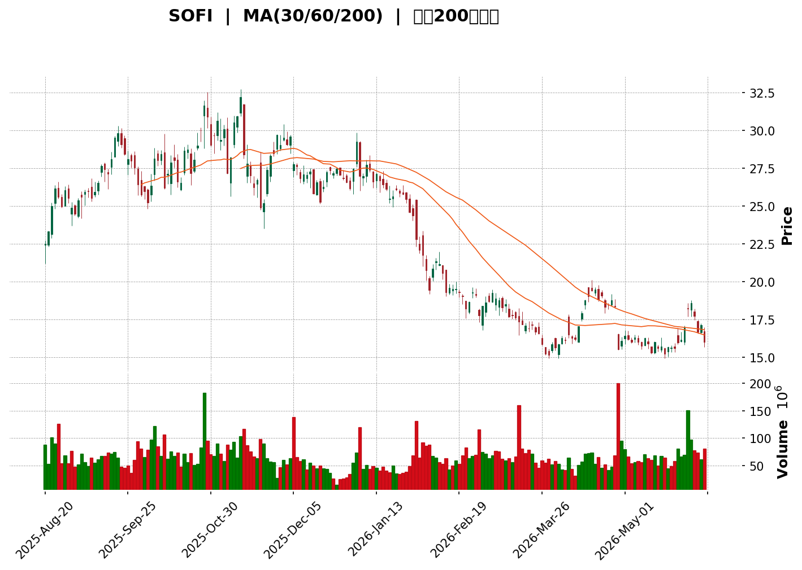
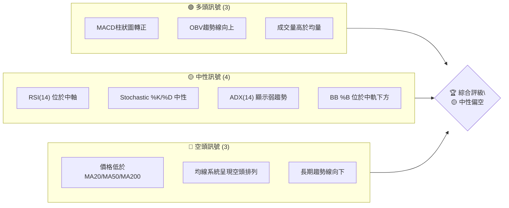

<details>
<summary>📊 靜態圖表 (點擊展開)</summary>

</details>

<html>
<head><meta charset="utf-8" /></head>
<body>
    <div style="height:500px; width:100%;">                        <script>window.PlotlyConfig = {MathJaxConfig: 'local'};</script>
        <script charset="utf-8" src="https://cdn.plot.ly/plotly-3.6.0.min.js" integrity="sha256-QaOVwtVY0T02VaHrr6pnoHLCwayMJp4O5n4YyaE3rJk=" crossorigin="anonymous"></script>                <div id="candlestick-chart" class="plotly-graph-div" style="height:100%; width:100%;"></div>            <script>                window.PLOTLYENV=window.PLOTLYENV || {};                                if (document.getElementById("candlestick-chart")) {                    Plotly.newPlot(                        "candlestick-chart",                        [{"close":{"dtype":"f8","bdata":"AAAAwB6FNkAAAADgelQ3QAAAAMAeBTlAAAAAYGYmOkAAAABguJ45QAAAAIDC9ThAAAAAgD0KOkAAAACAPYo5QAAAAMD16DhAAAAAoHB9OEAAAACgR2E5QAAAAKCZmTlAAAAAgML1OUAAAADgUfg5QAAAAMAehTlAAAAAgML1OUAAAADAzIw6QAAAACCFqztAAAAAIIVrO0AAAAAA1yM7QAAAAAApHDxAAAAAYI+CPUAAAAAgXM89QAAAAEAKFz1AAAAA4KNwPEAAAABguB48QAAAAEDh+jtAAAAAwMyMO0AAAAAghWs6QAAAAGCPwjlAAAAA4FH4OUAAAACgcD05QAAAAAApXDpAAAAAANcjPEAAAADAHgU8QAAAAEAzczxAAAAA4KMwOkAAAAAA1yM7QAAAAGC43jtAAAAAIK4HPEAAAACgmZk6QAAAAIA9ijpAAAAAgBSuPEAAAAAAAMA8QAAAAOCjMDtAAAAA4HoUPEAAAABgjwI9QAAAAAAAAD5AAAAAwPWoP0AAAABgZuY+QAAAACCuBz1AAAAAgBSuPUAAAACgR6E+QAAAAGC4Xj1AAAAAgOsRPkAAAADA9Sg7QAAAAIDCNTxAAAAAgD2KPkAAAABAM\u002fM+QAAAAEDhGkBAAAAAANdjPEAAAACA69E7QAAAAIA9CjtAAAAAoHA9OkAAAADgUbg6QAAAAMD16DhAAAAA4KMwOUAAAABgZmY7QAAAAOB6VDxAAAAAoHB9PEAAAADgUbg9QAAAACCuBz1AAAAAYI+CPUAAAACA6xE9QAAAAKCZmT1AAAAAIK7HO0AAAAAAKZw7QAAAAOB61DpAAAAAQAoXO0AAAACA6xE7QAAAACCuRztAAAAAgOvROUAAAADgepQ6QAAAAMAeRTlAAAAAgD1KOkAAAACgcD07QAAAAKCZWTtAAAAA4KMwO0AAAABA4Xo7QAAAAIDrETtAAAAAgOvROkAAAAAgXI86QAAAAIAULjpAAAAAgMJ1O0AAAAAgrkc9QAAAAEDh+jpAAAAAAAAAO0AAAADgUbg7QAAAAGBmZjtAAAAAoJmZOkAAAAAA1yM7QAAAACCFqzpAAAAA4KNwOkAAAACgRyE6QAAAAKBwfTlAAAAAANejOUAAAABAChc6QAAAAKCZ2TlAAAAAwMzMOUAAAACAwnU5QAAAAKCZmThAAAAAAClcOEAAAAAgXM82QAAAAOB6FDZAAAAAYI\u002fCNUAAAAAAAMA0QAAAAIDCdTNAAAAAACncNEAAAACgmVk1QAAAAIAULjVAAAAAwMyMNEAAAADAzEwzQAAAAAApnDNAAAAAYI+CM0AAAACAPYozQAAAAMDMTDNAAAAAwB4FM0AAAADgUTgyQAAAAMD1qDJAAAAAgD1KM0AAAACgmRkzQAAAAGCPwjFAAAAAANdjMkAAAAAAKZwyQAAAAEAzszJAAAAAAABAM0AAAABgZuYyQAAAAIA9yjJAAAAAgD1KMkAAAAAgrocyQAAAAEAzszFAAAAAYI\u002fCMUAAAACgR6ExQAAAAGC4XjFAAAAAgBQuMUAAAADgehQxQAAAAGBm5jBAAAAAYGYmMUAAAABAM7MwQAAAACBcjzBAAAAAoHC9L0AAAACAwnUuQAAAAMDMTC5AAAAAYI\u002fCL0AAAABgj0IvQAAAAEAzsy9AAAAAwB5FMEAAAAAAKRwwQAAAAKBwfTBAAAAAwB5FMEAAAADgUTgwQAAAAMDMDDFAAAAAwPXoMUAAAACAPcoyQAAAACCuBzNAAAAAgBRuM0AAAAAAAIAzQAAAAOB61DJAAAAAIFwPM0AAAACA61EyQAAAAOCjcDJAAAAAYI\u002fCMkAAAAAAKVwyQAAAAMDMDC9AAAAAoJkZMEAAAACAFG4wQAAAAEAzMzBAAAAAwB4FMEAAAADAzEwwQAAAAAAAADBAAAAAAACAL0AAAABgj0IwQAAAAMDMzC9AAAAAYLieLkAAAADAHgUwQAAAAOBROC9AAAAAIIVrL0AAAACAwnUuQAAAAKBHYS9AAAAAwMxML0AAAACgcD0vQAAAAIDC9S9AAAAAIIUrMEAAAADgUfgwQAAAAOBRODJAAAAA4HqUMkAAAACgcL0xQAAAAIAUrjBAAAAAYGYmMUAAAAAgrgcwQA=="},"high":{"dtype":"f8","bdata":"AAAA4FG4NkAAAADAdl43QAAAAAAAQDlAAAAAoEdhOkAAAABA4Zo6QAAAACBczzlAAAAA4HpUOkAAAAAghWs6QAAAACCuRzlAAAAAACkcOUAAAACAPYo5QAAAAOBR+DlAAAAAoJkZOkAAAADgozA6QAAAAEDh2jpAAAAAoJmZOkAAAADgo7A6QAAAAMAexTtAAAAAoEfhO0AAAACAwnU7QAAAAEC2kzxAAAAAoEehPUAAAADAzEw+QAAAAADXIz5AAAAAIIWrPUAAAAAghas8QAAAAEDhejxAAAAAoEehPEAAAAAAKZw7QAAAAOB6VDtAAAAAoJlZOkAAAACAFC46QAAAAADXIztAAAAAQArXPEAAAACAwrU8QAAAAOCjsDxAAAAAwMzMPUAAAACAFG47QAAAAKCZWTxAAAAAQAoXPUAAAADgo3A8QAAAACCF6zpAAAAAgBTuPEAAAACA6xE9QAAAAMDMzDxAAAAA4FGYPEAAAABguN49QAAAAEAzMz5AAAAAQOH6P0AAAADgUUhAQAAAAIA96j5AAAAAACncPUAAAADgUTg\u002fQAAAAIA9yj5AAAAAYLhePkAAAABg59s+QAAAAKBwPTxAAAAA4FH4PkAAAACgcP0+QAAAAKBwXUBAAAAAAADAP0AAAACA6xE9QAAAAEAz8ztAAAAAAAAAO0AAAACgmdk6QAAAAEAzkzxAAAAAgOtxOUAAAAAAKZw7QAAAAEAzczxAAAAAAABAPUAAAAAAAMA9QAAAAEAzsz1AAAAAIIVrPkAAAACAFO49QAAAAEAzsz1AAAAAgBTuO0AAAADgetQ7QAAAAEAzcztAAAAAgBSuO0AAAAAgrkc7QAAAAAAAgDtAAAAAQOF6O0AAAACgcL06QAAAAIDC1TpAAAAAQAq3OkAAAABguF47QAAAAGC4njtAAAAAQApXO0AAAACAPYo7QAAAAMDMjDtAAAAAwPVoO0AAAAAA1yM7QAAAAGBm5jpAAAAAoEeBO0AAAAAAKdw9QAAAAMDMTD1AAAAAgBQuO0AAAACAFA48QAAAAAAAYDxAAAAAYOVQO0AAAABAMzM7QAAAAIDCFTtAAAAA4HpUO0AAAAAgrsc6QAAAAEAKVzpAAAAAwMwMOkAAAAAA12M6QAAAAKBHITpAAAAAYGZmOkAAAACAFO45QAAAAIA9yjlAAAAAYLgeOUAAAADgUXg5QAAAAAAAADdAAAAAAClcN0AAAAAA18M1QAAAAGBmZjRAAAAAwPUoNUAAAABACpc1QAAAAAAAADZAAAAAoJkZNUAAAACAPco0QAAAAGC43jNAAAAAQArXM0AAAABgjwI0QAAAAEDhejNAAAAA4KMwM0AAAACgR8EyQAAAAIDCtTJAAAAAYLieM0AAAAAgXI8zQAAAAIDCNTJAAAAAwPVoMkAAAACAPQozQAAAACCuRzNAAAAAQOF6M0AAAABguD4zQAAAAIDr8TJAAAAAYGYGM0AAAACgmdkyQAAAAMDMjDJAAAAAYGYmMkAAAACA6xEyQAAAAKBHQTJAAAAAIK4HMkAAAAAghUsxQAAAAMByaDFAAAAAwPVoMUAAAACA6xExQAAAAEAKVzFAAAAAoHB9MEAAAACgR2EvQAAAAKBHIS9AAAAAYGYGMEAAAACA61EwQAAAACCuxy9AAAAAwMxsMEAAAABA4VowQAAAAKCZ2TFAAAAA4FF4MEAAAACgcH0wQAAAACBcDzFAAAAAQDMTMkAAAACA69EyQAAAAGC4njNAAAAAoEchNEAAAADAHqUzQAAAAMAexTNAAAAAILByM0AAAABgZuYyQAAAAEAzkzJAAAAAIIUrM0AAAABguN4yQAAAAEAKlzBAAAAAYLheMEAAAAAghcswQAAAACCuxzBAAAAAIFxPMEAAAACgR4EwQAAAAIDCdTBAAAAAwMwMMEAAAACA61EwQAAAAOB6VDBAAAAAIIVrL0AAAADgoxAwQAAAAIAUri9AAAAAgOtRMEAAAAAgrkcvQAAAAOCjcC9AAAAAgOuRL0AAAAAAKdwvQAAAAEAz8zBAAAAA4KOwMEAAAADgehQxQAAAAEAKlzJAAAAAIIXLMkAAAABA4ToyQAAAAEAKdzFAAAAAQOE6MUAAAACgcP0wQA=="},"hovertemplate":"\u003cb\u003e%{x|%Y-%m-%d}\u003c\u002fb\u003e\u003cbr\u003e\u958b: $%{open:.2f}\u003cbr\u003e\u9ad8: $%{high:.2f}\u003cbr\u003e\u4f4e: $%{low:.2f}\u003cbr\u003e\u6536: $%{close:.2f}\u003cextra\u003e\u003c\u002fextra\u003e","low":{"dtype":"f8","bdata":"AAAAgMI1NUAAAAAgXE82QAAAAGBm5jZAAAAAIFzPOEAAAAAAAIA5QAAAAKBH4ThAAAAAAAAAOUAAAACAwjU5QAAAAEAzszdAAAAAANdjOEAAAAAgsj04QAAAAIAULjhAAAAAwMwMOUAAAADAzIw5QAAAAMDMTDlAAAAAYLieOUAAAADAHsU5QAAAACBc7zpAAAAAoEehOkAAAACgRyE6QAAAAOB6FDtAAAAAoHA9PEAAAADgUfg8QAAAAKCZ2TxAAAAAoJlZPEAAAAAgXA87QAAAACBcjztAAAAAACkcO0AAAABAM7M5QAAAAADXozlAAAAAQDNzOUAAAABACtc4QAAAACBcTzlAAAAAgBSuOkAAAADAHqU7QAAAAAAAwDtAAAAAoEchOkAAAADgUXg6QAAAAAAAwDlAAAAAIFyPO0AAAAAAAEA6QAAAAGCPAjpAAAAAIFwPO0AAAABgZiY8QAAAAKBHYTpAAAAAoPEyO0AAAABAM7M8QAAAAMAeRT1AAAAAwMzMPEAAAAAA1yM+QAAAAEDh+jxAAAAAoHB9PEAAAADgelQ9QAAAAOCjsDxAAAAAYI8CPUAAAACgRyE7QAAAAMD1qDlAAAAAQArXPEAAAADgIts9QAAAAIDC9T5AAAAAYGYmPEAAAAAgroc6QAAAAMDMjDpAAAAAgMK1OUAAAAAgXI85QAAAAGC4vjhAAAAAwB6FN0AAAAAgrqc5QAAAAKBHoTpAAAAAIFxPPEAAAADgenQ8QAAAACCFqzxAAAAA4KNQPUAAAADAHgU9QAAAAEDhejxAAAAAgBTuOkAAAADAzAw7QAAAAMDMjDpAAAAAQOF6OkAAAACAFI46QAAAAEAzMzpAAAAAgD3KOUAAAADgUbg5QAAAACCFKzlAAAAAQDPzOUAAAAAgrkc6QAAAAKCZGTtAAAAAQDPTOkAAAAAgrgc7QAAAACCuBztAAAAAoHC9OkAAAACAPYo6QAAAACBcDzpAAAAAgD3KOUAAAACgmZk7QAAAACCuBzpAAAAAoHBdOkAAAACA65E6QAAAAEDhOjtAAAAAQDMzOkAAAADgUTg6QAAAACCF6zlAAAAAgMI1OkAAAABgjwI6QAAAAIDCNTlAAAAAQDPzOEAAAAAAAAA6QAAAAKCZmTlAAAAAwB7FOUAAAACAwjU5QAAAAIDrkThAAAAAwMwMOEAAAAAgXE82QAAAAAAp3DVAAAAAwB4FNUAAAACA6xE0QAAAAACqMTNAAAAAgD0KNEAAAADAzMw0QAAAAMDMDDVAAAAAANcjNEAAAACAPQozQAAAAGBmJjNAAAAAACkcM0AAAACgmTkzQAAAAOBR+DJAAAAAANeDMkAAAADgepQxQAAAAADX4zFAAAAAgBTuMkAAAADgUfgyQAAAACBcTzFAAAAAwMzMMEAAAADgo7AxQAAAAAApnDJAAAAAANejMkAAAABguB4yQAAAAMAexTFAAAAAgD0KMkAAAADgUfgxQAAAAGC4njFAAAAAIK6HMUAAAADgUXgxQAAAAEDhejBAAAAAwPUoMUAAAADgepQwQAAAACCFqzBAAAAAQArXMEAAAACgcH0wQAAAAMAehTBAAAAAACmcL0AAAADAzEwuQAAAAGC43i1AAAAAYLieLkAAAACgR+EuQAAAAAAp3C1AAAAAYI\u002fCL0AAAACA69EvQAAAAGCPQjBAAAAA4HrUL0AAAADgURgwQAAAACCF6y9AAAAAYGZmMUAAAAAghSsyQAAAAGBmpjJAAAAAANdjM0AAAABAChczQAAAAOCjsDJAAAAAwPXoMkAAAACAFO4xQAAAAIDAKjJAAAAAANdjMkAAAADAHkUyQAAAAAAAAC9AAAAA4HoUL0AAAAAAAMAvQAAAAKBHITBAAAAAoEfhL0AAAABA4fovQAAAAMD1qC9AAAAAgD0KL0AAAACAPYovQAAAAKCZGS9AAAAAgBRuLkAAAACAwnUuQAAAAGCPwi5AAAAAgBSuLkAAAABACtctQAAAACBcDy5AAAAAQDOzLkAAAADgUbguQAAAAOBRuC9AAAAAYI8CMEAAAAAA16MvQAAAAIAUrjFAAAAA4KOwMUAAAACAwnUxQAAAAOB6lDBAAAAAgMKVMEAAAAAAKVwvQA=="},"name":"\u50f9\u683c","open":{"dtype":"f8","bdata":"AAAAIIVrNkAAAADgo3A2QAAAAMD1KDdAAAAAgBQuOUAAAADgejQ6QAAAAKBwnTlAAAAAwB4FOUAAAADA9Sg6QAAAAAAAgDhAAAAAIFwPOUAAAADgelQ4QAAAAMAexTlAAAAAIFzPOUAAAADAHgU6QAAAAIA9SjpAAAAAYI\u002fCOUAAAAAAAAA6QAAAAAAAQDtAAAAAgD3KO0AAAAAAAEA7QAAAAEAKlztAAAAAANdDPEAAAADAzEw9QAAAAIAUzj1AAAAAAACAPUAAAABgj8I7QAAAAGC4XjxAAAAAAClcPEAAAADgUXg7QAAAAEDhujpAAAAA4HpUOkAAAACgmRk6QAAAAMAexTlAAAAAoJkZO0AAAACgcH08QAAAAIA9CjxAAAAAwMyMPEAAAACA6xE7QAAAAGCPgjpAAAAAQDMzPEAAAACA6xE8QAAAAKCZGTpAAAAAQDMzO0AAAAAgXI88QAAAAKBwfTxAAAAA4HpUO0AAAADgUdg8QAAAAAAAAD5AAAAAoHD9PkAAAABguH4\u002fQAAAACBcbz5AAAAA4KOwPUAAAADA9ag9QAAAACCFSz1AAAAAwB6FPUAAAAAAACA+QAAAAGBmhjpAAAAAIFwPPUAAAABguD4+QAAAAIAULj9AAAAAQOG6P0AAAAAAAAA7QAAAAIDCtTtAAAAAYI+COkAAAACgmXk6QAAAAKBH4TtAAAAAoEehOEAAAADgetQ5QAAAAEDh+jpAAAAAgMK1PEAAAACAPco8QAAAAOB61DxAAAAAANdjPUAAAADAzGw9QAAAAMD1CD1AAAAAoHBdO0AAAABA4bo7QAAAAKBwPTtAAAAAYGamOkAAAABACtc6QAAAAMAeJTtAAAAAIFxvO0AAAACgcL05QAAAAADXozpAAAAAgBQuOkAAAABguJ46QAAAAOBRmDtAAAAAgOsRO0AAAAAghSs7QAAAAIA9ijtAAAAAYLjeOkAAAAAgrgc7QAAAAIAUrjpAAAAAwPWoOkAAAAAgXM87QAAAAEDhOj1AAAAAoHDdOkAAAAAAAAA7QAAAAIAUzjtAAAAAgD1KO0AAAABAM7M6QAAAAAAAADtAAAAAIFzPOkAAAACAPYo6QAAAAOCjcDlAAAAAAACAOUAAAACAFC46QAAAAAAAADpAAAAAYGbmOUAAAABgZuY5QAAAAAAAgDlAAAAAoHDdOEAAAACAFG45QAAAAGCPgjZAAAAAwMwMN0AAAACgcH01QAAAAEDhOjRAAAAAgD1KNEAAAACAPUo1QAAAAEAKFzVAAAAAoJkZNUAAAACAPco0QAAAACCuRzNAAAAAwPVoM0AAAADgUXgzQAAAAOB6VDNAAAAAgMIVM0AAAABA4boyQAAAAAAAADJAAAAAIK5HM0AAAADgozAzQAAAAMD1KDJAAAAAwB4lMUAAAAAAAAAyQAAAACBcDzNAAAAAYGamMkAAAAAAKXwyQAAAAOB6VDJAAAAAIIXrMkAAAAAA12MyQAAAAOBRODJAAAAAwMzMMUAAAAAAAAAyQAAAAOBRuDFAAAAAgBRuMUAAAAAAAMAwQAAAAIA96jBAAAAAIK4nMUAAAABguP4wQAAAAIA9CjFAAAAAYGZGMEAAAABAClcvQAAAAAAp3C5AAAAAYGbmLkAAAABgZkYwQAAAAKBHYS5AAAAAIK7HL0AAAADA9SgwQAAAAIAUrjFAAAAAANdjMEAAAADAzEwwQAAAAAAAADBAAAAAIK6HMUAAAADgUXgyQAAAAGC4njNAAAAAoJmZM0AAAABgj0IzQAAAAGCPgjNAAAAAgD1KM0AAAADAHsUyQAAAAOCjcDJAAAAAQOF6MkAAAADAHmUyQAAAAMDMjDBAAAAAgD2KL0AAAAAAKTwwQAAAAOBReDBAAAAAIIUrMEAAAABAMzMwQAAAAGCPQjBAAAAAIK4HMEAAAACgmZkvQAAAAIDrETBAAAAAIIVrL0AAAABguJ4uQAAAAGBmZi9AAAAAgML1LkAAAACAwjUvQAAAAEDhui5AAAAAoHA9L0AAAABgZmYvQAAAAEDhejBAAAAAwMwMMEAAAADAHgUwQAAAAGCPQjJAAAAAYGYmMkAAAAAgrgcyQAAAAKBHYTFAAAAAwPWoMEAAAABA4bowQA=="},"x":["2025-08-20T00:00:00-04:00","2025-08-21T00:00:00-04:00","2025-08-22T00:00:00-04:00","2025-08-25T00:00:00-04:00","2025-08-26T00:00:00-04:00","2025-08-27T00:00:00-04:00","2025-08-28T00:00:00-04:00","2025-08-29T00:00:00-04:00","2025-09-02T00:00:00-04:00","2025-09-03T00:00:00-04:00","2025-09-04T00:00:00-04:00","2025-09-05T00:00:00-04:00","2025-09-08T00:00:00-04:00","2025-09-09T00:00:00-04:00","2025-09-10T00:00:00-04:00","2025-09-11T00:00:00-04:00","2025-09-12T00:00:00-04:00","2025-09-15T00:00:00-04:00","2025-09-16T00:00:00-04:00","2025-09-17T00:00:00-04:00","2025-09-18T00:00:00-04:00","2025-09-19T00:00:00-04:00","2025-09-22T00:00:00-04:00","2025-09-23T00:00:00-04:00","2025-09-24T00:00:00-04:00","2025-09-25T00:00:00-04:00","2025-09-26T00:00:00-04:00","2025-09-29T00:00:00-04:00","2025-09-30T00:00:00-04:00","2025-10-01T00:00:00-04:00","2025-10-02T00:00:00-04:00","2025-10-03T00:00:00-04:00","2025-10-06T00:00:00-04:00","2025-10-07T00:00:00-04:00","2025-10-08T00:00:00-04:00","2025-10-09T00:00:00-04:00","2025-10-10T00:00:00-04:00","2025-10-13T00:00:00-04:00","2025-10-14T00:00:00-04:00","2025-10-15T00:00:00-04:00","2025-10-16T00:00:00-04:00","2025-10-17T00:00:00-04:00","2025-10-20T00:00:00-04:00","2025-10-21T00:00:00-04:00","2025-10-22T00:00:00-04:00","2025-10-23T00:00:00-04:00","2025-10-24T00:00:00-04:00","2025-10-27T00:00:00-04:00","2025-10-28T00:00:00-04:00","2025-10-29T00:00:00-04:00","2025-10-30T00:00:00-04:00","2025-10-31T00:00:00-04:00","2025-11-03T00:00:00-05:00","2025-11-04T00:00:00-05:00","2025-11-05T00:00:00-05:00","2025-11-06T00:00:00-05:00","2025-11-07T00:00:00-05:00","2025-11-10T00:00:00-05:00","2025-11-11T00:00:00-05:00","2025-11-12T00:00:00-05:00","2025-11-13T00:00:00-05:00","2025-11-14T00:00:00-05:00","2025-11-17T00:00:00-05:00","2025-11-18T00:00:00-05:00","2025-11-19T00:00:00-05:00","2025-11-20T00:00:00-05:00","2025-11-21T00:00:00-05:00","2025-11-24T00:00:00-05:00","2025-11-25T00:00:00-05:00","2025-11-26T00:00:00-05:00","2025-11-28T00:00:00-05:00","2025-12-01T00:00:00-05:00","2025-12-02T00:00:00-05:00","2025-12-03T00:00:00-05:00","2025-12-04T00:00:00-05:00","2025-12-05T00:00:00-05:00","2025-12-08T00:00:00-05:00","2025-12-09T00:00:00-05:00","2025-12-10T00:00:00-05:00","2025-12-11T00:00:00-05:00","2025-12-12T00:00:00-05:00","2025-12-15T00:00:00-05:00","2025-12-16T00:00:00-05:00","2025-12-17T00:00:00-05:00","2025-12-18T00:00:00-05:00","2025-12-19T00:00:00-05:00","2025-12-22T00:00:00-05:00","2025-12-23T00:00:00-05:00","2025-12-24T00:00:00-05:00","2025-12-26T00:00:00-05:00","2025-12-29T00:00:00-05:00","2025-12-30T00:00:00-05:00","2025-12-31T00:00:00-05:00","2026-01-02T00:00:00-05:00","2026-01-05T00:00:00-05:00","2026-01-06T00:00:00-05:00","2026-01-07T00:00:00-05:00","2026-01-08T00:00:00-05:00","2026-01-09T00:00:00-05:00","2026-01-12T00:00:00-05:00","2026-01-13T00:00:00-05:00","2026-01-14T00:00:00-05:00","2026-01-15T00:00:00-05:00","2026-01-16T00:00:00-05:00","2026-01-20T00:00:00-05:00","2026-01-21T00:00:00-05:00","2026-01-22T00:00:00-05:00","2026-01-23T00:00:00-05:00","2026-01-26T00:00:00-05:00","2026-01-27T00:00:00-05:00","2026-01-28T00:00:00-05:00","2026-01-29T00:00:00-05:00","2026-01-30T00:00:00-05:00","2026-02-02T00:00:00-05:00","2026-02-03T00:00:00-05:00","2026-02-04T00:00:00-05:00","2026-02-05T00:00:00-05:00","2026-02-06T00:00:00-05:00","2026-02-09T00:00:00-05:00","2026-02-10T00:00:00-05:00","2026-02-11T00:00:00-05:00","2026-02-12T00:00:00-05:00","2026-02-13T00:00:00-05:00","2026-02-17T00:00:00-05:00","2026-02-18T00:00:00-05:00","2026-02-19T00:00:00-05:00","2026-02-20T00:00:00-05:00","2026-02-23T00:00:00-05:00","2026-02-24T00:00:00-05:00","2026-02-25T00:00:00-05:00","2026-02-26T00:00:00-05:00","2026-02-27T00:00:00-05:00","2026-03-02T00:00:00-05:00","2026-03-03T00:00:00-05:00","2026-03-04T00:00:00-05:00","2026-03-05T00:00:00-05:00","2026-03-06T00:00:00-05:00","2026-03-09T00:00:00-04:00","2026-03-10T00:00:00-04:00","2026-03-11T00:00:00-04:00","2026-03-12T00:00:00-04:00","2026-03-13T00:00:00-04:00","2026-03-16T00:00:00-04:00","2026-03-17T00:00:00-04:00","2026-03-18T00:00:00-04:00","2026-03-19T00:00:00-04:00","2026-03-20T00:00:00-04:00","2026-03-23T00:00:00-04:00","2026-03-24T00:00:00-04:00","2026-03-25T00:00:00-04:00","2026-03-26T00:00:00-04:00","2026-03-27T00:00:00-04:00","2026-03-30T00:00:00-04:00","2026-03-31T00:00:00-04:00","2026-04-01T00:00:00-04:00","2026-04-02T00:00:00-04:00","2026-04-06T00:00:00-04:00","2026-04-07T00:00:00-04:00","2026-04-08T00:00:00-04:00","2026-04-09T00:00:00-04:00","2026-04-10T00:00:00-04:00","2026-04-13T00:00:00-04:00","2026-04-14T00:00:00-04:00","2026-04-15T00:00:00-04:00","2026-04-16T00:00:00-04:00","2026-04-17T00:00:00-04:00","2026-04-20T00:00:00-04:00","2026-04-21T00:00:00-04:00","2026-04-22T00:00:00-04:00","2026-04-23T00:00:00-04:00","2026-04-24T00:00:00-04:00","2026-04-27T00:00:00-04:00","2026-04-28T00:00:00-04:00","2026-04-29T00:00:00-04:00","2026-04-30T00:00:00-04:00","2026-05-01T00:00:00-04:00","2026-05-04T00:00:00-04:00","2026-05-05T00:00:00-04:00","2026-05-06T00:00:00-04:00","2026-05-07T00:00:00-04:00","2026-05-08T00:00:00-04:00","2026-05-11T00:00:00-04:00","2026-05-12T00:00:00-04:00","2026-05-13T00:00:00-04:00","2026-05-14T00:00:00-04:00","2026-05-15T00:00:00-04:00","2026-05-18T00:00:00-04:00","2026-05-19T00:00:00-04:00","2026-05-20T00:00:00-04:00","2026-05-21T00:00:00-04:00","2026-05-22T00:00:00-04:00","2026-05-26T00:00:00-04:00","2026-05-27T00:00:00-04:00","2026-05-28T00:00:00-04:00","2026-05-29T00:00:00-04:00","2026-06-01T00:00:00-04:00","2026-06-02T00:00:00-04:00","2026-06-03T00:00:00-04:00","2026-06-04T00:00:00-04:00","2026-06-05T00:00:00-04:00"],"type":"candlestick"},{"hovertemplate":"MA30: $%{y:.2f}\u003cextra\u003e\u003c\u002fextra\u003e","line":{"color":"#2196F3","dash":"dash","width":2},"mode":"lines","name":"MA30","x":["2025-08-20T00:00:00-04:00","2025-08-21T00:00:00-04:00","2025-08-22T00:00:00-04:00","2025-08-25T00:00:00-04:00","2025-08-26T00:00:00-04:00","2025-08-27T00:00:00-04:00","2025-08-28T00:00:00-04:00","2025-08-29T00:00:00-04:00","2025-09-02T00:00:00-04:00","2025-09-03T00:00:00-04:00","2025-09-04T00:00:00-04:00","2025-09-05T00:00:00-04:00","2025-09-08T00:00:00-04:00","2025-09-09T00:00:00-04:00","2025-09-10T00:00:00-04:00","2025-09-11T00:00:00-04:00","2025-09-12T00:00:00-04:00","2025-09-15T00:00:00-04:00","2025-09-16T00:00:00-04:00","2025-09-17T00:00:00-04:00","2025-09-18T00:00:00-04:00","2025-09-19T00:00:00-04:00","2025-09-22T00:00:00-04:00","2025-09-23T00:00:00-04:00","2025-09-24T00:00:00-04:00","2025-09-25T00:00:00-04:00","2025-09-26T00:00:00-04:00","2025-09-29T00:00:00-04:00","2025-09-30T00:00:00-04:00","2025-10-01T00:00:00-04:00","2025-10-02T00:00:00-04:00","2025-10-03T00:00:00-04:00","2025-10-06T00:00:00-04:00","2025-10-07T00:00:00-04:00","2025-10-08T00:00:00-04:00","2025-10-09T00:00:00-04:00","2025-10-10T00:00:00-04:00","2025-10-13T00:00:00-04:00","2025-10-14T00:00:00-04:00","2025-10-15T00:00:00-04:00","2025-10-16T00:00:00-04:00","2025-10-17T00:00:00-04:00","2025-10-20T00:00:00-04:00","2025-10-21T00:00:00-04:00","2025-10-22T00:00:00-04:00","2025-10-23T00:00:00-04:00","2025-10-24T00:00:00-04:00","2025-10-27T00:00:00-04:00","2025-10-28T00:00:00-04:00","2025-10-29T00:00:00-04:00","2025-10-30T00:00:00-04:00","2025-10-31T00:00:00-04:00","2025-11-03T00:00:00-05:00","2025-11-04T00:00:00-05:00","2025-11-05T00:00:00-05:00","2025-11-06T00:00:00-05:00","2025-11-07T00:00:00-05:00","2025-11-10T00:00:00-05:00","2025-11-11T00:00:00-05:00","2025-11-12T00:00:00-05:00","2025-11-13T00:00:00-05:00","2025-11-14T00:00:00-05:00","2025-11-17T00:00:00-05:00","2025-11-18T00:00:00-05:00","2025-11-19T00:00:00-05:00","2025-11-20T00:00:00-05:00","2025-11-21T00:00:00-05:00","2025-11-24T00:00:00-05:00","2025-11-25T00:00:00-05:00","2025-11-26T00:00:00-05:00","2025-11-28T00:00:00-05:00","2025-12-01T00:00:00-05:00","2025-12-02T00:00:00-05:00","2025-12-03T00:00:00-05:00","2025-12-04T00:00:00-05:00","2025-12-05T00:00:00-05:00","2025-12-08T00:00:00-05:00","2025-12-09T00:00:00-05:00","2025-12-10T00:00:00-05:00","2025-12-11T00:00:00-05:00","2025-12-12T00:00:00-05:00","2025-12-15T00:00:00-05:00","2025-12-16T00:00:00-05:00","2025-12-17T00:00:00-05:00","2025-12-18T00:00:00-05:00","2025-12-19T00:00:00-05:00","2025-12-22T00:00:00-05:00","2025-12-23T00:00:00-05:00","2025-12-24T00:00:00-05:00","2025-12-26T00:00:00-05:00","2025-12-29T00:00:00-05:00","2025-12-30T00:00:00-05:00","2025-12-31T00:00:00-05:00","2026-01-02T00:00:00-05:00","2026-01-05T00:00:00-05:00","2026-01-06T00:00:00-05:00","2026-01-07T00:00:00-05:00","2026-01-08T00:00:00-05:00","2026-01-09T00:00:00-05:00","2026-01-12T00:00:00-05:00","2026-01-13T00:00:00-05:00","2026-01-14T00:00:00-05:00","2026-01-15T00:00:00-05:00","2026-01-16T00:00:00-05:00","2026-01-20T00:00:00-05:00","2026-01-21T00:00:00-05:00","2026-01-22T00:00:00-05:00","2026-01-23T00:00:00-05:00","2026-01-26T00:00:00-05:00","2026-01-27T00:00:00-05:00","2026-01-28T00:00:00-05:00","2026-01-29T00:00:00-05:00","2026-01-30T00:00:00-05:00","2026-02-02T00:00:00-05:00","2026-02-03T00:00:00-05:00","2026-02-04T00:00:00-05:00","2026-02-05T00:00:00-05:00","2026-02-06T00:00:00-05:00","2026-02-09T00:00:00-05:00","2026-02-10T00:00:00-05:00","2026-02-11T00:00:00-05:00","2026-02-12T00:00:00-05:00","2026-02-13T00:00:00-05:00","2026-02-17T00:00:00-05:00","2026-02-18T00:00:00-05:00","2026-02-19T00:00:00-05:00","2026-02-20T00:00:00-05:00","2026-02-23T00:00:00-05:00","2026-02-24T00:00:00-05:00","2026-02-25T00:00:00-05:00","2026-02-26T00:00:00-05:00","2026-02-27T00:00:00-05:00","2026-03-02T00:00:00-05:00","2026-03-03T00:00:00-05:00","2026-03-04T00:00:00-05:00","2026-03-05T00:00:00-05:00","2026-03-06T00:00:00-05:00","2026-03-09T00:00:00-04:00","2026-03-10T00:00:00-04:00","2026-03-11T00:00:00-04:00","2026-03-12T00:00:00-04:00","2026-03-13T00:00:00-04:00","2026-03-16T00:00:00-04:00","2026-03-17T00:00:00-04:00","2026-03-18T00:00:00-04:00","2026-03-19T00:00:00-04:00","2026-03-20T00:00:00-04:00","2026-03-23T00:00:00-04:00","2026-03-24T00:00:00-04:00","2026-03-25T00:00:00-04:00","2026-03-26T00:00:00-04:00","2026-03-27T00:00:00-04:00","2026-03-30T00:00:00-04:00","2026-03-31T00:00:00-04:00","2026-04-01T00:00:00-04:00","2026-04-02T00:00:00-04:00","2026-04-06T00:00:00-04:00","2026-04-07T00:00:00-04:00","2026-04-08T00:00:00-04:00","2026-04-09T00:00:00-04:00","2026-04-10T00:00:00-04:00","2026-04-13T00:00:00-04:00","2026-04-14T00:00:00-04:00","2026-04-15T00:00:00-04:00","2026-04-16T00:00:00-04:00","2026-04-17T00:00:00-04:00","2026-04-20T00:00:00-04:00","2026-04-21T00:00:00-04:00","2026-04-22T00:00:00-04:00","2026-04-23T00:00:00-04:00","2026-04-24T00:00:00-04:00","2026-04-27T00:00:00-04:00","2026-04-28T00:00:00-04:00","2026-04-29T00:00:00-04:00","2026-04-30T00:00:00-04:00","2026-05-01T00:00:00-04:00","2026-05-04T00:00:00-04:00","2026-05-05T00:00:00-04:00","2026-05-06T00:00:00-04:00","2026-05-07T00:00:00-04:00","2026-05-08T00:00:00-04:00","2026-05-11T00:00:00-04:00","2026-05-12T00:00:00-04:00","2026-05-13T00:00:00-04:00","2026-05-14T00:00:00-04:00","2026-05-15T00:00:00-04:00","2026-05-18T00:00:00-04:00","2026-05-19T00:00:00-04:00","2026-05-20T00:00:00-04:00","2026-05-21T00:00:00-04:00","2026-05-22T00:00:00-04:00","2026-05-26T00:00:00-04:00","2026-05-27T00:00:00-04:00","2026-05-28T00:00:00-04:00","2026-05-29T00:00:00-04:00","2026-06-01T00:00:00-04:00","2026-06-02T00:00:00-04:00","2026-06-03T00:00:00-04:00","2026-06-04T00:00:00-04:00","2026-06-05T00:00:00-04:00"],"y":{"dtype":"f8","bdata":"AAAAAAAA+H8AAAAAAAD4fwAAAAAAAPh\u002fAAAAAAAA+H8AAAAAAAD4fwAAAAAAAPh\u002fAAAAAAAA+H8AAAAAAAD4fwAAAAAAAPh\u002fAAAAAAAA+H8AAAAAAAD4fwAAAAAAAPh\u002fAAAAAAAA+H8AAAAAAAD4fwAAAAAAAPh\u002fAAAAAAAA+H8AAAAAAAD4fwAAAAAAAPh\u002fAAAAAAAA+H8AAAAAAAD4fwAAAAAAAPh\u002fAAAAAAAA+H8AAAAAAAD4fwAAAAAAAPh\u002fAAAAAAAA+H8AAAAAAAD4fwAAAAAAAPh\u002fAAAAAAAA+H8AAAAAAAD4f7y7uwsCazpA7+7urnKIOkBEREQkv5g6QKuqqmoupDpAMzMzoym1OkBERESEpMk6QKuqqops5zpAiYiIOLToOkCJiIh4W\u002fY6QBEREbGdDztAERER8dItO0AzMzMTPDg7QJqZmYlBQDtAiYiIeHdXO0CamZl5MG87QFVVVaVwfTtAvLu724ePO0AAAADQhaQ7QGZmZsZnuDtAIiIiMpbcO0CrqqoKrPw7QAAAANCFBDxA7+7uLvkFPEAAAACA+Aw8QLy7uytcDzxAVVVV9UQdPEDe3d3NExU8QO\u002fu7j4KFzxAERERAY4wPEARERHxNVc8QN7d3S1AjjxAAAAAwOaiPECJiIjY6rg8QERERFS4vjxAd3d3t4GuPEAiIiLSaaM8QCIiIpI0hTxAmpmZCax8PEBEREQE5H48QGZmZubQgjxAiYiIyL2GPEBmZmaGXaE8QDMzMwOdtjxAzczMLLK9PECamZk5bcA8QDMzM\u002fP91DxAd3d3l27SPEDv7u4+fMY8QGZmZkZvqzxAVVVV9W+EPEAiIiIywWM8QDMzM0PSVDxAZmZm9uEzPECrqqqaUhE8QERERARW7jtAvLu7exTOO0Dv7u4+w847QM3MzIxsxztAzczMXNaqO0B3d3cHOo07QHd3d4ddYTtAAAAA0PdTO0DNzMxMN0k7QJqZmZngQTtAq6qquklMO0AzMzMjImI7QO\u002fu7h7McztAAAAAID6DO0DNzMws+YU7QO\u002fu7o4JfjtAq6qqyuhtO0AiIiKy5Fc7QCIiIjLBQztA3t3drY4pO0BmZmYmeBA7QHd3d7dl7TpAAAAA0CLbOkAiIiJSKs46QKuqqnrNxTpA3t3dbcu6OkBERERUDq06QHd3d8cvljpAzczMXLqJOkC8u7urjmk6QCIiIgJWTjpAIiIiEq4nOkAzMzNzTPA5QKuqqnr4rDlAIiIiYvR2OUAiIiIypUI5QLy7u0tiEDlAVVVVReHaOEDv7u6O7Zw4QM3MzCzdZDhAMzMzIwYhOECJiIjI6M03QBEREZFfjDdA3t3d\u002fUZIN0DNzMzsNfc2QKuqqhqhrDZAq6qqKkBuNkBVVVWFpCk2QERERFSc3TVAVVVV1eqYNUBVVVUlv1g1QKuqqirOHjVAAAAAAEfoNEBEREQ07Ko0QGZmZmatbjRA7+7ujpcuNEDv7u6+dPMzQHd3d3eTuDNAvLu7i0GAM0CamZmpDVQzQDMzM4PcKzNAmpmZWccEM0DNzMwcduUyQFVVVbWdzzJAZmZmFvWvMkAiIiICR4gyQGZmZnbaYDJAERER2eo4MkBERETMLxYyQO\u002fu7sYg8DFAvLu76ybRMUDNzMxkya8xQJqZmcFYkjFAIiIiSuF6MUBVVVXt32gxQFVVVX1bVjFAq6qqMpY8MUBVVVW9AiQxQAAAALjzHTFAzczMJNsZMUBERERcZBsxQJqZmUE1HjFAEREReb4fMUCamZkx3SQxQKuqqpI0JTFAERERqcYrMUAAAADo+ykxQN7d3XVMMDFAZmZm\u002ftQ4MUDNzMy0Dz8xQFVVVT1RLzFAmpmZ8RkmMUB3d3f\u002fjSAxQLy7u9OUGjFAZmZmTvAQMUBVVVV9hg0xQO\u002fu7ia\u002fCDFAIiIiArkHMUBEREQUgxAxQKuqqnrpFjFAvLu7SwwSMUC8u7tDYBUxQJqZmflTEzFAq6qqoowOMUBmZmY+CgcxQN7d3Z02ADFARERENOz6MEBERER8zfUwQBEREQms7DBAq6qq8tLdMEAAAAAYS84wQGZmZp5hxzBAvLu7wyDAMEBERET8G7EwQFVVVT3DnjBAAAAAyHaOMEC8u7sz7HowQA=="},"type":"scatter"},{"hovertemplate":"MA60: $%{y:.2f}\u003cextra\u003e\u003c\u002fextra\u003e","line":{"color":"#9C27B0","dash":"dash","width":2},"mode":"lines","name":"MA60","x":["2025-08-20T00:00:00-04:00","2025-08-21T00:00:00-04:00","2025-08-22T00:00:00-04:00","2025-08-25T00:00:00-04:00","2025-08-26T00:00:00-04:00","2025-08-27T00:00:00-04:00","2025-08-28T00:00:00-04:00","2025-08-29T00:00:00-04:00","2025-09-02T00:00:00-04:00","2025-09-03T00:00:00-04:00","2025-09-04T00:00:00-04:00","2025-09-05T00:00:00-04:00","2025-09-08T00:00:00-04:00","2025-09-09T00:00:00-04:00","2025-09-10T00:00:00-04:00","2025-09-11T00:00:00-04:00","2025-09-12T00:00:00-04:00","2025-09-15T00:00:00-04:00","2025-09-16T00:00:00-04:00","2025-09-17T00:00:00-04:00","2025-09-18T00:00:00-04:00","2025-09-19T00:00:00-04:00","2025-09-22T00:00:00-04:00","2025-09-23T00:00:00-04:00","2025-09-24T00:00:00-04:00","2025-09-25T00:00:00-04:00","2025-09-26T00:00:00-04:00","2025-09-29T00:00:00-04:00","2025-09-30T00:00:00-04:00","2025-10-01T00:00:00-04:00","2025-10-02T00:00:00-04:00","2025-10-03T00:00:00-04:00","2025-10-06T00:00:00-04:00","2025-10-07T00:00:00-04:00","2025-10-08T00:00:00-04:00","2025-10-09T00:00:00-04:00","2025-10-10T00:00:00-04:00","2025-10-13T00:00:00-04:00","2025-10-14T00:00:00-04:00","2025-10-15T00:00:00-04:00","2025-10-16T00:00:00-04:00","2025-10-17T00:00:00-04:00","2025-10-20T00:00:00-04:00","2025-10-21T00:00:00-04:00","2025-10-22T00:00:00-04:00","2025-10-23T00:00:00-04:00","2025-10-24T00:00:00-04:00","2025-10-27T00:00:00-04:00","2025-10-28T00:00:00-04:00","2025-10-29T00:00:00-04:00","2025-10-30T00:00:00-04:00","2025-10-31T00:00:00-04:00","2025-11-03T00:00:00-05:00","2025-11-04T00:00:00-05:00","2025-11-05T00:00:00-05:00","2025-11-06T00:00:00-05:00","2025-11-07T00:00:00-05:00","2025-11-10T00:00:00-05:00","2025-11-11T00:00:00-05:00","2025-11-12T00:00:00-05:00","2025-11-13T00:00:00-05:00","2025-11-14T00:00:00-05:00","2025-11-17T00:00:00-05:00","2025-11-18T00:00:00-05:00","2025-11-19T00:00:00-05:00","2025-11-20T00:00:00-05:00","2025-11-21T00:00:00-05:00","2025-11-24T00:00:00-05:00","2025-11-25T00:00:00-05:00","2025-11-26T00:00:00-05:00","2025-11-28T00:00:00-05:00","2025-12-01T00:00:00-05:00","2025-12-02T00:00:00-05:00","2025-12-03T00:00:00-05:00","2025-12-04T00:00:00-05:00","2025-12-05T00:00:00-05:00","2025-12-08T00:00:00-05:00","2025-12-09T00:00:00-05:00","2025-12-10T00:00:00-05:00","2025-12-11T00:00:00-05:00","2025-12-12T00:00:00-05:00","2025-12-15T00:00:00-05:00","2025-12-16T00:00:00-05:00","2025-12-17T00:00:00-05:00","2025-12-18T00:00:00-05:00","2025-12-19T00:00:00-05:00","2025-12-22T00:00:00-05:00","2025-12-23T00:00:00-05:00","2025-12-24T00:00:00-05:00","2025-12-26T00:00:00-05:00","2025-12-29T00:00:00-05:00","2025-12-30T00:00:00-05:00","2025-12-31T00:00:00-05:00","2026-01-02T00:00:00-05:00","2026-01-05T00:00:00-05:00","2026-01-06T00:00:00-05:00","2026-01-07T00:00:00-05:00","2026-01-08T00:00:00-05:00","2026-01-09T00:00:00-05:00","2026-01-12T00:00:00-05:00","2026-01-13T00:00:00-05:00","2026-01-14T00:00:00-05:00","2026-01-15T00:00:00-05:00","2026-01-16T00:00:00-05:00","2026-01-20T00:00:00-05:00","2026-01-21T00:00:00-05:00","2026-01-22T00:00:00-05:00","2026-01-23T00:00:00-05:00","2026-01-26T00:00:00-05:00","2026-01-27T00:00:00-05:00","2026-01-28T00:00:00-05:00","2026-01-29T00:00:00-05:00","2026-01-30T00:00:00-05:00","2026-02-02T00:00:00-05:00","2026-02-03T00:00:00-05:00","2026-02-04T00:00:00-05:00","2026-02-05T00:00:00-05:00","2026-02-06T00:00:00-05:00","2026-02-09T00:00:00-05:00","2026-02-10T00:00:00-05:00","2026-02-11T00:00:00-05:00","2026-02-12T00:00:00-05:00","2026-02-13T00:00:00-05:00","2026-02-17T00:00:00-05:00","2026-02-18T00:00:00-05:00","2026-02-19T00:00:00-05:00","2026-02-20T00:00:00-05:00","2026-02-23T00:00:00-05:00","2026-02-24T00:00:00-05:00","2026-02-25T00:00:00-05:00","2026-02-26T00:00:00-05:00","2026-02-27T00:00:00-05:00","2026-03-02T00:00:00-05:00","2026-03-03T00:00:00-05:00","2026-03-04T00:00:00-05:00","2026-03-05T00:00:00-05:00","2026-03-06T00:00:00-05:00","2026-03-09T00:00:00-04:00","2026-03-10T00:00:00-04:00","2026-03-11T00:00:00-04:00","2026-03-12T00:00:00-04:00","2026-03-13T00:00:00-04:00","2026-03-16T00:00:00-04:00","2026-03-17T00:00:00-04:00","2026-03-18T00:00:00-04:00","2026-03-19T00:00:00-04:00","2026-03-20T00:00:00-04:00","2026-03-23T00:00:00-04:00","2026-03-24T00:00:00-04:00","2026-03-25T00:00:00-04:00","2026-03-26T00:00:00-04:00","2026-03-27T00:00:00-04:00","2026-03-30T00:00:00-04:00","2026-03-31T00:00:00-04:00","2026-04-01T00:00:00-04:00","2026-04-02T00:00:00-04:00","2026-04-06T00:00:00-04:00","2026-04-07T00:00:00-04:00","2026-04-08T00:00:00-04:00","2026-04-09T00:00:00-04:00","2026-04-10T00:00:00-04:00","2026-04-13T00:00:00-04:00","2026-04-14T00:00:00-04:00","2026-04-15T00:00:00-04:00","2026-04-16T00:00:00-04:00","2026-04-17T00:00:00-04:00","2026-04-20T00:00:00-04:00","2026-04-21T00:00:00-04:00","2026-04-22T00:00:00-04:00","2026-04-23T00:00:00-04:00","2026-04-24T00:00:00-04:00","2026-04-27T00:00:00-04:00","2026-04-28T00:00:00-04:00","2026-04-29T00:00:00-04:00","2026-04-30T00:00:00-04:00","2026-05-01T00:00:00-04:00","2026-05-04T00:00:00-04:00","2026-05-05T00:00:00-04:00","2026-05-06T00:00:00-04:00","2026-05-07T00:00:00-04:00","2026-05-08T00:00:00-04:00","2026-05-11T00:00:00-04:00","2026-05-12T00:00:00-04:00","2026-05-13T00:00:00-04:00","2026-05-14T00:00:00-04:00","2026-05-15T00:00:00-04:00","2026-05-18T00:00:00-04:00","2026-05-19T00:00:00-04:00","2026-05-20T00:00:00-04:00","2026-05-21T00:00:00-04:00","2026-05-22T00:00:00-04:00","2026-05-26T00:00:00-04:00","2026-05-27T00:00:00-04:00","2026-05-28T00:00:00-04:00","2026-05-29T00:00:00-04:00","2026-06-01T00:00:00-04:00","2026-06-02T00:00:00-04:00","2026-06-03T00:00:00-04:00","2026-06-04T00:00:00-04:00","2026-06-05T00:00:00-04:00"],"y":{"dtype":"f8","bdata":"AAAAAAAA+H8AAAAAAAD4fwAAAAAAAPh\u002fAAAAAAAA+H8AAAAAAAD4fwAAAAAAAPh\u002fAAAAAAAA+H8AAAAAAAD4fwAAAAAAAPh\u002fAAAAAAAA+H8AAAAAAAD4fwAAAAAAAPh\u002fAAAAAAAA+H8AAAAAAAD4fwAAAAAAAPh\u002fAAAAAAAA+H8AAAAAAAD4fwAAAAAAAPh\u002fAAAAAAAA+H8AAAAAAAD4fwAAAAAAAPh\u002fAAAAAAAA+H8AAAAAAAD4fwAAAAAAAPh\u002fAAAAAAAA+H8AAAAAAAD4fwAAAAAAAPh\u002fAAAAAAAA+H8AAAAAAAD4fwAAAAAAAPh\u002fAAAAAAAA+H8AAAAAAAD4fwAAAAAAAPh\u002fAAAAAAAA+H8AAAAAAAD4fwAAAAAAAPh\u002fAAAAAAAA+H8AAAAAAAD4fwAAAAAAAPh\u002fAAAAAAAA+H8AAAAAAAD4fwAAAAAAAPh\u002fAAAAAAAA+H8AAAAAAAD4fwAAAAAAAPh\u002fAAAAAAAA+H8AAAAAAAD4fwAAAAAAAPh\u002fAAAAAAAA+H8AAAAAAAD4fwAAAAAAAPh\u002fAAAAAAAA+H8AAAAAAAD4fwAAAAAAAPh\u002fAAAAAAAA+H8AAAAAAAD4fwAAAAAAAPh\u002fAAAAAAAA+H8AAAAAAAD4f83MzByhfDtAd3d3t6yVO0BmZmb+1Kg7QHd3d19zsTtAVVVVrdWxO0AzMzMrh7Y7QGZmZo5QtjtAERERIbCyO0BmZma+n7o7QLy7u0s3yTtAzczMXEjaO0DNzMzMzOw7QGZmZkZv+ztAq6qq0pQKPECamZnZzhc8QEREREw3KTxAmpmZOfswPEB3d3cHgTU8QGZmZobrMTxAvLu7E4MwPEBmZmaeNjA8QJqZmQmsLDxAq6qqku0cPEBVVVWNJQ88QAAAABjZ\u002fjtAiYiIuKz1O0BmZmaG6\u002fE7QN7d3WU77ztA7+7uLrLtO0BERET8N\u002fI7QKuqqtrO9ztAAAAASG\u002f7O0CrqqoSEQE8QO\u002fu7nZMADxAERERuWX9O0Crqqr6xQI8QImIiFiA\u002fDtAzczMFPX\u002fO0CJiIiYbgI8QKuqqjptADxAmpmZSVP6O0BEREQcofw7QKuqqhov\u002fTtAVVVVbaDzO0AAAACwcug7QFVVVdUx4TtAvLu7s8jWO0CJiIhIU8o7QImIiGCeuDtAmpmZsZ2fO0AzMzPDZ4g7QFVVVQWBdTtAmpmZKc5eO0AzMzOjcD07QDMzMwNWHjtA7+7uRuH6OkARERHZh986QLy7u4MyujpAd3d3X+WQOkDNzMyc72c6QJqZmenfODpAq6qqimwXOkDe3d1tEvM5QDMzM+Ne0zlA7+7u7qe2OUDe3d11BZg5QAAAANgVgDlA7+7ujsJlOUDNzMyMlz45QM3MzFRVFTlAq6qqehTuOEC8u7ubxMA4QDMzM8OukDhAmpmZwTxhOEDe3d2lmzQ4QBEREfEZBjhAAAAA6LThN0AzMzNDi7w3QImIiHA9mjdAZmZmfrF0N0CamZmJQVA3QHd3d59hJzdARERE9P0EN0Crqqoqzt42QKuqqkIZvTZA3t3dtTqWNkAAAABI4Wo2QAAAABhLPjZAREREvHQTNkAiIiIaduU1QBEREWGeuDVAMzMzD+aJNUCamZmtjlk1QN7d3fl+KjVAd3d3hxb5NECrqqoW2b40QFVVVSlcjzRAAAAAJJRhNEARERHtCjA0QAAAAEx+ATRAq6qqLmvVM0BVVVWh06YzQCIiIgbIfTNAERER\u002fWJZM0DNzMzAETozQCIiIraBHjNAiYiIvAIEM0Dv7u6y5OcyQImIiPzwyTJAAAAAHC+tMkB3d3dTuI4yQKuqqvZvdDJAERERRYtcMkAzMzOvjkkyQEREROCWLTJAmpmZpXAVMkAiIiIOAgMyQImIiEQZ9TFAZmZmsnLgMUC8u7u\u002f5soxQKuqqs7MtDFAmpmZ7VGgMUBERERwWZMxQM3MzCCFgzFAvLu7m5lxMUBERETUlGIxQJqZmV3WUjFAZmZm9rZEMUDe3d0V9TcxQJqZmQ1JKzFAd3d3M8EbMUDNzMwc6AwxQImIiOBPBTFAvLu7C9f7MEAiIiK61\u002fQwQAAAAHDL8jBAZmZmnu\u002fvMEDv7u6W\u002fOowQAAAAOj74TBAiYiIuB7dMEDe3d0NdNIwQA=="},"type":"scatter"},{"hovertemplate":"MA200: $%{y:.2f}\u003cextra\u003e\u003c\u002fextra\u003e","line":{"color":"#FF6F00","dash":"solid","width":2},"mode":"lines","name":"MA200","x":["2025-08-20T00:00:00-04:00","2025-08-21T00:00:00-04:00","2025-08-22T00:00:00-04:00","2025-08-25T00:00:00-04:00","2025-08-26T00:00:00-04:00","2025-08-27T00:00:00-04:00","2025-08-28T00:00:00-04:00","2025-08-29T00:00:00-04:00","2025-09-02T00:00:00-04:00","2025-09-03T00:00:00-04:00","2025-09-04T00:00:00-04:00","2025-09-05T00:00:00-04:00","2025-09-08T00:00:00-04:00","2025-09-09T00:00:00-04:00","2025-09-10T00:00:00-04:00","2025-09-11T00:00:00-04:00","2025-09-12T00:00:00-04:00","2025-09-15T00:00:00-04:00","2025-09-16T00:00:00-04:00","2025-09-17T00:00:00-04:00","2025-09-18T00:00:00-04:00","2025-09-19T00:00:00-04:00","2025-09-22T00:00:00-04:00","2025-09-23T00:00:00-04:00","2025-09-24T00:00:00-04:00","2025-09-25T00:00:00-04:00","2025-09-26T00:00:00-04:00","2025-09-29T00:00:00-04:00","2025-09-30T00:00:00-04:00","2025-10-01T00:00:00-04:00","2025-10-02T00:00:00-04:00","2025-10-03T00:00:00-04:00","2025-10-06T00:00:00-04:00","2025-10-07T00:00:00-04:00","2025-10-08T00:00:00-04:00","2025-10-09T00:00:00-04:00","2025-10-10T00:00:00-04:00","2025-10-13T00:00:00-04:00","2025-10-14T00:00:00-04:00","2025-10-15T00:00:00-04:00","2025-10-16T00:00:00-04:00","2025-10-17T00:00:00-04:00","2025-10-20T00:00:00-04:00","2025-10-21T00:00:00-04:00","2025-10-22T00:00:00-04:00","2025-10-23T00:00:00-04:00","2025-10-24T00:00:00-04:00","2025-10-27T00:00:00-04:00","2025-10-28T00:00:00-04:00","2025-10-29T00:00:00-04:00","2025-10-30T00:00:00-04:00","2025-10-31T00:00:00-04:00","2025-11-03T00:00:00-05:00","2025-11-04T00:00:00-05:00","2025-11-05T00:00:00-05:00","2025-11-06T00:00:00-05:00","2025-11-07T00:00:00-05:00","2025-11-10T00:00:00-05:00","2025-11-11T00:00:00-05:00","2025-11-12T00:00:00-05:00","2025-11-13T00:00:00-05:00","2025-11-14T00:00:00-05:00","2025-11-17T00:00:00-05:00","2025-11-18T00:00:00-05:00","2025-11-19T00:00:00-05:00","2025-11-20T00:00:00-05:00","2025-11-21T00:00:00-05:00","2025-11-24T00:00:00-05:00","2025-11-25T00:00:00-05:00","2025-11-26T00:00:00-05:00","2025-11-28T00:00:00-05:00","2025-12-01T00:00:00-05:00","2025-12-02T00:00:00-05:00","2025-12-03T00:00:00-05:00","2025-12-04T00:00:00-05:00","2025-12-05T00:00:00-05:00","2025-12-08T00:00:00-05:00","2025-12-09T00:00:00-05:00","2025-12-10T00:00:00-05:00","2025-12-11T00:00:00-05:00","2025-12-12T00:00:00-05:00","2025-12-15T00:00:00-05:00","2025-12-16T00:00:00-05:00","2025-12-17T00:00:00-05:00","2025-12-18T00:00:00-05:00","2025-12-19T00:00:00-05:00","2025-12-22T00:00:00-05:00","2025-12-23T00:00:00-05:00","2025-12-24T00:00:00-05:00","2025-12-26T00:00:00-05:00","2025-12-29T00:00:00-05:00","2025-12-30T00:00:00-05:00","2025-12-31T00:00:00-05:00","2026-01-02T00:00:00-05:00","2026-01-05T00:00:00-05:00","2026-01-06T00:00:00-05:00","2026-01-07T00:00:00-05:00","2026-01-08T00:00:00-05:00","2026-01-09T00:00:00-05:00","2026-01-12T00:00:00-05:00","2026-01-13T00:00:00-05:00","2026-01-14T00:00:00-05:00","2026-01-15T00:00:00-05:00","2026-01-16T00:00:00-05:00","2026-01-20T00:00:00-05:00","2026-01-21T00:00:00-05:00","2026-01-22T00:00:00-05:00","2026-01-23T00:00:00-05:00","2026-01-26T00:00:00-05:00","2026-01-27T00:00:00-05:00","2026-01-28T00:00:00-05:00","2026-01-29T00:00:00-05:00","2026-01-30T00:00:00-05:00","2026-02-02T00:00:00-05:00","2026-02-03T00:00:00-05:00","2026-02-04T00:00:00-05:00","2026-02-05T00:00:00-05:00","2026-02-06T00:00:00-05:00","2026-02-09T00:00:00-05:00","2026-02-10T00:00:00-05:00","2026-02-11T00:00:00-05:00","2026-02-12T00:00:00-05:00","2026-02-13T00:00:00-05:00","2026-02-17T00:00:00-05:00","2026-02-18T00:00:00-05:00","2026-02-19T00:00:00-05:00","2026-02-20T00:00:00-05:00","2026-02-23T00:00:00-05:00","2026-02-24T00:00:00-05:00","2026-02-25T00:00:00-05:00","2026-02-26T00:00:00-05:00","2026-02-27T00:00:00-05:00","2026-03-02T00:00:00-05:00","2026-03-03T00:00:00-05:00","2026-03-04T00:00:00-05:00","2026-03-05T00:00:00-05:00","2026-03-06T00:00:00-05:00","2026-03-09T00:00:00-04:00","2026-03-10T00:00:00-04:00","2026-03-11T00:00:00-04:00","2026-03-12T00:00:00-04:00","2026-03-13T00:00:00-04:00","2026-03-16T00:00:00-04:00","2026-03-17T00:00:00-04:00","2026-03-18T00:00:00-04:00","2026-03-19T00:00:00-04:00","2026-03-20T00:00:00-04:00","2026-03-23T00:00:00-04:00","2026-03-24T00:00:00-04:00","2026-03-25T00:00:00-04:00","2026-03-26T00:00:00-04:00","2026-03-27T00:00:00-04:00","2026-03-30T00:00:00-04:00","2026-03-31T00:00:00-04:00","2026-04-01T00:00:00-04:00","2026-04-02T00:00:00-04:00","2026-04-06T00:00:00-04:00","2026-04-07T00:00:00-04:00","2026-04-08T00:00:00-04:00","2026-04-09T00:00:00-04:00","2026-04-10T00:00:00-04:00","2026-04-13T00:00:00-04:00","2026-04-14T00:00:00-04:00","2026-04-15T00:00:00-04:00","2026-04-16T00:00:00-04:00","2026-04-17T00:00:00-04:00","2026-04-20T00:00:00-04:00","2026-04-21T00:00:00-04:00","2026-04-22T00:00:00-04:00","2026-04-23T00:00:00-04:00","2026-04-24T00:00:00-04:00","2026-04-27T00:00:00-04:00","2026-04-28T00:00:00-04:00","2026-04-29T00:00:00-04:00","2026-04-30T00:00:00-04:00","2026-05-01T00:00:00-04:00","2026-05-04T00:00:00-04:00","2026-05-05T00:00:00-04:00","2026-05-06T00:00:00-04:00","2026-05-07T00:00:00-04:00","2026-05-08T00:00:00-04:00","2026-05-11T00:00:00-04:00","2026-05-12T00:00:00-04:00","2026-05-13T00:00:00-04:00","2026-05-14T00:00:00-04:00","2026-05-15T00:00:00-04:00","2026-05-18T00:00:00-04:00","2026-05-19T00:00:00-04:00","2026-05-20T00:00:00-04:00","2026-05-21T00:00:00-04:00","2026-05-22T00:00:00-04:00","2026-05-26T00:00:00-04:00","2026-05-27T00:00:00-04:00","2026-05-28T00:00:00-04:00","2026-05-29T00:00:00-04:00","2026-06-01T00:00:00-04:00","2026-06-02T00:00:00-04:00","2026-06-03T00:00:00-04:00","2026-06-04T00:00:00-04:00","2026-06-05T00:00:00-04:00"],"y":{"dtype":"f8","bdata":"AAAAAAAA+H8AAAAAAAD4fwAAAAAAAPh\u002fAAAAAAAA+H8AAAAAAAD4fwAAAAAAAPh\u002fAAAAAAAA+H8AAAAAAAD4fwAAAAAAAPh\u002fAAAAAAAA+H8AAAAAAAD4fwAAAAAAAPh\u002fAAAAAAAA+H8AAAAAAAD4fwAAAAAAAPh\u002fAAAAAAAA+H8AAAAAAAD4fwAAAAAAAPh\u002fAAAAAAAA+H8AAAAAAAD4fwAAAAAAAPh\u002fAAAAAAAA+H8AAAAAAAD4fwAAAAAAAPh\u002fAAAAAAAA+H8AAAAAAAD4fwAAAAAAAPh\u002fAAAAAAAA+H8AAAAAAAD4fwAAAAAAAPh\u002fAAAAAAAA+H8AAAAAAAD4fwAAAAAAAPh\u002fAAAAAAAA+H8AAAAAAAD4fwAAAAAAAPh\u002fAAAAAAAA+H8AAAAAAAD4fwAAAAAAAPh\u002fAAAAAAAA+H8AAAAAAAD4fwAAAAAAAPh\u002fAAAAAAAA+H8AAAAAAAD4fwAAAAAAAPh\u002fAAAAAAAA+H8AAAAAAAD4fwAAAAAAAPh\u002fAAAAAAAA+H8AAAAAAAD4fwAAAAAAAPh\u002fAAAAAAAA+H8AAAAAAAD4fwAAAAAAAPh\u002fAAAAAAAA+H8AAAAAAAD4fwAAAAAAAPh\u002fAAAAAAAA+H8AAAAAAAD4fwAAAAAAAPh\u002fAAAAAAAA+H8AAAAAAAD4fwAAAAAAAPh\u002fAAAAAAAA+H8AAAAAAAD4fwAAAAAAAPh\u002fAAAAAAAA+H8AAAAAAAD4fwAAAAAAAPh\u002fAAAAAAAA+H8AAAAAAAD4fwAAAAAAAPh\u002fAAAAAAAA+H8AAAAAAAD4fwAAAAAAAPh\u002fAAAAAAAA+H8AAAAAAAD4fwAAAAAAAPh\u002fAAAAAAAA+H8AAAAAAAD4fwAAAAAAAPh\u002fAAAAAAAA+H8AAAAAAAD4fwAAAAAAAPh\u002fAAAAAAAA+H8AAAAAAAD4fwAAAAAAAPh\u002fAAAAAAAA+H8AAAAAAAD4fwAAAAAAAPh\u002fAAAAAAAA+H8AAAAAAAD4fwAAAAAAAPh\u002fAAAAAAAA+H8AAAAAAAD4fwAAAAAAAPh\u002fAAAAAAAA+H8AAAAAAAD4fwAAAAAAAPh\u002fAAAAAAAA+H8AAAAAAAD4fwAAAAAAAPh\u002fAAAAAAAA+H8AAAAAAAD4fwAAAAAAAPh\u002fAAAAAAAA+H8AAAAAAAD4fwAAAAAAAPh\u002fAAAAAAAA+H8AAAAAAAD4fwAAAAAAAPh\u002fAAAAAAAA+H8AAAAAAAD4fwAAAAAAAPh\u002fAAAAAAAA+H8AAAAAAAD4fwAAAAAAAPh\u002fAAAAAAAA+H8AAAAAAAD4fwAAAAAAAPh\u002fAAAAAAAA+H8AAAAAAAD4fwAAAAAAAPh\u002fAAAAAAAA+H8AAAAAAAD4fwAAAAAAAPh\u002fAAAAAAAA+H8AAAAAAAD4fwAAAAAAAPh\u002fAAAAAAAA+H8AAAAAAAD4fwAAAAAAAPh\u002fAAAAAAAA+H8AAAAAAAD4fwAAAAAAAPh\u002fAAAAAAAA+H8AAAAAAAD4fwAAAAAAAPh\u002fAAAAAAAA+H8AAAAAAAD4fwAAAAAAAPh\u002fAAAAAAAA+H8AAAAAAAD4fwAAAAAAAPh\u002fAAAAAAAA+H8AAAAAAAD4fwAAAAAAAPh\u002fAAAAAAAA+H8AAAAAAAD4fwAAAAAAAPh\u002fAAAAAAAA+H8AAAAAAAD4fwAAAAAAAPh\u002fAAAAAAAA+H8AAAAAAAD4fwAAAAAAAPh\u002fAAAAAAAA+H8AAAAAAAD4fwAAAAAAAPh\u002fAAAAAAAA+H8AAAAAAAD4fwAAAAAAAPh\u002fAAAAAAAA+H8AAAAAAAD4fwAAAAAAAPh\u002fAAAAAAAA+H8AAAAAAAD4fwAAAAAAAPh\u002fAAAAAAAA+H8AAAAAAAD4fwAAAAAAAPh\u002fAAAAAAAA+H8AAAAAAAD4fwAAAAAAAPh\u002fAAAAAAAA+H8AAAAAAAD4fwAAAAAAAPh\u002fAAAAAAAA+H8AAAAAAAD4fwAAAAAAAPh\u002fAAAAAAAA+H8AAAAAAAD4fwAAAAAAAPh\u002fAAAAAAAA+H8AAAAAAAD4fwAAAAAAAPh\u002fAAAAAAAA+H8AAAAAAAD4fwAAAAAAAPh\u002fAAAAAAAA+H8AAAAAAAD4fwAAAAAAAPh\u002fAAAAAAAA+H8AAAAAAAD4fwAAAAAAAPh\u002fAAAAAAAA+H8AAAAAAAD4fwAAAAAAAPh\u002fAAAAAAAA+H+kcD0aUQ43QA=="},"type":"scatter"}],                        {"template":{"data":{"barpolar":[{"marker":{"line":{"color":"rgb(17,17,17)","width":0.5},"pattern":{"fillmode":"overlay","size":10,"solidity":0.2}},"type":"barpolar"}],"bar":[{"error_x":{"color":"#f2f5fa"},"error_y":{"color":"#f2f5fa"},"marker":{"line":{"color":"rgb(17,17,17)","width":0.5},"pattern":{"fillmode":"overlay","size":10,"solidity":0.2}},"type":"bar"}],"carpet":[{"aaxis":{"endlinecolor":"#A2B1C6","gridcolor":"#506784","linecolor":"#506784","minorgridcolor":"#506784","startlinecolor":"#A2B1C6"},"baxis":{"endlinecolor":"#A2B1C6","gridcolor":"#506784","linecolor":"#506784","minorgridcolor":"#506784","startlinecolor":"#A2B1C6"},"type":"carpet"}],"choropleth":[{"colorbar":{"outlinewidth":0,"ticks":""},"type":"choropleth"}],"contourcarpet":[{"colorbar":{"outlinewidth":0,"ticks":""},"type":"contourcarpet"}],"contour":[{"colorbar":{"outlinewidth":0,"ticks":""},"colorscale":[[0.0,"#0d0887"],[0.1111111111111111,"#46039f"],[0.2222222222222222,"#7201a8"],[0.3333333333333333,"#9c179e"],[0.4444444444444444,"#bd3786"],[0.5555555555555556,"#d8576b"],[0.6666666666666666,"#ed7953"],[0.7777777777777778,"#fb9f3a"],[0.8888888888888888,"#fdca26"],[1.0,"#f0f921"]],"type":"contour"}],"heatmap":[{"colorbar":{"outlinewidth":0,"ticks":""},"colorscale":[[0.0,"#0d0887"],[0.1111111111111111,"#46039f"],[0.2222222222222222,"#7201a8"],[0.3333333333333333,"#9c179e"],[0.4444444444444444,"#bd3786"],[0.5555555555555556,"#d8576b"],[0.6666666666666666,"#ed7953"],[0.7777777777777778,"#fb9f3a"],[0.8888888888888888,"#fdca26"],[1.0,"#f0f921"]],"type":"heatmap"}],"histogram2dcontour":[{"colorbar":{"outlinewidth":0,"ticks":""},"colorscale":[[0.0,"#0d0887"],[0.1111111111111111,"#46039f"],[0.2222222222222222,"#7201a8"],[0.3333333333333333,"#9c179e"],[0.4444444444444444,"#bd3786"],[0.5555555555555556,"#d8576b"],[0.6666666666666666,"#ed7953"],[0.7777777777777778,"#fb9f3a"],[0.8888888888888888,"#fdca26"],[1.0,"#f0f921"]],"type":"histogram2dcontour"}],"histogram2d":[{"colorbar":{"outlinewidth":0,"ticks":""},"colorscale":[[0.0,"#0d0887"],[0.1111111111111111,"#46039f"],[0.2222222222222222,"#7201a8"],[0.3333333333333333,"#9c179e"],[0.4444444444444444,"#bd3786"],[0.5555555555555556,"#d8576b"],[0.6666666666666666,"#ed7953"],[0.7777777777777778,"#fb9f3a"],[0.8888888888888888,"#fdca26"],[1.0,"#f0f921"]],"type":"histogram2d"}],"histogram":[{"marker":{"pattern":{"fillmode":"overlay","size":10,"solidity":0.2}},"type":"histogram"}],"mesh3d":[{"colorbar":{"outlinewidth":0,"ticks":""},"type":"mesh3d"}],"parcoords":[{"line":{"colorbar":{"outlinewidth":0,"ticks":""}},"type":"parcoords"}],"pie":[{"automargin":true,"type":"pie"}],"scatter3d":[{"line":{"colorbar":{"outlinewidth":0,"ticks":""}},"marker":{"colorbar":{"outlinewidth":0,"ticks":""}},"type":"scatter3d"}],"scattercarpet":[{"marker":{"colorbar":{"outlinewidth":0,"ticks":""}},"type":"scattercarpet"}],"scattergeo":[{"marker":{"colorbar":{"outlinewidth":0,"ticks":""}},"type":"scattergeo"}],"scattergl":[{"marker":{"line":{"color":"#283442"}},"type":"scattergl"}],"scattermapbox":[{"marker":{"colorbar":{"outlinewidth":0,"ticks":""}},"type":"scattermapbox"}],"scattermap":[{"marker":{"colorbar":{"outlinewidth":0,"ticks":""}},"type":"scattermap"}],"scatterpolargl":[{"marker":{"colorbar":{"outlinewidth":0,"ticks":""}},"type":"scatterpolargl"}],"scatterpolar":[{"marker":{"colorbar":{"outlinewidth":0,"ticks":""}},"type":"scatterpolar"}],"scatter":[{"marker":{"line":{"color":"#283442"}},"type":"scatter"}],"scatterternary":[{"marker":{"colorbar":{"outlinewidth":0,"ticks":""}},"type":"scatterternary"}],"surface":[{"colorbar":{"outlinewidth":0,"ticks":""},"colorscale":[[0.0,"#0d0887"],[0.1111111111111111,"#46039f"],[0.2222222222222222,"#7201a8"],[0.3333333333333333,"#9c179e"],[0.4444444444444444,"#bd3786"],[0.5555555555555556,"#d8576b"],[0.6666666666666666,"#ed7953"],[0.7777777777777778,"#fb9f3a"],[0.8888888888888888,"#fdca26"],[1.0,"#f0f921"]],"type":"surface"}],"table":[{"cells":{"fill":{"color":"#506784"},"line":{"color":"rgb(17,17,17)"}},"header":{"fill":{"color":"#2a3f5f"},"line":{"color":"rgb(17,17,17)"}},"type":"table"}]},"layout":{"annotationdefaults":{"arrowcolor":"#f2f5fa","arrowhead":0,"arrowwidth":1},"autotypenumbers":"strict","coloraxis":{"colorbar":{"outlinewidth":0,"ticks":""}},"colorscale":{"diverging":[[0,"#8e0152"],[0.1,"#c51b7d"],[0.2,"#de77ae"],[0.3,"#f1b6da"],[0.4,"#fde0ef"],[0.5,"#f7f7f7"],[0.6,"#e6f5d0"],[0.7,"#b8e186"],[0.8,"#7fbc41"],[0.9,"#4d9221"],[1,"#276419"]],"sequential":[[0.0,"#0d0887"],[0.1111111111111111,"#46039f"],[0.2222222222222222,"#7201a8"],[0.3333333333333333,"#9c179e"],[0.4444444444444444,"#bd3786"],[0.5555555555555556,"#d8576b"],[0.6666666666666666,"#ed7953"],[0.7777777777777778,"#fb9f3a"],[0.8888888888888888,"#fdca26"],[1.0,"#f0f921"]],"sequentialminus":[[0.0,"#0d0887"],[0.1111111111111111,"#46039f"],[0.2222222222222222,"#7201a8"],[0.3333333333333333,"#9c179e"],[0.4444444444444444,"#bd3786"],[0.5555555555555556,"#d8576b"],[0.6666666666666666,"#ed7953"],[0.7777777777777778,"#fb9f3a"],[0.8888888888888888,"#fdca26"],[1.0,"#f0f921"]]},"colorway":["#636efa","#EF553B","#00cc96","#ab63fa","#FFA15A","#19d3f3","#FF6692","#B6E880","#FF97FF","#FECB52"],"font":{"color":"#f2f5fa"},"geo":{"bgcolor":"rgb(17,17,17)","lakecolor":"rgb(17,17,17)","landcolor":"rgb(17,17,17)","showlakes":true,"showland":true,"subunitcolor":"#506784"},"hoverlabel":{"align":"left"},"hovermode":"closest","mapbox":{"style":"dark"},"paper_bgcolor":"rgb(17,17,17)","plot_bgcolor":"rgb(17,17,17)","polar":{"angularaxis":{"gridcolor":"#506784","linecolor":"#506784","ticks":""},"bgcolor":"rgb(17,17,17)","radialaxis":{"gridcolor":"#506784","linecolor":"#506784","ticks":""}},"scene":{"xaxis":{"backgroundcolor":"rgb(17,17,17)","gridcolor":"#506784","gridwidth":2,"linecolor":"#506784","showbackground":true,"ticks":"","zerolinecolor":"#C8D4E3"},"yaxis":{"backgroundcolor":"rgb(17,17,17)","gridcolor":"#506784","gridwidth":2,"linecolor":"#506784","showbackground":true,"ticks":"","zerolinecolor":"#C8D4E3"},"zaxis":{"backgroundcolor":"rgb(17,17,17)","gridcolor":"#506784","gridwidth":2,"linecolor":"#506784","showbackground":true,"ticks":"","zerolinecolor":"#C8D4E3"}},"shapedefaults":{"line":{"color":"#f2f5fa"}},"sliderdefaults":{"bgcolor":"#C8D4E3","bordercolor":"rgb(17,17,17)","borderwidth":1,"tickwidth":0},"ternary":{"aaxis":{"gridcolor":"#506784","linecolor":"#506784","ticks":""},"baxis":{"gridcolor":"#506784","linecolor":"#506784","ticks":""},"bgcolor":"rgb(17,17,17)","caxis":{"gridcolor":"#506784","linecolor":"#506784","ticks":""}},"title":{"x":0.05},"updatemenudefaults":{"bgcolor":"#506784","borderwidth":0},"xaxis":{"automargin":true,"gridcolor":"#283442","linecolor":"#506784","ticks":"","title":{"standoff":15},"zerolinecolor":"#283442","zerolinewidth":2},"yaxis":{"automargin":true,"gridcolor":"#283442","linecolor":"#506784","ticks":"","title":{"standoff":15},"zerolinecolor":"#283442","zerolinewidth":2}}},"xaxis":{"rangeslider":{"visible":false},"title":{"text":"\u65e5\u671f"}},"font":{"size":11},"title":{"text":"SOFI  |  MA(30\u002f60\u002f200)  |  \u6700\u8fd1200\u4ea4\u6613\u65e5"},"yaxis":{"title":{"text":"\u80a1\u50f9 (USD)"}},"hovermode":"x unified","height":500},                        {"responsive": true}                    )                };            </script>        </div>
</body>
</html>

# SOFI 技術分析報告

> **報告日期**：2026-06-06 ｜ **語言**：繁體中文 ｜ **數據來源**：Yahoo Finance ｜ **當前價格**：$16.03

---

## 目錄

| 章節 | 內容 |
|------|------|
| [1. 技術面概覽](#1-技術面概覽) | 訊號儀表板、核心指標、評分卡 |
| [2. 趨勢分析](#2-趨勢分析) | 多時框趨勢、長中短期走勢 |
| [3. 圖表形態分析](#3-圖表形態分析) | 形態識別、K線組合、目標價 |
| [4. 支撐與阻力](#4-支撐與阻力) | 關鍵價位、斐波那契回調 |
| [5. 技術指標深度解讀](#5-技術指標深度解讀) | MA/RSI/MACD/布林/成交量 |
| [6. 動能與波動率](#6-動能與波動率) | 動能評估、ATR、Beta |
| [7. 多時框架總結](#7-多時框架總結) | 時框架評分矩陣 |
| [8. 交易策略建議](#8-交易策略建議) | 多空策略、風險報酬比 |
| [9. 風險提示與監控](#9-風險提示與監控) | 監控指標、風險場景 |
| [10. 報告總結](#10-報告總結) | 綜合結論與評級 |

---

## 1. 技術面概覽

本章節將對SoFi Technologies, Inc. (SOFI) 的當前技術面狀況進行快速而全面的概覽，透過視覺化儀表板、核心指標速覽及技術評分卡，為後續的深度分析奠定基礎。

### 🎯 技術訊號儀表板

SOFI當前的技術訊號呈現出多空交織的複雜局面。儘管MACD顯示出短期的看多訊號且成交量有所放大，但價格長期趨勢仍受壓於主要移動平均線下方，且趨勢強度偏弱，顯示市場處於盤整或弱勢震盪階段。


**儀表板解讀**：
- **多頭訊號**：主要來自於動能指標MACD柱狀圖近期轉正，以及成交量方面的積極表現，OBV趨勢向上且當前成交量高於20日均量，表明有買盤支撐。
- **中性訊號**：RSI和Stochastic指標均處於中性區間，未顯示超買或超賣。ADX值低於25，暗示目前市場缺乏明確的強勢趨勢，多空雙方力量均衡或處於盤整。布林通道%B值略低於0.5，但仍在通道內，未觸及極端。
- **空頭訊號**：價格目前顯著位於所有關鍵移動平均線（MA20, MA50, MA200）下方，且均線系統呈現典型的空頭排列（MA20 < MA50 < MA200），這是中長期趨勢疲軟的明確信號。過去12個月的長期價格走勢也顯示出從高點回落的趨勢。

綜合來看，儘管短期動能指標有所改善，但中長期趨勢的空頭壓力依然顯著，且市場整體趨勢強度不足。因此，綜合評級為「中性偏空」，投資者應保持謹慎。

### 📊 核心指標速覽表

以下表格匯總了SOFI當前最關鍵的技術指標，並提供了簡潔的訊號解讀。

| 指標類別 | 指標名稱 | 當前數值 | 訊號 | 解讀 |
|----------|----------|----------|------|------|
| **價格** | 當前價格 | $16.03 | 🔴 | 位於多數均線下方，短期面臨賣壓 |
| **均線** | MA20 | $16.31 | 🔴 | 價格位於MA20下方，短期趨勢偏弱 |
| **均線** | MA50 | $16.75 | 🔴 | 價格位於MA50下方，中期趨勢偏空 |
| **均線** | MA200 | $23.06 | 🔴 | 價格位於MA200下方，長期趨勢顯著偏空 |
| **動能** | RSI(14) | 52.78 | 🟡 | 位於中性區間 (30-70)，未超買或超賣 |
| **動能** | MACD柱 | +0.108 | 🟢 | MACD線位於訊號線上，短期動能偏多，但強度減弱 |
| **趨勢** | ADX(14) | 19.96 | 🟡 | 趨勢強度弱於25，市場處於盤整或弱勢趨勢 |
| **波動** | ATR(14) | $0.99 | 🟡 | 日均波動幅度約6.19%，屬中等波動 |
| **成交量**| 量比 (20日) | 1.15x | 🟢 | 成交量放大，高於20日均量，反映市場關注度提升 |

### 🏆 技術評分卡

本評分卡旨在量化各技術維度的表現，提供直觀的綜合評級。評分範圍為0-100，越高代表越強勢。

```
╔══════════════════════════════════════════════════════════════╗
║              技術評分卡 — SOFI (2026-06-06)                   ║
╠══════════════════════════════════════════════════════════════╣
║ 趨勢強度      ███░░░░░░░░░░░░░░░░░░  15/100  🔴             ║
║ 動能指標      ████████░░░░░░░░░░░░  40/100  🟡             ║
║ 支撐穩定度    ██████████░░░░░░░░░░  50/100  🟡             ║
║ 成交量配合    ████████████░░░░░░░░  60/100  🟢             ║
║ 形態完整度    ██████░░░░░░░░░░░░░░  30/100  🔴             ║
║ 均線排列      ██░░░░░░░░░░░░░░░░░░  10/100  🔴             ║
╠══════════════════════════════════════════════════════════════╣
║ 綜合評分      ██████░░░░░░░░░░░░░░  34/100  🔴 弱勢偏空     ║
╚══════════════════════════════════════════════════════════════╝
```
**評分卡詳細解讀**：
- **趨勢強度 (15/100) 🔴**：ADX值19.96顯示趨勢非常弱，表明市場處於盤整或無明確方向。雖然+DI略高於-DI，但整體趨勢強度不足。
- **動能指標 (40/100) 🟡**：MACD柱狀圖為正，表明短期看多動能，但RSI處於中性區間，Stochastic也中性，且MACD柱狀圖近期有縮減跡象，顯示動能並非非常強勁。
- **支撐穩定度 (50/100) 🟡**：雖然價格跌破了多條均線，但$15.23-$15.61區間曾多次提供短期支撐，且布林下軌$14.41也提供了潛在支撐，使得支撐穩定性處於中等水平。52週低點$13.46則是非常強的長期支撐。
- **成交量配合 (60/100) 🟢**：當前成交量高於20日及50日均量，且OBV趨勢向上，顯示量能對價格有一定支撐作用，買盤活躍度提高。
- **形態完整度 (30/100) 🔴**：從提供的數據來看，價格走勢呈現出高點降低、低點震盪的特徵，缺乏清晰的底部反轉形態或明確的看漲形態。短期內多為下跌後的反彈或盤整。
- **均線排列 (10/100) 🔴**：MA20 ($16.31) < MA50 ($16.75) < MA200 ($23.06)，典型的空頭排列，且價格$16.03位於所有主要均線下方，這是非常明確的空頭訊號。

**綜合評分 (34/100) 🔴 弱勢偏空**：整體來看，SOFI在趨勢和均線排列方面得分極低，顯示中長期趨勢的強烈壓力。儘管短期動能和成交量有所改善，但不足以扭轉整體弱勢局面。因此，當前SOFI的技術面評級為「弱勢偏空」。

---

## 2. 趨勢分析

對SOFI的多時框趨勢進行深入分析，有助於理解其在不同時間尺度上的市場行為，從而制定更全面的交易策略。

### 🌐 多時框趨勢分析

透過從長期到短期的多時框視角，我們可以更清晰地描繪SOFI的價格走勢圖。

```mermaid
graph TD
    A[月線圖 - 長期趨勢 (24個月)] --> B{2025年11月高點 $29.72}
    B --> C[高點後持續下跌]
    C --> D[目前處於長期下降通道或底部盤整]
    D --> E[週線圖 - 中期趨勢 (12個月)]
    E --> F{2025年11月後確立下降趨勢}
    F --> G[多次嘗試反彈但受阻]
    G --> H[目前在 $15-$20 區間震盪]
    H --> I[日線圖 - 短期趨勢 (20週)]
    I --> J{從2026年1月高點 $25.85 回落}
    J --> K[經歷數次小幅反彈與下跌]
    K --> L[近期從 $18.22 回落至 $16.03]
    L --> M[價格位於MA20/MA50/MA200下方]
    M --> N[總體結論: 長期空頭主導，中期震盪偏空，短期有反彈需求但壓力重重]
```
**分析詳述**：
- **長期趨勢 (月線圖 - 24個月)**：SOFI在2025年11月達到歷史高點$29.72，隨後展開了一輪顯著的下跌。從2025年12月到2026年3月，價格經歷了大幅回調，從$26.18跌至$15.88。儘管在2026年4月和5月有所反彈，但未能突破關鍵阻力。整體而言，SOFI的長期趨勢明確為下降趨勢，高點和低點均呈現降低的態勢，表明市場在經歷一輪顯著的價值重估。
- **中期趨勢 (週線圖 - 12個月)**：從2025年6月的$18.21開始，SOFI經歷了一波強勁上漲至2025年11月的$29.72。然而，自此之後，中期走勢轉為下跌。價格在$29.72高點後，連續數月收陰線，跌破了多條中期均線。儘管2026年4月和5月出現了兩波反彈，但都被$20-$22區間的阻力壓制，未能形成有效突破。目前價格位於$15-$20的較大區間內震盪，但整體方向偏空。
- **短期趨勢 (日線圖 - 20週)**：觀察最近20週的數據，SOFI從2026年1月25日的$25.85開始下跌，經歷了2月和3月的深度調整，最低觸及$15.23（2026年3月29日）。隨後在4月和5月初有一波反彈，最高達到$19.43（2026年4月19日），但未能維持漲勢。近期從5月31日的$18.22高點再次回落至$16.03，顯示短期上漲動能不足，賣壓再次浮現。價格目前位於MA20、MA50和MA200下方，短期走勢疲軟。

### 📈 長期趨勢 — 12個月走勢圖（Unicode）

以下是SOFI過去12個月的月線收盤價走勢圖，清晰展示了其從高點回落的歷程。

```
SOFI 月線走勢圖（過去12個月：2025年6月 - 2026年6月）

價格軸 ($)
$30.00 ┤                                  ● $29.72 (2025/11 高點)
$29.00 ┤
$28.00 ┤
$27.00 ┤                       ● $26.42 (2025/09)
$26.00 ┤                             ● $26.18 (2025/12)
$25.00 ┤                 ● $25.54 (2025/08)
$24.00 ┤
$23.00 ┤                           ● $22.81 (2026/01)
$22.00 ┤             ● $22.58 (2025/07)
$21.00 ┤
$20.00 ┤
$19.00 ┤● $18.21 (2025/06)                                          ● $18.22 (2026/05)
$18.00 ┤                                 ● $17.76 (2026/02)
$17.00 ┤                                     ● $16.10 (2026/04)
$16.00 ┤                                          ● $16.03 (2026/06 現價)
$15.00 ┤                                  ● $15.88 (2026/03 低點)
     └───────────────────────────────────────────────────────────
      25/06 25/07 25/08 25/09 25/10 25/11 25/12 26/01 26/02 26/03 26/04 26/05 26/06
      (月份)
```
**走勢特徵分析表格**：
下表詳細列出了過去12個月SOFI的價格變化及趨勢特徵。

| 月份 | 收盤價 ($) | 月度漲跌幅 (%) | 趨勢特徵 | 關鍵事件/觀察 |
|------|------------|----------------|----------|--------------------|
| 2025-06 | 18.21 | N/A | 震盪上行起點 | 啟動中期上漲趨勢 |
| 2025-07 | 22.58 | +23.99% | 強勢上漲 | 突破關鍵阻力，動能強勁 |
| 2025-08 | 25.54 | +13.11% | 持續上漲 | 漲勢延續，接近前高 |
| 2025-09 | 26.42 | +3.45% | 漲勢放緩 | 動能略減，但仍保持上行 |
| 2025-10 | 29.68 | +12.34% | 強勢突破 | 創波段新高，買盤活躍 |
| 2025-11 | 29.72 | +0.13% | 歷史高點附近 | 漲勢極度放緩，見頂跡象 |
| 2025-12 | 26.18 | -11.84% | 顯著回調 | 高點回落，賣壓湧現 |
| 2026-01 | 22.81 | -12.91% | 持續下跌 | 跌破多條短期均線 |
| 2026-02 | 17.76 | -22.14% | 大幅下挫 | 加速下跌，進入熊市區間 |
| 2026-03 | 15.88 | -10.58% | 尋找支撐 | 觸及波段新低，超賣嚴重 |
| 2026-04 | 16.10 | +1.39% | 企穩反彈 | 止跌企穩，嘗試向上修正 |
| 2026-05 | 18.22 | +13.17% | 反彈修正 | 恢復部分跌幅，但受阻於上方壓力 |
| 2026-06 | 16.03 | -12.02% | 再次回落 | 反彈受阻後再次下跌，短期弱勢 |

從長達一年的走勢來看，SOFI在2025年下半年表現強勁，但在2025年11月達到高點後，便進入了漫長的回調期。儘管2026年4月和5月出現了反彈，但未能改變整體下降趨勢。目前價格再次回落，顯示長期空頭趨勢仍在主導。

### 📊 中期趨勢（週線分析）

針對近期的20週數據，我們來分析SOFI的中期趨勢，並繪製近期壓力與支撐示意圖。

```
SOFI 近期壓力與支撐示意圖 (週線)
═══════════════════════════════════════════════════════
$26.00 ║                                      R2 (2026/01高點 $25.85)
$25.00 ║
$24.00 ║
$23.00 ║═══════════════════════════════════════ R1 (MA200, 長期趨勢線)
$22.00 ║
$21.00 ║
$20.00 ║                                      近期阻力 (約 $19.43, 2026/04高點)
$19.00 ║                                      ┌──────┐
$18.00 ║                                      │  近期  │
$17.00 ║                                      │  壓力  │
$16.00 ╠═══════════════════════════════════════┼──現價 $16.03──┤
$15.00 ║                                      │  區間  │
$14.00 ║                                      └──────┘
$13.00 ║═══════════════════════════════════════ S1 (52週低點 $13.46)
$12.00 ║                                      S2 (分析師低目標 $12.00)
═══════════════════════════════════════════════════════
```
**中期趨勢解讀**：
從2026年1月高點$25.85至今，SOFI呈現出明顯的中期下跌趨勢。價格在$25-$26區間形成了一個較強的阻力區，隨後跌破了多條中期均線。在3月底觸及$15.23的階段性低點後，雖然有所反彈，但反彈高度受限，未能有效突破$19.43（4月19日高點）和$18.22（5月31日高點）形成的壓力區。當前價格$16.03再次回落，顯示中期趨勢依然偏空，任何反彈都可能被視為賣出機會。
關鍵的中期阻力位於$19.43 (2026/04/19 高點) 和 $18.22 (2026/05/31 高點)。
關鍵的中期支撐位於 $15.23 (2026/03/29 低點) 和 $14.41 (布林通道下軌)。
52週低點 $13.46 則提供了更強的心理和實際支撐。

### ⚡ 趨勢強度評估（ADX 解讀）

ADX (Average Directional Index) 用於衡量趨勢的強度，而非方向。當ADX值高於25時，表明趨勢強勁；低於20則表示趨勢疲軟或市場處於盤整狀態。

```mermaid
graph TD
    A[ADX(14) 值: 19.96] --> B{趨勢強度判斷}
    B --> C{ADX < 20}
    C --> D[結論: 趨勢疲軟或盤整行情]
    C --> E[+DI: 23.38]
    C --> F[-DI: 23.28]
    E --> G{+DI > -DI}
    G --> H[多頭略佔優勢，但趨勢不明顯]
    D & H --> I[操作建議: 適合區間操作，避免追漲殺跌]
```
**ADX 強度對照表**：

| ADX 值區間 | 趨勢強度 | 市場狀態 | 操作建議 |
|------------|----------|----------|----------|
| 0-20       | 弱       | 盤整/無趨勢 | 觀望或區間操作 |
| 20-25      | 啟動     | 趨勢形成中 | 密切關注，準備入場 |
| 25-50      | 強       | 趨勢行情   | 順勢交易 |
| 50-75      | 非常強   | 強勢趨勢   | 順勢交易，注意回調風險 |
| 75-100     | 極強     | 趨勢末端/極端 | 注意反轉風險 |

**SOFI ADX 解讀**：
SOFI目前的ADX(14)值為**19.96**。這個數值明顯低於25，落在「弱趨勢/盤整」的區間。這表明當前市場缺乏一個強勁且明確的趨勢方向，多空雙方力量相對均衡，或者市場正處於一個震盪整理的階段。
儘管ADX值顯示趨勢疲軟，但我們同時觀察到+DI (23.38) 略高於-DI (23.28)。這表示在當前弱勢趨勢中，多頭力量稍微佔據上風，或者說多頭在嘗試發力，但尚未形成強勁的推動。這與MACD柱狀圖轉正的短期多頭訊號形成了一定程度的印證，但ADX的低值提醒我們，這種多頭動能可能不穩定，隨時可能轉為盤整或再次下跌。
**結論**：SOFI目前處於一個弱勢的盤整行情中，不適合進行趨勢追逐策略。更適合的交易策略可能是尋找區間內的支撐買入和阻力賣出，或者等待更明確的趨勢形成訊號。

---

## 3. 圖表形態分析

圖表形態是價格行為的視覺化表現，它們經常預示著未來價格走勢的潛在方向。本章將分析SOFI可能存在的圖表形態和K線組合。

### 🔍 形態識別系統

從SOFI過去24個月的價格走勢來看，其在達到高點$29.72後，經歷了明顯的下跌。目前來看，價格似乎在經歷一個較大的「下降通道」或「擴散三角形」形態，這通常預示著趨勢的延續或底部構建的複雜性。由於數據是文字形式，我們將基於價格波動特徵進行推斷。

```mermaid
graph TD
    A[價格高點 $29.72 (2025/11)] --> B[隨後連續下跌]
    B --> C[在 $15.88 (2026/03) 形成階段性低點]
    C --> D[反彈至 $19.43 (2026/04) 受阻]
    D --> E[再次回落至 $15.61 (2026/05) 附近]
    E --> F[反彈至 $18.22 (2026/05) 受阻]
    F --> G[目前回落至 $16.03]
    G --> H{形態判斷}
    H --> I[潛在下降通道: 高點降低，低點震盪]
    H --> J[或底部盤整區間: $15 - $20]
    I --> K[結論: 長期趨勢偏空，短期或處於震盪築底階段]
    J --> K
```
**形態識別詳述**：
- **長期下降通道 (Potential Descending Channel)**：從2025年11月的歷史高點$29.72開始，SOFI的價格走勢呈現出高點不斷降低，低點也在震盪中下移的特徵。例如，高點從$29.72降至$25.85 (2026/01)，再到$19.43 (2026/04)，以及$18.22 (2026/05)。雖然低點在$15.23 (2026/03) 附近獲得支撐，但整體反彈力度不足以突破下降趨勢線。
- **底部盤整區間 (Consolidation Zone)**：在$15-$20這個區間，SOFI的價格經歷了多次的來回震盪。這個區間可能是主力資金在下跌後進行籌碼交換和築底的過程。在這個區間內，價格可能會出現雙底、頭肩底等反轉形態，但目前數據不足以完全確認。
- **無明確反轉形態**：目前沒有看到明確的頭肩底、雙底等強勢反轉形態。價格走勢更像是下降趨勢中的震盪整理。

### 🕯️ 重要K線形態分析

K線形態是短期市場情緒和力量平衡的直接反映。我們將分析近20週的收盤價數據，尋找可能存在的K線組合。

| 日期 (週結束) | 收盤價 ($) | K線形態 (推斷) | 解讀 | 訊號 |
|---------------|------------|-----------------|------|------|
| 2026-02-01    | 22.81      | 長陰線/大陰線     | 大幅下跌，空頭強勢 | 🔴 |
| 2026-02-08    | 20.86      | 陰線              | 空頭持續主導 | 🔴 |
| 2026-03-29    | 15.23      | 錘子線/長下影線   | 觸底反彈，買盤嘗試介入 | 🟢 |
| 2026-04-05    | 15.85      | 陽線/吞噬形態     | 確認底部，多頭開始發力 | 🟢 |
| 2026-04-19    | 19.43      | 長陽線/大陽線     | 強勢上漲，多頭動能爆發 | 🟢 |
| 2026-04-26    | 18.44      | 陰線/流星線       | 上漲動能減弱，上方壓力顯現 | 🟡 |
| 2026-05-03    | 16.43      | 長陰線/烏雲蓋頂   | 上漲受阻，空頭反撲 | 🔴 |
| 2026-05-10    | 15.75      | 陰線              | 空頭延續，測試支撐 | 🔴 |
| 2026-05-31    | 18.22      | 長陽線/吞噬形態   | 強勢反彈，短期多頭佔優 | 🟢 |
| 2026-06-07    | 16.03      | 長陰線/陰線       | 反彈受阻，空頭再次佔優 | 🔴 |

**K線形態詳述**：
- **2026-02-01 (收盤價 $22.81)**：從前一周的$25.85大幅下跌，形成了一根強勢的長陰線，預示著強烈的賣壓和趨勢的逆轉。
- **2026-03-29 (收盤價 $15.23)**：價格在$15.23附近觸底，隨後在下一周反彈至$15.85。這暗示在$15.23附近可能形成了錘子線或長下影線，表明下方有買盤承接。
- **2026-04-05 (收盤價 $15.85)**：緊隨$15.23的低點之後，如果這周形成陽線且實體吞噬了前一周的實體，則構成看漲吞噬，確認了短期底部的形成。
- **2026-04-19 (收盤價 $19.43)**：這是近期反彈的高點，形成了一根強勢的長陽線，伴隨著RSI高達86.7，顯示市場短期極度超買，可能存在動能耗盡的風險。
- **2026-05-03 (收盤價 $16.43)**：前一周收盤$18.44，這周大幅下跌。若此周收盤價跌破前一周陽線實體的一半，則可能構成「烏雲蓋頂」或強勢陰線，是明確的看跌訊號，確認了上方阻力。
- **2026-05-31 (收盤價 $18.22)**：從前一周的$15.62大幅上漲，形成強勢陽線，暗示短期多頭反撲。但隨後本周又大幅回落。
- **2026-06-07 (收盤價 $16.03)**：從$18.22回落，形成長陰線，表明$18-$19區間壓力巨大，多頭動能再次衰竭。

### 📉 ASCII 走勢形態示意圖

根據上述分析，SOFI的價格走勢可以被大致描繪為一個下降通道中的震盪。

```
SOFI 走勢形態示意圖 (中期下降通道)
═══════════════════════════════════════════════════════════════
$30.00 ║                                      下降趨勢線 (R)
$28.00 ║           ┌────────────────────────────┐
$26.00 ║           │                            │  (25.85)
$24.00 ║           │                            │
$22.00 ║           │                            │
$20.00 ║           │                            │  (19.43)
$18.00 ║           │                            ● (18.22)
$16.00 ║           │                            │    ● (16.03, 現價)
$14.00 ║           │                            │  (15.23)
$12.00 ║           └────────────────────────────┘
$10.00 ║                                      下降通道底部線 (S)
     └───────────────────────────────────────────────────────────
      26/01       26/02       26/03       26/04       26/05       26/06
```
**形態描述**：
圖中描繪了一個潛在的下降通道。價格從2026年1月的$25.85高點開始，沿著一條下降趨勢線（R）震盪下行。儘管在3月底的$15.23和5月中旬的$15.61附近獲得了短期支撐，但隨後的反彈均未能突破下降趨勢線R。當前價格$16.03位於通道內，並再次從通道上沿附近回落，暗示下降趨勢仍在持續。通道底部線（S）預計將在$13.00-$14.00區間提供強勁支撐。

### 🎯 形態目標價計算

由於目前沒有明確的經典反轉形態（如頭肩底、雙底）可以精確計算目標價，我們將基於下降通道的特性和斐波那契回調位來推算潛在的目標價。

**下降通道的下沿目標價**：
如果SOFI繼續沿著目前的下降通道運行，且未能有效突破通道上沿，那麼其價格可能會繼續向通道下沿移動。
- **通道上沿**：大致可以連接$25.85 (2026/01) 和 $19.43 (2026/04) 以及 $18.22 (2026/05) 的高點。
- **通道下沿**：大致可以連接$17.76 (2026/02) 和 $15.23 (2026/03) 的低點。
根據目前的價格$16.03，如果通道下行趨勢不變，下一個潛在的通道下沿目標價可能在**$14.00 - $13.50**之間，這也與布林通道下軌和52週低點相近。

**反彈目標價 (基於斐波那契回調)**：
如果SOFI能在當前$16.03附近企穩反彈，那麼它將面臨來自下降趨勢線和前期高點的阻力。
我們以2025年11月高點$29.72和52週低點$13.46作為主要波動區間。
- **38.2% 回調位 (阻力)**：$13.46 + (29.72 - 13.46) * 0.382 = $13.46 + $6.29 = **$19.75**
- **50% 回調位 (阻力)**：$13.46 + (29.72 - 13.46) * 0.50 = $13.46 + $8.13 = **$21.59**
- **61.8% 回調位 (阻力)**：$13.46 + (29.72 - 13.46) * 0.618 = $13.46 + $10.03 = **$23.49**
這些斐波那契回調位將作為SOFI未來反彈的重要阻力。其中$19.75與近期高點$19.43及MA20/MA50等均線系統形成強烈共振，是第一個重要的反彈阻力目標。

---

## 4. 支撐與阻力

支撐與阻力是技術分析的核心概念，它們代表了市場供需力量的關鍵轉折點。本章將詳細分析SOFI的關鍵價位。

### 🗺️ 關鍵價位分布圖（Unicode）

以下圖表直觀地展示了SOFI當前價格$16.03周圍的關鍵支撐與阻力價位。

```
SOFI 價位結構分布圖 (2026-06-06)
═══════════════════════════════════════════════════════
$31.00 ║████████████████████████║ 強阻力 R4 (分析師高目標)
$29.72 ║████████████████████████║ 歷史高點 / 極強阻力 R3
$23.49 ║████████████████████    ║ 斐波那契61.8%回調 / MA200 阻力 R2
$21.59 ║████████████████████████║ 斐波那契50%回調 / 分析師均值 $21.00 阻力 R1.5
$19.75 ║████████████████████████║ 斐波那契38.2%回調 / 近期高點 $19.43 關鍵阻力 R1
$18.22 ║████████████████████    ║ 布林上軌 / 近期反彈高點 $18.22 阻力
$16.75 ║████████████████████████║ MA50 阻力
$16.31 ║▓▓▓▓▓▓▓▓▓▓▓▓▓▓▓▓        ║ MA20 / 布林中軌 阻力
$16.03 ╠════════════════════════╣ ◄ 現價
$15.23 ║▓▓▓▓▓▓▓▓▓▓▓▓▓▓▓▓        ║ 近期支撐 S1 (2026/03低點)
$14.41 ║████████████████████████║ 布林下軌 強支撐 S2
$13.46 ║████████████████████████║ 52週低點 / 極強支撐 S3
$12.00 ║████████████████████████║ 分析師低目標 / 極強支撐 S4
═══════════════════════════════════════════════════════
```

### 🚧 阻力位分析表

SOFI目前面臨多重阻力，特別是上方密集的移動平均線和斐波那契回調位。

| 阻力級別 | 價位 ($) | 形成原因 | 突破難度 | 重要性 |
|----------|----------|----------|----------|--------|
| **即時阻力** | 16.31 | MA20 / 布林中軌 | 中等 | 短期多空分界線，突破則有望挑戰更高阻力 |
| **短期阻力** | 16.75 | MA50 | 中等偏高 | 短期趨勢扭轉的關鍵，突破預示中期反彈 |
| **關鍵阻力 R1** | 18.22 | 布林上軌 / 近期反彈高點 (2026/05/31) | 高 | 突破此處才能確認短期反彈動能強勁 |
| **主要阻力 R2** | 19.75 | 斐波那契38.2%回調 / 2026/04/19 高點 ($19.43) | 高 | 強勁的心理和技術阻力，突破意味著更深層次的反彈 |
| **中期阻力 R3** | 21.59 | 斐波那契50%回調 / 分析師均值 ($21.00) | 非常高 | 突破此處才可能改變中期下跌趨勢 |
| **長期阻力 R4** | 23.49 | 斐波那契61.8%回調 / MA200 ($23.06) | 極高 | 長期趨勢的關鍵轉折點，突破則意味著牛市回歸 |
| **歷史阻力 R5** | 29.72 | 歷史高點 (2025/11) | 極高 | 極強的長期心理和技術阻力 |

### 🛡️ 支撐位分析表

SOFI當前價格下方存在多層支撐，特別是近期低點和52週低點提供了較強的保護。

| 支撐級別 | 價位 ($) | 形成原因 | 守住機率 | 重要性 |
|----------|----------|----------|----------|--------|
| **即時支撐** | 15.23 | 2026/03/29 低點 / 2026/05/17 低點 ($15.61) | 中等 | 短期買盤能否介入的關鍵，跌破則可能加速下跌 |
| **短期支撐 S1** | 14.41 | 布林下軌 | 中等偏高 | 技術性超賣區間，可能引發反彈 |
| **關鍵支撐 S2** | 13.46 | 52週低點 | 高 | 極強的心理和技術支撐，跌破將引發嚴重拋售 |
| **長期支撐 S3** | 12.00 | 分析師低目標 | 極高 | 專業機構認為的底部區間，有強力買盤可能 |

### 📐 斐波那契回調位分析

我們以SOFI在2025年11月的高點$29.72和52週低點$13.46作為關鍵波動區間，計算其斐波那契回調位，以識別潛在的支撐和阻力。

```
SOFI 斐波那契回調位分析 (基於 $29.72 高點至 $13.46 低點)

$29.72 ─┐
        │
        │ 23.6% 回調： $25.84  (此點位已跌破，現為阻力)
        │
        │ 38.2% 回調： $23.49  (強阻力，與MA200接近)
        │
        │ 50.0% 回調： $21.59  (關鍵阻力，多空分界線)
        │
        │ 61.8% 回調： $19.75  (強阻力，與近期高點 $19.43 接近)
        │
        │ 76.4% 回調： $17.38  (短期阻力)
        │
$16.03 ─┼─ 現價
        │
$13.46 ─┘
```
**斐波那契回調位詳述**：
- **$23.49 (38.2% 回調位)**：這個價位與MA200 ($23.06) 非常接近，形成了強大的長期阻力區。價格需要突破此處才能被視為長期趨勢反轉的信號。
- **$21.59 (50% 回調位)**：作為一個重要的心理關口，50%回調位通常被視為多空力量均衡點。突破此處將對中期趨勢產生積極影響，也接近分析師的平均目標價$21.00。
- **$19.75 (61.8% 回調位)**：這是黃金分割點，通常是一個強勁的阻力。此價位與SOFI在2026年4月19日的反彈高點$19.43非常接近，形成了一個重要的短期至中期阻力區。如果SOFI能夠反彈並突破此處，將意味著其反彈勢頭可能進一步延續。
- **$17.38 (76.4% 回調位)**：這是近期反彈可能面臨的初步阻力。此價位介於MA20 ($16.31) 和MA50 ($16.75) 上方，也是近期反彈高點$18.22下方的一個潛在阻力。

**結論**：目前SOFI的價格$16.03位於所有斐波那契回調位下方，顯示其仍處於較弱勢的下跌趨勢中。上方阻力密集，而下方則有$15.23、$14.41、$13.46、$12.00等強力支撐。投資者應密切關注這些關鍵價位，特別是$15.23和$13.46的支撐作用，以及$18.22和$19.75的阻力作用。

---

## 5. 技術指標深度解讀

本章將對SOFI的各項技術指標進行詳盡的分析，包括移動平均線、RSI、MACD、布林通道和成交量，並探討它們之間的相互確認或矛盾。

### 🎛️ 指標訊號總覽

以下Mermaid圖表展示了SOFI各項核心技術指標的當前狀態及其相互關係。

```mermaid
graph TD
    A[收盤價: $16.03] --> B{均線系統}
    A --> C{動能指標}
    A --> D{趨勢強度}
    A --> E{波動率}
    A --> F{成交量}

    B --> B1