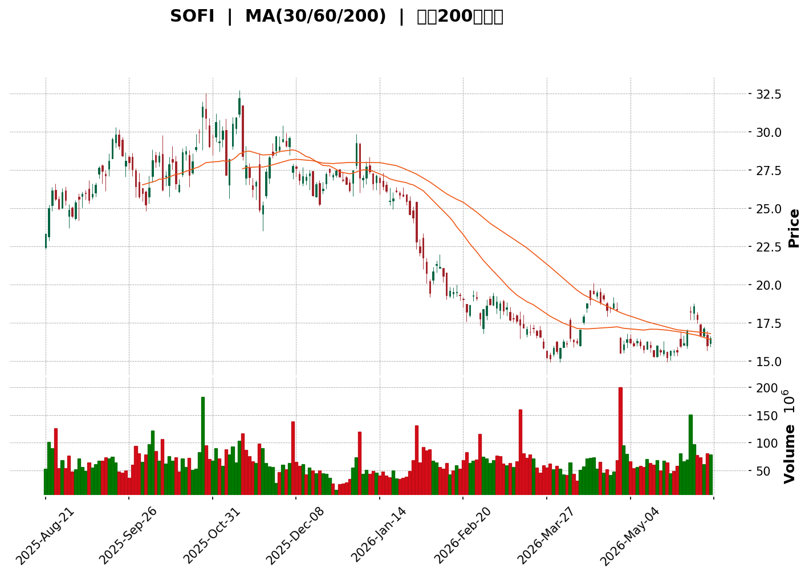
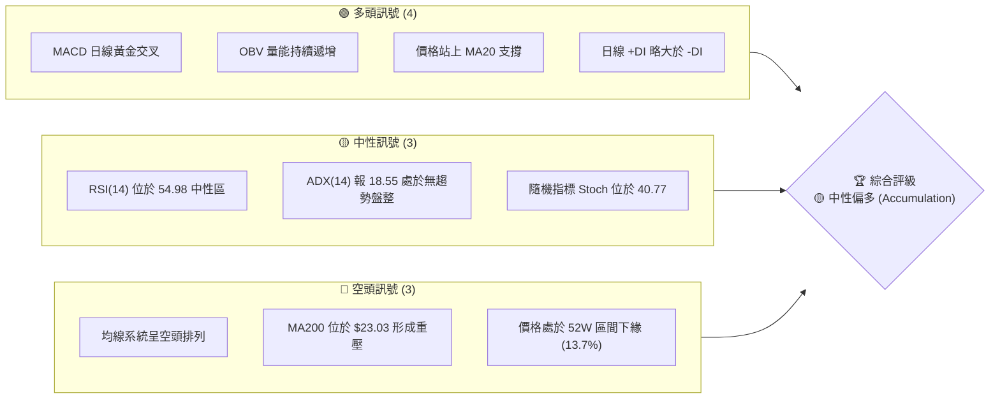
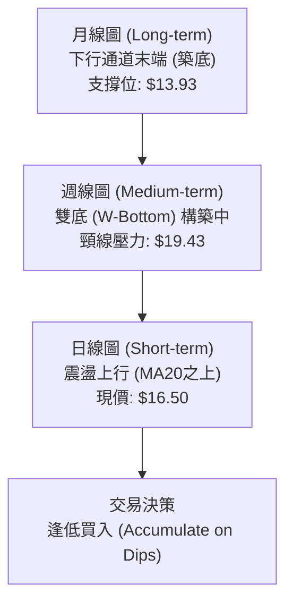
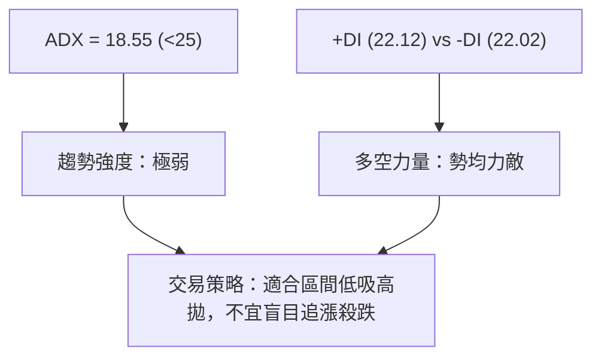
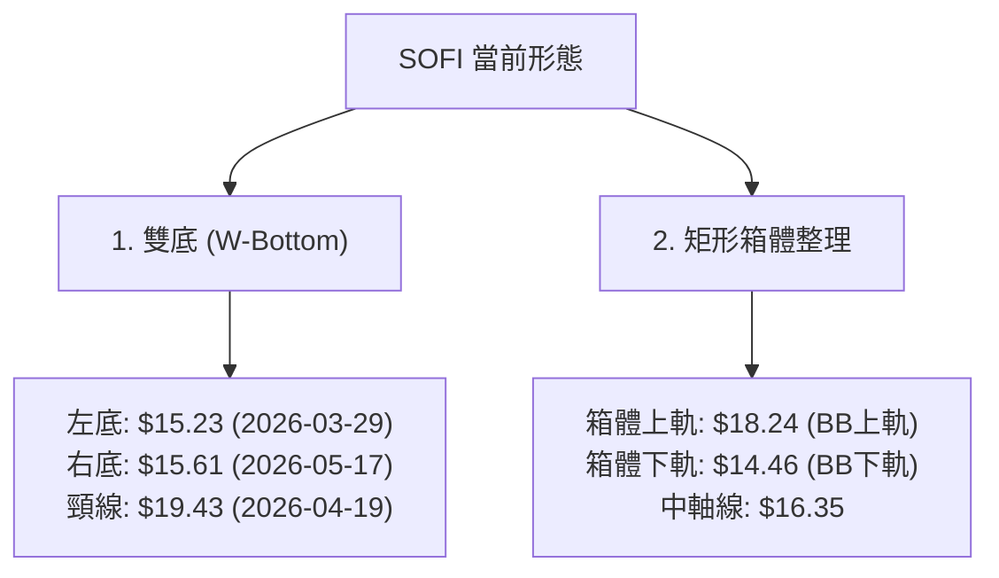

<details>
<summary>📊 靜態圖表 (點擊展開)</summary>

</details>

<html>
<head><meta charset="utf-8" /></head>
<body>
    <div style="height:500px; width:100%;">                        <script>window.PlotlyConfig = {MathJaxConfig: 'local'};</script>
        <script charset="utf-8" src="https://cdn.plot.ly/plotly-3.6.0.min.js" integrity="sha256-QaOVwtVY0T02VaHrr6pnoHLCwayMJp4O5n4YyaE3rJk=" crossorigin="anonymous"></script>                <div id="candlestick-chart" class="plotly-graph-div" style="height:100%; width:100%;"></div>            <script>                window.PLOTLYENV=window.PLOTLYENV || {};                                if (document.getElementById("candlestick-chart")) {                    Plotly.newPlot(                        "candlestick-chart",                        [{"close":{"dtype":"f8","bdata":"AAAA4HpUN0AAAADAHgU5QAAAAGBmJjpAAAAAYLieOUAAAACAwvU4QAAAAIA9CjpAAAAAgD2KOUAAAADA9eg4QAAAAKBwfThAAAAAoEdhOUAAAACgmZk5QAAAAIDC9TlAAAAA4FH4OUAAAADAHoU5QAAAAIDC9TlAAAAAwMyMOkAAAAAghas7QAAAACCFaztAAAAAANcjO0AAAAAAKRw8QAAAAGCPgj1AAAAAIFzPPUAAAABAChc9QAAAAOCjcDxAAAAAYLgePEAAAABA4fo7QAAAAMDMjDtAAAAAIIVrOkAAAABgj8I5QAAAAOBR+DlAAAAAoHA9OUAAAAAAKVw6QAAAAADXIzxAAAAAwB4FPEAAAABAM3M8QAAAAOCjMDpAAAAAANcjO0AAAABguN47QAAAACCuBzxAAAAAoJmZOkAAAACAPYo6QAAAAIAUrjxAAAAAAADAPEAAAADgozA7QAAAAOB6FDxAAAAAYI8CPUAAAAAAAAA+QAAAAMD1qD9AAAAAYGbmPkAAAAAgrgc9QAAAAIAUrj1AAAAAoEehPkAAAABguF49QAAAAIDrET5AAAAAwPUoO0AAAACAwjU8QAAAAIA9ij5AAAAAQDPzPkAAAABA4RpAQAAAAADXYzxAAAAAgOvRO0AAAACAPQo7QAAAAKBwPTpAAAAA4FG4OkAAAADA9eg4QAAAAOCjMDlAAAAAYGZmO0AAAADgelQ8QAAAAKBwfTxAAAAA4FG4PUAAAAAgrgc9QAAAAGCPgj1AAAAAgOsRPUAAAACgmZk9QAAAACCuxztAAAAAACmcO0AAAADgetQ6QAAAAEAKFztAAAAAgOsRO0AAAAAgrkc7QAAAAIDr0TlAAAAA4HqUOkAAAADAHkU5QAAAAIA9SjpAAAAAoHA9O0AAAACgmVk7QAAAAOCjMDtAAAAAQOF6O0AAAACA6xE7QAAAAIDr0TpAAAAAIFyPOkAAAACAFC46QAAAAIDCdTtAAAAAIK5HPUAAAABA4fo6QAAAAAAAADtAAAAA4FG4O0AAAABgZmY7QAAAAKCZmTpAAAAAANcjO0AAAAAghas6QAAAAOCjcDpAAAAAoEchOkAAAACgcH05QAAAAADXozlAAAAAQAoXOkAAAACgmdk5QAAAAMDMzDlAAAAAgMJ1OUAAAACgmZk4QAAAAAApXDhAAAAAIFzPNkAAAADgehQ2QAAAAGCPwjVAAAAAAADANEAAAACAwnUzQAAAAAAp3DRAAAAAoJlZNUAAAACAFC41QAAAAMDMjDRAAAAAwMxMM0AAAAAAKZwzQAAAAGCPgjNAAAAAgD2KM0AAAADAzEwzQAAAAMAeBTNAAAAA4FE4MkAAAADA9agyQAAAAIA9SjNAAAAAoJkZM0AAAABgj8IxQAAAAADXYzJAAAAAACmcMkAAAABAM7MyQAAAAAAAQDNAAAAAYGbmMkAAAACAPcoyQAAAAIA9SjJAAAAAIK6HMkAAAABAM7MxQAAAAGCPwjFAAAAAoEehMUAAAABguF4xQAAAAIAULjFAAAAA4HoUMUAAAABgZuYwQAAAAGBmJjFAAAAAQDOzMEAAAAAgXI8wQAAAAKBwvS9AAAAAgMJ1LkAAAADAzEwuQAAAAGCPwi9AAAAAYI9CL0AAAABAM7MvQAAAAMAeRTBAAAAAACkcMEAAAACgcH0wQAAAAMAeRTBAAAAA4FE4MEAAAADAzAwxQAAAAMD16DFAAAAAgD3KMkAAAAAgrgczQAAAAIAUbjNAAAAAAACAM0AAAADgetQyQAAAACBcDzNAAAAAgOtRMkAAAADgo3AyQAAAAGCPwjJAAAAAAClcMkAAAADAzAwvQAAAAKCZGTBAAAAAgBRuMEAAAABAMzMwQAAAAMAeBTBAAAAAwMxMMEAAAAAAAAAwQAAAAAAAgC9AAAAAYI9CMEAAAADAzMwvQAAAAGC4ni5AAAAAwB4FMEAAAADgUTgvQAAAACCFay9AAAAAgMJ1LkAAAACgR2EvQAAAAMDMTC9AAAAAoHA9L0AAAACAwvUvQAAAACCFKzBAAAAA4FH4MEAAAADgUTgyQAAAAOB6lDJAAAAAoHC9MUAAAACAFK4wQAAAAGBmJjFAAAAAIK4HMEAAAAAAAIAwQA=="},"high":{"dtype":"f8","bdata":"AAAAwHZeN0AAAAAAAEA5QAAAAKBHYTpAAAAAQOGaOkAAAAAgXM85QAAAAOB6VDpAAAAAIIVrOkAAAAAgrkc5QAAAAAApHDlAAAAAgD2KOUAAAADgUfg5QAAAAKCZGTpAAAAA4KMwOkAAAABA4do6QAAAAKCZmTpAAAAA4KOwOkAAAADAHsU7QAAAAKBH4TtAAAAAgMJ1O0AAAABAtpM8QAAAAKBHoT1AAAAAwMxMPkAAAAAA1yM+QAAAACCFqz1AAAAAIIWrPEAAAABA4Xo8QAAAAKBHoTxAAAAAACmcO0AAAADgelQ7QAAAAKCZWTpAAAAAgBQuOkAAAAAA1yM7QAAAAEAK1zxAAAAAgMK1PEAAAADgo7A8QAAAAMDMzD1AAAAAgBRuO0AAAACgmVk8QAAAAEAKFz1AAAAA4KNwPEAAAAAghes6QAAAAIAU7jxAAAAAgOsRPUAAAADAzMw8QAAAAOBRmDxAAAAAYLjePUAAAABAMzM+QAAAAEDh+j9AAAAA4FFIQEAAAACAPeo+QAAAAAAp3D1AAAAA4FE4P0AAAACAPco+QAAAAGC4Xj5AAAAAYOfbPkAAAACgcD08QAAAAOBR+D5AAAAAoHD9PkAAAACgcF1AQAAAAAAAwD9AAAAAgOsRPUAAAABAM\u002fM7QAAAAAAAADtAAAAAoJnZOkAAAABAM5M8QAAAAIDrcTlAAAAAACmcO0AAAABAM3M8QAAAAAAAQD1AAAAAAADAPUAAAABAM7M9QAAAACCFaz5AAAAAgBTuPUAAAABAM7M9QAAAAIAU7jtAAAAA4HrUO0AAAABAM3M7QAAAAIAUrjtAAAAAIK5HO0AAAAAAAIA7QAAAAEDhejtAAAAAoHC9OkAAAACAwtU6QAAAAEAKtzpAAAAAYLheO0AAAABguJ47QAAAAEAKVztAAAAAgD2KO0AAAADAzIw7QAAAAMD1aDtAAAAAANcjO0AAAABgZuY6QAAAAKBHgTtAAAAAACncPUAAAADAzEw9QAAAAIAULjtAAAAAgBQOPEAAAAAAAGA8QAAAAGDlUDtAAAAAQDMzO0AAAACAwhU7QAAAAOB6VDtAAAAAIK7HOkAAAABAClc6QAAAAMDMDDpAAAAAANdjOkAAAACgRyE6QAAAAGBmZjpAAAAAgBTuOUAAAACAPco5QAAAAGC4HjlAAAAA4FF4OUAAAAAAAAA3QAAAAAApXDdAAAAAANfDNUAAAABgZmY0QAAAAMD1KDVAAAAAQAqXNUAAAAAAAAA2QAAAAKCZGTVAAAAAgD3KNEAAAABguN4zQAAAAEAK1zNAAAAAYI8CNEAAAABA4XozQAAAAOCjMDNAAAAAoEfBMkAAAACAwrUyQAAAAGC4njNAAAAAIFyPM0AAAACAwjUyQAAAAMD1aDJAAAAAgD0KM0AAAAAgrkczQAAAAEDhejNAAAAAYLg+M0AAAACA6\u002fEyQAAAAGBmBjNAAAAAoJnZMkAAAADAzIwyQAAAAGBmJjJAAAAAgOsRMkAAAACgR0EyQAAAACCuBzJAAAAAIIVLMUAAAADAcmgxQAAAAMD1aDFAAAAAgOsRMUAAAABAClcxQAAAAKBwfTBAAAAAoEdhL0AAAACgRyEvQAAAAGBmBjBAAAAAgOtRMEAAAAAgrscvQAAAAMDMbDBAAAAAQOFaMEAAAACgmdkxQAAAAOBReDBAAAAAoHB9MEAAAAAgXA8xQAAAAEAzEzJAAAAAgOvRMkAAAABguJ4zQAAAAKBHITRAAAAAwB6lM0AAAADAHsUzQAAAACCwcjNAAAAAYGbmMkAAAABAM5MyQAAAACCFKzNAAAAAYLjeMkAAAABACpcwQAAAAGC4XjBAAAAAIIXLMEAAAAAgrscwQAAAACBcTzBAAAAAoEeBMEAAAACAwnUwQAAAAMDMDDBAAAAAgOtRMEAAAADgelQwQAAAACCFay9AAAAA4KMQMEAAAACAFK4vQAAAAIDrUTBAAAAAIK5HL0AAAADgo3AvQAAAAIDrkS9AAAAAACncL0AAAABAM\u002fMwQAAAAOCjsDBAAAAA4HoUMUAAAABACpcyQAAAACCFyzJAAAAAQOE6MkAAAABACncxQAAAAEDhOjFAAAAAoHD9MEAAAADA9agwQA=="},"hovertemplate":"\u003cb\u003e%{x|%Y-%m-%d}\u003c\u002fb\u003e\u003cbr\u003e\u958b: $%{open:.2f}\u003cbr\u003e\u9ad8: $%{high:.2f}\u003cbr\u003e\u4f4e: $%{low:.2f}\u003cbr\u003e\u6536: $%{close:.2f}\u003cextra\u003e\u003c\u002fextra\u003e","low":{"dtype":"f8","bdata":"AAAAIFxPNkAAAABgZuY2QAAAACBczzhAAAAAAACAOUAAAACgR+E4QAAAAAAAADlAAAAAgMI1OUAAAABAM7M3QAAAAADXYzhAAAAAILI9OEAAAACAFC44QAAAAMDMDDlAAAAAwMyMOUAAAADAzEw5QAAAAGC4njlAAAAAwB7FOUAAAAAgXO86QAAAAKBHoTpAAAAAoEchOkAAAADgehQ7QAAAAKBwPTxAAAAA4FH4PEAAAACgmdk8QAAAAKCZWTxAAAAAIFwPO0AAAAAgXI87QAAAAAApHDtAAAAAQDOzOUAAAAAA16M5QAAAAEAzczlAAAAAQArXOEAAAAAgXE85QAAAAIAUrjpAAAAAwB6lO0AAAAAAAMA7QAAAAKBHITpAAAAA4FF4OkAAAAAAAMA5QAAAACBcjztAAAAAAABAOkAAAABgjwI6QAAAACBcDztAAAAAYGYmPEAAAACgR2E6QAAAAKDxMjtAAAAAQDOzPEAAAADAHkU9QAAAAMDMzDxAAAAAANcjPkAAAABA4fo8QAAAAKBwfTxAAAAA4HpUPUAAAADgo7A8QAAAAGCPAj1AAAAAoEchO0AAAADA9ag5QAAAAEAK1zxAAAAA4CLbPUAAAACAwvU+QAAAAGBmJjxAAAAAIK6HOkAAAADAzIw6QAAAAIDCtTlAAAAAIFyPOUAAAABguL44QAAAAMAehTdAAAAAIK6nOUAAAACgR6E6QAAAACBcTzxAAAAA4Hp0PEAAAAAghas8QAAAAOCjUD1AAAAAwB4FPUAAAABA4Xo8QAAAAIAU7jpAAAAAwMwMO0AAAADAzIw6QAAAAEDhejpAAAAAgBSOOkAAAABAMzM6QAAAAIA9yjlAAAAA4FG4OUAAAAAghSs5QAAAAEAz8zlAAAAAIK5HOkAAAACgmRk7QAAAAEAz0zpAAAAAIK4HO0AAAAAgrgc7QAAAAKBwvTpAAAAAgD2KOkAAAAAgXA86QAAAAIA9yjlAAAAAoJmZO0AAAAAgrgc6QAAAAKBwXTpAAAAAgOuROkAAAABA4To7QAAAAEAzMzpAAAAA4FE4OkAAAAAghes5QAAAAIDCNTpAAAAAYI8COkAAAACAwjU5QAAAAEAz8zhAAAAAAAAAOkAAAACgmZk5QAAAAMAexTlAAAAAgMI1OUAAAACA65E4QAAAAMDMDDhAAAAAIFxPNkAAAAAAKdw1QAAAAMAeBTVAAAAAgOsRNEAAAAAAqjEzQAAAAIA9CjRAAAAAwMzMNEAAAADAzAw1QAAAAADXIzRAAAAAgD0KM0AAAABgZiYzQAAAAAApHDNAAAAAoJk5M0AAAADgUfgyQAAAAADXgzJAAAAA4HqUMUAAAAAA1+MxQAAAAIAU7jJAAAAA4FH4MkAAAAAgXE8xQAAAAMDMzDBAAAAA4KOwMUAAAAAAKZwyQAAAAADXozJAAAAAYLgeMkAAAADAHsUxQAAAAIA9CjJAAAAA4FH4MUAAAABguJ4xQAAAACCuhzFAAAAA4FF4MUAAAABA4XowQAAAAMD1KDFAAAAA4HqUMEAAAAAghaswQAAAAEAK1zBAAAAAoHB9MEAAAADAHoUwQAAAAAApnC9AAAAAwMxMLkAAAABguN4tQAAAAGC4ni5AAAAAoEfhLkAAAAAAKdwtQAAAAGCPwi9AAAAAgOvRL0AAAABgj0IwQAAAAOB61C9AAAAA4FEYMEAAAAAghesvQAAAAGBmZjFAAAAAIIUrMkAAAABgZqYyQAAAAADXYzNAAAAAQAoXM0AAAADgo7AyQAAAAMD16DJAAAAAgBTuMUAAAACAwCoyQAAAAADXYzJAAAAAwB5FMkAAAAAAAAAvQAAAAOB6FC9AAAAAAADAL0AAAACgRyEwQAAAAKBH4S9AAAAAQOH6L0AAAADA9agvQAAAAIA9Ci9AAAAAgD2KL0AAAACgmRkvQAAAAIAUbi5AAAAAgMJ1LkAAAABgj8IuQAAAAIAUri5AAAAAQArXLUAAAAAgXA8uQAAAAEAzsy5AAAAA4FG4LkAAAADgUbgvQAAAAGCPAjBAAAAAANejL0AAAACAFK4xQAAAAOCjsDFAAAAAgMJ1MUAAAADgepQwQAAAAIDClTBAAAAAAClcL0AAAADA9egvQA=="},"name":"\u50f9\u683c","open":{"dtype":"f8","bdata":"AAAA4KNwNkAAAADA9Sg3QAAAAIAULjlAAAAA4Ho0OkAAAACgcJ05QAAAAMAeBTlAAAAAwPUoOkAAAAAAAIA4QAAAACBcDzlAAAAA4HpUOEAAAADAHsU5QAAAACBczzlAAAAAwB4FOkAAAACAPUo6QAAAAGCPwjlAAAAAAAAAOkAAAAAAAEA7QAAAAIA9yjtAAAAAAABAO0AAAABACpc7QAAAAADXQzxAAAAAwMxMPUAAAACAFM49QAAAAAAAgD1AAAAAYI\u002fCO0AAAABguF48QAAAAAApXDxAAAAA4FF4O0AAAABA4bo6QAAAAOB6VDpAAAAAoJkZOkAAAADAHsU5QAAAAKCZGTtAAAAAoHB9PEAAAACAPQo8QAAAAMDMjDxAAAAAgOsRO0AAAABgj4I6QAAAAEAzMzxAAAAAgOsRPEAAAACgmRk6QAAAAEAzMztAAAAAIFyPPEAAAACgcH08QAAAAOB6VDtAAAAA4FHYPEAAAAAAAAA+QAAAAKBw\u002fT5AAAAAYLh+P0AAAAAgXG8+QAAAAOCjsD1AAAAAwPWoPUAAAAAghUs9QAAAAMAehT1AAAAAAAAgPkAAAABgZoY6QAAAACBcDz1AAAAAYLg+PkAAAACAFC4\u002fQAAAAEDhuj9AAAAAAAAAO0AAAACAwrU7QAAAAGCPgjpAAAAAoJl5OkAAAACgR+E7QAAAAKBHoThAAAAA4HrUOUAAAABA4fo6QAAAAIDCtTxAAAAAgD3KPEAAAADgetQ8QAAAAADXYz1AAAAAwMxsPUAAAADA9Qg9QAAAAKBwXTtAAAAAQOG6O0AAAACgcD07QAAAAGBmpjpAAAAAQArXOkAAAADAHiU7QAAAACBcbztAAAAAoHC9OUAAAAAA16M6QAAAAIAULjpAAAAAYLieOkAAAADgUZg7QAAAAIDrETtAAAAAIIUrO0AAAACAPYo7QAAAAGC43jpAAAAAIK4HO0AAAACAFK46QAAAAMD1qDpAAAAAIFzPO0AAAABA4To9QAAAAKBw3TpAAAAAAAAAO0AAAACAFM47QAAAAIA9SjtAAAAAQDOzOkAAAAAAAAA7QAAAACBczzpAAAAAgD2KOkAAAADgo3A5QAAAAAAAgDlAAAAAgBQuOkAAAAAAAAA6QAAAAGBm5jlAAAAAYGbmOUAAAAAAAIA5QAAAAKBw3ThAAAAAgBRuOUAAAABgj4I2QAAAAMDMDDdAAAAAoHB9NUAAAABA4To0QAAAAIA9SjRAAAAAgD1KNUAAAABAChc1QAAAAKCZGTVAAAAAgD3KNEAAAAAgrkczQAAAAMD1aDNAAAAA4FF4M0AAAADgelQzQAAAAIDCFTNAAAAAQOG6MkAAAAAAAAAyQAAAACCuRzNAAAAA4KMwM0AAAADA9SgyQAAAAMAeJTFAAAAAAAAAMkAAAAAgXA8zQAAAAGBmpjJAAAAAACl8MkAAAADgelQyQAAAACCF6zJAAAAAANdjMkAAAADgUTgyQAAAAMDMzDFAAAAAAAAAMkAAAADgUbgxQAAAAIAUbjFAAAAAAADAMEAAAACAPeowQAAAACCuJzFAAAAAYLj+MEAAAACAPQoxQAAAAGBmRjBAAAAAQApXL0AAAAAAKdwuQAAAAGBm5i5AAAAAYGZGMEAAAACgR2EuQAAAACCuxy9AAAAAwPUoMEAAAACAFK4xQAAAAADXYzBAAAAAwMxMMEAAAAAAAAAwQAAAACCuhzFAAAAA4FF4MkAAAABguJ4zQAAAAKCZmTNAAAAAYI9CM0AAAABgj4IzQAAAAIA9SjNAAAAAwB7FMkAAAADgo3AyQAAAAEDhejJAAAAAwB5lMkAAAADAzIwwQAAAAIA9ii9AAAAAACk8MEAAAADgUXgwQAAAACCFKzBAAAAAQDMzMEAAAABgj0IwQAAAACCuBzBAAAAAoJmZL0AAAACA6xEwQAAAACCFay9AAAAAYLieLkAAAABgZmYvQAAAAIDC9S5AAAAAgMI1L0AAAABA4bouQAAAAKBwPS9AAAAAYGZmL0AAAABA4XowQAAAAMDMDDBAAAAAwB4FMEAAAABgj0IyQAAAAGBmJjJAAAAAIK4HMkAAAACgR2ExQAAAAMD1qDBAAAAAQOG6MEAAAACAFC4wQA=="},"x":["2025-08-21T00:00:00-04:00","2025-08-22T00:00:00-04:00","2025-08-25T00:00:00-04:00","2025-08-26T00:00:00-04:00","2025-08-27T00:00:00-04:00","2025-08-28T00:00:00-04:00","2025-08-29T00:00:00-04:00","2025-09-02T00:00:00-04:00","2025-09-03T00:00:00-04:00","2025-09-04T00:00:00-04:00","2025-09-05T00:00:00-04:00","2025-09-08T00:00:00-04:00","2025-09-09T00:00:00-04:00","2025-09-10T00:00:00-04:00","2025-09-11T00:00:00-04:00","2025-09-12T00:00:00-04:00","2025-09-15T00:00:00-04:00","2025-09-16T00:00:00-04:00","2025-09-17T00:00:00-04:00","2025-09-18T00:00:00-04:00","2025-09-19T00:00:00-04:00","2025-09-22T00:00:00-04:00","2025-09-23T00:00:00-04:00","2025-09-24T00:00:00-04:00","2025-09-25T00:00:00-04:00","2025-09-26T00:00:00-04:00","2025-09-29T00:00:00-04:00","2025-09-30T00:00:00-04:00","2025-10-01T00:00:00-04:00","2025-10-02T00:00:00-04:00","2025-10-03T00:00:00-04:00","2025-10-06T00:00:00-04:00","2025-10-07T00:00:00-04:00","2025-10-08T00:00:00-04:00","2025-10-09T00:00:00-04:00","2025-10-10T00:00:00-04:00","2025-10-13T00:00:00-04:00","2025-10-14T00:00:00-04:00","2025-10-15T00:00:00-04:00","2025-10-16T00:00:00-04:00","2025-10-17T00:00:00-04:00","2025-10-20T00:00:00-04:00","2025-10-21T00:00:00-04:00","2025-10-22T00:00:00-04:00","2025-10-23T00:00:00-04:00","2025-10-24T00:00:00-04:00","2025-10-27T00:00:00-04:00","2025-10-28T00:00:00-04:00","2025-10-29T00:00:00-04:00","2025-10-30T00:00:00-04:00","2025-10-31T00:00:00-04:00","2025-11-03T00:00:00-05:00","2025-11-04T00:00:00-05:00","2025-11-05T00:00:00-05:00","2025-11-06T00:00:00-05:00","2025-11-07T00:00:00-05:00","2025-11-10T00:00:00-05:00","2025-11-11T00:00:00-05:00","2025-11-12T00:00:00-05:00","2025-11-13T00:00:00-05:00","2025-11-14T00:00:00-05:00","2025-11-17T00:00:00-05:00","2025-11-18T00:00:00-05:00","2025-11-19T00:00:00-05:00","2025-11-20T00:00:00-05:00","2025-11-21T00:00:00-05:00","2025-11-24T00:00:00-05:00","2025-11-25T00:00:00-05:00","2025-11-26T00:00:00-05:00","2025-11-28T00:00:00-05:00","2025-12-01T00:00:00-05:00","2025-12-02T00:00:00-05:00","2025-12-03T00:00:00-05:00","2025-12-04T00:00:00-05:00","2025-12-05T00:00:00-05:00","2025-12-08T00:00:00-05:00","2025-12-09T00:00:00-05:00","2025-12-10T00:00:00-05:00","2025-12-11T00:00:00-05:00","2025-12-12T00:00:00-05:00","2025-12-15T00:00:00-05:00","2025-12-16T00:00:00-05:00","2025-12-17T00:00:00-05:00","2025-12-18T00:00:00-05:00","2025-12-19T00:00:00-05:00","2025-12-22T00:00:00-05:00","2025-12-23T00:00:00-05:00","2025-12-24T00:00:00-05:00","2025-12-26T00:00:00-05:00","2025-12-29T00:00:00-05:00","2025-12-30T00:00:00-05:00","2025-12-31T00:00:00-05:00","2026-01-02T00:00:00-05:00","2026-01-05T00:00:00-05:00","2026-01-06T00:00:00-05:00","2026-01-07T00:00:00-05:00","2026-01-08T00:00:00-05:00","2026-01-09T00:00:00-05:00","2026-01-12T00:00:00-05:00","2026-01-13T00:00:00-05:00","2026-01-14T00:00:00-05:00","2026-01-15T00:00:00-05:00","2026-01-16T00:00:00-05:00","2026-01-20T00:00:00-05:00","2026-01-21T00:00:00-05:00","2026-01-22T00:00:00-05:00","2026-01-23T00:00:00-05:00","2026-01-26T00:00:00-05:00","2026-01-27T00:00:00-05:00","2026-01-28T00:00:00-05:00","2026-01-29T00:00:00-05:00","2026-01-30T00:00:00-05:00","2026-02-02T00:00:00-05:00","2026-02-03T00:00:00-05:00","2026-02-04T00:00:00-05:00","2026-02-05T00:00:00-05:00","2026-02-06T00:00:00-05:00","2026-02-09T00:00:00-05:00","2026-02-10T00:00:00-05:00","2026-02-11T00:00:00-05:00","2026-02-12T00:00:00-05:00","2026-02-13T00:00:00-05:00","2026-02-17T00:00:00-05:00","2026-02-18T00:00:00-05:00","2026-02-19T00:00:00-05:00","2026-02-20T00:00:00-05:00","2026-02-23T00:00:00-05:00","2026-02-24T00:00:00-05:00","2026-02-25T00:00:00-05:00","2026-02-26T00:00:00-05:00","2026-02-27T00:00:00-05:00","2026-03-02T00:00:00-05:00","2026-03-03T00:00:00-05:00","2026-03-04T00:00:00-05:00","2026-03-05T00:00:00-05:00","2026-03-06T00:00:00-05:00","2026-03-09T00:00:00-04:00","2026-03-10T00:00:00-04:00","2026-03-11T00:00:00-04:00","2026-03-12T00:00:00-04:00","2026-03-13T00:00:00-04:00","2026-03-16T00:00:00-04:00","2026-03-17T00:00:00-04:00","2026-03-18T00:00:00-04:00","2026-03-19T00:00:00-04:00","2026-03-20T00:00:00-04:00","2026-03-23T00:00:00-04:00","2026-03-24T00:00:00-04:00","2026-03-25T00:00:00-04:00","2026-03-26T00:00:00-04:00","2026-03-27T00:00:00-04:00","2026-03-30T00:00:00-04:00","2026-03-31T00:00:00-04:00","2026-04-01T00:00:00-04:00","2026-04-02T00:00:00-04:00","2026-04-06T00:00:00-04:00","2026-04-07T00:00:00-04:00","2026-04-08T00:00:00-04:00","2026-04-09T00:00:00-04:00","2026-04-10T00:00:00-04:00","2026-04-13T00:00:00-04:00","2026-04-14T00:00:00-04:00","2026-04-15T00:00:00-04:00","2026-04-16T00:00:00-04:00","2026-04-17T00:00:00-04:00","2026-04-20T00:00:00-04:00","2026-04-21T00:00:00-04:00","2026-04-22T00:00:00-04:00","2026-04-23T00:00:00-04:00","2026-04-24T00:00:00-04:00","2026-04-27T00:00:00-04:00","2026-04-28T00:00:00-04:00","2026-04-29T00:00:00-04:00","2026-04-30T00:00:00-04:00","2026-05-01T00:00:00-04:00","2026-05-04T00:00:00-04:00","2026-05-05T00:00:00-04:00","2026-05-06T00:00:00-04:00","2026-05-07T00:00:00-04:00","2026-05-08T00:00:00-04:00","2026-05-11T00:00:00-04:00","2026-05-12T00:00:00-04:00","2026-05-13T00:00:00-04:00","2026-05-14T00:00:00-04:00","2026-05-15T00:00:00-04:00","2026-05-18T00:00:00-04:00","2026-05-19T00:00:00-04:00","2026-05-20T00:00:00-04:00","2026-05-21T00:00:00-04:00","2026-05-22T00:00:00-04:00","2026-05-26T00:00:00-04:00","2026-05-27T00:00:00-04:00","2026-05-28T00:00:00-04:00","2026-05-29T00:00:00-04:00","2026-06-01T00:00:00-04:00","2026-06-02T00:00:00-04:00","2026-06-03T00:00:00-04:00","2026-06-04T00:00:00-04:00","2026-06-05T00:00:00-04:00","2026-06-08T00:00:00-04:00"],"type":"candlestick"},{"hovertemplate":"MA30: $%{y:.2f}\u003cextra\u003e\u003c\u002fextra\u003e","line":{"color":"#2196F3","dash":"dash","width":2},"mode":"lines","name":"MA30","x":["2025-08-21T00:00:00-04:00","2025-08-22T00:00:00-04:00","2025-08-25T00:00:00-04:00","2025-08-26T00:00:00-04:00","2025-08-27T00:00:00-04:00","2025-08-28T00:00:00-04:00","2025-08-29T00:00:00-04:00","2025-09-02T00:00:00-04:00","2025-09-03T00:00:00-04:00","2025-09-04T00:00:00-04:00","2025-09-05T00:00:00-04:00","2025-09-08T00:00:00-04:00","2025-09-09T00:00:00-04:00","2025-09-10T00:00:00-04:00","2025-09-11T00:00:00-04:00","2025-09-12T00:00:00-04:00","2025-09-15T00:00:00-04:00","2025-09-16T00:00:00-04:00","2025-09-17T00:00:00-04:00","2025-09-18T00:00:00-04:00","2025-09-19T00:00:00-04:00","2025-09-22T00:00:00-04:00","2025-09-23T00:00:00-04:00","2025-09-24T00:00:00-04:00","2025-09-25T00:00:00-04:00","2025-09-26T00:00:00-04:00","2025-09-29T00:00:00-04:00","2025-09-30T00:00:00-04:00","2025-10-01T00:00:00-04:00","2025-10-02T00:00:00-04:00","2025-10-03T00:00:00-04:00","2025-10-06T00:00:00-04:00","2025-10-07T00:00:00-04:00","2025-10-08T00:00:00-04:00","2025-10-09T00:00:00-04:00","2025-10-10T00:00:00-04:00","2025-10-13T00:00:00-04:00","2025-10-14T00:00:00-04:00","2025-10-15T00:00:00-04:00","2025-10-16T00:00:00-04:00","2025-10-17T00:00:00-04:00","2025-10-20T00:00:00-04:00","2025-10-21T00:00:00-04:00","2025-10-22T00:00:00-04:00","2025-10-23T00:00:00-04:00","2025-10-24T00:00:00-04:00","2025-10-27T00:00:00-04:00","2025-10-28T00:00:00-04:00","2025-10-29T00:00:00-04:00","2025-10-30T00:00:00-04:00","2025-10-31T00:00:00-04:00","2025-11-03T00:00:00-05:00","2025-11-04T00:00:00-05:00","2025-11-05T00:00:00-05:00","2025-11-06T00:00:00-05:00","2025-11-07T00:00:00-05:00","2025-11-10T00:00:00-05:00","2025-11-11T00:00:00-05:00","2025-11-12T00:00:00-05:00","2025-11-13T00:00:00-05:00","2025-11-14T00:00:00-05:00","2025-11-17T00:00:00-05:00","2025-11-18T00:00:00-05:00","2025-11-19T00:00:00-05:00","2025-11-20T00:00:00-05:00","2025-11-21T00:00:00-05:00","2025-11-24T00:00:00-05:00","2025-11-25T00:00:00-05:00","2025-11-26T00:00:00-05:00","2025-11-28T00:00:00-05:00","2025-12-01T00:00:00-05:00","2025-12-02T00:00:00-05:00","2025-12-03T00:00:00-05:00","2025-12-04T00:00:00-05:00","2025-12-05T00:00:00-05:00","2025-12-08T00:00:00-05:00","2025-12-09T00:00:00-05:00","2025-12-10T00:00:00-05:00","2025-12-11T00:00:00-05:00","2025-12-12T00:00:00-05:00","2025-12-15T00:00:00-05:00","2025-12-16T00:00:00-05:00","2025-12-17T00:00:00-05:00","2025-12-18T00:00:00-05:00","2025-12-19T00:00:00-05:00","2025-12-22T00:00:00-05:00","2025-12-23T00:00:00-05:00","2025-12-24T00:00:00-05:00","2025-12-26T00:00:00-05:00","2025-12-29T00:00:00-05:00","2025-12-30T00:00:00-05:00","2025-12-31T00:00:00-05:00","2026-01-02T00:00:00-05:00","2026-01-05T00:00:00-05:00","2026-01-06T00:00:00-05:00","2026-01-07T00:00:00-05:00","2026-01-08T00:00:00-05:00","2026-01-09T00:00:00-05:00","2026-01-12T00:00:00-05:00","2026-01-13T00:00:00-05:00","2026-01-14T00:00:00-05:00","2026-01-15T00:00:00-05:00","2026-01-16T00:00:00-05:00","2026-01-20T00:00:00-05:00","2026-01-21T00:00:00-05:00","2026-01-22T00:00:00-05:00","2026-01-23T00:00:00-05:00","2026-01-26T00:00:00-05:00","2026-01-27T00:00:00-05:00","2026-01-28T00:00:00-05:00","2026-01-29T00:00:00-05:00","2026-01-30T00:00:00-05:00","2026-02-02T00:00:00-05:00","2026-02-03T00:00:00-05:00","2026-02-04T00:00:00-05:00","2026-02-05T00:00:00-05:00","2026-02-06T00:00:00-05:00","2026-02-09T00:00:00-05:00","2026-02-10T00:00:00-05:00","2026-02-11T00:00:00-05:00","2026-02-12T00:00:00-05:00","2026-02-13T00:00:00-05:00","2026-02-17T00:00:00-05:00","2026-02-18T00:00:00-05:00","2026-02-19T00:00:00-05:00","2026-02-20T00:00:00-05:00","2026-02-23T00:00:00-05:00","2026-02-24T00:00:00-05:00","2026-02-25T00:00:00-05:00","2026-02-26T00:00:00-05:00","2026-02-27T00:00:00-05:00","2026-03-02T00:00:00-05:00","2026-03-03T00:00:00-05:00","2026-03-04T00:00:00-05:00","2026-03-05T00:00:00-05:00","2026-03-06T00:00:00-05:00","2026-03-09T00:00:00-04:00","2026-03-10T00:00:00-04:00","2026-03-11T00:00:00-04:00","2026-03-12T00:00:00-04:00","2026-03-13T00:00:00-04:00","2026-03-16T00:00:00-04:00","2026-03-17T00:00:00-04:00","2026-03-18T00:00:00-04:00","2026-03-19T00:00:00-04:00","2026-03-20T00:00:00-04:00","2026-03-23T00:00:00-04:00","2026-03-24T00:00:00-04:00","2026-03-25T00:00:00-04:00","2026-03-26T00:00:00-04:00","2026-03-27T00:00:00-04:00","2026-03-30T00:00:00-04:00","2026-03-31T00:00:00-04:00","2026-04-01T00:00:00-04:00","2026-04-02T00:00:00-04:00","2026-04-06T00:00:00-04:00","2026-04-07T00:00:00-04:00","2026-04-08T00:00:00-04:00","2026-04-09T00:00:00-04:00","2026-04-10T00:00:00-04:00","2026-04-13T00:00:00-04:00","2026-04-14T00:00:00-04:00","2026-04-15T00:00:00-04:00","2026-04-16T00:00:00-04:00","2026-04-17T00:00:00-04:00","2026-04-20T00:00:00-04:00","2026-04-21T00:00:00-04:00","2026-04-22T00:00:00-04:00","2026-04-23T00:00:00-04:00","2026-04-24T00:00:00-04:00","2026-04-27T00:00:00-04:00","2026-04-28T00:00:00-04:00","2026-04-29T00:00:00-04:00","2026-04-30T00:00:00-04:00","2026-05-01T00:00:00-04:00","2026-05-04T00:00:00-04:00","2026-05-05T00:00:00-04:00","2026-05-06T00:00:00-04:00","2026-05-07T00:00:00-04:00","2026-05-08T00:00:00-04:00","2026-05-11T00:00:00-04:00","2026-05-12T00:00:00-04:00","2026-05-13T00:00:00-04:00","2026-05-14T00:00:00-04:00","2026-05-15T00:00:00-04:00","2026-05-18T00:00:00-04:00","2026-05-19T00:00:00-04:00","2026-05-20T00:00:00-04:00","2026-05-21T00:00:00-04:00","2026-05-22T00:00:00-04:00","2026-05-26T00:00:00-04:00","2026-05-27T00:00:00-04:00","2026-05-28T00:00:00-04:00","2026-05-29T00:00:00-04:00","2026-06-01T00:00:00-04:00","2026-06-02T00:00:00-04:00","2026-06-03T00:00:00-04:00","2026-06-04T00:00:00-04:00","2026-06-05T00:00:00-04:00","2026-06-08T00:00:00-04:00"],"y":{"dtype":"f8","bdata":"AAAAAAAA+H8AAAAAAAD4fwAAAAAAAPh\u002fAAAAAAAA+H8AAAAAAAD4fwAAAAAAAPh\u002fAAAAAAAA+H8AAAAAAAD4fwAAAAAAAPh\u002fAAAAAAAA+H8AAAAAAAD4fwAAAAAAAPh\u002fAAAAAAAA+H8AAAAAAAD4fwAAAAAAAPh\u002fAAAAAAAA+H8AAAAAAAD4fwAAAAAAAPh\u002fAAAAAAAA+H8AAAAAAAD4fwAAAAAAAPh\u002fAAAAAAAA+H8AAAAAAAD4fwAAAAAAAPh\u002fAAAAAAAA+H8AAAAAAAD4fwAAAAAAAPh\u002fAAAAAAAA+H8AAAAAAAD4f+\u002fu7q5yiDpAREREJL+YOkCrqqpqLqQ6QDMzM6MptTpAREREhKTJOkCrqqqKbOc6QImIiDi06DpAiYiIeFv2OkARERGxnQ87QBEREfHSLTtAMzMzEzw4O0CamZmJQUA7QImIiHh3VztAmpmZeTBvO0BVVVWlcH07QLy7u9uHjztAAAAA0IWkO0BmZmbGZ7g7QCIiIjKW3DtAq6qqCqz8O0AAAADQhQQ8QO\u002fu7i75BTxAAAAAgPgMPEC8u7srXA88QFVVVfVEHTxA3t3dzRMVPEDv7u4+Chc8QBEREQGOMDxAERER8TVXPEDe3d0tQI48QAAAAMDmojxAiYiI2Oq4PEBERERUuL48QHd3d7eBrjxAIiIi0mmjPEAiIiKSNIU8QJqZmQmsfDxAREREBOR+PEBmZmbm0II8QImIiMi9hjxAZmZmhl2hPEAzMzMDnbY8QM3MzCyyvTxAmpmZOW3APEAzMzPz\u002fdQ8QHd3d5du0jxA7+7uPnzGPEBmZmZGb6s8QFVVVfVvhDxAIiIiMsFjPEAzMzND0lQ8QGZmZvbhMzxAq6qqmlIRPEBEREQEVu47QLy7u3sUzjtA7+7uPsPOO0DNzMyMbMc7QM3MzFzWqjtAd3d3BzqNO0B3d3eHXWE7QAAAAND3UztAzczMTDdJO0CamZmZ4EE7QKuqqrpJTDtAMzMzIyJiO0Dv7u4ezHM7QAAAACA+gztAzczMLPmFO0Dv7u6OCX47QKuqqsrobTtAIiIisuRXO0AiIiIywUM7QN7d3a2OKTtAZmZmJngQO0B3d3e3Ze06QAAAANAi2zpAIiIiUirOOkCrqqp6zcU6QN7d3W3LujpAREREVA6tOkB3d3fHL5Y6QM3MzFy6iTpAvLu7q45pOkAiIiICVk46QCIiIhKuJzpAMzMzc0zwOUCrqqp6+Kw5QCIiImL0djlAIiIiMqVCOUC8u7tLYhA5QFVVVUXh2jhA7+7uju2cOEDNzMws3WQ4QDMzMyMGIThAiYiIyOjNN0ARERGRX4w3QN7d3f1GSDdAzczM7DX3NkCrqqoaoaw2QKuqqipAbjZAVVVVhaQpNkBERERUnN01QFVVVdXqmDVAVVVVJb9YNUCrqqoqzh41QAAAAABH6DRARERENOyqNEBmZmZmrW40QO\u002fu7o6XLjRA7+7uvnTzM0B3d3d3k7gzQLy7u4tBgDNAmpmZqQ1UM0AzMzOD3CszQJqZmVnHBDNAzczMHHblMkBVVVW1nc8yQGZmZhb1rzJAIiIiAkeIMkBmZmZ22mAyQBEREdnqODJAREREzC8WMkDv7u7GIPAxQLy7u+sm0TFAzczMZMmvMUCamZnBWJIxQCIiIkrhejFAVVVV7d9oMUBVVVV9W1YxQKuqqjKWPDFAVVVVvQIkMUAAAAC48x0xQM3MzCTbGTFAREREXGQbMUCamZlBNR4xQBEREXm+HzFAmpmZMd0kMUCrqqqSNCUxQBEREanGKzFAAAAA6PspMUDe3d11TDAxQGZmZv7UODFAzczMtA8\u002fMUBVVVU9US8xQJqZmfEZJjFAd3d3\u002f40gMUC8u7vTlBoxQGZmZk7wEDFAVVVVfYYNMUDv7u4mvwgxQCIiIgK5BzFAREREFIMQMUCrqqp66RYxQLy7u0sMEjFAvLu7Q2AVMUCamZn5UxMxQKuqqqKMDjFAZmZmPgoHMUDe3d2dNgAxQERERDTs+jBAREREfM31MEAREREJrOwwQKuqqvLS3TBAAAAAGEvOMEBmZmaeYccwQLy7u8MgwDBARERE\u002fBuxMEBVVVU9w54wQAAAAMh2jjBAvLu7M+x6MEDNzMw0XmowQA=="},"type":"scatter"},{"hovertemplate":"MA60: $%{y:.2f}\u003cextra\u003e\u003c\u002fextra\u003e","line":{"color":"#9C27B0","dash":"dash","width":2},"mode":"lines","name":"MA60","x":["2025-08-21T00:00:00-04:00","2025-08-22T00:00:00-04:00","2025-08-25T00:00:00-04:00","2025-08-26T00:00:00-04:00","2025-08-27T00:00:00-04:00","2025-08-28T00:00:00-04:00","2025-08-29T00:00:00-04:00","2025-09-02T00:00:00-04:00","2025-09-03T00:00:00-04:00","2025-09-04T00:00:00-04:00","2025-09-05T00:00:00-04:00","2025-09-08T00:00:00-04:00","2025-09-09T00:00:00-04:00","2025-09-10T00:00:00-04:00","2025-09-11T00:00:00-04:00","2025-09-12T00:00:00-04:00","2025-09-15T00:00:00-04:00","2025-09-16T00:00:00-04:00","2025-09-17T00:00:00-04:00","2025-09-18T00:00:00-04:00","2025-09-19T00:00:00-04:00","2025-09-22T00:00:00-04:00","2025-09-23T00:00:00-04:00","2025-09-24T00:00:00-04:00","2025-09-25T00:00:00-04:00","2025-09-26T00:00:00-04:00","2025-09-29T00:00:00-04:00","2025-09-30T00:00:00-04:00","2025-10-01T00:00:00-04:00","2025-10-02T00:00:00-04:00","2025-10-03T00:00:00-04:00","2025-10-06T00:00:00-04:00","2025-10-07T00:00:00-04:00","2025-10-08T00:00:00-04:00","2025-10-09T00:00:00-04:00","2025-10-10T00:00:00-04:00","2025-10-13T00:00:00-04:00","2025-10-14T00:00:00-04:00","2025-10-15T00:00:00-04:00","2025-10-16T00:00:00-04:00","2025-10-17T00:00:00-04:00","2025-10-20T00:00:00-04:00","2025-10-21T00:00:00-04:00","2025-10-22T00:00:00-04:00","2025-10-23T00:00:00-04:00","2025-10-24T00:00:00-04:00","2025-10-27T00:00:00-04:00","2025-10-28T00:00:00-04:00","2025-10-29T00:00:00-04:00","2025-10-30T00:00:00-04:00","2025-10-31T00:00:00-04:00","2025-11-03T00:00:00-05:00","2025-11-04T00:00:00-05:00","2025-11-05T00:00:00-05:00","2025-11-06T00:00:00-05:00","2025-11-07T00:00:00-05:00","2025-11-10T00:00:00-05:00","2025-11-11T00:00:00-05:00","2025-11-12T00:00:00-05:00","2025-11-13T00:00:00-05:00","2025-11-14T00:00:00-05:00","2025-11-17T00:00:00-05:00","2025-11-18T00:00:00-05:00","2025-11-19T00:00:00-05:00","2025-11-20T00:00:00-05:00","2025-11-21T00:00:00-05:00","2025-11-24T00:00:00-05:00","2025-11-25T00:00:00-05:00","2025-11-26T00:00:00-05:00","2025-11-28T00:00:00-05:00","2025-12-01T00:00:00-05:00","2025-12-02T00:00:00-05:00","2025-12-03T00:00:00-05:00","2025-12-04T00:00:00-05:00","2025-12-05T00:00:00-05:00","2025-12-08T00:00:00-05:00","2025-12-09T00:00:00-05:00","2025-12-10T00:00:00-05:00","2025-12-11T00:00:00-05:00","2025-12-12T00:00:00-05:00","2025-12-15T00:00:00-05:00","2025-12-16T00:00:00-05:00","2025-12-17T00:00:00-05:00","2025-12-18T00:00:00-05:00","2025-12-19T00:00:00-05:00","2025-12-22T00:00:00-05:00","2025-12-23T00:00:00-05:00","2025-12-24T00:00:00-05:00","2025-12-26T00:00:00-05:00","2025-12-29T00:00:00-05:00","2025-12-30T00:00:00-05:00","2025-12-31T00:00:00-05:00","2026-01-02T00:00:00-05:00","2026-01-05T00:00:00-05:00","2026-01-06T00:00:00-05:00","2026-01-07T00:00:00-05:00","2026-01-08T00:00:00-05:00","2026-01-09T00:00:00-05:00","2026-01-12T00:00:00-05:00","2026-01-13T00:00:00-05:00","2026-01-14T00:00:00-05:00","2026-01-15T00:00:00-05:00","2026-01-16T00:00:00-05:00","2026-01-20T00:00:00-05:00","2026-01-21T00:00:00-05:00","2026-01-22T00:00:00-05:00","2026-01-23T00:00:00-05:00","2026-01-26T00:00:00-05:00","2026-01-27T00:00:00-05:00","2026-01-28T00:00:00-05:00","2026-01-29T00:00:00-05:00","2026-01-30T00:00:00-05:00","2026-02-02T00:00:00-05:00","2026-02-03T00:00:00-05:00","2026-02-04T00:00:00-05:00","2026-02-05T00:00:00-05:00","2026-02-06T00:00:00-05:00","2026-02-09T00:00:00-05:00","2026-02-10T00:00:00-05:00","2026-02-11T00:00:00-05:00","2026-02-12T00:00:00-05:00","2026-02-13T00:00:00-05:00","2026-02-17T00:00:00-05:00","2026-02-18T00:00:00-05:00","2026-02-19T00:00:00-05:00","2026-02-20T00:00:00-05:00","2026-02-23T00:00:00-05:00","2026-02-24T00:00:00-05:00","2026-02-25T00:00:00-05:00","2026-02-26T00:00:00-05:00","2026-02-27T00:00:00-05:00","2026-03-02T00:00:00-05:00","2026-03-03T00:00:00-05:00","2026-03-04T00:00:00-05:00","2026-03-05T00:00:00-05:00","2026-03-06T00:00:00-05:00","2026-03-09T00:00:00-04:00","2026-03-10T00:00:00-04:00","2026-03-11T00:00:00-04:00","2026-03-12T00:00:00-04:00","2026-03-13T00:00:00-04:00","2026-03-16T00:00:00-04:00","2026-03-17T00:00:00-04:00","2026-03-18T00:00:00-04:00","2026-03-19T00:00:00-04:00","2026-03-20T00:00:00-04:00","2026-03-23T00:00:00-04:00","2026-03-24T00:00:00-04:00","2026-03-25T00:00:00-04:00","2026-03-26T00:00:00-04:00","2026-03-27T00:00:00-04:00","2026-03-30T00:00:00-04:00","2026-03-31T00:00:00-04:00","2026-04-01T00:00:00-04:00","2026-04-02T00:00:00-04:00","2026-04-06T00:00:00-04:00","2026-04-07T00:00:00-04:00","2026-04-08T00:00:00-04:00","2026-04-09T00:00:00-04:00","2026-04-10T00:00:00-04:00","2026-04-13T00:00:00-04:00","2026-04-14T00:00:00-04:00","2026-04-15T00:00:00-04:00","2026-04-16T00:00:00-04:00","2026-04-17T00:00:00-04:00","2026-04-20T00:00:00-04:00","2026-04-21T00:00:00-04:00","2026-04-22T00:00:00-04:00","2026-04-23T00:00:00-04:00","2026-04-24T00:00:00-04:00","2026-04-27T00:00:00-04:00","2026-04-28T00:00:00-04:00","2026-04-29T00:00:00-04:00","2026-04-30T00:00:00-04:00","2026-05-01T00:00:00-04:00","2026-05-04T00:00:00-04:00","2026-05-05T00:00:00-04:00","2026-05-06T00:00:00-04:00","2026-05-07T00:00:00-04:00","2026-05-08T00:00:00-04:00","2026-05-11T00:00:00-04:00","2026-05-12T00:00:00-04:00","2026-05-13T00:00:00-04:00","2026-05-14T00:00:00-04:00","2026-05-15T00:00:00-04:00","2026-05-18T00:00:00-04:00","2026-05-19T00:00:00-04:00","2026-05-20T00:00:00-04:00","2026-05-21T00:00:00-04:00","2026-05-22T00:00:00-04:00","2026-05-26T00:00:00-04:00","2026-05-27T00:00:00-04:00","2026-05-28T00:00:00-04:00","2026-05-29T00:00:00-04:00","2026-06-01T00:00:00-04:00","2026-06-02T00:00:00-04:00","2026-06-03T00:00:00-04:00","2026-06-04T00:00:00-04:00","2026-06-05T00:00:00-04:00","2026-06-08T00:00:00-04:00"],"y":{"dtype":"f8","bdata":"AAAAAAAA+H8AAAAAAAD4fwAAAAAAAPh\u002fAAAAAAAA+H8AAAAAAAD4fwAAAAAAAPh\u002fAAAAAAAA+H8AAAAAAAD4fwAAAAAAAPh\u002fAAAAAAAA+H8AAAAAAAD4fwAAAAAAAPh\u002fAAAAAAAA+H8AAAAAAAD4fwAAAAAAAPh\u002fAAAAAAAA+H8AAAAAAAD4fwAAAAAAAPh\u002fAAAAAAAA+H8AAAAAAAD4fwAAAAAAAPh\u002fAAAAAAAA+H8AAAAAAAD4fwAAAAAAAPh\u002fAAAAAAAA+H8AAAAAAAD4fwAAAAAAAPh\u002fAAAAAAAA+H8AAAAAAAD4fwAAAAAAAPh\u002fAAAAAAAA+H8AAAAAAAD4fwAAAAAAAPh\u002fAAAAAAAA+H8AAAAAAAD4fwAAAAAAAPh\u002fAAAAAAAA+H8AAAAAAAD4fwAAAAAAAPh\u002fAAAAAAAA+H8AAAAAAAD4fwAAAAAAAPh\u002fAAAAAAAA+H8AAAAAAAD4fwAAAAAAAPh\u002fAAAAAAAA+H8AAAAAAAD4fwAAAAAAAPh\u002fAAAAAAAA+H8AAAAAAAD4fwAAAAAAAPh\u002fAAAAAAAA+H8AAAAAAAD4fwAAAAAAAPh\u002fAAAAAAAA+H8AAAAAAAD4fwAAAAAAAPh\u002fAAAAAAAA+H8AAAAAAAD4f3d3d7eslTtAZmZm\u002ftSoO0B3d3dfc7E7QFVVVa3VsTtAMzMzK4e2O0BmZmaOULY7QBERESGwsjtAZmZmvp+6O0C8u7tLN8k7QM3MzFxI2jtAzczMzMzsO0BmZmZGb\u002fs7QKuqqtKUCjxAmpmZ2c4XPEBERERMNyk8QJqZmTn7MDxAd3d3B4E1PEBmZmaG6zE8QLy7uxODMDxAZmZmnjYwPECamZkJrCw8QKuqqpLtHDxAVVVVjSUPPEAAAAAY2f47QImIiLis9TtAZmZmhuvxO0De3d1lO+87QO\u002fu7i6y7TtARERE\u002fDfyO0Crqqrazvc7QAAAAEhv+ztAq6qqEhEBPEDv7u52TAA8QBEREbll\u002fTtAq6qq+sUCPECJiIhYgPw7QM3MzBT1\u002fztAiYiImG4CPECrqqo6bQA8QJqZmUlT+jtAREREHKH8O0CrqqoaL\u002f07QFVVVW2g8ztAAAAAsHLoO0BVVVXVMeE7QLy7u7PI1jtAiYiISFPKO0CJiIhgnrg7QJqZmbGdnztAMzMzw2eIO0BVVVUFgXU7QJqZmSnOXjtAMzMzo3A9O0AzMzMDVh47QO\u002fu7kbh+jpAERER2YffOkC8u7uDMro6QHd3d1\u002flkDpAzczMnO9nOkCamZnp3zg6QKuqqopsFzpA3t3dbRLzOUAzMzPjXtM5QO\u002fu7u6ntjlA3t3ddQWYOUAAAADYFYA5QO\u002fu7o7CZTlAzczMjJc+OUDNzMxUVRU5QKuqqnoU7jhAvLu7m8TAOEAzMzPDrpA4QJqZmcE8YThA3t3dpZs0OEARERHxGQY4QAAAAOi04TdAMzMzQ4u8N0CJiIhwPZo3QGZmZn6xdDdAmpmZiUFQN0B3d3efYSc3QERERPT9BDdAq6qqKs7eNkCrqqpCGb02QN7d3bU6ljZAAAAASOFqNkAAAAAYSz42QERERLx0EzZAIiIiGnblNUARERFhnrg1QDMzMw\u002fmiTVAmpmZrY5ZNUDe3d35fio1QHd3d4cW+TRAq6qqFtm+NEBVVVUpXI80QAAAACSUYTRAERER7QowNEAAAABMfgE0QKuqqi5r1TNAVVVVodOmM0AiIiIGyH0zQBEREf1iWTNAzczMwBE6M0AiIiK2gR4zQImIiLwCBDNA7+7usuTnMkCJiIj88MkyQAAAABwvrTJAd3d3U7iOMkCrqqr2b3QyQBEREUWLXDJAMzMzr45JMkBERETgli0yQJqZmaVwFTJAIiIiDgIDMkCJiIhEGfUxQGZmZrJy4DFAvLu7v+bKMUCrqqrOzLQxQJqZme1RoDFAREREcFmTMUDNzMwghYMxQLy7u5uZcTFARERE1JRiMUCamZld1lIxQGZmZva2RDFA3t3dFfU3MUCamZkNSSsxQHd3dzPBGzFAzczMHOgMMUCJiIjgTwUxQLy7uwvX+zBAIiIiutf0MEAAAABwy\u002fIwQGZmZp7v7zBA7+7ulvzqMEAAAADo++EwQImIiLge3TBA3t3dDXTSMEBVVVVVVc0wQA=="},"type":"scatter"},{"hovertemplate":"MA200: $%{y:.2f}\u003cextra\u003e\u003c\u002fextra\u003e","line":{"color":"#FF6F00","dash":"solid","width":2},"mode":"lines","name":"MA200","x":["2025-08-21T00:00:00-04:00","2025-08-22T00:00:00-04:00","2025-08-25T00:00:00-04:00","2025-08-26T00:00:00-04:00","2025-08-27T00:00:00-04:00","2025-08-28T00:00:00-04:00","2025-08-29T00:00:00-04:00","2025-09-02T00:00:00-04:00","2025-09-03T00:00:00-04:00","2025-09-04T00:00:00-04:00","2025-09-05T00:00:00-04:00","2025-09-08T00:00:00-04:00","2025-09-09T00:00:00-04:00","2025-09-10T00:00:00-04:00","2025-09-11T00:00:00-04:00","2025-09-12T00:00:00-04:00","2025-09-15T00:00:00-04:00","2025-09-16T00:00:00-04:00","2025-09-17T00:00:00-04:00","2025-09-18T00:00:00-04:00","2025-09-19T00:00:00-04:00","2025-09-22T00:00:00-04:00","2025-09-23T00:00:00-04:00","2025-09-24T00:00:00-04:00","2025-09-25T00:00:00-04:00","2025-09-26T00:00:00-04:00","2025-09-29T00:00:00-04:00","2025-09-30T00:00:00-04:00","2025-10-01T00:00:00-04:00","2025-10-02T00:00:00-04:00","2025-10-03T00:00:00-04:00","2025-10-06T00:00:00-04:00","2025-10-07T00:00:00-04:00","2025-10-08T00:00:00-04:00","2025-10-09T00:00:00-04:00","2025-10-10T00:00:00-04:00","2025-10-13T00:00:00-04:00","2025-10-14T00:00:00-04:00","2025-10-15T00:00:00-04:00","2025-10-16T00:00:00-04:00","2025-10-17T00:00:00-04:00","2025-10-20T00:00:00-04:00","2025-10-21T00:00:00-04:00","2025-10-22T00:00:00-04:00","2025-10-23T00:00:00-04:00","2025-10-24T00:00:00-04:00","2025-10-27T00:00:00-04:00","2025-10-28T00:00:00-04:00","2025-10-29T00:00:00-04:00","2025-10-30T00:00:00-04:00","2025-10-31T00:00:00-04:00","2025-11-03T00:00:00-05:00","2025-11-04T00:00:00-05:00","2025-11-05T00:00:00-05:00","2025-11-06T00:00:00-05:00","2025-11-07T00:00:00-05:00","2025-11-10T00:00:00-05:00","2025-11-11T00:00:00-05:00","2025-11-12T00:00:00-05:00","2025-11-13T00:00:00-05:00","2025-11-14T00:00:00-05:00","2025-11-17T00:00:00-05:00","2025-11-18T00:00:00-05:00","2025-11-19T00:00:00-05:00","2025-11-20T00:00:00-05:00","2025-11-21T00:00:00-05:00","2025-11-24T00:00:00-05:00","2025-11-25T00:00:00-05:00","2025-11-26T00:00:00-05:00","2025-11-28T00:00:00-05:00","2025-12-01T00:00:00-05:00","2025-12-02T00:00:00-05:00","2025-12-03T00:00:00-05:00","2025-12-04T00:00:00-05:00","2025-12-05T00:00:00-05:00","2025-12-08T00:00:00-05:00","2025-12-09T00:00:00-05:00","2025-12-10T00:00:00-05:00","2025-12-11T00:00:00-05:00","2025-12-12T00:00:00-05:00","2025-12-15T00:00:00-05:00","2025-12-16T00:00:00-05:00","2025-12-17T00:00:00-05:00","2025-12-18T00:00:00-05:00","2025-12-19T00:00:00-05:00","2025-12-22T00:00:00-05:00","2025-12-23T00:00:00-05:00","2025-12-24T00:00:00-05:00","2025-12-26T00:00:00-05:00","2025-12-29T00:00:00-05:00","2025-12-30T00:00:00-05:00","2025-12-31T00:00:00-05:00","2026-01-02T00:00:00-05:00","2026-01-05T00:00:00-05:00","2026-01-06T00:00:00-05:00","2026-01-07T00:00:00-05:00","2026-01-08T00:00:00-05:00","2026-01-09T00:00:00-05:00","2026-01-12T00:00:00-05:00","2026-01-13T00:00:00-05:00","2026-01-14T00:00:00-05:00","2026-01-15T00:00:00-05:00","2026-01-16T00:00:00-05:00","2026-01-20T00:00:00-05:00","2026-01-21T00:00:00-05:00","2026-01-22T00:00:00-05:00","2026-01-23T00:00:00-05:00","2026-01-26T00:00:00-05:00","2026-01-27T00:00:00-05:00","2026-01-28T00:00:00-05:00","2026-01-29T00:00:00-05:00","2026-01-30T00:00:00-05:00","2026-02-02T00:00:00-05:00","2026-02-03T00:00:00-05:00","2026-02-04T00:00:00-05:00","2026-02-05T00:00:00-05:00","2026-02-06T00:00:00-05:00","2026-02-09T00:00:00-05:00","2026-02-10T00:00:00-05:00","2026-02-11T00:00:00-05:00","2026-02-12T00:00:00-05:00","2026-02-13T00:00:00-05:00","2026-02-17T00:00:00-05:00","2026-02-18T00:00:00-05:00","2026-02-19T00:00:00-05:00","2026-02-20T00:00:00-05:00","2026-02-23T00:00:00-05:00","2026-02-24T00:00:00-05:00","2026-02-25T00:00:00-05:00","2026-02-26T00:00:00-05:00","2026-02-27T00:00:00-05:00","2026-03-02T00:00:00-05:00","2026-03-03T00:00:00-05:00","2026-03-04T00:00:00-05:00","2026-03-05T00:00:00-05:00","2026-03-06T00:00:00-05:00","2026-03-09T00:00:00-04:00","2026-03-10T00:00:00-04:00","2026-03-11T00:00:00-04:00","2026-03-12T00:00:00-04:00","2026-03-13T00:00:00-04:00","2026-03-16T00:00:00-04:00","2026-03-17T00:00:00-04:00","2026-03-18T00:00:00-04:00","2026-03-19T00:00:00-04:00","2026-03-20T00:00:00-04:00","2026-03-23T00:00:00-04:00","2026-03-24T00:00:00-04:00","2026-03-25T00:00:00-04:00","2026-03-26T00:00:00-04:00","2026-03-27T00:00:00-04:00","2026-03-30T00:00:00-04:00","2026-03-31T00:00:00-04:00","2026-04-01T00:00:00-04:00","2026-04-02T00:00:00-04:00","2026-04-06T00:00:00-04:00","2026-04-07T00:00:00-04:00","2026-04-08T00:00:00-04:00","2026-04-09T00:00:00-04:00","2026-04-10T00:00:00-04:00","2026-04-13T00:00:00-04:00","2026-04-14T00:00:00-04:00","2026-04-15T00:00:00-04:00","2026-04-16T00:00:00-04:00","2026-04-17T00:00:00-04:00","2026-04-20T00:00:00-04:00","2026-04-21T00:00:00-04:00","2026-04-22T00:00:00-04:00","2026-04-23T00:00:00-04:00","2026-04-24T00:00:00-04:00","2026-04-27T00:00:00-04:00","2026-04-28T00:00:00-04:00","2026-04-29T00:00:00-04:00","2026-04-30T00:00:00-04:00","2026-05-01T00:00:00-04:00","2026-05-04T00:00:00-04:00","2026-05-05T00:00:00-04:00","2026-05-06T00:00:00-04:00","2026-05-07T00:00:00-04:00","2026-05-08T00:00:00-04:00","2026-05-11T00:00:00-04:00","2026-05-12T00:00:00-04:00","2026-05-13T00:00:00-04:00","2026-05-14T00:00:00-04:00","2026-05-15T00:00:00-04:00","2026-05-18T00:00:00-04:00","2026-05-19T00:00:00-04:00","2026-05-20T00:00:00-04:00","2026-05-21T00:00:00-04:00","2026-05-22T00:00:00-04:00","2026-05-26T00:00:00-04:00","2026-05-27T00:00:00-04:00","2026-05-28T00:00:00-04:00","2026-05-29T00:00:00-04:00","2026-06-01T00:00:00-04:00","2026-06-02T00:00:00-04:00","2026-06-03T00:00:00-04:00","2026-06-04T00:00:00-04:00","2026-06-05T00:00:00-04:00","2026-06-08T00:00:00-04:00"],"y":{"dtype":"f8","bdata":"AAAAAAAA+H8AAAAAAAD4fwAAAAAAAPh\u002fAAAAAAAA+H8AAAAAAAD4fwAAAAAAAPh\u002fAAAAAAAA+H8AAAAAAAD4fwAAAAAAAPh\u002fAAAAAAAA+H8AAAAAAAD4fwAAAAAAAPh\u002fAAAAAAAA+H8AAAAAAAD4fwAAAAAAAPh\u002fAAAAAAAA+H8AAAAAAAD4fwAAAAAAAPh\u002fAAAAAAAA+H8AAAAAAAD4fwAAAAAAAPh\u002fAAAAAAAA+H8AAAAAAAD4fwAAAAAAAPh\u002fAAAAAAAA+H8AAAAAAAD4fwAAAAAAAPh\u002fAAAAAAAA+H8AAAAAAAD4fwAAAAAAAPh\u002fAAAAAAAA+H8AAAAAAAD4fwAAAAAAAPh\u002fAAAAAAAA+H8AAAAAAAD4fwAAAAAAAPh\u002fAAAAAAAA+H8AAAAAAAD4fwAAAAAAAPh\u002fAAAAAAAA+H8AAAAAAAD4fwAAAAAAAPh\u002fAAAAAAAA+H8AAAAAAAD4fwAAAAAAAPh\u002fAAAAAAAA+H8AAAAAAAD4fwAAAAAAAPh\u002fAAAAAAAA+H8AAAAAAAD4fwAAAAAAAPh\u002fAAAAAAAA+H8AAAAAAAD4fwAAAAAAAPh\u002fAAAAAAAA+H8AAAAAAAD4fwAAAAAAAPh\u002fAAAAAAAA+H8AAAAAAAD4fwAAAAAAAPh\u002fAAAAAAAA+H8AAAAAAAD4fwAAAAAAAPh\u002fAAAAAAAA+H8AAAAAAAD4fwAAAAAAAPh\u002fAAAAAAAA+H8AAAAAAAD4fwAAAAAAAPh\u002fAAAAAAAA+H8AAAAAAAD4fwAAAAAAAPh\u002fAAAAAAAA+H8AAAAAAAD4fwAAAAAAAPh\u002fAAAAAAAA+H8AAAAAAAD4fwAAAAAAAPh\u002fAAAAAAAA+H8AAAAAAAD4fwAAAAAAAPh\u002fAAAAAAAA+H8AAAAAAAD4fwAAAAAAAPh\u002fAAAAAAAA+H8AAAAAAAD4fwAAAAAAAPh\u002fAAAAAAAA+H8AAAAAAAD4fwAAAAAAAPh\u002fAAAAAAAA+H8AAAAAAAD4fwAAAAAAAPh\u002fAAAAAAAA+H8AAAAAAAD4fwAAAAAAAPh\u002fAAAAAAAA+H8AAAAAAAD4fwAAAAAAAPh\u002fAAAAAAAA+H8AAAAAAAD4fwAAAAAAAPh\u002fAAAAAAAA+H8AAAAAAAD4fwAAAAAAAPh\u002fAAAAAAAA+H8AAAAAAAD4fwAAAAAAAPh\u002fAAAAAAAA+H8AAAAAAAD4fwAAAAAAAPh\u002fAAAAAAAA+H8AAAAAAAD4fwAAAAAAAPh\u002fAAAAAAAA+H8AAAAAAAD4fwAAAAAAAPh\u002fAAAAAAAA+H8AAAAAAAD4fwAAAAAAAPh\u002fAAAAAAAA+H8AAAAAAAD4fwAAAAAAAPh\u002fAAAAAAAA+H8AAAAAAAD4fwAAAAAAAPh\u002fAAAAAAAA+H8AAAAAAAD4fwAAAAAAAPh\u002fAAAAAAAA+H8AAAAAAAD4fwAAAAAAAPh\u002fAAAAAAAA+H8AAAAAAAD4fwAAAAAAAPh\u002fAAAAAAAA+H8AAAAAAAD4fwAAAAAAAPh\u002fAAAAAAAA+H8AAAAAAAD4fwAAAAAAAPh\u002fAAAAAAAA+H8AAAAAAAD4fwAAAAAAAPh\u002fAAAAAAAA+H8AAAAAAAD4fwAAAAAAAPh\u002fAAAAAAAA+H8AAAAAAAD4fwAAAAAAAPh\u002fAAAAAAAA+H8AAAAAAAD4fwAAAAAAAPh\u002fAAAAAAAA+H8AAAAAAAD4fwAAAAAAAPh\u002fAAAAAAAA+H8AAAAAAAD4fwAAAAAAAPh\u002fAAAAAAAA+H8AAAAAAAD4fwAAAAAAAPh\u002fAAAAAAAA+H8AAAAAAAD4fwAAAAAAAPh\u002fAAAAAAAA+H8AAAAAAAD4fwAAAAAAAPh\u002fAAAAAAAA+H8AAAAAAAD4fwAAAAAAAPh\u002fAAAAAAAA+H8AAAAAAAD4fwAAAAAAAPh\u002fAAAAAAAA+H8AAAAAAAD4fwAAAAAAAPh\u002fAAAAAAAA+H8AAAAAAAD4fwAAAAAAAPh\u002fAAAAAAAA+H8AAAAAAAD4fwAAAAAAAPh\u002fAAAAAAAA+H8AAAAAAAD4fwAAAAAAAPh\u002fAAAAAAAA+H8AAAAAAAD4fwAAAAAAAPh\u002fAAAAAAAA+H8AAAAAAAD4fwAAAAAAAPh\u002fAAAAAAAA+H8AAAAAAAD4fwAAAAAAAPh\u002fAAAAAAAA+H8AAAAAAAD4fwAAAAAAAPh\u002fAAAAAAAA+H8AAAB4nAY3QA=="},"type":"scatter"}],                        {"template":{"data":{"barpolar":[{"marker":{"line":{"color":"rgb(17,17,17)","width":0.5},"pattern":{"fillmode":"overlay","size":10,"solidity":0.2}},"type":"barpolar"}],"bar":[{"error_x":{"color":"#f2f5fa"},"error_y":{"color":"#f2f5fa"},"marker":{"line":{"color":"rgb(17,17,17)","width":0.5},"pattern":{"fillmode":"overlay","size":10,"solidity":0.2}},"type":"bar"}],"carpet":[{"aaxis":{"endlinecolor":"#A2B1C6","gridcolor":"#506784","linecolor":"#506784","minorgridcolor":"#506784","startlinecolor":"#A2B1C6"},"baxis":{"endlinecolor":"#A2B1C6","gridcolor":"#506784","linecolor":"#506784","minorgridcolor":"#506784","startlinecolor":"#A2B1C6"},"type":"carpet"}],"choropleth":[{"colorbar":{"outlinewidth":0,"ticks":""},"type":"choropleth"}],"contourcarpet":[{"colorbar":{"outlinewidth":0,"ticks":""},"type":"contourcarpet"}],"contour":[{"colorbar":{"outlinewidth":0,"ticks":""},"colorscale":[[0.0,"#0d0887"],[0.1111111111111111,"#46039f"],[0.2222222222222222,"#7201a8"],[0.3333333333333333,"#9c179e"],[0.4444444444444444,"#bd3786"],[0.5555555555555556,"#d8576b"],[0.6666666666666666,"#ed7953"],[0.7777777777777778,"#fb9f3a"],[0.8888888888888888,"#fdca26"],[1.0,"#f0f921"]],"type":"contour"}],"heatmap":[{"colorbar":{"outlinewidth":0,"ticks":""},"colorscale":[[0.0,"#0d0887"],[0.1111111111111111,"#46039f"],[0.2222222222222222,"#7201a8"],[0.3333333333333333,"#9c179e"],[0.4444444444444444,"#bd3786"],[0.5555555555555556,"#d8576b"],[0.6666666666666666,"#ed7953"],[0.7777777777777778,"#fb9f3a"],[0.8888888888888888,"#fdca26"],[1.0,"#f0f921"]],"type":"heatmap"}],"histogram2dcontour":[{"colorbar":{"outlinewidth":0,"ticks":""},"colorscale":[[0.0,"#0d0887"],[0.1111111111111111,"#46039f"],[0.2222222222222222,"#7201a8"],[0.3333333333333333,"#9c179e"],[0.4444444444444444,"#bd3786"],[0.5555555555555556,"#d8576b"],[0.6666666666666666,"#ed7953"],[0.7777777777777778,"#fb9f3a"],[0.8888888888888888,"#fdca26"],[1.0,"#f0f921"]],"type":"histogram2dcontour"}],"histogram2d":[{"colorbar":{"outlinewidth":0,"ticks":""},"colorscale":[[0.0,"#0d0887"],[0.1111111111111111,"#46039f"],[0.2222222222222222,"#7201a8"],[0.3333333333333333,"#9c179e"],[0.4444444444444444,"#bd3786"],[0.5555555555555556,"#d8576b"],[0.6666666666666666,"#ed7953"],[0.7777777777777778,"#fb9f3a"],[0.8888888888888888,"#fdca26"],[1.0,"#f0f921"]],"type":"histogram2d"}],"histogram":[{"marker":{"pattern":{"fillmode":"overlay","size":10,"solidity":0.2}},"type":"histogram"}],"mesh3d":[{"colorbar":{"outlinewidth":0,"ticks":""},"type":"mesh3d"}],"parcoords":[{"line":{"colorbar":{"outlinewidth":0,"ticks":""}},"type":"parcoords"}],"pie":[{"automargin":true,"type":"pie"}],"scatter3d":[{"line":{"colorbar":{"outlinewidth":0,"ticks":""}},"marker":{"colorbar":{"outlinewidth":0,"ticks":""}},"type":"scatter3d"}],"scattercarpet":[{"marker":{"colorbar":{"outlinewidth":0,"ticks":""}},"type":"scattercarpet"}],"scattergeo":[{"marker":{"colorbar":{"outlinewidth":0,"ticks":""}},"type":"scattergeo"}],"scattergl":[{"marker":{"line":{"color":"#283442"}},"type":"scattergl"}],"scattermapbox":[{"marker":{"colorbar":{"outlinewidth":0,"ticks":""}},"type":"scattermapbox"}],"scattermap":[{"marker":{"colorbar":{"outlinewidth":0,"ticks":""}},"type":"scattermap"}],"scatterpolargl":[{"marker":{"colorbar":{"outlinewidth":0,"ticks":""}},"type":"scatterpolargl"}],"scatterpolar":[{"marker":{"colorbar":{"outlinewidth":0,"ticks":""}},"type":"scatterpolar"}],"scatter":[{"marker":{"line":{"color":"#283442"}},"type":"scatter"}],"scatterternary":[{"marker":{"colorbar":{"outlinewidth":0,"ticks":""}},"type":"scatterternary"}],"surface":[{"colorbar":{"outlinewidth":0,"ticks":""},"colorscale":[[0.0,"#0d0887"],[0.1111111111111111,"#46039f"],[0.2222222222222222,"#7201a8"],[0.3333333333333333,"#9c179e"],[0.4444444444444444,"#bd3786"],[0.5555555555555556,"#d8576b"],[0.6666666666666666,"#ed7953"],[0.7777777777777778,"#fb9f3a"],[0.8888888888888888,"#fdca26"],[1.0,"#f0f921"]],"type":"surface"}],"table":[{"cells":{"fill":{"color":"#506784"},"line":{"color":"rgb(17,17,17)"}},"header":{"fill":{"color":"#2a3f5f"},"line":{"color":"rgb(17,17,17)"}},"type":"table"}]},"layout":{"annotationdefaults":{"arrowcolor":"#f2f5fa","arrowhead":0,"arrowwidth":1},"autotypenumbers":"strict","coloraxis":{"colorbar":{"outlinewidth":0,"ticks":""}},"colorscale":{"diverging":[[0,"#8e0152"],[0.1,"#c51b7d"],[0.2,"#de77ae"],[0.3,"#f1b6da"],[0.4,"#fde0ef"],[0.5,"#f7f7f7"],[0.6,"#e6f5d0"],[0.7,"#b8e186"],[0.8,"#7fbc41"],[0.9,"#4d9221"],[1,"#276419"]],"sequential":[[0.0,"#0d0887"],[0.1111111111111111,"#46039f"],[0.2222222222222222,"#7201a8"],[0.3333333333333333,"#9c179e"],[0.4444444444444444,"#bd3786"],[0.5555555555555556,"#d8576b"],[0.6666666666666666,"#ed7953"],[0.7777777777777778,"#fb9f3a"],[0.8888888888888888,"#fdca26"],[1.0,"#f0f921"]],"sequentialminus":[[0.0,"#0d0887"],[0.1111111111111111,"#46039f"],[0.2222222222222222,"#7201a8"],[0.3333333333333333,"#9c179e"],[0.4444444444444444,"#bd3786"],[0.5555555555555556,"#d8576b"],[0.6666666666666666,"#ed7953"],[0.7777777777777778,"#fb9f3a"],[0.8888888888888888,"#fdca26"],[1.0,"#f0f921"]]},"colorway":["#636efa","#EF553B","#00cc96","#ab63fa","#FFA15A","#19d3f3","#FF6692","#B6E880","#FF97FF","#FECB52"],"font":{"color":"#f2f5fa"},"geo":{"bgcolor":"rgb(17,17,17)","lakecolor":"rgb(17,17,17)","landcolor":"rgb(17,17,17)","showlakes":true,"showland":true,"subunitcolor":"#506784"},"hoverlabel":{"align":"left"},"hovermode":"closest","mapbox":{"style":"dark"},"paper_bgcolor":"rgb(17,17,17)","plot_bgcolor":"rgb(17,17,17)","polar":{"angularaxis":{"gridcolor":"#506784","linecolor":"#506784","ticks":""},"bgcolor":"rgb(17,17,17)","radialaxis":{"gridcolor":"#506784","linecolor":"#506784","ticks":""}},"scene":{"xaxis":{"backgroundcolor":"rgb(17,17,17)","gridcolor":"#506784","gridwidth":2,"linecolor":"#506784","showbackground":true,"ticks":"","zerolinecolor":"#C8D4E3"},"yaxis":{"backgroundcolor":"rgb(17,17,17)","gridcolor":"#506784","gridwidth":2,"linecolor":"#506784","showbackground":true,"ticks":"","zerolinecolor":"#C8D4E3"},"zaxis":{"backgroundcolor":"rgb(17,17,17)","gridcolor":"#506784","gridwidth":2,"linecolor":"#506784","showbackground":true,"ticks":"","zerolinecolor":"#C8D4E3"}},"shapedefaults":{"line":{"color":"#f2f5fa"}},"sliderdefaults":{"bgcolor":"#C8D4E3","bordercolor":"rgb(17,17,17)","borderwidth":1,"tickwidth":0},"ternary":{"aaxis":{"gridcolor":"#506784","linecolor":"#506784","ticks":""},"baxis":{"gridcolor":"#506784","linecolor":"#506784","ticks":""},"bgcolor":"rgb(17,17,17)","caxis":{"gridcolor":"#506784","linecolor":"#506784","ticks":""}},"title":{"x":0.05},"updatemenudefaults":{"bgcolor":"#506784","borderwidth":0},"xaxis":{"automargin":true,"gridcolor":"#283442","linecolor":"#506784","ticks":"","title":{"standoff":15},"zerolinecolor":"#283442","zerolinewidth":2},"yaxis":{"automargin":true,"gridcolor":"#283442","linecolor":"#506784","ticks":"","title":{"standoff":15},"zerolinecolor":"#283442","zerolinewidth":2}}},"xaxis":{"rangeslider":{"visible":false},"title":{"text":"\u65e5\u671f"}},"font":{"size":11},"title":{"text":"SOFI  |  MA(30\u002f60\u002f200)  |  \u6700\u8fd1200\u4ea4\u6613\u65e5"},"yaxis":{"title":{"text":"\u80a1\u50f9 (USD)"}},"hovermode":"x unified","height":500},                        {"responsive": true}                    )                };            </script>        </div>
</body>
</html>

# SOFI 技術分析報告

> **報告日期**：2026-06-08 ｜ **語言**：繁體中文 ｜ **數據來源**：Yahoo Finance ｜ **當前價格**：$16.50

---

## 目錄

| 章節 | 內容 |
|------|------|
| [1. 技術面概覽](#1-技術面概覽) | 訊號儀表板、核心指標、評分卡 |
| [2. 趨勢分析](#2-趨勢分析) | 多時框趨勢、長中短期走勢、12個月走勢圖 |
| [3. 圖表形態分析](#3-圖表形態分析) | 雙底形態識別、K線組合、目標價計算 |
| [4. 支撐與阻力](#4-支撐與阻力) | 關鍵價位分布、斐波那契回調位計算 |
| [5. 技術指標深度解讀](#5-技術指標深度解讀) | 均線系統、RSI、MACD、布林通道、OBV量價 |
| [6. 動能與波動率](#6-動能與波動率) | 動能四象限、ATR波動率與止損、Beta係數 |
| [7. 多時框架總結](#7-多時框架總結) | 日/週/月線評分矩陣、訊號一致性 |
| [8. 交易策略建議](#8-交易策略建議) | 突破做多與區間做空策略、精確點位與風報比 |
| [9. 風險提示與監控](#9-風險提示與監控) | 關鍵監控 Checklist、三情境模擬、倉位管理 |
| [10. 報告總結](#10-報告總結) | 綜合結論、最優策略組合 |

---

## 1. 技術面概覽

### 🎯 技術訊號儀表板

SoFi Technologies, Inc. (SOFI) 當前技術面呈現「**長期弱勢、中期築底、短期震盪偏多**」的格局。下方為多空訊號分布與綜合評級：



### 📊 核心指標速覽表

| 指標類別 | 指標名稱 | 當前數值 | 訊號 | 解讀 |
|----------|----------|----------|------|------|
| **價格** | 當前收盤價 | $16.50 | 🟡 中性 | 位於 52W 區間 $13.93 - $32.73 的 13.7% 低位，具備估值安全邊際 |
| **均線** | MA20 | $16.35 | 🟢 看多 | 價格成功站上 MA20，且 MA20 拐頭向上（▲ +0.91%） |
| **均線** | MA50 | $16.76 | 🔴 看空 | 價格承壓於 MA50 下方，中期下行趨勢尚未完全扭轉 |
| **均線** | MA200 | $23.03 | 🔴 看空 | 價格遠低於 MA200，長期趨勢仍為空頭主導 |
| **動能** | RSI(14) | 54.98 | 🟡 中性 | 脫離超賣區，進入中性多頭控盤區間，無背離跡象 |
| **動能** | MACD | 0.043 | 🟢 看多 | MACD 柱狀圖報 +0.065，黃金交叉確認，動能偏向多方 |
| **波動** | ATR(14) | $0.97 | 🟡 中性 | 佔股價 5.89%，波動率溫和，適合進行區間或突破佈局 |
| **量能** | OBV | 穩定上升 | 🟢 看多 | OBV 走勢強於價格，顯示有主力資金在低位默默吸籌 |

### 🏆 技術評分卡

╔══════════════════════════════════════════════════════════════╗
║              技術評分卡 — SOFI (2026-06-08)                  ║
╠══════════════════════════════════════════════════════════════╣
║ 趨勢強度      ████████░░░░░░░░░░░░  40/100  🟡 中性偏弱       ║
║ 動能指標      ████████████░░░░░░░░  60/100  🟢 中性偏多       ║
║ 支撐穩定度    ████████████████░░░░  80/100  🟢 強勁支撐       ║
║ 成交量配合    ██████████████░░░░░░  70/100  🟢 溫和放量       ║
║ 形態完整度    ████████████████░░░░  80/100  🟢 雙底成形       ║
║ 均線排列      ██████░░░░░░░░░░░░░░  30/100  🔴 空頭排列       ║
╠══════════════════════════════════════════════════════════════╣
║ 綜合評分      ████████████░░░░░░░░  60/100  ⚖️ 中性偏多       ║
╚══════════════════════════════════════════════════════════════╝

---

## 2. 趨勢分析

### 🌐 多時框趨勢分析

多時框架（Multi-timeframe）分析顯示，SOFI 目前正處於長期空頭趨勢的「末端築底期」，中短期趨勢已率先出現轉強訊號。



### 📈 長期趨勢 — 12個月走勢圖（Unicode）

下方為 SOFI 過去 12 個月（2025-07 至 2026-06）的月線走勢圖，清晰展現了股價從高位回落、加速下跌到近期止跌築底的完整過程。

```
SOFI 月線走勢圖（過去12個月）
價格軸 ($)
$30 ┤                      ●   ●
$28 ┤                  ●
$26 ┤              ●           ●
$24 ┤          ●
$22 ┤      ●                       ●
$20 ┤                                  ●
$18 ┤                                      ●           ●
$16 ┤                                          ●   ●       ● ← 現價 $16.50
$14 ┤                                              ●
     └─────────────────────────────────────────────────────────
         07  08  09  10  11  12  01  02  03  04  05  06  (月份)
        2025                                    2026
```

#### 走勢特徵分析表格

| 階段 | 時間區間 | 價格區間 | 走勢特徵 | 成交量表現 | 技術解讀 |
|------|----------|----------|----------|------------|----------|
| **階段一** | 2025-07 ~ 2025-11 | $22.58 - $29.72 | 強勢主升段，創下 $29.72 高點 | 溫和放大 | 買盤強勁，多頭完全控盤 |
| **階段二** | 2025-12 ~ 2026-03 | $26.18 - $15.88 | 獲利了結與恐慌殺盤，跌破多條均線 | 顯著放量 | 空頭宣洩，尋找長期支撐 |
| **階段三** | 2026-04 ~ 2026-06 | $16.10 - $16.50 | 止跌、W底構築、均線糾纏 | 量能回歸均值 | 主力資金低位吸籌，波動率收窄 |

### 📊 中期趨勢（週線分析）

從週線級別來看，SOFI 在 2026 年 3 月底觸及最低點 $15.23，隨後在 4 月中旬反彈至 $19.43（形成中期高點）。5 月份股價再度二次探底至 $15.61 - $15.75 區間，未破前低，並於 5 月底強勢反彈至 $18.22。此一走勢在週線圖上勾勒出一個極具參考價值的**雙底（W-Bottom）形態**。

```
週線雙底示意圖：
          [頸線 $19.43]
             / \
            /   \
           /     \
   $16.50 ──      ─── [現價]
         /         \
        /           \
       /             \
 $15.23 (左底)     $15.61 (右底)
```

### ⚡ 趨勢強度評估（ADX 解讀）

當前 ADX(14) 數值為 **18.55**。根據技術分析理論，ADX 低於 25 意味著市場處於**無趨勢的盤整行情**。



#### ADX 強度對照表
*   **ADX < 20 (當前 18.55)**：無趨勢/盤整行情。 ── 🟢 *最適合網格交易、區間操作。*
*   **20 < ADX < 25**：趨勢萌芽期。
*   **ADX > 25**：強勢趨勢確立。

---

## 3. 圖表形態分析

### 🔍 形態識別系統

SOFI 目前在日線與週線圖表上呈現多個經典形態的交織，主要包括「雙底形態」與「矩形整理區間」。



### 🕯️ 重要K線形態分析

觀察最近幾週的 K 線組合，可以發現多頭在低位有強烈的抵抗與反撲信號：

| 日期/週 | 收盤價 | K線形態 | 解讀 | 訊號 |
|------|--------|---------|------|------|
| **2026-05-17** | $15.61 | **長下影錘子線 (Hammer)** | 股價盤中下探但收盤拉回，顯示 $15.50 附近買盤強勁，確認右底。 | 🟢 強烈看多 |
| **2026-05-31** | $18.22 | **大陽線 (Marubozu)** | 實體極長，幾乎無上下影線，一舉突破多條短期均線，多頭動能爆發。 | 🟢 極度看多 |
| **2026-06-07** | $16.03 | **陰線吞噬 (Bearish Engulfing)** | 回吐前一週部分漲幅，受制於 MA50 與 MA60 壓力，顯示上方賣壓仍重。 | 🔴 短期看空 |
| **2026-06-14** | $16.50 | **十字星 (Doji)** | 價格在 MA20 ($16.35) 上方企穩，多空雙方在 $16.50 達成短期平衡。 | 🟡 中性 |

### 📉 ASCII 走勢形態示意圖

```
SOFI 日線雙底與箱體突破形態預測：
價格 ($)
$20.00 ┤              [頸線 $19.43]
$19.00 ┤                 /\
$18.00 ┤   /\           /  \             /\  ← 未來潛在突破路徑
$17.00 ┤  /  \         /    \   現價    /  \
$16.00 ┤ /    \  /\   /      \───●─────/
$15.00 ┤/      \/  \ /        [右底 $15.61]
$14.00 ┤ [左底 $15.23]
       └─────────────────────────────────────────► 時間
```

### 🎯 形態目標價計算

根據雙底（W-Bottom）形態的經典量化測幅公式：

$$\text{形態高度} = \text{頸線價位} - \text{最低價位} = \$19.43 - \$15.23 = \$4.20$$

*   **第一目標價（突破頸線測幅滿足點）**：
    $$\text{T1} = \text{頸線價位} + \text{形態高度} = \$19.43 + \$4.20 = \$23.63$$
    *(註：此價位精確對應長期均線 MA200 的 \$23.03 附近，具有極高的技術面共振性。)*

*   **第二目標價（波段前高阻力）**：
    $$\text{T2} = \$26.18 \quad \text{(2025-12 月收盤價位)}$$

---

## 4. 支撐與阻力

### 🗺️ 關鍵價位分布圖（Unicode）

透過成交量密集區（Volume Profile）與歷史高低點分析，SOFI 當前的關鍵價位結構如下：

```
SOFI 價位結構分布圖
═══════════════════════════════════════════════════
$23.03 ║████████████████████████║ 強阻力 R3 (MA200 終極防線)
$19.43 ║████████████████████    ║ 阻力 R2 (雙底頸線、波段高點)
$18.24 ║████████████████████████║ 關鍵阻力 R1 (布林上軌、5月高點)
$16.50 ╠════════════════════════╣ ◄ 當前現價
$16.35 ║▓▓▓▓▓▓▓▓▓▓▓▓▓▓▓▓        ║ 短期支撐 S1 (布林中軌、MA20)
$15.61 ║████████████████████████║ 強支撐 S2 (雙底右底、近期低點)
$13.93 ║████████████████████████║ 終極支撐 S3 (52週歷史最低點)
═══════════════════════════════════════════════════
```

### 🚧 阻力位分析表

| 阻力級別 | 精確價位 | 形成原因 | 突破難度 | 重要性 |
|----------|----------|----------|----------|--------|
| **阻力 R1** | **$18.24** | 布林通道上軌、5/31當週高點、MA60 ($16.80) 密集區 | 🟡 中等 | 短期多頭進攻的哨站，突破則打開上行空間 |
| **阻力 R2** | **$19.43** | 雙底形態頸線、2026年4月中旬波段高點 | 🔴 高 | 中期多空分水嶺，站穩此處代表中期趨勢徹底反轉 |
| **阻力 R3** | **$23.03** | MA200 年線重壓、2026年1月回檔起跌點 | 💀 極高 | 長期牛熊分界線，需要極大成交量配合方能突破 |

### 🛡️ 支撐位分析表

| 支撐級別 | 精確價位 | 形成原因 | 守住機率 | 重要性 |
|----------|----------|----------|----------|--------|
| **支撐 S1** | **$16.35** | MA20 均線、布林中軌、近期K線密集交會處 | 🟢 高 (80%) | 短期多頭防線，不容失守，失守則重回箱體震盪 |
| **支撐 S2** | **$15.61** | 雙底之右底、5月中旬最低收盤價 | 🟢 極高 (90%) | 中期關鍵支撐，若跌破則雙底形態宣告失敗 |
| **支撐 S3** | **$13.93** | 52週最低點、歷史強大買盤承接區 | 🟢 堅不可摧 | 長期終極防線，跌破則進入無底深淵（機率極低） |

### 📐 斐波那契回調位分析

以 52W 高點 **$32.73** 至 52W 低點 **$13.93** 作為一個完整的下跌波段進行黃金分割計算：

```mermaid
graph LR
    Low["$13.93 (0%)"] --- F236["$18.37 (23.6%)"]
    F236 --- F382["$21.11 (38.2%)"]
    F382 --- F500["$23.33 (50.0%)"]
    F500 --- F618["$25.55 (61.8%)"]
    F618 --- High["$32