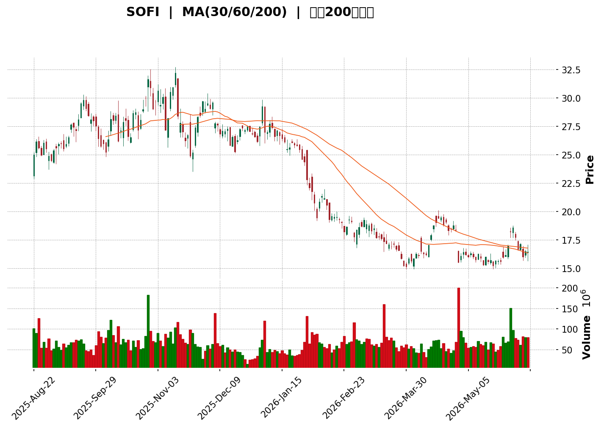
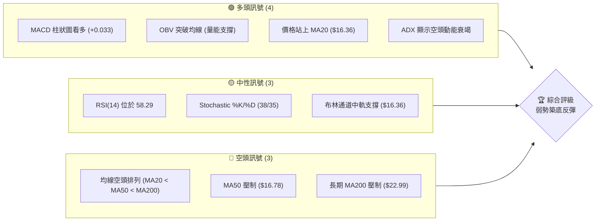
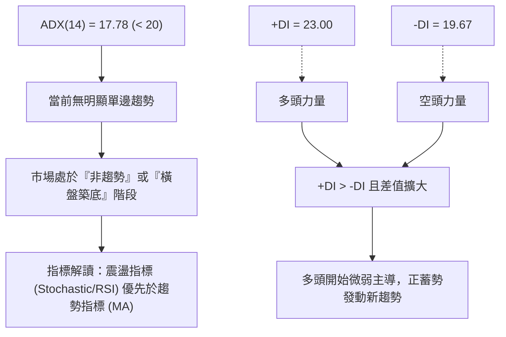
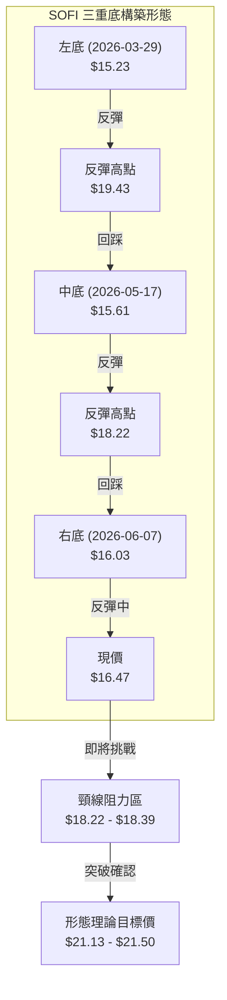

<details>
<summary>📊 靜態圖表 (點擊展開)</summary>

</details>

<html>
<head><meta charset="utf-8" /></head>
<body>
    <div style="height:500px; width:100%;">                        <script>window.PlotlyConfig = {MathJaxConfig: 'local'};</script>
        <script charset="utf-8" src="https://cdn.plot.ly/plotly-3.6.0.min.js" integrity="sha256-QaOVwtVY0T02VaHrr6pnoHLCwayMJp4O5n4YyaE3rJk=" crossorigin="anonymous"></script>                <div id="candlestick-chart" class="plotly-graph-div" style="height:100%; width:100%;"></div>            <script>                window.PLOTLYENV=window.PLOTLYENV || {};                                if (document.getElementById("candlestick-chart")) {                    Plotly.newPlot(                        "candlestick-chart",                        [{"close":{"dtype":"f8","bdata":"AAAAwB4FOUAAAABgZiY6QAAAAGC4njlAAAAAgML1OEAAAACAPQo6QAAAAIA9ijlAAAAAwPXoOEAAAACgcH04QAAAAKBHYTlAAAAAoJmZOUAAAACAwvU5QAAAAOBR+DlAAAAAwB6FOUAAAACAwvU5QAAAAMDMjDpAAAAAIIWrO0AAAAAghWs7QAAAAADXIztAAAAAACkcPEAAAABgj4I9QAAAACBczz1AAAAAQAoXPUAAAADgo3A8QAAAAGC4HjxAAAAAQOH6O0AAAADAzIw7QAAAACCFazpAAAAAYI\u002fCOUAAAADgUfg5QAAAAKBwPTlAAAAAAClcOkAAAAAA1yM8QAAAAMAeBTxAAAAAQDNzPEAAAADgozA6QAAAAADXIztAAAAAYLjeO0AAAAAgrgc8QAAAAKCZmTpAAAAAgD2KOkAAAACAFK48QAAAAAAAwDxAAAAA4KMwO0AAAADgehQ8QAAAAGCPAj1AAAAAAAAAPkAAAADA9ag\u002fQAAAAGBm5j5AAAAAIK4HPUAAAACAFK49QAAAAKBHoT5AAAAAYLhePUAAAACA6xE+QAAAAMD1KDtAAAAAgMI1PEAAAACAPYo+QAAAAEAz8z5AAAAAQOEaQEAAAAAA12M8QAAAAIDr0TtAAAAAgD0KO0AAAACgcD06QAAAAOBRuDpAAAAAwPXoOEAAAADgozA5QAAAAGBmZjtAAAAA4HpUPEAAAACgcH08QAAAAOBRuD1AAAAAIK4HPUAAAABgj4I9QAAAAIDrET1AAAAAoJmZPUAAAAAgrsc7QAAAAAApnDtAAAAA4HrUOkAAAABAChc7QAAAAIDrETtAAAAAIK5HO0AAAACA69E5QAAAAOB6lDpAAAAAwB5FOUAAAACAPUo6QAAAAKBwPTtAAAAAoJlZO0AAAADgozA7QAAAAEDhejtAAAAAgOsRO0AAAACA69E6QAAAACBcjzpAAAAAgBQuOkAAAACAwnU7QAAAACCuRz1AAAAAQOH6OkAAAAAAAAA7QAAAAOBRuDtAAAAAYGZmO0AAAACgmZk6QAAAAADXIztAAAAAIIWrOkAAAADgo3A6QAAAAKBHITpAAAAAoHB9OUAAAAAA16M5QAAAAEAKFzpAAAAAoJnZOUAAAADAzMw5QAAAAIDCdTlAAAAAoJmZOEAAAAAAKVw4QAAAACBczzZAAAAA4HoUNkAAAABgj8I1QAAAAAAAwDRAAAAAgMJ1M0AAAAAAKdw0QAAAAKCZWTVAAAAAgBQuNUAAAADAzIw0QAAAAMDMTDNAAAAAACmcM0AAAABgj4IzQAAAAIA9ijNAAAAAwMxMM0AAAADAHgUzQAAAAOBRODJAAAAAwPWoMkAAAACAPUozQAAAAKCZGTNAAAAAYI\u002fCMUAAAAAA12MyQAAAAAApnDJAAAAAQDOzMkAAAAAAAEAzQAAAAGBm5jJAAAAAgD3KMkAAAACAPUoyQAAAACCuhzJAAAAAQDOzMUAAAABgj8IxQAAAAKBHoTFAAAAAYLheMUAAAACAFC4xQAAAAOB6FDFAAAAAYGbmMEAAAABgZiYxQAAAAEAzszBAAAAAIFyPMEAAAACgcL0vQAAAAIDCdS5AAAAAwMxMLkAAAABgj8IvQAAAAGCPQi9AAAAAQDOzL0AAAADAHkUwQAAAAAApHDBAAAAAoHB9MEAAAADAHkUwQAAAAOBRODBAAAAAwMwMMUAAAADA9egxQAAAAIA9yjJAAAAAIK4HM0AAAACAFG4zQAAAAAAAgDNAAAAA4HrUMkAAAAAgXA8zQAAAAIDrUTJAAAAA4KNwMkAAAABgj8IyQAAAAAApXDJAAAAAwMwML0AAAACgmRkwQAAAAIAUbjBAAAAAQDMzMEAAAADAHgUwQAAAAMDMTDBAAAAAAAAAMEAAAAAAAIAvQAAAAGCPQjBAAAAAwMzML0AAAABguJ4uQAAAAMAeBTBAAAAA4FE4L0AAAAAghWsvQAAAAIDCdS5AAAAAoEdhL0AAAADAzEwvQAAAAKBwPS9AAAAAgML1L0AAAAAghSswQAAAAOBR+DBAAAAA4FE4MkAAAADgepQyQAAAAKBwvTFAAAAAgBSuMEAAAABgZiYxQAAAACCuBzBAAAAAAACAMEAAAADgUXgwQA=="},"high":{"dtype":"f8","bdata":"AAAAAABAOUAAAACgR2E6QAAAAEDhmjpAAAAAIFzPOUAAAADgelQ6QAAAACCFazpAAAAAIK5HOUAAAAAAKRw5QAAAAIA9ijlAAAAA4FH4OUAAAACgmRk6QAAAAOCjMDpAAAAAQOHaOkAAAACgmZk6QAAAAOCjsDpAAAAAwB7FO0AAAACgR+E7QAAAAIDCdTtAAAAAQLaTPEAAAACgR6E9QAAAAMDMTD5AAAAAANcjPkAAAAAghas9QAAAACCFqzxAAAAAQOF6PEAAAACgR6E8QAAAAAApnDtAAAAA4HpUO0AAAACgmVk6QAAAAIAULjpAAAAAANcjO0AAAABACtc8QAAAAIDCtTxAAAAA4KOwPEAAAADAzMw9QAAAAIAUbjtAAAAAoJlZPEAAAABAChc9QAAAAOCjcDxAAAAAIIXrOkAAAACAFO48QAAAAIDrET1AAAAAwMzMPEAAAADgUZg8QAAAAGC43j1AAAAAQDMzPkAAAABA4fo\u002fQAAAAOBRSEBAAAAAgD3qPkAAAAAAKdw9QAAAAOBROD9AAAAAgD3KPkAAAABguF4+QAAAAGDn2z5AAAAAoHA9PEAAAADgUfg+QAAAAKBw\u002fT5AAAAAoHBdQEAAAAAAAMA\u002fQAAAAIDrET1AAAAAQDPzO0AAAAAAAAA7QAAAAKCZ2TpAAAAAQDOTPEAAAACA63E5QAAAAAApnDtAAAAAQDNzPEAAAAAAAEA9QAAAAAAAwD1AAAAAQDOzPUAAAAAghWs+QAAAAIAU7j1AAAAAQDOzPUAAAACAFO47QAAAAOB61DtAAAAAQDNzO0AAAACAFK47QAAAACCuRztAAAAAAACAO0AAAABA4Xo7QAAAAKBwvTpAAAAAgMLVOkAAAABACrc6QAAAAGC4XjtAAAAAYLieO0AAAABAClc7QAAAAIA9ijtAAAAAwMyMO0AAAADA9Wg7QAAAAADXIztAAAAAYGbmOkAAAACgR4E7QAAAAAAp3D1AAAAAwMxMPUAAAACAFC47QAAAAIAUDjxAAAAAAABgPEAAAABg5VA7QAAAAEAzMztAAAAAgMIVO0AAAADgelQ7QAAAACCuxzpAAAAAQApXOkAAAADAzAw6QAAAAADXYzpAAAAAoEchOkAAAABgZmY6QAAAAIAU7jlAAAAAgD3KOUAAAABguB45QAAAAOBReDlAAAAAAAAAN0AAAAAAKVw3QAAAAADXwzVAAAAAYGZmNEAAAADA9Sg1QAAAAEAKlzVAAAAAAAAANkAAAACgmRk1QAAAAIA9yjRAAAAAYLjeM0AAAABACtczQAAAAGCPAjRAAAAAQOF6M0AAAADgozAzQAAAAKBHwTJAAAAAgMK1MkAAAABguJ4zQAAAACBcjzNAAAAAgMI1MkAAAADA9WgyQAAAAIA9CjNAAAAAIK5HM0AAAABA4XozQAAAAGC4PjNAAAAAgOvxMkAAAABgZgYzQAAAAKCZ2TJAAAAAwMyMMkAAAABgZiYyQAAAAIDrETJAAAAAoEdBMkAAAAAgrgcyQAAAACCFSzFAAAAAwHJoMUAAAADA9WgxQAAAAIDrETFAAAAAQApXMUAAAACgcH0wQAAAAKBHYS9AAAAAoEchL0AAAABgZgYwQAAAAIDrUTBAAAAAIK7HL0AAAADAzGwwQAAAAEDhWjBAAAAAoJnZMUAAAADgUXgwQAAAAKBwfTBAAAAAIFwPMUAAAABAMxMyQAAAAIDr0TJAAAAAYLieM0AAAACgRyE0QAAAAMAepTNAAAAAwB7FM0AAAAAgsHIzQAAAAGBm5jJAAAAAQDOTMkAAAAAghSszQAAAAGC43jJAAAAAQAqXMEAAAABguF4wQAAAACCFyzBAAAAAIK7HMEAAAAAgXE8wQAAAAKBHgTBAAAAAgMJ1MEAAAADAzAwwQAAAAIDrUTBAAAAA4HpUMEAAAAAghWsvQAAAAOCjEDBAAAAAgBSuL0AAAACA61EwQAAAACCuRy9AAAAA4KNwL0AAAACA65EvQAAAAAAp3C9AAAAAQDPzMEAAAADgo7AwQAAAAOB6FDFAAAAAQAqXMkAAAAAghcsyQAAAAEDhOjJAAAAAQAp3MUAAAABA4ToxQAAAAKBw\u002fTBAAAAAwPWoMEAAAACgmRkxQA=="},"hovertemplate":"\u003cb\u003e%{x|%Y-%m-%d}\u003c\u002fb\u003e\u003cbr\u003e\u958b: $%{open:.2f}\u003cbr\u003e\u9ad8: $%{high:.2f}\u003cbr\u003e\u4f4e: $%{low:.2f}\u003cbr\u003e\u6536: $%{close:.2f}\u003cextra\u003e\u003c\u002fextra\u003e","low":{"dtype":"f8","bdata":"AAAAYGbmNkAAAAAgXM84QAAAAAAAgDlAAAAAoEfhOEAAAAAAAAA5QAAAAIDCNTlAAAAAQDOzN0AAAAAA12M4QAAAACCyPThAAAAAgBQuOEAAAADAzAw5QAAAAMDMjDlAAAAAwMxMOUAAAABguJ45QAAAAMAexTlAAAAAIFzvOkAAAACgR6E6QAAAAKBHITpAAAAA4HoUO0AAAACgcD08QAAAAOBR+DxAAAAAoJnZPEAAAACgmVk8QAAAACBcDztAAAAAIFyPO0AAAAAAKRw7QAAAAEAzszlAAAAAANejOUAAAABAM3M5QAAAAEAK1zhAAAAAIFxPOUAAAACAFK46QAAAAMAepTtAAAAAAADAO0AAAACgRyE6QAAAAOBReDpAAAAAAADAOUAAAAAgXI87QAAAAAAAQDpAAAAAYI8COkAAAAAgXA87QAAAAGBmJjxAAAAAoEdhOkAAAACg8TI7QAAAAEAzszxAAAAAwB5FPUAAAADAzMw8QAAAAADXIz5AAAAAQOH6PEAAAACgcH08QAAAAOB6VD1AAAAA4KOwPEAAAABgjwI9QAAAAKBHITtAAAAAwPWoOUAAAABACtc8QAAAAOAi2z1AAAAAgML1PkAAAABgZiY8QAAAACCuhzpAAAAAwMyMOkAAAACAwrU5QAAAACBcjzlAAAAAYLi+OEAAAADAHoU3QAAAACCupzlAAAAAoEehOkAAAAAgXE88QAAAAOB6dDxAAAAAIIWrPEAAAADgo1A9QAAAAMAeBT1AAAAAQOF6PEAAAACAFO46QAAAAMDMDDtAAAAAwMyMOkAAAABA4Xo6QAAAAIAUjjpAAAAAQDMzOkAAAACAPco5QAAAAOBRuDlAAAAAIIUrOUAAAABAM\u002fM5QAAAACCuRzpAAAAAoJkZO0AAAABAM9M6QAAAACCuBztAAAAAIK4HO0AAAACgcL06QAAAAIA9ijpAAAAAIFwPOkAAAACAPco5QAAAAKCZmTtAAAAAIK4HOkAAAACgcF06QAAAAIDrkTpAAAAAQOE6O0AAAABAMzM6QAAAAOBRODpAAAAAIIXrOUAAAACAwjU6QAAAAGCPAjpAAAAAgMI1OUAAAABAM\u002fM4QAAAAAAAADpAAAAAoJmZOUAAAADAHsU5QAAAAIDCNTlAAAAAgOuROEAAAADAzAw4QAAAACBcTzZAAAAAACncNUAAAADAHgU1QAAAAIDrETRAAAAAAKoxM0AAAACAPQo0QAAAAMDMzDRAAAAAwMwMNUAAAAAA1yM0QAAAAIA9CjNAAAAAYGYmM0AAAAAAKRwzQAAAAKCZOTNAAAAA4FH4MkAAAAAA14MyQAAAAOB6lDFAAAAAANfjMUAAAACAFO4yQAAAAOBR+DJAAAAAIFxPMUAAAADAzMwwQAAAAOCjsDFAAAAAACmcMkAAAAAA16MyQAAAAGC4HjJAAAAAwB7FMUAAAACAPQoyQAAAAOBR+DFAAAAAYLieMUAAAAAgrocxQAAAAOBReDFAAAAAQOF6MEAAAADA9SgxQAAAAOB6lDBAAAAAIIWrMEAAAABACtcwQAAAAKBwfTBAAAAAwB6FMEAAAAAAKZwvQAAAAMDMTC5AAAAAYLjeLUAAAABguJ4uQAAAAKBH4S5AAAAAACncLUAAAABgj8IvQAAAAIDr0S9AAAAAYI9CMEAAAADgetQvQAAAAOBRGDBAAAAAIIXrL0AAAABgZmYxQAAAACCFKzJAAAAAYGamMkAAAAAA12MzQAAAAEAKFzNAAAAA4KOwMkAAAADA9egyQAAAAIAU7jFAAAAAgMAqMkAAAAAA12MyQAAAAMAeRTJAAAAAAAAAL0AAAADgehQvQAAAAAAAwC9AAAAAoEchMEAAAACgR+EvQAAAAEDh+i9AAAAAwPWoL0AAAACAPQovQAAAAIA9ii9AAAAAoJkZL0AAAACAFG4uQAAAAIDCdS5AAAAAYI\u002fCLkAAAACAFK4uQAAAAEAK1y1AAAAAIFwPLkAAAABAM7MuQAAAAOBRuC5AAAAA4FG4L0AAAABgjwIwQAAAAADXoy9AAAAAgBSuMUAAAADgo7AxQAAAAIDCdTFAAAAA4HqUMEAAAACAwpUwQAAAAAApXC9AAAAAwPXoL0AAAABAhE0vQA=="},"name":"\u50f9\u683c","open":{"dtype":"f8","bdata":"AAAAwPUoN0AAAACAFC45QAAAAOB6NDpAAAAAoHCdOUAAAADAHgU5QAAAAMD1KDpAAAAAAACAOEAAAAAgXA85QAAAAOB6VDhAAAAAwB7FOUAAAAAgXM85QAAAAMAeBTpAAAAAgD1KOkAAAABgj8I5QAAAAAAAADpAAAAAAABAO0AAAACAPco7QAAAAAAAQDtAAAAAQAqXO0AAAAAA10M8QAAAAMDMTD1AAAAAgBTOPUAAAAAAAIA9QAAAAGCPwjtAAAAAYLhePEAAAAAAKVw8QAAAAOBReDtAAAAAQOG6OkAAAADgelQ6QAAAAKCZGTpAAAAAwB7FOUAAAACgmRk7QAAAAKBwfTxAAAAAgD0KPEAAAADAzIw8QAAAAIDrETtAAAAAYI+COkAAAABAMzM8QAAAAIDrETxAAAAAoJkZOkAAAABAMzM7QAAAACBcjzxAAAAAoHB9PEAAAADgelQ7QAAAAOBR2DxAAAAAAAAAPkAAAACgcP0+QAAAAGC4fj9AAAAAIFxvPkAAAADgo7A9QAAAAMD1qD1AAAAAIIVLPUAAAADAHoU9QAAAAAAAID5AAAAAYGaGOkAAAAAgXA89QAAAAGC4Pj5AAAAAgBQuP0AAAABA4bo\u002fQAAAAAAAADtAAAAAgMK1O0AAAABgj4I6QAAAAKCZeTpAAAAAoEfhO0AAAACgR6E4QAAAAOB61DlAAAAAQOH6OkAAAACAwrU8QAAAAIA9yjxAAAAA4HrUPEAAAAAA12M9QAAAAMDMbD1AAAAAwPUIPUAAAACgcF07QAAAAEDhujtAAAAAoHA9O0AAAABgZqY6QAAAAEAK1zpAAAAAwB4lO0AAAAAgXG87QAAAAKBwvTlAAAAAANejOkAAAACAFC46QAAAAGC4njpAAAAA4FGYO0AAAACA6xE7QAAAACCFKztAAAAAgD2KO0AAAABguN46QAAAACCuBztAAAAAgBSuOkAAAADA9ag6QAAAACBczztAAAAAQOE6PUAAAACgcN06QAAAAAAAADtAAAAAgBTOO0AAAACAPUo7QAAAAEAzszpAAAAAAAAAO0AAAAAgXM86QAAAAIA9ijpAAAAA4KNwOUAAAAAAAIA5QAAAAIAULjpAAAAAAAAAOkAAAABgZuY5QAAAAGBm5jlAAAAAAACAOUAAAACgcN04QAAAAIAUbjlAAAAAYI+CNkAAAADAzAw3QAAAAKBwfTVAAAAAQOE6NEAAAACAPUo0QAAAAIA9SjVAAAAAQAoXNUAAAACgmRk1QAAAAIA9yjRAAAAAIK5HM0AAAADA9WgzQAAAAOBReDNAAAAA4HpUM0AAAACAwhUzQAAAAEDhujJAAAAAAAAAMkAAAAAgrkczQAAAAOCjMDNAAAAAwPUoMkAAAADAHiUxQAAAAAAAADJAAAAAIFwPM0AAAABgZqYyQAAAAAApfDJAAAAA4HpUMkAAAAAghesyQAAAAADXYzJAAAAA4FE4MkAAAADAzMwxQAAAAAAAADJAAAAA4FG4MUAAAACAFG4xQAAAAAAAwDBAAAAAgD3qMEAAAAAgricxQAAAAGC4\u002fjBAAAAAgD0KMUAAAABgZkYwQAAAAEAKVy9AAAAAACncLkAAAABgZuYuQAAAAGBmRjBAAAAAoEdhLkAAAAAgrscvQAAAAMD1KDBAAAAAgBSuMUAAAAAA12MwQAAAAMDMTDBAAAAAAAAAMEAAAAAgrocxQAAAAOBReDJAAAAAYLieM0AAAACgmZkzQAAAAGCPQjNAAAAAYI+CM0AAAACAPUozQAAAAMAexTJAAAAA4KNwMkAAAABA4XoyQAAAAMAeZTJAAAAAwMyMMEAAAACAPYovQAAAAAApPDBAAAAA4FF4MEAAAAAghSswQAAAAEAzMzBAAAAAYI9CMEAAAAAgrgcwQAAAAKCZmS9AAAAAgOsRMEAAAAAghWsvQAAAAGC4ni5AAAAAYGZmL0AAAACAwvUuQAAAAIDCNS9AAAAAQOG6LkAAAACgcD0vQAAAAGBmZi9AAAAAQOF6MEAAAADAzAwwQAAAAMAeBTBAAAAAYI9CMkAAAABgZiYyQAAAACCuBzJAAAAAoEdhMUAAAADA9agwQAAAAEDhujBAAAAAgBQuMEAAAABgZmYwQA=="},"x":["2025-08-22T00:00:00-04:00","2025-08-25T00:00:00-04:00","2025-08-26T00:00:00-04:00","2025-08-27T00:00:00-04:00","2025-08-28T00:00:00-04:00","2025-08-29T00:00:00-04:00","2025-09-02T00:00:00-04:00","2025-09-03T00:00:00-04:00","2025-09-04T00:00:00-04:00","2025-09-05T00:00:00-04:00","2025-09-08T00:00:00-04:00","2025-09-09T00:00:00-04:00","2025-09-10T00:00:00-04:00","2025-09-11T00:00:00-04:00","2025-09-12T00:00:00-04:00","2025-09-15T00:00:00-04:00","2025-09-16T00:00:00-04:00","2025-09-17T00:00:00-04:00","2025-09-18T00:00:00-04:00","2025-09-19T00:00:00-04:00","2025-09-22T00:00:00-04:00","2025-09-23T00:00:00-04:00","2025-09-24T00:00:00-04:00","2025-09-25T00:00:00-04:00","2025-09-26T00:00:00-04:00","2025-09-29T00:00:00-04:00","2025-09-30T00:00:00-04:00","2025-10-01T00:00:00-04:00","2025-10-02T00:00:00-04:00","2025-10-03T00:00:00-04:00","2025-10-06T00:00:00-04:00","2025-10-07T00:00:00-04:00","2025-10-08T00:00:00-04:00","2025-10-09T00:00:00-04:00","2025-10-10T00:00:00-04:00","2025-10-13T00:00:00-04:00","2025-10-14T00:00:00-04:00","2025-10-15T00:00:00-04:00","2025-10-16T00:00:00-04:00","2025-10-17T00:00:00-04:00","2025-10-20T00:00:00-04:00","2025-10-21T00:00:00-04:00","2025-10-22T00:00:00-04:00","2025-10-23T00:00:00-04:00","2025-10-24T00:00:00-04:00","2025-10-27T00:00:00-04:00","2025-10-28T00:00:00-04:00","2025-10-29T00:00:00-04:00","2025-10-30T00:00:00-04:00","2025-10-31T00:00:00-04:00","2025-11-03T00:00:00-05:00","2025-11-04T00:00:00-05:00","2025-11-05T00:00:00-05:00","2025-11-06T00:00:00-05:00","2025-11-07T00:00:00-05:00","2025-11-10T00:00:00-05:00","2025-11-11T00:00:00-05:00","2025-11-12T00:00:00-05:00","2025-11-13T00:00:00-05:00","2025-11-14T00:00:00-05:00","2025-11-17T00:00:00-05:00","2025-11-18T00:00:00-05:00","2025-11-19T00:00:00-05:00","2025-11-20T00:00:00-05:00","2025-11-21T00:00:00-05:00","2025-11-24T00:00:00-05:00","2025-11-25T00:00:00-05:00","2025-11-26T00:00:00-05:00","2025-11-28T00:00:00-05:00","2025-12-01T00:00:00-05:00","2025-12-02T00:00:00-05:00","2025-12-03T00:00:00-05:00","2025-12-04T00:00:00-05:00","2025-12-05T00:00:00-05:00","2025-12-08T00:00:00-05:00","2025-12-09T00:00:00-05:00","2025-12-10T00:00:00-05:00","2025-12-11T00:00:00-05:00","2025-12-12T00:00:00-05:00","2025-12-15T00:00:00-05:00","2025-12-16T00:00:00-05:00","2025-12-17T00:00:00-05:00","2025-12-18T00:00:00-05:00","2025-12-19T00:00:00-05:00","2025-12-22T00:00:00-05:00","2025-12-23T00:00:00-05:00","2025-12-24T00:00:00-05:00","2025-12-26T00:00:00-05:00","2025-12-29T00:00:00-05:00","2025-12-30T00:00:00-05:00","2025-12-31T00:00:00-05:00","2026-01-02T00:00:00-05:00","2026-01-05T00:00:00-05:00","2026-01-06T00:00:00-05:00","2026-01-07T00:00:00-05:00","2026-01-08T00:00:00-05:00","2026-01-09T00:00:00-05:00","2026-01-12T00:00:00-05:00","2026-01-13T00:00:00-05:00","2026-01-14T00:00:00-05:00","2026-01-15T00:00:00-05:00","2026-01-16T00:00:00-05:00","2026-01-20T00:00:00-05:00","2026-01-21T00:00:00-05:00","2026-01-22T00:00:00-05:00","2026-01-23T00:00:00-05:00","2026-01-26T00:00:00-05:00","2026-01-27T00:00:00-05:00","2026-01-28T00:00:00-05:00","2026-01-29T00:00:00-05:00","2026-01-30T00:00:00-05:00","2026-02-02T00:00:00-05:00","2026-02-03T00:00:00-05:00","2026-02-04T00:00:00-05:00","2026-02-05T00:00:00-05:00","2026-02-06T00:00:00-05:00","2026-02-09T00:00:00-05:00","2026-02-10T00:00:00-05:00","2026-02-11T00:00:00-05:00","2026-02-12T00:00:00-05:00","2026-02-13T00:00:00-05:00","2026-02-17T00:00:00-05:00","2026-02-18T00:00:00-05:00","2026-02-19T00:00:00-05:00","2026-02-20T00:00:00-05:00","2026-02-23T00:00:00-05:00","2026-02-24T00:00:00-05:00","2026-02-25T00:00:00-05:00","2026-02-26T00:00:00-05:00","2026-02-27T00:00:00-05:00","2026-03-02T00:00:00-05:00","2026-03-03T00:00:00-05:00","2026-03-04T00:00:00-05:00","2026-03-05T00:00:00-05:00","2026-03-06T00:00:00-05:00","2026-03-09T00:00:00-04:00","2026-03-10T00:00:00-04:00","2026-03-11T00:00:00-04:00","2026-03-12T00:00:00-04:00","2026-03-13T00:00:00-04:00","2026-03-16T00:00:00-04:00","2026-03-17T00:00:00-04:00","2026-03-18T00:00:00-04:00","2026-03-19T00:00:00-04:00","2026-03-20T00:00:00-04:00","2026-03-23T00:00:00-04:00","2026-03-24T00:00:00-04:00","2026-03-25T00:00:00-04:00","2026-03-26T00:00:00-04:00","2026-03-27T00:00:00-04:00","2026-03-30T00:00:00-04:00","2026-03-31T00:00:00-04:00","2026-04-01T00:00:00-04:00","2026-04-02T00:00:00-04:00","2026-04-06T00:00:00-04:00","2026-04-07T00:00:00-04:00","2026-04-08T00:00:00-04:00","2026-04-09T00:00:00-04:00","2026-04-10T00:00:00-04:00","2026-04-13T00:00:00-04:00","2026-04-14T00:00:00-04:00","2026-04-15T00:00:00-04:00","2026-04-16T00:00:00-04:00","2026-04-17T00:00:00-04:00","2026-04-20T00:00:00-04:00","2026-04-21T00:00:00-04:00","2026-04-22T00:00:00-04:00","2026-04-23T00:00:00-04:00","2026-04-24T00:00:00-04:00","2026-04-27T00:00:00-04:00","2026-04-28T00:00:00-04:00","2026-04-29T00:00:00-04:00","2026-04-30T00:00:00-04:00","2026-05-01T00:00:00-04:00","2026-05-04T00:00:00-04:00","2026-05-05T00:00:00-04:00","2026-05-06T00:00:00-04:00","2026-05-07T00:00:00-04:00","2026-05-08T00:00:00-04:00","2026-05-11T00:00:00-04:00","2026-05-12T00:00:00-04:00","2026-05-13T00:00:00-04:00","2026-05-14T00:00:00-04:00","2026-05-15T00:00:00-04:00","2026-05-18T00:00:00-04:00","2026-05-19T00:00:00-04:00","2026-05-20T00:00:00-04:00","2026-05-21T00:00:00-04:00","2026-05-22T00:00:00-04:00","2026-05-26T00:00:00-04:00","2026-05-27T00:00:00-04:00","2026-05-28T00:00:00-04:00","2026-05-29T00:00:00-04:00","2026-06-01T00:00:00-04:00","2026-06-02T00:00:00-04:00","2026-06-03T00:00:00-04:00","2026-06-04T00:00:00-04:00","2026-06-05T00:00:00-04:00","2026-06-08T00:00:00-04:00","2026-06-09T00:00:00-04:00"],"type":"candlestick"},{"hovertemplate":"MA30: $%{y:.2f}\u003cextra\u003e\u003c\u002fextra\u003e","line":{"color":"#2196F3","dash":"dash","width":2},"mode":"lines","name":"MA30","x":["2025-08-22T00:00:00-04:00","2025-08-25T00:00:00-04:00","2025-08-26T00:00:00-04:00","2025-08-27T00:00:00-04:00","2025-08-28T00:00:00-04:00","2025-08-29T00:00:00-04:00","2025-09-02T00:00:00-04:00","2025-09-03T00:00:00-04:00","2025-09-04T00:00:00-04:00","2025-09-05T00:00:00-04:00","2025-09-08T00:00:00-04:00","2025-09-09T00:00:00-04:00","2025-09-10T00:00:00-04:00","2025-09-11T00:00:00-04:00","2025-09-12T00:00:00-04:00","2025-09-15T00:00:00-04:00","2025-09-16T00:00:00-04:00","2025-09-17T00:00:00-04:00","2025-09-18T00:00:00-04:00","2025-09-19T00:00:00-04:00","2025-09-22T00:00:00-04:00","2025-09-23T00:00:00-04:00","2025-09-24T00:00:00-04:00","2025-09-25T00:00:00-04:00","2025-09-26T00:00:00-04:00","2025-09-29T00:00:00-04:00","2025-09-30T00:00:00-04:00","2025-10-01T00:00:00-04:00","2025-10-02T00:00:00-04:00","2025-10-03T00:00:00-04:00","2025-10-06T00:00:00-04:00","2025-10-07T00:00:00-04:00","2025-10-08T00:00:00-04:00","2025-10-09T00:00:00-04:00","2025-10-10T00:00:00-04:00","2025-10-13T00:00:00-04:00","2025-10-14T00:00:00-04:00","2025-10-15T00:00:00-04:00","2025-10-16T00:00:00-04:00","2025-10-17T00:00:00-04:00","2025-10-20T00:00:00-04:00","2025-10-21T00:00:00-04:00","2025-10-22T00:00:00-04:00","2025-10-23T00:00:00-04:00","2025-10-24T00:00:00-04:00","2025-10-27T00:00:00-04:00","2025-10-28T00:00:00-04:00","2025-10-29T00:00:00-04:00","2025-10-30T00:00:00-04:00","2025-10-31T00:00:00-04:00","2025-11-03T00:00:00-05:00","2025-11-04T00:00:00-05:00","2025-11-05T00:00:00-05:00","2025-11-06T00:00:00-05:00","2025-11-07T00:00:00-05:00","2025-11-10T00:00:00-05:00","2025-11-11T00:00:00-05:00","2025-11-12T00:00:00-05:00","2025-11-13T00:00:00-05:00","2025-11-14T00:00:00-05:00","2025-11-17T00:00:00-05:00","2025-11-18T00:00:00-05:00","2025-11-19T00:00:00-05:00","2025-11-20T00:00:00-05:00","2025-11-21T00:00:00-05:00","2025-11-24T00:00:00-05:00","2025-11-25T00:00:00-05:00","2025-11-26T00:00:00-05:00","2025-11-28T00:00:00-05:00","2025-12-01T00:00:00-05:00","2025-12-02T00:00:00-05:00","2025-12-03T00:00:00-05:00","2025-12-04T00:00:00-05:00","2025-12-05T00:00:00-05:00","2025-12-08T00:00:00-05:00","2025-12-09T00:00:00-05:00","2025-12-10T00:00:00-05:00","2025-12-11T00:00:00-05:00","2025-12-12T00:00:00-05:00","2025-12-15T00:00:00-05:00","2025-12-16T00:00:00-05:00","2025-12-17T00:00:00-05:00","2025-12-18T00:00:00-05:00","2025-12-19T00:00:00-05:00","2025-12-22T00:00:00-05:00","2025-12-23T00:00:00-05:00","2025-12-24T00:00:00-05:00","2025-12-26T00:00:00-05:00","2025-12-29T00:00:00-05:00","2025-12-30T00:00:00-05:00","2025-12-31T00:00:00-05:00","2026-01-02T00:00:00-05:00","2026-01-05T00:00:00-05:00","2026-01-06T00:00:00-05:00","2026-01-07T00:00:00-05:00","2026-01-08T00:00:00-05:00","2026-01-09T00:00:00-05:00","2026-01-12T00:00:00-05:00","2026-01-13T00:00:00-05:00","2026-01-14T00:00:00-05:00","2026-01-15T00:00:00-05:00","2026-01-16T00:00:00-05:00","2026-01-20T00:00:00-05:00","2026-01-21T00:00:00-05:00","2026-01-22T00:00:00-05:00","2026-01-23T00:00:00-05:00","2026-01-26T00:00:00-05:00","2026-01-27T00:00:00-05:00","2026-01-28T00:00:00-05:00","2026-01-29T00:00:00-05:00","2026-01-30T00:00:00-05:00","2026-02-02T00:00:00-05:00","2026-02-03T00:00:00-05:00","2026-02-04T00:00:00-05:00","2026-02-05T00:00:00-05:00","2026-02-06T00:00:00-05:00","2026-02-09T00:00:00-05:00","2026-02-10T00:00:00-05:00","2026-02-11T00:00:00-05:00","2026-02-12T00:00:00-05:00","2026-02-13T00:00:00-05:00","2026-02-17T00:00:00-05:00","2026-02-18T00:00:00-05:00","2026-02-19T00:00:00-05:00","2026-02-20T00:00:00-05:00","2026-02-23T00:00:00-05:00","2026-02-24T00:00:00-05:00","2026-02-25T00:00:00-05:00","2026-02-26T00:00:00-05:00","2026-02-27T00:00:00-05:00","2026-03-02T00:00:00-05:00","2026-03-03T00:00:00-05:00","2026-03-04T00:00:00-05:00","2026-03-05T00:00:00-05:00","2026-03-06T00:00:00-05:00","2026-03-09T00:00:00-04:00","2026-03-10T00:00:00-04:00","2026-03-11T00:00:00-04:00","2026-03-12T00:00:00-04:00","2026-03-13T00:00:00-04:00","2026-03-16T00:00:00-04:00","2026-03-17T00:00:00-04:00","2026-03-18T00:00:00-04:00","2026-03-19T00:00:00-04:00","2026-03-20T00:00:00-04:00","2026-03-23T00:00:00-04:00","2026-03-24T00:00:00-04:00","2026-03-25T00:00:00-04:00","2026-03-26T00:00:00-04:00","2026-03-27T00:00:00-04:00","2026-03-30T00:00:00-04:00","2026-03-31T00:00:00-04:00","2026-04-01T00:00:00-04:00","2026-04-02T00:00:00-04:00","2026-04-06T00:00:00-04:00","2026-04-07T00:00:00-04:00","2026-04-08T00:00:00-04:00","2026-04-09T00:00:00-04:00","2026-04-10T00:00:00-04:00","2026-04-13T00:00:00-04:00","2026-04-14T00:00:00-04:00","2026-04-15T00:00:00-04:00","2026-04-16T00:00:00-04:00","2026-04-17T00:00:00-04:00","2026-04-20T00:00:00-04:00","2026-04-21T00:00:00-04:00","2026-04-22T00:00:00-04:00","2026-04-23T00:00:00-04:00","2026-04-24T00:00:00-04:00","2026-04-27T00:00:00-04:00","2026-04-28T00:00:00-04:00","2026-04-29T00:00:00-04:00","2026-04-30T00:00:00-04:00","2026-05-01T00:00:00-04:00","2026-05-04T00:00:00-04:00","2026-05-05T00:00:00-04:00","2026-05-06T00:00:00-04:00","2026-05-07T00:00:00-04:00","2026-05-08T00:00:00-04:00","2026-05-11T00:00:00-04:00","2026-05-12T00:00:00-04:00","2026-05-13T00:00:00-04:00","2026-05-14T00:00:00-04:00","2026-05-15T00:00:00-04:00","2026-05-18T00:00:00-04:00","2026-05-19T00:00:00-04:00","2026-05-20T00:00:00-04:00","2026-05-21T00:00:00-04:00","2026-05-22T00:00:00-04:00","2026-05-26T00:00:00-04:00","2026-05-27T00:00:00-04:00","2026-05-28T00:00:00-04:00","2026-05-29T00:00:00-04:00","2026-06-01T00:00:00-04:00","2026-06-02T00:00:00-04:00","2026-06-03T00:00:00-04:00","2026-06-04T00:00:00-04:00","2026-06-05T00:00:00-04:00","2026-06-08T00:00:00-04:00","2026-06-09T00:00:00-04:00"],"y":{"dtype":"f8","bdata":"AAAAAAAA+H8AAAAAAAD4fwAAAAAAAPh\u002fAAAAAAAA+H8AAAAAAAD4fwAAAAAAAPh\u002fAAAAAAAA+H8AAAAAAAD4fwAAAAAAAPh\u002fAAAAAAAA+H8AAAAAAAD4fwAAAAAAAPh\u002fAAAAAAAA+H8AAAAAAAD4fwAAAAAAAPh\u002fAAAAAAAA+H8AAAAAAAD4fwAAAAAAAPh\u002fAAAAAAAA+H8AAAAAAAD4fwAAAAAAAPh\u002fAAAAAAAA+H8AAAAAAAD4fwAAAAAAAPh\u002fAAAAAAAA+H8AAAAAAAD4fwAAAAAAAPh\u002fAAAAAAAA+H8AAAAAAAD4f0RERCS\u002fmDpAq6qqai6kOkAzMzOjKbU6QERERISkyTpAq6qqimznOkCJiIg4tOg6QImIiHhb9jpAERERsZ0PO0ARERHx0i07QDMzMxM8ODtAmpmZiUFAO0CJiIh4d1c7QJqZmXkwbztAVVVVpXB9O0C8u7vbh487QAAAANCFpDtAZmZmxme4O0AiIiIyltw7QKuqqgqs\u002fDtAAAAA0IUEPEDv7u4u+QU8QAAAAID4DDxAvLu7K1wPPEBVVVX1RB08QN7d3c0TFTxA7+7uPgoXPEAREREBjjA8QBEREfE1VzxA3t3dLUCOPEAAAADA5qI8QImIiNjquDxAREREVLi+PEB3d3e3ga48QCIiItJpozxAIiIikjSFPECamZkJrHw8QERERATkfjxAZmZm5tCCPECJiIjIvYY8QGZmZoZdoTxAMzMzA522PEDNzMwssr08QJqZmTltwDxAMzMz8\u002f3UPEB3d3eXbtI8QO\u002fu7j58xjxAZmZmRm+rPEBVVVX1b4Q8QCIiIjLBYzxAMzMzQ9JUPEBmZmb24TM8QKuqqppSETxAREREBFbuO0C8u7t7FM47QO\u002fu7j7DzjtAzczMjGzHO0DNzMxc1qo7QHd3dwc6jTtAd3d3h11hO0AAAADQ91M7QM3MzEw3STtAmpmZmeBBO0Crqqq6SUw7QDMzMyMiYjtA7+7uHsxzO0AAAAAgPoM7QM3MzCz5hTtA7+7ujgl+O0CrqqrK6G07QCIiIrLkVztAIiIiMsFDO0De3d2tjik7QGZmZiZ4EDtAd3d3t2XtOkAAAADQIts6QCIiIlIqzjpAq6qqes3FOkDe3d1ty7o6QERERFQOrTpAd3d3xy+WOkDNzMxcuok6QLy7u6uOaTpAIiIiAlZOOkAiIiISric6QDMzM3NM8DlAq6qqevisOUAiIiJi9HY5QCIiIjKlQjlAvLu7S2IQOUBVVVVF4do4QO\u002fu7o7tnDhAzczMLN1kOEAzMzMjBiE4QImIiMjozTdAERERkV+MN0De3d39Rkg3QM3MzOw19zZAq6qqGqGsNkCrqqoqQG42QFVVVYWkKTZAREREVJzdNUBVVVXV6pg1QFVVVSW\u002fWDVAq6qqKs4eNUAAAAAAR+g0QERERDTsqjRAZmZmZq1uNEDv7u6Oly40QO\u002fu7r508zNAd3d3d5O4M0C8u7uLQYAzQJqZmakNVDNAMzMzg9wrM0CamZlZxwQzQM3MzBx25TJAVVVVtZ3PMkBmZmYW9a8yQCIiIgJHiDJAZmZmdtpgMkARERHZ6jgyQERERMwvFjJA7+7uxiDwMUC8u7vrJtExQM3MzGTJrzFAmpmZwViSMUAiIiJK4XoxQFVVVe3faDFAVVVVfVtWMUCrqqoyljwxQFVVVb0CJDFAAAAAuPMdMUDNzMwk2xkxQERERFxkGzFAmpmZQTUeMUARERF5vh8xQJqZmTHdJDFAq6qqkjQlMUARERGpxisxQAAAAOj7KTFA3t3ddUwwMUBmZmb+1DgxQM3MzLQPPzFAVVVVPVEvMUCamZnxGSYxQHd3d\u002f+NIDFAvLu705QaMUBmZmZO8BAxQFVVVX2GDTFA7+7uJr8IMUAiIiICuQcxQERERBSDEDFAq6qqeukWMUC8u7tLDBIxQLy7u0NgFTFAmpmZ+VMTMUCrqqqijA4xQGZmZj4KBzFA3t3dnTYAMUBEREQ07PowQERERHzN9TBAERERCazsMECrqqry0t0wQAAAABhLzjBAZmZmnmHHMEC8u7vDIMAwQERERPwbsTBAVVVVPcOeMEAAAADIdo4wQLy7uzPsejBAzczMNF5qMEB3d3ef01YwQA=="},"type":"scatter"},{"hovertemplate":"MA60: $%{y:.2f}\u003cextra\u003e\u003c\u002fextra\u003e","line":{"color":"#9C27B0","dash":"dash","width":2},"mode":"lines","name":"MA60","x":["2025-08-22T00:00:00-04:00","2025-08-25T00:00:00-04:00","2025-08-26T00:00:00-04:00","2025-08-27T00:00:00-04:00","2025-08-28T00:00:00-04:00","2025-08-29T00:00:00-04:00","2025-09-02T00:00:00-04:00","2025-09-03T00:00:00-04:00","2025-09-04T00:00:00-04:00","2025-09-05T00:00:00-04:00","2025-09-08T00:00:00-04:00","2025-09-09T00:00:00-04:00","2025-09-10T00:00:00-04:00","2025-09-11T00:00:00-04:00","2025-09-12T00:00:00-04:00","2025-09-15T00:00:00-04:00","2025-09-16T00:00:00-04:00","2025-09-17T00:00:00-04:00","2025-09-18T00:00:00-04:00","2025-09-19T00:00:00-04:00","2025-09-22T00:00:00-04:00","2025-09-23T00:00:00-04:00","2025-09-24T00:00:00-04:00","2025-09-25T00:00:00-04:00","2025-09-26T00:00:00-04:00","2025-09-29T00:00:00-04:00","2025-09-30T00:00:00-04:00","2025-10-01T00:00:00-04:00","2025-10-02T00:00:00-04:00","2025-10-03T00:00:00-04:00","2025-10-06T00:00:00-04:00","2025-10-07T00:00:00-04:00","2025-10-08T00:00:00-04:00","2025-10-09T00:00:00-04:00","2025-10-10T00:00:00-04:00","2025-10-13T00:00:00-04:00","2025-10-14T00:00:00-04:00","2025-10-15T00:00:00-04:00","2025-10-16T00:00:00-04:00","2025-10-17T00:00:00-04:00","2025-10-20T00:00:00-04:00","2025-10-21T00:00:00-04:00","2025-10-22T00:00:00-04:00","2025-10-23T00:00:00-04:00","2025-10-24T00:00:00-04:00","2025-10-27T00:00:00-04:00","2025-10-28T00:00:00-04:00","2025-10-29T00:00:00-04:00","2025-10-30T00:00:00-04:00","2025-10-31T00:00:00-04:00","2025-11-03T00:00:00-05:00","2025-11-04T00:00:00-05:00","2025-11-05T00:00:00-05:00","2025-11-06T00:00:00-05:00","2025-11-07T00:00:00-05:00","2025-11-10T00:00:00-05:00","2025-11-11T00:00:00-05:00","2025-11-12T00:00:00-05:00","2025-11-13T00:00:00-05:00","2025-11-14T00:00:00-05:00","2025-11-17T00:00:00-05:00","2025-11-18T00:00:00-05:00","2025-11-19T00:00:00-05:00","2025-11-20T00:00:00-05:00","2025-11-21T00:00:00-05:00","2025-11-24T00:00:00-05:00","2025-11-25T00:00:00-05:00","2025-11-26T00:00:00-05:00","2025-11-28T00:00:00-05:00","2025-12-01T00:00:00-05:00","2025-12-02T00:00:00-05:00","2025-12-03T00:00:00-05:00","2025-12-04T00:00:00-05:00","2025-12-05T00:00:00-05:00","2025-12-08T00:00:00-05:00","2025-12-09T00:00:00-05:00","2025-12-10T00:00:00-05:00","2025-12-11T00:00:00-05:00","2025-12-12T00:00:00-05:00","2025-12-15T00:00:00-05:00","2025-12-16T00:00:00-05:00","2025-12-17T00:00:00-05:00","2025-12-18T00:00:00-05:00","2025-12-19T00:00:00-05:00","2025-12-22T00:00:00-05:00","2025-12-23T00:00:00-05:00","2025-12-24T00:00:00-05:00","2025-12-26T00:00:00-05:00","2025-12-29T00:00:00-05:00","2025-12-30T00:00:00-05:00","2025-12-31T00:00:00-05:00","2026-01-02T00:00:00-05:00","2026-01-05T00:00:00-05:00","2026-01-06T00:00:00-05:00","2026-01-07T00:00:00-05:00","2026-01-08T00:00:00-05:00","2026-01-09T00:00:00-05:00","2026-01-12T00:00:00-05:00","2026-01-13T00:00:00-05:00","2026-01-14T00:00:00-05:00","2026-01-15T00:00:00-05:00","2026-01-16T00:00:00-05:00","2026-01-20T00:00:00-05:00","2026-01-21T00:00:00-05:00","2026-01-22T00:00:00-05:00","2026-01-23T00:00:00-05:00","2026-01-26T00:00:00-05:00","2026-01-27T00:00:00-05:00","2026-01-28T00:00:00-05:00","2026-01-29T00:00:00-05:00","2026-01-30T00:00:00-05:00","2026-02-02T00:00:00-05:00","2026-02-03T00:00:00-05:00","2026-02-04T00:00:00-05:00","2026-02-05T00:00:00-05:00","2026-02-06T00:00:00-05:00","2026-02-09T00:00:00-05:00","2026-02-10T00:00:00-05:00","2026-02-11T00:00:00-05:00","2026-02-12T00:00:00-05:00","2026-02-13T00:00:00-05:00","2026-02-17T00:00:00-05:00","2026-02-18T00:00:00-05:00","2026-02-19T00:00:00-05:00","2026-02-20T00:00:00-05:00","2026-02-23T00:00:00-05:00","2026-02-24T00:00:00-05:00","2026-02-25T00:00:00-05:00","2026-02-26T00:00:00-05:00","2026-02-27T00:00:00-05:00","2026-03-02T00:00:00-05:00","2026-03-03T00:00:00-05:00","2026-03-04T00:00:00-05:00","2026-03-05T00:00:00-05:00","2026-03-06T00:00:00-05:00","2026-03-09T00:00:00-04:00","2026-03-10T00:00:00-04:00","2026-03-11T00:00:00-04:00","2026-03-12T00:00:00-04:00","2026-03-13T00:00:00-04:00","2026-03-16T00:00:00-04:00","2026-03-17T00:00:00-04:00","2026-03-18T00:00:00-04:00","2026-03-19T00:00:00-04:00","2026-03-20T00:00:00-04:00","2026-03-23T00:00:00-04:00","2026-03-24T00:00:00-04:00","2026-03-25T00:00:00-04:00","2026-03-26T00:00:00-04:00","2026-03-27T00:00:00-04:00","2026-03-30T00:00:00-04:00","2026-03-31T00:00:00-04:00","2026-04-01T00:00:00-04:00","2026-04-02T00:00:00-04:00","2026-04-06T00:00:00-04:00","2026-04-07T00:00:00-04:00","2026-04-08T00:00:00-04:00","2026-04-09T00:00:00-04:00","2026-04-10T00:00:00-04:00","2026-04-13T00:00:00-04:00","2026-04-14T00:00:00-04:00","2026-04-15T00:00:00-04:00","2026-04-16T00:00:00-04:00","2026-04-17T00:00:00-04:00","2026-04-20T00:00:00-04:00","2026-04-21T00:00:00-04:00","2026-04-22T00:00:00-04:00","2026-04-23T00:00:00-04:00","2026-04-24T00:00:00-04:00","2026-04-27T00:00:00-04:00","2026-04-28T00:00:00-04:00","2026-04-29T00:00:00-04:00","2026-04-30T00:00:00-04:00","2026-05-01T00:00:00-04:00","2026-05-04T00:00:00-04:00","2026-05-05T00:00:00-04:00","2026-05-06T00:00:00-04:00","2026-05-07T00:00:00-04:00","2026-05-08T00:00:00-04:00","2026-05-11T00:00:00-04:00","2026-05-12T00:00:00-04:00","2026-05-13T00:00:00-04:00","2026-05-14T00:00:00-04:00","2026-05-15T00:00:00-04:00","2026-05-18T00:00:00-04:00","2026-05-19T00:00:00-04:00","2026-05-20T00:00:00-04:00","2026-05-21T00:00:00-04:00","2026-05-22T00:00:00-04:00","2026-05-26T00:00:00-04:00","2026-05-27T00:00:00-04:00","2026-05-28T00:00:00-04:00","2026-05-29T00:00:00-04:00","2026-06-01T00:00:00-04:00","2026-06-02T00:00:00-04:00","2026-06-03T00:00:00-04:00","2026-06-04T00:00:00-04:00","2026-06-05T00:00:00-04:00","2026-06-08T00:00:00-04:00","2026-06-09T00:00:00-04:00"],"y":{"dtype":"f8","bdata":"AAAAAAAA+H8AAAAAAAD4fwAAAAAAAPh\u002fAAAAAAAA+H8AAAAAAAD4fwAAAAAAAPh\u002fAAAAAAAA+H8AAAAAAAD4fwAAAAAAAPh\u002fAAAAAAAA+H8AAAAAAAD4fwAAAAAAAPh\u002fAAAAAAAA+H8AAAAAAAD4fwAAAAAAAPh\u002fAAAAAAAA+H8AAAAAAAD4fwAAAAAAAPh\u002fAAAAAAAA+H8AAAAAAAD4fwAAAAAAAPh\u002fAAAAAAAA+H8AAAAAAAD4fwAAAAAAAPh\u002fAAAAAAAA+H8AAAAAAAD4fwAAAAAAAPh\u002fAAAAAAAA+H8AAAAAAAD4fwAAAAAAAPh\u002fAAAAAAAA+H8AAAAAAAD4fwAAAAAAAPh\u002fAAAAAAAA+H8AAAAAAAD4fwAAAAAAAPh\u002fAAAAAAAA+H8AAAAAAAD4fwAAAAAAAPh\u002fAAAAAAAA+H8AAAAAAAD4fwAAAAAAAPh\u002fAAAAAAAA+H8AAAAAAAD4fwAAAAAAAPh\u002fAAAAAAAA+H8AAAAAAAD4fwAAAAAAAPh\u002fAAAAAAAA+H8AAAAAAAD4fwAAAAAAAPh\u002fAAAAAAAA+H8AAAAAAAD4fwAAAAAAAPh\u002fAAAAAAAA+H8AAAAAAAD4fwAAAAAAAPh\u002fAAAAAAAA+H8AAAAAAAD4f2ZmZv7UqDtAd3d3X3OxO0BVVVWt1bE7QDMzMyuHtjtAZmZmjlC2O0AREREhsLI7QGZmZr6fujtAvLu7SzfJO0DNzMxcSNo7QM3MzMzM7DtAZmZmRm\u002f7O0CrqqrSlAo8QJqZmdnOFzxARERETDcpPECamZk5+zA8QHd3dweBNTxAZmZmhusxPEC8u7sTgzA8QGZmZp42MDxAmpmZCawsPECrqqqS7Rw8QFVVVY0lDzxAAAAAGNn+O0CJiIi4rPU7QGZmZobr8TtA3t3dZTvvO0Dv7u4usu07QERERPw38jtAq6qq2s73O0AAAABIb\u002fs7QKuqqhIRATxA7+7udkwAPEARERG5Zf07QKuqqvrFAjxAiYiIWID8O0DNzMwU9f87QImIiJhuAjxAq6qqOm0APECamZlJU\u002fo7QERERByh\u002fDtAq6qqGi\u002f9O0BVVVVtoPM7QAAAALBy6DtAVVVV1THhO0C8u7uzyNY7QImIiEhTyjtAiYiIYJ64O0CamZmxnZ87QDMzM8NniDtAVVVVBYF1O0CamZkpzl47QDMzM6NwPTtAMzMzA1YeO0Dv7u5G4fo6QBEREdmH3zpAvLu7gzK6OkB3d3df5ZA6QM3MzJzvZzpAmpmZ6d84OkCrqqqKbBc6QN7d3W0S8zlAMzMz417TOUDv7u7up7Y5QN7d3XUFmDlAAAAA2BWAOUDv7u6OwmU5QM3MzIyXPjlAzczMVFUVOUCrqqp6FO44QLy7u5vEwDhAMzMzw66QOECamZnBPGE4QN7d3aWbNDhAERER8RkGOEAAAADotOE3QDMzM0OLvDdAiYiIcD2aN0BmZmZ+sXQ3QJqZmYlBUDdAd3d3n2EnN0BERET0\u002fQQ3QKuqqirO3jZAq6qqQhm9NkDe3d21OpY2QAAAAEjhajZAAAAAGEs+NkBERES8dBM2QCIiIhp25TVAERERYZ64NUAzMzMP5ok1QJqZma2OWTVA3t3d+X4qNUB3d3eHFvk0QKuqqhbZvjRAVVVVKVyPNEAAAAAklGE0QBEREe0KMDRAAAAATH4BNECrqqoua9UzQFVVVaHTpjNAIiIiBsh9M0ARERH9YlkzQM3MzMAROjNAIiIitoEeM0CJiIi8AgQzQO\u002fu7rLk5zJAiYiI\u002fPDJMkAAAAAcL60yQHd3d1O4jjJAq6qq9m90MkARERFFi1wyQDMzM6+OSTJARERE4JYtMkCamZmlcBUyQCIiIg4CAzJAiYiIRBn1MUBmZmaycuAxQLy7u7\u002fmyjFAq6qqzsy0MUCamZntUaAxQERERHBZkzFAzczMIIWDMUC8u7ubmXExQERERNSUYjFAmpmZXdZSMUBmZmb2tkQxQN7d3RX1NzFAmpmZDUkrMUB3d3czwRsxQM3MzBzoDDFAiYiI4E8FMUC8u7sL1\u002fswQCIiIrrX9DBAAAAAcMvyMEBmZmae7+8wQO\u002fu7pb86jBAAAAA6PvhMECJiIi4Ht0wQN7d3Q100jBAVVVVVVXNMEDv7u5O1McwQA=="},"type":"scatter"},{"hovertemplate":"MA200: $%{y:.2f}\u003cextra\u003e\u003c\u002fextra\u003e","line":{"color":"#FF6F00","dash":"solid","width":2},"mode":"lines","name":"MA200","x":["2025-08-22T00:00:00-04:00","2025-08-25T00:00:00-04:00","2025-08-26T00:00:00-04:00","2025-08-27T00:00:00-04:00","2025-08-28T00:00:00-04:00","2025-08-29T00:00:00-04:00","2025-09-02T00:00:00-04:00","2025-09-03T00:00:00-04:00","2025-09-04T00:00:00-04:00","2025-09-05T00:00:00-04:00","2025-09-08T00:00:00-04:00","2025-09-09T00:00:00-04:00","2025-09-10T00:00:00-04:00","2025-09-11T00:00:00-04:00","2025-09-12T00:00:00-04:00","2025-09-15T00:00:00-04:00","2025-09-16T00:00:00-04:00","2025-09-17T00:00:00-04:00","2025-09-18T00:00:00-04:00","2025-09-19T00:00:00-04:00","2025-09-22T00:00:00-04:00","2025-09-23T00:00:00-04:00","2025-09-24T00:00:00-04:00","2025-09-25T00:00:00-04:00","2025-09-26T00:00:00-04:00","2025-09-29T00:00:00-04:00","2025-09-30T00:00:00-04:00","2025-10-01T00:00:00-04:00","2025-10-02T00:00:00-04:00","2025-10-03T00:00:00-04:00","2025-10-06T00:00:00-04:00","2025-10-07T00:00:00-04:00","2025-10-08T00:00:00-04:00","2025-10-09T00:00:00-04:00","2025-10-10T00:00:00-04:00","2025-10-13T00:00:00-04:00","2025-10-14T00:00:00-04:00","2025-10-15T00:00:00-04:00","2025-10-16T00:00:00-04:00","2025-10-17T00:00:00-04:00","2025-10-20T00:00:00-04:00","2025-10-21T00:00:00-04:00","2025-10-22T00:00:00-04:00","2025-10-23T00:00:00-04:00","2025-10-24T00:00:00-04:00","2025-10-27T00:00:00-04:00","2025-10-28T00:00:00-04:00","2025-10-29T00:00:00-04:00","2025-10-30T00:00:00-04:00","2025-10-31T00:00:00-04:00","2025-11-03T00:00:00-05:00","2025-11-04T00:00:00-05:00","2025-11-05T00:00:00-05:00","2025-11-06T00:00:00-05:00","2025-11-07T00:00:00-05:00","2025-11-10T00:00:00-05:00","2025-11-11T00:00:00-05:00","2025-11-12T00:00:00-05:00","2025-11-13T00:00:00-05:00","2025-11-14T00:00:00-05:00","2025-11-17T00:00:00-05:00","2025-11-18T00:00:00-05:00","2025-11-19T00:00:00-05:00","2025-11-20T00:00:00-05:00","2025-11-21T00:00:00-05:00","2025-11-24T00:00:00-05:00","2025-11-25T00:00:00-05:00","2025-11-26T00:00:00-05:00","2025-11-28T00:00:00-05:00","2025-12-01T00:00:00-05:00","2025-12-02T00:00:00-05:00","2025-12-03T00:00:00-05:00","2025-12-04T00:00:00-05:00","2025-12-05T00:00:00-05:00","2025-12-08T00:00:00-05:00","2025-12-09T00:00:00-05:00","2025-12-10T00:00:00-05:00","2025-12-11T00:00:00-05:00","2025-12-12T00:00:00-05:00","2025-12-15T00:00:00-05:00","2025-12-16T00:00:00-05:00","2025-12-17T00:00:00-05:00","2025-12-18T00:00:00-05:00","2025-12-19T00:00:00-05:00","2025-12-22T00:00:00-05:00","2025-12-23T00:00:00-05:00","2025-12-24T00:00:00-05:00","2025-12-26T00:00:00-05:00","2025-12-29T00:00:00-05:00","2025-12-30T00:00:00-05:00","2025-12-31T00:00:00-05:00","2026-01-02T00:00:00-05:00","2026-01-05T00:00:00-05:00","2026-01-06T00:00:00-05:00","2026-01-07T00:00:00-05:00","2026-01-08T00:00:00-05:00","2026-01-09T00:00:00-05:00","2026-01-12T00:00:00-05:00","2026-01-13T00:00:00-05:00","2026-01-14T00:00:00-05:00","2026-01-15T00:00:00-05:00","2026-01-16T00:00:00-05:00","2026-01-20T00:00:00-05:00","2026-01-21T00:00:00-05:00","2026-01-22T00:00:00-05:00","2026-01-23T00:00:00-05:00","2026-01-26T00:00:00-05:00","2026-01-27T00:00:00-05:00","2026-01-28T00:00:00-05:00","2026-01-29T00:00:00-05:00","2026-01-30T00:00:00-05:00","2026-02-02T00:00:00-05:00","2026-02-03T00:00:00-05:00","2026-02-04T00:00:00-05:00","2026-02-05T00:00:00-05:00","2026-02-06T00:00:00-05:00","2026-02-09T00:00:00-05:00","2026-02-10T00:00:00-05:00","2026-02-11T00:00:00-05:00","2026-02-12T00:00:00-05:00","2026-02-13T00:00:00-05:00","2026-02-17T00:00:00-05:00","2026-02-18T00:00:00-05:00","2026-02-19T00:00:00-05:00","2026-02-20T00:00:00-05:00","2026-02-23T00:00:00-05:00","2026-02-24T00:00:00-05:00","2026-02-25T00:00:00-05:00","2026-02-26T00:00:00-05:00","2026-02-27T00:00:00-05:00","2026-03-02T00:00:00-05:00","2026-03-03T00:00:00-05:00","2026-03-04T00:00:00-05:00","2026-03-05T00:00:00-05:00","2026-03-06T00:00:00-05:00","2026-03-09T00:00:00-04:00","2026-03-10T00:00:00-04:00","2026-03-11T00:00:00-04:00","2026-03-12T00:00:00-04:00","2026-03-13T00:00:00-04:00","2026-03-16T00:00:00-04:00","2026-03-17T00:00:00-04:00","2026-03-18T00:00:00-04:00","2026-03-19T00:00:00-04:00","2026-03-20T00:00:00-04:00","2026-03-23T00:00:00-04:00","2026-03-24T00:00:00-04:00","2026-03-25T00:00:00-04:00","2026-03-26T00:00:00-04:00","2026-03-27T00:00:00-04:00","2026-03-30T00:00:00-04:00","2026-03-31T00:00:00-04:00","2026-04-01T00:00:00-04:00","2026-04-02T00:00:00-04:00","2026-04-06T00:00:00-04:00","2026-04-07T00:00:00-04:00","2026-04-08T00:00:00-04:00","2026-04-09T00:00:00-04:00","2026-04-10T00:00:00-04:00","2026-04-13T00:00:00-04:00","2026-04-14T00:00:00-04:00","2026-04-15T00:00:00-04:00","2026-04-16T00:00:00-04:00","2026-04-17T00:00:00-04:00","2026-04-20T00:00:00-04:00","2026-04-21T00:00:00-04:00","2026-04-22T00:00:00-04:00","2026-04-23T00:00:00-04:00","2026-04-24T00:00:00-04:00","2026-04-27T00:00:00-04:00","2026-04-28T00:00:00-04:00","2026-04-29T00:00:00-04:00","2026-04-30T00:00:00-04:00","2026-05-01T00:00:00-04:00","2026-05-04T00:00:00-04:00","2026-05-05T00:00:00-04:00","2026-05-06T00:00:00-04:00","2026-05-07T00:00:00-04:00","2026-05-08T00:00:00-04:00","2026-05-11T00:00:00-04:00","2026-05-12T00:00:00-04:00","2026-05-13T00:00:00-04:00","2026-05-14T00:00:00-04:00","2026-05-15T00:00:00-04:00","2026-05-18T00:00:00-04:00","2026-05-19T00:00:00-04:00","2026-05-20T00:00:00-04:00","2026-05-21T00:00:00-04:00","2026-05-22T00:00:00-04:00","2026-05-26T00:00:00-04:00","2026-05-27T00:00:00-04:00","2026-05-28T00:00:00-04:00","2026-05-29T00:00:00-04:00","2026-06-01T00:00:00-04:00","2026-06-02T00:00:00-04:00","2026-06-03T00:00:00-04:00","2026-06-04T00:00:00-04:00","2026-06-05T00:00:00-04:00","2026-06-08T00:00:00-04:00","2026-06-09T00:00:00-04:00"],"y":{"dtype":"f8","bdata":"AAAAAAAA+H8AAAAAAAD4fwAAAAAAAPh\u002fAAAAAAAA+H8AAAAAAAD4fwAAAAAAAPh\u002fAAAAAAAA+H8AAAAAAAD4fwAAAAAAAPh\u002fAAAAAAAA+H8AAAAAAAD4fwAAAAAAAPh\u002fAAAAAAAA+H8AAAAAAAD4fwAAAAAAAPh\u002fAAAAAAAA+H8AAAAAAAD4fwAAAAAAAPh\u002fAAAAAAAA+H8AAAAAAAD4fwAAAAAAAPh\u002fAAAAAAAA+H8AAAAAAAD4fwAAAAAAAPh\u002fAAAAAAAA+H8AAAAAAAD4fwAAAAAAAPh\u002fAAAAAAAA+H8AAAAAAAD4fwAAAAAAAPh\u002fAAAAAAAA+H8AAAAAAAD4fwAAAAAAAPh\u002fAAAAAAAA+H8AAAAAAAD4fwAAAAAAAPh\u002fAAAAAAAA+H8AAAAAAAD4fwAAAAAAAPh\u002fAAAAAAAA+H8AAAAAAAD4fwAAAAAAAPh\u002fAAAAAAAA+H8AAAAAAAD4fwAAAAAAAPh\u002fAAAAAAAA+H8AAAAAAAD4fwAAAAAAAPh\u002fAAAAAAAA+H8AAAAAAAD4fwAAAAAAAPh\u002fAAAAAAAA+H8AAAAAAAD4fwAAAAAAAPh\u002fAAAAAAAA+H8AAAAAAAD4fwAAAAAAAPh\u002fAAAAAAAA+H8AAAAAAAD4fwAAAAAAAPh\u002fAAAAAAAA+H8AAAAAAAD4fwAAAAAAAPh\u002fAAAAAAAA+H8AAAAAAAD4fwAAAAAAAPh\u002fAAAAAAAA+H8AAAAAAAD4fwAAAAAAAPh\u002fAAAAAAAA+H8AAAAAAAD4fwAAAAAAAPh\u002fAAAAAAAA+H8AAAAAAAD4fwAAAAAAAPh\u002fAAAAAAAA+H8AAAAAAAD4fwAAAAAAAPh\u002fAAAAAAAA+H8AAAAAAAD4fwAAAAAAAPh\u002fAAAAAAAA+H8AAAAAAAD4fwAAAAAAAPh\u002fAAAAAAAA+H8AAAAAAAD4fwAAAAAAAPh\u002fAAAAAAAA+H8AAAAAAAD4fwAAAAAAAPh\u002fAAAAAAAA+H8AAAAAAAD4fwAAAAAAAPh\u002fAAAAAAAA+H8AAAAAAAD4fwAAAAAAAPh\u002fAAAAAAAA+H8AAAAAAAD4fwAAAAAAAPh\u002fAAAAAAAA+H8AAAAAAAD4fwAAAAAAAPh\u002fAAAAAAAA+H8AAAAAAAD4fwAAAAAAAPh\u002fAAAAAAAA+H8AAAAAAAD4fwAAAAAAAPh\u002fAAAAAAAA+H8AAAAAAAD4fwAAAAAAAPh\u002fAAAAAAAA+H8AAAAAAAD4fwAAAAAAAPh\u002fAAAAAAAA+H8AAAAAAAD4fwAAAAAAAPh\u002fAAAAAAAA+H8AAAAAAAD4fwAAAAAAAPh\u002fAAAAAAAA+H8AAAAAAAD4fwAAAAAAAPh\u002fAAAAAAAA+H8AAAAAAAD4fwAAAAAAAPh\u002fAAAAAAAA+H8AAAAAAAD4fwAAAAAAAPh\u002fAAAAAAAA+H8AAAAAAAD4fwAAAAAAAPh\u002fAAAAAAAA+H8AAAAAAAD4fwAAAAAAAPh\u002fAAAAAAAA+H8AAAAAAAD4fwAAAAAAAPh\u002fAAAAAAAA+H8AAAAAAAD4fwAAAAAAAPh\u002fAAAAAAAA+H8AAAAAAAD4fwAAAAAAAPh\u002fAAAAAAAA+H8AAAAAAAD4fwAAAAAAAPh\u002fAAAAAAAA+H8AAAAAAAD4fwAAAAAAAPh\u002fAAAAAAAA+H8AAAAAAAD4fwAAAAAAAPh\u002fAAAAAAAA+H8AAAAAAAD4fwAAAAAAAPh\u002fAAAAAAAA+H8AAAAAAAD4fwAAAAAAAPh\u002fAAAAAAAA+H8AAAAAAAD4fwAAAAAAAPh\u002fAAAAAAAA+H8AAAAAAAD4fwAAAAAAAPh\u002fAAAAAAAA+H8AAAAAAAD4fwAAAAAAAPh\u002fAAAAAAAA+H8AAAAAAAD4fwAAAAAAAPh\u002fAAAAAAAA+H8AAAAAAAD4fwAAAAAAAPh\u002fAAAAAAAA+H8AAAAAAAD4fwAAAAAAAPh\u002fAAAAAAAA+H8AAAAAAAD4fwAAAAAAAPh\u002fAAAAAAAA+H8AAAAAAAD4fwAAAAAAAPh\u002fAAAAAAAA+H8AAAAAAAD4fwAAAAAAAPh\u002fAAAAAAAA+H8AAAAAAAD4fwAAAAAAAPh\u002fAAAAAAAA+H8AAAAAAAD4fwAAAAAAAPh\u002fAAAAAAAA+H8AAAAAAAD4fwAAAAAAAPh\u002fAAAAAAAA+H8AAAAAAAD4fwAAAAAAAPh\u002fAAAAAAAA+H\u002fXo3CV1P02QA=="},"type":"scatter"}],                        {"template":{"data":{"barpolar":[{"marker":{"line":{"color":"rgb(17,17,17)","width":0.5},"pattern":{"fillmode":"overlay","size":10,"solidity":0.2}},"type":"barpolar"}],"bar":[{"error_x":{"color":"#f2f5fa"},"error_y":{"color":"#f2f5fa"},"marker":{"line":{"color":"rgb(17,17,17)","width":0.5},"pattern":{"fillmode":"overlay","size":10,"solidity":0.2}},"type":"bar"}],"carpet":[{"aaxis":{"endlinecolor":"#A2B1C6","gridcolor":"#506784","linecolor":"#506784","minorgridcolor":"#506784","startlinecolor":"#A2B1C6"},"baxis":{"endlinecolor":"#A2B1C6","gridcolor":"#506784","linecolor":"#506784","minorgridcolor":"#506784","startlinecolor":"#A2B1C6"},"type":"carpet"}],"choropleth":[{"colorbar":{"outlinewidth":0,"ticks":""},"type":"choropleth"}],"contourcarpet":[{"colorbar":{"outlinewidth":0,"ticks":""},"type":"contourcarpet"}],"contour":[{"colorbar":{"outlinewidth":0,"ticks":""},"colorscale":[[0.0,"#0d0887"],[0.1111111111111111,"#46039f"],[0.2222222222222222,"#7201a8"],[0.3333333333333333,"#9c179e"],[0.4444444444444444,"#bd3786"],[0.5555555555555556,"#d8576b"],[0.6666666666666666,"#ed7953"],[0.7777777777777778,"#fb9f3a"],[0.8888888888888888,"#fdca26"],[1.0,"#f0f921"]],"type":"contour"}],"heatmap":[{"colorbar":{"outlinewidth":0,"ticks":""},"colorscale":[[0.0,"#0d0887"],[0.1111111111111111,"#46039f"],[0.2222222222222222,"#7201a8"],[0.3333333333333333,"#9c179e"],[0.4444444444444444,"#bd3786"],[0.5555555555555556,"#d8576b"],[0.6666666666666666,"#ed7953"],[0.7777777777777778,"#fb9f3a"],[0.8888888888888888,"#fdca26"],[1.0,"#f0f921"]],"type":"heatmap"}],"histogram2dcontour":[{"colorbar":{"outlinewidth":0,"ticks":""},"colorscale":[[0.0,"#0d0887"],[0.1111111111111111,"#46039f"],[0.2222222222222222,"#7201a8"],[0.3333333333333333,"#9c179e"],[0.4444444444444444,"#bd3786"],[0.5555555555555556,"#d8576b"],[0.6666666666666666,"#ed7953"],[0.7777777777777778,"#fb9f3a"],[0.8888888888888888,"#fdca26"],[1.0,"#f0f921"]],"type":"histogram2dcontour"}],"histogram2d":[{"colorbar":{"outlinewidth":0,"ticks":""},"colorscale":[[0.0,"#0d0887"],[0.1111111111111111,"#46039f"],[0.2222222222222222,"#7201a8"],[0.3333333333333333,"#9c179e"],[0.4444444444444444,"#bd3786"],[0.5555555555555556,"#d8576b"],[0.6666666666666666,"#ed7953"],[0.7777777777777778,"#fb9f3a"],[0.8888888888888888,"#fdca26"],[1.0,"#f0f921"]],"type":"histogram2d"}],"histogram":[{"marker":{"pattern":{"fillmode":"overlay","size":10,"solidity":0.2}},"type":"histogram"}],"mesh3d":[{"colorbar":{"outlinewidth":0,"ticks":""},"type":"mesh3d"}],"parcoords":[{"line":{"colorbar":{"outlinewidth":0,"ticks":""}},"type":"parcoords"}],"pie":[{"automargin":true,"type":"pie"}],"scatter3d":[{"line":{"colorbar":{"outlinewidth":0,"ticks":""}},"marker":{"colorbar":{"outlinewidth":0,"ticks":""}},"type":"scatter3d"}],"scattercarpet":[{"marker":{"colorbar":{"outlinewidth":0,"ticks":""}},"type":"scattercarpet"}],"scattergeo":[{"marker":{"colorbar":{"outlinewidth":0,"ticks":""}},"type":"scattergeo"}],"scattergl":[{"marker":{"line":{"color":"#283442"}},"type":"scattergl"}],"scattermapbox":[{"marker":{"colorbar":{"outlinewidth":0,"ticks":""}},"type":"scattermapbox"}],"scattermap":[{"marker":{"colorbar":{"outlinewidth":0,"ticks":""}},"type":"scattermap"}],"scatterpolargl":[{"marker":{"colorbar":{"outlinewidth":0,"ticks":""}},"type":"scatterpolargl"}],"scatterpolar":[{"marker":{"colorbar":{"outlinewidth":0,"ticks":""}},"type":"scatterpolar"}],"scatter":[{"marker":{"line":{"color":"#283442"}},"type":"scatter"}],"scatterternary":[{"marker":{"colorbar":{"outlinewidth":0,"ticks":""}},"type":"scatterternary"}],"surface":[{"colorbar":{"outlinewidth":0,"ticks":""},"colorscale":[[0.0,"#0d0887"],[0.1111111111111111,"#46039f"],[0.2222222222222222,"#7201a8"],[0.3333333333333333,"#9c179e"],[0.4444444444444444,"#bd3786"],[0.5555555555555556,"#d8576b"],[0.6666666666666666,"#ed7953"],[0.7777777777777778,"#fb9f3a"],[0.8888888888888888,"#fdca26"],[1.0,"#f0f921"]],"type":"surface"}],"table":[{"cells":{"fill":{"color":"#506784"},"line":{"color":"rgb(17,17,17)"}},"header":{"fill":{"color":"#2a3f5f"},"line":{"color":"rgb(17,17,17)"}},"type":"table"}]},"layout":{"annotationdefaults":{"arrowcolor":"#f2f5fa","arrowhead":0,"arrowwidth":1},"autotypenumbers":"strict","coloraxis":{"colorbar":{"outlinewidth":0,"ticks":""}},"colorscale":{"diverging":[[0,"#8e0152"],[0.1,"#c51b7d"],[0.2,"#de77ae"],[0.3,"#f1b6da"],[0.4,"#fde0ef"],[0.5,"#f7f7f7"],[0.6,"#e6f5d0"],[0.7,"#b8e186"],[0.8,"#7fbc41"],[0.9,"#4d9221"],[1,"#276419"]],"sequential":[[0.0,"#0d0887"],[0.1111111111111111,"#46039f"],[0.2222222222222222,"#7201a8"],[0.3333333333333333,"#9c179e"],[0.4444444444444444,"#bd3786"],[0.5555555555555556,"#d8576b"],[0.6666666666666666,"#ed7953"],[0.7777777777777778,"#fb9f3a"],[0.8888888888888888,"#fdca26"],[1.0,"#f0f921"]],"sequentialminus":[[0.0,"#0d0887"],[0.1111111111111111,"#46039f"],[0.2222222222222222,"#7201a8"],[0.3333333333333333,"#9c179e"],[0.4444444444444444,"#bd3786"],[0.5555555555555556,"#d8576b"],[0.6666666666666666,"#ed7953"],[0.7777777777777778,"#fb9f3a"],[0.8888888888888888,"#fdca26"],[1.0,"#f0f921"]]},"colorway":["#636efa","#EF553B","#00cc96","#ab63fa","#FFA15A","#19d3f3","#FF6692","#B6E880","#FF97FF","#FECB52"],"font":{"color":"#f2f5fa"},"geo":{"bgcolor":"rgb(17,17,17)","lakecolor":"rgb(17,17,17)","landcolor":"rgb(17,17,17)","showlakes":true,"showland":true,"subunitcolor":"#506784"},"hoverlabel":{"align":"left"},"hovermode":"closest","mapbox":{"style":"dark"},"paper_bgcolor":"rgb(17,17,17)","plot_bgcolor":"rgb(17,17,17)","polar":{"angularaxis":{"gridcolor":"#506784","linecolor":"#506784","ticks":""},"bgcolor":"rgb(17,17,17)","radialaxis":{"gridcolor":"#506784","linecolor":"#506784","ticks":""}},"scene":{"xaxis":{"backgroundcolor":"rgb(17,17,17)","gridcolor":"#506784","gridwidth":2,"linecolor":"#506784","showbackground":true,"ticks":"","zerolinecolor":"#C8D4E3"},"yaxis":{"backgroundcolor":"rgb(17,17,17)","gridcolor":"#506784","gridwidth":2,"linecolor":"#506784","showbackground":true,"ticks":"","zerolinecolor":"#C8D4E3"},"zaxis":{"backgroundcolor":"rgb(17,17,17)","gridcolor":"#506784","gridwidth":2,"linecolor":"#506784","showbackground":true,"ticks":"","zerolinecolor":"#C8D4E3"}},"shapedefaults":{"line":{"color":"#f2f5fa"}},"sliderdefaults":{"bgcolor":"#C8D4E3","bordercolor":"rgb(17,17,17)","borderwidth":1,"tickwidth":0},"ternary":{"aaxis":{"gridcolor":"#506784","linecolor":"#506784","ticks":""},"baxis":{"gridcolor":"#506784","linecolor":"#506784","ticks":""},"bgcolor":"rgb(17,17,17)","caxis":{"gridcolor":"#506784","linecolor":"#506784","ticks":""}},"title":{"x":0.05},"updatemenudefaults":{"bgcolor":"#506784","borderwidth":0},"xaxis":{"automargin":true,"gridcolor":"#283442","linecolor":"#506784","ticks":"","title":{"standoff":15},"zerolinecolor":"#283442","zerolinewidth":2},"yaxis":{"automargin":true,"gridcolor":"#283442","linecolor":"#506784","ticks":"","title":{"standoff":15},"zerolinecolor":"#283442","zerolinewidth":2}}},"xaxis":{"rangeslider":{"visible":false},"title":{"text":"\u65e5\u671f"}},"font":{"size":11},"title":{"text":"SOFI  |  MA(30\u002f60\u002f200)  |  \u6700\u8fd1200\u4ea4\u6613\u65e5"},"yaxis":{"title":{"text":"\u80a1\u50f9 (USD)"}},"hovermode":"x unified","height":500},                        {"responsive": true}                    )                };            </script>        </div>
</body>
</html>

# SOFI 技術分析報告

> **報告日期**：2026-06-09 ｜ **語言**：繁體中文 ｜ **數據來源**：Yahoo Finance ｜ **當前價格**：$16.47

---

## 目錄

| 章節 | 內容 |
|------|------|
| [1. 技術面概覽](#1-技術面概覽) | 訊號儀表板、核心指標、評分卡 |
| [2. 趨勢分析](#2-趨勢分析) | 多時框趨勢、長中短期走勢 |
| [3. 圖表形態分析](#3-圖表形態分析) | 形態識別、K線組合、目標價 |
| [4. 支撐與阻力](#4-支撐與阻力) | 關鍵價位、斐波那契回調 |
| [5. 技術指標深度解讀](#5-技術指標深度解讀) | MA/RSI/MACD/布林/成交量 |
| [6. 動能與波動率](#6-動能與波動率) | 動能評估、ATR、Beta |
| [7. 多時框架總結](#7-多時框架總結) | 時框架評分矩陣 |
| [8. 交易策略建議](#8-交易策略建議) | 多空策略、風險報酬比 |
| [9. 風險提示與監控](#9-風險提示與監控) | 監控指標、風險場景 |

---

## 1. 技術面概覽

### 🎯 技術訊號儀表板

SoFi Technologies, Inc. (SOFI) 當前股價為 **$16.47**。經過長達數月的深幅修正後，目前在歷史低檔區域（52週區間的 13.4% 處）展現出強烈的築底企穩跡象。以下為當前多空訊號的分布與綜合技術研判：



### 📊 核心指標速覽表

| 指標類別 | 指標名稱 | 當前數值 | 訊號 | 解讀 |
|----------|----------|----------|------|------|
| **價格** | 當前價格 | $16.47 | 🟡 中性 | 位於 52W 區間 $13.96 - $32.73 的極低檔區 (13.4%)，具備估值與技術雙重安全邊際。 |
| **均線** | MA20 | $16.36 | 🟢 看多 | 股價成功站上 20 日均線，且 MA20 轉為向上揚升（▲ +0.66%），短期趨勢轉強。 |
| **均線** | MA50 | $16.78 | 🔴 看空 | 價格仍受制於 50 日均線之下（▼ -1.85%），中期空頭壓力尚未完全解除。 |
| **均線** | MA200 | $22.99 | 🔴 看空 | 長期年線呈現下行趨勢（▼ -27.45%），長期牛熊分界線阻力極大。 |
| **動能** | RSI(14) | 58.29 | 🟡 中性 | 脫離超賣區並向 60 軸推進，多頭動能正在緩慢積累，未進入超買區。 |
| **動能** | MACD | 0.019 | 🟢 看多 | MACD 位於信號線（-0.013）上方，柱狀圖（+0.033）持續擴大，呈黃金交叉。 |
| **波動** | ATR(14) | $1.02 | 🟡 中性 | 佔股價比率為 6.19%，波動率溫和，適合進行區間波段或突破交易。 |
| **成交量**| OBV | 突破 MA | 🟢 看多 | 能量潮指標（OBV）高於其移動平均線，最新成交量高於20日均量（1.10x），顯示資金回流。 |

### 🏆 技術評分卡

╔══════════════════════════════════════════════════════════════╗
║             技術評分卡 — SOFI (2026-06-09)                   ║
╠══════════════════════════════════════════════════════════════╣
║ 趨勢強度    ████████░░░░░░░░░░░░  40/100  🟡 中性            ║
║ 動能指標    ██████████████░░░░░░  70/100  🟢 看多            ║
║ 支撐穩定度  ████████████████░░░░  80/100  🟢 強勁            ║
║ 成交量配合  ████████████░░░░░░░░  60/100  🟢 溫和看多        ║
║ 形態完整度  ██████████████░░░░░░  70/100  🟢 築底形態        ║
║ 均線排列    ████░░░░░░░░░░░░░░░░  20/100  🔴 空頭排列        ║
╠══════════════════════════════════════════════════════════════╣
║ 綜合評分    ████████████░░░░░░░░  60/100  ⚖️ 區間築底，蓄勢反彈║
╚══════════════════════════════════════════════════════════════╝

---

## 2. 趨勢分析

### 🌐 多時框趨勢分析

技術分析必須遵循「從大到小」的原則。透過週線、日線與小時線的多時框透視，我們可以清晰地看到 SOFI 當前的趨勢演變路徑：

```mermaid
graph TD
    A["月線等級 (長期趨勢)"] -->|2025年高點 $29.72 下跌至 $13.96| B["長期空頭主導 (築底末期)"]
    C["週線等級 (中期趨勢)"] -->|三重底築底: $15.23 -> $15.61 -> $16.03| D["中期由空轉入橫盤整理"]
    E["日線等級 (短期趨勢)"] -->|突破 MA20 ($16.36) 挑戰 MA50 ($16.78)| F["短期多頭反彈 (蓄勢突破)"]
    
    B --> G["多時框共振點"]
    D --> G
    F --> G
    G --> H["結論：長期超跌 + 中期築底 + 短期轉強 = 極佳的非對稱風險報酬買點"]
```

### 📈 長期趨勢 — 12個月走勢圖（Unicode）

以下為 SOFI 過去 12 個月（2025-07 至 2026-06）的收盤價走勢圖。可以發現股價在 2025 年 11 月達到 $29.72 的峰值後，經歷了一次劇烈的 A-B-C 三浪下跌，並於 2026 年 3 月至 5 月在 $15.00 - $16.00 區間進行了反覆的底部測試。

```
SOFI 月線走勢圖（過去12個月）
價格軸 ($)
$30.00 ┤                                  ● [2025-11 高點: $29.72]
$28.00 ┤                              ●
$26.00 ┤                          ●       ●
$24.00 ┤                      ●               ●
$22.00 ┤                  ●                       ●
$20.00 ┤                                              ●
$18.00 ┤                                                  ●               ●
$16.00 ┤                                                      ●   ●   ●   ━━━━● [現價: $16.47]
$14.00 ┤                                                          ● [2026-03 低點: $15.23]
       └─────────────────────────────────────────────────────────────────────────────
         2025-07 2025-08 2025-09 2025-10 2025-11 2025-12 2026-01 2026-02 2026-03 2026-04 2026-05 2026-06
```

**走勢特徵分析表**：

| 階段 | 時間區間 | 價格區間 | 累計漲跌幅 | 走勢特徵與量能表現 |
|------|----------|----------|------------|--------------------|
| **1. 狂熱見頂期** | 2025-07 至 2025-11 | $22.58 → $29.72 | +31.62% | 高檔放量滯漲，RSI 曾一度飆升至 80 以上，隨後呈現典型頂部特徵。 |
| **2. 恐慌殺跌期** | 2025-12 至 2026-03 | $29.72 → $15.88 | -46.57% | 均線系統全面死亡交叉，成交量在下跌過程中放大，屬於恐慌盤湧出。 |
| **3. 底部構築期** | 2026-04 至 2026-06 | $15.88 → $16.47 | +3.71% | 價格在 $15.00 - $16.00 獲得強支撐，波動率收窄，成交量萎縮後溫和放大。 |

### 📊 中期趨勢（週線分析）

從週線級別來看，SOFI 正在構築一個非常標準的**三重底（Triple Bottom）**或**頭肩底（Head and Shoulders Bottom）**。

*   **左肩/左底**：2026年3月29日當週，收盤價 $15.23，RSI 觸及極度超賣的 11.8。
*   **頭部/中底**：2026年5月10日當週，最低觸及 $15.75，RSI 為 24.9，呈現價格創新低（或次低）但 RSI 未創新低的**底背離預警**。
*   **右肩/右底**：2026年6月7日當週，收盤價 $16.03，隨後迅速反彈至目前的 $16.47，RSI 回升至 58.3。

```
中期週線阻力與支撐結構示意圖
─────────────────────────────────────────────────────────────
[強阻力區]  $19.90 ════════════════════════════════════════ (MA120 週線級別重壓)
               ▲
               │ (反彈空間 20.8%)
               ▼
[中期頸線]  $18.22 ──────────────────────────────────────── (2026-05-31 高點/突破關鍵)
               ▲
               │ [現價: $16.47]
               ▼
[中期強支撐] $15.61 ━━━━━━━━━━━━━━━━━━━━━━━━━━━━━━━━━━━━━━━━ (三重底頸線支撐/防守底線)
─────────────────────────────────────────────────────────────
```

### ⚡ 趨勢強度評估（ADX 解讀）

當前 ADX(14) 的數值為 **17.78**。在技術分析中，ADX 數值低於 20 具有明確的市場含義：



| ADX 區間 | 趨勢強度 | 適用交易策略 | SOFI 當前狀態 |
|----------|----------|--------------|---------------|
| **< 20** | **弱趨勢 / 盤整** | **區間低吸高拋 / 突破突破買入** | **✓ 處於此階段，適合逢低佈局** |
| **20 - 25**| 趨勢形成中 | 趨勢跟隨（開始建立底倉） | - |
| **25 - 50**| 強趨勢 | 順勢加倉 / 持股待漲 | - |
| **> 50** | 極強趨勢 | 注意超買/超賣逆轉 | - |

---

## 3. 圖表形態分析

### 🔍 形態識別系統

在日線與週線圖表上，SOFI 呈現出一個教科書般的**「三重底」**形態，這是一種極具可信度的底部反轉形態。



### 🕯️ 重要K線形態分析

近期日線級別出現了多個關鍵的反轉K線組合，證實了買盤在 $15.50 - $16.00 區間的強烈介入意願：

| 日期/週份 | 收盤價 | K線形態 | 技術解讀 | 訊號強度 |
|-----------|--------|---------|----------|----------|
| **2026-05-17** | $15.61 | **長下影錘子線 (Hammer)** | 股價盤中跌破前低，但收盤被強勢拉回，顯示下方存在極強的護盤資金，底部確認。 | 🟢🟢🟢 強烈看多 |
| **2026-05-31** | $18.22 | **大陽線突破 (Bullish Marubozu)** | 週線級別大漲 16.6%，一舉吞噬前三週的跌幅，成交量放大至 367M，屬於主力建倉特徵。 | 🟢🟢🟢 強烈看多 |
| **2026-06-07** | $16.03 | **縮量十字星 (Doji)** | 在大漲後的回踩中，收盤呈現縮量十字星，表明賣壓迅速枯竭，屬於健康的牛市修正。 | 🟢🟢🟡 溫和看多 |
| **2026-06-14** | $16.47 | **陽線吞噬 (Bullish Engulfing)** | 目前（截至06-09）股價反彈，若本週收陽，將確認右底完成，開啟新一輪攻勢。 | 🟢🟢🟡 溫和看多 |

### 📉 ASCII 走勢形態示意圖

以下為 SOFI 日線級別的「三重底」與「頸線阻力」幾何結構圖：

```
$19.50 ┤               [頸線高點 1] $19.43
$19.00 ┤                   /\
$18.50 ┤                  /  \              [頸線高點 2] $18.22
$18.00 ┤                 /    \                 /\
$17.50 ┤                /      \               /  \
$17.00 ┤               /        \             /    \
$16.50 ┤--------------/----------\-----------/------\----★ [當前現價: $16.47]
$16.00 ┤             /            \         /        \  /
$15.50 ┤  \         /              \       /          \/ [右底: $16.03]
$15.00 ┤   \       /                \     / [中底: $15.61]
$14.50 ┤    \_____/                  \___/
          [左底: $15.23]
       └────────────────────────────────────────────────────────────
```

### 🎯 形態目標價計算

1.  **形態高度 (Height)**：
    *   底部最低點（左底）：$15.23
    *   頸線最高點（第一頸線）：$19.43
    *   形態高度 $H = 19.43 - 15.23 = \$4.20$

2.  **突破確認點 (Trigger)**：
    *   以較近的第二頸線 **$18.22** 或斐波那契回調位 **$18.39** 作為有效突破的確認點。

3.  **第一目標價 (T1)**：
    *   以保守的第二頸線高度計算：$18.22 + (18.22 - 16.03) = \$20.41$
    *   **技術目標價 1：$20.41**

4.  **第二目標價 (T2)**：
    *   以標準形態高度計算：$18.22 + H = 18.22 + 4.20 = \$22.42$
    *   此價位剛好與長期 MA200（$22.99）及 斐波那契 50% 回調位（$23.35）形成共振阻力帶。
    *   **技術目標價 2：$22.70**（MA240 附近）

---

## 4. 支撐與阻力

### 🗺️ 關鍵價位分布圖（Unicode）

在多頭嘗試發起反攻前，必須先釐清上