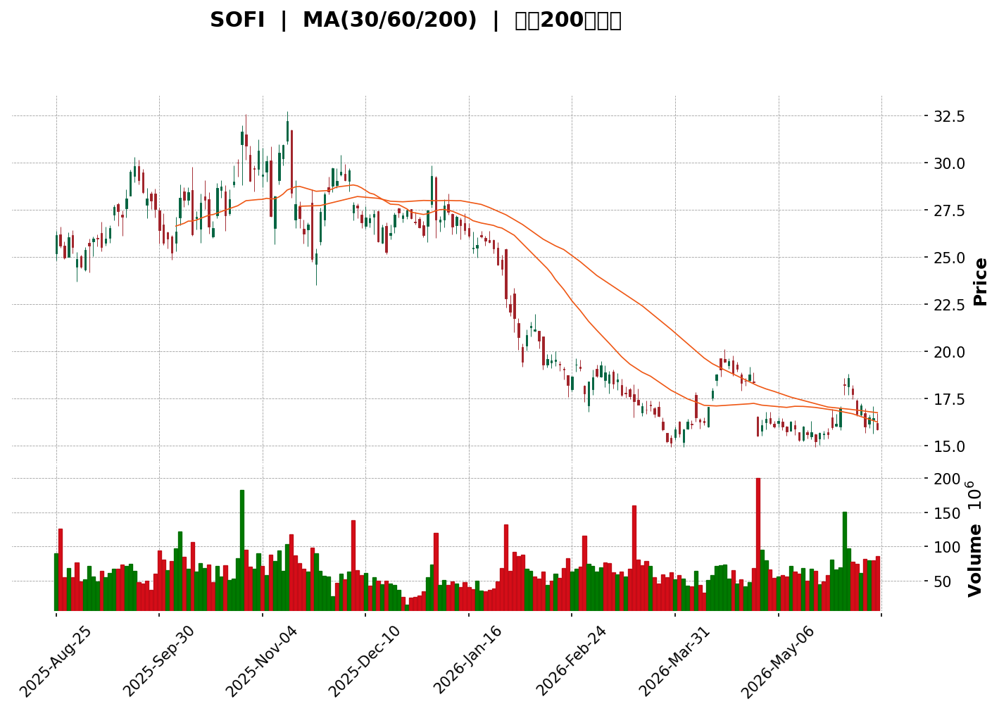
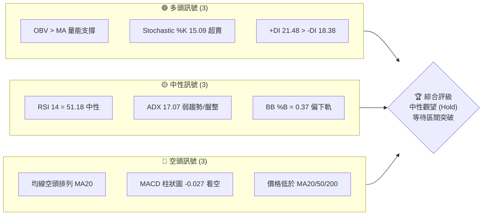
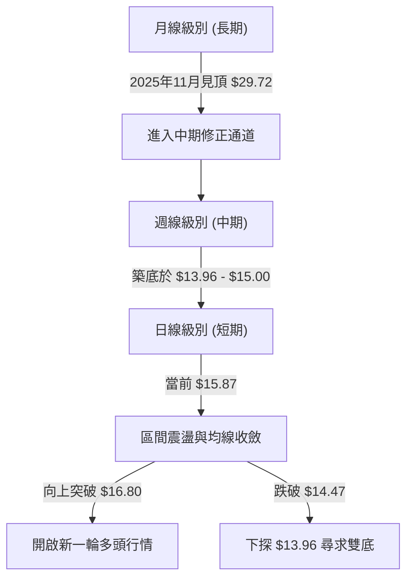
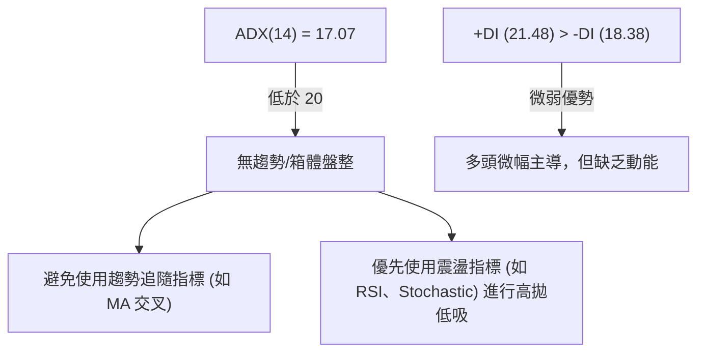
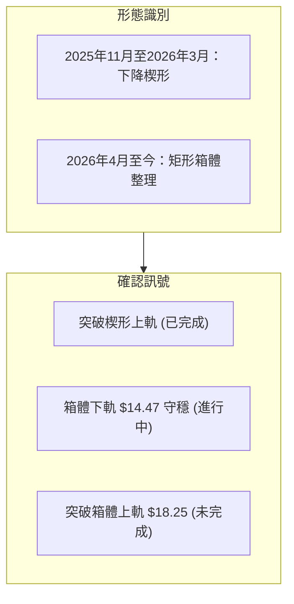

<details>
<summary>📊 靜態圖表 (點擊展開)</summary>

</details>

<html>
<head><meta charset="utf-8" /></head>
<body>
    <div style="height:500px; width:100%;">                        <script>window.PlotlyConfig = {MathJaxConfig: 'local'};</script>
        <script charset="utf-8" src="https://cdn.plot.ly/plotly-3.6.0.min.js" integrity="sha256-QaOVwtVY0T02VaHrr6pnoHLCwayMJp4O5n4YyaE3rJk=" crossorigin="anonymous"></script>                <div id="candlestick-chart" class="plotly-graph-div" style="height:100%; width:100%;"></div>            <script>                window.PLOTLYENV=window.PLOTLYENV || {};                                if (document.getElementById("candlestick-chart")) {                    Plotly.newPlot(                        "candlestick-chart",                        [{"close":{"dtype":"f8","bdata":"AAAAYGYmOkAAAABguJ45QAAAAIDC9ThAAAAAgD0KOkAAAACAPYo5QAAAAMD16DhAAAAAoHB9OEAAAACgR2E5QAAAAKCZmTlAAAAAgML1OUAAAADgUfg5QAAAAMAehTlAAAAAgML1OUAAAADAzIw6QAAAACCFqztAAAAAIIVrO0AAAAAA1yM7QAAAAAApHDxAAAAAYI+CPUAAAAAgXM89QAAAAEAKFz1AAAAA4KNwPEAAAABguB48QAAAAEDh+jtAAAAAwMyMO0AAAAAghWs6QAAAAGCPwjlAAAAA4FH4OUAAAACgcD05QAAAAAApXDpAAAAAANcjPEAAAADAHgU8QAAAAEAzczxAAAAA4KMwOkAAAAAA1yM7QAAAAGC43jtAAAAAIK4HPEAAAACgmZk6QAAAAIA9ijpAAAAAgBSuPEAAAAAAAMA8QAAAAOCjMDtAAAAA4HoUPEAAAABgjwI9QAAAAAAAAD5AAAAAwPWoP0AAAABgZuY+QAAAACCuBz1AAAAAgBSuPUAAAACgR6E+QAAAAGC4Xj1AAAAAgOsRPkAAAADA9Sg7QAAAAIDCNTxAAAAAgD2KPkAAAABAM\u002fM+QAAAAEDhGkBAAAAAANdjPEAAAACA69E7QAAAAIA9CjtAAAAAoHA9OkAAAADgUbg6QAAAAMD16DhAAAAA4KMwOUAAAABgZmY7QAAAAOB6VDxAAAAAoHB9PEAAAADgUbg9QAAAACCuBz1AAAAAYI+CPUAAAACA6xE9QAAAAKCZmT1AAAAAIK7HO0AAAAAAKZw7QAAAAOB61DpAAAAAQAoXO0AAAACA6xE7QAAAACCuRztAAAAAgOvROUAAAADgepQ6QAAAAMAeRTlAAAAAgD1KOkAAAACgcD07QAAAAKCZWTtAAAAA4KMwO0AAAABA4Xo7QAAAAIDrETtAAAAAgOvROkAAAAAgXI86QAAAAIAULjpAAAAAgMJ1O0AAAAAgrkc9QAAAAEDh+jpAAAAAAAAAO0AAAADgUbg7QAAAAGBmZjtAAAAAoJmZOkAAAAAA1yM7QAAAACCFqzpAAAAA4KNwOkAAAACgRyE6QAAAAKBwfTlAAAAAANejOUAAAABAChc6QAAAAKCZ2TlAAAAAwMzMOUAAAACAwnU5QAAAAKCZmThAAAAAAClcOEAAAAAgXM82QAAAAOB6FDZAAAAAYI\u002fCNUAAAAAAAMA0QAAAAIDCdTNAAAAAACncNEAAAACgmVk1QAAAAIAULjVAAAAAwMyMNEAAAADAzEwzQAAAAAApnDNAAAAAYI+CM0AAAACAPYozQAAAAMDMTDNAAAAAwB4FM0AAAADgUTgyQAAAAMD1qDJAAAAAgD1KM0AAAACgmRkzQAAAAGCPwjFAAAAAANdjMkAAAAAAKZwyQAAAAEAzszJAAAAAAABAM0AAAABgZuYyQAAAAIA9yjJAAAAAgD1KMkAAAAAgrocyQAAAAEAzszFAAAAAYI\u002fCMUAAAACgR6ExQAAAAGC4XjFAAAAAgBQuMUAAAADgehQxQAAAAGBm5jBAAAAAYGYmMUAAAABAM7MwQAAAACBcjzBAAAAAoHC9L0AAAACAwnUuQAAAAMDMTC5AAAAAYI\u002fCL0AAAABgj0IvQAAAAEAzsy9AAAAAwB5FMEAAAAAAKRwwQAAAAKBwfTBAAAAAwB5FMEAAAADgUTgwQAAAAMDMDDFAAAAAwPXoMUAAAACAPcoyQAAAACCuBzNAAAAAgBRuM0AAAAAAAIAzQAAAAOB61DJAAAAAIFwPM0AAAACA61EyQAAAAOCjcDJAAAAAYI\u002fCMkAAAAAAKVwyQAAAAMDMDC9AAAAAoJkZMEAAAACAFG4wQAAAAEAzMzBAAAAAwB4FMEAAAADAzEwwQAAAAAAAADBAAAAAAACAL0AAAABgj0IwQAAAAMDMzC9AAAAAYLieLkAAAADAHgUwQAAAAOBROC9AAAAAIIVrL0AAAACAwnUuQAAAAKBHYS9AAAAAwMxML0AAAACgcD0vQAAAAIDC9S9AAAAAIIUrMEAAAADgUfgwQAAAAOBRODJAAAAA4HqUMkAAAACgcL0xQAAAAIAUrjBAAAAAYGYmMUAAAAAgrgcwQAAAAAAAgDBAAAAA4FF4MEAAAACgcL0vQA=="},"high":{"dtype":"f8","bdata":"AAAAoEdhOkAAAABA4Zo6QAAAACBczzlAAAAA4HpUOkAAAAAghWs6QAAAACCuRzlAAAAAACkcOUAAAACAPYo5QAAAAOBR+DlAAAAAoJkZOkAAAADgozA6QAAAAEDh2jpAAAAAoJmZOkAAAADgo7A6QAAAAMAexTtAAAAAoEfhO0AAAACAwnU7QAAAAEC2kzxAAAAAoEehPUAAAADAzEw+QAAAAADXIz5AAAAAIIWrPUAAAAAghas8QAAAAEDhejxAAAAAoEehPEAAAAAAKZw7QAAAAOB6VDtAAAAAoJlZOkAAAACAFC46QAAAAADXIztAAAAAQArXPEAAAACAwrU8QAAAAOCjsDxAAAAAwMzMPUAAAACAFG47QAAAAKCZWTxAAAAAQAoXPUAAAADgo3A8QAAAACCF6zpAAAAAgBTuPEAAAACA6xE9QAAAAMDMzDxAAAAA4FGYPEAAAABguN49QAAAAEAzMz5AAAAAQOH6P0AAAADgUUhAQAAAAIA96j5AAAAAACncPUAAAADgUTg\u002fQAAAAIA9yj5AAAAAYLhePkAAAABg59s+QAAAAKBwPTxAAAAA4FH4PkAAAACgcP0+QAAAAKBwXUBAAAAAAADAP0AAAACA6xE9QAAAAEAz8ztAAAAAAAAAO0AAAACgmdk6QAAAAEAzkzxAAAAAgOtxOUAAAAAAKZw7QAAAAEAzczxAAAAAAABAPUAAAAAAAMA9QAAAAEAzsz1AAAAAIIVrPkAAAACAFO49QAAAAEAzsz1AAAAAgBTuO0AAAADgetQ7QAAAAEAzcztAAAAAgBSuO0AAAAAgrkc7QAAAAAAAgDtAAAAAQOF6O0AAAACgcL06QAAAAIDC1TpAAAAAQAq3OkAAAABguF47QAAAAGC4njtAAAAAQApXO0AAAACAPYo7QAAAAMDMjDtAAAAAwPVoO0AAAAAA1yM7QAAAAGBm5jpAAAAAoEeBO0AAAAAAKdw9QAAAAMDMTD1AAAAAgBQuO0AAAACAFA48QAAAAAAAYDxAAAAAYOVQO0AAAABAMzM7QAAAAIDCFTtAAAAA4HpUO0AAAAAgrsc6QAAAAEAKVzpAAAAAwMwMOkAAAAAA12M6QAAAAKBHITpAAAAAYGZmOkAAAACAFO45QAAAAIA9yjlAAAAAYLgeOUAAAADgUXg5QAAAAAAAADdAAAAAAClcN0AAAAAA18M1QAAAAGBmZjRAAAAAwPUoNUAAAABACpc1QAAAAAAAADZAAAAAoJkZNUAAAACAPco0QAAAAGC43jNAAAAAQArXM0AAAABgjwI0QAAAAEDhejNAAAAA4KMwM0AAAACgR8EyQAAAAIDCtTJAAAAAYLieM0AAAAAgXI8zQAAAAIDCNTJAAAAAwPVoMkAAAACAPQozQAAAACCuRzNAAAAAQOF6M0AAAABguD4zQAAAAIDr8TJAAAAAYGYGM0AAAACgmdkyQAAAAMDMjDJAAAAAYGYmMkAAAACA6xEyQAAAAKBHQTJAAAAAIK4HMkAAAAAghUsxQAAAAMByaDFAAAAAwPVoMUAAAACA6xExQAAAAEAKVzFAAAAAoHB9MEAAAACgR2EvQAAAAKBHIS9AAAAAYGYGMEAAAACA61EwQAAAACCuxy9AAAAAwMxsMEAAAABA4VowQAAAAKCZ2TFAAAAA4FF4MEAAAACgcH0wQAAAACBcDzFAAAAAQDMTMkAAAACA69EyQAAAAGC4njNAAAAAoEchNEAAAADAHqUzQAAAAMAexTNAAAAAILByM0AAAABgZuYyQAAAAEAzkzJAAAAAIIUrM0AAAABguN4yQAAAAEAKlzBAAAAAYLheMEAAAAAghcswQAAAACCuxzBAAAAAIFxPMEAAAACgR4EwQAAAAIDCdTBAAAAAwMwMMEAAAACA61EwQAAAAOB6VDBAAAAAIIVrL0AAAADgoxAwQAAAAIAUri9AAAAAgOtRMEAAAAAgrkcvQAAAAOCjcC9AAAAAgOuRL0AAAAAAKdwvQAAAAEAz8zBAAAAA4KOwMEAAAADgehQxQAAAAEAKlzJAAAAAIIXLMkAAAABA4ToyQAAAAEAKdzFAAAAAQOE6MUAAAACgcP0wQAAAAMD1qDBAAAAAoJkZMUAAAABgS7gwQA=="},"hovertemplate":"\u003cb\u003e%{x|%Y-%m-%d}\u003c\u002fb\u003e\u003cbr\u003e\u958b: $%{open:.2f}\u003cbr\u003e\u9ad8: $%{high:.2f}\u003cbr\u003e\u4f4e: $%{low:.2f}\u003cbr\u003e\u6536: $%{close:.2f}\u003cextra\u003e\u003c\u002fextra\u003e","low":{"dtype":"f8","bdata":"AAAAIFzPOEAAAAAAAIA5QAAAAKBH4ThAAAAAAAAAOUAAAACAwjU5QAAAAEAzszdAAAAAANdjOEAAAAAgsj04QAAAAIAULjhAAAAAwMwMOUAAAADAzIw5QAAAAMDMTDlAAAAAYLieOUAAAADAHsU5QAAAACBc7zpAAAAAoEehOkAAAACgRyE6QAAAAOB6FDtAAAAAoHA9PEAAAADgUfg8QAAAAKCZ2TxAAAAAoJlZPEAAAAAgXA87QAAAACBcjztAAAAAACkcO0AAAABAM7M5QAAAAADXozlAAAAAQDNzOUAAAABACtc4QAAAACBcTzlAAAAAgBSuOkAAAADAHqU7QAAAAAAAwDtAAAAAoEchOkAAAADgUXg6QAAAAAAAwDlAAAAAIFyPO0AAAAAAAEA6QAAAAGCPAjpAAAAAIFwPO0AAAABgZiY8QAAAAKBHYTpAAAAAoPEyO0AAAABAM7M8QAAAAMAeRT1AAAAAwMzMPEAAAAAA1yM+QAAAAEDh+jxAAAAAoHB9PEAAAADgelQ9QAAAAOCjsDxAAAAAYI8CPUAAAACgRyE7QAAAAMD1qDlAAAAAQArXPEAAAADgIts9QAAAAIDC9T5AAAAAYGYmPEAAAAAgroc6QAAAAMDMjDpAAAAAgMK1OUAAAAAgXI85QAAAAGC4vjhAAAAAwB6FN0AAAAAgrqc5QAAAAKBHoTpAAAAAIFxPPEAAAADgenQ8QAAAACCFqzxAAAAA4KNQPUAAAADAHgU9QAAAAEDhejxAAAAAgBTuOkAAAADAzAw7QAAAAMDMjDpAAAAAQOF6OkAAAACAFI46QAAAAEAzMzpAAAAAgD3KOUAAAADgUbg5QAAAACCFKzlAAAAAQDPzOUAAAAAgrkc6QAAAAKCZGTtAAAAAQDPTOkAAAAAgrgc7QAAAACCuBztAAAAAoHC9OkAAAACAPYo6QAAAACBcDzpAAAAAgD3KOUAAAACgmZk7QAAAACCuBzpAAAAAoHBdOkAAAACA65E6QAAAAEDhOjtAAAAAQDMzOkAAAADgUTg6QAAAACCF6zlAAAAAgMI1OkAAAABgjwI6QAAAAIDCNTlAAAAAQDPzOEAAAAAAAAA6QAAAAKCZmTlAAAAAwB7FOUAAAACAwjU5QAAAAIDrkThAAAAAwMwMOEAAAAAgXE82QAAAAAAp3DVAAAAAwB4FNUAAAACA6xE0QAAAAACqMTNAAAAAgD0KNEAAAADAzMw0QAAAAMDMDDVAAAAAANcjNEAAAACAPQozQAAAAGBmJjNAAAAAACkcM0AAAACgmTkzQAAAAOBR+DJAAAAAANeDMkAAAADgepQxQAAAAADX4zFAAAAAgBTuMkAAAADgUfgyQAAAACBcTzFAAAAAwMzMMEAAAADgo7AxQAAAAAApnDJAAAAAANejMkAAAABguB4yQAAAAMAexTFAAAAAgD0KMkAAAADgUfgxQAAAAGC4njFAAAAAIK6HMUAAAADgUXgxQAAAAEDhejBAAAAAwPUoMUAAAADgepQwQAAAACCFqzBAAAAAQArXMEAAAACgcH0wQAAAAMAehTBAAAAAACmcL0AAAADAzEwuQAAAAGC43i1AAAAAYLieLkAAAACgR+EuQAAAAAAp3C1AAAAAYI\u002fCL0AAAACA69EvQAAAAGCPQjBAAAAA4HrUL0AAAADgURgwQAAAACCF6y9AAAAAYGZmMUAAAAAghSsyQAAAAGBmpjJAAAAAANdjM0AAAABAChczQAAAAOCjsDJAAAAAwPXoMkAAAACAFO4xQAAAAIDAKjJAAAAAANdjMkAAAADAHkUyQAAAAAAAAC9AAAAA4HoUL0AAAAAAAMAvQAAAAKBHITBAAAAAoEfhL0AAAABA4fovQAAAAMD1qC9AAAAAgD0KL0AAAACAPYovQAAAAKCZGS9AAAAAgBRuLkAAAACAwnUuQAAAAGCPwi5AAAAAgBSuLkAAAABACtctQAAAACBcDy5AAAAAQDOzLkAAAADgUbguQAAAAOBRuC9AAAAAYI8CMEAAAAAA16MvQAAAAIAUrjFAAAAA4KOwMUAAAACAwnUxQAAAAOB6lDBAAAAAgMKVMEAAAAAAKVwvQAAAAMD16C9AAAAA4E9NL0AAAADA9agvQA=="},"name":"\u50f9\u683c","open":{"dtype":"f8","bdata":"AAAAgBQuOUAAAADgejQ6QAAAAKBwnTlAAAAAwB4FOUAAAADA9Sg6QAAAAAAAgDhAAAAAIFwPOUAAAADgelQ4QAAAAMAexTlAAAAAIFzPOUAAAADAHgU6QAAAAIA9SjpAAAAAYI\u002fCOUAAAAAAAAA6QAAAAAAAQDtAAAAAgD3KO0AAAAAAAEA7QAAAAEAKlztAAAAAANdDPEAAAADAzEw9QAAAAIAUzj1AAAAAAACAPUAAAABgj8I7QAAAAGC4XjxAAAAAAClcPEAAAADgUXg7QAAAAEDhujpAAAAA4HpUOkAAAACgmRk6QAAAAMAexTlAAAAAoJkZO0AAAACgcH08QAAAAIA9CjxAAAAAwMyMPEAAAACA6xE7QAAAAGCPgjpAAAAAQDMzPEAAAACA6xE8QAAAAKCZGTpAAAAAQDMzO0AAAAAgXI88QAAAAKBwfTxAAAAA4HpUO0AAAADgUdg8QAAAAAAAAD5AAAAAoHD9PkAAAABguH4\u002fQAAAACBcbz5AAAAA4KOwPUAAAADA9ag9QAAAACCFSz1AAAAAwB6FPUAAAAAAACA+QAAAAGBmhjpAAAAAIFwPPUAAAABguD4+QAAAAIAULj9AAAAAQOG6P0AAAAAAAAA7QAAAAIDCtTtAAAAAYI+COkAAAACgmXk6QAAAAKBH4TtAAAAAoEehOEAAAADgetQ5QAAAAEDh+jpAAAAAgMK1PEAAAACAPco8QAAAAOB61DxAAAAAANdjPUAAAADAzGw9QAAAAMD1CD1AAAAAoHBdO0AAAABA4bo7QAAAAKBwPTtAAAAAYGamOkAAAABACtc6QAAAAMAeJTtAAAAAIFxvO0AAAACgcL05QAAAAADXozpAAAAAgBQuOkAAAABguJ46QAAAAOBRmDtAAAAAgOsRO0AAAAAghSs7QAAAAIA9ijtAAAAAYLjeOkAAAAAgrgc7QAAAAIAUrjpAAAAAwPWoOkAAAAAgXM87QAAAAEDhOj1AAAAAoHDdOkAAAAAAAAA7QAAAAIAUzjtAAAAAgD1KO0AAAABAM7M6QAAAAAAAADtAAAAAIFzPOkAAAACAPYo6QAAAAOCjcDlAAAAAAACAOUAAAACAFC46QAAAAAAAADpAAAAAYGbmOUAAAABgZuY5QAAAAAAAgDlAAAAAoHDdOEAAAACAFG45QAAAAGCPgjZAAAAAwMwMN0AAAACgcH01QAAAAEDhOjRAAAAAgD1KNEAAAACAPUo1QAAAAEAKFzVAAAAAoJkZNUAAAACAPco0QAAAACCuRzNAAAAAwPVoM0AAAADgUXgzQAAAAOB6VDNAAAAAgMIVM0AAAABA4boyQAAAAAAAADJAAAAAIK5HM0AAAADgozAzQAAAAMD1KDJAAAAAwB4lMUAAAAAAAAAyQAAAACBcDzNAAAAAYGamMkAAAAAAKXwyQAAAAOB6VDJAAAAAIIXrMkAAAAAA12MyQAAAAOBRODJAAAAAwMzMMUAAAAAAAAAyQAAAAOBRuDFAAAAAgBRuMUAAAAAAAMAwQAAAAIA96jBAAAAAIK4nMUAAAABguP4wQAAAAIA9CjFAAAAAYGZGMEAAAABAClcvQAAAAAAp3C5AAAAAYGbmLkAAAABgZkYwQAAAAKBHYS5AAAAAIK7HL0AAAADA9SgwQAAAAIAUrjFAAAAAANdjMEAAAADAzEwwQAAAAAAAADBAAAAAIK6HMUAAAADgUXgyQAAAAGC4njNAAAAAoJmZM0AAAABgj0IzQAAAAGCPgjNAAAAAgD1KM0AAAADAHsUyQAAAAOCjcDJAAAAAQOF6MkAAAADAHmUyQAAAAMDMjDBAAAAAgD2KL0AAAAAAKTwwQAAAAOBReDBAAAAAIIUrMEAAAABAMzMwQAAAAGCPQjBAAAAAIK4HMEAAAACgmZkvQAAAAIDrETBAAAAAIIVrL0AAAABguJ4uQAAAAGBmZi9AAAAAgML1LkAAAACAwjUvQAAAAEDhui5AAAAAoHA9L0AAAABgZmYvQAAAAEDhejBAAAAAwMwMMEAAAADAHgUwQAAAAGCPQjJAAAAAYGYmMkAAAAAgrgcyQAAAAKBHYTFAAAAAwPWoMEAAAABA4bowQAAAAIAULjBAAAAAYGZmMEAAAACAwjUwQA=="},"x":["2025-08-25T00:00:00-04:00","2025-08-26T00:00:00-04:00","2025-08-27T00:00:00-04:00","2025-08-28T00:00:00-04:00","2025-08-29T00:00:00-04:00","2025-09-02T00:00:00-04:00","2025-09-03T00:00:00-04:00","2025-09-04T00:00:00-04:00","2025-09-05T00:00:00-04:00","2025-09-08T00:00:00-04:00","2025-09-09T00:00:00-04:00","2025-09-10T00:00:00-04:00","2025-09-11T00:00:00-04:00","2025-09-12T00:00:00-04:00","2025-09-15T00:00:00-04:00","2025-09-16T00:00:00-04:00","2025-09-17T00:00:00-04:00","2025-09-18T00:00:00-04:00","2025-09-19T00:00:00-04:00","2025-09-22T00:00:00-04:00","2025-09-23T00:00:00-04:00","2025-09-24T00:00:00-04:00","2025-09-25T00:00:00-04:00","2025-09-26T00:00:00-04:00","2025-09-29T00:00:00-04:00","2025-09-30T00:00:00-04:00","2025-10-01T00:00:00-04:00","2025-10-02T00:00:00-04:00","2025-10-03T00:00:00-04:00","2025-10-06T00:00:00-04:00","2025-10-07T00:00:00-04:00","2025-10-08T00:00:00-04:00","2025-10-09T00:00:00-04:00","2025-10-10T00:00:00-04:00","2025-10-13T00:00:00-04:00","2025-10-14T00:00:00-04:00","2025-10-15T00:00:00-04:00","2025-10-16T00:00:00-04:00","2025-10-17T00:00:00-04:00","2025-10-20T00:00:00-04:00","2025-10-21T00:00:00-04:00","2025-10-22T00:00:00-04:00","2025-10-23T00:00:00-04:00","2025-10-24T00:00:00-04:00","2025-10-27T00:00:00-04:00","2025-10-28T00:00:00-04:00","2025-10-29T00:00:00-04:00","2025-10-30T00:00:00-04:00","2025-10-31T00:00:00-04:00","2025-11-03T00:00:00-05:00","2025-11-04T00:00:00-05:00","2025-11-05T00:00:00-05:00","2025-11-06T00:00:00-05:00","2025-11-07T00:00:00-05:00","2025-11-10T00:00:00-05:00","2025-11-11T00:00:00-05:00","2025-11-12T00:00:00-05:00","2025-11-13T00:00:00-05:00","2025-11-14T00:00:00-05:00","2025-11-17T00:00:00-05:00","2025-11-18T00:00:00-05:00","2025-11-19T00:00:00-05:00","2025-11-20T00:00:00-05:00","2025-11-21T00:00:00-05:00","2025-11-24T00:00:00-05:00","2025-11-25T00:00:00-05:00","2025-11-26T00:00:00-05:00","2025-11-28T00:00:00-05:00","2025-12-01T00:00:00-05:00","2025-12-02T00:00:00-05:00","2025-12-03T00:00:00-05:00","2025-12-04T00:00:00-05:00","2025-12-05T00:00:00-05:00","2025-12-08T00:00:00-05:00","2025-12-09T00:00:00-05:00","2025-12-10T00:00:00-05:00","2025-12-11T00:00:00-05:00","2025-12-12T00:00:00-05:00","2025-12-15T00:00:00-05:00","2025-12-16T00:00:00-05:00","2025-12-17T00:00:00-05:00","2025-12-18T00:00:00-05:00","2025-12-19T00:00:00-05:00","2025-12-22T00:00:00-05:00","2025-12-23T00:00:00-05:00","2025-12-24T00:00:00-05:00","2025-12-26T00:00:00-05:00","2025-12-29T00:00:00-05:00","2025-12-30T00:00:00-05:00","2025-12-31T00:00:00-05:00","2026-01-02T00:00:00-05:00","2026-01-05T00:00:00-05:00","2026-01-06T00:00:00-05:00","2026-01-07T00:00:00-05:00","2026-01-08T00:00:00-05:00","2026-01-09T00:00:00-05:00","2026-01-12T00:00:00-05:00","2026-01-13T00:00:00-05:00","2026-01-14T00:00:00-05:00","2026-01-15T00:00:00-05:00","2026-01-16T00:00:00-05:00","2026-01-20T00:00:00-05:00","2026-01-21T00:00:00-05:00","2026-01-22T00:00:00-05:00","2026-01-23T00:00:00-05:00","2026-01-26T00:00:00-05:00","2026-01-27T00:00:00-05:00","2026-01-28T00:00:00-05:00","2026-01-29T00:00:00-05:00","2026-01-30T00:00:00-05:00","2026-02-02T00:00:00-05:00","2026-02-03T00:00:00-05:00","2026-02-04T00:00:00-05:00","2026-02-05T00:00:00-05:00","2026-02-06T00:00:00-05:00","2026-02-09T00:00:00-05:00","2026-02-10T00:00:00-05:00","2026-02-11T00:00:00-05:00","2026-02-12T00:00:00-05:00","2026-02-13T00:00:00-05:00","2026-02-17T00:00:00-05:00","2026-02-18T00:00:00-05:00","2026-02-19T00:00:00-05:00","2026-02-20T00:00:00-05:00","2026-02-23T00:00:00-05:00","2026-02-24T00:00:00-05:00","2026-02-25T00:00:00-05:00","2026-02-26T00:00:00-05:00","2026-02-27T00:00:00-05:00","2026-03-02T00:00:00-05:00","2026-03-03T00:00:00-05:00","2026-03-04T00:00:00-05:00","2026-03-05T00:00:00-05:00","2026-03-06T00:00:00-05:00","2026-03-09T00:00:00-04:00","2026-03-10T00:00:00-04:00","2026-03-11T00:00:00-04:00","2026-03-12T00:00:00-04:00","2026-03-13T00:00:00-04:00","2026-03-16T00:00:00-04:00","2026-03-17T00:00:00-04:00","2026-03-18T00:00:00-04:00","2026-03-19T00:00:00-04:00","2026-03-20T00:00:00-04:00","2026-03-23T00:00:00-04:00","2026-03-24T00:00:00-04:00","2026-03-25T00:00:00-04:00","2026-03-26T00:00:00-04:00","2026-03-27T00:00:00-04:00","2026-03-30T00:00:00-04:00","2026-03-31T00:00:00-04:00","2026-04-01T00:00:00-04:00","2026-04-02T00:00:00-04:00","2026-04-06T00:00:00-04:00","2026-04-07T00:00:00-04:00","2026-04-08T00:00:00-04:00","2026-04-09T00:00:00-04:00","2026-04-10T00:00:00-04:00","2026-04-13T00:00:00-04:00","2026-04-14T00:00:00-04:00","2026-04-15T00:00:00-04:00","2026-04-16T00:00:00-04:00","2026-04-17T00:00:00-04:00","2026-04-20T00:00:00-04:00","2026-04-21T00:00:00-04:00","2026-04-22T00:00:00-04:00","2026-04-23T00:00:00-04:00","2026-04-24T00:00:00-04:00","2026-04-27T00:00:00-04:00","2026-04-28T00:00:00-04:00","2026-04-29T00:00:00-04:00","2026-04-30T00:00:00-04:00","2026-05-01T00:00:00-04:00","2026-05-04T00:00:00-04:00","2026-05-05T00:00:00-04:00","2026-05-06T00:00:00-04:00","2026-05-07T00:00:00-04:00","2026-05-08T00:00:00-04:00","2026-05-11T00:00:00-04:00","2026-05-12T00:00:00-04:00","2026-05-13T00:00:00-04:00","2026-05-14T00:00:00-04:00","2026-05-15T00:00:00-04:00","2026-05-18T00:00:00-04:00","2026-05-19T00:00:00-04:00","2026-05-20T00:00:00-04:00","2026-05-21T00:00:00-04:00","2026-05-22T00:00:00-04:00","2026-05-26T00:00:00-04:00","2026-05-27T00:00:00-04:00","2026-05-28T00:00:00-04:00","2026-05-29T00:00:00-04:00","2026-06-01T00:00:00-04:00","2026-06-02T00:00:00-04:00","2026-06-03T00:00:00-04:00","2026-06-04T00:00:00-04:00","2026-06-05T00:00:00-04:00","2026-06-08T00:00:00-04:00","2026-06-09T00:00:00-04:00","2026-06-10T00:00:00-04:00"],"type":"candlestick"},{"hovertemplate":"MA30: $%{y:.2f}\u003cextra\u003e\u003c\u002fextra\u003e","line":{"color":"#2196F3","dash":"dash","width":2},"mode":"lines","name":"MA30","x":["2025-08-25T00:00:00-04:00","2025-08-26T00:00:00-04:00","2025-08-27T00:00:00-04:00","2025-08-28T00:00:00-04:00","2025-08-29T00:00:00-04:00","2025-09-02T00:00:00-04:00","2025-09-03T00:00:00-04:00","2025-09-04T00:00:00-04:00","2025-09-05T00:00:00-04:00","2025-09-08T00:00:00-04:00","2025-09-09T00:00:00-04:00","2025-09-10T00:00:00-04:00","2025-09-11T00:00:00-04:00","2025-09-12T00:00:00-04:00","2025-09-15T00:00:00-04:00","2025-09-16T00:00:00-04:00","2025-09-17T00:00:00-04:00","2025-09-18T00:00:00-04:00","2025-09-19T00:00:00-04:00","2025-09-22T00:00:00-04:00","2025-09-23T00:00:00-04:00","2025-09-24T00:00:00-04:00","2025-09-25T00:00:00-04:00","2025-09-26T00:00:00-04:00","2025-09-29T00:00:00-04:00","2025-09-30T00:00:00-04:00","2025-10-01T00:00:00-04:00","2025-10-02T00:00:00-04:00","2025-10-03T00:00:00-04:00","2025-10-06T00:00:00-04:00","2025-10-07T00:00:00-04:00","2025-10-08T00:00:00-04:00","2025-10-09T00:00:00-04:00","2025-10-10T00:00:00-04:00","2025-10-13T00:00:00-04:00","2025-10-14T00:00:00-04:00","2025-10-15T00:00:00-04:00","2025-10-16T00:00:00-04:00","2025-10-17T00:00:00-04:00","2025-10-20T00:00:00-04:00","2025-10-21T00:00:00-04:00","2025-10-22T00:00:00-04:00","2025-10-23T00:00:00-04:00","2025-10-24T00:00:00-04:00","2025-10-27T00:00:00-04:00","2025-10-28T00:00:00-04:00","2025-10-29T00:00:00-04:00","2025-10-30T00:00:00-04:00","2025-10-31T00:00:00-04:00","2025-11-03T00:00:00-05:00","2025-11-04T00:00:00-05:00","2025-11-05T00:00:00-05:00","2025-11-06T00:00:00-05:00","2025-11-07T00:00:00-05:00","2025-11-10T00:00:00-05:00","2025-11-11T00:00:00-05:00","2025-11-12T00:00:00-05:00","2025-11-13T00:00:00-05:00","2025-11-14T00:00:00-05:00","2025-11-17T00:00:00-05:00","2025-11-18T00:00:00-05:00","2025-11-19T00:00:00-05:00","2025-11-20T00:00:00-05:00","2025-11-21T00:00:00-05:00","2025-11-24T00:00:00-05:00","2025-11-25T00:00:00-05:00","2025-11-26T00:00:00-05:00","2025-11-28T00:00:00-05:00","2025-12-01T00:00:00-05:00","2025-12-02T00:00:00-05:00","2025-12-03T00:00:00-05:00","2025-12-04T00:00:00-05:00","2025-12-05T00:00:00-05:00","2025-12-08T00:00:00-05:00","2025-12-09T00:00:00-05:00","2025-12-10T00:00:00-05:00","2025-12-11T00:00:00-05:00","2025-12-12T00:00:00-05:00","2025-12-15T00:00:00-05:00","2025-12-16T00:00:00-05:00","2025-12-17T00:00:00-05:00","2025-12-18T00:00:00-05:00","2025-12-19T00:00:00-05:00","2025-12-22T00:00:00-05:00","2025-12-23T00:00:00-05:00","2025-12-24T00:00:00-05:00","2025-12-26T00:00:00-05:00","2025-12-29T00:00:00-05:00","2025-12-30T00:00:00-05:00","2025-12-31T00:00:00-05:00","2026-01-02T00:00:00-05:00","2026-01-05T00:00:00-05:00","2026-01-06T00:00:00-05:00","2026-01-07T00:00:00-05:00","2026-01-08T00:00:00-05:00","2026-01-09T00:00:00-05:00","2026-01-12T00:00:00-05:00","2026-01-13T00:00:00-05:00","2026-01-14T00:00:00-05:00","2026-01-15T00:00:00-05:00","2026-01-16T00:00:00-05:00","2026-01-20T00:00:00-05:00","2026-01-21T00:00:00-05:00","2026-01-22T00:00:00-05:00","2026-01-23T00:00:00-05:00","2026-01-26T00:00:00-05:00","2026-01-27T00:00:00-05:00","2026-01-28T00:00:00-05:00","2026-01-29T00:00:00-05:00","2026-01-30T00:00:00-05:00","2026-02-02T00:00:00-05:00","2026-02-03T00:00:00-05:00","2026-02-04T00:00:00-05:00","2026-02-05T00:00:00-05:00","2026-02-06T00:00:00-05:00","2026-02-09T00:00:00-05:00","2026-02-10T00:00:00-05:00","2026-02-11T00:00:00-05:00","2026-02-12T00:00:00-05:00","2026-02-13T00:00:00-05:00","2026-02-17T00:00:00-05:00","2026-02-18T00:00:00-05:00","2026-02-19T00:00:00-05:00","2026-02-20T00:00:00-05:00","2026-02-23T00:00:00-05:00","2026-02-24T00:00:00-05:00","2026-02-25T00:00:00-05:00","2026-02-26T00:00:00-05:00","2026-02-27T00:00:00-05:00","2026-03-02T00:00:00-05:00","2026-03-03T00:00:00-05:00","2026-03-04T00:00:00-05:00","2026-03-05T00:00:00-05:00","2026-03-06T00:00:00-05:00","2026-03-09T00:00:00-04:00","2026-03-10T00:00:00-04:00","2026-03-11T00:00:00-04:00","2026-03-12T00:00:00-04:00","2026-03-13T00:00:00-04:00","2026-03-16T00:00:00-04:00","2026-03-17T00:00:00-04:00","2026-03-18T00:00:00-04:00","2026-03-19T00:00:00-04:00","2026-03-20T00:00:00-04:00","2026-03-23T00:00:00-04:00","2026-03-24T00:00:00-04:00","2026-03-25T00:00:00-04:00","2026-03-26T00:00:00-04:00","2026-03-27T00:00:00-04:00","2026-03-30T00:00:00-04:00","2026-03-31T00:00:00-04:00","2026-04-01T00:00:00-04:00","2026-04-02T00:00:00-04:00","2026-04-06T00:00:00-04:00","2026-04-07T00:00:00-04:00","2026-04-08T00:00:00-04:00","2026-04-09T00:00:00-04:00","2026-04-10T00:00:00-04:00","2026-04-13T00:00:00-04:00","2026-04-14T00:00:00-04:00","2026-04-15T00:00:00-04:00","2026-04-16T00:00:00-04:00","2026-04-17T00:00:00-04:00","2026-04-20T00:00:00-04:00","2026-04-21T00:00:00-04:00","2026-04-22T00:00:00-04:00","2026-04-23T00:00:00-04:00","2026-04-24T00:00:00-04:00","2026-04-27T00:00:00-04:00","2026-04-28T00:00:00-04:00","2026-04-29T00:00:00-04:00","2026-04-30T00:00:00-04:00","2026-05-01T00:00:00-04:00","2026-05-04T00:00:00-04:00","2026-05-05T00:00:00-04:00","2026-05-06T00:00:00-04:00","2026-05-07T00:00:00-04:00","2026-05-08T00:00:00-04:00","2026-05-11T00:00:00-04:00","2026-05-12T00:00:00-04:00","2026-05-13T00:00:00-04:00","2026-05-14T00:00:00-04:00","2026-05-15T00:00:00-04:00","2026-05-18T00:00:00-04:00","2026-05-19T00:00:00-04:00","2026-05-20T00:00:00-04:00","2026-05-21T00:00:00-04:00","2026-05-22T00:00:00-04:00","2026-05-26T00:00:00-04:00","2026-05-27T00:00:00-04:00","2026-05-28T00:00:00-04:00","2026-05-29T00:00:00-04:00","2026-06-01T00:00:00-04:00","2026-06-02T00:00:00-04:00","2026-06-03T00:00:00-04:00","2026-06-04T00:00:00-04:00","2026-06-05T00:00:00-04:00","2026-06-08T00:00:00-04:00","2026-06-09T00:00:00-04:00","2026-06-10T00:00:00-04:00"],"y":{"dtype":"f8","bdata":"AAAAAAAA+H8AAAAAAAD4fwAAAAAAAPh\u002fAAAAAAAA+H8AAAAAAAD4fwAAAAAAAPh\u002fAAAAAAAA+H8AAAAAAAD4fwAAAAAAAPh\u002fAAAAAAAA+H8AAAAAAAD4fwAAAAAAAPh\u002fAAAAAAAA+H8AAAAAAAD4fwAAAAAAAPh\u002fAAAAAAAA+H8AAAAAAAD4fwAAAAAAAPh\u002fAAAAAAAA+H8AAAAAAAD4fwAAAAAAAPh\u002fAAAAAAAA+H8AAAAAAAD4fwAAAAAAAPh\u002fAAAAAAAA+H8AAAAAAAD4fwAAAAAAAPh\u002fAAAAAAAA+H8AAAAAAAD4f6uqqmoupDpAMzMzoym1OkBERESEpMk6QKuqqops5zpAiYiIOLToOkCJiIh4W\u002fY6QBEREbGdDztAERER8dItO0AzMzMTPDg7QJqZmYlBQDtAiYiIeHdXO0CamZl5MG87QFVVVaVwfTtAvLu724ePO0AAAADQhaQ7QGZmZsZnuDtAIiIiMpbcO0CrqqoKrPw7QAAAANCFBDxA7+7uLvkFPEAAAACA+Aw8QLy7uytcDzxAVVVV9UQdPEDe3d3NExU8QO\u002fu7j4KFzxAERERAY4wPEARERHxNVc8QN7d3S1AjjxAAAAAwOaiPECJiIjY6rg8QERERFS4vjxAd3d3t4GuPEAiIiLSaaM8QCIiIpI0hTxAmpmZCax8PEBEREQE5H48QGZmZubQgjxAiYiIyL2GPEBmZmaGXaE8QDMzMwOdtjxAzczMLLK9PECamZk5bcA8QDMzM\u002fP91DxAd3d3l27SPEDv7u4+fMY8QGZmZkZvqzxAVVVV9W+EPEAiIiIywWM8QDMzM0PSVDxAZmZm9uEzPECrqqqaUhE8QERERARW7jtAvLu7exTOO0Dv7u4+w847QM3MzIxsxztAzczMXNaqO0B3d3cHOo07QHd3d4ddYTtAAAAA0PdTO0DNzMxMN0k7QJqZmZngQTtAq6qquklMO0AzMzMjImI7QO\u002fu7h7McztAAAAAID6DO0DNzMws+YU7QO\u002fu7o4JfjtAq6qqyuhtO0AiIiKy5Fc7QCIiIjLBQztA3t3drY4pO0BmZmYmeBA7QHd3d7dl7TpAAAAA0CLbOkAiIiJSKs46QKuqqnrNxTpA3t3dbcu6OkBERERUDq06QHd3d8cvljpAzczMXLqJOkC8u7urjmk6QCIiIgJWTjpAIiIiEq4nOkAzMzNzTPA5QKuqqnr4rDlAIiIiYvR2OUAiIiIypUI5QLy7u0tiEDlAVVVVReHaOEDv7u6O7Zw4QM3MzCzdZDhAMzMzIwYhOECJiIjI6M03QBEREZFfjDdA3t3d\u002fUZIN0DNzMzsNfc2QKuqqhqhrDZAq6qqKkBuNkBVVVWFpCk2QERERFSc3TVAVVVV1eqYNUBVVVUlv1g1QKuqqirOHjVAAAAAAEfoNEBEREQ07Ko0QGZmZmatbjRA7+7ujpcuNEDv7u6+dPMzQHd3d3eTuDNAvLu7i0GAM0CamZmpDVQzQDMzM4PcKzNAmpmZWccEM0DNzMwcduUyQFVVVbWdzzJAZmZmFvWvMkAiIiICR4gyQGZmZnbaYDJAERER2eo4MkBERETMLxYyQO\u002fu7sYg8DFAvLu76ybRMUDNzMxkya8xQJqZmcFYkjFAIiIiSuF6MUBVVVXt32gxQFVVVX1bVjFAq6qqMpY8MUBVVVW9AiQxQAAAALjzHTFAzczMJNsZMUBERERcZBsxQJqZmUE1HjFAEREReb4fMUCamZkx3SQxQKuqqpI0JTFAERERqcYrMUAAAADo+ykxQN7d3XVMMDFAZmZm\u002ftQ4MUDNzMy0Dz8xQFVVVT1RLzFAmpmZ8RkmMUB3d3f\u002fjSAxQLy7u9OUGjFAZmZmTvAQMUBVVVV9hg0xQO\u002fu7ia\u002fCDFAIiIiArkHMUBEREQUgxAxQKuqqnrpFjFAvLu7SwwSMUC8u7tDYBUxQJqZmflTEzFAq6qqoowOMUBmZmY+CgcxQN7d3Z02ADFARERENOz6MEBERER8zfUwQBEREQms7DBAq6qq8tLdMEAAAAAYS84wQGZmZp5hxzBAvLu7wyDAMEBERET8G7EwQFVVVT3DnjBAAAAAyHaOMEC8u7sz7HowQM3MzDReajBAd3d3n9NWMEAiIiIilEEwQA=="},"type":"scatter"},{"hovertemplate":"MA60: $%{y:.2f}\u003cextra\u003e\u003c\u002fextra\u003e","line":{"color":"#9C27B0","dash":"dash","width":2},"mode":"lines","name":"MA60","x":["2025-08-25T00:00:00-04:00","2025-08-26T00:00:00-04:00","2025-08-27T00:00:00-04:00","2025-08-28T00:00:00-04:00","2025-08-29T00:00:00-04:00","2025-09-02T00:00:00-04:00","2025-09-03T00:00:00-04:00","2025-09-04T00:00:00-04:00","2025-09-05T00:00:00-04:00","2025-09-08T00:00:00-04:00","2025-09-09T00:00:00-04:00","2025-09-10T00:00:00-04:00","2025-09-11T00:00:00-04:00","2025-09-12T00:00:00-04:00","2025-09-15T00:00:00-04:00","2025-09-16T00:00:00-04:00","2025-09-17T00:00:00-04:00","2025-09-18T00:00:00-04:00","2025-09-19T00:00:00-04:00","2025-09-22T00:00:00-04:00","2025-09-23T00:00:00-04:00","2025-09-24T00:00:00-04:00","2025-09-25T00:00:00-04:00","2025-09-26T00:00:00-04:00","2025-09-29T00:00:00-04:00","2025-09-30T00:00:00-04:00","2025-10-01T00:00:00-04:00","2025-10-02T00:00:00-04:00","2025-10-03T00:00:00-04:00","2025-10-06T00:00:00-04:00","2025-10-07T00:00:00-04:00","2025-10-08T00:00:00-04:00","2025-10-09T00:00:00-04:00","2025-10-10T00:00:00-04:00","2025-10-13T00:00:00-04:00","2025-10-14T00:00:00-04:00","2025-10-15T00:00:00-04:00","2025-10-16T00:00:00-04:00","2025-10-17T00:00:00-04:00","2025-10-20T00:00:00-04:00","2025-10-21T00:00:00-04:00","2025-10-22T00:00:00-04:00","2025-10-23T00:00:00-04:00","2025-10-24T00:00:00-04:00","2025-10-27T00:00:00-04:00","2025-10-28T00:00:00-04:00","2025-10-29T00:00:00-04:00","2025-10-30T00:00:00-04:00","2025-10-31T00:00:00-04:00","2025-11-03T00:00:00-05:00","2025-11-04T00:00:00-05:00","2025-11-05T00:00:00-05:00","2025-11-06T00:00:00-05:00","2025-11-07T00:00:00-05:00","2025-11-10T00:00:00-05:00","2025-11-11T00:00:00-05:00","2025-11-12T00:00:00-05:00","2025-11-13T00:00:00-05:00","2025-11-14T00:00:00-05:00","2025-11-17T00:00:00-05:00","2025-11-18T00:00:00-05:00","2025-11-19T00:00:00-05:00","2025-11-20T00:00:00-05:00","2025-11-21T00:00:00-05:00","2025-11-24T00:00:00-05:00","2025-11-25T00:00:00-05:00","2025-11-26T00:00:00-05:00","2025-11-28T00:00:00-05:00","2025-12-01T00:00:00-05:00","2025-12-02T00:00:00-05:00","2025-12-03T00:00:00-05:00","2025-12-04T00:00:00-05:00","2025-12-05T00:00:00-05:00","2025-12-08T00:00:00-05:00","2025-12-09T00:00:00-05:00","2025-12-10T00:00:00-05:00","2025-12-11T00:00:00-05:00","2025-12-12T00:00:00-05:00","2025-12-15T00:00:00-05:00","2025-12-16T00:00:00-05:00","2025-12-17T00:00:00-05:00","2025-12-18T00:00:00-05:00","2025-12-19T00:00:00-05:00","2025-12-22T00:00:00-05:00","2025-12-23T00:00:00-05:00","2025-12-24T00:00:00-05:00","2025-12-26T00:00:00-05:00","2025-12-29T00:00:00-05:00","2025-12-30T00:00:00-05:00","2025-12-31T00:00:00-05:00","2026-01-02T00:00:00-05:00","2026-01-05T00:00:00-05:00","2026-01-06T00:00:00-05:00","2026-01-07T00:00:00-05:00","2026-01-08T00:00:00-05:00","2026-01-09T00:00:00-05:00","2026-01-12T00:00:00-05:00","2026-01-13T00:00:00-05:00","2026-01-14T00:00:00-05:00","2026-01-15T00:00:00-05:00","2026-01-16T00:00:00-05:00","2026-01-20T00:00:00-05:00","2026-01-21T00:00:00-05:00","2026-01-22T00:00:00-05:00","2026-01-23T00:00:00-05:00","2026-01-26T00:00:00-05:00","2026-01-27T00:00:00-05:00","2026-01-28T00:00:00-05:00","2026-01-29T00:00:00-05:00","2026-01-30T00:00:00-05:00","2026-02-02T00:00:00-05:00","2026-02-03T00:00:00-05:00","2026-02-04T00:00:00-05:00","2026-02-05T00:00:00-05:00","2026-02-06T00:00:00-05:00","2026-02-09T00:00:00-05:00","2026-02-10T00:00:00-05:00","2026-02-11T00:00:00-05:00","2026-02-12T00:00:00-05:00","2026-02-13T00:00:00-05:00","2026-02-17T00:00:00-05:00","2026-02-18T00:00:00-05:00","2026-02-19T00:00:00-05:00","2026-02-20T00:00:00-05:00","2026-02-23T00:00:00-05:00","2026-02-24T00:00:00-05:00","2026-02-25T00:00:00-05:00","2026-02-26T00:00:00-05:00","2026-02-27T00:00:00-05:00","2026-03-02T00:00:00-05:00","2026-03-03T00:00:00-05:00","2026-03-04T00:00:00-05:00","2026-03-05T00:00:00-05:00","2026-03-06T00:00:00-05:00","2026-03-09T00:00:00-04:00","2026-03-10T00:00:00-04:00","2026-03-11T00:00:00-04:00","2026-03-12T00:00:00-04:00","2026-03-13T00:00:00-04:00","2026-03-16T00:00:00-04:00","2026-03-17T00:00:00-04:00","2026-03-18T00:00:00-04:00","2026-03-19T00:00:00-04:00","2026-03-20T00:00:00-04:00","2026-03-23T00:00:00-04:00","2026-03-24T00:00:00-04:00","2026-03-25T00:00:00-04:00","2026-03-26T00:00:00-04:00","2026-03-27T00:00:00-04:00","2026-03-30T00:00:00-04:00","2026-03-31T00:00:00-04:00","2026-04-01T00:00:00-04:00","2026-04-02T00:00:00-04:00","2026-04-06T00:00:00-04:00","2026-04-07T00:00:00-04:00","2026-04-08T00:00:00-04:00","2026-04-09T00:00:00-04:00","2026-04-10T00:00:00-04:00","2026-04-13T00:00:00-04:00","2026-04-14T00:00:00-04:00","2026-04-15T00:00:00-04:00","2026-04-16T00:00:00-04:00","2026-04-17T00:00:00-04:00","2026-04-20T00:00:00-04:00","2026-04-21T00:00:00-04:00","2026-04-22T00:00:00-04:00","2026-04-23T00:00:00-04:00","2026-04-24T00:00:00-04:00","2026-04-27T00:00:00-04:00","2026-04-28T00:00:00-04:00","2026-04-29T00:00:00-04:00","2026-04-30T00:00:00-04:00","2026-05-01T00:00:00-04:00","2026-05-04T00:00:00-04:00","2026-05-05T00:00:00-04:00","2026-05-06T00:00:00-04:00","2026-05-07T00:00:00-04:00","2026-05-08T00:00:00-04:00","2026-05-11T00:00:00-04:00","2026-05-12T00:00:00-04:00","2026-05-13T00:00:00-04:00","2026-05-14T00:00:00-04:00","2026-05-15T00:00:00-04:00","2026-05-18T00:00:00-04:00","2026-05-19T00:00:00-04:00","2026-05-20T00:00:00-04:00","2026-05-21T00:00:00-04:00","2026-05-22T00:00:00-04:00","2026-05-26T00:00:00-04:00","2026-05-27T00:00:00-04:00","2026-05-28T00:00:00-04:00","2026-05-29T00:00:00-04:00","2026-06-01T00:00:00-04:00","2026-06-02T00:00:00-04:00","2026-06-03T00:00:00-04:00","2026-06-04T00:00:00-04:00","2026-06-05T00:00:00-04:00","2026-06-08T00:00:00-04:00","2026-06-09T00:00:00-04:00","2026-06-10T00:00:00-04:00"],"y":{"dtype":"f8","bdata":"AAAAAAAA+H8AAAAAAAD4fwAAAAAAAPh\u002fAAAAAAAA+H8AAAAAAAD4fwAAAAAAAPh\u002fAAAAAAAA+H8AAAAAAAD4fwAAAAAAAPh\u002fAAAAAAAA+H8AAAAAAAD4fwAAAAAAAPh\u002fAAAAAAAA+H8AAAAAAAD4fwAAAAAAAPh\u002fAAAAAAAA+H8AAAAAAAD4fwAAAAAAAPh\u002fAAAAAAAA+H8AAAAAAAD4fwAAAAAAAPh\u002fAAAAAAAA+H8AAAAAAAD4fwAAAAAAAPh\u002fAAAAAAAA+H8AAAAAAAD4fwAAAAAAAPh\u002fAAAAAAAA+H8AAAAAAAD4fwAAAAAAAPh\u002fAAAAAAAA+H8AAAAAAAD4fwAAAAAAAPh\u002fAAAAAAAA+H8AAAAAAAD4fwAAAAAAAPh\u002fAAAAAAAA+H8AAAAAAAD4fwAAAAAAAPh\u002fAAAAAAAA+H8AAAAAAAD4fwAAAAAAAPh\u002fAAAAAAAA+H8AAAAAAAD4fwAAAAAAAPh\u002fAAAAAAAA+H8AAAAAAAD4fwAAAAAAAPh\u002fAAAAAAAA+H8AAAAAAAD4fwAAAAAAAPh\u002fAAAAAAAA+H8AAAAAAAD4fwAAAAAAAPh\u002fAAAAAAAA+H8AAAAAAAD4fwAAAAAAAPh\u002fAAAAAAAA+H8AAAAAAAD4f3d3d19zsTtAVVVVrdWxO0AzMzMrh7Y7QGZmZo5QtjtAERERIbCyO0BmZma+n7o7QLy7u0s3yTtAzczMXEjaO0DNzMzMzOw7QGZmZkZv+ztAq6qq0pQKPECamZnZzhc8QEREREw3KTxAmpmZOfswPEB3d3cHgTU8QGZmZobrMTxAvLu7E4MwPEBmZmaeNjA8QJqZmQmsLDxAq6qqku0cPEBVVVWNJQ88QAAAABjZ\u002fjtAiYiIuKz1O0BmZmaG6\u002fE7QN7d3WU77ztA7+7uLrLtO0BERET8N\u002fI7QKuqqtrO9ztAAAAASG\u002f7O0CrqqoSEQE8QO\u002fu7nZMADxAERERuWX9O0Crqqr6xQI8QImIiFiA\u002fDtAzczMFPX\u002fO0CJiIiYbgI8QKuqqjptADxAmpmZSVP6O0BEREQcofw7QKuqqhov\u002fTtAVVVVbaDzO0AAAACwcug7QFVVVdUx4TtAvLu7s8jWO0CJiIhIU8o7QImIiGCeuDtAmpmZsZ2fO0AzMzPDZ4g7QFVVVQWBdTtAmpmZKc5eO0AzMzOjcD07QDMzMwNWHjtA7+7uRuH6OkARERHZh986QLy7u4MyujpAd3d3X+WQOkDNzMyc72c6QJqZmenfODpAq6qqimwXOkDe3d1tEvM5QDMzM+Ne0zlA7+7u7qe2OUDe3d11BZg5QAAAANgVgDlA7+7ujsJlOUDNzMyMlz45QM3MzFRVFTlAq6qqehTuOEC8u7ubxMA4QDMzM8OukDhAmpmZwTxhOEDe3d2lmzQ4QBEREfEZBjhAAAAA6LThN0AzMzNDi7w3QImIiHA9mjdAZmZmfrF0N0CamZmJQVA3QHd3d59hJzdARERE9P0EN0Crqqoqzt42QKuqqkIZvTZA3t3dtTqWNkAAAABI4Wo2QAAAABhLPjZAREREvHQTNkAiIiIaduU1QBEREWGeuDVAMzMzD+aJNUCamZmtjlk1QN7d3fl+KjVAd3d3hxb5NECrqqoW2b40QFVVVSlcjzRAAAAAJJRhNEARERHtCjA0QAAAAEx+ATRAq6qqLmvVM0BVVVWh06YzQCIiIgbIfTNAERER\u002fWJZM0DNzMzAETozQCIiIraBHjNAiYiIvAIEM0Dv7u6y5OcyQImIiPzwyTJAAAAAHC+tMkB3d3dTuI4yQKuqqvZvdDJAERERRYtcMkAzMzOvjkkyQEREROCWLTJAmpmZpXAVMkAiIiIOAgMyQImIiEQZ9TFAZmZmsnLgMUC8u7u\u002f5soxQKuqqs7MtDFAmpmZ7VGgMUBERERwWZMxQM3MzCCFgzFAvLu7m5lxMUBERETUlGIxQJqZmV3WUjFAZmZm9rZEMUDe3d0V9TcxQJqZmQ1JKzFAd3d3M8EbMUDNzMwc6AwxQImIiOBPBTFAvLu7C9f7MEAiIiK61\u002fQwQAAAAHDL8jBAZmZmnu\u002fvMEDv7u6W\u002fOowQAAAAOj74TBAiYiIuB7dMEDe3d0NdNIwQFVVVVVVzTBA7+7uTtTHMEB3d3frUcAwQA=="},"type":"scatter"},{"hovertemplate":"MA200: $%{y:.2f}\u003cextra\u003e\u003c\u002fextra\u003e","line":{"color":"#FF6F00","dash":"solid","width":2},"mode":"lines","name":"MA200","x":["2025-08-25T00:00:00-04:00","2025-08-26T00:00:00-04:00","2025-08-27T00:00:00-04:00","2025-08-28T00:00:00-04:00","2025-08-29T00:00:00-04:00","2025-09-02T00:00:00-04:00","2025-09-03T00:00:00-04:00","2025-09-04T00:00:00-04:00","2025-09-05T00:00:00-04:00","2025-09-08T00:00:00-04:00","2025-09-09T00:00:00-04:00","2025-09-10T00:00:00-04:00","2025-09-11T00:00:00-04:00","2025-09-12T00:00:00-04:00","2025-09-15T00:00:00-04:00","2025-09-16T00:00:00-04:00","2025-09-17T00:00:00-04:00","2025-09-18T00:00:00-04:00","2025-09-19T00:00:00-04:00","2025-09-22T00:00:00-04:00","2025-09-23T00:00:00-04:00","2025-09-24T00:00:00-04:00","2025-09-25T00:00:00-04:00","2025-09-26T00:00:00-04:00","2025-09-29T00:00:00-04:00","2025-09-30T00:00:00-04:00","2025-10-01T00:00:00-04:00","2025-10-02T00:00:00-04:00","2025-10-03T00:00:00-04:00","2025-10-06T00:00:00-04:00","2025-10-07T00:00:00-04:00","2025-10-08T00:00:00-04:00","2025-10-09T00:00:00-04:00","2025-10-10T00:00:00-04:00","2025-10-13T00:00:00-04:00","2025-10-14T00:00:00-04:00","2025-10-15T00:00:00-04:00","2025-10-16T00:00:00-04:00","2025-10-17T00:00:00-04:00","2025-10-20T00:00:00-04:00","2025-10-21T00:00:00-04:00","2025-10-22T00:00:00-04:00","2025-10-23T00:00:00-04:00","2025-10-24T00:00:00-04:00","2025-10-27T00:00:00-04:00","2025-10-28T00:00:00-04:00","2025-10-29T00:00:00-04:00","2025-10-30T00:00:00-04:00","2025-10-31T00:00:00-04:00","2025-11-03T00:00:00-05:00","2025-11-04T00:00:00-05:00","2025-11-05T00:00:00-05:00","2025-11-06T00:00:00-05:00","2025-11-07T00:00:00-05:00","2025-11-10T00:00:00-05:00","2025-11-11T00:00:00-05:00","2025-11-12T00:00:00-05:00","2025-11-13T00:00:00-05:00","2025-11-14T00:00:00-05:00","2025-11-17T00:00:00-05:00","2025-11-18T00:00:00-05:00","2025-11-19T00:00:00-05:00","2025-11-20T00:00:00-05:00","2025-11-21T00:00:00-05:00","2025-11-24T00:00:00-05:00","2025-11-25T00:00:00-05:00","2025-11-26T00:00:00-05:00","2025-11-28T00:00:00-05:00","2025-12-01T00:00:00-05:00","2025-12-02T00:00:00-05:00","2025-12-03T00:00:00-05:00","2025-12-04T00:00:00-05:00","2025-12-05T00:00:00-05:00","2025-12-08T00:00:00-05:00","2025-12-09T00:00:00-05:00","2025-12-10T00:00:00-05:00","2025-12-11T00:00:00-05:00","2025-12-12T00:00:00-05:00","2025-12-15T00:00:00-05:00","2025-12-16T00:00:00-05:00","2025-12-17T00:00:00-05:00","2025-12-18T00:00:00-05:00","2025-12-19T00:00:00-05:00","2025-12-22T00:00:00-05:00","2025-12-23T00:00:00-05:00","2025-12-24T00:00:00-05:00","2025-12-26T00:00:00-05:00","2025-12-29T00:00:00-05:00","2025-12-30T00:00:00-05:00","2025-12-31T00:00:00-05:00","2026-01-02T00:00:00-05:00","2026-01-05T00:00:00-05:00","2026-01-06T00:00:00-05:00","2026-01-07T00:00:00-05:00","2026-01-08T00:00:00-05:00","2026-01-09T00:00:00-05:00","2026-01-12T00:00:00-05:00","2026-01-13T00:00:00-05:00","2026-01-14T00:00:00-05:00","2026-01-15T00:00:00-05:00","2026-01-16T00:00:00-05:00","2026-01-20T00:00:00-05:00","2026-01-21T00:00:00-05:00","2026-01-22T00:00:00-05:00","2026-01-23T00:00:00-05:00","2026-01-26T00:00:00-05:00","2026-01-27T00:00:00-05:00","2026-01-28T00:00:00-05:00","2026-01-29T00:00:00-05:00","2026-01-30T00:00:00-05:00","2026-02-02T00:00:00-05:00","2026-02-03T00:00:00-05:00","2026-02-04T00:00:00-05:00","2026-02-05T00:00:00-05:00","2026-02-06T00:00:00-05:00","2026-02-09T00:00:00-05:00","2026-02-10T00:00:00-05:00","2026-02-11T00:00:00-05:00","2026-02-12T00:00:00-05:00","2026-02-13T00:00:00-05:00","2026-02-17T00:00:00-05:00","2026-02-18T00:00:00-05:00","2026-02-19T00:00:00-05:00","2026-02-20T00:00:00-05:00","2026-02-23T00:00:00-05:00","2026-02-24T00:00:00-05:00","2026-02-25T00:00:00-05:00","2026-02-26T00:00:00-05:00","2026-02-27T00:00:00-05:00","2026-03-02T00:00:00-05:00","2026-03-03T00:00:00-05:00","2026-03-04T00:00:00-05:00","2026-03-05T00:00:00-05:00","2026-03-06T00:00:00-05:00","2026-03-09T00:00:00-04:00","2026-03-10T00:00:00-04:00","2026-03-11T00:00:00-04:00","2026-03-12T00:00:00-04:00","2026-03-13T00:00:00-04:00","2026-03-16T00:00:00-04:00","2026-03-17T00:00:00-04:00","2026-03-18T00:00:00-04:00","2026-03-19T00:00:00-04:00","2026-03-20T00:00:00-04:00","2026-03-23T00:00:00-04:00","2026-03-24T00:00:00-04:00","2026-03-25T00:00:00-04:00","2026-03-26T00:00:00-04:00","2026-03-27T00:00:00-04:00","2026-03-30T00:00:00-04:00","2026-03-31T00:00:00-04:00","2026-04-01T00:00:00-04:00","2026-04-02T00:00:00-04:00","2026-04-06T00:00:00-04:00","2026-04-07T00:00:00-04:00","2026-04-08T00:00:00-04:00","2026-04-09T00:00:00-04:00","2026-04-10T00:00:00-04:00","2026-04-13T00:00:00-04:00","2026-04-14T00:00:00-04:00","2026-04-15T00:00:00-04:00","2026-04-16T00:00:00-04:00","2026-04-17T00:00:00-04:00","2026-04-20T00:00:00-04:00","2026-04-21T00:00:00-04:00","2026-04-22T00:00:00-04:00","2026-04-23T00:00:00-04:00","2026-04-24T00:00:00-04:00","2026-04-27T00:00:00-04:00","2026-04-28T00:00:00-04:00","2026-04-29T00:00:00-04:00","2026-04-30T00:00:00-04:00","2026-05-01T00:00:00-04:00","2026-05-04T00:00:00-04:00","2026-05-05T00:00:00-04:00","2026-05-06T00:00:00-04:00","2026-05-07T00:00:00-04:00","2026-05-08T00:00:00-04:00","2026-05-11T00:00:00-04:00","2026-05-12T00:00:00-04:00","2026-05-13T00:00:00-04:00","2026-05-14T00:00:00-04:00","2026-05-15T00:00:00-04:00","2026-05-18T00:00:00-04:00","2026-05-19T00:00:00-04:00","2026-05-20T00:00:00-04:00","2026-05-21T00:00:00-04:00","2026-05-22T00:00:00-04:00","2026-05-26T00:00:00-04:00","2026-05-27T00:00:00-04:00","2026-05-28T00:00:00-04:00","2026-05-29T00:00:00-04:00","2026-06-01T00:00:00-04:00","2026-06-02T00:00:00-04:00","2026-06-03T00:00:00-04:00","2026-06-04T00:00:00-04:00","2026-06-05T00:00:00-04:00","2026-06-08T00:00:00-04:00","2026-06-09T00:00:00-04:00","2026-06-10T00:00:00-04:00"],"y":{"dtype":"f8","bdata":"AAAAAAAA+H8AAAAAAAD4fwAAAAAAAPh\u002fAAAAAAAA+H8AAAAAAAD4fwAAAAAAAPh\u002fAAAAAAAA+H8AAAAAAAD4fwAAAAAAAPh\u002fAAAAAAAA+H8AAAAAAAD4fwAAAAAAAPh\u002fAAAAAAAA+H8AAAAAAAD4fwAAAAAAAPh\u002fAAAAAAAA+H8AAAAAAAD4fwAAAAAAAPh\u002fAAAAAAAA+H8AAAAAAAD4fwAAAAAAAPh\u002fAAAAAAAA+H8AAAAAAAD4fwAAAAAAAPh\u002fAAAAAAAA+H8AAAAAAAD4fwAAAAAAAPh\u002fAAAAAAAA+H8AAAAAAAD4fwAAAAAAAPh\u002fAAAAAAAA+H8AAAAAAAD4fwAAAAAAAPh\u002fAAAAAAAA+H8AAAAAAAD4fwAAAAAAAPh\u002fAAAAAAAA+H8AAAAAAAD4fwAAAAAAAPh\u002fAAAAAAAA+H8AAAAAAAD4fwAAAAAAAPh\u002fAAAAAAAA+H8AAAAAAAD4fwAAAAAAAPh\u002fAAAAAAAA+H8AAAAAAAD4fwAAAAAAAPh\u002fAAAAAAAA+H8AAAAAAAD4fwAAAAAAAPh\u002fAAAAAAAA+H8AAAAAAAD4fwAAAAAAAPh\u002fAAAAAAAA+H8AAAAAAAD4fwAAAAAAAPh\u002fAAAAAAAA+H8AAAAAAAD4fwAAAAAAAPh\u002fAAAAAAAA+H8AAAAAAAD4fwAAAAAAAPh\u002fAAAAAAAA+H8AAAAAAAD4fwAAAAAAAPh\u002fAAAAAAAA+H8AAAAAAAD4fwAAAAAAAPh\u002fAAAAAAAA+H8AAAAAAAD4fwAAAAAAAPh\u002fAAAAAAAA+H8AAAAAAAD4fwAAAAAAAPh\u002fAAAAAAAA+H8AAAAAAAD4fwAAAAAAAPh\u002fAAAAAAAA+H8AAAAAAAD4fwAAAAAAAPh\u002fAAAAAAAA+H8AAAAAAAD4fwAAAAAAAPh\u002fAAAAAAAA+H8AAAAAAAD4fwAAAAAAAPh\u002fAAAAAAAA+H8AAAAAAAD4fwAAAAAAAPh\u002fAAAAAAAA+H8AAAAAAAD4fwAAAAAAAPh\u002fAAAAAAAA+H8AAAAAAAD4fwAAAAAAAPh\u002fAAAAAAAA+H8AAAAAAAD4fwAAAAAAAPh\u002fAAAAAAAA+H8AAAAAAAD4fwAAAAAAAPh\u002fAAAAAAAA+H8AAAAAAAD4fwAAAAAAAPh\u002fAAAAAAAA+H8AAAAAAAD4fwAAAAAAAPh\u002fAAAAAAAA+H8AAAAAAAD4fwAAAAAAAPh\u002fAAAAAAAA+H8AAAAAAAD4fwAAAAAAAPh\u002fAAAAAAAA+H8AAAAAAAD4fwAAAAAAAPh\u002fAAAAAAAA+H8AAAAAAAD4fwAAAAAAAPh\u002fAAAAAAAA+H8AAAAAAAD4fwAAAAAAAPh\u002fAAAAAAAA+H8AAAAAAAD4fwAAAAAAAPh\u002fAAAAAAAA+H8AAAAAAAD4fwAAAAAAAPh\u002fAAAAAAAA+H8AAAAAAAD4fwAAAAAAAPh\u002fAAAAAAAA+H8AAAAAAAD4fwAAAAAAAPh\u002fAAAAAAAA+H8AAAAAAAD4fwAAAAAAAPh\u002fAAAAAAAA+H8AAAAAAAD4fwAAAAAAAPh\u002fAAAAAAAA+H8AAAAAAAD4fwAAAAAAAPh\u002fAAAAAAAA+H8AAAAAAAD4fwAAAAAAAPh\u002fAAAAAAAA+H8AAAAAAAD4fwAAAAAAAPh\u002fAAAAAAAA+H8AAAAAAAD4fwAAAAAAAPh\u002fAAAAAAAA+H8AAAAAAAD4fwAAAAAAAPh\u002fAAAAAAAA+H8AAAAAAAD4fwAAAAAAAPh\u002fAAAAAAAA+H8AAAAAAAD4fwAAAAAAAPh\u002fAAAAAAAA+H8AAAAAAAD4fwAAAAAAAPh\u002fAAAAAAAA+H8AAAAAAAD4fwAAAAAAAPh\u002fAAAAAAAA+H8AAAAAAAD4fwAAAAAAAPh\u002fAAAAAAAA+H8AAAAAAAD4fwAAAAAAAPh\u002fAAAAAAAA+H8AAAAAAAD4fwAAAAAAAPh\u002fAAAAAAAA+H8AAAAAAAD4fwAAAAAAAPh\u002fAAAAAAAA+H8AAAAAAAD4fwAAAAAAAPh\u002fAAAAAAAA+H8AAAAAAAD4fwAAAAAAAPh\u002fAAAAAAAA+H8AAAAAAAD4fwAAAAAAAPh\u002fAAAAAAAA+H8AAAAAAAD4fwAAAAAAAPh\u002fAAAAAAAA+H8AAAAAAAD4fwAAAAAAAPh\u002fAAAAAAAA+H8AAAAAAAD4fwAAAAAAAPh\u002fAAAAAAAA+H9cj8JPHvI2QA=="},"type":"scatter"}],                        {"template":{"data":{"barpolar":[{"marker":{"line":{"color":"rgb(17,17,17)","width":0.5},"pattern":{"fillmode":"overlay","size":10,"solidity":0.2}},"type":"barpolar"}],"bar":[{"error_x":{"color":"#f2f5fa"},"error_y":{"color":"#f2f5fa"},"marker":{"line":{"color":"rgb(17,17,17)","width":0.5},"pattern":{"fillmode":"overlay","size":10,"solidity":0.2}},"type":"bar"}],"carpet":[{"aaxis":{"endlinecolor":"#A2B1C6","gridcolor":"#506784","linecolor":"#506784","minorgridcolor":"#506784","startlinecolor":"#A2B1C6"},"baxis":{"endlinecolor":"#A2B1C6","gridcolor":"#506784","linecolor":"#506784","minorgridcolor":"#506784","startlinecolor":"#A2B1C6"},"type":"carpet"}],"choropleth":[{"colorbar":{"outlinewidth":0,"ticks":""},"type":"choropleth"}],"contourcarpet":[{"colorbar":{"outlinewidth":0,"ticks":""},"type":"contourcarpet"}],"contour":[{"colorbar":{"outlinewidth":0,"ticks":""},"colorscale":[[0.0,"#0d0887"],[0.1111111111111111,"#46039f"],[0.2222222222222222,"#7201a8"],[0.3333333333333333,"#9c179e"],[0.4444444444444444,"#bd3786"],[0.5555555555555556,"#d8576b"],[0.6666666666666666,"#ed7953"],[0.7777777777777778,"#fb9f3a"],[0.8888888888888888,"#fdca26"],[1.0,"#f0f921"]],"type":"contour"}],"heatmap":[{"colorbar":{"outlinewidth":0,"ticks":""},"colorscale":[[0.0,"#0d0887"],[0.1111111111111111,"#46039f"],[0.2222222222222222,"#7201a8"],[0.3333333333333333,"#9c179e"],[0.4444444444444444,"#bd3786"],[0.5555555555555556,"#d8576b"],[0.6666666666666666,"#ed7953"],[0.7777777777777778,"#fb9f3a"],[0.8888888888888888,"#fdca26"],[1.0,"#f0f921"]],"type":"heatmap"}],"histogram2dcontour":[{"colorbar":{"outlinewidth":0,"ticks":""},"colorscale":[[0.0,"#0d0887"],[0.1111111111111111,"#46039f"],[0.2222222222222222,"#7201a8"],[0.3333333333333333,"#9c179e"],[0.4444444444444444,"#bd3786"],[0.5555555555555556,"#d8576b"],[0.6666666666666666,"#ed7953"],[0.7777777777777778,"#fb9f3a"],[0.8888888888888888,"#fdca26"],[1.0,"#f0f921"]],"type":"histogram2dcontour"}],"histogram2d":[{"colorbar":{"outlinewidth":0,"ticks":""},"colorscale":[[0.0,"#0d0887"],[0.1111111111111111,"#46039f"],[0.2222222222222222,"#7201a8"],[0.3333333333333333,"#9c179e"],[0.4444444444444444,"#bd3786"],[0.5555555555555556,"#d8576b"],[0.6666666666666666,"#ed7953"],[0.7777777777777778,"#fb9f3a"],[0.8888888888888888,"#fdca26"],[1.0,"#f0f921"]],"type":"histogram2d"}],"histogram":[{"marker":{"pattern":{"fillmode":"overlay","size":10,"solidity":0.2}},"type":"histogram"}],"mesh3d":[{"colorbar":{"outlinewidth":0,"ticks":""},"type":"mesh3d"}],"parcoords":[{"line":{"colorbar":{"outlinewidth":0,"ticks":""}},"type":"parcoords"}],"pie":[{"automargin":true,"type":"pie"}],"scatter3d":[{"line":{"colorbar":{"outlinewidth":0,"ticks":""}},"marker":{"colorbar":{"outlinewidth":0,"ticks":""}},"type":"scatter3d"}],"scattercarpet":[{"marker":{"colorbar":{"outlinewidth":0,"ticks":""}},"type":"scattercarpet"}],"scattergeo":[{"marker":{"colorbar":{"outlinewidth":0,"ticks":""}},"type":"scattergeo"}],"scattergl":[{"marker":{"line":{"color":"#283442"}},"type":"scattergl"}],"scattermapbox":[{"marker":{"colorbar":{"outlinewidth":0,"ticks":""}},"type":"scattermapbox"}],"scattermap":[{"marker":{"colorbar":{"outlinewidth":0,"ticks":""}},"type":"scattermap"}],"scatterpolargl":[{"marker":{"colorbar":{"outlinewidth":0,"ticks":""}},"type":"scatterpolargl"}],"scatterpolar":[{"marker":{"colorbar":{"outlinewidth":0,"ticks":""}},"type":"scatterpolar"}],"scatter":[{"marker":{"line":{"color":"#283442"}},"type":"scatter"}],"scatterternary":[{"marker":{"colorbar":{"outlinewidth":0,"ticks":""}},"type":"scatterternary"}],"surface":[{"colorbar":{"outlinewidth":0,"ticks":""},"colorscale":[[0.0,"#0d0887"],[0.1111111111111111,"#46039f"],[0.2222222222222222,"#7201a8"],[0.3333333333333333,"#9c179e"],[0.4444444444444444,"#bd3786"],[0.5555555555555556,"#d8576b"],[0.6666666666666666,"#ed7953"],[0.7777777777777778,"#fb9f3a"],[0.8888888888888888,"#fdca26"],[1.0,"#f0f921"]],"type":"surface"}],"table":[{"cells":{"fill":{"color":"#506784"},"line":{"color":"rgb(17,17,17)"}},"header":{"fill":{"color":"#2a3f5f"},"line":{"color":"rgb(17,17,17)"}},"type":"table"}]},"layout":{"annotationdefaults":{"arrowcolor":"#f2f5fa","arrowhead":0,"arrowwidth":1},"autotypenumbers":"strict","coloraxis":{"colorbar":{"outlinewidth":0,"ticks":""}},"colorscale":{"diverging":[[0,"#8e0152"],[0.1,"#c51b7d"],[0.2,"#de77ae"],[0.3,"#f1b6da"],[0.4,"#fde0ef"],[0.5,"#f7f7f7"],[0.6,"#e6f5d0"],[0.7,"#b8e186"],[0.8,"#7fbc41"],[0.9,"#4d9221"],[1,"#276419"]],"sequential":[[0.0,"#0d0887"],[0.1111111111111111,"#46039f"],[0.2222222222222222,"#7201a8"],[0.3333333333333333,"#9c179e"],[0.4444444444444444,"#bd3786"],[0.5555555555555556,"#d8576b"],[0.6666666666666666,"#ed7953"],[0.7777777777777778,"#fb9f3a"],[0.8888888888888888,"#fdca26"],[1.0,"#f0f921"]],"sequentialminus":[[0.0,"#0d0887"],[0.1111111111111111,"#46039f"],[0.2222222222222222,"#7201a8"],[0.3333333333333333,"#9c179e"],[0.4444444444444444,"#bd3786"],[0.5555555555555556,"#d8576b"],[0.6666666666666666,"#ed7953"],[0.7777777777777778,"#fb9f3a"],[0.8888888888888888,"#fdca26"],[1.0,"#f0f921"]]},"colorway":["#636efa","#EF553B","#00cc96","#ab63fa","#FFA15A","#19d3f3","#FF6692","#B6E880","#FF97FF","#FECB52"],"font":{"color":"#f2f5fa"},"geo":{"bgcolor":"rgb(17,17,17)","lakecolor":"rgb(17,17,17)","landcolor":"rgb(17,17,17)","showlakes":true,"showland":true,"subunitcolor":"#506784"},"hoverlabel":{"align":"left"},"hovermode":"closest","mapbox":{"style":"dark"},"paper_bgcolor":"rgb(17,17,17)","plot_bgcolor":"rgb(17,17,17)","polar":{"angularaxis":{"gridcolor":"#506784","linecolor":"#506784","ticks":""},"bgcolor":"rgb(17,17,17)","radialaxis":{"gridcolor":"#506784","linecolor":"#506784","ticks":""}},"scene":{"xaxis":{"backgroundcolor":"rgb(17,17,17)","gridcolor":"#506784","gridwidth":2,"linecolor":"#506784","showbackground":true,"ticks":"","zerolinecolor":"#C8D4E3"},"yaxis":{"backgroundcolor":"rgb(17,17,17)","gridcolor":"#506784","gridwidth":2,"linecolor":"#506784","showbackground":true,"ticks":"","zerolinecolor":"#C8D4E3"},"zaxis":{"backgroundcolor":"rgb(17,17,17)","gridcolor":"#506784","gridwidth":2,"linecolor":"#506784","showbackground":true,"ticks":"","zerolinecolor":"#C8D4E3"}},"shapedefaults":{"line":{"color":"#f2f5fa"}},"sliderdefaults":{"bgcolor":"#C8D4E3","bordercolor":"rgb(17,17,17)","borderwidth":1,"tickwidth":0},"ternary":{"aaxis":{"gridcolor":"#506784","linecolor":"#506784","ticks":""},"baxis":{"gridcolor":"#506784","linecolor":"#506784","ticks":""},"bgcolor":"rgb(17,17,17)","caxis":{"gridcolor":"#506784","linecolor":"#506784","ticks":""}},"title":{"x":0.05},"updatemenudefaults":{"bgcolor":"#506784","borderwidth":0},"xaxis":{"automargin":true,"gridcolor":"#283442","linecolor":"#506784","ticks":"","title":{"standoff":15},"zerolinecolor":"#283442","zerolinewidth":2},"yaxis":{"automargin":true,"gridcolor":"#283442","linecolor":"#506784","ticks":"","title":{"standoff":15},"zerolinecolor":"#283442","zerolinewidth":2}}},"xaxis":{"rangeslider":{"visible":false},"title":{"text":"\u65e5\u671f"}},"font":{"size":11},"title":{"text":"SOFI  |  MA(30\u002f60\u002f200)  |  \u6700\u8fd1200\u4ea4\u6613\u65e5"},"yaxis":{"title":{"text":"\u80a1\u50f9 (USD)"}},"hovermode":"x unified","height":500},                        {"responsive": true}                    )                };            </script>        </div>
</body>
</html>

# SOFI 技術分析報告

> **報告日期**：2026-06-10 ｜ **語言**：繁體中文 ｜ **數據來源**：Yahoo Finance ｜ **當前價格**：$15.87

---

## 目錄

| 章節 | 內容 |
|------|------|
| [1. 技術面概覽](#1-技術面概覽) | 訊號儀表板、核心指標、評分卡 |
| [2. 趨勢分析](#2-趨勢分析) | 多時框趨勢、長中短期走勢 |
| [3. 圖表形態分析](#3-圖表形態分析) | 形態識別、K線組合、目標價 |
| [4. 支撐與阻力](#4-支撐與阻力) | 關鍵價位、斐波那契回調 |
| [5. 技術指標深度解讀](#5-技術指標深度解讀) | MA/RSI/MACD/布林/成交量 |
| [6. 動能與波動率](#6-動能與波動率) | 動能評估、ATR、Beta |
| [7. 多時框架總結](#7-多時框架總結) | 時框架評分矩陣 |
| [8. 交易策略建議](#8-交易策略建議) | 多空策略、風險報酬比 |
| [9. 風險提示與監控](#9-風險提示與監控) | 監控指標、風險場景 |

---

## 1. 技術面概覽

### 🎯 技術訊號儀表板

SoFi Technologies, Inc. (SOFI) 當前技術訊號呈現**「中性偏空，但具備超賣反彈契機」**的格局。下方 Mermaid 圖表展示了當前市場多、空及中性訊號的分布與相互關係：



### 📊 核心指標速覽表

| 指標類別 | 指標名稱 | 當前數值 | 訊號 | 解讀 |
|----------|----------|----------|------|------|
| **價格** | 當前價格 | $15.87 | 🟡 中性 | 處於52週區間（$13.96 - $32.73）的 10.2% 低位，具備估值安全邊際 |
| **均線** | MA20 | $16.36 | 🔴 空頭 | 價格在MA20下方，短期趨勢承壓 |
| **均線** | MA50 | $16.80 | 🔴 空頭 | 中期生命線，當前構成上方實質壓力 |
| **均線** | MA200 | $22.95 | 🔴 空頭 | 長期牛熊分界線，斜率向下，長期趨勢偏空 |
| **動能** | RSI(14) | 51.18 | 🟡 中性 | 處於 30-70 中性區間，無明顯超買或超賣 |
| **動能** | MACD | -0.047 | 🔴 空頭 | MACD線位於訊號線（-0.020）下方，柱狀圖 -0.027 偏弱 |
| **波動** | ATR(14) | $1.03 | 🟡 中性 | 佔股價 6.51%，每日波動空間約 $1.00 - $1.05 |
| **量能** | OBV | 穩定上升 | 🟢 多頭 | OBV > 均線，顯示在下跌與盤整過程中伴隨資金暗中吸籌 |

### 🏆 技術評分卡

根據多因子技術分析模型，對 SOFI 進行多維度技術評分（總分 100 分）：

```
技術評分卡 — SOFI (2026-06-10)
════════════════════════════════════════════════════
趨勢強度      ██████░░░░░░░░░░░░░░  30/100  🔴 弱趨勢
動能指標      ██████████░░░░░░░░░░  50/100  🟡 中性
支撐穩定度    ██████████████░░░░░░  70/100  🟢 良好
成交量配合    ████████████████░░░░  80/100  🟢 強勁
形態完整度    ████████████░░░░░░░░  60/100  🟡 中性
均線排列      ████░░░░░░░░░░░░░░░░  20/100  🔴 空頭
════════════════════════════════════════════════════
綜合評分      ██████████░░░░░░░░░░  51/100  ⚖️ 中性偏弱
════════════════════════════════════════════════════
```

---

## 2. 趨勢分析

### 🌐 多時框趨勢分析

技術分析必須遵循「由大到小」的原則。下圖展示了 SOFI 從月線、週線到日線的趨勢演變路徑：



### 📈 長期趨勢 — 12個月走勢圖（Unicode）

SOFI 在過去 12 個月中經歷了顯著的「過山車」行情。2025年下半年因金融服務板塊走強，股價一度飆升至 $29.72（盤中最高 $32.73），隨後經歷了長達 6 個月的深幅回調，目前在 $15.87 附近進行底部震盪。

```
SOFI 月線走勢圖（過去12個月）
價格軸 ($)
$30.00 ┤                   ●   ●
$27.00 ┤               ●           ●
$24.00 ┤           ●                   ●
$21.00 ┤                                   ●
$18.00 ┤                                       ●               ●
$15.00 ┤                                           ●   ●   ●       ●←現價 ($15.87)
       └─┬───┬───┬───┬───┬───┬───┬───┬───┬───┬───┬───┬───
        07  08  09  10  11  12  01  02  03  04  05  06 (月份)
       (2025年)                                (2026年)
```

**走勢特徵分析表格**：

| 階段 | 時間區間 | 價格區間 | 累計漲跌幅 | 走勢特徵與量能配合 |
|------|----------|----------|------------|--------------------|
| **第一階段：加速衝頂** | 2025-07 至 2025-11 | $22.58 → $29.72 | +31.62% | 伴隨大成交量的主力拉升，RSI 一度突破 80，形成超買。 |
| **第二階段：深幅回調** | 2025-12 至 2026-03 | $26.18 → $15.88 | -39.34% | 獲利盤湧出，跌破 MA200，週線級別連續收陰，量能逐步萎縮。 |
| **第三階段：底部築底** | 2026-04 至 2026-06 | $16.10 → $15.87 | -1.42% | 股價在 $14.00 - $18.00 區間反覆震盪，MA20 與 MA50 開始走平收斂。 |

### 📊 中期趨勢（週線分析）

從週線級別來看，SOFI 正在構築一個潛在的**雙底（Double Bottom）**或**箱體整理**形態。

*   **壓力區間**：$18.22 - $19.43（5月下旬反彈高點與4月中旬高點連線組成的阻力帶）。
*   **支撐區間**：$13.96 - $14.47（52週最低點與布林通道下軌）。

```
中期壓力與支撐示意圖 (週線)
$19.43 ─────────────────────────────────────── [中期強阻力位]
              ▲                         ▲
$18.22 ───────┼─────────────────────────┼───── [近期反彈阻力]
             / \                       / \
            /   \                     /   \
$15.87 ────/─────\───────────●─────────/─────\──── [當前現價]
          /       \         / \       /
         /         \       /   \     /
$13.96 ─●───────────●─────●─────●───●─────────── [52週底部支撐]
```

### ⚡ 趨勢強度評估（ADX 解讀）

當前 ADX(14) 數值為 **17.07**。在技術分析中，ADX 數值低於 20 意味著**市場處於無趨勢的盤整行情（Trading Range）**，而非趨勢行情（Trending Market）。



**ADX 強度對照表**：

| ADX 區間 | 趨勢強度 | 適用交易策略 | SOFI 當前狀態 |
|----------|----------|--------------|---------------|
| **0 - 20** | **極弱 / 盤整** | **網格交易、箱體高拋低吸** | **✓ 處於此區間 (17.07)** |
| **20 - 25** | 溫和趨勢 | 突破交易、等待方向確認 | ❌ 暫未進入 |
| **25 - 50** | 強勁趨勢 | 順勢波段操作、移動止損 | ❌ 暫未進入 |
| **50+** | 極強趨勢 | 動能追逐、避免逆勢操作 | ❌ 暫未進入 |

---

## 3. 圖表形態分析

### 🔍 形態識別系統

在日線與週線圖表上，SOFI 展現出明顯的**「下降楔形（Falling Wedge）」**突破後的**「箱體築底」**形態。



### 🕯️ 重要K線形態分析

觀察最近 20 週的收盤與 K 線組合，可以發現幾處關鍵的轉折訊號：

| 日期 | 收盤價 | K線形態 | 解讀 | 訊號強度 |
|------|--------|---------|------|----------|
| **2026-03-29** | $15.23 | **錘頭線 (Hammer)** | 長下影線測試 $14.50 支撐，買盤強勁介入。 | 🟢 偏多 (底部分形) |
| **2026-04-19** | $19.43 | **長陽突破 (Marubozu)** | 一舉突破多條短期均線，成交量放大至 3.25 億股。 | 🟢 強烈看多 |
| **2026-05-03** | $16.43 | **陰孕線 (Harami)** | 高位回落，顯示 $18.50 以上拋壓沉重，進入修正。 | 🔴 偏空 |
| **2026-05-31** | $18.22 | **啟明星 (Morning Star)** | 三根 K 線組合完成底部反彈，確認 $15.60 支撐有效。 | 🟢 看多 |
| **2026-06-14** | $15.87 | **十字星 (Doji)** | 股價在 MA20 附近收窄，多空雙方力量達到暫時平衡。 | 🟡 中性 |

### 📉 ASCII 走勢形態示意圖

下方展示 SOFI 過去三個月在日線圖上構築的**矩形箱體（Rectangle Range）**形態：

```
         $18.22 ───────┐ (箱體頂部壓力位)
                       │
                       │     ▲ (反彈無力)
                       │    / \
                       │   /   \
  現價 $15.87 ─────────┼──/─────●───────── (中軌震盪)
                       │ /       \
                       │/         \
         $14.47 ───────