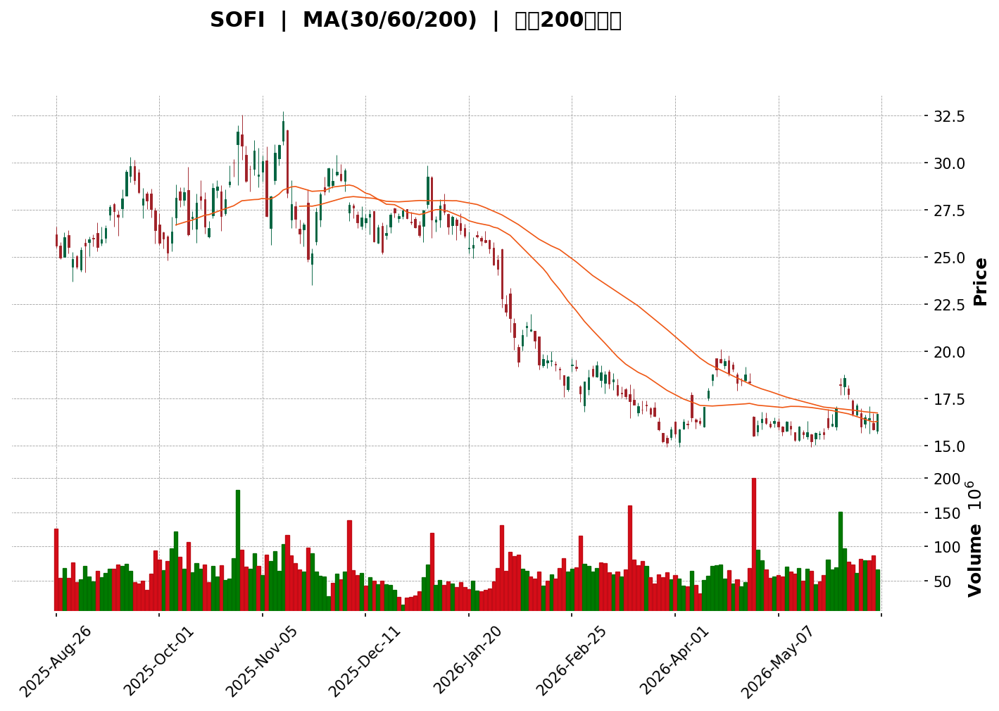
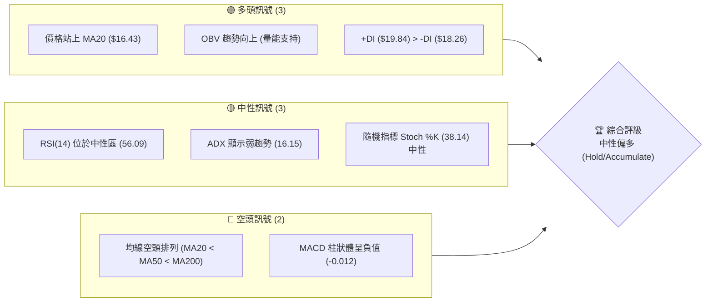
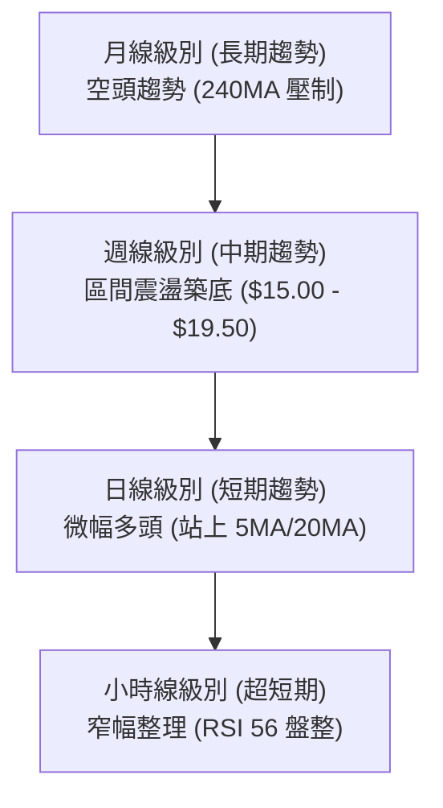
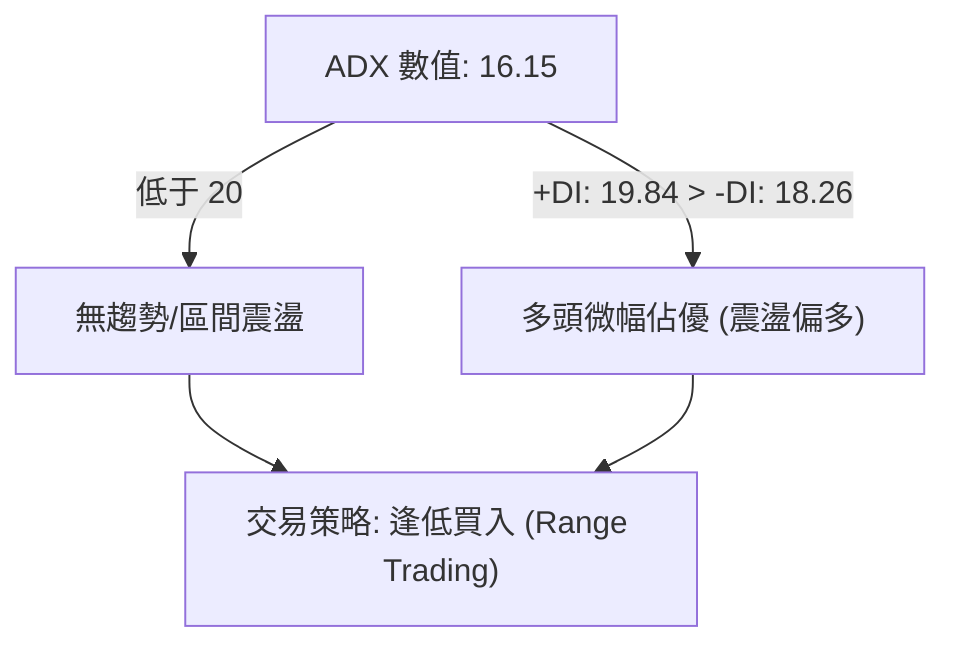
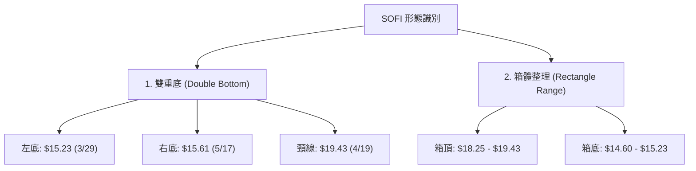

<details>
<summary>📊 靜態圖表 (點擊展開)</summary>

</details>

<html>
<head><meta charset="utf-8" /></head>
<body>
    <div style="height:500px; width:100%;">                        <script>window.PlotlyConfig = {MathJaxConfig: 'local'};</script>
        <script charset="utf-8" src="https://cdn.plot.ly/plotly-3.6.0.min.js" integrity="sha256-QaOVwtVY0T02VaHrr6pnoHLCwayMJp4O5n4YyaE3rJk=" crossorigin="anonymous"></script>                <div id="candlestick-chart" class="plotly-graph-div" style="height:100%; width:100%;"></div>            <script>                window.PLOTLYENV=window.PLOTLYENV || {};                                if (document.getElementById("candlestick-chart")) {                    Plotly.newPlot(                        "candlestick-chart",                        [{"close":{"dtype":"f8","bdata":"AAAAYLieOUAAAACAwvU4QAAAAIA9CjpAAAAAgD2KOUAAAADA9eg4QAAAAKBwfThAAAAAoEdhOUAAAACgmZk5QAAAAIDC9TlAAAAA4FH4OUAAAADAHoU5QAAAAIDC9TlAAAAAwMyMOkAAAAAghas7QAAAACCFaztAAAAAANcjO0AAAAAAKRw8QAAAAGCPgj1AAAAAIFzPPUAAAABAChc9QAAAAOCjcDxAAAAAYLgePEAAAABA4fo7QAAAAMDMjDtAAAAAIIVrOkAAAABgj8I5QAAAAOBR+DlAAAAAoHA9OUAAAAAAKVw6QAAAAADXIzxAAAAAwB4FPEAAAABAM3M8QAAAAOCjMDpAAAAAANcjO0AAAABguN47QAAAACCuBzxAAAAAoJmZOkAAAACAPYo6QAAAAIAUrjxAAAAAAADAPEAAAADgozA7QAAAAOB6FDxAAAAAYI8CPUAAAAAAAAA+QAAAAMD1qD9AAAAAYGbmPkAAAAAgrgc9QAAAAIAUrj1AAAAAoEehPkAAAABguF49QAAAAIDrET5AAAAAwPUoO0AAAACAwjU8QAAAAIA9ij5AAAAAQDPzPkAAAABA4RpAQAAAAADXYzxAAAAAgOvRO0AAAACAPQo7QAAAAKBwPTpAAAAA4FG4OkAAAADA9eg4QAAAAOCjMDlAAAAAYGZmO0AAAADgelQ8QAAAAKBwfTxAAAAA4FG4PUAAAAAgrgc9QAAAAGCPgj1AAAAAgOsRPUAAAACgmZk9QAAAACCuxztAAAAAACmcO0AAAADgetQ6QAAAAEAKFztAAAAAgOsRO0AAAAAgrkc7QAAAAIDr0TlAAAAA4HqUOkAAAADAHkU5QAAAAIA9SjpAAAAAoHA9O0AAAACgmVk7QAAAAOCjMDtAAAAAQOF6O0AAAACA6xE7QAAAAIDr0TpAAAAAIFyPOkAAAACAFC46QAAAAIDCdTtAAAAAIK5HPUAAAABA4fo6QAAAAAAAADtAAAAA4FG4O0AAAABgZmY7QAAAAKCZmTpAAAAAANcjO0AAAAAghas6QAAAAOCjcDpAAAAAoEchOkAAAACgcH05QAAAAADXozlAAAAAQAoXOkAAAACgmdk5QAAAAMDMzDlAAAAAgMJ1OUAAAACgmZk4QAAAAAApXDhAAAAAIFzPNkAAAADgehQ2QAAAAGCPwjVAAAAAAADANEAAAACAwnUzQAAAAAAp3DRAAAAAoJlZNUAAAACAFC41QAAAAMDMjDRAAAAAwMxMM0AAAAAAKZwzQAAAAGCPgjNAAAAAgD2KM0AAAADAzEwzQAAAAMAeBTNAAAAA4FE4MkAAAADA9agyQAAAAIA9SjNAAAAAoJkZM0AAAABgj8IxQAAAAADXYzJAAAAAACmcMkAAAABAM7MyQAAAAAAAQDNAAAAAYGbmMkAAAACAPcoyQAAAAIA9SjJAAAAAIK6HMkAAAABAM7MxQAAAAGCPwjFAAAAAoEehMUAAAABguF4xQAAAAIAULjFAAAAA4HoUMUAAAABgZuYwQAAAAGBmJjFAAAAAQDOzMEAAAAAgXI8wQAAAAKBwvS9AAAAAgMJ1LkAAAADAzEwuQAAAAGCPwi9AAAAAYI9CL0AAAABAM7MvQAAAAMAeRTBAAAAAACkcMEAAAACgcH0wQAAAAMAeRTBAAAAA4FE4MEAAAADAzAwxQAAAAMD16DFAAAAAgD3KMkAAAAAgrgczQAAAAIAUbjNAAAAAAACAM0AAAADgetQyQAAAACBcDzNAAAAAgOtRMkAAAADgo3AyQAAAAGCPwjJAAAAAAClcMkAAAADAzAwvQAAAAKCZGTBAAAAAgBRuMEAAAABAMzMwQAAAAMAeBTBAAAAAwMxMMEAAAAAAAAAwQAAAAAAAgC9AAAAAYI9CMEAAAADAzMwvQAAAAGC4ni5AAAAAwB4FMEAAAADgUTgvQAAAACCFay9AAAAAgMJ1LkAAAACgR2EvQAAAAMDMTC9AAAAAoHA9L0AAAACAwvUvQAAAACCFKzBAAAAA4FH4MEAAAADgUTgyQAAAAOB6lDJAAAAAoHC9MUAAAACAFK4wQAAAAGBmJjFAAAAAIK4HMEAAAAAAAIAwQAAAAOBReDBAAAAAoHC9L0AAAAAghaswQA=="},"high":{"dtype":"f8","bdata":"AAAAQOGaOkAAAAAgXM85QAAAAOB6VDpAAAAAIIVrOkAAAAAgrkc5QAAAAAApHDlAAAAAgD2KOUAAAADgUfg5QAAAAKCZGTpAAAAA4KMwOkAAAABA4do6QAAAAKCZmTpAAAAA4KOwOkAAAADAHsU7QAAAAKBH4TtAAAAAgMJ1O0AAAABAtpM8QAAAAKBHoT1AAAAAwMxMPkAAAAAA1yM+QAAAACCFqz1AAAAAIIWrPEAAAABA4Xo8QAAAAKBHoTxAAAAAACmcO0AAAADgelQ7QAAAAKCZWTpAAAAAgBQuOkAAAAAA1yM7QAAAAEAK1zxAAAAAgMK1PEAAAADgo7A8QAAAAMDMzD1AAAAAgBRuO0AAAACgmVk8QAAAAEAKFz1AAAAA4KNwPEAAAAAghes6QAAAAIAU7jxAAAAAgOsRPUAAAADAzMw8QAAAAOBRmDxAAAAAYLjePUAAAABAMzM+QAAAAEDh+j9AAAAA4FFIQEAAAACAPeo+QAAAAAAp3D1AAAAA4FE4P0AAAACAPco+QAAAAGC4Xj5AAAAAYOfbPkAAAACgcD08QAAAAOBR+D5AAAAAoHD9PkAAAACgcF1AQAAAAAAAwD9AAAAAgOsRPUAAAABAM\u002fM7QAAAAAAAADtAAAAAoJnZOkAAAABAM5M8QAAAAIDrcTlAAAAAACmcO0AAAABAM3M8QAAAAAAAQD1AAAAAAADAPUAAAABAM7M9QAAAACCFaz5AAAAAgBTuPUAAAABAM7M9QAAAAIAU7jtAAAAA4HrUO0AAAABAM3M7QAAAAIAUrjtAAAAAIK5HO0AAAAAAAIA7QAAAAEDhejtAAAAAoHC9OkAAAACAwtU6QAAAAEAKtzpAAAAAYLheO0AAAABguJ47QAAAAEAKVztAAAAAgD2KO0AAAADAzIw7QAAAAMD1aDtAAAAAANcjO0AAAABgZuY6QAAAAKBHgTtAAAAAACncPUAAAADAzEw9QAAAAIAULjtAAAAAgBQOPEAAAAAAAGA8QAAAAGDlUDtAAAAAQDMzO0AAAACAwhU7QAAAAOB6VDtAAAAAIK7HOkAAAABAClc6QAAAAMDMDDpAAAAAANdjOkAAAACgRyE6QAAAAGBmZjpAAAAAgBTuOUAAAACAPco5QAAAAGC4HjlAAAAA4FF4OUAAAAAAAAA3QAAAAAApXDdAAAAAANfDNUAAAABgZmY0QAAAAMD1KDVAAAAAQAqXNUAAAAAAAAA2QAAAAKCZGTVAAAAAgD3KNEAAAABguN4zQAAAAEAK1zNAAAAAYI8CNEAAAABA4XozQAAAAOCjMDNAAAAAoEfBMkAAAACAwrUyQAAAAGC4njNAAAAAIFyPM0AAAACAwjUyQAAAAMD1aDJAAAAAgD0KM0AAAAAgrkczQAAAAEDhejNAAAAAYLg+M0AAAACA6\u002fEyQAAAAGBmBjNAAAAAoJnZMkAAAADAzIwyQAAAAGBmJjJAAAAAgOsRMkAAAACgR0EyQAAAACCuBzJAAAAAIIVLMUAAAADAcmgxQAAAAMD1aDFAAAAAgOsRMUAAAABAClcxQAAAAKBwfTBAAAAAoEdhL0AAAACgRyEvQAAAAGBmBjBAAAAAgOtRMEAAAAAgrscvQAAAAMDMbDBAAAAAQOFaMEAAAACgmdkxQAAAAOBReDBAAAAAoHB9MEAAAAAgXA8xQAAAAEAzEzJAAAAAgOvRMkAAAABguJ4zQAAAAKBHITRAAAAAwB6lM0AAAADAHsUzQAAAACCwcjNAAAAAYGbmMkAAAABAM5MyQAAAACCFKzNAAAAAYLjeMkAAAABACpcwQAAAAGC4XjBAAAAAIIXLMEAAAAAgrscwQAAAACBcTzBAAAAAoEeBMEAAAACAwnUwQAAAAMDMDDBAAAAAgOtRMEAAAADgelQwQAAAACCFay9AAAAA4KMQMEAAAACAFK4vQAAAAIDrUTBAAAAAIK5HL0AAAADgo3AvQAAAAIDrkS9AAAAAACncL0AAAABAM\u002fMwQAAAAOCjsDBAAAAA4HoUMUAAAABACpcyQAAAACCFyzJAAAAAQOE6MkAAAABACncxQAAAAEDhOjFAAAAAoHD9MEAAAADA9agwQAAAAKCZGTFAAAAA4FG4MEAAAADgo7AwQA=="},"hovertemplate":"\u003cb\u003e%{x|%Y-%m-%d}\u003c\u002fb\u003e\u003cbr\u003e\u958b: $%{open:.2f}\u003cbr\u003e\u9ad8: $%{high:.2f}\u003cbr\u003e\u4f4e: $%{low:.2f}\u003cbr\u003e\u6536: $%{close:.2f}\u003cextra\u003e\u003c\u002fextra\u003e","low":{"dtype":"f8","bdata":"AAAAAACAOUAAAACgR+E4QAAAAAAAADlAAAAAgMI1OUAAAABAM7M3QAAAAADXYzhAAAAAILI9OEAAAACAFC44QAAAAMDMDDlAAAAAwMyMOUAAAADAzEw5QAAAAGC4njlAAAAAwB7FOUAAAAAgXO86QAAAAKBHoTpAAAAAoEchOkAAAADgehQ7QAAAAKBwPTxAAAAA4FH4PEAAAACgmdk8QAAAAKCZWTxAAAAAIFwPO0AAAAAgXI87QAAAAAApHDtAAAAAQDOzOUAAAAAA16M5QAAAAEAzczlAAAAAQArXOEAAAAAgXE85QAAAAIAUrjpAAAAAwB6lO0AAAAAAAMA7QAAAAKBHITpAAAAA4FF4OkAAAAAAAMA5QAAAACBcjztAAAAAAABAOkAAAABgjwI6QAAAACBcDztAAAAAYGYmPEAAAACgR2E6QAAAAKDxMjtAAAAAQDOzPEAAAADAHkU9QAAAAMDMzDxAAAAAANcjPkAAAABA4fo8QAAAAKBwfTxAAAAA4HpUPUAAAADgo7A8QAAAAGCPAj1AAAAAoEchO0AAAADA9ag5QAAAAEAK1zxAAAAA4CLbPUAAAACAwvU+QAAAAGBmJjxAAAAAIK6HOkAAAADAzIw6QAAAAIDCtTlAAAAAIFyPOUAAAABguL44QAAAAMAehTdAAAAAIK6nOUAAAACgR6E6QAAAACBcTzxAAAAA4Hp0PEAAAAAghas8QAAAAOCjUD1AAAAAwB4FPUAAAABA4Xo8QAAAAIAU7jpAAAAAwMwMO0AAAADAzIw6QAAAAEDhejpAAAAAgBSOOkAAAABAMzM6QAAAAIA9yjlAAAAA4FG4OUAAAAAghSs5QAAAAEAz8zlAAAAAIK5HOkAAAACgmRk7QAAAAEAz0zpAAAAAIK4HO0AAAAAgrgc7QAAAAKBwvTpAAAAAgD2KOkAAAAAgXA86QAAAAIA9yjlAAAAAoJmZO0AAAAAgrgc6QAAAAKBwXTpAAAAAgOuROkAAAABA4To7QAAAAEAzMzpAAAAA4FE4OkAAAAAghes5QAAAAIDCNTpAAAAAYI8COkAAAACAwjU5QAAAAEAz8zhAAAAAAAAAOkAAAACgmZk5QAAAAMAexTlAAAAAgMI1OUAAAACA65E4QAAAAMDMDDhAAAAAIFxPNkAAAAAAKdw1QAAAAMAeBTVAAAAAgOsRNEAAAAAAqjEzQAAAAIA9CjRAAAAAwMzMNEAAAADAzAw1QAAAAADXIzRAAAAAgD0KM0AAAABgZiYzQAAAAAApHDNAAAAAoJk5M0AAAADgUfgyQAAAAADXgzJAAAAA4HqUMUAAAAAA1+MxQAAAAIAU7jJAAAAA4FH4MkAAAAAgXE8xQAAAAMDMzDBAAAAA4KOwMUAAAAAAKZwyQAAAAADXozJAAAAAYLgeMkAAAADAHsUxQAAAAIA9CjJAAAAA4FH4MUAAAABguJ4xQAAAACCuhzFAAAAA4FF4MUAAAABA4XowQAAAAMD1KDFAAAAA4HqUMEAAAAAghaswQAAAAEAK1zBAAAAAoHB9MEAAAADAHoUwQAAAAAApnC9AAAAAwMxMLkAAAABguN4tQAAAAGC4ni5AAAAAoEfhLkAAAAAAKdwtQAAAAGCPwi9AAAAAgOvRL0AAAABgj0IwQAAAAOB61C9AAAAA4FEYMEAAAAAghesvQAAAAGBmZjFAAAAAIIUrMkAAAABgZqYyQAAAAADXYzNAAAAAQAoXM0AAAADgo7AyQAAAAMD16DJAAAAAgBTuMUAAAACAwCoyQAAAAADXYzJAAAAAwB5FMkAAAAAAAAAvQAAAAOB6FC9AAAAAAADAL0AAAACgRyEwQAAAAKBH4S9AAAAAQOH6L0AAAADA9agvQAAAAIA9Ci9AAAAAgD2KL0AAAACgmRkvQAAAAIAUbi5AAAAAgMJ1LkAAAABgj8IuQAAAAIAUri5AAAAAQArXLUAAAAAgXA8uQAAAAEAzsy5AAAAA4FG4LkAAAADgUbgvQAAAAGCPAjBAAAAAANejL0AAAACAFK4xQAAAAOCjsDFAAAAAgMJ1MUAAAADgepQwQAAAAIDClTBAAAAAAClcL0AAAADA9egvQAAAAOBPTS9AAAAAwPWoL0AAAAAgXE8vQA=="},"name":"\u50f9\u683c","open":{"dtype":"f8","bdata":"AAAA4Ho0OkAAAACgcJ05QAAAAMAeBTlAAAAAwPUoOkAAAAAAAIA4QAAAACBcDzlAAAAA4HpUOEAAAADAHsU5QAAAACBczzlAAAAAwB4FOkAAAACAPUo6QAAAAGCPwjlAAAAAAAAAOkAAAAAAAEA7QAAAAIA9yjtAAAAAAABAO0AAAABACpc7QAAAAADXQzxAAAAAwMxMPUAAAACAFM49QAAAAAAAgD1AAAAAYI\u002fCO0AAAABguF48QAAAAAApXDxAAAAA4FF4O0AAAABA4bo6QAAAAOB6VDpAAAAAoJkZOkAAAADAHsU5QAAAAKCZGTtAAAAAoHB9PEAAAACAPQo8QAAAAMDMjDxAAAAAgOsRO0AAAABgj4I6QAAAAEAzMzxAAAAAgOsRPEAAAACgmRk6QAAAAEAzMztAAAAAIFyPPEAAAACgcH08QAAAAOB6VDtAAAAA4FHYPEAAAAAAAAA+QAAAAKBw\u002fT5AAAAAYLh+P0AAAAAgXG8+QAAAAOCjsD1AAAAAwPWoPUAAAAAghUs9QAAAAMAehT1AAAAAAAAgPkAAAABgZoY6QAAAACBcDz1AAAAAYLg+PkAAAACAFC4\u002fQAAAAEDhuj9AAAAAAAAAO0AAAACAwrU7QAAAAGCPgjpAAAAAoJl5OkAAAACgR+E7QAAAAKBHoThAAAAA4HrUOUAAAABA4fo6QAAAAIDCtTxAAAAAgD3KPEAAAADgetQ8QAAAAADXYz1AAAAAwMxsPUAAAADA9Qg9QAAAAKBwXTtAAAAAQOG6O0AAAACgcD07QAAAAGBmpjpAAAAAQArXOkAAAADAHiU7QAAAACBcbztAAAAAoHC9OUAAAAAA16M6QAAAAIAULjpAAAAAYLieOkAAAADgUZg7QAAAAIDrETtAAAAAIIUrO0AAAACAPYo7QAAAAGC43jpAAAAAIK4HO0AAAACAFK46QAAAAMD1qDpAAAAAIFzPO0AAAABA4To9QAAAAKBw3TpAAAAAAAAAO0AAAACAFM47QAAAAIA9SjtAAAAAQDOzOkAAAAAAAAA7QAAAACBczzpAAAAAgD2KOkAAAADgo3A5QAAAAAAAgDlAAAAAgBQuOkAAAAAAAAA6QAAAAGBm5jlAAAAAYGbmOUAAAAAAAIA5QAAAAKBw3ThAAAAAgBRuOUAAAABgj4I2QAAAAMDMDDdAAAAAoHB9NUAAAABA4To0QAAAAIA9SjRAAAAAgD1KNUAAAABAChc1QAAAAKCZGTVAAAAAgD3KNEAAAAAgrkczQAAAAMD1aDNAAAAA4FF4M0AAAADgelQzQAAAAIDCFTNAAAAAQOG6MkAAAAAAAAAyQAAAACCuRzNAAAAA4KMwM0AAAADA9SgyQAAAAMAeJTFAAAAAAAAAMkAAAAAgXA8zQAAAAGBmpjJAAAAAACl8MkAAAADgelQyQAAAACCF6zJAAAAAANdjMkAAAADgUTgyQAAAAMDMzDFAAAAAAAAAMkAAAADgUbgxQAAAAIAUbjFAAAAAAADAMEAAAACAPeowQAAAACCuJzFAAAAAYLj+MEAAAACAPQoxQAAAAGBmRjBAAAAAQApXL0AAAAAAKdwuQAAAAGBm5i5AAAAAYGZGMEAAAACgR2EuQAAAACCuxy9AAAAAwPUoMEAAAACAFK4xQAAAAADXYzBAAAAAwMxMMEAAAAAAAAAwQAAAACCuhzFAAAAA4FF4MkAAAABguJ4zQAAAAKCZmTNAAAAAYI9CM0AAAABgj4IzQAAAAIA9SjNAAAAAwB7FMkAAAADgo3AyQAAAAEDhejJAAAAAwB5lMkAAAADAzIwwQAAAAIA9ii9AAAAAACk8MEAAAADgUXgwQAAAACCFKzBAAAAAQDMzMEAAAABgj0IwQAAAACCuBzBAAAAAoJmZL0AAAACA6xEwQAAAACCFay9AAAAAYLieLkAAAABgZmYvQAAAAIDC9S5AAAAAgMI1L0AAAABA4bouQAAAAKBwPS9AAAAAYGZmL0AAAABA4XowQAAAAMDMDDBAAAAAwB4FMEAAAABgj0IyQAAAAGBmJjJAAAAAIK4HMkAAAACgR2ExQAAAAMD1qDBAAAAAQOG6MEAAAACAFC4wQAAAAGBmZjBAAAAA4Ho0MEAAAACgmZkvQA=="},"x":["2025-08-26T00:00:00-04:00","2025-08-27T00:00:00-04:00","2025-08-28T00:00:00-04:00","2025-08-29T00:00:00-04:00","2025-09-02T00:00:00-04:00","2025-09-03T00:00:00-04:00","2025-09-04T00:00:00-04:00","2025-09-05T00:00:00-04:00","2025-09-08T00:00:00-04:00","2025-09-09T00:00:00-04:00","2025-09-10T00:00:00-04:00","2025-09-11T00:00:00-04:00","2025-09-12T00:00:00-04:00","2025-09-15T00:00:00-04:00","2025-09-16T00:00:00-04:00","2025-09-17T00:00:00-04:00","2025-09-18T00:00:00-04:00","2025-09-19T00:00:00-04:00","2025-09-22T00:00:00-04:00","2025-09-23T00:00:00-04:00","2025-09-24T00:00:00-04:00","2025-09-25T00:00:00-04:00","2025-09-26T00:00:00-04:00","2025-09-29T00:00:00-04:00","2025-09-30T00:00:00-04:00","2025-10-01T00:00:00-04:00","2025-10-02T00:00:00-04:00","2025-10-03T00:00:00-04:00","2025-10-06T00:00:00-04:00","2025-10-07T00:00:00-04:00","2025-10-08T00:00:00-04:00","2025-10-09T00:00:00-04:00","2025-10-10T00:00:00-04:00","2025-10-13T00:00:00-04:00","2025-10-14T00:00:00-04:00","2025-10-15T00:00:00-04:00","2025-10-16T00:00:00-04:00","2025-10-17T00:00:00-04:00","2025-10-20T00:00:00-04:00","2025-10-21T00:00:00-04:00","2025-10-22T00:00:00-04:00","2025-10-23T00:00:00-04:00","2025-10-24T00:00:00-04:00","2025-10-27T00:00:00-04:00","2025-10-28T00:00:00-04:00","2025-10-29T00:00:00-04:00","2025-10-30T00:00:00-04:00","2025-10-31T00:00:00-04:00","2025-11-03T00:00:00-05:00","2025-11-04T00:00:00-05:00","2025-11-05T00:00:00-05:00","2025-11-06T00:00:00-05:00","2025-11-07T00:00:00-05:00","2025-11-10T00:00:00-05:00","2025-11-11T00:00:00-05:00","2025-11-12T00:00:00-05:00","2025-11-13T00:00:00-05:00","2025-11-14T00:00:00-05:00","2025-11-17T00:00:00-05:00","2025-11-18T00:00:00-05:00","2025-11-19T00:00:00-05:00","2025-11-20T00:00:00-05:00","2025-11-21T00:00:00-05:00","2025-11-24T00:00:00-05:00","2025-11-25T00:00:00-05:00","2025-11-26T00:00:00-05:00","2025-11-28T00:00:00-05:00","2025-12-01T00:00:00-05:00","2025-12-02T00:00:00-05:00","2025-12-03T00:00:00-05:00","2025-12-04T00:00:00-05:00","2025-12-05T00:00:00-05:00","2025-12-08T00:00:00-05:00","2025-12-09T00:00:00-05:00","2025-12-10T00:00:00-05:00","2025-12-11T00:00:00-05:00","2025-12-12T00:00:00-05:00","2025-12-15T00:00:00-05:00","2025-12-16T00:00:00-05:00","2025-12-17T00:00:00-05:00","2025-12-18T00:00:00-05:00","2025-12-19T00:00:00-05:00","2025-12-22T00:00:00-05:00","2025-12-23T00:00:00-05:00","2025-12-24T00:00:00-05:00","2025-12-26T00:00:00-05:00","2025-12-29T00:00:00-05:00","2025-12-30T00:00:00-05:00","2025-12-31T00:00:00-05:00","2026-01-02T00:00:00-05:00","2026-01-05T00:00:00-05:00","2026-01-06T00:00:00-05:00","2026-01-07T00:00:00-05:00","2026-01-08T00:00:00-05:00","2026-01-09T00:00:00-05:00","2026-01-12T00:00:00-05:00","2026-01-13T00:00:00-05:00","2026-01-14T00:00:00-05:00","2026-01-15T00:00:00-05:00","2026-01-16T00:00:00-05:00","2026-01-20T00:00:00-05:00","2026-01-21T00:00:00-05:00","2026-01-22T00:00:00-05:00","2026-01-23T00:00:00-05:00","2026-01-26T00:00:00-05:00","2026-01-27T00:00:00-05:00","2026-01-28T00:00:00-05:00","2026-01-29T00:00:00-05:00","2026-01-30T00:00:00-05:00","2026-02-02T00:00:00-05:00","2026-02-03T00:00:00-05:00","2026-02-04T00:00:00-05:00","2026-02-05T00:00:00-05:00","2026-02-06T00:00:00-05:00","2026-02-09T00:00:00-05:00","2026-02-10T00:00:00-05:00","2026-02-11T00:00:00-05:00","2026-02-12T00:00:00-05:00","2026-02-13T00:00:00-05:00","2026-02-17T00:00:00-05:00","2026-02-18T00:00:00-05:00","2026-02-19T00:00:00-05:00","2026-02-20T00:00:00-05:00","2026-02-23T00:00:00-05:00","2026-02-24T00:00:00-05:00","2026-02-25T00:00:00-05:00","2026-02-26T00:00:00-05:00","2026-02-27T00:00:00-05:00","2026-03-02T00:00:00-05:00","2026-03-03T00:00:00-05:00","2026-03-04T00:00:00-05:00","2026-03-05T00:00:00-05:00","2026-03-06T00:00:00-05:00","2026-03-09T00:00:00-04:00","2026-03-10T00:00:00-04:00","2026-03-11T00:00:00-04:00","2026-03-12T00:00:00-04:00","2026-03-13T00:00:00-04:00","2026-03-16T00:00:00-04:00","2026-03-17T00:00:00-04:00","2026-03-18T00:00:00-04:00","2026-03-19T00:00:00-04:00","2026-03-20T00:00:00-04:00","2026-03-23T00:00:00-04:00","2026-03-24T00:00:00-04:00","2026-03-25T00:00:00-04:00","2026-03-26T00:00:00-04:00","2026-03-27T00:00:00-04:00","2026-03-30T00:00:00-04:00","2026-03-31T00:00:00-04:00","2026-04-01T00:00:00-04:00","2026-04-02T00:00:00-04:00","2026-04-06T00:00:00-04:00","2026-04-07T00:00:00-04:00","2026-04-08T00:00:00-04:00","2026-04-09T00:00:00-04:00","2026-04-10T00:00:00-04:00","2026-04-13T00:00:00-04:00","2026-04-14T00:00:00-04:00","2026-04-15T00:00:00-04:00","2026-04-16T00:00:00-04:00","2026-04-17T00:00:00-04:00","2026-04-20T00:00:00-04:00","2026-04-21T00:00:00-04:00","2026-04-22T00:00:00-04:00","2026-04-23T00:00:00-04:00","2026-04-24T00:00:00-04:00","2026-04-27T00:00:00-04:00","2026-04-28T00:00:00-04:00","2026-04-29T00:00:00-04:00","2026-04-30T00:00:00-04:00","2026-05-01T00:00:00-04:00","2026-05-04T00:00:00-04:00","2026-05-05T00:00:00-04:00","2026-05-06T00:00:00-04:00","2026-05-07T00:00:00-04:00","2026-05-08T00:00:00-04:00","2026-05-11T00:00:00-04:00","2026-05-12T00:00:00-04:00","2026-05-13T00:00:00-04:00","2026-05-14T00:00:00-04:00","2026-05-15T00:00:00-04:00","2026-05-18T00:00:00-04:00","2026-05-19T00:00:00-04:00","2026-05-20T00:00:00-04:00","2026-05-21T00:00:00-04:00","2026-05-22T00:00:00-04:00","2026-05-26T00:00:00-04:00","2026-05-27T00:00:00-04:00","2026-05-28T00:00:00-04:00","2026-05-29T00:00:00-04:00","2026-06-01T00:00:00-04:00","2026-06-02T00:00:00-04:00","2026-06-03T00:00:00-04:00","2026-06-04T00:00:00-04:00","2026-06-05T00:00:00-04:00","2026-06-08T00:00:00-04:00","2026-06-09T00:00:00-04:00","2026-06-10T00:00:00-04:00","2026-06-11T00:00:00-04:00"],"type":"candlestick"},{"hovertemplate":"MA30: $%{y:.2f}\u003cextra\u003e\u003c\u002fextra\u003e","line":{"color":"#2196F3","dash":"dash","width":2},"mode":"lines","name":"MA30","x":["2025-08-26T00:00:00-04:00","2025-08-27T00:00:00-04:00","2025-08-28T00:00:00-04:00","2025-08-29T00:00:00-04:00","2025-09-02T00:00:00-04:00","2025-09-03T00:00:00-04:00","2025-09-04T00:00:00-04:00","2025-09-05T00:00:00-04:00","2025-09-08T00:00:00-04:00","2025-09-09T00:00:00-04:00","2025-09-10T00:00:00-04:00","2025-09-11T00:00:00-04:00","2025-09-12T00:00:00-04:00","2025-09-15T00:00:00-04:00","2025-09-16T00:00:00-04:00","2025-09-17T00:00:00-04:00","2025-09-18T00:00:00-04:00","2025-09-19T00:00:00-04:00","2025-09-22T00:00:00-04:00","2025-09-23T00:00:00-04:00","2025-09-24T00:00:00-04:00","2025-09-25T00:00:00-04:00","2025-09-26T00:00:00-04:00","2025-09-29T00:00:00-04:00","2025-09-30T00:00:00-04:00","2025-10-01T00:00:00-04:00","2025-10-02T00:00:00-04:00","2025-10-03T00:00:00-04:00","2025-10-06T00:00:00-04:00","2025-10-07T00:00:00-04:00","2025-10-08T00:00:00-04:00","2025-10-09T00:00:00-04:00","2025-10-10T00:00:00-04:00","2025-10-13T00:00:00-04:00","2025-10-14T00:00:00-04:00","2025-10-15T00:00:00-04:00","2025-10-16T00:00:00-04:00","2025-10-17T00:00:00-04:00","2025-10-20T00:00:00-04:00","2025-10-21T00:00:00-04:00","2025-10-22T00:00:00-04:00","2025-10-23T00:00:00-04:00","2025-10-24T00:00:00-04:00","2025-10-27T00:00:00-04:00","2025-10-28T00:00:00-04:00","2025-10-29T00:00:00-04:00","2025-10-30T00:00:00-04:00","2025-10-31T00:00:00-04:00","2025-11-03T00:00:00-05:00","2025-11-04T00:00:00-05:00","2025-11-05T00:00:00-05:00","2025-11-06T00:00:00-05:00","2025-11-07T00:00:00-05:00","2025-11-10T00:00:00-05:00","2025-11-11T00:00:00-05:00","2025-11-12T00:00:00-05:00","2025-11-13T00:00:00-05:00","2025-11-14T00:00:00-05:00","2025-11-17T00:00:00-05:00","2025-11-18T00:00:00-05:00","2025-11-19T00:00:00-05:00","2025-11-20T00:00:00-05:00","2025-11-21T00:00:00-05:00","2025-11-24T00:00:00-05:00","2025-11-25T00:00:00-05:00","2025-11-26T00:00:00-05:00","2025-11-28T00:00:00-05:00","2025-12-01T00:00:00-05:00","2025-12-02T00:00:00-05:00","2025-12-03T00:00:00-05:00","2025-12-04T00:00:00-05:00","2025-12-05T00:00:00-05:00","2025-12-08T00:00:00-05:00","2025-12-09T00:00:00-05:00","2025-12-10T00:00:00-05:00","2025-12-11T00:00:00-05:00","2025-12-12T00:00:00-05:00","2025-12-15T00:00:00-05:00","2025-12-16T00:00:00-05:00","2025-12-17T00:00:00-05:00","2025-12-18T00:00:00-05:00","2025-12-19T00:00:00-05:00","2025-12-22T00:00:00-05:00","2025-12-23T00:00:00-05:00","2025-12-24T00:00:00-05:00","2025-12-26T00:00:00-05:00","2025-12-29T00:00:00-05:00","2025-12-30T00:00:00-05:00","2025-12-31T00:00:00-05:00","2026-01-02T00:00:00-05:00","2026-01-05T00:00:00-05:00","2026-01-06T00:00:00-05:00","2026-01-07T00:00:00-05:00","2026-01-08T00:00:00-05:00","2026-01-09T00:00:00-05:00","2026-01-12T00:00:00-05:00","2026-01-13T00:00:00-05:00","2026-01-14T00:00:00-05:00","2026-01-15T00:00:00-05:00","2026-01-16T00:00:00-05:00","2026-01-20T00:00:00-05:00","2026-01-21T00:00:00-05:00","2026-01-22T00:00:00-05:00","2026-01-23T00:00:00-05:00","2026-01-26T00:00:00-05:00","2026-01-27T00:00:00-05:00","2026-01-28T00:00:00-05:00","2026-01-29T00:00:00-05:00","2026-01-30T00:00:00-05:00","2026-02-02T00:00:00-05:00","2026-02-03T00:00:00-05:00","2026-02-04T00:00:00-05:00","2026-02-05T00:00:00-05:00","2026-02-06T00:00:00-05:00","2026-02-09T00:00:00-05:00","2026-02-10T00:00:00-05:00","2026-02-11T00:00:00-05:00","2026-02-12T00:00:00-05:00","2026-02-13T00:00:00-05:00","2026-02-17T00:00:00-05:00","2026-02-18T00:00:00-05:00","2026-02-19T00:00:00-05:00","2026-02-20T00:00:00-05:00","2026-02-23T00:00:00-05:00","2026-02-24T00:00:00-05:00","2026-02-25T00:00:00-05:00","2026-02-26T00:00:00-05:00","2026-02-27T00:00:00-05:00","2026-03-02T00:00:00-05:00","2026-03-03T00:00:00-05:00","2026-03-04T00:00:00-05:00","2026-03-05T00:00:00-05:00","2026-03-06T00:00:00-05:00","2026-03-09T00:00:00-04:00","2026-03-10T00:00:00-04:00","2026-03-11T00:00:00-04:00","2026-03-12T00:00:00-04:00","2026-03-13T00:00:00-04:00","2026-03-16T00:00:00-04:00","2026-03-17T00:00:00-04:00","2026-03-18T00:00:00-04:00","2026-03-19T00:00:00-04:00","2026-03-20T00:00:00-04:00","2026-03-23T00:00:00-04:00","2026-03-24T00:00:00-04:00","2026-03-25T00:00:00-04:00","2026-03-26T00:00:00-04:00","2026-03-27T00:00:00-04:00","2026-03-30T00:00:00-04:00","2026-03-31T00:00:00-04:00","2026-04-01T00:00:00-04:00","2026-04-02T00:00:00-04:00","2026-04-06T00:00:00-04:00","2026-04-07T00:00:00-04:00","2026-04-08T00:00:00-04:00","2026-04-09T00:00:00-04:00","2026-04-10T00:00:00-04:00","2026-04-13T00:00:00-04:00","2026-04-14T00:00:00-04:00","2026-04-15T00:00:00-04:00","2026-04-16T00:00:00-04:00","2026-04-17T00:00:00-04:00","2026-04-20T00:00:00-04:00","2026-04-21T00:00:00-04:00","2026-04-22T00:00:00-04:00","2026-04-23T00:00:00-04:00","2026-04-24T00:00:00-04:00","2026-04-27T00:00:00-04:00","2026-04-28T00:00:00-04:00","2026-04-29T00:00:00-04:00","2026-04-30T00:00:00-04:00","2026-05-01T00:00:00-04:00","2026-05-04T00:00:00-04:00","2026-05-05T00:00:00-04:00","2026-05-06T00:00:00-04:00","2026-05-07T00:00:00-04:00","2026-05-08T00:00:00-04:00","2026-05-11T00:00:00-04:00","2026-05-12T00:00:00-04:00","2026-05-13T00:00:00-04:00","2026-05-14T00:00:00-04:00","2026-05-15T00:00:00-04:00","2026-05-18T00:00:00-04:00","2026-05-19T00:00:00-04:00","2026-05-20T00:00:00-04:00","2026-05-21T00:00:00-04:00","2026-05-22T00:00:00-04:00","2026-05-26T00:00:00-04:00","2026-05-27T00:00:00-04:00","2026-05-28T00:00:00-04:00","2026-05-29T00:00:00-04:00","2026-06-01T00:00:00-04:00","2026-06-02T00:00:00-04:00","2026-06-03T00:00:00-04:00","2026-06-04T00:00:00-04:00","2026-06-05T00:00:00-04:00","2026-06-08T00:00:00-04:00","2026-06-09T00:00:00-04:00","2026-06-10T00:00:00-04:00","2026-06-11T00:00:00-04:00"],"y":{"dtype":"f8","bdata":"AAAAAAAA+H8AAAAAAAD4fwAAAAAAAPh\u002fAAAAAAAA+H8AAAAAAAD4fwAAAAAAAPh\u002fAAAAAAAA+H8AAAAAAAD4fwAAAAAAAPh\u002fAAAAAAAA+H8AAAAAAAD4fwAAAAAAAPh\u002fAAAAAAAA+H8AAAAAAAD4fwAAAAAAAPh\u002fAAAAAAAA+H8AAAAAAAD4fwAAAAAAAPh\u002fAAAAAAAA+H8AAAAAAAD4fwAAAAAAAPh\u002fAAAAAAAA+H8AAAAAAAD4fwAAAAAAAPh\u002fAAAAAAAA+H8AAAAAAAD4fwAAAAAAAPh\u002fAAAAAAAA+H8AAAAAAAD4fzMzM6MptTpAREREhKTJOkCrqqqKbOc6QImIiDi06DpAiYiIeFv2OkARERGxnQ87QBEREfHSLTtAMzMzEzw4O0CamZmJQUA7QImIiHh3VztAmpmZeTBvO0BVVVWlcH07QLy7u9uHjztAAAAA0IWkO0BmZmbGZ7g7QCIiIjKW3DtAq6qqCqz8O0AAAADQhQQ8QO\u002fu7i75BTxAAAAAgPgMPEC8u7srXA88QFVVVfVEHTxA3t3dzRMVPEDv7u4+Chc8QBEREQGOMDxAERER8TVXPEDe3d0tQI48QAAAAMDmojxAiYiI2Oq4PEBERERUuL48QHd3d7eBrjxAIiIi0mmjPEAiIiKSNIU8QJqZmQmsfDxAREREBOR+PEBmZmbm0II8QImIiMi9hjxAZmZmhl2hPEAzMzMDnbY8QM3MzCyyvTxAmpmZOW3APEAzMzPz\u002fdQ8QHd3d5du0jxA7+7uPnzGPEBmZmZGb6s8QFVVVfVvhDxAIiIiMsFjPEAzMzND0lQ8QGZmZvbhMzxAq6qqmlIRPEBEREQEVu47QLy7u3sUzjtA7+7uPsPOO0DNzMyMbMc7QM3MzFzWqjtAd3d3BzqNO0B3d3eHXWE7QAAAAND3UztAzczMTDdJO0CamZmZ4EE7QKuqqrpJTDtAMzMzIyJiO0Dv7u4ezHM7QAAAACA+gztAzczMLPmFO0Dv7u6OCX47QKuqqsrobTtAIiIisuRXO0AiIiIywUM7QN7d3a2OKTtAZmZmJngQO0B3d3e3Ze06QAAAANAi2zpAIiIiUirOOkCrqqp6zcU6QN7d3W3LujpAREREVA6tOkB3d3fHL5Y6QM3MzFy6iTpAvLu7q45pOkAiIiICVk46QCIiIhKuJzpAMzMzc0zwOUCrqqp6+Kw5QCIiImL0djlAIiIiMqVCOUC8u7tLYhA5QFVVVUXh2jhA7+7uju2cOEDNzMws3WQ4QDMzMyMGIThAiYiIyOjNN0ARERGRX4w3QN7d3f1GSDdAzczM7DX3NkCrqqoaoaw2QKuqqipAbjZAVVVVhaQpNkBERERUnN01QFVVVdXqmDVAVVVVJb9YNUCrqqoqzh41QAAAAABH6DRARERENOyqNEBmZmZmrW40QO\u002fu7o6XLjRA7+7uvnTzM0B3d3d3k7gzQLy7u4tBgDNAmpmZqQ1UM0AzMzOD3CszQJqZmVnHBDNAzczMHHblMkBVVVW1nc8yQGZmZhb1rzJAIiIiAkeIMkBmZmZ22mAyQBEREdnqODJAREREzC8WMkDv7u7GIPAxQLy7u+sm0TFAzczMZMmvMUCamZnBWJIxQCIiIkrhejFAVVVV7d9oMUBVVVV9W1YxQKuqqjKWPDFAVVVVvQIkMUAAAAC48x0xQM3MzCTbGTFAREREXGQbMUCamZlBNR4xQBEREXm+HzFAmpmZMd0kMUCrqqqSNCUxQBEREanGKzFAAAAA6PspMUDe3d11TDAxQGZmZv7UODFAzczMtA8\u002fMUBVVVU9US8xQJqZmfEZJjFAd3d3\u002f40gMUC8u7vTlBoxQGZmZk7wEDFAVVVVfYYNMUDv7u4mvwgxQCIiIgK5BzFAREREFIMQMUCrqqp66RYxQLy7u0sMEjFAvLu7Q2AVMUCamZn5UxMxQKuqqqKMDjFAZmZmPgoHMUDe3d2dNgAxQERERDTs+jBAREREfM31MEAREREJrOwwQKuqqvLS3TBAAAAAGEvOMEBmZmaeYccwQLy7u8MgwDBARERE\u002fBuxMEBVVVU9w54wQAAAAMh2jjBAvLu7M+x6MEDNzMw0XmowQHd3d5\u002fTVjBAIiIiIpRBMEDNzMxsWUswQA=="},"type":"scatter"},{"hovertemplate":"MA60: $%{y:.2f}\u003cextra\u003e\u003c\u002fextra\u003e","line":{"color":"#9C27B0","dash":"dash","width":2},"mode":"lines","name":"MA60","x":["2025-08-26T00:00:00-04:00","2025-08-27T00:00:00-04:00","2025-08-28T00:00:00-04:00","2025-08-29T00:00:00-04:00","2025-09-02T00:00:00-04:00","2025-09-03T00:00:00-04:00","2025-09-04T00:00:00-04:00","2025-09-05T00:00:00-04:00","2025-09-08T00:00:00-04:00","2025-09-09T00:00:00-04:00","2025-09-10T00:00:00-04:00","2025-09-11T00:00:00-04:00","2025-09-12T00:00:00-04:00","2025-09-15T00:00:00-04:00","2025-09-16T00:00:00-04:00","2025-09-17T00:00:00-04:00","2025-09-18T00:00:00-04:00","2025-09-19T00:00:00-04:00","2025-09-22T00:00:00-04:00","2025-09-23T00:00:00-04:00","2025-09-24T00:00:00-04:00","2025-09-25T00:00:00-04:00","2025-09-26T00:00:00-04:00","2025-09-29T00:00:00-04:00","2025-09-30T00:00:00-04:00","2025-10-01T00:00:00-04:00","2025-10-02T00:00:00-04:00","2025-10-03T00:00:00-04:00","2025-10-06T00:00:00-04:00","2025-10-07T00:00:00-04:00","2025-10-08T00:00:00-04:00","2025-10-09T00:00:00-04:00","2025-10-10T00:00:00-04:00","2025-10-13T00:00:00-04:00","2025-10-14T00:00:00-04:00","2025-10-15T00:00:00-04:00","2025-10-16T00:00:00-04:00","2025-10-17T00:00:00-04:00","2025-10-20T00:00:00-04:00","2025-10-21T00:00:00-04:00","2025-10-22T00:00:00-04:00","2025-10-23T00:00:00-04:00","2025-10-24T00:00:00-04:00","2025-10-27T00:00:00-04:00","2025-10-28T00:00:00-04:00","2025-10-29T00:00:00-04:00","2025-10-30T00:00:00-04:00","2025-10-31T00:00:00-04:00","2025-11-03T00:00:00-05:00","2025-11-04T00:00:00-05:00","2025-11-05T00:00:00-05:00","2025-11-06T00:00:00-05:00","2025-11-07T00:00:00-05:00","2025-11-10T00:00:00-05:00","2025-11-11T00:00:00-05:00","2025-11-12T00:00:00-05:00","2025-11-13T00:00:00-05:00","2025-11-14T00:00:00-05:00","2025-11-17T00:00:00-05:00","2025-11-18T00:00:00-05:00","2025-11-19T00:00:00-05:00","2025-11-20T00:00:00-05:00","2025-11-21T00:00:00-05:00","2025-11-24T00:00:00-05:00","2025-11-25T00:00:00-05:00","2025-11-26T00:00:00-05:00","2025-11-28T00:00:00-05:00","2025-12-01T00:00:00-05:00","2025-12-02T00:00:00-05:00","2025-12-03T00:00:00-05:00","2025-12-04T00:00:00-05:00","2025-12-05T00:00:00-05:00","2025-12-08T00:00:00-05:00","2025-12-09T00:00:00-05:00","2025-12-10T00:00:00-05:00","2025-12-11T00:00:00-05:00","2025-12-12T00:00:00-05:00","2025-12-15T00:00:00-05:00","2025-12-16T00:00:00-05:00","2025-12-17T00:00:00-05:00","2025-12-18T00:00:00-05:00","2025-12-19T00:00:00-05:00","2025-12-22T00:00:00-05:00","2025-12-23T00:00:00-05:00","2025-12-24T00:00:00-05:00","2025-12-26T00:00:00-05:00","2025-12-29T00:00:00-05:00","2025-12-30T00:00:00-05:00","2025-12-31T00:00:00-05:00","2026-01-02T00:00:00-05:00","2026-01-05T00:00:00-05:00","2026-01-06T00:00:00-05:00","2026-01-07T00:00:00-05:00","2026-01-08T00:00:00-05:00","2026-01-09T00:00:00-05:00","2026-01-12T00:00:00-05:00","2026-01-13T00:00:00-05:00","2026-01-14T00:00:00-05:00","2026-01-15T00:00:00-05:00","2026-01-16T00:00:00-05:00","2026-01-20T00:00:00-05:00","2026-01-21T00:00:00-05:00","2026-01-22T00:00:00-05:00","2026-01-23T00:00:00-05:00","2026-01-26T00:00:00-05:00","2026-01-27T00:00:00-05:00","2026-01-28T00:00:00-05:00","2026-01-29T00:00:00-05:00","2026-01-30T00:00:00-05:00","2026-02-02T00:00:00-05:00","2026-02-03T00:00:00-05:00","2026-02-04T00:00:00-05:00","2026-02-05T00:00:00-05:00","2026-02-06T00:00:00-05:00","2026-02-09T00:00:00-05:00","2026-02-10T00:00:00-05:00","2026-02-11T00:00:00-05:00","2026-02-12T00:00:00-05:00","2026-02-13T00:00:00-05:00","2026-02-17T00:00:00-05:00","2026-02-18T00:00:00-05:00","2026-02-19T00:00:00-05:00","2026-02-20T00:00:00-05:00","2026-02-23T00:00:00-05:00","2026-02-24T00:00:00-05:00","2026-02-25T00:00:00-05:00","2026-02-26T00:00:00-05:00","2026-02-27T00:00:00-05:00","2026-03-02T00:00:00-05:00","2026-03-03T00:00:00-05:00","2026-03-04T00:00:00-05:00","2026-03-05T00:00:00-05:00","2026-03-06T00:00:00-05:00","2026-03-09T00:00:00-04:00","2026-03-10T00:00:00-04:00","2026-03-11T00:00:00-04:00","2026-03-12T00:00:00-04:00","2026-03-13T00:00:00-04:00","2026-03-16T00:00:00-04:00","2026-03-17T00:00:00-04:00","2026-03-18T00:00:00-04:00","2026-03-19T00:00:00-04:00","2026-03-20T00:00:00-04:00","2026-03-23T00:00:00-04:00","2026-03-24T00:00:00-04:00","2026-03-25T00:00:00-04:00","2026-03-26T00:00:00-04:00","2026-03-27T00:00:00-04:00","2026-03-30T00:00:00-04:00","2026-03-31T00:00:00-04:00","2026-04-01T00:00:00-04:00","2026-04-02T00:00:00-04:00","2026-04-06T00:00:00-04:00","2026-04-07T00:00:00-04:00","2026-04-08T00:00:00-04:00","2026-04-09T00:00:00-04:00","2026-04-10T00:00:00-04:00","2026-04-13T00:00:00-04:00","2026-04-14T00:00:00-04:00","2026-04-15T00:00:00-04:00","2026-04-16T00:00:00-04:00","2026-04-17T00:00:00-04:00","2026-04-20T00:00:00-04:00","2026-04-21T00:00:00-04:00","2026-04-22T00:00:00-04:00","2026-04-23T00:00:00-04:00","2026-04-24T00:00:00-04:00","2026-04-27T00:00:00-04:00","2026-04-28T00:00:00-04:00","2026-04-29T00:00:00-04:00","2026-04-30T00:00:00-04:00","2026-05-01T00:00:00-04:00","2026-05-04T00:00:00-04:00","2026-05-05T00:00:00-04:00","2026-05-06T00:00:00-04:00","2026-05-07T00:00:00-04:00","2026-05-08T00:00:00-04:00","2026-05-11T00:00:00-04:00","2026-05-12T00:00:00-04:00","2026-05-13T00:00:00-04:00","2026-05-14T00:00:00-04:00","2026-05-15T00:00:00-04:00","2026-05-18T00:00:00-04:00","2026-05-19T00:00:00-04:00","2026-05-20T00:00:00-04:00","2026-05-21T00:00:00-04:00","2026-05-22T00:00:00-04:00","2026-05-26T00:00:00-04:00","2026-05-27T00:00:00-04:00","2026-05-28T00:00:00-04:00","2026-05-29T00:00:00-04:00","2026-06-01T00:00:00-04:00","2026-06-02T00:00:00-04:00","2026-06-03T00:00:00-04:00","2026-06-04T00:00:00-04:00","2026-06-05T00:00:00-04:00","2026-06-08T00:00:00-04:00","2026-06-09T00:00:00-04:00","2026-06-10T00:00:00-04:00","2026-06-11T00:00:00-04:00"],"y":{"dtype":"f8","bdata":"AAAAAAAA+H8AAAAAAAD4fwAAAAAAAPh\u002fAAAAAAAA+H8AAAAAAAD4fwAAAAAAAPh\u002fAAAAAAAA+H8AAAAAAAD4fwAAAAAAAPh\u002fAAAAAAAA+H8AAAAAAAD4fwAAAAAAAPh\u002fAAAAAAAA+H8AAAAAAAD4fwAAAAAAAPh\u002fAAAAAAAA+H8AAAAAAAD4fwAAAAAAAPh\u002fAAAAAAAA+H8AAAAAAAD4fwAAAAAAAPh\u002fAAAAAAAA+H8AAAAAAAD4fwAAAAAAAPh\u002fAAAAAAAA+H8AAAAAAAD4fwAAAAAAAPh\u002fAAAAAAAA+H8AAAAAAAD4fwAAAAAAAPh\u002fAAAAAAAA+H8AAAAAAAD4fwAAAAAAAPh\u002fAAAAAAAA+H8AAAAAAAD4fwAAAAAAAPh\u002fAAAAAAAA+H8AAAAAAAD4fwAAAAAAAPh\u002fAAAAAAAA+H8AAAAAAAD4fwAAAAAAAPh\u002fAAAAAAAA+H8AAAAAAAD4fwAAAAAAAPh\u002fAAAAAAAA+H8AAAAAAAD4fwAAAAAAAPh\u002fAAAAAAAA+H8AAAAAAAD4fwAAAAAAAPh\u002fAAAAAAAA+H8AAAAAAAD4fwAAAAAAAPh\u002fAAAAAAAA+H8AAAAAAAD4fwAAAAAAAPh\u002fAAAAAAAA+H8AAAAAAAD4f1VVVa3VsTtAMzMzK4e2O0BmZmaOULY7QBERESGwsjtAZmZmvp+6O0C8u7tLN8k7QM3MzFxI2jtAzczMzMzsO0BmZmZGb\u002fs7QKuqqtKUCjxAmpmZ2c4XPEBERERMNyk8QJqZmTn7MDxAd3d3B4E1PEBmZmaG6zE8QLy7uxODMDxAZmZmnjYwPECamZkJrCw8QKuqqpLtHDxAVVVVjSUPPEAAAAAY2f47QImIiLis9TtAZmZmhuvxO0De3d1lO+87QO\u002fu7i6y7TtARERE\u002fDfyO0Crqqrazvc7QAAAAEhv+ztAq6qqEhEBPEDv7u52TAA8QBEREbll\u002fTtAq6qq+sUCPECJiIhYgPw7QM3MzBT1\u002fztAiYiImG4CPECrqqo6bQA8QJqZmUlT+jtAREREHKH8O0CrqqoaL\u002f07QFVVVW2g8ztAAAAAsHLoO0BVVVXVMeE7QLy7u7PI1jtAiYiISFPKO0CJiIhgnrg7QJqZmbGdnztAMzMzw2eIO0BVVVUFgXU7QJqZmSnOXjtAMzMzo3A9O0AzMzMDVh47QO\u002fu7kbh+jpAERER2YffOkC8u7uDMro6QHd3d1\u002flkDpAzczMnO9nOkCamZnp3zg6QKuqqopsFzpA3t3dbRLzOUAzMzPjXtM5QO\u002fu7u6ntjlA3t3ddQWYOUAAAADYFYA5QO\u002fu7o7CZTlAzczMjJc+OUDNzMxUVRU5QKuqqnoU7jhAvLu7m8TAOEAzMzPDrpA4QJqZmcE8YThA3t3dpZs0OEARERHxGQY4QAAAAOi04TdAMzMzQ4u8N0CJiIhwPZo3QGZmZn6xdDdAmpmZiUFQN0B3d3efYSc3QERERPT9BDdAq6qqKs7eNkCrqqpCGb02QN7d3bU6ljZAAAAASOFqNkAAAAAYSz42QERERLx0EzZAIiIiGnblNUARERFhnrg1QDMzMw\u002fmiTVAmpmZrY5ZNUDe3d35fio1QHd3d4cW+TRAq6qqFtm+NEBVVVUpXI80QAAAACSUYTRAERER7QowNEAAAABMfgE0QKuqqi5r1TNAVVVVodOmM0AiIiIGyH0zQBEREf1iWTNAzczMwBE6M0AiIiK2gR4zQImIiLwCBDNA7+7usuTnMkCJiIj88MkyQAAAABwvrTJAd3d3U7iOMkCrqqr2b3QyQBEREUWLXDJAMzMzr45JMkBERETgli0yQJqZmaVwFTJAIiIiDgIDMkCJiIhEGfUxQGZmZrJy4DFAvLu7v+bKMUCrqqrOzLQxQJqZme1RoDFAREREcFmTMUDNzMwghYMxQLy7u5uZcTFARERE1JRiMUCamZld1lIxQGZmZva2RDFA3t3dFfU3MUCamZkNSSsxQHd3dzPBGzFAzczMHOgMMUCJiIjgTwUxQLy7uwvX+zBAIiIiutf0MEAAAABwy\u002fIwQGZmZp7v7zBA7+7ulvzqMEAAAADo++EwQImIiLge3TBA3t3dDXTSMEBVVVVVVc0wQO\u002fu7k7UxzBAd3d361HAMEARERFVVb0wQA=="},"type":"scatter"},{"hovertemplate":"MA200: $%{y:.2f}\u003cextra\u003e\u003c\u002fextra\u003e","line":{"color":"#FF6F00","dash":"solid","width":2},"mode":"lines","name":"MA200","x":["2025-08-26T00:00:00-04:00","2025-08-27T00:00:00-04:00","2025-08-28T00:00:00-04:00","2025-08-29T00:00:00-04:00","2025-09-02T00:00:00-04:00","2025-09-03T00:00:00-04:00","2025-09-04T00:00:00-04:00","2025-09-05T00:00:00-04:00","2025-09-08T00:00:00-04:00","2025-09-09T00:00:00-04:00","2025-09-10T00:00:00-04:00","2025-09-11T00:00:00-04:00","2025-09-12T00:00:00-04:00","2025-09-15T00:00:00-04:00","2025-09-16T00:00:00-04:00","2025-09-17T00:00:00-04:00","2025-09-18T00:00:00-04:00","2025-09-19T00:00:00-04:00","2025-09-22T00:00:00-04:00","2025-09-23T00:00:00-04:00","2025-09-24T00:00:00-04:00","2025-09-25T00:00:00-04:00","2025-09-26T00:00:00-04:00","2025-09-29T00:00:00-04:00","2025-09-30T00:00:00-04:00","2025-10-01T00:00:00-04:00","2025-10-02T00:00:00-04:00","2025-10-03T00:00:00-04:00","2025-10-06T00:00:00-04:00","2025-10-07T00:00:00-04:00","2025-10-08T00:00:00-04:00","2025-10-09T00:00:00-04:00","2025-10-10T00:00:00-04:00","2025-10-13T00:00:00-04:00","2025-10-14T00:00:00-04:00","2025-10-15T00:00:00-04:00","2025-10-16T00:00:00-04:00","2025-10-17T00:00:00-04:00","2025-10-20T00:00:00-04:00","2025-10-21T00:00:00-04:00","2025-10-22T00:00:00-04:00","2025-10-23T00:00:00-04:00","2025-10-24T00:00:00-04:00","2025-10-27T00:00:00-04:00","2025-10-28T00:00:00-04:00","2025-10-29T00:00:00-04:00","2025-10-30T00:00:00-04:00","2025-10-31T00:00:00-04:00","2025-11-03T00:00:00-05:00","2025-11-04T00:00:00-05:00","2025-11-05T00:00:00-05:00","2025-11-06T00:00:00-05:00","2025-11-07T00:00:00-05:00","2025-11-10T00:00:00-05:00","2025-11-11T00:00:00-05:00","2025-11-12T00:00:00-05:00","2025-11-13T00:00:00-05:00","2025-11-14T00:00:00-05:00","2025-11-17T00:00:00-05:00","2025-11-18T00:00:00-05:00","2025-11-19T00:00:00-05:00","2025-11-20T00:00:00-05:00","2025-11-21T00:00:00-05:00","2025-11-24T00:00:00-05:00","2025-11-25T00:00:00-05:00","2025-11-26T00:00:00-05:00","2025-11-28T00:00:00-05:00","2025-12-01T00:00:00-05:00","2025-12-02T00:00:00-05:00","2025-12-03T00:00:00-05:00","2025-12-04T00:00:00-05:00","2025-12-05T00:00:00-05:00","2025-12-08T00:00:00-05:00","2025-12-09T00:00:00-05:00","2025-12-10T00:00:00-05:00","2025-12-11T00:00:00-05:00","2025-12-12T00:00:00-05:00","2025-12-15T00:00:00-05:00","2025-12-16T00:00:00-05:00","2025-12-17T00:00:00-05:00","2025-12-18T00:00:00-05:00","2025-12-19T00:00:00-05:00","2025-12-22T00:00:00-05:00","2025-12-23T00:00:00-05:00","2025-12-24T00:00:00-05:00","2025-12-26T00:00:00-05:00","2025-12-29T00:00:00-05:00","2025-12-30T00:00:00-05:00","2025-12-31T00:00:00-05:00","2026-01-02T00:00:00-05:00","2026-01-05T00:00:00-05:00","2026-01-06T00:00:00-05:00","2026-01-07T00:00:00-05:00","2026-01-08T00:00:00-05:00","2026-01-09T00:00:00-05:00","2026-01-12T00:00:00-05:00","2026-01-13T00:00:00-05:00","2026-01-14T00:00:00-05:00","2026-01-15T00:00:00-05:00","2026-01-16T00:00:00-05:00","2026-01-20T00:00:00-05:00","2026-01-21T00:00:00-05:00","2026-01-22T00:00:00-05:00","2026-01-23T00:00:00-05:00","2026-01-26T00:00:00-05:00","2026-01-27T00:00:00-05:00","2026-01-28T00:00:00-05:00","2026-01-29T00:00:00-05:00","2026-01-30T00:00:00-05:00","2026-02-02T00:00:00-05:00","2026-02-03T00:00:00-05:00","2026-02-04T00:00:00-05:00","2026-02-05T00:00:00-05:00","2026-02-06T00:00:00-05:00","2026-02-09T00:00:00-05:00","2026-02-10T00:00:00-05:00","2026-02-11T00:00:00-05:00","2026-02-12T00:00:00-05:00","2026-02-13T00:00:00-05:00","2026-02-17T00:00:00-05:00","2026-02-18T00:00:00-05:00","2026-02-19T00:00:00-05:00","2026-02-20T00:00:00-05:00","2026-02-23T00:00:00-05:00","2026-02-24T00:00:00-05:00","2026-02-25T00:00:00-05:00","2026-02-26T00:00:00-05:00","2026-02-27T00:00:00-05:00","2026-03-02T00:00:00-05:00","2026-03-03T00:00:00-05:00","2026-03-04T00:00:00-05:00","2026-03-05T00:00:00-05:00","2026-03-06T00:00:00-05:00","2026-03-09T00:00:00-04:00","2026-03-10T00:00:00-04:00","2026-03-11T00:00:00-04:00","2026-03-12T00:00:00-04:00","2026-03-13T00:00:00-04:00","2026-03-16T00:00:00-04:00","2026-03-17T00:00:00-04:00","2026-03-18T00:00:00-04:00","2026-03-19T00:00:00-04:00","2026-03-20T00:00:00-04:00","2026-03-23T00:00:00-04:00","2026-03-24T00:00:00-04:00","2026-03-25T00:00:00-04:00","2026-03-26T00:00:00-04:00","2026-03-27T00:00:00-04:00","2026-03-30T00:00:00-04:00","2026-03-31T00:00:00-04:00","2026-04-01T00:00:00-04:00","2026-04-02T00:00:00-04:00","2026-04-06T00:00:00-04:00","2026-04-07T00:00:00-04:00","2026-04-08T00:00:00-04:00","2026-04-09T00:00:00-04:00","2026-04-10T00:00:00-04:00","2026-04-13T00:00:00-04:00","2026-04-14T00:00:00-04:00","2026-04-15T00:00:00-04:00","2026-04-16T00:00:00-04:00","2026-04-17T00:00:00-04:00","2026-04-20T00:00:00-04:00","2026-04-21T00:00:00-04:00","2026-04-22T00:00:00-04:00","2026-04-23T00:00:00-04:00","2026-04-24T00:00:00-04:00","2026-04-27T00:00:00-04:00","2026-04-28T00:00:00-04:00","2026-04-29T00:00:00-04:00","2026-04-30T00:00:00-04:00","2026-05-01T00:00:00-04:00","2026-05-04T00:00:00-04:00","2026-05-05T00:00:00-04:00","2026-05-06T00:00:00-04:00","2026-05-07T00:00:00-04:00","2026-05-08T00:00:00-04:00","2026-05-11T00:00:00-04:00","2026-05-12T00:00:00-04:00","2026-05-13T00:00:00-04:00","2026-05-14T00:00:00-04:00","2026-05-15T00:00:00-04:00","2026-05-18T00:00:00-04:00","2026-05-19T00:00:00-04:00","2026-05-20T00:00:00-04:00","2026-05-21T00:00:00-04:00","2026-05-22T00:00:00-04:00","2026-05-26T00:00:00-04:00","2026-05-27T00:00:00-04:00","2026-05-28T00:00:00-04:00","2026-05-29T00:00:00-04:00","2026-06-01T00:00:00-04:00","2026-06-02T00:00:00-04:00","2026-06-03T00:00:00-04:00","2026-06-04T00:00:00-04:00","2026-06-05T00:00:00-04:00","2026-06-08T00:00:00-04:00","2026-06-09T00:00:00-04:00","2026-06-10T00:00:00-04:00","2026-06-11T00:00:00-04:00"],"y":{"dtype":"f8","bdata":"AAAAAAAA+H8AAAAAAAD4fwAAAAAAAPh\u002fAAAAAAAA+H8AAAAAAAD4fwAAAAAAAPh\u002fAAAAAAAA+H8AAAAAAAD4fwAAAAAAAPh\u002fAAAAAAAA+H8AAAAAAAD4fwAAAAAAAPh\u002fAAAAAAAA+H8AAAAAAAD4fwAAAAAAAPh\u002fAAAAAAAA+H8AAAAAAAD4fwAAAAAAAPh\u002fAAAAAAAA+H8AAAAAAAD4fwAAAAAAAPh\u002fAAAAAAAA+H8AAAAAAAD4fwAAAAAAAPh\u002fAAAAAAAA+H8AAAAAAAD4fwAAAAAAAPh\u002fAAAAAAAA+H8AAAAAAAD4fwAAAAAAAPh\u002fAAAAAAAA+H8AAAAAAAD4fwAAAAAAAPh\u002fAAAAAAAA+H8AAAAAAAD4fwAAAAAAAPh\u002fAAAAAAAA+H8AAAAAAAD4fwAAAAAAAPh\u002fAAAAAAAA+H8AAAAAAAD4fwAAAAAAAPh\u002fAAAAAAAA+H8AAAAAAAD4fwAAAAAAAPh\u002fAAAAAAAA+H8AAAAAAAD4fwAAAAAAAPh\u002fAAAAAAAA+H8AAAAAAAD4fwAAAAAAAPh\u002fAAAAAAAA+H8AAAAAAAD4fwAAAAAAAPh\u002fAAAAAAAA+H8AAAAAAAD4fwAAAAAAAPh\u002fAAAAAAAA+H8AAAAAAAD4fwAAAAAAAPh\u002fAAAAAAAA+H8AAAAAAAD4fwAAAAAAAPh\u002fAAAAAAAA+H8AAAAAAAD4fwAAAAAAAPh\u002fAAAAAAAA+H8AAAAAAAD4fwAAAAAAAPh\u002fAAAAAAAA+H8AAAAAAAD4fwAAAAAAAPh\u002fAAAAAAAA+H8AAAAAAAD4fwAAAAAAAPh\u002fAAAAAAAA+H8AAAAAAAD4fwAAAAAAAPh\u002fAAAAAAAA+H8AAAAAAAD4fwAAAAAAAPh\u002fAAAAAAAA+H8AAAAAAAD4fwAAAAAAAPh\u002fAAAAAAAA+H8AAAAAAAD4fwAAAAAAAPh\u002fAAAAAAAA+H8AAAAAAAD4fwAAAAAAAPh\u002fAAAAAAAA+H8AAAAAAAD4fwAAAAAAAPh\u002fAAAAAAAA+H8AAAAAAAD4fwAAAAAAAPh\u002fAAAAAAAA+H8AAAAAAAD4fwAAAAAAAPh\u002fAAAAAAAA+H8AAAAAAAD4fwAAAAAAAPh\u002fAAAAAAAA+H8AAAAAAAD4fwAAAAAAAPh\u002fAAAAAAAA+H8AAAAAAAD4fwAAAAAAAPh\u002fAAAAAAAA+H8AAAAAAAD4fwAAAAAAAPh\u002fAAAAAAAA+H8AAAAAAAD4fwAAAAAAAPh\u002fAAAAAAAA+H8AAAAAAAD4fwAAAAAAAPh\u002fAAAAAAAA+H8AAAAAAAD4fwAAAAAAAPh\u002fAAAAAAAA+H8AAAAAAAD4fwAAAAAAAPh\u002fAAAAAAAA+H8AAAAAAAD4fwAAAAAAAPh\u002fAAAAAAAA+H8AAAAAAAD4fwAAAAAAAPh\u002fAAAAAAAA+H8AAAAAAAD4fwAAAAAAAPh\u002fAAAAAAAA+H8AAAAAAAD4fwAAAAAAAPh\u002fAAAAAAAA+H8AAAAAAAD4fwAAAAAAAPh\u002fAAAAAAAA+H8AAAAAAAD4fwAAAAAAAPh\u002fAAAAAAAA+H8AAAAAAAD4fwAAAAAAAPh\u002fAAAAAAAA+H8AAAAAAAD4fwAAAAAAAPh\u002fAAAAAAAA+H8AAAAAAAD4fwAAAAAAAPh\u002fAAAAAAAA+H8AAAAAAAD4fwAAAAAAAPh\u002fAAAAAAAA+H8AAAAAAAD4fwAAAAAAAPh\u002fAAAAAAAA+H8AAAAAAAD4fwAAAAAAAPh\u002fAAAAAAAA+H8AAAAAAAD4fwAAAAAAAPh\u002fAAAAAAAA+H8AAAAAAAD4fwAAAAAAAPh\u002fAAAAAAAA+H8AAAAAAAD4fwAAAAAAAPh\u002fAAAAAAAA+H8AAAAAAAD4fwAAAAAAAPh\u002fAAAAAAAA+H8AAAAAAAD4fwAAAAAAAPh\u002fAAAAAAAA+H8AAAAAAAD4fwAAAAAAAPh\u002fAAAAAAAA+H8AAAAAAAD4fwAAAAAAAPh\u002fAAAAAAAA+H8AAAAAAAD4fwAAAAAAAPh\u002fAAAAAAAA+H8AAAAAAAD4fwAAAAAAAPh\u002fAAAAAAAA+H8AAAAAAAD4fwAAAAAAAPh\u002fAAAAAAAA+H8AAAAAAAD4fwAAAAAAAPh\u002fAAAAAAAA+H8AAAAAAAD4fwAAAAAAAPh\u002fAAAAAAAA+H8AAAAAAAD4fwAAAAAAAPh\u002fAAAAAAAA+H9cj8Ln++U2QA=="},"type":"scatter"}],                        {"template":{"data":{"barpolar":[{"marker":{"line":{"color":"rgb(17,17,17)","width":0.5},"pattern":{"fillmode":"overlay","size":10,"solidity":0.2}},"type":"barpolar"}],"bar":[{"error_x":{"color":"#f2f5fa"},"error_y":{"color":"#f2f5fa"},"marker":{"line":{"color":"rgb(17,17,17)","width":0.5},"pattern":{"fillmode":"overlay","size":10,"solidity":0.2}},"type":"bar"}],"carpet":[{"aaxis":{"endlinecolor":"#A2B1C6","gridcolor":"#506784","linecolor":"#506784","minorgridcolor":"#506784","startlinecolor":"#A2B1C6"},"baxis":{"endlinecolor":"#A2B1C6","gridcolor":"#506784","linecolor":"#506784","minorgridcolor":"#506784","startlinecolor":"#A2B1C6"},"type":"carpet"}],"choropleth":[{"colorbar":{"outlinewidth":0,"ticks":""},"type":"choropleth"}],"contourcarpet":[{"colorbar":{"outlinewidth":0,"ticks":""},"type":"contourcarpet"}],"contour":[{"colorbar":{"outlinewidth":0,"ticks":""},"colorscale":[[0.0,"#0d0887"],[0.1111111111111111,"#46039f"],[0.2222222222222222,"#7201a8"],[0.3333333333333333,"#9c179e"],[0.4444444444444444,"#bd3786"],[0.5555555555555556,"#d8576b"],[0.6666666666666666,"#ed7953"],[0.7777777777777778,"#fb9f3a"],[0.8888888888888888,"#fdca26"],[1.0,"#f0f921"]],"type":"contour"}],"heatmap":[{"colorbar":{"outlinewidth":0,"ticks":""},"colorscale":[[0.0,"#0d0887"],[0.1111111111111111,"#46039f"],[0.2222222222222222,"#7201a8"],[0.3333333333333333,"#9c179e"],[0.4444444444444444,"#bd3786"],[0.5555555555555556,"#d8576b"],[0.6666666666666666,"#ed7953"],[0.7777777777777778,"#fb9f3a"],[0.8888888888888888,"#fdca26"],[1.0,"#f0f921"]],"type":"heatmap"}],"histogram2dcontour":[{"colorbar":{"outlinewidth":0,"ticks":""},"colorscale":[[0.0,"#0d0887"],[0.1111111111111111,"#46039f"],[0.2222222222222222,"#7201a8"],[0.3333333333333333,"#9c179e"],[0.4444444444444444,"#bd3786"],[0.5555555555555556,"#d8576b"],[0.6666666666666666,"#ed7953"],[0.7777777777777778,"#fb9f3a"],[0.8888888888888888,"#fdca26"],[1.0,"#f0f921"]],"type":"histogram2dcontour"}],"histogram2d":[{"colorbar":{"outlinewidth":0,"ticks":""},"colorscale":[[0.0,"#0d0887"],[0.1111111111111111,"#46039f"],[0.2222222222222222,"#7201a8"],[0.3333333333333333,"#9c179e"],[0.4444444444444444,"#bd3786"],[0.5555555555555556,"#d8576b"],[0.6666666666666666,"#ed7953"],[0.7777777777777778,"#fb9f3a"],[0.8888888888888888,"#fdca26"],[1.0,"#f0f921"]],"type":"histogram2d"}],"histogram":[{"marker":{"pattern":{"fillmode":"overlay","size":10,"solidity":0.2}},"type":"histogram"}],"mesh3d":[{"colorbar":{"outlinewidth":0,"ticks":""},"type":"mesh3d"}],"parcoords":[{"line":{"colorbar":{"outlinewidth":0,"ticks":""}},"type":"parcoords"}],"pie":[{"automargin":true,"type":"pie"}],"scatter3d":[{"line":{"colorbar":{"outlinewidth":0,"ticks":""}},"marker":{"colorbar":{"outlinewidth":0,"ticks":""}},"type":"scatter3d"}],"scattercarpet":[{"marker":{"colorbar":{"outlinewidth":0,"ticks":""}},"type":"scattercarpet"}],"scattergeo":[{"marker":{"colorbar":{"outlinewidth":0,"ticks":""}},"type":"scattergeo"}],"scattergl":[{"marker":{"line":{"color":"#283442"}},"type":"scattergl"}],"scattermapbox":[{"marker":{"colorbar":{"outlinewidth":0,"ticks":""}},"type":"scattermapbox"}],"scattermap":[{"marker":{"colorbar":{"outlinewidth":0,"ticks":""}},"type":"scattermap"}],"scatterpolargl":[{"marker":{"colorbar":{"outlinewidth":0,"ticks":""}},"type":"scatterpolargl"}],"scatterpolar":[{"marker":{"colorbar":{"outlinewidth":0,"ticks":""}},"type":"scatterpolar"}],"scatter":[{"marker":{"line":{"color":"#283442"}},"type":"scatter"}],"scatterternary":[{"marker":{"colorbar":{"outlinewidth":0,"ticks":""}},"type":"scatterternary"}],"surface":[{"colorbar":{"outlinewidth":0,"ticks":""},"colorscale":[[0.0,"#0d0887"],[0.1111111111111111,"#46039f"],[0.2222222222222222,"#7201a8"],[0.3333333333333333,"#9c179e"],[0.4444444444444444,"#bd3786"],[0.5555555555555556,"#d8576b"],[0.6666666666666666,"#ed7953"],[0.7777777777777778,"#fb9f3a"],[0.8888888888888888,"#fdca26"],[1.0,"#f0f921"]],"type":"surface"}],"table":[{"cells":{"fill":{"color":"#506784"},"line":{"color":"rgb(17,17,17)"}},"header":{"fill":{"color":"#2a3f5f"},"line":{"color":"rgb(17,17,17)"}},"type":"table"}]},"layout":{"annotationdefaults":{"arrowcolor":"#f2f5fa","arrowhead":0,"arrowwidth":1},"autotypenumbers":"strict","coloraxis":{"colorbar":{"outlinewidth":0,"ticks":""}},"colorscale":{"diverging":[[0,"#8e0152"],[0.1,"#c51b7d"],[0.2,"#de77ae"],[0.3,"#f1b6da"],[0.4,"#fde0ef"],[0.5,"#f7f7f7"],[0.6,"#e6f5d0"],[0.7,"#b8e186"],[0.8,"#7fbc41"],[0.9,"#4d9221"],[1,"#276419"]],"sequential":[[0.0,"#0d0887"],[0.1111111111111111,"#46039f"],[0.2222222222222222,"#7201a8"],[0.3333333333333333,"#9c179e"],[0.4444444444444444,"#bd3786"],[0.5555555555555556,"#d8576b"],[0.6666666666666666,"#ed7953"],[0.7777777777777778,"#fb9f3a"],[0.8888888888888888,"#fdca26"],[1.0,"#f0f921"]],"sequentialminus":[[0.0,"#0d0887"],[0.1111111111111111,"#46039f"],[0.2222222222222222,"#7201a8"],[0.3333333333333333,"#9c179e"],[0.4444444444444444,"#bd3786"],[0.5555555555555556,"#d8576b"],[0.6666666666666666,"#ed7953"],[0.7777777777777778,"#fb9f3a"],[0.8888888888888888,"#fdca26"],[1.0,"#f0f921"]]},"colorway":["#636efa","#EF553B","#00cc96","#ab63fa","#FFA15A","#19d3f3","#FF6692","#B6E880","#FF97FF","#FECB52"],"font":{"color":"#f2f5fa"},"geo":{"bgcolor":"rgb(17,17,17)","lakecolor":"rgb(17,17,17)","landcolor":"rgb(17,17,17)","showlakes":true,"showland":true,"subunitcolor":"#506784"},"hoverlabel":{"align":"left"},"hovermode":"closest","mapbox":{"style":"dark"},"paper_bgcolor":"rgb(17,17,17)","plot_bgcolor":"rgb(17,17,17)","polar":{"angularaxis":{"gridcolor":"#506784","linecolor":"#506784","ticks":""},"bgcolor":"rgb(17,17,17)","radialaxis":{"gridcolor":"#506784","linecolor":"#506784","ticks":""}},"scene":{"xaxis":{"backgroundcolor":"rgb(17,17,17)","gridcolor":"#506784","gridwidth":2,"linecolor":"#506784","showbackground":true,"ticks":"","zerolinecolor":"#C8D4E3"},"yaxis":{"backgroundcolor":"rgb(17,17,17)","gridcolor":"#506784","gridwidth":2,"linecolor":"#506784","showbackground":true,"ticks":"","zerolinecolor":"#C8D4E3"},"zaxis":{"backgroundcolor":"rgb(17,17,17)","gridcolor":"#506784","gridwidth":2,"linecolor":"#506784","showbackground":true,"ticks":"","zerolinecolor":"#C8D4E3"}},"shapedefaults":{"line":{"color":"#f2f5fa"}},"sliderdefaults":{"bgcolor":"#C8D4E3","bordercolor":"rgb(17,17,17)","borderwidth":1,"tickwidth":0},"ternary":{"aaxis":{"gridcolor":"#506784","linecolor":"#506784","ticks":""},"baxis":{"gridcolor":"#506784","linecolor":"#506784","ticks":""},"bgcolor":"rgb(17,17,17)","caxis":{"gridcolor":"#506784","linecolor":"#506784","ticks":""}},"title":{"x":0.05},"updatemenudefaults":{"bgcolor":"#506784","borderwidth":0},"xaxis":{"automargin":true,"gridcolor":"#283442","linecolor":"#506784","ticks":"","title":{"standoff":15},"zerolinecolor":"#283442","zerolinewidth":2},"yaxis":{"automargin":true,"gridcolor":"#283442","linecolor":"#506784","ticks":"","title":{"standoff":15},"zerolinecolor":"#283442","zerolinewidth":2}}},"xaxis":{"rangeslider":{"visible":false},"title":{"text":"\u65e5\u671f"}},"font":{"size":11},"title":{"text":"SOFI  |  MA(30\u002f60\u002f200)  |  \u6700\u8fd1200\u4ea4\u6613\u65e5"},"yaxis":{"title":{"text":"\u80a1\u50f9 (USD)"}},"hovermode":"x unified","height":500},                        {"responsive": true}                    )                };            </script>        </div>
</body>
</html>

# SOFI 技術分析報告

> **報告日期**：2026-06-11 ｜ **語言**：繁體中文 ｜ **數據來源**：Yahoo Finance ｜ **當前價格**：$16.67

---

## 目錄

| 章節 | 內容 |
|------|------|
| [1. 技術面概覽](#1-技術面概覽) | 訊號儀表板、核心指標、評分卡 |
| [2. 趨勢分析](#2-趨勢分析) | 多時框趨勢、長中短期走勢 |
| [3. 圖表形態分析](#3-圖表形態分析) | 形態識別、K線組合、目標價 |
| [4. 支撐與阻力](#4-支撐與阻力) | 關鍵價位、斐波那契回調 |
| [5. 技術指標深度解讀](#5-技術指標深度解讀) | MA/RSI/MACD/布林/成交量 |
| [6. 動能與波動率](#6-動能與波動率) | 動能評估、ATR、Beta |
| [7. 多時框架總結](#7-多時框架總結) | 時框架評分矩陣 |
| [8. 交易策略建議](#8-交易策略建議) | 多空策略、風險報酬比 |
| [9. 風險提示與監控](#9-風險提示與監控) | 監控指標、風險場景 |

---

## 1. 技術面概覽

### 🎯 技術訊號儀表板

SoFi Technologies, Inc. (SOFI) 目前的技術面呈現**中性偏弱但底部逐漸墊高**的盤整格局。以下為多空技術訊號的結構分布：



### 📊 核心指標速覽表

| 指標類別 | 指標名稱 | 當前數值 | 訊號 | 解讀 |
|----------|----------|----------|------|------|
| **價格** | 當前收盤價 | $16.67 | 🟡 中性 | 位於 52 週區間 ($13.97 - $32.73) 的 14.4% 低位，具備左側交易價值。 |
| **均線** | MA20 | $16.43 | 🟢 多頭 | 價格成功站回 MA20 之上，短期趨勢由空轉多，提供即時支撐。 |
| **均線** | MA50 | $16.81 | 🔴 空頭 | 價格受制於中短期均線，需放量突破此處方能打開上行空間。 |
| **均線** | MA200 | $22.90 | 🔴 空頭 | 長期牛熊分界線維持下行，顯示中期仍處於大級別修正後的築底期。 |
| **動能** | RSI(14) | 56.09 | 🟡 中性 | 脫離超賣區並緩步爬升至 50 中軸上方，多頭動能正在緩慢累積。 |
| **動能** | MACD | -0.035 | 🔴 空頭 | 雙線在零軸下方糾纏，柱狀體為 -0.012，顯示多空雙方力量拉鋸。 |
| **波動** | ATR(14) | $1.08 | 🟡 中性 | 佔股價 6.46%，日均波動度適中，適合進行區間波段操作。 |
| **量能** | 量比 (20D) | 0.91x | 🟡 中性 | 今日成交量 66.7M 略低於 20 日均量 73.6M，呈現縮量整理。 |

### 🏆 技術評分卡

╔══════════════════════════════════════════════════════════╗
║              技術評分卡 — SOFI (2026-06-11)              ║
╠══════════════════════════════════════════════════════════╣
║  趨勢強度      ████████░░░░░░░░░░░░  40/100  🟡 中性     ║
║  動能指標      ██████████░░░░░░░░░░  50/100  🟡 中性     ║
║  支撐穩定度    ██████████████░░░░░░  70/100  🟢 強勁     ║
║  成交量配合    ████████████░░░░░░░░  60/100  🟢 良好     ║
║  形態完整度    ██████████████░░░░░░  70/100  🟢 良好     ║
║  均線排列      ██████░░░░░░░░░░░░░░  30/100  🔴 疲弱     ║
╠══════════════════════════════════════════════════════════╣
║  綜合評分      ██████████░░░░░░░░░░  53/100  🟡 中性持有 ║
╚══════════════════════════════════════════════════════════╝

---

## 2. 趨勢分析

### 🌐 多時框趨勢分析

SOFI 的多時框架結構呈現典型的「長空、中整、短多」格局。大級別（月線）自 2025 年底見頂 $29.72 後展開深幅回撤，但在日線與週線級別上，下行斜率已明顯趨緩，並在 $14.00 - $16.00 區間構築了堅實的橫盤整理平台。



### 📈 長期趨勢 — 12個月走勢圖（Unicode）

以下為 SOFI 過去 12 個月的月線收盤價走勢圖，清晰展現了從高位回落後、在底部獲得支撐並開始橫盤的軌跡：

```
SOFI 月線走勢圖（過去12個月）
價格軸 ($)
$30.00 ┤                                   ●(29.72)
$28.00 ┤                           ●(26.42)    ●(26.18)
$26.00 ┤                       ●(25.54)
$24.00 ┤                   ●(22.58)                ●(22.81)
$22.00 ┤                                                   
$20.00 ┤                                                   
$18.00 ┤                                                       ●(17.76)        ●(18.22)
$16.00 ┤                                                           ●(15.88)●(16.10)    ●(16.67)←現在
$14.00 ┤                                                                           
       └─────────────────────────────────────────────────────────────────────────────────
         07/25   08/25   09/25   10/25   11/25   12/25   01/26   02/26   03/26   04/26   05/26   06/26
```

**走勢特徵分析表**：

| 階段 | 時間區間 | 價格變動 | 走勢特徵 | 技術面解讀 |
|------|----------|----------|----------|------------|
| **高檔派發期** | 2025-07 至 2025-11 | $22.58 → $29.72 | 放量加速上攻後見頂 | 買盤竭盡，呈現經典的超買頂部形態。 |
| **恐慌宣洩期** | 2025-12 至 2026-02 | $26.18 → $17.76 | 跌破多條短期均線，急跌 | 獲利了結盤與止損盤共振，尋求下檔支撐。 |
| **底部構築期** | 2026-03 至 2026-06 | $15.88 → $16.67 | 縮量橫盤，多次測試 $15.00 關卡 | 賣壓趨於枯竭，主力資金在低位進行籌碼沉澱。 |

### 📊 中期趨勢（週線分析）

從週線結構來看，SOFI 正在進行一個大型的「箱體築底」動作。近期低點 $15.23 (2026-03-29) 與 $15.61 (2026-05-17) 形成了雙重底（W底）的雛形。

```
週線級別阻力與支撐示意圖：
$19.43 ─────────────────────────────────── (近期反彈高點壓力)
            \                       /
             \                     /  
$16.67 ───────\─────────●─────────/───────── (當前價格)
               \       / \       /
                \     /   \     /
$15.23 ──────────●───/─────●───/──────────── (W底雙重支撐線)
              (第一底)    (第二底)
```

### ⚡ 趨勢強度評估（ADX 解讀）

目前 ADX(14) 數值為 **16.15**，低於臨界值 25，這在技術分析中是極其明確的**無趨勢/盤整行情**訊號。



**ADX 強度對照表**：

| ADX 區間 | 趨勢強度 | SOFI 當前狀態 (16.15) | 適用交易系統 |
|----------|----------|-----------------------|--------------|
| **0 - 20** | 極弱 / 無趨勢 | ▓▓▓▓▓▓▓▓▓▓▓▓▓▓▓░░░░░ (80%) | **網格交易 / 區間震盪指標 (RSI, KD)** |
| **20 - 40** | 中等趨勢 | ░░░░░░░░░░░░░░░░░░░░ (0%) | 趨勢追蹤啟動 |
| **40 - 100** | 極強趨勢 | ░░░░░░░░░░░░░░░░░░░░ (0%) | 均線突破 / 順勢加碼 |

---

## 3. 圖表形態分析

### 🔍 形態識別系統

在日線與週線圖表上，SOFI 展現出兩個極具參考價值的圖表形態：



### 🕯️ 重要K線形態分析

近期日K線結構在重要支撐位出現了顯著的反轉信號：

| 日期/月份 | 收盤價 | K線形態 | 技術解讀 | 訊號強度 |
|------|--------|---------|------|------|
| **2026-05-17** | $15.61 | **錘頭線 (Hammer)** | 長下影線測試 $15.00 大關，隨後多頭強力拉回，確認底部買盤強勁。 | 🟢🟢🟢 強烈 |
| **2026-05-31** | $18.22 | **大陽線 (Marubozu)** | 實體極長，一舉突破 MA20 與 MA50，顯示主力資金有主動拉升意圖。 | 🟢🟢🟢 強烈 |
| **2026-06-07** | $16.03 | **長上影線 (Inverted Hammer)** | 遭遇 MA50 壓制回落，顯示上方套牢盤仍需時間消化。 | 🔴🔴 中等 |
| **2026-06-11** | $16.67 | **十字星 (Doji)** | 在 MA20 ($16.43) 上方收十字星，表明多空在此達成短期平衡，等待方向抉擇。 | 🟡 中性 |

### 📉 ASCII 走勢形態示意圖

```
SOFI 日線「雙重底與箱體」形態：
價格 ($)
$19.50 ┤               ● (頸線/箱頂: $19.43)
$18.50 ┤              / \             
$17.50 ┤             /   \      ● (現價: $16.67)
$16.50 ┤    --------/-----\----/---\--------- MA20 支撐
$15.50 ┤  ● (左底)         ● (右底)
$14.50 ┤  (底1: $15.23)    (底2: $15.61)
       └─────────────────────────────────────
```

### 🎯 形態目標價計算

若 SOFI 後續能有效放量突破頸線 **$19.43**，則「雙重底」形態正式宣告成立。其量測目標價計算如下：

*   **形態高度 (H)** = 頸線 ($19.43) - 最低點 ($15.23) = **$4.20**
*   **第一目標價 (T1)** = 頸線 ($19.43) + H ($4.20) = **$23.63** (此處亦接近 61.8% 斐波那契回調位 $23.70)
*   **第二目標價 (T2)** = $23.63 + ATR*2 = **$25.79**

---

## 4. 支撐與阻力

### 🗺️ 關鍵價位分布圖（Unicode）

透過籌碼密集區與歷史高低點分析，SOFI 目前的價位結構分布如下：

╔══════════════════════════════════════════════════════════╗
║                    SOFI 價位結構分布圖                     ║
╠══════════════════════════════════════════════════════════╣
║  $22.90 ║██████████████████████████████║ 強阻力 R3 (MA200) ║
║  $19.74 ║████████████████████          ║ 阻力 R2 (MA120)   ║
║  $18.25 ║████████████████████████      ║ 近期阻力 R1 (BB上軌)║
║  $1