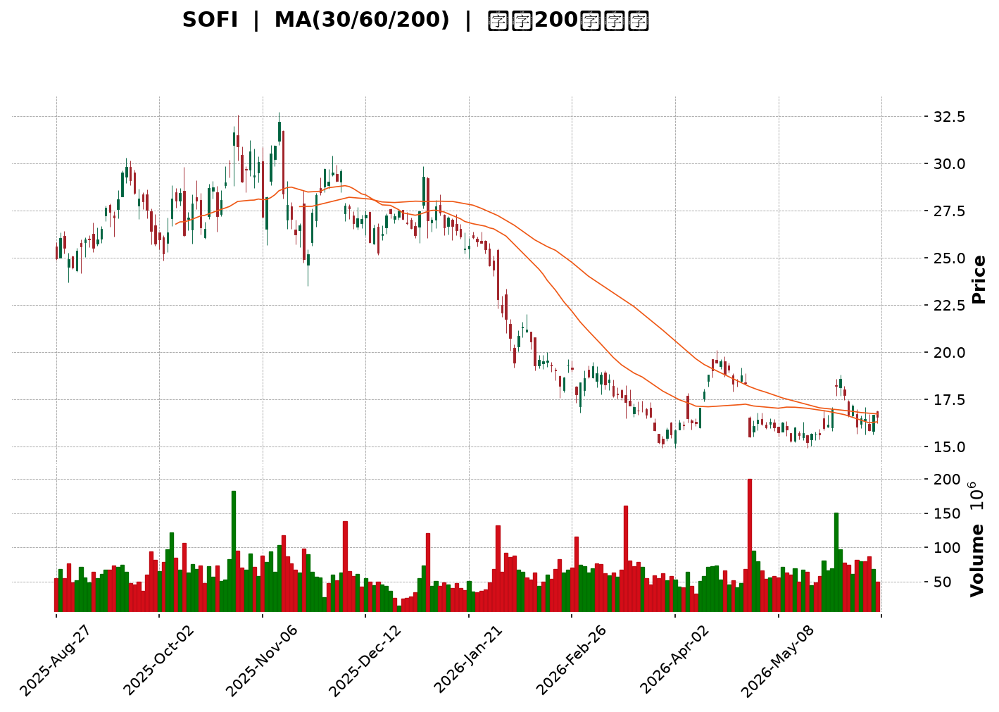
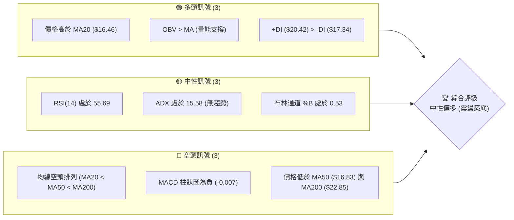
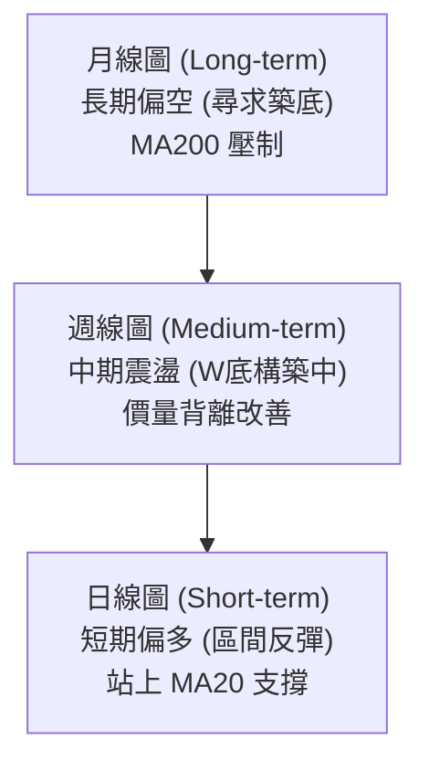
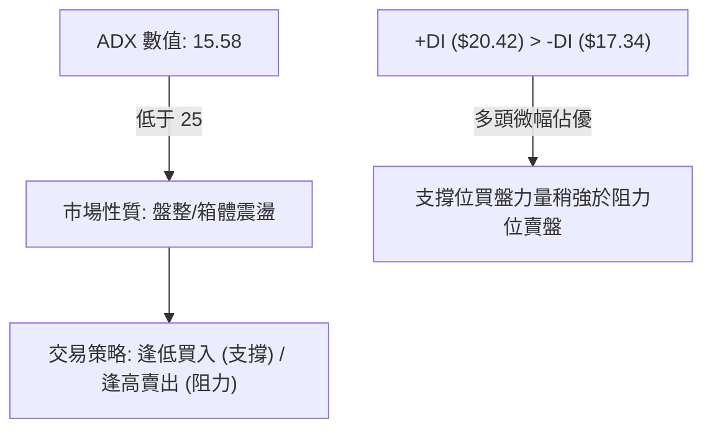
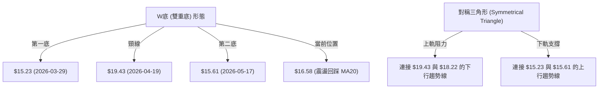

<details>
<summary>📊 靜態圖表 (點擊展開)</summary>

</details>

<html>
<head><meta charset="utf-8" /></head>
<body>
    <div style="height:500px; width:100%;">                        <script>window.PlotlyConfig = {MathJaxConfig: 'local'};</script>
        <script charset="utf-8" src="https://cdn.plot.ly/plotly-3.6.0.min.js" integrity="sha256-QaOVwtVY0T02VaHrr6pnoHLCwayMJp4O5n4YyaE3rJk=" crossorigin="anonymous"></script>                <div id="candlestick-chart" class="plotly-graph-div" style="height:100%; width:100%;"></div>            <script>                window.PLOTLYENV=window.PLOTLYENV || {};                                if (document.getElementById("candlestick-chart")) {                    Plotly.newPlot(                        "candlestick-chart",                        [{"close":{"dtype":"f8","bdata":"AAAAgML1OEAAAACAPQo6QAAAAIA9ijlAAAAAwPXoOEAAAACgcH04QAAAAKBHYTlAAAAAoJmZOUAAAACAwvU5QAAAAOBR+DlAAAAAwB6FOUAAAACAwvU5QAAAAMDMjDpAAAAAIIWrO0AAAAAghWs7QAAAAADXIztAAAAAACkcPEAAAABgj4I9QAAAACBczz1AAAAAQAoXPUAAAADgo3A8QAAAAGC4HjxAAAAAQOH6O0AAAADAzIw7QAAAACCFazpAAAAAYI\u002fCOUAAAADgUfg5QAAAAKBwPTlAAAAAAClcOkAAAAAA1yM8QAAAAMAeBTxAAAAAQDNzPEAAAADgozA6QAAAAADXIztAAAAAYLjeO0AAAAAgrgc8QAAAAKCZmTpAAAAAgD2KOkAAAACAFK48QAAAAAAAwDxAAAAA4KMwO0AAAADgehQ8QAAAAGCPAj1AAAAAAAAAPkAAAADA9ag\u002fQAAAAGBm5j5AAAAAIK4HPUAAAACAFK49QAAAAKBHoT5AAAAAYLhePUAAAACA6xE+QAAAAMD1KDtAAAAAgMI1PEAAAACAPYo+QAAAAEAz8z5AAAAAQOEaQEAAAAAA12M8QAAAAIDr0TtAAAAAgD0KO0AAAACgcD06QAAAAOBRuDpAAAAAwPXoOEAAAADgozA5QAAAAGBmZjtAAAAA4HpUPEAAAACgcH08QAAAAOBRuD1AAAAAIK4HPUAAAABgj4I9QAAAAIDrET1AAAAAoJmZPUAAAAAgrsc7QAAAAAApnDtAAAAA4HrUOkAAAABAChc7QAAAAIDrETtAAAAAIK5HO0AAAACA69E5QAAAAOB6lDpAAAAAwB5FOUAAAACAPUo6QAAAAKBwPTtAAAAAoJlZO0AAAADgozA7QAAAAEDhejtAAAAAgOsRO0AAAACA69E6QAAAACBcjzpAAAAAgBQuOkAAAACAwnU7QAAAACCuRz1AAAAAQOH6OkAAAAAAAAA7QAAAAOBRuDtAAAAAYGZmO0AAAACgmZk6QAAAAADXIztAAAAAIIWrOkAAAADgo3A6QAAAAKBHITpAAAAAoHB9OUAAAAAA16M5QAAAAEAKFzpAAAAAoJnZOUAAAADAzMw5QAAAAIDCdTlAAAAAoJmZOEAAAAAAKVw4QAAAACBczzZAAAAA4HoUNkAAAABgj8I1QAAAAAAAwDRAAAAAgMJ1M0AAAAAAKdw0QAAAAKCZWTVAAAAAgBQuNUAAAADAzIw0QAAAAMDMTDNAAAAAACmcM0AAAABgj4IzQAAAAIA9ijNAAAAAwMxMM0AAAADAHgUzQAAAAOBRODJAAAAAwPWoMkAAAACAPUozQAAAAKCZGTNAAAAAYI\u002fCMUAAAAAA12MyQAAAAAApnDJAAAAAQDOzMkAAAAAAAEAzQAAAAGBm5jJAAAAAgD3KMkAAAACAPUoyQAAAACCuhzJAAAAAQDOzMUAAAABgj8IxQAAAAKBHoTFAAAAAYLheMUAAAACAFC4xQAAAAOB6FDFAAAAAYGbmMEAAAABgZiYxQAAAAEAzszBAAAAAIFyPMEAAAACgcL0vQAAAAIDCdS5AAAAAwMxMLkAAAABgj8IvQAAAAGCPQi9AAAAAQDOzL0AAAADAHkUwQAAAAAApHDBAAAAAoHB9MEAAAADAHkUwQAAAAOBRODBAAAAAwMwMMUAAAADA9egxQAAAAIA9yjJAAAAAIK4HM0AAAACAFG4zQAAAAAAAgDNAAAAA4HrUMkAAAAAgXA8zQAAAAIDrUTJAAAAA4KNwMkAAAABgj8IyQAAAAAApXDJAAAAAwMwML0AAAACgmRkwQAAAAIAUbjBAAAAAQDMzMEAAAADAHgUwQAAAAMDMTDBAAAAAAAAAMEAAAAAAAIAvQAAAAGCPQjBAAAAAwMzML0AAAABguJ4uQAAAAMAeBTBAAAAA4FE4L0AAAAAghWsvQAAAAIDCdS5AAAAAoEdhL0AAAADAzEwvQAAAAKBwPS9AAAAAgML1L0AAAAAghSswQAAAAOBR+DBAAAAA4FE4MkAAAADgepQyQAAAAKBwvTFAAAAAgBSuMEAAAABgZiYxQAAAACCuBzBAAAAAAACAMEAAAADgUXgwQAAAAKBwvS9AAAAAIIWrMEAAAADgepQwQA=="},"high":{"dtype":"f8","bdata":"AAAAIFzPOUAAAADgelQ6QAAAACCFazpAAAAAIK5HOUAAAAAAKRw5QAAAAIA9ijlAAAAA4FH4OUAAAACgmRk6QAAAAOCjMDpAAAAAQOHaOkAAAACgmZk6QAAAAOCjsDpAAAAAwB7FO0AAAACgR+E7QAAAAIDCdTtAAAAAQLaTPEAAAACgR6E9QAAAAMDMTD5AAAAAANcjPkAAAAAghas9QAAAACCFqzxAAAAAQOF6PEAAAACgR6E8QAAAAAApnDtAAAAA4HpUO0AAAACgmVk6QAAAAIAULjpAAAAAANcjO0AAAABACtc8QAAAAIDCtTxAAAAA4KOwPEAAAADAzMw9QAAAAIAUbjtAAAAAoJlZPEAAAABAChc9QAAAAOCjcDxAAAAAIIXrOkAAAACAFO48QAAAAIDrET1AAAAAwMzMPEAAAADgUZg8QAAAAGC43j1AAAAAQDMzPkAAAABA4fo\u002fQAAAAOBRSEBAAAAAgD3qPkAAAAAAKdw9QAAAAOBROD9AAAAAgD3KPkAAAABguF4+QAAAAGDn2z5AAAAAoHA9PEAAAADgUfg+QAAAAKBw\u002fT5AAAAAoHBdQEAAAAAAAMA\u002fQAAAAIDrET1AAAAAQDPzO0AAAAAAAAA7QAAAAKCZ2TpAAAAAQDOTPEAAAACA63E5QAAAAAApnDtAAAAAQDNzPEAAAAAAAEA9QAAAAAAAwD1AAAAAQDOzPUAAAAAghWs+QAAAAIAU7j1AAAAAQDOzPUAAAACAFO47QAAAAOB61DtAAAAAQDNzO0AAAACAFK47QAAAACCuRztAAAAAAACAO0AAAABA4Xo7QAAAAKBwvTpAAAAAgMLVOkAAAABACrc6QAAAAGC4XjtAAAAAYLieO0AAAABAClc7QAAAAIA9ijtAAAAAwMyMO0AAAADA9Wg7QAAAAADXIztAAAAAYGbmOkAAAACgR4E7QAAAAAAp3D1AAAAAwMxMPUAAAACAFC47QAAAAIAUDjxAAAAAAABgPEAAAABg5VA7QAAAAEAzMztAAAAAgMIVO0AAAADgelQ7QAAAACCuxzpAAAAAQApXOkAAAADAzAw6QAAAAADXYzpAAAAAoEchOkAAAABgZmY6QAAAAIAU7jlAAAAAgD3KOUAAAABguB45QAAAAOBReDlAAAAAAAAAN0AAAAAAKVw3QAAAAADXwzVAAAAAYGZmNEAAAADA9Sg1QAAAAEAKlzVAAAAAAAAANkAAAACgmRk1QAAAAIA9yjRAAAAAYLjeM0AAAABACtczQAAAAGCPAjRAAAAAQOF6M0AAAADgozAzQAAAAKBHwTJAAAAAgMK1MkAAAABguJ4zQAAAACBcjzNAAAAAgMI1MkAAAADA9WgyQAAAAIA9CjNAAAAAIK5HM0AAAABA4XozQAAAAGC4PjNAAAAAgOvxMkAAAABgZgYzQAAAAKCZ2TJAAAAAwMyMMkAAAABgZiYyQAAAAIDrETJAAAAAoEdBMkAAAAAgrgcyQAAAACCFSzFAAAAAwHJoMUAAAADA9WgxQAAAAIDrETFAAAAAQApXMUAAAACgcH0wQAAAAKBHYS9AAAAAoEchL0AAAABgZgYwQAAAAIDrUTBAAAAAIK7HL0AAAADAzGwwQAAAAEDhWjBAAAAAoJnZMUAAAADgUXgwQAAAAKBwfTBAAAAAIFwPMUAAAABAMxMyQAAAAIDr0TJAAAAAYLieM0AAAACgRyE0QAAAAMAepTNAAAAAwB7FM0AAAAAgsHIzQAAAAGBm5jJAAAAAQDOTMkAAAAAghSszQAAAAGC43jJAAAAAQAqXMEAAAABguF4wQAAAACCFyzBAAAAAIK7HMEAAAAAgXE8wQAAAAKBHgTBAAAAAgMJ1MEAAAADAzAwwQAAAAIDrUTBAAAAA4HpUMEAAAAAghWsvQAAAAOCjEDBAAAAAgBSuL0AAAACA61EwQAAAACCuRy9AAAAA4KNwL0AAAACA65EvQAAAAAAp3C9AAAAAQDPzMEAAAADgo7AwQAAAAOB6FDFAAAAAQAqXMkAAAAAghcsyQAAAAEDhOjJAAAAAQAp3MUAAAABA4ToxQAAAAKBw\u002fTBAAAAAwPWoMEAAAACgmRkxQAAAAOBRuDBAAAAA4KOwMEAAAABgZuYwQA=="},"hovertemplate":"\u003cb\u003e%{x|%Y-%m-%d}\u003c\u002fb\u003e\u003cbr\u003e\u958b: $%{open:.2f}\u003cbr\u003e\u9ad8: $%{high:.2f}\u003cbr\u003e\u4f4e: $%{low:.2f}\u003cbr\u003e\u6536: $%{close:.2f}\u003cextra\u003e\u003c\u002fextra\u003e","low":{"dtype":"f8","bdata":"AAAAoEfhOEAAAAAAAAA5QAAAAIDCNTlAAAAAQDOzN0AAAAAA12M4QAAAACCyPThAAAAAgBQuOEAAAADAzAw5QAAAAMDMjDlAAAAAwMxMOUAAAABguJ45QAAAAMAexTlAAAAAIFzvOkAAAACgR6E6QAAAAKBHITpAAAAA4HoUO0AAAACgcD08QAAAAOBR+DxAAAAAoJnZPEAAAACgmVk8QAAAACBcDztAAAAAIFyPO0AAAAAAKRw7QAAAAEAzszlAAAAAANejOUAAAABAM3M5QAAAAEAK1zhAAAAAIFxPOUAAAACAFK46QAAAAMAepTtAAAAAAADAO0AAAACgRyE6QAAAAOBReDpAAAAAAADAOUAAAAAgXI87QAAAAAAAQDpAAAAAYI8COkAAAAAgXA87QAAAAGBmJjxAAAAAoEdhOkAAAACg8TI7QAAAAEAzszxAAAAAwB5FPUAAAADAzMw8QAAAAADXIz5AAAAAQOH6PEAAAACgcH08QAAAAOB6VD1AAAAA4KOwPEAAAABgjwI9QAAAAKBHITtAAAAAwPWoOUAAAABACtc8QAAAAOAi2z1AAAAAgML1PkAAAABgZiY8QAAAACCuhzpAAAAAwMyMOkAAAACAwrU5QAAAACBcjzlAAAAAYLi+OEAAAADAHoU3QAAAACCupzlAAAAAoEehOkAAAAAgXE88QAAAAOB6dDxAAAAAIIWrPEAAAADgo1A9QAAAAMAeBT1AAAAAQOF6PEAAAACAFO46QAAAAMDMDDtAAAAAwMyMOkAAAABA4Xo6QAAAAIAUjjpAAAAAQDMzOkAAAACAPco5QAAAAOBRuDlAAAAAIIUrOUAAAABAM\u002fM5QAAAACCuRzpAAAAAoJkZO0AAAABAM9M6QAAAACCuBztAAAAAIK4HO0AAAACgcL06QAAAAIA9ijpAAAAAIFwPOkAAAACAPco5QAAAAKCZmTtAAAAAIK4HOkAAAACgcF06QAAAAIDrkTpAAAAAQOE6O0AAAABAMzM6QAAAAOBRODpAAAAAIIXrOUAAAACAwjU6QAAAAGCPAjpAAAAAgMI1OUAAAABAM\u002fM4QAAAAAAAADpAAAAAoJmZOUAAAADAHsU5QAAAAIDCNTlAAAAAgOuROEAAAADAzAw4QAAAACBcTzZAAAAAACncNUAAAADAHgU1QAAAAIDrETRAAAAAAKoxM0AAAACAPQo0QAAAAMDMzDRAAAAAwMwMNUAAAAAA1yM0QAAAAIA9CjNAAAAAYGYmM0AAAAAAKRwzQAAAAKCZOTNAAAAA4FH4MkAAAAAA14MyQAAAAOB6lDFAAAAAANfjMUAAAACAFO4yQAAAAOBR+DJAAAAAIFxPMUAAAADAzMwwQAAAAOCjsDFAAAAAACmcMkAAAAAA16MyQAAAAGC4HjJAAAAAwB7FMUAAAACAPQoyQAAAAOBR+DFAAAAAYLieMUAAAAAgrocxQAAAAOBReDFAAAAAQOF6MEAAAADA9SgxQAAAAOB6lDBAAAAAIIWrMEAAAABACtcwQAAAAKBwfTBAAAAAwB6FMEAAAAAAKZwvQAAAAMDMTC5AAAAAYLjeLUAAAABguJ4uQAAAAKBH4S5AAAAAACncLUAAAABgj8IvQAAAAIDr0S9AAAAAYI9CMEAAAADgetQvQAAAAOBRGDBAAAAAIIXrL0AAAABgZmYxQAAAACCFKzJAAAAAYGamMkAAAAAA12MzQAAAAEAKFzNAAAAA4KOwMkAAAADA9egyQAAAAIAU7jFAAAAAgMAqMkAAAAAA12MyQAAAAMAeRTJAAAAAAAAAL0AAAADgehQvQAAAAAAAwC9AAAAAoEchMEAAAACgR+EvQAAAAEDh+i9AAAAAwPWoL0AAAACAPQovQAAAAIA9ii9AAAAAoJkZL0AAAACAFG4uQAAAAIDCdS5AAAAAYI\u002fCLkAAAACAFK4uQAAAAEAK1y1AAAAAIFwPLkAAAABAM7MuQAAAAOBRuC5AAAAA4FG4L0AAAABgjwIwQAAAAADXoy9AAAAAgBSuMUAAAADgo7AxQAAAAIDCdTFAAAAA4HqUMEAAAACAwpUwQAAAAAApXC9AAAAAwPXoL0AAAADgT00vQAAAAMD1qC9AAAAAIFxPL0AAAABA4TowQA=="},"name":"\u50f9\u683c","open":{"dtype":"f8","bdata":"AAAAoHCdOUAAAADAHgU5QAAAAMD1KDpAAAAAAACAOEAAAAAgXA85QAAAAOB6VDhAAAAAwB7FOUAAAAAgXM85QAAAAMAeBTpAAAAAgD1KOkAAAABgj8I5QAAAAAAAADpAAAAAAABAO0AAAACAPco7QAAAAAAAQDtAAAAAQAqXO0AAAAAA10M8QAAAAMDMTD1AAAAAgBTOPUAAAAAAAIA9QAAAAGCPwjtAAAAAYLhePEAAAAAAKVw8QAAAAOBReDtAAAAAQOG6OkAAAADgelQ6QAAAAKCZGTpAAAAAwB7FOUAAAACgmRk7QAAAAKBwfTxAAAAAgD0KPEAAAADAzIw8QAAAAIDrETtAAAAAYI+COkAAAABAMzM8QAAAAIDrETxAAAAAoJkZOkAAAABAMzM7QAAAACBcjzxAAAAAoHB9PEAAAADgelQ7QAAAAOBR2DxAAAAAAAAAPkAAAACgcP0+QAAAAGC4fj9AAAAAIFxvPkAAAADgo7A9QAAAAMD1qD1AAAAAIIVLPUAAAADAHoU9QAAAAAAAID5AAAAAYGaGOkAAAAAgXA89QAAAAGC4Pj5AAAAAgBQuP0AAAABA4bo\u002fQAAAAAAAADtAAAAAgMK1O0AAAABgj4I6QAAAAKCZeTpAAAAAoEfhO0AAAACgR6E4QAAAAOB61DlAAAAAQOH6OkAAAACAwrU8QAAAAIA9yjxAAAAA4HrUPEAAAAAA12M9QAAAAMDMbD1AAAAAwPUIPUAAAACgcF07QAAAAEDhujtAAAAAoHA9O0AAAABgZqY6QAAAAEAK1zpAAAAAwB4lO0AAAAAgXG87QAAAAKBwvTlAAAAAANejOkAAAACAFC46QAAAAGC4njpAAAAA4FGYO0AAAACA6xE7QAAAACCFKztAAAAAgD2KO0AAAABguN46QAAAACCuBztAAAAAgBSuOkAAAADA9ag6QAAAACBczztAAAAAQOE6PUAAAACgcN06QAAAAAAAADtAAAAAgBTOO0AAAACAPUo7QAAAAEAzszpAAAAAAAAAO0AAAAAgXM86QAAAAIA9ijpAAAAA4KNwOUAAAAAAAIA5QAAAAIAULjpAAAAAAAAAOkAAAABgZuY5QAAAAGBm5jlAAAAAAACAOUAAAACgcN04QAAAAIAUbjlAAAAAYI+CNkAAAADAzAw3QAAAAKBwfTVAAAAAQOE6NEAAAACAPUo0QAAAAIA9SjVAAAAAQAoXNUAAAACgmRk1QAAAAIA9yjRAAAAAIK5HM0AAAADA9WgzQAAAAOBReDNAAAAA4HpUM0AAAACAwhUzQAAAAEDhujJAAAAAAAAAMkAAAAAgrkczQAAAAOCjMDNAAAAAwPUoMkAAAADAHiUxQAAAAAAAADJAAAAAIFwPM0AAAABgZqYyQAAAAAApfDJAAAAA4HpUMkAAAAAghesyQAAAAADXYzJAAAAA4FE4MkAAAADAzMwxQAAAAAAAADJAAAAA4FG4MUAAAACAFG4xQAAAAAAAwDBAAAAAgD3qMEAAAAAgricxQAAAAGC4\u002fjBAAAAAgD0KMUAAAABgZkYwQAAAAEAKVy9AAAAAACncLkAAAABgZuYuQAAAAGBmRjBAAAAAoEdhLkAAAAAgrscvQAAAAMD1KDBAAAAAgBSuMUAAAAAA12MwQAAAAMDMTDBAAAAAAAAAMEAAAAAgrocxQAAAAOBReDJAAAAAYLieM0AAAACgmZkzQAAAAGCPQjNAAAAAYI+CM0AAAACAPUozQAAAAMAexTJAAAAA4KNwMkAAAABA4XoyQAAAAMAeZTJAAAAAwMyMMEAAAACAPYovQAAAAAApPDBAAAAA4FF4MEAAAAAghSswQAAAAEAzMzBAAAAAYI9CMEAAAAAgrgcwQAAAAKCZmS9AAAAAgOsRMEAAAAAghWsvQAAAAGC4ni5AAAAAYGZmL0AAAACAwvUuQAAAAIDCNS9AAAAAQOG6LkAAAACgcD0vQAAAAGBmZi9AAAAAQOF6MEAAAADAzAwwQAAAAMAeBTBAAAAAYI9CMkAAAABgZiYyQAAAACCuBzJAAAAAoEdhMUAAAADA9agwQAAAAEDhujBAAAAAgBQuMEAAAABgZmYwQAAAAOB6NDBAAAAAANejL0AAAACgmdkwQA=="},"x":["2025-08-27T00:00:00-04:00","2025-08-28T00:00:00-04:00","2025-08-29T00:00:00-04:00","2025-09-02T00:00:00-04:00","2025-09-03T00:00:00-04:00","2025-09-04T00:00:00-04:00","2025-09-05T00:00:00-04:00","2025-09-08T00:00:00-04:00","2025-09-09T00:00:00-04:00","2025-09-10T00:00:00-04:00","2025-09-11T00:00:00-04:00","2025-09-12T00:00:00-04:00","2025-09-15T00:00:00-04:00","2025-09-16T00:00:00-04:00","2025-09-17T00:00:00-04:00","2025-09-18T00:00:00-04:00","2025-09-19T00:00:00-04:00","2025-09-22T00:00:00-04:00","2025-09-23T00:00:00-04:00","2025-09-24T00:00:00-04:00","2025-09-25T00:00:00-04:00","2025-09-26T00:00:00-04:00","2025-09-29T00:00:00-04:00","2025-09-30T00:00:00-04:00","2025-10-01T00:00:00-04:00","2025-10-02T00:00:00-04:00","2025-10-03T00:00:00-04:00","2025-10-06T00:00:00-04:00","2025-10-07T00:00:00-04:00","2025-10-08T00:00:00-04:00","2025-10-09T00:00:00-04:00","2025-10-10T00:00:00-04:00","2025-10-13T00:00:00-04:00","2025-10-14T00:00:00-04:00","2025-10-15T00:00:00-04:00","2025-10-16T00:00:00-04:00","2025-10-17T00:00:00-04:00","2025-10-20T00:00:00-04:00","2025-10-21T00:00:00-04:00","2025-10-22T00:00:00-04:00","2025-10-23T00:00:00-04:00","2025-10-24T00:00:00-04:00","2025-10-27T00:00:00-04:00","2025-10-28T00:00:00-04:00","2025-10-29T00:00:00-04:00","2025-10-30T00:00:00-04:00","2025-10-31T00:00:00-04:00","2025-11-03T00:00:00-05:00","2025-11-04T00:00:00-05:00","2025-11-05T00:00:00-05:00","2025-11-06T00:00:00-05:00","2025-11-07T00:00:00-05:00","2025-11-10T00:00:00-05:00","2025-11-11T00:00:00-05:00","2025-11-12T00:00:00-05:00","2025-11-13T00:00:00-05:00","2025-11-14T00:00:00-05:00","2025-11-17T00:00:00-05:00","2025-11-18T00:00:00-05:00","2025-11-19T00:00:00-05:00","2025-11-20T00:00:00-05:00","2025-11-21T00:00:00-05:00","2025-11-24T00:00:00-05:00","2025-11-25T00:00:00-05:00","2025-11-26T00:00:00-05:00","2025-11-28T00:00:00-05:00","2025-12-01T00:00:00-05:00","2025-12-02T00:00:00-05:00","2025-12-03T00:00:00-05:00","2025-12-04T00:00:00-05:00","2025-12-05T00:00:00-05:00","2025-12-08T00:00:00-05:00","2025-12-09T00:00:00-05:00","2025-12-10T00:00:00-05:00","2025-12-11T00:00:00-05:00","2025-12-12T00:00:00-05:00","2025-12-15T00:00:00-05:00","2025-12-16T00:00:00-05:00","2025-12-17T00:00:00-05:00","2025-12-18T00:00:00-05:00","2025-12-19T00:00:00-05:00","2025-12-22T00:00:00-05:00","2025-12-23T00:00:00-05:00","2025-12-24T00:00:00-05:00","2025-12-26T00:00:00-05:00","2025-12-29T00:00:00-05:00","2025-12-30T00:00:00-05:00","2025-12-31T00:00:00-05:00","2026-01-02T00:00:00-05:00","2026-01-05T00:00:00-05:00","2026-01-06T00:00:00-05:00","2026-01-07T00:00:00-05:00","2026-01-08T00:00:00-05:00","2026-01-09T00:00:00-05:00","2026-01-12T00:00:00-05:00","2026-01-13T00:00:00-05:00","2026-01-14T00:00:00-05:00","2026-01-15T00:00:00-05:00","2026-01-16T00:00:00-05:00","2026-01-20T00:00:00-05:00","2026-01-21T00:00:00-05:00","2026-01-22T00:00:00-05:00","2026-01-23T00:00:00-05:00","2026-01-26T00:00:00-05:00","2026-01-27T00:00:00-05:00","2026-01-28T00:00:00-05:00","2026-01-29T00:00:00-05:00","2026-01-30T00:00:00-05:00","2026-02-02T00:00:00-05:00","2026-02-03T00:00:00-05:00","2026-02-04T00:00:00-05:00","2026-02-05T00:00:00-05:00","2026-02-06T00:00:00-05:00","2026-02-09T00:00:00-05:00","2026-02-10T00:00:00-05:00","2026-02-11T00:00:00-05:00","2026-02-12T00:00:00-05:00","2026-02-13T00:00:00-05:00","2026-02-17T00:00:00-05:00","2026-02-18T00:00:00-05:00","2026-02-19T00:00:00-05:00","2026-02-20T00:00:00-05:00","2026-02-23T00:00:00-05:00","2026-02-24T00:00:00-05:00","2026-02-25T00:00:00-05:00","2026-02-26T00:00:00-05:00","2026-02-27T00:00:00-05:00","2026-03-02T00:00:00-05:00","2026-03-03T00:00:00-05:00","2026-03-04T00:00:00-05:00","2026-03-05T00:00:00-05:00","2026-03-06T00:00:00-05:00","2026-03-09T00:00:00-04:00","2026-03-10T00:00:00-04:00","2026-03-11T00:00:00-04:00","2026-03-12T00:00:00-04:00","2026-03-13T00:00:00-04:00","2026-03-16T00:00:00-04:00","2026-03-17T00:00:00-04:00","2026-03-18T00:00:00-04:00","2026-03-19T00:00:00-04:00","2026-03-20T00:00:00-04:00","2026-03-23T00:00:00-04:00","2026-03-24T00:00:00-04:00","2026-03-25T00:00:00-04:00","2026-03-26T00:00:00-04:00","2026-03-27T00:00:00-04:00","2026-03-30T00:00:00-04:00","2026-03-31T00:00:00-04:00","2026-04-01T00:00:00-04:00","2026-04-02T00:00:00-04:00","2026-04-06T00:00:00-04:00","2026-04-07T00:00:00-04:00","2026-04-08T00:00:00-04:00","2026-04-09T00:00:00-04:00","2026-04-10T00:00:00-04:00","2026-04-13T00:00:00-04:00","2026-04-14T00:00:00-04:00","2026-04-15T00:00:00-04:00","2026-04-16T00:00:00-04:00","2026-04-17T00:00:00-04:00","2026-04-20T00:00:00-04:00","2026-04-21T00:00:00-04:00","2026-04-22T00:00:00-04:00","2026-04-23T00:00:00-04:00","2026-04-24T00:00:00-04:00","2026-04-27T00:00:00-04:00","2026-04-28T00:00:00-04:00","2026-04-29T00:00:00-04:00","2026-04-30T00:00:00-04:00","2026-05-01T00:00:00-04:00","2026-05-04T00:00:00-04:00","2026-05-05T00:00:00-04:00","2026-05-06T00:00:00-04:00","2026-05-07T00:00:00-04:00","2026-05-08T00:00:00-04:00","2026-05-11T00:00:00-04:00","2026-05-12T00:00:00-04:00","2026-05-13T00:00:00-04:00","2026-05-14T00:00:00-04:00","2026-05-15T00:00:00-04:00","2026-05-18T00:00:00-04:00","2026-05-19T00:00:00-04:00","2026-05-20T00:00:00-04:00","2026-05-21T00:00:00-04:00","2026-05-22T00:00:00-04:00","2026-05-26T00:00:00-04:00","2026-05-27T00:00:00-04:00","2026-05-28T00:00:00-04:00","2026-05-29T00:00:00-04:00","2026-06-01T00:00:00-04:00","2026-06-02T00:00:00-04:00","2026-06-03T00:00:00-04:00","2026-06-04T00:00:00-04:00","2026-06-05T00:00:00-04:00","2026-06-08T00:00:00-04:00","2026-06-09T00:00:00-04:00","2026-06-10T00:00:00-04:00","2026-06-11T00:00:00-04:00","2026-06-12T00:00:00-04:00"],"type":"candlestick"},{"hovertemplate":"MA30: $%{y:.2f}\u003cextra\u003e\u003c\u002fextra\u003e","line":{"color":"#2196F3","dash":"dash","width":2},"mode":"lines","name":"MA30","x":["2025-08-27T00:00:00-04:00","2025-08-28T00:00:00-04:00","2025-08-29T00:00:00-04:00","2025-09-02T00:00:00-04:00","2025-09-03T00:00:00-04:00","2025-09-04T00:00:00-04:00","2025-09-05T00:00:00-04:00","2025-09-08T00:00:00-04:00","2025-09-09T00:00:00-04:00","2025-09-10T00:00:00-04:00","2025-09-11T00:00:00-04:00","2025-09-12T00:00:00-04:00","2025-09-15T00:00:00-04:00","2025-09-16T00:00:00-04:00","2025-09-17T00:00:00-04:00","2025-09-18T00:00:00-04:00","2025-09-19T00:00:00-04:00","2025-09-22T00:00:00-04:00","2025-09-23T00:00:00-04:00","2025-09-24T00:00:00-04:00","2025-09-25T00:00:00-04:00","2025-09-26T00:00:00-04:00","2025-09-29T00:00:00-04:00","2025-09-30T00:00:00-04:00","2025-10-01T00:00:00-04:00","2025-10-02T00:00:00-04:00","2025-10-03T00:00:00-04:00","2025-10-06T00:00:00-04:00","2025-10-07T00:00:00-04:00","2025-10-08T00:00:00-04:00","2025-10-09T00:00:00-04:00","2025-10-10T00:00:00-04:00","2025-10-13T00:00:00-04:00","2025-10-14T00:00:00-04:00","2025-10-15T00:00:00-04:00","2025-10-16T00:00:00-04:00","2025-10-17T00:00:00-04:00","2025-10-20T00:00:00-04:00","2025-10-21T00:00:00-04:00","2025-10-22T00:00:00-04:00","2025-10-23T00:00:00-04:00","2025-10-24T00:00:00-04:00","2025-10-27T00:00:00-04:00","2025-10-28T00:00:00-04:00","2025-10-29T00:00:00-04:00","2025-10-30T00:00:00-04:00","2025-10-31T00:00:00-04:00","2025-11-03T00:00:00-05:00","2025-11-04T00:00:00-05:00","2025-11-05T00:00:00-05:00","2025-11-06T00:00:00-05:00","2025-11-07T00:00:00-05:00","2025-11-10T00:00:00-05:00","2025-11-11T00:00:00-05:00","2025-11-12T00:00:00-05:00","2025-11-13T00:00:00-05:00","2025-11-14T00:00:00-05:00","2025-11-17T00:00:00-05:00","2025-11-18T00:00:00-05:00","2025-11-19T00:00:00-05:00","2025-11-20T00:00:00-05:00","2025-11-21T00:00:00-05:00","2025-11-24T00:00:00-05:00","2025-11-25T00:00:00-05:00","2025-11-26T00:00:00-05:00","2025-11-28T00:00:00-05:00","2025-12-01T00:00:00-05:00","2025-12-02T00:00:00-05:00","2025-12-03T00:00:00-05:00","2025-12-04T00:00:00-05:00","2025-12-05T00:00:00-05:00","2025-12-08T00:00:00-05:00","2025-12-09T00:00:00-05:00","2025-12-10T00:00:00-05:00","2025-12-11T00:00:00-05:00","2025-12-12T00:00:00-05:00","2025-12-15T00:00:00-05:00","2025-12-16T00:00:00-05:00","2025-12-17T00:00:00-05:00","2025-12-18T00:00:00-05:00","2025-12-19T00:00:00-05:00","2025-12-22T00:00:00-05:00","2025-12-23T00:00:00-05:00","2025-12-24T00:00:00-05:00","2025-12-26T00:00:00-05:00","2025-12-29T00:00:00-05:00","2025-12-30T00:00:00-05:00","2025-12-31T00:00:00-05:00","2026-01-02T00:00:00-05:00","2026-01-05T00:00:00-05:00","2026-01-06T00:00:00-05:00","2026-01-07T00:00:00-05:00","2026-01-08T00:00:00-05:00","2026-01-09T00:00:00-05:00","2026-01-12T00:00:00-05:00","2026-01-13T00:00:00-05:00","2026-01-14T00:00:00-05:00","2026-01-15T00:00:00-05:00","2026-01-16T00:00:00-05:00","2026-01-20T00:00:00-05:00","2026-01-21T00:00:00-05:00","2026-01-22T00:00:00-05:00","2026-01-23T00:00:00-05:00","2026-01-26T00:00:00-05:00","2026-01-27T00:00:00-05:00","2026-01-28T00:00:00-05:00","2026-01-29T00:00:00-05:00","2026-01-30T00:00:00-05:00","2026-02-02T00:00:00-05:00","2026-02-03T00:00:00-05:00","2026-02-04T00:00:00-05:00","2026-02-05T00:00:00-05:00","2026-02-06T00:00:00-05:00","2026-02-09T00:00:00-05:00","2026-02-10T00:00:00-05:00","2026-02-11T00:00:00-05:00","2026-02-12T00:00:00-05:00","2026-02-13T00:00:00-05:00","2026-02-17T00:00:00-05:00","2026-02-18T00:00:00-05:00","2026-02-19T00:00:00-05:00","2026-02-20T00:00:00-05:00","2026-02-23T00:00:00-05:00","2026-02-24T00:00:00-05:00","2026-02-25T00:00:00-05:00","2026-02-26T00:00:00-05:00","2026-02-27T00:00:00-05:00","2026-03-02T00:00:00-05:00","2026-03-03T00:00:00-05:00","2026-03-04T00:00:00-05:00","2026-03-05T00:00:00-05:00","2026-03-06T00:00:00-05:00","2026-03-09T00:00:00-04:00","2026-03-10T00:00:00-04:00","2026-03-11T00:00:00-04:00","2026-03-12T00:00:00-04:00","2026-03-13T00:00:00-04:00","2026-03-16T00:00:00-04:00","2026-03-17T00:00:00-04:00","2026-03-18T00:00:00-04:00","2026-03-19T00:00:00-04:00","2026-03-20T00:00:00-04:00","2026-03-23T00:00:00-04:00","2026-03-24T00:00:00-04:00","2026-03-25T00:00:00-04:00","2026-03-26T00:00:00-04:00","2026-03-27T00:00:00-04:00","2026-03-30T00:00:00-04:00","2026-03-31T00:00:00-04:00","2026-04-01T00:00:00-04:00","2026-04-02T00:00:00-04:00","2026-04-06T00:00:00-04:00","2026-04-07T00:00:00-04:00","2026-04-08T00:00:00-04:00","2026-04-09T00:00:00-04:00","2026-04-10T00:00:00-04:00","2026-04-13T00:00:00-04:00","2026-04-14T00:00:00-04:00","2026-04-15T00:00:00-04:00","2026-04-16T00:00:00-04:00","2026-04-17T00:00:00-04:00","2026-04-20T00:00:00-04:00","2026-04-21T00:00:00-04:00","2026-04-22T00:00:00-04:00","2026-04-23T00:00:00-04:00","2026-04-24T00:00:00-04:00","2026-04-27T00:00:00-04:00","2026-04-28T00:00:00-04:00","2026-04-29T00:00:00-04:00","2026-04-30T00:00:00-04:00","2026-05-01T00:00:00-04:00","2026-05-04T00:00:00-04:00","2026-05-05T00:00:00-04:00","2026-05-06T00:00:00-04:00","2026-05-07T00:00:00-04:00","2026-05-08T00:00:00-04:00","2026-05-11T00:00:00-04:00","2026-05-12T00:00:00-04:00","2026-05-13T00:00:00-04:00","2026-05-14T00:00:00-04:00","2026-05-15T00:00:00-04:00","2026-05-18T00:00:00-04:00","2026-05-19T00:00:00-04:00","2026-05-20T00:00:00-04:00","2026-05-21T00:00:00-04:00","2026-05-22T00:00:00-04:00","2026-05-26T00:00:00-04:00","2026-05-27T00:00:00-04:00","2026-05-28T00:00:00-04:00","2026-05-29T00:00:00-04:00","2026-06-01T00:00:00-04:00","2026-06-02T00:00:00-04:00","2026-06-03T00:00:00-04:00","2026-06-04T00:00:00-04:00","2026-06-05T00:00:00-04:00","2026-06-08T00:00:00-04:00","2026-06-09T00:00:00-04:00","2026-06-10T00:00:00-04:00","2026-06-11T00:00:00-04:00","2026-06-12T00:00:00-04:00"],"y":{"dtype":"f8","bdata":"AAAAAAAA+H8AAAAAAAD4fwAAAAAAAPh\u002fAAAAAAAA+H8AAAAAAAD4fwAAAAAAAPh\u002fAAAAAAAA+H8AAAAAAAD4fwAAAAAAAPh\u002fAAAAAAAA+H8AAAAAAAD4fwAAAAAAAPh\u002fAAAAAAAA+H8AAAAAAAD4fwAAAAAAAPh\u002fAAAAAAAA+H8AAAAAAAD4fwAAAAAAAPh\u002fAAAAAAAA+H8AAAAAAAD4fwAAAAAAAPh\u002fAAAAAAAA+H8AAAAAAAD4fwAAAAAAAPh\u002fAAAAAAAA+H8AAAAAAAD4fwAAAAAAAPh\u002fAAAAAAAA+H8AAAAAAAD4f0RERISkyTpAq6qqimznOkCJiIg4tOg6QImIiHhb9jpAERERsZ0PO0ARERHx0i07QDMzMxM8ODtAmpmZiUFAO0CJiIh4d1c7QJqZmXkwbztAVVVVpXB9O0C8u7vbh487QAAAANCFpDtAZmZmxme4O0AiIiIyltw7QKuqqgqs\u002fDtAAAAA0IUEPEDv7u4u+QU8QAAAAID4DDxAvLu7K1wPPEBVVVX1RB08QN7d3c0TFTxA7+7uPgoXPEAREREBjjA8QBEREfE1VzxA3t3dLUCOPEAAAADA5qI8QImIiNjquDxAREREVLi+PEB3d3e3ga48QCIiItJpozxAIiIikjSFPECamZkJrHw8QERERATkfjxAZmZm5tCCPECJiIjIvYY8QGZmZoZdoTxAMzMzA522PEDNzMwssr08QJqZmTltwDxAMzMz8\u002f3UPEB3d3eXbtI8QO\u002fu7j58xjxAZmZmRm+rPEBVVVX1b4Q8QCIiIjLBYzxAMzMzQ9JUPEBmZmb24TM8QKuqqppSETxAREREBFbuO0C8u7t7FM47QO\u002fu7j7DzjtAzczMjGzHO0DNzMxc1qo7QHd3dwc6jTtAd3d3h11hO0AAAADQ91M7QM3MzEw3STtAmpmZmeBBO0Crqqq6SUw7QDMzMyMiYjtA7+7uHsxzO0AAAAAgPoM7QM3MzCz5hTtA7+7ujgl+O0CrqqrK6G07QCIiIrLkVztAIiIiMsFDO0De3d2tjik7QGZmZiZ4EDtAd3d3t2XtOkAAAADQIts6QCIiIlIqzjpAq6qqes3FOkDe3d1ty7o6QERERFQOrTpAd3d3xy+WOkDNzMxcuok6QLy7u6uOaTpAIiIiAlZOOkAiIiISric6QDMzM3NM8DlAq6qqevisOUAiIiJi9HY5QCIiIjKlQjlAvLu7S2IQOUBVVVVF4do4QO\u002fu7o7tnDhAzczMLN1kOEAzMzMjBiE4QImIiMjozTdAERERkV+MN0De3d39Rkg3QM3MzOw19zZAq6qqGqGsNkCrqqoqQG42QFVVVYWkKTZAREREVJzdNUBVVVXV6pg1QFVVVSW\u002fWDVAq6qqKs4eNUAAAAAAR+g0QERERDTsqjRAZmZmZq1uNEDv7u6Oly40QO\u002fu7r508zNAd3d3d5O4M0C8u7uLQYAzQJqZmakNVDNAMzMzg9wrM0CamZlZxwQzQM3MzBx25TJAVVVVtZ3PMkBmZmYW9a8yQCIiIgJHiDJAZmZmdtpgMkARERHZ6jgyQERERMwvFjJA7+7uxiDwMUC8u7vrJtExQM3MzGTJrzFAmpmZwViSMUAiIiJK4XoxQFVVVe3faDFAVVVVfVtWMUCrqqoyljwxQFVVVb0CJDFAAAAAuPMdMUDNzMwk2xkxQERERFxkGzFAmpmZQTUeMUARERF5vh8xQJqZmTHdJDFAq6qqkjQlMUARERGpxisxQAAAAOj7KTFA3t3ddUwwMUBmZmb+1DgxQM3MzLQPPzFAVVVVPVEvMUCamZnxGSYxQHd3d\u002f+NIDFAvLu705QaMUBmZmZO8BAxQFVVVX2GDTFA7+7uJr8IMUAiIiICuQcxQERERBSDEDFAq6qqeukWMUC8u7tLDBIxQLy7u0NgFTFAmpmZ+VMTMUCrqqqijA4xQGZmZj4KBzFA3t3dnTYAMUBEREQ07PowQERERHzN9TBAERERCazsMECrqqry0t0wQAAAABhLzjBAZmZmnmHHMEC8u7vDIMAwQERERPwbsTBAVVVVPcOeMEAAAADIdo4wQLy7uzPsejBAzczMNF5qMEB3d3ef01YwQCIiIiKUQTBAzczMbFlLMEAAAAAAck8wQA=="},"type":"scatter"},{"hovertemplate":"MA60: $%{y:.2f}\u003cextra\u003e\u003c\u002fextra\u003e","line":{"color":"#9C27B0","dash":"dash","width":2},"mode":"lines","name":"MA60","x":["2025-08-27T00:00:00-04:00","2025-08-28T00:00:00-04:00","2025-08-29T00:00:00-04:00","2025-09-02T00:00:00-04:00","2025-09-03T00:00:00-04:00","2025-09-04T00:00:00-04:00","2025-09-05T00:00:00-04:00","2025-09-08T00:00:00-04:00","2025-09-09T00:00:00-04:00","2025-09-10T00:00:00-04:00","2025-09-11T00:00:00-04:00","2025-09-12T00:00:00-04:00","2025-09-15T00:00:00-04:00","2025-09-16T00:00:00-04:00","2025-09-17T00:00:00-04:00","2025-09-18T00:00:00-04:00","2025-09-19T00:00:00-04:00","2025-09-22T00:00:00-04:00","2025-09-23T00:00:00-04:00","2025-09-24T00:00:00-04:00","2025-09-25T00:00:00-04:00","2025-09-26T00:00:00-04:00","2025-09-29T00:00:00-04:00","2025-09-30T00:00:00-04:00","2025-10-01T00:00:00-04:00","2025-10-02T00:00:00-04:00","2025-10-03T00:00:00-04:00","2025-10-06T00:00:00-04:00","2025-10-07T00:00:00-04:00","2025-10-08T00:00:00-04:00","2025-10-09T00:00:00-04:00","2025-10-10T00:00:00-04:00","2025-10-13T00:00:00-04:00","2025-10-14T00:00:00-04:00","2025-10-15T00:00:00-04:00","2025-10-16T00:00:00-04:00","2025-10-17T00:00:00-04:00","2025-10-20T00:00:00-04:00","2025-10-21T00:00:00-04:00","2025-10-22T00:00:00-04:00","2025-10-23T00:00:00-04:00","2025-10-24T00:00:00-04:00","2025-10-27T00:00:00-04:00","2025-10-28T00:00:00-04:00","2025-10-29T00:00:00-04:00","2025-10-30T00:00:00-04:00","2025-10-31T00:00:00-04:00","2025-11-03T00:00:00-05:00","2025-11-04T00:00:00-05:00","2025-11-05T00:00:00-05:00","2025-11-06T00:00:00-05:00","2025-11-07T00:00:00-05:00","2025-11-10T00:00:00-05:00","2025-11-11T00:00:00-05:00","2025-11-12T00:00:00-05:00","2025-11-13T00:00:00-05:00","2025-11-14T00:00:00-05:00","2025-11-17T00:00:00-05:00","2025-11-18T00:00:00-05:00","2025-11-19T00:00:00-05:00","2025-11-20T00:00:00-05:00","2025-11-21T00:00:00-05:00","2025-11-24T00:00:00-05:00","2025-11-25T00:00:00-05:00","2025-11-26T00:00:00-05:00","2025-11-28T00:00:00-05:00","2025-12-01T00:00:00-05:00","2025-12-02T00:00:00-05:00","2025-12-03T00:00:00-05:00","2025-12-04T00:00:00-05:00","2025-12-05T00:00:00-05:00","2025-12-08T00:00:00-05:00","2025-12-09T00:00:00-05:00","2025-12-10T00:00:00-05:00","2025-12-11T00:00:00-05:00","2025-12-12T00:00:00-05:00","2025-12-15T00:00:00-05:00","2025-12-16T00:00:00-05:00","2025-12-17T00:00:00-05:00","2025-12-18T00:00:00-05:00","2025-12-19T00:00:00-05:00","2025-12-22T00:00:00-05:00","2025-12-23T00:00:00-05:00","2025-12-24T00:00:00-05:00","2025-12-26T00:00:00-05:00","2025-12-29T00:00:00-05:00","2025-12-30T00:00:00-05:00","2025-12-31T00:00:00-05:00","2026-01-02T00:00:00-05:00","2026-01-05T00:00:00-05:00","2026-01-06T00:00:00-05:00","2026-01-07T00:00:00-05:00","2026-01-08T00:00:00-05:00","2026-01-09T00:00:00-05:00","2026-01-12T00:00:00-05:00","2026-01-13T00:00:00-05:00","2026-01-14T00:00:00-05:00","2026-01-15T00:00:00-05:00","2026-01-16T00:00:00-05:00","2026-01-20T00:00:00-05:00","2026-01-21T00:00:00-05:00","2026-01-22T00:00:00-05:00","2026-01-23T00:00:00-05:00","2026-01-26T00:00:00-05:00","2026-01-27T00:00:00-05:00","2026-01-28T00:00:00-05:00","2026-01-29T00:00:00-05:00","2026-01-30T00:00:00-05:00","2026-02-02T00:00:00-05:00","2026-02-03T00:00:00-05:00","2026-02-04T00:00:00-05:00","2026-02-05T00:00:00-05:00","2026-02-06T00:00:00-05:00","2026-02-09T00:00:00-05:00","2026-02-10T00:00:00-05:00","2026-02-11T00:00:00-05:00","2026-02-12T00:00:00-05:00","2026-02-13T00:00:00-05:00","2026-02-17T00:00:00-05:00","2026-02-18T00:00:00-05:00","2026-02-19T00:00:00-05:00","2026-02-20T00:00:00-05:00","2026-02-23T00:00:00-05:00","2026-02-24T00:00:00-05:00","2026-02-25T00:00:00-05:00","2026-02-26T00:00:00-05:00","2026-02-27T00:00:00-05:00","2026-03-02T00:00:00-05:00","2026-03-03T00:00:00-05:00","2026-03-04T00:00:00-05:00","2026-03-05T00:00:00-05:00","2026-03-06T00:00:00-05:00","2026-03-09T00:00:00-04:00","2026-03-10T00:00:00-04:00","2026-03-11T00:00:00-04:00","2026-03-12T00:00:00-04:00","2026-03-13T00:00:00-04:00","2026-03-16T00:00:00-04:00","2026-03-17T00:00:00-04:00","2026-03-18T00:00:00-04:00","2026-03-19T00:00:00-04:00","2026-03-20T00:00:00-04:00","2026-03-23T00:00:00-04:00","2026-03-24T00:00:00-04:00","2026-03-25T00:00:00-04:00","2026-03-26T00:00:00-04:00","2026-03-27T00:00:00-04:00","2026-03-30T00:00:00-04:00","2026-03-31T00:00:00-04:00","2026-04-01T00:00:00-04:00","2026-04-02T00:00:00-04:00","2026-04-06T00:00:00-04:00","2026-04-07T00:00:00-04:00","2026-04-08T00:00:00-04:00","2026-04-09T00:00:00-04:00","2026-04-10T00:00:00-04:00","2026-04-13T00:00:00-04:00","2026-04-14T00:00:00-04:00","2026-04-15T00:00:00-04:00","2026-04-16T00:00:00-04:00","2026-04-17T00:00:00-04:00","2026-04-20T00:00:00-04:00","2026-04-21T00:00:00-04:00","2026-04-22T00:00:00-04:00","2026-04-23T00:00:00-04:00","2026-04-24T00:00:00-04:00","2026-04-27T00:00:00-04:00","2026-04-28T00:00:00-04:00","2026-04-29T00:00:00-04:00","2026-04-30T00:00:00-04:00","2026-05-01T00:00:00-04:00","2026-05-04T00:00:00-04:00","2026-05-05T00:00:00-04:00","2026-05-06T00:00:00-04:00","2026-05-07T00:00:00-04:00","2026-05-08T00:00:00-04:00","2026-05-11T00:00:00-04:00","2026-05-12T00:00:00-04:00","2026-05-13T00:00:00-04:00","2026-05-14T00:00:00-04:00","2026-05-15T00:00:00-04:00","2026-05-18T00:00:00-04:00","2026-05-19T00:00:00-04:00","2026-05-20T00:00:00-04:00","2026-05-21T00:00:00-04:00","2026-05-22T00:00:00-04:00","2026-05-26T00:00:00-04:00","2026-05-27T00:00:00-04:00","2026-05-28T00:00:00-04:00","2026-05-29T00:00:00-04:00","2026-06-01T00:00:00-04:00","2026-06-02T00:00:00-04:00","2026-06-03T00:00:00-04:00","2026-06-04T00:00:00-04:00","2026-06-05T00:00:00-04:00","2026-06-08T00:00:00-04:00","2026-06-09T00:00:00-04:00","2026-06-10T00:00:00-04:00","2026-06-11T00:00:00-04:00","2026-06-12T00:00:00-04:00"],"y":{"dtype":"f8","bdata":"AAAAAAAA+H8AAAAAAAD4fwAAAAAAAPh\u002fAAAAAAAA+H8AAAAAAAD4fwAAAAAAAPh\u002fAAAAAAAA+H8AAAAAAAD4fwAAAAAAAPh\u002fAAAAAAAA+H8AAAAAAAD4fwAAAAAAAPh\u002fAAAAAAAA+H8AAAAAAAD4fwAAAAAAAPh\u002fAAAAAAAA+H8AAAAAAAD4fwAAAAAAAPh\u002fAAAAAAAA+H8AAAAAAAD4fwAAAAAAAPh\u002fAAAAAAAA+H8AAAAAAAD4fwAAAAAAAPh\u002fAAAAAAAA+H8AAAAAAAD4fwAAAAAAAPh\u002fAAAAAAAA+H8AAAAAAAD4fwAAAAAAAPh\u002fAAAAAAAA+H8AAAAAAAD4fwAAAAAAAPh\u002fAAAAAAAA+H8AAAAAAAD4fwAAAAAAAPh\u002fAAAAAAAA+H8AAAAAAAD4fwAAAAAAAPh\u002fAAAAAAAA+H8AAAAAAAD4fwAAAAAAAPh\u002fAAAAAAAA+H8AAAAAAAD4fwAAAAAAAPh\u002fAAAAAAAA+H8AAAAAAAD4fwAAAAAAAPh\u002fAAAAAAAA+H8AAAAAAAD4fwAAAAAAAPh\u002fAAAAAAAA+H8AAAAAAAD4fwAAAAAAAPh\u002fAAAAAAAA+H8AAAAAAAD4fwAAAAAAAPh\u002fAAAAAAAA+H8AAAAAAAD4fzMzMyuHtjtAZmZmjlC2O0AREREhsLI7QGZmZr6fujtAvLu7SzfJO0DNzMxcSNo7QM3MzMzM7DtAZmZmRm\u002f7O0CrqqrSlAo8QJqZmdnOFzxARERETDcpPECamZk5+zA8QHd3dweBNTxAZmZmhusxPEC8u7sTgzA8QGZmZp42MDxAmpmZCawsPECrqqqS7Rw8QFVVVY0lDzxAAAAAGNn+O0CJiIi4rPU7QGZmZobr8TtA3t3dZTvvO0Dv7u4usu07QERERPw38jtAq6qq2s73O0AAAABIb\u002fs7QKuqqhIRATxA7+7udkwAPEARERG5Zf07QKuqqvrFAjxAiYiIWID8O0DNzMwU9f87QImIiJhuAjxAq6qqOm0APECamZlJU\u002fo7QERERByh\u002fDtAq6qqGi\u002f9O0BVVVVtoPM7QAAAALBy6DtAVVVV1THhO0C8u7uzyNY7QImIiEhTyjtAiYiIYJ64O0CamZmxnZ87QDMzM8NniDtAVVVVBYF1O0CamZkpzl47QDMzM6NwPTtAMzMzA1YeO0Dv7u5G4fo6QBEREdmH3zpAvLu7gzK6OkB3d3df5ZA6QM3MzJzvZzpAmpmZ6d84OkCrqqqKbBc6QN7d3W0S8zlAMzMz417TOUDv7u7up7Y5QN7d3XUFmDlAAAAA2BWAOUDv7u6OwmU5QM3MzIyXPjlAzczMVFUVOUCrqqp6FO44QLy7u5vEwDhAMzMzw66QOECamZnBPGE4QN7d3aWbNDhAERER8RkGOEAAAADotOE3QDMzM0OLvDdAiYiIcD2aN0BmZmZ+sXQ3QJqZmYlBUDdAd3d3n2EnN0BERET0\u002fQQ3QKuqqirO3jZAq6qqQhm9NkDe3d21OpY2QAAAAEjhajZAAAAAGEs+NkBERES8dBM2QCIiIhp25TVAERERYZ64NUAzMzMP5ok1QJqZma2OWTVA3t3d+X4qNUB3d3eHFvk0QKuqqhbZvjRAVVVVKVyPNEAAAAAklGE0QBEREe0KMDRAAAAATH4BNECrqqoua9UzQFVVVaHTpjNAIiIiBsh9M0ARERH9YlkzQM3MzMAROjNAIiIitoEeM0CJiIi8AgQzQO\u002fu7rLk5zJAiYiI\u002fPDJMkAAAAAcL60yQHd3d1O4jjJAq6qq9m90MkARERFFi1wyQDMzM6+OSTJARERE4JYtMkCamZmlcBUyQCIiIg4CAzJAiYiIRBn1MUBmZmaycuAxQLy7u7\u002fmyjFAq6qqzsy0MUCamZntUaAxQERERHBZkzFAzczMIIWDMUC8u7ubmXExQERERNSUYjFAmpmZXdZSMUBmZmb2tkQxQN7d3RX1NzFAmpmZDUkrMUB3d3czwRsxQM3MzBzoDDFAiYiI4E8FMUC8u7sL1\u002fswQCIiIrrX9DBAAAAAcMvyMEBmZmae7+8wQO\u002fu7pb86jBAAAAA6PvhMECJiIi4Ht0wQN7d3Q100jBAVVVVVVXNMEDv7u5O1McwQHd3d+tRwDBAERERVVW9MEDNzMz4xbowQA=="},"type":"scatter"},{"hovertemplate":"MA200: $%{y:.2f}\u003cextra\u003e\u003c\u002fextra\u003e","line":{"color":"#FF6F00","dash":"solid","width":2},"mode":"lines","name":"MA200","x":["2025-08-27T00:00:00-04:00","2025-08-28T00:00:00-04:00","2025-08-29T00:00:00-04:00","2025-09-02T00:00:00-04:00","2025-09-03T00:00:00-04:00","2025-09-04T00:00:00-04:00","2025-09-05T00:00:00-04:00","2025-09-08T00:00:00-04:00","2025-09-09T00:00:00-04:00","2025-09-10T00:00:00-04:00","2025-09-11T00:00:00-04:00","2025-09-12T00:00:00-04:00","2025-09-15T00:00:00-04:00","2025-09-16T00:00:00-04:00","2025-09-17T00:00:00-04:00","2025-09-18T00:00:00-04:00","2025-09-19T00:00:00-04:00","2025-09-22T00:00:00-04:00","2025-09-23T00:00:00-04:00","2025-09-24T00:00:00-04:00","2025-09-25T00:00:00-04:00","2025-09-26T00:00:00-04:00","2025-09-29T00:00:00-04:00","2025-09-30T00:00:00-04:00","2025-10-01T00:00:00-04:00","2025-10-02T00:00:00-04:00","2025-10-03T00:00:00-04:00","2025-10-06T00:00:00-04:00","2025-10-07T00:00:00-04:00","2025-10-08T00:00:00-04:00","2025-10-09T00:00:00-04:00","2025-10-10T00:00:00-04:00","2025-10-13T00:00:00-04:00","2025-10-14T00:00:00-04:00","2025-10-15T00:00:00-04:00","2025-10-16T00:00:00-04:00","2025-10-17T00:00:00-04:00","2025-10-20T00:00:00-04:00","2025-10-21T00:00:00-04:00","2025-10-22T00:00:00-04:00","2025-10-23T00:00:00-04:00","2025-10-24T00:00:00-04:00","2025-10-27T00:00:00-04:00","2025-10-28T00:00:00-04:00","2025-10-29T00:00:00-04:00","2025-10-30T00:00:00-04:00","2025-10-31T00:00:00-04:00","2025-11-03T00:00:00-05:00","2025-11-04T00:00:00-05:00","2025-11-05T00:00:00-05:00","2025-11-06T00:00:00-05:00","2025-11-07T00:00:00-05:00","2025-11-10T00:00:00-05:00","2025-11-11T00:00:00-05:00","2025-11-12T00:00:00-05:00","2025-11-13T00:00:00-05:00","2025-11-14T00:00:00-05:00","2025-11-17T00:00:00-05:00","2025-11-18T00:00:00-05:00","2025-11-19T00:00:00-05:00","2025-11-20T00:00:00-05:00","2025-11-21T00:00:00-05:00","2025-11-24T00:00:00-05:00","2025-11-25T00:00:00-05:00","2025-11-26T00:00:00-05:00","2025-11-28T00:00:00-05:00","2025-12-01T00:00:00-05:00","2025-12-02T00:00:00-05:00","2025-12-03T00:00:00-05:00","2025-12-04T00:00:00-05:00","2025-12-05T00:00:00-05:00","2025-12-08T00:00:00-05:00","2025-12-09T00:00:00-05:00","2025-12-10T00:00:00-05:00","2025-12-11T00:00:00-05:00","2025-12-12T00:00:00-05:00","2025-12-15T00:00:00-05:00","2025-12-16T00:00:00-05:00","2025-12-17T00:00:00-05:00","2025-12-18T00:00:00-05:00","2025-12-19T00:00:00-05:00","2025-12-22T00:00:00-05:00","2025-12-23T00:00:00-05:00","2025-12-24T00:00:00-05:00","2025-12-26T00:00:00-05:00","2025-12-29T00:00:00-05:00","2025-12-30T00:00:00-05:00","2025-12-31T00:00:00-05:00","2026-01-02T00:00:00-05:00","2026-01-05T00:00:00-05:00","2026-01-06T00:00:00-05:00","2026-01-07T00:00:00-05:00","2026-01-08T00:00:00-05:00","2026-01-09T00:00:00-05:00","2026-01-12T00:00:00-05:00","2026-01-13T00:00:00-05:00","2026-01-14T00:00:00-05:00","2026-01-15T00:00:00-05:00","2026-01-16T00:00:00-05:00","2026-01-20T00:00:00-05:00","2026-01-21T00:00:00-05:00","2026-01-22T00:00:00-05:00","2026-01-23T00:00:00-05:00","2026-01-26T00:00:00-05:00","2026-01-27T00:00:00-05:00","2026-01-28T00:00:00-05:00","2026-01-29T00:00:00-05:00","2026-01-30T00:00:00-05:00","2026-02-02T00:00:00-05:00","2026-02-03T00:00:00-05:00","2026-02-04T00:00:00-05:00","2026-02-05T00:00:00-05:00","2026-02-06T00:00:00-05:00","2026-02-09T00:00:00-05:00","2026-02-10T00:00:00-05:00","2026-02-11T00:00:00-05:00","2026-02-12T00:00:00-05:00","2026-02-13T00:00:00-05:00","2026-02-17T00:00:00-05:00","2026-02-18T00:00:00-05:00","2026-02-19T00:00:00-05:00","2026-02-20T00:00:00-05:00","2026-02-23T00:00:00-05:00","2026-02-24T00:00:00-05:00","2026-02-25T00:00:00-05:00","2026-02-26T00:00:00-05:00","2026-02-27T00:00:00-05:00","2026-03-02T00:00:00-05:00","2026-03-03T00:00:00-05:00","2026-03-04T00:00:00-05:00","2026-03-05T00:00:00-05:00","2026-03-06T00:00:00-05:00","2026-03-09T00:00:00-04:00","2026-03-10T00:00:00-04:00","2026-03-11T00:00:00-04:00","2026-03-12T00:00:00-04:00","2026-03-13T00:00:00-04:00","2026-03-16T00:00:00-04:00","2026-03-17T00:00:00-04:00","2026-03-18T00:00:00-04:00","2026-03-19T00:00:00-04:00","2026-03-20T00:00:00-04:00","2026-03-23T00:00:00-04:00","2026-03-24T00:00:00-04:00","2026-03-25T00:00:00-04:00","2026-03-26T00:00:00-04:00","2026-03-27T00:00:00-04:00","2026-03-30T00:00:00-04:00","2026-03-31T00:00:00-04:00","2026-04-01T00:00:00-04:00","2026-04-02T00:00:00-04:00","2026-04-06T00:00:00-04:00","2026-04-07T00:00:00-04:00","2026-04-08T00:00:00-04:00","2026-04-09T00:00:00-04:00","2026-04-10T00:00:00-04:00","2026-04-13T00:00:00-04:00","2026-04-14T00:00:00-04:00","2026-04-15T00:00:00-04:00","2026-04-16T00:00:00-04:00","2026-04-17T00:00:00-04:00","2026-04-20T00:00:00-04:00","2026-04-21T00:00:00-04:00","2026-04-22T00:00:00-04:00","2026-04-23T00:00:00-04:00","2026-04-24T00:00:00-04:00","2026-04-27T00:00:00-04:00","2026-04-28T00:00:00-04:00","2026-04-29T00:00:00-04:00","2026-04-30T00:00:00-04:00","2026-05-01T00:00:00-04:00","2026-05-04T00:00:00-04:00","2026-05-05T00:00:00-04:00","2026-05-06T00:00:00-04:00","2026-05-07T00:00:00-04:00","2026-05-08T00:00:00-04:00","2026-05-11T00:00:00-04:00","2026-05-12T00:00:00-04:00","2026-05-13T00:00:00-04:00","2026-05-14T00:00:00-04:00","2026-05-15T00:00:00-04:00","2026-05-18T00:00:00-04:00","2026-05-19T00:00:00-04:00","2026-05-20T00:00:00-04:00","2026-05-21T00:00:00-04:00","2026-05-22T00:00:00-04:00","2026-05-26T00:00:00-04:00","2026-05-27T00:00:00-04:00","2026-05-28T00:00:00-04:00","2026-05-29T00:00:00-04:00","2026-06-01T00:00:00-04:00","2026-06-02T00:00:00-04:00","2026-06-03T00:00:00-04:00","2026-06-04T00:00:00-04:00","2026-06-05T00:00:00-04:00","2026-06-08T00:00:00-04:00","2026-06-09T00:00:00-04:00","2026-06-10T00:00:00-04:00","2026-06-11T00:00:00-04:00","2026-06-12T00:00:00-04:00"],"y":{"dtype":"f8","bdata":"AAAAAAAA+H8AAAAAAAD4fwAAAAAAAPh\u002fAAAAAAAA+H8AAAAAAAD4fwAAAAAAAPh\u002fAAAAAAAA+H8AAAAAAAD4fwAAAAAAAPh\u002fAAAAAAAA+H8AAAAAAAD4fwAAAAAAAPh\u002fAAAAAAAA+H8AAAAAAAD4fwAAAAAAAPh\u002fAAAAAAAA+H8AAAAAAAD4fwAAAAAAAPh\u002fAAAAAAAA+H8AAAAAAAD4fwAAAAAAAPh\u002fAAAAAAAA+H8AAAAAAAD4fwAAAAAAAPh\u002fAAAAAAAA+H8AAAAAAAD4fwAAAAAAAPh\u002fAAAAAAAA+H8AAAAAAAD4fwAAAAAAAPh\u002fAAAAAAAA+H8AAAAAAAD4fwAAAAAAAPh\u002fAAAAAAAA+H8AAAAAAAD4fwAAAAAAAPh\u002fAAAAAAAA+H8AAAAAAAD4fwAAAAAAAPh\u002fAAAAAAAA+H8AAAAAAAD4fwAAAAAAAPh\u002fAAAAAAAA+H8AAAAAAAD4fwAAAAAAAPh\u002fAAAAAAAA+H8AAAAAAAD4fwAAAAAAAPh\u002fAAAAAAAA+H8AAAAAAAD4fwAAAAAAAPh\u002fAAAAAAAA+H8AAAAAAAD4fwAAAAAAAPh\u002fAAAAAAAA+H8AAAAAAAD4fwAAAAAAAPh\u002fAAAAAAAA+H8AAAAAAAD4fwAAAAAAAPh\u002fAAAAAAAA+H8AAAAAAAD4fwAAAAAAAPh\u002fAAAAAAAA+H8AAAAAAAD4fwAAAAAAAPh\u002fAAAAAAAA+H8AAAAAAAD4fwAAAAAAAPh\u002fAAAAAAAA+H8AAAAAAAD4fwAAAAAAAPh\u002fAAAAAAAA+H8AAAAAAAD4fwAAAAAAAPh\u002fAAAAAAAA+H8AAAAAAAD4fwAAAAAAAPh\u002fAAAAAAAA+H8AAAAAAAD4fwAAAAAAAPh\u002fAAAAAAAA+H8AAAAAAAD4fwAAAAAAAPh\u002fAAAAAAAA+H8AAAAAAAD4fwAAAAAAAPh\u002fAAAAAAAA+H8AAAAAAAD4fwAAAAAAAPh\u002fAAAAAAAA+H8AAAAAAAD4fwAAAAAAAPh\u002fAAAAAAAA+H8AAAAAAAD4fwAAAAAAAPh\u002fAAAAAAAA+H8AAAAAAAD4fwAAAAAAAPh\u002fAAAAAAAA+H8AAAAAAAD4fwAAAAAAAPh\u002fAAAAAAAA+H8AAAAAAAD4fwAAAAAAAPh\u002fAAAAAAAA+H8AAAAAAAD4fwAAAAAAAPh\u002fAAAAAAAA+H8AAAAAAAD4fwAAAAAAAPh\u002fAAAAAAAA+H8AAAAAAAD4fwAAAAAAAPh\u002fAAAAAAAA+H8AAAAAAAD4fwAAAAAAAPh\u002fAAAAAAAA+H8AAAAAAAD4fwAAAAAAAPh\u002fAAAAAAAA+H8AAAAAAAD4fwAAAAAAAPh\u002fAAAAAAAA+H8AAAAAAAD4fwAAAAAAAPh\u002fAAAAAAAA+H8AAAAAAAD4fwAAAAAAAPh\u002fAAAAAAAA+H8AAAAAAAD4fwAAAAAAAPh\u002fAAAAAAAA+H8AAAAAAAD4fwAAAAAAAPh\u002fAAAAAAAA+H8AAAAAAAD4fwAAAAAAAPh\u002fAAAAAAAA+H8AAAAAAAD4fwAAAAAAAPh\u002fAAAAAAAA+H8AAAAAAAD4fwAAAAAAAPh\u002fAAAAAAAA+H8AAAAAAAD4fwAAAAAAAPh\u002fAAAAAAAA+H8AAAAAAAD4fwAAAAAAAPh\u002fAAAAAAAA+H8AAAAAAAD4fwAAAAAAAPh\u002fAAAAAAAA+H8AAAAAAAD4fwAAAAAAAPh\u002fAAAAAAAA+H8AAAAAAAD4fwAAAAAAAPh\u002fAAAAAAAA+H8AAAAAAAD4fwAAAAAAAPh\u002fAAAAAAAA+H8AAAAAAAD4fwAAAAAAAPh\u002fAAAAAAAA+H8AAAAAAAD4fwAAAAAAAPh\u002fAAAAAAAA+H8AAAAAAAD4fwAAAAAAAPh\u002fAAAAAAAA+H8AAAAAAAD4fwAAAAAAAPh\u002fAAAAAAAA+H8AAAAAAAD4fwAAAAAAAPh\u002fAAAAAAAA+H8AAAAAAAD4fwAAAAAAAPh\u002fAAAAAAAA+H8AAAAAAAD4fwAAAAAAAPh\u002fAAAAAAAA+H8AAAAAAAD4fwAAAAAAAPh\u002fAAAAAAAA+H8AAAAAAAD4fwAAAAAAAPh\u002fAAAAAAAA+H8AAAAAAAD4fwAAAAAAAPh\u002fAAAAAAAA+H8AAAAAAAD4fwAAAAAAAPh\u002fAAAAAAAA+H8AAAAAAAD4fwAAAAAAAPh\u002fAAAAAAAA+H+4HoWtado2QA=="},"type":"scatter"}],                        {"template":{"data":{"barpolar":[{"marker":{"line":{"color":"rgb(17,17,17)","width":0.5},"pattern":{"fillmode":"overlay","size":10,"solidity":0.2}},"type":"barpolar"}],"bar":[{"error_x":{"color":"#f2f5fa"},"error_y":{"color":"#f2f5fa"},"marker":{"line":{"color":"rgb(17,17,17)","width":0.5},"pattern":{"fillmode":"overlay","size":10,"solidity":0.2}},"type":"bar"}],"carpet":[{"aaxis":{"endlinecolor":"#A2B1C6","gridcolor":"#506784","linecolor":"#506784","minorgridcolor":"#506784","startlinecolor":"#A2B1C6"},"baxis":{"endlinecolor":"#A2B1C6","gridcolor":"#506784","linecolor":"#506784","minorgridcolor":"#506784","startlinecolor":"#A2B1C6"},"type":"carpet"}],"choropleth":[{"colorbar":{"outlinewidth":0,"ticks":""},"type":"choropleth"}],"contourcarpet":[{"colorbar":{"outlinewidth":0,"ticks":""},"type":"contourcarpet"}],"contour":[{"colorbar":{"outlinewidth":0,"ticks":""},"colorscale":[[0.0,"#0d0887"],[0.1111111111111111,"#46039f"],[0.2222222222222222,"#7201a8"],[0.3333333333333333,"#9c179e"],[0.4444444444444444,"#bd3786"],[0.5555555555555556,"#d8576b"],[0.6666666666666666,"#ed7953"],[0.7777777777777778,"#fb9f3a"],[0.8888888888888888,"#fdca26"],[1.0,"#f0f921"]],"type":"contour"}],"heatmap":[{"colorbar":{"outlinewidth":0,"ticks":""},"colorscale":[[0.0,"#0d0887"],[0.1111111111111111,"#46039f"],[0.2222222222222222,"#7201a8"],[0.3333333333333333,"#9c179e"],[0.4444444444444444,"#bd3786"],[0.5555555555555556,"#d8576b"],[0.6666666666666666,"#ed7953"],[0.7777777777777778,"#fb9f3a"],[0.8888888888888888,"#fdca26"],[1.0,"#f0f921"]],"type":"heatmap"}],"histogram2dcontour":[{"colorbar":{"outlinewidth":0,"ticks":""},"colorscale":[[0.0,"#0d0887"],[0.1111111111111111,"#46039f"],[0.2222222222222222,"#7201a8"],[0.3333333333333333,"#9c179e"],[0.4444444444444444,"#bd3786"],[0.5555555555555556,"#d8576b"],[0.6666666666666666,"#ed7953"],[0.7777777777777778,"#fb9f3a"],[0.8888888888888888,"#fdca26"],[1.0,"#f0f921"]],"type":"histogram2dcontour"}],"histogram2d":[{"colorbar":{"outlinewidth":0,"ticks":""},"colorscale":[[0.0,"#0d0887"],[0.1111111111111111,"#46039f"],[0.2222222222222222,"#7201a8"],[0.3333333333333333,"#9c179e"],[0.4444444444444444,"#bd3786"],[0.5555555555555556,"#d8576b"],[0.6666666666666666,"#ed7953"],[0.7777777777777778,"#fb9f3a"],[0.8888888888888888,"#fdca26"],[1.0,"#f0f921"]],"type":"histogram2d"}],"histogram":[{"marker":{"pattern":{"fillmode":"overlay","size":10,"solidity":0.2}},"type":"histogram"}],"mesh3d":[{"colorbar":{"outlinewidth":0,"ticks":""},"type":"mesh3d"}],"parcoords":[{"line":{"colorbar":{"outlinewidth":0,"ticks":""}},"type":"parcoords"}],"pie":[{"automargin":true,"type":"pie"}],"scatter3d":[{"line":{"colorbar":{"outlinewidth":0,"ticks":""}},"marker":{"colorbar":{"outlinewidth":0,"ticks":""}},"type":"scatter3d"}],"scattercarpet":[{"marker":{"colorbar":{"outlinewidth":0,"ticks":""}},"type":"scattercarpet"}],"scattergeo":[{"marker":{"colorbar":{"outlinewidth":0,"ticks":""}},"type":"scattergeo"}],"scattergl":[{"marker":{"line":{"color":"#283442"}},"type":"scattergl"}],"scattermapbox":[{"marker":{"colorbar":{"outlinewidth":0,"ticks":""}},"type":"scattermapbox"}],"scattermap":[{"marker":{"colorbar":{"outlinewidth":0,"ticks":""}},"type":"scattermap"}],"scatterpolargl":[{"marker":{"colorbar":{"outlinewidth":0,"ticks":""}},"type":"scatterpolargl"}],"scatterpolar":[{"marker":{"colorbar":{"outlinewidth":0,"ticks":""}},"type":"scatterpolar"}],"scatter":[{"marker":{"line":{"color":"#283442"}},"type":"scatter"}],"scatterternary":[{"marker":{"colorbar":{"outlinewidth":0,"ticks":""}},"type":"scatterternary"}],"surface":[{"colorbar":{"outlinewidth":0,"ticks":""},"colorscale":[[0.0,"#0d0887"],[0.1111111111111111,"#46039f"],[0.2222222222222222,"#7201a8"],[0.3333333333333333,"#9c179e"],[0.4444444444444444,"#bd3786"],[0.5555555555555556,"#d8576b"],[0.6666666666666666,"#ed7953"],[0.7777777777777778,"#fb9f3a"],[0.8888888888888888,"#fdca26"],[1.0,"#f0f921"]],"type":"surface"}],"table":[{"cells":{"fill":{"color":"#506784"},"line":{"color":"rgb(17,17,17)"}},"header":{"fill":{"color":"#2a3f5f"},"line":{"color":"rgb(17,17,17)"}},"type":"table"}]},"layout":{"annotationdefaults":{"arrowcolor":"#f2f5fa","arrowhead":0,"arrowwidth":1},"autotypenumbers":"strict","coloraxis":{"colorbar":{"outlinewidth":0,"ticks":""}},"colorscale":{"diverging":[[0,"#8e0152"],[0.1,"#c51b7d"],[0.2,"#de77ae"],[0.3,"#f1b6da"],[0.4,"#fde0ef"],[0.5,"#f7f7f7"],[0.6,"#e6f5d0"],[0.7,"#b8e186"],[0.8,"#7fbc41"],[0.9,"#4d9221"],[1,"#276419"]],"sequential":[[0.0,"#0d0887"],[0.1111111111111111,"#46039f"],[0.2222222222222222,"#7201a8"],[0.3333333333333333,"#9c179e"],[0.4444444444444444,"#bd3786"],[0.5555555555555556,"#d8576b"],[0.6666666666666666,"#ed7953"],[0.7777777777777778,"#fb9f3a"],[0.8888888888888888,"#fdca26"],[1.0,"#f0f921"]],"sequentialminus":[[0.0,"#0d0887"],[0.1111111111111111,"#46039f"],[0.2222222222222222,"#7201a8"],[0.3333333333333333,"#9c179e"],[0.4444444444444444,"#bd3786"],[0.5555555555555556,"#d8576b"],[0.6666666666666666,"#ed7953"],[0.7777777777777778,"#fb9f3a"],[0.8888888888888888,"#fdca26"],[1.0,"#f0f921"]]},"colorway":["#636efa","#EF553B","#00cc96","#ab63fa","#FFA15A","#19d3f3","#FF6692","#B6E880","#FF97FF","#FECB52"],"font":{"color":"#f2f5fa"},"geo":{"bgcolor":"rgb(17,17,17)","lakecolor":"rgb(17,17,17)","landcolor":"rgb(17,17,17)","showlakes":true,"showland":true,"subunitcolor":"#506784"},"hoverlabel":{"align":"left"},"hovermode":"closest","mapbox":{"style":"dark"},"paper_bgcolor":"rgb(17,17,17)","plot_bgcolor":"rgb(17,17,17)","polar":{"angularaxis":{"gridcolor":"#506784","linecolor":"#506784","ticks":""},"bgcolor":"rgb(17,17,17)","radialaxis":{"gridcolor":"#506784","linecolor":"#506784","ticks":""}},"scene":{"xaxis":{"backgroundcolor":"rgb(17,17,17)","gridcolor":"#506784","gridwidth":2,"linecolor":"#506784","showbackground":true,"ticks":"","zerolinecolor":"#C8D4E3"},"yaxis":{"backgroundcolor":"rgb(17,17,17)","gridcolor":"#506784","gridwidth":2,"linecolor":"#506784","showbackground":true,"ticks":"","zerolinecolor":"#C8D4E3"},"zaxis":{"backgroundcolor":"rgb(17,17,17)","gridcolor":"#506784","gridwidth":2,"linecolor":"#506784","showbackground":true,"ticks":"","zerolinecolor":"#C8D4E3"}},"shapedefaults":{"line":{"color":"#f2f5fa"}},"sliderdefaults":{"bgcolor":"#C8D4E3","bordercolor":"rgb(17,17,17)","borderwidth":1,"tickwidth":0},"ternary":{"aaxis":{"gridcolor":"#506784","linecolor":"#506784","ticks":""},"baxis":{"gridcolor":"#506784","linecolor":"#506784","ticks":""},"bgcolor":"rgb(17,17,17)","caxis":{"gridcolor":"#506784","linecolor":"#506784","ticks":""}},"title":{"x":0.05},"updatemenudefaults":{"bgcolor":"#506784","borderwidth":0},"xaxis":{"automargin":true,"gridcolor":"#283442","linecolor":"#506784","ticks":"","title":{"standoff":15},"zerolinecolor":"#283442","zerolinewidth":2},"yaxis":{"automargin":true,"gridcolor":"#283442","linecolor":"#506784","ticks":"","title":{"standoff":15},"zerolinecolor":"#283442","zerolinewidth":2}}},"xaxis":{"rangeslider":{"visible":false},"title":{"text":"\u65e5\u671f"}},"font":{"size":11},"title":{"text":"SOFI  |  MA(30\u002f60\u002f200)  |  \u6700\u8fd1200\u4ea4\u6613\u65e5"},"yaxis":{"title":{"text":"\u80a1\u50f9 (USD)"}},"hovermode":"x unified","height":500},                        {"responsive": true}                    )                };            </script>        </div>
</body>
</html>

# SOFI 技術分析報告

> **報告日期**：2026-06-12 ｜ **語言**：繁體中文 ｜ **數據來源**：Yahoo Finance ｜ **當前價格**：$16.58

---

## 目錄

| 章節 | 內容 |
|------|------|
| [1. 技術面概覽](#1-技術面概覽) | 訊號儀表板、核心指標、評分卡 |
| [2. 趨勢分析](#2-趨勢分析) | 多時框趨勢、長中短期走勢 |
| [3. 圖表形態分析](#3-圖表形態分析) | 形態識別、K線組合、目標價 |
| [4. 支撐與阻力](#4-支撐與阻力) | 關鍵價位、斐波那契回調 |
| [5. 技術指標深度解讀](#5-技術指標深度解讀) | MA/RSI/MACD/布林/成交量 |
| [6. 動能與波動率](#6-動能與波動率) | 動能評估、ATR、Beta |
| [7. 多時框架總結](#7-多時框架總結) | 時框架評分矩陣 |
| [8. 交易策略建議](#8-交易策略建議) | 多空策略、風險報酬比 |
| [9. 風險提示與監控](#9-風險提示與監控) | 監控指標、風險場景 |
| [10. 報告總結](#10-報告總結) | 核心結論與最優策略組合 |

---

## 1. 技術面概覽

### 🎯 技術訊號儀表板

SoFi Technologies, Inc. (SOFI) 目前正處於長期下跌趨勢後的**底部築底與寬幅震盪階段**。以下為多空指標的全面分布圖：



### 📊 核心指標速覽表

| 指標類別 | 指標名稱 | 當前數值 | 訊號 | 解讀 |
|----------|----------|----------|------|------|
| **價格** | 當前收盤價 | $16.58 | 🟡 中性 | 處於52週區間（$13.97 - $32.73）的 13.9% 低位，築底跡象明顯 |
| **均線** | MA20 | $16.46 | 🟢 多頭 | 價格成功站上短期均線，MA20 轉為向上支撐 |
| **均線** | MA50 | $16.83 | 🔴 空頭 | 價格受制於中期均線，MA50 依然呈現下行趨勢 |
| **均線** | MA200 | $22.85 | 🔴 空頭 | 長期牛熊分界線在上，遠高於現價，長期趨勢偏空 |
| **動能** | RSI(14) | 55.69 | 🟡 中性 | 脫離超賣區，多頭動能略微佔優，但尚未進入超買 |
| **動能** | MACD | -0.032 | 🔴 空頭 | MACD與Signal線在零軸下方纏繞，柱狀圖 -0.007 偏弱 |
| **動能** | 隨機指標 | %K: 29.55 / %D: 27.59 | 🟡 中性 | 於低位形成黃金交叉後向上，暗示短期仍有反彈空間 |
| **波動** | ATR(14) | $1.08 (6.53%) | 🟡 中性 | 日均波動幅度大，適合區間波段操作，需寬鬆止損 |
| **趨勢** | ADX(14) | 15.58 | 🟡 中性 | ADX 低於 25，顯示當前處於典型的無趨勢/盤整行情 |
| **成交量**| 量比 (20日) | 0.68x | 🔴 空頭 | 當前成交量（49.4M）低於均量（72.7M），買盤追高意願不足 |

### 🏆 技術評分卡

╔══════════════════════════════════════════════════════════╗
║             技術評分卡 — SOFI (2026-06-12)               ║
╠══════════════════════════════════════════════════════════╣
║  趨勢強度      ██████░░░░░░░░░░░░░░░░  30/100  🔴 弱趨勢 ║
║  動能指標      ██████████░░░░░░░░░░░░  50/100  🟡 中性   ║
║  支撐穩定度    ██████████████░░░░░░░░  70/100  🟢 偏強   ║
║  成交量配合    ██████████░░░░░░░░░░░░  50/100  🟡 中性   ║
║  形態完整度    ██████████████░░░░░░░░  70/100  🟢 偏強   ║
║  均線排列      ████░░░░░░░░░░░░░░░░░░  20/100  🔴 空頭   ║
╠══════════════════════════════════════════════════════════╣
║  綜合評分      ██████████░░░░░░░░░░░░  48/100  🟡 中性   ║
╚══════════════════════════════════════════════════════════╝

---

## 2. 趨勢分析

### 🌐 多時框趨勢分析

多時框架（Multi-timeframe）分析顯示 SOFI 的趨勢力量在不同維度上存在明顯的分歧與重組：



### 📈 長期趨勢 — 24個月歷史走勢圖

SOFI 的長期走勢經歷了顯著的「倒V型」過山車行情。從 2024 年中旬的 $6.61 一路飆升至 2025 年 11 月的歷史高點 $29.72，隨後展開了深幅的回撤，最低跌至 2026 年 3 月的 $15.88 附近，目前正試圖在 $15.00 - $18.00 區間建立穩固的支撐平台。

```
SOFI 月線走勢圖（過去24個月）
價格軸 ($)
$30 ┤                                      ● ●
$27 ┤                                    ●     ●
$24 ┤                             ●              ●
$21 ┤                          ●                    ●
$18 ┤                                                 ●       ●(現在)
$15 ┤             ●  ●  ●  ●                            ●  ●  
$12 ┤         ●  
$ 9 ┤     ●  
$ 6 ┤ ●  
    └─┬──┬──┬──┬──┬──┬──┬──┬──┬──┬──┬──┬──┬──┬──┬──┬──┬──┬──┬──┬──┬──┬──┬──
     06 08 10 12 02 04 06 08 10 12 02 04 06 08 10 12 02 04 06  (月份 24-26)
```

**長期走勢特徵分析表格**：

| 階段 | 時間區間 | 起始與終點價 | 漲跌幅 | 走勢特徵與量能配合 |
|------|----------|--------------|--------|-------------------|
| **1. 初始啟動** | 2024-06 至 2024-09 | $6.61 → $7.86 | +18.91% | 穩步溫和放量，突破低位整理區間，奠定多頭基礎。 |
| **2. 主升浪潮** | 2024-10 至 2024-11 | $11.17 → $16.41 | +46.91% | 爆發性放量上攻，買盤極度強勁，呈現陡峭上升軌道。 |
| **3. 高位橫盤** | 2024-12 至 2025-05 | $15.40 → $13.30 | -13.63% | 獲利回吐與高位震盪，MA20 形成有效中期支撐。 |
| **4. 二次狂飆** | 2025-06 至 2025-11 | $18.21 → $29.72 | +63.21% | 極端投機行情，股價衝至 52 週高點 $32.73，RSI 嚴重超買。 |
| **5. 估值修正** | 2025-12 至 2026-03 | $26.18 → $15.88 | -39.34% | 恐慌性拋售，連續跌破多條關鍵均線（MA20, MA50），空頭主導。 |
| **6. 區間築底** | 2026-04 至 2026-06 | $16.10 → $16.58 | +2.98% | 波動率收窄，成交量萎縮，於 $15.00 - $18.00 區間反覆震盪。 |

### 📊 中期趨勢（週線分析）

中期週線圖顯示，SOFI 在經歷了 2026 年第一季度的快速暴跌後，正在構築一個潛在的**雙重底（W底）**形態。

```
中期週線壓力與支撐示意圖：
$20.00 ─────────────────────────────────────────────── [中期關鍵壓力位 / W底頸線]
$19.43 ───────● (4/19 高點)
              │  \                                  /
              │   \                                /
$17.50 ───────┼────● (5/31 反彈高點)              /
              │     \                            /
$16.58 ───────┼──────● (當前價格 $16.58)  ───/───
              │       \                        /
$15.50 ───────●────────● (5/17 二次底 $15.61)
            (3/29 一次底 $15.23)
```

### ⚡ 趨勢強度評估（ADX 解讀）

當前 ADX(14) 數值為 **15.58**。在技術分析中，ADX 數值低於 25 意味著市場處於**無趨勢的盤整狀態**。



* **趨勢強度對照表**：
  * `ADX < 20`：極弱趨勢/橫盤整理（**當前 SOFI 狀態：15.58** ▓▓▓▓▓░░░░░░░░░░░░░░░）
  * `20 < ADX < 40`：中等趨勢
  * `ADX > 40`：極強趨勢

---

## 3. 圖表形態分析

### 🔍 形態識別系統

通過對日線與週線圖的細緻觀察，SOFI 在過去 4 個月中展現出以下兩個重要的圖表形態：



### 🕯️ 重要K線形態分析

對近期關鍵轉折點的 K 線進行分析，有助於捕捉主力資金的進出信號：

| 日期/週份 | 收盤價 | K線形態 | 技術解讀 | 訊號強度 |
|-----------|--------|---------|----------|----------|
| **2026-03-29** | $15.23 | **長下影錘子線 (Hammer)** | 股價盤中一度創下低點，但隨後強勢拉回，顯示 $15.00 關口下方有極強的主力護盤資金。 | 🟢🟢🟢 強看多 |
| **2026-04-19** | $19.43 | **流星線 (Shooting Star)** | 股價衝高至 $19.43 後遭遇強大拋壓，收盤留有極長上影線，確認中期頸線壓力沉重。 | 🔴🔴🔴 強看空 |
| **2026-05-10** | $15.75 | **十字星 (Doji)** | 在連續下跌後出現，表明空頭動能衰竭，多空雙方在 $15.70 附近達成短暫平衡。 | 🟡🟡 中性轉多 |
| **2026-05-31** | $18.22 | **大陽線 (Marubozu)** | 幾乎以全天/全週最高點收盤，成交量溫和放大，確認第二個底部的有效性。 | 🟢🟢🟢 強看多 |
| **2026-06-07** | $16.03 | **長陰線 (Bearish Engulfing)** | 完全吞沒前一週的部分漲幅，顯示上行阻力大，市場信心依然脆弱，需要二次確認支撐。 | 🔴🔴 空頭 |

### 🎯 形態目標價計算

基於已識別的 **雙重底 (W底)** 形態，我們可以精確計算出未來的理論目標價：

1. **W底底部最低點 ($H_{bottom}$)** = $15.23
2. **W底頸線位置 ($H_{neck}$)** = $19.43
3. **形態高度 ($A$)** = $H_{neck} - H_{bottom} = $19.43 - $15.23 = $4.20
4. **最小理論突破目標價 ($T_1$)** = $H_{neck} + A = $19.43 + $4.20 = **$23.63**
5. **第二目標價 (結合 MA200 阻力 $T_2$)** = **$22.85** (此處為長期均線壓力，極易產生回撤)

---

## 4. 支撐與阻力

### 🗺️ 關鍵價位分布圖

SOFI 當前股價為 **$16.58**，正處於多個關鍵支撐與阻力交織的真空地帶。

```
SOFI 價位結構分布圖
═════════════════════════════════════════════════════════════════
$22.85 ║██████████████████████████████║ 強阻力 R3 (MA200 壓制 / 理論目標)
$19.43 ║████████████████████║ 中期關鍵阻力 R2 (W底頸線 / 前高)
$18.27 ║████████████████████████║ 近期阻力 R1 (布林通道上軌 / 5-31高點)
$16.58 ╠════════════════════════════════╣ ◄ 當前價格 $16.58
$16.46 ║▓▓▓▓▓▓▓▓▓▓▓▓▓▓▓▓▓▓▓▓        ║ 近期支撐 S1 (MA20 / 布林通道中軌)
$15.61 ║▓▓▓▓▓▓▓▓▓▓▓▓▓▓▓▓▓▓▓▓▓▓▓▓▓▓    ║ 中期關鍵支撐 S2 (5-17 二次底)
$13.97 ║██████████████████████████████║ 強支撐 S3 (52週最低點)
═════════════════════════════════════════════════════════════════
```

### 🚧 阻力位分析表

| 阻力級別 | 精確價位 | 形成原因 | 突破難度 | 交易策略重要性 |
|----------|----------|----------|----------|----------------|
| **R1** | **$18.27** | 布林通道上軌與 2026-05-31 反彈高點（$18.22）重合。 | 🟡 中等 | 短期多頭獲利了結點，突破此處將打開上行至頸線的空間。 |
| **R2** | **$19.4