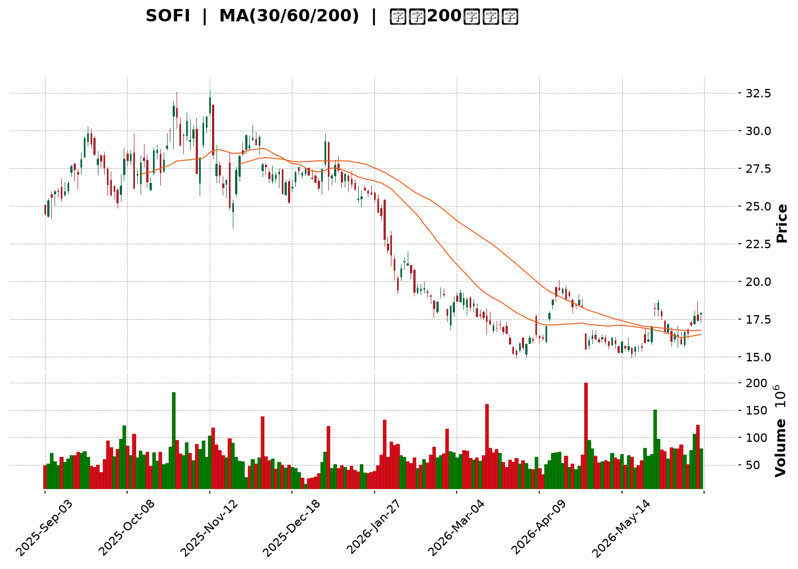
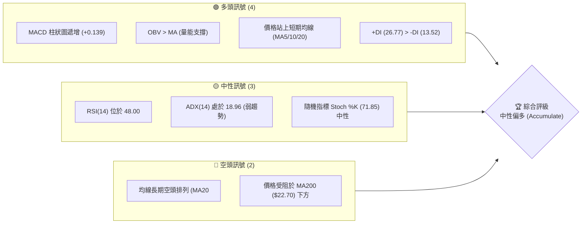
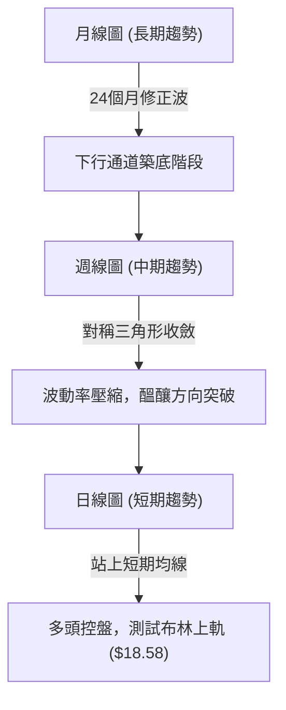
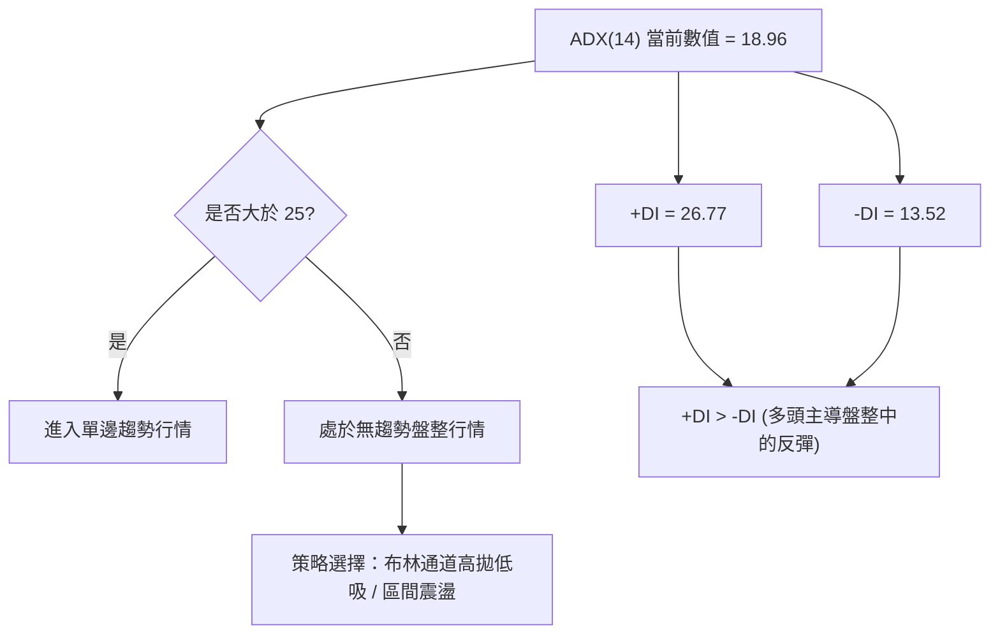
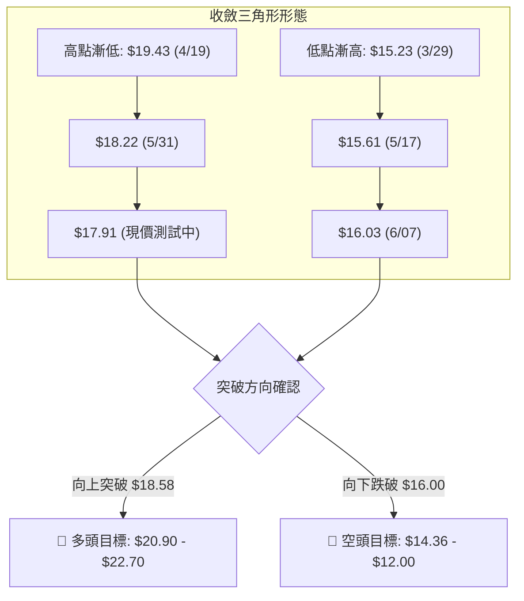
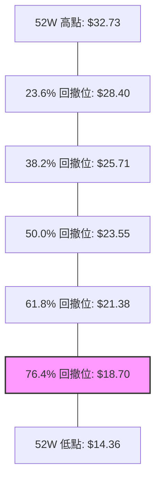
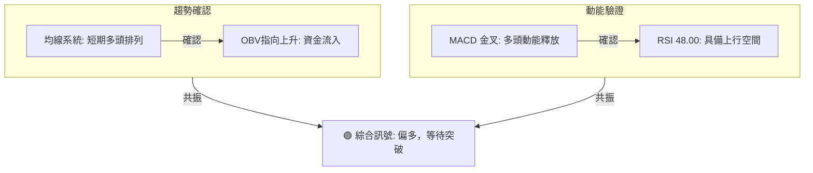
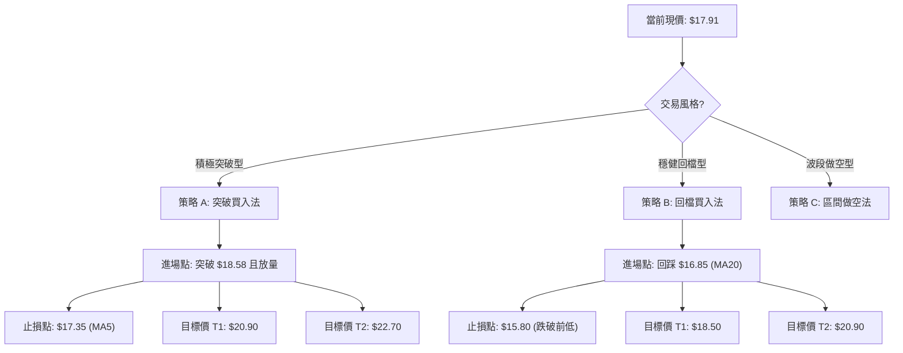

<details>
<summary>📊 靜態圖表 (點擊展開)</summary>

</details>

<html>
<head><meta charset="utf-8" /></head>
<body>
    <div style="height:500px; width:100%;">                        <script>window.PlotlyConfig = {MathJaxConfig: 'local'};</script>
        <script charset="utf-8" src="https://cdn.plot.ly/plotly-3.6.0.min.js" integrity="sha256-QaOVwtVY0T02VaHrr6pnoHLCwayMJp4O5n4YyaE3rJk=" crossorigin="anonymous"></script>                <div id="candlestick-chart" class="plotly-graph-div" style="height:100%; width:100%;"></div>            <script>                window.PLOTLYENV=window.PLOTLYENV || {};                                if (document.getElementById("candlestick-chart")) {                    Plotly.newPlot(                        "candlestick-chart",                        [{"close":{"dtype":"f8","bdata":"AAAAoHB9OEAAAACgR2E5QAAAAKCZmTlAAAAAgML1OUAAAADgUfg5QAAAAMAehTlAAAAAgML1OUAAAADAzIw6QAAAACCFqztAAAAAIIVrO0AAAAAA1yM7QAAAAAApHDxAAAAAYI+CPUAAAAAgXM89QAAAAEAKFz1AAAAA4KNwPEAAAABguB48QAAAAEDh+jtAAAAAwMyMO0AAAAAghWs6QAAAAGCPwjlAAAAA4FH4OUAAAACgcD05QAAAAAApXDpAAAAAANcjPEAAAADAHgU8QAAAAEAzczxAAAAA4KMwOkAAAAAA1yM7QAAAAGC43jtAAAAAIK4HPEAAAACgmZk6QAAAAIA9ijpAAAAAgBSuPEAAAAAAAMA8QAAAAOCjMDtAAAAA4HoUPEAAAABgjwI9QAAAAAAAAD5AAAAAwPWoP0AAAABgZuY+QAAAACCuBz1AAAAAgBSuPUAAAACgR6E+QAAAAGC4Xj1AAAAAgOsRPkAAAADA9Sg7QAAAAIDCNTxAAAAAgD2KPkAAAABAM\u002fM+QAAAAEDhGkBAAAAAANdjPEAAAACA69E7QAAAAIA9CjtAAAAAoHA9OkAAAADgUbg6QAAAAMD16DhAAAAA4KMwOUAAAABgZmY7QAAAAOB6VDxAAAAAoHB9PEAAAADgUbg9QAAAACCuBz1AAAAAYI+CPUAAAACA6xE9QAAAAKCZmT1AAAAAIK7HO0AAAAAAKZw7QAAAAOB61DpAAAAAQAoXO0AAAACA6xE7QAAAACCuRztAAAAAgOvROUAAAADgepQ6QAAAAMAeRTlAAAAAgD1KOkAAAACgcD07QAAAAKCZWTtAAAAA4KMwO0AAAABA4Xo7QAAAAIDrETtAAAAAgOvROkAAAAAgXI86QAAAAIAULjpAAAAAgMJ1O0AAAAAgrkc9QAAAAEDh+jpAAAAAAAAAO0AAAADgUbg7QAAAAGBmZjtAAAAAoJmZOkAAAAAA1yM7QAAAACCFqzpAAAAA4KNwOkAAAACgRyE6QAAAAKBwfTlAAAAAANejOUAAAABAChc6QAAAAKCZ2TlAAAAAwMzMOUAAAACAwnU5QAAAAKCZmThAAAAAAClcOEAAAAAgXM82QAAAAOB6FDZAAAAAYI\u002fCNUAAAAAAAMA0QAAAAIDCdTNAAAAAACncNEAAAACgmVk1QAAAAIAULjVAAAAAwMyMNEAAAADAzEwzQAAAAAApnDNAAAAAYI+CM0AAAACAPYozQAAAAMDMTDNAAAAAwB4FM0AAAADgUTgyQAAAAMD1qDJAAAAAgD1KM0AAAACgmRkzQAAAAGCPwjFAAAAAANdjMkAAAAAAKZwyQAAAAEAzszJAAAAAAABAM0AAAABgZuYyQAAAAIA9yjJAAAAAgD1KMkAAAAAgrocyQAAAAEAzszFAAAAAYI\u002fCMUAAAACgR6ExQAAAAGC4XjFAAAAAgBQuMUAAAADgehQxQAAAAGBm5jBAAAAAYGYmMUAAAABAM7MwQAAAACBcjzBAAAAAoHC9L0AAAACAwnUuQAAAAMDMTC5AAAAAYI\u002fCL0AAAABgj0IvQAAAAEAzsy9AAAAAwB5FMEAAAAAAKRwwQAAAAKBwfTBAAAAAwB5FMEAAAADgUTgwQAAAAMDMDDFAAAAAwPXoMUAAAACAPcoyQAAAACCuBzNAAAAAgBRuM0AAAAAAAIAzQAAAAOB61DJAAAAAIFwPM0AAAACA61EyQAAAAOCjcDJAAAAAYI\u002fCMkAAAAAAKVwyQAAAAMDMDC9AAAAAoJkZMEAAAACAFG4wQAAAAEAzMzBAAAAAwB4FMEAAAADAzEwwQAAAAAAAADBAAAAAAACAL0AAAABgj0IwQAAAAMDMzC9AAAAAYLieLkAAAADAHgUwQAAAAOBROC9AAAAAIIVrL0AAAACAwnUuQAAAAKBHYS9AAAAAwMxML0AAAACgcD0vQAAAAIDC9S9AAAAAIIUrMEAAAADgUfgwQAAAAOBRODJAAAAA4HqUMkAAAACgcL0xQAAAAIAUrjBAAAAAYGYmMUAAAAAgrgcwQAAAAAAAgDBAAAAA4FF4MEAAAACgcL0vQAAAACCFqzBAAAAA4HqUMEAAAACgRyExQAAAAIDCtTFAAAAAIIVrMUAAAADA9egxQA=="},"high":{"dtype":"f8","bdata":"AAAAACkcOUAAAACAPYo5QAAAAOBR+DlAAAAAoJkZOkAAAADgozA6QAAAAEDh2jpAAAAAoJmZOkAAAADgo7A6QAAAAMAexTtAAAAAoEfhO0AAAACAwnU7QAAAAEC2kzxAAAAAoEehPUAAAADAzEw+QAAAAADXIz5AAAAAIIWrPUAAAAAghas8QAAAAEDhejxAAAAAoEehPEAAAAAAKZw7QAAAAOB6VDtAAAAAoJlZOkAAAACAFC46QAAAAADXIztAAAAAQArXPEAAAACAwrU8QAAAAOCjsDxAAAAAwMzMPUAAAACAFG47QAAAAKCZWTxAAAAAQAoXPUAAAADgo3A8QAAAACCF6zpAAAAAgBTuPEAAAACA6xE9QAAAAMDMzDxAAAAA4FGYPEAAAABguN49QAAAAEAzMz5AAAAAQOH6P0AAAADgUUhAQAAAAIA96j5AAAAAACncPUAAAADgUTg\u002fQAAAAIA9yj5AAAAAYLhePkAAAABg59s+QAAAAKBwPTxAAAAA4FH4PkAAAACgcP0+QAAAAKBwXUBAAAAAAADAP0AAAACA6xE9QAAAAEAz8ztAAAAAAAAAO0AAAACgmdk6QAAAAEAzkzxAAAAAgOtxOUAAAAAAKZw7QAAAAEAzczxAAAAAAABAPUAAAAAAAMA9QAAAAEAzsz1AAAAAIIVrPkAAAACAFO49QAAAAEAzsz1AAAAAgBTuO0AAAADgetQ7QAAAAEAzcztAAAAAgBSuO0AAAAAgrkc7QAAAAAAAgDtAAAAAQOF6O0AAAACgcL06QAAAAIDC1TpAAAAAQAq3OkAAAABguF47QAAAAGC4njtAAAAAQApXO0AAAACAPYo7QAAAAMDMjDtAAAAAwPVoO0AAAAAA1yM7QAAAAGBm5jpAAAAAoEeBO0AAAAAAKdw9QAAAAMDMTD1AAAAAgBQuO0AAAACAFA48QAAAAAAAYDxAAAAAYOVQO0AAAABAMzM7QAAAAIDCFTtAAAAA4HpUO0AAAAAgrsc6QAAAAEAKVzpAAAAAwMwMOkAAAAAA12M6QAAAAKBHITpAAAAAYGZmOkAAAACAFO45QAAAAIA9yjlAAAAAYLgeOUAAAADgUXg5QAAAAAAAADdAAAAAAClcN0AAAAAA18M1QAAAAGBmZjRAAAAAwPUoNUAAAABACpc1QAAAAAAAADZAAAAAoJkZNUAAAACAPco0QAAAAGC43jNAAAAAQArXM0AAAABgjwI0QAAAAEDhejNAAAAA4KMwM0AAAACgR8EyQAAAAIDCtTJAAAAAYLieM0AAAAAgXI8zQAAAAIDCNTJAAAAAwPVoMkAAAACAPQozQAAAACCuRzNAAAAAQOF6M0AAAABguD4zQAAAAIDr8TJAAAAAYGYGM0AAAACgmdkyQAAAAMDMjDJAAAAAYGYmMkAAAACA6xEyQAAAAKBHQTJAAAAAIK4HMkAAAAAghUsxQAAAAMByaDFAAAAAwPVoMUAAAACA6xExQAAAAEAKVzFAAAAAoHB9MEAAAACgR2EvQAAAAKBHIS9AAAAAYGYGMEAAAACA61EwQAAAACCuxy9AAAAAwMxsMEAAAABA4VowQAAAAKCZ2TFAAAAA4FF4MEAAAACgcH0wQAAAACBcDzFAAAAAQDMTMkAAAACA69EyQAAAAGC4njNAAAAAoEchNEAAAADAHqUzQAAAAMAexTNAAAAAILByM0AAAABgZuYyQAAAAEAzkzJAAAAAIIUrM0AAAABguN4yQAAAAEAKlzBAAAAAYLheMEAAAAAghcswQAAAACCuxzBAAAAAIFxPMEAAAACgR4EwQAAAAIDCdTBAAAAAwMwMMEAAAACA61EwQAAAAOB6VDBAAAAAIIVrL0AAAADgoxAwQAAAAIAUri9AAAAAgOtRMEAAAAAgrkcvQAAAAOCjcC9AAAAAgOuRL0AAAAAAKdwvQAAAAEAz8zBAAAAA4KOwMEAAAADgehQxQAAAAEAKlzJAAAAAIIXLMkAAAABA4ToyQAAAAEAKdzFAAAAAQOE6MUAAAACgcP0wQAAAAMD1qDBAAAAAoJkZMUAAAADgUbgwQAAAAOCjsDBAAAAAIK7nMEAAAACAFG4xQAAAAOB6FDJAAAAAQDOzMkAAAACgcP0xQA=="},"hovertemplate":"\u003cb\u003e%{x|%Y-%m-%d}\u003c\u002fb\u003e\u003cbr\u003e\u958b: $%{open:.2f}\u003cbr\u003e\u9ad8: $%{high:.2f}\u003cbr\u003e\u4f4e: $%{low:.2f}\u003cbr\u003e\u6536: $%{close:.2f}\u003cextra\u003e\u003c\u002fextra\u003e","low":{"dtype":"f8","bdata":"AAAAANdjOEAAAAAgsj04QAAAAIAULjhAAAAAwMwMOUAAAADAzIw5QAAAAMDMTDlAAAAAYLieOUAAAADAHsU5QAAAACBc7zpAAAAAoEehOkAAAACgRyE6QAAAAOB6FDtAAAAAoHA9PEAAAADgUfg8QAAAAKCZ2TxAAAAAoJlZPEAAAAAgXA87QAAAACBcjztAAAAAACkcO0AAAABAM7M5QAAAAADXozlAAAAAQDNzOUAAAABACtc4QAAAACBcTzlAAAAAgBSuOkAAAADAHqU7QAAAAAAAwDtAAAAAoEchOkAAAADgUXg6QAAAAAAAwDlAAAAAIFyPO0AAAAAAAEA6QAAAAGCPAjpAAAAAIFwPO0AAAABgZiY8QAAAAKBHYTpAAAAAoPEyO0AAAABAM7M8QAAAAMAeRT1AAAAAwMzMPEAAAAAA1yM+QAAAAEDh+jxAAAAAoHB9PEAAAADgelQ9QAAAAOCjsDxAAAAAYI8CPUAAAACgRyE7QAAAAMD1qDlAAAAAQArXPEAAAADgIts9QAAAAIDC9T5AAAAAYGYmPEAAAAAgroc6QAAAAMDMjDpAAAAAgMK1OUAAAAAgXI85QAAAAGC4vjhAAAAAwB6FN0AAAAAgrqc5QAAAAKBHoTpAAAAAIFxPPEAAAADgenQ8QAAAACCFqzxAAAAA4KNQPUAAAADAHgU9QAAAAEDhejxAAAAAgBTuOkAAAADAzAw7QAAAAMDMjDpAAAAAQOF6OkAAAACAFI46QAAAAEAzMzpAAAAAgD3KOUAAAADgUbg5QAAAACCFKzlAAAAAQDPzOUAAAAAgrkc6QAAAAKCZGTtAAAAAQDPTOkAAAAAgrgc7QAAAACCuBztAAAAAoHC9OkAAAACAPYo6QAAAACBcDzpAAAAAgD3KOUAAAACgmZk7QAAAACCuBzpAAAAAoHBdOkAAAACA65E6QAAAAEDhOjtAAAAAQDMzOkAAAADgUTg6QAAAACCF6zlAAAAAgMI1OkAAAABgjwI6QAAAAIDCNTlAAAAAQDPzOEAAAAAAAAA6QAAAAKCZmTlAAAAAwB7FOUAAAACAwjU5QAAAAIDrkThAAAAAwMwMOEAAAAAgXE82QAAAAAAp3DVAAAAAwB4FNUAAAACA6xE0QAAAAACqMTNAAAAAgD0KNEAAAADAzMw0QAAAAMDMDDVAAAAAANcjNEAAAACAPQozQAAAAGBmJjNAAAAAACkcM0AAAACgmTkzQAAAAOBR+DJAAAAAANeDMkAAAADgepQxQAAAAADX4zFAAAAAgBTuMkAAAADgUfgyQAAAACBcTzFAAAAAwMzMMEAAAADgo7AxQAAAAAApnDJAAAAAANejMkAAAABguB4yQAAAAMAexTFAAAAAgD0KMkAAAADgUfgxQAAAAGC4njFAAAAAIK6HMUAAAADgUXgxQAAAAEDhejBAAAAAwPUoMUAAAADgepQwQAAAACCFqzBAAAAAQArXMEAAAACgcH0wQAAAAMAehTBAAAAAACmcL0AAAADAzEwuQAAAAGC43i1AAAAAYLieLkAAAACgR+EuQAAAAAAp3C1AAAAAYI\u002fCL0AAAACA69EvQAAAAGCPQjBAAAAA4HrUL0AAAADgURgwQAAAACCF6y9AAAAAYGZmMUAAAAAghSsyQAAAAGBmpjJAAAAAANdjM0AAAABAChczQAAAAOCjsDJAAAAAwPXoMkAAAACAFO4xQAAAAIDAKjJAAAAAANdjMkAAAADAHkUyQAAAAAAAAC9AAAAA4HoUL0AAAAAAAMAvQAAAAKBHITBAAAAAoEfhL0AAAABA4fovQAAAAMD1qC9AAAAAgD0KL0AAAACAPYovQAAAAKCZGS9AAAAAgBRuLkAAAACAwnUuQAAAAGCPwi5AAAAAgBSuLkAAAABACtctQAAAACBcDy5AAAAAQDOzLkAAAADgUbguQAAAAOBRuC9AAAAAYI8CMEAAAAAA16MvQAAAAIAUrjFAAAAA4KOwMUAAAACAwnUxQAAAAOB6lDBAAAAAgMKVMEAAAAAAKVwvQAAAAMD16C9AAAAA4E9NL0AAAADA9agvQAAAACBcTy9AAAAAQOE6MEAAAABgjwIxQAAAAACsHDFAAAAAAClcMUAAAAAA10MxQA=="},"name":"\u50f9\u683c","open":{"dtype":"f8","bdata":"AAAAIFwPOUAAAADgelQ4QAAAAMAexTlAAAAAIFzPOUAAAADAHgU6QAAAAIA9SjpAAAAAYI\u002fCOUAAAAAAAAA6QAAAAAAAQDtAAAAAgD3KO0AAAAAAAEA7QAAAAEAKlztAAAAAANdDPEAAAADAzEw9QAAAAIAUzj1AAAAAAACAPUAAAABgj8I7QAAAAGC4XjxAAAAAAClcPEAAAADgUXg7QAAAAEDhujpAAAAA4HpUOkAAAACgmRk6QAAAAMAexTlAAAAAoJkZO0AAAACgcH08QAAAAIA9CjxAAAAAwMyMPEAAAACA6xE7QAAAAGCPgjpAAAAAQDMzPEAAAACA6xE8QAAAAKCZGTpAAAAAQDMzO0AAAAAgXI88QAAAAKBwfTxAAAAA4HpUO0AAAADgUdg8QAAAAAAAAD5AAAAAoHD9PkAAAABguH4\u002fQAAAACBcbz5AAAAA4KOwPUAAAADA9ag9QAAAACCFSz1AAAAAwB6FPUAAAAAAACA+QAAAAGBmhjpAAAAAIFwPPUAAAABguD4+QAAAAIAULj9AAAAAQOG6P0AAAAAAAAA7QAAAAIDCtTtAAAAAYI+COkAAAACgmXk6QAAAAKBH4TtAAAAAoEehOEAAAADgetQ5QAAAAEDh+jpAAAAAgMK1PEAAAACAPco8QAAAAOB61DxAAAAAANdjPUAAAADAzGw9QAAAAMD1CD1AAAAAoHBdO0AAAABA4bo7QAAAAKBwPTtAAAAAYGamOkAAAABACtc6QAAAAMAeJTtAAAAAIFxvO0AAAACgcL05QAAAAADXozpAAAAAgBQuOkAAAABguJ46QAAAAOBRmDtAAAAAgOsRO0AAAAAghSs7QAAAAIA9ijtAAAAAYLjeOkAAAAAgrgc7QAAAAIAUrjpAAAAAwPWoOkAAAAAgXM87QAAAAEDhOj1AAAAAoHDdOkAAAAAAAAA7QAAAAIAUzjtAAAAAgD1KO0AAAABAM7M6QAAAAAAAADtAAAAAIFzPOkAAAACAPYo6QAAAAOCjcDlAAAAAAACAOUAAAACAFC46QAAAAAAAADpAAAAAYGbmOUAAAABgZuY5QAAAAAAAgDlAAAAAoHDdOEAAAACAFG45QAAAAGCPgjZAAAAAwMwMN0AAAACgcH01QAAAAEDhOjRAAAAAgD1KNEAAAACAPUo1QAAAAEAKFzVAAAAAoJkZNUAAAACAPco0QAAAACCuRzNAAAAAwPVoM0AAAADgUXgzQAAAAOB6VDNAAAAAgMIVM0AAAABA4boyQAAAAAAAADJAAAAAIK5HM0AAAADgozAzQAAAAMD1KDJAAAAAwB4lMUAAAAAAAAAyQAAAACBcDzNAAAAAYGamMkAAAAAAKXwyQAAAAOB6VDJAAAAAIIXrMkAAAAAA12MyQAAAAOBRODJAAAAAwMzMMUAAAAAAAAAyQAAAAOBRuDFAAAAAgBRuMUAAAAAAAMAwQAAAAIA96jBAAAAAIK4nMUAAAABguP4wQAAAAIA9CjFAAAAAYGZGMEAAAABAClcvQAAAAAAp3C5AAAAAYGbmLkAAAABgZkYwQAAAAKBHYS5AAAAAIK7HL0AAAADA9SgwQAAAAIAUrjFAAAAAANdjMEAAAADAzEwwQAAAAAAAADBAAAAAIK6HMUAAAADgUXgyQAAAAGC4njNAAAAAoJmZM0AAAABgj0IzQAAAAGCPgjNAAAAAgD1KM0AAAADAHsUyQAAAAOCjcDJAAAAAQOF6MkAAAADAHmUyQAAAAMDMjDBAAAAAgD2KL0AAAAAAKTwwQAAAAOBReDBAAAAAIIUrMEAAAABAMzMwQAAAAGCPQjBAAAAAIK4HMEAAAACgmZkvQAAAAIDrETBAAAAAIIVrL0AAAABguJ4uQAAAAGBmZi9AAAAAgML1LkAAAACAwjUvQAAAAEDhui5AAAAAoHA9L0AAAABgZmYvQAAAAEDhejBAAAAAwMwMMEAAAADAHgUwQAAAAGCPQjJAAAAAYGYmMkAAAAAgrgcyQAAAAKBHYTFAAAAAwPWoMEAAAABA4bowQAAAAIAULjBAAAAAYGZmMEAAAADgejQwQAAAAADXoy9AAAAAgOvRMEAAAAAgrkcxQAAAAEAzMzFAAAAAIFzPMUAAAABAM9MxQA=="},"x":["2025-09-03T00:00:00-04:00","2025-09-04T00:00:00-04:00","2025-09-05T00:00:00-04:00","2025-09-08T00:00:00-04:00","2025-09-09T00:00:00-04:00","2025-09-10T00:00:00-04:00","2025-09-11T00:00:00-04:00","2025-09-12T00:00:00-04:00","2025-09-15T00:00:00-04:00","2025-09-16T00:00:00-04:00","2025-09-17T00:00:00-04:00","2025-09-18T00:00:00-04:00","2025-09-19T00:00:00-04:00","2025-09-22T00:00:00-04:00","2025-09-23T00:00:00-04:00","2025-09-24T00:00:00-04:00","2025-09-25T00:00:00-04:00","2025-09-26T00:00:00-04:00","2025-09-29T00:00:00-04:00","2025-09-30T00:00:00-04:00","2025-10-01T00:00:00-04:00","2025-10-02T00:00:00-04:00","2025-10-03T00:00:00-04:00","2025-10-06T00:00:00-04:00","2025-10-07T00:00:00-04:00","2025-10-08T00:00:00-04:00","2025-10-09T00:00:00-04:00","2025-10-10T00:00:00-04:00","2025-10-13T00:00:00-04:00","2025-10-14T00:00:00-04:00","2025-10-15T00:00:00-04:00","2025-10-16T00:00:00-04:00","2025-10-17T00:00:00-04:00","2025-10-20T00:00:00-04:00","2025-10-21T00:00:00-04:00","2025-10-22T00:00:00-04:00","2025-10-23T00:00:00-04:00","2025-10-24T00:00:00-04:00","2025-10-27T00:00:00-04:00","2025-10-28T00:00:00-04:00","2025-10-29T00:00:00-04:00","2025-10-30T00:00:00-04:00","2025-10-31T00:00:00-04:00","2025-11-03T00:00:00-05:00","2025-11-04T00:00:00-05:00","2025-11-05T00:00:00-05:00","2025-11-06T00:00:00-05:00","2025-11-07T00:00:00-05:00","2025-11-10T00:00:00-05:00","2025-11-11T00:00:00-05:00","2025-11-12T00:00:00-05:00","2025-11-13T00:00:00-05:00","2025-11-14T00:00:00-05:00","2025-11-17T00:00:00-05:00","2025-11-18T00:00:00-05:00","2025-11-19T00:00:00-05:00","2025-11-20T00:00:00-05:00","2025-11-21T00:00:00-05:00","2025-11-24T00:00:00-05:00","2025-11-25T00:00:00-05:00","2025-11-26T00:00:00-05:00","2025-11-28T00:00:00-05:00","2025-12-01T00:00:00-05:00","2025-12-02T00:00:00-05:00","2025-12-03T00:00:00-05:00","2025-12-04T00:00:00-05:00","2025-12-05T00:00:00-05:00","2025-12-08T00:00:00-05:00","2025-12-09T00:00:00-05:00","2025-12-10T00:00:00-05:00","2025-12-11T00:00:00-05:00","2025-12-12T00:00:00-05:00","2025-12-15T00:00:00-05:00","2025-12-16T00:00:00-05:00","2025-12-17T00:00:00-05:00","2025-12-18T00:00:00-05:00","2025-12-19T00:00:00-05:00","2025-12-22T00:00:00-05:00","2025-12-23T00:00:00-05:00","2025-12-24T00:00:00-05:00","2025-12-26T00:00:00-05:00","2025-12-29T00:00:00-05:00","2025-12-30T00:00:00-05:00","2025-12-31T00:00:00-05:00","2026-01-02T00:00:00-05:00","2026-01-05T00:00:00-05:00","2026-01-06T00:00:00-05:00","2026-01-07T00:00:00-05:00","2026-01-08T00:00:00-05:00","2026-01-09T00:00:00-05:00","2026-01-12T00:00:00-05:00","2026-01-13T00:00:00-05:00","2026-01-14T00:00:00-05:00","2026-01-15T00:00:00-05:00","2026-01-16T00:00:00-05:00","2026-01-20T00:00:00-05:00","2026-01-21T00:00:00-05:00","2026-01-22T00:00:00-05:00","2026-01-23T00:00:00-05:00","2026-01-26T00:00:00-05:00","2026-01-27T00:00:00-05:00","2026-01-28T00:00:00-05:00","2026-01-29T00:00:00-05:00","2026-01-30T00:00:00-05:00","2026-02-02T00:00:00-05:00","2026-02-03T00:00:00-05:00","2026-02-04T00:00:00-05:00","2026-02-05T00:00:00-05:00","2026-02-06T00:00:00-05:00","2026-02-09T00:00:00-05:00","2026-02-10T00:00:00-05:00","2026-02-11T00:00:00-05:00","2026-02-12T00:00:00-05:00","2026-02-13T00:00:00-05:00","2026-02-17T00:00:00-05:00","2026-02-18T00:00:00-05:00","2026-02-19T00:00:00-05:00","2026-02-20T00:00:00-05:00","2026-02-23T00:00:00-05:00","2026-02-24T00:00:00-05:00","2026-02-25T00:00:00-05:00","2026-02-26T00:00:00-05:00","2026-02-27T00:00:00-05:00","2026-03-02T00:00:00-05:00","2026-03-03T00:00:00-05:00","2026-03-04T00:00:00-05:00","2026-03-05T00:00:00-05:00","2026-03-06T00:00:00-05:00","2026-03-09T00:00:00-04:00","2026-03-10T00:00:00-04:00","2026-03-11T00:00:00-04:00","2026-03-12T00:00:00-04:00","2026-03-13T00:00:00-04:00","2026-03-16T00:00:00-04:00","2026-03-17T00:00:00-04:00","2026-03-18T00:00:00-04:00","2026-03-19T00:00:00-04:00","2026-03-20T00:00:00-04:00","2026-03-23T00:00:00-04:00","2026-03-24T00:00:00-04:00","2026-03-25T00:00:00-04:00","2026-03-26T00:00:00-04:00","2026-03-27T00:00:00-04:00","2026-03-30T00:00:00-04:00","2026-03-31T00:00:00-04:00","2026-04-01T00:00:00-04:00","2026-04-02T00:00:00-04:00","2026-04-06T00:00:00-04:00","2026-04-07T00:00:00-04:00","2026-04-08T00:00:00-04:00","2026-04-09T00:00:00-04:00","2026-04-10T00:00:00-04:00","2026-04-13T00:00:00-04:00","2026-04-14T00:00:00-04:00","2026-04-15T00:00:00-04:00","2026-04-16T00:00:00-04:00","2026-04-17T00:00:00-04:00","2026-04-20T00:00:00-04:00","2026-04-21T00:00:00-04:00","2026-04-22T00:00:00-04:00","2026-04-23T00:00:00-04:00","2026-04-24T00:00:00-04:00","2026-04-27T00:00:00-04:00","2026-04-28T00:00:00-04:00","2026-04-29T00:00:00-04:00","2026-04-30T00:00:00-04:00","2026-05-01T00:00:00-04:00","2026-05-04T00:00:00-04:00","2026-05-05T00:00:00-04:00","2026-05-06T00:00:00-04:00","2026-05-07T00:00:00-04:00","2026-05-08T00:00:00-04:00","2026-05-11T00:00:00-04:00","2026-05-12T00:00:00-04:00","2026-05-13T00:00:00-04:00","2026-05-14T00:00:00-04:00","2026-05-15T00:00:00-04:00","2026-05-18T00:00:00-04:00","2026-05-19T00:00:00-04:00","2026-05-20T00:00:00-04:00","2026-05-21T00:00:00-04:00","2026-05-22T00:00:00-04:00","2026-05-26T00:00:00-04:00","2026-05-27T00:00:00-04:00","2026-05-28T00:00:00-04:00","2026-05-29T00:00:00-04:00","2026-06-01T00:00:00-04:00","2026-06-02T00:00:00-04:00","2026-06-03T00:00:00-04:00","2026-06-04T00:00:00-04:00","2026-06-05T00:00:00-04:00","2026-06-08T00:00:00-04:00","2026-06-09T00:00:00-04:00","2026-06-10T00:00:00-04:00","2026-06-11T00:00:00-04:00","2026-06-12T00:00:00-04:00","2026-06-15T00:00:00-04:00","2026-06-16T00:00:00-04:00","2026-06-17T00:00:00-04:00","2026-06-18T00:00:00-04:00"],"type":"candlestick"},{"hovertemplate":"MA30: $%{y:.2f}\u003cextra\u003e\u003c\u002fextra\u003e","line":{"color":"#2196F3","dash":"dash","width":2},"mode":"lines","name":"MA30","x":["2025-09-03T00:00:00-04:00","2025-09-04T00:00:00-04:00","2025-09-05T00:00:00-04:00","2025-09-08T00:00:00-04:00","2025-09-09T00:00:00-04:00","2025-09-10T00:00:00-04:00","2025-09-11T00:00:00-04:00","2025-09-12T00:00:00-04:00","2025-09-15T00:00:00-04:00","2025-09-16T00:00:00-04:00","2025-09-17T00:00:00-04:00","2025-09-18T00:00:00-04:00","2025-09-19T00:00:00-04:00","2025-09-22T00:00:00-04:00","2025-09-23T00:00:00-04:00","2025-09-24T00:00:00-04:00","2025-09-25T00:00:00-04:00","2025-09-26T00:00:00-04:00","2025-09-29T00:00:00-04:00","2025-09-30T00:00:00-04:00","2025-10-01T00:00:00-04:00","2025-10-02T00:00:00-04:00","2025-10-03T00:00:00-04:00","2025-10-06T00:00:00-04:00","2025-10-07T00:00:00-04:00","2025-10-08T00:00:00-04:00","2025-10-09T00:00:00-04:00","2025-10-10T00:00:00-04:00","2025-10-13T00:00:00-04:00","2025-10-14T00:00:00-04:00","2025-10-15T00:00:00-04:00","2025-10-16T00:00:00-04:00","2025-10-17T00:00:00-04:00","2025-10-20T00:00:00-04:00","2025-10-21T00:00:00-04:00","2025-10-22T00:00:00-04:00","2025-10-23T00:00:00-04:00","2025-10-24T00:00:00-04:00","2025-10-27T00:00:00-04:00","2025-10-28T00:00:00-04:00","2025-10-29T00:00:00-04:00","2025-10-30T00:00:00-04:00","2025-10-31T00:00:00-04:00","2025-11-03T00:00:00-05:00","2025-11-04T00:00:00-05:00","2025-11-05T00:00:00-05:00","2025-11-06T00:00:00-05:00","2025-11-07T00:00:00-05:00","2025-11-10T00:00:00-05:00","2025-11-11T00:00:00-05:00","2025-11-12T00:00:00-05:00","2025-11-13T00:00:00-05:00","2025-11-14T00:00:00-05:00","2025-11-17T00:00:00-05:00","2025-11-18T00:00:00-05:00","2025-11-19T00:00:00-05:00","2025-11-20T00:00:00-05:00","2025-11-21T00:00:00-05:00","2025-11-24T00:00:00-05:00","2025-11-25T00:00:00-05:00","2025-11-26T00:00:00-05:00","2025-11-28T00:00:00-05:00","2025-12-01T00:00:00-05:00","2025-12-02T00:00:00-05:00","2025-12-03T00:00:00-05:00","2025-12-04T00:00:00-05:00","2025-12-05T00:00:00-05:00","2025-12-08T00:00:00-05:00","2025-12-09T00:00:00-05:00","2025-12-10T00:00:00-05:00","2025-12-11T00:00:00-05:00","2025-12-12T00:00:00-05:00","2025-12-15T00:00:00-05:00","2025-12-16T00:00:00-05:00","2025-12-17T00:00:00-05:00","2025-12-18T00:00:00-05:00","2025-12-19T00:00:00-05:00","2025-12-22T00:00:00-05:00","2025-12-23T00:00:00-05:00","2025-12-24T00:00:00-05:00","2025-12-26T00:00:00-05:00","2025-12-29T00:00:00-05:00","2025-12-30T00:00:00-05:00","2025-12-31T00:00:00-05:00","2026-01-02T00:00:00-05:00","2026-01-05T00:00:00-05:00","2026-01-06T00:00:00-05:00","2026-01-07T00:00:00-05:00","2026-01-08T00:00:00-05:00","2026-01-09T00:00:00-05:00","2026-01-12T00:00:00-05:00","2026-01-13T00:00:00-05:00","2026-01-14T00:00:00-05:00","2026-01-15T00:00:00-05:00","2026-01-16T00:00:00-05:00","2026-01-20T00:00:00-05:00","2026-01-21T00:00:00-05:00","2026-01-22T00:00:00-05:00","2026-01-23T00:00:00-05:00","2026-01-26T00:00:00-05:00","2026-01-27T00:00:00-05:00","2026-01-28T00:00:00-05:00","2026-01-29T00:00:00-05:00","2026-01-30T00:00:00-05:00","2026-02-02T00:00:00-05:00","2026-02-03T00:00:00-05:00","2026-02-04T00:00:00-05:00","2026-02-05T00:00:00-05:00","2026-02-06T00:00:00-05:00","2026-02-09T00:00:00-05:00","2026-02-10T00:00:00-05:00","2026-02-11T00:00:00-05:00","2026-02-12T00:00:00-05:00","2026-02-13T00:00:00-05:00","2026-02-17T00:00:00-05:00","2026-02-18T00:00:00-05:00","2026-02-19T00:00:00-05:00","2026-02-20T00:00:00-05:00","2026-02-23T00:00:00-05:00","2026-02-24T00:00:00-05:00","2026-02-25T00:00:00-05:00","2026-02-26T00:00:00-05:00","2026-02-27T00:00:00-05:00","2026-03-02T00:00:00-05:00","2026-03-03T00:00:00-05:00","2026-03-04T00:00:00-05:00","2026-03-05T00:00:00-05:00","2026-03-06T00:00:00-05:00","2026-03-09T00:00:00-04:00","2026-03-10T00:00:00-04:00","2026-03-11T00:00:00-04:00","2026-03-12T00:00:00-04:00","2026-03-13T00:00:00-04:00","2026-03-16T00:00:00-04:00","2026-03-17T00:00:00-04:00","2026-03-18T00:00:00-04:00","2026-03-19T00:00:00-04:00","2026-03-20T00:00:00-04:00","2026-03-23T00:00:00-04:00","2026-03-24T00:00:00-04:00","2026-03-25T00:00:00-04:00","2026-03-26T00:00:00-04:00","2026-03-27T00:00:00-04:00","2026-03-30T00:00:00-04:00","2026-03-31T00:00:00-04:00","2026-04-01T00:00:00-04:00","2026-04-02T00:00:00-04:00","2026-04-06T00:00:00-04:00","2026-04-07T00:00:00-04:00","2026-04-08T00:00:00-04:00","2026-04-09T00:00:00-04:00","2026-04-10T00:00:00-04:00","2026-04-13T00:00:00-04:00","2026-04-14T00:00:00-04:00","2026-04-15T00:00:00-04:00","2026-04-16T00:00:00-04:00","2026-04-17T00:00:00-04:00","2026-04-20T00:00:00-04:00","2026-04-21T00:00:00-04:00","2026-04-22T00:00:00-04:00","2026-04-23T00:00:00-04:00","2026-04-24T00:00:00-04:00","2026-04-27T00:00:00-04:00","2026-04-28T00:00:00-04:00","2026-04-29T00:00:00-04:00","2026-04-30T00:00:00-04:00","2026-05-01T00:00:00-04:00","2026-05-04T00:00:00-04:00","2026-05-05T00:00:00-04:00","2026-05-06T00:00:00-04:00","2026-05-07T00:00:00-04:00","2026-05-08T00:00:00-04:00","2026-05-11T00:00:00-04:00","2026-05-12T00:00:00-04:00","2026-05-13T00:00:00-04:00","2026-05-14T00:00:00-04:00","2026-05-15T00:00:00-04:00","2026-05-18T00:00:00-04:00","2026-05-19T00:00:00-04:00","2026-05-20T00:00:00-04:00","2026-05-21T00:00:00-04:00","2026-05-22T00:00:00-04:00","2026-05-26T00:00:00-04:00","2026-05-27T00:00:00-04:00","2026-05-28T00:00:00-04:00","2026-05-29T00:00:00-04:00","2026-06-01T00:00:00-04:00","2026-06-02T00:00:00-04:00","2026-06-03T00:00:00-04:00","2026-06-04T00:00:00-04:00","2026-06-05T00:00:00-04:00","2026-06-08T00:00:00-04:00","2026-06-09T00:00:00-04:00","2026-06-10T00:00:00-04:00","2026-06-11T00:00:00-04:00","2026-06-12T00:00:00-04:00","2026-06-15T00:00:00-04:00","2026-06-16T00:00:00-04:00","2026-06-17T00:00:00-04:00","2026-06-18T00:00:00-04:00"],"y":{"dtype":"f8","bdata":"AAAAAAAA+H8AAAAAAAD4fwAAAAAAAPh\u002fAAAAAAAA+H8AAAAAAAD4fwAAAAAAAPh\u002fAAAAAAAA+H8AAAAAAAD4fwAAAAAAAPh\u002fAAAAAAAA+H8AAAAAAAD4fwAAAAAAAPh\u002fAAAAAAAA+H8AAAAAAAD4fwAAAAAAAPh\u002fAAAAAAAA+H8AAAAAAAD4fwAAAAAAAPh\u002fAAAAAAAA+H8AAAAAAAD4fwAAAAAAAPh\u002fAAAAAAAA+H8AAAAAAAD4fwAAAAAAAPh\u002fAAAAAAAA+H8AAAAAAAD4fwAAAAAAAPh\u002fAAAAAAAA+H8AAAAAAAD4fxEREbGdDztAERER8dItO0AzMzMTPDg7QJqZmYlBQDtAiYiIeHdXO0CamZl5MG87QFVVVaVwfTtAvLu724ePO0AAAADQhaQ7QGZmZsZnuDtAIiIiMpbcO0CrqqoKrPw7QAAAANCFBDxA7+7uLvkFPEAAAACA+Aw8QLy7uytcDzxAVVVV9UQdPEDe3d3NExU8QO\u002fu7j4KFzxAERERAY4wPEARERHxNVc8QN7d3S1AjjxAAAAAwOaiPECJiIjY6rg8QERERFS4vjxAd3d3t4GuPEAiIiLSaaM8QCIiIpI0hTxAmpmZCax8PEBEREQE5H48QGZmZubQgjxAiYiIyL2GPEBmZmaGXaE8QDMzMwOdtjxAzczMLLK9PECamZk5bcA8QDMzM\u002fP91DxAd3d3l27SPEDv7u4+fMY8QGZmZkZvqzxAVVVV9W+EPEAiIiIywWM8QDMzM0PSVDxAZmZm9uEzPECrqqqaUhE8QERERARW7jtAvLu7exTOO0Dv7u4+w847QM3MzIxsxztAzczMXNaqO0B3d3cHOo07QHd3d4ddYTtAAAAA0PdTO0DNzMxMN0k7QJqZmZngQTtAq6qquklMO0AzMzMjImI7QO\u002fu7h7McztAAAAAID6DO0DNzMws+YU7QO\u002fu7o4JfjtAq6qqyuhtO0AiIiKy5Fc7QCIiIjLBQztA3t3drY4pO0BmZmYmeBA7QHd3d7dl7TpAAAAA0CLbOkAiIiJSKs46QKuqqnrNxTpA3t3dbcu6OkBERERUDq06QHd3d8cvljpAzczMXLqJOkC8u7urjmk6QCIiIgJWTjpAIiIiEq4nOkAzMzNzTPA5QKuqqnr4rDlAIiIiYvR2OUAiIiIypUI5QLy7u0tiEDlAVVVVReHaOEDv7u6O7Zw4QM3MzCzdZDhAMzMzIwYhOECJiIjI6M03QBEREZFfjDdA3t3d\u002fUZIN0DNzMzsNfc2QKuqqhqhrDZAq6qqKkBuNkBVVVWFpCk2QERERFSc3TVAVVVV1eqYNUBVVVUlv1g1QKuqqirOHjVAAAAAAEfoNEBEREQ07Ko0QGZmZmatbjRA7+7ujpcuNEDv7u6+dPMzQHd3d3eTuDNAvLu7i0GAM0CamZmpDVQzQDMzM4PcKzNAmpmZWccEM0DNzMwcduUyQFVVVbWdzzJAZmZmFvWvMkAiIiICR4gyQGZmZnbaYDJAERER2eo4MkBERETMLxYyQO\u002fu7sYg8DFAvLu76ybRMUDNzMxkya8xQJqZmcFYkjFAIiIiSuF6MUBVVVXt32gxQFVVVX1bVjFAq6qqMpY8MUBVVVW9AiQxQAAAALjzHTFAzczMJNsZMUBERERcZBsxQJqZmUE1HjFAEREReb4fMUCamZkx3SQxQKuqqpI0JTFAERERqcYrMUAAAADo+ykxQN7d3XVMMDFAZmZm\u002ftQ4MUDNzMy0Dz8xQFVVVT1RLzFAmpmZ8RkmMUB3d3f\u002fjSAxQLy7u9OUGjFAZmZmTvAQMUBVVVV9hg0xQO\u002fu7ia\u002fCDFAIiIiArkHMUBEREQUgxAxQKuqqnrpFjFAvLu7SwwSMUC8u7tDYBUxQJqZmflTEzFAq6qqoowOMUBmZmY+CgcxQN7d3Z02ADFARERENOz6MEBERER8zfUwQBEREQms7DBAq6qq8tLdMEAAAAAYS84wQGZmZp5hxzBAvLu7wyDAMEBERET8G7EwQFVVVT3DnjBAAAAAyHaOMEC8u7sz7HowQM3MzDReajBAd3d3n9NWMEAiIiIilEEwQM3MzGxZSzBAAAAAAHJPMEC8u7sra1UwQAAAANBNYjBAiYiIKEBuMEAiIiJC\u002fXswQA=="},"type":"scatter"},{"hovertemplate":"MA60: $%{y:.2f}\u003cextra\u003e\u003c\u002fextra\u003e","line":{"color":"#9C27B0","dash":"dash","width":2},"mode":"lines","name":"MA60","x":["2025-09-03T00:00:00-04:00","2025-09-04T00:00:00-04:00","2025-09-05T00:00:00-04:00","2025-09-08T00:00:00-04:00","2025-09-09T00:00:00-04:00","2025-09-10T00:00:00-04:00","2025-09-11T00:00:00-04:00","2025-09-12T00:00:00-04:00","2025-09-15T00:00:00-04:00","2025-09-16T00:00:00-04:00","2025-09-17T00:00:00-04:00","2025-09-18T00:00:00-04:00","2025-09-19T00:00:00-04:00","2025-09-22T00:00:00-04:00","2025-09-23T00:00:00-04:00","2025-09-24T00:00:00-04:00","2025-09-25T00:00:00-04:00","2025-09-26T00:00:00-04:00","2025-09-29T00:00:00-04:00","2025-09-30T00:00:00-04:00","2025-10-01T00:00:00-04:00","2025-10-02T00:00:00-04:00","2025-10-03T00:00:00-04:00","2025-10-06T00:00:00-04:00","2025-10-07T00:00:00-04:00","2025-10-08T00:00:00-04:00","2025-10-09T00:00:00-04:00","2025-10-10T00:00:00-04:00","2025-10-13T00:00:00-04:00","2025-10-14T00:00:00-04:00","2025-10-15T00:00:00-04:00","2025-10-16T00:00:00-04:00","2025-10-17T00:00:00-04:00","2025-10-20T00:00:00-04:00","2025-10-21T00:00:00-04:00","2025-10-22T00:00:00-04:00","2025-10-23T00:00:00-04:00","2025-10-24T00:00:00-04:00","2025-10-27T00:00:00-04:00","2025-10-28T00:00:00-04:00","2025-10-29T00:00:00-04:00","2025-10-30T00:00:00-04:00","2025-10-31T00:00:00-04:00","2025-11-03T00:00:00-05:00","2025-11-04T00:00:00-05:00","2025-11-05T00:00:00-05:00","2025-11-06T00:00:00-05:00","2025-11-07T00:00:00-05:00","2025-11-10T00:00:00-05:00","2025-11-11T00:00:00-05:00","2025-11-12T00:00:00-05:00","2025-11-13T00:00:00-05:00","2025-11-14T00:00:00-05:00","2025-11-17T00:00:00-05:00","2025-11-18T00:00:00-05:00","2025-11-19T00:00:00-05:00","2025-11-20T00:00:00-05:00","2025-11-21T00:00:00-05:00","2025-11-24T00:00:00-05:00","2025-11-25T00:00:00-05:00","2025-11-26T00:00:00-05:00","2025-11-28T00:00:00-05:00","2025-12-01T00:00:00-05:00","2025-12-02T00:00:00-05:00","2025-12-03T00:00:00-05:00","2025-12-04T00:00:00-05:00","2025-12-05T00:00:00-05:00","2025-12-08T00:00:00-05:00","2025-12-09T00:00:00-05:00","2025-12-10T00:00:00-05:00","2025-12-11T00:00:00-05:00","2025-12-12T00:00:00-05:00","2025-12-15T00:00:00-05:00","2025-12-16T00:00:00-05:00","2025-12-17T00:00:00-05:00","2025-12-18T00:00:00-05:00","2025-12-19T00:00:00-05:00","2025-12-22T00:00:00-05:00","2025-12-23T00:00:00-05:00","2025-12-24T00:00:00-05:00","2025-12-26T00:00:00-05:00","2025-12-29T00:00:00-05:00","2025-12-30T00:00:00-05:00","2025-12-31T00:00:00-05:00","2026-01-02T00:00:00-05:00","2026-01-05T00:00:00-05:00","2026-01-06T00:00:00-05:00","2026-01-07T00:00:00-05:00","2026-01-08T00:00:00-05:00","2026-01-09T00:00:00-05:00","2026-01-12T00:00:00-05:00","2026-01-13T00:00:00-05:00","2026-01-14T00:00:00-05:00","2026-01-15T00:00:00-05:00","2026-01-16T00:00:00-05:00","2026-01-20T00:00:00-05:00","2026-01-21T00:00:00-05:00","2026-01-22T00:00:00-05:00","2026-01-23T00:00:00-05:00","2026-01-26T00:00:00-05:00","2026-01-27T00:00:00-05:00","2026-01-28T00:00:00-05:00","2026-01-29T00:00:00-05:00","2026-01-30T00:00:00-05:00","2026-02-02T00:00:00-05:00","2026-02-03T00:00:00-05:00","2026-02-04T00:00:00-05:00","2026-02-05T00:00:00-05:00","2026-02-06T00:00:00-05:00","2026-02-09T00:00:00-05:00","2026-02-10T00:00:00-05:00","2026-02-11T00:00:00-05:00","2026-02-12T00:00:00-05:00","2026-02-13T00:00:00-05:00","2026-02-17T00:00:00-05:00","2026-02-18T00:00:00-05:00","2026-02-19T00:00:00-05:00","2026-02-20T00:00:00-05:00","2026-02-23T00:00:00-05:00","2026-02-24T00:00:00-05:00","2026-02-25T00:00:00-05:00","2026-02-26T00:00:00-05:00","2026-02-27T00:00:00-05:00","2026-03-02T00:00:00-05:00","2026-03-03T00:00:00-05:00","2026-03-04T00:00:00-05:00","2026-03-05T00:00:00-05:00","2026-03-06T00:00:00-05:00","2026-03-09T00:00:00-04:00","2026-03-10T00:00:00-04:00","2026-03-11T00:00:00-04:00","2026-03-12T00:00:00-04:00","2026-03-13T00:00:00-04:00","2026-03-16T00:00:00-04:00","2026-03-17T00:00:00-04:00","2026-03-18T00:00:00-04:00","2026-03-19T00:00:00-04:00","2026-03-20T00:00:00-04:00","2026-03-23T00:00:00-04:00","2026-03-24T00:00:00-04:00","2026-03-25T00:00:00-04:00","2026-03-26T00:00:00-04:00","2026-03-27T00:00:00-04:00","2026-03-30T00:00:00-04:00","2026-03-31T00:00:00-04:00","2026-04-01T00:00:00-04:00","2026-04-02T00:00:00-04:00","2026-04-06T00:00:00-04:00","2026-04-07T00:00:00-04:00","2026-04-08T00:00:00-04:00","2026-04-09T00:00:00-04:00","2026-04-10T00:00:00-04:00","2026-04-13T00:00:00-04:00","2026-04-14T00:00:00-04:00","2026-04-15T00:00:00-04:00","2026-04-16T00:00:00-04:00","2026-04-17T00:00:00-04:00","2026-04-20T00:00:00-04:00","2026-04-21T00:00:00-04:00","2026-04-22T00:00:00-04:00","2026-04-23T00:00:00-04:00","2026-04-24T00:00:00-04:00","2026-04-27T00:00:00-04:00","2026-04-28T00:00:00-04:00","2026-04-29T00:00:00-04:00","2026-04-30T00:00:00-04:00","2026-05-01T00:00:00-04:00","2026-05-04T00:00:00-04:00","2026-05-05T00:00:00-04:00","2026-05-06T00:00:00-04:00","2026-05-07T00:00:00-04:00","2026-05-08T00:00:00-04:00","2026-05-11T00:00:00-04:00","2026-05-12T00:00:00-04:00","2026-05-13T00:00:00-04:00","2026-05-14T00:00:00-04:00","2026-05-15T00:00:00-04:00","2026-05-18T00:00:00-04:00","2026-05-19T00:00:00-04:00","2026-05-20T00:00:00-04:00","2026-05-21T00:00:00-04:00","2026-05-22T00:00:00-04:00","2026-05-26T00:00:00-04:00","2026-05-27T00:00:00-04:00","2026-05-28T00:00:00-04:00","2026-05-29T00:00:00-04:00","2026-06-01T00:00:00-04:00","2026-06-02T00:00:00-04:00","2026-06-03T00:00:00-04:00","2026-06-04T00:00:00-04:00","2026-06-05T00:00:00-04:00","2026-06-08T00:00:00-04:00","2026-06-09T00:00:00-04:00","2026-06-10T00:00:00-04:00","2026-06-11T00:00:00-04:00","2026-06-12T00:00:00-04:00","2026-06-15T00:00:00-04:00","2026-06-16T00:00:00-04:00","2026-06-17T00:00:00-04:00","2026-06-18T00:00:00-04:00"],"y":{"dtype":"f8","bdata":"AAAAAAAA+H8AAAAAAAD4fwAAAAAAAPh\u002fAAAAAAAA+H8AAAAAAAD4fwAAAAAAAPh\u002fAAAAAAAA+H8AAAAAAAD4fwAAAAAAAPh\u002fAAAAAAAA+H8AAAAAAAD4fwAAAAAAAPh\u002fAAAAAAAA+H8AAAAAAAD4fwAAAAAAAPh\u002fAAAAAAAA+H8AAAAAAAD4fwAAAAAAAPh\u002fAAAAAAAA+H8AAAAAAAD4fwAAAAAAAPh\u002fAAAAAAAA+H8AAAAAAAD4fwAAAAAAAPh\u002fAAAAAAAA+H8AAAAAAAD4fwAAAAAAAPh\u002fAAAAAAAA+H8AAAAAAAD4fwAAAAAAAPh\u002fAAAAAAAA+H8AAAAAAAD4fwAAAAAAAPh\u002fAAAAAAAA+H8AAAAAAAD4fwAAAAAAAPh\u002fAAAAAAAA+H8AAAAAAAD4fwAAAAAAAPh\u002fAAAAAAAA+H8AAAAAAAD4fwAAAAAAAPh\u002fAAAAAAAA+H8AAAAAAAD4fwAAAAAAAPh\u002fAAAAAAAA+H8AAAAAAAD4fwAAAAAAAPh\u002fAAAAAAAA+H8AAAAAAAD4fwAAAAAAAPh\u002fAAAAAAAA+H8AAAAAAAD4fwAAAAAAAPh\u002fAAAAAAAA+H8AAAAAAAD4fwAAAAAAAPh\u002fAAAAAAAA+H8AAAAAAAD4f7y7u0s3yTtAzczMXEjaO0DNzMzMzOw7QGZmZkZv+ztAq6qq0pQKPECamZnZzhc8QEREREw3KTxAmpmZOfswPEB3d3cHgTU8QGZmZobrMTxAvLu7E4MwPEBmZmaeNjA8QJqZmQmsLDxAq6qqku0cPEBVVVWNJQ88QAAAABjZ\u002fjtAiYiIuKz1O0BmZmaG6\u002fE7QN7d3WU77ztA7+7uLrLtO0BERET8N\u002fI7QKuqqtrO9ztAAAAASG\u002f7O0CrqqoSEQE8QO\u002fu7nZMADxAERERuWX9O0Crqqr6xQI8QImIiFiA\u002fDtAzczMFPX\u002fO0CJiIiYbgI8QKuqqjptADxAmpmZSVP6O0BEREQcofw7QKuqqhov\u002fTtAVVVVbaDzO0AAAACwcug7QFVVVdUx4TtAvLu7s8jWO0CJiIhIU8o7QImIiGCeuDtAmpmZsZ2fO0AzMzPDZ4g7QFVVVQWBdTtAmpmZKc5eO0AzMzOjcD07QDMzMwNWHjtA7+7uRuH6OkARERHZh986QLy7u4MyujpAd3d3X+WQOkDNzMyc72c6QJqZmenfODpAq6qqimwXOkDe3d1tEvM5QDMzM+Ne0zlA7+7u7qe2OUDe3d11BZg5QAAAANgVgDlA7+7ujsJlOUDNzMyMlz45QM3MzFRVFTlAq6qqehTuOEC8u7ubxMA4QDMzM8OukDhAmpmZwTxhOEDe3d2lmzQ4QBEREfEZBjhAAAAA6LThN0AzMzNDi7w3QImIiHA9mjdAZmZmfrF0N0CamZmJQVA3QHd3d59hJzdARERE9P0EN0Crqqoqzt42QKuqqkIZvTZA3t3dtTqWNkAAAABI4Wo2QAAAABhLPjZAREREvHQTNkAiIiIaduU1QBEREWGeuDVAMzMzD+aJNUCamZmtjlk1QN7d3fl+KjVAd3d3hxb5NECrqqoW2b40QFVVVSlcjzRAAAAAJJRhNEARERHtCjA0QAAAAEx+ATRAq6qqLmvVM0BVVVWh06YzQCIiIgbIfTNAERER\u002fWJZM0DNzMzAETozQCIiIraBHjNAiYiIvAIEM0Dv7u6y5OcyQImIiPzwyTJAAAAAHC+tMkB3d3dTuI4yQKuqqvZvdDJAERERRYtcMkAzMzOvjkkyQEREROCWLTJAmpmZpXAVMkAiIiIOAgMyQImIiEQZ9TFAZmZmsnLgMUC8u7u\u002f5soxQKuqqs7MtDFAmpmZ7VGgMUBERERwWZMxQM3MzCCFgzFAvLu7m5lxMUBERETUlGIxQJqZmV3WUjFAZmZm9rZEMUDe3d0V9TcxQJqZmQ1JKzFAd3d3M8EbMUDNzMwc6AwxQImIiOBPBTFAvLu7C9f7MEAiIiK61\u002fQwQAAAAHDL8jBAZmZmnu\u002fvMEDv7u6W\u002fOowQAAAAOj74TBAiYiIuB7dMEDe3d0NdNIwQFVVVVVVzTBA7+7uTtTHMEB3d3frUcAwQBEREVVVvTBAzczM+MW6MECamZmV\u002fLowQN7d3VFxvjBAd3d3O5i\u002fMEC8u7vfwcQwQA=="},"type":"scatter"},{"hovertemplate":"MA200: $%{y:.2f}\u003cextra\u003e\u003c\u002fextra\u003e","line":{"color":"#FF6F00","dash":"solid","width":2},"mode":"lines","name":"MA200","x":["2025-09-03T00:00:00-04:00","2025-09-04T00:00:00-04:00","2025-09-05T00:00:00-04:00","2025-09-08T00:00:00-04:00","2025-09-09T00:00:00-04:00","2025-09-10T00:00:00-04:00","2025-09-11T00:00:00-04:00","2025-09-12T00:00:00-04:00","2025-09-15T00:00:00-04:00","2025-09-16T00:00:00-04:00","2025-09-17T00:00:00-04:00","2025-09-18T00:00:00-04:00","2025-09-19T00:00:00-04:00","2025-09-22T00:00:00-04:00","2025-09-23T00:00:00-04:00","2025-09-24T00:00:00-04:00","2025-09-25T00:00:00-04:00","2025-09-26T00:00:00-04:00","2025-09-29T00:00:00-04:00","2025-09-30T00:00:00-04:00","2025-10-01T00:00:00-04:00","2025-10-02T00:00:00-04:00","2025-10-03T00:00:00-04:00","2025-10-06T00:00:00-04:00","2025-10-07T00:00:00-04:00","2025-10-08T00:00:00-04:00","2025-10-09T00:00:00-04:00","2025-10-10T00:00:00-04:00","2025-10-13T00:00:00-04:00","2025-10-14T00:00:00-04:00","2025-10-15T00:00:00-04:00","2025-10-16T00:00:00-04:00","2025-10-17T00:00:00-04:00","2025-10-20T00:00:00-04:00","2025-10-21T00:00:00-04:00","2025-10-22T00:00:00-04:00","2025-10-23T00:00:00-04:00","2025-10-24T00:00:00-04:00","2025-10-27T00:00:00-04:00","2025-10-28T00:00:00-04:00","2025-10-29T00:00:00-04:00","2025-10-30T00:00:00-04:00","2025-10-31T00:00:00-04:00","2025-11-03T00:00:00-05:00","2025-11-04T00:00:00-05:00","2025-11-05T00:00:00-05:00","2025-11-06T00:00:00-05:00","2025-11-07T00:00:00-05:00","2025-11-10T00:00:00-05:00","2025-11-11T00:00:00-05:00","2025-11-12T00:00:00-05:00","2025-11-13T00:00:00-05:00","2025-11-14T00:00:00-05:00","2025-11-17T00:00:00-05:00","2025-11-18T00:00:00-05:00","2025-11-19T00:00:00-05:00","2025-11-20T00:00:00-05:00","2025-11-21T00:00:00-05:00","2025-11-24T00:00:00-05:00","2025-11-25T00:00:00-05:00","2025-11-26T00:00:00-05:00","2025-11-28T00:00:00-05:00","2025-12-01T00:00:00-05:00","2025-12-02T00:00:00-05:00","2025-12-03T00:00:00-05:00","2025-12-04T00:00:00-05:00","2025-12-05T00:00:00-05:00","2025-12-08T00:00:00-05:00","2025-12-09T00:00:00-05:00","2025-12-10T00:00:00-05:00","2025-12-11T00:00:00-05:00","2025-12-12T00:00:00-05:00","2025-12-15T00:00:00-05:00","2025-12-16T00:00:00-05:00","2025-12-17T00:00:00-05:00","2025-12-18T00:00:00-05:00","2025-12-19T00:00:00-05:00","2025-12-22T00:00:00-05:00","2025-12-23T00:00:00-05:00","2025-12-24T00:00:00-05:00","2025-12-26T00:00:00-05:00","2025-12-29T00:00:00-05:00","2025-12-30T00:00:00-05:00","2025-12-31T00:00:00-05:00","2026-01-02T00:00:00-05:00","2026-01-05T00:00:00-05:00","2026-01-06T00:00:00-05:00","2026-01-07T00:00:00-05:00","2026-01-08T00:00:00-05:00","2026-01-09T00:00:00-05:00","2026-01-12T00:00:00-05:00","2026-01-13T00:00:00-05:00","2026-01-14T00:00:00-05:00","2026-01-15T00:00:00-05:00","2026-01-16T00:00:00-05:00","2026-01-20T00:00:00-05:00","2026-01-21T00:00:00-05:00","2026-01-22T00:00:00-05:00","2026-01-23T00:00:00-05:00","2026-01-26T00:00:00-05:00","2026-01-27T00:00:00-05:00","2026-01-28T00:00:00-05:00","2026-01-29T00:00:00-05:00","2026-01-30T00:00:00-05:00","2026-02-02T00:00:00-05:00","2026-02-03T00:00:00-05:00","2026-02-04T00:00:00-05:00","2026-02-05T00:00:00-05:00","2026-02-06T00:00:00-05:00","2026-02-09T00:00:00-05:00","2026-02-10T00:00:00-05:00","2026-02-11T00:00:00-05:00","2026-02-12T00:00:00-05:00","2026-02-13T00:00:00-05:00","2026-02-17T00:00:00-05:00","2026-02-18T00:00:00-05:00","2026-02-19T00:00:00-05:00","2026-02-20T00:00:00-05:00","2026-02-23T00:00:00-05:00","2026-02-24T00:00:00-05:00","2026-02-25T00:00:00-05:00","2026-02-26T00:00:00-05:00","2026-02-27T00:00:00-05:00","2026-03-02T00:00:00-05:00","2026-03-03T00:00:00-05:00","2026-03-04T00:00:00-05:00","2026-03-05T00:00:00-05:00","2026-03-06T00:00:00-05:00","2026-03-09T00:00:00-04:00","2026-03-10T00:00:00-04:00","2026-03-11T00:00:00-04:00","2026-03-12T00:00:00-04:00","2026-03-13T00:00:00-04:00","2026-03-16T00:00:00-04:00","2026-03-17T00:00:00-04:00","2026-03-18T00:00:00-04:00","2026-03-19T00:00:00-04:00","2026-03-20T00:00:00-04:00","2026-03-23T00:00:00-04:00","2026-03-24T00:00:00-04:00","2026-03-25T00:00:00-04:00","2026-03-26T00:00:00-04:00","2026-03-27T00:00:00-04:00","2026-03-30T00:00:00-04:00","2026-03-31T00:00:00-04:00","2026-04-01T00:00:00-04:00","2026-04-02T00:00:00-04:00","2026-04-06T00:00:00-04:00","2026-04-07T00:00:00-04:00","2026-04-08T00:00:00-04:00","2026-04-09T00:00:00-04:00","2026-04-10T00:00:00-04:00","2026-04-13T00:00:00-04:00","2026-04-14T00:00:00-04:00","2026-04-15T00:00:00-04:00","2026-04-16T00:00:00-04:00","2026-04-17T00:00:00-04:00","2026-04-20T00:00:00-04:00","2026-04-21T00:00:00-04:00","2026-04-22T00:00:00-04:00","2026-04-23T00:00:00-04:00","2026-04-24T00:00:00-04:00","2026-04-27T00:00:00-04:00","2026-04-28T00:00:00-04:00","2026-04-29T00:00:00-04:00","2026-04-30T00:00:00-04:00","2026-05-01T00:00:00-04:00","2026-05-04T00:00:00-04:00","2026-05-05T00:00:00-04:00","2026-05-06T00:00:00-04:00","2026-05-07T00:00:00-04:00","2026-05-08T00:00:00-04:00","2026-05-11T00:00:00-04:00","2026-05-12T00:00:00-04:00","2026-05-13T00:00:00-04:00","2026-05-14T00:00:00-04:00","2026-05-15T00:00:00-04:00","2026-05-18T00:00:00-04:00","2026-05-19T00:00:00-04:00","2026-05-20T00:00:00-04:00","2026-05-21T00:00:00-04:00","2026-05-22T00:00:00-04:00","2026-05-26T00:00:00-04:00","2026-05-27T00:00:00-04:00","2026-05-28T00:00:00-04:00","2026-05-29T00:00:00-04:00","2026-06-01T00:00:00-04:00","2026-06-02T00:00:00-04:00","2026-06-03T00:00:00-04:00","2026-06-04T00:00:00-04:00","2026-06-05T00:00:00-04:00","2026-06-08T00:00:00-04:00","2026-06-09T00:00:00-04:00","2026-06-10T00:00:00-04:00","2026-06-11T00:00:00-04:00","2026-06-12T00:00:00-04:00","2026-06-15T00:00:00-04:00","2026-06-16T00:00:00-04:00","2026-06-17T00:00:00-04:00","2026-06-18T00:00:00-04:00"],"y":{"dtype":"f8","bdata":"AAAAAAAA+H8AAAAAAAD4fwAAAAAAAPh\u002fAAAAAAAA+H8AAAAAAAD4fwAAAAAAAPh\u002fAAAAAAAA+H8AAAAAAAD4fwAAAAAAAPh\u002fAAAAAAAA+H8AAAAAAAD4fwAAAAAAAPh\u002fAAAAAAAA+H8AAAAAAAD4fwAAAAAAAPh\u002fAAAAAAAA+H8AAAAAAAD4fwAAAAAAAPh\u002fAAAAAAAA+H8AAAAAAAD4fwAAAAAAAPh\u002fAAAAAAAA+H8AAAAAAAD4fwAAAAAAAPh\u002fAAAAAAAA+H8AAAAAAAD4fwAAAAAAAPh\u002fAAAAAAAA+H8AAAAAAAD4fwAAAAAAAPh\u002fAAAAAAAA+H8AAAAAAAD4fwAAAAAAAPh\u002fAAAAAAAA+H8AAAAAAAD4fwAAAAAAAPh\u002fAAAAAAAA+H8AAAAAAAD4fwAAAAAAAPh\u002fAAAAAAAA+H8AAAAAAAD4fwAAAAAAAPh\u002fAAAAAAAA+H8AAAAAAAD4fwAAAAAAAPh\u002fAAAAAAAA+H8AAAAAAAD4fwAAAAAAAPh\u002fAAAAAAAA+H8AAAAAAAD4fwAAAAAAAPh\u002fAAAAAAAA+H8AAAAAAAD4fwAAAAAAAPh\u002fAAAAAAAA+H8AAAAAAAD4fwAAAAAAAPh\u002fAAAAAAAA+H8AAAAAAAD4fwAAAAAAAPh\u002fAAAAAAAA+H8AAAAAAAD4fwAAAAAAAPh\u002fAAAAAAAA+H8AAAAAAAD4fwAAAAAAAPh\u002fAAAAAAAA+H8AAAAAAAD4fwAAAAAAAPh\u002fAAAAAAAA+H8AAAAAAAD4fwAAAAAAAPh\u002fAAAAAAAA+H8AAAAAAAD4fwAAAAAAAPh\u002fAAAAAAAA+H8AAAAAAAD4fwAAAAAAAPh\u002fAAAAAAAA+H8AAAAAAAD4fwAAAAAAAPh\u002fAAAAAAAA+H8AAAAAAAD4fwAAAAAAAPh\u002fAAAAAAAA+H8AAAAAAAD4fwAAAAAAAPh\u002fAAAAAAAA+H8AAAAAAAD4fwAAAAAAAPh\u002fAAAAAAAA+H8AAAAAAAD4fwAAAAAAAPh\u002fAAAAAAAA+H8AAAAAAAD4fwAAAAAAAPh\u002fAAAAAAAA+H8AAAAAAAD4fwAAAAAAAPh\u002fAAAAAAAA+H8AAAAAAAD4fwAAAAAAAPh\u002fAAAAAAAA+H8AAAAAAAD4fwAAAAAAAPh\u002fAAAAAAAA+H8AAAAAAAD4fwAAAAAAAPh\u002fAAAAAAAA+H8AAAAAAAD4fwAAAAAAAPh\u002fAAAAAAAA+H8AAAAAAAD4fwAAAAAAAPh\u002fAAAAAAAA+H8AAAAAAAD4fwAAAAAAAPh\u002fAAAAAAAA+H8AAAAAAAD4fwAAAAAAAPh\u002fAAAAAAAA+H8AAAAAAAD4fwAAAAAAAPh\u002fAAAAAAAA+H8AAAAAAAD4fwAAAAAAAPh\u002fAAAAAAAA+H8AAAAAAAD4fwAAAAAAAPh\u002fAAAAAAAA+H8AAAAAAAD4fwAAAAAAAPh\u002fAAAAAAAA+H8AAAAAAAD4fwAAAAAAAPh\u002fAAAAAAAA+H8AAAAAAAD4fwAAAAAAAPh\u002fAAAAAAAA+H8AAAAAAAD4fwAAAAAAAPh\u002fAAAAAAAA+H8AAAAAAAD4fwAAAAAAAPh\u002fAAAAAAAA+H8AAAAAAAD4fwAAAAAAAPh\u002fAAAAAAAA+H8AAAAAAAD4fwAAAAAAAPh\u002fAAAAAAAA+H8AAAAAAAD4fwAAAAAAAPh\u002fAAAAAAAA+H8AAAAAAAD4fwAAAAAAAPh\u002fAAAAAAAA+H8AAAAAAAD4fwAAAAAAAPh\u002fAAAAAAAA+H8AAAAAAAD4fwAAAAAAAPh\u002fAAAAAAAA+H8AAAAAAAD4fwAAAAAAAPh\u002fAAAAAAAA+H8AAAAAAAD4fwAAAAAAAPh\u002fAAAAAAAA+H8AAAAAAAD4fwAAAAAAAPh\u002fAAAAAAAA+H8AAAAAAAD4fwAAAAAAAPh\u002fAAAAAAAA+H8AAAAAAAD4fwAAAAAAAPh\u002fAAAAAAAA+H8AAAAAAAD4fwAAAAAAAPh\u002fAAAAAAAA+H8AAAAAAAD4fwAAAAAAAPh\u002fAAAAAAAA+H8AAAAAAAD4fwAAAAAAAPh\u002fAAAAAAAA+H8AAAAAAAD4fwAAAAAAAPh\u002fAAAAAAAA+H8AAAAAAAD4fwAAAAAAAPh\u002fAAAAAAAA+H8AAAAAAAD4fwAAAAAAAPh\u002fAAAAAAAA+H8AAAAAAAD4fwAAAAAAAPh\u002fAAAAAAAA+H\u002fsUbjYX7I2QA=="},"type":"scatter"}],                        {"template":{"data":{"barpolar":[{"marker":{"line":{"color":"rgb(17,17,17)","width":0.5},"pattern":{"fillmode":"overlay","size":10,"solidity":0.2}},"type":"barpolar"}],"bar":[{"error_x":{"color":"#f2f5fa"},"error_y":{"color":"#f2f5fa"},"marker":{"line":{"color":"rgb(17,17,17)","width":0.5},"pattern":{"fillmode":"overlay","size":10,"solidity":0.2}},"type":"bar"}],"carpet":[{"aaxis":{"endlinecolor":"#A2B1C6","gridcolor":"#506784","linecolor":"#506784","minorgridcolor":"#506784","startlinecolor":"#A2B1C6"},"baxis":{"endlinecolor":"#A2B1C6","gridcolor":"#506784","linecolor":"#506784","minorgridcolor":"#506784","startlinecolor":"#A2B1C6"},"type":"carpet"}],"choropleth":[{"colorbar":{"outlinewidth":0,"ticks":""},"type":"choropleth"}],"contourcarpet":[{"colorbar":{"outlinewidth":0,"ticks":""},"type":"contourcarpet"}],"contour":[{"colorbar":{"outlinewidth":0,"ticks":""},"colorscale":[[0.0,"#0d0887"],[0.1111111111111111,"#46039f"],[0.2222222222222222,"#7201a8"],[0.3333333333333333,"#9c179e"],[0.4444444444444444,"#bd3786"],[0.5555555555555556,"#d8576b"],[0.6666666666666666,"#ed7953"],[0.7777777777777778,"#fb9f3a"],[0.8888888888888888,"#fdca26"],[1.0,"#f0f921"]],"type":"contour"}],"heatmap":[{"colorbar":{"outlinewidth":0,"ticks":""},"colorscale":[[0.0,"#0d0887"],[0.1111111111111111,"#46039f"],[0.2222222222222222,"#7201a8"],[0.3333333333333333,"#9c179e"],[0.4444444444444444,"#bd3786"],[0.5555555555555556,"#d8576b"],[0.6666666666666666,"#ed7953"],[0.7777777777777778,"#fb9f3a"],[0.8888888888888888,"#fdca26"],[1.0,"#f0f921"]],"type":"heatmap"}],"histogram2dcontour":[{"colorbar":{"outlinewidth":0,"ticks":""},"colorscale":[[0.0,"#0d0887"],[0.1111111111111111,"#46039f"],[0.2222222222222222,"#7201a8"],[0.3333333333333333,"#9c179e"],[0.4444444444444444,"#bd3786"],[0.5555555555555556,"#d8576b"],[0.6666666666666666,"#ed7953"],[0.7777777777777778,"#fb9f3a"],[0.8888888888888888,"#fdca26"],[1.0,"#f0f921"]],"type":"histogram2dcontour"}],"histogram2d":[{"colorbar":{"outlinewidth":0,"ticks":""},"colorscale":[[0.0,"#0d0887"],[0.1111111111111111,"#46039f"],[0.2222222222222222,"#7201a8"],[0.3333333333333333,"#9c179e"],[0.4444444444444444,"#bd3786"],[0.5555555555555556,"#d8576b"],[0.6666666666666666,"#ed7953"],[0.7777777777777778,"#fb9f3a"],[0.8888888888888888,"#fdca26"],[1.0,"#f0f921"]],"type":"histogram2d"}],"histogram":[{"marker":{"pattern":{"fillmode":"overlay","size":10,"solidity":0.2}},"type":"histogram"}],"mesh3d":[{"colorbar":{"outlinewidth":0,"ticks":""},"type":"mesh3d"}],"parcoords":[{"line":{"colorbar":{"outlinewidth":0,"ticks":""}},"type":"parcoords"}],"pie":[{"automargin":true,"type":"pie"}],"scatter3d":[{"line":{"colorbar":{"outlinewidth":0,"ticks":""}},"marker":{"colorbar":{"outlinewidth":0,"ticks":""}},"type":"scatter3d"}],"scattercarpet":[{"marker":{"colorbar":{"outlinewidth":0,"ticks":""}},"type":"scattercarpet"}],"scattergeo":[{"marker":{"colorbar":{"outlinewidth":0,"ticks":""}},"type":"scattergeo"}],"scattergl":[{"marker":{"line":{"color":"#283442"}},"type":"scattergl"}],"scattermapbox":[{"marker":{"colorbar":{"outlinewidth":0,"ticks":""}},"type":"scattermapbox"}],"scattermap":[{"marker":{"colorbar":{"outlinewidth":0,"ticks":""}},"type":"scattermap"}],"scatterpolargl":[{"marker":{"colorbar":{"outlinewidth":0,"ticks":""}},"type":"scatterpolargl"}],"scatterpolar":[{"marker":{"colorbar":{"outlinewidth":0,"ticks":""}},"type":"scatterpolar"}],"scatter":[{"marker":{"line":{"color":"#283442"}},"type":"scatter"}],"scatterternary":[{"marker":{"colorbar":{"outlinewidth":0,"ticks":""}},"type":"scatterternary"}],"surface":[{"colorbar":{"outlinewidth":0,"ticks":""},"colorscale":[[0.0,"#0d0887"],[0.1111111111111111,"#46039f"],[0.2222222222222222,"#7201a8"],[0.3333333333333333,"#9c179e"],[0.4444444444444444,"#bd3786"],[0.5555555555555556,"#d8576b"],[0.6666666666666666,"#ed7953"],[0.7777777777777778,"#fb9f3a"],[0.8888888888888888,"#fdca26"],[1.0,"#f0f921"]],"type":"surface"}],"table":[{"cells":{"fill":{"color":"#506784"},"line":{"color":"rgb(17,17,17)"}},"header":{"fill":{"color":"#2a3f5f"},"line":{"color":"rgb(17,17,17)"}},"type":"table"}]},"layout":{"annotationdefaults":{"arrowcolor":"#f2f5fa","arrowhead":0,"arrowwidth":1},"autotypenumbers":"strict","coloraxis":{"colorbar":{"outlinewidth":0,"ticks":""}},"colorscale":{"diverging":[[0,"#8e0152"],[0.1,"#c51b7d"],[0.2,"#de77ae"],[0.3,"#f1b6da"],[0.4,"#fde0ef"],[0.5,"#f7f7f7"],[0.6,"#e6f5d0"],[0.7,"#b8e186"],[0.8,"#7fbc41"],[0.9,"#4d9221"],[1,"#276419"]],"sequential":[[0.0,"#0d0887"],[0.1111111111111111,"#46039f"],[0.2222222222222222,"#7201a8"],[0.3333333333333333,"#9c179e"],[0.4444444444444444,"#bd3786"],[0.5555555555555556,"#d8576b"],[0.6666666666666666,"#ed7953"],[0.7777777777777778,"#fb9f3a"],[0.8888888888888888,"#fdca26"],[1.0,"#f0f921"]],"sequentialminus":[[0.0,"#0d0887"],[0.1111111111111111,"#46039f"],[0.2222222222222222,"#7201a8"],[0.3333333333333333,"#9c179e"],[0.4444444444444444,"#bd3786"],[0.5555555555555556,"#d8576b"],[0.6666666666666666,"#ed7953"],[0.7777777777777778,"#fb9f3a"],[0.8888888888888888,"#fdca26"],[1.0,"#f0f921"]]},"colorway":["#636efa","#EF553B","#00cc96","#ab63fa","#FFA15A","#19d3f3","#FF6692","#B6E880","#FF97FF","#FECB52"],"font":{"color":"#f2f5fa"},"geo":{"bgcolor":"rgb(17,17,17)","lakecolor":"rgb(17,17,17)","landcolor":"rgb(17,17,17)","showlakes":true,"showland":true,"subunitcolor":"#506784"},"hoverlabel":{"align":"left"},"hovermode":"closest","mapbox":{"style":"dark"},"paper_bgcolor":"rgb(17,17,17)","plot_bgcolor":"rgb(17,17,17)","polar":{"angularaxis":{"gridcolor":"#506784","linecolor":"#506784","ticks":""},"bgcolor":"rgb(17,17,17)","radialaxis":{"gridcolor":"#506784","linecolor":"#506784","ticks":""}},"scene":{"xaxis":{"backgroundcolor":"rgb(17,17,17)","gridcolor":"#506784","gridwidth":2,"linecolor":"#506784","showbackground":true,"ticks":"","zerolinecolor":"#C8D4E3"},"yaxis":{"backgroundcolor":"rgb(17,17,17)","gridcolor":"#506784","gridwidth":2,"linecolor":"#506784","showbackground":true,"ticks":"","zerolinecolor":"#C8D4E3"},"zaxis":{"backgroundcolor":"rgb(17,17,17)","gridcolor":"#506784","gridwidth":2,"linecolor":"#506784","showbackground":true,"ticks":"","zerolinecolor":"#C8D4E3"}},"shapedefaults":{"line":{"color":"#f2f5fa"}},"sliderdefaults":{"bgcolor":"#C8D4E3","bordercolor":"rgb(17,17,17)","borderwidth":1,"tickwidth":0},"ternary":{"aaxis":{"gridcolor":"#506784","linecolor":"#506784","ticks":""},"baxis":{"gridcolor":"#506784","linecolor":"#506784","ticks":""},"bgcolor":"rgb(17,17,17)","caxis":{"gridcolor":"#506784","linecolor":"#506784","ticks":""}},"title":{"x":0.05},"updatemenudefaults":{"bgcolor":"#506784","borderwidth":0},"xaxis":{"automargin":true,"gridcolor":"#283442","linecolor":"#506784","ticks":"","title":{"standoff":15},"zerolinecolor":"#283442","zerolinewidth":2},"yaxis":{"automargin":true,"gridcolor":"#283442","linecolor":"#506784","ticks":"","title":{"standoff":15},"zerolinecolor":"#283442","zerolinewidth":2}}},"xaxis":{"rangeslider":{"visible":false},"title":{"text":"\u65e5\u671f"}},"font":{"size":11},"title":{"text":"SOFI  |  MA(30\u002f60\u002f200)  |  \u6700\u8fd1200\u4ea4\u6613\u65e5"},"yaxis":{"title":{"text":"\u80a1\u50f9 (USD)"}},"hovermode":"x unified","height":500},                        {"responsive": true}                    )                };            </script>        </div>
</body>
</html>

# SOFI 技術分析報告

> **報告日期**：2026-06-19 ｜ **語言**：繁體中文 ｜ **數據來源**：Yahoo Finance ｜ **當前價格**：$17.91

---

## 目錄

| 章節 | 內容 |
|------|------|
| [1. 技術面概覽](#1-技術面概覽) | 訊號儀表板、核心指標、評分卡 |
| [2. 趨勢分析](#2-趨勢分析) | 多時框趨勢、長中短期走勢 |
| [3. 圖表形態分析](#3-圖表形態分析) | 形態識別、K線組合、目標價 |
| [4. 支撐與阻力](#4-支撐與阻力) | 關鍵價位、斐波那契回調 |
| [5. 技術指標深度解讀](#5-技術指標深度解讀) | MA/RSI/MACD/布林/成交量 |
| [6. 動能與波動率](#6-動能與波動率) | 動能評估、ATR、Beta |
| [7. 多時框架總結](#7-多時框架總結) | 時框架評分矩陣 |
| [8. 交易策略建議](#8-交易策略建議) | 多空策略、風險報酬比 |
| [9. 風險提示與監控](#9-風險提示與監控) | 監控指標、風險場景 |
| [10. 報告總結](#10-報告總結) | 核心結論與投資決策指南 |

---

## 1. 技術面概覽

### 🎯 技術訊號儀表板

以下為 SOFI 當前技術訊號的多空分布結構。當前市場呈現「短期多頭反彈、中期築底盤整、長期空頭壓制」的複雜格局，整體訊號偏向溫和看多與中性震盪的交界。



### 📊 核心指標速覽表

| 指標類別 | 指標名稱 | 當前數值 | 訊號 | 解讀 |
|----------|----------|----------|------|------|
| **價格** | 當前收盤價 | $17.91 | 🟡 中性 | 位於 52 週區間 ($14.36 - $32.73) 的 19.3% 低位區，正進行底部築底。 |
| **均線** | MA20 | $16.85 | 🟢 看多 | 價格成功站上 MA20，且 MA20 開始走平上揚，提供短期支撐。 |
| **均線** | MA50 | $16.94 | 🟡 中性 | 價格略高於 MA50，短期內正與 MA20 進行窄幅糾纏，等待方向突破。 |
| **均線** | MA200 | $22.70 | 🔴 看空 | 價格遠低於 MA200，長期趨勢仍處於空頭控制之下，上行壓力沉重。 |
| **動能** | RSI(14) | 48.00 | 🟡 中性 | 數值處於 50 多空分界線附近，無超買或超賣跡象，顯示多空暫時平衡。 |
| **動能** | MACD | 0.206 | 🟢 看多 | MACD 位於信號線 0.067 上方，柱狀圖為 +0.139，多頭動能持續釋放。 |
| **趨勢** | ADX(14) | 18.96 | 🟡 中性 | ADX 低於 25，顯示當前處於典型的無趨勢盤整行情。 |
| **波動** | ATR(14) | $1.01 | 🟡 中性 | 每日波動幅度約為 5.64%，波動度處於中等水平，適合區間操作。 |
| **成交量**| OBV | 穩定上升 | 🟢 看多 | OBV 指標高於其移動平均線，顯示資金呈現淨流入，量能支撐價格。 |

### 🏆 技術評分卡

╔══════════════════════════════════════════════════════════════╗
║             技術評分卡 — SOFI (2026-06-19)                   ║
╠══════════════════════════════════════════════════════════════╣
║ 趨勢強度      ████████░░░░░░░░░░░░  40/100  🟡 中性 (ADX 18.96)      ║
║ 動能指標      █████████████░░░░░░░  65/100  🟢 看多 (MACD 金叉)      ║
║ 支撐穩定度    ████████████████░░░░  80/100  🟢 強勁 (多重築底)       ║
║ 成交量配合    ████████████████░░░░  80/100  🟢 良好 (OBV 淨流入)     ║
║ 形態完整度    ██████████████░░░░░░  70/100  🟢 良好 (收斂三角形)     ║
║ 均線排列      ████████░░░░░░░░░░░░  40/100  🔴 看空 (長期空頭排列)   ║
╠══════════════════════════════════════════════════════════════╣
║ 綜合評分      ████████████░░░░░░░░  62/100  ⚖️ 中性偏多 (Hold/Buy)   ║
╚══════════════════════════════════════════════════════════════╝

---

## 2. 趨勢分析

### 🌐 多時框趨勢分析

技術分析必須遵循「自上而下 (Top-Down Approach)」的原則。我們透過月線、週線與日線的多時框架，來釐清 SOFI 的趨勢全貌。



*   **月線維度（長期）**：自 2025 年 11 月創下 $29.72 的高點後，經歷了長達 6 個月的修正，最低跌至 2026 年 3 月的 $15.88（週線最低達 $15.23）。目前在 $15.00 - $16.00 區間展現出強烈的築底企圖。
*   **週線維度（中期）**：呈現一波比一波低的下行高點（$19.43 -> $18.22 -> $17.91）與一波比一波高的上行低點（$15.23 -> $15.61 -> $16.03），構成標準的**對稱三角形收斂形態**。
*   **日線維度（短期）**：價格目前為 $17.91，站上 MA5 ($17.35)、MA10 ($16.83) 與 MA20 ($16.85)，短期多頭佔優，正向三角形上軌發起進攻。

---

### 📈 長期趨勢 — 12個月走勢圖（Unicode）

以下為 SOFI 過去 12 個月（2025-07 至 2026-06）的月線收盤價走勢圖，清晰展示了股價從牛市頂部回落並在底部進行 U 型築底的軌跡。

```
SOFI 月線走勢圖（過去12個月）
價格軸 ($)
$30.00 ┤                                  ● (2025-11: $29.72)
$27.00 ┤                      ●       ●
$24.00 ┤          ●               ●
$21.00 ┤  ●───────────────────────────────────● (2026-01: $22.81)
$18.00 ┤                                          ●               ● (現在: $17.91)
$15.00 ┤                                              ●   ●   ●───┘
       └─────────────────────────────────────────────────────────────────
         07   08   09   10   11   12   01   02   03   04   05   06  (月份)
         25   25   25   25   25   25   26   26   26   26   26   26  (年份)
```

**走勢特徵分析表**：

| 階段 | 時間區間 | 價格變動 | 走勢特徵 | 成交量狀態 |
|------|----------|----------|----------|------------|
| **1. 狂熱主升段** | 2025-07 至 2025-11 | $22.58 → $29.72 | 沿著 5 日均線強勢單邊上行，突破所有歷史阻力。 | 顯著放量，呈現價漲量增。 |
| **2. 高位派發段** | 2025-12 至 2026-01 | $29.72 → $22.81 | 跌破短期均線，高位震盪下行，形成雙頂結構。 | 出貨量增大，OBV 開始拐頭。 |
| **3. 恐慌殺跌段** | 2026-02 至 2026-03 | $22.81 → $15.88 | 恐慌盤湧出，跌速加快，RSI 進入極度超賣區（最低達 11.8）。 | 爆量下挫，散戶恐慌割肉。 |
| **4. 底部築底段** | 2026-04 至 2026-06 | $15.88 → $17.91 | 價格在 $15.00 - $18.00 區間反覆震盪，低點逐步抬高。 | 成交量萎縮，籌碼趨於鎖定。 |

---

### 📊 中期趨勢（週線分析）

從週線數據來看，SOFI 在經歷了 2026 年 3 月底的極端超賣（RSI 11.8）後，展開了技術性復甦。

```
SOFI 中期週線支撐與壓力結構
=====================================================
壓力位 R2: $19.43 ------------------ (2026-04-19 高點，強阻力)
壓力位 R1: $18.22 ------------------ (2026-05-31 高點，短期阻力)
現價位置:  $17.91 ◄=== 正在測試收斂三角形上軌
支撐位 S1: $16.03 ------------------ (2026-06-07 低點，短期支撐)
支撐位 S2: $15.61 ------------------ (2026-05-17 低點，中期關鍵防線)
支撐位 S3: $15.23 ------------------ (2026-03-29 歷史波段低點)
=====================================================
```

週線的低點呈現抬高趨勢（$15.23 -> $15.61 -> $16.03），這是一個非常經典的**多頭蓄勢**訊號。儘管 240 日均線（$22.67）和 200 日均線（$22.70）在上方形成沉重的中長期壓制，但中期的下行斜率已明顯放緩，正轉化為橫盤築底。

---

### ⚡ 趨勢強度評估（ADX 解讀）

ADX (Average Directional Index) 是判斷市場是否具有趨勢以及趨勢強度的核心指標。



**ADX 強度對照與解讀**：

| ADX 數值區間 | 趨勢強度 | 當前狀態評估 | 交易策略建議 |
|--------------|----------|--------------|--------------|
| **0 - 20** | **極弱趨勢 / 盤整** | 🟢 **SOFI (18.96)** | 避免使用趨勢跟踪指標（如均線交叉），改用擺動指標（如 RSI、Stoch）。 |
| **20 - 25** | **過渡期 / 醞釀中** | 🟡 尚未達到 | 關注突破信號，一旦 ADX 拐頭向上突破 25，代表新趨勢啟動。 |
| **25 - 50** | **強趨勢** | 🔴 尚未達到 | 順勢操作，持股待漲或順勢做空。 |

**結論**：當前 ADX 為 18.96，說明 SOFI 處於**無趨勢的盤整格局**。然而，由於 **+DI (26.77)** 遠高於 **-DI (13.52)**，代表在目前的盤整區間內，**多頭力量明顯佔優**，股價向上突破的概率大於向下突破。

---

## 3. 圖表形態分析

### 🔍 形態識別系統

通過對 SOFI 日線與週線的形態解讀，我們發現股價正處於一個標準的**收斂三角形（Symmetrical Triangle）**尾端。



---

### 🕯️ 重要 K 線形態分析

觀察近期（2026年5月至6月）的週K線表現，可以發現多次出現買盤介入的訊號：

| 日期 | 收盤價 | 週K線形態 | 技術解讀 | 訊號強度 |
|------|--------|-----------|----------|----------|
| **2026-05-10** | $15.75 | **長下影線錘子線 (Hammer)** | 股價盤中跌破 $15.50 後獲得強烈買盤支撐，收盤回升，確認 $15.50 附近為強力支撐區。 | 🟢 🟢 強烈看多 |
| **2026-05-17** | $15.61 | **雙底十字星 (Doji)** | 持續縮量盤整，多空力量達到極致平衡，築底接近尾聲。 | 🟡 中性偏多 |
| **2026-05-31** | $18.22 | **大陽線突破 (Marubozu)** | 爆量長陽線，一舉突破 MA20 與 MA50，確認多頭奪回短期主導權。 | 🟢 🟢 🟢 極強看多 |
| **2026-06-07** | $16.03 | **孕線 (Harami)** | 股價回檔，但並未跌破前一週大陽線的起漲點，屬於良性回檔。 | 🟡 中性 |
| **2026-06-21** | $17.91 | **紅K實體上漲** | 價格再度收高，並站穩在均線之上，準備挑戰三角形上軌。 | 🟢 看多 |

---

### 📉 ASCII 走勢形態示意圖

```
SOFI 日線對稱三角形收斂形態（2026-03 至 2026-06）

$20.00 ┤          (4/19 高點 $19.43)
$19.00 ┤             \
$18.00 ┤              \        (5/31 高點 $18.22)
$17.00 ┤               \       /       ★ 當前位置 ($17.91)
$16.00 ┤                \     /      / 
$15.00 ┤                 \   /   _.-*
$14.00 ┤                  \ /_.-* (6/07 低點 $16.03)
       │                   * (5/17 低點 $15.61)
       │                  /
       │           (3/29 低點 $15.23)
       └───────────────────────────────────────────────────────────
```

---

### 🎯 形態目標價計算

根據對稱三角形的測量原理，形態突破後的目標價計算如下：

1.  **形態最大高度**：
    $$\text{最大高度} = \text{波段高點} (\$19.43) - \text{波段低點} (\$15.23) = \$4.20$$
2.  **向上突破目標價**：
    假設股價突破三角形上軌約 **$18.30** 的位置：
    $$\text{第一目標價 (T1)} = \$18.30 + (\$4.20 \times 0.618) = \$20.90 \quad (\text{與分析師平均目標價高度吻合})$$
    $$\text{第二目標價 (T2)} = \$18.30 + \$4.20 = \$22.50 \quad (\text{接近 MA200 關鍵壓力位 } \$22.70)$$
3.  **向下破位目標價**：
    假設股價跌破三角形下軌約 **$16.30** 的位置：
    $$\text{下行第一目標價} = \$16.30 - (\$4.20 \times 0.618) = \$13.70 \quad (\text{接近 52 週低點 } \$14.36)$$
    $$\text{下行第二目標價} = \$16.30 - \$4.20 = \$12.10 \quad (\text{接近分析師最低預期 } \$12.00)$$

---

## 4. 支撐與阻力

### 🗺️ 關鍵價位分布圖（Unicode）

基於籌碼分佈、均線系統與歷史高低點，SOFI 目前的價格結構如下圖所示：

```
SOFI 價位結構分布圖
═══════════════════════════════════════════════════
$32.73 ║████████████████████████║ 52週最高點 (極限阻力)
$22.70 ║████████████████████    ║ MA200 / MA240 強阻力帶 R3
$19.43 ║████████████████████████║ 中期前高阻力 R2
$18.58 ║██████████████████      ║ 布林通道上軌 阻力 R1
$17.91 ╠════════════════════════╣ ◄ 當前收盤價 ($17.91)
$16.85 ║▓▓▓▓▓▓▓▓▓▓▓▓▓▓▓▓        ║ MA20 / MA50 短期關鍵支撐 S1
$15.12 ║████████████████████████║ 布林通道下軌 支撐 S2
$14.36 ║████████████████████████║ 52週最低點 歷史強支撐 S3
═══════════════════════════════════════════════════
```

---

### 🚧 阻力位分析表

| 阻力級別 | 價位 | 形成原因 | 突破難度 | 重要性 |
|----------|------|----------|----------|--------|
| **R1 (弱阻力)** | **$18.58** | 日線布林通道上軌，與收斂三角形上軌重合。 | 🟡 中等 | 短期多空分水嶺，站穩此處將打開上行空間。 |
| **R2 (中阻力)** | **$19.43** | 2026 年 4 月中旬反彈高點，此處積累了部分套牢盤。 | 🔴 較難 | 中期轉強的關鍵標誌。 |
| **R3 (強阻力)** | **$22.70** | MA200 均線位置。長期牛熊分界線，阻力極強。 | 💀 極難 | 需要極大成交量配合才能突破，是中線多頭的終極目標。 |

---

### 🛡️ 支撐位分析表

| 支撐級別 | 價位 | 形成原因 | 守住機率 | 重要性 |
|----------|------|----------|----------|--------|
| **S1 (弱支撐)** | **$16.85** | MA20 ($16.85)、MA50 ($16.94) 以及布林中軌交匯處。 | 🟢 很高 | 短期多頭防線，只要守住，短期反彈趨勢不變。 |
| **S2 (中支撐)** | **$15.12** | 布林通道下軌，接近 3 月底低點 $15.23。 | 🟢 🟢 極高 | 中期箱體下沿，跌破此處將引發恐慌性拋售。 |
| **S3 (強支撐)** | **$14.36** | 52 週最低點，歷史底部。 | 🟢 🟢 🟢 鋼鐵支撐 | 歷史級買點，具備極高的安全邊際。 |

---

### 📐 斐波那契回調位分析

我們以 52 週高點 **$32.73** 至 52 週低點 **$14.36** 的完整下跌波段進行斐波那契回撤計算：



*   **斐波那契 76.4% 回撤位 ($18.70)**：當前價格 $17.91 正處於挑戰此位置的關鍵階段。$18.70 是一個非常重要的「多頭臨界點」，一旦日線收盤價能有效站上 $18.70，代表下行趨勢已被徹底瓦解，後市將快速挑戰 **61.8% ($21.38)**。

---

## 5. 技術指標深度解讀

### 🎛️ 指標訊號總覽

技術指標不應孤立看待，必須透過多重指標的互相驗證，才能提高交易勝率。



---

### 📈 移動平均線排列分析

雖然長期均線（MA200, MA240）依然呈現空頭排列，但**短期均線系統已率先出現拐頭向上的多頭特徵**：

*   **MA5 ($17.35) > MA10 ($16.83) > MA20 ($16.85)**：短期均線已形成多頭排列，股價在均線上方運行，短期趨勢強勁。
*   **MA20 ($16.85) 與 MA50 ($16.94) 的糾纏**：目前 MA20 僅落後 MA50 約 $0.09。若股價在未來 2-3 個交易日維持在 $17.50 以上，MA20 將向上穿過 MA50，形成**黃金交叉**，這通常是中期波段上漲的起點。

---

### 📉 RSI(14) 分析與背離研判

RSI(14) 目前讀數為 **48.00**，處於極其健康的「非超買、非超賣」中性區間。

██████████░░░░░░░░░░ 48.00% (RSI 中性)

#### 🔍 經典底背離 (Bullish Divergence) 研判：
我們觀察 2026 年 3 月底至 5 月底的週線走勢：
*   **價格走勢**：2026-03-29 收盤價為 **$15.23**，2026-05-17 收盤價為 **$15.61**（價格低點幾乎持平或微幅抬高）。
*   **RSI 走勢**：3/29 的 RSI(14) 為極端的 **11.8**，而 5/17 的 RSI(14) 卻大幅回升至 **30.2**。
*   **結論**：這構成了標準的**中期週線底背離**。這意味著雖然價格仍在低位盤整，但下跌的動能已經急劇衰竭，這是極其強烈的**中長線見底信號**，預示著隨後將有大級別的反彈。

---

### 📊 MACD(12, 26, 9) 訊號解讀

*   **MACD 數值**：0.206
*   **Signal 訊號線**：0.067
*   **MACD 柱狀圖 (Histogram)**：+0.139

MACD 目前處於零軸上方，且雙線維持向上張口的發散狀態。柱狀圖持續呈現綠色（+0.139）並在逐步放大，說明**短期多頭動能正在加速釋放**。在對稱三角形收斂的背景下，MACD 的零軸上方金叉通常暗示著向上突破的概率極高。

---

### 📦 布林通道分析 (Bollinger Bands)

*   **BB 上軌**：$18.58
*   **BB 中軌 (MA20)**：$16.85
*   **BB 下軌**：$15.12
*   **當前 %B 值**：0.81（代表現價極度貼近上軌）

```
$19.00 ┤
$18.58 ┤--------------------------------- 🟡 BB上軌 (阻力)
$18.00 ┤               ★ (現價 $17.91)
$17.00 ┤--------------------------------- 🟢 BB中軌 (MA20 $16.85)
$16.00 ┤
$15.12 ┤--------------------------------- 🔴 BB下軌 (支撐)
       └─────────────────────────────────
```

**解讀**：當前 %B 達到了 0.81，表明股價正沿著布林通道上軌「貼軌上行」。雖然這代表短期走勢極強，但由於 ADX 顯示市場仍為盤整行情，因此在首次觸及上軌 **$18.58** 時，極易遭遇短線獲利回吐。交易者應提防股價回抽中軌 **$16.85** 的健康回檔。

---

### 💹 成交量分析（量價配合度）

*   **最新成交量**：79,322,164
*   **20日均量**：80,713,883 (量比: 0.98x)
*   **50日均量**：70,829,257

**量價分析結論**：
1.  **縮量回檔，放量上漲**：觀察 5 月底的大陽線（成交量顯著放大至 3.6 億股以上），而 6 月初的回檔則呈現量縮。這表明主力資金在拉升時積極，而在回落時並無恐慌性出貨，籌碼結構非常穩定。
2.  **OBV (能量潮指標) 驗證**：OBV 目前處於其移動平均線上方，且呈現一底比一底高的上升趨勢，這與價格的築底過程完美契合，屬於**量價配合的良性多頭特徵**。

---

## 6. 動能與波動率

### ⚡ 動能評估四象限

我們將 SOFI 當前的技術狀態放入「動能強度」與「波動率」的四象限中進行評估：

| 象限 | 動能 (Momentum) | 波動率 (Volatility) | 當前狀態 | 評估與交易策略 |
|------|----------------|--------------------|----------|----------------|
| **Q1** | 強 (Strong) | 低 (Low) | | **最佳突破前夕**：蓄勢待發，適合提前佈局。 |
| **Q2** | 弱 (Weak) | 低 (Low) | | **無聊盤整期**：資金利用率低，觀望為主。 |
| **Q3** | 強 (Strong) | 高 (High) | 🟢 **SOFI 當前位置** | **波動率擴張期**：股價貼近布林上軌，MACD 動能強，適合突破買入。 |
| **Q4** | 弱 (Weak) | 高 (High) | | **恐慌殺跌期**：避開或進行輕倉網格交易。 |

---

### 📊 ATR 波動率分析

*   **ATR(14)**：$1.01
*   **ATR 佔比**：5.64%

**ATR 止損與倉位管理建議**：
SOFI 屬於高波動度股票，每日平均波動幅度達 $1.01。
*   **多頭交易止損設定**：建議使用 **1.5倍 至 2倍 ATR** 作為防守空間。
    *   $$\text{防守空間} = 1.5 \times \$1.01 = \$1.52$$
    *   若在現價 **$17.91** 進場，合理的技術止損應設在：
        $$\$17.91 - \$1.52 = \$16.39 \quad (\text{此價位剛好落在 MA20 支撐下方，非常安全})$$

---

### 📐 Beta 與市場相關性

*   **SOFI Beta (預估)**：1.85 (高於大盤)
*   **解讀**：SOFI 的波動性約為標普500指數 (SPY) 的 1.85 倍。在美股大盤處於牛市或反彈週期時，SOFI 將展現出極強的彈性（Beta 溢價）；但在大盤回檔時，其跌幅也會相對放大。因此，操作 SOFI 必須嚴格控制整體部位。

---

## 7. 多時框架總結

### 📋 時框架評分表

| 時框架 | 趨勢方向 | 動能 (RSI/MACD) | 均線排列 | 形態特徵 | 綜合評分 | 交易建議 |
|--------|----------|-----------------|----------|----------|----------|----------|
| **日線 (短期)** | 🟢 向上 | 🟢 強勁 (MACD 金叉) | 🟢 多頭 (MA5>10>20) | 收斂三角形上軌測試 | **80/100** | 逢低買入 (Buy on Dips) |
| **週線 (中期)** | 🟡 橫盤 | 🟡 中性 (RSI 48.00) | 🔴 空頭排列 | 週線大底形成中 | **60/100** | 分批建倉 (Accumulate) |
| **月線 (長期)** | 🔴 向下 | 🔴 偏弱 | 🔴 價格低於 MA200 | 長期下行通道末端 | **45/100** | 長線持股觀望 (Hold) |

### 🔲 綜合訊號矩陣

```
            【短期 (日線)】      【中期 (週線)】      【長期 (月線)】
價格位置        MA20之上 🟢         MA50之下 🟡         MA200之下 🔴
動能指標        MACD金叉 🟢         RSI中性  🟡         RSI偏弱   🔴
量能配合        OBV上升  🟢         週量萎縮 🟡         歷史天量  🔴
====================================================================
綜合決策： 短期多頭進攻，中期築底成熟，長期靜待牛熊轉換。
```

---

## 8. 交易策略建議

### 🗺️ 策略決策流程圖



---

### 🟢 多頭策略詳情

| 策略要素 | 策略 A (右側突破買入法) | 策略 B (左側回踩買入法) |
|----------|------------------------|------------------------|
| **適合對象** | 追隨趨勢的動能交易者 | 追求高性價比的價值波段交易者 |
| **進場條件** | 日K線收盤價突破 **$18.58** (三角形上軌)，且當日成交量 > 8,000萬股。 | 股價回踩 **$16.85 - $17.00** (MA20/MA50 支撐帶) 企穩。 |
| **進場價格** | **$18.65** | **$16.90** |
| **目標價 T1**| **$20.90** (分析師平均目標價，預期漲幅 +12%) | **$18.50** (前高阻力，預期漲幅 +9.4%) |
| **目標價 T2**| **$22.70** (MA200 強阻力，預期漲幅 +21.7%) | **$20.90** (預期漲幅 +23.6%) |
| **止損價格** | **$17.35** (跌破 5 日均線，虧損控制在 -6.9%) | **$15.80** (跌破 6/7 週線低點，虧損控制在 -6.5%) |
| **風險報酬比**| **1 : 2.5** (風險 $1.30 : 利潤 $4.05) | **1 : 3.6** (風險 $1.10 : 利潤 $4.00) |
| **成功機率** | **65%** | **70%** |
| **建議倉位** | **15% - 20%** | **10% - 15%** |

---

### 🔴 空頭策略詳情

| 策略要素 | 策略 C (區間受阻做空法) |
|----------|------------------------|
| **適合對象** | 敏捷的日間/波段空頭交易者 |
| **進場條件** | 股價反彈至 **$18.50 - $18.58** 附近受阻，日K線出現長上影線或陰吞陽。 |
| **進場價格** | **$18.45** |
| **目標價 T1**| **$16.85** (日線布林中軌，預期收益 +8.6%) |
| **目標價 T2**| **$15.12** (日線布林下軌，預期收益 +18.0%) |
| **止損價格** | **$19.55** (突破前高 $19.43 止損，虧損控制在 -5.9%) |
| **風險報酬比**| **1 : 2.9** (風險 $1.10 : 利潤 $3.33) |
| **成功機率** | **55%** (由於+DI強勢，做空勝率稍低) |
| **建議倉位** | **5% - 10% (輕倉)** |

---

### ⭐ 整體訊號強度評星

*   **做多訊號強度**：★★★★☆ (4/5星) — 中期底背離與短期均線多頭共振，向上突破概率大。
*   **做空訊號強度**：★★☆☆☆ (2/5星) — 僅適合在阻力位的短線超短空，逆勢操作風險高。
*   **整體可信度**：  ★★★★☆ (4/5星) — 週線底背離結構具備極高的歷史統計學勝率。

---

## 9. Risk Warning and Monitoring (風險提示與監控)

### ✅ 關鍵技術監控 Checklist

╔══════════════════════════════════════════════════════════════╗
║              SOFI 關鍵技術監控 Checklist                     ║
╠══════════════════════════════════════════════════════════════╣
║ [ ] 價格突破布林上軌 $18.58 (確認短期多頭上行空間)           ║
║ [ ] MA20 ($16.85) 與 MA50 ($16.94) 形成黃金交叉              ║
║ [ ] ADX(14) 突破 25 (確認擺脫盤整，進入趨勢行情)             ║
║ [ ] 成交量突破 20日均量 (80,713,883)，確認突破有效性         ║
║ [ ] 價格站穩斐波那契 76.4% 回撤位 ($18.70)                   ║
╚══════════════════════════════════════════════════════════════╝

---

### ⚠️ 風險場景分析

我們針對未來 1-2 週的走勢，設定三種推演場景：

```mermaid
graph TD
    Scenario{"SOFI 未來走勢推演"}
    Scenario -->|樂觀 (30% 概率)| Bull["🚀 樂觀場景"]
    Scenario -->|基準 (55% 概率)| Base["⚖️ 基準場景"]
    Scenario -->|悲觀 (15% 概率)| Bear["💥 悲觀場景"]
    
    Bull -->|放量長陽| B_Path["直接突破 $18.58，一週內直奔 $20.90"]
    Base -->|健康回踩| N_Path["在 $17.50-$18.50 震盪，回踩 MA20 後再突破"]
    Bear -->|破位下行| S_Path["跌破 $16.00，下探布林下軌 $15.12 重新築底"]
```

*   **樂觀場景 (Bullish Case)**：美股大盤走強，SOFI 伴隨利好消息放量突破 **$18.58**，MACD 柱狀圖暴增，直接挑戰 **$20.90**。
*   **基準場景 (Base Case)**：股價在 **$18.58** 附近遇阻回落，回踩中軌 **$16.85** 獲得支撐，隨後在成交量配合下，緩慢向上突破三角形。
*   **悲觀場景 (Bearish Case)**：大盤突發系統性風險，SOFI 跌破 **$16.03**，導致三角形形態失效，股價再度下探 **$15.12** 甚至 **$14.36** 進行二次築底。

---

### 🛡️ 風險管理重要提醒

1.  **高 Beta 屬性控制**：SOFI 具有高波動性。在您的投資組合中，SOFI 的持倉比例不建議超過 **15%**，避免單一高風險資產波動對整體帳戶造成過大衝擊。
2.  **嚴格執行止損**：不論是策略 A 還是策略 B，一旦股價跌破設定的止損點（如 $15.80），必須無條件離場。切忌將「技術波段交易」被動轉化為「長期套牢套死」。
3.  **大盤共振效應**：隨時監控標普500 (SPY) 與納斯達克100 (QQQ) 的走勢。若大盤處於頂部派發階段，SOFI 的任何技術突破都極易演變成「假突破」。

---

## 10. 報告總結

╔══════════════════════════════════════════════════════════════╗
║                    SOFI 技術分析報告總結                     ║
╠══════════════════════════════════════════════════════════════╣
║ 報告日期：2026-0