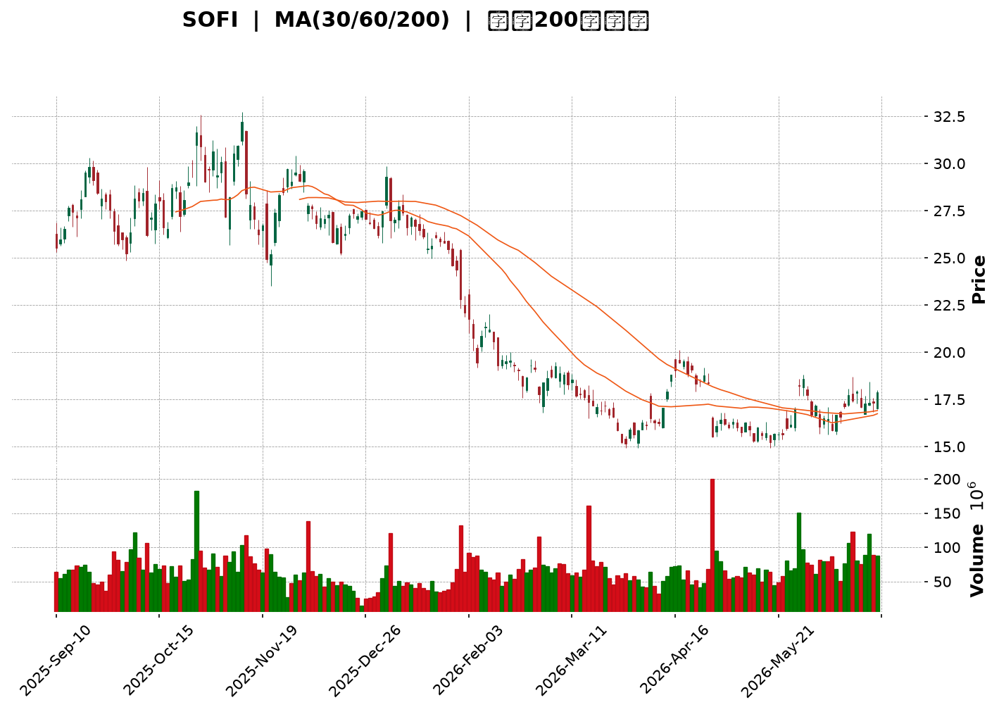
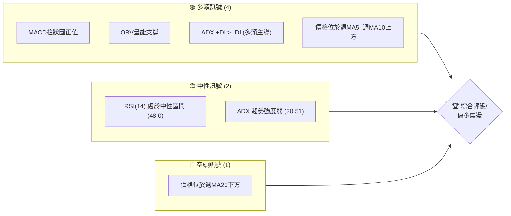
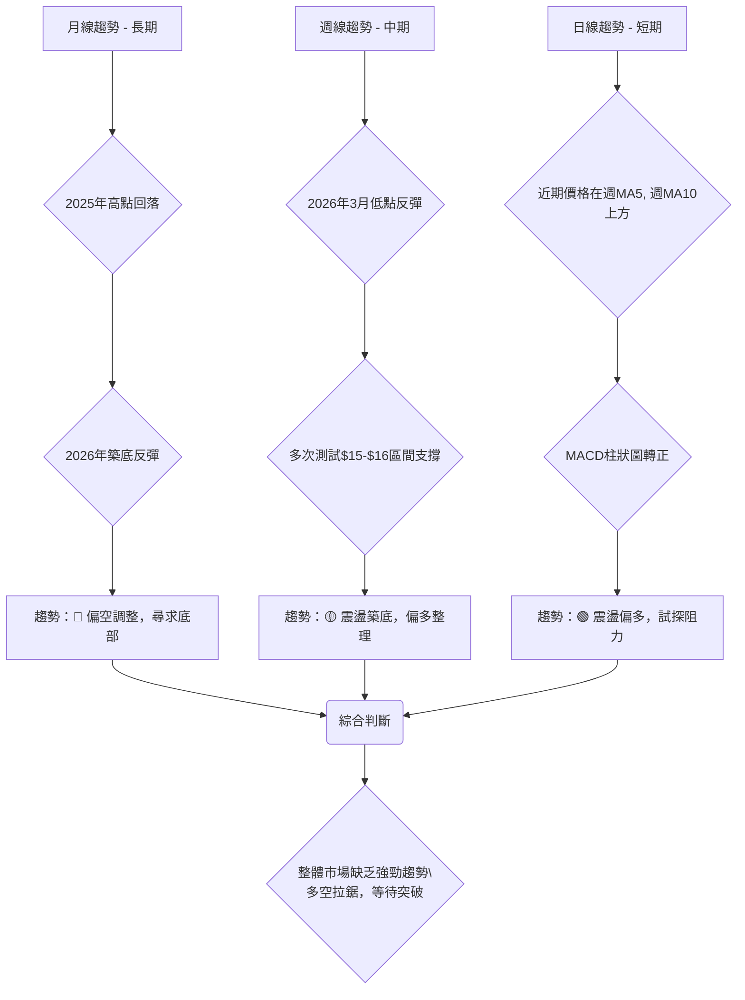
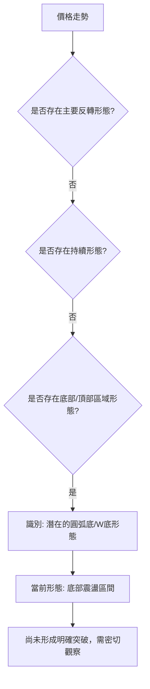
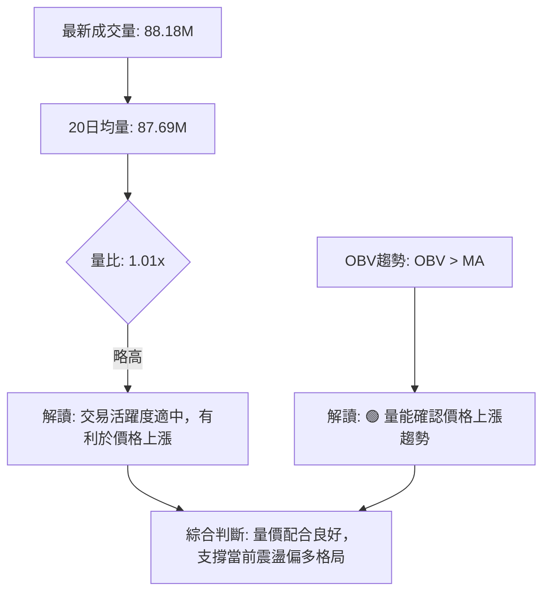
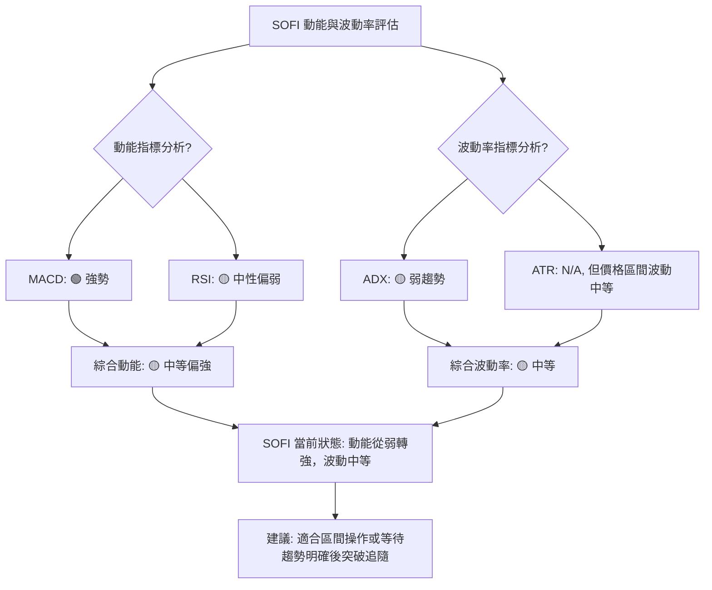

<details>
<summary>📊 靜態圖表 (點擊展開)</summary>

</details>

<html>
<head><meta charset="utf-8" /></head>
<body>
    <div style="height:500px; width:100%;">                        <script>window.PlotlyConfig = {MathJaxConfig: 'local'};</script>
        <script charset="utf-8" src="https://cdn.plot.ly/plotly-3.6.0.min.js" integrity="sha256-QaOVwtVY0T02VaHrr6pnoHLCwayMJp4O5n4YyaE3rJk=" crossorigin="anonymous"></script>                <div id="candlestick-chart" class="plotly-graph-div" style="height:100%; width:100%;"></div>            <script>                window.PLOTLYENV=window.PLOTLYENV || {};                                if (document.getElementById("candlestick-chart")) {                    Plotly.newPlot(                        "candlestick-chart",                        [{"close":{"dtype":"f8","bdata":"AAAAwB6FOUAAAACAwvU5QAAAAMDMjDpAAAAAIIWrO0AAAAAghWs7QAAAAADXIztAAAAAACkcPEAAAABgj4I9QAAAACBczz1AAAAAQAoXPUAAAADgo3A8QAAAAGC4HjxAAAAAQOH6O0AAAADAzIw7QAAAACCFazpAAAAAYI\u002fCOUAAAADgUfg5QAAAAKBwPTlAAAAAAClcOkAAAAAA1yM8QAAAAMAeBTxAAAAAQDNzPEAAAADgozA6QAAAAADXIztAAAAAYLjeO0AAAAAgrgc8QAAAAKCZmTpAAAAAgD2KOkAAAACAFK48QAAAAAAAwDxAAAAA4KMwO0AAAADgehQ8QAAAAGCPAj1AAAAAAAAAPkAAAADA9ag\u002fQAAAAGBm5j5AAAAAIK4HPUAAAACAFK49QAAAAKBHoT5AAAAAYLhePUAAAACA6xE+QAAAAMD1KDtAAAAAgMI1PEAAAACAPYo+QAAAAEAz8z5AAAAAQOEaQEAAAAAA12M8QAAAAIDr0TtAAAAAgD0KO0AAAACgcD06QAAAAOBRuDpAAAAAwPXoOEAAAADgozA5QAAAAGBmZjtAAAAA4HpUPEAAAACgcH08QAAAAOBRuD1AAAAAIK4HPUAAAABgj4I9QAAAAIDrET1AAAAAoJmZPUAAAAAgrsc7QAAAAAApnDtAAAAA4HrUOkAAAABAChc7QAAAAIDrETtAAAAAIK5HO0AAAACA69E5QAAAAOB6lDpAAAAAwB5FOUAAAACAPUo6QAAAAKBwPTtAAAAAoJlZO0AAAADgozA7QAAAAEDhejtAAAAAgOsRO0AAAACA69E6QAAAACBcjzpAAAAAgBQuOkAAAACAwnU7QAAAACCuRz1AAAAAQOH6OkAAAAAAAAA7QAAAAOBRuDtAAAAAYGZmO0AAAACgmZk6QAAAAADXIztAAAAAIIWrOkAAAADgo3A6QAAAAKBHITpAAAAAoHB9OUAAAAAA16M5QAAAAEAKFzpAAAAAoJnZOUAAAADAzMw5QAAAAIDCdTlAAAAAoJmZOEAAAAAAKVw4QAAAACBczzZAAAAA4HoUNkAAAABgj8I1QAAAAAAAwDRAAAAAgMJ1M0AAAAAAKdw0QAAAAKCZWTVAAAAAgBQuNUAAAADAzIw0QAAAAMDMTDNAAAAAACmcM0AAAABgj4IzQAAAAIA9ijNAAAAAwMxMM0AAAADAHgUzQAAAAOBRODJAAAAAwPWoMkAAAACAPUozQAAAAKCZGTNAAAAAYI\u002fCMUAAAAAA12MyQAAAAAApnDJAAAAAQDOzMkAAAAAAAEAzQAAAAGBm5jJAAAAAgD3KMkAAAACAPUoyQAAAACCuhzJAAAAAQDOzMUAAAABgj8IxQAAAAKBHoTFAAAAAYLheMUAAAACAFC4xQAAAAOB6FDFAAAAAYGbmMEAAAABgZiYxQAAAAEAzszBAAAAAIFyPMEAAAACgcL0vQAAAAIDCdS5AAAAAwMxMLkAAAABgj8IvQAAAAGCPQi9AAAAAQDOzL0AAAADAHkUwQAAAAAApHDBAAAAAoHB9MEAAAADAHkUwQAAAAOBRODBAAAAAwMwMMUAAAADA9egxQAAAAIA9yjJAAAAAIK4HM0AAAACAFG4zQAAAAAAAgDNAAAAA4HrUMkAAAAAgXA8zQAAAAIDrUTJAAAAA4KNwMkAAAABgj8IyQAAAAAApXDJAAAAAwMwML0AAAACgmRkwQAAAAIAUbjBAAAAAQDMzMEAAAADAHgUwQAAAAMDMTDBAAAAAAAAAMEAAAAAAAIAvQAAAAGCPQjBAAAAAwMzML0AAAABguJ4uQAAAAMAeBTBAAAAA4FE4L0AAAAAghWsvQAAAAIDCdS5AAAAAoEdhL0AAAADAzEwvQAAAAKBwPS9AAAAAgML1L0AAAAAghSswQAAAAOBR+DBAAAAA4FE4MkAAAADgepQyQAAAAKBwvTFAAAAAgBSuMEAAAABgZiYxQAAAACCuBzBAAAAAAACAMEAAAADgUXgwQAAAAKBwvS9AAAAAIIWrMEAAAADgepQwQAAAAKBHITFAAAAAgMK1MUAAAAAghWsxQAAAAMD16DFAAAAAoJkZMUAAAACAPUoxQAAAACBcTzFAAAAAwMxMMUAAAAAAAAD4fw=="},"high":{"dtype":"f8","bdata":"AAAAQOHaOkAAAACgmZk6QAAAAOCjsDpAAAAAwB7FO0AAAACgR+E7QAAAAIDCdTtAAAAAQLaTPEAAAACgR6E9QAAAAMDMTD5AAAAAANcjPkAAAAAghas9QAAAACCFqzxAAAAAQOF6PEAAAACgR6E8QAAAAAApnDtAAAAA4HpUO0AAAACgmVk6QAAAAIAULjpAAAAAANcjO0AAAABACtc8QAAAAIDCtTxAAAAA4KOwPEAAAADAzMw9QAAAAIAUbjtAAAAAoJlZPEAAAABAChc9QAAAAOCjcDxAAAAAIIXrOkAAAACAFO48QAAAAIDrET1AAAAAwMzMPEAAAADgUZg8QAAAAGC43j1AAAAAQDMzPkAAAABA4fo\u002fQAAAAOBRSEBAAAAAgD3qPkAAAAAAKdw9QAAAAOBROD9AAAAAgD3KPkAAAABguF4+QAAAAGDn2z5AAAAAoHA9PEAAAADgUfg+QAAAAKBw\u002fT5AAAAAoHBdQEAAAAAAAMA\u002fQAAAAIDrET1AAAAAQDPzO0AAAAAAAAA7QAAAAKCZ2TpAAAAAQDOTPEAAAACA63E5QAAAAAApnDtAAAAAQDNzPEAAAAAAAEA9QAAAAAAAwD1AAAAAQDOzPUAAAAAghWs+QAAAAIAU7j1AAAAAQDOzPUAAAACAFO47QAAAAOB61DtAAAAAQDNzO0AAAACAFK47QAAAACCuRztAAAAAAACAO0AAAABA4Xo7QAAAAKBwvTpAAAAAgMLVOkAAAABACrc6QAAAAGC4XjtAAAAAYLieO0AAAABAClc7QAAAAIA9ijtAAAAAwMyMO0AAAADA9Wg7QAAAAADXIztAAAAAYGbmOkAAAACgR4E7QAAAAAAp3D1AAAAAwMxMPUAAAACAFC47QAAAAIAUDjxAAAAAAABgPEAAAABg5VA7QAAAAEAzMztAAAAAgMIVO0AAAADgelQ7QAAAACCuxzpAAAAAQApXOkAAAADAzAw6QAAAAADXYzpAAAAAoEchOkAAAABgZmY6QAAAAIAU7jlAAAAAgD3KOUAAAABguB45QAAAAOBReDlAAAAAAAAAN0AAAAAAKVw3QAAAAADXwzVAAAAAYGZmNEAAAADA9Sg1QAAAAEAKlzVAAAAAAAAANkAAAACgmRk1QAAAAIA9yjRAAAAAYLjeM0AAAABACtczQAAAAGCPAjRAAAAAQOF6M0AAAADgozAzQAAAAKBHwTJAAAAAgMK1MkAAAABguJ4zQAAAACBcjzNAAAAAgMI1MkAAAADA9WgyQAAAAIA9CjNAAAAAIK5HM0AAAABA4XozQAAAAGC4PjNAAAAAgOvxMkAAAABgZgYzQAAAAKCZ2TJAAAAAwMyMMkAAAABgZiYyQAAAAIDrETJAAAAAoEdBMkAAAAAgrgcyQAAAACCFSzFAAAAAwHJoMUAAAADA9WgxQAAAAIDrETFAAAAAQApXMUAAAACgcH0wQAAAAKBHYS9AAAAAoEchL0AAAABgZgYwQAAAAIDrUTBAAAAAIK7HL0AAAADAzGwwQAAAAEDhWjBAAAAAoJnZMUAAAADgUXgwQAAAAKBwfTBAAAAAIFwPMUAAAABAMxMyQAAAAIDr0TJAAAAAYLieM0AAAACgRyE0QAAAAMAepTNAAAAAwB7FM0AAAAAgsHIzQAAAAGBm5jJAAAAAQDOTMkAAAAAghSszQAAAAGC43jJAAAAAQAqXMEAAAABguF4wQAAAACCFyzBAAAAAIK7HMEAAAAAgXE8wQAAAAKBHgTBAAAAAgMJ1MEAAAADAzAwwQAAAAIDrUTBAAAAA4HpUMEAAAAAghWsvQAAAAOCjEDBAAAAAgBSuL0AAAACA61EwQAAAACCuRy9AAAAA4KNwL0AAAACA65EvQAAAAAAp3C9AAAAAQDPzMEAAAADgo7AwQAAAAOB6FDFAAAAAQAqXMkAAAAAghcsyQAAAAEDhOjJAAAAAQAp3MUAAAABA4ToxQAAAAKBw\u002fTBAAAAAwPWoMEAAAACgmRkxQAAAAOBRuDBAAAAA4KOwMEAAAAAgrucwQAAAAIAUbjFAAAAA4HoUMkAAAABAM7MyQAAAAKBw\u002fTFAAAAAIFwPMkAAAACAFK4xQAAAAIAUbjJAAAAAQDOTMUAAAAAAAAD4fw=="},"hovertemplate":"\u003cb\u003e%{x|%Y-%m-%d}\u003c\u002fb\u003e\u003cbr\u003e\u958b: $%{open:.2f}\u003cbr\u003e\u9ad8: $%{high:.2f}\u003cbr\u003e\u4f4e: $%{low:.2f}\u003cbr\u003e\u6536: $%{close:.2f}\u003cextra\u003e\u003c\u002fextra\u003e","low":{"dtype":"f8","bdata":"AAAAwMxMOUAAAABguJ45QAAAAMAexTlAAAAAIFzvOkAAAACgR6E6QAAAAKBHITpAAAAA4HoUO0AAAACgcD08QAAAAOBR+DxAAAAAoJnZPEAAAACgmVk8QAAAACBcDztAAAAAIFyPO0AAAAAAKRw7QAAAAEAzszlAAAAAANejOUAAAABAM3M5QAAAAEAK1zhAAAAAIFxPOUAAAACAFK46QAAAAMAepTtAAAAAAADAO0AAAACgRyE6QAAAAOBReDpAAAAAAADAOUAAAAAgXI87QAAAAAAAQDpAAAAAYI8COkAAAAAgXA87QAAAAGBmJjxAAAAAoEdhOkAAAACg8TI7QAAAAEAzszxAAAAAwB5FPUAAAADAzMw8QAAAAADXIz5AAAAAQOH6PEAAAACgcH08QAAAAOB6VD1AAAAA4KOwPEAAAABgjwI9QAAAAKBHITtAAAAAwPWoOUAAAABACtc8QAAAAOAi2z1AAAAAgML1PkAAAABgZiY8QAAAACCuhzpAAAAAwMyMOkAAAACAwrU5QAAAACBcjzlAAAAAYLi+OEAAAADAHoU3QAAAACCupzlAAAAAoEehOkAAAAAgXE88QAAAAOB6dDxAAAAAIIWrPEAAAADgo1A9QAAAAMAeBT1AAAAAQOF6PEAAAACAFO46QAAAAMDMDDtAAAAAwMyMOkAAAABA4Xo6QAAAAIAUjjpAAAAAQDMzOkAAAACAPco5QAAAAOBRuDlAAAAAIIUrOUAAAABAM\u002fM5QAAAACCuRzpAAAAAoJkZO0AAAABAM9M6QAAAACCuBztAAAAAIK4HO0AAAACgcL06QAAAAIA9ijpAAAAAIFwPOkAAAACAPco5QAAAAKCZmTtAAAAAIK4HOkAAAACgcF06QAAAAIDrkTpAAAAAQOE6O0AAAABAMzM6QAAAAOBRODpAAAAAIIXrOUAAAACAwjU6QAAAAGCPAjpAAAAAgMI1OUAAAABAM\u002fM4QAAAAAAAADpAAAAAoJmZOUAAAADAHsU5QAAAAIDCNTlAAAAAgOuROEAAAADAzAw4QAAAACBcTzZAAAAAACncNUAAAADAHgU1QAAAAIDrETRAAAAAAKoxM0AAAACAPQo0QAAAAMDMzDRAAAAAwMwMNUAAAAAA1yM0QAAAAIA9CjNAAAAAYGYmM0AAAAAAKRwzQAAAAKCZOTNAAAAA4FH4MkAAAAAA14MyQAAAAOB6lDFAAAAAANfjMUAAAACAFO4yQAAAAOBR+DJAAAAAIFxPMUAAAADAzMwwQAAAAOCjsDFAAAAAACmcMkAAAAAA16MyQAAAAGC4HjJAAAAAwB7FMUAAAACAPQoyQAAAAOBR+DFAAAAAYLieMUAAAAAgrocxQAAAAOBReDFAAAAAQOF6MEAAAADA9SgxQAAAAOB6lDBAAAAAIIWrMEAAAABACtcwQAAAAKBwfTBAAAAAwB6FMEAAAAAAKZwvQAAAAMDMTC5AAAAAYLjeLUAAAABguJ4uQAAAAKBH4S5AAAAAACncLUAAAABgj8IvQAAAAIDr0S9AAAAAYI9CMEAAAADgetQvQAAAAOBRGDBAAAAAIIXrL0AAAABgZmYxQAAAACCFKzJAAAAAYGamMkAAAAAA12MzQAAAAEAKFzNAAAAA4KOwMkAAAADA9egyQAAAAIAU7jFAAAAAgMAqMkAAAAAA12MyQAAAAMAeRTJAAAAAAAAAL0AAAADgehQvQAAAAAAAwC9AAAAAoEchMEAAAACgR+EvQAAAAEDh+i9AAAAAwPWoL0AAAACAPQovQAAAAIA9ii9AAAAAoJkZL0AAAACAFG4uQAAAAIDCdS5AAAAAYI\u002fCLkAAAACAFK4uQAAAAEAK1y1AAAAAIFwPLkAAAABAM7MuQAAAAOBRuC5AAAAA4FG4L0AAAABgjwIwQAAAAADXoy9AAAAAgBSuMUAAAADgo7AxQAAAAIDCdTFAAAAA4HqUMEAAAACAwpUwQAAAAAApXC9AAAAAwPXoL0AAAADgT00vQAAAAMD1qC9AAAAAIFxPL0AAAABA4TowQAAAAGCPAjFAAAAAAKwcMUAAAAAAKVwxQAAAAADXQzFAAAAAgOsRMUAAAADgUbgwQAAAAIAULjFAAAAAgOvRMEAAAAAAAAD4fw=="},"name":"\u50f9\u683c","open":{"dtype":"f8","bdata":"AAAAgD1KOkAAAABgj8I5QAAAAAAAADpAAAAAAABAO0AAAACAPco7QAAAAAAAQDtAAAAAQAqXO0AAAAAA10M8QAAAAMDMTD1AAAAAgBTOPUAAAAAAAIA9QAAAAGCPwjtAAAAAYLhePEAAAAAAKVw8QAAAAOBReDtAAAAAQOG6OkAAAADgelQ6QAAAAKCZGTpAAAAAwB7FOUAAAACgmRk7QAAAAKBwfTxAAAAAgD0KPEAAAADAzIw8QAAAAIDrETtAAAAAYI+COkAAAABAMzM8QAAAAIDrETxAAAAAoJkZOkAAAABAMzM7QAAAACBcjzxAAAAAoHB9PEAAAADgelQ7QAAAAOBR2DxAAAAAAAAAPkAAAACgcP0+QAAAAGC4fj9AAAAAIFxvPkAAAADgo7A9QAAAAMD1qD1AAAAAIIVLPUAAAADAHoU9QAAAAAAAID5AAAAAYGaGOkAAAAAgXA89QAAAAGC4Pj5AAAAAgBQuP0AAAABA4bo\u002fQAAAAAAAADtAAAAAgMK1O0AAAABgj4I6QAAAAKCZeTpAAAAAoEfhO0AAAACgR6E4QAAAAOB61DlAAAAAQOH6OkAAAACAwrU8QAAAAIA9yjxAAAAA4HrUPEAAAAAA12M9QAAAAMDMbD1AAAAAwPUIPUAAAACgcF07QAAAAEDhujtAAAAAoHA9O0AAAABgZqY6QAAAAEAK1zpAAAAAwB4lO0AAAAAgXG87QAAAAKBwvTlAAAAAANejOkAAAACAFC46QAAAAGC4njpAAAAA4FGYO0AAAACA6xE7QAAAACCFKztAAAAAgD2KO0AAAABguN46QAAAACCuBztAAAAAgBSuOkAAAADA9ag6QAAAACBczztAAAAAQOE6PUAAAACgcN06QAAAAAAAADtAAAAAgBTOO0AAAACAPUo7QAAAAEAzszpAAAAAAAAAO0AAAAAgXM86QAAAAIA9ijpAAAAA4KNwOUAAAAAAAIA5QAAAAIAULjpAAAAAAAAAOkAAAABgZuY5QAAAAGBm5jlAAAAAAACAOUAAAACgcN04QAAAAIAUbjlAAAAAYI+CNkAAAADAzAw3QAAAAKBwfTVAAAAAQOE6NEAAAACAPUo0QAAAAIA9SjVAAAAAQAoXNUAAAACgmRk1QAAAAIA9yjRAAAAAIK5HM0AAAADA9WgzQAAAAOBReDNAAAAA4HpUM0AAAACAwhUzQAAAAEDhujJAAAAAAAAAMkAAAAAgrkczQAAAAOCjMDNAAAAAwPUoMkAAAADAHiUxQAAAAAAAADJAAAAAIFwPM0AAAABgZqYyQAAAAAApfDJAAAAA4HpUMkAAAAAghesyQAAAAADXYzJAAAAA4FE4MkAAAADAzMwxQAAAAAAAADJAAAAA4FG4MUAAAACAFG4xQAAAAAAAwDBAAAAAgD3qMEAAAAAgricxQAAAAGC4\u002fjBAAAAAgD0KMUAAAABgZkYwQAAAAEAKVy9AAAAAACncLkAAAABgZuYuQAAAAGBmRjBAAAAAoEdhLkAAAAAgrscvQAAAAMD1KDBAAAAAgBSuMUAAAAAA12MwQAAAAMDMTDBAAAAAAAAAMEAAAAAgrocxQAAAAOBReDJAAAAAYLieM0AAAACgmZkzQAAAAGCPQjNAAAAAYI+CM0AAAACAPUozQAAAAMAexTJAAAAA4KNwMkAAAABA4XoyQAAAAMAeZTJAAAAAwMyMMEAAAACAPYovQAAAAAApPDBAAAAA4FF4MEAAAAAghSswQAAAAEAzMzBAAAAAYI9CMEAAAAAgrgcwQAAAAKCZmS9AAAAAgOsRMEAAAAAghWsvQAAAAGC4ni5AAAAAYGZmL0AAAACAwvUuQAAAAIDCNS9AAAAAQOG6LkAAAACgcD0vQAAAAGBmZi9AAAAAQOF6MEAAAADAzAwwQAAAAMAeBTBAAAAAYI9CMkAAAABgZiYyQAAAACCuBzJAAAAAoEdhMUAAAADA9agwQAAAAEDhujBAAAAAgBQuMEAAAABgZmYwQAAAAOB6NDBAAAAAANejL0AAAACA69EwQAAAACCuRzFAAAAAQDMzMUAAAAAgXM8xQAAAAEAz0zFAAAAAQAqXMUAAAAAAKbwwQAAAAOBRODFAAAAAYGZmMUAAAAAAAAD4fw=="},"x":["2025-09-10T00:00:00-04:00","2025-09-11T00:00:00-04:00","2025-09-12T00:00:00-04:00","2025-09-15T00:00:00-04:00","2025-09-16T00:00:00-04:00","2025-09-17T00:00:00-04:00","2025-09-18T00:00:00-04:00","2025-09-19T00:00:00-04:00","2025-09-22T00:00:00-04:00","2025-09-23T00:00:00-04:00","2025-09-24T00:00:00-04:00","2025-09-25T00:00:00-04:00","2025-09-26T00:00:00-04:00","2025-09-29T00:00:00-04:00","2025-09-30T00:00:00-04:00","2025-10-01T00:00:00-04:00","2025-10-02T00:00:00-04:00","2025-10-03T00:00:00-04:00","2025-10-06T00:00:00-04:00","2025-10-07T00:00:00-04:00","2025-10-08T00:00:00-04:00","2025-10-09T00:00:00-04:00","2025-10-10T00:00:00-04:00","2025-10-13T00:00:00-04:00","2025-10-14T00:00:00-04:00","2025-10-15T00:00:00-04:00","2025-10-16T00:00:00-04:00","2025-10-17T00:00:00-04:00","2025-10-20T00:00:00-04:00","2025-10-21T00:00:00-04:00","2025-10-22T00:00:00-04:00","2025-10-23T00:00:00-04:00","2025-10-24T00:00:00-04:00","2025-10-27T00:00:00-04:00","2025-10-28T00:00:00-04:00","2025-10-29T00:00:00-04:00","2025-10-30T00:00:00-04:00","2025-10-31T00:00:00-04:00","2025-11-03T00:00:00-05:00","2025-11-04T00:00:00-05:00","2025-11-05T00:00:00-05:00","2025-11-06T00:00:00-05:00","2025-11-07T00:00:00-05:00","2025-11-10T00:00:00-05:00","2025-11-11T00:00:00-05:00","2025-11-12T00:00:00-05:00","2025-11-13T00:00:00-05:00","2025-11-14T00:00:00-05:00","2025-11-17T00:00:00-05:00","2025-11-18T00:00:00-05:00","2025-11-19T00:00:00-05:00","2025-11-20T00:00:00-05:00","2025-11-21T00:00:00-05:00","2025-11-24T00:00:00-05:00","2025-11-25T00:00:00-05:00","2025-11-26T00:00:00-05:00","2025-11-28T00:00:00-05:00","2025-12-01T00:00:00-05:00","2025-12-02T00:00:00-05:00","2025-12-03T00:00:00-05:00","2025-12-04T00:00:00-05:00","2025-12-05T00:00:00-05:00","2025-12-08T00:00:00-05:00","2025-12-09T00:00:00-05:00","2025-12-10T00:00:00-05:00","2025-12-11T00:00:00-05:00","2025-12-12T00:00:00-05:00","2025-12-15T00:00:00-05:00","2025-12-16T00:00:00-05:00","2025-12-17T00:00:00-05:00","2025-12-18T00:00:00-05:00","2025-12-19T00:00:00-05:00","2025-12-22T00:00:00-05:00","2025-12-23T00:00:00-05:00","2025-12-24T00:00:00-05:00","2025-12-26T00:00:00-05:00","2025-12-29T00:00:00-05:00","2025-12-30T00:00:00-05:00","2025-12-31T00:00:00-05:00","2026-01-02T00:00:00-05:00","2026-01-05T00:00:00-05:00","2026-01-06T00:00:00-05:00","2026-01-07T00:00:00-05:00","2026-01-08T00:00:00-05:00","2026-01-09T00:00:00-05:00","2026-01-12T00:00:00-05:00","2026-01-13T00:00:00-05:00","2026-01-14T00:00:00-05:00","2026-01-15T00:00:00-05:00","2026-01-16T00:00:00-05:00","2026-01-20T00:00:00-05:00","2026-01-21T00:00:00-05:00","2026-01-22T00:00:00-05:00","2026-01-23T00:00:00-05:00","2026-01-26T00:00:00-05:00","2026-01-27T00:00:00-05:00","2026-01-28T00:00:00-05:00","2026-01-29T00:00:00-05:00","2026-01-30T00:00:00-05:00","2026-02-02T00:00:00-05:00","2026-02-03T00:00:00-05:00","2026-02-04T00:00:00-05:00","2026-02-05T00:00:00-05:00","2026-02-06T00:00:00-05:00","2026-02-09T00:00:00-05:00","2026-02-10T00:00:00-05:00","2026-02-11T00:00:00-05:00","2026-02-12T00:00:00-05:00","2026-02-13T00:00:00-05:00","2026-02-17T00:00:00-05:00","2026-02-18T00:00:00-05:00","2026-02-19T00:00:00-05:00","2026-02-20T00:00:00-05:00","2026-02-23T00:00:00-05:00","2026-02-24T00:00:00-05:00","2026-02-25T00:00:00-05:00","2026-02-26T00:00:00-05:00","2026-02-27T00:00:00-05:00","2026-03-02T00:00:00-05:00","2026-03-03T00:00:00-05:00","2026-03-04T00:00:00-05:00","2026-03-05T00:00:00-05:00","2026-03-06T00:00:00-05:00","2026-03-09T00:00:00-04:00","2026-03-10T00:00:00-04:00","2026-03-11T00:00:00-04:00","2026-03-12T00:00:00-04:00","2026-03-13T00:00:00-04:00","2026-03-16T00:00:00-04:00","2026-03-17T00:00:00-04:00","2026-03-18T00:00:00-04:00","2026-03-19T00:00:00-04:00","2026-03-20T00:00:00-04:00","2026-03-23T00:00:00-04:00","2026-03-24T00:00:00-04:00","2026-03-25T00:00:00-04:00","2026-03-26T00:00:00-04:00","2026-03-27T00:00:00-04:00","2026-03-30T00:00:00-04:00","2026-03-31T00:00:00-04:00","2026-04-01T00:00:00-04:00","2026-04-02T00:00:00-04:00","2026-04-06T00:00:00-04:00","2026-04-07T00:00:00-04:00","2026-04-08T00:00:00-04:00","2026-04-09T00:00:00-04:00","2026-04-10T00:00:00-04:00","2026-04-13T00:00:00-04:00","2026-04-14T00:00:00-04:00","2026-04-15T00:00:00-04:00","2026-04-16T00:00:00-04:00","2026-04-17T00:00:00-04:00","2026-04-20T00:00:00-04:00","2026-04-21T00:00:00-04:00","2026-04-22T00:00:00-04:00","2026-04-23T00:00:00-04:00","2026-04-24T00:00:00-04:00","2026-04-27T00:00:00-04:00","2026-04-28T00:00:00-04:00","2026-04-29T00:00:00-04:00","2026-04-30T00:00:00-04:00","2026-05-01T00:00:00-04:00","2026-05-04T00:00:00-04:00","2026-05-05T00:00:00-04:00","2026-05-06T00:00:00-04:00","2026-05-07T00:00:00-04:00","2026-05-08T00:00:00-04:00","2026-05-11T00:00:00-04:00","2026-05-12T00:00:00-04:00","2026-05-13T00:00:00-04:00","2026-05-14T00:00:00-04:00","2026-05-15T00:00:00-04:00","2026-05-18T00:00:00-04:00","2026-05-19T00:00:00-04:00","2026-05-20T00:00:00-04:00","2026-05-21T00:00:00-04:00","2026-05-22T00:00:00-04:00","2026-05-26T00:00:00-04:00","2026-05-27T00:00:00-04:00","2026-05-28T00:00:00-04:00","2026-05-29T00:00:00-04:00","2026-06-01T00:00:00-04:00","2026-06-02T00:00:00-04:00","2026-06-03T00:00:00-04:00","2026-06-04T00:00:00-04:00","2026-06-05T00:00:00-04:00","2026-06-08T00:00:00-04:00","2026-06-09T00:00:00-04:00","2026-06-10T00:00:00-04:00","2026-06-11T00:00:00-04:00","2026-06-12T00:00:00-04:00","2026-06-15T00:00:00-04:00","2026-06-16T00:00:00-04:00","2026-06-17T00:00:00-04:00","2026-06-18T00:00:00-04:00","2026-06-22T00:00:00-04:00","2026-06-23T00:00:00-04:00","2026-06-24T00:00:00-04:00","2026-06-25T00:00:00-04:00","2026-06-26T00:00:00-04:00"],"type":"candlestick"},{"hovertemplate":"MA30: $%{y:.2f}\u003cextra\u003e\u003c\u002fextra\u003e","line":{"color":"#2196F3","dash":"dash","width":2},"mode":"lines","name":"MA30","x":["2025-09-10T00:00:00-04:00","2025-09-11T00:00:00-04:00","2025-09-12T00:00:00-04:00","2025-09-15T00:00:00-04:00","2025-09-16T00:00:00-04:00","2025-09-17T00:00:00-04:00","2025-09-18T00:00:00-04:00","2025-09-19T00:00:00-04:00","2025-09-22T00:00:00-04:00","2025-09-23T00:00:00-04:00","2025-09-24T00:00:00-04:00","2025-09-25T00:00:00-04:00","2025-09-26T00:00:00-04:00","2025-09-29T00:00:00-04:00","2025-09-30T00:00:00-04:00","2025-10-01T00:00:00-04:00","2025-10-02T00:00:00-04:00","2025-10-03T00:00:00-04:00","2025-10-06T00:00:00-04:00","2025-10-07T00:00:00-04:00","2025-10-08T00:00:00-04:00","2025-10-09T00:00:00-04:00","2025-10-10T00:00:00-04:00","2025-10-13T00:00:00-04:00","2025-10-14T00:00:00-04:00","2025-10-15T00:00:00-04:00","2025-10-16T00:00:00-04:00","2025-10-17T00:00:00-04:00","2025-10-20T00:00:00-04:00","2025-10-21T00:00:00-04:00","2025-10-22T00:00:00-04:00","2025-10-23T00:00:00-04:00","2025-10-24T00:00:00-04:00","2025-10-27T00:00:00-04:00","2025-10-28T00:00:00-04:00","2025-10-29T00:00:00-04:00","2025-10-30T00:00:00-04:00","2025-10-31T00:00:00-04:00","2025-11-03T00:00:00-05:00","2025-11-04T00:00:00-05:00","2025-11-05T00:00:00-05:00","2025-11-06T00:00:00-05:00","2025-11-07T00:00:00-05:00","2025-11-10T00:00:00-05:00","2025-11-11T00:00:00-05:00","2025-11-12T00:00:00-05:00","2025-11-13T00:00:00-05:00","2025-11-14T00:00:00-05:00","2025-11-17T00:00:00-05:00","2025-11-18T00:00:00-05:00","2025-11-19T00:00:00-05:00","2025-11-20T00:00:00-05:00","2025-11-21T00:00:00-05:00","2025-11-24T00:00:00-05:00","2025-11-25T00:00:00-05:00","2025-11-26T00:00:00-05:00","2025-11-28T00:00:00-05:00","2025-12-01T00:00:00-05:00","2025-12-02T00:00:00-05:00","2025-12-03T00:00:00-05:00","2025-12-04T00:00:00-05:00","2025-12-05T00:00:00-05:00","2025-12-08T00:00:00-05:00","2025-12-09T00:00:00-05:00","2025-12-10T00:00:00-05:00","2025-12-11T00:00:00-05:00","2025-12-12T00:00:00-05:00","2025-12-15T00:00:00-05:00","2025-12-16T00:00:00-05:00","2025-12-17T00:00:00-05:00","2025-12-18T00:00:00-05:00","2025-12-19T00:00:00-05:00","2025-12-22T00:00:00-05:00","2025-12-23T00:00:00-05:00","2025-12-24T00:00:00-05:00","2025-12-26T00:00:00-05:00","2025-12-29T00:00:00-05:00","2025-12-30T00:00:00-05:00","2025-12-31T00:00:00-05:00","2026-01-02T00:00:00-05:00","2026-01-05T00:00:00-05:00","2026-01-06T00:00:00-05:00","2026-01-07T00:00:00-05:00","2026-01-08T00:00:00-05:00","2026-01-09T00:00:00-05:00","2026-01-12T00:00:00-05:00","2026-01-13T00:00:00-05:00","2026-01-14T00:00:00-05:00","2026-01-15T00:00:00-05:00","2026-01-16T00:00:00-05:00","2026-01-20T00:00:00-05:00","2026-01-21T00:00:00-05:00","2026-01-22T00:00:00-05:00","2026-01-23T00:00:00-05:00","2026-01-26T00:00:00-05:00","2026-01-27T00:00:00-05:00","2026-01-28T00:00:00-05:00","2026-01-29T00:00:00-05:00","2026-01-30T00:00:00-05:00","2026-02-02T00:00:00-05:00","2026-02-03T00:00:00-05:00","2026-02-04T00:00:00-05:00","2026-02-05T00:00:00-05:00","2026-02-06T00:00:00-05:00","2026-02-09T00:00:00-05:00","2026-02-10T00:00:00-05:00","2026-02-11T00:00:00-05:00","2026-02-12T00:00:00-05:00","2026-02-13T00:00:00-05:00","2026-02-17T00:00:00-05:00","2026-02-18T00:00:00-05:00","2026-02-19T00:00:00-05:00","2026-02-20T00:00:00-05:00","2026-02-23T00:00:00-05:00","2026-02-24T00:00:00-05:00","2026-02-25T00:00:00-05:00","2026-02-26T00:00:00-05:00","2026-02-27T00:00:00-05:00","2026-03-02T00:00:00-05:00","2026-03-03T00:00:00-05:00","2026-03-04T00:00:00-05:00","2026-03-05T00:00:00-05:00","2026-03-06T00:00:00-05:00","2026-03-09T00:00:00-04:00","2026-03-10T00:00:00-04:00","2026-03-11T00:00:00-04:00","2026-03-12T00:00:00-04:00","2026-03-13T00:00:00-04:00","2026-03-16T00:00:00-04:00","2026-03-17T00:00:00-04:00","2026-03-18T00:00:00-04:00","2026-03-19T00:00:00-04:00","2026-03-20T00:00:00-04:00","2026-03-23T00:00:00-04:00","2026-03-24T00:00:00-04:00","2026-03-25T00:00:00-04:00","2026-03-26T00:00:00-04:00","2026-03-27T00:00:00-04:00","2026-03-30T00:00:00-04:00","2026-03-31T00:00:00-04:00","2026-04-01T00:00:00-04:00","2026-04-02T00:00:00-04:00","2026-04-06T00:00:00-04:00","2026-04-07T00:00:00-04:00","2026-04-08T00:00:00-04:00","2026-04-09T00:00:00-04:00","2026-04-10T00:00:00-04:00","2026-04-13T00:00:00-04:00","2026-04-14T00:00:00-04:00","2026-04-15T00:00:00-04:00","2026-04-16T00:00:00-04:00","2026-04-17T00:00:00-04:00","2026-04-20T00:00:00-04:00","2026-04-21T00:00:00-04:00","2026-04-22T00:00:00-04:00","2026-04-23T00:00:00-04:00","2026-04-24T00:00:00-04:00","2026-04-27T00:00:00-04:00","2026-04-28T00:00:00-04:00","2026-04-29T00:00:00-04:00","2026-04-30T00:00:00-04:00","2026-05-01T00:00:00-04:00","2026-05-04T00:00:00-04:00","2026-05-05T00:00:00-04:00","2026-05-06T00:00:00-04:00","2026-05-07T00:00:00-04:00","2026-05-08T00:00:00-04:00","2026-05-11T00:00:00-04:00","2026-05-12T00:00:00-04:00","2026-05-13T00:00:00-04:00","2026-05-14T00:00:00-04:00","2026-05-15T00:00:00-04:00","2026-05-18T00:00:00-04:00","2026-05-19T00:00:00-04:00","2026-05-20T00:00:00-04:00","2026-05-21T00:00:00-04:00","2026-05-22T00:00:00-04:00","2026-05-26T00:00:00-04:00","2026-05-27T00:00:00-04:00","2026-05-28T00:00:00-04:00","2026-05-29T00:00:00-04:00","2026-06-01T00:00:00-04:00","2026-06-02T00:00:00-04:00","2026-06-03T00:00:00-04:00","2026-06-04T00:00:00-04:00","2026-06-05T00:00:00-04:00","2026-06-08T00:00:00-04:00","2026-06-09T00:00:00-04:00","2026-06-10T00:00:00-04:00","2026-06-11T00:00:00-04:00","2026-06-12T00:00:00-04:00","2026-06-15T00:00:00-04:00","2026-06-16T00:00:00-04:00","2026-06-17T00:00:00-04:00","2026-06-18T00:00:00-04:00","2026-06-22T00:00:00-04:00","2026-06-23T00:00:00-04:00","2026-06-24T00:00:00-04:00","2026-06-25T00:00:00-04:00","2026-06-26T00:00:00-04:00"],"y":{"dtype":"f8","bdata":"AAAAAAAA+H8AAAAAAAD4fwAAAAAAAPh\u002fAAAAAAAA+H8AAAAAAAD4fwAAAAAAAPh\u002fAAAAAAAA+H8AAAAAAAD4fwAAAAAAAPh\u002fAAAAAAAA+H8AAAAAAAD4fwAAAAAAAPh\u002fAAAAAAAA+H8AAAAAAAD4fwAAAAAAAPh\u002fAAAAAAAA+H8AAAAAAAD4fwAAAAAAAPh\u002fAAAAAAAA+H8AAAAAAAD4fwAAAAAAAPh\u002fAAAAAAAA+H8AAAAAAAD4fwAAAAAAAPh\u002fAAAAAAAA+H8AAAAAAAD4fwAAAAAAAPh\u002fAAAAAAAA+H8AAAAAAAD4f5qZmXkwbztAVVVVpXB9O0C8u7vbh487QAAAANCFpDtAZmZmxme4O0AiIiIyltw7QKuqqgqs\u002fDtAAAAA0IUEPEDv7u4u+QU8QAAAAID4DDxAvLu7K1wPPEBVVVX1RB08QN7d3c0TFTxA7+7uPgoXPEAREREBjjA8QBEREfE1VzxA3t3dLUCOPEAAAADA5qI8QImIiNjquDxAREREVLi+PEB3d3e3ga48QCIiItJpozxAIiIikjSFPECamZkJrHw8QERERATkfjxAZmZm5tCCPECJiIjIvYY8QGZmZoZdoTxAMzMzA522PEDNzMwssr08QJqZmTltwDxAMzMz8\u002f3UPEB3d3eXbtI8QO\u002fu7j58xjxAZmZmRm+rPEBVVVX1b4Q8QCIiIjLBYzxAMzMzQ9JUPEBmZmb24TM8QKuqqppSETxAREREBFbuO0C8u7t7FM47QO\u002fu7j7DzjtAzczMjGzHO0DNzMxc1qo7QHd3dwc6jTtAd3d3h11hO0AAAADQ91M7QM3MzEw3STtAmpmZmeBBO0Crqqq6SUw7QDMzMyMiYjtA7+7uHsxzO0AAAAAgPoM7QM3MzCz5hTtA7+7ujgl+O0CrqqrK6G07QCIiIrLkVztAIiIiMsFDO0De3d2tjik7QGZmZiZ4EDtAd3d3t2XtOkAAAADQIts6QCIiIlIqzjpAq6qqes3FOkDe3d1ty7o6QERERFQOrTpAd3d3xy+WOkDNzMxcuok6QLy7u6uOaTpAIiIiAlZOOkAiIiISric6QDMzM3NM8DlAq6qqevisOUAiIiJi9HY5QCIiIjKlQjlAvLu7S2IQOUBVVVVF4do4QO\u002fu7o7tnDhAzczMLN1kOEAzMzMjBiE4QImIiMjozTdAERERkV+MN0De3d39Rkg3QM3MzOw19zZAq6qqGqGsNkCrqqoqQG42QFVVVYWkKTZAREREVJzdNUBVVVXV6pg1QFVVVSW\u002fWDVAq6qqKs4eNUAAAAAAR+g0QERERDTsqjRAZmZmZq1uNEDv7u6Oly40QO\u002fu7r508zNAd3d3d5O4M0C8u7uLQYAzQJqZmakNVDNAMzMzg9wrM0CamZlZxwQzQM3MzBx25TJAVVVVtZ3PMkBmZmYW9a8yQCIiIgJHiDJAZmZmdtpgMkARERHZ6jgyQERERMwvFjJA7+7uxiDwMUC8u7vrJtExQM3MzGTJrzFAmpmZwViSMUAiIiJK4XoxQFVVVe3faDFAVVVVfVtWMUCrqqoyljwxQFVVVb0CJDFAAAAAuPMdMUDNzMwk2xkxQERERFxkGzFAmpmZQTUeMUARERF5vh8xQJqZmTHdJDFAq6qqkjQlMUARERGpxisxQAAAAOj7KTFA3t3ddUwwMUBmZmb+1DgxQM3MzLQPPzFAVVVVPVEvMUCamZnxGSYxQHd3d\u002f+NIDFAvLu705QaMUBmZmZO8BAxQFVVVX2GDTFA7+7uJr8IMUAiIiICuQcxQERERBSDEDFAq6qqeukWMUC8u7tLDBIxQLy7u0NgFTFAmpmZ+VMTMUCrqqqijA4xQGZmZj4KBzFA3t3dnTYAMUBEREQ07PowQERERHzN9TBAERERCazsMECrqqry0t0wQAAAABhLzjBAZmZmnmHHMEC8u7vDIMAwQERERPwbsTBAVVVVPcOeMEAAAADIdo4wQLy7uzPsejBAzczMNF5qMEB3d3ef01YwQCIiIiKUQTBAzczMbFlLMEAAAAAAck8wQLy7uytrVTBAAAAA0E1iMECJiIgoQG4wQCIiIkL9ezBA7+7uPmCFMEDe3d1thJIwQAAAADB6mzBAiYiIiGynMEAAAAAAAAD4fw=="},"type":"scatter"},{"hovertemplate":"MA60: $%{y:.2f}\u003cextra\u003e\u003c\u002fextra\u003e","line":{"color":"#9C27B0","dash":"dash","width":2},"mode":"lines","name":"MA60","x":["2025-09-10T00:00:00-04:00","2025-09-11T00:00:00-04:00","2025-09-12T00:00:00-04:00","2025-09-15T00:00:00-04:00","2025-09-16T00:00:00-04:00","2025-09-17T00:00:00-04:00","2025-09-18T00:00:00-04:00","2025-09-19T00:00:00-04:00","2025-09-22T00:00:00-04:00","2025-09-23T00:00:00-04:00","2025-09-24T00:00:00-04:00","2025-09-25T00:00:00-04:00","2025-09-26T00:00:00-04:00","2025-09-29T00:00:00-04:00","2025-09-30T00:00:00-04:00","2025-10-01T00:00:00-04:00","2025-10-02T00:00:00-04:00","2025-10-03T00:00:00-04:00","2025-10-06T00:00:00-04:00","2025-10-07T00:00:00-04:00","2025-10-08T00:00:00-04:00","2025-10-09T00:00:00-04:00","2025-10-10T00:00:00-04:00","2025-10-13T00:00:00-04:00","2025-10-14T00:00:00-04:00","2025-10-15T00:00:00-04:00","2025-10-16T00:00:00-04:00","2025-10-17T00:00:00-04:00","2025-10-20T00:00:00-04:00","2025-10-21T00:00:00-04:00","2025-10-22T00:00:00-04:00","2025-10-23T00:00:00-04:00","2025-10-24T00:00:00-04:00","2025-10-27T00:00:00-04:00","2025-10-28T00:00:00-04:00","2025-10-29T00:00:00-04:00","2025-10-30T00:00:00-04:00","2025-10-31T00:00:00-04:00","2025-11-03T00:00:00-05:00","2025-11-04T00:00:00-05:00","2025-11-05T00:00:00-05:00","2025-11-06T00:00:00-05:00","2025-11-07T00:00:00-05:00","2025-11-10T00:00:00-05:00","2025-11-11T00:00:00-05:00","2025-11-12T00:00:00-05:00","2025-11-13T00:00:00-05:00","2025-11-14T00:00:00-05:00","2025-11-17T00:00:00-05:00","2025-11-18T00:00:00-05:00","2025-11-19T00:00:00-05:00","2025-11-20T00:00:00-05:00","2025-11-21T00:00:00-05:00","2025-11-24T00:00:00-05:00","2025-11-25T00:00:00-05:00","2025-11-26T00:00:00-05:00","2025-11-28T00:00:00-05:00","2025-12-01T00:00:00-05:00","2025-12-02T00:00:00-05:00","2025-12-03T00:00:00-05:00","2025-12-04T00:00:00-05:00","2025-12-05T00:00:00-05:00","2025-12-08T00:00:00-05:00","2025-12-09T00:00:00-05:00","2025-12-10T00:00:00-05:00","2025-12-11T00:00:00-05:00","2025-12-12T00:00:00-05:00","2025-12-15T00:00:00-05:00","2025-12-16T00:00:00-05:00","2025-12-17T00:00:00-05:00","2025-12-18T00:00:00-05:00","2025-12-19T00:00:00-05:00","2025-12-22T00:00:00-05:00","2025-12-23T00:00:00-05:00","2025-12-24T00:00:00-05:00","2025-12-26T00:00:00-05:00","2025-12-29T00:00:00-05:00","2025-12-30T00:00:00-05:00","2025-12-31T00:00:00-05:00","2026-01-02T00:00:00-05:00","2026-01-05T00:00:00-05:00","2026-01-06T00:00:00-05:00","2026-01-07T00:00:00-05:00","2026-01-08T00:00:00-05:00","2026-01-09T00:00:00-05:00","2026-01-12T00:00:00-05:00","2026-01-13T00:00:00-05:00","2026-01-14T00:00:00-05:00","2026-01-15T00:00:00-05:00","2026-01-16T00:00:00-05:00","2026-01-20T00:00:00-05:00","2026-01-21T00:00:00-05:00","2026-01-22T00:00:00-05:00","2026-01-23T00:00:00-05:00","2026-01-26T00:00:00-05:00","2026-01-27T00:00:00-05:00","2026-01-28T00:00:00-05:00","2026-01-29T00:00:00-05:00","2026-01-30T00:00:00-05:00","2026-02-02T00:00:00-05:00","2026-02-03T00:00:00-05:00","2026-02-04T00:00:00-05:00","2026-02-05T00:00:00-05:00","2026-02-06T00:00:00-05:00","2026-02-09T00:00:00-05:00","2026-02-10T00:00:00-05:00","2026-02-11T00:00:00-05:00","2026-02-12T00:00:00-05:00","2026-02-13T00:00:00-05:00","2026-02-17T00:00:00-05:00","2026-02-18T00:00:00-05:00","2026-02-19T00:00:00-05:00","2026-02-20T00:00:00-05:00","2026-02-23T00:00:00-05:00","2026-02-24T00:00:00-05:00","2026-02-25T00:00:00-05:00","2026-02-26T00:00:00-05:00","2026-02-27T00:00:00-05:00","2026-03-02T00:00:00-05:00","2026-03-03T00:00:00-05:00","2026-03-04T00:00:00-05:00","2026-03-05T00:00:00-05:00","2026-03-06T00:00:00-05:00","2026-03-09T00:00:00-04:00","2026-03-10T00:00:00-04:00","2026-03-11T00:00:00-04:00","2026-03-12T00:00:00-04:00","2026-03-13T00:00:00-04:00","2026-03-16T00:00:00-04:00","2026-03-17T00:00:00-04:00","2026-03-18T00:00:00-04:00","2026-03-19T00:00:00-04:00","2026-03-20T00:00:00-04:00","2026-03-23T00:00:00-04:00","2026-03-24T00:00:00-04:00","2026-03-25T00:00:00-04:00","2026-03-26T00:00:00-04:00","2026-03-27T00:00:00-04:00","2026-03-30T00:00:00-04:00","2026-03-31T00:00:00-04:00","2026-04-01T00:00:00-04:00","2026-04-02T00:00:00-04:00","2026-04-06T00:00:00-04:00","2026-04-07T00:00:00-04:00","2026-04-08T00:00:00-04:00","2026-04-09T00:00:00-04:00","2026-04-10T00:00:00-04:00","2026-04-13T00:00:00-04:00","2026-04-14T00:00:00-04:00","2026-04-15T00:00:00-04:00","2026-04-16T00:00:00-04:00","2026-04-17T00:00:00-04:00","2026-04-20T00:00:00-04:00","2026-04-21T00:00:00-04:00","2026-04-22T00:00:00-04:00","2026-04-23T00:00:00-04:00","2026-04-24T00:00:00-04:00","2026-04-27T00:00:00-04:00","2026-04-28T00:00:00-04:00","2026-04-29T00:00:00-04:00","2026-04-30T00:00:00-04:00","2026-05-01T00:00:00-04:00","2026-05-04T00:00:00-04:00","2026-05-05T00:00:00-04:00","2026-05-06T00:00:00-04:00","2026-05-07T00:00:00-04:00","2026-05-08T00:00:00-04:00","2026-05-11T00:00:00-04:00","2026-05-12T00:00:00-04:00","2026-05-13T00:00:00-04:00","2026-05-14T00:00:00-04:00","2026-05-15T00:00:00-04:00","2026-05-18T00:00:00-04:00","2026-05-19T00:00:00-04:00","2026-05-20T00:00:00-04:00","2026-05-21T00:00:00-04:00","2026-05-22T00:00:00-04:00","2026-05-26T00:00:00-04:00","2026-05-27T00:00:00-04:00","2026-05-28T00:00:00-04:00","2026-05-29T00:00:00-04:00","2026-06-01T00:00:00-04:00","2026-06-02T00:00:00-04:00","2026-06-03T00:00:00-04:00","2026-06-04T00:00:00-04:00","2026-06-05T00:00:00-04:00","2026-06-08T00:00:00-04:00","2026-06-09T00:00:00-04:00","2026-06-10T00:00:00-04:00","2026-06-11T00:00:00-04:00","2026-06-12T00:00:00-04:00","2026-06-15T00:00:00-04:00","2026-06-16T00:00:00-04:00","2026-06-17T00:00:00-04:00","2026-06-18T00:00:00-04:00","2026-06-22T00:00:00-04:00","2026-06-23T00:00:00-04:00","2026-06-24T00:00:00-04:00","2026-06-25T00:00:00-04:00","2026-06-26T00:00:00-04:00"],"y":{"dtype":"f8","bdata":"AAAAAAAA+H8AAAAAAAD4fwAAAAAAAPh\u002fAAAAAAAA+H8AAAAAAAD4fwAAAAAAAPh\u002fAAAAAAAA+H8AAAAAAAD4fwAAAAAAAPh\u002fAAAAAAAA+H8AAAAAAAD4fwAAAAAAAPh\u002fAAAAAAAA+H8AAAAAAAD4fwAAAAAAAPh\u002fAAAAAAAA+H8AAAAAAAD4fwAAAAAAAPh\u002fAAAAAAAA+H8AAAAAAAD4fwAAAAAAAPh\u002fAAAAAAAA+H8AAAAAAAD4fwAAAAAAAPh\u002fAAAAAAAA+H8AAAAAAAD4fwAAAAAAAPh\u002fAAAAAAAA+H8AAAAAAAD4fwAAAAAAAPh\u002fAAAAAAAA+H8AAAAAAAD4fwAAAAAAAPh\u002fAAAAAAAA+H8AAAAAAAD4fwAAAAAAAPh\u002fAAAAAAAA+H8AAAAAAAD4fwAAAAAAAPh\u002fAAAAAAAA+H8AAAAAAAD4fwAAAAAAAPh\u002fAAAAAAAA+H8AAAAAAAD4fwAAAAAAAPh\u002fAAAAAAAA+H8AAAAAAAD4fwAAAAAAAPh\u002fAAAAAAAA+H8AAAAAAAD4fwAAAAAAAPh\u002fAAAAAAAA+H8AAAAAAAD4fwAAAAAAAPh\u002fAAAAAAAA+H8AAAAAAAD4fwAAAAAAAPh\u002fAAAAAAAA+H8AAAAAAAD4f5qZmdnOFzxARERETDcpPECamZk5+zA8QHd3dweBNTxAZmZmhusxPEC8u7sTgzA8QGZmZp42MDxAmpmZCawsPECrqqqS7Rw8QFVVVY0lDzxAAAAAGNn+O0CJiIi4rPU7QGZmZobr8TtA3t3dZTvvO0Dv7u4usu07QERERPw38jtAq6qq2s73O0AAAABIb\u002fs7QKuqqhIRATxA7+7udkwAPEARERG5Zf07QKuqqvrFAjxAiYiIWID8O0DNzMwU9f87QImIiJhuAjxAq6qqOm0APECamZlJU\u002fo7QERERByh\u002fDtAq6qqGi\u002f9O0BVVVVtoPM7QAAAALBy6DtAVVVV1THhO0C8u7uzyNY7QImIiEhTyjtAiYiIYJ64O0CamZmxnZ87QDMzM8NniDtAVVVVBYF1O0CamZkpzl47QDMzM6NwPTtAMzMzA1YeO0Dv7u5G4fo6QBEREdmH3zpAvLu7gzK6OkB3d3df5ZA6QM3MzJzvZzpAmpmZ6d84OkCrqqqKbBc6QN7d3W0S8zlAMzMz417TOUDv7u7up7Y5QN7d3XUFmDlAAAAA2BWAOUDv7u6OwmU5QM3MzIyXPjlAzczMVFUVOUCrqqp6FO44QLy7u5vEwDhAMzMzw66QOECamZnBPGE4QN7d3aWbNDhAERER8RkGOEAAAADotOE3QDMzM0OLvDdAiYiIcD2aN0BmZmZ+sXQ3QJqZmYlBUDdAd3d3n2EnN0BERET0\u002fQQ3QKuqqirO3jZAq6qqQhm9NkDe3d21OpY2QAAAAEjhajZAAAAAGEs+NkBERES8dBM2QCIiIhp25TVAERERYZ64NUAzMzMP5ok1QJqZma2OWTVA3t3d+X4qNUB3d3eHFvk0QKuqqhbZvjRAVVVVKVyPNEAAAAAklGE0QBEREe0KMDRAAAAATH4BNECrqqoua9UzQFVVVaHTpjNAIiIiBsh9M0ARERH9YlkzQM3MzMAROjNAIiIitoEeM0CJiIi8AgQzQO\u002fu7rLk5zJAiYiI\u002fPDJMkAAAAAcL60yQHd3d1O4jjJAq6qq9m90MkARERFFi1wyQDMzM6+OSTJARERE4JYtMkCamZmlcBUyQCIiIg4CAzJAiYiIRBn1MUBmZmaycuAxQLy7u7\u002fmyjFAq6qqzsy0MUCamZntUaAxQERERHBZkzFAzczMIIWDMUC8u7ubmXExQERERNSUYjFAmpmZXdZSMUBmZmb2tkQxQN7d3RX1NzFAmpmZDUkrMUB3d3czwRsxQM3MzBzoDDFAiYiI4E8FMUC8u7sL1\u002fswQCIiIrrX9DBAAAAAcMvyMEBmZmae7+8wQO\u002fu7pb86jBAAAAA6PvhMECJiIi4Ht0wQN7d3Q100jBAVVVVVVXNMEDv7u5O1McwQHd3d+tRwDBAERERVVW9MEDNzMz4xbowQJqZmZX8ujBA3t3dUXG+MEB3d3c7mL8wQLy7u9\u002fBxDBA7+7usg\u002fHMEAAAAC4Hs0wQCIiIqL+1TBAmpmZASvfMEAAAAAAAAD4fw=="},"type":"scatter"},{"hovertemplate":"MA200: $%{y:.2f}\u003cextra\u003e\u003c\u002fextra\u003e","line":{"color":"#FF6F00","dash":"solid","width":2},"mode":"lines","name":"MA200","x":["2025-09-10T00:00:00-04:00","2025-09-11T00:00:00-04:00","2025-09-12T00:00:00-04:00","2025-09-15T00:00:00-04:00","2025-09-16T00:00:00-04:00","2025-09-17T00:00:00-04:00","2025-09-18T00:00:00-04:00","2025-09-19T00:00:00-04:00","2025-09-22T00:00:00-04:00","2025-09-23T00:00:00-04:00","2025-09-24T00:00:00-04:00","2025-09-25T00:00:00-04:00","2025-09-26T00:00:00-04:00","2025-09-29T00:00:00-04:00","2025-09-30T00:00:00-04:00","2025-10-01T00:00:00-04:00","2025-10-02T00:00:00-04:00","2025-10-03T00:00:00-04:00","2025-10-06T00:00:00-04:00","2025-10-07T00:00:00-04:00","2025-10-08T00:00:00-04:00","2025-10-09T00:00:00-04:00","2025-10-10T00:00:00-04:00","2025-10-13T00:00:00-04:00","2025-10-14T00:00:00-04:00","2025-10-15T00:00:00-04:00","2025-10-16T00:00:00-04:00","2025-10-17T00:00:00-04:00","2025-10-20T00:00:00-04:00","2025-10-21T00:00:00-04:00","2025-10-22T00:00:00-04:00","2025-10-23T00:00:00-04:00","2025-10-24T00:00:00-04:00","2025-10-27T00:00:00-04:00","2025-10-28T00:00:00-04:00","2025-10-29T00:00:00-04:00","2025-10-30T00:00:00-04:00","2025-10-31T00:00:00-04:00","2025-11-03T00:00:00-05:00","2025-11-04T00:00:00-05:00","2025-11-05T00:00:00-05:00","2025-11-06T00:00:00-05:00","2025-11-07T00:00:00-05:00","2025-11-10T00:00:00-05:00","2025-11-11T00:00:00-05:00","2025-11-12T00:00:00-05:00","2025-11-13T00:00:00-05:00","2025-11-14T00:00:00-05:00","2025-11-17T00:00:00-05:00","2025-11-18T00:00:00-05:00","2025-11-19T00:00:00-05:00","2025-11-20T00:00:00-05:00","2025-11-21T00:00:00-05:00","2025-11-24T00:00:00-05:00","2025-11-25T00:00:00-05:00","2025-11-26T00:00:00-05:00","2025-11-28T00:00:00-05:00","2025-12-01T00:00:00-05:00","2025-12-02T00:00:00-05:00","2025-12-03T00:00:00-05:00","2025-12-04T00:00:00-05:00","2025-12-05T00:00:00-05:00","2025-12-08T00:00:00-05:00","2025-12-09T00:00:00-05:00","2025-12-10T00:00:00-05:00","2025-12-11T00:00:00-05:00","2025-12-12T00:00:00-05:00","2025-12-15T00:00:00-05:00","2025-12-16T00:00:00-05:00","2025-12-17T00:00:00-05:00","2025-12-18T00:00:00-05:00","2025-12-19T00:00:00-05:00","2025-12-22T00:00:00-05:00","2025-12-23T00:00:00-05:00","2025-12-24T00:00:00-05:00","2025-12-26T00:00:00-05:00","2025-12-29T00:00:00-05:00","2025-12-30T00:00:00-05:00","2025-12-31T00:00:00-05:00","2026-01-02T00:00:00-05:00","2026-01-05T00:00:00-05:00","2026-01-06T00:00:00-05:00","2026-01-07T00:00:00-05:00","2026-01-08T00:00:00-05:00","2026-01-09T00:00:00-05:00","2026-01-12T00:00:00-05:00","2026-01-13T00:00:00-05:00","2026-01-14T00:00:00-05:00","2026-01-15T00:00:00-05:00","2026-01-16T00:00:00-05:00","2026-01-20T00:00:00-05:00","2026-01-21T00:00:00-05:00","2026-01-22T00:00:00-05:00","2026-01-23T00:00:00-05:00","2026-01-26T00:00:00-05:00","2026-01-27T00:00:00-05:00","2026-01-28T00:00:00-05:00","2026-01-29T00:00:00-05:00","2026-01-30T00:00:00-05:00","2026-02-02T00:00:00-05:00","2026-02-03T00:00:00-05:00","2026-02-04T00:00:00-05:00","2026-02-05T00:00:00-05:00","2026-02-06T00:00:00-05:00","2026-02-09T00:00:00-05:00","2026-02-10T00:00:00-05:00","2026-02-11T00:00:00-05:00","2026-02-12T00:00:00-05:00","2026-02-13T00:00:00-05:00","2026-02-17T00:00:00-05:00","2026-02-18T00:00:00-05:00","2026-02-19T00:00:00-05:00","2026-02-20T00:00:00-05:00","2026-02-23T00:00:00-05:00","2026-02-24T00:00:00-05:00","2026-02-25T00:00:00-05:00","2026-02-26T00:00:00-05:00","2026-02-27T00:00:00-05:00","2026-03-02T00:00:00-05:00","2026-03-03T00:00:00-05:00","2026-03-04T00:00:00-05:00","2026-03-05T00:00:00-05:00","2026-03-06T00:00:00-05:00","2026-03-09T00:00:00-04:00","2026-03-10T00:00:00-04:00","2026-03-11T00:00:00-04:00","2026-03-12T00:00:00-04:00","2026-03-13T00:00:00-04:00","2026-03-16T00:00:00-04:00","2026-03-17T00:00:00-04:00","2026-03-18T00:00:00-04:00","2026-03-19T00:00:00-04:00","2026-03-20T00:00:00-04:00","2026-03-23T00:00:00-04:00","2026-03-24T00:00:00-04:00","2026-03-25T00:00:00-04:00","2026-03-26T00:00:00-04:00","2026-03-27T00:00:00-04:00","2026-03-30T00:00:00-04:00","2026-03-31T00:00:00-04:00","2026-04-01T00:00:00-04:00","2026-04-02T00:00:00-04:00","2026-04-06T00:00:00-04:00","2026-04-07T00:00:00-04:00","2026-04-08T00:00:00-04:00","2026-04-09T00:00:00-04:00","2026-04-10T00:00:00-04:00","2026-04-13T00:00:00-04:00","2026-04-14T00:00:00-04:00","2026-04-15T00:00:00-04:00","2026-04-16T00:00:00-04:00","2026-04-17T00:00:00-04:00","2026-04-20T00:00:00-04:00","2026-04-21T00:00:00-04:00","2026-04-22T00:00:00-04:00","2026-04-23T00:00:00-04:00","2026-04-24T00:00:00-04:00","2026-04-27T00:00:00-04:00","2026-04-28T00:00:00-04:00","2026-04-29T00:00:00-04:00","2026-04-30T00:00:00-04:00","2026-05-01T00:00:00-04:00","2026-05-04T00:00:00-04:00","2026-05-05T00:00:00-04:00","2026-05-06T00:00:00-04:00","2026-05-07T00:00:00-04:00","2026-05-08T00:00:00-04:00","2026-05-11T00:00:00-04:00","2026-05-12T00:00:00-04:00","2026-05-13T00:00:00-04:00","2026-05-14T00:00:00-04:00","2026-05-15T00:00:00-04:00","2026-05-18T00:00:00-04:00","2026-05-19T00:00:00-04:00","2026-05-20T00:00:00-04:00","2026-05-21T00:00:00-04:00","2026-05-22T00:00:00-04:00","2026-05-26T00:00:00-04:00","2026-05-27T00:00:00-04:00","2026-05-28T00:00:00-04:00","2026-05-29T00:00:00-04:00","2026-06-01T00:00:00-04:00","2026-06-02T00:00:00-04:00","2026-06-03T00:00:00-04:00","2026-06-04T00:00:00-04:00","2026-06-05T00:00:00-04:00","2026-06-08T00:00:00-04:00","2026-06-09T00:00:00-04:00","2026-06-10T00:00:00-04:00","2026-06-11T00:00:00-04:00","2026-06-12T00:00:00-04:00","2026-06-15T00:00:00-04:00","2026-06-16T00:00:00-04:00","2026-06-17T00:00:00-04:00","2026-06-18T00:00:00-04:00","2026-06-22T00:00:00-04:00","2026-06-23T00:00:00-04:00","2026-06-24T00:00:00-04:00","2026-06-25T00:00:00-04:00","2026-06-26T00:00:00-04:00"],"y":{"dtype":"f8","bdata":"AAAAAAAA+H8AAAAAAAD4fwAAAAAAAPh\u002fAAAAAAAA+H8AAAAAAAD4fwAAAAAAAPh\u002fAAAAAAAA+H8AAAAAAAD4fwAAAAAAAPh\u002fAAAAAAAA+H8AAAAAAAD4fwAAAAAAAPh\u002fAAAAAAAA+H8AAAAAAAD4fwAAAAAAAPh\u002fAAAAAAAA+H8AAAAAAAD4fwAAAAAAAPh\u002fAAAAAAAA+H8AAAAAAAD4fwAAAAAAAPh\u002fAAAAAAAA+H8AAAAAAAD4fwAAAAAAAPh\u002fAAAAAAAA+H8AAAAAAAD4fwAAAAAAAPh\u002fAAAAAAAA+H8AAAAAAAD4fwAAAAAAAPh\u002fAAAAAAAA+H8AAAAAAAD4fwAAAAAAAPh\u002fAAAAAAAA+H8AAAAAAAD4fwAAAAAAAPh\u002fAAAAAAAA+H8AAAAAAAD4fwAAAAAAAPh\u002fAAAAAAAA+H8AAAAAAAD4fwAAAAAAAPh\u002fAAAAAAAA+H8AAAAAAAD4fwAAAAAAAPh\u002fAAAAAAAA+H8AAAAAAAD4fwAAAAAAAPh\u002fAAAAAAAA+H8AAAAAAAD4fwAAAAAAAPh\u002fAAAAAAAA+H8AAAAAAAD4fwAAAAAAAPh\u002fAAAAAAAA+H8AAAAAAAD4fwAAAAAAAPh\u002fAAAAAAAA+H8AAAAAAAD4fwAAAAAAAPh\u002fAAAAAAAA+H8AAAAAAAD4fwAAAAAAAPh\u002fAAAAAAAA+H8AAAAAAAD4fwAAAAAAAPh\u002fAAAAAAAA+H8AAAAAAAD4fwAAAAAAAPh\u002fAAAAAAAA+H8AAAAAAAD4fwAAAAAAAPh\u002fAAAAAAAA+H8AAAAAAAD4fwAAAAAAAPh\u002fAAAAAAAA+H8AAAAAAAD4fwAAAAAAAPh\u002fAAAAAAAA+H8AAAAAAAD4fwAAAAAAAPh\u002fAAAAAAAA+H8AAAAAAAD4fwAAAAAAAPh\u002fAAAAAAAA+H8AAAAAAAD4fwAAAAAAAPh\u002fAAAAAAAA+H8AAAAAAAD4fwAAAAAAAPh\u002fAAAAAAAA+H8AAAAAAAD4fwAAAAAAAPh\u002fAAAAAAAA+H8AAAAAAAD4fwAAAAAAAPh\u002fAAAAAAAA+H8AAAAAAAD4fwAAAAAAAPh\u002fAAAAAAAA+H8AAAAAAAD4fwAAAAAAAPh\u002fAAAAAAAA+H8AAAAAAAD4fwAAAAAAAPh\u002fAAAAAAAA+H8AAAAAAAD4fwAAAAAAAPh\u002fAAAAAAAA+H8AAAAAAAD4fwAAAAAAAPh\u002fAAAAAAAA+H8AAAAAAAD4fwAAAAAAAPh\u002fAAAAAAAA+H8AAAAAAAD4fwAAAAAAAPh\u002fAAAAAAAA+H8AAAAAAAD4fwAAAAAAAPh\u002fAAAAAAAA+H8AAAAAAAD4fwAAAAAAAPh\u002fAAAAAAAA+H8AAAAAAAD4fwAAAAAAAPh\u002fAAAAAAAA+H8AAAAAAAD4fwAAAAAAAPh\u002fAAAAAAAA+H8AAAAAAAD4fwAAAAAAAPh\u002fAAAAAAAA+H8AAAAAAAD4fwAAAAAAAPh\u002fAAAAAAAA+H8AAAAAAAD4fwAAAAAAAPh\u002fAAAAAAAA+H8AAAAAAAD4fwAAAAAAAPh\u002fAAAAAAAA+H8AAAAAAAD4fwAAAAAAAPh\u002fAAAAAAAA+H8AAAAAAAD4fwAAAAAAAPh\u002fAAAAAAAA+H8AAAAAAAD4fwAAAAAAAPh\u002fAAAAAAAA+H8AAAAAAAD4fwAAAAAAAPh\u002fAAAAAAAA+H8AAAAAAAD4fwAAAAAAAPh\u002fAAAAAAAA+H8AAAAAAAD4fwAAAAAAAPh\u002fAAAAAAAA+H8AAAAAAAD4fwAAAAAAAPh\u002fAAAAAAAA+H8AAAAAAAD4fwAAAAAAAPh\u002fAAAAAAAA+H8AAAAAAAD4fwAAAAAAAPh\u002fAAAAAAAA+H8AAAAAAAD4fwAAAAAAAPh\u002fAAAAAAAA+H8AAAAAAAD4fwAAAAAAAPh\u002fAAAAAAAA+H8AAAAAAAD4fwAAAAAAAPh\u002fAAAAAAAA+H8AAAAAAAD4fwAAAAAAAPh\u002fAAAAAAAA+H8AAAAAAAD4fwAAAAAAAPh\u002fAAAAAAAA+H8AAAAAAAD4fwAAAAAAAPh\u002fAAAAAAAA+H8AAAAAAAD4fwAAAAAAAPh\u002fAAAAAAAA+H8AAAAAAAD4fwAAAAAAAPh\u002fAAAAAAAA+H8AAAAAAAD4fwAAAAAAAPh\u002fAAAAAAAA+H8AAAAAAAD4fwAAAAAAAPh\u002fAAAAAAAA+H8AAAAAAAD4fw=="},"type":"scatter"}],                        {"template":{"data":{"barpolar":[{"marker":{"line":{"color":"rgb(17,17,17)","width":0.5},"pattern":{"fillmode":"overlay","size":10,"solidity":0.2}},"type":"barpolar"}],"bar":[{"error_x":{"color":"#f2f5fa"},"error_y":{"color":"#f2f5fa"},"marker":{"line":{"color":"rgb(17,17,17)","width":0.5},"pattern":{"fillmode":"overlay","size":10,"solidity":0.2}},"type":"bar"}],"carpet":[{"aaxis":{"endlinecolor":"#A2B1C6","gridcolor":"#506784","linecolor":"#506784","minorgridcolor":"#506784","startlinecolor":"#A2B1C6"},"baxis":{"endlinecolor":"#A2B1C6","gridcolor":"#506784","linecolor":"#506784","minorgridcolor":"#506784","startlinecolor":"#A2B1C6"},"type":"carpet"}],"choropleth":[{"colorbar":{"outlinewidth":0,"ticks":""},"type":"choropleth"}],"contourcarpet":[{"colorbar":{"outlinewidth":0,"ticks":""},"type":"contourcarpet"}],"contour":[{"colorbar":{"outlinewidth":0,"ticks":""},"colorscale":[[0.0,"#0d0887"],[0.1111111111111111,"#46039f"],[0.2222222222222222,"#7201a8"],[0.3333333333333333,"#9c179e"],[0.4444444444444444,"#bd3786"],[0.5555555555555556,"#d8576b"],[0.6666666666666666,"#ed7953"],[0.7777777777777778,"#fb9f3a"],[0.8888888888888888,"#fdca26"],[1.0,"#f0f921"]],"type":"contour"}],"heatmap":[{"colorbar":{"outlinewidth":0,"ticks":""},"colorscale":[[0.0,"#0d0887"],[0.1111111111111111,"#46039f"],[0.2222222222222222,"#7201a8"],[0.3333333333333333,"#9c179e"],[0.4444444444444444,"#bd3786"],[0.5555555555555556,"#d8576b"],[0.6666666666666666,"#ed7953"],[0.7777777777777778,"#fb9f3a"],[0.8888888888888888,"#fdca26"],[1.0,"#f0f921"]],"type":"heatmap"}],"histogram2dcontour":[{"colorbar":{"outlinewidth":0,"ticks":""},"colorscale":[[0.0,"#0d0887"],[0.1111111111111111,"#46039f"],[0.2222222222222222,"#7201a8"],[0.3333333333333333,"#9c179e"],[0.4444444444444444,"#bd3786"],[0.5555555555555556,"#d8576b"],[0.6666666666666666,"#ed7953"],[0.7777777777777778,"#fb9f3a"],[0.8888888888888888,"#fdca26"],[1.0,"#f0f921"]],"type":"histogram2dcontour"}],"histogram2d":[{"colorbar":{"outlinewidth":0,"ticks":""},"colorscale":[[0.0,"#0d0887"],[0.1111111111111111,"#46039f"],[0.2222222222222222,"#7201a8"],[0.3333333333333333,"#9c179e"],[0.4444444444444444,"#bd3786"],[0.5555555555555556,"#d8576b"],[0.6666666666666666,"#ed7953"],[0.7777777777777778,"#fb9f3a"],[0.8888888888888888,"#fdca26"],[1.0,"#f0f921"]],"type":"histogram2d"}],"histogram":[{"marker":{"pattern":{"fillmode":"overlay","size":10,"solidity":0.2}},"type":"histogram"}],"mesh3d":[{"colorbar":{"outlinewidth":0,"ticks":""},"type":"mesh3d"}],"parcoords":[{"line":{"colorbar":{"outlinewidth":0,"ticks":""}},"type":"parcoords"}],"pie":[{"automargin":true,"type":"pie"}],"scatter3d":[{"line":{"colorbar":{"outlinewidth":0,"ticks":""}},"marker":{"colorbar":{"outlinewidth":0,"ticks":""}},"type":"scatter3d"}],"scattercarpet":[{"marker":{"colorbar":{"outlinewidth":0,"ticks":""}},"type":"scattercarpet"}],"scattergeo":[{"marker":{"colorbar":{"outlinewidth":0,"ticks":""}},"type":"scattergeo"}],"scattergl":[{"marker":{"line":{"color":"#283442"}},"type":"scattergl"}],"scattermapbox":[{"marker":{"colorbar":{"outlinewidth":0,"ticks":""}},"type":"scattermapbox"}],"scattermap":[{"marker":{"colorbar":{"outlinewidth":0,"ticks":""}},"type":"scattermap"}],"scatterpolargl":[{"marker":{"colorbar":{"outlinewidth":0,"ticks":""}},"type":"scatterpolargl"}],"scatterpolar":[{"marker":{"colorbar":{"outlinewidth":0,"ticks":""}},"type":"scatterpolar"}],"scatter":[{"marker":{"line":{"color":"#283442"}},"type":"scatter"}],"scatterternary":[{"marker":{"colorbar":{"outlinewidth":0,"ticks":""}},"type":"scatterternary"}],"surface":[{"colorbar":{"outlinewidth":0,"ticks":""},"colorscale":[[0.0,"#0d0887"],[0.1111111111111111,"#46039f"],[0.2222222222222222,"#7201a8"],[0.3333333333333333,"#9c179e"],[0.4444444444444444,"#bd3786"],[0.5555555555555556,"#d8576b"],[0.6666666666666666,"#ed7953"],[0.7777777777777778,"#fb9f3a"],[0.8888888888888888,"#fdca26"],[1.0,"#f0f921"]],"type":"surface"}],"table":[{"cells":{"fill":{"color":"#506784"},"line":{"color":"rgb(17,17,17)"}},"header":{"fill":{"color":"#2a3f5f"},"line":{"color":"rgb(17,17,17)"}},"type":"table"}]},"layout":{"annotationdefaults":{"arrowcolor":"#f2f5fa","arrowhead":0,"arrowwidth":1},"autotypenumbers":"strict","coloraxis":{"colorbar":{"outlinewidth":0,"ticks":""}},"colorscale":{"diverging":[[0,"#8e0152"],[0.1,"#c51b7d"],[0.2,"#de77ae"],[0.3,"#f1b6da"],[0.4,"#fde0ef"],[0.5,"#f7f7f7"],[0.6,"#e6f5d0"],[0.7,"#b8e186"],[0.8,"#7fbc41"],[0.9,"#4d9221"],[1,"#276419"]],"sequential":[[0.0,"#0d0887"],[0.1111111111111111,"#46039f"],[0.2222222222222222,"#7201a8"],[0.3333333333333333,"#9c179e"],[0.4444444444444444,"#bd3786"],[0.5555555555555556,"#d8576b"],[0.6666666666666666,"#ed7953"],[0.7777777777777778,"#fb9f3a"],[0.8888888888888888,"#fdca26"],[1.0,"#f0f921"]],"sequentialminus":[[0.0,"#0d0887"],[0.1111111111111111,"#46039f"],[0.2222222222222222,"#7201a8"],[0.3333333333333333,"#9c179e"],[0.4444444444444444,"#bd3786"],[0.5555555555555556,"#d8576b"],[0.6666666666666666,"#ed7953"],[0.7777777777777778,"#fb9f3a"],[0.8888888888888888,"#fdca26"],[1.0,"#f0f921"]]},"colorway":["#636efa","#EF553B","#00cc96","#ab63fa","#FFA15A","#19d3f3","#FF6692","#B6E880","#FF97FF","#FECB52"],"font":{"color":"#f2f5fa"},"geo":{"bgcolor":"rgb(17,17,17)","lakecolor":"rgb(17,17,17)","landcolor":"rgb(17,17,17)","showlakes":true,"showland":true,"subunitcolor":"#506784"},"hoverlabel":{"align":"left"},"hovermode":"closest","mapbox":{"style":"dark"},"paper_bgcolor":"rgb(17,17,17)","plot_bgcolor":"rgb(17,17,17)","polar":{"angularaxis":{"gridcolor":"#506784","linecolor":"#506784","ticks":""},"bgcolor":"rgb(17,17,17)","radialaxis":{"gridcolor":"#506784","linecolor":"#506784","ticks":""}},"scene":{"xaxis":{"backgroundcolor":"rgb(17,17,17)","gridcolor":"#506784","gridwidth":2,"linecolor":"#506784","showbackground":true,"ticks":"","zerolinecolor":"#C8D4E3"},"yaxis":{"backgroundcolor":"rgb(17,17,17)","gridcolor":"#506784","gridwidth":2,"linecolor":"#506784","showbackground":true,"ticks":"","zerolinecolor":"#C8D4E3"},"zaxis":{"backgroundcolor":"rgb(17,17,17)","gridcolor":"#506784","gridwidth":2,"linecolor":"#506784","showbackground":true,"ticks":"","zerolinecolor":"#C8D4E3"}},"shapedefaults":{"line":{"color":"#f2f5fa"}},"sliderdefaults":{"bgcolor":"#C8D4E3","bordercolor":"rgb(17,17,17)","borderwidth":1,"tickwidth":0},"ternary":{"aaxis":{"gridcolor":"#506784","linecolor":"#506784","ticks":""},"baxis":{"gridcolor":"#506784","linecolor":"#506784","ticks":""},"bgcolor":"rgb(17,17,17)","caxis":{"gridcolor":"#506784","linecolor":"#506784","ticks":""}},"title":{"x":0.05},"updatemenudefaults":{"bgcolor":"#506784","borderwidth":0},"xaxis":{"automargin":true,"gridcolor":"#283442","linecolor":"#506784","ticks":"","title":{"standoff":15},"zerolinecolor":"#283442","zerolinewidth":2},"yaxis":{"automargin":true,"gridcolor":"#283442","linecolor":"#506784","ticks":"","title":{"standoff":15},"zerolinecolor":"#283442","zerolinewidth":2}}},"xaxis":{"rangeslider":{"visible":false},"title":{"text":"\u65e5\u671f"}},"font":{"size":11},"title":{"text":"SOFI  |  MA(30\u002f60\u002f200)  |  \u6700\u8fd1200\u4ea4\u6613\u65e5"},"yaxis":{"title":{"text":"\u80a1\u50f9 (USD)"}},"hovermode":"x unified","height":500},                        {"responsive": true}                    )                };            </script>        </div>
</body>
</html>

# SOFI 技術分析報告

> **報告日期**：2026-06-27 ｜ **語言**：繁體中文 ｜ **數據來源**：Yahoo Finance ｜ **當前價格**：$17.30

---

## 目錄

| 章節 | 內容 |
|------|------|
| [1. 技術面概覽](#1-技術面概覽) | 訊號儀表板、核心指標、評分卡 |
| [2. 趨勢分析](#2-趨勢分析) | 多時框趨勢、長中短期走勢 |
| [3. 圖表形態分析](#3-圖表形態分析) | 形態識別、K線組合、目標價 |
| [4. 支撐與阻力](#4-支撐與阻力) | 關鍵價位、斐波那契回調 |
| [5. 技術指標深度解讀](#5-技術指標深度解讀) | MA/RSI/MACD/布林/成交量 |
| [6. 動能與波動率](#6-動能與波動率) | 動能評估、ATR、Beta |
| [7. 多時框架總結](#7-多時框架總結) | 時框架評分矩陣 |
| [8. 交易策略建議](#8-交易策略建議) | 多空策略、風險報酬比 |
| [9. 風險提示與監控](#9-風險提示與監控) | 監控指標、風險場景 |
| [📋 報告總結](#-報告總結) | 綜合結論與策略總覽 |

---

## 1. 技術面概覽

### 🎯 技術訊號儀表板

SoFi Technologies (SOFI) 目前處於一個多空拉鋸的階段，短期內多頭動能略佔優勢，但整體趨勢強度不足。



**解讀**：目前多頭訊號數量略多於空頭，主要得益於MACD柱狀圖轉正及OBV的量能配合。然而，RSI處於中性區間且ADX顯示趨勢強度較弱，表明市場缺乏明確的方向性動能，可能繼續維持震盪格局。價格雖高於短期週均線，但未能站穩中期週均線，顯示上漲動能仍需確認。

### 📊 核心指標速覽表

| 指標類別 | 指標名稱 | 當前數值 (2026-06-28) | 訊號 | 解讀 |
|----------|------------------------|------------------------|------|------|
| **價格** | 當前收盤價 | $17.30 | 🟡 | 位於52週區間低位13.36%，但近期從底部反彈。 |
| **均線** | 週MA5 (短期) | $17.21 | 🟢 | 價格位於週MA5上方，短期動能向上。 |
| **均線** | 週MA10 (中期) | $16.79 | 🟢 | 價格位於週MA10上方，中期動能偏多。 |
| **均線** | 週MA20 (長期週) | $17.26 | 🔴 | 價格位於週MA20下方，長週動能偏空。 |
| **動能** | RSI(14) (週) | 48.0 (2026-06-21) | 🟡 | 處於中性區間，無超買超賣，缺乏方向性。 |
| **動能** | MACD柱狀圖 | +0.042 | 🟢 | 柱狀圖轉正，多頭動能開始增強。 |
| **趨勢** | ADX(14) | 20.51 | 🟡 | 趨勢強度較弱，市場處於盤整或弱趨勢。 |
| **成交量** | 量比 (最新/20日均) | 1.01x | 🟢 | 成交量略高於20日均量，配合價格上漲有利。 |

### 🏆 技術評分卡

```
╔══════════════════════════════════════════════════════════════╗
║              技術評分卡 — SOFI (2026-06-27)                    ║
╠══════════════════════════════════════════════════════════════╣
║ 趨勢強度      ████░░░░░░░░░░░░░░░░  20/100  🟡 (ADX 20.51)       ║
║ 動能指標      ████████░░░░░░░░░░░░  40/100  🟡 (RSI中性, MACD轉正) ║
║ 支撐穩定度    ██████████░░░░░░░░░░  50/100  🟡 (接近多重支撐位)   ║
║ 成交量配合    ████████████░░░░░░░░  60/100  🟢 (OBV確認, 量比1.01)║
║ 形態完整度    ██████░░░░░░░░░░░░░░  30/100  🟡 (無明確主要形態)   ║
║ 均線排列      ██████░░░░░░░░░░░░░░  30/100  🟡 (週MA混合排列)    ║
╠══════════════════════════════════════════════════════════════╣
║ 綜合評分      ██████░░░░░░░░░░░░░░  38/100  🟡 觀望/震盪偏多      ║
╚══════════════════════════════════════════════════════════════╝
```

**評分卡解讀**：SOFI的技術評分顯示整體市場情緒偏向中性，趨勢強度和動能指標評分較低，反映其缺乏強勁的單邊趨勢。成交量配合度較好，對當前價格走勢形成一定支撐。支撐穩定度中等，接近關鍵支撐位。綜合評分偏低，建議投資者謹慎觀望，等待更明確的趨勢訊號。

---

## 2. 趨勢分析

### 🌐 多時框趨勢分析

SOFI在不同時間框架下呈現出複雜的趨勢結構，缺乏一致性。長期趨勢仍處於調整階段，中期趨勢顯示築底回升跡象，而短期趨勢則表現為震盪偏多。



### 📈 長期趨勢 — 12個月走勢圖（Unicode）

SOFI在過去12個月經歷了從強勁上漲到深度回調的過程，目前正處於底部盤整階段。

```
SOFI 月線走勢圖（過去12個月）
價格軸 ($)
$30 ┤                               ● (29.72, 2025-11)
$28 ┤                           ● (29.68, 2025-10)
$26 ┤                       ● (26.42, 2025-09)      ● (26.18, 2025-12)
$24 ┤                   ● (25.54, 2025-08)
$22 ┤               ● (22.58, 2025-07)      ● (22.81, 2026-01)
$20 ┤           ● (18.21, 2025-06)                          ● (18.22, 2026-05)
$18 ┤                                                   ● (17.76, 2026-02)
$16 ┤                                                           ● (16.10, 2026-04)
$15 ┤                                                     ● (15.88, 2026-03)
     └────────────────────────────────────────────────────────────────────────
      2025-06 07  08  09  10  11  12  2026-01 02  03  04  05  06
```

**走勢特徵分析表格**：

| 階段 | 時間區間 | 價格區間 | 漲跌幅 | 特徵描述 | 趨勢方向 |
|------|----------|----------|--------|----------|----------|
| **上漲波段** | 2025-06 至 2025-11 | $18.21 -> $29.72 | +63.21% | 強勁上漲，動能充沛，創年內新高。 | 🟢 強勁上漲 |
| **下跌回調** | 2025-11 至 2026-03 | $29.72 -> $15.88 | -46.50% | 深度回調，幾乎腰斬，跌破多個支撐。 | 🔴 深度回調 |
| **底部盤整** | 2026-03 至 2026-06 | $15.88 -> $17.30 | +8.94% | 築底震盪，多次測試$15-$16區間，嘗試反彈。 | 🟡 震盪築底 |

**長期趨勢總結**：SOFI的長期趨勢在2025年達到頂峰後經歷了大幅修正，目前正處於修正後的底部盤整階段。雖然近期有所反彈，但尚未形成明確的長期上漲趨勢。關鍵在於能否有效突破盤整區間上沿，並站穩中期均線。

### 📊 中期趨勢（週線分析）

從週線圖來看，SOFI在2026年3月觸及低點$15.23後，開始呈現震盪築底的格局。價格在$15.00-$18.00區間內波動，試圖形成新的支撐平台。

```
SOFI 近期壓力與支撐示意圖 (週線)

$20.00 ┤              R1: $19.61 (2026-02-15高點)
$19.00 ┤███████████████████████████████████████████
$18.00 ┤                                ▲ 現價 $17.30
$17.00 ┤
$16.00 ┤███████████████████████████████████████████
$15.00 ┤              S1: $15.23 (2026-03-29低點)
```

**中期趨勢特點**：
*   **支撐區間**：$15.00-$16.00 形成了較為堅實的支撐區域，多次測試均未有效跌破。
*   **阻力區間**：$18.00-$20.00 構成中期主要阻力，價格多次觸及後回落。
*   **均線糾纏**：週MA5 ($17.21)、週MA10 ($16.79) 和週MA20 ($17.26) 呈現糾纏狀態，表明中期方向不明。當前價格 $17.30 位於週MA5和週MA10上方，但略高於週MA20，顯示短期多頭佔優，但中期仍需觀察。

### ⚡ 趨勢強度評估（ADX 解讀）

ADX (Average Directional Index) 用於衡量趨勢的強度，而非方向。

```mermaid
graph TD
    A[ADX(14) 值: 20.51] --> B{ADX < 25?}
    B -- 是 --> C[判斷: 弱趨勢或盤整行情]
    B -- 否 --> D[判斷: 強趨勢行情]

    C --> E[進一步分析: +DI vs -DI]
    E --> F{+DI (23.13) > -DI (14.90)?}
    F -- 是 --> G[結論: 多頭主導的弱趨勢/盤整]
    F -- 否 --> H[結論: 空頭主導的弱趨勢/盤整]
```

**ADX 強度對照表**：

| ADX 數值範圍 | 趨勢強度 | 市場階段 |
|--------------|----------|----------|
| 0-25         | 弱趨勢   | 盤整或震盪 |
| 25-50        | 中等趨勢 | 趨勢形成或延續 |
| 50-75        | 強趨勢   | 趨勢強勁 |
| 75-100       | 極強趨勢 | 趨勢極度強勁 |

**ADX 解讀**：
當前SOFI的ADX(14)數值為20.51，明顯低於25，這明確指出SOFI目前處於一個**弱趨勢或盤整行情**。市場缺乏明確的單邊方向，多空力量相對均衡，價格可能在一個區間內來回震盪。
儘管趨勢強度較弱，我們仍需觀察其方向性指標。+DI (23.13) 大於 -DI (14.90)，這表示在當前的弱趨勢或盤整格局中，**多頭力量略佔主導**。這意味著雖然沒有強勁的上漲動能，但任何短期的波動都傾向於向上測試壓力位，而非向下突破支撐位。

**綜合判斷**：SOFI目前處於一個多頭略佔優勢的盤整區間。投資者應避免追高殺低，更適合採取區間操作策略，或等待ADX值突破25並伴隨+DI或-DI的明顯擴大，以確認新的趨勢形成。

---

## 3. 圖表形態分析

### 🔍 形態識別系統

根據SOFI過去一年的價格走勢，目前尚未形成明確且大型的經典反轉或持續形態。然而，在經歷大幅下跌後，價格在底部區域呈現出一些築底特徵。



**目前識別出的形態特徵**：
1.  **底部震盪區間**：在2026年3月至6月期間，SOFI股價在$15.00至$19.50之間形成了一個較為寬闊的震盪區間。這通常是股價在經歷大幅下跌後，多空雙方力量重新平衡的過程。
2.  **潛在的圓弧底或W底形態**：如果將2026年3月($15.23)和5月($15.61)的低點視為底部，並觀察到隨後價格的回升，這可能預示著一個潛在的W底（雙重底）形態正在構建。然而，要確認W底，需要價格有效突破頸線阻力。

### 🕯️ 重要K線形態分析

根據近20週的週K線數據，我們可以觀察到一些關鍵的K線形態，提供了當前市場情緒的線索。

| 月份 (結束週) | 收盤價 | K線形態 | 解讀 | 訊號 |
|---------------|--------|---------|------|------|
| 2026-03-29    | $15.23 | **錘子線 (Hammer)** | 在下跌趨勢中出現，下影線長，實體小，暗示下方有買盤支撐，可能預示短期反彈。 | 🟢 偏多 |
| 2026-04-19    | $19.43 | **長陽線** | 實體較大，顯示多頭力量強勁，買盤積極，但隨後未能持續。 | 🟢 偏多 |
| 2026-05-03    | $16.43 | **長陰線** | 實體較大，顯示空頭力量強勁，賣壓沉重。 | 🔴 偏空 |
| 2026-05-31    | $18.22 | **長陽線** | 實體較大，多頭重新佔據主導，價格有效突破短期阻力。 | 🟢 偏多 |
| 2026-06-28    | $17.30 | **高位十字星** | 價格波動後收盤接近開盤，顯示多空力量均衡，可能預示方向選擇或趨勢放緩。 | 🟡 中性 |

**K線形態分析總結**：近期K線形態顯示多空力量拉鋸激烈。在底部區域出現錘子線和長陽線，表明買盤在支撐位附近活躍。然而，長陰線的出現也警示賣壓的存在。最新的高位十字星則暗示了市場對當前價格的猶豫，可能預示短期方向不明，需要後續K線進行確認。

### 📉 ASCII 走勢形態示意圖

以下示意圖展示了SOFI在過去幾個月中可能形成的底部震盪形態。

```
SOFI 底部震盪/潛在W底形態示意圖

價格軸 ($)
$20.00 ┤                                   /\
$19.00 ┤                                 /  \
$18.00 ┤                                |    |
$17.00 ┤                                 \  /
$16.00 ┤              /\                  \/
$15.00 ┤            /  \                /  \
       └───────────┴────┴───────────────┴────┴───────────
        2026-03-29($15.23)   2026-05-17($15.61)
        (潛在W底第一個低點)  (潛在W底第二個低點)
```

**形態關鍵點位分析**：
*   **潛在頸線阻力**：若形成W底，其頸線可能位於2026年4月19日的高點$19.43或2026年5月31日的高點$18.22。目前市場正試圖挑戰這一區域。
*   **底部支撐**：約$15.23至$15.61區間形成了雙重底部支撐。

### 🎯 形態目標價計算

基於潛在的W底形態，我們可以估算其目標價。

**計算方法**：
W底形態的目標價通常是從頸線位置向上，加上底部到頸線的高度。
*   **底部低點** (S)：$15.23 (2026-03-29)
*   **頸線高點** (R)：選擇近期較為明顯的高點作為頸線，例如$19.43 (2026-04-19)。
*   **形態高度** (H) = 頸線高點 - 底部低點 = $19.43 - $15.23 = $4.20

**目標價 (T)** = 頸線高點 + 形態高度 = $19.43 + $4.20 = $23.63

**解讀**：如果SOFI能夠有效突破並站穩$19.43的頸線阻力，則W底形態將被確認，其理論上漲目標價為$23.63。此目標價也接近斐波那契38.2%回調位($20.76)和50%回調位($22.47)，具有一定的技術依據。然而，在確認突破之前，此目標價仍為潛在預期。

---

## 4. 支撐與阻力

### 🗺️ 關鍵價位分布圖（Unicode）

SOFI的價格目前位於一個關鍵的震盪區間內，上方存在多重阻力，下方則有堅實支撐。

```
SOFI 價位結構分布圖 (2026-06-27)
═══════════════════════════════════════════════════════════════
$29.72 ║█████████████████████████████████████████████████║ 強阻力 R3 (歷史高點)
$24.18 ║█████████████████████████████████████████████████║ 阻力 R2 (斐波那契61.8%)
$20.76 ║█████████████████████████████████████████████████║ 關鍵阻力 R1 (斐波那契38.2%)
$19.43 ║█████████████████████████████████████████████████║ 近期阻力 (W底頸線)
$17.30 ╠═════════════════════════════════════════════════╣ ◄ 現價
$17.26 ║▓▓▓▓▓▓▓▓▓▓▓▓▓▓▓▓▓▓▓▓▓▓▓▓▓▓▓▓▓▓▓▓▓▓▓▓▓▓▓▓▓▓▓▓▓▓▓▓▓▓▓║ 近期支撐 S1 (週MA20)
$16.79 ║▓▓▓▓▓▓▓▓▓▓▓▓▓▓▓▓▓▓▓▓▓▓▓▓▓▓▓▓▓▓▓▓▓▓▓▓▓▓▓▓▓▓▓▓▓▓▓▓▓▓▓║ 近期支撐 (週MA10)
$15.23 ║█████████████████████████████████████████████████║ 強支撐 S2 (2026-03低點)
$14.92 ║█████████████████████████████████████████████████║ 強支撐 (52W低點)
═══════════════════════════════════════════════════════════════
```

### 🚧 阻力位分析表

| 阻力級別 | 價位 | 形成原因 | 突破難度 | 重要性 |
|----------|------|----------|----------|--------|
| **R1 (近期)** | $19.43 | 2026-04-19高點，潛在W底頸線，多次反彈受阻 | 中等偏高 | ★★★★☆ |
| **R2 (斐波那契)** | $20.76 | 從$29.72到$15.23下跌波段的38.2%斐波那契回調位 | 中等偏高 | ★★★☆☆ |
| **R3 (中期)** | $22.47 | 從$29.72到$15.23下跌波段的50%斐波那契回調位 | 高 | ★★★★☆ |
| **R4 (長期)** | $29.72 | 2025-11歷史高點，強大心理阻力 | 極高 | ★★★★★ |

**解讀**：SOFI當前價格($17.30)面臨的首要阻力是$19.43的近期高點和潛在W底頸線。若能有效突破此位，將開啟向$20.76 (斐波那契38.2%)和$22.47 (斐波那契50%)的進攻空間。這些斐波那契回調位是下跌趨勢中的重要反彈目標，突破它們意味著中期趨勢的進一步改善。

### 🛡️ 支撐位分析表

| 支撐級別 | 價位 | 形成原因 | 守住機率 | 重要性 |
|----------|------|----------|----------|--------|
| **S1 (近期)** | $17.26 | 週MA20，短期多空分界線 | 中等 | ★★★☆☆ |
| **S2 (短期)** | $16.79 | 週MA10，短期趨勢線 | 中等偏高 | ★★★★☆ |
| **S3 (關鍵)** | $15.23 | 2026-03-29低點，潛在W底底部，多次測試未破 | 高 | ★★★★★ |
| **S4 (強支撐)** | $14.92 | 52週最低點，歷史重要心理支撐 | 極高 | ★★★★★ |

**解讀**：SOFI當前價格位於週MA20 ($17.26) 附近，此處構成即時支撐。下方$16.79的週MA10和更關鍵的$15.23 (2026-03低點) 形成了堅實的支撐區間。特別是$15.23和$14.92的52週低點，是多頭必須守住的防線。若這些支撐位被有效跌破，將預示著新一輪下跌趨勢的開始。

### 📐 斐波那契回調位分析

我們以2025年11月的高點$29.72作為波段高點，2026年3月29日的低點$15.23作為波段低點，進行斐波那契回調分析，以識別潛在的支撐和阻力位。

**斐波那契回調位計算**：
*   **波段高點**：$29.72
*   **波段低點**：$15.23
*   **總跌幅**：$29.72 - $15.23 = $14.49

| 斐波那契比例 | 計算值 ($15.23 + 跌幅 * 比例) | 價位 | 性質 |
|--------------|---------------------------------|------|------|
| **23.6%**    | $15.23 + ($14.49 * 0.236)       | $18.65 | 反彈阻力 |
| **38.2%**    | $15.23 + ($14.49 * 0.382)       | $20.76 | 關鍵阻力 |
| **50.0%**    | $15.23 + ($14.49 * 0.500)       | $22.47 | 中期阻力 |
| **61.8%**    | $15.23 + ($14.49 * 0.618)       | $24.18 | 強阻力 |

**視覺化斐波那契回調位**：

```
SOFI 斐波那契回調位示意圖 (從 $29.72 跌至 $15.23)

價格軸 ($)
$29.72 ┤═════════════════════════════════════════════════════════ 高點 (100%)
       │
$24.18 ┤─────────────── 斐波那契 61.8% (強阻力)
       │
$22.47 ┤─────────────── 斐波那契 50.0% (中期阻力)
       │
$20.76 ┤─────────────── 斐波那契 38.2% (關鍵阻力)
       │
$18.65 ┤─────────────── 斐波那契 23.6% (反彈阻力)
       │
$17.30 ╠═════════════════════════════════════════════════════════ ◄ 現價
       │
$15.23 ┤═════════════════════════════════════════════════════════ 低點 (0%)
```

**斐波那契分析解讀**：
當前價格$17.30位於23.6%回調位($18.65)下方，顯示反彈仍未達到首要目標。如果SOFI能有效突破$18.65，則下一個重要阻力將是$20.76的38.2%回調位。此位通常被視為一個趨勢逆轉或持續的關鍵點。若能突破50%回調位($22.47)，則可能預示著更強勁的反彈，甚至有機會挑戰61.8%回調位($24.18)，但這將需要顯著的多頭動能。

---

## 5. 技術指標深度解讀

### 🎛️ 指標訊號總覽

以下Mermaid圖展示了SOFI主要技術指標之間的訊號關係和綜合判斷。

```mermaid
graph TD
    A[價格 $17.30] --> B[移動平均線 (週)]
    B --> B1{週MA5: $17.21 (🟢)}
    B --> B2{週MA10: $16.79 (🟢)}
    B --> B3{週MA20: $17.26 (🔴)}
    B1 & B2 & B3 --> B4[週MA混合排列: 短期偏多，中期偏空]

    C[RSI(14) 週: 48.0] --> C1{中性區間: 無超買超賣}
    C1 --> C2[無明顯背離]
    C2 --> C3[訊號: 🟡 中性]

    D[MACD(12/26/9)] --> D1{MACD線: 0.196}
    D1 --> D2{Signal線: 0.154}
    D2 --> D3{MACD柱狀圖: +0.042}
    D3 --> D4[MACD金叉，柱狀圖轉正]
    D4 --> D5[訊號: 🟢 看多]

    E[ADX(14): 20.51] --> E1{趨勢強度: 弱趨勢/盤整}
    E1 --> E2{+DI: 23.13 > -DI: 14.90 (多頭主導)}
    E2 --> E3[訊號: 🟡 中性偏多]

    F[成交量: 88,180,942] --> F1{量比: 1.01x (略高於20日均量)}
    F1 --> F2{OBV趨勢: OBV > MA (量能支撐上漲)}
    F2 --> F3[訊號: 🟢 看多]

    B4 & C3 & D5 & E3 & F3 --> G[綜合判斷: 震盪偏多，等待趨勢確認]
```

### 📈 移動平均線排列分析

由於日線級別的移動平均線數據未提供，我們將基於最近20週的收盤價計算週線級別的移動平均線進行分析。

**計算出的週線移動平均線 (截至 2026-06-28)**：
*   **週MA5 (短期)**: $17.21
*   **週MA10 (中期)**: $16.79
*   **週MA20 (長期週)**: $17.26

**當前價格**：$17.30

```mermaid
graph TD
    A[當前價格 $17.30] --> B{與週MA5 ($17.21) 比較}
    B -- 價格 > 週MA5 --> B1[🟢 短期看多]

    A --> C{與週MA10 ($16.79) 比較}
    C -- 價格 > 週MA10 --> C1[🟢 中期偏多]

    A --> D{與週MA20 ($17.26) 比較}
    D -- 價格 > 週MA20 --> D1[🟢 長期週線偏多]

    B1 & C1 & D1 --> E[綜合判斷: 週線均線呈現多頭排列，但價格與MA20距離極近，需警惕。]
```

**均線排列解讀**：
當前SOFI的收盤價$17.30位於週MA5 ($17.21)、週MA10 ($16.79) 和週MA20 ($17.26) 的上方，這是一個初步的多頭訊號。特別是週MA5向上穿越週MA10，形成短期金叉，顯示短期動能正在增強。然而，價格與週MA20的距離非常接近，僅高出$0.04，這表明週MA20的阻力/支撐作用仍非常關鍵，市場仍可能圍繞此線進行拉鋸。
**數據補充**：原始數據中提供的"均線排列: 混合排列"可能是指日線級別的均線。基於我們計算的週線MA，目前週線層面呈現出多頭排列的初步跡象，但其強度仍需觀察，因為MA20尚未被有效拉開。

### 📉 RSI(14) 分析

RSI(14)是一個動能指標，用於衡量價格變動的速度和強度，以判斷資產是否超買或超賣。

**當前RSI(14) (週，2026-06-21)**: 48.0

**RSI 數值進度條展示**：
RSI(14) 強度：▓▓▓▓▓▓▓▓▓▓░░░░░░░░░░ 48.0%

**超買超賣區間分析**：
*   **超買區**：RSI > 70
*   **超賣區**：RSI < 30
當前RSI為48.0，位於中性區間 (30-70) 的中間位置，既沒有達到超買區也未進入超賣區。這表明SOFI的股價目前沒有出現過度上漲或下跌的動能，市場情緒相對平衡，缺乏明確的方向性。

**背離判斷 (頂背離/底背離)**：
根據提供的數據，"RSI 背離: 無明顯背離"。
從近20週的RSI數據觀察：
*   2026-03-29 低點 $15.23，RSI 11.8 (超賣)
*   2026-05-17 低點 $15.61，RSI 30.2 (脫離超賣區)
價格雖然在2026-03-29達到最低點，但RSI也極低。隨後的低點RSI有所回升。這段時間沒有形成明顯的底背離。
高點方面，2026-04-19 高點 $19.43，RSI 86.7 (超買)。隨後價格回落。2026-05-31 高點 $18.22，RSI 69.6。價格並沒有創新高而RSI反而下降，這可能是一個潛在的**頂背離**訊號，預示著短期上漲動能的減弱。儘管數據中提示「無明顯背離」，但根據週數據，在5月底確實出現了價格未創新高但RSI回落的情況，值得警惕。

**綜合RSI解讀**：SOFI的RSI目前處於中性區間，缺乏明確的超買或超賣訊號。但需要注意的是，在2026年4月和5月的高點，RSI呈現出從86.7回落至69.6的趨勢，而價格並未突破4月的高點，這暗示了多頭動能可能正在衰退，形成了**潛在的頂背離**，儘管不夠強烈。這是一個需要警惕的訊號，表明上漲動能可能面臨壓力。

### 📊 MACD(12/26/9) 訊號解讀

MACD (Moving Average Convergence Divergence) 是一個趨勢追蹤動能指標，通過兩條指數移動平均線（MACD線和Signal線）的關係以及柱狀圖來判斷趨勢方向和動能。

**當前MACD數值 (2026-06-27)**：
*   **MACD線**: 0.196
*   **MACD Signal線**: 0.154
*   **MACD柱狀圖**: +0.042

```mermaid
graph TD
    A[MACD線 (0.196)] --> B[Signal線 (0.154)]
    B --> C{MACD線 > Signal線?}
    C -- 是 --> D[結果: 🟢 金叉訊號]
    D --> E[MACD柱狀圖 (+0.042)]
    E --> F{柱狀圖 > 0?}
    F -- 是 --> G[結果: 🟢 多頭動能增強]
    G --> H[綜合判斷: MACD發出明確看多訊號]
```

**MACD解讀**：
當前MACD線 (0.196) 位於Signal線 (0.154) 之上，形成了**金叉 (Golden Cross)** 訊號，這是一個明確的多頭訊號。同時，MACD柱狀圖為正值 (+0.042)，且從近期週數據來看，柱狀圖從負值轉為正值，這表明空頭動能已減弱，多頭動能正在增強。
**MACD背離分析**：
從近20週的週MACD柱狀圖來看：
*   價格低點 $15.23 (2026-03-29) 對應MACD柱狀圖 -0.058
*   價格低點 $15.61 (2026-05-17) 對應MACD柱狀圖 -0.108
此處沒有明顯的底背離。
*   價格高點 $19.43 (2026-04-19) 對應MACD柱狀圖 +0.537
*   價格高點 $18.22 (2026-05-31) 對應MACD柱狀圖 +0.273
雖然價格未創新高，但MACD柱狀圖也同步回落，沒有形成明顯的頂背離。
**綜合MACD結論**：MACD目前發出強烈的多頭訊號，金叉和正值柱狀圖都支持股價短期內可能繼續上漲。這是目前最強的多頭技術訊號之一。

### 📦 布林通道分析

布林通道 (Bollinger Bands) 由三條線組成：上軌、中軌 (通常是20日移動平均線) 和下軌。它用於衡量價格波動性和判斷超買超賣情況。由於布林通道數據未提供，我們將基於其原理進行推演性分析。

```
SOFI 布林通道示意圖 (推演)

價格軸 ($)
$N/A ┤═════════════════════════════════════ 上軌 (BB_UP)
     │                                     
$N/A ┤═════════════════════════════════════ 中軌 (MA20)
     │                                     
$17.30 ╠═════════════════════════════════════ ◄ 現價
     │                                     
$N/A ┤═════════════════════════════════════ 下軌 (BB_DOWN)
```

**布林通道推演分析**：
根據提供的「均線排列: 混合排列」和「ADX: 20.51 弱趨勢/盤整」的線索，我們可以推斷SOFI的布林通道可能呈現以下特徵：
1.  **通道收窄或平坦**：在盤整行情中，布林通道通常會收窄，表明市場波動率較低。這與ADX的弱趨勢判斷一致。
2.  **價格在中軌附近波動**：在盤整區間內，價格傾向於圍繞中軌 (MA20) 上下波動。結合我們計算的週MA20 ($17.26) 接近當前價格 ($17.30)，這進一步支持了價格在中軌附近震盪的推斷。
3.  **缺乏明確突破**：由於趨勢強度不足，價格不太可能強勢突破上軌或下軌，即使突破也可能迅速回歸通道內。

**潛在訊號**：
*   **通道收窄**：預示著未來可能出現大的價格波動，投資者應密切關注通道的擴張方向。
*   **價格觸及上軌/下軌**：若價格觸及上軌而RSI未超買，可能預示上漲動能強勁；若觸及下軌而RSI未超賣，可能預示下跌動能強勁。
由於數據限制，我們無法給出精確的布林通道上軌和下軌數值，但基於其他指標，SOFI很可能處於一個波動率較低的盤整階段，價格在中軌附近震盪。

### 💹 成交量分析（量價配合度）

成交量是衡量市場活動和趨勢確認的重要指標。

**當前成交量數據**：
*   **最新成交量 (日)**: 88,180,942
*   **20日均量**: 87,691,712
*   **50日均量**: 74,989,981
*   **量比 (最新/20日均)**: 1.01x
*   **OBV趨勢**: OBV > MA → 量能支撐上漲

**成交量與價格配合分析**：
1.  **量比1.01x**：最新成交量略高於20日均量，這表明在當前價格反彈的過程中，市場交易活躍度有所提升。雖然不是巨量，但至少沒有出現縮量上漲的背離現象。
2.  **OBV趨勢 (OBV > MA)**：這是非常重要的多頭訊號。OBV (On Balance Volume) 線位於其移動平均線上方，表明在過去一段時間內，買盤累積的能量大於賣盤。這確認了當前的價格上漲是得到量能支有效支撐的，而非無量空漲。



**量價配合度結論**：SOFI的成交量分析呈現積極訊號。量比略高於均值，顯示市場關注度尚可。更重要的是，OBV趨勢明確指出量能正在支撐價格上漲，這為當前的多頭動能提供了堅實的基礎。在缺乏強勁趨勢的盤整行情中，量能的積極配合是股價能夠向上突破的關鍵因素之一。

---

## 6. 動能與波動率

### ⚡ 動能評估四象限

由於Mermaid的quadrantChart不適用於此，我們將使用表格形式來評估SOFI在動能和波動率方面的狀態。

| 象限 | 動能 (RSI/MACD) | 波動 (ATR/價格區間) | 當前狀態 | 評估 |
|------|-----------------|---------------------|----------|------|
| Q1   | 強勁            | 低                  |          | 最佳機會 (趨勢明確，風險可控) |
| Q2   | 弱              | 低                  |          | 謹慎觀望 (缺乏方向，波動小) |
| Q3   | 強勁            | 高                  |          | 高風險高收益 (趨勢強但波動大) |
| Q4   | 弱              | 高                  |          | 避免進場 (缺乏方向，波動大，風險高) |

**SOFI 當前評估**：
*   **動能**：MACD金叉且柱狀圖轉正 (🟢)，RSI中性但有潛在頂背離 (🟡)。綜合來看，動能從弱轉強，但強度尚未達到“強勁”級別。評為**中等偏強**。
*   **波動率**：ADX顯示弱趨勢/盤整，布林通道推測可能收窄。近幾個月價格在$15-$20區間波動，波動幅度尚可，但相對於歷史高點下跌超過40%，波動性有所降低。綜合來看，波動率評為**中等**。

因此，SOFI目前位於**Q3 (強動能但高波動)** 與 **Q2 (弱動能但低波動)** 的交界處，更傾向於**Q2 象限 (動能從弱轉強，波動中等)**。

**動能評估流程圖**：


**結論**：SOFI目前動能從底部開始增強，但尚未形成強勁的單邊趨勢，波動率處於中等水平。這意味著其仍處於築底或盤整階段，不適合激進的趨勢追隨策略，但對於區間操作者可能存在機會。

### 📊 ATR 波動率分析

ATR (Average True Range) 用於衡量資產的波動性。由於提供的數據中ATR(14)為N/A，我們無法給出精確數值。

**推演分析**：
儘管ATR數據缺失，但我們可以根據ADX的「弱趨勢/盤整」判斷，推斷SOFI的波動率可能處於相對較低的水平。在盤整行情中，價格波動範圍通常會收窄，ATR值也會相應下降。

**對交易的影響**：
*   **止損距離**：如果ATR較低，止損點可以設置得相對較近，以減少不必要的損失。但由於數據缺失，無法給出精確數值。
*   **潛在突破**：低波動率時期往往是醞釀大行情的前奏。當ATR收窄到極致後，一旦有新的催化劑出現，價格可能會迅速突破盤整區間，伴隨ATR的放大。

**建議**：由於缺乏ATR數據，投資者應密切關注每日的實際波動範圍，並根據歷史波動區間來設定止損。例如，可以參考最近幾週的每日高低點差，來估算合理的止損距離。

### 📐 Beta 與市場相關性

Beta值衡量個股相對於大盤（如S&P 500）的波動性。由於數據中未提供Beta值，我們無法進行精確分析。

**推演分析**：
SOFI作為一家金融科技公司，其業務模式介於傳統金融和科技創新之間。在市場情緒樂觀時，這類成長型股票的Beta值通常會高於1，顯示其波動性大於大盤，具有更高的潛在收益和風險。在市場情緒悲觀時，高Beta股票的跌幅也可能更大。
考慮到SOFI在過去一年經歷了大幅上漲和深度回調，這暗示其可能具有較高的Beta值。

**對交易的影響**：
*   **市場風險**：如果SOFI的Beta值較高，則其股價更容易受到整體大盤走勢的影響。在牛市中，它可能跑贏大盤；在熊市中，則可能跌幅更大。
*   **投資組合管理**：對於追求穩定收益的投資者，高Beta股票需要更謹慎的倉位控制。對於追求高增長的投資者，高Beta股票可能提供更大的潛在回報。

**建議**：雖然缺乏具體Beta值，但鑒於SOFI的行業屬性和歷史價格表現，建議投資者將其視為一隻**高Beta**股票進行管理。在制定交易策略時，應充分考慮大盤的整體風險偏好和趨勢。

---

## 7. 多時框架總結

### 📋 時框架評分表

| 時框架 | 趨勢方向 | 動能 | 均線排列 (週) | 形態 | 綜合評分 | 建議 |
|--------|----------|------|---------------|------|----------|------|
| **短期 (日線)** | 🟡 震盪偏多 | 🟢 增強 | 🟢 價格在週MA5,MA10上方 | 🟡 底部震盪 | 4/10 🟡 | 區間操作，逢低做多 |
| **中期 (週線)** | 🟡 震盪築底 | 🟡 中性 | 🟡 週MA糾纏，價格略高 | 🟡 潛在W底 | 5/10 🟡 | 觀望，等待突破或回調 |
| **長期 (月線)** | 🔴 調整階段 | 🔴 減弱 | 🔴 價格在月MA20下方 | 🔴 下跌後盤整 | 3/10 🔴 | 謹慎，不宜重倉 |

**總體多時框架評分**：
*   **短期**：多頭動能略有恢復，但趨勢強度不足，呈現震盪偏多格局。
*   **中期**：價格在底部區間盤整，試圖築底，潛在W底形態值得關注，但尚未確認。
*   **長期**：仍處於高點回調後的調整階段，整體趨勢偏空。

### 🔲 綜合訊號矩陣

此矩陣旨在展示短期、中期、長期各維度訊號的一致性，以判斷整體市場偏向。

```mermaid
graph TD
    subgraph 短期訊號 [🟢 短期偏多]
        S1[價格在週MA5/MA10上方]
        S2[MACD金叉，柱狀圖轉正]
        S3[OBV量能支撐]
    end

    subgraph 中期訊號 [🟡 中性/震盪]
        M1[ADX弱趨勢/盤整]
        M2[RSI中性區間 (潛在頂背離)]
        M3[週MA20附近拉鋸]
        M4[潛在W底形態未確認]
    end

    subgraph 長期訊號 [🔴 長期偏空]
        L1[月線高點回落幅度大]
        L2[價格遠低於歷史高點]
    end

    S1 & S2 & S3 --> Overall[整體訊號評估: 🟡 震盪整理，短期偏多，長期承壓]
    M1 & M2 & M3 & M4 --> Overall
    L1 & L2 --> Overall
```

**一致性分析**：
SOFI的短期訊號呈現偏多，主要體現在MACD金叉和量能配合上。中期訊號則更偏向中性震盪，缺乏明確的方向性，ADX和RSI均支持這一判斷。長期趨勢則明顯偏空，反映了從高點大幅回調後的調整階段。
**綜合判斷**：多時框架分析顯示SOFI目前處於一個複雜的階段。短期內多頭試圖反彈，但中期和長期的阻力依然存在。這種不一致性表明市場仍處於尋找方向的過程中，尚未形成強勁的單邊趨勢。投資者應優先考慮區間操作，並密切關注關鍵阻力位的突破情況，以判斷中期趨勢的轉變。

---

## 8. 交易策略建議

### 🗺️ 策略決策流程圖

```mermaid
graph TD
    A[當前SOFI狀態: 震盪偏多，長期承壓] --> B{趨勢強度 (ADX < 25)?}
    B -- 是 --> C[市場處於盤整或弱趨勢]
    C --> D{MACD金叉 & OBV支持?}
    D -- 是 --> E[短期多頭動能增強]
    E --> F{價格接近關鍵支撐區 ($15.23 - $16.79)?}
    F -- 是 --> G[🟢 考慮多頭策略]
    F -- 否 --> H{價格接近關鍵阻力區 ($18.65 - $19.43)?}
    H -- 是 --> I[🔴 考慮空頭策略或觀望]
    H -- 否 --> J[🟡 觀望，等待明確訊號]
    G --> K[策略A: 回調買入]
    I --> L[策略B: 阻力位做空]
    J --> M[策略C: 等待突破追隨]
```

### 🟢 多頭策略詳情

基於當前MACD金叉、OBV支持以及價格在短期週均線上方，可以考慮在回調至關鍵支撐位附近佈局多頭。

| 策略要素 | 策略 A: 支撐位回調買入 (激進) | 策略 B: 突破頸線追隨 (穩健) |
|----------|---------------------------------|------------------------------|
| **進場條件** | 價格回調至週MA10或$16.79附近企穩，出現止跌K線形態。 | 價格有效突破$19.43阻力位，並站穩兩日以上，伴隨放量。 |
| **進場價格** | $16.80 - $17.00 | $19.50 - $19.70 |
| **目標價 T1** | $18.65 (斐波那契23.6%) | $20.76 (斐波那契38.2%) |
| **目標價 T2** | $19.43 (近期阻力/潛在W底頸線) | $22.47 (斐波那契50.0%) |
| **止損價格** | $15.10 (跌破$15.23關鍵支撐) | $18.50 (跌破突破位$19.43下方) |
| **風險報酬比** | ($18.65-$16.80) : ($16.80-$15.10) = 1.85 : 1.70 ≈ **1.09 : 1** | ($20.76-$19.50) : ($19.50-$18.50) = 1.26 : 1.00 = **1.26 : 1** |
| **成功機率** | 60% (基於底部支撐和動能恢復) | 55% (需要強勁量能確認) |
| **建議倉位** | 15% - 20% | 10% - 15% |

### 🔴 空頭策略詳情

儘管短期動能偏多，但若SOFI無法突破關鍵阻力，或市場情緒轉差，可考慮在阻力位附近佈局空頭。

| 策略要素 | 策略 C: 阻力位反轉做空 |
|----------|------------------------|
| **進場條件** | 價格觸及$19.43-$20.76阻力區，出現明顯看跌K線形態 (如烏雲蓋頂、射擊之星)，且MACD動能減弱。 |
| **進場價格** | $19.20 - $19.40 |
| **目標價 T1** | $17.26 (週MA20) |
| **目標價 T2** | $16.79 (週MA10) |
| **止損價格** | $21.00 (突破斐波那契38.2%阻力) |
| **風險報酬比** | ($19.20-$17.26) : ($21.00-$19.20) = 1.94 : 1.80 ≈ **1.08 : 1** |
| **成功機率** | 50% (考慮到MACD偏多) |
| **建議倉位** | 10% - 15% |

### ⭐ 整體訊號強度評星

```
做多訊號強度：★★★★☆  (4/5星) - MACD金叉、OBV支持、底部支撐強勁
做空訊號強度：★★☆☆☆  (2/5星) - 短期動能偏多，但長期趨勢仍有壓力
整體可信度：  ★★★☆☆  (3/5星) - 趨勢不明顯，策略需靈活應對
```

---

## 9. 風險提示與監控

### ✅ 關鍵監控指標 Checklist

投資者應持續監控以下指標，以評估SOFI的風險和機會。

```
╔══════════════════════════════════════════════════════════════╗
║              SOFI 關鍵監控指標清單                             ║
╠══════════════════════════════════════════════════════════════╣
║ [ ] 價格是否有效突破 $19.43 阻力位？ (W底頸線)              ║
║ [ ] 價格是否跌破 $15.23 關鍵支撐位？ (2026-03低點)          ║
║ [ ] 週MACD是否保持金叉，柱狀圖動能是否持續增強？            ║
║ [ ] 週RSI是否進入超買區 (>70) 或形成新的頂背離？            ║
║ [ ] ADX是否突破25，確認新的趨勢形成？ (+DI/-DI方向)         ║
║ [ ] 成交量是否持續放大，配合價格突破？                      ║
║ [ ] 分析師評級及目標價是否出現大幅變動？                    ║
║ [ ] 公司基本面是否有重大變化或消息釋出？                    ║
╚══════════════════════════════════════════════════════════════╝
```

### ⚠️ 風險場景分析

```mermaid
graph TD
    A[SOFI 當前價格 $17.30] --> B{樂觀情境}
    B --> B1[價格有效突破 $19.43]
    B1 --> B2[MACD動能持續增強]
    B2 --> B3[形成W底，目標 $23.63]
    B3 --> B4[🟢 股價開啟中期上漲趨勢]

    A --> C{基本情境}
    C --> C1[價格在 $15.23 - $19.43 區間震盪]
    C1 --> C2[ADX維持弱趨勢，無明確方向]
    C2 --> C3[MACD/RSI訊號交替，多空拉鋸]
    C3 --> C4[🟡 股價持續盤整築底]

    A --> D{悲觀情境}
    D --> D1[價格跌破 $15.23 關鍵支撐]
    D1 --> D2[MACD死叉，柱狀圖轉負]
    D2 --> D3[量能放大下跌，空頭趨勢確認]
    D3 --> D4[🔴 股價可能測試 $14.92 (52W低點) 甚至更低]
```

**風險情境解讀**：
*   **樂觀情境**：若SOFI能成功突破W底頸線$19.43並伴隨量能放大，則中期上漲趨勢有望確立，目標價可看至$23.63甚至更高。
*   **基本情境**：SOFI最可能的情況是在當前區間($15.23 - $19.43)內繼續震盪盤整，等待更明確的催化劑或市場情緒轉變。這期間可能提供區間操作機會。
*   **悲觀情境**：若價格跌破$15.23的關鍵支撐，則可能引發進一步的恐慌性拋售，股價可能下探52週低點$14.92，甚至形成更深的下跌。

### 🛡️ 風險管理重要提醒

1.  **倉位管理**：由於SOFI的趨勢強度不足且多空拉鋸，建議採用較為保守的倉位管理策略，避免重倉。可以分批建倉，將單筆交易的風險控制在可承受範圍內。
2.  **止損原則**：嚴格執行止損。任何交易策略都應預設止損位，一旦價格觸及止損位，應果斷離場，避免虧損擴大。特別是對於$15.23的關鍵支撐，一旦跌破應立即止損。
3.  **多時框架結合**：在做出交易決策時，應將短期訊號置於中期和長期趨勢的背景下考量。例如，短期多頭訊號在長期下跌趨勢中，其可靠性會相對降低。
4.  **基本面關注**：儘管本報告為技術分析，但基本面（如公司財報、利率政策、宏觀經濟環境）的變化仍可能對股價產生重大影響。特別是對於金融服務公司，利率環境變化至關重要。
5.  **市場情緒**：密切關注整體市場風險偏好。SOFI作為成長型金融科技股，對市場情緒變化較為敏感。

---

## 📋 報告總結

```
╔═══════════════════════════════════════════════════════════════════════════╗
║                      SOFI 技術分析報告總結                                ║
╠═══════════════════════════════════════════════════════════════════════════╣
║ 報告日期：2026-06-27                                                      ║
║ 當前價格：$17.30 (基於2026-06-28最新收盤價)                               ║
║ 分析評級：⚖️ 震盪整理，短期偏多 (市場缺乏明確趨勢，但多頭動能有恢復跡象)  ║
║                                                                           ║
║ 關鍵結論：                                                                ║
║ ├─ 長期趨勢：🔴 調整階段，從2025年高點回落後仍處於盤整尋底過程。         ║
║ ├─ 中期趨勢：🟡 震盪築底，價格在$15.00-$19.50區間波動，潛在W底形態。     ║
║ ├─ 短期趨勢：🟢 震盪偏多，MACD金叉，OBV量能支持，價格位於短期週均線上方。 ║
║ ├─ 關鍵支撐：$15.23 (2026-03低點) 及 $14.92 (52週低點)。                 ║
║ ├─ 關鍵阻力：$19.43 (近期高點/潛在W底頸線) 及 $20.76 (斐波那契38.2%)。   ║
║ └─ 分析師目標：均價 $20.90，位於關鍵阻力位上方，顯示中期上漲潛力。       ║
║                                                                           ║
║ 最優策略組合：                                                            ║
║ 1. 🥇 最佳機會：**支撐位回調買入 (策略A)**。在價格回調至$16.80-$17.00區間，                                          ║
║    並出現止跌訊號時進場，止損設於$15.10，目標價為$18.65和$19.43。         ║
║ 2. 🥈 次選機會：**突破頸線追隨 (策略B)**。若價格有效突破$19.43阻力位並站穩，                                         ║
║    可考慮在$19.50-$19.70區間進場，止損設於$18.50，目標價為$20.76和$22.47。║
║ 3. 🥉 保守選擇：**觀望**。在明確趨勢形成前，維持觀望態度，避免盲目交易，                                          ║
║    特別是若價格在阻力位附近受阻，可考慮輕倉做空 (策略C)。                 ║
╚═══════════════════════════════════════════════════════════════════════════╝
```

---

> ⚠️ **免責聲明**：本報告為 AI 自動生成之技術分析，所有數據及估算均基於提供的歷史價格資訊。本報告**僅供研究與學術參考**，**不構成任何投資建議**。投資有風險，入市需謹慎。

---

*報告生成時間：2026-06-27 ｜ 數據來源：Yahoo Finance ｜ 分析框架：多時框技術分析*