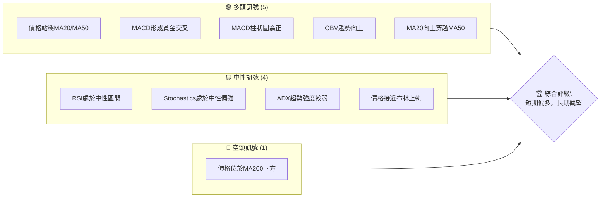
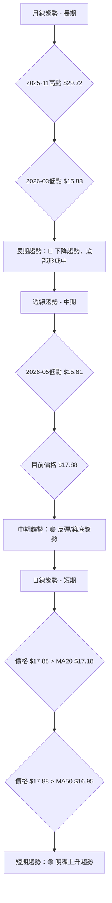
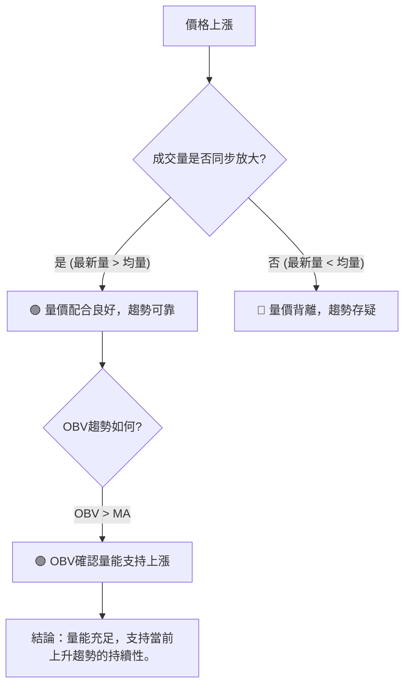
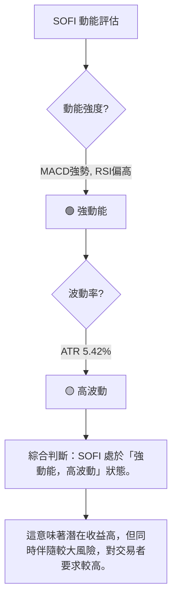

<details>
<summary>📊 靜態圖表 (點擊展開)</summary>

</details>

<html>
<head><meta charset="utf-8" /></head>
<body>
    <div style="height:500px; width:100%;">                        <script>window.PlotlyConfig = {MathJaxConfig: 'local'};</script>
        <script charset="utf-8" src="https://cdn.plot.ly/plotly-3.6.0.min.js" integrity="sha256-QaOVwtVY0T02VaHrr6pnoHLCwayMJp4O5n4YyaE3rJk=" crossorigin="anonymous"></script>                <div id="candlestick-chart" class="plotly-graph-div" style="height:100%; width:100%;"></div>            <script>                window.PLOTLYENV=window.PLOTLYENV || {};                                if (document.getElementById("candlestick-chart")) {                    Plotly.newPlot(                        "candlestick-chart",                        [{"close":{"dtype":"f8","bdata":"AAAAwB6FOUAAAACAwvU5QAAAAMDMjDpAAAAAIIWrO0AAAAAghWs7QAAAAADXIztAAAAAACkcPEAAAABgj4I9QAAAACBczz1AAAAAQAoXPUAAAADgo3A8QAAAAGC4HjxAAAAAQOH6O0AAAADAzIw7QAAAACCFazpAAAAAYI\u002fCOUAAAADgUfg5QAAAAKBwPTlAAAAAAClcOkAAAAAA1yM8QAAAAMAeBTxAAAAAQDNzPEAAAADgozA6QAAAAADXIztAAAAAYLjeO0AAAAAgrgc8QAAAAKCZmTpAAAAAgD2KOkAAAACAFK48QAAAAAAAwDxAAAAA4KMwO0AAAADgehQ8QAAAAGCPAj1AAAAAAAAAPkAAAADA9ag\u002fQAAAAGBm5j5AAAAAIK4HPUAAAACAFK49QAAAAKBHoT5AAAAAYLhePUAAAACA6xE+QAAAAMD1KDtAAAAAgMI1PEAAAACAPYo+QAAAAEAz8z5AAAAAQOEaQEAAAAAA12M8QAAAAIDr0TtAAAAAgD0KO0AAAACgcD06QAAAAOBRuDpAAAAAwPXoOEAAAADgozA5QAAAAGBmZjtAAAAA4HpUPEAAAACgcH08QAAAAOBRuD1AAAAAIK4HPUAAAABgj4I9QAAAAIDrET1AAAAAoJmZPUAAAAAgrsc7QAAAAAApnDtAAAAA4HrUOkAAAABAChc7QAAAAIDrETtAAAAAIK5HO0AAAACA69E5QAAAAOB6lDpAAAAAwB5FOUAAAACAPUo6QAAAAKBwPTtAAAAAoJlZO0AAAADgozA7QAAAAEDhejtAAAAAgOsRO0AAAACA69E6QAAAACBcjzpAAAAAgBQuOkAAAACAwnU7QAAAACCuRz1AAAAAQOH6OkAAAAAAAAA7QAAAAOBRuDtAAAAAYGZmO0AAAACgmZk6QAAAAADXIztAAAAAIIWrOkAAAADgo3A6QAAAAKBHITpAAAAAoHB9OUAAAAAA16M5QAAAAEAKFzpAAAAAoJnZOUAAAADAzMw5QAAAAIDCdTlAAAAAoJmZOEAAAAAAKVw4QAAAACBczzZAAAAA4HoUNkAAAABgj8I1QAAAAAAAwDRAAAAAgMJ1M0AAAAAAKdw0QAAAAKCZWTVAAAAAgBQuNUAAAADAzIw0QAAAAMDMTDNAAAAAACmcM0AAAABgj4IzQAAAAIA9ijNAAAAAwMxMM0AAAADAHgUzQAAAAOBRODJAAAAAwPWoMkAAAACAPUozQAAAAKCZGTNAAAAAYI\u002fCMUAAAAAA12MyQAAAAAApnDJAAAAAQDOzMkAAAAAAAEAzQAAAAGBm5jJAAAAAgD3KMkAAAACAPUoyQAAAACCuhzJAAAAAQDOzMUAAAABgj8IxQAAAAKBHoTFAAAAAYLheMUAAAACAFC4xQAAAAOB6FDFAAAAAYGbmMEAAAABgZiYxQAAAAEAzszBAAAAAIFyPMEAAAACgcL0vQAAAAIDCdS5AAAAAwMxMLkAAAABgj8IvQAAAAGCPQi9AAAAAQDOzL0AAAADAHkUwQAAAAAApHDBAAAAAoHB9MEAAAADAHkUwQAAAAOBRODBAAAAAwMwMMUAAAADA9egxQAAAAIA9yjJAAAAAIK4HM0AAAACAFG4zQAAAAAAAgDNAAAAA4HrUMkAAAAAgXA8zQAAAAIDrUTJAAAAA4KNwMkAAAABgj8IyQAAAAAApXDJAAAAAwMwML0AAAACgmRkwQAAAAIAUbjBAAAAAQDMzMEAAAADAHgUwQAAAAMDMTDBAAAAAAAAAMEAAAAAAAIAvQAAAAGCPQjBAAAAAwMzML0AAAABguJ4uQAAAAMAeBTBAAAAA4FE4L0AAAAAghWsvQAAAAIDCdS5AAAAAoEdhL0AAAADAzEwvQAAAAKBwPS9AAAAAgML1L0AAAAAghSswQAAAAOBR+DBAAAAA4FE4MkAAAADgepQyQAAAAKBwvTFAAAAAgBSuMEAAAABgZiYxQAAAACCuBzBAAAAAAACAMEAAAADgUXgwQAAAAKBwvS9AAAAAIIWrMEAAAADgepQwQAAAAKBHITFAAAAAgMK1MUAAAAAghWsxQAAAAMD16DFAAAAAoJkZMUAAAACAPUoxQAAAACBcTzFAAAAAwMxMMUAAAACgR+ExQA=="},"high":{"dtype":"f8","bdata":"AAAAQOHaOkAAAACgmZk6QAAAAOCjsDpAAAAAwB7FO0AAAACgR+E7QAAAAIDCdTtAAAAAQLaTPEAAAACgR6E9QAAAAMDMTD5AAAAAANcjPkAAAAAghas9QAAAACCFqzxAAAAAQOF6PEAAAACgR6E8QAAAAAApnDtAAAAA4HpUO0AAAACgmVk6QAAAAIAULjpAAAAAANcjO0AAAABACtc8QAAAAIDCtTxAAAAA4KOwPEAAAADAzMw9QAAAAIAUbjtAAAAAoJlZPEAAAABAChc9QAAAAOCjcDxAAAAAIIXrOkAAAACAFO48QAAAAIDrET1AAAAAwMzMPEAAAADgUZg8QAAAAGC43j1AAAAAQDMzPkAAAABA4fo\u002fQAAAAOBRSEBAAAAAgD3qPkAAAAAAKdw9QAAAAOBROD9AAAAAgD3KPkAAAABguF4+QAAAAGDn2z5AAAAAoHA9PEAAAADgUfg+QAAAAKBw\u002fT5AAAAAoHBdQEAAAAAAAMA\u002fQAAAAIDrET1AAAAAQDPzO0AAAAAAAAA7QAAAAKCZ2TpAAAAAQDOTPEAAAACA63E5QAAAAAApnDtAAAAAQDNzPEAAAAAAAEA9QAAAAAAAwD1AAAAAQDOzPUAAAAAghWs+QAAAAIAU7j1AAAAAQDOzPUAAAACAFO47QAAAAOB61DtAAAAAQDNzO0AAAACAFK47QAAAACCuRztAAAAAAACAO0AAAABA4Xo7QAAAAKBwvTpAAAAAgMLVOkAAAABACrc6QAAAAGC4XjtAAAAAYLieO0AAAABAClc7QAAAAIA9ijtAAAAAwMyMO0AAAADA9Wg7QAAAAADXIztAAAAAYGbmOkAAAACgR4E7QAAAAAAp3D1AAAAAwMxMPUAAAACAFC47QAAAAIAUDjxAAAAAAABgPEAAAABg5VA7QAAAAEAzMztAAAAAgMIVO0AAAADgelQ7QAAAACCuxzpAAAAAQApXOkAAAADAzAw6QAAAAADXYzpAAAAAoEchOkAAAABgZmY6QAAAAIAU7jlAAAAAgD3KOUAAAABguB45QAAAAOBReDlAAAAAAAAAN0AAAAAAKVw3QAAAAADXwzVAAAAAYGZmNEAAAADA9Sg1QAAAAEAKlzVAAAAAAAAANkAAAACgmRk1QAAAAIA9yjRAAAAAYLjeM0AAAABACtczQAAAAGCPAjRAAAAAQOF6M0AAAADgozAzQAAAAKBHwTJAAAAAgMK1MkAAAABguJ4zQAAAACBcjzNAAAAAgMI1MkAAAADA9WgyQAAAAIA9CjNAAAAAIK5HM0AAAABA4XozQAAAAGC4PjNAAAAAgOvxMkAAAABgZgYzQAAAAKCZ2TJAAAAAwMyMMkAAAABgZiYyQAAAAIDrETJAAAAAoEdBMkAAAAAgrgcyQAAAACCFSzFAAAAAwHJoMUAAAADA9WgxQAAAAIDrETFAAAAAQApXMUAAAACgcH0wQAAAAKBHYS9AAAAAoEchL0AAAABgZgYwQAAAAIDrUTBAAAAAIK7HL0AAAADAzGwwQAAAAEDhWjBAAAAAoJnZMUAAAADgUXgwQAAAAKBwfTBAAAAAIFwPMUAAAABAMxMyQAAAAIDr0TJAAAAAYLieM0AAAACgRyE0QAAAAMAepTNAAAAAwB7FM0AAAAAgsHIzQAAAAGBm5jJAAAAAQDOTMkAAAAAghSszQAAAAGC43jJAAAAAQAqXMEAAAABguF4wQAAAACCFyzBAAAAAIK7HMEAAAAAgXE8wQAAAAKBHgTBAAAAAgMJ1MEAAAADAzAwwQAAAAIDrUTBAAAAA4HpUMEAAAAAghWsvQAAAAOCjEDBAAAAAgBSuL0AAAACA61EwQAAAACCuRy9AAAAA4KNwL0AAAACA65EvQAAAAAAp3C9AAAAAQDPzMEAAAADgo7AwQAAAAOB6FDFAAAAAQAqXMkAAAAAghcsyQAAAAEDhOjJAAAAAQAp3MUAAAABA4ToxQAAAAKBw\u002fTBAAAAAwPWoMEAAAACgmRkxQAAAAOBRuDBAAAAA4KOwMEAAAAAgrucwQAAAAIAUbjFAAAAA4HoUMkAAAABAM7MyQAAAAKBw\u002fTFAAAAAIFwPMkAAAACAFK4xQAAAAIAUbjJAAAAAQDOTMUAAAADgUfgxQA=="},"hovertemplate":"\u003cb\u003e%{x|%Y-%m-%d}\u003c\u002fb\u003e\u003cbr\u003e\u958b: $%{open:.2f}\u003cbr\u003e\u9ad8: $%{high:.2f}\u003cbr\u003e\u4f4e: $%{low:.2f}\u003cbr\u003e\u6536: $%{close:.2f}\u003cextra\u003e\u003c\u002fextra\u003e","low":{"dtype":"f8","bdata":"AAAAwMxMOUAAAABguJ45QAAAAMAexTlAAAAAIFzvOkAAAACgR6E6QAAAAKBHITpAAAAA4HoUO0AAAACgcD08QAAAAOBR+DxAAAAAoJnZPEAAAACgmVk8QAAAACBcDztAAAAAIFyPO0AAAAAAKRw7QAAAAEAzszlAAAAAANejOUAAAABAM3M5QAAAAEAK1zhAAAAAIFxPOUAAAACAFK46QAAAAMAepTtAAAAAAADAO0AAAACgRyE6QAAAAOBReDpAAAAAAADAOUAAAAAgXI87QAAAAAAAQDpAAAAAYI8COkAAAAAgXA87QAAAAGBmJjxAAAAAoEdhOkAAAACg8TI7QAAAAEAzszxAAAAAwB5FPUAAAADAzMw8QAAAAADXIz5AAAAAQOH6PEAAAACgcH08QAAAAOB6VD1AAAAA4KOwPEAAAABgjwI9QAAAAKBHITtAAAAAwPWoOUAAAABACtc8QAAAAOAi2z1AAAAAgML1PkAAAABgZiY8QAAAACCuhzpAAAAAwMyMOkAAAACAwrU5QAAAACBcjzlAAAAAYLi+OEAAAADAHoU3QAAAACCupzlAAAAAoEehOkAAAAAgXE88QAAAAOB6dDxAAAAAIIWrPEAAAADgo1A9QAAAAMAeBT1AAAAAQOF6PEAAAACAFO46QAAAAMDMDDtAAAAAwMyMOkAAAABA4Xo6QAAAAIAUjjpAAAAAQDMzOkAAAACAPco5QAAAAOBRuDlAAAAAIIUrOUAAAABAM\u002fM5QAAAACCuRzpAAAAAoJkZO0AAAABAM9M6QAAAACCuBztAAAAAIK4HO0AAAACgcL06QAAAAIA9ijpAAAAAIFwPOkAAAACAPco5QAAAAKCZmTtAAAAAIK4HOkAAAACgcF06QAAAAIDrkTpAAAAAQOE6O0AAAABAMzM6QAAAAOBRODpAAAAAIIXrOUAAAACAwjU6QAAAAGCPAjpAAAAAgMI1OUAAAABAM\u002fM4QAAAAAAAADpAAAAAoJmZOUAAAADAHsU5QAAAAIDCNTlAAAAAgOuROEAAAADAzAw4QAAAACBcTzZAAAAAACncNUAAAADAHgU1QAAAAIDrETRAAAAAAKoxM0AAAACAPQo0QAAAAMDMzDRAAAAAwMwMNUAAAAAA1yM0QAAAAIA9CjNAAAAAYGYmM0AAAAAAKRwzQAAAAKCZOTNAAAAA4FH4MkAAAAAA14MyQAAAAOB6lDFAAAAAANfjMUAAAACAFO4yQAAAAOBR+DJAAAAAIFxPMUAAAADAzMwwQAAAAOCjsDFAAAAAACmcMkAAAAAA16MyQAAAAGC4HjJAAAAAwB7FMUAAAACAPQoyQAAAAOBR+DFAAAAAYLieMUAAAAAgrocxQAAAAOBReDFAAAAAQOF6MEAAAADA9SgxQAAAAOB6lDBAAAAAIIWrMEAAAABACtcwQAAAAKBwfTBAAAAAwB6FMEAAAAAAKZwvQAAAAMDMTC5AAAAAYLjeLUAAAABguJ4uQAAAAKBH4S5AAAAAACncLUAAAABgj8IvQAAAAIDr0S9AAAAAYI9CMEAAAADgetQvQAAAAOBRGDBAAAAAIIXrL0AAAABgZmYxQAAAACCFKzJAAAAAYGamMkAAAAAA12MzQAAAAEAKFzNAAAAA4KOwMkAAAADA9egyQAAAAIAU7jFAAAAAgMAqMkAAAAAA12MyQAAAAMAeRTJAAAAAAAAAL0AAAADgehQvQAAAAAAAwC9AAAAAoEchMEAAAACgR+EvQAAAAEDh+i9AAAAAwPWoL0AAAACAPQovQAAAAIA9ii9AAAAAoJkZL0AAAACAFG4uQAAAAIDCdS5AAAAAYI\u002fCLkAAAACAFK4uQAAAAEAK1y1AAAAAIFwPLkAAAABAM7MuQAAAAOBRuC5AAAAA4FG4L0AAAABgjwIwQAAAAADXoy9AAAAAgBSuMUAAAADgo7AxQAAAAIDCdTFAAAAA4HqUMEAAAACAwpUwQAAAAAApXC9AAAAAwPXoL0AAAADgT00vQAAAAMD1qC9AAAAAIFxPL0AAAABA4TowQAAAAGCPAjFAAAAAAKwcMUAAAAAAKVwxQAAAAADXQzFAAAAAgOsRMUAAAADgUbgwQAAAAIAULjFAAAAAgOvRMEAAAACgcP0wQA=="},"name":"\u50f9\u683c","open":{"dtype":"f8","bdata":"AAAAgD1KOkAAAABgj8I5QAAAAAAAADpAAAAAAABAO0AAAACAPco7QAAAAAAAQDtAAAAAQAqXO0AAAAAA10M8QAAAAMDMTD1AAAAAgBTOPUAAAAAAAIA9QAAAAGCPwjtAAAAAYLhePEAAAAAAKVw8QAAAAOBReDtAAAAAQOG6OkAAAADgelQ6QAAAAKCZGTpAAAAAwB7FOUAAAACgmRk7QAAAAKBwfTxAAAAAgD0KPEAAAADAzIw8QAAAAIDrETtAAAAAYI+COkAAAABAMzM8QAAAAIDrETxAAAAAoJkZOkAAAABAMzM7QAAAACBcjzxAAAAAoHB9PEAAAADgelQ7QAAAAOBR2DxAAAAAAAAAPkAAAACgcP0+QAAAAGC4fj9AAAAAIFxvPkAAAADgo7A9QAAAAMD1qD1AAAAAIIVLPUAAAADAHoU9QAAAAAAAID5AAAAAYGaGOkAAAAAgXA89QAAAAGC4Pj5AAAAAgBQuP0AAAABA4bo\u002fQAAAAAAAADtAAAAAgMK1O0AAAABgj4I6QAAAAKCZeTpAAAAAoEfhO0AAAACgR6E4QAAAAOB61DlAAAAAQOH6OkAAAACAwrU8QAAAAIA9yjxAAAAA4HrUPEAAAAAA12M9QAAAAMDMbD1AAAAAwPUIPUAAAACgcF07QAAAAEDhujtAAAAAoHA9O0AAAABgZqY6QAAAAEAK1zpAAAAAwB4lO0AAAAAgXG87QAAAAKBwvTlAAAAAANejOkAAAACAFC46QAAAAGC4njpAAAAA4FGYO0AAAACA6xE7QAAAACCFKztAAAAAgD2KO0AAAABguN46QAAAACCuBztAAAAAgBSuOkAAAADA9ag6QAAAACBczztAAAAAQOE6PUAAAACgcN06QAAAAAAAADtAAAAAgBTOO0AAAACAPUo7QAAAAEAzszpAAAAAAAAAO0AAAAAgXM86QAAAAIA9ijpAAAAA4KNwOUAAAAAAAIA5QAAAAIAULjpAAAAAAAAAOkAAAABgZuY5QAAAAGBm5jlAAAAAAACAOUAAAACgcN04QAAAAIAUbjlAAAAAYI+CNkAAAADAzAw3QAAAAKBwfTVAAAAAQOE6NEAAAACAPUo0QAAAAIA9SjVAAAAAQAoXNUAAAACgmRk1QAAAAIA9yjRAAAAAIK5HM0AAAADA9WgzQAAAAOBReDNAAAAA4HpUM0AAAACAwhUzQAAAAEDhujJAAAAAAAAAMkAAAAAgrkczQAAAAOCjMDNAAAAAwPUoMkAAAADAHiUxQAAAAAAAADJAAAAAIFwPM0AAAABgZqYyQAAAAAApfDJAAAAA4HpUMkAAAAAghesyQAAAAADXYzJAAAAA4FE4MkAAAADAzMwxQAAAAAAAADJAAAAA4FG4MUAAAACAFG4xQAAAAAAAwDBAAAAAgD3qMEAAAAAgricxQAAAAGC4\u002fjBAAAAAgD0KMUAAAABgZkYwQAAAAEAKVy9AAAAAACncLkAAAABgZuYuQAAAAGBmRjBAAAAAoEdhLkAAAAAgrscvQAAAAMD1KDBAAAAAgBSuMUAAAAAA12MwQAAAAMDMTDBAAAAAAAAAMEAAAAAgrocxQAAAAOBReDJAAAAAYLieM0AAAACgmZkzQAAAAGCPQjNAAAAAYI+CM0AAAACAPUozQAAAAMAexTJAAAAA4KNwMkAAAABA4XoyQAAAAMAeZTJAAAAAwMyMMEAAAACAPYovQAAAAAApPDBAAAAA4FF4MEAAAAAghSswQAAAAEAzMzBAAAAAYI9CMEAAAAAgrgcwQAAAAKCZmS9AAAAAgOsRMEAAAAAghWsvQAAAAGC4ni5AAAAAYGZmL0AAAACAwvUuQAAAAIDCNS9AAAAAQOG6LkAAAACgcD0vQAAAAGBmZi9AAAAAQOF6MEAAAADAzAwwQAAAAMAeBTBAAAAAYI9CMkAAAABgZiYyQAAAACCuBzJAAAAAoEdhMUAAAADA9agwQAAAAEDhujBAAAAAgBQuMEAAAABgZmYwQAAAAOB6NDBAAAAAANejL0AAAACA69EwQAAAACCuRzFAAAAAQDMzMUAAAAAgXM8xQAAAAEAz0zFAAAAAQAqXMUAAAAAAKbwwQAAAAOBRODFAAAAAYGZmMUAAAABgjwIxQA=="},"x":["2025-09-10T00:00:00-04:00","2025-09-11T00:00:00-04:00","2025-09-12T00:00:00-04:00","2025-09-15T00:00:00-04:00","2025-09-16T00:00:00-04:00","2025-09-17T00:00:00-04:00","2025-09-18T00:00:00-04:00","2025-09-19T00:00:00-04:00","2025-09-22T00:00:00-04:00","2025-09-23T00:00:00-04:00","2025-09-24T00:00:00-04:00","2025-09-25T00:00:00-04:00","2025-09-26T00:00:00-04:00","2025-09-29T00:00:00-04:00","2025-09-30T00:00:00-04:00","2025-10-01T00:00:00-04:00","2025-10-02T00:00:00-04:00","2025-10-03T00:00:00-04:00","2025-10-06T00:00:00-04:00","2025-10-07T00:00:00-04:00","2025-10-08T00:00:00-04:00","2025-10-09T00:00:00-04:00","2025-10-10T00:00:00-04:00","2025-10-13T00:00:00-04:00","2025-10-14T00:00:00-04:00","2025-10-15T00:00:00-04:00","2025-10-16T00:00:00-04:00","2025-10-17T00:00:00-04:00","2025-10-20T00:00:00-04:00","2025-10-21T00:00:00-04:00","2025-10-22T00:00:00-04:00","2025-10-23T00:00:00-04:00","2025-10-24T00:00:00-04:00","2025-10-27T00:00:00-04:00","2025-10-28T00:00:00-04:00","2025-10-29T00:00:00-04:00","2025-10-30T00:00:00-04:00","2025-10-31T00:00:00-04:00","2025-11-03T00:00:00-05:00","2025-11-04T00:00:00-05:00","2025-11-05T00:00:00-05:00","2025-11-06T00:00:00-05:00","2025-11-07T00:00:00-05:00","2025-11-10T00:00:00-05:00","2025-11-11T00:00:00-05:00","2025-11-12T00:00:00-05:00","2025-11-13T00:00:00-05:00","2025-11-14T00:00:00-05:00","2025-11-17T00:00:00-05:00","2025-11-18T00:00:00-05:00","2025-11-19T00:00:00-05:00","2025-11-20T00:00:00-05:00","2025-11-21T00:00:00-05:00","2025-11-24T00:00:00-05:00","2025-11-25T00:00:00-05:00","2025-11-26T00:00:00-05:00","2025-11-28T00:00:00-05:00","2025-12-01T00:00:00-05:00","2025-12-02T00:00:00-05:00","2025-12-03T00:00:00-05:00","2025-12-04T00:00:00-05:00","2025-12-05T00:00:00-05:00","2025-12-08T00:00:00-05:00","2025-12-09T00:00:00-05:00","2025-12-10T00:00:00-05:00","2025-12-11T00:00:00-05:00","2025-12-12T00:00:00-05:00","2025-12-15T00:00:00-05:00","2025-12-16T00:00:00-05:00","2025-12-17T00:00:00-05:00","2025-12-18T00:00:00-05:00","2025-12-19T00:00:00-05:00","2025-12-22T00:00:00-05:00","2025-12-23T00:00:00-05:00","2025-12-24T00:00:00-05:00","2025-12-26T00:00:00-05:00","2025-12-29T00:00:00-05:00","2025-12-30T00:00:00-05:00","2025-12-31T00:00:00-05:00","2026-01-02T00:00:00-05:00","2026-01-05T00:00:00-05:00","2026-01-06T00:00:00-05:00","2026-01-07T00:00:00-05:00","2026-01-08T00:00:00-05:00","2026-01-09T00:00:00-05:00","2026-01-12T00:00:00-05:00","2026-01-13T00:00:00-05:00","2026-01-14T00:00:00-05:00","2026-01-15T00:00:00-05:00","2026-01-16T00:00:00-05:00","2026-01-20T00:00:00-05:00","2026-01-21T00:00:00-05:00","2026-01-22T00:00:00-05:00","2026-01-23T00:00:00-05:00","2026-01-26T00:00:00-05:00","2026-01-27T00:00:00-05:00","2026-01-28T00:00:00-05:00","2026-01-29T00:00:00-05:00","2026-01-30T00:00:00-05:00","2026-02-02T00:00:00-05:00","2026-02-03T00:00:00-05:00","2026-02-04T00:00:00-05:00","2026-02-05T00:00:00-05:00","2026-02-06T00:00:00-05:00","2026-02-09T00:00:00-05:00","2026-02-10T00:00:00-05:00","2026-02-11T00:00:00-05:00","2026-02-12T00:00:00-05:00","2026-02-13T00:00:00-05:00","2026-02-17T00:00:00-05:00","2026-02-18T00:00:00-05:00","2026-02-19T00:00:00-05:00","2026-02-20T00:00:00-05:00","2026-02-23T00:00:00-05:00","2026-02-24T00:00:00-05:00","2026-02-25T00:00:00-05:00","2026-02-26T00:00:00-05:00","2026-02-27T00:00:00-05:00","2026-03-02T00:00:00-05:00","2026-03-03T00:00:00-05:00","2026-03-04T00:00:00-05:00","2026-03-05T00:00:00-05:00","2026-03-06T00:00:00-05:00","2026-03-09T00:00:00-04:00","2026-03-10T00:00:00-04:00","2026-03-11T00:00:00-04:00","2026-03-12T00:00:00-04:00","2026-03-13T00:00:00-04:00","2026-03-16T00:00:00-04:00","2026-03-17T00:00:00-04:00","2026-03-18T00:00:00-04:00","2026-03-19T00:00:00-04:00","2026-03-20T00:00:00-04:00","2026-03-23T00:00:00-04:00","2026-03-24T00:00:00-04:00","2026-03-25T00:00:00-04:00","2026-03-26T00:00:00-04:00","2026-03-27T00:00:00-04:00","2026-03-30T00:00:00-04:00","2026-03-31T00:00:00-04:00","2026-04-01T00:00:00-04:00","2026-04-02T00:00:00-04:00","2026-04-06T00:00:00-04:00","2026-04-07T00:00:00-04:00","2026-04-08T00:00:00-04:00","2026-04-09T00:00:00-04:00","2026-04-10T00:00:00-04:00","2026-04-13T00:00:00-04:00","2026-04-14T00:00:00-04:00","2026-04-15T00:00:00-04:00","2026-04-16T00:00:00-04:00","2026-04-17T00:00:00-04:00","2026-04-20T00:00:00-04:00","2026-04-21T00:00:00-04:00","2026-04-22T00:00:00-04:00","2026-04-23T00:00:00-04:00","2026-04-24T00:00:00-04:00","2026-04-27T00:00:00-04:00","2026-04-28T00:00:00-04:00","2026-04-29T00:00:00-04:00","2026-04-30T00:00:00-04:00","2026-05-01T00:00:00-04:00","2026-05-04T00:00:00-04:00","2026-05-05T00:00:00-04:00","2026-05-06T00:00:00-04:00","2026-05-07T00:00:00-04:00","2026-05-08T00:00:00-04:00","2026-05-11T00:00:00-04:00","2026-05-12T00:00:00-04:00","2026-05-13T00:00:00-04:00","2026-05-14T00:00:00-04:00","2026-05-15T00:00:00-04:00","2026-05-18T00:00:00-04:00","2026-05-19T00:00:00-04:00","2026-05-20T00:00:00-04:00","2026-05-21T00:00:00-04:00","2026-05-22T00:00:00-04:00","2026-05-26T00:00:00-04:00","2026-05-27T00:00:00-04:00","2026-05-28T00:00:00-04:00","2026-05-29T00:00:00-04:00","2026-06-01T00:00:00-04:00","2026-06-02T00:00:00-04:00","2026-06-03T00:00:00-04:00","2026-06-04T00:00:00-04:00","2026-06-05T00:00:00-04:00","2026-06-08T00:00:00-04:00","2026-06-09T00:00:00-04:00","2026-06-10T00:00:00-04:00","2026-06-11T00:00:00-04:00","2026-06-12T00:00:00-04:00","2026-06-15T00:00:00-04:00","2026-06-16T00:00:00-04:00","2026-06-17T00:00:00-04:00","2026-06-18T00:00:00-04:00","2026-06-22T00:00:00-04:00","2026-06-23T00:00:00-04:00","2026-06-24T00:00:00-04:00","2026-06-25T00:00:00-04:00","2026-06-26T00:00:00-04:00"],"type":"candlestick"},{"hovertemplate":"MA30: $%{y:.2f}\u003cextra\u003e\u003c\u002fextra\u003e","line":{"color":"#2196F3","dash":"dash","width":2},"mode":"lines","name":"MA30","x":["2025-09-10T00:00:00-04:00","2025-09-11T00:00:00-04:00","2025-09-12T00:00:00-04:00","2025-09-15T00:00:00-04:00","2025-09-16T00:00:00-04:00","2025-09-17T00:00:00-04:00","2025-09-18T00:00:00-04:00","2025-09-19T00:00:00-04:00","2025-09-22T00:00:00-04:00","2025-09-23T00:00:00-04:00","2025-09-24T00:00:00-04:00","2025-09-25T00:00:00-04:00","2025-09-26T00:00:00-04:00","2025-09-29T00:00:00-04:00","2025-09-30T00:00:00-04:00","2025-10-01T00:00:00-04:00","2025-10-02T00:00:00-04:00","2025-10-03T00:00:00-04:00","2025-10-06T00:00:00-04:00","2025-10-07T00:00:00-04:00","2025-10-08T00:00:00-04:00","2025-10-09T00:00:00-04:00","2025-10-10T00:00:00-04:00","2025-10-13T00:00:00-04:00","2025-10-14T00:00:00-04:00","2025-10-15T00:00:00-04:00","2025-10-16T00:00:00-04:00","2025-10-17T00:00:00-04:00","2025-10-20T00:00:00-04:00","2025-10-21T00:00:00-04:00","2025-10-22T00:00:00-04:00","2025-10-23T00:00:00-04:00","2025-10-24T00:00:00-04:00","2025-10-27T00:00:00-04:00","2025-10-28T00:00:00-04:00","2025-10-29T00:00:00-04:00","2025-10-30T00:00:00-04:00","2025-10-31T00:00:00-04:00","2025-11-03T00:00:00-05:00","2025-11-04T00:00:00-05:00","2025-11-05T00:00:00-05:00","2025-11-06T00:00:00-05:00","2025-11-07T00:00:00-05:00","2025-11-10T00:00:00-05:00","2025-11-11T00:00:00-05:00","2025-11-12T00:00:00-05:00","2025-11-13T00:00:00-05:00","2025-11-14T00:00:00-05:00","2025-11-17T00:00:00-05:00","2025-11-18T00:00:00-05:00","2025-11-19T00:00:00-05:00","2025-11-20T00:00:00-05:00","2025-11-21T00:00:00-05:00","2025-11-24T00:00:00-05:00","2025-11-25T00:00:00-05:00","2025-11-26T00:00:00-05:00","2025-11-28T00:00:00-05:00","2025-12-01T00:00:00-05:00","2025-12-02T00:00:00-05:00","2025-12-03T00:00:00-05:00","2025-12-04T00:00:00-05:00","2025-12-05T00:00:00-05:00","2025-12-08T00:00:00-05:00","2025-12-09T00:00:00-05:00","2025-12-10T00:00:00-05:00","2025-12-11T00:00:00-05:00","2025-12-12T00:00:00-05:00","2025-12-15T00:00:00-05:00","2025-12-16T00:00:00-05:00","2025-12-17T00:00:00-05:00","2025-12-18T00:00:00-05:00","2025-12-19T00:00:00-05:00","2025-12-22T00:00:00-05:00","2025-12-23T00:00:00-05:00","2025-12-24T00:00:00-05:00","2025-12-26T00:00:00-05:00","2025-12-29T00:00:00-05:00","2025-12-30T00:00:00-05:00","2025-12-31T00:00:00-05:00","2026-01-02T00:00:00-05:00","2026-01-05T00:00:00-05:00","2026-01-06T00:00:00-05:00","2026-01-07T00:00:00-05:00","2026-01-08T00:00:00-05:00","2026-01-09T00:00:00-05:00","2026-01-12T00:00:00-05:00","2026-01-13T00:00:00-05:00","2026-01-14T00:00:00-05:00","2026-01-15T00:00:00-05:00","2026-01-16T00:00:00-05:00","2026-01-20T00:00:00-05:00","2026-01-21T00:00:00-05:00","2026-01-22T00:00:00-05:00","2026-01-23T00:00:00-05:00","2026-01-26T00:00:00-05:00","2026-01-27T00:00:00-05:00","2026-01-28T00:00:00-05:00","2026-01-29T00:00:00-05:00","2026-01-30T00:00:00-05:00","2026-02-02T00:00:00-05:00","2026-02-03T00:00:00-05:00","2026-02-04T00:00:00-05:00","2026-02-05T00:00:00-05:00","2026-02-06T00:00:00-05:00","2026-02-09T00:00:00-05:00","2026-02-10T00:00:00-05:00","2026-02-11T00:00:00-05:00","2026-02-12T00:00:00-05:00","2026-02-13T00:00:00-05:00","2026-02-17T00:00:00-05:00","2026-02-18T00:00:00-05:00","2026-02-19T00:00:00-05:00","2026-02-20T00:00:00-05:00","2026-02-23T00:00:00-05:00","2026-02-24T00:00:00-05:00","2026-02-25T00:00:00-05:00","2026-02-26T00:00:00-05:00","2026-02-27T00:00:00-05:00","2026-03-02T00:00:00-05:00","2026-03-03T00:00:00-05:00","2026-03-04T00:00:00-05:00","2026-03-05T00:00:00-05:00","2026-03-06T00:00:00-05:00","2026-03-09T00:00:00-04:00","2026-03-10T00:00:00-04:00","2026-03-11T00:00:00-04:00","2026-03-12T00:00:00-04:00","2026-03-13T00:00:00-04:00","2026-03-16T00:00:00-04:00","2026-03-17T00:00:00-04:00","2026-03-18T00:00:00-04:00","2026-03-19T00:00:00-04:00","2026-03-20T00:00:00-04:00","2026-03-23T00:00:00-04:00","2026-03-24T00:00:00-04:00","2026-03-25T00:00:00-04:00","2026-03-26T00:00:00-04:00","2026-03-27T00:00:00-04:00","2026-03-30T00:00:00-04:00","2026-03-31T00:00:00-04:00","2026-04-01T00:00:00-04:00","2026-04-02T00:00:00-04:00","2026-04-06T00:00:00-04:00","2026-04-07T00:00:00-04:00","2026-04-08T00:00:00-04:00","2026-04-09T00:00:00-04:00","2026-04-10T00:00:00-04:00","2026-04-13T00:00:00-04:00","2026-04-14T00:00:00-04:00","2026-04-15T00:00:00-04:00","2026-04-16T00:00:00-04:00","2026-04-17T00:00:00-04:00","2026-04-20T00:00:00-04:00","2026-04-21T00:00:00-04:00","2026-04-22T00:00:00-04:00","2026-04-23T00:00:00-04:00","2026-04-24T00:00:00-04:00","2026-04-27T00:00:00-04:00","2026-04-28T00:00:00-04:00","2026-04-29T00:00:00-04:00","2026-04-30T00:00:00-04:00","2026-05-01T00:00:00-04:00","2026-05-04T00:00:00-04:00","2026-05-05T00:00:00-04:00","2026-05-06T00:00:00-04:00","2026-05-07T00:00:00-04:00","2026-05-08T00:00:00-04:00","2026-05-11T00:00:00-04:00","2026-05-12T00:00:00-04:00","2026-05-13T00:00:00-04:00","2026-05-14T00:00:00-04:00","2026-05-15T00:00:00-04:00","2026-05-18T00:00:00-04:00","2026-05-19T00:00:00-04:00","2026-05-20T00:00:00-04:00","2026-05-21T00:00:00-04:00","2026-05-22T00:00:00-04:00","2026-05-26T00:00:00-04:00","2026-05-27T00:00:00-04:00","2026-05-28T00:00:00-04:00","2026-05-29T00:00:00-04:00","2026-06-01T00:00:00-04:00","2026-06-02T00:00:00-04:00","2026-06-03T00:00:00-04:00","2026-06-04T00:00:00-04:00","2026-06-05T00:00:00-04:00","2026-06-08T00:00:00-04:00","2026-06-09T00:00:00-04:00","2026-06-10T00:00:00-04:00","2026-06-11T00:00:00-04:00","2026-06-12T00:00:00-04:00","2026-06-15T00:00:00-04:00","2026-06-16T00:00:00-04:00","2026-06-17T00:00:00-04:00","2026-06-18T00:00:00-04:00","2026-06-22T00:00:00-04:00","2026-06-23T00:00:00-04:00","2026-06-24T00:00:00-04:00","2026-06-25T00:00:00-04:00","2026-06-26T00:00:00-04:00"],"y":{"dtype":"f8","bdata":"AAAAAAAA+H8AAAAAAAD4fwAAAAAAAPh\u002fAAAAAAAA+H8AAAAAAAD4fwAAAAAAAPh\u002fAAAAAAAA+H8AAAAAAAD4fwAAAAAAAPh\u002fAAAAAAAA+H8AAAAAAAD4fwAAAAAAAPh\u002fAAAAAAAA+H8AAAAAAAD4fwAAAAAAAPh\u002fAAAAAAAA+H8AAAAAAAD4fwAAAAAAAPh\u002fAAAAAAAA+H8AAAAAAAD4fwAAAAAAAPh\u002fAAAAAAAA+H8AAAAAAAD4fwAAAAAAAPh\u002fAAAAAAAA+H8AAAAAAAD4fwAAAAAAAPh\u002fAAAAAAAA+H8AAAAAAAD4f5qZmXkwbztAVVVVpXB9O0C8u7vbh487QAAAANCFpDtAZmZmxme4O0AiIiIyltw7QKuqqgqs\u002fDtAAAAA0IUEPEDv7u4u+QU8QAAAAID4DDxAvLu7K1wPPEBVVVX1RB08QN7d3c0TFTxA7+7uPgoXPEAREREBjjA8QBEREfE1VzxA3t3dLUCOPEAAAADA5qI8QImIiNjquDxAREREVLi+PEB3d3e3ga48QCIiItJpozxAIiIikjSFPECamZkJrHw8QERERATkfjxAZmZm5tCCPECJiIjIvYY8QGZmZoZdoTxAMzMzA522PEDNzMwssr08QJqZmTltwDxAMzMz8\u002f3UPEB3d3eXbtI8QO\u002fu7j58xjxAZmZmRm+rPEBVVVX1b4Q8QCIiIjLBYzxAMzMzQ9JUPEBmZmb24TM8QKuqqppSETxAREREBFbuO0C8u7t7FM47QO\u002fu7j7DzjtAzczMjGzHO0DNzMxc1qo7QHd3dwc6jTtAd3d3h11hO0AAAADQ91M7QM3MzEw3STtAmpmZmeBBO0Crqqq6SUw7QDMzMyMiYjtA7+7uHsxzO0AAAAAgPoM7QM3MzCz5hTtA7+7ujgl+O0CrqqrK6G07QCIiIrLkVztAIiIiMsFDO0De3d2tjik7QGZmZiZ4EDtAd3d3t2XtOkAAAADQIts6QCIiIlIqzjpAq6qqes3FOkDe3d1ty7o6QERERFQOrTpAd3d3xy+WOkDNzMxcuok6QLy7u6uOaTpAIiIiAlZOOkAiIiISric6QDMzM3NM8DlAq6qqevisOUAiIiJi9HY5QCIiIjKlQjlAvLu7S2IQOUBVVVVF4do4QO\u002fu7o7tnDhAzczMLN1kOEAzMzMjBiE4QImIiMjozTdAERERkV+MN0De3d39Rkg3QM3MzOw19zZAq6qqGqGsNkCrqqoqQG42QFVVVYWkKTZAREREVJzdNUBVVVXV6pg1QFVVVSW\u002fWDVAq6qqKs4eNUAAAAAAR+g0QERERDTsqjRAZmZmZq1uNEDv7u6Oly40QO\u002fu7r508zNAd3d3d5O4M0C8u7uLQYAzQJqZmakNVDNAMzMzg9wrM0CamZlZxwQzQM3MzBx25TJAVVVVtZ3PMkBmZmYW9a8yQCIiIgJHiDJAZmZmdtpgMkARERHZ6jgyQERERMwvFjJA7+7uxiDwMUC8u7vrJtExQM3MzGTJrzFAmpmZwViSMUAiIiJK4XoxQFVVVe3faDFAVVVVfVtWMUCrqqoyljwxQFVVVb0CJDFAAAAAuPMdMUDNzMwk2xkxQERERFxkGzFAmpmZQTUeMUARERF5vh8xQJqZmTHdJDFAq6qqkjQlMUARERGpxisxQAAAAOj7KTFA3t3ddUwwMUBmZmb+1DgxQM3MzLQPPzFAVVVVPVEvMUCamZnxGSYxQHd3d\u002f+NIDFAvLu705QaMUBmZmZO8BAxQFVVVX2GDTFA7+7uJr8IMUAiIiICuQcxQERERBSDEDFAq6qqeukWMUC8u7tLDBIxQLy7u0NgFTFAmpmZ+VMTMUCrqqqijA4xQGZmZj4KBzFA3t3dnTYAMUBEREQ07PowQERERHzN9TBAERERCazsMECrqqry0t0wQAAAABhLzjBAZmZmnmHHMEC8u7vDIMAwQERERPwbsTBAVVVVPcOeMEAAAADIdo4wQLy7uzPsejBAzczMNF5qMEB3d3ef01YwQCIiIiKUQTBAzczMbFlLMEAAAAAAck8wQLy7uytrVTBAAAAA0E1iMECJiIgoQG4wQCIiIkL9ezBA7+7uPmCFMEDe3d1thJIwQAAAADB6mzBAiYiIiGynMEAAAADIWr0wQA=="},"type":"scatter"},{"hovertemplate":"MA60: $%{y:.2f}\u003cextra\u003e\u003c\u002fextra\u003e","line":{"color":"#9C27B0","dash":"dash","width":2},"mode":"lines","name":"MA60","x":["2025-09-10T00:00:00-04:00","2025-09-11T00:00:00-04:00","2025-09-12T00:00:00-04:00","2025-09-15T00:00:00-04:00","2025-09-16T00:00:00-04:00","2025-09-17T00:00:00-04:00","2025-09-18T00:00:00-04:00","2025-09-19T00:00:00-04:00","2025-09-22T00:00:00-04:00","2025-09-23T00:00:00-04:00","2025-09-24T00:00:00-04:00","2025-09-25T00:00:00-04:00","2025-09-26T00:00:00-04:00","2025-09-29T00:00:00-04:00","2025-09-30T00:00:00-04:00","2025-10-01T00:00:00-04:00","2025-10-02T00:00:00-04:00","2025-10-03T00:00:00-04:00","2025-10-06T00:00:00-04:00","2025-10-07T00:00:00-04:00","2025-10-08T00:00:00-04:00","2025-10-09T00:00:00-04:00","2025-10-10T00:00:00-04:00","2025-10-13T00:00:00-04:00","2025-10-14T00:00:00-04:00","2025-10-15T00:00:00-04:00","2025-10-16T00:00:00-04:00","2025-10-17T00:00:00-04:00","2025-10-20T00:00:00-04:00","2025-10-21T00:00:00-04:00","2025-10-22T00:00:00-04:00","2025-10-23T00:00:00-04:00","2025-10-24T00:00:00-04:00","2025-10-27T00:00:00-04:00","2025-10-28T00:00:00-04:00","2025-10-29T00:00:00-04:00","2025-10-30T00:00:00-04:00","2025-10-31T00:00:00-04:00","2025-11-03T00:00:00-05:00","2025-11-04T00:00:00-05:00","2025-11-05T00:00:00-05:00","2025-11-06T00:00:00-05:00","2025-11-07T00:00:00-05:00","2025-11-10T00:00:00-05:00","2025-11-11T00:00:00-05:00","2025-11-12T00:00:00-05:00","2025-11-13T00:00:00-05:00","2025-11-14T00:00:00-05:00","2025-11-17T00:00:00-05:00","2025-11-18T00:00:00-05:00","2025-11-19T00:00:00-05:00","2025-11-20T00:00:00-05:00","2025-11-21T00:00:00-05:00","2025-11-24T00:00:00-05:00","2025-11-25T00:00:00-05:00","2025-11-26T00:00:00-05:00","2025-11-28T00:00:00-05:00","2025-12-01T00:00:00-05:00","2025-12-02T00:00:00-05:00","2025-12-03T00:00:00-05:00","2025-12-04T00:00:00-05:00","2025-12-05T00:00:00-05:00","2025-12-08T00:00:00-05:00","2025-12-09T00:00:00-05:00","2025-12-10T00:00:00-05:00","2025-12-11T00:00:00-05:00","2025-12-12T00:00:00-05:00","2025-12-15T00:00:00-05:00","2025-12-16T00:00:00-05:00","2025-12-17T00:00:00-05:00","2025-12-18T00:00:00-05:00","2025-12-19T00:00:00-05:00","2025-12-22T00:00:00-05:00","2025-12-23T00:00:00-05:00","2025-12-24T00:00:00-05:00","2025-12-26T00:00:00-05:00","2025-12-29T00:00:00-05:00","2025-12-30T00:00:00-05:00","2025-12-31T00:00:00-05:00","2026-01-02T00:00:00-05:00","2026-01-05T00:00:00-05:00","2026-01-06T00:00:00-05:00","2026-01-07T00:00:00-05:00","2026-01-08T00:00:00-05:00","2026-01-09T00:00:00-05:00","2026-01-12T00:00:00-05:00","2026-01-13T00:00:00-05:00","2026-01-14T00:00:00-05:00","2026-01-15T00:00:00-05:00","2026-01-16T00:00:00-05:00","2026-01-20T00:00:00-05:00","2026-01-21T00:00:00-05:00","2026-01-22T00:00:00-05:00","2026-01-23T00:00:00-05:00","2026-01-26T00:00:00-05:00","2026-01-27T00:00:00-05:00","2026-01-28T00:00:00-05:00","2026-01-29T00:00:00-05:00","2026-01-30T00:00:00-05:00","2026-02-02T00:00:00-05:00","2026-02-03T00:00:00-05:00","2026-02-04T00:00:00-05:00","2026-02-05T00:00:00-05:00","2026-02-06T00:00:00-05:00","2026-02-09T00:00:00-05:00","2026-02-10T00:00:00-05:00","2026-02-11T00:00:00-05:00","2026-02-12T00:00:00-05:00","2026-02-13T00:00:00-05:00","2026-02-17T00:00:00-05:00","2026-02-18T00:00:00-05:00","2026-02-19T00:00:00-05:00","2026-02-20T00:00:00-05:00","2026-02-23T00:00:00-05:00","2026-02-24T00:00:00-05:00","2026-02-25T00:00:00-05:00","2026-02-26T00:00:00-05:00","2026-02-27T00:00:00-05:00","2026-03-02T00:00:00-05:00","2026-03-03T00:00:00-05:00","2026-03-04T00:00:00-05:00","2026-03-05T00:00:00-05:00","2026-03-06T00:00:00-05:00","2026-03-09T00:00:00-04:00","2026-03-10T00:00:00-04:00","2026-03-11T00:00:00-04:00","2026-03-12T00:00:00-04:00","2026-03-13T00:00:00-04:00","2026-03-16T00:00:00-04:00","2026-03-17T00:00:00-04:00","2026-03-18T00:00:00-04:00","2026-03-19T00:00:00-04:00","2026-03-20T00:00:00-04:00","2026-03-23T00:00:00-04:00","2026-03-24T00:00:00-04:00","2026-03-25T00:00:00-04:00","2026-03-26T00:00:00-04:00","2026-03-27T00:00:00-04:00","2026-03-30T00:00:00-04:00","2026-03-31T00:00:00-04:00","2026-04-01T00:00:00-04:00","2026-04-02T00:00:00-04:00","2026-04-06T00:00:00-04:00","2026-04-07T00:00:00-04:00","2026-04-08T00:00:00-04:00","2026-04-09T00:00:00-04:00","2026-04-10T00:00:00-04:00","2026-04-13T00:00:00-04:00","2026-04-14T00:00:00-04:00","2026-04-15T00:00:00-04:00","2026-04-16T00:00:00-04:00","2026-04-17T00:00:00-04:00","2026-04-20T00:00:00-04:00","2026-04-21T00:00:00-04:00","2026-04-22T00:00:00-04:00","2026-04-23T00:00:00-04:00","2026-04-24T00:00:00-04:00","2026-04-27T00:00:00-04:00","2026-04-28T00:00:00-04:00","2026-04-29T00:00:00-04:00","2026-04-30T00:00:00-04:00","2026-05-01T00:00:00-04:00","2026-05-04T00:00:00-04:00","2026-05-05T00:00:00-04:00","2026-05-06T00:00:00-04:00","2026-05-07T00:00:00-04:00","2026-05-08T00:00:00-04:00","2026-05-11T00:00:00-04:00","2026-05-12T00:00:00-04:00","2026-05-13T00:00:00-04:00","2026-05-14T00:00:00-04:00","2026-05-15T00:00:00-04:00","2026-05-18T00:00:00-04:00","2026-05-19T00:00:00-04:00","2026-05-20T00:00:00-04:00","2026-05-21T00:00:00-04:00","2026-05-22T00:00:00-04:00","2026-05-26T00:00:00-04:00","2026-05-27T00:00:00-04:00","2026-05-28T00:00:00-04:00","2026-05-29T00:00:00-04:00","2026-06-01T00:00:00-04:00","2026-06-02T00:00:00-04:00","2026-06-03T00:00:00-04:00","2026-06-04T00:00:00-04:00","2026-06-05T00:00:00-04:00","2026-06-08T00:00:00-04:00","2026-06-09T00:00:00-04:00","2026-06-10T00:00:00-04:00","2026-06-11T00:00:00-04:00","2026-06-12T00:00:00-04:00","2026-06-15T00:00:00-04:00","2026-06-16T00:00:00-04:00","2026-06-17T00:00:00-04:00","2026-06-18T00:00:00-04:00","2026-06-22T00:00:00-04:00","2026-06-23T00:00:00-04:00","2026-06-24T00:00:00-04:00","2026-06-25T00:00:00-04:00","2026-06-26T00:00:00-04:00"],"y":{"dtype":"f8","bdata":"AAAAAAAA+H8AAAAAAAD4fwAAAAAAAPh\u002fAAAAAAAA+H8AAAAAAAD4fwAAAAAAAPh\u002fAAAAAAAA+H8AAAAAAAD4fwAAAAAAAPh\u002fAAAAAAAA+H8AAAAAAAD4fwAAAAAAAPh\u002fAAAAAAAA+H8AAAAAAAD4fwAAAAAAAPh\u002fAAAAAAAA+H8AAAAAAAD4fwAAAAAAAPh\u002fAAAAAAAA+H8AAAAAAAD4fwAAAAAAAPh\u002fAAAAAAAA+H8AAAAAAAD4fwAAAAAAAPh\u002fAAAAAAAA+H8AAAAAAAD4fwAAAAAAAPh\u002fAAAAAAAA+H8AAAAAAAD4fwAAAAAAAPh\u002fAAAAAAAA+H8AAAAAAAD4fwAAAAAAAPh\u002fAAAAAAAA+H8AAAAAAAD4fwAAAAAAAPh\u002fAAAAAAAA+H8AAAAAAAD4fwAAAAAAAPh\u002fAAAAAAAA+H8AAAAAAAD4fwAAAAAAAPh\u002fAAAAAAAA+H8AAAAAAAD4fwAAAAAAAPh\u002fAAAAAAAA+H8AAAAAAAD4fwAAAAAAAPh\u002fAAAAAAAA+H8AAAAAAAD4fwAAAAAAAPh\u002fAAAAAAAA+H8AAAAAAAD4fwAAAAAAAPh\u002fAAAAAAAA+H8AAAAAAAD4fwAAAAAAAPh\u002fAAAAAAAA+H8AAAAAAAD4f5qZmdnOFzxARERETDcpPECamZk5+zA8QHd3dweBNTxAZmZmhusxPEC8u7sTgzA8QGZmZp42MDxAmpmZCawsPECrqqqS7Rw8QFVVVY0lDzxAAAAAGNn+O0CJiIi4rPU7QGZmZobr8TtA3t3dZTvvO0Dv7u4usu07QERERPw38jtAq6qq2s73O0AAAABIb\u002fs7QKuqqhIRATxA7+7udkwAPEARERG5Zf07QKuqqvrFAjxAiYiIWID8O0DNzMwU9f87QImIiJhuAjxAq6qqOm0APECamZlJU\u002fo7QERERByh\u002fDtAq6qqGi\u002f9O0BVVVVtoPM7QAAAALBy6DtAVVVV1THhO0C8u7uzyNY7QImIiEhTyjtAiYiIYJ64O0CamZmxnZ87QDMzM8NniDtAVVVVBYF1O0CamZkpzl47QDMzM6NwPTtAMzMzA1YeO0Dv7u5G4fo6QBEREdmH3zpAvLu7gzK6OkB3d3df5ZA6QM3MzJzvZzpAmpmZ6d84OkCrqqqKbBc6QN7d3W0S8zlAMzMz417TOUDv7u7up7Y5QN7d3XUFmDlAAAAA2BWAOUDv7u6OwmU5QM3MzIyXPjlAzczMVFUVOUCrqqp6FO44QLy7u5vEwDhAMzMzw66QOECamZnBPGE4QN7d3aWbNDhAERER8RkGOEAAAADotOE3QDMzM0OLvDdAiYiIcD2aN0BmZmZ+sXQ3QJqZmYlBUDdAd3d3n2EnN0BERET0\u002fQQ3QKuqqirO3jZAq6qqQhm9NkDe3d21OpY2QAAAAEjhajZAAAAAGEs+NkBERES8dBM2QCIiIhp25TVAERERYZ64NUAzMzMP5ok1QJqZma2OWTVA3t3d+X4qNUB3d3eHFvk0QKuqqhbZvjRAVVVVKVyPNEAAAAAklGE0QBEREe0KMDRAAAAATH4BNECrqqoua9UzQFVVVaHTpjNAIiIiBsh9M0ARERH9YlkzQM3MzMAROjNAIiIitoEeM0CJiIi8AgQzQO\u002fu7rLk5zJAiYiI\u002fPDJMkAAAAAcL60yQHd3d1O4jjJAq6qq9m90MkARERFFi1wyQDMzM6+OSTJARERE4JYtMkCamZmlcBUyQCIiIg4CAzJAiYiIRBn1MUBmZmaycuAxQLy7u7\u002fmyjFAq6qqzsy0MUCamZntUaAxQERERHBZkzFAzczMIIWDMUC8u7ubmXExQERERNSUYjFAmpmZXdZSMUBmZmb2tkQxQN7d3RX1NzFAmpmZDUkrMUB3d3czwRsxQM3MzBzoDDFAiYiI4E8FMUC8u7sL1\u002fswQCIiIrrX9DBAAAAAcMvyMEBmZmae7+8wQO\u002fu7pb86jBAAAAA6PvhMECJiIi4Ht0wQN7d3Q100jBAVVVVVVXNMEDv7u5O1McwQHd3d+tRwDBAERERVVW9MEDNzMz4xbowQJqZmZX8ujBA3t3dUXG+MEB3d3c7mL8wQLy7u9\u002fBxDBA7+7usg\u002fHMEAAAAC4Hs0wQCIiIqL+1TBAmpmZASvfMEDe3d2Js+cwQA=="},"type":"scatter"},{"hovertemplate":"MA200: $%{y:.2f}\u003cextra\u003e\u003c\u002fextra\u003e","line":{"color":"#FF6F00","dash":"solid","width":2},"mode":"lines","name":"MA200","x":["2025-09-10T00:00:00-04:00","2025-09-11T00:00:00-04:00","2025-09-12T00:00:00-04:00","2025-09-15T00:00:00-04:00","2025-09-16T00:00:00-04:00","2025-09-17T00:00:00-04:00","2025-09-18T00:00:00-04:00","2025-09-19T00:00:00-04:00","2025-09-22T00:00:00-04:00","2025-09-23T00:00:00-04:00","2025-09-24T00:00:00-04:00","2025-09-25T00:00:00-04:00","2025-09-26T00:00:00-04:00","2025-09-29T00:00:00-04:00","2025-09-30T00:00:00-04:00","2025-10-01T00:00:00-04:00","2025-10-02T00:00:00-04:00","2025-10-03T00:00:00-04:00","2025-10-06T00:00:00-04:00","2025-10-07T00:00:00-04:00","2025-10-08T00:00:00-04:00","2025-10-09T00:00:00-04:00","2025-10-10T00:00:00-04:00","2025-10-13T00:00:00-04:00","2025-10-14T00:00:00-04:00","2025-10-15T00:00:00-04:00","2025-10-16T00:00:00-04:00","2025-10-17T00:00:00-04:00","2025-10-20T00:00:00-04:00","2025-10-21T00:00:00-04:00","2025-10-22T00:00:00-04:00","2025-10-23T00:00:00-04:00","2025-10-24T00:00:00-04:00","2025-10-27T00:00:00-04:00","2025-10-28T00:00:00-04:00","2025-10-29T00:00:00-04:00","2025-10-30T00:00:00-04:00","2025-10-31T00:00:00-04:00","2025-11-03T00:00:00-05:00","2025-11-04T00:00:00-05:00","2025-11-05T00:00:00-05:00","2025-11-06T00:00:00-05:00","2025-11-07T00:00:00-05:00","2025-11-10T00:00:00-05:00","2025-11-11T00:00:00-05:00","2025-11-12T00:00:00-05:00","2025-11-13T00:00:00-05:00","2025-11-14T00:00:00-05:00","2025-11-17T00:00:00-05:00","2025-11-18T00:00:00-05:00","2025-11-19T00:00:00-05:00","2025-11-20T00:00:00-05:00","2025-11-21T00:00:00-05:00","2025-11-24T00:00:00-05:00","2025-11-25T00:00:00-05:00","2025-11-26T00:00:00-05:00","2025-11-28T00:00:00-05:00","2025-12-01T00:00:00-05:00","2025-12-02T00:00:00-05:00","2025-12-03T00:00:00-05:00","2025-12-04T00:00:00-05:00","2025-12-05T00:00:00-05:00","2025-12-08T00:00:00-05:00","2025-12-09T00:00:00-05:00","2025-12-10T00:00:00-05:00","2025-12-11T00:00:00-05:00","2025-12-12T00:00:00-05:00","2025-12-15T00:00:00-05:00","2025-12-16T00:00:00-05:00","2025-12-17T00:00:00-05:00","2025-12-18T00:00:00-05:00","2025-12-19T00:00:00-05:00","2025-12-22T00:00:00-05:00","2025-12-23T00:00:00-05:00","2025-12-24T00:00:00-05:00","2025-12-26T00:00:00-05:00","2025-12-29T00:00:00-05:00","2025-12-30T00:00:00-05:00","2025-12-31T00:00:00-05:00","2026-01-02T00:00:00-05:00","2026-01-05T00:00:00-05:00","2026-01-06T00:00:00-05:00","2026-01-07T00:00:00-05:00","2026-01-08T00:00:00-05:00","2026-01-09T00:00:00-05:00","2026-01-12T00:00:00-05:00","2026-01-13T00:00:00-05:00","2026-01-14T00:00:00-05:00","2026-01-15T00:00:00-05:00","2026-01-16T00:00:00-05:00","2026-01-20T00:00:00-05:00","2026-01-21T00:00:00-05:00","2026-01-22T00:00:00-05:00","2026-01-23T00:00:00-05:00","2026-01-26T00:00:00-05:00","2026-01-27T00:00:00-05:00","2026-01-28T00:00:00-05:00","2026-01-29T00:00:00-05:00","2026-01-30T00:00:00-05:00","2026-02-02T00:00:00-05:00","2026-02-03T00:00:00-05:00","2026-02-04T00:00:00-05:00","2026-02-05T00:00:00-05:00","2026-02-06T00:00:00-05:00","2026-02-09T00:00:00-05:00","2026-02-10T00:00:00-05:00","2026-02-11T00:00:00-05:00","2026-02-12T00:00:00-05:00","2026-02-13T00:00:00-05:00","2026-02-17T00:00:00-05:00","2026-02-18T00:00:00-05:00","2026-02-19T00:00:00-05:00","2026-02-20T00:00:00-05:00","2026-02-23T00:00:00-05:00","2026-02-24T00:00:00-05:00","2026-02-25T00:00:00-05:00","2026-02-26T00:00:00-05:00","2026-02-27T00:00:00-05:00","2026-03-02T00:00:00-05:00","2026-03-03T00:00:00-05:00","2026-03-04T00:00:00-05:00","2026-03-05T00:00:00-05:00","2026-03-06T00:00:00-05:00","2026-03-09T00:00:00-04:00","2026-03-10T00:00:00-04:00","2026-03-11T00:00:00-04:00","2026-03-12T00:00:00-04:00","2026-03-13T00:00:00-04:00","2026-03-16T00:00:00-04:00","2026-03-17T00:00:00-04:00","2026-03-18T00:00:00-04:00","2026-03-19T00:00:00-04:00","2026-03-20T00:00:00-04:00","2026-03-23T00:00:00-04:00","2026-03-24T00:00:00-04:00","2026-03-25T00:00:00-04:00","2026-03-26T00:00:00-04:00","2026-03-27T00:00:00-04:00","2026-03-30T00:00:00-04:00","2026-03-31T00:00:00-04:00","2026-04-01T00:00:00-04:00","2026-04-02T00:00:00-04:00","2026-04-06T00:00:00-04:00","2026-04-07T00:00:00-04:00","2026-04-08T00:00:00-04:00","2026-04-09T00:00:00-04:00","2026-04-10T00:00:00-04:00","2026-04-13T00:00:00-04:00","2026-04-14T00:00:00-04:00","2026-04-15T00:00:00-04:00","2026-04-16T00:00:00-04:00","2026-04-17T00:00:00-04:00","2026-04-20T00:00:00-04:00","2026-04-21T00:00:00-04:00","2026-04-22T00:00:00-04:00","2026-04-23T00:00:00-04:00","2026-04-24T00:00:00-04:00","2026-04-27T00:00:00-04:00","2026-04-28T00:00:00-04:00","2026-04-29T00:00:00-04:00","2026-04-30T00:00:00-04:00","2026-05-01T00:00:00-04:00","2026-05-04T00:00:00-04:00","2026-05-05T00:00:00-04:00","2026-05-06T00:00:00-04:00","2026-05-07T00:00:00-04:00","2026-05-08T00:00:00-04:00","2026-05-11T00:00:00-04:00","2026-05-12T00:00:00-04:00","2026-05-13T00:00:00-04:00","2026-05-14T00:00:00-04:00","2026-05-15T00:00:00-04:00","2026-05-18T00:00:00-04:00","2026-05-19T00:00:00-04:00","2026-05-20T00:00:00-04:00","2026-05-21T00:00:00-04:00","2026-05-22T00:00:00-04:00","2026-05-26T00:00:00-04:00","2026-05-27T00:00:00-04:00","2026-05-28T00:00:00-04:00","2026-05-29T00:00:00-04:00","2026-06-01T00:00:00-04:00","2026-06-02T00:00:00-04:00","2026-06-03T00:00:00-04:00","2026-06-04T00:00:00-04:00","2026-06-05T00:00:00-04:00","2026-06-08T00:00:00-04:00","2026-06-09T00:00:00-04:00","2026-06-10T00:00:00-04:00","2026-06-11T00:00:00-04:00","2026-06-12T00:00:00-04:00","2026-06-15T00:00:00-04:00","2026-06-16T00:00:00-04:00","2026-06-17T00:00:00-04:00","2026-06-18T00:00:00-04:00","2026-06-22T00:00:00-04:00","2026-06-23T00:00:00-04:00","2026-06-24T00:00:00-04:00","2026-06-25T00:00:00-04:00","2026-06-26T00:00:00-04:00"],"y":{"dtype":"f8","bdata":"AAAAAAAA+H8AAAAAAAD4fwAAAAAAAPh\u002fAAAAAAAA+H8AAAAAAAD4fwAAAAAAAPh\u002fAAAAAAAA+H8AAAAAAAD4fwAAAAAAAPh\u002fAAAAAAAA+H8AAAAAAAD4fwAAAAAAAPh\u002fAAAAAAAA+H8AAAAAAAD4fwAAAAAAAPh\u002fAAAAAAAA+H8AAAAAAAD4fwAAAAAAAPh\u002fAAAAAAAA+H8AAAAAAAD4fwAAAAAAAPh\u002fAAAAAAAA+H8AAAAAAAD4fwAAAAAAAPh\u002fAAAAAAAA+H8AAAAAAAD4fwAAAAAAAPh\u002fAAAAAAAA+H8AAAAAAAD4fwAAAAAAAPh\u002fAAAAAAAA+H8AAAAAAAD4fwAAAAAAAPh\u002fAAAAAAAA+H8AAAAAAAD4fwAAAAAAAPh\u002fAAAAAAAA+H8AAAAAAAD4fwAAAAAAAPh\u002fAAAAAAAA+H8AAAAAAAD4fwAAAAAAAPh\u002fAAAAAAAA+H8AAAAAAAD4fwAAAAAAAPh\u002fAAAAAAAA+H8AAAAAAAD4fwAAAAAAAPh\u002fAAAAAAAA+H8AAAAAAAD4fwAAAAAAAPh\u002fAAAAAAAA+H8AAAAAAAD4fwAAAAAAAPh\u002fAAAAAAAA+H8AAAAAAAD4fwAAAAAAAPh\u002fAAAAAAAA+H8AAAAAAAD4fwAAAAAAAPh\u002fAAAAAAAA+H8AAAAAAAD4fwAAAAAAAPh\u002fAAAAAAAA+H8AAAAAAAD4fwAAAAAAAPh\u002fAAAAAAAA+H8AAAAAAAD4fwAAAAAAAPh\u002fAAAAAAAA+H8AAAAAAAD4fwAAAAAAAPh\u002fAAAAAAAA+H8AAAAAAAD4fwAAAAAAAPh\u002fAAAAAAAA+H8AAAAAAAD4fwAAAAAAAPh\u002fAAAAAAAA+H8AAAAAAAD4fwAAAAAAAPh\u002fAAAAAAAA+H8AAAAAAAD4fwAAAAAAAPh\u002fAAAAAAAA+H8AAAAAAAD4fwAAAAAAAPh\u002fAAAAAAAA+H8AAAAAAAD4fwAAAAAAAPh\u002fAAAAAAAA+H8AAAAAAAD4fwAAAAAAAPh\u002fAAAAAAAA+H8AAAAAAAD4fwAAAAAAAPh\u002fAAAAAAAA+H8AAAAAAAD4fwAAAAAAAPh\u002fAAAAAAAA+H8AAAAAAAD4fwAAAAAAAPh\u002fAAAAAAAA+H8AAAAAAAD4fwAAAAAAAPh\u002fAAAAAAAA+H8AAAAAAAD4fwAAAAAAAPh\u002fAAAAAAAA+H8AAAAAAAD4fwAAAAAAAPh\u002fAAAAAAAA+H8AAAAAAAD4fwAAAAAAAPh\u002fAAAAAAAA+H8AAAAAAAD4fwAAAAAAAPh\u002fAAAAAAAA+H8AAAAAAAD4fwAAAAAAAPh\u002fAAAAAAAA+H8AAAAAAAD4fwAAAAAAAPh\u002fAAAAAAAA+H8AAAAAAAD4fwAAAAAAAPh\u002fAAAAAAAA+H8AAAAAAAD4fwAAAAAAAPh\u002fAAAAAAAA+H8AAAAAAAD4fwAAAAAAAPh\u002fAAAAAAAA+H8AAAAAAAD4fwAAAAAAAPh\u002fAAAAAAAA+H8AAAAAAAD4fwAAAAAAAPh\u002fAAAAAAAA+H8AAAAAAAD4fwAAAAAAAPh\u002fAAAAAAAA+H8AAAAAAAD4fwAAAAAAAPh\u002fAAAAAAAA+H8AAAAAAAD4fwAAAAAAAPh\u002fAAAAAAAA+H8AAAAAAAD4fwAAAAAAAPh\u002fAAAAAAAA+H8AAAAAAAD4fwAAAAAAAPh\u002fAAAAAAAA+H8AAAAAAAD4fwAAAAAAAPh\u002fAAAAAAAA+H8AAAAAAAD4fwAAAAAAAPh\u002fAAAAAAAA+H8AAAAAAAD4fwAAAAAAAPh\u002fAAAAAAAA+H8AAAAAAAD4fwAAAAAAAPh\u002fAAAAAAAA+H8AAAAAAAD4fwAAAAAAAPh\u002fAAAAAAAA+H8AAAAAAAD4fwAAAAAAAPh\u002fAAAAAAAA+H8AAAAAAAD4fwAAAAAAAPh\u002fAAAAAAAA+H8AAAAAAAD4fwAAAAAAAPh\u002fAAAAAAAA+H8AAAAAAAD4fwAAAAAAAPh\u002fAAAAAAAA+H8AAAAAAAD4fwAAAAAAAPh\u002fAAAAAAAA+H8AAAAAAAD4fwAAAAAAAPh\u002fAAAAAAAA+H8AAAAAAAD4fwAAAAAAAPh\u002fAAAAAAAA+H8AAAAAAAD4fwAAAAAAAPh\u002fAAAAAAAA+H8AAAAAAAD4fwAAAAAAAPh\u002fAAAAAAAA+H8AAAAAAAD4fwAAAAAAAPh\u002fAAAAAAAA+H+uR+FAgn42QA=="},"type":"scatter"}],                        {"template":{"data":{"barpolar":[{"marker":{"line":{"color":"rgb(17,17,17)","width":0.5},"pattern":{"fillmode":"overlay","size":10,"solidity":0.2}},"type":"barpolar"}],"bar":[{"error_x":{"color":"#f2f5fa"},"error_y":{"color":"#f2f5fa"},"marker":{"line":{"color":"rgb(17,17,17)","width":0.5},"pattern":{"fillmode":"overlay","size":10,"solidity":0.2}},"type":"bar"}],"carpet":[{"aaxis":{"endlinecolor":"#A2B1C6","gridcolor":"#506784","linecolor":"#506784","minorgridcolor":"#506784","startlinecolor":"#A2B1C6"},"baxis":{"endlinecolor":"#A2B1C6","gridcolor":"#506784","linecolor":"#506784","minorgridcolor":"#506784","startlinecolor":"#A2B1C6"},"type":"carpet"}],"choropleth":[{"colorbar":{"outlinewidth":0,"ticks":""},"type":"choropleth"}],"contourcarpet":[{"colorbar":{"outlinewidth":0,"ticks":""},"type":"contourcarpet"}],"contour":[{"colorbar":{"outlinewidth":0,"ticks":""},"colorscale":[[0.0,"#0d0887"],[0.1111111111111111,"#46039f"],[0.2222222222222222,"#7201a8"],[0.3333333333333333,"#9c179e"],[0.4444444444444444,"#bd3786"],[0.5555555555555556,"#d8576b"],[0.6666666666666666,"#ed7953"],[0.7777777777777778,"#fb9f3a"],[0.8888888888888888,"#fdca26"],[1.0,"#f0f921"]],"type":"contour"}],"heatmap":[{"colorbar":{"outlinewidth":0,"ticks":""},"colorscale":[[0.0,"#0d0887"],[0.1111111111111111,"#46039f"],[0.2222222222222222,"#7201a8"],[0.3333333333333333,"#9c179e"],[0.4444444444444444,"#bd3786"],[0.5555555555555556,"#d8576b"],[0.6666666666666666,"#ed7953"],[0.7777777777777778,"#fb9f3a"],[0.8888888888888888,"#fdca26"],[1.0,"#f0f921"]],"type":"heatmap"}],"histogram2dcontour":[{"colorbar":{"outlinewidth":0,"ticks":""},"colorscale":[[0.0,"#0d0887"],[0.1111111111111111,"#46039f"],[0.2222222222222222,"#7201a8"],[0.3333333333333333,"#9c179e"],[0.4444444444444444,"#bd3786"],[0.5555555555555556,"#d8576b"],[0.6666666666666666,"#ed7953"],[0.7777777777777778,"#fb9f3a"],[0.8888888888888888,"#fdca26"],[1.0,"#f0f921"]],"type":"histogram2dcontour"}],"histogram2d":[{"colorbar":{"outlinewidth":0,"ticks":""},"colorscale":[[0.0,"#0d0887"],[0.1111111111111111,"#46039f"],[0.2222222222222222,"#7201a8"],[0.3333333333333333,"#9c179e"],[0.4444444444444444,"#bd3786"],[0.5555555555555556,"#d8576b"],[0.6666666666666666,"#ed7953"],[0.7777777777777778,"#fb9f3a"],[0.8888888888888888,"#fdca26"],[1.0,"#f0f921"]],"type":"histogram2d"}],"histogram":[{"marker":{"pattern":{"fillmode":"overlay","size":10,"solidity":0.2}},"type":"histogram"}],"mesh3d":[{"colorbar":{"outlinewidth":0,"ticks":""},"type":"mesh3d"}],"parcoords":[{"line":{"colorbar":{"outlinewidth":0,"ticks":""}},"type":"parcoords"}],"pie":[{"automargin":true,"type":"pie"}],"scatter3d":[{"line":{"colorbar":{"outlinewidth":0,"ticks":""}},"marker":{"colorbar":{"outlinewidth":0,"ticks":""}},"type":"scatter3d"}],"scattercarpet":[{"marker":{"colorbar":{"outlinewidth":0,"ticks":""}},"type":"scattercarpet"}],"scattergeo":[{"marker":{"colorbar":{"outlinewidth":0,"ticks":""}},"type":"scattergeo"}],"scattergl":[{"marker":{"line":{"color":"#283442"}},"type":"scattergl"}],"scattermapbox":[{"marker":{"colorbar":{"outlinewidth":0,"ticks":""}},"type":"scattermapbox"}],"scattermap":[{"marker":{"colorbar":{"outlinewidth":0,"ticks":""}},"type":"scattermap"}],"scatterpolargl":[{"marker":{"colorbar":{"outlinewidth":0,"ticks":""}},"type":"scatterpolargl"}],"scatterpolar":[{"marker":{"colorbar":{"outlinewidth":0,"ticks":""}},"type":"scatterpolar"}],"scatter":[{"marker":{"line":{"color":"#283442"}},"type":"scatter"}],"scatterternary":[{"marker":{"colorbar":{"outlinewidth":0,"ticks":""}},"type":"scatterternary"}],"surface":[{"colorbar":{"outlinewidth":0,"ticks":""},"colorscale":[[0.0,"#0d0887"],[0.1111111111111111,"#46039f"],[0.2222222222222222,"#7201a8"],[0.3333333333333333,"#9c179e"],[0.4444444444444444,"#bd3786"],[0.5555555555555556,"#d8576b"],[0.6666666666666666,"#ed7953"],[0.7777777777777778,"#fb9f3a"],[0.8888888888888888,"#fdca26"],[1.0,"#f0f921"]],"type":"surface"}],"table":[{"cells":{"fill":{"color":"#506784"},"line":{"color":"rgb(17,17,17)"}},"header":{"fill":{"color":"#2a3f5f"},"line":{"color":"rgb(17,17,17)"}},"type":"table"}]},"layout":{"annotationdefaults":{"arrowcolor":"#f2f5fa","arrowhead":0,"arrowwidth":1},"autotypenumbers":"strict","coloraxis":{"colorbar":{"outlinewidth":0,"ticks":""}},"colorscale":{"diverging":[[0,"#8e0152"],[0.1,"#c51b7d"],[0.2,"#de77ae"],[0.3,"#f1b6da"],[0.4,"#fde0ef"],[0.5,"#f7f7f7"],[0.6,"#e6f5d0"],[0.7,"#b8e186"],[0.8,"#7fbc41"],[0.9,"#4d9221"],[1,"#276419"]],"sequential":[[0.0,"#0d0887"],[0.1111111111111111,"#46039f"],[0.2222222222222222,"#7201a8"],[0.3333333333333333,"#9c179e"],[0.4444444444444444,"#bd3786"],[0.5555555555555556,"#d8576b"],[0.6666666666666666,"#ed7953"],[0.7777777777777778,"#fb9f3a"],[0.8888888888888888,"#fdca26"],[1.0,"#f0f921"]],"sequentialminus":[[0.0,"#0d0887"],[0.1111111111111111,"#46039f"],[0.2222222222222222,"#7201a8"],[0.3333333333333333,"#9c179e"],[0.4444444444444444,"#bd3786"],[0.5555555555555556,"#d8576b"],[0.6666666666666666,"#ed7953"],[0.7777777777777778,"#fb9f3a"],[0.8888888888888888,"#fdca26"],[1.0,"#f0f921"]]},"colorway":["#636efa","#EF553B","#00cc96","#ab63fa","#FFA15A","#19d3f3","#FF6692","#B6E880","#FF97FF","#FECB52"],"font":{"color":"#f2f5fa"},"geo":{"bgcolor":"rgb(17,17,17)","lakecolor":"rgb(17,17,17)","landcolor":"rgb(17,17,17)","showlakes":true,"showland":true,"subunitcolor":"#506784"},"hoverlabel":{"align":"left"},"hovermode":"closest","mapbox":{"style":"dark"},"paper_bgcolor":"rgb(17,17,17)","plot_bgcolor":"rgb(17,17,17)","polar":{"angularaxis":{"gridcolor":"#506784","linecolor":"#506784","ticks":""},"bgcolor":"rgb(17,17,17)","radialaxis":{"gridcolor":"#506784","linecolor":"#506784","ticks":""}},"scene":{"xaxis":{"backgroundcolor":"rgb(17,17,17)","gridcolor":"#506784","gridwidth":2,"linecolor":"#506784","showbackground":true,"ticks":"","zerolinecolor":"#C8D4E3"},"yaxis":{"backgroundcolor":"rgb(17,17,17)","gridcolor":"#506784","gridwidth":2,"linecolor":"#506784","showbackground":true,"ticks":"","zerolinecolor":"#C8D4E3"},"zaxis":{"backgroundcolor":"rgb(17,17,17)","gridcolor":"#506784","gridwidth":2,"linecolor":"#506784","showbackground":true,"ticks":"","zerolinecolor":"#C8D4E3"}},"shapedefaults":{"line":{"color":"#f2f5fa"}},"sliderdefaults":{"bgcolor":"#C8D4E3","bordercolor":"rgb(17,17,17)","borderwidth":1,"tickwidth":0},"ternary":{"aaxis":{"gridcolor":"#506784","linecolor":"#506784","ticks":""},"baxis":{"gridcolor":"#506784","linecolor":"#506784","ticks":""},"bgcolor":"rgb(17,17,17)","caxis":{"gridcolor":"#506784","linecolor":"#506784","ticks":""}},"title":{"x":0.05},"updatemenudefaults":{"bgcolor":"#506784","borderwidth":0},"xaxis":{"automargin":true,"gridcolor":"#283442","linecolor":"#506784","ticks":"","title":{"standoff":15},"zerolinecolor":"#283442","zerolinewidth":2},"yaxis":{"automargin":true,"gridcolor":"#283442","linecolor":"#506784","ticks":"","title":{"standoff":15},"zerolinecolor":"#283442","zerolinewidth":2}}},"xaxis":{"rangeslider":{"visible":false},"title":{"text":"\u65e5\u671f"}},"font":{"size":11},"title":{"text":"SOFI  |  MA(30\u002f60\u002f200)  |  \u6700\u8fd1200\u4ea4\u6613\u65e5"},"yaxis":{"title":{"text":"\u80a1\u50f9 (USD)"}},"hovermode":"x unified","height":500},                        {"responsive": true}                    )                };            </script>        </div>
</body>
</html>

# SOFI 技術分析報告

> **報告日期**：2026-06-27 ｜ **語言**：繁體中文 ｜ **數據來源**：Yahoo Finance ｜ **當前價格**：$17.88

---

## 目錄

| 章節 | 內容 |
|------|------|
| [1. 技術面概覽](#1-技術面概覽) | 訊號儀表板、核心指標、評分卡 |
| [2. 趨勢分析](#2-趨勢分析) | 多時框趨勢、長中短期走勢 |
| [3. 圖表形態分析](#3-圖表形態分析) | 形態識別、K線組合、目標價 |
| [4. 支撐與阻力](#4-支撐與阻力) | 關鍵價位、斐波那契回調 |
| [5. 技術指標深度解讀](#5-技術指標深度解讀) | MA/RSI/MACD/布林/成交量 |
| [6. 動能與波動率](#6-動能與波動率) | 動能評估、ATR、Beta |
| [7. 多時框架總結](#7-多時框架總結) | 時框架評分矩陣 |
| [8. 交易策略建議](#8-交易策略建議) | 多空策略、風險報酬比 |
| [9. 風險提示與監控](#9-風險提示與監控) | 監控指標、風險場景 |

---

## 1. 技術面概覽

本章節提供 SOFI 當前技術狀態的快速總覽，透過整合多個關鍵指標，繪製出訊號儀表板、核心指標速覽表及綜合評分卡，幫助投資者迅速掌握其多空傾向與趨勢強度。

### 🎯 技術訊號儀表板

當前 SOFI 的技術訊號呈現短期偏多但長期壓力的混合狀態。短期移動平均線呈現多頭排列，且價格位於中短期均線之上，顯示近期上漲動能較強。然而，長期均線仍位於價格上方，構成顯著阻力，且整體趨勢強度不高，暗示市場可能處於盤整或弱勢反彈階段。



### 📊 核心指標速覽表

| 指標類別 | 指標名稱 | 當前數值 | 訊號 | 解讀 |
|----------|----------|----------|------|------|
| **價格** | 當前收盤價 | $17.88 | 🟢 | 位於近期關鍵支撐上方，展現反彈動能 |
| **均線** | MA20 | $17.18 | 🟢 | 價格 ($17.88) 位於MA20上方，短期看多 |
| **均線** | MA50 | $16.95 | 🟢 | 價格 ($17.88) 位於MA50上方，中期看多 |
| **均線** | MA200 | $22.49 | 🔴 | 價格 ($17.88) 位於MA200下方，長期看空 |
| **動能** | RSI(14) | 66.79 | 🟡 | 處於中性偏強區間，接近超買區，動能充足 |
| **動能** | MACD | 0.239 | 🟢 | MACD線位於Signal線上方，柱狀圖為正，看多 |
| **趨勢** | ADX(14) | 20.91 | 🟡 | 趨勢強度較弱 (<25)，市場可能處於盤整或弱趨勢 |
| **波動** | ATR(14) | $0.97 | 🟡 | 每日波動約5.42%，屬於中等偏高波動 |
| **成交量** | OBV趨勢 | OBV > MA | 🟢 | 成交量支持價格上漲，量價配合良好 |

### 🏆 技術評分卡

本評分卡從多個維度量化 SOFI 的技術面表現，提供一個直觀的綜合評級。當前評級顯示 SOFI 處於一個短期反彈動能強勁但長期趨勢仍受壓的狀態，需謹慎評估。

```
技術評分卡 — SOFI (2026-06-27)
════════════════════════════════════════════════════
趨勢強度      ████████░░░░░░░░░░░░  40/100  🟡 (ADX < 25，趨勢不明顯)
動能指標      ████████████░░░░░░░░  75/100  🟢 (MACD多頭，RSI強勢)
支撐穩定度    ██████████░░░░░░░░░░  60/100  🟡 (短期支撐穩固，但長期跌幅大)
成交量配合    ██████████████░░░░░░  80/100  🟢 (OBV支持上漲，量能放大)
形態完整度    ████████░░░░░░░░░░░░  50/100  🟡 (潛在底部形態形成中，尚未完全確認)
均線排列      ████████░░░░░░░░░░░░  55/100  🟡 (短中期多頭，長期空頭，混合排列)
════════════════════════════════════════════════════
綜合評分      ██████████░░░░░░░░░░  60/100  🟡 (短期反彈動能強，但長期趨勢仍受阻)
════════════════════════════════════════════════════
```

---

## 2. 趨勢分析

本章節將深入分析 SOFI 在不同時間框架下的價格趨勢，從長期月線到短期日線，透過多角度的視角描繪其當前所處的市場階段，並評估趨勢的強度與方向。

### 🌐 多時框趨勢分析

SOFI 在不同時間框架下呈現出複雜的趨勢結構。長期來看，股價在經歷2025年下半年的大幅上漲後，於2026年上半年出現顯著回調，目前仍在長期下降趨勢中尋求底部。中期而言，自2026年5月中旬低點以來，股價呈現出明確的反彈或築底跡象。短期則表現為強勁的多頭動能，價格站穩多數短期均線。



### 📈 長期趨勢 — 12個月走勢圖（Unicode）

SOFI 在過去12個月經歷了從強勁上漲到深度回調再到近期反彈的過程。2025年下半年表現強勁，於11月達到高點$29.72。隨後在2026年第一季度開始大幅回落，最低觸及$15.23（週線數據），並在第二季度開始築底反彈。目前價格$17.88仍遠低於2025年的高點，但已從底部有所抬升。

```
SOFI 月線走勢圖（過去12個月）
價格軸 ($)
$30 ┤                                        ●(29.72)
$25 ┤                          ●(25.54)
$20 ┤          ●(18.21)                  ●(18.22)
$15 ┤●(16.41)━━━━━━━━━━━━━━━━━━━━━━━━━━●(17.88)←現在
$10 ┤
     └────────────────────────────────────────────────────────
      2025-06  07  08  09  10  11  12  2026-01  02  03  04  05  06
           $18.21                                 $15.88
```

**走勢特徵分析表格**：

| 階段 | 時間段 | 起始價 | 結束價 | 漲跌幅 | 主要特徵 |
|------|----------|--------|--------|--------|----------------------------------------------------|
| **強勁上漲** | 2025-06 至 2025-11 | $18.21 | $29.72 | +63.21%| 股價強勢突破，創下24個月新高，動能極強。 |
| **深度回調** | 2025-12 至 2026-03 | $26.18 | $15.88 | -39.34%| 獲利回吐與市場壓力導致股價大幅下挫。 |
| **築底反彈** | 2026-04 至 2026-06 | $16.10 | $17.88 | +11.06%| 股價在低位震盪後開始緩慢抬升，形成潛在底部。 |

### 📊 中期趨勢（週線分析）

SOFI 的中期趨勢在經歷了2026年初的回調後，於2026年5月中旬開始展現築底反彈的跡象。從週線圖來看，股價在$15.61處獲得支撐後，逐步上行，目前已站穩MA20和MA50。中期壓力位在$19.43（2026-04-19週收盤價），若能突破此處，則中期上漲趨勢將更為明確。

```
SOFI 近期壓力與支撐示意圖 (週線)

價格 ($)
$20.00 ┤                     R1 ($19.43)
$19.00 ┤                   ╱
$18.00 ┤───────────────● 現價 ($17.88)
$17.00 ┤          ╱    ╱
$16.00 ┤───────●───────S1 ($15.61 - $15.23)
$15.00 ┤
       └───────────────────────────────────
        時間軸 (2026-03 至 2026-06)
```

### ⚡ 趨勢強度評估（ADX 解讀）

ADX 指標用於衡量趨勢的強度，而非方向。當前 ADX(14) 數值為 20.91，位於 20-25 區間，通常被解讀為趨勢較弱或市場處於盤整狀態。這表明儘管短期價格有所上漲，但市場尚未形成強勁的單邊趨勢。

```mermaid
graph TD
    A[ADX(14) = 20.91] --> B{ADX < 25?}
    B -- 是 --> C[市場處於盤整或弱趨勢]
    C --> D{+DI (26.03) vs -DI (14.88)}
    D -- +DI > -DI --> E[多頭力量主導當前弱趨勢]
    E --> F[結論：短期多頭佔優勢，但整體趨勢強度不足，價格可能在區間內震盪上行。]
    B -- 否 --> G[市場處於強趨勢]
```

**ADX 強度對照表**：

| ADX 數值範圍 | 趨勢強度 | 市場狀態 |
|----------------|----------|----------|
| 0-20           | 無趨勢/極弱 | 橫盤整理 |
| 20-25          | 弱趨勢   | 盤整/弱勢反彈 |
| 25-50          | 強趨勢   | 明顯趨勢行情 |
| 50-75          | 極強趨勢 | 趨勢加速 |
| 75-100         | 異常強勢 | 極端趨勢 |

當前 ADX 數值 20.91 落於「弱趨勢」區間，但 +DI (26.03) 明顯高於 -DI (14.88)，這表示在當前的弱趨勢中，多頭力量佔據主導地位。這意味著 SOFI 可能會呈現出震盪向上，但缺乏強勢突破的行情，投資者需留意區間操作或等待趨勢強度明確提升。

---

## 3. 圖表形態分析

圖表形態分析是識別市場心理和預測未來價格走勢的有效工具。本章節將識別 SOFI 價格走勢中可能形成的圖表形態，並基於這些形態預測潛在的目標價位。

### 🔍 形態識別系統

從 SOFI 過去一年的價格走勢來看，在經歷2025年11月高點$29.72至2026年3月低點$15.88的大幅下跌後，股價在$15-$16區間進行了多次探底，並在近期形成了一個潛在的「W」形底部形態，也稱為雙重底。這種形態通常預示著趨勢反轉，從下降趨勢轉為上升趨勢。

```mermaid
graph TD
    A[歷史價格走勢] --> B{高點 $29.72 (2025-11)}
    B --> C{低點 $15.88 (2026-03)}
    C --> D{低點 $15.61 (2026-05)}
    D --> E[潛在雙重底 ("W" 形形態)]
    E --> F{頸線突破: $19.43 (2026-04)}
    F --> G[形態確認與目標價計算]
```

### 🕯️ 重要K線形態分析

根據提供的週線收盤價數據，我們無法直接分析單一K線形態（如錘子線、吞噬形態），但可以觀察價格在關鍵點位的相對表現。

| 月份 | 收盤價 | K線形態 (推斷) | 解讀 | 訊號 |
|------|--------|-----------------|------|------|
| 2026-03-29 | $15.23 | (低點探底)      | 價格跌至近期新低，但隨後迅速反彈，顯示低位有買盤承接。 | 🟢 |
| 2026-04-19 | $19.43 | (強勢上漲後回調) | 股價在短時間內強勁拉升，RSI達到86.7，隨後進入回調，顯示短期超買。 | 🟡 |
| 2026-05-17 | $15.61 | (二次探底)      | 價格再次接近前期低點，但未創新低，形成雙重底的第二個底部。 | 🟢 |
| 2026-05-31 | $18.22 | (強勢反彈)      | 從二次探底後迅速拉升，形成一根強勢的陽線（從$15.62到$18.22），確認反彈動能。 | 🟢 |
| 2026-06-28 | $17.88 | (高位震盪)      | 價格在反彈後維持在高位震盪，顯示多空在此區間拉鋸。 | 🟡 |

### 📉 ASCII 走勢形態示意圖

以下示意圖描繪了 SOFI 股價從2025年高點回落後，在2026年形成的潛在「W」形底部形態。

```
SOFI 潛在「W」形底部形態示意圖 (週線)

價格 ($)
$30 ┤                                           H ($29.72)
$25 ┤
$20 ┤           R ($19.43) <─ 頸線
$18 ┤           ╱╲
$15 ┤──────────L1──────L2─────────● 現價 ($17.88)
$10 ┤           ($15.88) ($15.61)
     └────────────────────────────────────────────────────
      2025-11   2026-03   2026-05   2026-06
```
圖中：
*   **H**: 2025年11月高點 $29.72，為下跌趨勢的起點。
*   **L1**: 2026年3月低點 $15.88，形成「W」形的第一個底部。
*   **L2**: 2026年5月低點 $15.61，形成「W」形的第二個底部，略低於L1，但仍處於同一支撐區間。
*   **R**: 2026年4月高點 $19.43，是「W」形形態的頸線位置。股價曾在5月底突破此頸線，但隨後回調，目前正在測試頸線附近。

### 🎯 形態目標價計算

基於潛在的「W」形底部形態，我們可以計算其理論目標價。
1.  **形態底部**：取兩個低點中的最低價 $15.61。
2.  **頸線位置**：取「W」形中間的高點 $19.43。
3.  **形態高度**：頸線價 - 底部價 = $19.43 - $15.61 = $3.82。
4.  **理論目標價**：頸線價 + 形態高度 = $19.43 + $3.82 = $23.25。

這個目標價 $23.25 是一個基於圖表形態的預測，它與長期MA200 ($22.49) 和斐波那契50%回調位 ($22.67) 接近，顯示了形態目標價的潛在可靠性。然而，形態的確認需要價格明確且帶量突破頸線，並成功站穩。

---

## 4. 支撐與阻力

支撐與阻力是技術分析的核心概念，它們代表了市場中買賣壓力的關鍵價位。本章節將詳細識別 SOFI 的關鍵支撐位和阻力位，並結合斐波那契回調位，為交易決策提供參考。

### 🗺️ 關鍵價位分布圖（Unicode）

SOFI 的價格目前位於短中期均線之上，但面臨上方較強的阻力區間。下方的支撐結構相對穩固，特別是52週低點和近期形成的雙重底。

```
SOFI 價位結構分布圖
═══════════════════════════════════════════════════
$32.73 ║████████████████████████║ 強阻力 R3 (52週高點)
$29.72 ║████████████████████████║ 歷史高點阻力
$22.67 ║████████████████████████║ 阻力 R2 (Fib 50%, 形態目標價)
$22.49 ║████████████████████████║ 關鍵阻力 R1 (MA200)
$19.43 ║████████████████████    ║ 近期阻力 (頸線)
$18.60 ║▓▓▓▓▓▓▓▓▓▓▓▓▓▓▓▓        ║ 布林上軌
$17.88 ╠════════════════════════╣ ◄ 現價
$17.18 ║▓▓▓▓▓▓▓▓▓▓▓▓▓▓▓▓        ║ 近期支撐 S1 (MA20)
$16.95 ║████████████████████████║ 短期支撐 S2 (MA50)
$15.75 ║████████████████████████║ 布林下軌
$15.61 ║████████████████████████║ 強支撐 S3 (W底，近期低點)
$14.92 ║████████████████████████║ 極強支撐 S4 (52週低點)
═══════════════════════════════════════════════════
```

### 🚧 阻力位分析表

| 阻力級別 | 價位 | 形成原因 | 突破難度 | 重要性 |
|----------|------|----------|----------|--------|
| **R1** | $19.43 | 2026年4月高點，潛在W形底部頸線，突破可確認形態。 | 中等 | 高 |
| **R2** | $21.00 | 斐波那契38.2%回調位，分析師平均目標價 $20.90。 | 中等 | 高 |
| **R3** | $22.49 | MA200長期均線，強大心理和技術阻力。 | 高 | 極高 |
| **R4** | $23.25 | W形底部形態的理論目標價，與Fib 50% ($22.67) 接近。 | 高 | 極高 |
| **R5** | $29.72 | 2025年11月歷史高點，長期趨勢逆轉的終極考驗。 | 極高 | 極高 |

### 🛡️ 支撐位分析表

| 支撐級別 | 價位 | 形成原因 | 守住機率 | 重要性 |
|----------|------|----------|----------|--------|
| **S1** | $17.18 | MA20短期均線，近期反彈的直接支撐。 | 高 | 中 |
| **S2** | $16.95 | MA50中期均線，與MA20形成短期多頭排列。 | 較高 | 高 |
| **S3** | $15.75 | 布林通道下軌，極端情況下的技術支撐。 | 中等 | 中 |
| **S4** | $15.61 | 潛在W形底部第二個低點，關鍵心理與技術支撐。 | 極高 | 極高 |
| **S5** | $14.92 | 52週低點，若跌破則可能開啟新一輪下跌。 | 極高 | 極高 |

### 📐 斐波那契回調位分析

我們以2025年11月的高點 $29.72 作為主要下跌波段的起點，2026年5月的低點 $15.61 作為下跌波段的終點，來計算其反彈的斐波那契回調位。

*   **波段高點** (High): $29.72
*   **波段低點** (Low): $15.61
*   **總跌幅**：$29.72 - $15.61 = $14.11

```mermaid
graph TD
    A[下跌波段: $29.72 -> $15.61] --> B[計算斐波那契回調位]
    B --> C[38.2% 回調: $15.61 + ($14.11 * 0.382) = $21.00]
    B --> D[50.0% 回調: $15.61 + ($14.11 * 0.500) = $22.67]
    B --> E[61.8% 回調: $15.61 + ($14.11 * 0.618) = $24.33]
```

**斐波那契回調位詳情**：

| 回調比例 | 價位 | 解讀 | 與其他阻力關聯 |
|----------|------|------|----------------|
| **38.2%** | $21.00 | 較弱的回調阻力，但若能突破則反彈勢頭有望延續。 | 接近分析師平均目標價 $20.90。 |
| **50.0%** | $22.67 | 重要的心理與技術阻力位，通常是反彈的強勁考驗。 | 接近MA200 ($22.49) 和 W形形態目標價 ($23.25)。 |
| **61.8%** | $24.33 | 黃金分割點，若能突破則意味著趨勢有較大可能反轉。 | 位於MA200上方，需要更強動能突破。 |

當前價格 $17.88 遠低於這些斐波那契回調位，顯示其反彈空間仍存在，但上方阻力重重。特別是 $21.00 - $24.33 構成了一個重要的阻力區間，這裡匯聚了斐波那契回調、MA200和形態目標價等多重壓力。

---

## 5. 技術指標深度解讀

本章節將對 SOFI 的關鍵技術指標進行深入分析，包括移動平均線、RSI、MACD、布林通道和成交量，並探討它們之間的相互確認或矛盾，以提供全面的市場洞察。

### 🎛️ 指標訊號總覽

當前 SOFI 的技術指標呈現出短期看多與長期看空的複雜訊號。短中期均線呈現多頭排列，MACD發出買入訊號，OBV也支持上漲，這些都指向短期動能強勁。然而，價格仍在長期均線下方，ADX顯示趨勢強度不足，RSI和Stochastics也接近超買區，提示短期可能面臨回調壓力。

```mermaid
graph TD
    subgraph 價格與均線
        P[價格 $17.88] --> M20[MA20 $17.18]
        P --> M50[MA50 $16.95]
        P --> M200[MA200 $22.49]
        M20 -- 價格上方 --> S1(🟢 短期看多)
        M50 -- 價格上方 --> S2(🟢 中期看多)
        M200 -- 價格下方 --> S3(🔴 長期看空)
    end
    subgraph 動能與趨勢
        R[RSI(14) 66.79] --> R_S(🟡 中性偏強)
        M[MACD 0.239] --> M_S[MACD Signal 0.162]
        M_S --> M_H[MACD Hist +0.077]
        M_H --> S4(🟢 MACD黃金交叉)
        A[ADX(14) 20.91] --> A_S(🟡 趨勢弱)
        A_S --> A_DI[+DI 26.03 > -DI 14.88]
        A_DI --> S5(🟢 多頭主導弱趨勢)
    end
    subgraph 波動與成交量
        B[布林通道 %B 0.75] --> B_S(🟡 接近上軌)
        O[OBV趨勢] --> O_S(🟢 量能支持上漲)
    end
    S1 & S2 & S4 & S5 & O_S --> 綜合判斷{短期偏多，但長期壓力仍在，趨勢強度不足}
    S3 & R_S & A_S & B_S --> 綜合判斷
```

### 📈 移動平均線排列分析

SOFI 的移動平均線系統呈現出混合排列，這反映了其短期上漲動能與長期下降趨勢之間的矛盾。

| 均線類型 | 當前數值 | 相對位置 | 趨勢方向 | 訊號 |
|----------|----------|----------|----------|------|
| MA5 (短期) | $17.38 | 價格上方 | ▲ 上漲 | 🟢 |
| MA10 (短期) | $17.36 | 價格上方 | ▲ 上漲 | 🟢 |
| MA20 (短期) | $17.18 | 價格上方 | ▲ 上漲 | 🟢 |
| MA50 (中期) | $16.95 | 價格上方 | ▲ 上漲 | 🟢 |
| MA60 (中期) | $16.91 | 價格上方 | ▲ 上漲 | 🟢 |
| MA120 (長期) | $18.94 | 價格下方 | ▼ 下跌 | 🔴 |
| MA240 (長期) | $22.60 | 價格下方 | ▼ 下跌 | 🔴 |

```mermaid
graph TD
    A[SOFI 均線排列分析] --> B{短期均線 (MA5, MA10, MA20)}
    B -- 價格 $17.88 > MA20/MA50 --> C[🟢 短期/中期多頭排列]
    C --> D{MA20 ($17.18) > MA50 ($16.95)}
    D -- 是 --> E[🟢 短期均線金叉中期均線，看多]
    E --> F{長期均線 (MA120, MA240)}
    F -- 價格 $17.88 < MA120/MA240 --> G[🔴 長期空頭排列，構成上方阻力]
    G --> H[綜合判斷：短期動能強勁，但長期趨勢仍受壓，需警惕上方阻力。]
```
**分析**：
*   **短期與中期均線**：MA5 ($17.38) > MA10 ($17.36) > MA20 ($17.18) > MA50 ($16.95) > MA60 ($16.91)。這是一個非常明確的短中期多頭排列，且所有均線均向上傾斜，顯示近期買盤強勁，股價處於健康的短期上升通道。MA20已向上穿越MA50，形成「黃金交叉」，這是傳統的買入訊號。
*   **長期均線**：MA120 ($18.94) 和 MA240 ($22.60) 仍位於當前股價 $17.88 的上方，且均線本身仍呈現下跌趨勢。這表明 SOFI 的長期趨勢仍處於空頭階段，MA120和MA240將構成強大的長期阻力。
*   **結論**：SOFI 的均線系統顯示其短期動能十足，但面臨長期趨勢線的壓制。這是一個典型的反彈行情，而非全面趨勢反轉。

### 📉 RSI(14) 分析

相對強弱指數 (RSI) 用於衡量價格變動的速度和變化，判斷資產是否超買或超賣。

*   **RSI 數值進度條**：
    RSI(14): 66.79 ▓▓▓▓▓▓▓▓▓▓▓▓▓▓░░░░░░ 67% (接近超買區) 🟡
*   **超買超賣區間分析**：
    *   RSI 66.79 處於中性偏強區間 (30-70)，但已非常接近超買區 (70以上)。這表明買盤力量強勁，但動能可能在短期內達到飽和，存在回調風險。
    *   從歷史數據看，2026-04-19 週的RSI曾達到86.7，隨後價格便出現了回調。這提示我們，當RSI進入極端超買區時，需警惕短期回調。
*   **背離判斷**：
    *   **無明顯頂背離**：在近期價格上漲過程中，RSI也隨之上漲，並未出現價格創新高但RSI未能創新高的情況。
    *   **潛在底背離 (微觀)**：觀察2026-05-10 ($15.75, RSI 24.9) 和 2026-05-17 ($15.61, RSI 30.2)。雖然價格略有下降，但RSI卻有所抬升，這是一個微弱的底部背離跡象，支持了隨後的反彈。然而，由於數據粒度限制，此背離並非強烈確認。
*   **結論**：RSI 顯示 SOFI 短期動能強勁，但接近超買區，需留意潛在的回調壓力。

### 📊 MACD(12/26/9) 訊號解讀

平滑異同移動平均線 (MACD) 是趨勢跟蹤動能指標，由兩條指數移動平均線（MACD線和訊號線）和柱狀圖組成。

*   **MACD 線**: 0.239
*   **MACD Signal 線**: 0.162
*   **MACD Hist (柱狀圖)**: +0.077

```mermaid
graph TD
    A[MACD線 (0.239)] --> B{MACD線 > 訊號線 (0.162)?}
    B -- 是 --> C[🟢 MACD形成黃金交叉，看多訊號]
    C --> D{MACD柱狀圖 (+0.077) > 0?}
    D -- 是 --> E[🟢 柱狀圖為正，且持續擴大，多頭動能增強]
    E --> F[結論：MACD指標強烈看多，確認短期上升趨勢的動能。]
```
**分析**：
*   **黃金交叉**：MACD線 (0.239) 位於訊號線 (0.162) 之上，這是一個明確的黃金交叉，表明短期動能已超越中期動能，發出買入訊號。
*   **柱狀圖**：MACD柱狀圖為正值 (+0.077)，且從近期的負值轉為正值並擴大，這進一步確認了多頭力量的增強和上升趨勢的啟動。
*   **背離判斷**：從提供的數據來看，MACD在價格反彈過程中同步上升，並未出現頂背離或底背離的跡象。
*   **結論**：MACD指標當前發出強烈的多頭訊號，與短中期均線的多頭排列相互印證，支持 SOFI 短期內可能繼續上漲。

### 📦 布林通道分析

布林通道 (Bollinger Bands) 用於衡量價格的波動範圍，並判斷價格是否處於相對高位或低位。

*   **BB上軌**: $18.60
*   **BB中軌(MA20)**: $17.18
*   **BB下軌**: $15.75
*   **BB %B**: 0.75 (0=下軌, 0.5=中軌, 1=上軌)

```
SOFI 布林通道示意圖

價格 ($)
$19.00 ┤              BB上軌 $18.60 ───────────┐
$18.00 ┤─────────────────────● 現價 $17.88    │ (BB %B = 0.75)
$17.00 ┤              BB中軌 $17.18 ───────────┤
$16.00 ┤              BB下軌 $15.75 ───────────┘
$15.00 ┤
       └───────────────────────────────────
        時間軸
```
**分析**：
*   **價格位置**：當前價格 $17.88 位於布林通道中軌 ($17.18) 上方，並接近上軌 ($18.60)。BB %B 為 0.75，表明價格位於通道的相對高位。
*   **波動性**：通道寬度適中，ATR為 $0.97，顯示近期波動性屬於中等偏高。
*   **訊號**：價格接近上軌，可能意味著短期內上漲動能強勁，但也可能預示著短期超買，存在回調或盤整的可能。通常，價格觸及上軌後，可能會出現短期回調至中軌，或沿上軌運行（"walk the band"），這取決於趨勢的強度。
*   **結論**：布林通道顯示 SOFI 短期處於強勢，但需警惕價格接近上軌可能引發的短期壓力。

### 💹 成交量分析（量價配合度）

成交量是價格趨勢的能量，量價配合度可以幫助確認價格走勢的可靠性。

*   **最新成交量**: 88,180,942 股
*   **20日均量**: 87,691,712 股 (量比: 1.01x)
*   **50日均量**: 74,989,981 股
*   **OBV趨勢**: OBV > MA → 量能支撐上漲 🟢


**分析**：
*   **成交量放大**：最新成交量 88,180,942 股高於 20日均量 (87,691,712 股) 和 50日均量 (74,989,981 股)。這表明在價格上漲的過程中，有更多的資金參與，買盤積極，量能充足。
*   **OBV趨勢**：數據顯示 OBV > MA，這意味著在價格上漲期間，OBV的累計值也在增加，量能與價格走勢保持一致，確認了當前上漲趨勢的有效性。
*   **結論**：SOFI 的成交量分析呈現健康狀態，量能支持當前的反彈趨勢，這為多頭訊號提供了額外的確認。

---

## 6. 動能與波動率

本章節將評估 SOFI 的動能強度和波動率，這對於理解股票的行為模式和制定風險管理策略至關重要。

### ⚡ 動能評估四象限

我們將 SOFI 的動能和波動率進行綜合評估。
*   **動能**：MACD黃金交叉，RSI接近超買，顯示動能強勁。
*   **波動**：ATR(14) 為 $0.97，佔價格的 5.42%，屬於中等偏高波動。

綜合來看，SOFI 目前處於「強動能，高波動」的象限。

| 象限 | 動能 | 波動 | 當前狀態 | 評估 |
|------|------|------|----------|------|
| Q1 | 強 | 低 | - | 最佳機會 (趨勢明確，風險較低) |
| Q2 | 弱 | 低 | - | 謹慎觀望 (缺乏動能，等待機會) |
| Q3 | 強 | 高 | ✓ | 高風險高收益 (趨勢明確，但波動大，需嚴格止損) |
| Q4 | 弱 | 高 | - | 避免進場 (方向不明，風險高) |


**分析**：SOFI 目前的強動能表明其短期上漲潛力，但高波動性也意味著價格可能出現快速且大幅度的反轉或震盪。這種特性適合具備高風險承受能力和嚴格止損紀律的交易者。

### 📊 ATR 波動率分析

平均真實波幅 (ATR) 衡量資產在特定時間段內的平均價格變動範圍，是評估波動率和設定止損的重要工具。

*   **ATR(14)**: $0.97
*   **佔收盤價比例**: $0.97 / $17.88 = 5.42%

**分析**：
*   **每日波動**：SOFI 在過去14天的平均每日價格波動範圍為 $0.97。這表示在一個正常交易日，SOFI 的價格可能會在 $0.97 的範圍內波動。
*   **止損距離建議**：對於日內交易或短期交易者，ATR 可以作為設定止損的參考。一般建議將止損設置為 1.5 到 3 倍 ATR 距離，以避免被正常波動洗出場。
    *   1.5x ATR = 1.5 * $0.97 = $1.46
    *   2x ATR = 2 * $0.97 = $1.94
    *   例如，如果進場價為 $17.88，一個合理的止損點可以設置在 $17.88 - $1.46 = $16.42 左右，或者更保守地設置在 $17.88 - $1.94 = $15.94 左右，以容納日常波動。
*   **結論**：SOFI 具有中高波動率，這提供了較大的日內交易機會，但也要求交易者更精確地設置止損和管理倉位，以控制風險。

### 📐 Beta 與市場相關性

Beta 值衡量單一股票相對於整個市場（通常是大盤指數如 S&P 500）的波動性。由於數據中未提供 SOFI 的 Beta 值，我們將基於其所屬行業 (金融服務，信貸服務) 進行一般性推斷。

**分析**：
*   **行業特性**：SoFi Technologies 屬於金融服務行業，提供借貸、科技平台和金融服務。這類公司通常對宏觀經濟環境（如利率、消費者信心、就業數據）敏感。
*   **推斷**：金融服務行業的股票通常具有中等至高 Beta 值，因為它們的業務模型與經濟週期密切相關。在經濟擴張期，信貸需求增加，違約率降低，金融股表現可能優於大盤；反之，在經濟衰退期，金融股可能表現遜於大盤。
*   **市場相關性**：預計 SOFI 的股價與大盤指數（如 SPY 或 QQQ）會呈現正相關，其波動性可能略高於或接近大盤。在當前市場環境下，若大盤整體趨勢向好，SOFI 有望受益；若大盤回調，SOFI 可能會經歷更大的跌幅。
*   **風險提示**：由於缺乏具體 Beta 數據，此為推斷。投資者應自行查詢 SOFI 的最新 Beta 值以獲得更精確的市場相關性評估。在波動較大的市場中，高 Beta 股票的風險相對較高。

---

## 7. 多時框架總結

本章節將彙整各時間框架下的技術分析結果，透過時框架評分表和綜合訊號矩陣，提供一個清晰的多維度視角，幫助投資者理解 SOFI 當前技術面的整體狀況。

### 📋 時框架評分表

| 時框架 | 趨勢方向 | 動能 | 均線排列 | 形態 | 綜合評分 (1-10) | 建議 |
|--------|----------|------|----------|------|-----------------|------|
| **短期 (日線)** | 🟢 上升 | 🟢 強勁 | 🟢 多頭 | 🟡 反彈中 | 8 | 偏多操作 |
| **中期 (週線)** | 🟡 築底/反彈 | 🟢 增強 | 🟡 混合 | 🟢 W形底 | 7 | 謹慎看多 |
| **長期 (月線)** | 🔴 下降 | 🟡 恢復中 | 🔴 空頭 | 🟡 底部形成 | 4 | 觀望/逢高減碼 |

**分析**：
*   **短期**：SOFI 表現出強勁的上升趨勢，價格站穩短中期均線，MACD和OBV均支持多頭。動能充沛，適合短期偏多操作。
*   **中期**：股價從低點反彈，形成潛在的「W」形底部形態，動能逐漸增強。然而，仍面臨上方阻力，均線排列為混合型。中期趨勢仍需確認，可謹慎看多。
*   **長期**：SOFI 仍處於長期下降趨勢中，價格遠低於長期均線。儘管短期有所反彈，但要扭轉長期趨勢需要更強的催化劑和更長時間的築底。長期投資者應保持觀望態度，或考慮在反彈至關鍵阻力時減碼。

### 🔲 綜合訊號矩陣

本矩陣展示了不同時間框架下各技術維度的訊號一致性。

```mermaid
graph TD
    subgraph 短期 (日線)
        SD[趨勢: 🟢 上升] --> SM[動能: 🟢 強勁]
        SM --> SMA[均線: 🟢 多頭]
        SMA --> SF[形態: 🟡 反彈]
    end
    subgraph 中期 (週線)
        MD[趨勢: 🟡 築底反彈] --> MM[動能: 🟢 增強]
        MM --> MMA[均線: 🟡 混合]
        MMA --> MF[形態: 🟢 W形底]
    end
    subgraph 長期 (月線)
        LD[趨勢: 🔴 下降] --> LM[動能: 🟡 恢復中]
        LM --> LMA[均線: 🔴 空頭]
        LMA --> LF[形態: 🟡 底部形成]
    end
    SD & MD & LD --> T[整體趨勢判斷: 短期強勢反彈，中期築底，長期仍處於下降趨勢。]
    SM & MM & LM --> M[整體動能判斷: 短期動能強勁，中期動能恢復，長期動能不足以反轉